The DELCUS program is responsible for deleting customer records from the VSAM database. This process involves several steps including setting the required sort code, moving the customer number to the desired key, initializing the inquiry communication area, linking to the INQCUST program, performing account inquiries and deletions, and finally deleting the customer record from the database. The program ensures that all associated accounts are deleted before removing the customer record, and it handles various error scenarios to maintain data integrity.

The DELCUS program starts by setting the required sort code and moving the customer number to the desired key. It then initializes the inquiry communication area and links to the INQCUST program to retrieve customer data. If the inquiry is successful, it retrieves and deletes all associated accounts before deleting the customer record. The program also includes error handling to manage scenarios where the customer record is not found or other issues occur during the deletion process.

# Where is this program used?

This program is used once, in a flow starting from `BNK1DCS` as represented in the following diagram:

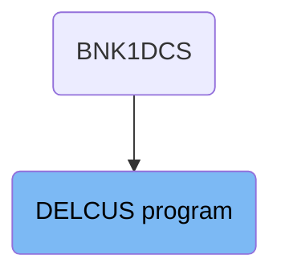

## PREMIERE

Lets' zoom into this section of the flow:

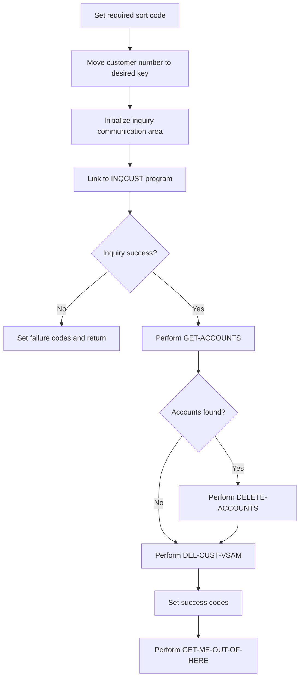

First, the required sort code is set to the value of <SwmToken path="src/base/cobol_src/DELCUS.cbl" pos="456:5:5" line-data="           MOVE CUSTOMER-SORTCODE   TO WS-STOREDC-SORTCODE">`SORTCODE`</SwmToken> to ensure the correct customer record is targeted.

Next, the customer number from <SwmToken path="src/base/cobol_src/DELCUS.cbl" pos="328:9:9" line-data="           MOVE COMM-CUSTNO OF DFHCOMMAREA">`DFHCOMMAREA`</SwmToken> is moved to the desired key to identify the specific customer record.

Then, the inquiry communication area is initialized to prepare for the customer inquiry process.

The program then links to the <SwmToken path="src/base/cobol_src/DELCUS.cbl" pos="224:3:3" line-data="       01 INQCUST-PROGRAM          PIC X(8) VALUE &#39;INQCUST &#39;.">`INQCUST`</SwmToken> program to perform the customer inquiry and retrieve customer data.

If the inquiry is unsuccessful, failure codes are set, and the program returns without proceeding further.

If the inquiry is successful, the program performs the <SwmToken path="src/base/cobol_src/DELCUS.cbl" pos="271:3:5" line-data="           PERFORM GET-ACCOUNTS">`GET-ACCOUNTS`</SwmToken> section to retrieve all accounts associated with the customer.

If accounts are found, the program performs the <SwmToken path="src/base/cobol_src/DELCUS.cbl" pos="277:3:5" line-data="             PERFORM DELETE-ACCOUNTS">`DELETE-ACCOUNTS`</SwmToken> section to delete each associated account.

After deleting the accounts, the program performs the <SwmToken path="src/base/cobol_src/DELCUS.cbl" pos="343:1:5" line-data="       DEL-CUST-VSAM SECTION.">`DEL-CUST-VSAM`</SwmToken> section to delete the customer record from the database.

## <SwmToken path="src/base/cobol_src/DELCUS.cbl" pos="271:3:5" line-data="           PERFORM GET-ACCOUNTS">`GET-ACCOUNTS`</SwmToken>

Lets' zoom into this section of the flow:

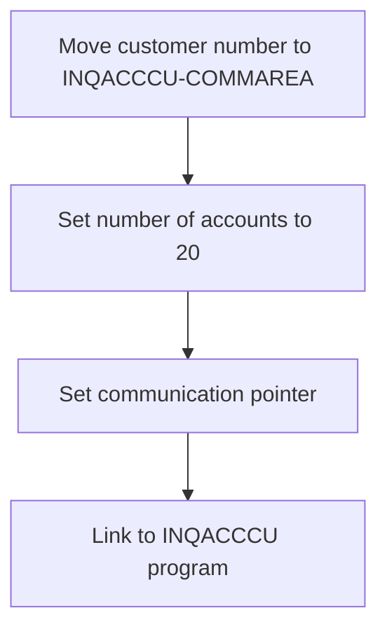

<SwmSnippet path="/src/base/cobol_src/DELCUS.cbl" line="328">

---

First, the customer number is moved from <SwmToken path="src/base/cobol_src/DELCUS.cbl" pos="328:3:5" line-data="           MOVE COMM-CUSTNO OF DFHCOMMAREA">`COMM-CUSTNO`</SwmToken> (the customer number in the communication area) to <SwmToken path="src/base/cobol_src/DELCUS.cbl" pos="329:3:5" line-data="              TO CUSTOMER-NUMBER OF INQACCCU-COMMAREA.">`CUSTOMER-NUMBER`</SwmToken> in the <SwmToken path="src/base/cobol_src/DELCUS.cbl" pos="329:9:11" line-data="              TO CUSTOMER-NUMBER OF INQACCCU-COMMAREA.">`INQACCCU-COMMAREA`</SwmToken>.

```cobol
           MOVE COMM-CUSTNO OF DFHCOMMAREA
              TO CUSTOMER-NUMBER OF INQACCCU-COMMAREA.
```

---

</SwmSnippet>

<SwmSnippet path="/src/base/cobol_src/DELCUS.cbl" line="330">

---

Next, the number of accounts to be retrieved is set to 20 in the <SwmToken path="src/base/cobol_src/DELCUS.cbl" pos="330:15:17" line-data="           MOVE 20 TO NUMBER-OF-ACCOUNTS IN INQACCCU-COMMAREA.">`INQACCCU-COMMAREA`</SwmToken>.

```cobol
           MOVE 20 TO NUMBER-OF-ACCOUNTS IN INQACCCU-COMMAREA.
```

---

</SwmSnippet>

<SwmSnippet path="/src/base/cobol_src/DELCUS.cbl" line="331">

---

Then, the communication pointer <SwmToken path="src/base/cobol_src/DELCUS.cbl" pos="331:3:7" line-data="           SET COMM-PCB-POINTER OF INQACCCU-COMMAREA">`COMM-PCB-POINTER`</SwmToken> in the <SwmToken path="src/base/cobol_src/DELCUS.cbl" pos="331:11:13" line-data="           SET COMM-PCB-POINTER OF INQACCCU-COMMAREA">`INQACCCU-COMMAREA`</SwmToken> is set to <SwmToken path="src/base/cobol_src/DELCUS.cbl" pos="332:3:7" line-data="              TO DELACC-COMM-PCB1">`DELACC-COMM-PCB1`</SwmToken>.

```cobol
           SET COMM-PCB-POINTER OF INQACCCU-COMMAREA
              TO DELACC-COMM-PCB1
```

---

</SwmSnippet>

<SwmSnippet path="/src/base/cobol_src/DELCUS.cbl" line="334">

---

Finally, the <SwmToken path="src/base/cobol_src/DELCUS.cbl" pos="334:10:10" line-data="           EXEC CICS LINK PROGRAM(&#39;INQACCCU&#39;)">`INQACCCU`</SwmToken> program is linked using the <SwmToken path="src/base/cobol_src/DELCUS.cbl" pos="334:1:5" line-data="           EXEC CICS LINK PROGRAM(&#39;INQACCCU&#39;)">`EXEC CICS LINK`</SwmToken> command, passing the <SwmToken path="src/base/cobol_src/DELCUS.cbl" pos="335:3:5" line-data="                     COMMAREA(INQACCCU-COMMAREA)">`INQACCCU-COMMAREA`</SwmToken> and ensuring synchronous return.

```cobol
           EXEC CICS LINK PROGRAM('INQACCCU')
                     COMMAREA(INQACCCU-COMMAREA)
                     SYNCONRETURN
           END-EXEC.
```

---

</SwmSnippet>

## Interim Summary

So far, we saw the detailed steps involved in the <SwmToken path="src/base/cobol_src/DELCUS.cbl" pos="271:3:5" line-data="           PERFORM GET-ACCOUNTS">`GET-ACCOUNTS`</SwmToken> section, including moving the customer number to the communication area, setting the number of accounts, and linking to the <SwmToken path="src/base/cobol_src/DELCUS.cbl" pos="329:9:9" line-data="              TO CUSTOMER-NUMBER OF INQACCCU-COMMAREA.">`INQACCCU`</SwmToken> program. We also explored the initialization of the inquiry communication area and the linking to the <SwmToken path="src/base/cobol_src/DELCUS.cbl" pos="224:3:3" line-data="       01 INQCUST-PROGRAM          PIC X(8) VALUE &#39;INQCUST &#39;.">`INQCUST`</SwmToken> program for customer data retrieval. Now, we will focus on managing customer data in the <SwmToken path="src/base/cobol_src/DELCUS.cbl" pos="343:1:5" line-data="       DEL-CUST-VSAM SECTION.">`DEL-CUST-VSAM`</SwmToken> section, which involves reading, deleting, and logging customer records.

# Manage customer data (<SwmToken path="src/base/cobol_src/DELCUS.cbl" pos="343:1:5" line-data="       DEL-CUST-VSAM SECTION.">`DEL-CUST-VSAM`</SwmToken>)

Let's split this section into smaller parts:

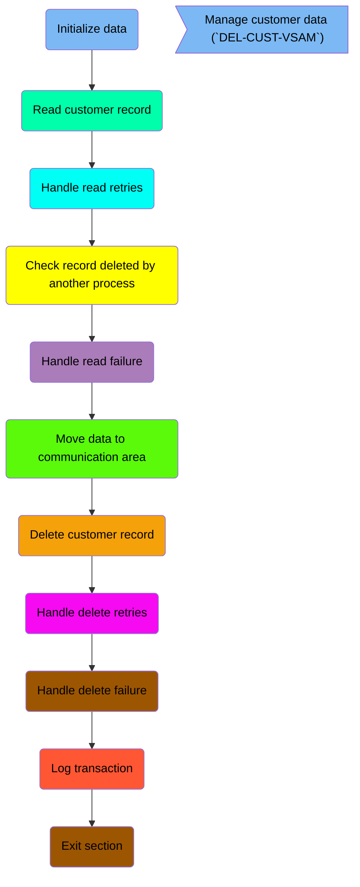

## Initialize data

First, we'll zoom into this section of the flow:

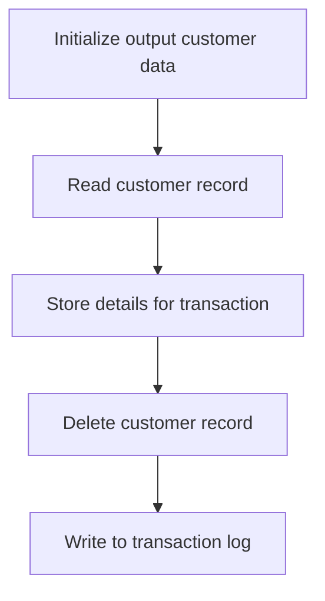

<SwmSnippet path="/src/base/cobol_src/DELCUS.cbl" line="343">

---

First, the <SwmToken path="src/base/cobol_src/DELCUS.cbl" pos="343:1:5" line-data="       DEL-CUST-VSAM SECTION.">`DEL-CUST-VSAM`</SwmToken> section initializes the <SwmToken path="src/base/cobol_src/DELCUS.cbl" pos="351:3:7" line-data="           INITIALIZE OUTPUT-CUST-DATA.">`OUTPUT-CUST-DATA`</SwmToken> structure, which is used to store customer data that will be included in the transaction log.

```cobol
       DEL-CUST-VSAM SECTION.
       DCV010.

      *
      *    Read the CUSTOMER record and store the details
      *    for inclusion on PROCTRAN later, then delete the CUSTOMER
      *    record and write to PROCTRAN.
      *
           INITIALIZE OUTPUT-CUST-DATA.
```

---

</SwmSnippet>

## Read customer record

This is the next section of the flow.

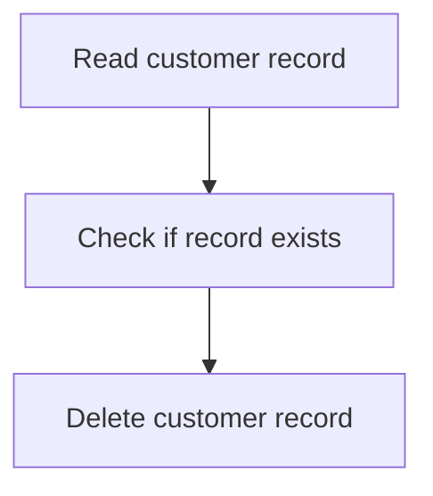

<SwmSnippet path="/src/base/cobol_src/DELCUS.cbl" line="353">

---

The <SwmToken path="src/base/cobol_src/DELCUS.cbl" pos="343:1:5" line-data="       DEL-CUST-VSAM SECTION.">`DEL-CUST-VSAM`</SwmToken> function is responsible for deleting customer records from the VSAM file. It begins by reading the customer record from the file <SwmToken path="src/base/cobol_src/DELCUS.cbl" pos="353:10:10" line-data="           EXEC CICS READ FILE(&#39;CUSTOMER&#39;)">`CUSTOMER`</SwmToken> using the <SwmToken path="src/base/cobol_src/DELCUS.cbl" pos="353:5:5" line-data="           EXEC CICS READ FILE(&#39;CUSTOMER&#39;)">`READ`</SwmToken> command. The <SwmToken path="src/base/cobol_src/DELCUS.cbl" pos="354:1:1" line-data="                RIDFLD(DESIRED-KEY)">`RIDFLD`</SwmToken> parameter specifies the record identifier field, which is <SwmToken path="src/base/cobol_src/DELCUS.cbl" pos="354:3:5" line-data="                RIDFLD(DESIRED-KEY)">`DESIRED-KEY`</SwmToken> in this case. The <SwmToken path="src/base/cobol_src/DELCUS.cbl" pos="355:1:1" line-data="                INTO(OUTPUT-CUST-DATA)">`INTO`</SwmToken> parameter indicates that the data read from the file will be stored in <SwmToken path="src/base/cobol_src/DELCUS.cbl" pos="355:3:7" line-data="                INTO(OUTPUT-CUST-DATA)">`OUTPUT-CUST-DATA`</SwmToken>. The <SwmToken path="src/base/cobol_src/DELCUS.cbl" pos="356:1:1" line-data="                UPDATE">`UPDATE`</SwmToken> option allows the record to be updated or deleted. The <SwmToken path="src/base/cobol_src/DELCUS.cbl" pos="357:1:1" line-data="                TOKEN(WS-TOKEN)">`TOKEN`</SwmToken> parameter is used to pass a unique identifier for the operation, stored in <SwmToken path="src/base/cobol_src/DELCUS.cbl" pos="357:3:5" line-data="                TOKEN(WS-TOKEN)">`WS-TOKEN`</SwmToken>. The <SwmToken path="src/base/cobol_src/DELCUS.cbl" pos="358:1:1" line-data="                RESP(WS-CICS-RESP)">`RESP`</SwmToken> and <SwmToken path="src/base/cobol_src/DELCUS.cbl" pos="359:1:1" line-data="                RESP2(WS-CICS-RESP2)">`RESP2`</SwmToken> parameters are used to capture the response codes from the CICS command, stored in <SwmToken path="src/base/cobol_src/DELCUS.cbl" pos="358:3:7" line-data="                RESP(WS-CICS-RESP)">`WS-CICS-RESP`</SwmToken> and <SwmToken path="src/base/cobol_src/DELCUS.cbl" pos="359:3:7" line-data="                RESP2(WS-CICS-RESP2)">`WS-CICS-RESP2`</SwmToken> respectively.

```cobol
           EXEC CICS READ FILE('CUSTOMER')
                RIDFLD(DESIRED-KEY)
                INTO(OUTPUT-CUST-DATA)
                UPDATE
                TOKEN(WS-TOKEN)
                RESP(WS-CICS-RESP)
                RESP2(WS-CICS-RESP2)
           END-EXEC.
```

---

</SwmSnippet>

## Handle read retries

This is the next section of the flow.

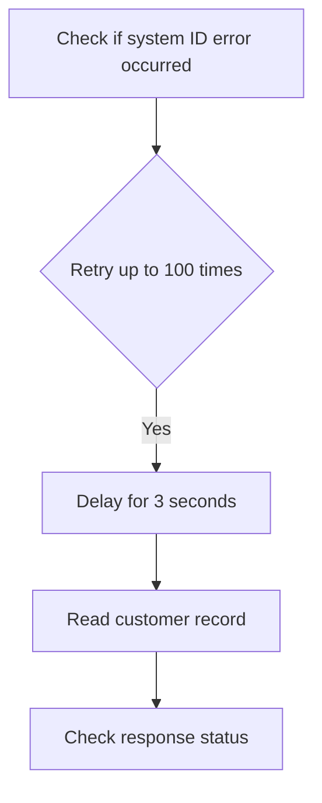

<SwmSnippet path="/src/base/cobol_src/DELCUS.cbl" line="362">

---

First, the code checks if there is a system ID error by evaluating if <SwmToken path="src/base/cobol_src/DELCUS.cbl" pos="362:3:7" line-data="           IF WS-CICS-RESP = DFHRESP(SYSIDERR)">`WS-CICS-RESP`</SwmToken> is equal to <SwmToken path="src/base/cobol_src/DELCUS.cbl" pos="362:11:14" line-data="           IF WS-CICS-RESP = DFHRESP(SYSIDERR)">`DFHRESP(SYSIDERR)`</SwmToken>.

```cobol
           IF WS-CICS-RESP = DFHRESP(SYSIDERR)
```

---

</SwmSnippet>

<SwmSnippet path="/src/base/cobol_src/DELCUS.cbl" line="363">

---

Next, if a system ID error is detected, the code enters a loop that retries up to 100 times or until the response is normal or different from a system ID error. During each iteration, it delays for 3 seconds before attempting to read the customer record again.

```cobol
              PERFORM VARYING SYSIDERR-RETRY FROM 1 BY 1
              UNTIL SYSIDERR-RETRY > 100
              OR WS-CICS-RESP = DFHRESP(NORMAL)
              OR WS-CICS-RESP IS NOT EQUAL TO DFHRESP(SYSIDERR)

                 EXEC CICS DELAY FOR SECONDS(3)
                 END-EXEC

```

---

</SwmSnippet>

<SwmSnippet path="/src/base/cobol_src/DELCUS.cbl" line="371">

---

Then, the code attempts to read the customer record from the 'CUSTOMER' file into <SwmToken path="src/base/cobol_src/DELCUS.cbl" pos="373:3:7" line-data="                    INTO(OUTPUT-CUST-DATA)">`OUTPUT-CUST-DATA`</SwmToken>, allowing for updates and capturing the response in <SwmToken path="src/base/cobol_src/DELCUS.cbl" pos="376:3:7" line-data="                    RESP(WS-CICS-RESP)">`WS-CICS-RESP`</SwmToken> and <SwmToken path="src/base/cobol_src/DELCUS.cbl" pos="377:3:7" line-data="                    RESP2(WS-CICS-RESP2)">`WS-CICS-RESP2`</SwmToken>.

```cobol
                 EXEC CICS READ FILE('CUSTOMER')
                    RIDFLD(DESIRED-KEY)
                    INTO(OUTPUT-CUST-DATA)
                    UPDATE
                    TOKEN(WS-TOKEN)
                    RESP(WS-CICS-RESP)
                    RESP2(WS-CICS-RESP2)
                 END-EXEC
```

---

</SwmSnippet>

## Check record deleted by another process

This is the next section of the flow.

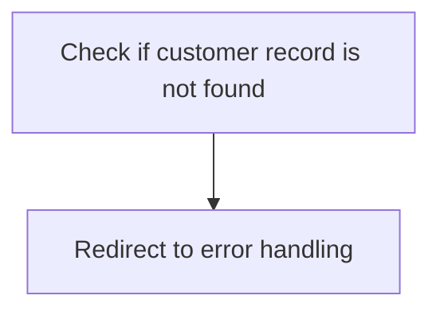

<SwmSnippet path="/src/base/cobol_src/DELCUS.cbl" line="384">

---

First, the code checks if <SwmToken path="src/base/cobol_src/DELCUS.cbl" pos="384:3:7" line-data="           IF WS-CICS-RESP = DFHRESP(NOTFND)">`WS-CICS-RESP`</SwmToken> (the response code from the CICS operation) is equal to <SwmToken path="src/base/cobol_src/DELCUS.cbl" pos="384:11:14" line-data="           IF WS-CICS-RESP = DFHRESP(NOTFND)">`DFHRESP(NOTFND)`</SwmToken> (indicating that the customer record was not found).

```cobol
           IF WS-CICS-RESP = DFHRESP(NOTFND)
```

---

</SwmSnippet>

<SwmSnippet path="/src/base/cobol_src/DELCUS.cbl" line="388">

---

Then, if the customer record is not found, the code redirects to the <SwmToken path="src/base/cobol_src/DELCUS.cbl" pos="388:5:5" line-data="              GO TO DCV999">`DCV999`</SwmToken> section, which handles the error scenario where the record has already been deleted by someone else.

```cobol
              GO TO DCV999
           END-IF
```

---

</SwmSnippet>

## Handle read failure

Now, lets zoom into this section of the flow:

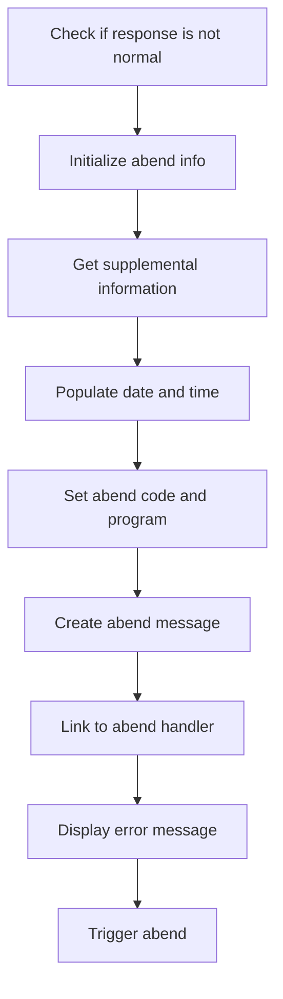

<SwmSnippet path="/src/base/cobol_src/DELCUS.cbl" line="391">

---

First, the code checks if <SwmToken path="src/base/cobol_src/DELCUS.cbl" pos="391:3:7" line-data="           IF WS-CICS-RESP NOT = DFHRESP(NORMAL)">`WS-CICS-RESP`</SwmToken> (which holds the CICS response code) is not equal to <SwmToken path="src/base/cobol_src/DELCUS.cbl" pos="391:13:16" line-data="           IF WS-CICS-RESP NOT = DFHRESP(NORMAL)">`DFHRESP(NORMAL)`</SwmToken> (indicating a normal response).

```cobol
           IF WS-CICS-RESP NOT = DFHRESP(NORMAL)
```

---

</SwmSnippet>

<SwmSnippet path="/src/base/cobol_src/DELCUS.cbl" line="398">

---

Moving to the next step, the code initializes the <SwmToken path="src/base/cobol_src/DELCUS.cbl" pos="398:3:5" line-data="              INITIALIZE ABNDINFO-REC">`ABNDINFO-REC`</SwmToken> (which holds abend information) to prepare for capturing abend details.

```cobol
              INITIALIZE ABNDINFO-REC
```

---

</SwmSnippet>

<SwmSnippet path="/src/base/cobol_src/DELCUS.cbl" line="399">

---

Next, it moves <SwmToken path="src/base/cobol_src/DELCUS.cbl" pos="399:3:3" line-data="              MOVE EIBRESP    TO ABND-RESPCODE">`EIBRESP`</SwmToken> (the CICS response code) and <SwmToken path="src/base/cobol_src/DELCUS.cbl" pos="400:3:3" line-data="              MOVE EIBRESP2   TO ABND-RESP2CODE">`EIBRESP2`</SwmToken> (the second CICS response code) to <SwmToken path="src/base/cobol_src/DELCUS.cbl" pos="399:7:9" line-data="              MOVE EIBRESP    TO ABND-RESPCODE">`ABND-RESPCODE`</SwmToken> and <SwmToken path="src/base/cobol_src/DELCUS.cbl" pos="400:7:9" line-data="              MOVE EIBRESP2   TO ABND-RESP2CODE">`ABND-RESP2CODE`</SwmToken> respectively for abend reporting.

```cobol
              MOVE EIBRESP    TO ABND-RESPCODE
              MOVE EIBRESP2   TO ABND-RESP2CODE
```

---

</SwmSnippet>

<SwmSnippet path="/src/base/cobol_src/DELCUS.cbl" line="404">

---

Then, the code retrieves supplemental information such as the application ID, task number, and transaction ID, and stores them in the abend information record.

```cobol
              EXEC CICS ASSIGN APPLID(ABND-APPLID)
              END-EXEC

              MOVE EIBTASKN   TO ABND-TASKNO-KEY
              MOVE EIBTRNID   TO ABND-TRANID

```

---

</SwmSnippet>

<SwmSnippet path="/src/base/cobol_src/DELCUS.cbl" line="410">

---

Going into the next step, the code performs the <SwmToken path="src/base/cobol_src/DELCUS.cbl" pos="410:3:7" line-data="              PERFORM POPULATE-TIME-DATE">`POPULATE-TIME-DATE`</SwmToken> routine to get the current date and time, and formats them into the abend information record.

```cobol
              PERFORM POPULATE-TIME-DATE

              MOVE WS-ORIG-DATE TO ABND-DATE
              STRING WS-TIME-NOW-GRP-HH DELIMITED BY SIZE,
                    ':' DELIMITED BY SIZE,
                     WS-TIME-NOW-GRP-MM DELIMITED BY SIZE,
                     ':' DELIMITED BY SIZE,
                     WS-TIME-NOW-GRP-MM DELIMITED BY SIZE
                     INTO ABND-TIME
```

---

</SwmSnippet>

<SwmSnippet path="/src/base/cobol_src/DELCUS.cbl" line="422">

---

The code then sets the abend code to <SwmToken path="src/base/cobol_src/DELCUS.cbl" pos="422:4:4" line-data="              MOVE &#39;WPV6&#39;      TO ABND-CODE">`WPV6`</SwmToken> and retrieves the current program name, storing it in the abend information record.

```cobol
              MOVE 'WPV6'      TO ABND-CODE

              EXEC CICS ASSIGN PROGRAM(ABND-PROGRAM)
              END-EXEC
```

---

</SwmSnippet>

<SwmSnippet path="/src/base/cobol_src/DELCUS.cbl" line="429">

---

Next, it constructs a detailed abend message string that includes the error code, response codes, and the key of the record that failed to be read.

```cobol
              STRING 'DCV010 - Unable to READ CUSTOMER VSAM rec '
                    DELIMITED BY SIZE,
                    'for key:' DESIRED-KEY DELIMITED BY SIZE,
                    ' EIBRESP=' DELIMITED BY SIZE,
                    ABND-RESPCODE DELIMITED BY SIZE,
                    ' RESP2=' DELIMITED BY SIZE,
                    ABND-RESP2CODE DELIMITED BY SIZE
                    INTO ABND-FREEFORM
```

---

</SwmSnippet>

<SwmSnippet path="/src/base/cobol_src/DELCUS.cbl" line="439">

---

Then, the code links to the abend handler program, passing the abend information record to handle the abend processing.

```cobol
              EXEC CICS LINK PROGRAM(WS-ABEND-PGM)
                        COMMAREA(ABNDINFO-REC)
              END-EXEC
```

---

</SwmSnippet>

<SwmSnippet path="/src/base/cobol_src/DELCUS.cbl" line="443">

---

Finally, the code displays an error message indicating the failure to read the customer VSAM record and triggers an abend with the code <SwmToken path="src/base/cobol_src/DELCUS.cbl" pos="449:5:5" line-data="                 ABCODE (&#39;WPV6&#39;)">`WPV6`</SwmToken>.

```cobol
              DISPLAY 'In DELCUS (DCV010) '
              'UNABLE TO READ CUSTOMER VSAM REC'
              ' RESP CODE=' WS-CICS-RESP, ' RESP2=' WS-CICS-RESP2
              'FOR KEY=' DESIRED-KEY

              EXEC CICS ABEND
                 ABCODE ('WPV6')
              END-EXEC
```

---

</SwmSnippet>

## Move data to communication area

This is the next section of the flow.

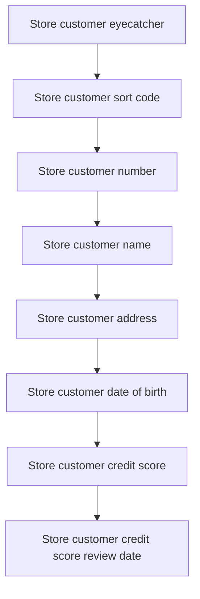

<SwmSnippet path="/src/base/cobol_src/DELCUS.cbl" line="454">

---

First, the customer's eyecatcher is stored in the communication area. This is done by moving the <SwmToken path="src/base/cobol_src/DELCUS.cbl" pos="454:3:5" line-data="           MOVE CUSTOMER-EYECATCHER TO WS-STOREDC-EYECATCHER">`CUSTOMER-EYECATCHER`</SwmToken> to <SwmToken path="src/base/cobol_src/DELCUS.cbl" pos="454:9:13" line-data="           MOVE CUSTOMER-EYECATCHER TO WS-STOREDC-EYECATCHER">`WS-STOREDC-EYECATCHER`</SwmToken> and <SwmToken path="src/base/cobol_src/DELCUS.cbl" pos="455:1:3" line-data="                                        COMM-EYE IN DFHCOMMAREA.">`COMM-EYE`</SwmToken> in <SwmToken path="src/base/cobol_src/DELCUS.cbl" pos="455:7:7" line-data="                                        COMM-EYE IN DFHCOMMAREA.">`DFHCOMMAREA`</SwmToken>.

```cobol
           MOVE CUSTOMER-EYECATCHER TO WS-STOREDC-EYECATCHER
                                        COMM-EYE IN DFHCOMMAREA.
```

---

</SwmSnippet>

<SwmSnippet path="/src/base/cobol_src/DELCUS.cbl" line="456">

---

Next, the customer's sort code is stored by moving <SwmToken path="src/base/cobol_src/DELCUS.cbl" pos="456:3:5" line-data="           MOVE CUSTOMER-SORTCODE   TO WS-STOREDC-SORTCODE">`CUSTOMER-SORTCODE`</SwmToken> to <SwmToken path="src/base/cobol_src/DELCUS.cbl" pos="456:9:13" line-data="           MOVE CUSTOMER-SORTCODE   TO WS-STOREDC-SORTCODE">`WS-STOREDC-SORTCODE`</SwmToken> and <SwmToken path="src/base/cobol_src/DELCUS.cbl" pos="457:1:3" line-data="                                       COMM-SCODE IN DFHCOMMAREA.">`COMM-SCODE`</SwmToken> in <SwmToken path="src/base/cobol_src/DELCUS.cbl" pos="457:7:7" line-data="                                       COMM-SCODE IN DFHCOMMAREA.">`DFHCOMMAREA`</SwmToken>.

```cobol
           MOVE CUSTOMER-SORTCODE   TO WS-STOREDC-SORTCODE
                                       COMM-SCODE IN DFHCOMMAREA.
```

---

</SwmSnippet>

<SwmSnippet path="/src/base/cobol_src/DELCUS.cbl" line="458">

---

Then, the customer's number is stored by moving <SwmToken path="src/base/cobol_src/DELCUS.cbl" pos="458:3:5" line-data="           MOVE CUSTOMER-NUMBER OF CUSTOMER-RECORD">`CUSTOMER-NUMBER`</SwmToken> to <SwmToken path="src/base/cobol_src/DELCUS.cbl" pos="459:3:7" line-data="              TO WS-STOREDC-NUMBER COMM-CUSTNO IN DFHCOMMAREA.">`WS-STOREDC-NUMBER`</SwmToken> and <SwmToken path="src/base/cobol_src/DELCUS.cbl" pos="459:9:11" line-data="              TO WS-STOREDC-NUMBER COMM-CUSTNO IN DFHCOMMAREA.">`COMM-CUSTNO`</SwmToken> in <SwmToken path="src/base/cobol_src/DELCUS.cbl" pos="459:15:15" line-data="              TO WS-STOREDC-NUMBER COMM-CUSTNO IN DFHCOMMAREA.">`DFHCOMMAREA`</SwmToken>.

```cobol
           MOVE CUSTOMER-NUMBER OF CUSTOMER-RECORD
              TO WS-STOREDC-NUMBER COMM-CUSTNO IN DFHCOMMAREA.
```

---

</SwmSnippet>

## Delete customer record

This is the next section of the flow.

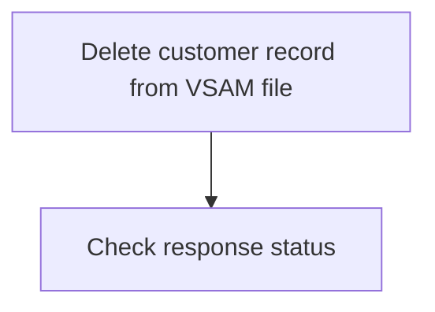

<SwmSnippet path="/src/base/cobol_src/DELCUS.cbl" line="491">

---

### Deleting a customer record from the VSAM file

The <SwmToken path="src/base/cobol_src/DELCUS.cbl" pos="343:1:5" line-data="       DEL-CUST-VSAM SECTION.">`DEL-CUST-VSAM`</SwmToken> function is responsible for deleting a customer record from the VSAM file named 'CUSTOMER'. This is achieved by executing a CICS <SwmToken path="src/base/cobol_src/DELCUS.cbl" pos="492:1:1" line-data="              DELETE FILE (&#39;CUSTOMER&#39;)">`DELETE`</SwmToken> command, which specifies the file to delete from and uses a token (<SwmToken path="src/base/cobol_src/DELCUS.cbl" pos="493:3:5" line-data="              TOKEN(WS-TOKEN)">`WS-TOKEN`</SwmToken>) to identify the specific record. The response of the delete operation is captured in <SwmToken path="src/base/cobol_src/DELCUS.cbl" pos="494:3:7" line-data="              RESP(WS-CICS-RESP)">`WS-CICS-RESP`</SwmToken> and <SwmToken path="src/base/cobol_src/DELCUS.cbl" pos="495:3:7" line-data="              RESP2(WS-CICS-RESP2)">`WS-CICS-RESP2`</SwmToken> to handle any potential issues or errors that may arise during the deletion process.

```cobol
           EXEC CICS
              DELETE FILE ('CUSTOMER')
              TOKEN(WS-TOKEN)
              RESP(WS-CICS-RESP)
              RESP2(WS-CICS-RESP2)
           END-EXEC.
```

---

</SwmSnippet>

## Handle delete retries

This is the next section of the flow.

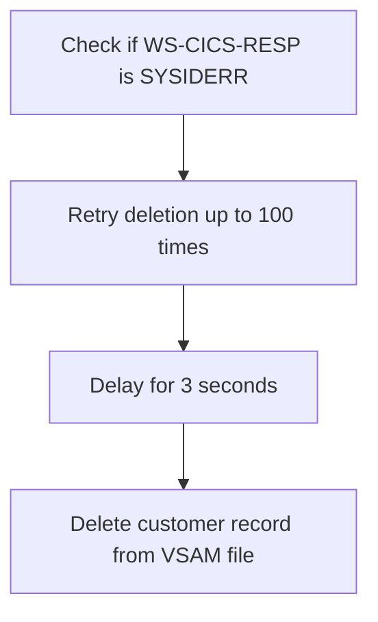

<SwmSnippet path="/src/base/cobol_src/DELCUS.cbl" line="498">

---

First, the code checks if <SwmToken path="src/base/cobol_src/DELCUS.cbl" pos="498:3:7" line-data="           IF WS-CICS-RESP = DFHRESP(SYSIDERR)">`WS-CICS-RESP`</SwmToken> (which holds the CICS response code) is equal to <SwmToken path="src/base/cobol_src/DELCUS.cbl" pos="498:11:14" line-data="           IF WS-CICS-RESP = DFHRESP(SYSIDERR)">`DFHRESP(SYSIDERR)`</SwmToken> (indicating a system ID error).

```cobol
           IF WS-CICS-RESP = DFHRESP(SYSIDERR)

```

---

</SwmSnippet>

<SwmSnippet path="/src/base/cobol_src/DELCUS.cbl" line="500">

---

Next, if a system ID error is detected, the code performs a loop that retries the deletion operation up to 100 times or until the response code is no longer a system ID error or becomes normal.

```cobol
              PERFORM VARYING SYSIDERR-RETRY FROM 1 BY 1
              UNTIL SYSIDERR-RETRY > 100
              OR WS-CICS-RESP = DFHRESP(NORMAL)
              OR WS-CICS-RESP IS NOT EQUAL TO DFHRESP(SYSIDERR)
```

---

</SwmSnippet>

<SwmSnippet path="/src/base/cobol_src/DELCUS.cbl" line="505">

---

Then, within the retry loop, the code introduces a delay of 3 seconds before attempting to delete the customer record from the VSAM file again.

```cobol
                 EXEC CICS DELAY FOR SECONDS(3)
                 END-EXEC
```

---

</SwmSnippet>

<SwmSnippet path="/src/base/cobol_src/DELCUS.cbl" line="508">

---

Finally, the code executes the CICS <SwmToken path="src/base/cobol_src/DELCUS.cbl" pos="508:5:5" line-data="                 EXEC CICS DELETE FILE (&#39;CUSTOMER&#39;)">`DELETE`</SwmToken> command to remove the customer record from the VSAM file, using the <SwmToken path="src/base/cobol_src/DELCUS.cbl" pos="509:3:5" line-data="                    TOKEN(WS-TOKEN)">`WS-TOKEN`</SwmToken> (which holds the token for the operation) and capturing the response codes in <SwmToken path="src/base/cobol_src/DELCUS.cbl" pos="510:3:7" line-data="                    RESP(WS-CICS-RESP)">`WS-CICS-RESP`</SwmToken> and <SwmToken path="src/base/cobol_src/DELCUS.cbl" pos="511:3:7" line-data="                    RESP2(WS-CICS-RESP2)">`WS-CICS-RESP2`</SwmToken>.

```cobol
                 EXEC CICS DELETE FILE ('CUSTOMER')
                    TOKEN(WS-TOKEN)
                    RESP(WS-CICS-RESP)
                    RESP2(WS-CICS-RESP2)
                 END-EXEC
```

---

</SwmSnippet>

## Handle delete failure

Now, lets zoom into this section of the flow:

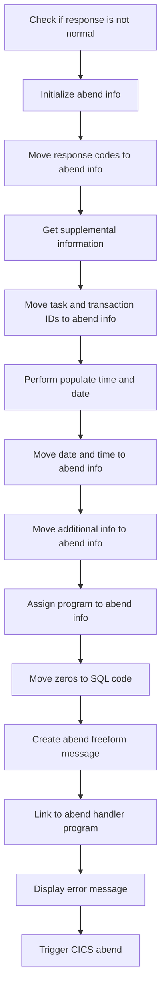

First, the code checks if the response code <SwmToken path="src/base/cobol_src/DELCUS.cbl" pos="358:3:7" line-data="                RESP(WS-CICS-RESP)">`WS-CICS-RESP`</SwmToken> is not equal to <SwmToken path="src/base/cobol_src/DELCUS.cbl" pos="365:11:14" line-data="              OR WS-CICS-RESP = DFHRESP(NORMAL)">`DFHRESP(NORMAL)`</SwmToken>, indicating an abnormal condition.

Moving to the next step, the abend information record <SwmToken path="src/base/cobol_src/DELCUS.cbl" pos="398:3:5" line-data="              INITIALIZE ABNDINFO-REC">`ABNDINFO-REC`</SwmToken> is initialized to prepare for capturing error details.

Next, the response codes <SwmToken path="src/base/cobol_src/DELCUS.cbl" pos="399:3:3" line-data="              MOVE EIBRESP    TO ABND-RESPCODE">`EIBRESP`</SwmToken> and <SwmToken path="src/base/cobol_src/DELCUS.cbl" pos="400:3:3" line-data="              MOVE EIBRESP2   TO ABND-RESP2CODE">`EIBRESP2`</SwmToken> are moved to <SwmToken path="src/base/cobol_src/DELCUS.cbl" pos="399:7:9" line-data="              MOVE EIBRESP    TO ABND-RESPCODE">`ABND-RESPCODE`</SwmToken> and <SwmToken path="src/base/cobol_src/DELCUS.cbl" pos="400:7:9" line-data="              MOVE EIBRESP2   TO ABND-RESP2CODE">`ABND-RESP2CODE`</SwmToken> respectively, preserving the error codes for further processing.

Then, supplemental information is gathered by assigning the application ID to <SwmToken path="src/base/cobol_src/DELCUS.cbl" pos="404:9:11" line-data="              EXEC CICS ASSIGN APPLID(ABND-APPLID)">`ABND-APPLID`</SwmToken> using the <SwmToken path="src/base/cobol_src/DELCUS.cbl" pos="404:1:5" line-data="              EXEC CICS ASSIGN APPLID(ABND-APPLID)">`EXEC CICS ASSIGN`</SwmToken> command.

Following this, the task number and transaction ID are moved to <SwmToken path="src/base/cobol_src/DELCUS.cbl" pos="407:7:11" line-data="              MOVE EIBTASKN   TO ABND-TASKNO-KEY">`ABND-TASKNO-KEY`</SwmToken> and <SwmToken path="src/base/cobol_src/DELCUS.cbl" pos="408:7:9" line-data="              MOVE EIBTRNID   TO ABND-TRANID">`ABND-TRANID`</SwmToken> respectively, capturing the context of the error.

The <SwmToken path="src/base/cobol_src/DELCUS.cbl" pos="410:3:7" line-data="              PERFORM POPULATE-TIME-DATE">`POPULATE-TIME-DATE`</SwmToken> routine is performed to get the current date and time, which are then moved to <SwmToken path="src/base/cobol_src/DELCUS.cbl" pos="412:11:13" line-data="              MOVE WS-ORIG-DATE TO ABND-DATE">`ABND-DATE`</SwmToken> and <SwmToken path="src/base/cobol_src/DELCUS.cbl" pos="418:3:5" line-data="                     INTO ABND-TIME">`ABND-TIME`</SwmToken>.

Additional information such as <SwmToken path="src/base/cobol_src/DELCUS.cbl" pos="614:3:7" line-data="              ABSTIME(WS-U-TIME)">`WS-U-TIME`</SwmToken> and a specific abend code <SwmToken path="src/base/cobol_src/DELCUS.cbl" pos="548:4:4" line-data="              MOVE &#39;WPV7&#39;      TO ABND-CODE">`WPV7`</SwmToken> are moved to <SwmToken path="src/base/cobol_src/DELCUS.cbl" pos="421:11:15" line-data="              MOVE WS-U-TIME   TO ABND-UTIME-KEY">`ABND-UTIME-KEY`</SwmToken> and <SwmToken path="src/base/cobol_src/DELCUS.cbl" pos="422:9:11" line-data="              MOVE &#39;WPV6&#39;      TO ABND-CODE">`ABND-CODE`</SwmToken> respectively.

The program name is assigned to <SwmToken path="src/base/cobol_src/DELCUS.cbl" pos="424:9:11" line-data="              EXEC CICS ASSIGN PROGRAM(ABND-PROGRAM)">`ABND-PROGRAM`</SwmToken> using another <SwmToken path="src/base/cobol_src/DELCUS.cbl" pos="404:1:5" line-data="              EXEC CICS ASSIGN APPLID(ABND-APPLID)">`EXEC CICS ASSIGN`</SwmToken> command.

Zeros are moved to <SwmToken path="src/base/cobol_src/DELCUS.cbl" pos="703:9:11" line-data="              MOVE SQLCODE-DISPLAY   TO ABND-SQLCODE">`ABND-SQLCODE`</SwmToken> to indicate no SQL error occurred.

A detailed freeform message is created by concatenating various strings and variables into <SwmToken path="src/base/cobol_src/DELCUS.cbl" pos="436:3:5" line-data="                    INTO ABND-FREEFORM">`ABND-FREEFORM`</SwmToken>, providing a comprehensive error description.

The abend handler program is linked using <SwmToken path="src/base/cobol_src/DELCUS.cbl" pos="334:1:5" line-data="           EXEC CICS LINK PROGRAM(&#39;INQACCCU&#39;)">`EXEC CICS LINK`</SwmToken>, passing the <SwmToken path="src/base/cobol_src/DELCUS.cbl" pos="398:3:5" line-data="              INITIALIZE ABNDINFO-REC">`ABNDINFO-REC`</SwmToken> as the communication area.

An error message is displayed, indicating the failure to delete the customer VSAM record along with the response codes and key.

## Log transaction

Now, lets zoom into this section of the flow:

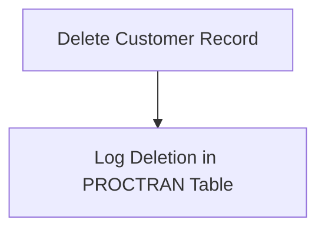

<SwmSnippet path="/src/base/cobol_src/DELCUS.cbl" line="580">

---

The <SwmToken path="src/base/cobol_src/DELCUS.cbl" pos="343:1:5" line-data="       DEL-CUST-VSAM SECTION.">`DEL-CUST-VSAM`</SwmToken> function logs the deletion of a customer record by performing database operations. It calls the <SwmToken path="src/base/cobol_src/DELCUS.cbl" pos="580:3:7" line-data="           PERFORM WRITE-PROCTRAN-CUST.">`WRITE-PROCTRAN-CUST`</SwmToken> section, which initializes transaction-related fields, captures the date and time, and inserts a transaction record into the PROCTRAN <SwmToken path="src/base/cobol_src/DELCUS.cbl" pos="592:9:9" line-data="              PERFORM WRITE-PROCTRAN-CUST-DB2.">`DB2`</SwmToken> table. This ensures that the deletion is properly recorded for auditing and tracking purposes.

```cobol
           PERFORM WRITE-PROCTRAN-CUST.

```

---

</SwmSnippet>

## Exit section

This is the next section of the flow.

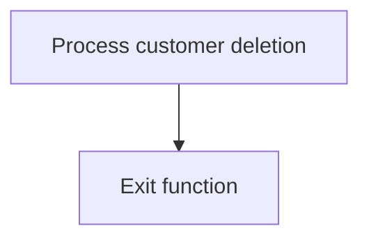

<SwmSnippet path="/src/base/cobol_src/DELCUS.cbl" line="582">

---

The <SwmToken path="src/base/cobol_src/DELCUS.cbl" pos="582:1:1" line-data="       DCV999.">`DCV999`</SwmToken> label marks the end of the <SwmToken path="src/base/cobol_src/DELCUS.cbl" pos="343:1:5" line-data="       DEL-CUST-VSAM SECTION.">`DEL-CUST-VSAM`</SwmToken> function, indicating that all necessary operations for deleting a customer from the VSAM database have been completed. The <SwmToken path="src/base/cobol_src/DELCUS.cbl" pos="583:1:1" line-data="           EXIT.">`EXIT`</SwmToken> statement ensures that the program control is returned to the calling program or the next sequential instruction, effectively concluding the customer deletion process.

```cobol
       DCV999.
           EXIT.
```

---

</SwmSnippet>

## <SwmToken path="src/base/cobol_src/DELCUS.cbl" pos="410:3:7" line-data="              PERFORM POPULATE-TIME-DATE">`POPULATE-TIME-DATE`</SwmToken>

Lets' zoom into this section of the flow:

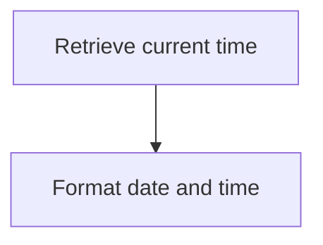

<SwmSnippet path="/src/base/cobol_src/DELCUS.cbl" line="749">

---

### Retrieving current time

First, the <SwmToken path="src/base/cobol_src/DELCUS.cbl" pos="410:3:7" line-data="              PERFORM POPULATE-TIME-DATE">`POPULATE-TIME-DATE`</SwmToken> function retrieves the current time using the <SwmToken path="src/base/cobol_src/DELCUS.cbl" pos="749:1:5" line-data="           EXEC CICS ASKTIME">`EXEC CICS ASKTIME`</SwmToken> command. This command stores the current time in the <SwmToken path="src/base/cobol_src/DELCUS.cbl" pos="750:3:7" line-data="              ABSTIME(WS-U-TIME)">`WS-U-TIME`</SwmToken> variable (which holds the absolute time).

```cobol
           EXEC CICS ASKTIME
              ABSTIME(WS-U-TIME)
           END-EXEC.
```

---

</SwmSnippet>

<SwmSnippet path="/src/base/cobol_src/DELCUS.cbl" line="753">

---

### Formatting date and time

Next, the function formats the retrieved time into a human-readable date and time format using the <SwmToken path="src/base/cobol_src/DELCUS.cbl" pos="753:1:5" line-data="           EXEC CICS FORMATTIME">`EXEC CICS FORMATTIME`</SwmToken> command. This command converts the absolute time in <SwmToken path="src/base/cobol_src/DELCUS.cbl" pos="754:3:7" line-data="                     ABSTIME(WS-U-TIME)">`WS-U-TIME`</SwmToken> to a date in <SwmToken path="src/base/cobol_src/DELCUS.cbl" pos="755:3:7" line-data="                     DDMMYYYY(WS-ORIG-DATE)">`WS-ORIG-DATE`</SwmToken> and a time in <SwmToken path="src/base/cobol_src/DELCUS.cbl" pos="756:3:7" line-data="                     TIME(WS-TIME-NOW)">`WS-TIME-NOW`</SwmToken>.

```cobol
           EXEC CICS FORMATTIME
                     ABSTIME(WS-U-TIME)
                     DDMMYYYY(WS-ORIG-DATE)
                     TIME(WS-TIME-NOW)
                     DATESEP
           END-EXEC.
```

---

</SwmSnippet>

## <SwmToken path="src/base/cobol_src/DELCUS.cbl" pos="580:3:7" line-data="           PERFORM WRITE-PROCTRAN-CUST.">`WRITE-PROCTRAN-CUST`</SwmToken>

Lets' zoom into this section of the flow:

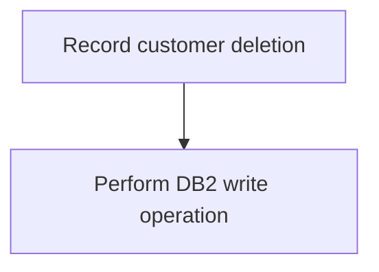

<SwmSnippet path="/src/base/cobol_src/DELCUS.cbl" line="586">

---

First, the <SwmToken path="src/base/cobol_src/DELCUS.cbl" pos="586:1:5" line-data="       WRITE-PROCTRAN-CUST SECTION.">`WRITE-PROCTRAN-CUST`</SwmToken> section is responsible for recording the deletion of a customer in the transaction log. This ensures that there is a record of the deletion for auditing and tracking purposes.

```cobol
       WRITE-PROCTRAN-CUST SECTION.
       WPC010.

      *
      *    Record the CUSTOMER deletion on PROCTRAN
```

---

</SwmSnippet>

<SwmSnippet path="/src/base/cobol_src/DELCUS.cbl" line="592">

---

Next, the section performs the <SwmToken path="src/base/cobol_src/DELCUS.cbl" pos="592:3:9" line-data="              PERFORM WRITE-PROCTRAN-CUST-DB2.">`WRITE-PROCTRAN-CUST-DB2`</SwmToken> operation, which involves writing the transaction details to the PROCTRAN <SwmToken path="src/base/cobol_src/DELCUS.cbl" pos="592:9:9" line-data="              PERFORM WRITE-PROCTRAN-CUST-DB2.">`DB2`</SwmToken> table. This step is crucial for maintaining the integrity of transaction records in the database.

```cobol
              PERFORM WRITE-PROCTRAN-CUST-DB2.
       WPC999.
           EXIT.
```

---

</SwmSnippet>

## <SwmToken path="src/base/cobol_src/DELCUS.cbl" pos="592:3:9" line-data="              PERFORM WRITE-PROCTRAN-CUST-DB2.">`WRITE-PROCTRAN-CUST-DB2`</SwmToken>

Lets' zoom into this section of the flow:

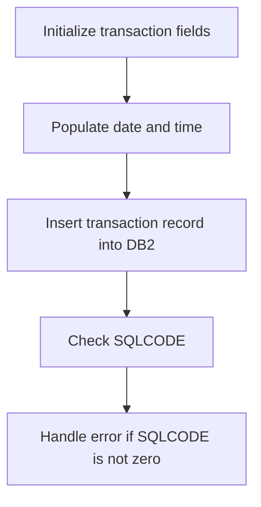

<SwmSnippet path="/src/base/cobol_src/DELCUS.cbl" line="600">

---

First, the transaction-related fields are initialized to prepare for recording a new transaction.

```cobol
           INITIALIZE HOST-PROCTRAN-ROW.
           INITIALIZE WS-EIBTASKN12.

```

---

</SwmSnippet>

<SwmSnippet path="/src/base/cobol_src/DELCUS.cbl" line="603">

---

Next, the program sets specific values for the transaction, such as the eyecatcher and sort code, which are essential for identifying and categorizing the transaction.

```cobol
           MOVE 'PRTR' TO HV-PROCTRAN-EYECATCHER.
           MOVE WS-STOREDC-SORTCODE
              TO HV-PROCTRAN-SORT-CODE.
```

---

</SwmSnippet>

<SwmSnippet path="/src/base/cobol_src/DELCUS.cbl" line="606">

---

The account number is then set to zero, and the task number is moved to a working storage variable for further processing.

```cobol
           MOVE ZEROS TO HV-PROCTRAN-ACC-NUMBER.
           MOVE EIBTASKN TO WS-EIBTASKN12.
           MOVE WS-EIBTASKN12 TO HV-PROCTRAN-REF.
```

---

</SwmSnippet>

<SwmSnippet path="/src/base/cobol_src/DELCUS.cbl" line="613">

---

The current time is retrieved and formatted to be included in the transaction record.

```cobol
           EXEC CICS ASKTIME
              ABSTIME(WS-U-TIME)
           END-EXEC.

           EXEC CICS FORMATTIME
                     ABSTIME(WS-U-TIME)
                     DDMMYYYY(WS-ORIG-DATE)
                     TIME(HV-PROCTRAN-TIME)
                     DATESEP('.')
           END-EXEC.
```

---

</SwmSnippet>

<SwmSnippet path="/src/base/cobol_src/DELCUS.cbl" line="624">

---

The formatted date and time are then moved to the respective fields in the transaction record.

```cobol
           MOVE WS-ORIG-DATE TO WS-ORIG-DATE-GRP-X.
           MOVE WS-ORIG-DATE-GRP-X TO HV-PROCTRAN-DATE.

```

---

</SwmSnippet>

<SwmSnippet path="/src/base/cobol_src/DELCUS.cbl" line="627">

---

Additional details such as the sort code, number, name, and date of birth are populated in the transaction description field.

```cobol
           MOVE WS-STOREDC-SORTCODE      TO HV-PROCTRAN-DESC(1:6).
           MOVE WS-STOREDC-NUMBER        TO HV-PROCTRAN-DESC(7:10).
           MOVE WS-STOREDC-NAME          TO HV-PROCTRAN-DESC(17:14).
           MOVE WS-STOREDC-DATE-OF-BIRTH TO HV-PROCTRAN-DESC(31:10).
```

---

</SwmSnippet>

<SwmSnippet path="/src/base/cobol_src/DELCUS.cbl" line="632">

---

The transaction type is set to 'ODC', and the amount is set to zero.

```cobol
           MOVE 'ODC'         TO HV-PROCTRAN-TYPE.
           MOVE ZEROS         TO HV-PROCTRAN-AMOUNT.

```

---

</SwmSnippet>

<SwmSnippet path="/src/base/cobol_src/DELCUS.cbl" line="636">

---

The transaction record is then inserted into the PROCTRAN <SwmToken path="src/base/cobol_src/DELCUS.cbl" pos="592:9:9" line-data="              PERFORM WRITE-PROCTRAN-CUST-DB2.">`DB2`</SwmToken> table.

```cobol
           EXEC SQL
              INSERT INTO PROCTRAN
                     (
                      PROCTRAN_EYECATCHER,
                      PROCTRAN_SORTCODE,
                      PROCTRAN_NUMBER,
                      PROCTRAN_DATE,
                      PROCTRAN_TIME,
                      PROCTRAN_REF,
                      PROCTRAN_TYPE,
                      PROCTRAN_DESC,
                      PROCTRAN_AMOUNT
                     )
              VALUES
                     (
                      :HV-PROCTRAN-EYECATCHER,
                      :HV-PROCTRAN-SORT-CODE,
                      :HV-PROCTRAN-ACC-NUMBER,
                      :HV-PROCTRAN-DATE,
                      :HV-PROCTRAN-TIME,
                      :HV-PROCTRAN-REF,
```

---

</SwmSnippet>

<SwmSnippet path="/src/base/cobol_src/DELCUS.cbl" line="666">

---

The SQLCODE is checked to determine if the insert operation was successful.

```cobol
           IF SQLCODE NOT = 0
              MOVE SQLCODE TO SQLCODE-DISPLAY
```

---

</SwmSnippet>

<SwmSnippet path="/src/base/cobol_src/DELCUS.cbl" line="674">

---

If the SQLCODE is not zero, indicating an error, the program captures relevant details for error handling.

```cobol
              INITIALIZE ABNDINFO-REC
              MOVE EIBRESP    TO ABND-RESPCODE
              MOVE EIBRESP2   TO ABND-RESP2CODE
```

---

</SwmSnippet>

<SwmSnippet path="/src/base/cobol_src/DELCUS.cbl" line="680">

---

Supplemental information such as the application ID, task number, and transaction ID is retrieved for logging purposes.

```cobol
              EXEC CICS ASSIGN APPLID(ABND-APPLID)
              END-EXEC

              MOVE EIBTASKN   TO ABND-TASKNO-KEY
              MOVE EIBTRNID   TO ABND-TRANID

```

---

</SwmSnippet>

<SwmSnippet path="/src/base/cobol_src/DELCUS.cbl" line="688">

---

The current date and time are formatted and moved to the error logging fields.

```cobol
              MOVE WS-ORIG-DATE TO ABND-DATE
              STRING WS-TIME-NOW-GRP-HH DELIMITED BY SIZE,
                    ':' DELIMITED BY SIZE,
                     WS-TIME-NOW-GRP-MM DELIMITED BY SIZE,
                     ':' DELIMITED BY SIZE,
                     WS-TIME-NOW-GRP-MM DELIMITED BY SIZE
                     INTO ABND-TIME
```

---

</SwmSnippet>

<SwmSnippet path="/src/base/cobol_src/DELCUS.cbl" line="698">

---

The program code and SQLCODE are also captured for error logging.

```cobol
              MOVE 'HWPT'      TO ABND-CODE

              EXEC CICS ASSIGN PROGRAM(ABND-PROGRAM)
              END-EXEC

              MOVE SQLCODE-DISPLAY   TO ABND-SQLCODE
```

---

</SwmSnippet>

<SwmSnippet path="/src/base/cobol_src/DELCUS.cbl" line="705">

---

A detailed error message is constructed, including the transaction data and response codes.

```cobol
              STRING 'WPCD010 - Unable to WRITE to PROCTRAN DB2 '
                    DELIMITED BY SIZE,
                    'datastore with the following data:'
                    DELIMITED BY SIZE,
                    HOST-PROCTRAN-ROW DELIMITED BY SIZE,
                    ' EIBRESP=' DELIMITED BY SIZE,
                    ABND-RESPCODE DELIMITED BY SIZE,
                    ' RESP2=' DELIMITED BY SIZE,
                    ABND-RESP2CODE DELIMITED BY SIZE
                    INTO ABND-FREEFORM
```

---

</SwmSnippet>

<SwmSnippet path="/src/base/cobol_src/DELCUS.cbl" line="717">

---

The program then links to the Abend Handler program to handle the error.

```cobol
              EXEC CICS LINK PROGRAM(WS-ABEND-PGM)
                        COMMAREA(ABNDINFO-REC)
              END-EXEC
```

---

</SwmSnippet>

<SwmSnippet path="/src/base/cobol_src/DELCUS.cbl" line="726">

---

Finally, an abend (abnormal end) is triggered to terminate the transaction processing due to the error.

```cobol
              EXEC CICS ABEND
                 ABCODE('HWPT')
                 NODUMP
              END-EXEC
```

---

</SwmSnippet>

## <SwmToken path="src/base/cobol_src/DELCUS.cbl" pos="737:1:9" line-data="       GET-ME-OUT-OF-HERE SECTION.">`GET-ME-OUT-OF-HERE`</SwmToken>

Lets' zoom into this section of the flow:

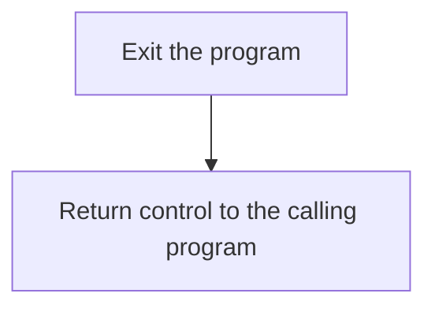

<SwmSnippet path="/src/base/cobol_src/DELCUS.cbl" line="737">

---

First, the <SwmToken path="src/base/cobol_src/DELCUS.cbl" pos="737:1:9" line-data="       GET-ME-OUT-OF-HERE SECTION.">`GET-ME-OUT-OF-HERE`</SwmToken> section is responsible for exiting the DELCUS program. This is achieved by the <SwmToken path="src/base/cobol_src/DELCUS.cbl" pos="740:1:1" line-data="           GOBACK.">`GOBACK`</SwmToken> statement, which returns control to the calling program or the operating system.

```cobol
       GET-ME-OUT-OF-HERE SECTION.
       GMOFH010.

           GOBACK.
```

---

</SwmSnippet>

<SwmSnippet path="/src/base/cobol_src/DELCUS.cbl" line="742">

---

Next, the <SwmToken path="src/base/cobol_src/DELCUS.cbl" pos="743:1:1" line-data="           EXIT.">`EXIT`</SwmToken> statement is used to ensure that the program terminates properly. This statement is a standard COBOL command to exit a section or paragraph.

```cobol
       GMOFH999.
           EXIT.
```

---

</SwmSnippet>

&nbsp;

*This is an auto-generated document by Swimm 🌊 and has not yet been verified by a human*

<SwmMeta version="3.0.0" repo-id="Z2l0aHViJTNBJTNBY2ljcy1iYW5raW5nLXNhbXBsZS1hcHBsaWNhdGlvbi1jYnNhLUlCTS1EZW1vJTNBJTNBU3dpbW0tRGVtbw==" repo-name="cics-banking-sample-application-cbsa-IBM-Demo"><sup>Powered by [Swimm](/)</sup></SwmMeta>
