The <SwmToken path="src/base/cobol_src/BNK1DAC.cbl" pos="355:4:4" line-data="              MOVE &#39;BNK1DAC - A010 - RETURN TRANSID(ODAC) FAIL&#39; TO">`BNK1DAC`</SwmToken> program handles various key presses and their corresponding actions within the banking application. This program ensures that user inputs are processed correctly, maps are sent, and appropriate messages are displayed. The program achieves this by evaluating key presses and performing specific routines based on the key pressed.

The <SwmToken path="src/base/cobol_src/BNK1DAC.cbl" pos="355:4:4" line-data="              MOVE &#39;BNK1DAC - A010 - RETURN TRANSID(ODAC) FAIL&#39; TO">`BNK1DAC`</SwmToken> program starts by checking if it's the first time through and prepares the map with empty data fields. It then handles various key presses such as PA keys, PF3, <SwmToken path="src/base/cobol_src/BNK1DAC.cbl" pos="693:21:21" line-data="           STRING &#39;If you wish to delete the Account press &lt;PF5&gt;.&#39;">`PF5`</SwmToken>, PF12, and the CLEAR key, ensuring appropriate actions are taken for each key press. This includes sending maps, processing user input, returning to the main menu, sending termination messages, and clearing the screen. When the user presses the enter key, the program processes the content and sends the appropriate response. If an invalid key is pressed, an error message is displayed. The program also populates the communication area with subprogram data and returns control to CICS, handling any response errors that may occur.

Here is a high level diagram of the program:

```mermaid
graph TD
crga8("Initial check and empty map"):::a839a4b45  --> 
j09r4("Handle PA key"):::a9113d1ad  --> 
nwhs0("Handle Pf3 key"):::a5002b2c6  --> 
u2wil("Process map for Pf5 key"):::a227ceeff  --> 
bh2bb("Send termination message for Pf12 key"):::afad728f3  --> 
9ccbe("Clear screen for CLEAR key"):::a0cb6d143  --> 
5kee4("Process content for enter key"):::aab8dcf1a  --> 
yatnz("Send invalid key message"):::a48bd96b8  --> 
qhss7("Populate COMMAREA with sub program data"):::a68054e06  --> 
7rsnf("Return control to CICS"):::ac6e7fdf0  --> 
6hwhp("Handle response errors"):::a300e033d 
classDef a839a4b45 color:#000000,fill:#7CB9F4
classDef a9113d1ad color:#000000,fill:#00FFAA
classDef a5002b2c6 color:#000000,fill:#00FFF4
classDef a227ceeff color:#000000,fill:#FFFF00
classDef afad728f3 color:#000000,fill:#AA7CB9
classDef a0cb6d143 color:#000000,fill:#5afa0a
classDef aab8dcf1a color:#000000,fill:#f5a10a
classDef a48bd96b8 color:#000000,fill:#f50af1
classDef a68054e06 color:#000000,fill:#9c5602
classDef ac6e7fdf0 color:#000000,fill:#FF5733
classDef a300e033d color:#000000,fill:#C70039

%% Swimm:
%% graph TD
%% crga8("Initial check and empty map"):::a839a4b45  --> 
%% j09r4("Handle PA key"):::a9113d1ad  --> 
%% nwhs0("Handle <SwmToken path="src/base/cobol_src/BNK1DAC.cbl" pos="210:5:5" line-data="      *       When Pf3 is pressed, return to the main menu">`Pf3`</SwmToken> key"):::a5002b2c6  --> 
%% u2wil("Process map for <SwmToken path="src/base/cobol_src/BNK1DAC.cbl" pos="221:5:5" line-data="      *       When Pf5 is pressed, process the map">`Pf5`</SwmToken> key"):::a227ceeff  --> 
%% bh2bb("Send termination message for <SwmToken path="src/base/cobol_src/BNK1DAC.cbl" pos="227:5:5" line-data="      *       When Pf12 is pressed, send a termination">`Pf12`</SwmToken> key"):::afad728f3  --> 
%% 9ccbe("Clear screen for CLEAR key"):::a0cb6d143  --> 
%% 5kee4("Process content for enter key"):::aab8dcf1a  --> 
%% yatnz("Send invalid key message"):::a48bd96b8  --> 
%% qhss7("Populate COMMAREA with sub program data"):::a68054e06  --> 
%% 7rsnf("Return control to CICS"):::ac6e7fdf0  --> 
%% 6hwhp("Handle response errors"):::a300e033d 
%% classDef a839a4b45 color:#000000,fill:#7CB9F4
%% classDef a9113d1ad color:#000000,fill:#00FFAA
%% classDef a5002b2c6 color:#000000,fill:#00FFF4
%% classDef a227ceeff color:#000000,fill:#FFFF00
%% classDef afad728f3 color:#000000,fill:#AA7CB9
%% classDef a0cb6d143 color:#000000,fill:#5afa0a
%% classDef aab8dcf1a color:#000000,fill:#f5a10a
%% classDef a48bd96b8 color:#000000,fill:#f50af1
%% classDef a68054e06 color:#000000,fill:#9c5602
%% classDef ac6e7fdf0 color:#000000,fill:#FF5733
%% classDef a300e033d color:#000000,fill:#C70039
```

## Initial check and empty map

First, we'll zoom into this section of the flow:

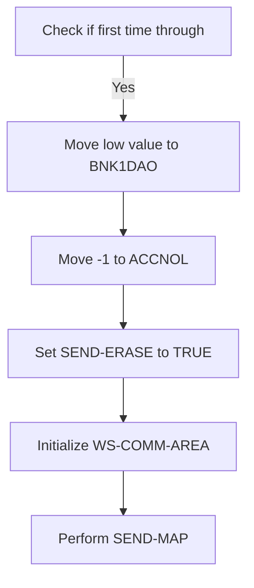

<SwmSnippet path="/src/base/cobol_src/BNK1DAC.cbl" line="191">

---

### Checking if it's the first time through

First, the code checks if <SwmToken path="src/base/cobol_src/BNK1DAC.cbl" pos="196:3:3" line-data="              WHEN EIBCALEN = ZERO">`EIBCALEN`</SwmToken> (the length of the communication area) is zero, which indicates that it is the first time through the program. This is crucial for determining whether to send the map with erased (empty) data fields.

```cobol
           EVALUATE TRUE
      *
      *       Is it the first time through? If so, send the map
      *       with erased (empty) data fields.
      *
              WHEN EIBCALEN = ZERO
```

---

</SwmSnippet>

<SwmSnippet path="/src/base/cobol_src/BNK1DAC.cbl" line="197">

---

### Preparing the map with empty data fields

Moving to the next steps, the code sets up the map to be sent with empty data fields. It moves a low value to <SwmToken path="src/base/cobol_src/BNK1DAC.cbl" pos="197:9:9" line-data="                 MOVE LOW-VALUE TO BNK1DAO">`BNK1DAO`</SwmToken>, sets <SwmToken path="src/base/cobol_src/BNK1DAC.cbl" pos="198:8:8" line-data="                 MOVE -1 TO ACCNOL">`ACCNOL`</SwmToken> to -1, and sets the <SwmToken path="src/base/cobol_src/BNK1DAC.cbl" pos="199:3:5" line-data="                 SET SEND-ERASE TO TRUE">`SEND-ERASE`</SwmToken> flag to true. Then, it initializes the <SwmToken path="src/base/cobol_src/BNK1DAC.cbl" pos="200:3:7" line-data="                 INITIALIZE WS-COMM-AREA">`WS-COMM-AREA`</SwmToken> and performs the <SwmToken path="src/base/cobol_src/BNK1DAC.cbl" pos="201:3:5" line-data="                 PERFORM SEND-MAP">`SEND-MAP`</SwmToken> operation to display the map to the user.

```cobol
                 MOVE LOW-VALUE TO BNK1DAO
                 MOVE -1 TO ACCNOL
                 SET SEND-ERASE TO TRUE
                 INITIALIZE WS-COMM-AREA
                 PERFORM SEND-MAP
```

---

</SwmSnippet>

## Handle PA key

Now, lets zoom into this section of the flow:

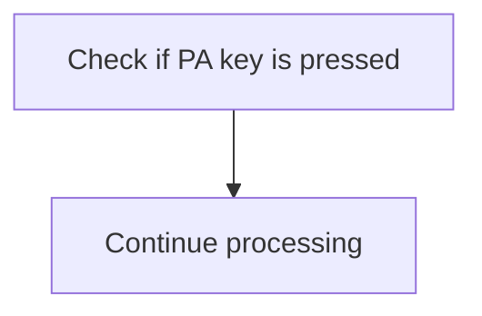

<SwmSnippet path="/src/base/cobol_src/BNK1DAC.cbl" line="203">

---

The code checks if any of the PA keys (Program Attention keys) are pressed by evaluating the <SwmToken path="src/base/cobol_src/BNK1DAC.cbl" pos="206:3:3" line-data="              WHEN EIBAID = DFHPA1 OR DFHPA2 OR DFHPA3">`EIBAID`</SwmToken> field against <SwmToken path="src/base/cobol_src/BNK1DAC.cbl" pos="206:7:7" line-data="              WHEN EIBAID = DFHPA1 OR DFHPA2 OR DFHPA3">`DFHPA1`</SwmToken>, <SwmToken path="src/base/cobol_src/BNK1DAC.cbl" pos="206:11:11" line-data="              WHEN EIBAID = DFHPA1 OR DFHPA2 OR DFHPA3">`DFHPA2`</SwmToken>, or <SwmToken path="src/base/cobol_src/BNK1DAC.cbl" pos="206:15:15" line-data="              WHEN EIBAID = DFHPA1 OR DFHPA2 OR DFHPA3">`DFHPA3`</SwmToken>. If a PA key is pressed, the program simply continues processing without taking any specific action. This ensures that the application does not interrupt its flow and handles PA key presses gracefully.

```cobol
      *
      *       If a PA key is pressed, just carry on
      *
              WHEN EIBAID = DFHPA1 OR DFHPA2 OR DFHPA3
                 CONTINUE
```

---

</SwmSnippet>

## Handle <SwmToken path="src/base/cobol_src/BNK1DAC.cbl" pos="210:5:5" line-data="      *       When Pf3 is pressed, return to the main menu">`Pf3`</SwmToken> key

Now, lets zoom into this section of the flow:

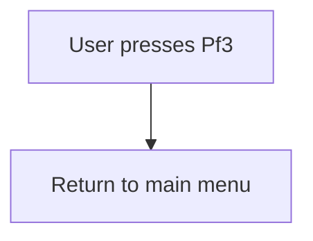

## Process map for <SwmToken path="src/base/cobol_src/BNK1DAC.cbl" pos="221:5:5" line-data="      *       When Pf5 is pressed, process the map">`Pf5`</SwmToken> key

Now, lets zoom into this section of the flow:

```mermaid
graph TD
  A[PF5 Key Pressed] --> B[Process Map]

%% Swimm:
%% graph TD
%%   A[<SwmToken path="src/base/cobol_src/BNK1DAC.cbl" pos="693:21:21" line-data="           STRING &#39;If you wish to delete the Account press &lt;PF5&gt;.&#39;">`PF5`</SwmToken> Key Pressed] --> B[Process Map]
```

<SwmSnippet path="/src/base/cobol_src/BNK1DAC.cbl" line="223">

---

### Processing user input when the <SwmToken path="src/base/cobol_src/BNK1DAC.cbl" pos="693:21:21" line-data="           STRING &#39;If you wish to delete the Account press &lt;PF5&gt;.&#39;">`PF5`</SwmToken> key is pressed

When the <SwmToken path="src/base/cobol_src/BNK1DAC.cbl" pos="693:21:21" line-data="           STRING &#39;If you wish to delete the Account press &lt;PF5&gt;.&#39;">`PF5`</SwmToken> key is pressed, the system triggers the <SwmToken path="src/base/cobol_src/BNK1DAC.cbl" pos="224:3:5" line-data="                 PERFORM PROCESS-MAP">`PROCESS-MAP`</SwmToken> routine. This routine is responsible for handling the user input and updating the map accordingly. This ensures that any actions associated with the <SwmToken path="src/base/cobol_src/BNK1DAC.cbl" pos="693:21:21" line-data="           STRING &#39;If you wish to delete the Account press &lt;PF5&gt;.&#39;">`PF5`</SwmToken> key are executed, allowing the application to respond to user commands effectively.

```cobol
              WHEN EIBAID = DFHPF5
                 PERFORM PROCESS-MAP
```

---

</SwmSnippet>

## Send termination message for <SwmToken path="src/base/cobol_src/BNK1DAC.cbl" pos="227:5:5" line-data="      *       When Pf12 is pressed, send a termination">`Pf12`</SwmToken> key

Now, lets zoom into this section of the flow:

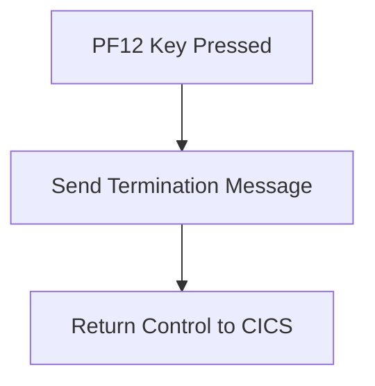

<SwmSnippet path="/src/base/cobol_src/BNK1DAC.cbl" line="230">

---

First, the system checks if the <SwmToken path="src/base/cobol_src/BNK1DAC.cbl" pos="230:3:3" line-data="              WHEN EIBAID = DFHPF12">`EIBAID`</SwmToken> (which holds the attention identifier) is equal to <SwmToken path="src/base/cobol_src/BNK1DAC.cbl" pos="230:7:7" line-data="              WHEN EIBAID = DFHPF12">`DFHPF12`</SwmToken> (the identifier for the PF12 key).

```cobol
              WHEN EIBAID = DFHPF12
```

---

</SwmSnippet>

<SwmSnippet path="/src/base/cobol_src/BNK1DAC.cbl" line="231">

---

Next, if the PF12 key is pressed, the system performs the <SwmToken path="src/base/cobol_src/BNK1DAC.cbl" pos="231:3:7" line-data="                 PERFORM SEND-TERMINATION-MSG">`SEND-TERMINATION-MSG`</SwmToken> operation to send a termination message, and then returns control to CICS.

```cobol
                 PERFORM SEND-TERMINATION-MSG

                 EXEC CICS
                    RETURN
                 END-EXEC
```

---

</SwmSnippet>

## Clear screen for CLEAR key

Now, lets zoom into this section of the flow:

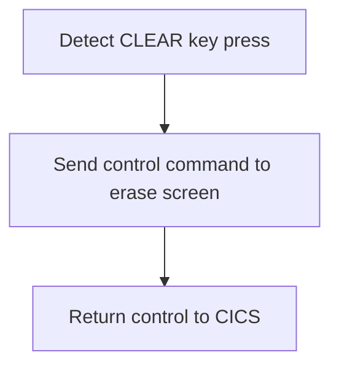

<SwmSnippet path="/src/base/cobol_src/BNK1DAC.cbl" line="240">

---

First, the function detects if the CLEAR key has been pressed by checking if <SwmToken path="src/base/cobol_src/BNK1DAC.cbl" pos="240:3:3" line-data="              WHEN EIBAID = DFHCLEAR">`EIBAID`</SwmToken> (which holds the attention identifier) is equal to <SwmToken path="src/base/cobol_src/BNK1DAC.cbl" pos="240:7:7" line-data="              WHEN EIBAID = DFHCLEAR">`DFHCLEAR`</SwmToken> (the identifier for the CLEAR key).

```cobol
              WHEN EIBAID = DFHCLEAR
```

---

</SwmSnippet>

<SwmSnippet path="/src/base/cobol_src/BNK1DAC.cbl" line="241">

---

Next, it sends a control command to erase the screen and free the keyboard using the <SwmToken path="src/base/cobol_src/BNK1DAC.cbl" pos="241:1:7" line-data="                EXEC CICS SEND CONTROL">`EXEC CICS SEND CONTROL`</SwmToken> command with the <SwmToken path="src/base/cobol_src/BNK1DAC.cbl" pos="242:1:1" line-data="                          ERASE">`ERASE`</SwmToken> and <SwmToken path="src/base/cobol_src/BNK1DAC.cbl" pos="243:1:1" line-data="                          FREEKB">`FREEKB`</SwmToken> options. This ensures that the screen is cleared and the keyboard is unlocked for further input.

```cobol
                EXEC CICS SEND CONTROL
                          ERASE
                          FREEKB
```

---

</SwmSnippet>

## Interim Summary

So far, we saw how the system handles various key presses such as PA keys, PF3, <SwmToken path="src/base/cobol_src/BNK1DAC.cbl" pos="693:21:21" line-data="           STRING &#39;If you wish to delete the Account press &lt;PF5&gt;.&#39;">`PF5`</SwmToken>, PF12, and the CLEAR key, ensuring appropriate actions are taken for each key press. This includes sending maps, processing user input, returning to the main menu, sending termination messages, and clearing the screen. Now, we will focus on how the system processes the content when the user presses the enter key.

## Process content for enter key

Now, lets zoom into this section of the flow:

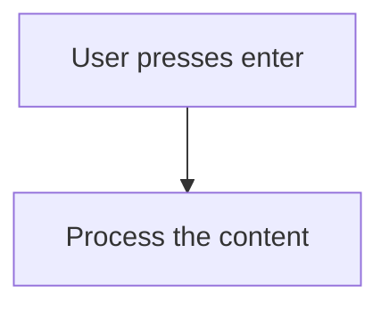

<SwmSnippet path="/src/base/cobol_src/BNK1DAC.cbl" line="248">

---

When the user presses the enter key, the system triggers the processing of the content. This is indicated by checking if <SwmToken path="src/base/cobol_src/BNK1DAC.cbl" pos="252:3:3" line-data="              WHEN EIBAID = DFHENTER">`EIBAID`</SwmToken> (which holds the attention identifier) is equal to <SwmToken path="src/base/cobol_src/BNK1DAC.cbl" pos="252:7:7" line-data="              WHEN EIBAID = DFHENTER">`DFHENTER`</SwmToken> (the constant for the enter key). If this condition is met, the <SwmToken path="src/base/cobol_src/BNK1DAC.cbl" pos="253:3:5" line-data="                 PERFORM PROCESS-MAP">`PROCESS-MAP`</SwmToken> routine is performed, which handles the actual processing of the user input.

```cobol

      *
      *       When enter is pressed then process the content
      *
              WHEN EIBAID = DFHENTER
                 PERFORM PROCESS-MAP

```

---

</SwmSnippet>

## Send invalid key message

Now, lets zoom into this section of the flow:

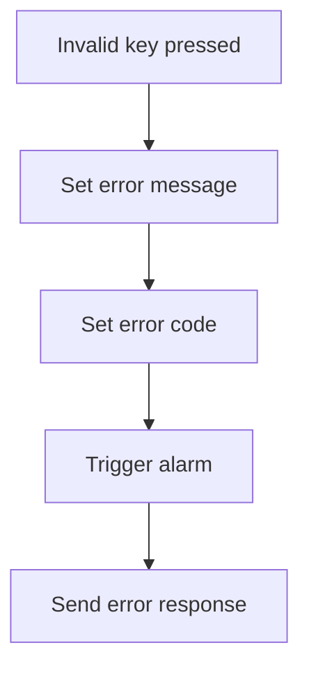

<SwmSnippet path="/src/base/cobol_src/BNK1DAC.cbl" line="258">

---

First, when an invalid key is pressed, the system sets the <SwmToken path="src/base/cobol_src/BNK1DAC.cbl" pos="259:9:9" line-data="                 MOVE LOW-VALUES TO BNK1DAO">`BNK1DAO`</SwmToken> variable to low values, indicating a reset or clearing of the data.

```cobol
              WHEN OTHER
                 MOVE LOW-VALUES TO BNK1DAO
```

---

</SwmSnippet>

<SwmSnippet path="/src/base/cobol_src/BNK1DAC.cbl" line="260">

---

Next, the system sets the <SwmToken path="src/base/cobol_src/BNK1DAC.cbl" pos="260:14:14" line-data="                 MOVE &#39;Invalid key pressed.&#39; TO MESSAGEO">`MESSAGEO`</SwmToken> variable to 'Invalid key pressed.' to inform the user of the error, sets the <SwmToken path="src/base/cobol_src/BNK1DAC.cbl" pos="261:8:8" line-data="                 MOVE -1 TO ACCNOL">`ACCNOL`</SwmToken> variable to -1 to indicate an error state, and triggers an alarm by setting <SwmToken path="src/base/cobol_src/BNK1DAC.cbl" pos="262:3:7" line-data="                 SET SEND-DATAONLY-ALARM TO TRUE">`SEND-DATAONLY-ALARM`</SwmToken> to true. Finally, the <SwmToken path="src/base/cobol_src/BNK1DAC.cbl" pos="264:3:5" line-data="                 PERFORM SEND-MAP">`SEND-MAP`</SwmToken> routine is performed to send the error response back to the user.

```cobol
                 MOVE 'Invalid key pressed.' TO MESSAGEO
                 MOVE -1 TO ACCNOL
                 SET SEND-DATAONLY-ALARM TO TRUE

                 PERFORM SEND-MAP
```

---

</SwmSnippet>

## Populate COMMAREA with sub program data

Now, lets zoom into this section of the flow:

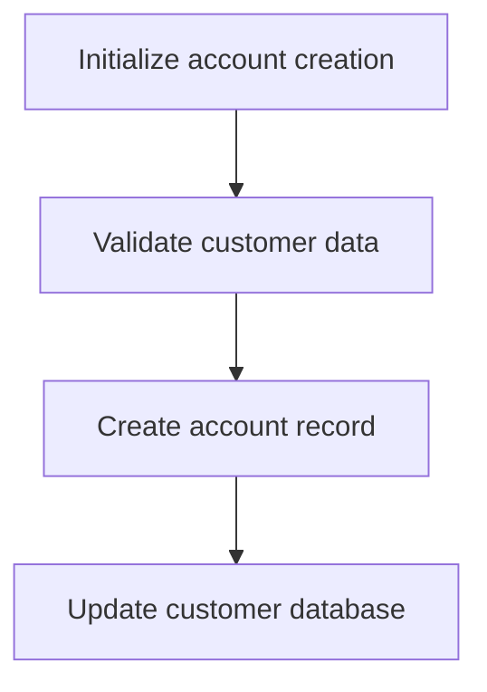

<SwmSnippet path="/src/base/cobol_src/BNK1DAC.cbl" line="268">

---

### Managing customer account creation

The <SwmToken path="src/base/cobol_src/BNK1DAC.cbl" pos="188:1:1" line-data="       PREMIERE SECTION.">`PREMIERE`</SwmToken> function is responsible for managing the creation of new customer accounts. It begins by initializing the account creation process, ensuring that all necessary variables and structures are set up correctly. Next, it validates the customer data to ensure that all required information is present and correct. This step is crucial as it prevents the creation of accounts with incomplete or incorrect data. Once the data is validated, the function proceeds to create the account record in the system. This involves generating a unique account number and storing the customer's information in the appropriate database tables. Finally, the function updates the customer database to reflect the new account, ensuring that all related systems are aware of the new customer account. This comprehensive process ensures that new customer accounts are created accurately and efficiently, providing a seamless experience for both the bank teller and the customer.

```cobol
      *
      *    Provided that we have been around this way before (i.e. it is
      *    NOT the first time through, put the data returned from the
      *    sub program into the area that we use as the COMMAREA on the
      *    RETURN.
      *
           IF EIBCALEN NOT = ZERO
              IF INQACC-EYE = 'ACCT'
                 MOVE INQACC-EYE          TO WS-COMM-EYE
                 MOVE INQACC-CUSTNO       TO WS-COMM-CUSTNO
                 MOVE INQACC-SCODE        TO WS-COMM-SCODE
                 MOVE INQACC-ACCNO        TO WS-COMM-ACCNO
                 MOVE INQACC-ACC-TYPE     TO WS-COMM-ACC-TYPE
                 MOVE INQACC-INT-RATE     TO WS-COMM-INT-RATE
                 MOVE INQACC-OPENED       TO WS-COMM-OPENED
                 MOVE INQACC-OVERDRAFT    TO WS-COMM-OVERDRAFT
```

---

</SwmSnippet>

## Return control to CICS

This is the next section of the flow.

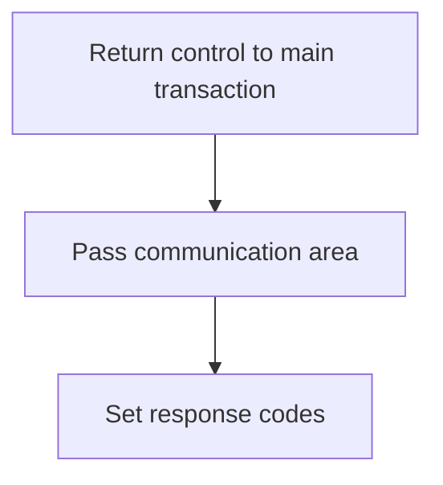

<SwmSnippet path="/src/base/cobol_src/BNK1DAC.cbl" line="295">

---

The <SwmToken path="src/base/cobol_src/BNK1DAC.cbl" pos="295:1:1" line-data="           EXEC CICS">`EXEC`</SwmToken>` `<SwmToken path="src/base/cobol_src/BNK1DAC.cbl" pos="295:3:3" line-data="           EXEC CICS">`CICS`</SwmToken>` RETURN `<SwmToken path="src/base/cobol_src/BNK1DAC.cbl" pos="296:3:3" line-data="              RETURN TRANSID(&#39;ODAC&#39;)">`TRANSID`</SwmToken>`(`<SwmToken path="src/base/cobol_src/BNK1DAC.cbl" pos="296:6:6" line-data="              RETURN TRANSID(&#39;ODAC&#39;)">`ODAC`</SwmToken>`)` statement is used to return control to the main transaction identified by 'ODAC'. This ensures that the main transaction continues processing after the current operation is complete. The <SwmToken path="src/base/cobol_src/BNK1DAC.cbl" pos="297:1:8" line-data="              COMMAREA(WS-COMM-AREA)">`COMMAREA(WS-COMM-AREA)`</SwmToken> clause passes the communication area <SwmToken path="src/base/cobol_src/BNK1DAC.cbl" pos="297:3:7" line-data="              COMMAREA(WS-COMM-AREA)">`WS-COMM-AREA`</SwmToken> to the main transaction, allowing it to access the necessary data for further processing. The <SwmToken path="src/base/cobol_src/BNK1DAC.cbl" pos="298:1:4" line-data="              LENGTH(102)">`LENGTH(102)`</SwmToken> clause specifies the length of the communication area being passed. Finally, the <SwmToken path="src/base/cobol_src/BNK1DAC.cbl" pos="299:1:8" line-data="              RESP(WS-CICS-RESP)">`RESP(WS-CICS-RESP)`</SwmToken> and <SwmToken path="src/base/cobol_src/BNK1DAC.cbl" pos="300:1:8" line-data="              RESP2(WS-CICS-RESP2)">`RESP2(WS-CICS-RESP2)`</SwmToken> clauses set the response codes <SwmToken path="src/base/cobol_src/BNK1DAC.cbl" pos="299:3:7" line-data="              RESP(WS-CICS-RESP)">`WS-CICS-RESP`</SwmToken> and <SwmToken path="src/base/cobol_src/BNK1DAC.cbl" pos="300:3:7" line-data="              RESP2(WS-CICS-RESP2)">`WS-CICS-RESP2`</SwmToken>, which can be used to check the status of the operation and handle any errors if necessary.

```cobol
           EXEC CICS
              RETURN TRANSID('ODAC')
              COMMAREA(WS-COMM-AREA)
              LENGTH(102)
              RESP(WS-CICS-RESP)
              RESP2(WS-CICS-RESP2)
           END-EXEC.
```

---

</SwmSnippet>

## Handle response errors

Now, lets zoom into this section of the flow:

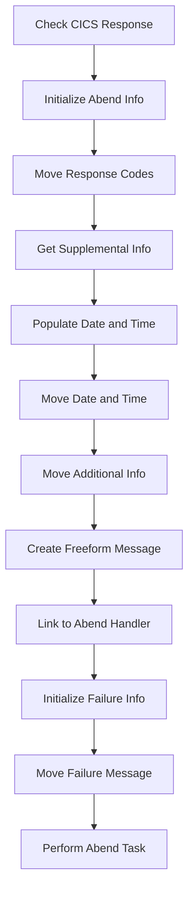

First, we check if the CICS response code (<SwmToken path="src/base/cobol_src/BNK1DAC.cbl" pos="299:3:7" line-data="              RESP(WS-CICS-RESP)">`WS-CICS-RESP`</SwmToken>) is not equal to <SwmToken path="src/base/cobol_src/BNK1DAC.cbl" pos="303:13:16" line-data="           IF WS-CICS-RESP NOT = DFHRESP(NORMAL)">`DFHRESP(NORMAL)`</SwmToken>, indicating an abnormal end scenario.

<SwmSnippet path="/src/base/cobol_src/BNK1DAC.cbl" line="310">

---

Moving to the next step, we initialize the <SwmToken path="src/base/cobol_src/BNK1DAC.cbl" pos="310:3:5" line-data="              INITIALIZE ABNDINFO-REC">`ABNDINFO-REC`</SwmToken> structure to prepare for capturing abend information.

```cobol
              INITIALIZE ABNDINFO-REC
```

---

</SwmSnippet>

<SwmSnippet path="/src/base/cobol_src/BNK1DAC.cbl" line="311">

---

Next, we move the response codes <SwmToken path="src/base/cobol_src/BNK1DAC.cbl" pos="311:3:3" line-data="              MOVE EIBRESP    TO ABND-RESPCODE">`EIBRESP`</SwmToken> and <SwmToken path="src/base/cobol_src/BNK1DAC.cbl" pos="312:3:3" line-data="              MOVE EIBRESP2   TO ABND-RESP2CODE">`EIBRESP2`</SwmToken> into <SwmToken path="src/base/cobol_src/BNK1DAC.cbl" pos="311:7:9" line-data="              MOVE EIBRESP    TO ABND-RESPCODE">`ABND-RESPCODE`</SwmToken> and <SwmToken path="src/base/cobol_src/BNK1DAC.cbl" pos="312:7:9" line-data="              MOVE EIBRESP2   TO ABND-RESP2CODE">`ABND-RESP2CODE`</SwmToken> respectively to preserve the abend response information.

```cobol
              MOVE EIBRESP    TO ABND-RESPCODE
              MOVE EIBRESP2   TO ABND-RESP2CODE
```

---

</SwmSnippet>

<SwmSnippet path="/src/base/cobol_src/BNK1DAC.cbl" line="316">

---

Then, we get supplemental information such as the application ID (<SwmToken path="src/base/cobol_src/BNK1DAC.cbl" pos="316:7:7" line-data="              EXEC CICS ASSIGN APPLID(ABND-APPLID)">`APPLID`</SwmToken>), task number (<SwmToken path="src/base/cobol_src/BNK1DAC.cbl" pos="319:3:3" line-data="              MOVE EIBTASKN   TO ABND-TASKNO-KEY">`EIBTASKN`</SwmToken>), and transaction ID (<SwmToken path="src/base/cobol_src/BNK1DAC.cbl" pos="320:3:3" line-data="              MOVE EIBTRNID   TO ABND-TRANID">`EIBTRNID`</SwmToken>) to provide more context for the abend.

```cobol
              EXEC CICS ASSIGN APPLID(ABND-APPLID)
              END-EXEC

              MOVE EIBTASKN   TO ABND-TASKNO-KEY
              MOVE EIBTRNID   TO ABND-TRANID

```

---

</SwmSnippet>

<SwmSnippet path="/src/base/cobol_src/BNK1DAC.cbl" line="322">

---

Diving into the next step, we perform the <SwmToken path="src/base/cobol_src/BNK1DAC.cbl" pos="322:3:7" line-data="              PERFORM POPULATE-TIME-DATE">`POPULATE-TIME-DATE`</SwmToken> routine to get the current date and time.

```cobol
              PERFORM POPULATE-TIME-DATE
```

---

</SwmSnippet>

<SwmSnippet path="/src/base/cobol_src/BNK1DAC.cbl" line="324">

---

We then move the original date (<SwmToken path="src/base/cobol_src/BNK1DAC.cbl" pos="324:3:7" line-data="              MOVE WS-ORIG-DATE TO ABND-DATE">`WS-ORIG-DATE`</SwmToken>) and the current time (<SwmToken path="src/base/cobol_src/BNK1DAC.cbl" pos="325:3:11" line-data="              STRING WS-TIME-NOW-GRP-HH DELIMITED BY SIZE,">`WS-TIME-NOW-GRP-HH`</SwmToken>, <SwmToken path="src/base/cobol_src/BNK1DAC.cbl" pos="327:1:9" line-data="                     WS-TIME-NOW-GRP-MM DELIMITED BY SIZE,">`WS-TIME-NOW-GRP-MM`</SwmToken>) into the <SwmToken path="src/base/cobol_src/BNK1DAC.cbl" pos="324:11:13" line-data="              MOVE WS-ORIG-DATE TO ABND-DATE">`ABND-DATE`</SwmToken> and <SwmToken path="src/base/cobol_src/BNK1DAC.cbl" pos="330:3:5" line-data="                     INTO ABND-TIME">`ABND-TIME`</SwmToken> fields respectively.

```cobol
              MOVE WS-ORIG-DATE TO ABND-DATE
              STRING WS-TIME-NOW-GRP-HH DELIMITED BY SIZE,
                    ':' DELIMITED BY SIZE,
                     WS-TIME-NOW-GRP-MM DELIMITED BY SIZE,
                     ':' DELIMITED BY SIZE,
                     WS-TIME-NOW-GRP-MM DELIMITED BY SIZE
                     INTO ABND-TIME
```

---

</SwmSnippet>

<SwmSnippet path="/src/base/cobol_src/BNK1DAC.cbl" line="333">

---

Next, we move additional information such as the universal time (<SwmToken path="src/base/cobol_src/BNK1DAC.cbl" pos="333:3:7" line-data="              MOVE WS-U-TIME   TO ABND-UTIME-KEY">`WS-U-TIME`</SwmToken>), a specific code (<SwmToken path="src/base/cobol_src/BNK1DAC.cbl" pos="334:4:4" line-data="              MOVE &#39;HBNK&#39;      TO ABND-CODE">`HBNK`</SwmToken>), and the program name (<SwmToken path="src/base/cobol_src/BNK1DAC.cbl" pos="336:9:11" line-data="              EXEC CICS ASSIGN PROGRAM(ABND-PROGRAM)">`ABND-PROGRAM`</SwmToken>) into the abend structure.

```cobol
              MOVE WS-U-TIME   TO ABND-UTIME-KEY
              MOVE 'HBNK'      TO ABND-CODE

              EXEC CICS ASSIGN PROGRAM(ABND-PROGRAM)
              END-EXEC
```

---

</SwmSnippet>

<SwmSnippet path="/src/base/cobol_src/BNK1DAC.cbl" line="341">

---

We then create a freeform message that includes the abend details and response codes, which will be used for logging and debugging purposes.

```cobol
              STRING 'A010 - RETURN TRANSID(ODAC) FAIL.'
                    DELIMITED BY SIZE,
                    'EIBRESP=' DELIMITED BY SIZE,
                    ABND-RESPCODE DELIMITED BY SIZE,
                    ' RESP2=' DELIMITED BY SIZE,
                    ABND-RESP2CODE DELIMITED BY SIZE
                    INTO ABND-FREEFORM
```

---

</SwmSnippet>

<SwmSnippet path="/src/base/cobol_src/BNK1DAC.cbl" line="350">

---

Finally, we link to the abend handler program (<SwmToken path="src/base/cobol_src/BNK1DAC.cbl" pos="350:9:13" line-data="              EXEC CICS LINK PROGRAM(WS-ABEND-PGM)">`WS-ABEND-PGM`</SwmToken>) and pass the abend information record (<SwmToken path="src/base/cobol_src/BNK1DAC.cbl" pos="351:3:5" line-data="                        COMMAREA(ABNDINFO-REC)">`ABNDINFO-REC`</SwmToken>). We also initialize failure information and perform the abend task to handle the abnormal end scenario.

```cobol
              EXEC CICS LINK PROGRAM(WS-ABEND-PGM)
                        COMMAREA(ABNDINFO-REC)
              END-EXEC

              INITIALIZE WS-FAIL-INFO
              MOVE 'BNK1DAC - A010 - RETURN TRANSID(ODAC) FAIL' TO
                 WS-CICS-FAIL-MSG
              MOVE WS-CICS-RESP  TO WS-CICS-RESP-DISP
              MOVE WS-CICS-RESP2 TO WS-CICS-RESP2-DISP
              PERFORM ABEND-THIS-TASK
```

---

</SwmSnippet>

## <SwmToken path="src/base/cobol_src/BNK1DAC.cbl" pos="322:3:7" line-data="              PERFORM POPULATE-TIME-DATE">`POPULATE-TIME-DATE`</SwmToken>

Lets' zoom into this section of the flow:

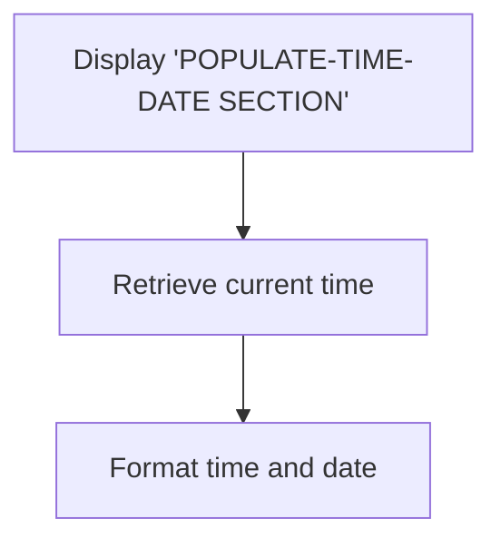

<SwmSnippet path="/src/base/cobol_src/BNK1DAC.cbl" line="1144">

---

First, the section begins by displaying the message '<SwmToken path="src/base/cobol_src/BNK1DAC.cbl" pos="1144:6:10" line-data="      D    DISPLAY &#39;POPULATE-TIME-DATE SECTION&#39;.">`POPULATE-TIME-DATE`</SwmToken> SECTION' to indicate the start of the process to the user.

```cobol
      D    DISPLAY 'POPULATE-TIME-DATE SECTION'.
```

---

</SwmSnippet>

<SwmSnippet path="/src/base/cobol_src/BNK1DAC.cbl" line="1146">

---

Moving to the next step, the program retrieves the current time using the <SwmToken path="src/base/cobol_src/BNK1DAC.cbl" pos="1146:1:5" line-data="           EXEC CICS ASKTIME">`EXEC CICS ASKTIME`</SwmToken> command, which stores the absolute time in <SwmToken path="src/base/cobol_src/BNK1DAC.cbl" pos="1147:3:7" line-data="              ABSTIME(WS-U-TIME)">`WS-U-TIME`</SwmToken>.

```cobol
           EXEC CICS ASKTIME
              ABSTIME(WS-U-TIME)
```

---

</SwmSnippet>

<SwmSnippet path="/src/base/cobol_src/BNK1DAC.cbl" line="1150">

---

Next, the program formats the retrieved time and date using the <SwmToken path="src/base/cobol_src/BNK1DAC.cbl" pos="1150:1:5" line-data="           EXEC CICS FORMATTIME">`EXEC CICS FORMATTIME`</SwmToken> command. This command converts the absolute time in <SwmToken path="src/base/cobol_src/BNK1DAC.cbl" pos="1151:3:7" line-data="                     ABSTIME(WS-U-TIME)">`WS-U-TIME`</SwmToken> to a human-readable date format stored in <SwmToken path="src/base/cobol_src/BNK1DAC.cbl" pos="1152:3:7" line-data="                     DDMMYYYY(WS-ORIG-DATE)">`WS-ORIG-DATE`</SwmToken> and the current time stored in <SwmToken path="src/base/cobol_src/BNK1DAC.cbl" pos="1153:3:7" line-data="                     TIME(WS-TIME-NOW)">`WS-TIME-NOW`</SwmToken>.

```cobol
           EXEC CICS FORMATTIME
                     ABSTIME(WS-U-TIME)
                     DDMMYYYY(WS-ORIG-DATE)
                     TIME(WS-TIME-NOW)
```

---

</SwmSnippet>

<SwmSnippet path="/src/base/cobol_src/BNK1DAC.cbl" line="1157">

---

Finally, the section ends with the <SwmToken path="src/base/cobol_src/BNK1DAC.cbl" pos="1158:1:1" line-data="           EXIT.">`EXIT`</SwmToken> statement, indicating the completion of the time and date population process.

```cobol
       PTD999.
           EXIT.
```

---

</SwmSnippet>

&nbsp;

*This is an auto-generated document by Swimm 🌊 and has not yet been verified by a human*

<SwmMeta version="3.0.0" repo-id="Z2l0aHViJTNBJTNBY2ljcy1iYW5raW5nLXNhbXBsZS1hcHBsaWNhdGlvbi1jYnNhLUlCTS1EZW1vJTNBJTNBU3dpbW0tRGVtbw==" repo-name="cics-banking-sample-application-cbsa-IBM-Demo"><sup>Powered by [Swimm](/)</sup></SwmMeta>
