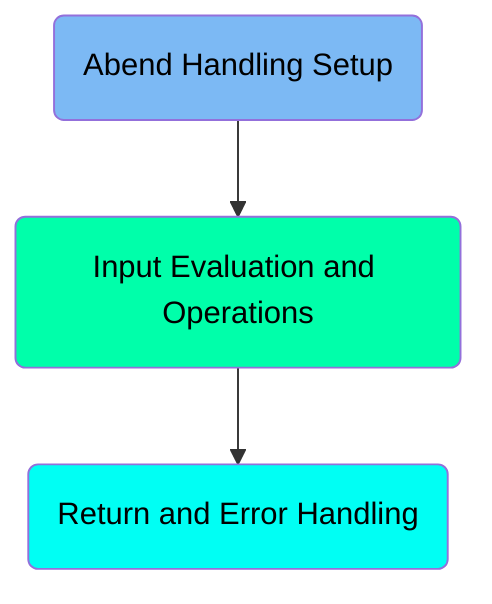
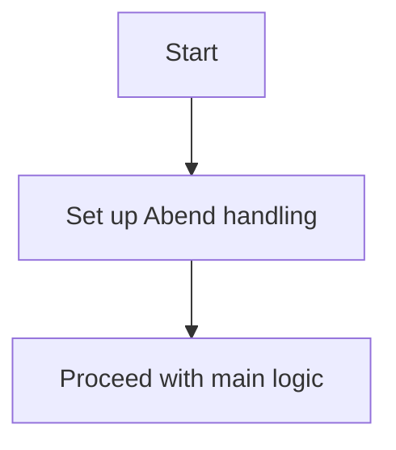
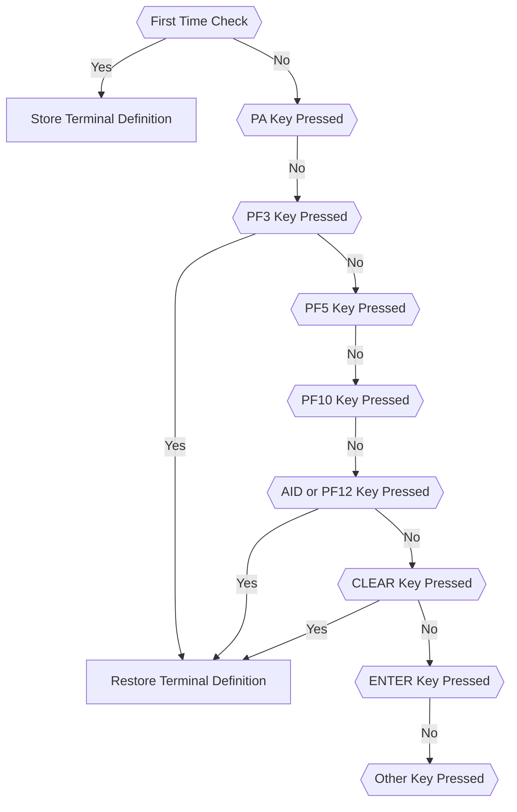

The <SwmToken path="src/base/cobol_src/BNK1DCS.cbl" pos="19:6:6" line-data="       PROGRAM-ID. BNK1DCS.">`BNK1DCS`</SwmToken> program is responsible for handling various key presses and performing corresponding actions such as restoring terminal definitions, processing maps, and sending termination messages. This ensures that the program responds appropriately to user inputs and maintains the terminal's state. The program also includes mechanisms for return and error handling to manage the program's response to errors and ensure a smooth return to the main menu or appropriate error handling routines.

The <SwmToken path="src/base/cobol_src/BNK1DCS.cbl" pos="19:6:6" line-data="       PROGRAM-ID. BNK1DCS.">`BNK1DCS`</SwmToken> program starts by setting up Abend handling to manage unexpected errors. It then evaluates user inputs, such as key presses, and performs actions like restoring terminal definitions, processing maps, and sending termination messages. If an error occurs, the program initializes error handling routines, gathers supplemental information, and performs cleanup tasks to ensure the terminal's state is maintained and the program can return to the main menu or handle the error appropriately.

Here is a high level diagram of the program:



# Abend Handling Setup



<SwmSnippet path="/src/base/cobol_src/BNK1DCS.cbl" line="189">

---

## Setting up Abend handling

First, the <SwmToken path="src/base/cobol_src/BNK1DCS.cbl" pos="189:1:1" line-data="       PREMIERE SECTION.">`PREMIERE`</SwmToken> section sets up the Abend handling using the <SwmToken path="src/base/cobol_src/BNK1DCS.cbl" pos="195:1:7" line-data="           EXEC CICS HANDLE ABEND">`EXEC CICS HANDLE ABEND`</SwmToken> command. This ensures that if an abnormal termination (Abend) occurs, control is transferred to the <SwmToken path="src/base/cobol_src/BNK1DCS.cbl" pos="196:3:5" line-data="                LABEL(ABEND-HANDLING)">`ABEND-HANDLING`</SwmToken> label. This is crucial for maintaining the stability and reliability of the application by managing unexpected errors gracefully.

```cobol
       PREMIERE SECTION.
       A010.

      *
      *    Set up the Abend handling
      *
           EXEC CICS HANDLE ABEND
                LABEL(ABEND-HANDLING)
           END-EXEC.

```

---

</SwmSnippet>

# Input Evaluation and Operations



<SwmSnippet path="/src/base/cobol_src/BNK1DCS.cbl" line="205">

---

## First Time Check

First, the program checks if it is the first time through by evaluating if <SwmToken path="src/base/cobol_src/BNK1DCS.cbl" pos="205:3:3" line-data="              WHEN EIBCALEN = ZERO">`EIBCALEN`</SwmToken> is zero. If true, it initializes the terminal with empty data fields, stores the terminal definition, and sends the map.

```cobol
              WHEN EIBCALEN = ZERO
                 MOVE LOW-VALUE TO BNK1DCO
                 MOVE -1 TO CUSTNOL
                 SET SEND-ERASE TO TRUE
                 INITIALIZE WS-COMM-AREA

                 PERFORM STORE-TERM-DEF

                 MOVE STORED-UCTRANS TO WS-COMM-TERM

                 PERFORM SEND-MAP
```

---

</SwmSnippet>

<SwmSnippet path="/src/base/cobol_src/BNK1DCS.cbl" line="220">

---

## PA Key Pressed

Next, the program checks if a PA key (<SwmToken path="src/base/cobol_src/BNK1DCS.cbl" pos="220:7:7" line-data="              WHEN EIBAID = DFHPA1 OR DFHPA2 OR DFHPA3">`DFHPA1`</SwmToken>, <SwmToken path="src/base/cobol_src/BNK1DCS.cbl" pos="220:11:11" line-data="              WHEN EIBAID = DFHPA1 OR DFHPA2 OR DFHPA3">`DFHPA2`</SwmToken>, or <SwmToken path="src/base/cobol_src/BNK1DCS.cbl" pos="220:15:15" line-data="              WHEN EIBAID = DFHPA1 OR DFHPA2 OR DFHPA3">`DFHPA3`</SwmToken>) is pressed. If true, it simply continues without any further action.

```cobol
              WHEN EIBAID = DFHPA1 OR DFHPA2 OR DFHPA3
                 CONTINUE
```

---

</SwmSnippet>

<SwmSnippet path="/src/base/cobol_src/BNK1DCS.cbl" line="226">

---

## PF3 Key Pressed

Then, the program checks if the PF3 key is pressed. If true, it restores the terminal definition and returns to the main menu.

```cobol
              WHEN EIBAID = DFHPF3

      *
      *          Set the terminal UCTRAN back to its starting position
      *
                 PERFORM RESTORE-TERM-DEF

                 EXEC CICS RETURN
                    TRANSID('OMEN')
                    IMMEDIATE
                    RESP(WS-CICS-RESP)
                    RESP2(WS-CICS-RESP2)
                 END-EXEC
```

---

</SwmSnippet>

<SwmSnippet path="/src/base/cobol_src/BNK1DCS.cbl" line="244">

---

## <SwmToken path="src/base/cobol_src/BNK1DCS.cbl" pos="951:12:12" line-data="           STRING &#39;Customer lookup successful. &lt;PF5&gt; to Delete. &lt;PF10&#39;">`PF5`</SwmToken> Key Pressed

If the <SwmToken path="src/base/cobol_src/BNK1DCS.cbl" pos="951:12:12" line-data="           STRING &#39;Customer lookup successful. &lt;PF5&gt; to Delete. &lt;PF10&#39;">`PF5`</SwmToken> key is pressed, the program processes the incoming data by performing the <SwmToken path="src/base/cobol_src/BNK1DCS.cbl" pos="245:3:5" line-data="                 PERFORM PROCESS-MAP">`PROCESS-MAP`</SwmToken> operation.

```cobol
              WHEN EIBAID = DFHPF5
                 PERFORM PROCESS-MAP
```

---

</SwmSnippet>

<SwmSnippet path="/src/base/cobol_src/BNK1DCS.cbl" line="251">

---

## <SwmToken path="src/base/cobol_src/BNK1DCS.cbl" pos="951:21:21" line-data="           STRING &#39;Customer lookup successful. &lt;PF5&gt; to Delete. &lt;PF10&#39;">`PF10`</SwmToken> Key Pressed

Similarly, if the <SwmToken path="src/base/cobol_src/BNK1DCS.cbl" pos="951:21:21" line-data="           STRING &#39;Customer lookup successful. &lt;PF5&gt; to Delete. &lt;PF10&#39;">`PF10`</SwmToken> key is pressed, the program processes the incoming data by performing the <SwmToken path="src/base/cobol_src/BNK1DCS.cbl" pos="252:3:5" line-data="                 PERFORM PROCESS-MAP">`PROCESS-MAP`</SwmToken> operation.

```cobol
              WHEN EIBAID = DFHPF10
                 PERFORM PROCESS-MAP
```

---

</SwmSnippet>

<SwmSnippet path="/src/base/cobol_src/BNK1DCS.cbl" line="258">

---

## AID or PF12 Key Pressed

If the AID or PF12 key is pressed, the program restores the terminal definition and sends a termination message.

```cobol
              WHEN EIBAID = DFHAID OR DFHPF12
      *
      *          Set the terminal UCTRAN back to its starting position
      *
                 PERFORM RESTORE-TERM-DEF

                 PERFORM SEND-TERMINATION-MSG

                 EXEC CICS
                    RETURN
                 END-EXEC
```

---

</SwmSnippet>

<SwmSnippet path="/src/base/cobol_src/BNK1DCS.cbl" line="273">

---

## CLEAR Key Pressed

When the CLEAR key is pressed, the program restores the terminal definition, erases the screen, and returns control to CICS.

```cobol
              WHEN EIBAID = DFHCLEAR
      *
      *          Set the terminal UCTRAN back to its starting position
      *
                 PERFORM RESTORE-TERM-DEF

                 EXEC CICS SEND CONTROL
                          ERASE
                          FREEKB
                 END-EXEC

                 EXEC CICS RETURN
                 END-EXEC
```

---

</SwmSnippet>

<SwmSnippet path="/src/base/cobol_src/BNK1DCS.cbl" line="290">

---

## ENTER Key Pressed

If the ENTER key is pressed, the program processes the content by performing the <SwmToken path="src/base/cobol_src/BNK1DCS.cbl" pos="291:3:5" line-data="                 PERFORM PROCESS-MAP">`PROCESS-MAP`</SwmToken> operation.

```cobol
              WHEN EIBAID = DFHENTER
                 PERFORM PROCESS-MAP
```

---

</SwmSnippet>

<SwmSnippet path="/src/base/cobol_src/BNK1DCS.cbl" line="296">

---

## Other Key Pressed

For any other key pressed, the program sends an invalid key message to the user.

```cobol
              WHEN OTHER
                 MOVE SPACES                 TO MESSAGEO
                 MOVE 'Invalid key pressed.' TO MESSAGEO
                 MOVE -1 TO CUSTNOL
                 SET SEND-DATAONLY-ALARM TO TRUE
                 PERFORM SEND-MAP
```

---

</SwmSnippet>

<SwmSnippet path="/src/base/cobol_src/BNK1DCS.cbl" line="1743">

---

### <SwmToken path="src/base/cobol_src/BNK1DCS.cbl" pos="1743:1:5" line-data="       RESTORE-TERM-DEF SECTION.">`RESTORE-TERM-DEF`</SwmToken>

The <SwmToken path="src/base/cobol_src/BNK1DCS.cbl" pos="1743:1:5" line-data="       RESTORE-TERM-DEF SECTION.">`RESTORE-TERM-DEF`</SwmToken> function restores the terminal's UCTRAN setting to its original state. This is crucial for maintaining the terminal's configuration consistency.

```cobol
       RESTORE-TERM-DEF SECTION.
       RTD010.
      *
      *    We must now restore the UCTRAN setting back to what it
      *    was at the start
      *

           MOVE DFHCOMMAREA TO WS-COMM-AREA.

           MOVE WS-COMM-TERM TO WS-UCTRANS.

           EXEC CICS SET TERMINAL(EIBTRMID)
               UCTRANST(WS-UCTRANS)
               RESP(WS-CICS-RESP)
               RESP2(WS-CICS-RESP2)
           END-EXEC.

           IF WS-CICS-RESP NOT = DFHRESP(NORMAL)
      *
      *       Preserve the RESP and RESP2, then set up the
      *       standard ABEND info before getting the applid,
```

---

</SwmSnippet>

<SwmSnippet path="/src/base/cobol_src/BNK1DCS.cbl" line="1642">

---

### <SwmToken path="src/base/cobol_src/BNK1DCS.cbl" pos="1642:1:5" line-data="       STORE-TERM-DEF SECTION.">`STORE-TERM-DEF`</SwmToken>

The <SwmToken path="src/base/cobol_src/BNK1DCS.cbl" pos="1642:1:5" line-data="       STORE-TERM-DEF SECTION.">`STORE-TERM-DEF`</SwmToken> function stores the current UCTRAN setting of the terminal. This is important for ensuring that the terminal's state can be restored later.

```cobol
       STORE-TERM-DEF SECTION.
       STD010.

      *
      *    Inquire on the terminal and store the UCTRANS settings
      *
           EXEC CICS INQUIRE
                TERMINAL(EIBTRMID)
                UCTRANST(WS-UCTRANS)
                RESP(WS-CICS-RESP)
                RESP2(WS-CICS-RESP2)
           END-EXEC.

      *
      *    Store the original UCTRAN value
      *
           MOVE WS-UCTRANS TO STORED-UCTRANS.

      *
      *    If Uppercase translation is switched on,
      *    then set it to NOUCTRAN(451).
```

---

</SwmSnippet>

## Interim Summary

So far, we saw how the program handles various key presses and performs corresponding actions such as restoring terminal definitions, processing maps, and sending termination messages. These steps ensure that the program responds appropriately to user inputs and maintains the terminal's state. Now, we will focus on the return and error handling mechanisms, which manage the program's response to errors and ensure a smooth return to the main menu or appropriate error handling routines.

# Return and Error Handling

```mermaid
graph TD
  A[Check if EIBCALEN is not zero] --> B[Move COMM fields to WS fields]
  B --> C["Return TRANSID('ODCS')"]
  C --> D{Check if WS-CICS-RESP is not NORMAL}
  D -->|Yes| E[Initialize ABNDINFO-REC]
  E --> F[Move EIBRESP to ABND-RESPCODE]
  F --> G[Move EIBRESP2 to ABND-RESP2CODE]
  G --> H[Assign APPLID to ABND-APPLID]
  H --> I[Move EIBTASKN to ABND-TASKNO-KEY]
  I --> J[Move EIBTRNID to ABND-TRANID]
  J --> K[Perform POPULATE-TIME-DATE]
  K --> L[Move WS-ORIG-DATE to ABND-DATE]
  L --> M[String WS-TIME-NOW-GRP to ABND-TIME]
  M --> N[Move WS-U-TIME to ABND-UTIME-KEY]
  N --> O[Move 'HBNK' to ABND-CODE]
  O --> P[Assign PROGRAM to ABND-PROGRAM]
  P --> Q[Move ZEROS to ABND-SQLCODE]
  Q --> R[String error message to ABND-FREEFORM]
  R --> S[Link to WS-ABEND-PGM]
  S --> T[Initialize WS-FAIL-INFO]
  T --> U[Move error message to WS-CICS-FAIL-MSG]
  U --> V[Move WS-CICS-RESP to WS-CICS-RESP-DISP]
  V --> W[Move WS-CICS-RESP2 to WS-CICS-RESP2-DISP]
  W --> X[Perform RESTORE-TERM-DEF]
  X --> Y[Perform ABEND-THIS-TASK]

%% Swimm:
%% graph TD
%%   A[Check if EIBCALEN is not zero] --> B[Move COMM fields to WS fields]
%%   B --> C["Return TRANSID('ODCS')"]
%%   C --> D{Check if <SwmToken path="src/base/cobol_src/BNK1DCS.cbl" pos="236:3:7" line-data="                    RESP(WS-CICS-RESP)">`WS-CICS-RESP`</SwmToken> is not NORMAL}
%%   D -->|Yes| E[Initialize ABNDINFO-REC]
%%   E --> F[Move EIBRESP to ABND-RESPCODE]
%%   F --> G[Move <SwmToken path="src/base/cobol_src/BNK1DCS.cbl" pos="343:3:3" line-data="              MOVE EIBRESP2   TO ABND-RESP2CODE">`EIBRESP2`</SwmToken> to ABND-RESP2CODE]
%%   G --> H[Assign APPLID to ABND-APPLID]
%%   H --> I[Move EIBTASKN to ABND-TASKNO-KEY]
%%   I --> J[Move EIBTRNID to ABND-TRANID]
%%   J --> K[Perform POPULATE-TIME-DATE]
%%   K --> L[Move <SwmToken path="src/base/cobol_src/BNK1DCS.cbl" pos="355:3:7" line-data="              MOVE WS-ORIG-DATE TO ABND-DATE">`WS-ORIG-DATE`</SwmToken> to ABND-DATE]
%%   L --> M[String <SwmToken path="src/base/cobol_src/BNK1DCS.cbl" pos="356:3:9" line-data="              STRING WS-TIME-NOW-GRP-HH DELIMITED BY SIZE,">`WS-TIME-NOW-GRP`</SwmToken> to ABND-TIME]
%%   M --> N[Move <SwmToken path="src/base/cobol_src/BNK1DCS.cbl" pos="364:3:7" line-data="              MOVE WS-U-TIME   TO ABND-UTIME-KEY">`WS-U-TIME`</SwmToken> to ABND-UTIME-KEY]
%%   N --> O[Move 'HBNK' to ABND-CODE]
%%   O --> P[Assign PROGRAM to ABND-PROGRAM]
%%   P --> Q[Move ZEROS to ABND-SQLCODE]
%%   Q --> R[String error message to ABND-FREEFORM]
%%   R --> S[Link to WS-ABEND-PGM]
%%   S --> T[Initialize WS-FAIL-INFO]
%%   T --> U[Move error message to WS-CICS-FAIL-MSG]
%%   U --> V[Move <SwmToken path="src/base/cobol_src/BNK1DCS.cbl" pos="236:3:7" line-data="                    RESP(WS-CICS-RESP)">`WS-CICS-RESP`</SwmToken> to WS-CICS-RESP-DISP]
%%   V --> W[Move <SwmToken path="src/base/cobol_src/BNK1DCS.cbl" pos="237:3:7" line-data="                    RESP2(WS-CICS-RESP2)">`WS-CICS-RESP2`</SwmToken> to WS-CICS-RESP2-DISP]
%%   W --> X[Perform RESTORE-TERM-DEF]
%%   X --> Y[Perform ABEND-THIS-TASK]
```



<SwmSnippet path="/src/base/cobol_src/BNK1DCS.cbl" line="311">

---

## Checking EIBCALEN

First, we check if <SwmToken path="src/base/cobol_src/BNK1DCS.cbl" pos="311:3:3" line-data="           IF EIBCALEN NOT = ZERO">`EIBCALEN`</SwmToken> is not zero, indicating that this is not the first time through. If true, we move various fields from <SwmToken path="src/base/cobol_src/BNK1DCS.cbl" pos="312:9:9" line-data="              MOVE COMM-TERM OF DFHCOMMAREA   TO WS-COMM-TERM">`DFHCOMMAREA`</SwmToken> to <SwmToken path="src/base/cobol_src/BNK1DCS.cbl" pos="209:3:7" line-data="                 INITIALIZE WS-COMM-AREA">`WS-COMM-AREA`</SwmToken> to preserve the state.

```cobol
           IF EIBCALEN NOT = ZERO
              MOVE COMM-TERM OF DFHCOMMAREA   TO WS-COMM-TERM
              MOVE COMM-EYE OF DFHCOMMAREA    TO WS-COMM-EYE
              MOVE COMM-SCODE OF DFHCOMMAREA  TO WS-COMM-SCODE
              MOVE COMM-CUSTNO OF DFHCOMMAREA TO WS-COMM-CUSTNO
              MOVE COMM-NAME OF DFHCOMMAREA   TO WS-COMM-NAME
              MOVE COMM-ADDR OF DFHCOMMAREA   TO WS-COMM-ADDR
              MOVE COMM-DOB OF DFHCOMMAREA    TO WS-COMM-DOB
              MOVE COMM-CREDIT-SCORE OF DFHCOMMAREA
                 TO WS-COMM-CREDIT-SCORE
              MOVE COMM-CS-REVIEW-DATE OF DFHCOMMAREA
                 TO WS-COMM-CS-REVIEW-DATE
               MOVE COMM-UPD OF DFHCOMMAREA   TO WS-COMM-UPDATE
           END-IF.
```

---

</SwmSnippet>

<SwmSnippet path="/src/base/cobol_src/BNK1DCS.cbl" line="326">

---

## Returning TRANSID

Next, we execute a CICS RETURN command with <SwmToken path="src/base/cobol_src/BNK1DCS.cbl" pos="327:3:8" line-data="              RETURN TRANSID(&#39;ODCS&#39;)">`TRANSID('ODCS')`</SwmToken>, passing the <SwmToken path="src/base/cobol_src/BNK1DCS.cbl" pos="328:3:7" line-data="              COMMAREA(WS-COMM-AREA)">`WS-COMM-AREA`</SwmToken> and setting response codes in <SwmToken path="src/base/cobol_src/BNK1DCS.cbl" pos="330:3:7" line-data="              RESP(WS-CICS-RESP)">`WS-CICS-RESP`</SwmToken> and <SwmToken path="src/base/cobol_src/BNK1DCS.cbl" pos="331:3:7" line-data="              RESP2(WS-CICS-RESP2)">`WS-CICS-RESP2`</SwmToken>.

```cobol
           EXEC CICS
              RETURN TRANSID('ODCS')
              COMMAREA(WS-COMM-AREA)
              LENGTH(266)
              RESP(WS-CICS-RESP)
              RESP2(WS-CICS-RESP2)
           END-EXEC.
```

---

</SwmSnippet>

<SwmSnippet path="/src/base/cobol_src/BNK1DCS.cbl" line="334">

---

## Handling Error Response

Then, we check if <SwmToken path="src/base/cobol_src/BNK1DCS.cbl" pos="334:3:7" line-data="           IF WS-CICS-RESP NOT = DFHRESP(NORMAL)">`WS-CICS-RESP`</SwmToken> is not equal to <SwmToken path="src/base/cobol_src/BNK1DCS.cbl" pos="334:13:16" line-data="           IF WS-CICS-RESP NOT = DFHRESP(NORMAL)">`DFHRESP(NORMAL)`</SwmToken>. If true, we initialize <SwmToken path="src/base/cobol_src/BNK1DCS.cbl" pos="341:3:5" line-data="              INITIALIZE ABNDINFO-REC">`ABNDINFO-REC`</SwmToken>, move response codes to <SwmToken path="src/base/cobol_src/BNK1DCS.cbl" pos="342:7:9" line-data="              MOVE EIBRESP    TO ABND-RESPCODE">`ABND-RESPCODE`</SwmToken> and <SwmToken path="src/base/cobol_src/BNK1DCS.cbl" pos="343:7:9" line-data="              MOVE EIBRESP2   TO ABND-RESP2CODE">`ABND-RESP2CODE`</SwmToken>, and gather supplemental information like <SwmToken path="src/base/cobol_src/BNK1DCS.cbl" pos="347:7:7" line-data="              EXEC CICS ASSIGN APPLID(ABND-APPLID)">`APPLID`</SwmToken>, <SwmToken path="src/base/cobol_src/BNK1DCS.cbl" pos="350:9:9" line-data="              MOVE EIBTASKN   TO ABND-TASKNO-KEY">`TASKNO`</SwmToken>, and <SwmToken path="src/base/cobol_src/BNK1DCS.cbl" pos="351:9:9" line-data="              MOVE EIBTRNID   TO ABND-TRANID">`TRANID`</SwmToken>. We then perform <SwmToken path="src/base/cobol_src/BNK1DCS.cbl" pos="353:3:7" line-data="              PERFORM POPULATE-TIME-DATE">`POPULATE-TIME-DATE`</SwmToken> to get the current date and time, and format it into <SwmToken path="src/base/cobol_src/BNK1DCS.cbl" pos="355:11:13" line-data="              MOVE WS-ORIG-DATE TO ABND-DATE">`ABND-DATE`</SwmToken> and <SwmToken path="src/base/cobol_src/BNK1DCS.cbl" pos="361:3:5" line-data="                     INTO ABND-TIME">`ABND-TIME`</SwmToken>.

```cobol
           IF WS-CICS-RESP NOT = DFHRESP(NORMAL)
      *
      *       Preserve the RESP and RESP2, then set up the
      *       standard ABEND info before getting the applid,
      *       date/time etc. and linking to the Abend Handler
      *       program.
      *
              INITIALIZE ABNDINFO-REC
              MOVE EIBRESP    TO ABND-RESPCODE
              MOVE EIBRESP2   TO ABND-RESP2CODE
      *
      *       Get supplemental information
      *
              EXEC CICS ASSIGN APPLID(ABND-APPLID)
              END-EXEC

              MOVE EIBTASKN   TO ABND-TASKNO-KEY
              MOVE EIBTRNID   TO ABND-TRANID

              PERFORM POPULATE-TIME-DATE

```

---

</SwmSnippet>

<SwmSnippet path="/src/base/cobol_src/BNK1DCS.cbl" line="1921">

---

### <SwmToken path="src/base/cobol_src/BNK1DCS.cbl" pos="1921:1:5" line-data="       POPULATE-TIME-DATE SECTION.">`POPULATE-TIME-DATE`</SwmToken>

The <SwmToken path="src/base/cobol_src/BNK1DCS.cbl" pos="1921:1:5" line-data="       POPULATE-TIME-DATE SECTION.">`POPULATE-TIME-DATE`</SwmToken> section uses CICS commands to get the current time and format it into a human-readable date and time, storing these in <SwmToken path="src/base/cobol_src/BNK1DCS.cbl" pos="1931:3:7" line-data="                     DDMMYYYY(WS-ORIG-DATE)">`WS-ORIG-DATE`</SwmToken> and <SwmToken path="src/base/cobol_src/BNK1DCS.cbl" pos="1932:3:7" line-data="                     TIME(WS-TIME-NOW)">`WS-TIME-NOW`</SwmToken>.

```cobol
       POPULATE-TIME-DATE SECTION.
       PTD10.
      D    DISPLAY 'POPULATE-TIME-DATE SECTION'.

           EXEC CICS ASKTIME
              ABSTIME(WS-U-TIME)
           END-EXEC.

           EXEC CICS FORMATTIME
                     ABSTIME(WS-U-TIME)
                     DDMMYYYY(WS-ORIG-DATE)
                     TIME(WS-TIME-NOW)
                     DATESEP
           END-EXEC.

       PTD999.
           EXIT.
```

---

</SwmSnippet>

<SwmSnippet path="/src/base/cobol_src/BNK1DCS.cbl" line="355">

---

## Finalizing Error Handling

Moving to the final steps, we set additional fields in <SwmToken path="src/base/cobol_src/BNK1DCS.cbl" pos="341:3:5" line-data="              INITIALIZE ABNDINFO-REC">`ABNDINFO-REC`</SwmToken>, create a freeform error message, and link to the <SwmToken path="src/base/cobol_src/BNK1DCS.cbl" pos="166:3:7" line-data="       01 WS-ABEND-PGM                  PIC X(8) VALUE &#39;ABNDPROC&#39;.">`WS-ABEND-PGM`</SwmToken> program. We then initialize <SwmToken path="src/base/cobol_src/BNK1DCS.cbl" pos="36:3:7" line-data="       01 WS-FAIL-INFO.">`WS-FAIL-INFO`</SwmToken>, move error messages to display fields, and perform cleanup tasks like <SwmToken path="src/base/cobol_src/BNK1DCS.cbl" pos="231:3:7" line-data="                 PERFORM RESTORE-TERM-DEF">`RESTORE-TERM-DEF`</SwmToken> and <SwmToken path="src/base/cobol_src/BNK1DCS.cbl" pos="393:3:7" line-data="              PERFORM ABEND-THIS-TASK">`ABEND-THIS-TASK`</SwmToken>.

```cobol
              MOVE WS-ORIG-DATE TO ABND-DATE
              STRING WS-TIME-NOW-GRP-HH DELIMITED BY SIZE,
                    ':' DELIMITED BY SIZE,
                     WS-TIME-NOW-GRP-MM DELIMITED BY SIZE,
                     ':' DELIMITED BY SIZE,
                     WS-TIME-NOW-GRP-MM DELIMITED BY SIZE
                     INTO ABND-TIME
              END-STRING

              MOVE WS-U-TIME   TO ABND-UTIME-KEY
              MOVE 'HBNK'      TO ABND-CODE

              EXEC CICS ASSIGN PROGRAM(ABND-PROGRAM)
              END-EXEC

              MOVE ZEROS      TO ABND-SQLCODE

              STRING 'A010 - RETURN TRANSID(ODCS) FAIL'
                    DELIMITED BY SIZE,
                    'EIBRESP=' DELIMITED BY SIZE,
                    ABND-RESPCODE DELIMITED BY SIZE,
```

---

</SwmSnippet>

&nbsp;

*This is an auto-generated document by Swimm 🌊 and has not yet been verified by a human*

<SwmMeta version="3.0.0" repo-id="Z2l0aHViJTNBJTNBY2ljcy1iYW5raW5nLXNhbXBsZS1hcHBsaWNhdGlvbi1jYnNhLUlCTS1EZW1vJTNBJTNBU3dpbW0tRGVtbw==" repo-name="cics-banking-sample-application-cbsa-IBM-Demo"><sup>Powered by [Swimm](https://app.swimm.io/)</sup></SwmMeta>
