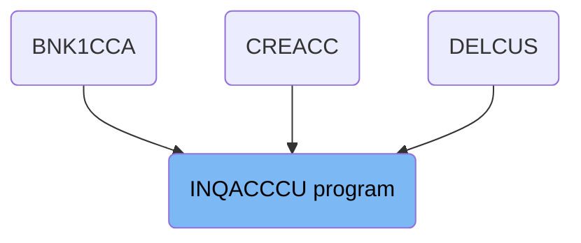
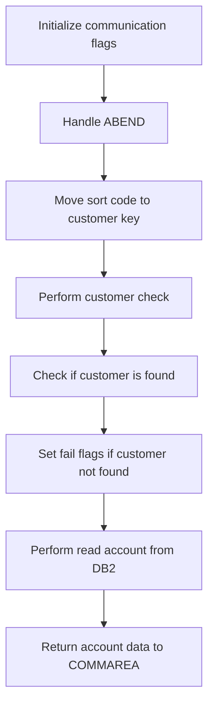
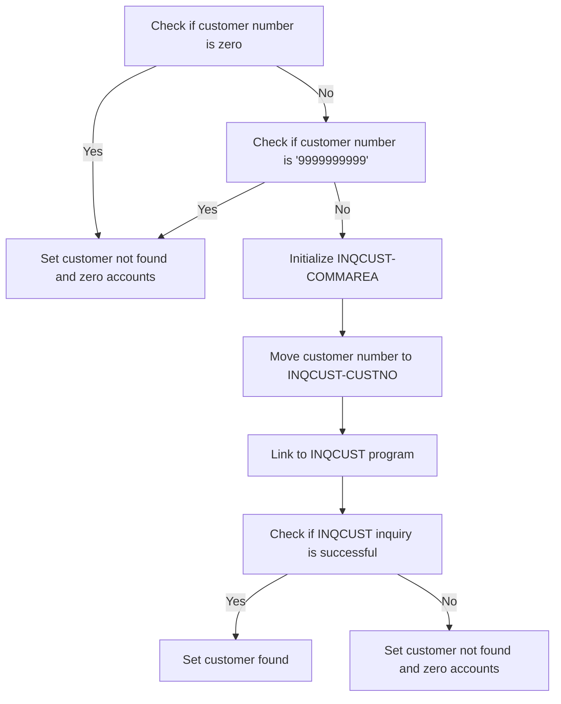
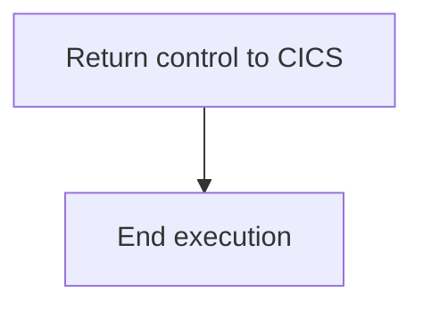
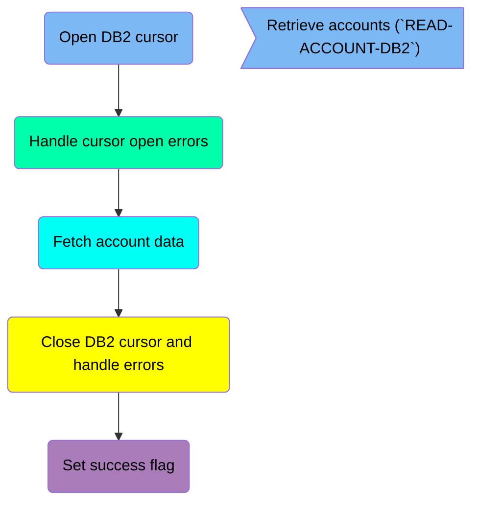
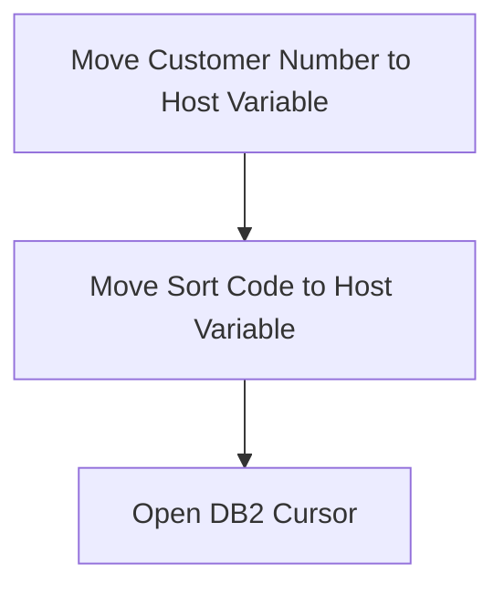
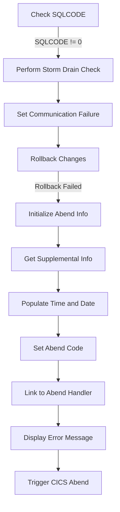
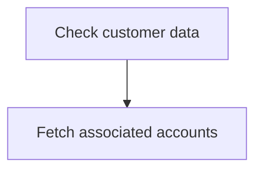
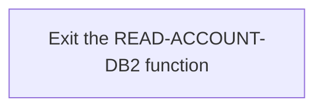
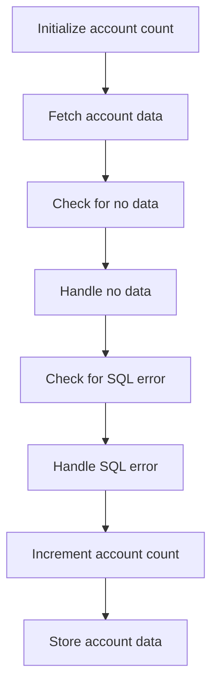

The INQACCCU program is responsible for retrieving account information for a customer. This is achieved by performing a series of steps including initializing communication flags, handling abnormal ends (<SwmToken path="src/base/cobol_src/INQACCCU.cbl" pos="686:5:5" line-data="      * How ABENDs are dealt with">`ABENDs`</SwmToken>), performing customer checks, and reading account data from a <SwmToken path="src/base/cobol_src/INQACCCU.cbl" pos="222:7:7" line-data="           PERFORM READ-ACCOUNT-DB2">`DB2`</SwmToken> database. The program ensures that the correct customer and account data are retrieved and returned to the communication area (COMMAREA) for further processing.

The flow involves initializing communication flags, handling any unexpected terminations, preparing customer data for checks, performing the customer check, reading account data from the database, and finally returning the retrieved data for further processing.

# Where is this program used?

This program is used multiple times in the codebase as represented in the following diagram:



## PREMIERE

Lets' zoom into this section of the flow:



<SwmSnippet path="/src/base/cobol_src/INQACCCU.cbl" line="195">

---

First, the communication flags are initialized to indicate the success or failure of the operation.

```cobol
       A010.
           MOVE 'N' TO COMM-SUCCESS
           MOVE '0' TO COMM-FAIL-CODE
```

---

</SwmSnippet>

<SwmSnippet path="/src/base/cobol_src/INQACCCU.cbl" line="199">

---

Moving to the next step, the ABEND (abnormal end) handling is set up to manage any unexpected terminations during the process.

```cobol
           EXEC CICS HANDLE ABEND
              LABEL(ABEND-HANDLING)
           END-EXEC.
```

---

</SwmSnippet>

<SwmSnippet path="/src/base/cobol_src/INQACCCU.cbl" line="203">

---

Next, the sort code is moved to the required sort code field of the customer key to prepare for the customer check.

```cobol
           MOVE SORTCODE TO REQUIRED-SORT-CODE OF CUSTOMER-KY.
```

---

</SwmSnippet>

<SwmSnippet path="/src/base/cobol_src/INQACCCU.cbl" line="210">

---

Then, the customer check is performed by linking to the INQCUST program to retrieve customer information.

```cobol
           PERFORM CUSTOMER-CHECK.
```

---

</SwmSnippet>

<SwmSnippet path="/src/base/cobol_src/INQACCCU.cbl" line="215">

---

Going into the next step, we check if the customer was found. If the customer is not found, the success flag is set to 'N' and the fail code is set to '1'.

```cobol
           IF CUSTOMER-FOUND = 'N'
              MOVE 'N' TO COMM-SUCCESS
              MOVE '1' TO COMM-FAIL-CODE
              PERFORM GET-ME-OUT-OF-HERE
           END-IF
```

---

</SwmSnippet>

<SwmSnippet path="/src/base/cobol_src/INQACCCU.cbl" line="222">

---

If the customer is found, we proceed to read the account data from the <SwmToken path="src/base/cobol_src/INQACCCU.cbl" pos="222:7:7" line-data="           PERFORM READ-ACCOUNT-DB2">`DB2`</SwmToken> database.

```cobol
           PERFORM READ-ACCOUNT-DB2
```

---

</SwmSnippet>

<SwmSnippet path="/src/base/cobol_src/INQACCCU.cbl" line="226">

---

Finally, the account data is returned to the communication area (COMMAREA) for further processing.

```cobol

           PERFORM GET-ME-OUT-OF-HERE.
```

---

</SwmSnippet>

## <SwmToken path="src/base/cobol_src/INQACCCU.cbl" pos="210:3:5" line-data="           PERFORM CUSTOMER-CHECK.">`CUSTOMER-CHECK`</SwmToken>

Lets' zoom into this section of the flow:



<SwmSnippet path="/src/base/cobol_src/INQACCCU.cbl" line="835">

---

First, we check if <SwmToken path="src/base/cobol_src/INQACCCU.cbl" pos="835:3:5" line-data="           IF CUSTOMER-NUMBER IN DFHCOMMAREA = ZERO">`CUSTOMER-NUMBER`</SwmToken> in <SwmToken path="src/base/cobol_src/INQACCCU.cbl" pos="835:9:9" line-data="           IF CUSTOMER-NUMBER IN DFHCOMMAREA = ZERO">`DFHCOMMAREA`</SwmToken> is zero. If it is, we set <SwmToken path="src/base/cobol_src/INQACCCU.cbl" pos="836:9:11" line-data="              MOVE &#39;N&#39; TO CUSTOMER-FOUND">`CUSTOMER-FOUND`</SwmToken> to 'N' and <SwmToken path="src/base/cobol_src/INQACCCU.cbl" pos="837:7:11" line-data="              MOVE ZERO TO NUMBER-OF-ACCOUNTS">`NUMBER-OF-ACCOUNTS`</SwmToken> to zero, indicating that no customer was found and there are no associated accounts.

```cobol
           IF CUSTOMER-NUMBER IN DFHCOMMAREA = ZERO
              MOVE 'N' TO CUSTOMER-FOUND
              MOVE ZERO TO NUMBER-OF-ACCOUNTS
              GO TO CC999
           END-IF.
```

---

</SwmSnippet>

<SwmSnippet path="/src/base/cobol_src/INQACCCU.cbl" line="841">

---

Next, we check if <SwmToken path="src/base/cobol_src/INQACCCU.cbl" pos="841:3:5" line-data="           IF CUSTOMER-NUMBER IN DFHCOMMAREA = &#39;9999999999&#39;">`CUSTOMER-NUMBER`</SwmToken> in <SwmToken path="src/base/cobol_src/INQACCCU.cbl" pos="841:9:9" line-data="           IF CUSTOMER-NUMBER IN DFHCOMMAREA = &#39;9999999999&#39;">`DFHCOMMAREA`</SwmToken> is '9999999999'. If it is, we again set <SwmToken path="src/base/cobol_src/INQACCCU.cbl" pos="842:9:11" line-data="              MOVE &#39;N&#39; TO CUSTOMER-FOUND">`CUSTOMER-FOUND`</SwmToken> to 'N' and <SwmToken path="src/base/cobol_src/INQACCCU.cbl" pos="843:7:11" line-data="              MOVE ZERO TO NUMBER-OF-ACCOUNTS">`NUMBER-OF-ACCOUNTS`</SwmToken> to zero, as this is a special case indicating no valid customer.

```cobol
           IF CUSTOMER-NUMBER IN DFHCOMMAREA = '9999999999'
              MOVE 'N' TO CUSTOMER-FOUND
              MOVE ZERO TO NUMBER-OF-ACCOUNTS
              GO TO CC999
           END-IF.
```

---

</SwmSnippet>

<SwmSnippet path="/src/base/cobol_src/INQACCCU.cbl" line="847">

---

Moving to the next step, we initialize <SwmToken path="src/base/cobol_src/INQACCCU.cbl" pos="847:3:5" line-data="           INITIALIZE INQCUST-COMMAREA.">`INQCUST-COMMAREA`</SwmToken> to prepare for the customer inquiry process.

```cobol
           INITIALIZE INQCUST-COMMAREA.
```

---

</SwmSnippet>

<SwmSnippet path="/src/base/cobol_src/INQACCCU.cbl" line="849">

---

Then, we move the <SwmToken path="src/base/cobol_src/INQACCCU.cbl" pos="849:3:5" line-data="           MOVE CUSTOMER-NUMBER IN DFHCOMMAREA TO INQCUST-CUSTNO.">`CUSTOMER-NUMBER`</SwmToken> from <SwmToken path="src/base/cobol_src/INQACCCU.cbl" pos="849:9:9" line-data="           MOVE CUSTOMER-NUMBER IN DFHCOMMAREA TO INQCUST-CUSTNO.">`DFHCOMMAREA`</SwmToken> to <SwmToken path="src/base/cobol_src/INQACCCU.cbl" pos="849:13:15" line-data="           MOVE CUSTOMER-NUMBER IN DFHCOMMAREA TO INQCUST-CUSTNO.">`INQCUST-CUSTNO`</SwmToken> to set up the customer number for the inquiry.

```cobol
           MOVE CUSTOMER-NUMBER IN DFHCOMMAREA TO INQCUST-CUSTNO.
```

---

</SwmSnippet>

<SwmSnippet path="/src/base/cobol_src/INQACCCU.cbl" line="851">

---

Next, we execute the <SwmToken path="src/base/cobol_src/INQACCCU.cbl" pos="851:10:10" line-data="           EXEC CICS LINK PROGRAM(&#39;INQCUST &#39;)">`INQCUST`</SwmToken> program via a CICS LINK command, passing <SwmToken path="src/base/cobol_src/INQACCCU.cbl" pos="852:3:5" line-data="              COMMAREA(INQCUST-COMMAREA)">`INQCUST-COMMAREA`</SwmToken> to retrieve customer information.

More about INQCUST: <SwmLink doc-title="Retrieving Customer (INQCUST)">[Retrieving Customer (INQCUST)](/.swm/retrieving-customer-inqcust.fj6c4rr6.sw.md)</SwmLink>

```cobol
           EXEC CICS LINK PROGRAM('INQCUST ')
              COMMAREA(INQCUST-COMMAREA)
           END-EXEC.
```

---

</SwmSnippet>

<SwmSnippet path="/src/base/cobol_src/INQACCCU.cbl" line="855">

---

Finally, we check if the <SwmToken path="src/base/cobol_src/INQACCCU.cbl" pos="855:3:3" line-data="           IF INQCUST-INQ-SUCCESS = &#39;Y&#39;">`INQCUST`</SwmToken> inquiry was successful by examining <SwmToken path="src/base/cobol_src/INQACCCU.cbl" pos="855:3:7" line-data="           IF INQCUST-INQ-SUCCESS = &#39;Y&#39;">`INQCUST-INQ-SUCCESS`</SwmToken>. If it is 'Y', we set <SwmToken path="src/base/cobol_src/INQACCCU.cbl" pos="856:9:11" line-data="              MOVE &#39;Y&#39; TO CUSTOMER-FOUND">`CUSTOMER-FOUND`</SwmToken> to 'Y', indicating that the customer was found. Otherwise, we set <SwmToken path="src/base/cobol_src/INQACCCU.cbl" pos="856:9:11" line-data="              MOVE &#39;Y&#39; TO CUSTOMER-FOUND">`CUSTOMER-FOUND`</SwmToken> to 'N' and <SwmToken path="src/base/cobol_src/INQACCCU.cbl" pos="859:7:11" line-data="              MOVE ZERO TO NUMBER-OF-ACCOUNTS">`NUMBER-OF-ACCOUNTS`</SwmToken> to zero, indicating that the customer was not found.

```cobol
           IF INQCUST-INQ-SUCCESS = 'Y'
              MOVE 'Y' TO CUSTOMER-FOUND
           ELSE
              MOVE 'N' TO CUSTOMER-FOUND
              MOVE ZERO TO NUMBER-OF-ACCOUNTS
           END-IF.
```

---

</SwmSnippet>

## Interim Summary

So far, we saw the detailed steps involved in initializing communication flags, handling ABEND, moving sort code to customer key, performing customer check, and reading account data from <SwmToken path="src/base/cobol_src/INQACCCU.cbl" pos="222:7:7" line-data="           PERFORM READ-ACCOUNT-DB2">`DB2`</SwmToken>. We also explored the customer check process in depth, including the conditions for setting customer found status and linking to the INQCUST program. Now, we will focus on the <SwmToken path="src/base/cobol_src/INQACCCU.cbl" pos="218:3:11" line-data="              PERFORM GET-ME-OUT-OF-HERE">`GET-ME-OUT-OF-HERE`</SwmToken> section, which handles returning control to CICS and ending the program execution.

## <SwmToken path="src/base/cobol_src/INQACCCU.cbl" pos="218:3:11" line-data="              PERFORM GET-ME-OUT-OF-HERE">`GET-ME-OUT-OF-HERE`</SwmToken>

Lets' zoom into this section of the flow:



<SwmSnippet path="/src/base/cobol_src/INQACCCU.cbl" line="638">

---

### Returning control to CICS

First, the <SwmToken path="src/base/cobol_src/INQACCCU.cbl" pos="638:1:9" line-data="       GET-ME-OUT-OF-HERE SECTION.">`GET-ME-OUT-OF-HERE`</SwmToken> section is responsible for returning control back to CICS. This is achieved by executing the <SwmToken path="src/base/cobol_src/INQACCCU.cbl" pos="643:1:5" line-data="           EXEC CICS RETURN">`EXEC CICS RETURN`</SwmToken> command, which signals the end of the current task and returns control to the CICS region.

```cobol
       GET-ME-OUT-OF-HERE SECTION.
       GMOFH010.
      *
      *    Return control back to CICS
      *
           EXEC CICS RETURN
           END-EXEC.
```

---

</SwmSnippet>

<SwmSnippet path="/src/base/cobol_src/INQACCCU.cbl" line="645">

---

### Ending execution

Moving to the next step, the <SwmToken path="src/base/cobol_src/INQACCCU.cbl" pos="646:1:1" line-data="           GOBACK.">`GOBACK`</SwmToken> statement is used to indicate the logical end of the program. This ensures that the program terminates correctly after returning control to CICS.

```cobol

           GOBACK.
```

---

</SwmSnippet>

<SwmSnippet path="/src/base/cobol_src/INQACCCU.cbl" line="648">

---

### Exiting the section

Next, the <SwmToken path="src/base/cobol_src/INQACCCU.cbl" pos="648:1:1" line-data="       GMOFH999.">`GMOFH999`</SwmToken> paragraph contains the <SwmToken path="src/base/cobol_src/INQACCCU.cbl" pos="649:1:1" line-data="           EXIT.">`EXIT`</SwmToken> statement, which is used to exit the current section. This marks the end of the <SwmToken path="src/base/cobol_src/INQACCCU.cbl" pos="218:3:11" line-data="              PERFORM GET-ME-OUT-OF-HERE">`GET-ME-OUT-OF-HERE`</SwmToken> section.

```cobol
       GMOFH999.
           EXIT.
```

---

</SwmSnippet>

# Retrieve accounts (<SwmToken path="src/base/cobol_src/INQACCCU.cbl" pos="222:3:7" line-data="           PERFORM READ-ACCOUNT-DB2">`READ-ACCOUNT-DB2`</SwmToken>)

Let's split this section into smaller parts:



## Open <SwmToken path="src/base/cobol_src/INQACCCU.cbl" pos="222:7:7" line-data="           PERFORM READ-ACCOUNT-DB2">`DB2`</SwmToken> cursor

First, we'll zoom into this section of the flow:



<SwmSnippet path="/src/base/cobol_src/INQACCCU.cbl" line="243">

---

First, the customer number is moved from the communication area to the host variable <SwmToken path="src/base/cobol_src/INQACCCU.cbl" pos="243:13:19" line-data="           MOVE CUSTOMER-NUMBER IN DFHCOMMAREA TO HV-ACCOUNT-CUST-NO.">`HV-ACCOUNT-CUST-NO`</SwmToken>. This step ensures that the correct customer number is used for the database query.

```cobol
           MOVE CUSTOMER-NUMBER IN DFHCOMMAREA TO HV-ACCOUNT-CUST-NO.
```

---

</SwmSnippet>

<SwmSnippet path="/src/base/cobol_src/INQACCCU.cbl" line="244">

---

Next, the sort code is moved to the host variable <SwmToken path="src/base/cobol_src/INQACCCU.cbl" pos="244:7:11" line-data="           MOVE  SORTCODE TO HV-ACCOUNT-SORTCODE.">`HV-ACCOUNT-SORTCODE`</SwmToken>. This prepares the sort code for use in the database query, ensuring that the query retrieves the correct account data.

```cobol
           MOVE  SORTCODE TO HV-ACCOUNT-SORTCODE.
```

---

</SwmSnippet>

<SwmSnippet path="/src/base/cobol_src/INQACCCU.cbl" line="246">

---

Then, the <SwmToken path="src/base/cobol_src/INQACCCU.cbl" pos="222:7:7" line-data="           PERFORM READ-ACCOUNT-DB2">`DB2`</SwmToken> cursor <SwmToken path="src/base/cobol_src/INQACCCU.cbl" pos="247:1:3" line-data="              ACC-CURSOR">`ACC-CURSOR`</SwmToken> is opened. This action initiates the database query, allowing the program to fetch account data associated with the provided customer number and sort code.

```cobol
           EXEC SQL OPEN
              ACC-CURSOR
```

---

</SwmSnippet>

## Handle cursor open errors

Now, lets zoom into this section of the flow:



First, the function <SwmToken path="src/base/cobol_src/INQACCCU.cbl" pos="222:3:7" line-data="           PERFORM READ-ACCOUNT-DB2">`READ-ACCOUNT-DB2`</SwmToken> checks the value of <SwmToken path="src/base/cobol_src/INQACCCU.cbl" pos="352:3:3" line-data="           IF SQLCODE NOT = 0">`SQLCODE`</SwmToken> to determine if there was an error during the database read operation.

If <SwmToken path="src/base/cobol_src/INQACCCU.cbl" pos="352:3:3" line-data="           IF SQLCODE NOT = 0">`SQLCODE`</SwmToken> is not equal to 0, indicating an error, the function proceeds to perform a storm drain check by calling <SwmToken path="src/base/cobol_src/INQACCCU.cbl" pos="362:3:11" line-data="              PERFORM CHECK-FOR-STORM-DRAIN-DB2">`CHECK-FOR-STORM-DRAIN-DB2`</SwmToken>.

Next, the function sets the communication success flag <SwmToken path="src/base/cobol_src/INQACCCU.cbl" pos="196:9:11" line-data="           MOVE &#39;N&#39; TO COMM-SUCCESS">`COMM-SUCCESS`</SwmToken> to 'N', indicating a failure in the communication process.

Then, it sets the <SwmToken path="src/base/cobol_src/INQACCCU.cbl" pos="215:3:5" line-data="           IF CUSTOMER-FOUND = &#39;N&#39;">`CUSTOMER-FOUND`</SwmToken> flag to 'N', indicating that the customer was not found in the database.

The function also sets the communication failure code <SwmToken path="src/base/cobol_src/INQACCCU.cbl" pos="197:9:13" line-data="           MOVE &#39;0&#39; TO COMM-FAIL-CODE">`COMM-FAIL-CODE`</SwmToken> to '2' and resets the <SwmToken path="src/base/cobol_src/INQACCCU.cbl" pos="461:7:11" line-data="           MOVE ZERO TO NUMBER-OF-ACCOUNTS.">`NUMBER-OF-ACCOUNTS`</SwmToken> to zero.

Moving to the next step, the function attempts to rollback any changes by executing a CICS SYNCPOINT ROLLBACK command.

If the rollback operation fails, indicated by <SwmToken path="src/base/cobol_src/INQACCCU.cbl" pos="370:3:7" line-data="                 RESP(WS-CICS-RESP)">`WS-CICS-RESP`</SwmToken> not being equal to <SwmToken path="src/base/cobol_src/INQACCCU.cbl" pos="374:13:16" line-data="              IF WS-CICS-RESP NOT = DFHRESP(NORMAL)">`DFHRESP(NORMAL)`</SwmToken>, the function initializes the <SwmToken path="src/base/cobol_src/INQACCCU.cbl" pos="381:3:5" line-data="                 INITIALIZE ABNDINFO-REC">`ABNDINFO-REC`</SwmToken> structure to prepare for abend (abnormal end) processing.

The function then retrieves supplemental information such as the application ID (<SwmToken path="src/base/cobol_src/INQACCCU.cbl" pos="387:7:7" line-data="                 EXEC CICS ASSIGN APPLID(ABND-APPLID)">`APPLID`</SwmToken>), task number (<SwmToken path="src/base/cobol_src/INQACCCU.cbl" pos="390:9:9" line-data="                 MOVE EIBTASKN   TO ABND-TASKNO-KEY">`TASKNO`</SwmToken>), and transaction ID (<SwmToken path="src/base/cobol_src/INQACCCU.cbl" pos="391:9:9" line-data="                 MOVE EIBTRNID   TO ABND-TRANID">`TRANID`</SwmToken>) using CICS ASSIGN commands.

Next, it populates the current date and time into the <SwmToken path="src/base/cobol_src/INQACCCU.cbl" pos="395:11:13" line-data="                 MOVE WS-ORIG-DATE TO ABND-DATE">`ABND-DATE`</SwmToken> and <SwmToken path="src/base/cobol_src/INQACCCU.cbl" pos="401:3:5" line-data="                        INTO ABND-TIME">`ABND-TIME`</SwmToken> fields by calling <SwmToken path="src/base/cobol_src/INQACCCU.cbl" pos="393:3:7" line-data="                 PERFORM POPULATE-TIME-DATE">`POPULATE-TIME-DATE`</SwmToken> and using string operations.

The function sets the abend code <SwmToken path="src/base/cobol_src/INQACCCU.cbl" pos="302:9:11" line-data="                 MOVE &#39;HROL&#39;      TO ABND-CODE">`ABND-CODE`</SwmToken> to 'HROL' and assigns the current program name to <SwmToken path="src/base/cobol_src/INQACCCU.cbl" pos="304:9:11" line-data="                 EXEC CICS ASSIGN PROGRAM(ABND-PROGRAM)">`ABND-PROGRAM`</SwmToken>.

It then constructs a detailed error message describing the rollback failure and stores it in the <SwmToken path="src/base/cobol_src/INQACCCU.cbl" pos="318:3:5" line-data="                       INTO ABND-FREEFORM">`ABND-FREEFORM`</SwmToken> field.

The function links to the abend handler program <SwmToken path="src/base/cobol_src/INQACCCU.cbl" pos="184:3:7" line-data="       01 WS-ABEND-PGM                       PIC X(8) VALUE &#39;ABNDPROC&#39;.">`WS-ABEND-PGM`</SwmToken> by passing the <SwmToken path="src/base/cobol_src/INQACCCU.cbl" pos="381:3:5" line-data="                 INITIALIZE ABNDINFO-REC">`ABNDINFO-REC`</SwmToken> structure.

## Fetch account data

Now, lets zoom into this section of the flow:



First, the code checks if the customer data is valid and ready for processing.

<SwmSnippet path="/src/base/cobol_src/INQACCCU.cbl" line="343">

---

Next, it performs the <SwmToken path="src/base/cobol_src/INQACCCU.cbl" pos="343:3:5" line-data="           PERFORM FETCH-DATA.">`FETCH-DATA`</SwmToken> operation to retrieve each of the accounts associated with the customer.

```cobol
           PERFORM FETCH-DATA.
```

---

</SwmSnippet>

## Close <SwmToken path="src/base/cobol_src/INQACCCU.cbl" pos="222:7:7" line-data="           PERFORM READ-ACCOUNT-DB2">`DB2`</SwmToken> cursor and handle errors

Now, lets zoom into this section of the flow:

```mermaid
graph TD
  A[Close DB2 Cursor] --> B{SQLCODE = 0?}
  B -- No --> C[Move SQLCODE to SQLCODE-DISPLAY]
  C --> D[Display Failure Message]
  D --> E[Perform CHECK-FOR-STORM-DRAIN-DB2]
  E --> F[Set COMM-SUCCESS to 'N']
  F --> G[Set CUSTOMER-FOUND to 'N']
  G --> H[Set COMM-FAIL-CODE to '4']
  H --> I[Execute CICS SYNCPOINT ROLLBACK]
  I --> J{WS-CICS-RESP = DFHRESP(NORMAL)?}
  J -- No --> K[Initialize ABNDINFO-REC]
  K --> L[Move EIBRESP to ABND-RESPCODE]
  L --> M[Move EIBRESP2 to ABND-RESP2CODE]
  M --> N[Assign APPLID to ABND-APPLID]
  N --> O[Move EIBTASKN to ABND-TASKNO-KEY]
  O --> P[Move EIBTRNID to ABND-TRANID]
  P --> Q[Perform POPULATE-TIME-DATE]
  Q --> R[Move WS-ORIG-DATE to ABND-DATE]
  R --> S[Create ABND-TIME String]
  S --> T[Move WS-U-TIME to ABND-UTIME-KEY]
  T --> U[Move 'HROL' to ABND-CODE]
  U --> V[Assign PROGRAM to ABND-PROGRAM]
  V --> W[Move ZEROS to ABND-SQLCODE]
  W --> X[Create ABND-FREEFORM String]
  X --> Y[Link to WS-ABEND-PGM]
  Y --> Z[Display Integrity Issue Message]
  Z --> AA[Execute CICS ABEND]
  J -- Yes --> AB[Set COMM-SUCCESS to 'Y']

%% Swimm:
%% graph TD
%%   A[Close <SwmToken path="src/base/cobol_src/INQACCCU.cbl" pos="222:7:7" line-data="           PERFORM READ-ACCOUNT-DB2">`DB2`</SwmToken> Cursor] --> B{SQLCODE = 0?}
%%   B -- No --> C[Move SQLCODE to <SwmToken path="src/base/cobol_src/INQACCCU.cbl" pos="353:7:9" line-data="              MOVE SQLCODE TO SQLCODE-DISPLAY">`SQLCODE-DISPLAY`</SwmToken>]
%%   C --> D[Display Failure Message]
%%   D --> E[Perform <SwmToken path="src/base/cobol_src/INQACCCU.cbl" pos="362:3:11" line-data="              PERFORM CHECK-FOR-STORM-DRAIN-DB2">`CHECK-FOR-STORM-DRAIN-DB2`</SwmToken>]
%%   E --> F[Set <SwmToken path="src/base/cobol_src/INQACCCU.cbl" pos="196:9:11" line-data="           MOVE &#39;N&#39; TO COMM-SUCCESS">`COMM-SUCCESS`</SwmToken> to 'N']
%%   F --> G[Set <SwmToken path="src/base/cobol_src/INQACCCU.cbl" pos="215:3:5" line-data="           IF CUSTOMER-FOUND = &#39;N&#39;">`CUSTOMER-FOUND`</SwmToken> to 'N']
%%   G --> H[Set <SwmToken path="src/base/cobol_src/INQACCCU.cbl" pos="197:9:13" line-data="           MOVE &#39;0&#39; TO COMM-FAIL-CODE">`COMM-FAIL-CODE`</SwmToken> to '4']
%%   H --> I[Execute CICS SYNCPOINT ROLLBACK]
%%   I --> J{WS-CICS-RESP = DFHRESP(NORMAL)?}
%%   J -- No --> K[Initialize <SwmToken path="src/base/cobol_src/INQACCCU.cbl" pos="381:3:5" line-data="                 INITIALIZE ABNDINFO-REC">`ABNDINFO-REC`</SwmToken>]
%%   K --> L[Move EIBRESP to <SwmToken path="src/base/cobol_src/INQACCCU.cbl" pos="382:7:9" line-data="                 MOVE EIBRESP    TO ABND-RESPCODE">`ABND-RESPCODE`</SwmToken>]
%%   L --> M[Move <SwmToken path="src/base/cobol_src/INQACCCU.cbl" pos="383:3:3" line-data="                 MOVE EIBRESP2   TO ABND-RESP2CODE">`EIBRESP2`</SwmToken> to <SwmToken path="src/base/cobol_src/INQACCCU.cbl" pos="383:7:9" line-data="                 MOVE EIBRESP2   TO ABND-RESP2CODE">`ABND-RESP2CODE`</SwmToken>]
%%   M --> N[Assign APPLID to <SwmToken path="src/base/cobol_src/INQACCCU.cbl" pos="387:9:11" line-data="                 EXEC CICS ASSIGN APPLID(ABND-APPLID)">`ABND-APPLID`</SwmToken>]
%%   N --> O[Move EIBTASKN to <SwmToken path="src/base/cobol_src/INQACCCU.cbl" pos="390:7:11" line-data="                 MOVE EIBTASKN   TO ABND-TASKNO-KEY">`ABND-TASKNO-KEY`</SwmToken>]
%%   O --> P[Move EIBTRNID to <SwmToken path="src/base/cobol_src/INQACCCU.cbl" pos="391:7:9" line-data="                 MOVE EIBTRNID   TO ABND-TRANID">`ABND-TRANID`</SwmToken>]
%%   P --> Q[Perform <SwmToken path="src/base/cobol_src/INQACCCU.cbl" pos="393:3:7" line-data="                 PERFORM POPULATE-TIME-DATE">`POPULATE-TIME-DATE`</SwmToken>]
%%   Q --> R[Move <SwmToken path="src/base/cobol_src/INQACCCU.cbl" pos="395:3:7" line-data="                 MOVE WS-ORIG-DATE TO ABND-DATE">`WS-ORIG-DATE`</SwmToken> to <SwmToken path="src/base/cobol_src/INQACCCU.cbl" pos="395:11:13" line-data="                 MOVE WS-ORIG-DATE TO ABND-DATE">`ABND-DATE`</SwmToken>]
%%   R --> S[Create <SwmToken path="src/base/cobol_src/INQACCCU.cbl" pos="401:3:5" line-data="                        INTO ABND-TIME">`ABND-TIME`</SwmToken> String]
%%   S --> T[Move <SwmToken path="src/base/cobol_src/INQACCCU.cbl" pos="160:3:7" line-data="       01 WS-U-TIME                       PIC S9(15) COMP-3.">`WS-U-TIME`</SwmToken> to <SwmToken path="src/base/cobol_src/INQACCCU.cbl" pos="301:11:15" line-data="                 MOVE WS-U-TIME   TO ABND-UTIME-KEY">`ABND-UTIME-KEY`</SwmToken>]
%%   T --> U[Move 'HROL' to <SwmToken path="src/base/cobol_src/INQACCCU.cbl" pos="302:9:11" line-data="                 MOVE &#39;HROL&#39;      TO ABND-CODE">`ABND-CODE`</SwmToken>]
%%   U --> V[Assign PROGRAM to <SwmToken path="src/base/cobol_src/INQACCCU.cbl" pos="304:9:11" line-data="                 EXEC CICS ASSIGN PROGRAM(ABND-PROGRAM)">`ABND-PROGRAM`</SwmToken>]
%%   V --> W[Move ZEROS to <SwmToken path="src/base/cobol_src/INQACCCU.cbl" pos="307:7:9" line-data="                 MOVE ZEROS      TO ABND-SQLCODE">`ABND-SQLCODE`</SwmToken>]
%%   W --> X[Create <SwmToken path="src/base/cobol_src/INQACCCU.cbl" pos="318:3:5" line-data="                       INTO ABND-FREEFORM">`ABND-FREEFORM`</SwmToken> String]
%%   X --> Y[Link to <SwmToken path="src/base/cobol_src/INQACCCU.cbl" pos="184:3:7" line-data="       01 WS-ABEND-PGM                       PIC X(8) VALUE &#39;ABNDPROC&#39;.">`WS-ABEND-PGM`</SwmToken>]
%%   Y --> Z[Display Integrity Issue Message]
%%   Z --> AA[Execute CICS ABEND]
%%   J -- Yes --> AB[Set <SwmToken path="src/base/cobol_src/INQACCCU.cbl" pos="196:9:11" line-data="           MOVE &#39;N&#39; TO COMM-SUCCESS">`COMM-SUCCESS`</SwmToken> to 'Y']
```

First, the <SwmToken path="src/base/cobol_src/INQACCCU.cbl" pos="222:7:7" line-data="           PERFORM READ-ACCOUNT-DB2">`DB2`</SwmToken> cursor is closed to ensure that no further database operations are performed using this cursor.

Next, we check if the SQLCODE is not equal to 0, indicating an error occurred during the cursor close operation.

<SwmSnippet path="/src/base/cobol_src/INQACCCU.cbl" line="352">

---

If an error is detected, the SQLCODE is moved to <SwmToken path="src/base/cobol_src/INQACCCU.cbl" pos="353:7:9" line-data="              MOVE SQLCODE TO SQLCODE-DISPLAY">`SQLCODE-DISPLAY`</SwmToken> for logging purposes.

```cobol
           IF SQLCODE NOT = 0
              MOVE SQLCODE TO SQLCODE-DISPLAY
```

---

</SwmSnippet>

<SwmSnippet path="/src/base/cobol_src/INQACCCU.cbl" line="354">

---

A failure message is displayed to indicate that there was an issue closing the <SwmToken path="src/base/cobol_src/INQACCCU.cbl" pos="354:16:16" line-data="              DISPLAY &#39;Failure when attempting to close the DB2 CURSOR&#39;">`DB2`</SwmToken> cursor.

```cobol
              DISPLAY 'Failure when attempting to close the DB2 CURSOR'
                  ' ACC-CURSOR. With SQL code='
                  SQLCODE-DISPLAY
```

---

</SwmSnippet>

<SwmSnippet path="/src/base/cobol_src/INQACCCU.cbl" line="362">

---

The <SwmToken path="src/base/cobol_src/INQACCCU.cbl" pos="362:3:11" line-data="              PERFORM CHECK-FOR-STORM-DRAIN-DB2">`CHECK-FOR-STORM-DRAIN-DB2`</SwmToken> routine is performed to handle any specific workload processing if activated.

```cobol
              PERFORM CHECK-FOR-STORM-DRAIN-DB2
```

---

</SwmSnippet>

<SwmSnippet path="/src/base/cobol_src/INQACCCU.cbl" line="364">

---

The <SwmToken path="src/base/cobol_src/INQACCCU.cbl" pos="364:9:11" line-data="              MOVE &#39;N&#39; TO COMM-SUCCESS">`COMM-SUCCESS`</SwmToken> flag is set to 'N' to indicate that the operation was not successful.

```cobol
              MOVE 'N' TO COMM-SUCCESS
```

---

</SwmSnippet>

<SwmSnippet path="/src/base/cobol_src/INQACCCU.cbl" line="365">

---

The <SwmToken path="src/base/cobol_src/INQACCCU.cbl" pos="365:9:11" line-data="              MOVE &#39;N&#39; TO CUSTOMER-FOUND">`CUSTOMER-FOUND`</SwmToken> flag is set to 'N' to indicate that no customer data was found.

```cobol
              MOVE 'N' TO CUSTOMER-FOUND
```

---

</SwmSnippet>

<SwmSnippet path="/src/base/cobol_src/INQACCCU.cbl" line="366">

---

The <SwmToken path="src/base/cobol_src/INQACCCU.cbl" pos="366:9:13" line-data="              MOVE &#39;4&#39; TO COMM-FAIL-CODE">`COMM-FAIL-CODE`</SwmToken> is set to '4' to specify the type of communication failure.

```cobol
              MOVE '4' TO COMM-FAIL-CODE
```

---

</SwmSnippet>

<SwmSnippet path="/src/base/cobol_src/INQACCCU.cbl" line="368">

---

A CICS SYNCPOINT ROLLBACK is executed to revert any changes made during the transaction.

```cobol
              EXEC CICS SYNCPOINT
                 ROLLBACK
                 RESP(WS-CICS-RESP)
                 RESP2(WS-CICS-RESP2)
              END-EXEC
```

---

</SwmSnippet>

<SwmSnippet path="/src/base/cobol_src/INQACCCU.cbl" line="374">

---

We check if the <SwmToken path="src/base/cobol_src/INQACCCU.cbl" pos="374:3:7" line-data="              IF WS-CICS-RESP NOT = DFHRESP(NORMAL)">`WS-CICS-RESP`</SwmToken> is not equal to <SwmToken path="src/base/cobol_src/INQACCCU.cbl" pos="374:13:16" line-data="              IF WS-CICS-RESP NOT = DFHRESP(NORMAL)">`DFHRESP(NORMAL)`</SwmToken>, indicating an abnormal response.

```cobol
              IF WS-CICS-RESP NOT = DFHRESP(NORMAL)
```

---

</SwmSnippet>

<SwmSnippet path="/src/base/cobol_src/INQACCCU.cbl" line="381">

---

If an abnormal response is detected, the <SwmToken path="src/base/cobol_src/INQACCCU.cbl" pos="381:3:5" line-data="                 INITIALIZE ABNDINFO-REC">`ABNDINFO-REC`</SwmToken> is initialized to prepare for abend processing.

```cobol
                 INITIALIZE ABNDINFO-REC
```

---

</SwmSnippet>

<SwmSnippet path="/src/base/cobol_src/INQACCCU.cbl" line="382">

---

The <SwmToken path="src/base/cobol_src/INQACCCU.cbl" pos="382:3:3" line-data="                 MOVE EIBRESP    TO ABND-RESPCODE">`EIBRESP`</SwmToken> and <SwmToken path="src/base/cobol_src/INQACCCU.cbl" pos="383:3:3" line-data="                 MOVE EIBRESP2   TO ABND-RESP2CODE">`EIBRESP2`</SwmToken> values are moved to <SwmToken path="src/base/cobol_src/INQACCCU.cbl" pos="382:7:9" line-data="                 MOVE EIBRESP    TO ABND-RESPCODE">`ABND-RESPCODE`</SwmToken> and <SwmToken path="src/base/cobol_src/INQACCCU.cbl" pos="383:7:9" line-data="                 MOVE EIBRESP2   TO ABND-RESP2CODE">`ABND-RESP2CODE`</SwmToken> respectively for logging.

```cobol
                 MOVE EIBRESP    TO ABND-RESPCODE
                 MOVE EIBRESP2   TO ABND-RESP2CODE
```

---

</SwmSnippet>

<SwmSnippet path="/src/base/cobol_src/INQACCCU.cbl" line="387">

---

The <SwmToken path="src/base/cobol_src/INQACCCU.cbl" pos="387:7:7" line-data="                 EXEC CICS ASSIGN APPLID(ABND-APPLID)">`APPLID`</SwmToken> is assigned to <SwmToken path="src/base/cobol_src/INQACCCU.cbl" pos="387:9:11" line-data="                 EXEC CICS ASSIGN APPLID(ABND-APPLID)">`ABND-APPLID`</SwmToken> to capture the application ID.

```cobol
                 EXEC CICS ASSIGN APPLID(ABND-APPLID)
                 END-EXEC
```

---

</SwmSnippet>

<SwmSnippet path="/src/base/cobol_src/INQACCCU.cbl" line="390">

---

The <SwmToken path="src/base/cobol_src/INQACCCU.cbl" pos="390:3:3" line-data="                 MOVE EIBTASKN   TO ABND-TASKNO-KEY">`EIBTASKN`</SwmToken> and <SwmToken path="src/base/cobol_src/INQACCCU.cbl" pos="391:3:3" line-data="                 MOVE EIBTRNID   TO ABND-TRANID">`EIBTRNID`</SwmToken> values are moved to <SwmToken path="src/base/cobol_src/INQACCCU.cbl" pos="390:7:11" line-data="                 MOVE EIBTASKN   TO ABND-TASKNO-KEY">`ABND-TASKNO-KEY`</SwmToken> and <SwmToken path="src/base/cobol_src/INQACCCU.cbl" pos="391:7:9" line-data="                 MOVE EIBTRNID   TO ABND-TRANID">`ABND-TRANID`</SwmToken> respectively for logging.

```cobol
                 MOVE EIBTASKN   TO ABND-TASKNO-KEY
                 MOVE EIBTRNID   TO ABND-TRANID
```

---

</SwmSnippet>

<SwmSnippet path="/src/base/cobol_src/INQACCCU.cbl" line="393">

---

The <SwmToken path="src/base/cobol_src/INQACCCU.cbl" pos="393:3:7" line-data="                 PERFORM POPULATE-TIME-DATE">`POPULATE-TIME-DATE`</SwmToken> routine is performed to capture the current date and time.

```cobol
                 PERFORM POPULATE-TIME-DATE
```

---

</SwmSnippet>

<SwmSnippet path="/src/base/cobol_src/INQACCCU.cbl" line="395">

---

The <SwmToken path="src/base/cobol_src/INQACCCU.cbl" pos="395:3:7" line-data="                 MOVE WS-ORIG-DATE TO ABND-DATE">`WS-ORIG-DATE`</SwmToken> is moved to <SwmToken path="src/base/cobol_src/INQACCCU.cbl" pos="395:11:13" line-data="                 MOVE WS-ORIG-DATE TO ABND-DATE">`ABND-DATE`</SwmToken> to log the original date of the transaction.

```cobol
                 MOVE WS-ORIG-DATE TO ABND-DATE
```

---

</SwmSnippet>

<SwmSnippet path="/src/base/cobol_src/INQACCCU.cbl" line="396">

---

A string is created to capture the current time in <SwmToken path="src/base/cobol_src/INQACCCU.cbl" pos="401:3:5" line-data="                        INTO ABND-TIME">`ABND-TIME`</SwmToken> for logging purposes.

```cobol
                 STRING WS-TIME-NOW-GRP-HH DELIMITED BY SIZE,
                       ':' DELIMITED BY SIZE,
                        WS-TIME-NOW-GRP-MM DELIMITED BY SIZE,
                        ':' DELIMITED BY SIZE,
                        WS-TIME-NOW-GRP-MM DELIMITED BY SIZE
                        INTO ABND-TIME
```

---

</SwmSnippet>

<SwmSnippet path="/src/base/cobol_src/INQACCCU.cbl" line="448">

---

Finally, the <SwmToken path="src/base/cobol_src/INQACCCU.cbl" pos="448:9:11" line-data="           MOVE &#39;Y&#39; TO COMM-SUCCESS.">`COMM-SUCCESS`</SwmToken> flag is set to 'Y' to indicate that the operation was successful.

```cobol
           MOVE 'Y' TO COMM-SUCCESS.
```

---

</SwmSnippet>

## Set success flag

This is the next section of the flow.



<SwmSnippet path="/src/base/cobol_src/INQACCCU.cbl" line="451">

---

The <SwmToken path="src/base/cobol_src/INQACCCU.cbl" pos="451:1:1" line-data="           EXIT.">`EXIT`</SwmToken> statement in the <SwmToken path="src/base/cobol_src/INQACCCU.cbl" pos="222:3:7" line-data="           PERFORM READ-ACCOUNT-DB2">`READ-ACCOUNT-DB2`</SwmToken> function signifies the end of the function's execution. This step ensures that the function terminates properly and control is returned to the calling program or the next logical step in the application flow.

```cobol
           EXIT.
```

---

</SwmSnippet>

## <SwmToken path="src/base/cobol_src/INQACCCU.cbl" pos="343:3:5" line-data="           PERFORM FETCH-DATA.">`FETCH-DATA`</SwmToken>

Lets' zoom into this section of the flow:



<SwmSnippet path="/src/base/cobol_src/INQACCCU.cbl" line="461">

---

### Initialize account count

First, the number of accounts is initialized to zero to prepare for fetching account data.

```cobol
           MOVE ZERO TO NUMBER-OF-ACCOUNTS.
```

---

</SwmSnippet>

<SwmSnippet path="/src/base/cobol_src/INQACCCU.cbl" line="463">

---

### Fetch account data

Next, the program enters a loop to fetch account data from the database cursor <SwmToken path="src/base/cobol_src/INQACCCU.cbl" pos="466:9:11" line-data="              EXEC SQL FETCH FROM ACC-CURSOR">`ACC-CURSOR`</SwmToken> until either an SQL error occurs or 20 accounts have been fetched.

```cobol
           PERFORM UNTIL SQLCODE NOT = 0 OR
           NUMBER-OF-ACCOUNTS = 20

              EXEC SQL FETCH FROM ACC-CURSOR
              INTO :HV-ACCOUNT-EYECATCHER,
                   :HV-ACCOUNT-CUST-NO,
                   :HV-ACCOUNT-SORTCODE,
                   :HV-ACCOUNT-ACC-NO,
                   :HV-ACCOUNT-ACC-TYPE,
                   :HV-ACCOUNT-INT-RATE,
                   :HV-ACCOUNT-OPENED,
                   :HV-ACCOUNT-OVERDRAFT-LIM,
                   :HV-ACCOUNT-LAST-STMT,
                   :HV-ACCOUNT-NEXT-STMT,
                   :HV-ACCOUNT-AVAIL-BAL,
                   :HV-ACCOUNT-ACTUAL-BAL
```

---

</SwmSnippet>

<SwmSnippet path="/src/base/cobol_src/INQACCCU.cbl" line="485">

---

### Check for no data

If no data is found (indicated by <SwmToken path="src/base/cobol_src/INQACCCU.cbl" pos="485:3:8" line-data="              IF SQLCODE = +100">`SQLCODE = +100`</SwmToken>), the program sets a success flag and exits the loop.

```cobol
              IF SQLCODE = +100
                  MOVE 'Y' TO COMM-SUCCESS
                  GO TO FD999
              END-IF
```

---

</SwmSnippet>

<SwmSnippet path="/src/base/cobol_src/INQACCCU.cbl" line="486">

---

### Handle no data

When no data is found, the program sets the <SwmToken path="src/base/cobol_src/INQACCCU.cbl" pos="486:9:11" line-data="                  MOVE &#39;Y&#39; TO COMM-SUCCESS">`COMM-SUCCESS`</SwmToken> flag to 'Y' and jumps to the end of the section.

```cobol
                  MOVE 'Y' TO COMM-SUCCESS
                  GO TO FD999
              END-IF
```

---

</SwmSnippet>

<SwmSnippet path="/src/base/cobol_src/INQACCCU.cbl" line="490">

---

### Check for SQL error

If an SQL error occurs (indicated by <SwmToken path="src/base/cobol_src/INQACCCU.cbl" pos="490:3:9" line-data="              IF SQLCODE NOT = 0">`SQLCODE NOT = 0`</SwmToken>), the program logs the error and performs additional error handling.

```cobol
              IF SQLCODE NOT = 0
                 MOVE SQLCODE TO SQLCODE-DISPLAY

                 DISPLAY 'Failure when attempting to FETCH from the'
                    ' DB2 CURSOR ACC-CURSOR. With SQL code='
                    SQLCODE-DISPLAY
```

---

</SwmSnippet>

<SwmSnippet path="/src/base/cobol_src/INQACCCU.cbl" line="500">

---

### Handle SQL error

In case of an SQL error, the program performs a rollback, sets various flags to indicate failure, and logs the error details.

```cobol
                 PERFORM CHECK-FOR-STORM-DRAIN-DB2

                 MOVE 'N'  TO COMM-SUCCESS
                 MOVE 'N'  TO CUSTOMER-FOUND
                 MOVE ZERO TO NUMBER-OF-ACCOUNTS
                 MOVE '3' TO COMM-FAIL-CODE

                 EXEC CICS SYNCPOINT
                    ROLLBACK
                    RESP(WS-CICS-RESP)
                    RESP2(WS-CICS-RESP2)
                 END-EXEC

                 IF WS-CICS-RESP NOT = DFHRESP(NORMAL)
      *
      *             Preserve the RESP and RESP2, then set up the
      *             standard ABEND info before getting the applid,
      *             date/time etc. and linking to the Abend Handler
      *             program.
      *
                    INITIALIZE ABNDINFO-REC
```

---

</SwmSnippet>

<SwmSnippet path="/src/base/cobol_src/INQACCCU.cbl" line="583">

---

### Increment account count

If no errors occur, the program increments the <SwmToken path="src/base/cobol_src/INQACCCU.cbl" pos="583:7:11" line-data="              ADD 1 TO NUMBER-OF-ACCOUNTS GIVING NUMBER-OF-ACCOUNTS">`NUMBER-OF-ACCOUNTS`</SwmToken> counter to keep track of the number of accounts fetched.

```cobol
              ADD 1 TO NUMBER-OF-ACCOUNTS GIVING NUMBER-OF-ACCOUNTS
```

---

</SwmSnippet>

<SwmSnippet path="/src/base/cobol_src/INQACCCU.cbl" line="587">

---

### Store account data

Finally, the program stores the fetched account data into the communication area for further processing.

```cobol
              MOVE HV-ACCOUNT-EYECATCHER
                 TO COMM-EYE(NUMBER-OF-ACCOUNTS)
              MOVE HV-ACCOUNT-CUST-NO
                  TO COMM-CUSTNO(NUMBER-OF-ACCOUNTS)
              MOVE HV-ACCOUNT-SORTCODE
                  TO COMM-SCODE(NUMBER-OF-ACCOUNTS)
              MOVE HV-ACCOUNT-ACC-NO
                  TO COMM-ACCNO(NUMBER-OF-ACCOUNTS)
              MOVE HV-ACCOUNT-ACC-TYPE
                  TO COMM-ACC-TYPE(NUMBER-OF-ACCOUNTS)
              MOVE HV-ACCOUNT-INT-RATE
                  TO COMM-INT-RATE(NUMBER-OF-ACCOUNTS)
              MOVE HV-ACCOUNT-OPENED TO DB2-DATE-REFORMAT

              STRING DB2-DATE-REF-DAY
                DB2-DATE-REF-MNTH
                DB2-DATE-REF-YR
                DELIMITED BY SIZE
                INTO COMM-OPENED(NUMBER-OF-ACCOUNTS)
              END-STRING

```

---

</SwmSnippet>

&nbsp;

*This is an auto-generated document by Swimm 🌊 and has not yet been verified by a human*

<SwmMeta version="3.0.0" repo-id="Z2l0aHViJTNBJTNBY2ljcy1iYW5raW5nLXNhbXBsZS1hcHBsaWNhdGlvbi1jYnNhLUlCTS1EZW1vJTNBJTNBU3dpbW0tRGVtbw==" repo-name="cics-banking-sample-application-cbsa-IBM-Demo"><sup>Powered by [Swimm](/)</sup></SwmMeta>
