In this document, we will explain the process of fetching customer data based on different filters. The process involves checking the filter, retrieving customer data, counting customers, and processing the response data.

The flow starts by checking if a filter is provided. If no filter is provided, all customers are retrieved. If the filter is by customer number, the customer data is retrieved based on the number. If the filter is by customer name, the customer data is retrieved based on the name. The process also includes counting the number of customers that match the filter and processing the response data to create customer objects and add them to a list.

Here is a high level diagram of the flow, showing only the most important functions:

```mermaid
graph TD;
      subgraph srcwebuisrcmainjavacomibmcicscipbankliberty[src/…/cip/bankliberty]
ad557cf1659847cf7e3c33695147bec3e54b9701661b4c259a483727a6218cff(CustomerList.doGet) --> 151b5ea7b70f5f1771bec5ee5ed94440299dd97524a0ea5ca59b955d2dbaad7c(CustomerList.howMany)
end

subgraph srcwebuisrcmainjavacomibmcicscipbankliberty[src/…/cip/bankliberty]
ad557cf1659847cf7e3c33695147bec3e54b9701661b4c259a483727a6218cff(CustomerList.doGet) --> 8b61c853b56042cfcf8e0c8f1b0d0a36dce04f792a96f5b915750b44916237a2(CustomerResource.getCustomersByNameExternal)
end

subgraph srcwebuisrcmainjavacomibmcicscipbankliberty[src/…/cip/bankliberty]
ad557cf1659847cf7e3c33695147bec3e54b9701661b4c259a483727a6218cff(CustomerList.doGet) --> e1e5c2fde4404b85e44cebb0510808668ecc05cf4487ccf2303e70c754ccd6dd(CustomerResource.getCustomersExternal)
end

subgraph srcwebuisrcmainjavacomibmcicscipbankliberty[src/…/cip/bankliberty]
151b5ea7b70f5f1771bec5ee5ed94440299dd97524a0ea5ca59b955d2dbaad7c(CustomerList.howMany) --> 8b61c853b56042cfcf8e0c8f1b0d0a36dce04f792a96f5b915750b44916237a2(CustomerResource.getCustomersByNameExternal)
end

subgraph srcwebuisrcmainjavacomibmcicscipbankliberty[src/…/cip/bankliberty]
151b5ea7b70f5f1771bec5ee5ed94440299dd97524a0ea5ca59b955d2dbaad7c(CustomerList.howMany) --> e1e5c2fde4404b85e44cebb0510808668ecc05cf4487ccf2303e70c754ccd6dd(CustomerResource.getCustomersExternal)
end

subgraph srcwebuisrcmainjavacomibmcicscipbankliberty[src/…/cip/bankliberty]
8b61c853b56042cfcf8e0c8f1b0d0a36dce04f792a96f5b915750b44916237a2(CustomerResource.getCustomersByNameExternal) --> b607de5fe8043168b46d7578f9db7664637ee1934cb3ed1570a7b7ea461a27fa(CustomerResource.getCustomersByNameInternal)
end

subgraph srcwebuisrcmainjavacomibmcicscipbankliberty[src/…/cip/bankliberty]
b607de5fe8043168b46d7578f9db7664637ee1934cb3ed1570a7b7ea461a27fa(CustomerResource.getCustomersByNameInternal) --> 2a6869f2335362972447bed32c18f1e4188a80093cc8c6a7b12188d0feda7f6d(Customer.getCustomersByName)
end

subgraph srcwebuisrcmainjavacomibmcicscipbankliberty[src/…/cip/bankliberty]
e1e5c2fde4404b85e44cebb0510808668ecc05cf4487ccf2303e70c754ccd6dd(CustomerResource.getCustomersExternal) --> e857c0abf707e38d9e8306de699e8b49d899e6be563563ab551440e80f17c536(CustomerResource.getCustomersInternal)
end

subgraph srcwebuisrcmainjavacomibmcicscipbankliberty[src/…/cip/bankliberty]
e857c0abf707e38d9e8306de699e8b49d899e6be563563ab551440e80f17c536(CustomerResource.getCustomersInternal) --> b50f0af9f9217b56ad8324b0ef9ed2d678be9d60d17db277309cffb2aa1af9f4(Customer.getCustomers)
end


      classDef mainFlowStyle color:#000000,fill:#7CB9F4
classDef rootsStyle color:#000000,fill:#00FFF4
classDef Style1 color:#000000,fill:#00FFAA
classDef Style2 color:#000000,fill:#FFFF00
classDef Style3 color:#000000,fill:#AA7CB9

%% Swimm:
%% graph TD;
%%       subgraph srcwebuisrcmainjavacomibmcicscipbankliberty[<SwmPath>[src/…/cip/bankliberty/](src/webui/src/main/java/com/ibm/cics/cip/bankliberty/)</SwmPath>]
%% ad557cf1659847cf7e3c33695147bec3e54b9701661b4c259a483727a6218cff(CustomerList.doGet) --> 151b5ea7b70f5f1771bec5ee5ed94440299dd97524a0ea5ca59b955d2dbaad7c(CustomerList.howMany)
%% end
%% 
%% subgraph srcwebuisrcmainjavacomibmcicscipbankliberty[<SwmPath>[src/…/cip/bankliberty/](src/webui/src/main/java/com/ibm/cics/cip/bankliberty/)</SwmPath>]
%% ad557cf1659847cf7e3c33695147bec3e54b9701661b4c259a483727a6218cff(CustomerList.doGet) --> 8b61c853b56042cfcf8e0c8f1b0d0a36dce04f792a96f5b915750b44916237a2(CustomerResource.getCustomersByNameExternal)
%% end
%% 
%% subgraph srcwebuisrcmainjavacomibmcicscipbankliberty[<SwmPath>[src/…/cip/bankliberty/](src/webui/src/main/java/com/ibm/cics/cip/bankliberty/)</SwmPath>]
%% ad557cf1659847cf7e3c33695147bec3e54b9701661b4c259a483727a6218cff(CustomerList.doGet) --> e1e5c2fde4404b85e44cebb0510808668ecc05cf4487ccf2303e70c754ccd6dd(CustomerResource.getCustomersExternal)
%% end
%% 
%% subgraph srcwebuisrcmainjavacomibmcicscipbankliberty[<SwmPath>[src/…/cip/bankliberty/](src/webui/src/main/java/com/ibm/cics/cip/bankliberty/)</SwmPath>]
%% 151b5ea7b70f5f1771bec5ee5ed94440299dd97524a0ea5ca59b955d2dbaad7c(CustomerList.howMany) --> 8b61c853b56042cfcf8e0c8f1b0d0a36dce04f792a96f5b915750b44916237a2(CustomerResource.getCustomersByNameExternal)
%% end
%% 
%% subgraph srcwebuisrcmainjavacomibmcicscipbankliberty[<SwmPath>[src/…/cip/bankliberty/](src/webui/src/main/java/com/ibm/cics/cip/bankliberty/)</SwmPath>]
%% 151b5ea7b70f5f1771bec5ee5ed94440299dd97524a0ea5ca59b955d2dbaad7c(CustomerList.howMany) --> e1e5c2fde4404b85e44cebb0510808668ecc05cf4487ccf2303e70c754ccd6dd(CustomerResource.getCustomersExternal)
%% end
%% 
%% subgraph srcwebuisrcmainjavacomibmcicscipbankliberty[<SwmPath>[src/…/cip/bankliberty/](src/webui/src/main/java/com/ibm/cics/cip/bankliberty/)</SwmPath>]
%% 8b61c853b56042cfcf8e0c8f1b0d0a36dce04f792a96f5b915750b44916237a2(CustomerResource.getCustomersByNameExternal) --> b607de5fe8043168b46d7578f9db7664637ee1934cb3ed1570a7b7ea461a27fa(CustomerResource.getCustomersByNameInternal)
%% end
%% 
%% subgraph srcwebuisrcmainjavacomibmcicscipbankliberty[<SwmPath>[src/…/cip/bankliberty/](src/webui/src/main/java/com/ibm/cics/cip/bankliberty/)</SwmPath>]
%% b607de5fe8043168b46d7578f9db7664637ee1934cb3ed1570a7b7ea461a27fa(CustomerResource.getCustomersByNameInternal) --> 2a6869f2335362972447bed32c18f1e4188a80093cc8c6a7b12188d0feda7f6d(Customer.getCustomersByName)
%% end
%% 
%% subgraph srcwebuisrcmainjavacomibmcicscipbankliberty[<SwmPath>[src/…/cip/bankliberty/](src/webui/src/main/java/com/ibm/cics/cip/bankliberty/)</SwmPath>]
%% e1e5c2fde4404b85e44cebb0510808668ecc05cf4487ccf2303e70c754ccd6dd(CustomerResource.getCustomersExternal) --> e857c0abf707e38d9e8306de699e8b49d899e6be563563ab551440e80f17c536(CustomerResource.getCustomersInternal)
%% end
%% 
%% subgraph srcwebuisrcmainjavacomibmcicscipbankliberty[<SwmPath>[src/…/cip/bankliberty/](src/webui/src/main/java/com/ibm/cics/cip/bankliberty/)</SwmPath>]
%% e857c0abf707e38d9e8306de699e8b49d899e6be563563ab551440e80f17c536(CustomerResource.getCustomersInternal) --> b50f0af9f9217b56ad8324b0ef9ed2d678be9d60d17db277309cffb2aa1af9f4(Customer.getCustomers)
%% end
%% 
%% 
%%       classDef mainFlowStyle color:#000000,fill:#7CB9F4
%% classDef rootsStyle color:#000000,fill:#00FFF4
%% classDef Style1 color:#000000,fill:#00FFAA
%% classDef Style2 color:#000000,fill:#FFFF00
%% classDef Style3 color:#000000,fill:#AA7CB9
```

# Flow drill down

## Diving into the <SwmToken path="src/webui/src/main/java/com/ibm/cics/cip/bankliberty/webui/data_access/CustomerList.java" pos="149:5:5" line-data="	public void doGet(int limit, int offset, String filter) throws IOException">`doGet`</SwmToken> function

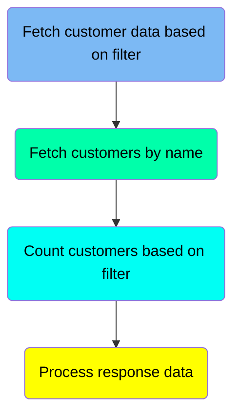

## <SwmToken path="src/webui/src/main/java/com/ibm/cics/cip/bankliberty/webui/data_access/CustomerList.java" pos="149:5:5" line-data="	public void doGet(int limit, int offset, String filter) throws IOException">`doGet`</SwmToken> function - Fetch customer data based on filter

Here is a diagram of this part:

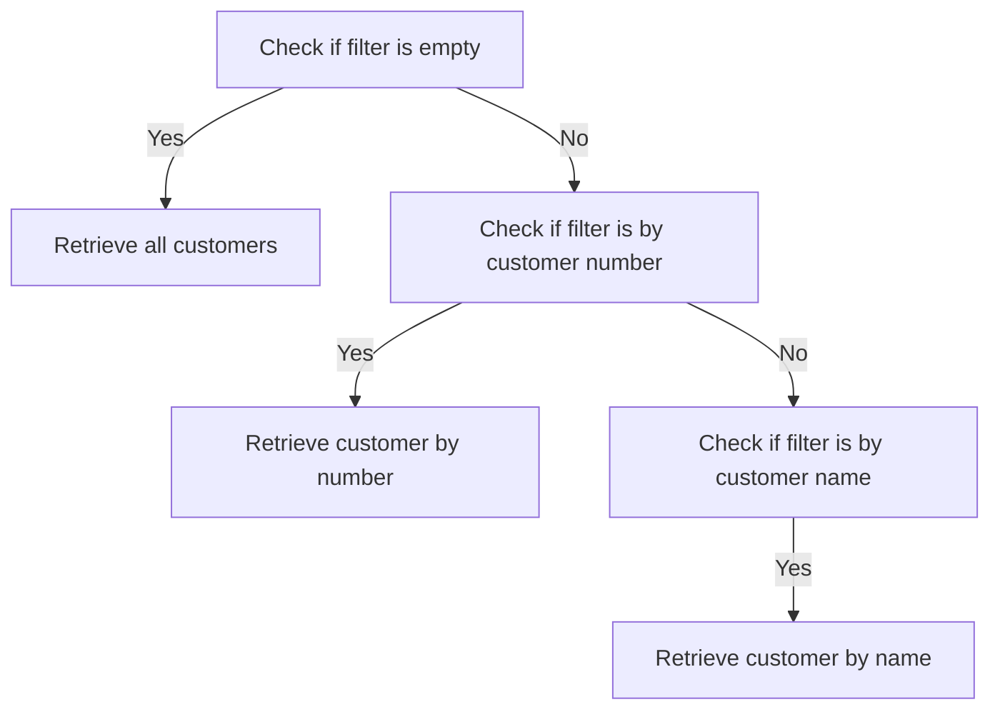

<SwmSnippet path="/src/webui/src/main/java/com/ibm/cics/cip/bankliberty/webui/data_access/CustomerList.java" line="160">

---

### Handling empty filter

When the filter is empty, the function retrieves all customers. This is done by calling the <SwmToken path="src/webui/src/main/java/com/ibm/cics/cip/bankliberty/webui/data_access/CustomerList.java" pos="164:2:2" line-data="						.getCustomersExternal(limit, offset, false);">`getCustomersExternal`</SwmToken> method with the parameters <SwmToken path="src/webui/src/main/java/com/ibm/cics/cip/bankliberty/webui/data_access/CustomerList.java" pos="164:4:4" line-data="						.getCustomersExternal(limit, offset, false);">`limit`</SwmToken>, <SwmToken path="src/webui/src/main/java/com/ibm/cics/cip/bankliberty/webui/data_access/CustomerList.java" pos="164:7:7" line-data="						.getCustomersExternal(limit, offset, false);">`offset`</SwmToken>, and `false` to indicate that no specific filter is applied.

```java
			if (filter.length() == 0)
			{

				myCustomerResponse = myCustomerResource
						.getCustomersExternal(limit, offset, false);
```

---

</SwmSnippet>

<SwmSnippet path="/src/webui/src/main/java/com/ibm/cics/cip/bankliberty/webui/data_access/CustomerList.java" line="167">

---

### Handling filter by customer number

If the filter starts with ' AND <SwmToken path="src/webui/src/main/java/com/ibm/cics/cip/bankliberty/webui/data_access/CustomerList.java" pos="167:12:12" line-data="			if (filter.startsWith(&quot; AND CUSTOMER_NUMBER = &quot;))">`CUSTOMER_NUMBER`</SwmToken> = ', the function extracts the customer number from the filter string, parses it to a <SwmToken path="src/webui/src/main/java/com/ibm/cics/cip/bankliberty/webui/data_access/CustomerList.java" pos="172:1:1" line-data="				Long customerNumber = Long.parseLong(customerNumberFilter);">`Long`</SwmToken>, and then retrieves the customer data by calling the <SwmToken path="src/webui/src/main/java/com/ibm/cics/cip/bankliberty/webui/data_access/CustomerList.java" pos="175:2:2" line-data="						.getCustomerExternal(customerNumber);">`getCustomerExternal`</SwmToken> method with the parsed customer number.

```java
			if (filter.startsWith(" AND CUSTOMER_NUMBER = "))
			{

				this.listOfCustomers.clear();
				String customerNumberFilter = filter.substring(23);
				Long customerNumber = Long.parseLong(customerNumberFilter);

				myCustomerResponse = myCustomerResource
						.getCustomerExternal(customerNumber);
```

---

</SwmSnippet>

## <SwmToken path="src/webui/src/main/java/com/ibm/cics/cip/bankliberty/webui/data_access/CustomerList.java" pos="149:5:5" line-data="	public void doGet(int limit, int offset, String filter) throws IOException">`doGet`</SwmToken> function - Fetch customers by name

Here is a diagram of this part:

```mermaid
graph TD
  A[Check if filter starts with ' AND CUSTOMER_NAME like '] --> B[Extract customer name filter] --> C[Retrieve customers by name]

%% Swimm:
%% graph TD
%%   A[Check if filter starts with ' AND <SwmToken path="src/webui/src/main/java/com/ibm/cics/cip/bankliberty/webui/data_access/CustomerList.java" pos="77:12:12" line-data="			if (filter.startsWith(&quot; AND CUSTOMER_NAME like &#39;&quot;))">`CUSTOMER_NAME`</SwmToken> like '] --> B[Extract customer name filter] --> C[Retrieve customers by name]
```

<SwmSnippet path="/src/webui/src/main/java/com/ibm/cics/cip/bankliberty/webui/data_access/CustomerList.java" line="178">

---

### Filtering customers by name

When the filter starts with ` AND `<SwmToken path="src/webui/src/main/java/com/ibm/cics/cip/bankliberty/webui/data_access/CustomerList.java" pos="178:12:12" line-data="			if (filter.startsWith(&quot; AND CUSTOMER_NAME like &#39;&quot;))">`CUSTOMER_NAME`</SwmToken>` `<SwmToken path="src/webui/src/main/java/com/ibm/cics/cip/bankliberty/webui/data_access/CustomerList.java" pos="178:14:14" line-data="			if (filter.startsWith(&quot; AND CUSTOMER_NAME like &#39;&quot;))">`like`</SwmToken>` '`, the function extracts the customer name filter from the input string. This is done by removing the first 25 characters and the last character from the filter string.

```java
			if (filter.startsWith(" AND CUSTOMER_NAME like '"))
			{
				String customerNameFilter = filter.substring(25);
				customerNameFilter = customerNameFilter.substring(0,
						customerNameFilter.length() - 1);
```

---

</SwmSnippet>

<SwmSnippet path="/src/webui/src/main/java/com/ibm/cics/cip/bankliberty/webui/data_access/CustomerList.java" line="184">

---

After extracting the customer name filter, the function calls <SwmToken path="src/webui/src/main/java/com/ibm/cics/cip/bankliberty/webui/data_access/CustomerList.java" pos="185:2:2" line-data="						.getCustomersByNameExternal(customerNameFilter, limit,">`getCustomersByNameExternal`</SwmToken> from the <SwmToken path="src/webui/src/main/java/com/ibm/cics/cip/bankliberty/webui/data_access/CustomerList.java" pos="20:16:16" line-data="import com.ibm.cics.cip.bankliberty.api.json.CustomerResource;">`CustomerResource`</SwmToken> class. This method retrieves the customers whose names match the filter, with the specified limit and offset for pagination.

```java
				myCustomerResponse = myCustomerResource
						.getCustomersByNameExternal(customerNameFilter, limit,
								offset, false);
```

---

</SwmSnippet>

## <SwmToken path="src/webui/src/main/java/com/ibm/cics/cip/bankliberty/webui/data_access/CustomerList.java" pos="149:5:5" line-data="	public void doGet(int limit, int offset, String filter) throws IOException">`doGet`</SwmToken> function - Count customers based on filter

Here is a diagram of this part:

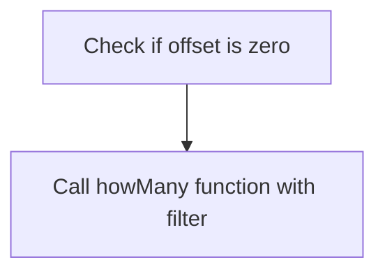

<SwmSnippet path="/src/webui/src/main/java/com/ibm/cics/cip/bankliberty/webui/data_access/CustomerList.java" line="189">

---

### Counting customers based on the filter

When the offset is zero, the function proceeds to count the number of customers that match the given filter. This is done by calling the <SwmToken path="src/webui/src/main/java/com/ibm/cics/cip/bankliberty/webui/data_access/CustomerList.java" pos="191:1:1" line-data="				howMany(filter);">`howMany`</SwmToken> function with the <SwmToken path="src/webui/src/main/java/com/ibm/cics/cip/bankliberty/webui/data_access/CustomerList.java" pos="191:3:3" line-data="				howMany(filter);">`filter`</SwmToken> parameter.

```java
			if (offset == 0)
			{
				howMany(filter);
			}
```

---

</SwmSnippet>

## <SwmToken path="src/webui/src/main/java/com/ibm/cics/cip/bankliberty/webui/data_access/CustomerList.java" pos="149:5:5" line-data="	public void doGet(int limit, int offset, String filter) throws IOException">`doGet`</SwmToken> function - Process response data

Here is a diagram of this part:

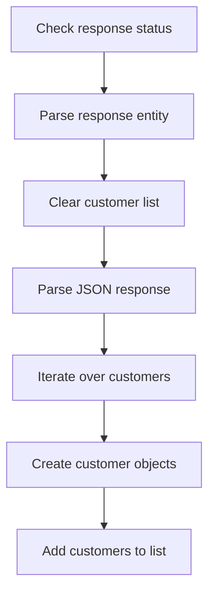

<SwmSnippet path="/src/webui/src/main/java/com/ibm/cics/cip/bankliberty/webui/data_access/CustomerList.java" line="198">

---

### Check response status

The function first checks if the response status is 200, indicating a successful response.

```java
			if (myCustomerResponse.getStatus() == 200)
```

---

</SwmSnippet>

<SwmSnippet path="/src/webui/src/main/java/com/ibm/cics/cip/bankliberty/webui/data_access/CustomerList.java" line="200">

---

### Parse response entity

If the response status is 200, the function retrieves the response entity as a string and clears the current list of customers.

```java
				myCustomerString = myCustomerResponse.getEntity().toString();
				this.listOfCustomers.clear();
```

---

</SwmSnippet>

<SwmSnippet path="/src/webui/src/main/java/com/ibm/cics/cip/bankliberty/webui/data_access/CustomerList.java" line="203">

---

### Parse JSON response

The function then parses the response string into a JSON object and retrieves the array of customers from the JSON object.

```java
				JSONObject myCustomersJSON = JSONObject.parse(myCustomerString);
				JSONArray myCustomersArrayJSON = (JSONArray) myCustomersJSON
						.get(JSON_CUSTOMERS);
```

---

</SwmSnippet>

<SwmSnippet path="/src/webui/src/main/java/com/ibm/cics/cip/bankliberty/webui/data_access/CustomerList.java" line="210">

---

### Iterate over customers

If the array of customers is not null, the function iterates over each customer in the array.

```java
					for (int i = 0; i < customerCount; i++)
					{
```

---

</SwmSnippet>

<SwmSnippet path="/src/webui/src/main/java/com/ibm/cics/cip/bankliberty/webui/data_access/CustomerList.java" line="212">

---

### Create customer objects

For each customer, the function extracts the relevant data, such as date of birth and credit score review date, and creates a new <SwmToken path="src/webui/src/main/java/com/ibm/cics/cip/bankliberty/webui/data_access/CustomerList.java" pos="222:1:1" line-data="						Customer myListCustomer = new Customer(id,">`Customer`</SwmToken> object.

```java
						JSONObject myCustomer = (JSONObject) myCustomersArrayJSON
								.get(i);
						Date dateOfBirth = sortOutDate(
								(String) myCustomer.get(JSON_DATE_OF_BIRTH));
						Date creditScoreReviewDate = sortOutDate(
								(String) myCustomer
										.get(JSON_CUSTOMER_REVIEW_DATE));

						String id = (String) myCustomer.get(JSON_ID);

						Customer myListCustomer = new Customer(id,
								(String) myCustomer.get(JSON_SORT_CODE),
								(String) myCustomer.get(JSON_CUSTOMER_NAME),
								(String) myCustomer.get(JSON_CUSTOMER_ADDRESS),
								dateOfBirth,
								(String) myCustomer
										.get(JSON_CUSTOMER_CREDIT_SCORE),
								creditScoreReviewDate);

```

---

</SwmSnippet>

<SwmSnippet path="/src/webui/src/main/java/com/ibm/cics/cip/bankliberty/webui/data_access/CustomerList.java" line="231">

---

### Add customers to list

The newly created <SwmToken path="src/webui/src/main/java/com/ibm/cics/cip/bankliberty/webui/data_access/CustomerList.java" pos="222:1:1" line-data="						Customer myListCustomer = new Customer(id,">`Customer`</SwmToken> object is then added to the list of customers.

```java
						this.listOfCustomers.add(myListCustomer);
					}
```

---

</SwmSnippet>

## Breaking down <SwmToken path="src/webui/src/main/java/com/ibm/cics/cip/bankliberty/webui/data_access/CustomerList.java" pos="191:1:1" line-data="				howMany(filter);">`howMany`</SwmToken>

```mermaid
graph TD
  subgraph howMany
    howMany:A["Create CustomerResource instance"] --> howMany:B["Check if filter starts with ' AND CUSTOMER_NAME like '"]
    howMany:B -->|Yes| howMany:C["Extract customer name from filter"]
    howMany:C --> howMany:D["Retrieve customers by name"]
    howMany:D --> howMany:E["Parse customer data"]
    howMany:E --> howMany:F["Get customer count"]
    
    howMany:B -->|No| howMany:G["Check if filter starts with ' AND CUSTOMER_NUMBER = '"]
    howMany:G -->|Yes| howMany:H["Extract customer number from filter"]
    howMany:H --> howMany:I["Retrieve customer by number"]
    howMany:I --> howMany:J["Parse customer data"]
    howMany:J --> howMany:K["Set count based on customer existence"]
    
    howMany:G -->|No| howMany:L["Check if filter is empty"]
    howMany:L -->|Yes| howMany:M["Retrieve all customers"]
    howMany:M --> howMany:N["Parse customer data"]
    howMany:N --> howMany:O["Get customer count"]
  end

%% Swimm:
%% graph TD
%%   subgraph <SwmToken path="src/webui/src/main/java/com/ibm/cics/cip/bankliberty/webui/data_access/CustomerList.java" pos="191:1:1" line-data="				howMany(filter);">`howMany`</SwmToken>
%%     <SwmToken path="src/webui/src/main/java/com/ibm/cics/cip/bankliberty/webui/data_access/CustomerList.java" pos="191:1:1" line-data="				howMany(filter);">`howMany`</SwmToken>:A["Create <SwmToken path="src/webui/src/main/java/com/ibm/cics/cip/bankliberty/webui/data_access/CustomerList.java" pos="20:16:16" line-data="import com.ibm.cics.cip.bankliberty.api.json.CustomerResource;">`CustomerResource`</SwmToken> instance"] --> <SwmToken path="src/webui/src/main/java/com/ibm/cics/cip/bankliberty/webui/data_access/CustomerList.java" pos="191:1:1" line-data="				howMany(filter);">`howMany`</SwmToken>:B["Check if filter starts with ' AND <SwmToken path="src/webui/src/main/java/com/ibm/cics/cip/bankliberty/webui/data_access/CustomerList.java" pos="77:12:12" line-data="			if (filter.startsWith(&quot; AND CUSTOMER_NAME like &#39;&quot;))">`CUSTOMER_NAME`</SwmToken> like '"]
%%     <SwmToken path="src/webui/src/main/java/com/ibm/cics/cip/bankliberty/webui/data_access/CustomerList.java" pos="191:1:1" line-data="				howMany(filter);">`howMany`</SwmToken>:B -->|Yes| <SwmToken path="src/webui/src/main/java/com/ibm/cics/cip/bankliberty/webui/data_access/CustomerList.java" pos="191:1:1" line-data="				howMany(filter);">`howMany`</SwmToken>:C["Extract customer name from filter"]
%%     <SwmToken path="src/webui/src/main/java/com/ibm/cics/cip/bankliberty/webui/data_access/CustomerList.java" pos="191:1:1" line-data="				howMany(filter);">`howMany`</SwmToken>:C --> <SwmToken path="src/webui/src/main/java/com/ibm/cics/cip/bankliberty/webui/data_access/CustomerList.java" pos="191:1:1" line-data="				howMany(filter);">`howMany`</SwmToken>:D["Retrieve customers by name"]
%%     <SwmToken path="src/webui/src/main/java/com/ibm/cics/cip/bankliberty/webui/data_access/CustomerList.java" pos="191:1:1" line-data="				howMany(filter);">`howMany`</SwmToken>:D --> <SwmToken path="src/webui/src/main/java/com/ibm/cics/cip/bankliberty/webui/data_access/CustomerList.java" pos="191:1:1" line-data="				howMany(filter);">`howMany`</SwmToken>:E["Parse customer data"]
%%     <SwmToken path="src/webui/src/main/java/com/ibm/cics/cip/bankliberty/webui/data_access/CustomerList.java" pos="191:1:1" line-data="				howMany(filter);">`howMany`</SwmToken>:E --> <SwmToken path="src/webui/src/main/java/com/ibm/cics/cip/bankliberty/webui/data_access/CustomerList.java" pos="191:1:1" line-data="				howMany(filter);">`howMany`</SwmToken>:F["Get customer count"]
%%     
%%     <SwmToken path="src/webui/src/main/java/com/ibm/cics/cip/bankliberty/webui/data_access/CustomerList.java" pos="191:1:1" line-data="				howMany(filter);">`howMany`</SwmToken>:B -->|No| <SwmToken path="src/webui/src/main/java/com/ibm/cics/cip/bankliberty/webui/data_access/CustomerList.java" pos="191:1:1" line-data="				howMany(filter);">`howMany`</SwmToken>:G["Check if filter starts with ' AND <SwmToken path="src/webui/src/main/java/com/ibm/cics/cip/bankliberty/webui/data_access/CustomerList.java" pos="97:12:12" line-data="			if (filter.startsWith(&quot; AND CUSTOMER_NUMBER = &quot;))">`CUSTOMER_NUMBER`</SwmToken> = '"]
%%     <SwmToken path="src/webui/src/main/java/com/ibm/cics/cip/bankliberty/webui/data_access/CustomerList.java" pos="191:1:1" line-data="				howMany(filter);">`howMany`</SwmToken>:G -->|Yes| <SwmToken path="src/webui/src/main/java/com/ibm/cics/cip/bankliberty/webui/data_access/CustomerList.java" pos="191:1:1" line-data="				howMany(filter);">`howMany`</SwmToken>:H["Extract customer number from filter"]
%%     <SwmToken path="src/webui/src/main/java/com/ibm/cics/cip/bankliberty/webui/data_access/CustomerList.java" pos="191:1:1" line-data="				howMany(filter);">`howMany`</SwmToken>:H --> <SwmToken path="src/webui/src/main/java/com/ibm/cics/cip/bankliberty/webui/data_access/CustomerList.java" pos="191:1:1" line-data="				howMany(filter);">`howMany`</SwmToken>:I["Retrieve customer by number"]
%%     <SwmToken path="src/webui/src/main/java/com/ibm/cics/cip/bankliberty/webui/data_access/CustomerList.java" pos="191:1:1" line-data="				howMany(filter);">`howMany`</SwmToken>:I --> <SwmToken path="src/webui/src/main/java/com/ibm/cics/cip/bankliberty/webui/data_access/CustomerList.java" pos="191:1:1" line-data="				howMany(filter);">`howMany`</SwmToken>:J["Parse customer data"]
%%     <SwmToken path="src/webui/src/main/java/com/ibm/cics/cip/bankliberty/webui/data_access/CustomerList.java" pos="191:1:1" line-data="				howMany(filter);">`howMany`</SwmToken>:J --> <SwmToken path="src/webui/src/main/java/com/ibm/cics/cip/bankliberty/webui/data_access/CustomerList.java" pos="191:1:1" line-data="				howMany(filter);">`howMany`</SwmToken>:K["Set count based on customer existence"]
%%     
%%     <SwmToken path="src/webui/src/main/java/com/ibm/cics/cip/bankliberty/webui/data_access/CustomerList.java" pos="191:1:1" line-data="				howMany(filter);">`howMany`</SwmToken>:G -->|No| <SwmToken path="src/webui/src/main/java/com/ibm/cics/cip/bankliberty/webui/data_access/CustomerList.java" pos="191:1:1" line-data="				howMany(filter);">`howMany`</SwmToken>:L["Check if filter is empty"]
%%     <SwmToken path="src/webui/src/main/java/com/ibm/cics/cip/bankliberty/webui/data_access/CustomerList.java" pos="191:1:1" line-data="				howMany(filter);">`howMany`</SwmToken>:L -->|Yes| <SwmToken path="src/webui/src/main/java/com/ibm/cics/cip/bankliberty/webui/data_access/CustomerList.java" pos="191:1:1" line-data="				howMany(filter);">`howMany`</SwmToken>:M["Retrieve all customers"]
%%     <SwmToken path="src/webui/src/main/java/com/ibm/cics/cip/bankliberty/webui/data_access/CustomerList.java" pos="191:1:1" line-data="				howMany(filter);">`howMany`</SwmToken>:M --> <SwmToken path="src/webui/src/main/java/com/ibm/cics/cip/bankliberty/webui/data_access/CustomerList.java" pos="191:1:1" line-data="				howMany(filter);">`howMany`</SwmToken>:N["Parse customer data"]
%%     <SwmToken path="src/webui/src/main/java/com/ibm/cics/cip/bankliberty/webui/data_access/CustomerList.java" pos="191:1:1" line-data="				howMany(filter);">`howMany`</SwmToken>:N --> <SwmToken path="src/webui/src/main/java/com/ibm/cics/cip/bankliberty/webui/data_access/CustomerList.java" pos="191:1:1" line-data="				howMany(filter);">`howMany`</SwmToken>:O["Get customer count"]
%%   end
```

<SwmSnippet path="/src/webui/src/main/java/com/ibm/cics/cip/bankliberty/webui/data_access/CustomerList.java" line="77">

---

## Filtering customers by name

First, the method checks if the filter starts with 'AND <SwmToken path="src/webui/src/main/java/com/ibm/cics/cip/bankliberty/webui/data_access/CustomerList.java" pos="77:12:12" line-data="			if (filter.startsWith(&quot; AND CUSTOMER_NAME like &#39;&quot;))">`CUSTOMER_NAME`</SwmToken> like'. If it does, it extracts the customer name from the filter string and calls <SwmToken path="src/webui/src/main/java/com/ibm/cics/cip/bankliberty/webui/data_access/CustomerList.java" pos="85:2:2" line-data="						.getCustomersByNameExternal(customerNameFilter, 0, 0,">`getCustomersByNameExternal`</SwmToken> to retrieve customers matching the name. The response is then parsed to get the number of matching customers.

```java
			if (filter.startsWith(" AND CUSTOMER_NAME like '"))
			{

				String customerNameFilter = filter.substring(25);
				customerNameFilter = customerNameFilter.substring(0,
						customerNameFilter.length() - 1);

				myCustomerResponse = myCustomerResource
						.getCustomersByNameExternal(customerNameFilter, 0, 0,
								true);
				String myCustomersString = myCustomerResponse.getEntity()
						.toString();
				JSONObject myCustomersJSON;
				myCustomersJSON = JSONObject.parse(myCustomersString);
				long customerCount = (Long) myCustomersJSON
						.get(JSON_NUMBER_OF_CUSTOMERS);
				this.count = (int) customerCount;
			}
```

---

</SwmSnippet>

<SwmSnippet path="/src/webui/src/main/java/com/ibm/cics/cip/bankliberty/webui/data_access/CustomerList.java" line="97">

---

## Filtering customers by number

Next, if the filter starts with 'AND <SwmToken path="src/webui/src/main/java/com/ibm/cics/cip/bankliberty/webui/data_access/CustomerList.java" pos="97:12:12" line-data="			if (filter.startsWith(&quot; AND CUSTOMER_NUMBER = &quot;))">`CUSTOMER_NUMBER`</SwmToken> =', the method extracts the customer number from the filter string and calls <SwmToken path="src/webui/src/main/java/com/ibm/cics/cip/bankliberty/webui/data_access/CustomerList.java" pos="103:2:2" line-data="						.getCustomerExternal(customerNumber);">`getCustomerExternal`</SwmToken> to retrieve the customer with the specified number. If the response status is 200, it indicates that a matching customer was found, and the count is set to 1.

```java
			if (filter.startsWith(" AND CUSTOMER_NUMBER = "))
			{
				String customerNumberFilter = filter.substring(23);
				Long customerNumber = Long.parseLong(customerNumberFilter);

				myCustomerResponse = myCustomerResource
						.getCustomerExternal(customerNumber);
				String myCustomersString = myCustomerResponse.getEntity()
						.toString();
				JSONObject myCustomerJSON;
				this.count = 0;
				if (myCustomerResponse.getStatus() == 200)
				{
					myCustomerJSON = JSONObject.parse(myCustomersString);
					String id = (String) myCustomerJSON.get(JSON_ID);
					if (id != null)
					{
						this.count = 1;
					}
				}
			}
```

---

</SwmSnippet>

<SwmSnippet path="/src/webui/src/main/java/com/ibm/cics/cip/bankliberty/webui/data_access/CustomerList.java" line="119">

---

## Retrieving all customers

Finally, if the filter is empty, the method calls <SwmToken path="src/webui/src/main/java/com/ibm/cics/cip/bankliberty/webui/data_access/CustomerList.java" pos="123:2:2" line-data="						.getCustomersExternal(250000, 0, true);">`getCustomersExternal`</SwmToken> to retrieve all customers with a limit of 250,000. The response is then parsed to get the total number of customers.

```java
			if (filter.length() == 0)
			{

				myCustomerResponse = myCustomerResource
						.getCustomersExternal(250000, 0, true);
				String myCustomersString = myCustomerResponse.getEntity()
						.toString();
				if (myCustomerResponse.getStatus() == 200)
				{
					JSONObject myCustomersJSON;
					myCustomersJSON = JSONObject.parse(myCustomersString);
					long customerCount = (Long) myCustomersJSON
							.get(JSON_NUMBER_OF_CUSTOMERS);
					this.count = (int) customerCount;

				}
				else
				{
					logger.log(Level.SEVERE, () -> "Error getting customers");
				}
			}
```

---

</SwmSnippet>

## Exploring <SwmToken path="src/webui/src/main/java/com/ibm/cics/cip/bankliberty/webui/data_access/CustomerList.java" pos="85:2:2" line-data="						.getCustomersByNameExternal(customerNameFilter, 0, 0,">`getCustomersByNameExternal`</SwmToken>

```mermaid
graph TD
  subgraph getCustomersByNameExternal
    getCustomersByNameExternal:A["Parse countOnly to boolean"] --> getCustomersByNameExternal:B["Set default values for limit and offset"]
    getCustomersByNameExternal:B --> getCustomersByNameExternal:C["Invoke getCustomersByNameInternal"]
    getCustomersByNameExternal:C --> getCustomersByNameExternal:D["Terminate HBankDataAccess"]
  end

%% Swimm:
%% graph TD
%%   subgraph <SwmToken path="src/webui/src/main/java/com/ibm/cics/cip/bankliberty/webui/data_access/CustomerList.java" pos="85:2:2" line-data="						.getCustomersByNameExternal(customerNameFilter, 0, 0,">`getCustomersByNameExternal`</SwmToken>
%%     <SwmToken path="src/webui/src/main/java/com/ibm/cics/cip/bankliberty/webui/data_access/CustomerList.java" pos="85:2:2" line-data="						.getCustomersByNameExternal(customerNameFilter, 0, 0,">`getCustomersByNameExternal`</SwmToken>:A["Parse <SwmToken path="src/webui/src/main/java/com/ibm/cics/cip/bankliberty/api/json/CustomerResource.java" pos="950:4:4" line-data="		if (countOnly != null)">`countOnly`</SwmToken> to boolean"] --> <SwmToken path="src/webui/src/main/java/com/ibm/cics/cip/bankliberty/webui/data_access/CustomerList.java" pos="85:2:2" line-data="						.getCustomersByNameExternal(customerNameFilter, 0, 0,">`getCustomersByNameExternal`</SwmToken>:B["Set default values for limit and offset"]
%%     <SwmToken path="src/webui/src/main/java/com/ibm/cics/cip/bankliberty/webui/data_access/CustomerList.java" pos="85:2:2" line-data="						.getCustomersByNameExternal(customerNameFilter, 0, 0,">`getCustomersByNameExternal`</SwmToken>:B --> <SwmToken path="src/webui/src/main/java/com/ibm/cics/cip/bankliberty/webui/data_access/CustomerList.java" pos="85:2:2" line-data="						.getCustomersByNameExternal(customerNameFilter, 0, 0,">`getCustomersByNameExternal`</SwmToken>:C["Invoke <SwmToken path="src/webui/src/main/java/com/ibm/cics/cip/bankliberty/api/json/CustomerResource.java" pos="1088:7:7" line-data="		Response myResponse = getCustomersByNameInternal(name, limit, offset,">`getCustomersByNameInternal`</SwmToken>"]
%%     <SwmToken path="src/webui/src/main/java/com/ibm/cics/cip/bankliberty/webui/data_access/CustomerList.java" pos="85:2:2" line-data="						.getCustomersByNameExternal(customerNameFilter, 0, 0,">`getCustomersByNameExternal`</SwmToken>:C --> <SwmToken path="src/webui/src/main/java/com/ibm/cics/cip/bankliberty/webui/data_access/CustomerList.java" pos="85:2:2" line-data="						.getCustomersByNameExternal(customerNameFilter, 0, 0,">`getCustomersByNameExternal`</SwmToken>:D["Terminate <SwmToken path="src/webui/src/main/java/com/ibm/cics/cip/bankliberty/api/json/CustomerResource.java" pos="956:1:1" line-data="		HBankDataAccess myHBankDataAccess = new HBankDataAccess();">`HBankDataAccess`</SwmToken>"]
%%   end
```

<SwmSnippet path="/src/webui/src/main/java/com/ibm/cics/cip/bankliberty/api/json/CustomerResource.java" line="1057">

---

## Handling customer retrieval with pagination and count options

First, the method <SwmToken path="src/webui/src/main/java/com/ibm/cics/cip/bankliberty/api/json/CustomerResource.java" pos="1060:5:5" line-data="	public Response getCustomersByNameExternal(@QueryParam(&quot;name&quot;) String name,">`getCustomersByNameExternal`</SwmToken> is called to handle the retrieval of customer information based on the provided name. This method supports pagination through the <SwmToken path="src/webui/src/main/java/com/ibm/cics/cip/bankliberty/api/json/CustomerResource.java" pos="1061:5:5" line-data="			@QueryParam(&quot;limit&quot;) Integer limit,">`limit`</SwmToken> and <SwmToken path="src/webui/src/main/java/com/ibm/cics/cip/bankliberty/api/json/CustomerResource.java" pos="1062:5:5" line-data="			@QueryParam(&quot;offset&quot;) Integer offset,">`offset`</SwmToken> parameters, and it can also return just the count of matching customers if the <SwmToken path="src/webui/src/main/java/com/ibm/cics/cip/bankliberty/api/json/CustomerResource.java" pos="1063:5:5" line-data="			@QueryParam(&quot;countOnly&quot;) Boolean countOnly)">`countOnly`</SwmToken> parameter is set to true.

```java
	@GET
	@Path("/name")
	@Produces(MediaType.APPLICATION_JSON)
	public Response getCustomersByNameExternal(@QueryParam("name") String name,
			@QueryParam("limit") Integer limit,
			@QueryParam("offset") Integer offset,
			@QueryParam("countOnly") Boolean countOnly)
	{
		logger.entering(this.getClass().getName(),
				"getCustomersByNameExternal(String name, Integer limit, Integer offset, Boolean countOnly) "
						+ name + " " + limit + " " + offset + " " + countOnly);

		boolean countOnlyReal = false;
		if (countOnly != null)
		{
			countOnlyReal = countOnly.booleanValue();
		}
		if (offset == null)
		{
			offset = 0;
		}
```

---

</SwmSnippet>

<SwmSnippet path="/src/webui/src/main/java/com/ibm/cics/cip/bankliberty/api/json/CustomerResource.java" line="1074">

---

### Setting default values

Next, the method sets default values for the <SwmToken path="src/webui/src/main/java/com/ibm/cics/cip/bankliberty/api/json/CustomerResource.java" pos="1079:4:4" line-data="		if (limit == null)">`limit`</SwmToken> and <SwmToken path="src/webui/src/main/java/com/ibm/cics/cip/bankliberty/api/json/CustomerResource.java" pos="1074:4:4" line-data="		if (offset == null)">`offset`</SwmToken> parameters if they are not provided. The default <SwmToken path="src/webui/src/main/java/com/ibm/cics/cip/bankliberty/api/json/CustomerResource.java" pos="1079:4:4" line-data="		if (limit == null)">`limit`</SwmToken> is set to 250,000, and the default <SwmToken path="src/webui/src/main/java/com/ibm/cics/cip/bankliberty/api/json/CustomerResource.java" pos="1074:4:4" line-data="		if (offset == null)">`offset`</SwmToken> is set to 0. This ensures that the method can handle large datasets efficiently.

```java
		if (offset == null)
		{
			offset = 0;
		}

		if (limit == null)
		{
			limit = 250000;
		}

		if (limit.intValue() == 0)
		{
			limit = 250000;
		}
```

---

</SwmSnippet>

<SwmSnippet path="/src/webui/src/main/java/com/ibm/cics/cip/bankliberty/api/json/CustomerResource.java" line="1088">

---

### Calling internal method for customer retrieval

Then, the method calls <SwmToken path="src/webui/src/main/java/com/ibm/cics/cip/bankliberty/api/json/CustomerResource.java" pos="1088:7:7" line-data="		Response myResponse = getCustomersByNameInternal(name, limit, offset,">`getCustomersByNameInternal`</SwmToken> with the processed parameters to perform the actual retrieval of customer data. This internal method handles the database interactions and returns the customer information or count based on the <SwmToken path="src/webui/src/main/java/com/ibm/cics/cip/bankliberty/api/json/CustomerResource.java" pos="950:4:4" line-data="		if (countOnly != null)">`countOnly`</SwmToken> flag.

```java
		Response myResponse = getCustomersByNameInternal(name, limit, offset,
				countOnlyReal);
```

---

</SwmSnippet>

<SwmSnippet path="/src/webui/src/main/java/com/ibm/cics/cip/bankliberty/api/json/CustomerResource.java" line="1090">

---

### Terminating data access

Finally, the method terminates the data access session by calling <SwmToken path="src/webui/src/main/java/com/ibm/cics/cip/bankliberty/api/json/CustomerResource.java" pos="1091:1:5" line-data="		myHBankDataAccess.terminate();">`myHBankDataAccess.terminate()`</SwmToken>. This ensures that all resources are properly released and any open connections are closed.

```java
		HBankDataAccess myHBankDataAccess = new HBankDataAccess();
		myHBankDataAccess.terminate();
```

---

</SwmSnippet>

## Diving into the <SwmToken path="src/webui/src/main/java/com/ibm/cics/cip/bankliberty/api/json/CustomerResource.java" pos="1125:7:7" line-data="			myCustomers = vsamCustomer.getCustomersByName(sortCode.intValue(),">`getCustomersByName`</SwmToken> function

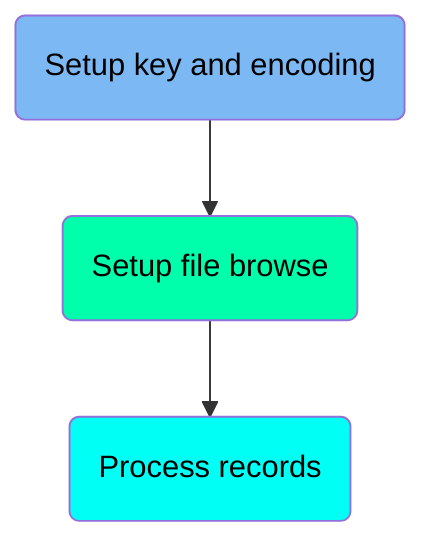

## <SwmToken path="src/webui/src/main/java/com/ibm/cics/cip/bankliberty/api/json/CustomerResource.java" pos="1125:7:7" line-data="			myCustomers = vsamCustomer.getCustomersByName(sortCode.intValue(),">`getCustomersByName`</SwmToken> function - Setup key and encoding

Here is a diagram of this part:

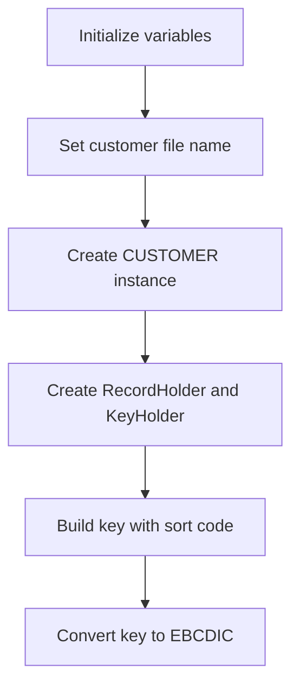

### Set customer file name

### Initialize variables

The function begins by initializing the variable <SwmToken path="src/webui/src/main/java/com/ibm/cics/cip/bankliberty/web/vsam/Customer.java" pos="1156:8:8" line-data="			while (carryOn &amp;&amp; stored &lt; limit)">`stored`</SwmToken> to 0, which will be used to keep track of the number of customers processed.

<SwmSnippet path="/src/webui/src/main/java/com/ibm/cics/cip/bankliberty/web/vsam/Customer.java" line="1127">

---

Next, the customer file name is set to <SwmToken path="src/webui/src/main/java/com/ibm/cics/cip/bankliberty/web/vsam/Customer.java" pos="1127:5:5" line-data="		customerFile.setName(FILENAME);">`FILENAME`</SwmToken>, ensuring that the correct file is accessed for retrieving customer data.

```java
		customerFile.setName(FILENAME);
```

---

</SwmSnippet>

<SwmSnippet path="/src/webui/src/main/java/com/ibm/cics/cip/bankliberty/web/vsam/Customer.java" line="1129">

---

### Create CUSTOMER instance

An instance of the <SwmToken path="src/webui/src/main/java/com/ibm/cics/cip/bankliberty/web/vsam/Customer.java" pos="1129:7:7" line-data="		myCustomer = new CUSTOMER();">`CUSTOMER`</SwmToken> class is created and assigned to <SwmToken path="src/webui/src/main/java/com/ibm/cics/cip/bankliberty/web/vsam/Customer.java" pos="1129:1:1" line-data="		myCustomer = new CUSTOMER();">`myCustomer`</SwmToken>, which will hold the customer data during processing.

```java
		myCustomer = new CUSTOMER();
```

---

</SwmSnippet>

<SwmSnippet path="/src/webui/src/main/java/com/ibm/cics/cip/bankliberty/web/vsam/Customer.java" line="1131">

---

### Create <SwmToken path="src/webui/src/main/java/com/ibm/cics/cip/bankliberty/web/vsam/Customer.java" pos="1131:7:7" line-data="		holder = new RecordHolder();">`RecordHolder`</SwmToken> and <SwmToken path="src/webui/src/main/java/com/ibm/cics/cip/bankliberty/web/vsam/Customer.java" pos="1132:7:7" line-data="		keyHolder = new KeyHolder();">`KeyHolder`</SwmToken>

Instances of <SwmToken path="src/webui/src/main/java/com/ibm/cics/cip/bankliberty/web/vsam/Customer.java" pos="1131:7:7" line-data="		holder = new RecordHolder();">`RecordHolder`</SwmToken> and <SwmToken path="src/webui/src/main/java/com/ibm/cics/cip/bankliberty/web/vsam/Customer.java" pos="1132:7:7" line-data="		keyHolder = new KeyHolder();">`KeyHolder`</SwmToken> are created and assigned to <SwmToken path="src/webui/src/main/java/com/ibm/cics/cip/bankliberty/web/vsam/Customer.java" pos="1131:1:1" line-data="		holder = new RecordHolder();">`holder`</SwmToken> and <SwmToken path="src/webui/src/main/java/com/ibm/cics/cip/bankliberty/web/vsam/Customer.java" pos="1132:1:1" line-data="		keyHolder = new KeyHolder();">`keyHolder`</SwmToken> respectively. These will be used to manage the records and keys during the file browsing process.

```java
		holder = new RecordHolder();
		keyHolder = new KeyHolder();
```

---

</SwmSnippet>

<SwmSnippet path="/src/webui/src/main/java/com/ibm/cics/cip/bankliberty/web/vsam/Customer.java" line="1133">

---

### Build key with sort code

The <SwmToken path="src/webui/src/main/java/com/ibm/cics/cip/bankliberty/web/vsam/Customer.java" pos="1133:9:9" line-data="		byte[] key = buildKey(sortCode, 0);">`buildKey`</SwmToken> method is called with the <SwmToken path="src/webui/src/main/java/com/ibm/cics/cip/bankliberty/web/vsam/Customer.java" pos="1133:11:11" line-data="		byte[] key = buildKey(sortCode, 0);">`sortCode`</SwmToken> and 0 as parameters to generate a key for the customer file. This key is essential for locating the correct records in the file.

```java
		byte[] key = buildKey(sortCode, 0);
```

---

</SwmSnippet>

<SwmSnippet path="/src/webui/src/main/java/com/ibm/cics/cip/bankliberty/web/vsam/Customer.java" line="1136">

---

### Convert key to EBCDIC

The generated key is then converted to a string and subsequently encoded to EBCDIC using the specified <SwmToken path="src/webui/src/main/java/com/ibm/cics/cip/bankliberty/web/vsam/Customer.java" pos="1139:9:9" line-data="			key = keyString.getBytes(CODEPAGE);">`CODEPAGE`</SwmToken>. This encoding is necessary for compatibility with the customer file's format.

```java
		String keyString = new String(key);
		try
		{
			key = keyString.getBytes(CODEPAGE);
```

---

</SwmSnippet>

## <SwmToken path="src/webui/src/main/java/com/ibm/cics/cip/bankliberty/api/json/CustomerResource.java" pos="1125:7:7" line-data="			myCustomers = vsamCustomer.getCustomersByName(sortCode.intValue(),">`getCustomersByName`</SwmToken> function - Setup file browse

Here is a diagram of this part:

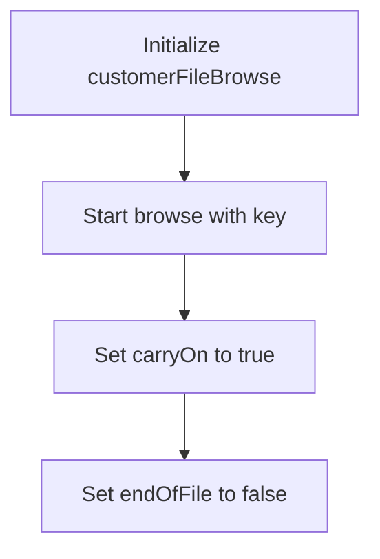

<SwmSnippet path="/src/webui/src/main/java/com/ibm/cics/cip/bankliberty/web/vsam/Customer.java" line="1149">

---

### Starting the browse operation

The <SwmToken path="src/webui/src/main/java/com/ibm/cics/cip/bankliberty/api/json/CustomerResource.java" pos="1125:7:7" line-data="			myCustomers = vsamCustomer.getCustomersByName(sortCode.intValue(),">`getCustomersByName`</SwmToken> function begins by initializing a <SwmToken path="src/webui/src/main/java/com/ibm/cics/cip/bankliberty/web/vsam/Customer.java" pos="1149:1:1" line-data="		KeyedFileBrowse customerFileBrowse = null;">`KeyedFileBrowse`</SwmToken> object named <SwmToken path="src/webui/src/main/java/com/ibm/cics/cip/bankliberty/web/vsam/Customer.java" pos="1149:3:3" line-data="		KeyedFileBrowse customerFileBrowse = null;">`customerFileBrowse`</SwmToken> to null. This object will be used to iterate over the customer records in the file.

```java
		KeyedFileBrowse customerFileBrowse = null;
		try
```

---

</SwmSnippet>

<SwmSnippet path="/src/webui/src/main/java/com/ibm/cics/cip/bankliberty/web/vsam/Customer.java" line="1151">

---

### Initializing the browse state

Next, the function attempts to start the browse operation using the <SwmToken path="src/webui/src/main/java/com/ibm/cics/cip/bankliberty/web/vsam/Customer.java" pos="1153:7:7" line-data="			customerFileBrowse = customerFile.startBrowse(key);">`startBrowse`</SwmToken> method on the <SwmToken path="src/webui/src/main/java/com/ibm/cics/cip/bankliberty/web/vsam/Customer.java" pos="1153:5:5" line-data="			customerFileBrowse = customerFile.startBrowse(key);">`customerFile`</SwmToken> object, passing the <SwmToken path="src/webui/src/main/java/com/ibm/cics/cip/bankliberty/web/vsam/Customer.java" pos="1153:9:9" line-data="			customerFileBrowse = customerFile.startBrowse(key);">`key`</SwmToken> as an argument. This sets up the <SwmToken path="src/webui/src/main/java/com/ibm/cics/cip/bankliberty/web/vsam/Customer.java" pos="1153:1:1" line-data="			customerFileBrowse = customerFile.startBrowse(key);">`customerFileBrowse`</SwmToken> object to begin reading records from the file. Additionally, two boolean variables, <SwmToken path="src/webui/src/main/java/com/ibm/cics/cip/bankliberty/web/vsam/Customer.java" pos="1154:3:3" line-data="			boolean carryOn = true;">`carryOn`</SwmToken> and <SwmToken path="src/webui/src/main/java/com/ibm/cics/cip/bankliberty/web/vsam/Customer.java" pos="1155:3:3" line-data="			boolean endOfFile = false;">`endOfFile`</SwmToken>, are initialized to `true` and `false` respectively. These variables will control the flow of the browse operation, determining whether to continue reading records or if the end of the file has been reached.

```java
		{

			customerFileBrowse = customerFile.startBrowse(key);
			boolean carryOn = true;
			boolean endOfFile = false;
```

---

</SwmSnippet>

## <SwmToken path="src/webui/src/main/java/com/ibm/cics/cip/bankliberty/api/json/CustomerResource.java" pos="1125:7:7" line-data="			myCustomers = vsamCustomer.getCustomersByName(sortCode.intValue(),">`getCustomersByName`</SwmToken> function - Process records

Here is a diagram of this part:

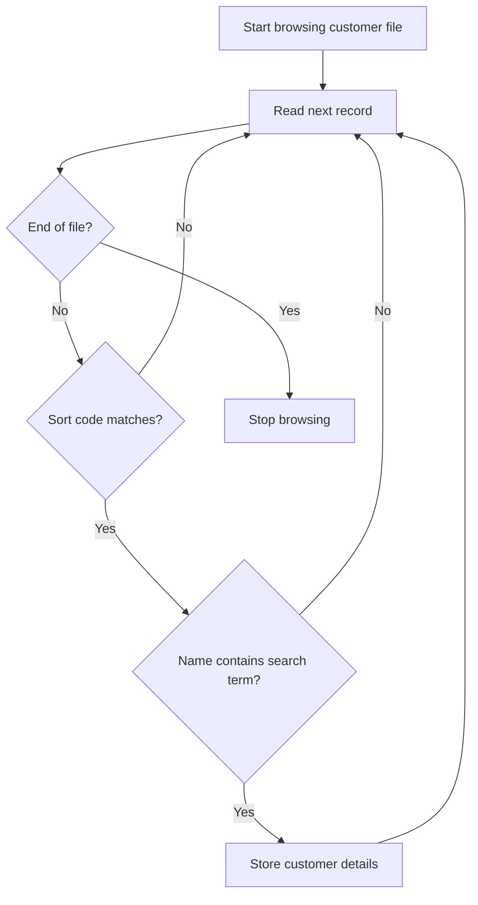

<SwmSnippet path="/src/webui/src/main/java/com/ibm/cics/cip/bankliberty/web/vsam/Customer.java" line="1156">

---

### Processing records within the while loop

The core logic of the <SwmToken path="src/webui/src/main/java/com/ibm/cics/cip/bankliberty/api/json/CustomerResource.java" pos="1125:7:7" line-data="			myCustomers = vsamCustomer.getCustomersByName(sortCode.intValue(),">`getCustomersByName`</SwmToken> function involves iterating through customer records and processing them based on specific criteria. The while loop continues as long as <SwmToken path="src/webui/src/main/java/com/ibm/cics/cip/bankliberty/web/vsam/Customer.java" pos="1156:4:4" line-data="			while (carryOn &amp;&amp; stored &lt; limit)">`carryOn`</SwmToken> is true and the number of stored records is less than the specified limit.

```java
			while (carryOn && stored < limit)
			{
```

---

</SwmSnippet>

<SwmSnippet path="/src/webui/src/main/java/com/ibm/cics/cip/bankliberty/web/vsam/Customer.java" line="1158">

---

Within the loop, the function attempts to read the next record using <SwmToken path="src/webui/src/main/java/com/ibm/cics/cip/bankliberty/web/vsam/Customer.java" pos="1160:1:9" line-data="					customerFileBrowse.next(holder, keyHolder);">`customerFileBrowse.next(holder, keyHolder)`</SwmToken>. If a <SwmToken path="src/webui/src/main/java/com/ibm/cics/cip/bankliberty/web/vsam/Customer.java" pos="1162:4:4" line-data="				catch (DuplicateKeyException e)">`DuplicateKeyException`</SwmToken> is caught, it is ignored, but if an <SwmToken path="src/webui/src/main/java/com/ibm/cics/cip/bankliberty/web/vsam/Customer.java" pos="1166:4:4" line-data="				catch (EndOfFileException e)">`EndOfFileException`</SwmToken> is caught, the loop is terminated by setting <SwmToken path="src/webui/src/main/java/com/ibm/cics/cip/bankliberty/web/vsam/Customer.java" pos="1169:1:1" line-data="					carryOn = false;">`carryOn`</SwmToken> to false and <SwmToken path="src/webui/src/main/java/com/ibm/cics/cip/bankliberty/web/vsam/Customer.java" pos="1170:1:1" line-data="					endOfFile = true;">`endOfFile`</SwmToken> to true.

```java
				try
				{
					customerFileBrowse.next(holder, keyHolder);
				}
				catch (DuplicateKeyException e)
				{
					// we don't care about this one
				}
				catch (EndOfFileException e)
				{
					// This one we do care about but we expect it
					carryOn = false;
					endOfFile = true;
				}
```

---

</SwmSnippet>

<SwmSnippet path="/src/webui/src/main/java/com/ibm/cics/cip/bankliberty/web/vsam/Customer.java" line="1172">

---

After successfully reading a record, the function checks if the <SwmToken path="src/webui/src/main/java/com/ibm/cics/cip/bankliberty/web/vsam/Customer.java" pos="1176:18:18" line-data="				if (!endOfFile &amp;&amp; (myCustomer.getCustomerSortcode() == sortCode)">`sortCode`</SwmToken> matches and if the customer's name contains the provided search term. If both conditions are met, the customer's details are stored in the <SwmToken path="src/webui/src/main/java/com/ibm/cics/cip/bankliberty/web/vsam/Customer.java" pos="1179:1:1" line-data="					temp[stored] = new Customer();">`temp`</SwmToken> array.

```java
				myCustomer = new CUSTOMER(holder.getValue());
				// We get here because we either successfully read a record, or
				// hit end of file. if we hit end of file then we might add the
				// last customer twice!
				if (!endOfFile && (myCustomer.getCustomerSortcode() == sortCode)
						&& myCustomer.getCustomerName().contains(name))
				{
					temp[stored] = new Customer();
					temp[stored].setAddress(myCustomer.getCustomerAddress());
					temp[stored].setCustomerNumber(
							Long.toString(myCustomer.getCustomerNumber()));
					temp[stored].setName(myCustomer.getCustomerName());
					temp[stored].setSortcode(
							Integer.toString(myCustomer.getCustomerSortcode()));
					Calendar dobCalendar = Calendar.getInstance();
					dobCalendar.set(Calendar.YEAR,
							myCustomer.getCustomerBirthYear());
					dobCalendar.set(Calendar.MONTH,
							myCustomer.getCustomerBirthMonth());
					dobCalendar.set(Calendar.DAY_OF_MONTH,
							myCustomer.getCustomerBirthDay());
```

---

</SwmSnippet>

## Zooming into <SwmToken path="src/webui/src/main/java/com/ibm/cics/cip/bankliberty/api/json/CustomerResource.java" pos="1088:7:7" line-data="		Response myResponse = getCustomersByNameInternal(name, limit, offset,">`getCustomersByNameInternal`</SwmToken>

```mermaid
graph TD
  subgraph getCustomersByNameInternal
    getCustomersByNameInternal:A["Get sortCode"] --> getCustomersByNameInternal:B["Check if countOnly is true"]
    getCustomersByNameInternal:B -->|true| getCustomersByNameInternal:C["Get number of customers"]
    getCustomersByNameInternal:C --> getCustomersByNameInternal:D["Build response with customer count"]
    getCustomersByNameInternal:B -->|false| getCustomersByNameInternal:E["Retrieve customers by name with pagination"]
    getCustomersByNameInternal:E --> getCustomersByNameInternal:F["Check if customers are not null"]
    getCustomersByNameInternal:F -->|not null| getCustomersByNameInternal:G["Build customer details list"]
    getCustomersByNameInternal:G --> getCustomersByNameInternal:H["Build response with customers list"]
    getCustomersByNameInternal:F -->|null| getCustomersByNameInternal:I["Build error response"]
  end

%% Swimm:
%% graph TD
%%   subgraph <SwmToken path="src/webui/src/main/java/com/ibm/cics/cip/bankliberty/api/json/CustomerResource.java" pos="1088:7:7" line-data="		Response myResponse = getCustomersByNameInternal(name, limit, offset,">`getCustomersByNameInternal`</SwmToken>
%%     <SwmToken path="src/webui/src/main/java/com/ibm/cics/cip/bankliberty/api/json/CustomerResource.java" pos="1088:7:7" line-data="		Response myResponse = getCustomersByNameInternal(name, limit, offset,">`getCustomersByNameInternal`</SwmToken>:A["Get <SwmToken path="src/webui/src/main/java/com/ibm/cics/cip/bankliberty/api/json/CustomerResource.java" pos="971:3:3" line-data="		Integer sortCode = this.getSortCode();">`sortCode`</SwmToken>"] --> <SwmToken path="src/webui/src/main/java/com/ibm/cics/cip/bankliberty/api/json/CustomerResource.java" pos="1088:7:7" line-data="		Response myResponse = getCustomersByNameInternal(name, limit, offset,">`getCustomersByNameInternal`</SwmToken>:B["Check if <SwmToken path="src/webui/src/main/java/com/ibm/cics/cip/bankliberty/api/json/CustomerResource.java" pos="950:4:4" line-data="		if (countOnly != null)">`countOnly`</SwmToken> is true"]
%%     <SwmToken path="src/webui/src/main/java/com/ibm/cics/cip/bankliberty/api/json/CustomerResource.java" pos="1088:7:7" line-data="		Response myResponse = getCustomersByNameInternal(name, limit, offset,">`getCustomersByNameInternal`</SwmToken>:B -->|true| <SwmToken path="src/webui/src/main/java/com/ibm/cics/cip/bankliberty/api/json/CustomerResource.java" pos="1088:7:7" line-data="		Response myResponse = getCustomersByNameInternal(name, limit, offset,">`getCustomersByNameInternal`</SwmToken>:C["Get number of customers"]
%%     <SwmToken path="src/webui/src/main/java/com/ibm/cics/cip/bankliberty/api/json/CustomerResource.java" pos="1088:7:7" line-data="		Response myResponse = getCustomersByNameInternal(name, limit, offset,">`getCustomersByNameInternal`</SwmToken>:C --> <SwmToken path="src/webui/src/main/java/com/ibm/cics/cip/bankliberty/api/json/CustomerResource.java" pos="1088:7:7" line-data="		Response myResponse = getCustomersByNameInternal(name, limit, offset,">`getCustomersByNameInternal`</SwmToken>:D["Build response with customer count"]
%%     <SwmToken path="src/webui/src/main/java/com/ibm/cics/cip/bankliberty/api/json/CustomerResource.java" pos="1088:7:7" line-data="		Response myResponse = getCustomersByNameInternal(name, limit, offset,">`getCustomersByNameInternal`</SwmToken>:B -->|false| <SwmToken path="src/webui/src/main/java/com/ibm/cics/cip/bankliberty/api/json/CustomerResource.java" pos="1088:7:7" line-data="		Response myResponse = getCustomersByNameInternal(name, limit, offset,">`getCustomersByNameInternal`</SwmToken>:E["Retrieve customers by name with pagination"]
%%     <SwmToken path="src/webui/src/main/java/com/ibm/cics/cip/bankliberty/api/json/CustomerResource.java" pos="1088:7:7" line-data="		Response myResponse = getCustomersByNameInternal(name, limit, offset,">`getCustomersByNameInternal`</SwmToken>:E --> <SwmToken path="src/webui/src/main/java/com/ibm/cics/cip/bankliberty/api/json/CustomerResource.java" pos="1088:7:7" line-data="		Response myResponse = getCustomersByNameInternal(name, limit, offset,">`getCustomersByNameInternal`</SwmToken>:F["Check if customers are not null"]
%%     <SwmToken path="src/webui/src/main/java/com/ibm/cics/cip/bankliberty/api/json/CustomerResource.java" pos="1088:7:7" line-data="		Response myResponse = getCustomersByNameInternal(name, limit, offset,">`getCustomersByNameInternal`</SwmToken>:F -->|not null| <SwmToken path="src/webui/src/main/java/com/ibm/cics/cip/bankliberty/api/json/CustomerResource.java" pos="1088:7:7" line-data="		Response myResponse = getCustomersByNameInternal(name, limit, offset,">`getCustomersByNameInternal`</SwmToken>:G["Build customer details list"]
%%     <SwmToken path="src/webui/src/main/java/com/ibm/cics/cip/bankliberty/api/json/CustomerResource.java" pos="1088:7:7" line-data="		Response myResponse = getCustomersByNameInternal(name, limit, offset,">`getCustomersByNameInternal`</SwmToken>:G --> <SwmToken path="src/webui/src/main/java/com/ibm/cics/cip/bankliberty/api/json/CustomerResource.java" pos="1088:7:7" line-data="		Response myResponse = getCustomersByNameInternal(name, limit, offset,">`getCustomersByNameInternal`</SwmToken>:H["Build response with customers list"]
%%     <SwmToken path="src/webui/src/main/java/com/ibm/cics/cip/bankliberty/api/json/CustomerResource.java" pos="1088:7:7" line-data="		Response myResponse = getCustomersByNameInternal(name, limit, offset,">`getCustomersByNameInternal`</SwmToken>:F -->|null| <SwmToken path="src/webui/src/main/java/com/ibm/cics/cip/bankliberty/api/json/CustomerResource.java" pos="1088:7:7" line-data="		Response myResponse = getCustomersByNameInternal(name, limit, offset,">`getCustomersByNameInternal`</SwmToken>:I["Build error response"]
%%   end
```

<SwmSnippet path="/src/webui/src/main/java/com/ibm/cics/cip/bankliberty/api/json/CustomerResource.java" line="1111">

---

## Handling customer retrieval based on <SwmToken path="src/webui/src/main/java/com/ibm/cics/cip/bankliberty/api/json/CustomerResource.java" pos="1111:4:4" line-data="		if (countOnly)">`countOnly`</SwmToken> flag

First, the method checks if the <SwmToken path="src/webui/src/main/java/com/ibm/cics/cip/bankliberty/api/json/CustomerResource.java" pos="1111:4:4" line-data="		if (countOnly)">`countOnly`</SwmToken> flag is set to true. If it is, the method retrieves the count of customers matching the given name and sort code. This is done by calling the <SwmToken path="src/webui/src/main/java/com/ibm/cics/cip/bankliberty/api/json/CustomerResource.java" pos="1116:2:2" line-data="					.getCustomersByNameCountOnly(sortCode.intValue(), name);">`getCustomersByNameCountOnly`</SwmToken> method, which returns the number of matching customers.

```java
		if (countOnly)
		{
			com.ibm.cics.cip.bankliberty.web.vsam.Customer vsamCustomer = new com.ibm.cics.cip.bankliberty.web.vsam.Customer();
			long numberOfCustomers = 0;
			numberOfCustomers = vsamCustomer
					.getCustomersByNameCountOnly(sortCode.intValue(), name);
			response.put(JSON_NUMBER_OF_CUSTOMERS, numberOfCustomers);
```

---

</SwmSnippet>

<SwmSnippet path="/src/webui/src/main/java/com/ibm/cics/cip/bankliberty/api/json/CustomerResource.java" line="1125">

---

## Retrieving customer details

Next, if the <SwmToken path="src/webui/src/main/java/com/ibm/cics/cip/bankliberty/api/json/CustomerResource.java" pos="950:4:4" line-data="		if (countOnly != null)">`countOnly`</SwmToken> flag is false, the method proceeds to retrieve the actual customer details. It calls the <SwmToken path="src/webui/src/main/java/com/ibm/cics/cip/bankliberty/api/json/CustomerResource.java" pos="1125:7:7" line-data="			myCustomers = vsamCustomer.getCustomersByName(sortCode.intValue(),">`getCustomersByName`</SwmToken> method to fetch the list of customers based on the provided name, sort code, limit, and offset. This method returns an array of customer objects.

```java
			myCustomers = vsamCustomer.getCustomersByName(sortCode.intValue(),
					limit, offset, name);
```

---

</SwmSnippet>

<SwmSnippet path="/src/webui/src/main/java/com/ibm/cics/cip/bankliberty/api/json/CustomerResource.java" line="1128">

---

## Constructing the response

Then, the method constructs a JSON response. It iterates over the retrieved customer objects, extracting relevant details such as sort code, name, customer number, address, date of birth, credit score, and review date. These details are added to a JSON array, which is then included in the response.

```java
			if (myCustomers != null)
			{
				customers = new JSONArray(myCustomers.length);

				for (int i = 0; i < myCustomers.length; i++)
				{
					JSONObject customer = new JSONObject();
					customer.put(JSON_SORT_CODE,
							myCustomers[i].getSortcode().trim());
					customer.put(JSON_CUSTOMER_NAME,
							myCustomers[i].getName().trim());
					customer.put(JSON_ID,
							myCustomers[i].getCustomerNumber().trim());
					customer.put(JSON_CUSTOMER_ADDRESS,
							myCustomers[i].getAddress().trim());
					customer.put(JSON_DATE_OF_BIRTH,
							myCustomers[i].getDob().toString());
					customer.put(JSON_CUSTOMER_CREDIT_SCORE,
							myCustomers[i].getCreditScore().trim());
					customer.put(JSON_CUSTOMER_REVIEW_DATE,
							myCustomers[i].getReviewDate().toString());
```

---

</SwmSnippet>

<SwmSnippet path="/src/webui/src/main/java/com/ibm/cics/cip/bankliberty/api/json/CustomerResource.java" line="1156">

---

## Handling errors

Finally, if no customers are found or an error occurs during retrieval, the method constructs an error message and includes it in the response. The response status is set to 404 to indicate that the requested customers could not be listed.

```java
			else
			{
				response.put(JSON_ERROR_MSG,
						"Customers cannot be listed in com.ibm.cics.cip.bankliberty.web.vsam.Customer");
				logger.log(Level.WARNING, () -> this.getClass().getName()
						+ ".getCustomersByNameInternal() "
						+ " Customers cannot be listed in com.ibm.cics.cip.bankliberty.web.vsam.Customer");
				Response myResponse = Response.status(404)
						.entity(response.toString()).build();
				logger.exiting(this.getClass().getName(),
						"getCustomersByNameInternal()", myResponse);
				return myResponse;
```

---

</SwmSnippet>

## Going into <SwmToken path="src/webui/src/main/java/com/ibm/cics/cip/bankliberty/webui/data_access/CustomerList.java" pos="123:2:2" line-data="						.getCustomersExternal(250000, 0, true);">`getCustomersExternal`</SwmToken>

```mermaid
graph TD
subgraph getCustomersExternal
getCustomersExternal:A["Log entry (Entering)"] --> getCustomersExternal:B["Check if countOnly is not null"]
getCustomersExternal:B -->|countOnly not null| getCustomersExternal:C["Set countOnlyReal to countOnly's boolean value"]
getCustomersExternal:B -->|countOnly is null| getCustomersExternal:D["Keep countOnlyReal as false"]
getCustomersExternal:C --> getCustomersExternal:E["Get customers internal"]
getCustomersExternal:D --> getCustomersExternal:E["Get customers internal"]
getCustomersExternal:E --> getCustomersExternal:F["Terminate HBankDataAccess"]
getCustomersExternal:F --> getCustomersExternal:G["Log exit (Exiting)"]
getCustomersExternal:G --> getCustomersExternal:H["Return response"]
end

%% Swimm:
%% graph TD
%% subgraph <SwmToken path="src/webui/src/main/java/com/ibm/cics/cip/bankliberty/webui/data_access/CustomerList.java" pos="123:2:2" line-data="						.getCustomersExternal(250000, 0, true);">`getCustomersExternal`</SwmToken>
%% <SwmToken path="src/webui/src/main/java/com/ibm/cics/cip/bankliberty/webui/data_access/CustomerList.java" pos="123:2:2" line-data="						.getCustomersExternal(250000, 0, true);">`getCustomersExternal`</SwmToken>:A["Log entry (Entering)"] --> <SwmToken path="src/webui/src/main/java/com/ibm/cics/cip/bankliberty/webui/data_access/CustomerList.java" pos="123:2:2" line-data="						.getCustomersExternal(250000, 0, true);">`getCustomersExternal`</SwmToken>:B["Check if <SwmToken path="src/webui/src/main/java/com/ibm/cics/cip/bankliberty/api/json/CustomerResource.java" pos="950:4:4" line-data="		if (countOnly != null)">`countOnly`</SwmToken> is not null"]
%% <SwmToken path="src/webui/src/main/java/com/ibm/cics/cip/bankliberty/webui/data_access/CustomerList.java" pos="123:2:2" line-data="						.getCustomersExternal(250000, 0, true);">`getCustomersExternal`</SwmToken>:B -->|<SwmToken path="src/webui/src/main/java/com/ibm/cics/cip/bankliberty/api/json/CustomerResource.java" pos="950:4:4" line-data="		if (countOnly != null)">`countOnly`</SwmToken> not null| <SwmToken path="src/webui/src/main/java/com/ibm/cics/cip/bankliberty/webui/data_access/CustomerList.java" pos="123:2:2" line-data="						.getCustomersExternal(250000, 0, true);">`getCustomersExternal`</SwmToken>:C["Set <SwmToken path="src/webui/src/main/java/com/ibm/cics/cip/bankliberty/api/json/CustomerResource.java" pos="949:3:3" line-data="		boolean countOnlyReal = false;">`countOnlyReal`</SwmToken> to <SwmToken path="src/webui/src/main/java/com/ibm/cics/cip/bankliberty/api/json/CustomerResource.java" pos="950:4:4" line-data="		if (countOnly != null)">`countOnly`</SwmToken>'s boolean value"]
%% <SwmToken path="src/webui/src/main/java/com/ibm/cics/cip/bankliberty/webui/data_access/CustomerList.java" pos="123:2:2" line-data="						.getCustomersExternal(250000, 0, true);">`getCustomersExternal`</SwmToken>:B -->|<SwmToken path="src/webui/src/main/java/com/ibm/cics/cip/bankliberty/api/json/CustomerResource.java" pos="950:4:4" line-data="		if (countOnly != null)">`countOnly`</SwmToken> is null| <SwmToken path="src/webui/src/main/java/com/ibm/cics/cip/bankliberty/webui/data_access/CustomerList.java" pos="123:2:2" line-data="						.getCustomersExternal(250000, 0, true);">`getCustomersExternal`</SwmToken>:D["Keep <SwmToken path="src/webui/src/main/java/com/ibm/cics/cip/bankliberty/api/json/CustomerResource.java" pos="949:3:3" line-data="		boolean countOnlyReal = false;">`countOnlyReal`</SwmToken> as false"]
%% <SwmToken path="src/webui/src/main/java/com/ibm/cics/cip/bankliberty/webui/data_access/CustomerList.java" pos="123:2:2" line-data="						.getCustomersExternal(250000, 0, true);">`getCustomersExternal`</SwmToken>:C --> <SwmToken path="src/webui/src/main/java/com/ibm/cics/cip/bankliberty/webui/data_access/CustomerList.java" pos="123:2:2" line-data="						.getCustomersExternal(250000, 0, true);">`getCustomersExternal`</SwmToken>:E["Get customers internal"]
%% <SwmToken path="src/webui/src/main/java/com/ibm/cics/cip/bankliberty/webui/data_access/CustomerList.java" pos="123:2:2" line-data="						.getCustomersExternal(250000, 0, true);">`getCustomersExternal`</SwmToken>:D --> <SwmToken path="src/webui/src/main/java/com/ibm/cics/cip/bankliberty/webui/data_access/CustomerList.java" pos="123:2:2" line-data="						.getCustomersExternal(250000, 0, true);">`getCustomersExternal`</SwmToken>:E["Get customers internal"]
%% <SwmToken path="src/webui/src/main/java/com/ibm/cics/cip/bankliberty/webui/data_access/CustomerList.java" pos="123:2:2" line-data="						.getCustomersExternal(250000, 0, true);">`getCustomersExternal`</SwmToken>:E --> <SwmToken path="src/webui/src/main/java/com/ibm/cics/cip/bankliberty/webui/data_access/CustomerList.java" pos="123:2:2" line-data="						.getCustomersExternal(250000, 0, true);">`getCustomersExternal`</SwmToken>:F["Terminate <SwmToken path="src/webui/src/main/java/com/ibm/cics/cip/bankliberty/api/json/CustomerResource.java" pos="956:1:1" line-data="		HBankDataAccess myHBankDataAccess = new HBankDataAccess();">`HBankDataAccess`</SwmToken>"]
%% <SwmToken path="src/webui/src/main/java/com/ibm/cics/cip/bankliberty/webui/data_access/CustomerList.java" pos="123:2:2" line-data="						.getCustomersExternal(250000, 0, true);">`getCustomersExternal`</SwmToken>:F --> <SwmToken path="src/webui/src/main/java/com/ibm/cics/cip/bankliberty/webui/data_access/CustomerList.java" pos="123:2:2" line-data="						.getCustomersExternal(250000, 0, true);">`getCustomersExternal`</SwmToken>:G["Log exit (Exiting)"]
%% <SwmToken path="src/webui/src/main/java/com/ibm/cics/cip/bankliberty/webui/data_access/CustomerList.java" pos="123:2:2" line-data="						.getCustomersExternal(250000, 0, true);">`getCustomersExternal`</SwmToken>:G --> <SwmToken path="src/webui/src/main/java/com/ibm/cics/cip/bankliberty/webui/data_access/CustomerList.java" pos="123:2:2" line-data="						.getCustomersExternal(250000, 0, true);">`getCustomersExternal`</SwmToken>:H["Return response"]
%% end
```

<SwmSnippet path="/src/webui/src/main/java/com/ibm/cics/cip/bankliberty/api/json/CustomerResource.java" line="949">

---

## Handling the <SwmToken path="src/webui/src/main/java/com/ibm/cics/cip/bankliberty/api/json/CustomerResource.java" pos="950:4:4" line-data="		if (countOnly != null)">`countOnly`</SwmToken> parameter

First, the method checks if the <SwmToken path="src/webui/src/main/java/com/ibm/cics/cip/bankliberty/api/json/CustomerResource.java" pos="950:4:4" line-data="		if (countOnly != null)">`countOnly`</SwmToken> parameter is provided. If it is not null, it converts the Boolean value to a primitive boolean. This step ensures that the subsequent logic can safely use the <SwmToken path="src/webui/src/main/java/com/ibm/cics/cip/bankliberty/api/json/CustomerResource.java" pos="950:4:4" line-data="		if (countOnly != null)">`countOnly`</SwmToken> value without worrying about null values.

```java
		boolean countOnlyReal = false;
		if (countOnly != null)
		{
			countOnlyReal = countOnly.booleanValue();
```

---

</SwmSnippet>

<SwmSnippet path="/src/webui/src/main/java/com/ibm/cics/cip/bankliberty/api/json/CustomerResource.java" line="954">

---

## Calling <SwmToken path="src/webui/src/main/java/com/ibm/cics/cip/bankliberty/api/json/CustomerResource.java" pos="954:7:7" line-data="		Response myResponse = getCustomersInternal(limit, offset,">`getCustomersInternal`</SwmToken>

Next, the method calls <SwmToken path="src/webui/src/main/java/com/ibm/cics/cip/bankliberty/api/json/CustomerResource.java" pos="954:7:7" line-data="		Response myResponse = getCustomersInternal(limit, offset,">`getCustomersInternal`</SwmToken> with the provided <SwmToken path="src/webui/src/main/java/com/ibm/cics/cip/bankliberty/api/json/CustomerResource.java" pos="954:9:9" line-data="		Response myResponse = getCustomersInternal(limit, offset,">`limit`</SwmToken>, <SwmToken path="src/webui/src/main/java/com/ibm/cics/cip/bankliberty/api/json/CustomerResource.java" pos="954:12:12" line-data="		Response myResponse = getCustomersInternal(limit, offset,">`offset`</SwmToken>, and the processed <SwmToken path="src/webui/src/main/java/com/ibm/cics/cip/bankliberty/api/json/CustomerResource.java" pos="950:4:4" line-data="		if (countOnly != null)">`countOnly`</SwmToken> parameter. This internal method is responsible for the actual retrieval of customer data based on these parameters.

```java
		Response myResponse = getCustomersInternal(limit, offset,
				countOnlyReal);
```

---

</SwmSnippet>

<SwmSnippet path="/src/webui/src/main/java/com/ibm/cics/cip/bankliberty/api/json/CustomerResource.java" line="956">

---

## Terminating <SwmToken path="src/webui/src/main/java/com/ibm/cics/cip/bankliberty/api/json/CustomerResource.java" pos="956:1:1" line-data="		HBankDataAccess myHBankDataAccess = new HBankDataAccess();">`HBankDataAccess`</SwmToken>

After retrieving the customer data, the method creates an instance of <SwmToken path="src/webui/src/main/java/com/ibm/cics/cip/bankliberty/api/json/CustomerResource.java" pos="956:1:1" line-data="		HBankDataAccess myHBankDataAccess = new HBankDataAccess();">`HBankDataAccess`</SwmToken> and calls its <SwmToken path="src/webui/src/main/java/com/ibm/cics/cip/bankliberty/api/json/CustomerResource.java" pos="957:3:3" line-data="		myHBankDataAccess.terminate();">`terminate`</SwmToken> method. This step ensures that any resources or connections used during the data retrieval process are properly closed and cleaned up.

```java
		HBankDataAccess myHBankDataAccess = new HBankDataAccess();
		myHBankDataAccess.terminate();
```

---

</SwmSnippet>

<SwmSnippet path="/src/webui/src/main/java/com/ibm/cics/cip/bankliberty/api/json/CustomerResource.java" line="958">

---

## Returning the response

Finally, the method logs the exit and returns the response obtained from <SwmToken path="src/webui/src/main/java/com/ibm/cics/cip/bankliberty/api/json/CustomerResource.java" pos="954:7:7" line-data="		Response myResponse = getCustomersInternal(limit, offset,">`getCustomersInternal`</SwmToken>. This response contains the customer data or count, depending on the <SwmToken path="src/webui/src/main/java/com/ibm/cics/cip/bankliberty/api/json/CustomerResource.java" pos="959:16:16" line-data="				&quot;getCustomersExternal(Integer limit, Integer offset, Boolean countOnly)&quot;,">`countOnly`</SwmToken> parameter.

```java
		logger.exiting(this.getClass().getName(),
				"getCustomersExternal(Integer limit, Integer offset, Boolean countOnly)",
				myResponse);
		return myResponse;
```

---

</SwmSnippet>

## Going into <SwmToken path="src/webui/src/main/java/com/ibm/cics/cip/bankliberty/api/json/CustomerResource.java" pos="954:7:7" line-data="		Response myResponse = getCustomersInternal(limit, offset,">`getCustomersInternal`</SwmToken> & <SwmToken path="src/webui/src/main/java/com/ibm/cics/cip/bankliberty/api/json/CustomerResource.java" pos="1002:7:7" line-data="			myCustomers = vsamCustomer.getCustomers(sortCode.intValue(), limit,">`getCustomers`</SwmToken>

```mermaid
graph TD
  subgraph getCustomersInternal
    getCustomersInternal:A["Retrieve sort code"] --> getCustomersInternal:B["Initialize response and customers"]
    getCustomersInternal:B --> getCustomersInternal:C["Check if offset is null"]
    getCustomersInternal:C -->|Yes| getCustomersInternal:D["Set offset to 0"]
    getCustomersInternal:C -->|No| getCustomersInternal:E["Check if limit is null"]
    getCustomersInternal:E -->|Yes| getCustomersInternal:F["Set limit to 250000"]
    getCustomersInternal:E -->|No| getCustomersInternal:G["Check if limit equals 0"]
    getCustomersInternal:G -->|Yes| getCustomersInternal:F
    getCustomersInternal:G -->|No| getCustomersInternal:H["Check if countOnly is true"]
    getCustomersInternal:H -->|Yes| getCustomersInternal:I["Retrieve customers count"]
    getCustomersInternal:H -->|No| getCustomersInternal:J["Retrieve customers data"]
    getCustomersInternal:J --> getCustomersInternal:K["Check if myCustomers is not null"]
    getCustomersInternal:K -->|Yes| getCustomersInternal:L["Build customers JSON array"]
    getCustomersInternal:K -->|No| getCustomersInternal:M["Add error message to response"]
    getCustomersInternal:L --> getCustomersInternal:N["Add customers and count to response"]
    getCustomersInternal:M --> getCustomersInternal:O["Log warning"]
    getCustomersInternal:O --> getCustomersInternal:P["Return 404 response"]
    getCustomersInternal:N --> getCustomersInternal:Q["Return 200 response"]
  end
  subgraph getCustomers
    getCustomers:A["Set customer file name"] --> getCustomers:B["Initialize customer and key"]
    getCustomers:B --> getCustomers:C["Build key"]
    getCustomers:C --> getCustomers:D["Convert key to EBCDIC"]
    getCustomers:D --> getCustomers:E["Start browsing customer file"]
    getCustomers:E --> getCustomers:F["Browse customer records"]
    getCustomers:F --> getCustomers:G["Check customer's sort code"]
    getCustomers:G -->|Match| getCustomers:H["Increment customer count"]
    getCustomers:F --> getCustomers:I["End of file"]
    getCustomers:F --> getCustomers:J["Exception handling"]
    getCustomers:H --> getCustomers:I["End browse and return customers"]
    getCustomers:I --> getCustomers:K["Copy customers array to final array"]
    getCustomers:K --> getCustomers:L["Return final customers array"]
  end
  getCustomersInternal:J --> getCustomers

%% Swimm:
%% graph TD
%%   subgraph <SwmToken path="src/webui/src/main/java/com/ibm/cics/cip/bankliberty/api/json/CustomerResource.java" pos="954:7:7" line-data="		Response myResponse = getCustomersInternal(limit, offset,">`getCustomersInternal`</SwmToken>
%%     <SwmToken path="src/webui/src/main/java/com/ibm/cics/cip/bankliberty/api/json/CustomerResource.java" pos="954:7:7" line-data="		Response myResponse = getCustomersInternal(limit, offset,">`getCustomersInternal`</SwmToken>:A["Retrieve sort code"] --> <SwmToken path="src/webui/src/main/java/com/ibm/cics/cip/bankliberty/api/json/CustomerResource.java" pos="954:7:7" line-data="		Response myResponse = getCustomersInternal(limit, offset,">`getCustomersInternal`</SwmToken>:B["Initialize response and customers"]
%%     <SwmToken path="src/webui/src/main/java/com/ibm/cics/cip/bankliberty/api/json/CustomerResource.java" pos="954:7:7" line-data="		Response myResponse = getCustomersInternal(limit, offset,">`getCustomersInternal`</SwmToken>:B --> <SwmToken path="src/webui/src/main/java/com/ibm/cics/cip/bankliberty/api/json/CustomerResource.java" pos="954:7:7" line-data="		Response myResponse = getCustomersInternal(limit, offset,">`getCustomersInternal`</SwmToken>:C["Check if offset is null"]
%%     <SwmToken path="src/webui/src/main/java/com/ibm/cics/cip/bankliberty/api/json/CustomerResource.java" pos="954:7:7" line-data="		Response myResponse = getCustomersInternal(limit, offset,">`getCustomersInternal`</SwmToken>:C -->|Yes| <SwmToken path="src/webui/src/main/java/com/ibm/cics/cip/bankliberty/api/json/CustomerResource.java" pos="954:7:7" line-data="		Response myResponse = getCustomersInternal(limit, offset,">`getCustomersInternal`</SwmToken>:D["Set offset to 0"]
%%     <SwmToken path="src/webui/src/main/java/com/ibm/cics/cip/bankliberty/api/json/CustomerResource.java" pos="954:7:7" line-data="		Response myResponse = getCustomersInternal(limit, offset,">`getCustomersInternal`</SwmToken>:C -->|No| <SwmToken path="src/webui/src/main/java/com/ibm/cics/cip/bankliberty/api/json/CustomerResource.java" pos="954:7:7" line-data="		Response myResponse = getCustomersInternal(limit, offset,">`getCustomersInternal`</SwmToken>:E["Check if limit is null"]
%%     <SwmToken path="src/webui/src/main/java/com/ibm/cics/cip/bankliberty/api/json/CustomerResource.java" pos="954:7:7" line-data="		Response myResponse = getCustomersInternal(limit, offset,">`getCustomersInternal`</SwmToken>:E -->|Yes| <SwmToken path="src/webui/src/main/java/com/ibm/cics/cip/bankliberty/api/json/CustomerResource.java" pos="954:7:7" line-data="		Response myResponse = getCustomersInternal(limit, offset,">`getCustomersInternal`</SwmToken>:F["Set limit to 250000"]
%%     <SwmToken path="src/webui/src/main/java/com/ibm/cics/cip/bankliberty/api/json/CustomerResource.java" pos="954:7:7" line-data="		Response myResponse = getCustomersInternal(limit, offset,">`getCustomersInternal`</SwmToken>:E -->|No| <SwmToken path="src/webui/src/main/java/com/ibm/cics/cip/bankliberty/api/json/CustomerResource.java" pos="954:7:7" line-data="		Response myResponse = getCustomersInternal(limit, offset,">`getCustomersInternal`</SwmToken>:G["Check if limit equals 0"]
%%     <SwmToken path="src/webui/src/main/java/com/ibm/cics/cip/bankliberty/api/json/CustomerResource.java" pos="954:7:7" line-data="		Response myResponse = getCustomersInternal(limit, offset,">`getCustomersInternal`</SwmToken>:G -->|Yes| <SwmToken path="src/webui/src/main/java/com/ibm/cics/cip/bankliberty/api/json/CustomerResource.java" pos="954:7:7" line-data="		Response myResponse = getCustomersInternal(limit, offset,">`getCustomersInternal`</SwmToken>:F
%%     <SwmToken path="src/webui/src/main/java/com/ibm/cics/cip/bankliberty/api/json/CustomerResource.java" pos="954:7:7" line-data="		Response myResponse = getCustomersInternal(limit, offset,">`getCustomersInternal`</SwmToken>:G -->|No| <SwmToken path="src/webui/src/main/java/com/ibm/cics/cip/bankliberty/api/json/CustomerResource.java" pos="954:7:7" line-data="		Response myResponse = getCustomersInternal(limit, offset,">`getCustomersInternal`</SwmToken>:H["Check if <SwmToken path="src/webui/src/main/java/com/ibm/cics/cip/bankliberty/api/json/CustomerResource.java" pos="950:4:4" line-data="		if (countOnly != null)">`countOnly`</SwmToken> is true"]
%%     <SwmToken path="src/webui/src/main/java/com/ibm/cics/cip/bankliberty/api/json/CustomerResource.java" pos="954:7:7" line-data="		Response myResponse = getCustomersInternal(limit, offset,">`getCustomersInternal`</SwmToken>:H -->|Yes| <SwmToken path="src/webui/src/main/java/com/ibm/cics/cip/bankliberty/api/json/CustomerResource.java" pos="954:7:7" line-data="		Response myResponse = getCustomersInternal(limit, offset,">`getCustomersInternal`</SwmToken>:I["Retrieve customers count"]
%%     <SwmToken path="src/webui/src/main/java/com/ibm/cics/cip/bankliberty/api/json/CustomerResource.java" pos="954:7:7" line-data="		Response myResponse = getCustomersInternal(limit, offset,">`getCustomersInternal`</SwmToken>:H -->|No| <SwmToken path="src/webui/src/main/java/com/ibm/cics/cip/bankliberty/api/json/CustomerResource.java" pos="954:7:7" line-data="		Response myResponse = getCustomersInternal(limit, offset,">`getCustomersInternal`</SwmToken>:J["Retrieve customers data"]
%%     <SwmToken path="src/webui/src/main/java/com/ibm/cics/cip/bankliberty/api/json/CustomerResource.java" pos="954:7:7" line-data="		Response myResponse = getCustomersInternal(limit, offset,">`getCustomersInternal`</SwmToken>:J --> <SwmToken path="src/webui/src/main/java/com/ibm/cics/cip/bankliberty/api/json/CustomerResource.java" pos="954:7:7" line-data="		Response myResponse = getCustomersInternal(limit, offset,">`getCustomersInternal`</SwmToken>:K["Check if <SwmToken path="src/webui/src/main/java/com/ibm/cics/cip/bankliberty/api/json/CustomerResource.java" pos="1000:19:19" line-data="			com.ibm.cics.cip.bankliberty.web.vsam.Customer[] myCustomers = null;">`myCustomers`</SwmToken> is not null"]
%%     <SwmToken path="src/webui/src/main/java/com/ibm/cics/cip/bankliberty/api/json/CustomerResource.java" pos="954:7:7" line-data="		Response myResponse = getCustomersInternal(limit, offset,">`getCustomersInternal`</SwmToken>:K -->|Yes| <SwmToken path="src/webui/src/main/java/com/ibm/cics/cip/bankliberty/api/json/CustomerResource.java" pos="954:7:7" line-data="		Response myResponse = getCustomersInternal(limit, offset,">`getCustomersInternal`</SwmToken>:L["Build customers JSON array"]
%%     <SwmToken path="src/webui/src/main/java/com/ibm/cics/cip/bankliberty/api/json/CustomerResource.java" pos="954:7:7" line-data="		Response myResponse = getCustomersInternal(limit, offset,">`getCustomersInternal`</SwmToken>:K -->|No| <SwmToken path="src/webui/src/main/java/com/ibm/cics/cip/bankliberty/api/json/CustomerResource.java" pos="954:7:7" line-data="		Response myResponse = getCustomersInternal(limit, offset,">`getCustomersInternal`</SwmToken>:M["Add error message to response"]
%%     <SwmToken path="src/webui/src/main/java/com/ibm/cics/cip/bankliberty/api/json/CustomerResource.java" pos="954:7:7" line-data="		Response myResponse = getCustomersInternal(limit, offset,">`getCustomersInternal`</SwmToken>:L --> <SwmToken path="src/webui/src/main/java/com/ibm/cics/cip/bankliberty/api/json/CustomerResource.java" pos="954:7:7" line-data="		Response myResponse = getCustomersInternal(limit, offset,">`getCustomersInternal`</SwmToken>:N["Add customers and count to response"]
%%     <SwmToken path="src/webui/src/main/java/com/ibm/cics/cip/bankliberty/api/json/CustomerResource.java" pos="954:7:7" line-data="		Response myResponse = getCustomersInternal(limit, offset,">`getCustomersInternal`</SwmToken>:M --> <SwmToken path="src/webui/src/main/java/com/ibm/cics/cip/bankliberty/api/json/CustomerResource.java" pos="954:7:7" line-data="		Response myResponse = getCustomersInternal(limit, offset,">`getCustomersInternal`</SwmToken>:O["Log warning"]
%%     <SwmToken path="src/webui/src/main/java/com/ibm/cics/cip/bankliberty/api/json/CustomerResource.java" pos="954:7:7" line-data="		Response myResponse = getCustomersInternal(limit, offset,">`getCustomersInternal`</SwmToken>:O --> <SwmToken path="src/webui/src/main/java/com/ibm/cics/cip/bankliberty/api/json/CustomerResource.java" pos="954:7:7" line-data="		Response myResponse = getCustomersInternal(limit, offset,">`getCustomersInternal`</SwmToken>:P["Return 404 response"]
%%     <SwmToken path="src/webui/src/main/java/com/ibm/cics/cip/bankliberty/api/json/CustomerResource.java" pos="954:7:7" line-data="		Response myResponse = getCustomersInternal(limit, offset,">`getCustomersInternal`</SwmToken>:N --> <SwmToken path="src/webui/src/main/java/com/ibm/cics/cip/bankliberty/api/json/CustomerResource.java" pos="954:7:7" line-data="		Response myResponse = getCustomersInternal(limit, offset,">`getCustomersInternal`</SwmToken>:Q["Return 200 response"]
%%   end
%%   subgraph <SwmToken path="src/webui/src/main/java/com/ibm/cics/cip/bankliberty/api/json/CustomerResource.java" pos="1002:7:7" line-data="			myCustomers = vsamCustomer.getCustomers(sortCode.intValue(), limit,">`getCustomers`</SwmToken>
%%     <SwmToken path="src/webui/src/main/java/com/ibm/cics/cip/bankliberty/api/json/CustomerResource.java" pos="1002:7:7" line-data="			myCustomers = vsamCustomer.getCustomers(sortCode.intValue(), limit,">`getCustomers`</SwmToken>:A["Set customer file name"] --> <SwmToken path="src/webui/src/main/java/com/ibm/cics/cip/bankliberty/api/json/CustomerResource.java" pos="1002:7:7" line-data="			myCustomers = vsamCustomer.getCustomers(sortCode.intValue(), limit,">`getCustomers`</SwmToken>:B["Initialize customer and key"]
%%     <SwmToken path="src/webui/src/main/java/com/ibm/cics/cip/bankliberty/api/json/CustomerResource.java" pos="1002:7:7" line-data="			myCustomers = vsamCustomer.getCustomers(sortCode.intValue(), limit,">`getCustomers`</SwmToken>:B --> <SwmToken path="src/webui/src/main/java/com/ibm/cics/cip/bankliberty/api/json/CustomerResource.java" pos="1002:7:7" line-data="			myCustomers = vsamCustomer.getCustomers(sortCode.intValue(), limit,">`getCustomers`</SwmToken>:C["Build key"]
%%     <SwmToken path="src/webui/src/main/java/com/ibm/cics/cip/bankliberty/api/json/CustomerResource.java" pos="1002:7:7" line-data="			myCustomers = vsamCustomer.getCustomers(sortCode.intValue(), limit,">`getCustomers`</SwmToken>:C --> <SwmToken path="src/webui/src/main/java/com/ibm/cics/cip/bankliberty/api/json/CustomerResource.java" pos="1002:7:7" line-data="			myCustomers = vsamCustomer.getCustomers(sortCode.intValue(), limit,">`getCustomers`</SwmToken>:D["Convert key to EBCDIC"]
%%     <SwmToken path="src/webui/src/main/java/com/ibm/cics/cip/bankliberty/api/json/CustomerResource.java" pos="1002:7:7" line-data="			myCustomers = vsamCustomer.getCustomers(sortCode.intValue(), limit,">`getCustomers`</SwmToken>:D --> <SwmToken path="src/webui/src/main/java/com/ibm/cics/cip/bankliberty/api/json/CustomerResource.java" pos="1002:7:7" line-data="			myCustomers = vsamCustomer.getCustomers(sortCode.intValue(), limit,">`getCustomers`</SwmToken>:E["Start browsing customer file"]
%%     <SwmToken path="src/webui/src/main/java/com/ibm/cics/cip/bankliberty/api/json/CustomerResource.java" pos="1002:7:7" line-data="			myCustomers = vsamCustomer.getCustomers(sortCode.intValue(), limit,">`getCustomers`</SwmToken>:E --> <SwmToken path="src/webui/src/main/java/com/ibm/cics/cip/bankliberty/api/json/CustomerResource.java" pos="1002:7:7" line-data="			myCustomers = vsamCustomer.getCustomers(sortCode.intValue(), limit,">`getCustomers`</SwmToken>:F["Browse customer records"]
%%     <SwmToken path="src/webui/src/main/java/com/ibm/cics/cip/bankliberty/api/json/CustomerResource.java" pos="1002:7:7" line-data="			myCustomers = vsamCustomer.getCustomers(sortCode.intValue(), limit,">`getCustomers`</SwmToken>:F --> <SwmToken path="src/webui/src/main/java/com/ibm/cics/cip/bankliberty/api/json/CustomerResource.java" pos="1002:7:7" line-data="			myCustomers = vsamCustomer.getCustomers(sortCode.intValue(), limit,">`getCustomers`</SwmToken>:G["Check customer's sort code"]
%%     <SwmToken path="src/webui/src/main/java/com/ibm/cics/cip/bankliberty/api/json/CustomerResource.java" pos="1002:7:7" line-data="			myCustomers = vsamCustomer.getCustomers(sortCode.intValue(), limit,">`getCustomers`</SwmToken>:G -->|Match| <SwmToken path="src/webui/src/main/java/com/ibm/cics/cip/bankliberty/api/json/CustomerResource.java" pos="1002:7:7" line-data="			myCustomers = vsamCustomer.getCustomers(sortCode.intValue(), limit,">`getCustomers`</SwmToken>:H["Increment customer count"]
%%     <SwmToken path="src/webui/src/main/java/com/ibm/cics/cip/bankliberty/api/json/CustomerResource.java" pos="1002:7:7" line-data="			myCustomers = vsamCustomer.getCustomers(sortCode.intValue(), limit,">`getCustomers`</SwmToken>:F --> <SwmToken path="src/webui/src/main/java/com/ibm/cics/cip/bankliberty/api/json/CustomerResource.java" pos="1002:7:7" line-data="			myCustomers = vsamCustomer.getCustomers(sortCode.intValue(), limit,">`getCustomers`</SwmToken>:I["End of file"]
%%     <SwmToken path="src/webui/src/main/java/com/ibm/cics/cip/bankliberty/api/json/CustomerResource.java" pos="1002:7:7" line-data="			myCustomers = vsamCustomer.getCustomers(sortCode.intValue(), limit,">`getCustomers`</SwmToken>:F --> <SwmToken path="src/webui/src/main/java/com/ibm/cics/cip/bankliberty/api/json/CustomerResource.java" pos="1002:7:7" line-data="			myCustomers = vsamCustomer.getCustomers(sortCode.intValue(), limit,">`getCustomers`</SwmToken>:J["Exception handling"]
%%     <SwmToken path="src/webui/src/main/java/com/ibm/cics/cip/bankliberty/api/json/CustomerResource.java" pos="1002:7:7" line-data="			myCustomers = vsamCustomer.getCustomers(sortCode.intValue(), limit,">`getCustomers`</SwmToken>:H --> <SwmToken path="src/webui/src/main/java/com/ibm/cics/cip/bankliberty/api/json/CustomerResource.java" pos="1002:7:7" line-data="			myCustomers = vsamCustomer.getCustomers(sortCode.intValue(), limit,">`getCustomers`</SwmToken>:I["End browse and return customers"]
%%     <SwmToken path="src/webui/src/main/java/com/ibm/cics/cip/bankliberty/api/json/CustomerResource.java" pos="1002:7:7" line-data="			myCustomers = vsamCustomer.getCustomers(sortCode.intValue(), limit,">`getCustomers`</SwmToken>:I --> <SwmToken path="src/webui/src/main/java/com/ibm/cics/cip/bankliberty/api/json/CustomerResource.java" pos="1002:7:7" line-data="			myCustomers = vsamCustomer.getCustomers(sortCode.intValue(), limit,">`getCustomers`</SwmToken>:K["Copy customers array to final array"]
%%     <SwmToken path="src/webui/src/main/java/com/ibm/cics/cip/bankliberty/api/json/CustomerResource.java" pos="1002:7:7" line-data="			myCustomers = vsamCustomer.getCustomers(sortCode.intValue(), limit,">`getCustomers`</SwmToken>:K --> <SwmToken path="src/webui/src/main/java/com/ibm/cics/cip/bankliberty/api/json/CustomerResource.java" pos="1002:7:7" line-data="			myCustomers = vsamCustomer.getCustomers(sortCode.intValue(), limit,">`getCustomers`</SwmToken>:L["Return final customers array"]
%%   end
%%   <SwmToken path="src/webui/src/main/java/com/ibm/cics/cip/bankliberty/api/json/CustomerResource.java" pos="954:7:7" line-data="		Response myResponse = getCustomersInternal(limit, offset,">`getCustomersInternal`</SwmToken>:J --> <SwmToken path="src/webui/src/main/java/com/ibm/cics/cip/bankliberty/api/json/CustomerResource.java" pos="1002:7:7" line-data="			myCustomers = vsamCustomer.getCustomers(sortCode.intValue(), limit,">`getCustomers`</SwmToken>
```

<SwmSnippet path="/src/webui/src/main/java/com/ibm/cics/cip/bankliberty/api/json/CustomerResource.java" line="965">

---

## Retrieving and Formatting Customer Data

First, the <SwmToken path="src/webui/src/main/java/com/ibm/cics/cip/bankliberty/api/json/CustomerResource.java" pos="965:5:5" line-data="	public Response getCustomersInternal(@QueryParam(&quot;limit&quot;) Integer limit,">`getCustomersInternal`</SwmToken> method is responsible for handling the request to retrieve customer data. It begins by logging the entry into the method and initializing necessary variables such as <SwmToken path="src/webui/src/main/java/com/ibm/cics/cip/bankliberty/api/json/CustomerResource.java" pos="971:3:3" line-data="		Integer sortCode = this.getSortCode();">`sortCode`</SwmToken>, <SwmToken path="src/webui/src/main/java/com/ibm/cics/cip/bankliberty/api/json/CustomerResource.java" pos="973:3:3" line-data="		JSONObject response = new JSONObject();">`response`</SwmToken>, and <SwmToken path="src/webui/src/main/java/com/ibm/cics/cip/bankliberty/api/json/CustomerResource.java" pos="974:3:3" line-data="		JSONArray customers = null;">`customers`</SwmToken>.

```java
	public Response getCustomersInternal(@QueryParam("limit") Integer limit,
			@QueryParam("offset") Integer offset, boolean countOnly)
	{
		logger.entering(this.getClass().getName(),
				"getCustomersInternal(Integer limit, Integer offset, Boolean countOnly) "
						+ limit + " " + offset + " " + countOnly);
		Integer sortCode = this.getSortCode();

		JSONObject response = new JSONObject();
		JSONArray customers = null;

```

---

</SwmSnippet>

<SwmSnippet path="/src/webui/src/main/java/com/ibm/cics/cip/bankliberty/api/json/CustomerResource.java" line="976">

---

Next, it checks if the <SwmToken path="src/webui/src/main/java/com/ibm/cics/cip/bankliberty/api/json/CustomerResource.java" pos="976:4:4" line-data="		if (offset == null)">`offset`</SwmToken> and <SwmToken path="src/webui/src/main/java/com/ibm/cics/cip/bankliberty/api/json/CustomerResource.java" pos="981:4:4" line-data="		if (limit == null)">`limit`</SwmToken> parameters are provided. If not, it sets default values for them. This ensures that there is always a range defined for the customer data retrieval.

```java
		if (offset == null)
		{
			offset = 0;
		}

		if (limit == null)
		{
			limit = 250000;
		}

		if (limit.intValue() == 0)
		{
			limit = 250000;
		}
```

---

</SwmSnippet>

<SwmSnippet path="/src/webui/src/main/java/com/ibm/cics/cip/bankliberty/api/json/CustomerResource.java" line="991">

---

Then, it checks if only the count of customers is requested by evaluating the <SwmToken path="src/webui/src/main/java/com/ibm/cics/cip/bankliberty/api/json/CustomerResource.java" pos="991:4:4" line-data="		if (countOnly)">`countOnly`</SwmToken> parameter. If true, it retrieves the count of customers and adds it to the response.

```java
		if (countOnly)
		{
			com.ibm.cics.cip.bankliberty.web.vsam.Customer vsamCustomer = new com.ibm.cics.cip.bankliberty.web.vsam.Customer();
			long customerCount = vsamCustomer
					.getCustomersCountOnly();
			response.put(JSON_NUMBER_OF_CUSTOMERS, customerCount);
		}
```

---

</SwmSnippet>

<SwmSnippet path="/src/webui/src/main/java/com/ibm/cics/cip/bankliberty/api/json/CustomerResource.java" line="1000">

---

If detailed customer data is requested, it calls the <SwmToken path="src/webui/src/main/java/com/ibm/cics/cip/bankliberty/api/json/CustomerResource.java" pos="1002:7:7" line-data="			myCustomers = vsamCustomer.getCustomers(sortCode.intValue(), limit,">`getCustomers`</SwmToken> method from the <SwmToken path="src/webui/src/main/java/com/ibm/cics/cip/bankliberty/api/json/CustomerResource.java" pos="1000:15:15" line-data="			com.ibm.cics.cip.bankliberty.web.vsam.Customer[] myCustomers = null;">`Customer`</SwmToken> class to retrieve the customer data based on the provided <SwmToken path="src/webui/src/main/java/com/ibm/cics/cip/bankliberty/api/json/CustomerResource.java" pos="1002:9:9" line-data="			myCustomers = vsamCustomer.getCustomers(sortCode.intValue(), limit,">`sortCode`</SwmToken>, <SwmToken path="src/webui/src/main/java/com/ibm/cics/cip/bankliberty/api/json/CustomerResource.java" pos="1002:16:16" line-data="			myCustomers = vsamCustomer.getCustomers(sortCode.intValue(), limit,">`limit`</SwmToken>, and <SwmToken path="src/webui/src/main/java/com/ibm/cics/cip/bankliberty/api/json/CustomerResource.java" pos="1003:1:1" line-data="					offset);">`offset`</SwmToken>.

```java
			com.ibm.cics.cip.bankliberty.web.vsam.Customer[] myCustomers = null;
			com.ibm.cics.cip.bankliberty.web.vsam.Customer vsamCustomer = new com.ibm.cics.cip.bankliberty.web.vsam.Customer();
			myCustomers = vsamCustomer.getCustomers(sortCode.intValue(), limit,
					offset);
```

---

</SwmSnippet>

<SwmSnippet path="/src/webui/src/main/java/com/ibm/cics/cip/bankliberty/web/vsam/Customer.java" line="381">

---

The <SwmToken path="src/webui/src/main/java/com/ibm/cics/cip/bankliberty/web/vsam/Customer.java" pos="381:7:7" line-data="	public Customer[] getCustomers(int sortCode)">`getCustomers`</SwmToken> method in the <SwmToken path="src/webui/src/main/java/com/ibm/cics/cip/bankliberty/web/vsam/Customer.java" pos="381:3:3" line-data="	public Customer[] getCustomers(int sortCode)">`Customer`</SwmToken> class handles the actual retrieval of customer data from the database. It initializes the necessary variables and starts browsing the customer file using the provided <SwmToken path="src/webui/src/main/java/com/ibm/cics/cip/bankliberty/web/vsam/Customer.java" pos="381:11:11" line-data="	public Customer[] getCustomers(int sortCode)">`sortCode`</SwmToken>.

```java
	public Customer[] getCustomers(int sortCode)
	{
		logger.entering(this.getClass().getName(), GET_CUSTOMERS, null);
		Customer[] temp = new Customer[250000];
		int i = 0;

		customerFile.setName(FILENAME);

		myCustomer = new CUSTOMER();

		holder = new RecordHolder();
		keyHolder = new KeyHolder();
		byte[] key = buildKey(sortCode, 0);

		// We need to convert the key to EBCDIC
		String keyString = new String(key);
		try
		{
			key = keyString.getBytes(CODEPAGE);
		}
		catch (UnsupportedEncodingException e2)
```

---

</SwmSnippet>

<SwmSnippet path="/src/webui/src/main/java/com/ibm/cics/cip/bankliberty/web/vsam/Customer.java" line="424">

---

As it browses through the customer file, it populates the customer data into an array. This includes setting various customer attributes such as address, customer number, name, sort code, date of birth, credit score, and review date.

```java
		i = 0;
		boolean carryOn = true;
		for (int j = 0; j < 250000 && carryOn; j++)
		{
			try
			{
				customerFileBrowse.next(holder, keyHolder);
			}
			catch (DuplicateKeyException e)
			{
				// we don't care about this one
			}
			catch (EndOfFileException e)
			{
				// This one we do care about but we expect it
				carryOn = false;

			}
			catch (InvalidSystemIdException | LogicException
					| InvalidRequestException | IOErrorException
					| ChangedException | LockedException | LoadingException
```

---

</SwmSnippet>

<SwmSnippet path="/src/webui/src/main/java/com/ibm/cics/cip/bankliberty/api/json/CustomerResource.java" line="1005">

---

After retrieving the customer data, it formats the data into JSON objects and adds them to the response. If no customers are found, it logs a warning and returns a 404 response.

```java
			if (myCustomers != null)
			{
				customers = new JSONArray(myCustomers.length);

				for (int i = 0; i < myCustomers.length; i++)
				{
					JSONObject customer = new JSONObject();
					customer.put(JSON_SORT_CODE,
							myCustomers[i].getSortcode().trim());
					customer.put(JSON_CUSTOMER_NAME,
							myCustomers[i].getName().trim());
					customer.put(JSON_ID,
							myCustomers[i].getCustomerNumber().trim());
					customer.put(JSON_CUSTOMER_ADDRESS,
							myCustomers[i].getAddress().trim());
					customer.put(JSON_DATE_OF_BIRTH,
							myCustomers[i].getDob().toString());
					customer.put(JSON_CUSTOMER_CREDIT_SCORE,
							myCustomers[i].getCreditScore().trim());
					customer.put(JSON_CUSTOMER_REVIEW_DATE,
							myCustomers[i].getReviewDate().toString());
```

---

</SwmSnippet>

<SwmSnippet path="/src/webui/src/main/java/com/ibm/cics/cip/bankliberty/api/json/CustomerResource.java" line="1049">

---

Finally, the method logs the exit and returns the response with the customer data or the error message.

```java
		logger.exiting(this.getClass().getName(),
				"getCustomersInternal(Integer limit, Integer offset, Boolean countOnly)",
				Response.status(200).entity(response.toString()).build());
		return Response.status(200).entity(response.toString()).build();
```

---

</SwmSnippet>

&nbsp;

*This is an auto-generated document by Swimm 🌊 and has not yet been verified by a human*

<SwmMeta version="3.0.0" repo-id="Z2l0aHViJTNBJTNBY2ljcy1iYW5raW5nLXNhbXBsZS1hcHBsaWNhdGlvbi1jYnNhLUlCTS1EZW1vJTNBJTNBU3dpbW0tRGVtbw==" repo-name="cics-banking-sample-application-cbsa-IBM-Demo"><sup>Powered by [Swimm](/)</sup></SwmMeta>
