In this document, we will explain the process of transferring funds between accounts. The process involves several steps to ensure the validity and security of the transaction.

The flow starts by getting the transfer details and validating the account number. If the account number is valid, the transfer amount is then validated to ensure it is positive. Next, the target account is validated to ensure it is different from the source account and is accessible. Once all validations are passed, the internal transfer process is initiated, which involves debiting the source account and crediting the target account. Finally, the transaction details are logged, and a response is returned indicating the success or failure of the transfer.

Here is a high level diagram of the flow, showing only the most important functions:

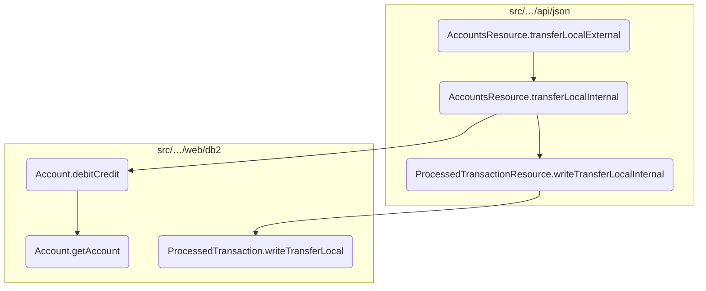

# Flow drill down

## Diving into <SwmToken path="src/webui/src/main/java/com/ibm/cics/cip/bankliberty/api/json/AccountsResource.java" pos="971:2:2" line-data="				&quot;transferLocalExternal(String accountNumber, TransferLocalJSON transferLocal)&quot;,">`transferLocalExternal`</SwmToken>

```mermaid
graph TD
  subgraph transferLocalExternal
    transferLocalExternal:A["Get Transfer Details"] --> transferLocalExternal:B["Validate account number"]
    transferLocalExternal:B -->|Valid account| transferLocalExternal:C["Validate transfer amount"]
    transferLocalExternal:C -->|Valid amount| transferLocalExternal:D["Validate target account"]
    transferLocalExternal:D -->|Valid target account| transferLocalExternal:E["Call transferLocalInternal"]
    transferLocalExternal:E --> transferLocalExternal:F["Terminate HBankDataAccess"]
    transferLocalExternal:F --> transferLocalExternal:G["Return response"]
  end

%% Swimm:
%% graph TD
%%   subgraph <SwmToken path="src/webui/src/main/java/com/ibm/cics/cip/bankliberty/api/json/AccountsResource.java" pos="971:2:2" line-data="				&quot;transferLocalExternal(String accountNumber, TransferLocalJSON transferLocal)&quot;,">`transferLocalExternal`</SwmToken>
%%     <SwmToken path="src/webui/src/main/java/com/ibm/cics/cip/bankliberty/api/json/AccountsResource.java" pos="971:2:2" line-data="				&quot;transferLocalExternal(String accountNumber, TransferLocalJSON transferLocal)&quot;,">`transferLocalExternal`</SwmToken>:A["Get Transfer Details"] --> <SwmToken path="src/webui/src/main/java/com/ibm/cics/cip/bankliberty/api/json/AccountsResource.java" pos="971:2:2" line-data="				&quot;transferLocalExternal(String accountNumber, TransferLocalJSON transferLocal)&quot;,">`transferLocalExternal`</SwmToken>:B["Validate account number"]
%%     <SwmToken path="src/webui/src/main/java/com/ibm/cics/cip/bankliberty/api/json/AccountsResource.java" pos="971:2:2" line-data="				&quot;transferLocalExternal(String accountNumber, TransferLocalJSON transferLocal)&quot;,">`transferLocalExternal`</SwmToken>:B -->|Valid account| <SwmToken path="src/webui/src/main/java/com/ibm/cics/cip/bankliberty/api/json/AccountsResource.java" pos="971:2:2" line-data="				&quot;transferLocalExternal(String accountNumber, TransferLocalJSON transferLocal)&quot;,">`transferLocalExternal`</SwmToken>:C["Validate transfer amount"]
%%     <SwmToken path="src/webui/src/main/java/com/ibm/cics/cip/bankliberty/api/json/AccountsResource.java" pos="971:2:2" line-data="				&quot;transferLocalExternal(String accountNumber, TransferLocalJSON transferLocal)&quot;,">`transferLocalExternal`</SwmToken>:C -->|Valid amount| <SwmToken path="src/webui/src/main/java/com/ibm/cics/cip/bankliberty/api/json/AccountsResource.java" pos="971:2:2" line-data="				&quot;transferLocalExternal(String accountNumber, TransferLocalJSON transferLocal)&quot;,">`transferLocalExternal`</SwmToken>:D["Validate target account"]
%%     <SwmToken path="src/webui/src/main/java/com/ibm/cics/cip/bankliberty/api/json/AccountsResource.java" pos="971:2:2" line-data="				&quot;transferLocalExternal(String accountNumber, TransferLocalJSON transferLocal)&quot;,">`transferLocalExternal`</SwmToken>:D -->|Valid target account| <SwmToken path="src/webui/src/main/java/com/ibm/cics/cip/bankliberty/api/json/AccountsResource.java" pos="971:2:2" line-data="				&quot;transferLocalExternal(String accountNumber, TransferLocalJSON transferLocal)&quot;,">`transferLocalExternal`</SwmToken>:E["Call <SwmToken path="src/webui/src/main/java/com/ibm/cics/cip/bankliberty/api/json/AccountsResource.java" pos="966:7:7" line-data="		Response myResponse = transferLocalInternal(">`transferLocalInternal`</SwmToken>"]
%%     <SwmToken path="src/webui/src/main/java/com/ibm/cics/cip/bankliberty/api/json/AccountsResource.java" pos="971:2:2" line-data="				&quot;transferLocalExternal(String accountNumber, TransferLocalJSON transferLocal)&quot;,">`transferLocalExternal`</SwmToken>:E --> <SwmToken path="src/webui/src/main/java/com/ibm/cics/cip/bankliberty/api/json/AccountsResource.java" pos="971:2:2" line-data="				&quot;transferLocalExternal(String accountNumber, TransferLocalJSON transferLocal)&quot;,">`transferLocalExternal`</SwmToken>:F["Terminate <SwmToken path="src/webui/src/main/java/com/ibm/cics/cip/bankliberty/api/json/AccountsResource.java" pos="968:1:1" line-data="		HBankDataAccess myHBankDataAccess = new HBankDataAccess();">`HBankDataAccess`</SwmToken>"]
%%     <SwmToken path="src/webui/src/main/java/com/ibm/cics/cip/bankliberty/api/json/AccountsResource.java" pos="971:2:2" line-data="				&quot;transferLocalExternal(String accountNumber, TransferLocalJSON transferLocal)&quot;,">`transferLocalExternal`</SwmToken>:F --> <SwmToken path="src/webui/src/main/java/com/ibm/cics/cip/bankliberty/api/json/AccountsResource.java" pos="971:2:2" line-data="				&quot;transferLocalExternal(String accountNumber, TransferLocalJSON transferLocal)&quot;,">`transferLocalExternal`</SwmToken>:G["Return response"]
%%   end
```

<SwmSnippet path="/src/webui/src/main/java/com/ibm/cics/cip/bankliberty/api/json/AccountsResource.java" line="932">

---

## Validating the account number

First, the <SwmToken path="src/webui/src/main/java/com/ibm/cics/cip/bankliberty/api/json/AccountsResource.java" pos="971:2:2" line-data="				&quot;transferLocalExternal(String accountNumber, TransferLocalJSON transferLocal)&quot;,">`transferLocalExternal`</SwmToken> method validates the account number provided as input. It checks if the account number is a valid integer and ensures it is not less than 1 or equal to 99999999. If the account number is invalid, the method returns null.

```java
		Integer accountNumberInteger;
		try
		{
			accountNumberInteger = Integer.parseInt(accountNumber);
			if (accountNumberInteger.intValue() < 1
					|| accountNumberInteger.intValue() == 99999999)
			{
				return null;
			}
		}
```

---

</SwmSnippet>

<SwmSnippet path="/src/webui/src/main/java/com/ibm/cics/cip/bankliberty/api/json/AccountsResource.java" line="946">

---

## Validating the transfer amount

Next, the method validates the transfer amount. It checks if the amount is a positive value. If the amount is negative, the method returns null. Otherwise, it sets the valid amount in the <SwmToken path="src/webui/src/main/java/com/ibm/cics/cip/bankliberty/api/json/AccountsResource.java" pos="946:3:3" line-data="		TransferLocalJSON transferLocalValid = new TransferLocalJSON();">`transferLocalValid`</SwmToken> object.

```java
		TransferLocalJSON transferLocalValid = new TransferLocalJSON();
		if (transferLocal.getAmount().doubleValue() < 0.00)
		{
			return null;
		}
		else
		{
			transferLocalValid.setAmount(transferLocal.getAmount());
		}
```

---

</SwmSnippet>

<SwmSnippet path="/src/webui/src/main/java/com/ibm/cics/cip/bankliberty/api/json/AccountsResource.java" line="955">

---

## Validating the target account

Then, the method validates the target account number. Similar to the account number validation, it ensures the target account number is not less than 1 or equal to 99999999. If the target account number is invalid, the method returns null. Otherwise, it sets the valid target account number in the <SwmToken path="src/webui/src/main/java/com/ibm/cics/cip/bankliberty/api/json/AccountsResource.java" pos="962:1:1" line-data="			transferLocalValid">`transferLocalValid`</SwmToken> object.

```java
		if (transferLocal.getTargetAccount() < 1
				|| transferLocal.getTargetAccount() == 99999999)
		{
			return null;
		}
		else
		{
			transferLocalValid
					.setTargetAccount(transferLocal.getTargetAccount());
		}
```

---

</SwmSnippet>

<SwmSnippet path="/src/webui/src/main/java/com/ibm/cics/cip/bankliberty/api/json/AccountsResource.java" line="966">

---

## Initiating the internal transfer

Finally, the method calls <SwmToken path="src/webui/src/main/java/com/ibm/cics/cip/bankliberty/api/json/AccountsResource.java" pos="966:7:7" line-data="		Response myResponse = transferLocalInternal(">`transferLocalInternal`</SwmToken> with the validated account number and transfer details. This initiates the actual transfer process between the two accounts. After the transfer, it terminates the <SwmToken path="src/webui/src/main/java/com/ibm/cics/cip/bankliberty/api/json/AccountsResource.java" pos="968:1:1" line-data="		HBankDataAccess myHBankDataAccess = new HBankDataAccess();">`HBankDataAccess`</SwmToken> instance and logs the transaction details before returning the response indicating the success or failure of the transfer.

```java
		Response myResponse = transferLocalInternal(
				accountNumberInteger.toString(), transferLocalValid);
		HBankDataAccess myHBankDataAccess = new HBankDataAccess();
		myHBankDataAccess.terminate();
		logger.exiting(this.getClass().getName(),
				"transferLocalExternal(String accountNumber, TransferLocalJSON transferLocal)",
				myResponse);
		return myResponse;
```

---

</SwmSnippet>

## Diving into the <SwmToken path="src/webui/src/main/java/com/ibm/cics/cip/bankliberty/api/json/AccountsResource.java" pos="966:7:7" line-data="		Response myResponse = transferLocalInternal(">`transferLocalInternal`</SwmToken> function

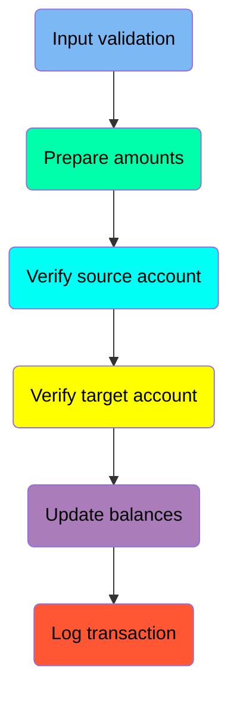

## <SwmToken path="src/webui/src/main/java/com/ibm/cics/cip/bankliberty/api/json/AccountsResource.java" pos="966:7:7" line-data="		Response myResponse = transferLocalInternal(">`transferLocalInternal`</SwmToken> function - Input validation

Here is a diagram of this part:

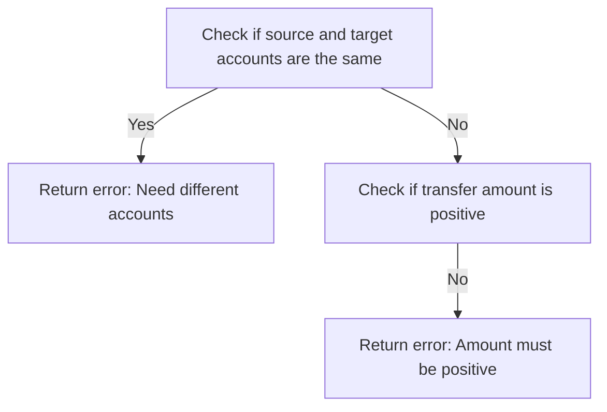

<SwmSnippet path="/src/webui/src/main/java/com/ibm/cics/cip/bankliberty/api/json/AccountsResource.java" line="989">

---

### Validating the account numbers

The function first checks if the source account number is the same as the target account number. This is done to ensure that the transfer is between two different accounts, as transferring money to the same account is not allowed.

```java
		if (Integer.parseInt(accountNumber) == transferLocal.getTargetAccount())
		{
			JSONObject error = new JSONObject();
			error.put(JSON_ERROR_MSG, NEED_DIFFERENT_ACCOUNTS);
			logger.log(Level.WARNING, () -> (NEED_DIFFERENT_ACCOUNTS));
			myResponse = Response.status(400).entity(error.toString()).build();
			logger.exiting(this.getClass().getName(), TRANSFER_LOCAL_INTERNAL,
					myResponse);
			return myResponse;
		}
```

---

</SwmSnippet>

<SwmSnippet path="/src/webui/src/main/java/com/ibm/cics/cip/bankliberty/api/json/AccountsResource.java" line="1000">

---

### Validating the transfer amount

Next, the function checks if the transfer amount is positive. This validation is crucial because transferring a non-positive amount does not make sense in a banking context.

```java
		if (transferLocal.getAmount().doubleValue() <= 0.00)
		{
			JSONObject error = new JSONObject();
			error.put(JSON_ERROR_MSG, "Amount to transfer must be positive");
			logger.log(Level.WARNING, () -> (NEED_DIFFERENT_ACCOUNTS));
			myResponse = Response.status(400).entity(error.toString()).build();
			logger.exiting(this.getClass().getName(), TRANSFER_LOCAL_INTERNAL,
					myResponse);
			return myResponse;
		}
```

---

</SwmSnippet>

## <SwmToken path="src/webui/src/main/java/com/ibm/cics/cip/bankliberty/api/json/AccountsResource.java" pos="966:7:7" line-data="		Response myResponse = transferLocalInternal(">`transferLocalInternal`</SwmToken> function - Prepare amounts

Here is a diagram of this part:

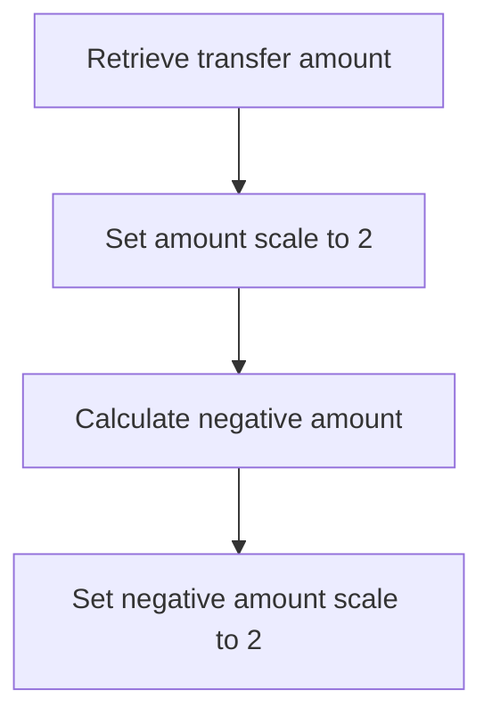

<SwmSnippet path="/src/webui/src/main/java/com/ibm/cics/cip/bankliberty/api/json/AccountsResource.java" line="1011">

---

### Preparing the amounts for the transfer

The <SwmToken path="src/webui/src/main/java/com/ibm/cics/cip/bankliberty/api/json/AccountsResource.java" pos="966:7:7" line-data="		Response myResponse = transferLocalInternal(">`transferLocalInternal`</SwmToken> function prepares the amounts for the transfer by first retrieving the transfer amount from the <SwmToken path="src/webui/src/main/java/com/ibm/cics/cip/bankliberty/api/json/AccountsResource.java" pos="1011:7:7" line-data="		BigDecimal amount = transferLocal.getAmount();">`transferLocal`</SwmToken> object. This amount is then set to a scale of 2 with rounding mode set to <SwmToken path="src/webui/src/main/java/com/ibm/cics/cip/bankliberty/api/json/AccountsResource.java" pos="1012:14:14" line-data="		amount = amount.setScale(2, RoundingMode.HALF_UP);">`HALF_UP`</SwmToken> to ensure it is formatted correctly for financial transactions.

```java
		BigDecimal amount = transferLocal.getAmount();
		amount = amount.setScale(2, RoundingMode.HALF_UP);
```

---

</SwmSnippet>

<SwmSnippet path="/src/webui/src/main/java/com/ibm/cics/cip/bankliberty/api/json/AccountsResource.java" line="1013">

---

Next, the function calculates the negative equivalent of the transfer amount. This is done by multiplying the amount by <SwmToken path="src/webui/src/main/java/com/ibm/cics/cip/bankliberty/api/json/AccountsResource.java" pos="1014:13:14" line-data="		negativeAmount = negativeAmount.multiply(BigDecimal.valueOf(-1));">`-1`</SwmToken> and then setting the scale to 2 with rounding mode <SwmToken path="src/webui/src/main/java/com/ibm/cics/cip/bankliberty/api/json/AccountsResource.java" pos="1015:14:14" line-data="		negativeAmount = negativeAmount.setScale(2, RoundingMode.HALF_UP);">`HALF_UP`</SwmToken> again. This negative amount is used for debiting the source account in the transfer process.

```java
		BigDecimal negativeAmount = amount;
		negativeAmount = negativeAmount.multiply(BigDecimal.valueOf(-1));
		negativeAmount = negativeAmount.setScale(2, RoundingMode.HALF_UP);
```

---

</SwmSnippet>

## <SwmToken path="src/webui/src/main/java/com/ibm/cics/cip/bankliberty/api/json/AccountsResource.java" pos="966:7:7" line-data="		Response myResponse = transferLocalInternal(">`transferLocalInternal`</SwmToken> function - Verify source account

Here is a diagram of this part:

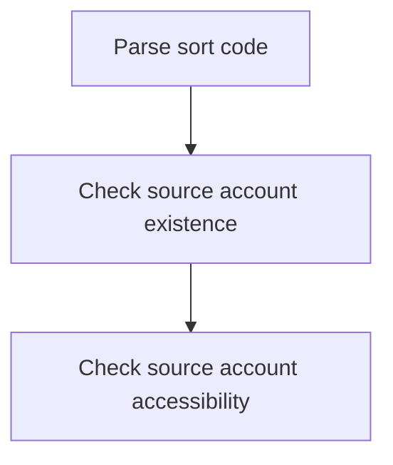

<SwmSnippet path="/src/webui/src/main/java/com/ibm/cics/cip/bankliberty/api/json/AccountsResource.java" line="1017">

---

### Parsing the sort code

The function begins by parsing the sort code of the bank using <SwmToken path="src/webui/src/main/java/com/ibm/cics/cip/bankliberty/api/json/AccountsResource.java" pos="1017:7:20" line-data="		Long sortCode = Long.parseLong(this.getSortCode().toString());">`Long.parseLong(this.getSortCode().toString())`</SwmToken>. This is necessary to identify the bank branch involved in the transaction.

```java
		Long sortCode = Long.parseLong(this.getSortCode().toString());
```

---

</SwmSnippet>

<SwmSnippet path="/src/webui/src/main/java/com/ibm/cics/cip/bankliberty/api/json/AccountsResource.java" line="1020">

---

### Checking source account existence

Next, the function verifies the existence of the source account by calling <SwmToken path="src/webui/src/main/java/com/ibm/cics/cip/bankliberty/api/json/AccountsResource.java" pos="1050:5:7" line-data="		checkAccountResponse = checkAccount.getAccountInternal(">`checkAccount.getAccountInternal`</SwmToken>`(`<SwmToken path="src/webui/src/main/java/com/ibm/cics/cip/bankliberty/api/json/AccountsResource.java" pos="1022:4:6" line-data="				.getAccountInternal(Long.parseLong(accountNumber));">`Long.parseLong`</SwmToken>`(`<SwmToken path="src/webui/src/main/java/com/ibm/cics/cip/bankliberty/api/json/AccountsResource.java" pos="1022:8:8" line-data="				.getAccountInternal(Long.parseLong(accountNumber));">`accountNumber`</SwmToken>`))`. If the account does not exist (status 404), it logs an error and returns a response indicating that the source account cannot be found.

```java
		AccountsResource checkAccount = new AccountsResource();
		Response checkAccountResponse = checkAccount
				.getAccountInternal(Long.parseLong(accountNumber));

		if (checkAccountResponse.getStatus() == 404)
		{
			JSONObject error = new JSONObject();
			error.put(JSON_ERROR_MSG,
					SOURCE_ACCOUNT_NUMBER + accountNumber + CANNOT_BE_FOUND);
			logger.log(Level.WARNING, () -> (SOURCE_ACCOUNT_NUMBER
					+ accountNumber + CANNOT_BE_FOUND));
			myResponse = Response.status(404).entity(error.toString()).build();
			logger.exiting(this.getClass().getName(), TRANSFER_LOCAL_INTERNAL,
					myResponse);
			return myResponse;
		}
```

---

</SwmSnippet>

<SwmSnippet path="/src/webui/src/main/java/com/ibm/cics/cip/bankliberty/api/json/AccountsResource.java" line="1037">

---

### Checking source account accessibility

If the source account exists but is not accessible (status not 200), the function logs an error and returns a response indicating that the source account cannot be accessed.

```java
		if (checkAccountResponse.getStatus() != 200)
		{
			JSONObject error = new JSONObject();
			error.put(JSON_ERROR_MSG,
					SOURCE_ACCOUNT_NUMBER + accountNumber + CANNOT_BE_ACCESSED);
			logger.log(Level.WARNING, () -> (SOURCE_ACCOUNT_NUMBER
					+ accountNumber + CANNOT_BE_ACCESSED));
			myResponse = Response.status(checkAccountResponse.getStatus())
					.entity(error.toString()).build();
			logger.exiting(this.getClass().getName(), TRANSFER_LOCAL_INTERNAL,
					myResponse);
			return myResponse;
		}
```

---

</SwmSnippet>

## <SwmToken path="src/webui/src/main/java/com/ibm/cics/cip/bankliberty/api/json/AccountsResource.java" pos="966:7:7" line-data="		Response myResponse = transferLocalInternal(">`transferLocalInternal`</SwmToken> function - Verify target account

Here is a diagram of this part:

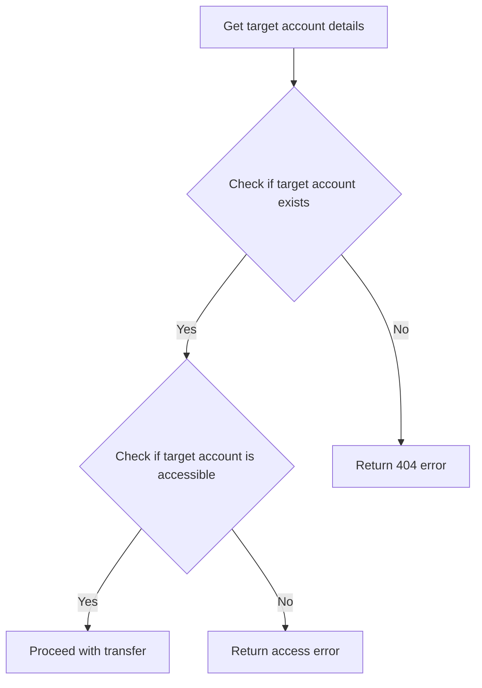

<SwmSnippet path="/src/webui/src/main/java/com/ibm/cics/cip/bankliberty/api/json/AccountsResource.java" line="1050">

---

### Verifying the target account

The function <SwmToken path="src/webui/src/main/java/com/ibm/cics/cip/bankliberty/api/json/AccountsResource.java" pos="966:7:7" line-data="		Response myResponse = transferLocalInternal(">`transferLocalInternal`</SwmToken> verifies the target account by first retrieving the account details using <SwmToken path="src/webui/src/main/java/com/ibm/cics/cip/bankliberty/api/json/AccountsResource.java" pos="1050:5:7" line-data="		checkAccountResponse = checkAccount.getAccountInternal(">`checkAccount.getAccountInternal`</SwmToken>`(`<SwmToken path="src/webui/src/main/java/com/ibm/cics/cip/bankliberty/api/json/AccountsResource.java" pos="1051:1:3" line-data="				Long.parseLong(transferLocal.getTargetAccount().toString()));">`Long.parseLong`</SwmToken>`(`<SwmToken path="src/webui/src/main/java/com/ibm/cics/cip/bankliberty/api/json/AccountsResource.java" pos="1051:5:9" line-data="				Long.parseLong(transferLocal.getTargetAccount().toString()));">`transferLocal.getTargetAccount()`</SwmToken><SwmToken path="src/webui/src/main/java/com/ibm/cics/cip/bankliberty/api/json/AccountsResource.java" pos="1051:10:13" line-data="				Long.parseLong(transferLocal.getTargetAccount().toString()));">`.toString()`</SwmToken>`))`. This ensures that the target account exists in the system.

```java
		checkAccountResponse = checkAccount.getAccountInternal(
				Long.parseLong(transferLocal.getTargetAccount().toString()));
```

---

</SwmSnippet>

<SwmSnippet path="/src/webui/src/main/java/com/ibm/cics/cip/bankliberty/api/json/AccountsResource.java" line="1053">

---

Next, the function checks if the target account exists by evaluating the status of the response. If the status is <SwmToken path="src/webui/src/main/java/com/ibm/cics/cip/bankliberty/api/json/AccountsResource.java" pos="1053:12:12" line-data="		if (checkAccountResponse.getStatus() == 404)">`404`</SwmToken>, it means the target account cannot be found, and an error response is returned with a message indicating that the target account number cannot be found.

```java
		if (checkAccountResponse.getStatus() == 404)
		{
			JSONObject error = new JSONObject();
			error.put(JSON_ERROR_MSG, TARGET_ACCOUNT_NUMBER
					+ transferLocal.getTargetAccount() + CANNOT_BE_FOUND);
			logger.log(Level.WARNING, () -> (TARGET_ACCOUNT_NUMBER
					+ accountNumber + CANNOT_BE_FOUND));
			myResponse = Response.status(404).entity(error.toString()).build();
			logger.exiting(this.getClass().getName(), TRANSFER_LOCAL_INTERNAL,
					myResponse);
			return myResponse;
		}
```

---

</SwmSnippet>

<SwmSnippet path="/src/webui/src/main/java/com/ibm/cics/cip/bankliberty/api/json/AccountsResource.java" line="1065">

---

If the target account exists but is not accessible (status is not <SwmToken path="src/webui/src/main/java/com/ibm/cics/cip/bankliberty/api/json/AccountsResource.java" pos="1065:12:12" line-data="		if (checkAccountResponse.getStatus() != 200)">`200`</SwmToken>), the function returns an error response indicating that the target account cannot be accessed. This ensures that the transfer can only proceed if the target account is both found and accessible.

```java
		if (checkAccountResponse.getStatus() != 200)
		{
			JSONObject error = new JSONObject();
			error.put(JSON_ERROR_MSG, TARGET_ACCOUNT_NUMBER
					+ transferLocal.getTargetAccount() + CANNOT_BE_ACCESSED);
			logger.log(Level.SEVERE, () -> TARGET_ACCOUNT_NUMBER + accountNumber
					+ CANNOT_BE_ACCESSED);
			myResponse = Response.status(404).entity(error.toString()).build();
			logger.exiting(this.getClass().getName(), TRANSFER_LOCAL_INTERNAL,
					myResponse);
			return myResponse;
```

---

</SwmSnippet>

## <SwmToken path="src/webui/src/main/java/com/ibm/cics/cip/bankliberty/api/json/AccountsResource.java" pos="966:7:7" line-data="		Response myResponse = transferLocalInternal(">`transferLocalInternal`</SwmToken> function - Update balances

Here is a diagram of this part:

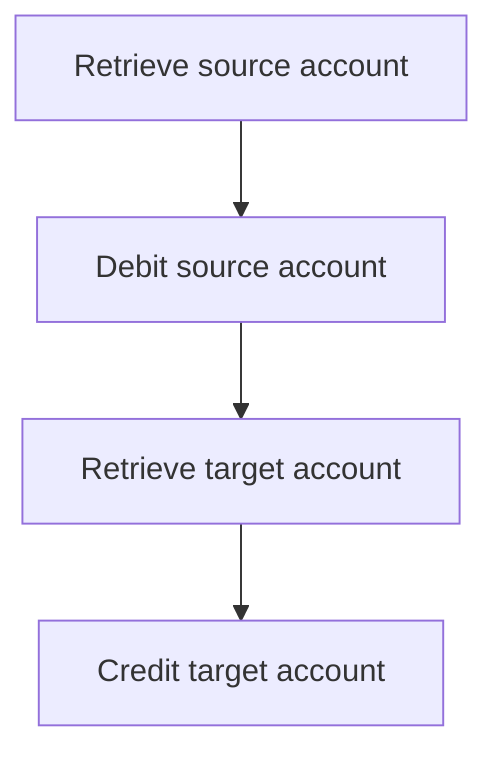

<SwmSnippet path="/src/webui/src/main/java/com/ibm/cics/cip/bankliberty/api/json/AccountsResource.java" line="1078">

---

### Updating account balances

The core logic of the <SwmToken path="src/webui/src/main/java/com/ibm/cics/cip/bankliberty/api/json/AccountsResource.java" pos="966:7:7" line-data="		Response myResponse = transferLocalInternal(">`transferLocalInternal`</SwmToken> function involves updating the account balances for both the source and target accounts. This is achieved by first retrieving the source account using the provided account number and sort code.

```java
		com.ibm.cics.cip.bankliberty.web.db2.Account db2Account = new com.ibm.cics.cip.bankliberty.web.db2.Account();
		db2Account.setAccountNumber(accountNumber);
		db2Account.setSortcode(sortCode.toString());
```

---

</SwmSnippet>

<SwmSnippet path="/src/webui/src/main/java/com/ibm/cics/cip/bankliberty/api/json/AccountsResource.java" line="1081">

---

Next, the function debits the source account by the specified transfer amount, which is represented as a negative value.

```java
		db2Account.debitCredit(negativeAmount);
```

---

</SwmSnippet>

<SwmSnippet path="/src/webui/src/main/java/com/ibm/cics/cip/bankliberty/api/json/AccountsResource.java" line="1083">

---

After debiting the source account, the function then retrieves the target account using the target account number and the same sort code.

```java
		db2Account.setAccountNumber(transferLocal.targetAccount.toString());
		db2Account.setSortcode(sortCode.toString());
```

---

</SwmSnippet>

<SwmSnippet path="/src/webui/src/main/java/com/ibm/cics/cip/bankliberty/api/json/AccountsResource.java" line="1085">

---

Finally, the function credits the target account with the transfer amount, effectively completing the transfer process.

```java
		db2Account.debitCredit(amount);
```

---

</SwmSnippet>

## <SwmToken path="src/webui/src/main/java/com/ibm/cics/cip/bankliberty/api/json/AccountsResource.java" pos="966:7:7" line-data="		Response myResponse = transferLocalInternal(">`transferLocalInternal`</SwmToken> function - Log transaction

Here is a diagram of this part:

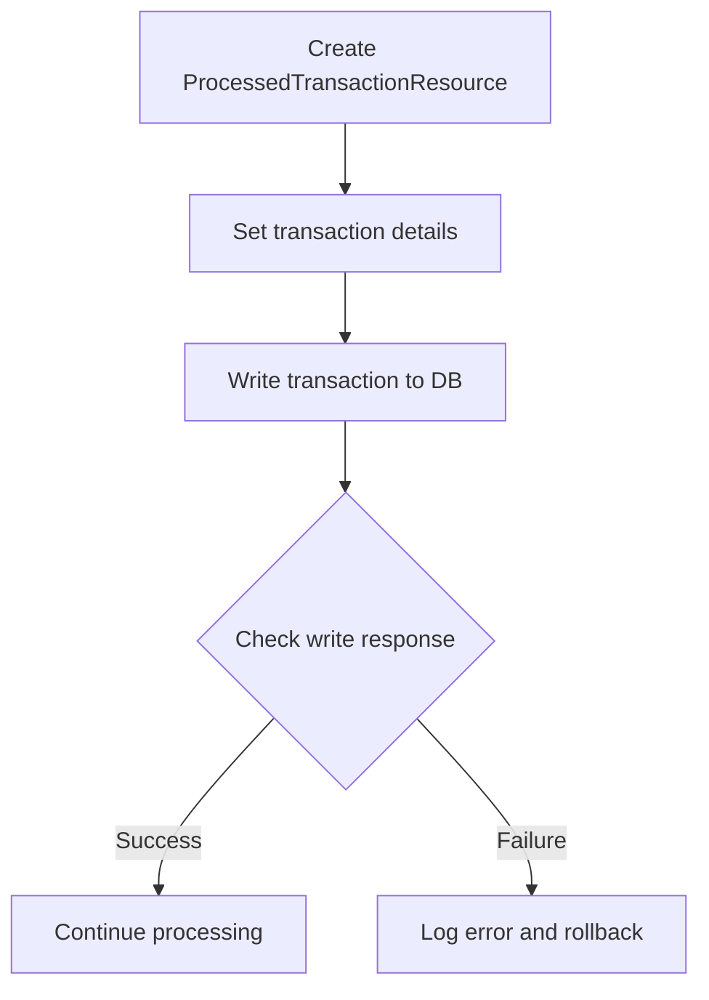

<SwmSnippet path="/src/webui/src/main/java/com/ibm/cics/cip/bankliberty/api/json/AccountsResource.java" line="1087">

---

### Logging the transaction details

The <SwmToken path="src/webui/src/main/java/com/ibm/cics/cip/bankliberty/api/json/AccountsResource.java" pos="1087:1:1" line-data="		ProcessedTransactionResource myProcessedTransactionResource = new ProcessedTransactionResource();">`ProcessedTransactionResource`</SwmToken> object is instantiated to handle the transaction logging. The transaction details such as sort code, account number, amount, and target account number are set using the <SwmToken path="src/webui/src/main/java/com/ibm/cics/cip/bankliberty/api/json/AccountsResource.java" pos="1089:1:1" line-data="		ProcessedTransactionTransferLocalJSON myProctranTransferLocal = new ProcessedTransactionTransferLocalJSON();">`ProcessedTransactionTransferLocalJSON`</SwmToken> object.

```java
		ProcessedTransactionResource myProcessedTransactionResource = new ProcessedTransactionResource();

		ProcessedTransactionTransferLocalJSON myProctranTransferLocal = new ProcessedTransactionTransferLocalJSON();
		myProctranTransferLocal.setSortCode(db2Account.getSortcode());
		myProctranTransferLocal.setAccountNumber(db2Account.getAccountNumber());
		myProctranTransferLocal.setAmount(amount);
		myProctranTransferLocal.setTargetAccountNumber(
				transferLocal.getTargetAccount().toString());

```

---

</SwmSnippet>

<SwmSnippet path="/src/webui/src/main/java/com/ibm/cics/cip/bankliberty/api/json/AccountsResource.java" line="1096">

---

### Handling the response from the write operation

The <SwmToken path="src/webui/src/main/java/com/ibm/cics/cip/bankliberty/api/json/AccountsResource.java" pos="1097:2:2" line-data="				.writeTransferLocalInternal(myProctranTransferLocal);">`writeTransferLocalInternal`</SwmToken> method of <SwmToken path="src/webui/src/main/java/com/ibm/cics/cip/bankliberty/api/json/AccountsResource.java" pos="1087:1:1" line-data="		ProcessedTransactionResource myProcessedTransactionResource = new ProcessedTransactionResource();">`ProcessedTransactionResource`</SwmToken> is called to write the transaction details to the database. If the response is null or indicates a failure (status not equal to 200), an error message is logged, and a rollback is attempted to maintain data integrity. The response is then returned with a status of 500.

```java
		Response writeTransferResponse = myProcessedTransactionResource
				.writeTransferLocalInternal(myProctranTransferLocal);
		if (writeTransferResponse == null
				|| writeTransferResponse.getStatus() != 200)
		{
			JSONObject error = new JSONObject();
			error.put(JSON_ERROR_MSG, PROCTRAN_WRITE_FAILURE);
			logger.log(Level.SEVERE,
					() -> "Accounts: transferLocal: " + PROCTRAN_WRITE_FAILURE);
			try
			{
				Task.getTask().rollback();
			}
			catch (InvalidRequestException e)
			{
				logger.log(Level.SEVERE, () -> "Accounts: transferLocal: "
						+ PROCTRAN_WRITE_FAILURE);
			}
			myResponse = Response.status(500).entity(error.toString()).build();
			logger.exiting(this.getClass().getName(), TRANSFER_LOCAL_INTERNAL,
					myResponse);
```

---

</SwmSnippet>

## Diving into <SwmToken path="src/webui/src/main/java/com/ibm/cics/cip/bankliberty/api/json/AccountsResource.java" pos="1081:3:3" line-data="		db2Account.debitCredit(negativeAmount);">`debitCredit`</SwmToken> & <SwmToken path="src/webui/src/main/java/com/ibm/cics/cip/bankliberty/web/db2/Account.java" pos="1003:9:9" line-data="		Account temp = this.getAccount(">`getAccount`</SwmToken>

```mermaid
graph TD
subgraph debitCredit
debitCredit:A["Retrieve Temporary Account"] --> debitCredit:B["Check if Account Exists"]
debitCredit:B -->|Exists| debitCredit:C["Open SQL Connection"]
debitCredit:C --> debitCredit:D["Retrieve Account Number"]
debitCredit:D --> debitCredit:E["Pad Sort Code"]
debitCredit:E --> debitCredit:F["Execute Select Query"]
debitCredit:F -->|Result Found| debitCredit:G["Create new Account Object"]
debitCredit:F -->|No Result| debitCredit:H["Log Warning: Result set had no results"]
debitCredit:H --> debitCredit:I["Return False"]
debitCredit:G --> debitCredit:J["Calculate New Balances"]
debitCredit:J --> debitCredit:K["Set Actual and Available Balances"]
debitCredit:K --> debitCredit:L["Prepare Update Statement"]
debitCredit:L --> debitCredit:M["Execute Update Query"]
debitCredit:M --> debitCredit:N["Return True"]
debitCredit:A -->|Not Exists| debitCredit:O["Log Warning: Unable to Find Account"]
debitCredit:O --> debitCredit:P["Return False"]
end
subgraph getAccount
getAccount:A["Open SQL Connection"] --> getAccount:B["Pad Sort Code"]
getAccount:B --> getAccount:C["Check if Account Number is Default (99999999)"]
getAccount:C -->|Default| getAccount:D["Prepare Statement for Default Account"]
getAccount:D --> getAccount:E["Execute Default Query"]
getAccount:E -->|Result Found| getAccount:F["Create Account Object"]
getAccount:F --> getAccount:G["Return Account Object"]
getAccount:E -->|No Result| getAccount:H["Log Warning: No Results Found"]
getAccount:H --> getAccount:I["Return Null"]
getAccount:C -->|Not Default| getAccount:J["Prepare Statement with Account Number"]
getAccount:J --> getAccount:K["Execute Query with Account Number"]
getAccount:K -->|Closed| getAccount:L["Log Warning: Result Set is Closed"]
getAccount:L --> getAccount:M["Return Temp"]
getAccount:K -->|Result Found| getAccount:N["Create Account Object"]
getAccount:N --> getAccount:G
getAccount:K -->|No Result| getAccount:I
end
debitCredit:A --> getAccount

%% Swimm:
%% graph TD
%% subgraph <SwmToken path="src/webui/src/main/java/com/ibm/cics/cip/bankliberty/api/json/AccountsResource.java" pos="1081:3:3" line-data="		db2Account.debitCredit(negativeAmount);">`debitCredit`</SwmToken>
%% <SwmToken path="src/webui/src/main/java/com/ibm/cics/cip/bankliberty/api/json/AccountsResource.java" pos="1081:3:3" line-data="		db2Account.debitCredit(negativeAmount);">`debitCredit`</SwmToken>:A["Retrieve Temporary Account"] --> <SwmToken path="src/webui/src/main/java/com/ibm/cics/cip/bankliberty/api/json/AccountsResource.java" pos="1081:3:3" line-data="		db2Account.debitCredit(negativeAmount);">`debitCredit`</SwmToken>:B["Check if Account Exists"]
%% <SwmToken path="src/webui/src/main/java/com/ibm/cics/cip/bankliberty/api/json/AccountsResource.java" pos="1081:3:3" line-data="		db2Account.debitCredit(negativeAmount);">`debitCredit`</SwmToken>:B -->|Exists| <SwmToken path="src/webui/src/main/java/com/ibm/cics/cip/bankliberty/api/json/AccountsResource.java" pos="1081:3:3" line-data="		db2Account.debitCredit(negativeAmount);">`debitCredit`</SwmToken>:C["Open SQL Connection"]
%% <SwmToken path="src/webui/src/main/java/com/ibm/cics/cip/bankliberty/api/json/AccountsResource.java" pos="1081:3:3" line-data="		db2Account.debitCredit(negativeAmount);">`debitCredit`</SwmToken>:C --> <SwmToken path="src/webui/src/main/java/com/ibm/cics/cip/bankliberty/api/json/AccountsResource.java" pos="1081:3:3" line-data="		db2Account.debitCredit(negativeAmount);">`debitCredit`</SwmToken>:D["Retrieve Account Number"]
%% <SwmToken path="src/webui/src/main/java/com/ibm/cics/cip/bankliberty/api/json/AccountsResource.java" pos="1081:3:3" line-data="		db2Account.debitCredit(negativeAmount);">`debitCredit`</SwmToken>:D --> <SwmToken path="src/webui/src/main/java/com/ibm/cics/cip/bankliberty/api/json/AccountsResource.java" pos="1081:3:3" line-data="		db2Account.debitCredit(negativeAmount);">`debitCredit`</SwmToken>:E["Pad Sort Code"]
%% <SwmToken path="src/webui/src/main/java/com/ibm/cics/cip/bankliberty/api/json/AccountsResource.java" pos="1081:3:3" line-data="		db2Account.debitCredit(negativeAmount);">`debitCredit`</SwmToken>:E --> <SwmToken path="src/webui/src/main/java/com/ibm/cics/cip/bankliberty/api/json/AccountsResource.java" pos="1081:3:3" line-data="		db2Account.debitCredit(negativeAmount);">`debitCredit`</SwmToken>:F["Execute Select Query"]
%% <SwmToken path="src/webui/src/main/java/com/ibm/cics/cip/bankliberty/api/json/AccountsResource.java" pos="1081:3:3" line-data="		db2Account.debitCredit(negativeAmount);">`debitCredit`</SwmToken>:F -->|Result Found| <SwmToken path="src/webui/src/main/java/com/ibm/cics/cip/bankliberty/api/json/AccountsResource.java" pos="1081:3:3" line-data="		db2Account.debitCredit(negativeAmount);">`debitCredit`</SwmToken>:G["Create new Account Object"]
%% <SwmToken path="src/webui/src/main/java/com/ibm/cics/cip/bankliberty/api/json/AccountsResource.java" pos="1081:3:3" line-data="		db2Account.debitCredit(negativeAmount);">`debitCredit`</SwmToken>:F -->|No Result| <SwmToken path="src/webui/src/main/java/com/ibm/cics/cip/bankliberty/api/json/AccountsResource.java" pos="1081:3:3" line-data="		db2Account.debitCredit(negativeAmount);">`debitCredit`</SwmToken>:H["Log Warning: Result set had no results"]
%% <SwmToken path="src/webui/src/main/java/com/ibm/cics/cip/bankliberty/api/json/AccountsResource.java" pos="1081:3:3" line-data="		db2Account.debitCredit(negativeAmount);">`debitCredit`</SwmToken>:H --> <SwmToken path="src/webui/src/main/java/com/ibm/cics/cip/bankliberty/api/json/AccountsResource.java" pos="1081:3:3" line-data="		db2Account.debitCredit(negativeAmount);">`debitCredit`</SwmToken>:I["Return False"]
%% <SwmToken path="src/webui/src/main/java/com/ibm/cics/cip/bankliberty/api/json/AccountsResource.java" pos="1081:3:3" line-data="		db2Account.debitCredit(negativeAmount);">`debitCredit`</SwmToken>:G --> <SwmToken path="src/webui/src/main/java/com/ibm/cics/cip/bankliberty/api/json/AccountsResource.java" pos="1081:3:3" line-data="		db2Account.debitCredit(negativeAmount);">`debitCredit`</SwmToken>:J["Calculate New Balances"]
%% <SwmToken path="src/webui/src/main/java/com/ibm/cics/cip/bankliberty/api/json/AccountsResource.java" pos="1081:3:3" line-data="		db2Account.debitCredit(negativeAmount);">`debitCredit`</SwmToken>:J --> <SwmToken path="src/webui/src/main/java/com/ibm/cics/cip/bankliberty/api/json/AccountsResource.java" pos="1081:3:3" line-data="		db2Account.debitCredit(negativeAmount);">`debitCredit`</SwmToken>:K["Set Actual and Available Balances"]
%% <SwmToken path="src/webui/src/main/java/com/ibm/cics/cip/bankliberty/api/json/AccountsResource.java" pos="1081:3:3" line-data="		db2Account.debitCredit(negativeAmount);">`debitCredit`</SwmToken>:K --> <SwmToken path="src/webui/src/main/java/com/ibm/cics/cip/bankliberty/api/json/AccountsResource.java" pos="1081:3:3" line-data="		db2Account.debitCredit(negativeAmount);">`debitCredit`</SwmToken>:L["Prepare Update Statement"]
%% <SwmToken path="src/webui/src/main/java/com/ibm/cics/cip/bankliberty/api/json/AccountsResource.java" pos="1081:3:3" line-data="		db2Account.debitCredit(negativeAmount);">`debitCredit`</SwmToken>:L --> <SwmToken path="src/webui/src/main/java/com/ibm/cics/cip/bankliberty/api/json/AccountsResource.java" pos="1081:3:3" line-data="		db2Account.debitCredit(negativeAmount);">`debitCredit`</SwmToken>:M["Execute Update Query"]
%% <SwmToken path="src/webui/src/main/java/com/ibm/cics/cip/bankliberty/api/json/AccountsResource.java" pos="1081:3:3" line-data="		db2Account.debitCredit(negativeAmount);">`debitCredit`</SwmToken>:M --> <SwmToken path="src/webui/src/main/java/com/ibm/cics/cip/bankliberty/api/json/AccountsResource.java" pos="1081:3:3" line-data="		db2Account.debitCredit(negativeAmount);">`debitCredit`</SwmToken>:N["Return True"]
%% <SwmToken path="src/webui/src/main/java/com/ibm/cics/cip/bankliberty/api/json/AccountsResource.java" pos="1081:3:3" line-data="		db2Account.debitCredit(negativeAmount);">`debitCredit`</SwmToken>:A -->|Not Exists| <SwmToken path="src/webui/src/main/java/com/ibm/cics/cip/bankliberty/api/json/AccountsResource.java" pos="1081:3:3" line-data="		db2Account.debitCredit(negativeAmount);">`debitCredit`</SwmToken>:O["Log Warning: Unable to Find Account"]
%% <SwmToken path="src/webui/src/main/java/com/ibm/cics/cip/bankliberty/api/json/AccountsResource.java" pos="1081:3:3" line-data="		db2Account.debitCredit(negativeAmount);">`debitCredit`</SwmToken>:O --> <SwmToken path="src/webui/src/main/java/com/ibm/cics/cip/bankliberty/api/json/AccountsResource.java" pos="1081:3:3" line-data="		db2Account.debitCredit(negativeAmount);">`debitCredit`</SwmToken>:P["Return False"]
%% end
%% subgraph <SwmToken path="src/webui/src/main/java/com/ibm/cics/cip/bankliberty/web/db2/Account.java" pos="1003:9:9" line-data="		Account temp = this.getAccount(">`getAccount`</SwmToken>
%% <SwmToken path="src/webui/src/main/java/com/ibm/cics/cip/bankliberty/web/db2/Account.java" pos="1003:9:9" line-data="		Account temp = this.getAccount(">`getAccount`</SwmToken>:A["Open SQL Connection"] --> <SwmToken path="src/webui/src/main/java/com/ibm/cics/cip/bankliberty/web/db2/Account.java" pos="1003:9:9" line-data="		Account temp = this.getAccount(">`getAccount`</SwmToken>:B["Pad Sort Code"]
%% <SwmToken path="src/webui/src/main/java/com/ibm/cics/cip/bankliberty/web/db2/Account.java" pos="1003:9:9" line-data="		Account temp = this.getAccount(">`getAccount`</SwmToken>:B --> <SwmToken path="src/webui/src/main/java/com/ibm/cics/cip/bankliberty/web/db2/Account.java" pos="1003:9:9" line-data="		Account temp = this.getAccount(">`getAccount`</SwmToken>:C["Check if Account Number is Default (99999999)"]
%% <SwmToken path="src/webui/src/main/java/com/ibm/cics/cip/bankliberty/web/db2/Account.java" pos="1003:9:9" line-data="		Account temp = this.getAccount(">`getAccount`</SwmToken>:C -->|Default| <SwmToken path="src/webui/src/main/java/com/ibm/cics/cip/bankliberty/web/db2/Account.java" pos="1003:9:9" line-data="		Account temp = this.getAccount(">`getAccount`</SwmToken>:D["Prepare Statement for Default Account"]
%% <SwmToken path="src/webui/src/main/java/com/ibm/cics/cip/bankliberty/web/db2/Account.java" pos="1003:9:9" line-data="		Account temp = this.getAccount(">`getAccount`</SwmToken>:D --> <SwmToken path="src/webui/src/main/java/com/ibm/cics/cip/bankliberty/web/db2/Account.java" pos="1003:9:9" line-data="		Account temp = this.getAccount(">`getAccount`</SwmToken>:E["Execute Default Query"]
%% <SwmToken path="src/webui/src/main/java/com/ibm/cics/cip/bankliberty/web/db2/Account.java" pos="1003:9:9" line-data="		Account temp = this.getAccount(">`getAccount`</SwmToken>:E -->|Result Found| <SwmToken path="src/webui/src/main/java/com/ibm/cics/cip/bankliberty/web/db2/Account.java" pos="1003:9:9" line-data="		Account temp = this.getAccount(">`getAccount`</SwmToken>:F["Create Account Object"]
%% <SwmToken path="src/webui/src/main/java/com/ibm/cics/cip/bankliberty/web/db2/Account.java" pos="1003:9:9" line-data="		Account temp = this.getAccount(">`getAccount`</SwmToken>:F --> <SwmToken path="src/webui/src/main/java/com/ibm/cics/cip/bankliberty/web/db2/Account.java" pos="1003:9:9" line-data="		Account temp = this.getAccount(">`getAccount`</SwmToken>:G["Return Account Object"]
%% <SwmToken path="src/webui/src/main/java/com/ibm/cics/cip/bankliberty/web/db2/Account.java" pos="1003:9:9" line-data="		Account temp = this.getAccount(">`getAccount`</SwmToken>:E -->|No Result| <SwmToken path="src/webui/src/main/java/com/ibm/cics/cip/bankliberty/web/db2/Account.java" pos="1003:9:9" line-data="		Account temp = this.getAccount(">`getAccount`</SwmToken>:H["Log Warning: No Results Found"]
%% <SwmToken path="src/webui/src/main/java/com/ibm/cics/cip/bankliberty/web/db2/Account.java" pos="1003:9:9" line-data="		Account temp = this.getAccount(">`getAccount`</SwmToken>:H --> <SwmToken path="src/webui/src/main/java/com/ibm/cics/cip/bankliberty/web/db2/Account.java" pos="1003:9:9" line-data="		Account temp = this.getAccount(">`getAccount`</SwmToken>:I["Return Null"]
%% <SwmToken path="src/webui/src/main/java/com/ibm/cics/cip/bankliberty/web/db2/Account.java" pos="1003:9:9" line-data="		Account temp = this.getAccount(">`getAccount`</SwmToken>:C -->|Not Default| <SwmToken path="src/webui/src/main/java/com/ibm/cics/cip/bankliberty/web/db2/Account.java" pos="1003:9:9" line-data="		Account temp = this.getAccount(">`getAccount`</SwmToken>:J["Prepare Statement with Account Number"]
%% <SwmToken path="src/webui/src/main/java/com/ibm/cics/cip/bankliberty/web/db2/Account.java" pos="1003:9:9" line-data="		Account temp = this.getAccount(">`getAccount`</SwmToken>:J --> <SwmToken path="src/webui/src/main/java/com/ibm/cics/cip/bankliberty/web/db2/Account.java" pos="1003:9:9" line-data="		Account temp = this.getAccount(">`getAccount`</SwmToken>:K["Execute Query with Account Number"]
%% <SwmToken path="src/webui/src/main/java/com/ibm/cics/cip/bankliberty/web/db2/Account.java" pos="1003:9:9" line-data="		Account temp = this.getAccount(">`getAccount`</SwmToken>:K -->|Closed| <SwmToken path="src/webui/src/main/java/com/ibm/cics/cip/bankliberty/web/db2/Account.java" pos="1003:9:9" line-data="		Account temp = this.getAccount(">`getAccount`</SwmToken>:L["Log Warning: Result Set is Closed"]
%% <SwmToken path="src/webui/src/main/java/com/ibm/cics/cip/bankliberty/web/db2/Account.java" pos="1003:9:9" line-data="		Account temp = this.getAccount(">`getAccount`</SwmToken>:L --> <SwmToken path="src/webui/src/main/java/com/ibm/cics/cip/bankliberty/web/db2/Account.java" pos="1003:9:9" line-data="		Account temp = this.getAccount(">`getAccount`</SwmToken>:M["Return Temp"]
%% <SwmToken path="src/webui/src/main/java/com/ibm/cics/cip/bankliberty/web/db2/Account.java" pos="1003:9:9" line-data="		Account temp = this.getAccount(">`getAccount`</SwmToken>:K -->|Result Found| <SwmToken path="src/webui/src/main/java/com/ibm/cics/cip/bankliberty/web/db2/Account.java" pos="1003:9:9" line-data="		Account temp = this.getAccount(">`getAccount`</SwmToken>:N["Create Account Object"]
%% <SwmToken path="src/webui/src/main/java/com/ibm/cics/cip/bankliberty/web/db2/Account.java" pos="1003:9:9" line-data="		Account temp = this.getAccount(">`getAccount`</SwmToken>:N --> <SwmToken path="src/webui/src/main/java/com/ibm/cics/cip/bankliberty/web/db2/Account.java" pos="1003:9:9" line-data="		Account temp = this.getAccount(">`getAccount`</SwmToken>:G
%% <SwmToken path="src/webui/src/main/java/com/ibm/cics/cip/bankliberty/web/db2/Account.java" pos="1003:9:9" line-data="		Account temp = this.getAccount(">`getAccount`</SwmToken>:K -->|No Result| <SwmToken path="src/webui/src/main/java/com/ibm/cics/cip/bankliberty/web/db2/Account.java" pos="1003:9:9" line-data="		Account temp = this.getAccount(">`getAccount`</SwmToken>:I
%% end
%% <SwmToken path="src/webui/src/main/java/com/ibm/cics/cip/bankliberty/api/json/AccountsResource.java" pos="1081:3:3" line-data="		db2Account.debitCredit(negativeAmount);">`debitCredit`</SwmToken>:A --> <SwmToken path="src/webui/src/main/java/com/ibm/cics/cip/bankliberty/web/db2/Account.java" pos="1003:9:9" line-data="		Account temp = this.getAccount(">`getAccount`</SwmToken>
```

<SwmSnippet path="/src/webui/src/main/java/com/ibm/cics/cip/bankliberty/web/db2/Account.java" line="1000">

---

## Handling account debit and credit operations

First, the <SwmToken path="src/webui/src/main/java/com/ibm/cics/cip/bankliberty/web/db2/Account.java" pos="1000:5:5" line-data="	public boolean debitCredit(BigDecimal apiAmount)">`debitCredit`</SwmToken> method is called to handle the debit or credit operation on an account. This method begins by logging the entry and then attempts to retrieve the account details using the <SwmToken path="src/webui/src/main/java/com/ibm/cics/cip/bankliberty/web/db2/Account.java" pos="1003:9:9" line-data="		Account temp = this.getAccount(">`getAccount`</SwmToken> method.

```java
	public boolean debitCredit(BigDecimal apiAmount)
	{
		logger.entering(this.getClass().getName(), DEBIT_CREDIT_ACCOUNT);
		Account temp = this.getAccount(
				Integer.parseInt(this.getAccountNumber()),
				Integer.parseInt(this.getSortcode()));
```

---

</SwmSnippet>

<SwmSnippet path="/src/webui/src/main/java/com/ibm/cics/cip/bankliberty/web/db2/Account.java" line="1006">

---

Next, if the account is not found, a warning is logged, and the method exits, returning `false` to indicate the operation's failure.

```java
		if (temp == null)
		{
			logger.log(Level.WARNING,
					() -> "Unable to find account " + this.getAccountNumber());
			logger.exiting(this.getClass().getName(), DEBIT_CREDIT_ACCOUNT,
					false);
			return false;
		}
```

---

</SwmSnippet>

<SwmSnippet path="/src/webui/src/main/java/com/ibm/cics/cip/bankliberty/web/db2/Account.java" line="1015">

---

Moving to the next step, the method opens a database connection and prepares SQL queries to retrieve and update the account balances.

```java
		openConnection();
		String accountNumberString = temp.getAccountNumber();

		String sortCodeString = padSortCode(
				Integer.parseInt(this.getSortcode()));
		String sql1 = SQL_SELECT;
		logger.log(Level.FINE, () -> "About to issue QUERY <" + sql1 + ">");
		String sqlUpdate = "UPDATE ACCOUNT SET ACCOUNT_ACTUAL_BALANCE = ? ,ACCOUNT_AVAILABLE_BALANCE = ? WHERE ACCOUNT_NUMBER like ? AND ACCOUNT_SORTCODE like ?";
		try (PreparedStatement stmt = conn.prepareStatement(sql1);
```

---

</SwmSnippet>

<SwmSnippet path="/src/webui/src/main/java/com/ibm/cics/cip/bankliberty/web/db2/Account.java" line="1024">

---

Then, the method executes the query to fetch the account details. If the account is found, it updates the account's actual and available balances by adding the specified amount.

```java
				PreparedStatement stmt2 = conn.prepareStatement(sqlUpdate);)
		{
			stmt.setString(1, accountNumberString);
			stmt.setString(2, sortCodeString);
			ResultSet rs = stmt.executeQuery();
			if (rs.next())
			{
				temp = new Account(rs.getString(ACCOUNT_CUSTOMER_NUMBER),
						rs.getString(ACCOUNT_SORTCODE),
						rs.getString(ACCOUNT_NUMBER),
						rs.getString(ACCOUNT_TYPE),
						rs.getDouble(ACCOUNT_INTEREST_RATE),
						rs.getDate(ACCOUNT_OPENED),
						rs.getInt(ACCOUNT_OVERDRAFT_LIMIT),
						rs.getDate(ACCOUNT_LAST_STATEMENT),
						rs.getDate(ACCOUNT_NEXT_STATEMENT),
						rs.getDouble(ACCOUNT_AVAILABLE_BALANCE),
						rs.getDouble(ACCOUNT_ACTUAL_BALANCE));

			}
			else
```

---

</SwmSnippet>

<SwmSnippet path="/src/webui/src/main/java/com/ibm/cics/cip/bankliberty/web/db2/Account.java" line="1057">

---

Finally, the updated balances are set in the account object, and an update SQL statement is executed to persist these changes in the database. The method logs the successful completion and returns `true`.

```java

			this.setActualBalance(newActualBalance);
			this.setAvailableBalance(newAvailableBalance);

			stmt2.setDouble(1, newActualBalance);
			stmt2.setDouble(2, newAvailableBalance);
			stmt2.setString(3, accountNumberString);
			stmt2.setString(4, sortCodeString);
			logger.log(Level.FINE,
					() -> "About to issue update SQL <" + sqlUpdate + ">");
			stmt2.execute();

			logger.exiting(this.getClass().getName(), DEBIT_CREDIT_ACCOUNT,
					true);
			return true;
```

---

</SwmSnippet>

## Looking at <SwmToken path="src/webui/src/main/java/com/ibm/cics/cip/bankliberty/api/json/AccountsResource.java" pos="1097:2:2" line-data="				.writeTransferLocalInternal(myProctranTransferLocal);">`writeTransferLocalInternal`</SwmToken> & <SwmToken path="src/webui/src/main/java/com/ibm/cics/cip/bankliberty/api/json/ProcessedTransactionResource.java" pos="325:6:6" line-data="		if (myProcessedTransactionDB2.writeTransferLocal(">`writeTransferLocal`</SwmToken>

```mermaid
graph TD
  subgraph writeTransferLocalInternal
    writeTransferLocalInternal:A["Create instance of ProcessedTransaction"] --> writeTransferLocalInternal:B["Call ProcessedTransaction.writeTransferLocal"]
    writeTransferLocalInternal:B -->|Return true| writeTransferLocalInternal:C["Return HTTP 200 OK response"]
    writeTransferLocalInternal:B -->|Return false| writeTransferLocalInternal:D["Return HTTP 500 Server Error response"]
  end
  subgraph writeTransferLocal
    writeTransferLocal:A["Prepare transfer description"] --> writeTransferLocal:B["Open database connection"]
    writeTransferLocal:B --> writeTransferLocal:C["Insert transfer record"]
    writeTransferLocal:C -->|Success| writeTransferLocal:D["Return true"]
    writeTransferLocal:C -->|Failure| writeTransferLocal:E["Log error and return false"]
  end
  writeTransferLocalInternal:B --> writeTransferLocal

%% Swimm:
%% graph TD
%%   subgraph <SwmToken path="src/webui/src/main/java/com/ibm/cics/cip/bankliberty/api/json/AccountsResource.java" pos="1097:2:2" line-data="				.writeTransferLocalInternal(myProctranTransferLocal);">`writeTransferLocalInternal`</SwmToken>
%%     <SwmToken path="src/webui/src/main/java/com/ibm/cics/cip/bankliberty/api/json/AccountsResource.java" pos="1097:2:2" line-data="				.writeTransferLocalInternal(myProctranTransferLocal);">`writeTransferLocalInternal`</SwmToken>:A["Create instance of <SwmToken path="src/webui/src/main/java/com/ibm/cics/cip/bankliberty/api/json/ProcessedTransactionResource.java" pos="323:15:15" line-data="		com.ibm.cics.cip.bankliberty.web.db2.ProcessedTransaction myProcessedTransactionDB2 = new com.ibm.cics.cip.bankliberty.web.db2.ProcessedTransaction();">`ProcessedTransaction`</SwmToken>"] --> <SwmToken path="src/webui/src/main/java/com/ibm/cics/cip/bankliberty/api/json/AccountsResource.java" pos="1097:2:2" line-data="				.writeTransferLocalInternal(myProctranTransferLocal);">`writeTransferLocalInternal`</SwmToken>:B["Call ProcessedTransaction.writeTransferLocal"]
%%     <SwmToken path="src/webui/src/main/java/com/ibm/cics/cip/bankliberty/api/json/AccountsResource.java" pos="1097:2:2" line-data="				.writeTransferLocalInternal(myProctranTransferLocal);">`writeTransferLocalInternal`</SwmToken>:B -->|Return true| <SwmToken path="src/webui/src/main/java/com/ibm/cics/cip/bankliberty/api/json/AccountsResource.java" pos="1097:2:2" line-data="				.writeTransferLocalInternal(myProctranTransferLocal);">`writeTransferLocalInternal`</SwmToken>:C["Return HTTP 200 OK response"]
%%     <SwmToken path="src/webui/src/main/java/com/ibm/cics/cip/bankliberty/api/json/AccountsResource.java" pos="1097:2:2" line-data="				.writeTransferLocalInternal(myProctranTransferLocal);">`writeTransferLocalInternal`</SwmToken>:B -->|Return false| <SwmToken path="src/webui/src/main/java/com/ibm/cics/cip/bankliberty/api/json/AccountsResource.java" pos="1097:2:2" line-data="				.writeTransferLocalInternal(myProctranTransferLocal);">`writeTransferLocalInternal`</SwmToken>:D["Return HTTP 500 Server Error response"]
%%   end
%%   subgraph <SwmToken path="src/webui/src/main/java/com/ibm/cics/cip/bankliberty/api/json/ProcessedTransactionResource.java" pos="325:6:6" line-data="		if (myProcessedTransactionDB2.writeTransferLocal(">`writeTransferLocal`</SwmToken>
%%     <SwmToken path="src/webui/src/main/java/com/ibm/cics/cip/bankliberty/api/json/ProcessedTransactionResource.java" pos="325:6:6" line-data="		if (myProcessedTransactionDB2.writeTransferLocal(">`writeTransferLocal`</SwmToken>:A["Prepare transfer description"] --> <SwmToken path="src/webui/src/main/java/com/ibm/cics/cip/bankliberty/api/json/ProcessedTransactionResource.java" pos="325:6:6" line-data="		if (myProcessedTransactionDB2.writeTransferLocal(">`writeTransferLocal`</SwmToken>:B["Open database connection"]
%%     <SwmToken path="src/webui/src/main/java/com/ibm/cics/cip/bankliberty/api/json/ProcessedTransactionResource.java" pos="325:6:6" line-data="		if (myProcessedTransactionDB2.writeTransferLocal(">`writeTransferLocal`</SwmToken>:B --> <SwmToken path="src/webui/src/main/java/com/ibm/cics/cip/bankliberty/api/json/ProcessedTransactionResource.java" pos="325:6:6" line-data="		if (myProcessedTransactionDB2.writeTransferLocal(">`writeTransferLocal`</SwmToken>:C["Insert transfer record"]
%%     <SwmToken path="src/webui/src/main/java/com/ibm/cics/cip/bankliberty/api/json/ProcessedTransactionResource.java" pos="325:6:6" line-data="		if (myProcessedTransactionDB2.writeTransferLocal(">`writeTransferLocal`</SwmToken>:C -->|Success| <SwmToken path="src/webui/src/main/java/com/ibm/cics/cip/bankliberty/api/json/ProcessedTransactionResource.java" pos="325:6:6" line-data="		if (myProcessedTransactionDB2.writeTransferLocal(">`writeTransferLocal`</SwmToken>:D["Return true"]
%%     <SwmToken path="src/webui/src/main/java/com/ibm/cics/cip/bankliberty/api/json/ProcessedTransactionResource.java" pos="325:6:6" line-data="		if (myProcessedTransactionDB2.writeTransferLocal(">`writeTransferLocal`</SwmToken>:C -->|Failure| <SwmToken path="src/webui/src/main/java/com/ibm/cics/cip/bankliberty/api/json/ProcessedTransactionResource.java" pos="325:6:6" line-data="		if (myProcessedTransactionDB2.writeTransferLocal(">`writeTransferLocal`</SwmToken>:E["Log error and return false"]
%%   end
%%   <SwmToken path="src/webui/src/main/java/com/ibm/cics/cip/bankliberty/api/json/AccountsResource.java" pos="1097:2:2" line-data="				.writeTransferLocalInternal(myProctranTransferLocal);">`writeTransferLocalInternal`</SwmToken>:B --> <SwmToken path="src/webui/src/main/java/com/ibm/cics/cip/bankliberty/api/json/ProcessedTransactionResource.java" pos="325:6:6" line-data="		if (myProcessedTransactionDB2.writeTransferLocal(">`writeTransferLocal`</SwmToken>
```

<SwmSnippet path="/src/webui/src/main/java/com/ibm/cics/cip/bankliberty/api/json/ProcessedTransactionResource.java" line="320">

---

## Handling the database interaction

First, the <SwmToken path="src/webui/src/main/java/com/ibm/cics/cip/bankliberty/api/json/ProcessedTransactionResource.java" pos="320:5:5" line-data="	public Response writeTransferLocalInternal(">`writeTransferLocalInternal`</SwmToken> method in <SwmToken path="src/webui/src/main/java/com/ibm/cics/cip/bankliberty/api/json/AccountsResource.java" pos="1087:1:1" line-data="		ProcessedTransactionResource myProcessedTransactionResource = new ProcessedTransactionResource();">`ProcessedTransactionResource`</SwmToken> is responsible for initiating the local transfer process. It creates an instance of <SwmToken path="src/webui/src/main/java/com/ibm/cics/cip/bankliberty/api/json/ProcessedTransactionResource.java" pos="323:15:15" line-data="		com.ibm.cics.cip.bankliberty.web.db2.ProcessedTransaction myProcessedTransactionDB2 = new com.ibm.cics.cip.bankliberty.web.db2.ProcessedTransaction();">`ProcessedTransaction`</SwmToken> and calls the <SwmToken path="src/webui/src/main/java/com/ibm/cics/cip/bankliberty/api/json/ProcessedTransactionResource.java" pos="325:6:6" line-data="		if (myProcessedTransactionDB2.writeTransferLocal(">`writeTransferLocal`</SwmToken> method with the necessary parameters.

```java
	public Response writeTransferLocalInternal(
			ProcessedTransactionTransferLocalJSON proctranLocal)
	{
		com.ibm.cics.cip.bankliberty.web.db2.ProcessedTransaction myProcessedTransactionDB2 = new com.ibm.cics.cip.bankliberty.web.db2.ProcessedTransaction();

		if (myProcessedTransactionDB2.writeTransferLocal(
				proctranLocal.getSortCode(), proctranLocal.getAccountNumber(),
				proctranLocal.getAmount(),
				proctranLocal.getTargetAccountNumber()))
		{
			return Response.ok().build();
		}
		else
		{
			return Response.serverError().build();
		}
	}
```

---

</SwmSnippet>

<SwmSnippet path="/src/webui/src/main/java/com/ibm/cics/cip/bankliberty/web/db2/ProcessedTransaction.java" line="586">

---

### Constructing the transfer description

Next, the <SwmToken path="src/webui/src/main/java/com/ibm/cics/cip/bankliberty/api/json/ProcessedTransactionResource.java" pos="325:6:6" line-data="		if (myProcessedTransactionDB2.writeTransferLocal(">`writeTransferLocal`</SwmToken> method in <SwmToken path="src/webui/src/main/java/com/ibm/cics/cip/bankliberty/api/json/ProcessedTransactionResource.java" pos="323:15:15" line-data="		com.ibm.cics.cip.bankliberty.web.db2.ProcessedTransaction myProcessedTransactionDB2 = new com.ibm.cics.cip.bankliberty.web.db2.ProcessedTransaction();">`ProcessedTransaction`</SwmToken> constructs a transfer description. This involves concatenating various pieces of information such as the transfer flag, sort code, and target account number.

```java
		String transferDescription = "";
		transferDescription = transferDescription
				+ PROCTRAN.PROC_TRAN_DESC_XFR_FLAG;
		transferDescription = transferDescription.concat("                  ");

		transferDescription = transferDescription
				.concat(padSortCode(Integer.parseInt(sortCode2)));

		transferDescription = transferDescription.concat(
				padAccountNumber(Integer.parseInt(targetAccountNumber2)));
```

---

</SwmSnippet>

<SwmSnippet path="/src/webui/src/main/java/com/ibm/cics/cip/bankliberty/web/db2/ProcessedTransaction.java" line="597">

---

### Inserting the transfer record

Then, the method opens a database connection and prepares an SQL statement to insert the new transfer record. It sets the appropriate values for each field in the statement.

```java
		openConnection();

		logger.log(Level.FINE, () -> ABOUT_TO_INSERT + SQL_INSERT + ">");

		try (PreparedStatement stmt = conn.prepareStatement(SQL_INSERT);)
		{
			stmt.setString(1, PROCTRAN.PROC_TRAN_VALID);
			stmt.setString(2, sortCode2);
			stmt.setString(3,
					String.format("%08d", Integer.parseInt(accountNumber2)));
			stmt.setString(4, dateString);
			stmt.setString(5, timeString);
			stmt.setString(6, taskRef);
			stmt.setString(7, PROCTRAN.PROC_TY_TRANSFER);
			stmt.setString(8, transferDescription);
			stmt.setBigDecimal(9, amount2);

```

---

</SwmSnippet>

<SwmSnippet path="/src/webui/src/main/java/com/ibm/cics/cip/bankliberty/web/db2/ProcessedTransaction.java" line="614">

---

### Executing the SQL statement

Finally, the method executes the SQL statement. If the operation is successful, it returns true. If an error occurs, it logs the error and returns false.

```java
			stmt.executeUpdate();
		}
		catch (SQLException e)
		{
			logger.severe(e.getLocalizedMessage());
			logger.exiting(this.getClass().getName(), WRITE_TRANSFER_LOCAL,
					false);
			return false;
		}
		logger.exiting(this.getClass().getName(), WRITE_TRANSFER_LOCAL, true);
		return true;
```

---

</SwmSnippet>

&nbsp;

*This is an auto-generated document by Swimm 🌊 and has not yet been verified by a human*

<SwmMeta version="3.0.0" repo-id="Z2l0aHViJTNBJTNBY2ljcy1iYW5raW5nLXNhbXBsZS1hcHBsaWNhdGlvbi1jYnNhLUlCTS1EZW1vJTNBJTNBU3dpbW0tRGVtbw==" repo-name="cics-banking-sample-application-cbsa-IBM-Demo"><sup>Powered by [Swimm](/)</sup></SwmMeta>
