The <SwmToken path="src/base/cobol_src/BNK1TFN.cbl" pos="308:4:4" line-data="              MOVE &#39;BNK1TFN - A010 - RETURN TRANSID(OCCS) FAIL&#39; TO">`BNK1TFN`</SwmToken> program is responsible for handling various key press events and their corresponding actions within the CICS Bank Sample Application. This includes processing keys such as PA, PF3, CLEAR, ENTER, and handling invalid keys. The program ensures that user interactions are managed effectively by sending appropriate responses, updating the user interface, and handling errors gracefully.

The <SwmToken path="src/base/cobol_src/BNK1TFN.cbl" pos="308:4:4" line-data="              MOVE &#39;BNK1TFN - A010 - RETURN TRANSID(OCCS) FAIL&#39; TO">`BNK1TFN`</SwmToken> program starts by checking if it is the first time through and sends the map with erased data fields if true. It then processes various key press events such as PA, PF3, CLEAR, and ENTER, each triggering specific actions. For example, pressing PF3 returns the user to the main menu, while pressing CLEAR erases the screen. The program also handles invalid key presses by displaying an error message and triggering an alarm. Throughout the process, the program ensures that responses are sent to CICS and handles any abnormal terminations by capturing detailed error information and linking to the ABEND handler program.

Here is a high level diagram of the program:

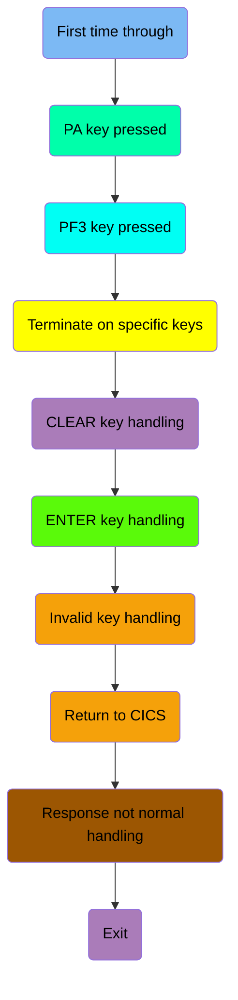

## First time through

First, we'll zoom into this section of the flow:

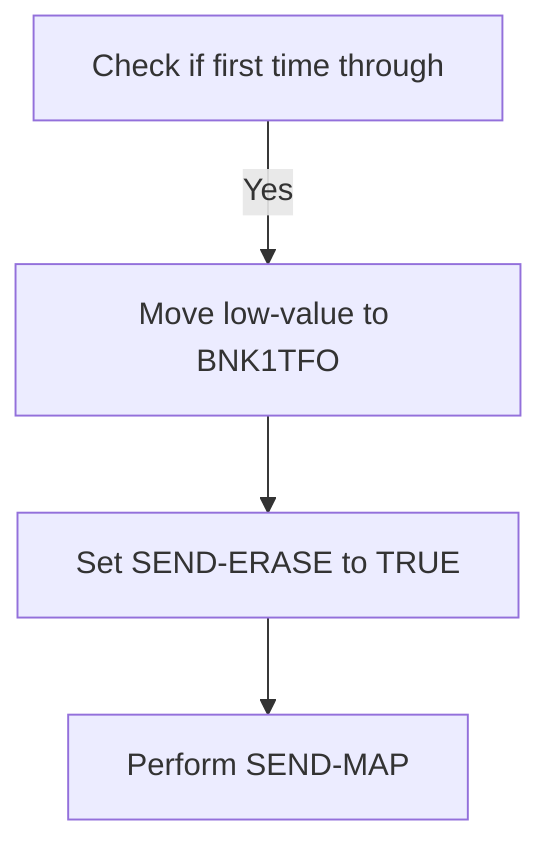

<SwmSnippet path="/src/base/cobol_src/BNK1TFN.cbl" line="177">

---

First, the code checks if it is the first time through by evaluating if <SwmToken path="src/base/cobol_src/BNK1TFN.cbl" pos="183:3:3" line-data="              WHEN EIBCALEN = ZERO">`EIBCALEN`</SwmToken> (which indicates the length of the communication area) is zero. This condition helps determine if the map should be sent with erased (empty) data fields.

```cobol
           EVALUATE TRUE

      *
      *       Is it the first time through? If so, send the map
      *       with erased (empty) data fields.
      *
              WHEN EIBCALEN = ZERO
```

---

</SwmSnippet>

<SwmSnippet path="/src/base/cobol_src/BNK1TFN.cbl" line="184">

---

Next, if the condition is met, the code moves <SwmToken path="src/base/cobol_src/BNK1TFN.cbl" pos="184:3:5" line-data="                 MOVE LOW-VALUE TO BNK1TFO">`LOW-VALUE`</SwmToken> to <SwmToken path="src/base/cobol_src/BNK1TFN.cbl" pos="184:9:9" line-data="                 MOVE LOW-VALUE TO BNK1TFO">`BNK1TFO`</SwmToken> (which likely represents the output data structure), sets <SwmToken path="src/base/cobol_src/BNK1TFN.cbl" pos="185:3:5" line-data="                 SET SEND-ERASE TO TRUE">`SEND-ERASE`</SwmToken> to `TRUE` (indicating that the map should be sent with erased fields), and performs the <SwmToken path="src/base/cobol_src/BNK1TFN.cbl" pos="186:3:5" line-data="                 PERFORM SEND-MAP">`SEND-MAP`</SwmToken> operation to display the map to the user.

```cobol
                 MOVE LOW-VALUE TO BNK1TFO
                 SET SEND-ERASE TO TRUE
                 PERFORM SEND-MAP
```

---

</SwmSnippet>

## PA key pressed

Now, lets zoom into this section of the flow:

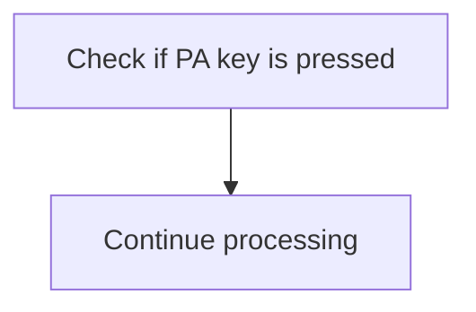

<SwmSnippet path="/src/base/cobol_src/BNK1TFN.cbl" line="191">

---

The code checks if a PA (Program Attention) key is pressed by evaluating the <SwmToken path="src/base/cobol_src/BNK1TFN.cbl" pos="191:3:3" line-data="              WHEN EIBAID = DFHPA1 OR DFHPA2 OR DFHPA3">`EIBAID`</SwmToken> variable. If <SwmToken path="src/base/cobol_src/BNK1TFN.cbl" pos="191:3:3" line-data="              WHEN EIBAID = DFHPA1 OR DFHPA2 OR DFHPA3">`EIBAID`</SwmToken> matches any of the PA keys (<SwmToken path="src/base/cobol_src/BNK1TFN.cbl" pos="191:7:7" line-data="              WHEN EIBAID = DFHPA1 OR DFHPA2 OR DFHPA3">`DFHPA1`</SwmToken>, <SwmToken path="src/base/cobol_src/BNK1TFN.cbl" pos="191:11:11" line-data="              WHEN EIBAID = DFHPA1 OR DFHPA2 OR DFHPA3">`DFHPA2`</SwmToken>, or <SwmToken path="src/base/cobol_src/BNK1TFN.cbl" pos="191:15:15" line-data="              WHEN EIBAID = DFHPA1 OR DFHPA2 OR DFHPA3">`DFHPA3`</SwmToken>), the program continues processing without interruption. This ensures that the application can handle user interactions via PA keys seamlessly, allowing the teller to proceed with their tasks without unnecessary delays.

```cobol
              WHEN EIBAID = DFHPA1 OR DFHPA2 OR DFHPA3
                 CONTINUE
```

---

</SwmSnippet>

## PF3 key pressed

Now, lets zoom into this section of the flow:

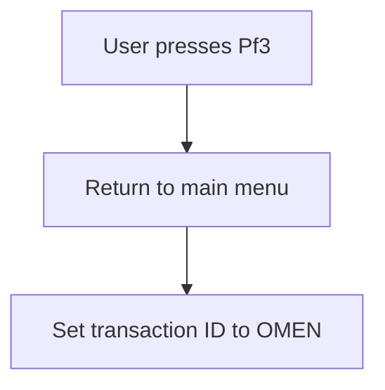

## Terminate on specific keys

Now, lets zoom into this section of the flow:

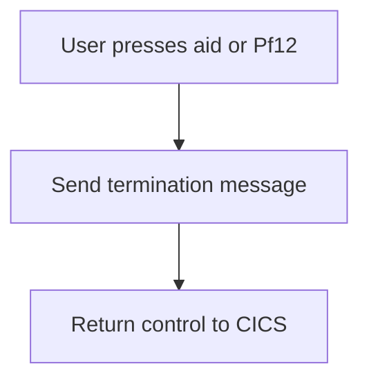

<SwmSnippet path="/src/base/cobol_src/BNK1TFN.cbl" line="205">

---

When the user presses either the aid key or <SwmToken path="src/base/cobol_src/BNK1TFN.cbl" pos="206:11:11" line-data="      *       If the aid or Pf12 is pressed, then send a termination">`Pf12`</SwmToken> key, the system recognizes this as a termination request. The system then sends a termination message to notify the user that their session is ending. Finally, control is returned to CICS to complete the termination process.

```cobol
      *
      *       If the aid or Pf12 is pressed, then send a termination
      *       message.
      *
              WHEN EIBAID = DFHAID OR DFHPF12
                 PERFORM SEND-TERMINATION-MSG
                 EXEC CICS
                    RETURN
                 END-EXEC
```

---

</SwmSnippet>

## CLEAR key handling

Now, lets zoom into this section of the flow:

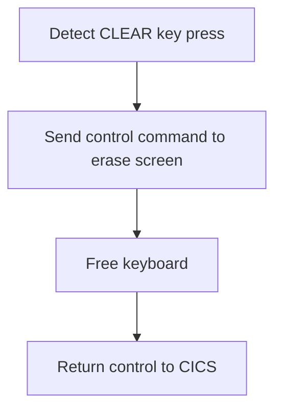

<SwmSnippet path="/src/base/cobol_src/BNK1TFN.cbl" line="215">

---

### Handling the CLEAR key press event

When the CLEAR key is pressed, the system detects this event by checking if <SwmToken path="src/base/cobol_src/BNK1TFN.cbl" pos="218:3:3" line-data="              WHEN EIBAID = DFHCLEAR">`EIBAID`</SwmToken> (which holds the attention identifier) is equal to <SwmToken path="src/base/cobol_src/BNK1TFN.cbl" pos="218:7:7" line-data="              WHEN EIBAID = DFHCLEAR">`DFHCLEAR`</SwmToken> (the identifier for the CLEAR key). Upon detection, the system sends a control command to erase the screen, ensuring that the display is cleared for the next operation. Following this, the keyboard is freed, allowing the user to input new data. Finally, control is returned to CICS, indicating that the CLEAR key press event has been fully handled.

```cobol
      *
      *       When CLEAR is pressed
      *
              WHEN EIBAID = DFHCLEAR
                EXEC CICS SEND CONTROL
                          ERASE
                          FREEKB
                END-EXEC
                EXEC CICS RETURN
                END-EXEC
```

---

</SwmSnippet>

## ENTER key handling

Now, lets zoom into this section of the flow:

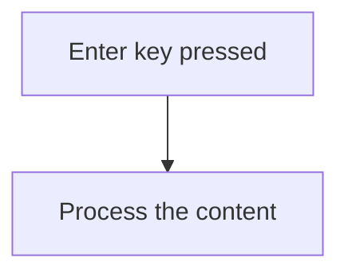

<SwmSnippet path="/src/base/cobol_src/BNK1TFN.cbl" line="226">

---

When the enter key is pressed, the system triggers the processing of the content. This is indicated by the condition <SwmToken path="src/base/cobol_src/BNK1TFN.cbl" pos="229:1:7" line-data="              WHEN EIBAID = DFHENTER">`WHEN EIBAID = DFHENTER`</SwmToken>, which checks if the enter key has been pressed. If this condition is met, the <SwmToken path="src/base/cobol_src/BNK1TFN.cbl" pos="230:3:5" line-data="                 PERFORM PROCESS-MAP">`PROCESS-MAP`</SwmToken> routine is performed to handle the content processing.

```cobol
      *
      *       When enter is pressed then process the content
      *
              WHEN EIBAID = DFHENTER
                 PERFORM PROCESS-MAP

```

---

</SwmSnippet>

## Invalid key handling

Now, lets zoom into this section of the flow:

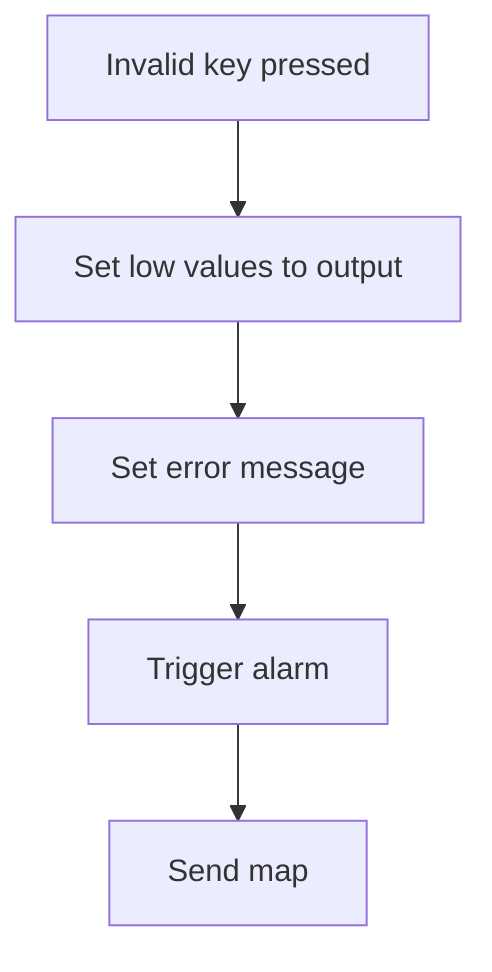

<SwmSnippet path="/src/base/cobol_src/BNK1TFN.cbl" line="233">

---

When an invalid key is pressed by the user, the system first sets the output to low values to clear any previous data. Then, it sets the error message to 'Invalid key pressed.' to inform the user of the mistake. Following this, the system triggers an alarm to alert the user that an invalid action has occurred. Finally, the system performs the <SwmToken path="src/base/cobol_src/BNK1TFN.cbl" pos="240:3:5" line-data="                 PERFORM SEND-MAP">`SEND-MAP`</SwmToken> operation to update the user interface with the error message and the alarm.

```cobol
      *       When anything else happens, send the invalid key message
      *
              WHEN OTHER
                 MOVE LOW-VALUES TO BNK1TFO
                 MOVE 'Invalid key pressed.' TO MESSAGEO
      *           MOVE 10 TO CUSTNOL
                 SET SEND-DATAONLY-ALARM TO TRUE
                 PERFORM SEND-MAP

```

---

</SwmSnippet>

## Return to CICS

This is the next section of the flow.

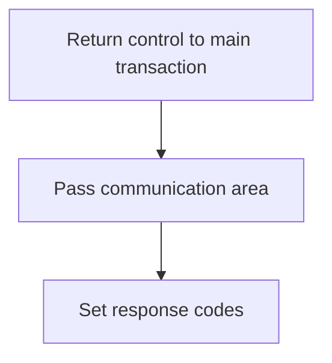

<SwmSnippet path="/src/base/cobol_src/BNK1TFN.cbl" line="244">

---

The `RETURN` command is used to return control to the main transaction identified by <SwmToken path="src/base/cobol_src/BNK1TFN.cbl" pos="248:3:8" line-data="               RETURN TRANSID(&#39;OTFN&#39;)">`TRANSID('OTFN')`</SwmToken>. This ensures that the application flow continues with the specified transaction. The <SwmToken path="src/base/cobol_src/BNK1TFN.cbl" pos="249:1:1" line-data="               COMMAREA(WS-COMMAREA)">`COMMAREA`</SwmToken> parameter is used to pass the communication area <SwmToken path="src/base/cobol_src/BNK1TFN.cbl" pos="249:3:5" line-data="               COMMAREA(WS-COMMAREA)">`WS-COMMAREA`</SwmToken>, which contains data that needs to be shared with the next transaction. The <SwmToken path="src/base/cobol_src/BNK1TFN.cbl" pos="250:1:4" line-data="               LENGTH(29)">`LENGTH(29)`</SwmToken> specifies the length of the communication area being passed. The <SwmToken path="src/base/cobol_src/BNK1TFN.cbl" pos="251:1:1" line-data="               RESP(WS-CICS-RESP)">`RESP`</SwmToken> and <SwmToken path="src/base/cobol_src/BNK1TFN.cbl" pos="252:1:1" line-data="               RESP2(WS-CICS-RESP2)">`RESP2`</SwmToken> parameters are used to capture the primary and secondary response codes (<SwmToken path="src/base/cobol_src/BNK1TFN.cbl" pos="251:3:7" line-data="               RESP(WS-CICS-RESP)">`WS-CICS-RESP`</SwmToken> and <SwmToken path="src/base/cobol_src/BNK1TFN.cbl" pos="252:3:7" line-data="               RESP2(WS-CICS-RESP2)">`WS-CICS-RESP2`</SwmToken>), which help in determining the success or failure of the `RETURN` command.

```cobol
      *
      *     Now RETURN
      *
            EXEC CICS
               RETURN TRANSID('OTFN')
               COMMAREA(WS-COMMAREA)
               LENGTH(29)
               RESP(WS-CICS-RESP)
               RESP2(WS-CICS-RESP2)
            END-EXEC.
```

---

</SwmSnippet>

## Response not normal handling

Now, lets zoom into this section of the flow:

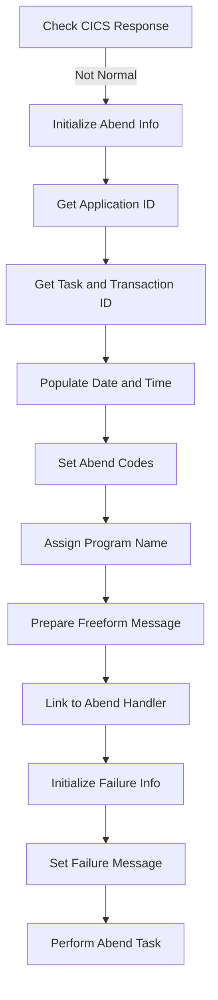

First, the code checks if the CICS response is not normal by evaluating <SwmToken path="src/base/cobol_src/BNK1TFN.cbl" pos="251:3:7" line-data="               RESP(WS-CICS-RESP)">`WS-CICS-RESP`</SwmToken>.

<SwmSnippet path="/src/base/cobol_src/BNK1TFN.cbl" line="262">

---

If the response is not normal, it initializes the abend information record to prepare for capturing the abnormal termination details.

```cobol
              INITIALIZE ABNDINFO-REC
```

---

</SwmSnippet>

<SwmSnippet path="/src/base/cobol_src/BNK1TFN.cbl" line="263">

---

Next, it captures the response codes <SwmToken path="src/base/cobol_src/BNK1TFN.cbl" pos="263:3:3" line-data="              MOVE EIBRESP    TO ABND-RESPCODE">`EIBRESP`</SwmToken> and <SwmToken path="src/base/cobol_src/BNK1TFN.cbl" pos="264:3:3" line-data="              MOVE EIBRESP2   TO ABND-RESP2CODE">`EIBRESP2`</SwmToken> and stores them in the abend information record.

```cobol
              MOVE EIBRESP    TO ABND-RESPCODE
              MOVE EIBRESP2   TO ABND-RESP2CODE
```

---

</SwmSnippet>

<SwmSnippet path="/src/base/cobol_src/BNK1TFN.cbl" line="268">

---

The application ID is then retrieved and stored in the abend information record using the <SwmToken path="src/base/cobol_src/BNK1TFN.cbl" pos="268:1:7" line-data="              EXEC CICS ASSIGN APPLID(ABND-APPLID)">`EXEC CICS ASSIGN APPLID`</SwmToken> command.

```cobol
              EXEC CICS ASSIGN APPLID(ABND-APPLID)
              END-EXEC
```

---

</SwmSnippet>

<SwmSnippet path="/src/base/cobol_src/BNK1TFN.cbl" line="271">

---

Following this, the task number and transaction ID are captured and stored in the abend information record.

```cobol
              MOVE EIBTASKN   TO ABND-TASKNO-KEY
              MOVE EIBTRNID   TO ABND-TRANID
```

---

</SwmSnippet>

<SwmSnippet path="/src/base/cobol_src/BNK1TFN.cbl" line="274">

---

The code then performs a routine to populate the current date and time, which is subsequently stored in the abend information record.

```cobol
              PERFORM POPULATE-TIME-DATE

              MOVE WS-ORIG-DATE TO ABND-DATE
              STRING WS-TIME-NOW-GRP-HH DELIMITED BY SIZE,
                    ':' DELIMITED BY SIZE,
                     WS-TIME-NOW-GRP-MM DELIMITED BY SIZE,
                     ':' DELIMITED BY SIZE,
                     WS-TIME-NOW-GRP-MM DELIMITED BY SIZE
                     INTO ABND-TIME
```

---

</SwmSnippet>

<SwmSnippet path="/src/base/cobol_src/BNK1TFN.cbl" line="285">

---

The abend codes and program name are set, and additional information such as the SQL code is initialized to zero.

```cobol
              MOVE WS-U-TIME   TO ABND-UTIME-KEY
              MOVE 'HBNK'      TO ABND-CODE

              EXEC CICS ASSIGN PROGRAM(ABND-PROGRAM)
              END-EXEC

              MOVE ZEROS      TO ABND-SQLCODE
```

---

</SwmSnippet>

<SwmSnippet path="/src/base/cobol_src/BNK1TFN.cbl" line="293">

---

A freeform message is prepared, detailing the failure and including the response codes.

```cobol
              STRING 'A010 - RETURN TRANSID(OCCS) FAIL.'
                    DELIMITED BY SIZE,
                    ' EIBRESP=' DELIMITED BY SIZE,
                    ABND-RESPCODE DELIMITED BY SIZE,
                    ' RESP2=' DELIMITED BY SIZE,
                    ABND-RESP2CODE DELIMITED BY SIZE
                    INTO ABND-FREEFORM
```

---

</SwmSnippet>

<SwmSnippet path="/src/base/cobol_src/BNK1TFN.cbl" line="302">

---

Finally, the abend handler program is linked to, and the failure information is initialized and set, followed by performing the abend task.

```cobol
              EXEC CICS LINK PROGRAM(WS-ABEND-PGM)
                        COMMAREA(ABNDINFO-REC)
              END-EXEC


              INITIALIZE WS-FAIL-INFO
              MOVE 'BNK1TFN - A010 - RETURN TRANSID(OCCS) FAIL' TO
                 WS-CICS-FAIL-MSG
              MOVE WS-CICS-RESP  TO WS-CICS-RESP-DISP
              MOVE WS-CICS-RESP2 TO WS-CICS-RESP2-DISP
              PERFORM ABEND-THIS-TASK
           END-IF.
```

---

</SwmSnippet>

## Exit

This is the next section of the flow.


<SwmSnippet path="/src/base/cobol_src/BNK1TFN.cbl" line="315">

---

The <SwmToken path="src/base/cobol_src/BNK1TFN.cbl" pos="315:1:1" line-data="       A999.">`A999`</SwmToken> section is responsible for exiting the program. This is a standard practice in COBOL to mark the end of a program or a logical section within the program. The <SwmToken path="src/base/cobol_src/BNK1TFN.cbl" pos="316:1:1" line-data="           EXIT.">`EXIT`</SwmToken> statement ensures that the program terminates gracefully, releasing any resources that were allocated during its execution.

```cobol
       A999.
           EXIT.
```

---

</SwmSnippet>

# Send MAP (<SwmToken path="src/base/cobol_src/BNK1TFN.cbl" pos="186:3:5" line-data="                 PERFORM SEND-MAP">`SEND-MAP`</SwmToken>)

Let's split this section into smaller parts:

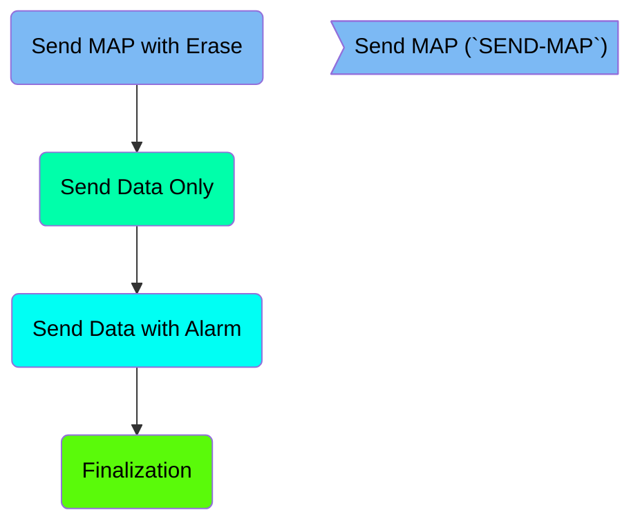

## Send MAP with Erase

First, we'll zoom into this section of the flow:

```mermaid
graph TD
  A[Check if SEND-ERASE is true] -->|Yes| B[SEND MAP with ERASE]
  B --> C[Check if response is not NORMAL]
  C -->|Yes| D[Initialize ABNDINFO-REC]
  D --> E[Move EIBRESP to ABND-RESPCODE]
  E --> F[Move EIBRESP2 to ABND-RESP2CODE]
  F --> G[Assign APPLID to ABND-APPLID]
  G --> H[Move EIBTASKN to ABND-TASKNO-KEY]
  H --> I[Move EIBTRNID to ABND-TRANID]
  I --> J[Perform POPULATE-TIME-DATE]
  J --> K[Move WS-ORIG-DATE to ABND-DATE]
  K --> L[Create ABND-TIME string]
  L --> M[Move WS-U-TIME to ABND-UTIME-KEY]
  M --> N[Move 'HBNK' to ABND-CODE]
  N --> O[Assign PROGRAM to ABND-PROGRAM]
  O --> P[Move ZEROS to ABND-SQLCODE]
  P --> Q[Create ABND-FREEFORM string]
  Q --> R[LINK to ABEND Handler program]
  R --> S[Initialize WS-FAIL-INFO]
  S --> T[Move failure message to WS-CICS-FAIL-MSG]
  T --> U[Move WS-CICS-RESP to WS-CICS-RESP-DISP]
  U --> V[Move WS-CICS-RESP2 to WS-CICS-RESP2-DISP]
  V --> W[Perform ABEND-THIS-TASK]
  C -->|No| X[Continue processing]

%% Swimm:
%% graph TD
%%   A[Check if <SwmToken path="src/base/cobol_src/BNK1TFN.cbl" pos="185:3:5" line-data="                 SET SEND-ERASE TO TRUE">`SEND-ERASE`</SwmToken> is true] -->|Yes| B[SEND MAP with ERASE]
%%   B --> C[Check if response is not NORMAL]
%%   C -->|Yes| D[Initialize <SwmToken path="src/base/cobol_src/BNK1TFN.cbl" pos="262:3:5" line-data="              INITIALIZE ABNDINFO-REC">`ABNDINFO-REC`</SwmToken>]
%%   D --> E[Move EIBRESP to <SwmToken path="src/base/cobol_src/BNK1TFN.cbl" pos="263:7:9" line-data="              MOVE EIBRESP    TO ABND-RESPCODE">`ABND-RESPCODE`</SwmToken>]
%%   E --> F[Move <SwmToken path="src/base/cobol_src/BNK1TFN.cbl" pos="264:3:3" line-data="              MOVE EIBRESP2   TO ABND-RESP2CODE">`EIBRESP2`</SwmToken> to <SwmToken path="src/base/cobol_src/BNK1TFN.cbl" pos="264:7:9" line-data="              MOVE EIBRESP2   TO ABND-RESP2CODE">`ABND-RESP2CODE`</SwmToken>]
%%   F --> G[Assign APPLID to <SwmToken path="src/base/cobol_src/BNK1TFN.cbl" pos="268:9:11" line-data="              EXEC CICS ASSIGN APPLID(ABND-APPLID)">`ABND-APPLID`</SwmToken>]
%%   G --> H[Move EIBTASKN to <SwmToken path="src/base/cobol_src/BNK1TFN.cbl" pos="271:7:11" line-data="              MOVE EIBTASKN   TO ABND-TASKNO-KEY">`ABND-TASKNO-KEY`</SwmToken>]
%%   H --> I[Move EIBTRNID to <SwmToken path="src/base/cobol_src/BNK1TFN.cbl" pos="272:7:9" line-data="              MOVE EIBTRNID   TO ABND-TRANID">`ABND-TRANID`</SwmToken>]
%%   I --> J[Perform <SwmToken path="src/base/cobol_src/BNK1TFN.cbl" pos="274:3:7" line-data="              PERFORM POPULATE-TIME-DATE">`POPULATE-TIME-DATE`</SwmToken>]
%%   J --> K[Move <SwmToken path="src/base/cobol_src/BNK1TFN.cbl" pos="276:3:7" line-data="              MOVE WS-ORIG-DATE TO ABND-DATE">`WS-ORIG-DATE`</SwmToken> to <SwmToken path="src/base/cobol_src/BNK1TFN.cbl" pos="276:11:13" line-data="              MOVE WS-ORIG-DATE TO ABND-DATE">`ABND-DATE`</SwmToken>]
%%   K --> L[Create <SwmToken path="src/base/cobol_src/BNK1TFN.cbl" pos="282:3:5" line-data="                     INTO ABND-TIME">`ABND-TIME`</SwmToken> string]
%%   L --> M[Move <SwmToken path="src/base/cobol_src/BNK1TFN.cbl" pos="285:3:7" line-data="              MOVE WS-U-TIME   TO ABND-UTIME-KEY">`WS-U-TIME`</SwmToken> to <SwmToken path="src/base/cobol_src/BNK1TFN.cbl" pos="285:11:15" line-data="              MOVE WS-U-TIME   TO ABND-UTIME-KEY">`ABND-UTIME-KEY`</SwmToken>]
%%   M --> N[Move 'HBNK' to <SwmToken path="src/base/cobol_src/BNK1TFN.cbl" pos="286:9:11" line-data="              MOVE &#39;HBNK&#39;      TO ABND-CODE">`ABND-CODE`</SwmToken>]
%%   N --> O[Assign PROGRAM to <SwmToken path="src/base/cobol_src/BNK1TFN.cbl" pos="288:9:11" line-data="              EXEC CICS ASSIGN PROGRAM(ABND-PROGRAM)">`ABND-PROGRAM`</SwmToken>]
%%   O --> P[Move ZEROS to <SwmToken path="src/base/cobol_src/BNK1TFN.cbl" pos="291:7:9" line-data="              MOVE ZEROS      TO ABND-SQLCODE">`ABND-SQLCODE`</SwmToken>]
%%   P --> Q[Create <SwmToken path="src/base/cobol_src/BNK1TFN.cbl" pos="299:3:5" line-data="                    INTO ABND-FREEFORM">`ABND-FREEFORM`</SwmToken> string]
%%   Q --> R[LINK to ABEND Handler program]
%%   R --> S[Initialize <SwmToken path="src/base/cobol_src/BNK1TFN.cbl" pos="307:3:7" line-data="              INITIALIZE WS-FAIL-INFO">`WS-FAIL-INFO`</SwmToken>]
%%   S --> T[Move failure message to <SwmToken path="src/base/cobol_src/BNK1TFN.cbl" pos="309:1:7" line-data="                 WS-CICS-FAIL-MSG">`WS-CICS-FAIL-MSG`</SwmToken>]
%%   T --> U[Move <SwmToken path="src/base/cobol_src/BNK1TFN.cbl" pos="251:3:7" line-data="               RESP(WS-CICS-RESP)">`WS-CICS-RESP`</SwmToken> to <SwmToken path="src/base/cobol_src/BNK1TFN.cbl" pos="310:11:17" line-data="              MOVE WS-CICS-RESP  TO WS-CICS-RESP-DISP">`WS-CICS-RESP-DISP`</SwmToken>]
%%   U --> V[Move <SwmToken path="src/base/cobol_src/BNK1TFN.cbl" pos="252:3:7" line-data="               RESP2(WS-CICS-RESP2)">`WS-CICS-RESP2`</SwmToken> to <SwmToken path="src/base/cobol_src/BNK1TFN.cbl" pos="311:11:17" line-data="              MOVE WS-CICS-RESP2 TO WS-CICS-RESP2-DISP">`WS-CICS-RESP2-DISP`</SwmToken>]
%%   V --> W[Perform <SwmToken path="src/base/cobol_src/BNK1TFN.cbl" pos="312:3:7" line-data="              PERFORM ABEND-THIS-TASK">`ABEND-THIS-TASK`</SwmToken>]
%%   C -->|No| X[Continue processing]
```

First, the code checks if <SwmToken path="src/base/cobol_src/BNK1TFN.cbl" pos="185:3:5" line-data="                 SET SEND-ERASE TO TRUE">`SEND-ERASE`</SwmToken> is true, indicating that the map data needs to be erased.

<SwmSnippet path="/src/base/cobol_src/BNK1TFN.cbl" line="671">

---

If <SwmToken path="src/base/cobol_src/BNK1TFN.cbl" pos="671:3:5" line-data="           IF SEND-ERASE">`SEND-ERASE`</SwmToken> is true, the program sends the map with the <SwmToken path="src/base/cobol_src/BNK1TFN.cbl" pos="671:5:5" line-data="           IF SEND-ERASE">`ERASE`</SwmToken> option to clear the data fields.

```cobol
           IF SEND-ERASE
              EXEC CICS SEND MAP('BNK1TF')
                 MAPSET('BNK1TFM')
                 FROM(BNK1TFO)
                 ERASE
                 RESP(WS-CICS-RESP)
                 RESP2(WS-CICS-RESP2)
              END-EXEC
```

---

</SwmSnippet>

<SwmSnippet path="/src/base/cobol_src/BNK1TFN.cbl" line="680">

---

Next, the program checks if the response from the <SwmToken path="src/base/cobol_src/BNK1TFN.cbl" pos="672:5:7" line-data="              EXEC CICS SEND MAP(&#39;BNK1TF&#39;)">`SEND MAP`</SwmToken> command is not <SwmToken path="src/base/cobol_src/BNK1TFN.cbl" pos="680:15:15" line-data="              IF WS-CICS-RESP NOT = DFHRESP(NORMAL)">`NORMAL`</SwmToken>.

```cobol
              IF WS-CICS-RESP NOT = DFHRESP(NORMAL)
```

---

</SwmSnippet>

<SwmSnippet path="/src/base/cobol_src/BNK1TFN.cbl" line="687">

---

If the response is not <SwmToken path="src/base/cobol_src/BNK1TFN.cbl" pos="364:15:15" line-data="           IF WS-CICS-RESP NOT = DFHRESP(NORMAL)">`NORMAL`</SwmToken>, the program initializes the <SwmToken path="src/base/cobol_src/BNK1TFN.cbl" pos="687:3:5" line-data="                 INITIALIZE ABNDINFO-REC">`ABNDINFO-REC`</SwmToken> structure to prepare for abnormal termination handling.

```cobol
                 INITIALIZE ABNDINFO-REC
```

---

</SwmSnippet>

<SwmSnippet path="/src/base/cobol_src/BNK1TFN.cbl" line="688">

---

The program then moves the <SwmToken path="src/base/cobol_src/BNK1TFN.cbl" pos="688:3:3" line-data="                 MOVE EIBRESP    TO ABND-RESPCODE">`EIBRESP`</SwmToken> and <SwmToken path="src/base/cobol_src/BNK1TFN.cbl" pos="689:3:3" line-data="                 MOVE EIBRESP2   TO ABND-RESP2CODE">`EIBRESP2`</SwmToken> values to <SwmToken path="src/base/cobol_src/BNK1TFN.cbl" pos="688:7:9" line-data="                 MOVE EIBRESP    TO ABND-RESPCODE">`ABND-RESPCODE`</SwmToken> and <SwmToken path="src/base/cobol_src/BNK1TFN.cbl" pos="689:7:9" line-data="                 MOVE EIBRESP2   TO ABND-RESP2CODE">`ABND-RESP2CODE`</SwmToken> respectively to capture the response codes.

```cobol
                 MOVE EIBRESP    TO ABND-RESPCODE
                 MOVE EIBRESP2   TO ABND-RESP2CODE
```

---

</SwmSnippet>

<SwmSnippet path="/src/base/cobol_src/BNK1TFN.cbl" line="693">

---

The <SwmToken path="src/base/cobol_src/BNK1TFN.cbl" pos="693:7:7" line-data="                 EXEC CICS ASSIGN APPLID(ABND-APPLID)">`APPLID`</SwmToken> is assigned to <SwmToken path="src/base/cobol_src/BNK1TFN.cbl" pos="693:9:11" line-data="                 EXEC CICS ASSIGN APPLID(ABND-APPLID)">`ABND-APPLID`</SwmToken> to capture the application ID.

```cobol
                 EXEC CICS ASSIGN APPLID(ABND-APPLID)
                 END-EXEC
```

---

</SwmSnippet>

<SwmSnippet path="/src/base/cobol_src/BNK1TFN.cbl" line="696">

---

The <SwmToken path="src/base/cobol_src/BNK1TFN.cbl" pos="696:3:3" line-data="                 MOVE EIBTASKN   TO ABND-TASKNO-KEY">`EIBTASKN`</SwmToken> and <SwmToken path="src/base/cobol_src/BNK1TFN.cbl" pos="697:3:3" line-data="                 MOVE EIBTRNID   TO ABND-TRANID">`EIBTRNID`</SwmToken> values are moved to <SwmToken path="src/base/cobol_src/BNK1TFN.cbl" pos="696:7:11" line-data="                 MOVE EIBTASKN   TO ABND-TASKNO-KEY">`ABND-TASKNO-KEY`</SwmToken> and <SwmToken path="src/base/cobol_src/BNK1TFN.cbl" pos="697:7:9" line-data="                 MOVE EIBTRNID   TO ABND-TRANID">`ABND-TRANID`</SwmToken> respectively to capture the task and transaction IDs.

```cobol
                 MOVE EIBTASKN   TO ABND-TASKNO-KEY
                 MOVE EIBTRNID   TO ABND-TRANID
```

---

</SwmSnippet>

<SwmSnippet path="/src/base/cobol_src/BNK1TFN.cbl" line="699">

---

The program performs the <SwmToken path="src/base/cobol_src/BNK1TFN.cbl" pos="699:3:7" line-data="                 PERFORM POPULATE-TIME-DATE">`POPULATE-TIME-DATE`</SwmToken> routine to get the current date and time.

```cobol
                 PERFORM POPULATE-TIME-DATE
```

---

</SwmSnippet>

<SwmSnippet path="/src/base/cobol_src/BNK1TFN.cbl" line="701">

---

The <SwmToken path="src/base/cobol_src/BNK1TFN.cbl" pos="701:3:7" line-data="                 MOVE WS-ORIG-DATE TO ABND-DATE">`WS-ORIG-DATE`</SwmToken> is moved to <SwmToken path="src/base/cobol_src/BNK1TFN.cbl" pos="701:11:13" line-data="                 MOVE WS-ORIG-DATE TO ABND-DATE">`ABND-DATE`</SwmToken> and the current time is formatted and moved to <SwmToken path="src/base/cobol_src/BNK1TFN.cbl" pos="707:3:5" line-data="                        INTO ABND-TIME">`ABND-TIME`</SwmToken>.

```cobol
                 MOVE WS-ORIG-DATE TO ABND-DATE
                 STRING WS-TIME-NOW-GRP-HH DELIMITED BY SIZE,
                       ':' DELIMITED BY SIZE,
                        WS-TIME-NOW-GRP-MM DELIMITED BY SIZE,
                        ':' DELIMITED BY SIZE,
                        WS-TIME-NOW-GRP-MM DELIMITED BY SIZE
                        INTO ABND-TIME
```

---

</SwmSnippet>

<SwmSnippet path="/src/base/cobol_src/BNK1TFN.cbl" line="710">

---

The <SwmToken path="src/base/cobol_src/BNK1TFN.cbl" pos="710:3:7" line-data="                 MOVE WS-U-TIME   TO ABND-UTIME-KEY">`WS-U-TIME`</SwmToken> is moved to <SwmToken path="src/base/cobol_src/BNK1TFN.cbl" pos="710:11:15" line-data="                 MOVE WS-U-TIME   TO ABND-UTIME-KEY">`ABND-UTIME-KEY`</SwmToken> and 'HBNK' is moved to <SwmToken path="src/base/cobol_src/BNK1TFN.cbl" pos="711:9:11" line-data="                 MOVE &#39;HBNK&#39;      TO ABND-CODE">`ABND-CODE`</SwmToken> to capture additional information.

```cobol
                 MOVE WS-U-TIME   TO ABND-UTIME-KEY
                 MOVE 'HBNK'      TO ABND-CODE
```

---

</SwmSnippet>

<SwmSnippet path="/src/base/cobol_src/BNK1TFN.cbl" line="713">

---

The program assigns the current program name to <SwmToken path="src/base/cobol_src/BNK1TFN.cbl" pos="713:9:11" line-data="                 EXEC CICS ASSIGN PROGRAM(ABND-PROGRAM)">`ABND-PROGRAM`</SwmToken> and sets <SwmToken path="src/base/cobol_src/BNK1TFN.cbl" pos="716:7:9" line-data="                 MOVE ZEROS      TO ABND-SQLCODE">`ABND-SQLCODE`</SwmToken> to zero.

```cobol
                 EXEC CICS ASSIGN PROGRAM(ABND-PROGRAM)
                 END-EXEC

                 MOVE ZEROS      TO ABND-SQLCODE
```

---

</SwmSnippet>

<SwmSnippet path="/src/base/cobol_src/BNK1TFN.cbl" line="718">

---

A detailed error message is created and moved to <SwmToken path="src/base/cobol_src/BNK1TFN.cbl" pos="724:3:5" line-data="                       INTO ABND-FREEFORM">`ABND-FREEFORM`</SwmToken>.

```cobol
                 STRING 'SM010 - SEND MAP ERASE FAIL.'
                       DELIMITED BY SIZE,
                       ' EIBRESP=' DELIMITED BY SIZE,
                       ABND-RESPCODE DELIMITED BY SIZE,
                       ' RESP2=' DELIMITED BY SIZE,
                       ABND-RESP2CODE DELIMITED BY SIZE
                       INTO ABND-FREEFORM
```

---

</SwmSnippet>

<SwmSnippet path="/src/base/cobol_src/BNK1TFN.cbl" line="727">

---

The program then links to the ABEND Handler program to handle the abnormal termination.

```cobol
                 EXEC CICS LINK PROGRAM(WS-ABEND-PGM)
                           COMMAREA(ABNDINFO-REC)
                 END-EXEC
```

---

</SwmSnippet>

<SwmSnippet path="/src/base/cobol_src/BNK1TFN.cbl" line="731">

---

Finally, the program initializes <SwmToken path="src/base/cobol_src/BNK1TFN.cbl" pos="731:3:7" line-data="                 INITIALIZE WS-FAIL-INFO">`WS-FAIL-INFO`</SwmToken> and sets up a failure message before performing the <SwmToken path="src/base/cobol_src/BNK1TFN.cbl" pos="736:3:7" line-data="                 PERFORM ABEND-THIS-TASK">`ABEND-THIS-TASK`</SwmToken> routine.

More about ABNDPROC: <SwmLink doc-title="Writing Abend Records (ABNDPROC)">[Writing Abend Records (ABNDPROC)](/.swm/writing-abend-records-abndproc.svfj4jn5.sw.md)</SwmLink>

```cobol
                 INITIALIZE WS-FAIL-INFO
                 MOVE 'BNK1TFN - SM010 - SEND MAP ERASE FAIL '
                    TO WS-CICS-FAIL-MSG
                 MOVE WS-CICS-RESP  TO WS-CICS-RESP-DISP
                 MOVE WS-CICS-RESP2 TO WS-CICS-RESP2-DISP
                 PERFORM ABEND-THIS-TASK
```

---

</SwmSnippet>

## Send Data Only

Now, lets zoom into this section of the flow:

```mermaid
graph TD
  A[Check if SEND-DATAONLY] -->|Yes| B[SEND MAP with DATAONLY]
  B --> C[Check WS-CICS-RESP]
  C -->|Not Normal| D[Initialize ABNDINFO-REC]
  D --> E[Move EIBRESP to ABND-RESPCODE]
  E --> F[Move EIBRESP2 to ABND-RESP2CODE]
  F --> G[Get supplemental information]
  G --> H[Move EIBTASKN to ABND-TASKNO-KEY]
  H --> I[Move EIBTRNID to ABND-TRANID]
  I --> J[Perform POPULATE-TIME-DATE]
  J --> K[Move WS-ORIG-DATE to ABND-DATE]
  K --> L[Format ABND-TIME]
  L --> M[Move WS-U-TIME to ABND-UTIME-KEY]
  M --> N[Move 'HBNK' to ABND-CODE]
  N --> O[Assign PROGRAM to ABND-PROGRAM]
  O --> P[Move ZEROS to ABND-SQLCODE]
  P --> Q[Format ABND-FREEFORM]
  Q --> R[LINK to WS-ABEND-PGM]
  R --> S[Initialize WS-FAIL-INFO]
  S --> T[Move failure details to WS-CICS-FAIL-MSG]
  T --> U[Perform ABEND-THIS-TASK]
  U --> V[GO TO SM999]

%% Swimm:
%% graph TD
%%   A[Check if <SwmToken path="src/base/cobol_src/BNK1TFN.cbl" pos="239:3:5" line-data="                 SET SEND-DATAONLY-ALARM TO TRUE">`SEND-DATAONLY`</SwmToken>] -->|Yes| B[SEND MAP with DATAONLY]
%%   B --> C[Check <SwmToken path="src/base/cobol_src/BNK1TFN.cbl" pos="251:3:7" line-data="               RESP(WS-CICS-RESP)">`WS-CICS-RESP`</SwmToken>]
%%   C -->|Not Normal| D[Initialize <SwmToken path="src/base/cobol_src/BNK1TFN.cbl" pos="262:3:5" line-data="              INITIALIZE ABNDINFO-REC">`ABNDINFO-REC`</SwmToken>]
%%   D --> E[Move EIBRESP to <SwmToken path="src/base/cobol_src/BNK1TFN.cbl" pos="263:7:9" line-data="              MOVE EIBRESP    TO ABND-RESPCODE">`ABND-RESPCODE`</SwmToken>]
%%   E --> F[Move <SwmToken path="src/base/cobol_src/BNK1TFN.cbl" pos="264:3:3" line-data="              MOVE EIBRESP2   TO ABND-RESP2CODE">`EIBRESP2`</SwmToken> to <SwmToken path="src/base/cobol_src/BNK1TFN.cbl" pos="264:7:9" line-data="              MOVE EIBRESP2   TO ABND-RESP2CODE">`ABND-RESP2CODE`</SwmToken>]
%%   F --> G[Get supplemental information]
%%   G --> H[Move EIBTASKN to <SwmToken path="src/base/cobol_src/BNK1TFN.cbl" pos="271:7:11" line-data="              MOVE EIBTASKN   TO ABND-TASKNO-KEY">`ABND-TASKNO-KEY`</SwmToken>]
%%   H --> I[Move EIBTRNID to <SwmToken path="src/base/cobol_src/BNK1TFN.cbl" pos="272:7:9" line-data="              MOVE EIBTRNID   TO ABND-TRANID">`ABND-TRANID`</SwmToken>]
%%   I --> J[Perform <SwmToken path="src/base/cobol_src/BNK1TFN.cbl" pos="274:3:7" line-data="              PERFORM POPULATE-TIME-DATE">`POPULATE-TIME-DATE`</SwmToken>]
%%   J --> K[Move <SwmToken path="src/base/cobol_src/BNK1TFN.cbl" pos="276:3:7" line-data="              MOVE WS-ORIG-DATE TO ABND-DATE">`WS-ORIG-DATE`</SwmToken> to <SwmToken path="src/base/cobol_src/BNK1TFN.cbl" pos="276:11:13" line-data="              MOVE WS-ORIG-DATE TO ABND-DATE">`ABND-DATE`</SwmToken>]
%%   K --> L[Format <SwmToken path="src/base/cobol_src/BNK1TFN.cbl" pos="282:3:5" line-data="                     INTO ABND-TIME">`ABND-TIME`</SwmToken>]
%%   L --> M[Move <SwmToken path="src/base/cobol_src/BNK1TFN.cbl" pos="285:3:7" line-data="              MOVE WS-U-TIME   TO ABND-UTIME-KEY">`WS-U-TIME`</SwmToken> to <SwmToken path="src/base/cobol_src/BNK1TFN.cbl" pos="285:11:15" line-data="              MOVE WS-U-TIME   TO ABND-UTIME-KEY">`ABND-UTIME-KEY`</SwmToken>]
%%   M --> N[Move 'HBNK' to <SwmToken path="src/base/cobol_src/BNK1TFN.cbl" pos="286:9:11" line-data="              MOVE &#39;HBNK&#39;      TO ABND-CODE">`ABND-CODE`</SwmToken>]
%%   N --> O[Assign PROGRAM to <SwmToken path="src/base/cobol_src/BNK1TFN.cbl" pos="288:9:11" line-data="              EXEC CICS ASSIGN PROGRAM(ABND-PROGRAM)">`ABND-PROGRAM`</SwmToken>]
%%   O --> P[Move ZEROS to <SwmToken path="src/base/cobol_src/BNK1TFN.cbl" pos="291:7:9" line-data="              MOVE ZEROS      TO ABND-SQLCODE">`ABND-SQLCODE`</SwmToken>]
%%   P --> Q[Format <SwmToken path="src/base/cobol_src/BNK1TFN.cbl" pos="299:3:5" line-data="                    INTO ABND-FREEFORM">`ABND-FREEFORM`</SwmToken>]
%%   Q --> R[LINK to <SwmToken path="src/base/cobol_src/BNK1TFN.cbl" pos="302:9:13" line-data="              EXEC CICS LINK PROGRAM(WS-ABEND-PGM)">`WS-ABEND-PGM`</SwmToken>]
%%   R --> S[Initialize <SwmToken path="src/base/cobol_src/BNK1TFN.cbl" pos="307:3:7" line-data="              INITIALIZE WS-FAIL-INFO">`WS-FAIL-INFO`</SwmToken>]
%%   S --> T[Move failure details to <SwmToken path="src/base/cobol_src/BNK1TFN.cbl" pos="309:1:7" line-data="                 WS-CICS-FAIL-MSG">`WS-CICS-FAIL-MSG`</SwmToken>]
%%   T --> U[Perform <SwmToken path="src/base/cobol_src/BNK1TFN.cbl" pos="312:3:7" line-data="              PERFORM ABEND-THIS-TASK">`ABEND-THIS-TASK`</SwmToken>]
%%   U --> V[GO TO <SwmToken path="src/base/cobol_src/BNK1TFN.cbl" pos="890:1:1" line-data="       SM999.">`SM999`</SwmToken>]
```

First, the code checks if <SwmToken path="src/base/cobol_src/BNK1TFN.cbl" pos="239:3:5" line-data="                 SET SEND-DATAONLY-ALARM TO TRUE">`SEND-DATAONLY`</SwmToken> is true, indicating that only the data needs to be resent.

<SwmSnippet path="/src/base/cobol_src/BNK1TFN.cbl" line="745">

---

If <SwmToken path="src/base/cobol_src/BNK1TFN.cbl" pos="745:3:5" line-data="           IF SEND-DATAONLY">`SEND-DATAONLY`</SwmToken> is true, it sends the map <SwmToken path="src/base/cobol_src/BNK1TFN.cbl" pos="746:10:10" line-data="              EXEC CICS SEND MAP(&#39;BNK1TF&#39;)">`BNK1TF`</SwmToken> with the <SwmToken path="src/base/cobol_src/BNK1TFN.cbl" pos="745:5:5" line-data="           IF SEND-DATAONLY">`DATAONLY`</SwmToken> option.

```cobol
           IF SEND-DATAONLY
              EXEC CICS SEND MAP('BNK1TF')
                 MAPSET('BNK1TFM')
                 FROM(BNK1TFO)
                 DATAONLY
                 RESP(WS-CICS-RESP)
                 RESP2(WS-CICS-RESP2)
              END-EXEC
```

---

</SwmSnippet>

<SwmSnippet path="/src/base/cobol_src/BNK1TFN.cbl" line="754">

---

Next, it checks if the response <SwmToken path="src/base/cobol_src/BNK1TFN.cbl" pos="754:3:7" line-data="              IF WS-CICS-RESP NOT = DFHRESP(NORMAL)">`WS-CICS-RESP`</SwmToken> is not normal.

```cobol
              IF WS-CICS-RESP NOT = DFHRESP(NORMAL)
      *
```

---

</SwmSnippet>

<SwmSnippet path="/src/base/cobol_src/BNK1TFN.cbl" line="761">

---

If the response is not normal, it initializes the <SwmToken path="src/base/cobol_src/BNK1TFN.cbl" pos="761:3:5" line-data="                 INITIALIZE ABNDINFO-REC">`ABNDINFO-REC`</SwmToken> to prepare for error handling.

```cobol
                 INITIALIZE ABNDINFO-REC
```

---

</SwmSnippet>

<SwmSnippet path="/src/base/cobol_src/BNK1TFN.cbl" line="762">

---

It then moves the response codes <SwmToken path="src/base/cobol_src/BNK1TFN.cbl" pos="762:3:3" line-data="                 MOVE EIBRESP    TO ABND-RESPCODE">`EIBRESP`</SwmToken> and <SwmToken path="src/base/cobol_src/BNK1TFN.cbl" pos="763:3:3" line-data="                 MOVE EIBRESP2   TO ABND-RESP2CODE">`EIBRESP2`</SwmToken> to <SwmToken path="src/base/cobol_src/BNK1TFN.cbl" pos="762:7:9" line-data="                 MOVE EIBRESP    TO ABND-RESPCODE">`ABND-RESPCODE`</SwmToken> and <SwmToken path="src/base/cobol_src/BNK1TFN.cbl" pos="763:7:9" line-data="                 MOVE EIBRESP2   TO ABND-RESP2CODE">`ABND-RESP2CODE`</SwmToken> respectively.

```cobol
                 MOVE EIBRESP    TO ABND-RESPCODE
                 MOVE EIBRESP2   TO ABND-RESP2CODE
      *
```

---

</SwmSnippet>

<SwmSnippet path="/src/base/cobol_src/BNK1TFN.cbl" line="767">

---

The program assigns the application ID to <SwmToken path="src/base/cobol_src/BNK1TFN.cbl" pos="767:9:11" line-data="                 EXEC CICS ASSIGN APPLID(ABND-APPLID)">`ABND-APPLID`</SwmToken> and moves the task number and transaction ID to <SwmToken path="src/base/cobol_src/BNK1TFN.cbl" pos="770:7:11" line-data="                 MOVE EIBTASKN   TO ABND-TASKNO-KEY">`ABND-TASKNO-KEY`</SwmToken> and <SwmToken path="src/base/cobol_src/BNK1TFN.cbl" pos="771:7:9" line-data="                 MOVE EIBTRNID   TO ABND-TRANID">`ABND-TRANID`</SwmToken>.

```cobol
                 EXEC CICS ASSIGN APPLID(ABND-APPLID)
                 END-EXEC

                 MOVE EIBTASKN   TO ABND-TASKNO-KEY
                 MOVE EIBTRNID   TO ABND-TRANID

```

---

</SwmSnippet>

<SwmSnippet path="/src/base/cobol_src/BNK1TFN.cbl" line="773">

---

It performs the <SwmToken path="src/base/cobol_src/BNK1TFN.cbl" pos="773:3:7" line-data="                 PERFORM POPULATE-TIME-DATE">`POPULATE-TIME-DATE`</SwmToken> routine to get the current date and time.

```cobol
                 PERFORM POPULATE-TIME-DATE
```

---

</SwmSnippet>

<SwmSnippet path="/src/base/cobol_src/BNK1TFN.cbl" line="775">

---

The original date is moved to <SwmToken path="src/base/cobol_src/BNK1TFN.cbl" pos="775:11:13" line-data="                 MOVE WS-ORIG-DATE TO ABND-DATE">`ABND-DATE`</SwmToken>, and the current time is formatted and moved to <SwmToken path="src/base/cobol_src/BNK1TFN.cbl" pos="781:3:5" line-data="                        INTO ABND-TIME">`ABND-TIME`</SwmToken>.

```cobol
                 MOVE WS-ORIG-DATE TO ABND-DATE
                 STRING WS-TIME-NOW-GRP-HH DELIMITED BY SIZE,
                       ':' DELIMITED BY SIZE,
                        WS-TIME-NOW-GRP-MM DELIMITED BY SIZE,
                        ':' DELIMITED BY SIZE,
                        WS-TIME-NOW-GRP-MM DELIMITED BY SIZE
                        INTO ABND-TIME
                 END-STRING
```

---

</SwmSnippet>

<SwmSnippet path="/src/base/cobol_src/BNK1TFN.cbl" line="784">

---

The program then assigns the user time to <SwmToken path="src/base/cobol_src/BNK1TFN.cbl" pos="784:11:15" line-data="                 MOVE WS-U-TIME   TO ABND-UTIME-KEY">`ABND-UTIME-KEY`</SwmToken> and sets the code to 'HBNK'.

```cobol
                 MOVE WS-U-TIME   TO ABND-UTIME-KEY
                 MOVE 'HBNK'      TO ABND-CODE
```

---

</SwmSnippet>

<SwmSnippet path="/src/base/cobol_src/BNK1TFN.cbl" line="787">

---

It assigns the current program name to <SwmToken path="src/base/cobol_src/BNK1TFN.cbl" pos="787:9:11" line-data="                 EXEC CICS ASSIGN PROGRAM(ABND-PROGRAM)">`ABND-PROGRAM`</SwmToken> and sets the SQL code to zero.

```cobol
                 EXEC CICS ASSIGN PROGRAM(ABND-PROGRAM)
                 END-EXEC

                 MOVE ZEROS      TO ABND-SQLCODE
```

---

</SwmSnippet>

<SwmSnippet path="/src/base/cobol_src/BNK1TFN.cbl" line="792">

---

Finally, it formats a freeform error message and links to the <SwmToken path="src/base/cobol_src/BNK1TFN.cbl" pos="801:9:13" line-data="                 EXEC CICS LINK PROGRAM(WS-ABEND-PGM)">`WS-ABEND-PGM`</SwmToken> program to handle the error.

```cobol
                 STRING 'SM010 - SEND MAP DATAONLY FAIL.'
                       DELIMITED BY SIZE,
                       ' EIBRESP=' DELIMITED BY SIZE,
                       ABND-RESPCODE DELIMITED BY SIZE,
                       ' RESP2=' DELIMITED BY SIZE,
                       ABND-RESP2CODE DELIMITED BY SIZE
                       INTO ABND-FREEFORM
                 END-STRING

                 EXEC CICS LINK PROGRAM(WS-ABEND-PGM)
                           COMMAREA(ABNDINFO-REC)
                 END-EXEC
```

---

</SwmSnippet>

## Send Data with Alarm

Now, lets zoom into this section of the flow:

```mermaid
graph TD
  A[Check if SEND-DATAONLY-ALARM is true] -->|Yes| B[SEND MAP with DATAONLY and ALARM]
  B -->|Error| C[Initialize ABNDINFO-REC]
  C --> D[Move EIBRESP to ABND-RESPCODE]
  D --> E[Move EIBRESP2 to ABND-RESP2CODE]
  E --> F[Get supplemental information]
  F --> G[Move EIBTASKN to ABND-TASKNO-KEY]
  G --> H[Move EIBTRNID to ABND-TRANID]
  H --> I[Perform POPULATE-TIME-DATE]
  I --> J[Move WS-ORIG-DATE to ABND-DATE]
  J --> K[Format and move current time to ABND-TIME]
  K --> L[Move WS-U-TIME to ABND-UTIME-KEY]
  L --> M[Move 'HBNK' to ABND-CODE]
  M --> N[Assign current program to ABND-PROGRAM]
  N --> O[Move ZEROS to ABND-SQLCODE]
  O --> P[Format and move error message to ABND-FREEFORM]
  P --> Q[Link to ABEND handler program]
  Q --> R[Initialize WS-FAIL-INFO]
  R --> S[Move error message to WS-CICS-FAIL-MSG]
  S --> T[Move WS-CICS-RESP to WS-CICS-RESP-DISP]
  T --> U[Move WS-CICS-RESP2 to WS-CICS-RESP2-DISP]
  U --> V[Perform ABEND-THIS-TASK]

%% Swimm:
%% graph TD
%%   A[Check if <SwmToken path="src/base/cobol_src/BNK1TFN.cbl" pos="239:3:7" line-data="                 SET SEND-DATAONLY-ALARM TO TRUE">`SEND-DATAONLY-ALARM`</SwmToken> is true] -->|Yes| B[SEND MAP with DATAONLY and ALARM]
%%   B -->|Error| C[Initialize <SwmToken path="src/base/cobol_src/BNK1TFN.cbl" pos="262:3:5" line-data="              INITIALIZE ABNDINFO-REC">`ABNDINFO-REC`</SwmToken>]
%%   C --> D[Move EIBRESP to <SwmToken path="src/base/cobol_src/BNK1TFN.cbl" pos="263:7:9" line-data="              MOVE EIBRESP    TO ABND-RESPCODE">`ABND-RESPCODE`</SwmToken>]
%%   D --> E[Move <SwmToken path="src/base/cobol_src/BNK1TFN.cbl" pos="264:3:3" line-data="              MOVE EIBRESP2   TO ABND-RESP2CODE">`EIBRESP2`</SwmToken> to <SwmToken path="src/base/cobol_src/BNK1TFN.cbl" pos="264:7:9" line-data="              MOVE EIBRESP2   TO ABND-RESP2CODE">`ABND-RESP2CODE`</SwmToken>]
%%   E --> F[Get supplemental information]
%%   F --> G[Move EIBTASKN to <SwmToken path="src/base/cobol_src/BNK1TFN.cbl" pos="271:7:11" line-data="              MOVE EIBTASKN   TO ABND-TASKNO-KEY">`ABND-TASKNO-KEY`</SwmToken>]
%%   G --> H[Move EIBTRNID to <SwmToken path="src/base/cobol_src/BNK1TFN.cbl" pos="272:7:9" line-data="              MOVE EIBTRNID   TO ABND-TRANID">`ABND-TRANID`</SwmToken>]
%%   H --> I[Perform <SwmToken path="src/base/cobol_src/BNK1TFN.cbl" pos="274:3:7" line-data="              PERFORM POPULATE-TIME-DATE">`POPULATE-TIME-DATE`</SwmToken>]
%%   I --> J[Move <SwmToken path="src/base/cobol_src/BNK1TFN.cbl" pos="276:3:7" line-data="              MOVE WS-ORIG-DATE TO ABND-DATE">`WS-ORIG-DATE`</SwmToken> to <SwmToken path="src/base/cobol_src/BNK1TFN.cbl" pos="276:11:13" line-data="              MOVE WS-ORIG-DATE TO ABND-DATE">`ABND-DATE`</SwmToken>]
%%   J --> K[Format and move current time to <SwmToken path="src/base/cobol_src/BNK1TFN.cbl" pos="282:3:5" line-data="                     INTO ABND-TIME">`ABND-TIME`</SwmToken>]
%%   K --> L[Move <SwmToken path="src/base/cobol_src/BNK1TFN.cbl" pos="285:3:7" line-data="              MOVE WS-U-TIME   TO ABND-UTIME-KEY">`WS-U-TIME`</SwmToken> to <SwmToken path="src/base/cobol_src/BNK1TFN.cbl" pos="285:11:15" line-data="              MOVE WS-U-TIME   TO ABND-UTIME-KEY">`ABND-UTIME-KEY`</SwmToken>]
%%   L --> M[Move 'HBNK' to <SwmToken path="src/base/cobol_src/BNK1TFN.cbl" pos="286:9:11" line-data="              MOVE &#39;HBNK&#39;      TO ABND-CODE">`ABND-CODE`</SwmToken>]
%%   M --> N[Assign current program to <SwmToken path="src/base/cobol_src/BNK1TFN.cbl" pos="288:9:11" line-data="              EXEC CICS ASSIGN PROGRAM(ABND-PROGRAM)">`ABND-PROGRAM`</SwmToken>]
%%   N --> O[Move ZEROS to <SwmToken path="src/base/cobol_src/BNK1TFN.cbl" pos="291:7:9" line-data="              MOVE ZEROS      TO ABND-SQLCODE">`ABND-SQLCODE`</SwmToken>]
%%   O --> P[Format and move error message to <SwmToken path="src/base/cobol_src/BNK1TFN.cbl" pos="299:3:5" line-data="                    INTO ABND-FREEFORM">`ABND-FREEFORM`</SwmToken>]
%%   P --> Q[Link to ABEND handler program]
%%   Q --> R[Initialize <SwmToken path="src/base/cobol_src/BNK1TFN.cbl" pos="307:3:7" line-data="              INITIALIZE WS-FAIL-INFO">`WS-FAIL-INFO`</SwmToken>]
%%   R --> S[Move error message to <SwmToken path="src/base/cobol_src/BNK1TFN.cbl" pos="309:1:7" line-data="                 WS-CICS-FAIL-MSG">`WS-CICS-FAIL-MSG`</SwmToken>]
%%   S --> T[Move <SwmToken path="src/base/cobol_src/BNK1TFN.cbl" pos="251:3:7" line-data="               RESP(WS-CICS-RESP)">`WS-CICS-RESP`</SwmToken> to <SwmToken path="src/base/cobol_src/BNK1TFN.cbl" pos="310:11:17" line-data="              MOVE WS-CICS-RESP  TO WS-CICS-RESP-DISP">`WS-CICS-RESP-DISP`</SwmToken>]
%%   T --> U[Move <SwmToken path="src/base/cobol_src/BNK1TFN.cbl" pos="252:3:7" line-data="               RESP2(WS-CICS-RESP2)">`WS-CICS-RESP2`</SwmToken> to <SwmToken path="src/base/cobol_src/BNK1TFN.cbl" pos="311:11:17" line-data="              MOVE WS-CICS-RESP2 TO WS-CICS-RESP2-DISP">`WS-CICS-RESP2-DISP`</SwmToken>]
%%   U --> V[Perform <SwmToken path="src/base/cobol_src/BNK1TFN.cbl" pos="312:3:7" line-data="              PERFORM ABEND-THIS-TASK">`ABEND-THIS-TASK`</SwmToken>]
```

First, the code checks if <SwmToken path="src/base/cobol_src/BNK1TFN.cbl" pos="239:3:7" line-data="                 SET SEND-DATAONLY-ALARM TO TRUE">`SEND-DATAONLY-ALARM`</SwmToken> is true, indicating that the map should be sent with an alarm.

<SwmSnippet path="/src/base/cobol_src/BNK1TFN.cbl" line="819">

---

Next, it sends the map <SwmToken path="src/base/cobol_src/BNK1TFN.cbl" pos="820:10:10" line-data="              EXEC CICS SEND MAP(&#39;BNK1TF&#39;)">`BNK1TF`</SwmToken> from the mapset <SwmToken path="src/base/cobol_src/BNK1TFN.cbl" pos="821:4:4" line-data="                 MAPSET(&#39;BNK1TFM&#39;)">`BNK1TFM`</SwmToken> with the <SwmToken path="src/base/cobol_src/BNK1TFN.cbl" pos="819:5:5" line-data="           IF SEND-DATAONLY-ALARM">`DATAONLY`</SwmToken> and <SwmToken path="src/base/cobol_src/BNK1TFN.cbl" pos="819:7:7" line-data="           IF SEND-DATAONLY-ALARM">`ALARM`</SwmToken> options.

```cobol
           IF SEND-DATAONLY-ALARM
              EXEC CICS SEND MAP('BNK1TF')
                 MAPSET('BNK1TFM')
                 FROM(BNK1TFO)
                 DATAONLY
                 ALARM
                 RESP(WS-CICS-RESP)
                 RESP2(WS-CICS-RESP2)
              END-EXEC
```

---

</SwmSnippet>

<SwmSnippet path="/src/base/cobol_src/BNK1TFN.cbl" line="829">

---

If there is an error in sending the map, the code initializes the <SwmToken path="src/base/cobol_src/BNK1TFN.cbl" pos="836:3:5" line-data="                 INITIALIZE ABNDINFO-REC">`ABNDINFO-REC`</SwmToken> structure to prepare for error handling.

```cobol
              IF WS-CICS-RESP NOT = DFHRESP(NORMAL)
      *
      *          Preserve the RESP and RESP2, then set up the
      *          standard ABEND info before getting the applid,
      *          date/time etc. and linking to the Abend Handler
      *          program.
      *
                 INITIALIZE ABNDINFO-REC
```

---

</SwmSnippet>

<SwmSnippet path="/src/base/cobol_src/BNK1TFN.cbl" line="837">

---

It then moves the response codes <SwmToken path="src/base/cobol_src/BNK1TFN.cbl" pos="837:3:3" line-data="                 MOVE EIBRESP    TO ABND-RESPCODE">`EIBRESP`</SwmToken> and <SwmToken path="src/base/cobol_src/BNK1TFN.cbl" pos="838:3:3" line-data="                 MOVE EIBRESP2   TO ABND-RESP2CODE">`EIBRESP2`</SwmToken> to <SwmToken path="src/base/cobol_src/BNK1TFN.cbl" pos="837:7:9" line-data="                 MOVE EIBRESP    TO ABND-RESPCODE">`ABND-RESPCODE`</SwmToken> and <SwmToken path="src/base/cobol_src/BNK1TFN.cbl" pos="838:7:9" line-data="                 MOVE EIBRESP2   TO ABND-RESP2CODE">`ABND-RESP2CODE`</SwmToken> respectively.

```cobol
                 MOVE EIBRESP    TO ABND-RESPCODE
                 MOVE EIBRESP2   TO ABND-RESP2CODE
```

---

</SwmSnippet>

<SwmSnippet path="/src/base/cobol_src/BNK1TFN.cbl" line="842">

---

The code assigns the application ID to <SwmToken path="src/base/cobol_src/BNK1TFN.cbl" pos="842:9:11" line-data="                 EXEC CICS ASSIGN APPLID(ABND-APPLID)">`ABND-APPLID`</SwmToken> and moves the task number and transaction ID to <SwmToken path="src/base/cobol_src/BNK1TFN.cbl" pos="845:7:11" line-data="                 MOVE EIBTASKN   TO ABND-TASKNO-KEY">`ABND-TASKNO-KEY`</SwmToken> and <SwmToken path="src/base/cobol_src/BNK1TFN.cbl" pos="846:7:9" line-data="                 MOVE EIBTRNID   TO ABND-TRANID">`ABND-TRANID`</SwmToken> respectively.

```cobol
                 EXEC CICS ASSIGN APPLID(ABND-APPLID)
                 END-EXEC

                 MOVE EIBTASKN   TO ABND-TASKNO-KEY
                 MOVE EIBTRNID   TO ABND-TRANID

```

---

</SwmSnippet>

<SwmSnippet path="/src/base/cobol_src/BNK1TFN.cbl" line="848">

---

It then performs the <SwmToken path="src/base/cobol_src/BNK1TFN.cbl" pos="848:3:7" line-data="                 PERFORM POPULATE-TIME-DATE">`POPULATE-TIME-DATE`</SwmToken> routine to get the current date and time, which are moved to <SwmToken path="src/base/cobol_src/BNK1TFN.cbl" pos="850:11:13" line-data="                 MOVE WS-ORIG-DATE TO ABND-DATE">`ABND-DATE`</SwmToken> and <SwmToken path="src/base/cobol_src/BNK1TFN.cbl" pos="856:3:5" line-data="                        INTO ABND-TIME">`ABND-TIME`</SwmToken>.

```cobol
                 PERFORM POPULATE-TIME-DATE

                 MOVE WS-ORIG-DATE TO ABND-DATE
                 STRING WS-TIME-NOW-GRP-HH DELIMITED BY SIZE,
                       ':' DELIMITED BY SIZE,
                        WS-TIME-NOW-GRP-MM DELIMITED BY SIZE,
                        ':' DELIMITED BY SIZE,
                        WS-TIME-NOW-GRP-MM DELIMITED BY SIZE
                        INTO ABND-TIME
```

---

</SwmSnippet>

<SwmSnippet path="/src/base/cobol_src/BNK1TFN.cbl" line="859">

---

The code assigns additional information such as <SwmToken path="src/base/cobol_src/BNK1TFN.cbl" pos="859:3:7" line-data="                 MOVE WS-U-TIME   TO ABND-UTIME-KEY">`WS-U-TIME`</SwmToken> to <SwmToken path="src/base/cobol_src/BNK1TFN.cbl" pos="859:11:15" line-data="                 MOVE WS-U-TIME   TO ABND-UTIME-KEY">`ABND-UTIME-KEY`</SwmToken> and the code 'HBNK' to <SwmToken path="src/base/cobol_src/BNK1TFN.cbl" pos="860:9:11" line-data="                 MOVE &#39;HBNK&#39;      TO ABND-CODE">`ABND-CODE`</SwmToken>.

```cobol
                 MOVE WS-U-TIME   TO ABND-UTIME-KEY
                 MOVE 'HBNK'      TO ABND-CODE
```

---

</SwmSnippet>

<SwmSnippet path="/src/base/cobol_src/BNK1TFN.cbl" line="862">

---

It assigns the current program name to <SwmToken path="src/base/cobol_src/BNK1TFN.cbl" pos="862:9:11" line-data="                 EXEC CICS ASSIGN PROGRAM(ABND-PROGRAM)">`ABND-PROGRAM`</SwmToken> and sets <SwmToken path="src/base/cobol_src/BNK1TFN.cbl" pos="865:7:9" line-data="                 MOVE ZEROS      TO ABND-SQLCODE">`ABND-SQLCODE`</SwmToken> to zero.

```cobol
                 EXEC CICS ASSIGN PROGRAM(ABND-PROGRAM)
                 END-EXEC

                 MOVE ZEROS      TO ABND-SQLCODE
```

---

</SwmSnippet>

<SwmSnippet path="/src/base/cobol_src/BNK1TFN.cbl" line="867">

---

The code formats an error message and moves it to <SwmToken path="src/base/cobol_src/BNK1TFN.cbl" pos="873:3:5" line-data="                       INTO ABND-FREEFORM">`ABND-FREEFORM`</SwmToken>.

```cobol
                 STRING 'SM010 - SEND MAP DATAONLY ALARM FAIL.'
                       DELIMITED BY SIZE,
                       ' EIBRESP=' DELIMITED BY SIZE,
                       ABND-RESPCODE DELIMITED BY SIZE,
                       ' RESP2=' DELIMITED BY SIZE,
                       ABND-RESP2CODE DELIMITED BY SIZE
                       INTO ABND-FREEFORM
```

---

</SwmSnippet>

<SwmSnippet path="/src/base/cobol_src/BNK1TFN.cbl" line="876">

---

Finally, it links to the ABEND handler program <SwmToken path="src/base/cobol_src/BNK1TFN.cbl" pos="876:9:13" line-data="                 EXEC CICS LINK PROGRAM(WS-ABEND-PGM)">`WS-ABEND-PGM`</SwmToken> with the <SwmToken path="src/base/cobol_src/BNK1TFN.cbl" pos="877:3:5" line-data="                           COMMAREA(ABNDINFO-REC)">`ABNDINFO-REC`</SwmToken> and performs the <SwmToken path="src/base/cobol_src/BNK1TFN.cbl" pos="885:3:7" line-data="                 PERFORM ABEND-THIS-TASK">`ABEND-THIS-TASK`</SwmToken> routine.

```cobol
                 EXEC CICS LINK PROGRAM(WS-ABEND-PGM)
                           COMMAREA(ABNDINFO-REC)
                 END-EXEC

                 INITIALIZE WS-FAIL-INFO
                 MOVE 'BNK1TFN - SM010 - SEND MAP DATAONLY ALARM FAIL '
                    TO WS-CICS-FAIL-MSG
                 MOVE WS-CICS-RESP  TO WS-CICS-RESP-DISP
                 MOVE WS-CICS-RESP2 TO WS-CICS-RESP2-DISP
                 PERFORM ABEND-THIS-TASK
```

---

</SwmSnippet>

## Finalization

This is the next section of the flow.

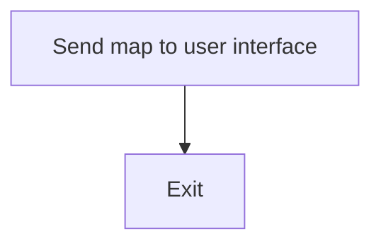

<SwmSnippet path="/src/base/cobol_src/BNK1TFN.cbl" line="890">

---

### Sending the map to the user interface

The <SwmToken path="src/base/cobol_src/BNK1TFN.cbl" pos="186:3:5" line-data="                 PERFORM SEND-MAP">`SEND-MAP`</SwmToken> function is responsible for sending the map to the user interface. This step ensures that the user interface is updated with the latest information, allowing the user to interact with the application effectively. The <SwmToken path="src/base/cobol_src/BNK1TFN.cbl" pos="891:1:1" line-data="           EXIT.">`EXIT`</SwmToken> statement indicates the end of this function, ensuring that the control is returned to the calling program.

```cobol
       SM999.
           EXIT.
```

---

</SwmSnippet>

## <SwmToken path="src/base/cobol_src/BNK1TFN.cbl" pos="274:3:7" line-data="              PERFORM POPULATE-TIME-DATE">`POPULATE-TIME-DATE`</SwmToken>

Lets' zoom into this section of the flow:

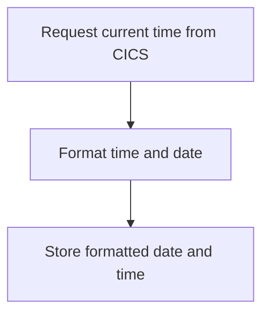

<SwmSnippet path="/src/base/cobol_src/BNK1TFN.cbl" line="1212">

---

### Requesting current time

First, the function requests the current time from the CICS system and stores it in <SwmToken path="src/base/cobol_src/BNK1TFN.cbl" pos="1213:3:7" line-data="              ABSTIME(WS-U-TIME)">`WS-U-TIME`</SwmToken>.

```cobol
           EXEC CICS ASKTIME
              ABSTIME(WS-U-TIME)
           END-EXEC.
```

---

</SwmSnippet>

<SwmSnippet path="/src/base/cobol_src/BNK1TFN.cbl" line="1216">

---

### Formatting the date and time

Next, the function formats the retrieved time into a human-readable date and time. The date is formatted as <SwmToken path="src/base/cobol_src/BNK1TFN.cbl" pos="1218:1:1" line-data="                     DDMMYYYY(WS-ORIG-DATE)">`DDMMYYYY`</SwmToken> and stored in <SwmToken path="src/base/cobol_src/BNK1TFN.cbl" pos="1218:3:7" line-data="                     DDMMYYYY(WS-ORIG-DATE)">`WS-ORIG-DATE`</SwmToken>, while the time is stored in <SwmToken path="src/base/cobol_src/BNK1TFN.cbl" pos="1219:3:7" line-data="                     TIME(WS-TIME-NOW)">`WS-TIME-NOW`</SwmToken>.

```cobol
           EXEC CICS FORMATTIME
                     ABSTIME(WS-U-TIME)
                     DDMMYYYY(WS-ORIG-DATE)
                     TIME(WS-TIME-NOW)
```

---

</SwmSnippet>

<SwmSnippet path="/src/base/cobol_src/BNK1TFN.cbl" line="1218">

---

### Storing the formatted date and time

Then, the formatted date and time are stored in their respective variables for further use in the application.

```cobol
                     DDMMYYYY(WS-ORIG-DATE)
                     TIME(WS-TIME-NOW)
```

---

</SwmSnippet>

<SwmSnippet path="/src/base/cobol_src/BNK1TFN.cbl" line="1223">

---

### Exiting the section

Finally, the function exits the <SwmToken path="src/base/cobol_src/BNK1TFN.cbl" pos="274:3:7" line-data="              PERFORM POPULATE-TIME-DATE">`POPULATE-TIME-DATE`</SwmToken> section, completing the process of formatting the current date and time.

```cobol
       PTD999.
           EXIT.
```

---

</SwmSnippet>

## <SwmToken path="src/base/cobol_src/BNK1TFN.cbl" pos="312:3:7" line-data="              PERFORM ABEND-THIS-TASK">`ABEND-THIS-TASK`</SwmToken>

Lets' zoom into this section of the flow:

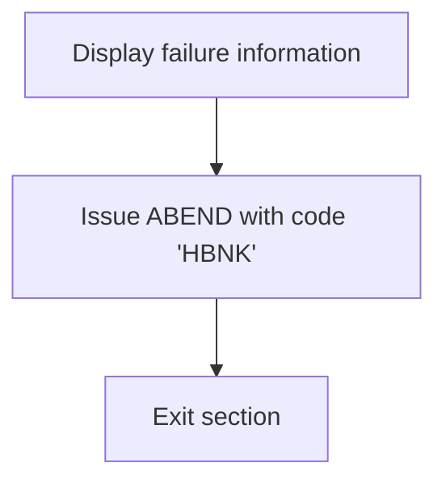

<SwmSnippet path="/src/base/cobol_src/BNK1TFN.cbl" line="975">

---

First, the function displays the failure information stored in <SwmToken path="src/base/cobol_src/BNK1TFN.cbl" pos="975:3:7" line-data="           DISPLAY WS-FAIL-INFO.">`WS-FAIL-INFO`</SwmToken> (which includes various details about the failure).

```cobol
           DISPLAY WS-FAIL-INFO.
```

---

</SwmSnippet>

<SwmSnippet path="/src/base/cobol_src/BNK1TFN.cbl" line="976">

---

Next, it issues an ABEND (abnormal end) with the code 'HBNK' to terminate the task without generating a dump.

```cobol
           EXEC CICS ABEND
              ABCODE('HBNK')
              NODUMP
           END-EXEC.
```

---

</SwmSnippet>

<SwmSnippet path="/src/base/cobol_src/BNK1TFN.cbl" line="981">

---

Then, the function exits the section, completing the abnormal termination process.

```cobol
       ATT999.
           EXIT.
```

---

</SwmSnippet>

## <SwmToken path="src/base/cobol_src/BNK1TFN.cbl" pos="210:3:7" line-data="                 PERFORM SEND-TERMINATION-MSG">`SEND-TERMINATION-MSG`</SwmToken>

Lets' zoom into this section of the flow:

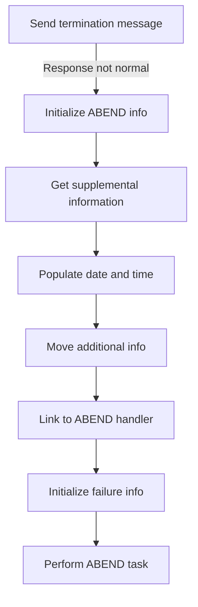

<SwmSnippet path="/src/base/cobol_src/BNK1TFN.cbl" line="899">

---

### Sending termination message

First, the termination message is sent to the user interface using the <SwmToken path="src/base/cobol_src/BNK1TFN.cbl" pos="899:5:7" line-data="           EXEC CICS SEND TEXT">`SEND TEXT`</SwmToken> command.

```cobol
           EXEC CICS SEND TEXT
              FROM(END-OF-SESSION-MESSAGE)
              ERASE
              FREEKB
              RESP(WS-CICS-RESP)
              RESP2(WS-CICS-RESP2)
           END-EXEC.
```

---

</SwmSnippet>

<SwmSnippet path="/src/base/cobol_src/BNK1TFN.cbl" line="907">

---

### Handling non-normal response

Moving to the next step, if the response from the <SwmToken path="src/base/cobol_src/BNK1TFN.cbl" pos="899:5:7" line-data="           EXEC CICS SEND TEXT">`SEND TEXT`</SwmToken> command is not normal, the system initializes the ABEND information record to handle the abnormal termination.

```cobol
           IF WS-CICS-RESP NOT = DFHRESP(NORMAL)
      *
      *       Preserve the RESP and RESP2, then set up the
      *       standard ABEND info before getting the applid,
      *       date/time etc. and linking to the Abend Handler
      *       program.
      *
              INITIALIZE ABNDINFO-REC
```

---

</SwmSnippet>

<SwmSnippet path="/src/base/cobol_src/BNK1TFN.cbl" line="920">

---

### Gathering supplemental information

Next, the program gathers supplemental information such as the application ID, task number, and transaction ID to provide context for the ABEND.

```cobol
              EXEC CICS ASSIGN APPLID(ABND-APPLID)
              END-EXEC

              MOVE EIBTASKN   TO ABND-TASKNO-KEY
              MOVE EIBTRNID   TO ABND-TRANID

```

---

</SwmSnippet>

<SwmSnippet path="/src/base/cobol_src/BNK1TFN.cbl" line="926">

---

### Populating date and time

Then, the current date and time are populated into the ABEND information record to timestamp the event.

```cobol
              PERFORM POPULATE-TIME-DATE

              MOVE WS-ORIG-DATE TO ABND-DATE
              STRING WS-TIME-NOW-GRP-HH DELIMITED BY SIZE,
                    ':' DELIMITED BY SIZE,
                     WS-TIME-NOW-GRP-MM DELIMITED BY SIZE,
                     ':' DELIMITED BY SIZE,
                     WS-TIME-NOW-GRP-MM DELIMITED BY SIZE
                     INTO ABND-TIME
```

---

</SwmSnippet>

<SwmSnippet path="/src/base/cobol_src/BNK1TFN.cbl" line="937">

---

### Moving additional information

Going into the next step, additional information such as the unique time and a specific code are moved into the ABEND information record.

```cobol
              MOVE WS-U-TIME   TO ABND-UTIME-KEY
              MOVE 'HBNK'      TO ABND-CODE

```

---

</SwmSnippet>

<SwmSnippet path="/src/base/cobol_src/BNK1TFN.cbl" line="954">

---

### Linking to ABEND handler

The program then links to the ABEND handler program, passing the ABEND information record for further processing.

```cobol
              EXEC CICS LINK PROGRAM(WS-ABEND-PGM)
                        COMMAREA(ABNDINFO-REC)
              END-EXEC
```

---

</SwmSnippet>

<SwmSnippet path="/src/base/cobol_src/BNK1TFN.cbl" line="958">

---

### Initializing failure information

Finally, the failure information is initialized, and the ABEND task is performed to handle the termination.

```cobol
              INITIALIZE WS-FAIL-INFO
              MOVE 'BNK1TFN - STM010 - SEND TEXT FAIL'
                 TO WS-CICS-FAIL-MSG
              MOVE WS-CICS-RESP  TO WS-CICS-RESP-DISP
              MOVE WS-CICS-RESP2 TO WS-CICS-RESP2-DISP
              PERFORM ABEND-THIS-TASK
```

---

</SwmSnippet>

## <SwmToken path="src/base/cobol_src/BNK1TFN.cbl" pos="230:3:5" line-data="                 PERFORM PROCESS-MAP">`PROCESS-MAP`</SwmToken>

Lets' zoom into this section of the flow:

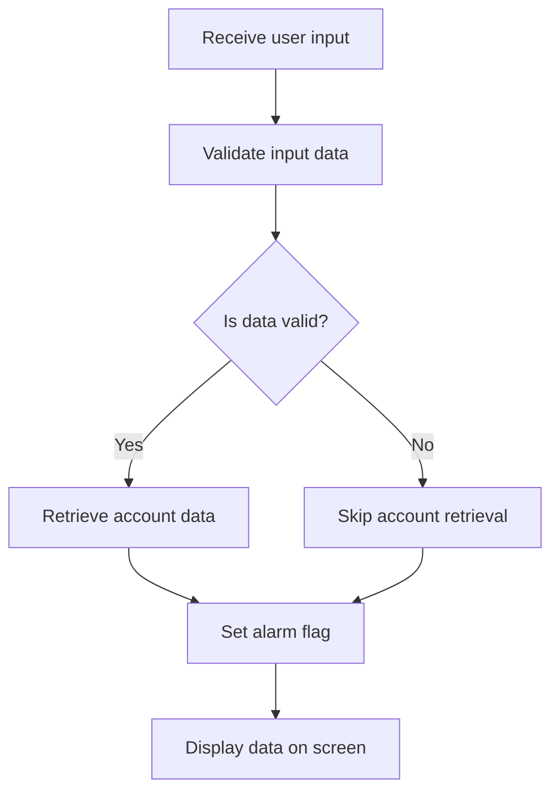

<SwmSnippet path="/src/base/cobol_src/BNK1TFN.cbl" line="319">

---

First, the function retrieves user input data from the map.

```cobol
       PROCESS-MAP SECTION.
       PM010.
      *
      *    Retrieve the data from the map
      *

           PERFORM RECEIVE-MAP.
```

---

</SwmSnippet>

<SwmSnippet path="/src/base/cobol_src/BNK1TFN.cbl" line="328">

---

Moving to the next step, the function validates the received input data to ensure it meets the required criteria.

```cobol
      *    Validate the received data
      *
           PERFORM EDIT-DATA.
```

---

</SwmSnippet>

<SwmSnippet path="/src/base/cobol_src/BNK1TFN.cbl" line="332">

---

Next, if the data passes validation, the function proceeds to retrieve the account data associated with the input.

```cobol
      *
      *    If the data passes validation go on to
      *    get an account
      *
           IF VALID-DATA
              PERFORM GET-ACC-DATA
           END-IF.
```

---

</SwmSnippet>

<SwmSnippet path="/src/base/cobol_src/BNK1TFN.cbl" line="340">

---

Then, the function sets an alarm flag to indicate that data processing is complete.

```cobol
           SET SEND-DATAONLY-ALARM TO TRUE.
```

---

</SwmSnippet>

<SwmSnippet path="/src/base/cobol_src/BNK1TFN.cbl" line="342">

---

Finally, the function outputs the processed data to the screen for the user to view.

```cobol
      *
      *    Output the data to the screen
      *
           PERFORM SEND-MAP.
```

---

</SwmSnippet>

## <SwmToken path="src/base/cobol_src/BNK1TFN.cbl" pos="325:3:5" line-data="           PERFORM RECEIVE-MAP.">`RECEIVE-MAP`</SwmToken>

Lets' zoom into this section of the flow:

```mermaid
graph TD
  A[Receive user input from map] --> B{Check response code}
  B -- Normal response --> C[Continue processing]
  B -- Error response --> D[Initialize ABEND info]
  D --> E[Get supplemental information]
  E --> F[Populate date and time]
  F --> G[Prepare ABEND message]
  G --> H[Link to ABEND handler]
  H --> I[Log failure information]
  I --> J[Perform ABEND task]
```

<SwmSnippet path="/src/base/cobol_src/BNK1TFN.cbl" line="351">

---

### Receiving user input from map

First, the <SwmToken path="src/base/cobol_src/BNK1TFN.cbl" pos="351:1:3" line-data="       RECEIVE-MAP SECTION.">`RECEIVE-MAP`</SwmToken> section retrieves the data from the map <SwmToken path="src/base/cobol_src/BNK1TFN.cbl" pos="357:6:6" line-data="              RECEIVE MAP(&#39;BNK1TF&#39;)">`BNK1TF`</SwmToken> and stores it into the <SwmToken path="src/base/cobol_src/BNK1TFN.cbl" pos="359:3:3" line-data="              INTO(BNK1TFI)">`BNK1TFI`</SwmToken> structure.

```cobol
       RECEIVE-MAP SECTION.
       RM010.
      *
      *    Retrieve the data
      *
           EXEC CICS
              RECEIVE MAP('BNK1TF')
              MAPSET('BNK1TFM')
              INTO(BNK1TFI)
              RESP(WS-CICS-RESP)
              RESP2(WS-CICS-RESP2)
           END-EXEC.
```

---

</SwmSnippet>

<SwmSnippet path="/src/base/cobol_src/BNK1TFN.cbl" line="364">

---

### Checking response code

Next, it checks if the response code <SwmToken path="src/base/cobol_src/BNK1TFN.cbl" pos="364:3:7" line-data="           IF WS-CICS-RESP NOT = DFHRESP(NORMAL)">`WS-CICS-RESP`</SwmToken> is not equal to <SwmToken path="src/base/cobol_src/BNK1TFN.cbl" pos="364:13:16" line-data="           IF WS-CICS-RESP NOT = DFHRESP(NORMAL)">`DFHRESP(NORMAL)`</SwmToken>. If the response is normal, the process continues; otherwise, it handles the error.

```cobol
           IF WS-CICS-RESP NOT = DFHRESP(NORMAL)
```

---

</SwmSnippet>

<SwmSnippet path="/src/base/cobol_src/BNK1TFN.cbl" line="371">

---

### Initializing ABEND info

If an error occurs, the program initializes the <SwmToken path="src/base/cobol_src/BNK1TFN.cbl" pos="371:3:5" line-data="              INITIALIZE ABNDINFO-REC">`ABNDINFO-REC`</SwmToken> structure to store ABEND information.

```cobol
              INITIALIZE ABNDINFO-REC
```

---

</SwmSnippet>

<SwmSnippet path="/src/base/cobol_src/BNK1TFN.cbl" line="377">

---

### Getting supplemental information

The program then retrieves supplemental information such as application ID, task number, and transaction ID.

```cobol
              EXEC CICS ASSIGN APPLID(ABND-APPLID)
              END-EXEC

              MOVE EIBTASKN   TO ABND-TASKNO-KEY
              MOVE EIBTRNID   TO ABND-TRANID

```

---

</SwmSnippet>

<SwmSnippet path="/src/base/cobol_src/BNK1TFN.cbl" line="383">

---

### Populating date and time

It populates the date and time fields in the <SwmToken path="src/base/cobol_src/BNK1TFN.cbl" pos="262:3:5" line-data="              INITIALIZE ABNDINFO-REC">`ABNDINFO-REC`</SwmToken> structure using the current date and time.

```cobol
              PERFORM POPULATE-TIME-DATE

              MOVE WS-ORIG-DATE TO ABND-DATE
              STRING WS-TIME-NOW-GRP-HH DELIMITED BY SIZE,
                    ':' DELIMITED BY SIZE,
                     WS-TIME-NOW-GRP-MM DELIMITED BY SIZE,
                     ':' DELIMITED BY SIZE,
                     WS-TIME-NOW-GRP-MM DELIMITED BY SIZE
                     INTO ABND-TIME
```

---

</SwmSnippet>

<SwmSnippet path="/src/base/cobol_src/BNK1TFN.cbl" line="402">

---

### Preparing ABEND message

The program prepares an ABEND message string that includes the response codes and other relevant information.

```cobol
              STRING 'RM010 - RECEIVE MAP FAIL.'
                    DELIMITED BY SIZE,
                    ' EIBRESP=' DELIMITED BY SIZE,
                    ABND-RESPCODE DELIMITED BY SIZE,
                    ' RESP2=' DELIMITED BY SIZE,
                    ABND-RESP2CODE DELIMITED BY SIZE
                    INTO ABND-FREEFORM
```

---

</SwmSnippet>

<SwmSnippet path="/src/base/cobol_src/BNK1TFN.cbl" line="411">

---

### Linking to ABEND handler

It then links to the ABEND handler program specified in <SwmToken path="src/base/cobol_src/BNK1TFN.cbl" pos="411:9:13" line-data="              EXEC CICS LINK PROGRAM(WS-ABEND-PGM)">`WS-ABEND-PGM`</SwmToken> and passes the <SwmToken path="src/base/cobol_src/BNK1TFN.cbl" pos="412:3:5" line-data="                        COMMAREA(ABNDINFO-REC)">`ABNDINFO-REC`</SwmToken> structure.

```cobol
              EXEC CICS LINK PROGRAM(WS-ABEND-PGM)
                        COMMAREA(ABNDINFO-REC)
              END-EXEC
```

---

</SwmSnippet>

<SwmSnippet path="/src/base/cobol_src/BNK1TFN.cbl" line="416">

---

### Logging failure information

The program logs the failure information by initializing <SwmToken path="src/base/cobol_src/BNK1TFN.cbl" pos="416:3:7" line-data="              INITIALIZE WS-FAIL-INFO">`WS-FAIL-INFO`</SwmToken> and setting the failure message and response codes.

```cobol
              INITIALIZE WS-FAIL-INFO
              MOVE 'BNK1TFN - RM010 - RECEIVE MAP FAIL ' TO
                 WS-CICS-FAIL-MSG
              MOVE WS-CICS-RESP  TO WS-CICS-RESP-DISP
              MOVE WS-CICS-RESP2 TO WS-CICS-RESP2-DISP
```

---

</SwmSnippet>

<SwmSnippet path="/src/base/cobol_src/BNK1TFN.cbl" line="421">

---

### Performing ABEND task

Finally, it performs the ABEND task by calling the <SwmToken path="src/base/cobol_src/BNK1TFN.cbl" pos="421:3:7" line-data="              PERFORM ABEND-THIS-TASK">`ABEND-THIS-TASK`</SwmToken> routine.

```cobol
              PERFORM ABEND-THIS-TASK
```

---

</SwmSnippet>

## <SwmToken path="src/base/cobol_src/BNK1TFN.cbl" pos="330:3:5" line-data="           PERFORM EDIT-DATA.">`EDIT-DATA`</SwmToken>

Lets' zoom into this section of the flow:

```mermaid
graph TD
  A[Validate FROM account number] --> B[Check if FROM account number is numeric]
  B --> C{Is FROM account number numeric?}
  C -- No --> D[Set error message for FROM account number]
  C -- Yes --> E[Validate TO account number]
  E --> F{Is TO account number numeric?}
  F -- No --> G[Set error message for TO account number]
  F -- Yes --> H[Check if FROM and TO account numbers are different]
  H --> I{Are account numbers different?}
  I -- No --> J[Set error message for same account numbers]
  I -- Yes --> K[Check if account numbers are valid]
  K --> L{Are account numbers valid?}
  L -- No --> M[Set error message for invalid account numbers]
  L -- Yes --> N[Validate transaction amount]
```

First, the system validates the FROM account number by checking if it is numeric.

<SwmSnippet path="/src/base/cobol_src/BNK1TFN.cbl" line="437">

---

If the FROM account number is not numeric, an error message is set indicating that a valid FROM account number is required.

```cobol
           IF FACCNOI NOT NUMERIC
              MOVE 'Please enter a FROM account no  ' TO
                 MESSAGEO
              MOVE 'N' TO VALID-DATA-SW
              GO TO ED999
           END-IF.
```

---

</SwmSnippet>

Next, the system validates the TO account number by checking if it is numeric.

<SwmSnippet path="/src/base/cobol_src/BNK1TFN.cbl" line="448">

---

If the TO account number is not numeric, an error message is set indicating that a valid TO account number is required.

```cobol
           IF TACCNOI NOT NUMERIC
              MOVE 'Please enter a TO account no    ' TO
                 MESSAGEO
              MOVE 'N' TO VALID-DATA-SW
              GO TO ED999
           END-IF.
```

---

</SwmSnippet>

Then, the system checks if the FROM and TO account numbers are different.

<SwmSnippet path="/src/base/cobol_src/BNK1TFN.cbl" line="455">

---

If the FROM and TO account numbers are the same, an error message is set indicating that the FROM and TO account numbers should be different.

```cobol
           IF FACCNOI = TACCNOI
              MOVE 'The FROM & TO account should be different ' TO
                 MESSAGEO
              MOVE 'N' TO VALID-DATA-SW
              GO TO ED999
           END-IF.
```

---

</SwmSnippet>

The system also checks if either the FROM or TO account number is '00000000', which is considered invalid.

<SwmSnippet path="/src/base/cobol_src/BNK1TFN.cbl" line="462">

---

If either account number is '00000000', an error message is set indicating that '00000000' is not a valid account number.

```cobol
           IF FACCNOI = '00000000' OR TACCNOI = '00000000'
              MOVE 'Account no 00000000 is not valid          ' TO
                 MESSAGEO
              MOVE 'N' TO VALID-DATA-SW
              GO TO ED999
           END-IF.
```

---

</SwmSnippet>

<SwmSnippet path="/src/base/cobol_src/BNK1TFN.cbl" line="472">

---

Finally, the system performs validation on the transaction amount by calling the <SwmToken path="src/base/cobol_src/BNK1TFN.cbl" pos="472:3:5" line-data="           PERFORM VALIDATE-AMOUNT.">`VALIDATE-AMOUNT`</SwmToken> section.

```cobol
           PERFORM VALIDATE-AMOUNT.
```

---

</SwmSnippet>

## <SwmToken path="src/base/cobol_src/BNK1TFN.cbl" pos="472:3:5" line-data="           PERFORM VALIDATE-AMOUNT.">`VALIDATE-AMOUNT`</SwmToken>

Lets' zoom into this section of the flow:

```mermaid
graph TD
  A[Check if amount is zero] -->|Yes| B[Set error message and status]
  A -->|No| C[Check if amount is numeric]
  C -->|Yes| D[Convert amount to float]
  D --> E[Check if amount is positive]
  E -->|No| F[Set error message and status]
  E -->|Yes| G[Set valid status]
  C -->|No| H[Inspect leading spaces]
  H --> I[Check if amount is numeric after removing spaces]
  I -->|No| J[Set error message and status]
  I -->|Yes| K[Remove leading spaces]
  K --> L[Reverse amount string]
  L --> M[Inspect leading spaces in reversed string]
  M --> N[Check for negative sign]
  N -->|Yes| O[Set error message and status]
  N -->|No| P[Check for embedded spaces]
  P -->|Yes| Q[Set error message and status]
  P -->|No| R[Check if amount is numeric]
  R -->|No| S[Set error message and status]
  R -->|Yes| T[Check for multiple decimal points]
  T -->|Yes| U[Set error message and status]
  T -->|No| V[Check for too many decimals]
  V -->|Yes| W[Set error message and status]
  V -->|No| X[Convert amount to float]
  X --> Y[Check if amount is zero]
  Y -->|Yes| Z[Set error message and status]
  Y -->|No| AA[Set valid status]
```

<SwmSnippet path="/src/base/cobol_src/BNK1TFN.cbl" line="991">

---

First, the function checks if the entered amount is zero. If it is, an error message is set, the validation status is marked as 'N', and the amount is set to -1.

```cobol
           IF AMTL = ZERO
              MOVE 'The Amount entered must be numeric.' TO
                 MESSAGEO
              MOVE 'N' TO VALID-DATA-SW
              MOVE -1 TO AMTL
              GO TO VA999
           END-IF
```

---

</SwmSnippet>

<SwmSnippet path="/src/base/cobol_src/BNK1TFN.cbl" line="999">

---

Next, the function checks if the entered amount is numeric. If it is, the amount is converted to a float.

```cobol
           IF AMTI(1:AMTL) IS NUMERIC
      *
      *       Is it a positive amount?
      *
              COMPUTE WS-AMOUNT-AS-FLOAT =
                 FUNCTION NUMVAL(AMTI(1:AMTL))
```

---

</SwmSnippet>

<SwmSnippet path="/src/base/cobol_src/BNK1TFN.cbl" line="1006">

---

The function then checks if the converted float amount is positive. If it is not, an error message is set, the validation status is marked as 'N', and the amount is set to -1.

```cobol
              IF WS-AMOUNT-AS-FLOAT <= 0
                 MOVE SPACES TO MESSAGEO
                 STRING 'Please supply a positive amount.'
                    DELIMITED BY SIZE,
                 INTO MESSAGEO
                 MOVE 'N' TO VALID-DATA-SW
                 MOVE -1 TO AMTL
                 GO TO VA999
              END-IF
```

---

</SwmSnippet>

<SwmSnippet path="/src/base/cobol_src/BNK1TFN.cbl" line="1015">

---

If the amount is positive, the validation status is set to 'Y'.

```cobol
              MOVE 'Y' TO VALID-DATA-SW
              GO TO VA999
           END-IF.
```

---

</SwmSnippet>

<SwmSnippet path="/src/base/cobol_src/BNK1TFN.cbl" line="1019">

---

If the amount is not numeric, the function inspects the leading spaces in the entered amount.

```cobol
           MOVE ZERO TO WS-NUM-COUNT-TOTAL.
           INSPECT AMTI(1:AMTL) TALLYING WS-NUM-COUNT-TOTAL
              FOR LEADING SPACES.
```

---

</SwmSnippet>

<SwmSnippet path="/src/base/cobol_src/BNK1TFN.cbl" line="1026">

---

The function then checks if the amount is numeric after removing the leading spaces. If it is not, an error message is set, the validation status is marked as 'N', and the amount is set to -1.

```cobol
           IF WS-NUM-COUNT-TOTAL = AMTL
              MOVE 'The Amount entered must be numeric.' TO
                 MESSAGEO
              MOVE 'N' TO VALID-DATA-SW
              MOVE -1 TO AMTL
              GO TO VA999
           END-IF.
```

---

</SwmSnippet>

<SwmSnippet path="/src/base/cobol_src/BNK1TFN.cbl" line="1034">

---

If the amount is numeric, the function removes the leading spaces and reverses the amount string.

```cobol
           COMPUTE WS-AMOUNT-UNSTR-L = AMTL - WS-NUM-COUNT-TOTAL.

      D    DISPLAY 'There are ' ws-num-count-total ' leading spaces'
           IF WS-NUM-COUNT-TOTAL = ZERO
              MOVE SPACES TO WS-AMOUNT-UNSTR
              UNSTRING AMTI(1:AMTL)
                 INTO WS-AMOUNT-UNSTR
           ELSE
              MOVE SPACES TO WS-AMOUNT-UNSTR
              ADD 1 TO WS-NUM-COUNT-TOTAL GIVING WS-NUM-COUNT-TOTAL
              UNSTRING AMTI(WS-NUM-COUNT-TOTAL:AMTL)
                 INTO WS-AMOUNT-UNSTR
           END-IF.

           MOVE ZERO TO WS-NUM-COUNT-TOTAL.

           MOVE FUNCTION REVERSE(WS-AMOUNT-UNSTR(1:WS-AMOUNT-UNSTR-L))
              TO WS-AMOUNT-UNSTR-REVERSE.
```

---

</SwmSnippet>

<SwmSnippet path="/src/base/cobol_src/BNK1TFN.cbl" line="1053">

---

The function then inspects the leading spaces in the reversed amount string.

```cobol
           INSPECT WS-AMOUNT-UNSTR-REVERSE
              TALLYING WS-NUM-COUNT-TOTAL
              FOR LEADING SPACES.
```

---

</SwmSnippet>

<SwmSnippet path="/src/base/cobol_src/BNK1TFN.cbl" line="1083">

---

Next, the function checks for a negative sign in the amount. If a negative sign is found, an error message is set, the validation status is marked as 'N', and the amount is set to -1.

```cobol
           IF WS-NUM-COUNT-MINUS > 0
              MOVE SPACES TO MESSAGEO
              STRING 'Please supply a positive amount.'
                 DELIMITED BY SIZE,
                 INTO MESSAGEO
              MOVE 'N' TO VALID-DATA-SW
              MOVE -1 TO AMTL
              GO TO VA999
           END-IF.
```

---

</SwmSnippet>

<SwmSnippet path="/src/base/cobol_src/BNK1TFN.cbl" line="1100">

---

The function then checks for embedded spaces in the amount. If embedded spaces are found, an error message is set, the validation status is marked as 'N', and the amount is set to -1.

```cobol
           IF WS-NUM-COUNT-SPACE > 0
              MOVE SPACES TO MESSAGEO
              STRING
                 'Please supply a numeric amount without embedded'
                 DELIMITED BY SIZE,
                 '  spaces.' DELIMITED BY SIZE
               INTO MESSAGEO
               MOVE 'N' TO VALID-DATA-SW
               MOVE -1 TO AMTL
               GO TO VA999
           END-IF.
```

---

</SwmSnippet>

<SwmSnippet path="/src/base/cobol_src/BNK1TFN.cbl" line="1112">

---

If there are no embedded spaces, the function checks if the amount is numeric. If it is not, an error message is set, the validation status is marked as 'N', and the amount is set to -1.

```cobol
           IF WS-NUM-COUNT-TOTAL < WS-AMOUNT-UNSTR-L
              MOVE SPACES TO MESSAGEO
              STRING 'Please supply a numeric amount.'
                 DELIMITED BY SIZE,
                 INTO MESSAGEO
              MOVE 'N' TO VALID-DATA-SW
              MOVE -1 TO AMTL
              GO TO VA999
           END-IF.
```

---

</SwmSnippet>

<SwmSnippet path="/src/base/cobol_src/BNK1TFN.cbl" line="1130">

---

The function then checks for multiple decimal points in the amount. If more than one decimal point is found, an error message is set, the validation status is marked as 'N', and the amount is set to -1.

```cobol
           IF WS-NUM-COUNT-POINT > 1
              MOVE SPACES TO MESSAGEO
              STRING 'Use one decimal point for amount only.'
                 DELIMITED BY SIZE,
                 INTO MESSAGEO
              MOVE 'N' TO VALID-DATA-SW
              MOVE -1 TO AMTL
              GO TO VA999
           END-IF.
```

---

</SwmSnippet>

<SwmSnippet path="/src/base/cobol_src/BNK1TFN.cbl" line="1142">

---

If there is only one decimal point, the function checks for too many decimals. If more than two decimals are found, an error message is set, the validation status is marked as 'N', and the amount is set to -1.

```cobol
           IF WS-NUM-COUNT-POINT = 1
              MOVE ZERO TO WS-NUM-COUNT-TOTAL
              INSPECT WS-AMOUNT-UNSTR(1:WS-AMOUNT-UNSTR-L)
                 TALLYING
                 WS-NUM-COUNT-TOTAL FOR CHARACTERS AFTER '.'

              IF WS-NUM-COUNT-TOTAL > 2
      D          DISPLAY 'WS-NUM-COUNT-TOTAL IS ' WS-NUM-COUNT-TOTAL
                 MOVE ZERO TO WS-NUM-COUNT-TOTAL WS-NUM-COUNT-POINT
                 INSPECT WS-AMOUNT-UNSTR(1:WS-AMOUNT-UNSTR-L)
                    TALLYING WS-NUM-COUNT-POINT
                    FOR CHARACTERS BEFORE '.'

                 ADD 2 TO WS-NUM-COUNT-POINT GIVING WS-NUM-COUNT-POINT
                 INSPECT WS-AMOUNT-UNSTR
                    (WS-NUM-COUNT-POINT:WS-AMOUNT-UNSTR-L)
                    TALLYING
                    WS-NUM-COUNT-TOTAL FOR ALL '0'
                    WS-NUM-COUNT-TOTAL FOR ALL '1'
                    WS-NUM-COUNT-TOTAL FOR ALL '2'
                    WS-NUM-COUNT-TOTAL FOR ALL '3'
```

---

</SwmSnippet>

<SwmSnippet path="/src/base/cobol_src/BNK1TFN.cbl" line="1187">

---

If the amount has a valid number of decimals, the function converts the amount to a float.

```cobol
           COMPUTE WS-AMOUNT-AS-FLOAT =
              FUNCTION NUMVAL(WS-AMOUNT-UNSTR(1:WS-AMOUNT-UNSTR-L)).
```

---

</SwmSnippet>

<SwmSnippet path="/src/base/cobol_src/BNK1TFN.cbl" line="1190">

---

The function then checks if the converted float amount is zero. If it is, an error message is set, the validation status is marked as 'N', and the amount is set to -1.

```cobol
           IF WS-AMOUNT-AS-FLOAT = ZERO
              MOVE SPACES TO MESSAGEO
              STRING 'Please supply a non-zero amount.'
                 DELIMITED BY SIZE,
                 INTO MESSAGEO
                 MOVE 'N' TO VALID-DATA-SW
                 MOVE -1 TO AMTL
                 GO TO VA999
           END-IF.
```

---

</SwmSnippet>

<SwmSnippet path="/src/base/cobol_src/BNK1TFN.cbl" line="1200">

---

Finally, if all validations pass, the function sets the validation status to 'Y'.

```cobol
           MOVE SPACES TO MESSAGEO.
           MOVE 'Y' TO VALID-DATA-SW.
```

---

</SwmSnippet>

## <SwmToken path="src/base/cobol_src/BNK1TFN.cbl" pos="337:3:7" line-data="              PERFORM GET-ACC-DATA">`GET-ACC-DATA`</SwmToken>

Lets' zoom into this section of the flow:

```mermaid
graph TD
  A[Initialize Parameters] --> B[Link to XFRFUN for Transfer]
  B --> C{Check CICS Response}
  C -->|Error| D[Handle ABEND]
  C -->|Normal| E[Map Returned Data]
  E --> F{Check Transfer Success}
  F -->|Success| G[Display Success Message]
  F -->|Failure| H[Evaluate Failure Code]
  H --> I[Display Error Message]
```

<SwmSnippet path="/src/base/cobol_src/BNK1TFN.cbl" line="478">

---

First, the function initializes the parameters required for the transfer operation.

```cobol
       GET-ACC-DATA SECTION.
       GCD010.
      *
      *    Set up the fields required by XFRFUN then link to it to
      *    get account information and perform the transfer, then
      *    check what gets returned.
      *
           INITIALIZE SUBPGM-PARMS.
```

---

</SwmSnippet>

<SwmSnippet path="/src/base/cobol_src/BNK1TFN.cbl" line="487">

---

Next, it sets up the account numbers and amount to be transferred.

```cobol
           MOVE FACCNOI TO  SUBPGM-FACCNO.
           MOVE TACCNOI TO  SUBPGM-TACCNO.
           MOVE 'N'     TO  SUBPGM-SUCCESS.

      *
      * Provide the correct Amount
      *
           MOVE WS-AMOUNT-AS-FLOAT TO SUBPGM-AMT.
```

---

</SwmSnippet>

<SwmSnippet path="/src/base/cobol_src/BNK1TFN.cbl" line="496">

---

Then, it links to the <SwmToken path="src/base/cobol_src/BNK1TFN.cbl" pos="497:4:4" line-data="              PROGRAM(&#39;XFRFUN&#39;)">`XFRFUN`</SwmToken> program to perform the transfer operation.

```cobol
           EXEC CICS LINK
              PROGRAM('XFRFUN')
              COMMAREA(SUBPGM-PARMS)
              RESP(WS-CICS-RESP)
              RESP2(WS-CICS-RESP2)
              SYNCONRETURN
           END-EXEC.
```

---

</SwmSnippet>

<SwmSnippet path="/src/base/cobol_src/BNK1TFN.cbl" line="504">

---

Moving to the next step, it checks the response from the <SwmToken path="src/base/cobol_src/BNK1TFN.cbl" pos="481:15:15" line-data="      *    Set up the fields required by XFRFUN then link to it to">`XFRFUN`</SwmToken> program to determine if the operation was successful.

```cobol
           IF WS-CICS-RESP NOT = DFHRESP(NORMAL)
```

---

</SwmSnippet>

<SwmSnippet path="/src/base/cobol_src/BNK1TFN.cbl" line="511">

---

If an error is detected, it initializes the ABEND information and gathers supplemental data for error handling.

```cobol
              INITIALIZE ABNDINFO-REC
              MOVE EIBRESP    TO ABND-RESPCODE
              MOVE EIBRESP2   TO ABND-RESP2CODE
      *
      *       Get supplemental information
      *
              EXEC CICS ASSIGN APPLID(ABND-APPLID)
              END-EXEC

              MOVE EIBTASKN   TO ABND-TASKNO-KEY
              MOVE EIBTRNID   TO ABND-TRANID

              PERFORM POPULATE-TIME-DATE

              MOVE WS-ORIG-DATE TO ABND-DATE
              STRING WS-TIME-NOW-GRP-HH DELIMITED BY SIZE,
                    ':' DELIMITED BY SIZE,
                     WS-TIME-NOW-GRP-MM DELIMITED BY SIZE,
                     ':' DELIMITED BY SIZE,
                     WS-TIME-NOW-GRP-MM DELIMITED BY SIZE
                     INTO ABND-TIME
```

---

</SwmSnippet>

<SwmSnippet path="/src/base/cobol_src/BNK1TFN.cbl" line="551">

---

It then links to the ABEND handler program to log the error details.

```cobol
              EXEC CICS LINK PROGRAM(WS-ABEND-PGM)
                        COMMAREA(ABNDINFO-REC)
              END-EXEC
```

---

</SwmSnippet>

<SwmSnippet path="/src/base/cobol_src/BNK1TFN.cbl" line="555">

---

After handling the error, it sets up a failure message and performs the task abend.

```cobol
              INITIALIZE WS-FAIL-INFO
              MOVE 'BNK1TFN - GCD010 - LINK XFRFUN  FAIL      '
                 TO WS-CICS-FAIL-MSG
              MOVE WS-CICS-RESP  TO WS-CICS-RESP-DISP
              MOVE WS-CICS-RESP2 TO WS-CICS-RESP2-DISP
              PERFORM ABEND-THIS-TASK
           END-IF.
```

---

</SwmSnippet>

<SwmSnippet path="/src/base/cobol_src/BNK1TFN.cbl" line="564">

---

If no error is detected, it maps the returned data to the screen output fields.

```cobol
      *    Map the returned data to the screen output fields
      *
           MOVE SUBPGM-FACCNO    TO FACCNO2O
           MOVE SUBPGM-FSCODE    TO FSORTCO
           MOVE SUBPGM-TACCNO    TO TACCNO2O
           MOVE SUBPGM-TSCODE    TO TSORTCO
           MOVE ZERO             TO FROM-ACTUAL-BALANCE-DISPLAY
           MOVE ZERO             TO FROM-AVAILABLE-BALANCE-DISPLAY
           MOVE ZERO             TO TO-ACTUAL-BALANCE-DISPLAY
           MOVE ZERO             TO TO-AVAILABLE-BALANCE-DISPLAY
           MOVE FROM-ACTUAL-BALANCE-DISPLAY TO FACTBALO
           MOVE FROM-AVAILABLE-BALANCE-DISPLAY TO FAVBALO
           MOVE TO-ACTUAL-BALANCE-DISPLAY    TO TACTBALO
           MOVE TO-AVAILABLE-BALANCE-DISPLAY TO TAVBALO
```

---

</SwmSnippet>

<SwmSnippet path="/src/base/cobol_src/BNK1TFN.cbl" line="582">

---

Then, it checks if the transfer was successful by evaluating the <SwmToken path="src/base/cobol_src/BNK1TFN.cbl" pos="582:3:5" line-data="           IF SUBPGM-SUCCESS = &#39;N&#39;">`SUBPGM-SUCCESS`</SwmToken> flag.

```cobol
           IF SUBPGM-SUCCESS = 'N'
```

---

</SwmSnippet>

<SwmSnippet path="/src/base/cobol_src/BNK1TFN.cbl" line="586">

---

If the transfer was not successful, it evaluates the failure code to determine the appropriate error message to display.

```cobol
              EVALUATE SUBPGM-FAIL-CODE
                 WHEN '1'
                    MOVE SPACES TO MESSAGEO
                    STRING 'Sorry the FROM ACCOUNT no was not found'
                           '. Transfer not applied. '
                           DELIMITED BY SIZE
                           INTO MESSAGEO
                    GO TO GCD999

                 WHEN '2'
                    MOVE SPACES TO MESSAGEO
                    STRING 'Sorry the TO ACCOUNT no was not found'
                           '. Transfer not applied. '
                           DELIMITED BY SIZE
                           INTO MESSAGEO
                    GO TO GCD999

                 WHEN '3'
                    MOVE SPACES TO MESSAGEO
                    STRING 'Sorry but the transfer could not be applied'
                           ' due to an unexpected error.'
```

---

</SwmSnippet>

<SwmSnippet path="/src/base/cobol_src/BNK1TFN.cbl" line="629">

---

If the transfer was successful, it displays a success message to the user.

```cobol
           IF SUBPGM-SUCCESS NOT = 'Y'
              MOVE SPACES TO MESSAGEO
              STRING 'Sorry but the transfer could not be applied'
                     ' unable to determine success.'
                     DELIMITED BY SIZE
                     INTO MESSAGEO
              GO TO GCD999
           ELSE
              MOVE SPACES TO MESSAGEO
              MOVE 'Transfer successfully applied.             ' TO
                 MESSAGEO
           END-IF.
```

---

</SwmSnippet>

<SwmSnippet path="/src/base/cobol_src/BNK1TFN.cbl" line="643">

---

Finally, it maps the remaining fields to ensure all data is correctly displayed.

```cobol
      *    Map the remaining fields
      *
           MOVE SUBPGM-FACCNO    TO FACCNO2O.
           MOVE SUBPGM-FSCODE    TO FSORTCO.
           MOVE SUBPGM-TACCNO    TO TACCNO2O.
           MOVE SUBPGM-TSCODE    TO TSORTCO.
           MOVE SUBPGM-FACTBAL   TO FROM-ACTUAL-BALANCE-DISPLAY.
           MOVE SUBPGM-FAVBAL    TO FROM-AVAILABLE-BALANCE-DISPLAY.
           MOVE SUBPGM-TACTBAL   TO TO-ACTUAL-BALANCE-DISPLAY.
           MOVE SUBPGM-TAVBAL    TO TO-AVAILABLE-BALANCE-DISPLAY.
           MOVE FROM-ACTUAL-BALANCE-DISPLAY TO FACTBALO.
           MOVE FROM-AVAILABLE-BALANCE-DISPLAY TO FAVBALO.
           MOVE TO-ACTUAL-BALANCE-DISPLAY    TO TACTBALO.
           MOVE TO-AVAILABLE-BALANCE-DISPLAY TO TAVBALO.
```

---

</SwmSnippet>

&nbsp;

*This is an auto-generated document by Swimm 🌊 and has not yet been verified by a human*

<SwmMeta version="3.0.0" repo-id="Z2l0aHViJTNBJTNBY2ljcy1iYW5raW5nLXNhbXBsZS1hcHBsaWNhdGlvbi1jYnNhLUlCTS1EZW1vJTNBJTNBU3dpbW0tRGVtbw==" repo-name="cics-banking-sample-application-cbsa-IBM-Demo"><sup>Powered by [Swimm](https://staging.swimm.cloud/)</sup></SwmMeta>
