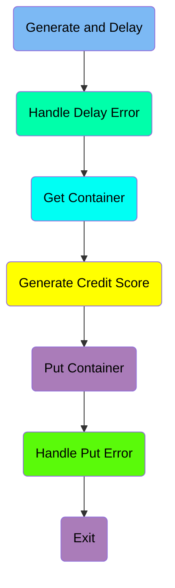
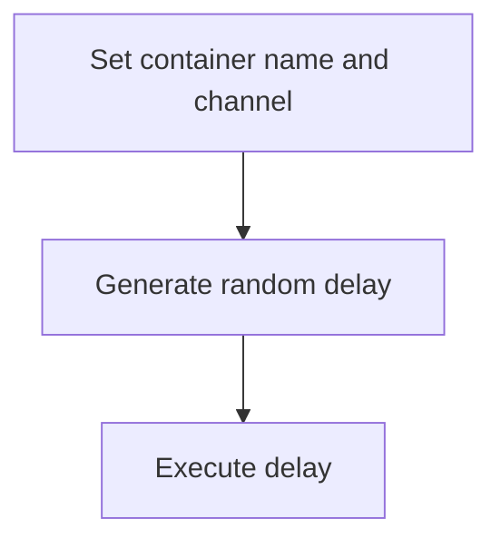
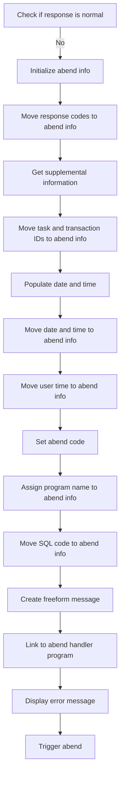
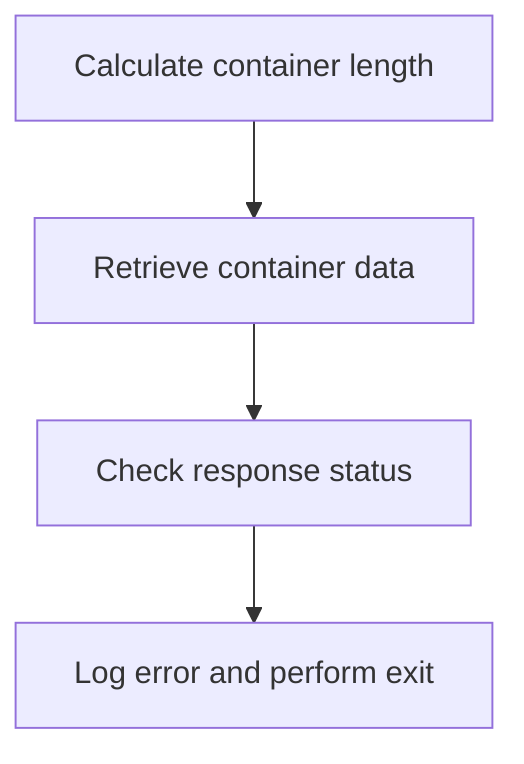
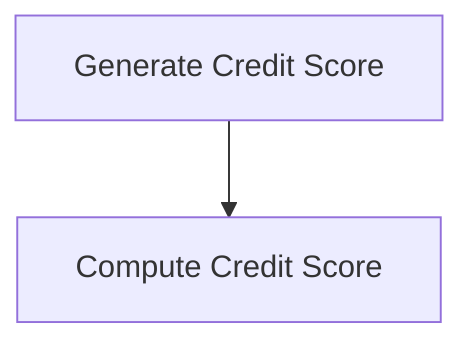
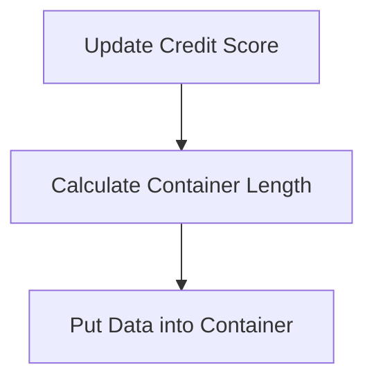
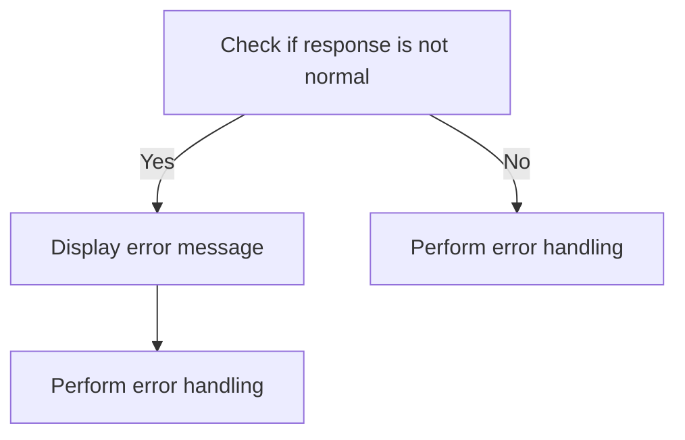
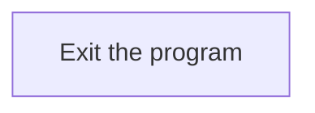
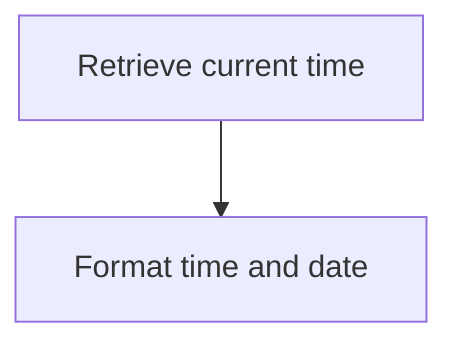
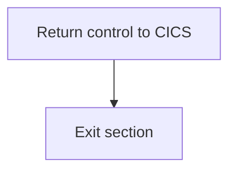

The <SwmToken path="src/base/cobol_src/CRDTAGY3.cbl" pos="233:4:4" line-data="              DISPLAY &#39;CRDTAGY3- UNABLE TO PUT CONTAINER. RESP=&#39;">`CRDTAGY3`</SwmToken> program is responsible for generating and handling delays, managing containers, and computing credit scores. This is achieved through a series of steps including setting container names, generating random delays, handling errors, retrieving and updating container data, and computing credit scores.

The flow involves setting up the environment, generating delays, handling any errors that occur, retrieving and updating container data, and computing credit scores. Each step is crucial for ensuring the program runs smoothly and handles data correctly.

Here is a high level diagram of the program:



## Generate and Delay

First, we'll zoom into this section of the flow:



<SwmSnippet path="/src/base/cobol_src/CRDTAGY3.cbl" line="119">

---

First, the container name and channel are set to 'CIPC ' and 'CIPCREDCHANN ' respectively. This prepares the environment for the subsequent operations.

```cobol
           MOVE 'CIPC            ' TO WS-CONTAINER-NAME.
           MOVE 'CIPCREDCHANN    ' TO WS-CHANNEL-NAME.
```

---

</SwmSnippet>

<SwmSnippet path="/src/base/cobol_src/CRDTAGY3.cbl" line="123">

---

Next, a random delay amount in seconds is generated. This delay is calculated to be a random number between 0 and 3 seconds, which introduces variability in the processing time.

```cobol
           COMPUTE WS-DELAY-AMT = ((3 - 1)
                            * FUNCTION RANDOM(WS-SEED)) + 1.
```

---

</SwmSnippet>

<SwmSnippet path="/src/base/cobol_src/CRDTAGY3.cbl" line="126">

---

Then, the program executes a delay for the calculated number of seconds. This delay is crucial for simulating real-world scenarios where processing times can vary.

```cobol
           EXEC CICS DELAY
                FOR SECONDS(WS-DELAY-AMT)
                RESP(WS-CICS-RESP)
                RESP2(WS-CICS-RESP2)
           END-EXEC.
```

---

</SwmSnippet>

## Handle Delay Error

Now, lets zoom into this section of the flow:



First, we check if the response code <SwmToken path="src/base/cobol_src/CRDTAGY3.cbl" pos="128:3:7" line-data="                RESP(WS-CICS-RESP)">`WS-CICS-RESP`</SwmToken> is not equal to <SwmToken path="src/base/cobol_src/CRDTAGY3.cbl" pos="232:13:16" line-data="           IF WS-CICS-RESP NOT = DFHRESP(NORMAL)">`DFHRESP(NORMAL)`</SwmToken>. This indicates that there was an abnormal termination of the transaction.

Next, we initialize the abend information record <SwmToken path="src/base/cobol_src/CRDTAGY3.cbl" pos="105:3:5" line-data="       01 ABNDINFO-REC.">`ABNDINFO-REC`</SwmToken> to prepare for capturing the details of the abnormal termination.

We then move the response codes <SwmToken path="src/base/cobol_src/CRDTAGY3.cbl" pos="140:3:3" line-data="              MOVE EIBRESP    TO ABND-RESPCODE">`EIBRESP`</SwmToken> and <SwmToken path="src/base/cobol_src/CRDTAGY3.cbl" pos="141:3:3" line-data="              MOVE EIBRESP2   TO ABND-RESP2CODE">`EIBRESP2`</SwmToken> to the abend information record to capture the specific error codes that caused the termination.

Moving to the next step, we get supplemental information such as the application ID by executing the <SwmToken path="src/base/cobol_src/CRDTAGY3.cbl" pos="145:3:7" line-data="              EXEC CICS ASSIGN APPLID(ABND-APPLID)">`CICS ASSIGN APPLID`</SwmToken> command and storing it in <SwmToken path="src/base/cobol_src/CRDTAGY3.cbl" pos="145:9:11" line-data="              EXEC CICS ASSIGN APPLID(ABND-APPLID)">`ABND-APPLID`</SwmToken>.

We also move the task number <SwmToken path="src/base/cobol_src/CRDTAGY3.cbl" pos="121:3:3" line-data="           MOVE EIBTASKN           TO WS-SEED.">`EIBTASKN`</SwmToken> and transaction ID <SwmToken path="src/base/cobol_src/CRDTAGY3.cbl" pos="149:3:3" line-data="              MOVE EIBTRNID   TO ABND-TRANID">`EIBTRNID`</SwmToken> to the abend information record to capture the context of the transaction.

Then, we perform the <SwmToken path="src/base/cobol_src/CRDTAGY3.cbl" pos="257:1:5" line-data="       POPULATE-TIME-DATE SECTION.">`POPULATE-TIME-DATE`</SwmToken> routine to get the current date and time.

We move the original date <SwmToken path="src/base/cobol_src/CRDTAGY3.cbl" pos="266:3:7" line-data="                     DDMMYYYY(WS-ORIG-DATE)">`WS-ORIG-DATE`</SwmToken> and the current time <SwmToken path="src/base/cobol_src/CRDTAGY3.cbl" pos="99:3:11" line-data="             05 WS-TIME-NOW-GRP-HH      PIC 99.">`WS-TIME-NOW-GRP-HH`</SwmToken>, <SwmToken path="src/base/cobol_src/CRDTAGY3.cbl" pos="100:3:11" line-data="             05 WS-TIME-NOW-GRP-MM      PIC 99.">`WS-TIME-NOW-GRP-MM`</SwmToken> to the abend information record to capture when the termination occurred.

We also move the user time <SwmToken path="src/base/cobol_src/CRDTAGY3.cbl" pos="261:3:7" line-data="              ABSTIME(WS-U-TIME)">`WS-U-TIME`</SwmToken> to the abend information record and set the abend code to 'PLOP'.

## Get Container

Now, lets zoom into this section of the flow:



<SwmSnippet path="/src/base/cobol_src/CRDTAGY3.cbl" line="189">

---

### Calculating container length

First, the length of the container data is calculated and stored in <SwmToken path="src/base/cobol_src/CRDTAGY3.cbl" pos="189:3:7" line-data="           COMPUTE WS-CONTAINER-LEN = LENGTH OF WS-CONT-IN.">`WS-CONTAINER-LEN`</SwmToken> (which holds the length of the container data). This is essential for the subsequent retrieval of the container data.

```cobol
           COMPUTE WS-CONTAINER-LEN = LENGTH OF WS-CONT-IN.
```

---

</SwmSnippet>

<SwmSnippet path="/src/base/cobol_src/CRDTAGY3.cbl" line="191">

---

### Retrieving container data

Next, the container data is retrieved using the <SwmToken path="src/base/cobol_src/CRDTAGY3.cbl" pos="191:1:7" line-data="           EXEC CICS GET CONTAINER(WS-CONTAINER-NAME)">`EXEC CICS GET CONTAINER`</SwmToken> command. This command fetches the data from the specified container and channel into <SwmToken path="src/base/cobol_src/CRDTAGY3.cbl" pos="193:3:7" line-data="                     INTO(WS-CONT-IN)">`WS-CONT-IN`</SwmToken> (which holds the container data). The response codes are stored in <SwmToken path="src/base/cobol_src/CRDTAGY3.cbl" pos="195:3:7" line-data="                     RESP(WS-CICS-RESP)">`WS-CICS-RESP`</SwmToken> and <SwmToken path="src/base/cobol_src/CRDTAGY3.cbl" pos="196:3:7" line-data="                     RESP2(WS-CICS-RESP2)">`WS-CICS-RESP2`</SwmToken> for further validation.

```cobol
           EXEC CICS GET CONTAINER(WS-CONTAINER-NAME)
                     CHANNEL(WS-CHANNEL-NAME)
                     INTO(WS-CONT-IN)
                     FLENGTH(WS-CONTAINER-LEN)
                     RESP(WS-CICS-RESP)
                     RESP2(WS-CICS-RESP2)
           END-EXEC.
```

---

</SwmSnippet>

## Generate Credit Score

This is the next section of the flow.



<SwmSnippet path="/src/base/cobol_src/CRDTAGY3.cbl" line="213">

---

The <SwmToken path="src/base/cobol_src/CRDTAGY3.cbl" pos="112:1:1" line-data="       PREMIERE SECTION.">`PREMIERE`</SwmToken> function generates a new credit score for a user. This is done by computing a random number between 1 and 999. The function uses the <SwmToken path="src/base/cobol_src/CRDTAGY3.cbl" pos="214:5:5" line-data="                            * FUNCTION RANDOM) + 1.">`RANDOM`</SwmToken> function to generate this number, ensuring that the credit score falls within the specified range. This newly generated credit score is then assigned to <SwmToken path="src/base/cobol_src/CRDTAGY3.cbl" pos="213:3:7" line-data="           COMPUTE WS-NEW-CREDSCORE = ((999 - 1)">`WS-NEW-CREDSCORE`</SwmToken>.

```cobol
           COMPUTE WS-NEW-CREDSCORE = ((999 - 1)
                            * FUNCTION RANDOM) + 1.

```

---

</SwmSnippet>

## Put Container

This is the next section of the flow.



<SwmSnippet path="/src/base/cobol_src/CRDTAGY3.cbl" line="217">

---

First, the credit score is updated by moving the value from <SwmToken path="src/base/cobol_src/CRDTAGY3.cbl" pos="217:3:7" line-data="           MOVE WS-NEW-CREDSCORE TO WS-CONT-IN-CREDIT-SCORE.">`WS-NEW-CREDSCORE`</SwmToken> to <SwmToken path="src/base/cobol_src/CRDTAGY3.cbl" pos="217:11:19" line-data="           MOVE WS-NEW-CREDSCORE TO WS-CONT-IN-CREDIT-SCORE.">`WS-CONT-IN-CREDIT-SCORE`</SwmToken>.

```cobol
           MOVE WS-NEW-CREDSCORE TO WS-CONT-IN-CREDIT-SCORE.
```

---

</SwmSnippet>

<SwmSnippet path="/src/base/cobol_src/CRDTAGY3.cbl" line="222">

---

Next, the length of the container data is calculated and stored in <SwmToken path="src/base/cobol_src/CRDTAGY3.cbl" pos="222:3:7" line-data="           COMPUTE WS-CONTAINER-LEN = LENGTH OF WS-CONT-IN.">`WS-CONTAINER-LEN`</SwmToken>.

```cobol
           COMPUTE WS-CONTAINER-LEN = LENGTH OF WS-CONT-IN.
```

---

</SwmSnippet>

<SwmSnippet path="/src/base/cobol_src/CRDTAGY3.cbl" line="224">

---

Then, the data is put back into the container using the <SwmToken path="src/base/cobol_src/CRDTAGY3.cbl" pos="224:1:7" line-data="           EXEC CICS PUT CONTAINER(WS-CONTAINER-NAME)">`EXEC CICS PUT CONTAINER`</SwmToken> command, which includes specifying the container name, the data source, the length of the data, and the channel name.

```cobol
           EXEC CICS PUT CONTAINER(WS-CONTAINER-NAME)
                         FROM(WS-CONT-IN)
                         FLENGTH(WS-CONTAINER-LEN)
                         CHANNEL(WS-CHANNEL-NAME)
                         RESP(WS-CICS-RESP)
                         RESP2(WS-CICS-RESP2)
           END-EXEC.
```

---

</SwmSnippet>

## Handle Put Error

Now, lets zoom into this section of the flow:



<SwmSnippet path="/src/base/cobol_src/CRDTAGY3.cbl" line="232">

---

First, the code checks if <SwmToken path="src/base/cobol_src/CRDTAGY3.cbl" pos="232:3:7" line-data="           IF WS-CICS-RESP NOT = DFHRESP(NORMAL)">`WS-CICS-RESP`</SwmToken> (the response code from a CICS operation) is not equal to <SwmToken path="src/base/cobol_src/CRDTAGY3.cbl" pos="232:13:16" line-data="           IF WS-CICS-RESP NOT = DFHRESP(NORMAL)">`DFHRESP(NORMAL)`</SwmToken> (the normal response code). This step ensures that only abnormal responses are handled in the subsequent steps.

```cobol
           IF WS-CICS-RESP NOT = DFHRESP(NORMAL)
```

---

</SwmSnippet>

<SwmSnippet path="/src/base/cobol_src/CRDTAGY3.cbl" line="233">

---

Next, if the response is abnormal, the code displays an error message that includes the response codes (<SwmToken path="src/base/cobol_src/CRDTAGY3.cbl" pos="234:1:5" line-data="                 WS-CICS-RESP &#39;, RESP2=&#39; WS-CICS-RESP2">`WS-CICS-RESP`</SwmToken> and <SwmToken path="src/base/cobol_src/CRDTAGY3.cbl" pos="234:14:18" line-data="                 WS-CICS-RESP &#39;, RESP2=&#39; WS-CICS-RESP2">`WS-CICS-RESP2`</SwmToken>), the container name (<SwmToken path="src/base/cobol_src/CRDTAGY3.cbl" pos="235:8:12" line-data="              DISPLAY  &#39;CONTAINER=&#39;  WS-CONTAINER-NAME">`WS-CONTAINER-NAME`</SwmToken>), the channel name (<SwmToken path="src/base/cobol_src/CRDTAGY3.cbl" pos="236:7:11" line-data="              &#39; CHANNEL=&#39; WS-CHANNEL-NAME &#39; FLENGTH=&#39;">`WS-CHANNEL-NAME`</SwmToken>), and the container length (<SwmToken path="src/base/cobol_src/CRDTAGY3.cbl" pos="237:1:5" line-data="                    WS-CONTAINER-LEN">`WS-CONTAINER-LEN`</SwmToken>). This information is crucial for debugging and understanding the context of the error.

```cobol
              DISPLAY 'CRDTAGY3- UNABLE TO PUT CONTAINER. RESP='
                 WS-CICS-RESP ', RESP2=' WS-CICS-RESP2
              DISPLAY  'CONTAINER='  WS-CONTAINER-NAME
              ' CHANNEL=' WS-CHANNEL-NAME ' FLENGTH='
                    WS-CONTAINER-LEN
```

---

</SwmSnippet>

## Exit

This is the next section of the flow.



<SwmSnippet path="/src/base/cobol_src/CRDTAGY3.cbl" line="243">

---

The <SwmToken path="src/base/cobol_src/CRDTAGY3.cbl" pos="243:1:1" line-data="       A999.">`A999`</SwmToken> section is responsible for exiting the program. This is a common practice in COBOL programs to define a specific section for program termination. The <SwmToken path="src/base/cobol_src/CRDTAGY3.cbl" pos="244:1:1" line-data="           EXIT.">`EXIT`</SwmToken> statement ensures that the program control is properly terminated and returned to the calling environment or operating system.

```cobol
       A999.
           EXIT.
```

---

</SwmSnippet>

## <SwmToken path="src/base/cobol_src/CRDTAGY3.cbl" pos="257:1:5" line-data="       POPULATE-TIME-DATE SECTION.">`POPULATE-TIME-DATE`</SwmToken>

Lets' zoom into this section of the flow:



<SwmSnippet path="/src/base/cobol_src/CRDTAGY3.cbl" line="257">

---

First, the <SwmToken path="src/base/cobol_src/CRDTAGY3.cbl" pos="257:1:5" line-data="       POPULATE-TIME-DATE SECTION.">`POPULATE-TIME-DATE`</SwmToken> section begins by retrieving the current time using the <SwmToken path="src/base/cobol_src/CRDTAGY3.cbl" pos="260:1:5" line-data="           EXEC CICS ASKTIME">`EXEC CICS ASKTIME`</SwmToken> command. This command stores the current time in the <SwmToken path="src/base/cobol_src/CRDTAGY3.cbl" pos="261:3:7" line-data="              ABSTIME(WS-U-TIME)">`WS-U-TIME`</SwmToken> variable.

```cobol
       POPULATE-TIME-DATE SECTION.
       PTD010.

           EXEC CICS ASKTIME
              ABSTIME(WS-U-TIME)
           END-EXEC.
```

---

</SwmSnippet>

<SwmSnippet path="/src/base/cobol_src/CRDTAGY3.cbl" line="264">

---

Next, the <SwmToken path="src/base/cobol_src/CRDTAGY3.cbl" pos="264:1:5" line-data="           EXEC CICS FORMATTIME">`EXEC CICS FORMATTIME`</SwmToken> command is used to format the retrieved time. The <SwmToken path="src/base/cobol_src/CRDTAGY3.cbl" pos="265:3:7" line-data="                     ABSTIME(WS-U-TIME)">`WS-U-TIME`</SwmToken> variable is passed to this command, which then formats the time into a more readable date and time format. The formatted date is stored in <SwmToken path="src/base/cobol_src/CRDTAGY3.cbl" pos="266:3:7" line-data="                     DDMMYYYY(WS-ORIG-DATE)">`WS-ORIG-DATE`</SwmToken> and the formatted time is stored in <SwmToken path="src/base/cobol_src/CRDTAGY3.cbl" pos="267:3:7" line-data="                     TIME(WS-TIME-NOW)">`WS-TIME-NOW`</SwmToken>.

```cobol
           EXEC CICS FORMATTIME
                     ABSTIME(WS-U-TIME)
                     DDMMYYYY(WS-ORIG-DATE)
                     TIME(WS-TIME-NOW)
                     DATESEP
           END-EXEC.
```

---

</SwmSnippet>

<SwmSnippet path="/src/base/cobol_src/CRDTAGY3.cbl" line="271">

---

Finally, the section ends with the <SwmToken path="src/base/cobol_src/CRDTAGY3.cbl" pos="271:1:1" line-data="       PTD999.">`PTD999`</SwmToken> label, which signifies the end of the <SwmToken path="src/base/cobol_src/CRDTAGY3.cbl" pos="257:1:5" line-data="       POPULATE-TIME-DATE SECTION.">`POPULATE-TIME-DATE`</SwmToken> section and exits the routine.

```cobol
       PTD999.
           EXIT.
```

---

</SwmSnippet>

## <SwmToken path="src/base/cobol_src/CRDTAGY3.cbl" pos="247:1:9" line-data="       GET-ME-OUT-OF-HERE SECTION.">`GET-ME-OUT-OF-HERE`</SwmToken>

Lets' zoom into this section of the flow:



<SwmSnippet path="/src/base/cobol_src/CRDTAGY3.cbl" line="247">

---

First, the <SwmToken path="src/base/cobol_src/CRDTAGY3.cbl" pos="247:1:9" line-data="       GET-ME-OUT-OF-HERE SECTION.">`GET-ME-OUT-OF-HERE`</SwmToken> section initiates the process of returning control to the CICS region by executing the `RETURN` command. This command ensures that the program hands back control to the CICS environment, allowing it to manage the next steps in the transaction processing.

```cobol
       GET-ME-OUT-OF-HERE SECTION.
       GMOFH010.

           EXEC CICS RETURN
           END-EXEC.
```

---

</SwmSnippet>

<SwmSnippet path="/src/base/cobol_src/CRDTAGY3.cbl" line="253">

---

Next, the section reaches the <SwmToken path="src/base/cobol_src/CRDTAGY3.cbl" pos="254:1:1" line-data="           EXIT.">`EXIT`</SwmToken> statement, which marks the end of the <SwmToken path="src/base/cobol_src/CRDTAGY3.cbl" pos="247:1:9" line-data="       GET-ME-OUT-OF-HERE SECTION.">`GET-ME-OUT-OF-HERE`</SwmToken> section. This ensures that the program exits the current section cleanly, completing the process of returning control to the CICS region.

```cobol
       GMOFH999.
           EXIT.
```

---

</SwmSnippet>

&nbsp;

*This is an auto-generated document by Swimm 🌊 and has not yet been verified by a human*

<SwmMeta version="3.0.0" repo-id="Z2l0aHViJTNBJTNBY2ljcy1iYW5raW5nLXNhbXBsZS1hcHBsaWNhdGlvbi1jYnNhLUlCTS1EZW1vJTNBJTNBU3dpbW0tRGVtbw==" repo-name="cics-banking-sample-application-cbsa-IBM-Demo"><sup>Powered by [Swimm](/)</sup></SwmMeta>
