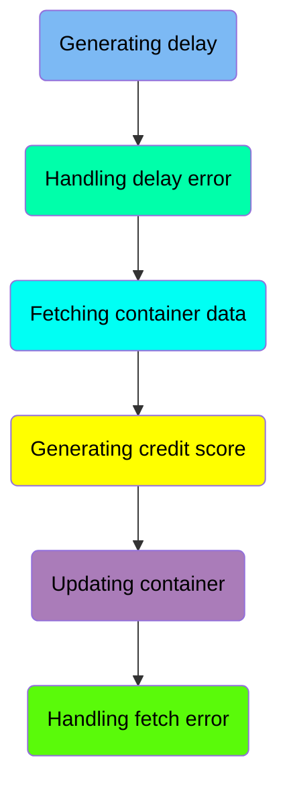
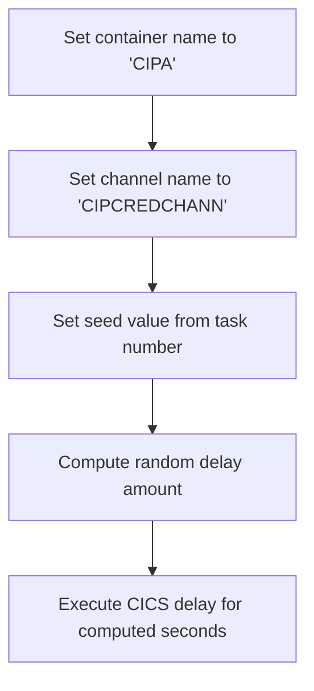
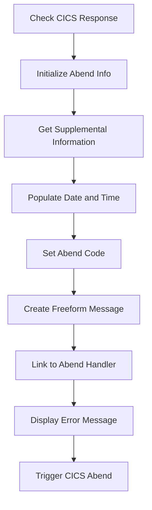
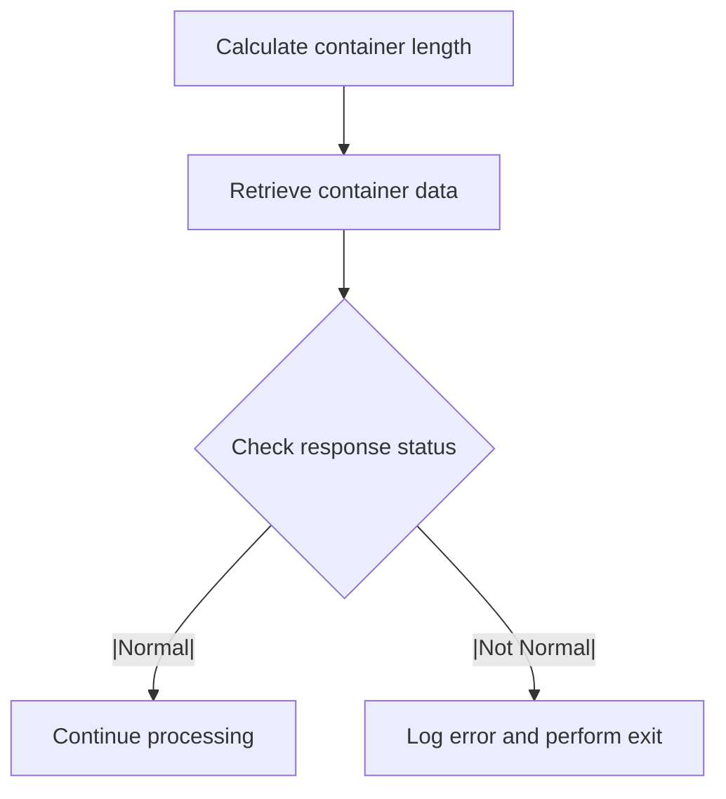
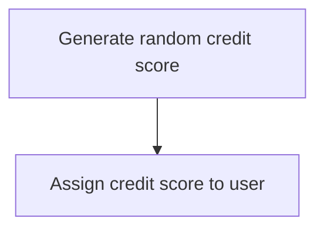
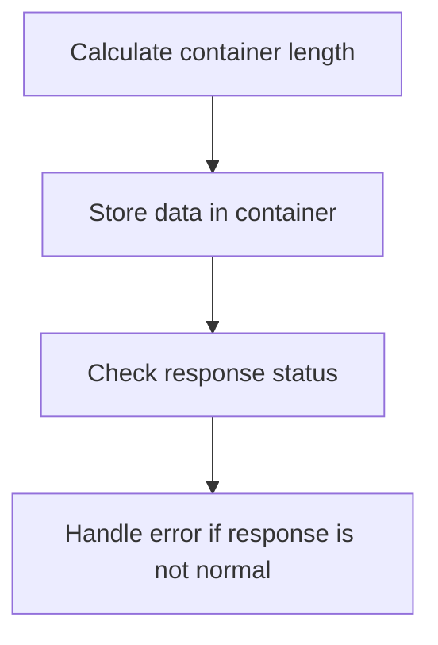
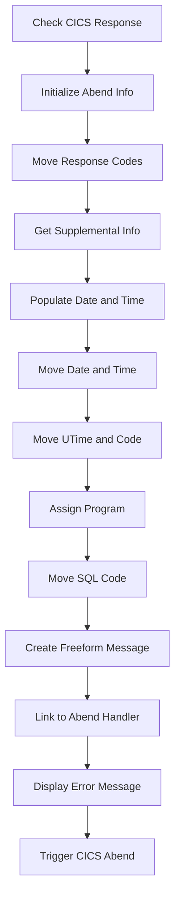

The <SwmToken path="src/base/cobol_src/CRDTAGY1.cbl" pos="201:4:4" line-data="              DISPLAY &#39;CRDTAGY1 - UNABLE TO GET CONTAINER. RESP=&#39;">`CRDTAGY1`</SwmToken> program is responsible for generating and managing delays within the system. This is achieved by setting container and channel names, computing random delay amounts, and handling errors that may occur during the delay process.

The flow involves setting up the container and channel names, computing a random delay amount, executing the delay, and handling any errors that arise during this process. Additionally, it includes fetching container data and managing errors related to this operation.

Here is a high level diagram of the program:



## Generating delay

First, we'll zoom into this section of the flow:



<SwmSnippet path="/src/base/cobol_src/CRDTAGY1.cbl" line="120">

---

First, the container name is set to 'CIPA' and the channel name is set to 'CIPCREDCHANN'. This establishes the context for the subsequent operations by defining where the data will be stored and through which channel it will be communicated.

```cobol
           MOVE 'CIPA            ' TO WS-CONTAINER-NAME.
           MOVE 'CIPCREDCHANN    ' TO WS-CHANNEL-NAME.
```

---

</SwmSnippet>

<SwmSnippet path="/src/base/cobol_src/CRDTAGY1.cbl" line="122">

---

Next, the task number is moved to the seed value, which is then used to compute a random delay amount between 1 and 3 seconds. This delay is introduced to simulate processing time variability. The CICS DELAY command is then executed for the computed number of seconds, ensuring that the system waits for the specified duration before proceeding.

```cobol
           MOVE EIBTASKN           TO WS-SEED.

           COMPUTE WS-DELAY-AMT = ((3 - 1)
                            * FUNCTION RANDOM(WS-SEED)) + 1.

           EXEC CICS DELAY
                FOR SECONDS(WS-DELAY-AMT)
                RESP(WS-CICS-RESP)
                RESP2(WS-CICS-RESP2)
           END-EXEC.
```

---

</SwmSnippet>

## Handling delay error

Now, lets zoom into this section of the flow:



<SwmSnippet path="/src/base/cobol_src/CRDTAGY1.cbl" line="133">

---

### Check CICS Response

First, we check if the CICS response code <SwmToken path="src/base/cobol_src/CRDTAGY1.cbl" pos="133:3:7" line-data="           IF WS-CICS-RESP NOT = DFHRESP(NORMAL)">`WS-CICS-RESP`</SwmToken> is not equal to <SwmToken path="src/base/cobol_src/CRDTAGY1.cbl" pos="133:13:16" line-data="           IF WS-CICS-RESP NOT = DFHRESP(NORMAL)">`DFHRESP(NORMAL)`</SwmToken>. This indicates that an abnormal condition has occurred.

```cobol
           IF WS-CICS-RESP NOT = DFHRESP(NORMAL)
```

---

</SwmSnippet>

<SwmSnippet path="/src/base/cobol_src/CRDTAGY1.cbl" line="140">

---

### Initialize Abend Info

Moving to the next step, we initialize the <SwmToken path="src/base/cobol_src/CRDTAGY1.cbl" pos="140:3:5" line-data="              INITIALIZE ABNDINFO-REC">`ABNDINFO-REC`</SwmToken> structure to store abend-related information. This ensures that all fields are set to their default values before we populate them with specific data.

```cobol
              INITIALIZE ABNDINFO-REC
```

---

</SwmSnippet>

<SwmSnippet path="/src/base/cobol_src/CRDTAGY1.cbl" line="146">

---

### Get Supplemental Information

Next, we gather supplemental information such as the application ID (<SwmToken path="src/base/cobol_src/CRDTAGY1.cbl" pos="146:7:7" line-data="              EXEC CICS ASSIGN APPLID(ABND-APPLID)">`APPLID`</SwmToken>), task number (<SwmToken path="src/base/cobol_src/CRDTAGY1.cbl" pos="149:3:3" line-data="              MOVE EIBTASKN   TO ABND-TASKNO-KEY">`EIBTASKN`</SwmToken>), and transaction ID (<SwmToken path="src/base/cobol_src/CRDTAGY1.cbl" pos="150:3:3" line-data="              MOVE EIBTRNID   TO ABND-TRANID">`EIBTRNID`</SwmToken>). This information is crucial for identifying the context in which the abend occurred.

```cobol
              EXEC CICS ASSIGN APPLID(ABND-APPLID)
              END-EXEC

              MOVE EIBTASKN   TO ABND-TASKNO-KEY
              MOVE EIBTRNID   TO ABND-TRANID

```

---

</SwmSnippet>

<SwmSnippet path="/src/base/cobol_src/CRDTAGY1.cbl" line="152">

---

### Populate Date and Time

Then, we call the <SwmToken path="src/base/cobol_src/CRDTAGY1.cbl" pos="152:3:7" line-data="              PERFORM POPULATE-TIME-DATE">`POPULATE-TIME-DATE`</SwmToken> routine to get the current date and time. This information is formatted and stored in the <SwmToken path="src/base/cobol_src/CRDTAGY1.cbl" pos="154:11:13" line-data="              MOVE WS-ORIG-DATE TO ABND-DATE">`ABND-DATE`</SwmToken> and <SwmToken path="src/base/cobol_src/CRDTAGY1.cbl" pos="160:3:5" line-data="                       INTO ABND-TIME">`ABND-TIME`</SwmToken> fields, providing a timestamp for the abend event.

```cobol
              PERFORM POPULATE-TIME-DATE

              MOVE WS-ORIG-DATE TO ABND-DATE
              STRING WS-TIME-NOW-GRP-HH DELIMITED BY SIZE,
                      ':' DELIMITED BY SIZE,
                       WS-TIME-NOW-GRP-MM DELIMITED BY SIZE,
                       ':' DELIMITED BY SIZE,
                       WS-TIME-NOW-GRP-MM DELIMITED BY SIZE
                       INTO ABND-TIME
```

---

</SwmSnippet>

<SwmSnippet path="/src/base/cobol_src/CRDTAGY1.cbl" line="164">

---

### Set Abend Code

We then set the abend code to 'PLOP' in the <SwmToken path="src/base/cobol_src/CRDTAGY1.cbl" pos="164:9:11" line-data="              MOVE &#39;PLOP&#39;      TO ABND-CODE">`ABND-CODE`</SwmToken> field. This code is used to identify the specific type of abend that occurred.

```cobol
              MOVE 'PLOP'      TO ABND-CODE
```

---

</SwmSnippet>

<SwmSnippet path="/src/base/cobol_src/CRDTAGY1.cbl" line="171">

---

### Create Freeform Message

Next, we create a freeform message that includes the abend description and response codes. This message is stored in the <SwmToken path="src/base/cobol_src/CRDTAGY1.cbl" pos="177:3:5" line-data="                      INTO ABND-FREEFORM">`ABND-FREEFORM`</SwmToken> field and provides a detailed explanation of the abend event.

```cobol
              STRING 'A010  - *** The delay messed up! ***'
                      DELIMITED BY SIZE,
                      ' EIBRESP=' DELIMITED BY SIZE,
                      ABND-RESPCODE DELIMITED BY SIZE,
                      ' RESP2=' DELIMITED BY SIZE,
                      ABND-RESP2CODE DELIMITED BY SIZE
                      INTO ABND-FREEFORM
```

---

</SwmSnippet>

<SwmSnippet path="/src/base/cobol_src/CRDTAGY1.cbl" line="180">

---

### Link to Abend Handler

Going into the next step, we link to the abend handler program (<SwmToken path="src/base/cobol_src/CRDTAGY1.cbl" pos="180:9:13" line-data="              EXEC CICS LINK PROGRAM(WS-ABEND-PGM)">`WS-ABEND-PGM`</SwmToken>) and pass the <SwmToken path="src/base/cobol_src/CRDTAGY1.cbl" pos="181:3:5" line-data="                          COMMAREA(ABNDINFO-REC)">`ABNDINFO-REC`</SwmToken> structure. This allows the abend handler to process the abend information and take appropriate actions.

More about ABNDPROC: <SwmLink doc-title="Handling Abnormal Terminations (ABNDPROC)">[Handling Abnormal Terminations (ABNDPROC)](/.swm/handling-abnormal-terminations-abndproc.q6kxvboz.sw.md)</SwmLink>

```cobol
              EXEC CICS LINK PROGRAM(WS-ABEND-PGM)
                          COMMAREA(ABNDINFO-REC)
              END-EXEC
```

---

</SwmSnippet>

<SwmSnippet path="/src/base/cobol_src/CRDTAGY1.cbl" line="184">

---

### Display Error Message and Trigger CICS Abend

Finally, we display an error message indicating that the delay caused an issue and trigger a CICS abend with the code 'PLOP'. This ensures that the abend is logged and appropriate recovery actions can be taken.

```cobol
              DISPLAY '*** The delay messed up ! ***'
              EXEC CICS ABEND
                 ABCODE('PLOP')
              END-EXEC
```

---

</SwmSnippet>

## Fetching container data

Now, lets zoom into this section of the flow:



<SwmSnippet path="/src/base/cobol_src/CRDTAGY1.cbl" line="190">

---

First, the code calculates the length of the container data by computing <SwmToken path="src/base/cobol_src/CRDTAGY1.cbl" pos="190:3:7" line-data="           COMPUTE WS-CONTAINER-LEN = LENGTH OF WS-CONT-IN.">`WS-CONTAINER-LEN`</SwmToken> (the length of <SwmToken path="src/base/cobol_src/CRDTAGY1.cbl" pos="190:15:19" line-data="           COMPUTE WS-CONTAINER-LEN = LENGTH OF WS-CONT-IN.">`WS-CONT-IN`</SwmToken>). This step is crucial as it determines the size of the data to be retrieved from the container.

```cobol
           COMPUTE WS-CONTAINER-LEN = LENGTH OF WS-CONT-IN.
```

---

</SwmSnippet>

<SwmSnippet path="/src/base/cobol_src/CRDTAGY1.cbl" line="192">

---

Next, the code retrieves the container data from the specified CICS channel using the <SwmToken path="src/base/cobol_src/CRDTAGY1.cbl" pos="192:1:7" line-data="           EXEC CICS GET CONTAINER(WS-CONTAINER-NAME)">`EXEC CICS GET CONTAINER`</SwmToken> command. This command fetches the data into <SwmToken path="src/base/cobol_src/CRDTAGY1.cbl" pos="194:3:7" line-data="                     INTO(WS-CONT-IN)">`WS-CONT-IN`</SwmToken> and stores the response codes in <SwmToken path="src/base/cobol_src/CRDTAGY1.cbl" pos="196:3:7" line-data="                     RESP(WS-CICS-RESP)">`WS-CICS-RESP`</SwmToken> and <SwmToken path="src/base/cobol_src/CRDTAGY1.cbl" pos="197:3:7" line-data="                     RESP2(WS-CICS-RESP2)">`WS-CICS-RESP2`</SwmToken>. If the response is not normal, it logs an error message with details about the container and channel, and then performs the <SwmToken path="src/base/cobol_src/CRDTAGY1.cbl" pos="206:3:11" line-data="              PERFORM GET-ME-OUT-OF-HERE">`GET-ME-OUT-OF-HERE`</SwmToken> routine to handle the error.

```cobol
           EXEC CICS GET CONTAINER(WS-CONTAINER-NAME)
                     CHANNEL(WS-CHANNEL-NAME)
                     INTO(WS-CONT-IN)
                     FLENGTH(WS-CONTAINER-LEN)
                     RESP(WS-CICS-RESP)
                     RESP2(WS-CICS-RESP2)
           END-EXEC.

           IF WS-CICS-RESP NOT = DFHRESP(NORMAL)
              DISPLAY 'CRDTAGY1 - UNABLE TO GET CONTAINER. RESP='
                 WS-CICS-RESP ', RESP2=' WS-CICS-RESP2
              DISPLAY 'CONTAINER=' WS-CONTAINER-NAME ' CHANNEL='
                       WS-CHANNEL-NAME ' FLENGTH='
                       WS-CONTAINER-LEN
              PERFORM GET-ME-OUT-OF-HERE
           END-IF.
```

---

</SwmSnippet>

## Interim Summary

So far, we saw how the program handles generating and managing delays, including setting container and channel names, computing random delay amounts, and handling errors that may occur during the delay process. We also covered how to fetch container data and handle any errors that arise during this process. Now, we will focus on generating credit scores, where the program computes and assigns a new credit score to the user.

## Generating credit score

This is the next section of the flow.



<SwmSnippet path="/src/base/cobol_src/CRDTAGY1.cbl" line="215">

---

First, we generate a new credit score for the user by computing a random number between 1 and 999. This is done using the <SwmToken path="src/base/cobol_src/CRDTAGY1.cbl" pos="215:1:1" line-data="           COMPUTE WS-NEW-CREDSCORE = ((999 - 1)">`COMPUTE`</SwmToken> statement which utilizes the <SwmToken path="src/base/cobol_src/CRDTAGY1.cbl" pos="216:5:5" line-data="                            * FUNCTION RANDOM) + 1.">`RANDOM`</SwmToken> function to ensure the score is within the specified range.

```cobol
           COMPUTE WS-NEW-CREDSCORE = ((999 - 1)
                            * FUNCTION RANDOM) + 1.
```

---

</SwmSnippet>

<SwmSnippet path="/src/base/cobol_src/CRDTAGY1.cbl" line="218">

---

Next, the newly generated credit score is assigned to the user's credit score field. This is achieved by moving the value from <SwmToken path="src/base/cobol_src/CRDTAGY1.cbl" pos="218:3:7" line-data="           MOVE WS-NEW-CREDSCORE TO WS-CONT-IN-CREDIT-SCORE.">`WS-NEW-CREDSCORE`</SwmToken> to <SwmToken path="src/base/cobol_src/CRDTAGY1.cbl" pos="218:11:19" line-data="           MOVE WS-NEW-CREDSCORE TO WS-CONT-IN-CREDIT-SCORE.">`WS-CONT-IN-CREDIT-SCORE`</SwmToken>, ensuring the user's record is updated with the new score.

```cobol
           MOVE WS-NEW-CREDSCORE TO WS-CONT-IN-CREDIT-SCORE.
```

---

</SwmSnippet>

## Updating container

Now, lets zoom into this section of the flow:



<SwmSnippet path="/src/base/cobol_src/CRDTAGY1.cbl" line="223">

---

### Calculating container length

First, the length of the data to be stored in the container is calculated and stored in <SwmToken path="src/base/cobol_src/CRDTAGY1.cbl" pos="223:3:7" line-data="           COMPUTE WS-CONTAINER-LEN = LENGTH OF WS-CONT-IN.">`WS-CONTAINER-LEN`</SwmToken>.

```cobol
           COMPUTE WS-CONTAINER-LEN = LENGTH OF WS-CONT-IN.
```

---

</SwmSnippet>

<SwmSnippet path="/src/base/cobol_src/CRDTAGY1.cbl" line="225">

---

### Storing data in container

Next, the data is stored in the specified CICS container using the <SwmToken path="src/base/cobol_src/CRDTAGY1.cbl" pos="225:5:7" line-data="           EXEC CICS PUT CONTAINER(WS-CONTAINER-NAME)">`PUT CONTAINER`</SwmToken> command. This command includes the container name, the data to be stored, the length of the data, and the channel name. The response codes are stored in <SwmToken path="src/base/cobol_src/CRDTAGY1.cbl" pos="229:3:7" line-data="                         RESP(WS-CICS-RESP)">`WS-CICS-RESP`</SwmToken> and <SwmToken path="src/base/cobol_src/CRDTAGY1.cbl" pos="230:3:7" line-data="                         RESP2(WS-CICS-RESP2)">`WS-CICS-RESP2`</SwmToken>.

```cobol
           EXEC CICS PUT CONTAINER(WS-CONTAINER-NAME)
                         FROM(WS-CONT-IN)
                         FLENGTH(WS-CONTAINER-LEN)
                         CHANNEL(WS-CHANNEL-NAME)
                         RESP(WS-CICS-RESP)
                         RESP2(WS-CICS-RESP2)
           END-EXEC.
```

---

</SwmSnippet>

## Handling fetch error

This is the next section of the flow.



<SwmSnippet path="/src/base/cobol_src/CRDTAGY1.cbl" line="133">

---

First, we check if the CICS response code <SwmToken path="src/base/cobol_src/CRDTAGY1.cbl" pos="133:3:7" line-data="           IF WS-CICS-RESP NOT = DFHRESP(NORMAL)">`WS-CICS-RESP`</SwmToken> is not equal to <SwmToken path="src/base/cobol_src/CRDTAGY1.cbl" pos="133:13:16" line-data="           IF WS-CICS-RESP NOT = DFHRESP(NORMAL)">`DFHRESP(NORMAL)`</SwmToken>, indicating an abnormal termination.

```cobol
           IF WS-CICS-RESP NOT = DFHRESP(NORMAL)
```

---

</SwmSnippet>

<SwmSnippet path="/src/base/cobol_src/CRDTAGY1.cbl" line="140">

---

Next, we initialize the <SwmToken path="src/base/cobol_src/CRDTAGY1.cbl" pos="140:3:5" line-data="              INITIALIZE ABNDINFO-REC">`ABNDINFO-REC`</SwmToken> structure to store abend (abnormal end) information.

```cobol
              INITIALIZE ABNDINFO-REC
```

---

</SwmSnippet>

<SwmSnippet path="/src/base/cobol_src/CRDTAGY1.cbl" line="141">

---

Then, we move the response codes <SwmToken path="src/base/cobol_src/CRDTAGY1.cbl" pos="141:3:3" line-data="              MOVE EIBRESP    TO ABND-RESPCODE">`EIBRESP`</SwmToken> and <SwmToken path="src/base/cobol_src/CRDTAGY1.cbl" pos="142:3:3" line-data="              MOVE EIBRESP2   TO ABND-RESP2CODE">`EIBRESP2`</SwmToken> into <SwmToken path="src/base/cobol_src/CRDTAGY1.cbl" pos="141:7:9" line-data="              MOVE EIBRESP    TO ABND-RESPCODE">`ABND-RESPCODE`</SwmToken> and <SwmToken path="src/base/cobol_src/CRDTAGY1.cbl" pos="142:7:9" line-data="              MOVE EIBRESP2   TO ABND-RESP2CODE">`ABND-RESP2CODE`</SwmToken> respectively to preserve the original response codes.

```cobol
              MOVE EIBRESP    TO ABND-RESPCODE
              MOVE EIBRESP2   TO ABND-RESP2CODE
```

---

</SwmSnippet>

<SwmSnippet path="/src/base/cobol_src/CRDTAGY1.cbl" line="146">

---

Moving to the next step, we assign the application ID to <SwmToken path="src/base/cobol_src/CRDTAGY1.cbl" pos="146:9:11" line-data="              EXEC CICS ASSIGN APPLID(ABND-APPLID)">`ABND-APPLID`</SwmToken> and move task and transaction IDs to <SwmToken path="src/base/cobol_src/CRDTAGY1.cbl" pos="149:7:11" line-data="              MOVE EIBTASKN   TO ABND-TASKNO-KEY">`ABND-TASKNO-KEY`</SwmToken> and <SwmToken path="src/base/cobol_src/CRDTAGY1.cbl" pos="150:7:9" line-data="              MOVE EIBTRNID   TO ABND-TRANID">`ABND-TRANID`</SwmToken> respectively.

```cobol
              EXEC CICS ASSIGN APPLID(ABND-APPLID)
              END-EXEC

              MOVE EIBTASKN   TO ABND-TASKNO-KEY
              MOVE EIBTRNID   TO ABND-TRANID

```

---

</SwmSnippet>

<SwmSnippet path="/src/base/cobol_src/CRDTAGY1.cbl" line="152">

---

We then perform the <SwmToken path="src/base/cobol_src/CRDTAGY1.cbl" pos="152:3:7" line-data="              PERFORM POPULATE-TIME-DATE">`POPULATE-TIME-DATE`</SwmToken> routine to get the current date and time, and move these values into <SwmToken path="src/base/cobol_src/CRDTAGY1.cbl" pos="154:11:13" line-data="              MOVE WS-ORIG-DATE TO ABND-DATE">`ABND-DATE`</SwmToken> and <SwmToken path="src/base/cobol_src/CRDTAGY1.cbl" pos="160:3:5" line-data="                       INTO ABND-TIME">`ABND-TIME`</SwmToken>.

```cobol
              PERFORM POPULATE-TIME-DATE

              MOVE WS-ORIG-DATE TO ABND-DATE
              STRING WS-TIME-NOW-GRP-HH DELIMITED BY SIZE,
                      ':' DELIMITED BY SIZE,
                       WS-TIME-NOW-GRP-MM DELIMITED BY SIZE,
                       ':' DELIMITED BY SIZE,
                       WS-TIME-NOW-GRP-MM DELIMITED BY SIZE
                       INTO ABND-TIME
```

---

</SwmSnippet>

<SwmSnippet path="/src/base/cobol_src/CRDTAGY1.cbl" line="163">

---

Next, we move the user time <SwmToken path="src/base/cobol_src/CRDTAGY1.cbl" pos="163:3:7" line-data="              MOVE WS-U-TIME   TO ABND-UTIME-KEY">`WS-U-TIME`</SwmToken> and the code 'PLOP' into <SwmToken path="src/base/cobol_src/CRDTAGY1.cbl" pos="163:11:15" line-data="              MOVE WS-U-TIME   TO ABND-UTIME-KEY">`ABND-UTIME-KEY`</SwmToken> and <SwmToken path="src/base/cobol_src/CRDTAGY1.cbl" pos="164:9:11" line-data="              MOVE &#39;PLOP&#39;      TO ABND-CODE">`ABND-CODE`</SwmToken> respectively.

```cobol
              MOVE WS-U-TIME   TO ABND-UTIME-KEY
              MOVE 'PLOP'      TO ABND-CODE

```

---

</SwmSnippet>

<SwmSnippet path="/src/base/cobol_src/CRDTAGY1.cbl" line="166">

---

We assign the current program name to <SwmToken path="src/base/cobol_src/CRDTAGY1.cbl" pos="166:9:11" line-data="              EXEC CICS ASSIGN PROGRAM(ABND-PROGRAM)">`ABND-PROGRAM`</SwmToken> and set <SwmToken path="src/base/cobol_src/CRDTAGY1.cbl" pos="169:7:9" line-data="              MOVE ZEROS      TO ABND-SQLCODE">`ABND-SQLCODE`</SwmToken> to zero.

```cobol
              EXEC CICS ASSIGN PROGRAM(ABND-PROGRAM)
              END-EXEC

              MOVE ZEROS      TO ABND-SQLCODE
```

---

</SwmSnippet>

<SwmSnippet path="/src/base/cobol_src/CRDTAGY1.cbl" line="171">

---

Finally, we create a freeform message detailing the error, link to the abend handler program, display an error message, and trigger a CICS abend with the code 'PLOP'.

```cobol
              STRING 'A010  - *** The delay messed up! ***'
                      DELIMITED BY SIZE,
                      ' EIBRESP=' DELIMITED BY SIZE,
                      ABND-RESPCODE DELIMITED BY SIZE,
                      ' RESP2=' DELIMITED BY SIZE,
                      ABND-RESP2CODE DELIMITED BY SIZE
                      INTO ABND-FREEFORM
              END-STRING

              EXEC CICS LINK PROGRAM(WS-ABEND-PGM)
                          COMMAREA(ABNDINFO-REC)
              END-EXEC

              DISPLAY '*** The delay messed up ! ***'
              EXEC CICS ABEND
                 ABCODE('PLOP')
              END-EXEC
```

---

</SwmSnippet>

&nbsp;

*This is an auto-generated document by Swimm 🌊 and has not yet been verified by a human*

<SwmMeta version="3.0.0" repo-id="Z2l0aHViJTNBJTNBY2ljcy1iYW5raW5nLXNhbXBsZS1hcHBsaWNhdGlvbi1jYnNhLUlCTS1EZW1vJTNBJTNBU3dpbW0tRGVtbw==" repo-name="cics-banking-sample-application-cbsa-IBM-Demo"><sup>Powered by [Swimm](/)</sup></SwmMeta>
