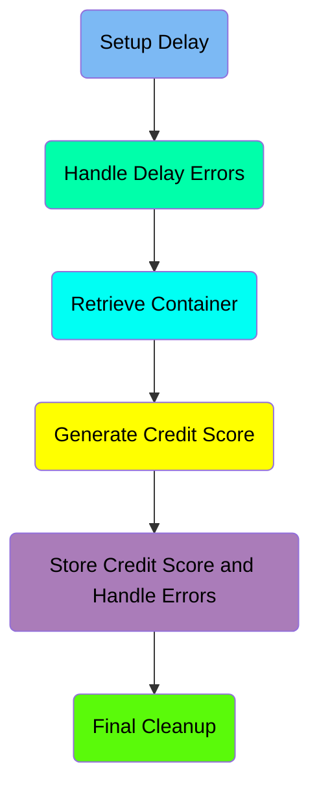
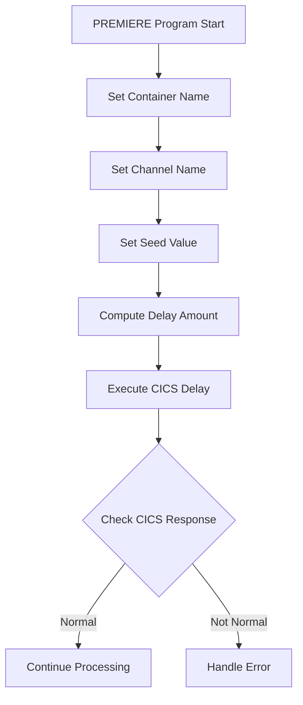
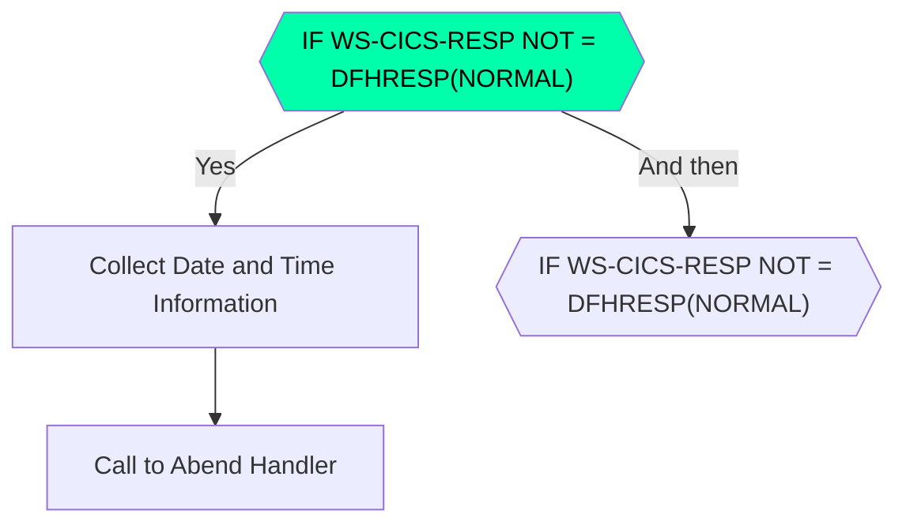
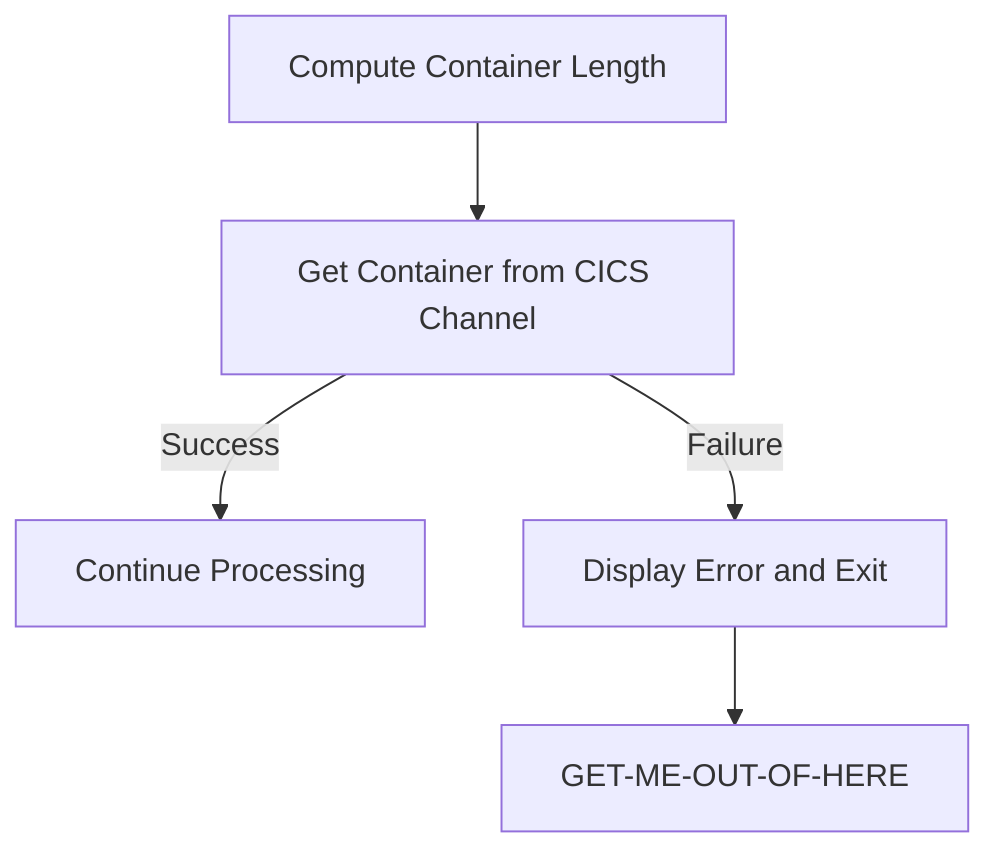
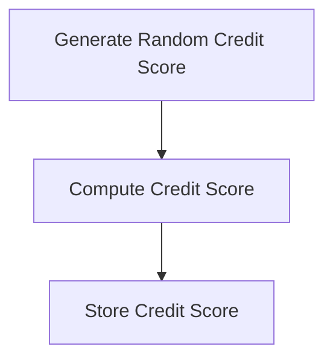
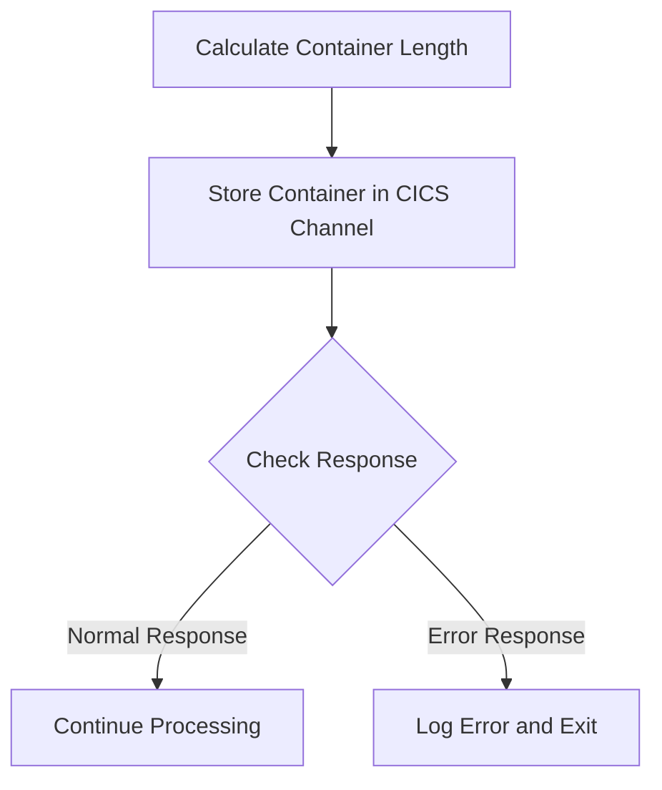
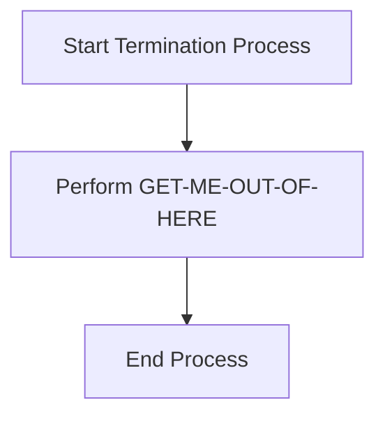

The <SwmToken path="src/base/cobol_src/CRDTAGY2.cbl" pos="202:4:4" line-data="              DISPLAY &#39;CRDTAGY2 - UNABLE TO GET CONTAINER. RESP=&#39;">`CRDTAGY2`</SwmToken> program is responsible for generating and storing credit scores in a simulated banking application. The program achieves this by setting up a delay, handling errors, retrieving and storing data in CICS containers, and performing final cleanup operations.

The flow starts with setting up a delay to simulate real-world processing time. If any errors occur during this delay, they are handled appropriately. Next, the program retrieves data from a CICS container, generates a random credit score, and stores this score back in the container. Finally, the program performs cleanup operations to ensure all resources are released and the process is safely terminated.

Here is a high level diagram of the program:



# Setup Delay



<SwmSnippet path="/src/base/cobol_src/CRDTAGY2.cbl" line="119">

---

## Setting Container and Channel Names

First, the container name and channel name are set to 'CIPB' and 'CIPCREDCHANN' respectively. This is essential for identifying the data and communication channel used in subsequent operations.

```cobol
           MOVE 'CIPB            ' TO WS-CONTAINER-NAME.
           MOVE 'CIPCREDCHANN    ' TO WS-CHANNEL-NAME.
```

---

</SwmSnippet>

<SwmSnippet path="/src/base/cobol_src/CRDTAGY2.cbl" line="121">

---

## Setting Seed Value

Next, the seed value for the random number generator is set using the task number (<SwmToken path="src/base/cobol_src/CRDTAGY2.cbl" pos="121:3:3" line-data="           MOVE EIBTASKN           TO WS-SEED.">`EIBTASKN`</SwmToken>). This ensures that the delay amount is varied for each task.

```cobol
           MOVE EIBTASKN           TO WS-SEED.
```

---

</SwmSnippet>

<SwmSnippet path="/src/base/cobol_src/CRDTAGY2.cbl" line="123">

---

## Computing Delay Amount

Then, a random delay amount between 1 and 3 seconds is computed. This simulates a real-world delay in processing.

```cobol
           COMPUTE WS-DELAY-AMT = ((3 - 1)
                            * FUNCTION RANDOM(WS-SEED)) + 1.
```

---

</SwmSnippet>

<SwmSnippet path="/src/base/cobol_src/CRDTAGY2.cbl" line="126">

---

## Executing CICS Delay

The computed delay amount is then used to execute a CICS delay command. This introduces the actual delay in the program's execution.

```cobol
           EXEC CICS DELAY
                FOR SECONDS(WS-DELAY-AMT)
                RESP(WS-CICS-RESP)
                RESP2(WS-CICS-RESP2)
           END-EXEC.
```

---

</SwmSnippet>

<SwmSnippet path="/src/base/cobol_src/CRDTAGY2.cbl" line="132">

---

## Checking CICS Response

Finally, the response from the CICS delay command is checked. If the response is not normal, error handling procedures are initiated.

```cobol
           IF WS-CICS-RESP NOT = DFHRESP(NORMAL)
```

---

</SwmSnippet>

# Handle Delay Errors



<SwmSnippet path="/src/base/cobol_src/CRDTAGY2.cbl" line="132">

---

## Checking CICS Response

First, the code checks if the CICS response code (<SwmToken path="src/base/cobol_src/CRDTAGY2.cbl" pos="132:3:7" line-data="           IF WS-CICS-RESP NOT = DFHRESP(NORMAL)">`WS-CICS-RESP`</SwmToken>) is not equal to <SwmToken path="src/base/cobol_src/CRDTAGY2.cbl" pos="132:13:16" line-data="           IF WS-CICS-RESP NOT = DFHRESP(NORMAL)">`DFHRESP(NORMAL)`</SwmToken>. This indicates that an error has occurred and further error handling is required.

```cobol
           IF WS-CICS-RESP NOT = DFHRESP(NORMAL)
```

---

</SwmSnippet>

<SwmSnippet path="/src/base/cobol_src/CRDTAGY2.cbl" line="139">

---

## Initializing Error Information

Next, the code initializes the <SwmToken path="src/base/cobol_src/CRDTAGY2.cbl" pos="139:3:5" line-data="              INITIALIZE ABNDINFO-REC">`ABNDINFO-REC`</SwmToken> record and moves the response codes (<SwmToken path="src/base/cobol_src/CRDTAGY2.cbl" pos="140:3:3" line-data="              MOVE EIBRESP    TO ABND-RESPCODE">`EIBRESP`</SwmToken> and <SwmToken path="src/base/cobol_src/CRDTAGY2.cbl" pos="141:3:3" line-data="              MOVE EIBRESP2   TO ABND-RESP2CODE">`EIBRESP2`</SwmToken>) into the <SwmToken path="src/base/cobol_src/CRDTAGY2.cbl" pos="140:7:9" line-data="              MOVE EIBRESP    TO ABND-RESPCODE">`ABND-RESPCODE`</SwmToken> and <SwmToken path="src/base/cobol_src/CRDTAGY2.cbl" pos="141:7:9" line-data="              MOVE EIBRESP2   TO ABND-RESP2CODE">`ABND-RESP2CODE`</SwmToken> fields respectively. This step is crucial for preserving the error information.

```cobol
              INITIALIZE ABNDINFO-REC
              MOVE EIBRESP    TO ABND-RESPCODE
              MOVE EIBRESP2   TO ABND-RESP2CODE
```

---

</SwmSnippet>

<SwmSnippet path="/src/base/cobol_src/CRDTAGY2.cbl" line="145">

---

## Collecting Supplemental Information

Then, the code collects additional information such as the application ID (<SwmToken path="src/base/cobol_src/CRDTAGY2.cbl" pos="145:7:7" line-data="              EXEC CICS ASSIGN APPLID(ABND-APPLID)">`APPLID`</SwmToken>), task number (<SwmToken path="src/base/cobol_src/CRDTAGY2.cbl" pos="148:3:3" line-data="              MOVE EIBTASKN   TO ABND-TASKNO-KEY">`EIBTASKN`</SwmToken>), and transaction ID (<SwmToken path="src/base/cobol_src/CRDTAGY2.cbl" pos="149:3:3" line-data="              MOVE EIBTRNID   TO ABND-TRANID">`EIBTRNID`</SwmToken>). This information is essential for diagnosing the error.

```cobol
              EXEC CICS ASSIGN APPLID(ABND-APPLID)
              END-EXEC

              MOVE EIBTASKN   TO ABND-TASKNO-KEY
              MOVE EIBTRNID   TO ABND-TRANID
```

---

</SwmSnippet>

<SwmSnippet path="/src/base/cobol_src/CRDTAGY2.cbl" line="151">

---

## Populating Date and Time

Moving to the next step, the code performs the <SwmToken path="src/base/cobol_src/CRDTAGY2.cbl" pos="151:3:7" line-data="              PERFORM POPULATE-TIME-DATE">`POPULATE-TIME-DATE`</SwmToken> routine to gather the current date and time.

```cobol
              PERFORM POPULATE-TIME-DATE
```

---

</SwmSnippet>

<SwmSnippet path="/src/base/cobol_src/CRDTAGY2.cbl" line="258">

---

### Collecting Date and Time Information

The <SwmToken path="src/base/cobol_src/CRDTAGY2.cbl" pos="258:1:5" line-data="       POPULATE-TIME-DATE SECTION.">`POPULATE-TIME-DATE`</SwmToken> routine uses CICS commands to get the current time (<SwmToken path="src/base/cobol_src/CRDTAGY2.cbl" pos="261:5:5" line-data="           EXEC CICS ASKTIME">`ASKTIME`</SwmToken>) and format it (<SwmToken path="src/base/cobol_src/CRDTAGY2.cbl" pos="265:5:5" line-data="           EXEC CICS FORMATTIME">`FORMATTIME`</SwmToken>). This information is stored in <SwmToken path="src/base/cobol_src/CRDTAGY2.cbl" pos="262:3:7" line-data="              ABSTIME(WS-U-TIME)">`WS-U-TIME`</SwmToken>, <SwmToken path="src/base/cobol_src/CRDTAGY2.cbl" pos="267:3:7" line-data="                     DDMMYYYY(WS-ORIG-DATE)">`WS-ORIG-DATE`</SwmToken>, and <SwmToken path="src/base/cobol_src/CRDTAGY2.cbl" pos="268:3:7" line-data="                     TIME(WS-TIME-NOW)">`WS-TIME-NOW`</SwmToken>.

```cobol
       POPULATE-TIME-DATE SECTION.
       PTD010.

           EXEC CICS ASKTIME
              ABSTIME(WS-U-TIME)
           END-EXEC.

           EXEC CICS FORMATTIME
                     ABSTIME(WS-U-TIME)
                     DDMMYYYY(WS-ORIG-DATE)
                     TIME(WS-TIME-NOW)
                     DATESEP
           END-EXEC.

       PTD999.
           EXIT.
```

---

</SwmSnippet>

<SwmSnippet path="/src/base/cobol_src/CRDTAGY2.cbl" line="153">

---

## Formatting Date and Time

Next, the code moves the collected date and time into the <SwmToken path="src/base/cobol_src/CRDTAGY2.cbl" pos="153:11:13" line-data="              MOVE WS-ORIG-DATE TO ABND-DATE">`ABND-DATE`</SwmToken> and <SwmToken path="src/base/cobol_src/CRDTAGY2.cbl" pos="159:3:5" line-data="                       INTO ABND-TIME">`ABND-TIME`</SwmToken> fields. This step ensures that the error record includes accurate timestamp information.

```cobol
              MOVE WS-ORIG-DATE TO ABND-DATE
              STRING WS-TIME-NOW-GRP-HH DELIMITED BY SIZE,
                      ':' DELIMITED BY SIZE,
                       WS-TIME-NOW-GRP-MM DELIMITED BY SIZE,
                       ':' DELIMITED BY SIZE,
                       WS-TIME-NOW-GRP-MM DELIMITED BY SIZE
                       INTO ABND-TIME
```

---

</SwmSnippet>

<SwmSnippet path="/src/base/cobol_src/CRDTAGY2.cbl" line="165">

---

## Assigning Program Information

Then, the code assigns the current program name to <SwmToken path="src/base/cobol_src/CRDTAGY2.cbl" pos="165:9:11" line-data="              EXEC CICS ASSIGN PROGRAM(ABND-PROGRAM)">`ABND-PROGRAM`</SwmToken>. This helps in identifying which program was executing when the error occurred.

```cobol
              EXEC CICS ASSIGN PROGRAM(ABND-PROGRAM)
              END-EXEC
```

---

</SwmSnippet>

<SwmSnippet path="/src/base/cobol_src/CRDTAGY2.cbl" line="170">

---

## Creating Freeform Error Message

The code constructs a freeform error message that includes the response codes. This message is stored in <SwmToken path="src/base/cobol_src/CRDTAGY2.cbl" pos="176:3:5" line-data="                      INTO ABND-FREEFORM">`ABND-FREEFORM`</SwmToken> and provides a human-readable description of the error.

```cobol
              STRING 'A010  - *** The delay messed up! ***'
                      DELIMITED BY SIZE,
                      ' EIBRESP=' DELIMITED BY SIZE,
                      ABND-RESPCODE DELIMITED BY SIZE,
                      ' RESP2=' DELIMITED BY SIZE,
                      ABND-RESP2CODE DELIMITED BY SIZE
                      INTO ABND-FREEFORM
```

---

</SwmSnippet>

<SwmSnippet path="/src/base/cobol_src/CRDTAGY2.cbl" line="179">

---

## Linking to Abend Handler

Finally, the code links to the Abend Handler program (<SwmToken path="src/base/cobol_src/CRDTAGY2.cbl" pos="179:9:13" line-data="              EXEC CICS LINK PROGRAM(WS-ABEND-PGM)">`WS-ABEND-PGM`</SwmToken>) and passes the <SwmToken path="src/base/cobol_src/CRDTAGY2.cbl" pos="180:3:5" line-data="                          COMMAREA(ABNDINFO-REC)">`ABNDINFO-REC`</SwmToken> record. This step initiates the abend processing to handle the error.

```cobol
              EXEC CICS LINK PROGRAM(WS-ABEND-PGM)
                          COMMAREA(ABNDINFO-REC)
              END-EXEC
```

---

</SwmSnippet>

<SwmSnippet path="/src/base/cobol_src/CRDTAGY2.cbl" line="184">

---

## Displaying Error Message and Abending

The code displays an error message and then abends the transaction with the code 'PLOP'. This ensures that the error is logged and the transaction is terminated gracefully.

```cobol
              DISPLAY '*** The delay messed up ! ***'
              EXEC CICS ABEND
                 ABCODE('PLOP')
              END-EXEC
```

---

</SwmSnippet>

## Interim Summary

So far, we saw how the program handles setting up the delay, computing the delay amount, executing the CICS delay, and handling any errors that occur during this process. Now, we will focus on retrieving the container from the CICS channel and handling any errors that may arise during this operation.

# Retrieve Container



<SwmSnippet path="/src/base/cobol_src/CRDTAGY2.cbl" line="191">

---

## Compute Container Length

First, the length of the container is computed and stored in <SwmToken path="src/base/cobol_src/CRDTAGY2.cbl" pos="191:3:7" line-data="           COMPUTE WS-CONTAINER-LEN = LENGTH OF WS-CONT-IN.">`WS-CONTAINER-LEN`</SwmToken>. This is necessary to allocate the correct amount of memory for the container data.

```cobol
           COMPUTE WS-CONTAINER-LEN = LENGTH OF WS-CONT-IN.
```

---

</SwmSnippet>

<SwmSnippet path="/src/base/cobol_src/CRDTAGY2.cbl" line="193">

---

## Get Container from CICS Channel

Next, the code retrieves the container from the CICS channel using the <SwmToken path="src/base/cobol_src/CRDTAGY2.cbl" pos="193:1:7" line-data="           EXEC CICS GET CONTAINER(WS-CONTAINER-NAME)">`EXEC CICS GET CONTAINER`</SwmToken> command. The container name and channel name are specified, and the data is stored in <SwmToken path="src/base/cobol_src/CRDTAGY2.cbl" pos="195:3:7" line-data="                     INTO(WS-CONT-IN)">`WS-CONT-IN`</SwmToken>. The response codes are stored in <SwmToken path="src/base/cobol_src/CRDTAGY2.cbl" pos="197:3:7" line-data="                     RESP(WS-CICS-RESP)">`WS-CICS-RESP`</SwmToken> and <SwmToken path="src/base/cobol_src/CRDTAGY2.cbl" pos="198:3:7" line-data="                     RESP2(WS-CICS-RESP2)">`WS-CICS-RESP2`</SwmToken>.

```cobol
           EXEC CICS GET CONTAINER(WS-CONTAINER-NAME)
                     CHANNEL(WS-CHANNEL-NAME)
                     INTO(WS-CONT-IN)
                     FLENGTH(WS-CONTAINER-LEN)
                     RESP(WS-CICS-RESP)
                     RESP2(WS-CICS-RESP2)
           END-EXEC.
```

---

</SwmSnippet>

<SwmSnippet path="/src/base/cobol_src/CRDTAGY2.cbl" line="201">

---

## Check Response and Handle Errors

Then, the response code <SwmToken path="src/base/cobol_src/CRDTAGY2.cbl" pos="201:3:7" line-data="           IF WS-CICS-RESP NOT = DFHRESP(NORMAL)">`WS-CICS-RESP`</SwmToken> is checked to see if it is not equal to <SwmToken path="src/base/cobol_src/CRDTAGY2.cbl" pos="201:13:16" line-data="           IF WS-CICS-RESP NOT = DFHRESP(NORMAL)">`DFHRESP(NORMAL)`</SwmToken>. If the response indicates an error, an error message is displayed with details about the container and channel, and the <SwmToken path="src/base/cobol_src/CRDTAGY2.cbl" pos="207:3:11" line-data="              PERFORM GET-ME-OUT-OF-HERE">`GET-ME-OUT-OF-HERE`</SwmToken> section is performed to handle the error and exit the process.

```cobol
           IF WS-CICS-RESP NOT = DFHRESP(NORMAL)
              DISPLAY 'CRDTAGY2 - UNABLE TO GET CONTAINER. RESP='
                 WS-CICS-RESP ', RESP2=' WS-CICS-RESP2
              DISPLAY 'CONTAINER=' WS-CONTAINER-NAME ' CHANNEL='
                       WS-CHANNEL-NAME ' FLENGTH='
                       WS-CONTAINER-LEN
              PERFORM GET-ME-OUT-OF-HERE
           END-IF.
```

---

</SwmSnippet>

<SwmSnippet path="/src/base/cobol_src/CRDTAGY2.cbl" line="248">

---

### <SwmToken path="src/base/cobol_src/CRDTAGY2.cbl" pos="248:1:9" line-data="       GET-ME-OUT-OF-HERE SECTION.">`GET-ME-OUT-OF-HERE`</SwmToken>

The <SwmToken path="src/base/cobol_src/CRDTAGY2.cbl" pos="248:1:9" line-data="       GET-ME-OUT-OF-HERE SECTION.">`GET-ME-OUT-OF-HERE`</SwmToken> section handles the error by executing the <SwmToken path="src/base/cobol_src/CRDTAGY2.cbl" pos="251:3:5" line-data="           EXEC CICS RETURN">`CICS RETURN`</SwmToken> command, which ends the current task and returns control to CICS.

```cobol
       GET-ME-OUT-OF-HERE SECTION.
       GMOFH010.

           EXEC CICS RETURN
           END-EXEC.

       GMOFH999.
           EXIT.
```

---

</SwmSnippet>

# Generate Credit Score

This is the next section of the flow.



<SwmSnippet path="/src/base/cobol_src/CRDTAGY2.cbl" line="210">

---

## Generate Random Credit Score

First, we generate a random credit score between 1 and 999. The use of a SEED in the initial RANDOM function ensures that subsequent calls to RANDOM will produce a different value each time.

```cobol
      *    Now generate a credit score between 1 and 999. Because we
      *    used a SEED on the first RANDOM (above) we don't need to
      *    use a SEED again when using RANDOM for a subsequent time
      *
```

---

</SwmSnippet>

<SwmSnippet path="/src/base/cobol_src/CRDTAGY2.cbl" line="215">

---

## Compute Credit Score

Next, we compute the new credit score using the formula `((`<SwmToken path="src/base/cobol_src/CRDTAGY2.cbl" pos="215:13:13" line-data="           COMPUTE WS-NEW-CREDSCORE = ((999 - 1)">`999`</SwmToken>` - 1) * `<SwmToken path="src/base/cobol_src/CRDTAGY2.cbl" pos="216:3:3" line-data="                            * FUNCTION RANDOM) + 1.">`FUNCTION`</SwmToken>` `<SwmToken path="src/base/cobol_src/CRDTAGY2.cbl" pos="216:5:5" line-data="                            * FUNCTION RANDOM) + 1.">`RANDOM`</SwmToken>`) + 1`. This ensures the credit score falls within the desired range of 1 to 999.

```cobol
           COMPUTE WS-NEW-CREDSCORE = ((999 - 1)
                            * FUNCTION RANDOM) + 1.
```

---

</SwmSnippet>

<SwmSnippet path="/src/base/cobol_src/CRDTAGY2.cbl" line="218">

---

## Store Credit Score

Then, we store the newly computed credit score in <SwmToken path="src/base/cobol_src/CRDTAGY2.cbl" pos="218:11:19" line-data="           MOVE WS-NEW-CREDSCORE TO WS-CONT-IN-CREDIT-SCORE.">`WS-CONT-IN-CREDIT-SCORE`</SwmToken> for further processing or storage.

```cobol
           MOVE WS-NEW-CREDSCORE TO WS-CONT-IN-CREDIT-SCORE.
```

---

</SwmSnippet>

# Store Credit Score and Handle Errors



<SwmSnippet path="/src/base/cobol_src/CRDTAGY2.cbl" line="223">

---

## Calculate Container Length

First, the length of the container data (<SwmToken path="src/base/cobol_src/CRDTAGY2.cbl" pos="223:15:19" line-data="           COMPUTE WS-CONTAINER-LEN = LENGTH OF WS-CONT-IN.">`WS-CONT-IN`</SwmToken>) is calculated and stored in <SwmToken path="src/base/cobol_src/CRDTAGY2.cbl" pos="223:3:7" line-data="           COMPUTE WS-CONTAINER-LEN = LENGTH OF WS-CONT-IN.">`WS-CONTAINER-LEN`</SwmToken>. This length is necessary for the subsequent step where the container data is stored in the CICS channel.

```cobol
           COMPUTE WS-CONTAINER-LEN = LENGTH OF WS-CONT-IN.
```

---

</SwmSnippet>

<SwmSnippet path="/src/base/cobol_src/CRDTAGY2.cbl" line="225">

---

## Store Container in CICS Channel

Next, the container data (<SwmToken path="src/base/cobol_src/CRDTAGY2.cbl" pos="226:3:7" line-data="                         FROM(WS-CONT-IN)">`WS-CONT-IN`</SwmToken>) is stored in the CICS channel using the <SwmToken path="src/base/cobol_src/CRDTAGY2.cbl" pos="225:5:7" line-data="           EXEC CICS PUT CONTAINER(WS-CONTAINER-NAME)">`PUT CONTAINER`</SwmToken> command. The container name (<SwmToken path="src/base/cobol_src/CRDTAGY2.cbl" pos="225:9:13" line-data="           EXEC CICS PUT CONTAINER(WS-CONTAINER-NAME)">`WS-CONTAINER-NAME`</SwmToken>), the length of the data (<SwmToken path="src/base/cobol_src/CRDTAGY2.cbl" pos="227:3:7" line-data="                         FLENGTH(WS-CONTAINER-LEN)">`WS-CONTAINER-LEN`</SwmToken>), and the channel name (<SwmToken path="src/base/cobol_src/CRDTAGY2.cbl" pos="228:3:7" line-data="                         CHANNEL(WS-CHANNEL-NAME)">`WS-CHANNEL-NAME`</SwmToken>) are specified. The response codes (<SwmToken path="src/base/cobol_src/CRDTAGY2.cbl" pos="229:3:7" line-data="                         RESP(WS-CICS-RESP)">`WS-CICS-RESP`</SwmToken> and <SwmToken path="src/base/cobol_src/CRDTAGY2.cbl" pos="230:3:7" line-data="                         RESP2(WS-CICS-RESP2)">`WS-CICS-RESP2`</SwmToken>) are also captured to check if the operation was successful.

```cobol
           EXEC CICS PUT CONTAINER(WS-CONTAINER-NAME)
                         FROM(WS-CONT-IN)
                         FLENGTH(WS-CONTAINER-LEN)
                         CHANNEL(WS-CHANNEL-NAME)
                         RESP(WS-CICS-RESP)
                         RESP2(WS-CICS-RESP2)
           END-EXEC.
```

---

</SwmSnippet>

<SwmSnippet path="/src/base/cobol_src/CRDTAGY2.cbl" line="233">

---

## Check Response

Then, the response code (<SwmToken path="src/base/cobol_src/CRDTAGY2.cbl" pos="233:3:7" line-data="           IF WS-CICS-RESP NOT = DFHRESP(NORMAL)">`WS-CICS-RESP`</SwmToken>) is checked to determine if the <SwmToken path="src/base/cobol_src/CRDTAGY2.cbl" pos="234:12:14" line-data="              DISPLAY &#39;CRDTAGY2 - UNABLE TO PUT CONTAINER. RESP=&#39;">`PUT CONTAINER`</SwmToken> operation was successful. If the response is not normal (<SwmToken path="src/base/cobol_src/CRDTAGY2.cbl" pos="233:13:16" line-data="           IF WS-CICS-RESP NOT = DFHRESP(NORMAL)">`DFHRESP(NORMAL)`</SwmToken>), an error message is displayed with the response codes and container details. The <SwmToken path="src/base/cobol_src/CRDTAGY2.cbl" pos="239:3:11" line-data="              PERFORM GET-ME-OUT-OF-HERE">`GET-ME-OUT-OF-HERE`</SwmToken> routine is performed to handle the error and exit the process.

```cobol
           IF WS-CICS-RESP NOT = DFHRESP(NORMAL)
              DISPLAY 'CRDTAGY2 - UNABLE TO PUT CONTAINER. RESP='
                 WS-CICS-RESP ', RESP2=' WS-CICS-RESP2
              DISPLAY  'CONTAINER='  WS-CONTAINER-NAME
              ' CHANNEL=' WS-CHANNEL-NAME ' FLENGTH='
                    WS-CONTAINER-LEN
              PERFORM GET-ME-OUT-OF-HERE
           END-IF.
```

---

</SwmSnippet>

# Final Cleanup

This is the next section of the flow.



<SwmSnippet path="/src/base/cobol_src/CRDTAGY2.cbl" line="242">

---

## Start Termination Process

First, the termination process is initiated by performing the <SwmToken path="src/base/cobol_src/CRDTAGY2.cbl" pos="242:3:11" line-data="           PERFORM GET-ME-OUT-OF-HERE.">`GET-ME-OUT-OF-HERE`</SwmToken> routine. This routine is responsible for handling the necessary steps to safely terminate the current process.

```cobol
           PERFORM GET-ME-OUT-OF-HERE.

       A999.
           EXIT.
```

---

</SwmSnippet>

<SwmSnippet path="/src/base/cobol_src/CRDTAGY2.cbl" line="242">

---

## Perform <SwmToken path="src/base/cobol_src/CRDTAGY2.cbl" pos="242:3:11" line-data="           PERFORM GET-ME-OUT-OF-HERE.">`GET-ME-OUT-OF-HERE`</SwmToken>

Next, the <SwmToken path="src/base/cobol_src/CRDTAGY2.cbl" pos="242:3:11" line-data="           PERFORM GET-ME-OUT-OF-HERE.">`GET-ME-OUT-OF-HERE`</SwmToken> routine is executed. This routine ensures that all necessary cleanup operations are performed, such as closing files, releasing resources, and updating any relevant status indicators.

```cobol
           PERFORM GET-ME-OUT-OF-HERE.

       A999.
           EXIT.
```

---

</SwmSnippet>

<SwmSnippet path="/src/base/cobol_src/CRDTAGY2.cbl" line="244">

---

## End Process

Finally, the process reaches the <SwmToken path="src/base/cobol_src/CRDTAGY2.cbl" pos="244:1:1" line-data="       A999.">`A999`</SwmToken> label, which signifies the end of the termination process. At this point, the process is considered safely terminated, and control is returned to the calling program or the operating system.

```cobol
       A999.
           EXIT.
```

---

</SwmSnippet>

&nbsp;

*This is an auto-generated document by Swimm 🌊 and has not yet been verified by a human*

<SwmMeta version="3.0.0" repo-id="Z2l0aHViJTNBJTNBY2ljcy1iYW5raW5nLXNhbXBsZS1hcHBsaWNhdGlvbi1jYnNhLUlCTS1EZW1vJTNBJTNBU3dpbW0tRGVtbw==" repo-name="cics-banking-sample-application-cbsa-IBM-Demo"><sup>Powered by [Swimm](/)</sup></SwmMeta>
