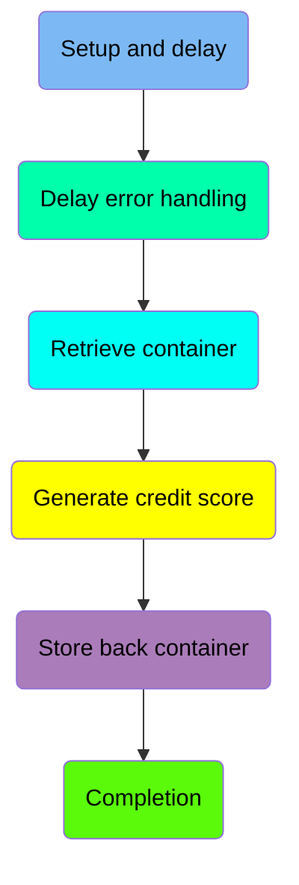
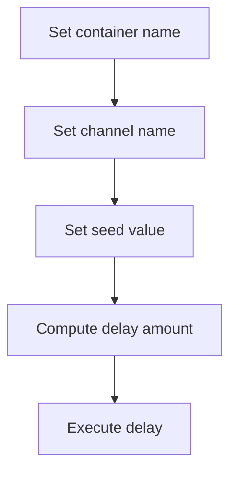
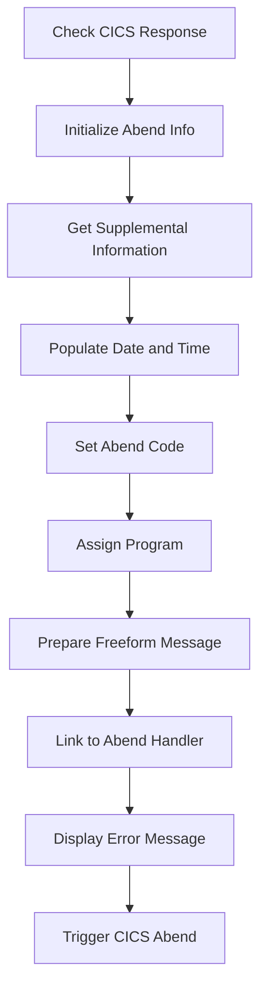
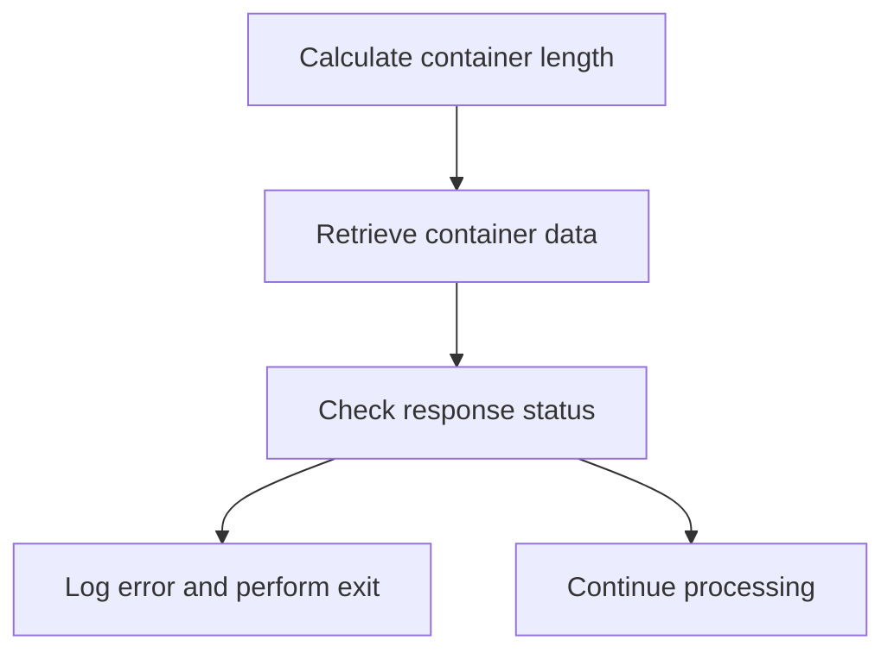
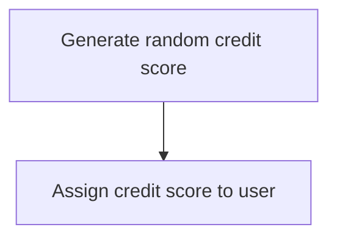
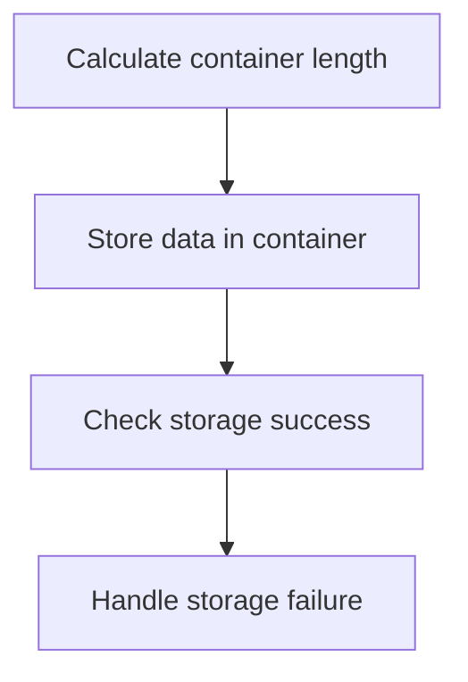
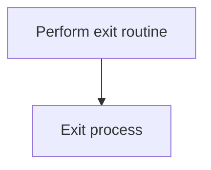

The <SwmToken path="src/base/cobol_src/CRDTAGY3.cbl" pos="233:4:4" line-data="              DISPLAY &#39;CRDTAGY3- UNABLE TO PUT CONTAINER. RESP=&#39;">`CRDTAGY3`</SwmToken> program is responsible for generating credit scores within the system. This is achieved through a series of steps including setting up and executing a delay, handling any errors that occur, retrieving container data, generating a random credit score, and storing the updated data back into the container.

The flow starts with setting up and executing a delay, followed by handling any errors that might occur during this process. Next, the program retrieves the necessary container data, generates a random credit score, and assigns it to the user. Finally, the updated data is stored back into the container, and the process is completed.

Here is a high level diagram of the program:



## Setup and delay

First, we'll zoom into this section of the flow:



<SwmSnippet path="/src/base/cobol_src/CRDTAGY3.cbl" line="119">

---

First, the container name is set to <SwmToken path="src/base/cobol_src/CRDTAGY3.cbl" pos="119:4:4" line-data="           MOVE &#39;CIPC            &#39; TO WS-CONTAINER-NAME.">`CIPC`</SwmToken> to specify the target container for the operation.

```cobol
           MOVE 'CIPC            ' TO WS-CONTAINER-NAME.
```

---

</SwmSnippet>

<SwmSnippet path="/src/base/cobol_src/CRDTAGY3.cbl" line="120">

---

Moving to the next step, the channel name is set to <SwmToken path="src/base/cobol_src/CRDTAGY3.cbl" pos="120:4:4" line-data="           MOVE &#39;CIPCREDCHANN    &#39; TO WS-CHANNEL-NAME.">`CIPCREDCHANN`</SwmToken> to define the communication channel.

```cobol
           MOVE 'CIPCREDCHANN    ' TO WS-CHANNEL-NAME.
```

---

</SwmSnippet>

<SwmSnippet path="/src/base/cobol_src/CRDTAGY3.cbl" line="121">

---

Next, the task number is moved to <SwmToken path="src/base/cobol_src/CRDTAGY3.cbl" pos="121:7:9" line-data="           MOVE EIBTASKN           TO WS-SEED.">`WS-SEED`</SwmToken> to be used as a seed for generating a random delay.

```cobol
           MOVE EIBTASKN           TO WS-SEED.
```

---

</SwmSnippet>

<SwmSnippet path="/src/base/cobol_src/CRDTAGY3.cbl" line="123">

---

Then, a random delay amount between 1 and 3 seconds is computed using the seed value.

```cobol
           COMPUTE WS-DELAY-AMT = ((3 - 1)
                            * FUNCTION RANDOM(WS-SEED)) + 1.
```

---

</SwmSnippet>

<SwmSnippet path="/src/base/cobol_src/CRDTAGY3.cbl" line="126">

---

Finally, the program executes a delay for the computed amount of seconds.

```cobol
           EXEC CICS DELAY
                FOR SECONDS(WS-DELAY-AMT)
                RESP(WS-CICS-RESP)
                RESP2(WS-CICS-RESP2)
           END-EXEC.
```

---

</SwmSnippet>

## Delay error handling

Now, lets zoom into this section of the flow:



### Initialize Abend Info

### Check CICS Response

First, we check if the CICS response code is not normal. This step ensures that we only proceed with the abend handling if there is an abnormal condition.

<SwmSnippet path="/src/base/cobol_src/CRDTAGY3.cbl" line="139">

---

Next, we initialize the abend information record and move the response codes (<SwmToken path="src/base/cobol_src/CRDTAGY3.cbl" pos="140:3:3" line-data="              MOVE EIBRESP    TO ABND-RESPCODE">`EIBRESP`</SwmToken> and <SwmToken path="src/base/cobol_src/CRDTAGY3.cbl" pos="141:3:3" line-data="              MOVE EIBRESP2   TO ABND-RESP2CODE">`EIBRESP2`</SwmToken>) to the abend response fields. This preserves the original response codes for further processing.

```cobol
              INITIALIZE ABNDINFO-REC
              MOVE EIBRESP    TO ABND-RESPCODE
              MOVE EIBRESP2   TO ABND-RESP2CODE
```

---

</SwmSnippet>

<SwmSnippet path="/src/base/cobol_src/CRDTAGY3.cbl" line="145">

---

### Get Supplemental Information

Moving to the next step, we assign the application ID to the abend information record and move the task number and transaction ID to their respective fields. This gathers additional context about the abend condition.

```cobol
              EXEC CICS ASSIGN APPLID(ABND-APPLID)
              END-EXEC

              MOVE EIBTASKN   TO ABND-TASKNO-KEY
              MOVE EIBTRNID   TO ABND-TRANID

```

---

</SwmSnippet>

<SwmSnippet path="/src/base/cobol_src/CRDTAGY3.cbl" line="151">

---

### Populate Date and Time

Then, we perform a routine to populate the current date and time, and move these values to the abend information record. This timestamps the abend event for logging purposes.

```cobol
              PERFORM POPULATE-TIME-DATE

              MOVE WS-ORIG-DATE TO ABND-DATE
              STRING WS-TIME-NOW-GRP-HH DELIMITED BY SIZE,
                      ':' DELIMITED BY SIZE,
                       WS-TIME-NOW-GRP-MM DELIMITED BY SIZE,
                       ':' DELIMITED BY SIZE,
                       WS-TIME-NOW-GRP-MM DELIMITED BY SIZE
                       INTO ABND-TIME
```

---

</SwmSnippet>

<SwmSnippet path="/src/base/cobol_src/CRDTAGY3.cbl" line="163">

---

### Set Abend Code

Next, we set a specific abend code ('PLOP') in the abend information record. This code identifies the type of abend that occurred.

```cobol
              MOVE 'PLOP'      TO ABND-CODE

```

---

</SwmSnippet>

<SwmSnippet path="/src/base/cobol_src/CRDTAGY3.cbl" line="165">

---

### Assign Program

We then assign the current program name to the abend information record. This identifies which program was running when the abend occurred.

```cobol
              EXEC CICS ASSIGN PROGRAM(ABND-PROGRAM)
              END-EXEC
```

---

</SwmSnippet>

<SwmSnippet path="/src/base/cobol_src/CRDTAGY3.cbl" line="170">

---

### Prepare Freeform Message

Moving forward, we prepare a freeform message that includes the abend description and the response codes. This message provides a detailed explanation of the abend condition.

```cobol
              STRING 'A010  - *** The delay messed up! ***'
                      DELIMITED BY SIZE,
                      ' EIBRESP=' DELIMITED BY SIZE,
                      ABND-RESPCODE DELIMITED BY SIZE,
                      ' RESP2=' DELIMITED BY SIZE,
                      ABND-RESP2CODE DELIMITED BY SIZE
                      INTO ABND-FREEFORM
```

---

</SwmSnippet>

<SwmSnippet path="/src/base/cobol_src/CRDTAGY3.cbl" line="179">

---

### Link to Abend Handler

Next, we link to the abend handler program, passing the abend information record. This step hands over control to the abend handler for further processing.

```cobol
              EXEC CICS LINK PROGRAM(WS-ABEND-PGM)
                          COMMAREA(ABNDINFO-REC)
              END-EXEC
```

---

</SwmSnippet>

<SwmSnippet path="/src/base/cobol_src/CRDTAGY3.cbl" line="183">

---

### Display Error Message and Trigger CICS Abend

Finally, we display an error message and trigger a CICS abend with the specific abend code. This step ensures that the abend is logged and the application is terminated gracefully.

More about ABNDPROC: <SwmLink doc-title="Handling Abnormal Terminations (ABNDPROC)">[Handling Abnormal Terminations (ABNDPROC)](/.swm/handling-abnormal-terminations-abndproc.q6kxvboz.sw.md)</SwmLink>

```cobol
              DISPLAY '*** The delay messed up ! ***'
              EXEC CICS ABEND
                 ABCODE('PLOP')
              END-EXEC
```

---

</SwmSnippet>

## Retrieve container

Now, lets zoom into this section of the flow:



<SwmSnippet path="/src/base/cobol_src/CRDTAGY3.cbl" line="189">

---

### Calculate container length

First, the length of the container data is calculated and stored in <SwmToken path="src/base/cobol_src/CRDTAGY3.cbl" pos="189:3:7" line-data="           COMPUTE WS-CONTAINER-LEN = LENGTH OF WS-CONT-IN.">`WS-CONTAINER-LEN`</SwmToken> (which holds the length of the container data).

```cobol
           COMPUTE WS-CONTAINER-LEN = LENGTH OF WS-CONT-IN.
```

---

</SwmSnippet>

<SwmSnippet path="/src/base/cobol_src/CRDTAGY3.cbl" line="191">

---

### Retrieve container data

Next, the container data is retrieved from CICS using the <SwmToken path="src/base/cobol_src/CRDTAGY3.cbl" pos="191:5:7" line-data="           EXEC CICS GET CONTAINER(WS-CONTAINER-NAME)">`GET CONTAINER`</SwmToken> command. The data is stored in <SwmToken path="src/base/cobol_src/CRDTAGY3.cbl" pos="193:3:7" line-data="                     INTO(WS-CONT-IN)">`WS-CONT-IN`</SwmToken> (which holds the container data), and the response codes are stored in <SwmToken path="src/base/cobol_src/CRDTAGY3.cbl" pos="195:3:7" line-data="                     RESP(WS-CICS-RESP)">`WS-CICS-RESP`</SwmToken> and <SwmToken path="src/base/cobol_src/CRDTAGY3.cbl" pos="196:3:7" line-data="                     RESP2(WS-CICS-RESP2)">`WS-CICS-RESP2`</SwmToken>.

```cobol
           EXEC CICS GET CONTAINER(WS-CONTAINER-NAME)
                     CHANNEL(WS-CHANNEL-NAME)
                     INTO(WS-CONT-IN)
                     FLENGTH(WS-CONTAINER-LEN)
                     RESP(WS-CICS-RESP)
                     RESP2(WS-CICS-RESP2)
           END-EXEC.
```

---

</SwmSnippet>

## Interim Summary

So far, we saw the steps involved in setting up and executing a delay, including setting container and channel names, computing a random delay amount, and handling any errors that occur during the delay process. We also explored how to retrieve container data from CICS. Now, we will focus on generating a credit score, which involves computing a random credit score and assigning it to the user.

## Generate credit score

This is the next section of the flow.



<SwmSnippet path="/src/base/cobol_src/CRDTAGY3.cbl" line="213">

---

First, we generate a new credit score for the user by computing a random number between 1 and 999. This is done using the <SwmToken path="src/base/cobol_src/CRDTAGY3.cbl" pos="213:1:1" line-data="           COMPUTE WS-NEW-CREDSCORE = ((999 - 1)">`COMPUTE`</SwmToken> statement, which utilizes the <SwmToken path="src/base/cobol_src/CRDTAGY3.cbl" pos="214:5:5" line-data="                            * FUNCTION RANDOM) + 1.">`RANDOM`</SwmToken> function to produce a random number within the specified range.

```cobol
           COMPUTE WS-NEW-CREDSCORE = ((999 - 1)
                            * FUNCTION RANDOM) + 1.
```

---

</SwmSnippet>

<SwmSnippet path="/src/base/cobol_src/CRDTAGY3.cbl" line="217">

---

Next, the newly generated credit score is assigned to the user's credit score field. This is achieved by moving the value from <SwmToken path="src/base/cobol_src/CRDTAGY3.cbl" pos="217:3:7" line-data="           MOVE WS-NEW-CREDSCORE TO WS-CONT-IN-CREDIT-SCORE.">`WS-NEW-CREDSCORE`</SwmToken> to <SwmToken path="src/base/cobol_src/CRDTAGY3.cbl" pos="217:11:19" line-data="           MOVE WS-NEW-CREDSCORE TO WS-CONT-IN-CREDIT-SCORE.">`WS-CONT-IN-CREDIT-SCORE`</SwmToken>, ensuring that the user's credit score is updated with the new value.

```cobol
           MOVE WS-NEW-CREDSCORE TO WS-CONT-IN-CREDIT-SCORE.
```

---

</SwmSnippet>

## Store back container

Now, lets zoom into this section of the flow:



<SwmSnippet path="/src/base/cobol_src/CRDTAGY3.cbl" line="222">

---

### Calculating container length

First, the length of the data to be stored in the container is calculated and stored in <SwmToken path="src/base/cobol_src/CRDTAGY3.cbl" pos="222:3:7" line-data="           COMPUTE WS-CONTAINER-LEN = LENGTH OF WS-CONT-IN.">`WS-CONTAINER-LEN`</SwmToken>.

```cobol
           COMPUTE WS-CONTAINER-LEN = LENGTH OF WS-CONT-IN.
```

---

</SwmSnippet>

<SwmSnippet path="/src/base/cobol_src/CRDTAGY3.cbl" line="224">

---

### Storing data in container

Moving to the next step, the data is stored in the container using the <SwmToken path="src/base/cobol_src/CRDTAGY3.cbl" pos="224:1:7" line-data="           EXEC CICS PUT CONTAINER(WS-CONTAINER-NAME)">`EXEC CICS PUT CONTAINER`</SwmToken> command, which specifies the container name, the data to be stored, its length, and the channel name.

```cobol
           EXEC CICS PUT CONTAINER(WS-CONTAINER-NAME)
                         FROM(WS-CONT-IN)
                         FLENGTH(WS-CONTAINER-LEN)
                         CHANNEL(WS-CHANNEL-NAME)
                         RESP(WS-CICS-RESP)
                         RESP2(WS-CICS-RESP2)
           END-EXEC.
```

---

</SwmSnippet>

<SwmSnippet path="/src/base/cobol_src/CRDTAGY3.cbl" line="232">

---

### Checking storage success

Then, the response of the storage operation is checked. If the response is not normal, an error message is displayed with details about the container and channel, and the <SwmToken path="src/base/cobol_src/CRDTAGY3.cbl" pos="238:3:11" line-data="              PERFORM GET-ME-OUT-OF-HERE">`GET-ME-OUT-OF-HERE`</SwmToken> routine is performed to handle the failure.

```cobol
           IF WS-CICS-RESP NOT = DFHRESP(NORMAL)
              DISPLAY 'CRDTAGY3- UNABLE TO PUT CONTAINER. RESP='
                 WS-CICS-RESP ', RESP2=' WS-CICS-RESP2
              DISPLAY  'CONTAINER='  WS-CONTAINER-NAME
              ' CHANNEL=' WS-CHANNEL-NAME ' FLENGTH='
                    WS-CONTAINER-LEN
              PERFORM GET-ME-OUT-OF-HERE
           END-IF.
```

---

</SwmSnippet>

## Completion

This is the next section of the flow.



<SwmSnippet path="/src/base/cobol_src/CRDTAGY3.cbl" line="241">

---

The <SwmToken path="src/base/cobol_src/CRDTAGY3.cbl" pos="241:1:11" line-data="           PERFORM GET-ME-OUT-OF-HERE.">`PERFORM GET-ME-OUT-OF-HERE`</SwmToken> statement is used to execute the exit routine, which handles any necessary cleanup or final actions before the process terminates.

```cobol
           PERFORM GET-ME-OUT-OF-HERE.
```

---

</SwmSnippet>

<SwmSnippet path="/src/base/cobol_src/CRDTAGY3.cbl" line="244">

---

The <SwmToken path="src/base/cobol_src/CRDTAGY3.cbl" pos="244:1:1" line-data="           EXIT.">`EXIT`</SwmToken> statement is then used to terminate the current process, ensuring that the program stops executing further instructions.

```cobol
           EXIT.
```

---

</SwmSnippet>

&nbsp;

*This is an auto-generated document by Swimm 🌊 and has not yet been verified by a human*

<SwmMeta version="3.0.0" repo-id="Z2l0aHViJTNBJTNBY2ljcy1iYW5raW5nLXNhbXBsZS1hcHBsaWNhdGlvbi1jYnNhLUlCTS1EZW1vJTNBJTNBU3dpbW0tRGVtbw==" repo-name="cics-banking-sample-application-cbsa-IBM-Demo"><sup>Powered by [Swimm](/)</sup></SwmMeta>
