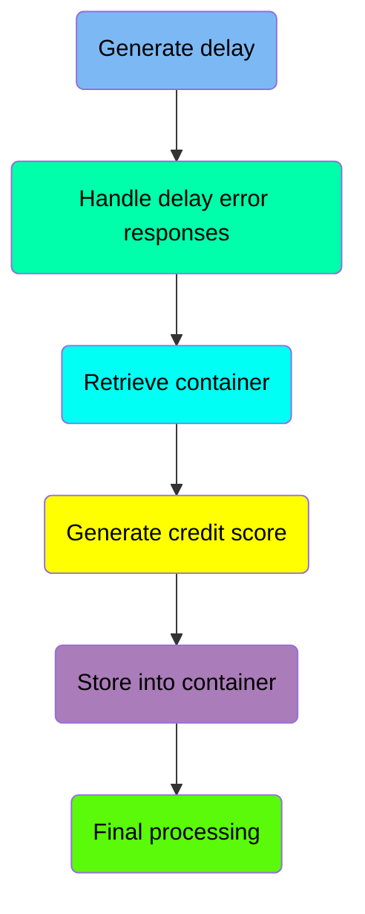
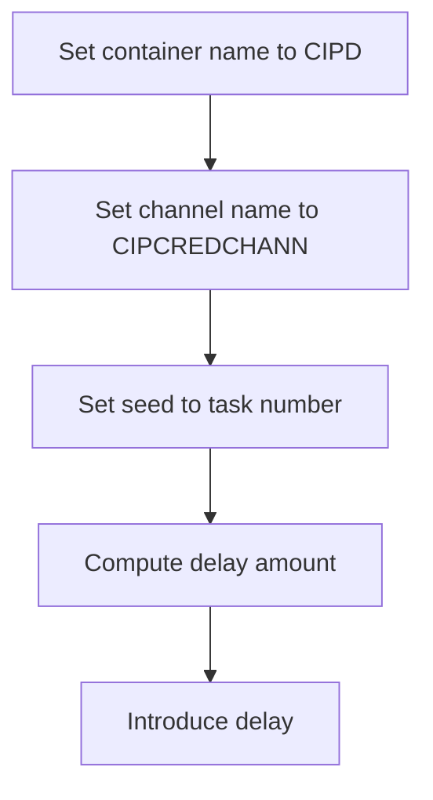
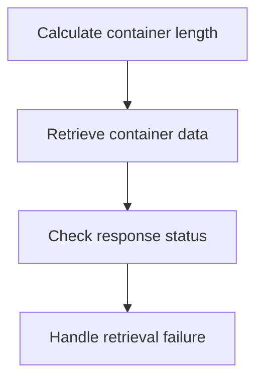
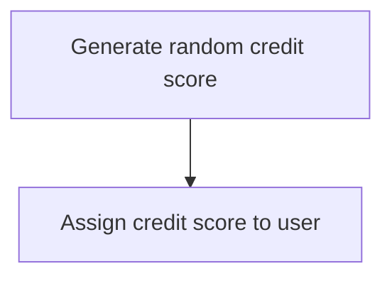
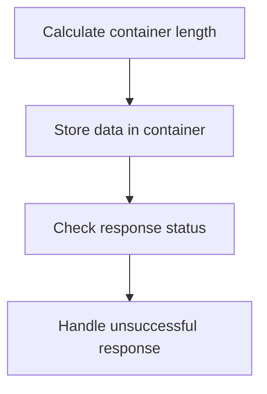
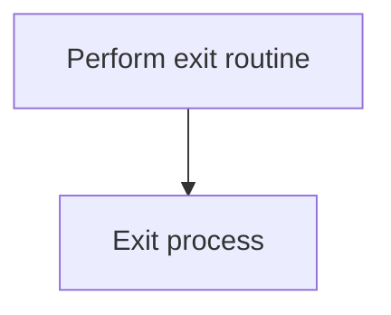

The <SwmToken path="src/base/cobol_src/CRDTAGY4.cbl" pos="236:4:4" line-data="              DISPLAY &#39;CRDTAGY4- UNABLE TO PUT CONTAINER. RESP=&#39;">`CRDTAGY4`</SwmToken> program is responsible for generating a delay, handling delay error responses, retrieving container data, generating a credit score, and storing data into a container. This program achieves its role by following a series of well-defined steps, including setting container and channel names, computing delay amounts, initializing abend information, and handling retrieval failures.

The flow involves generating a delay, handling any errors that occur during the delay, retrieving data from a container, generating a random credit score, and storing the data back into the container. Each step is carefully designed to ensure the process runs smoothly and any errors are properly handled.

Here is a high level diagram of the program:



## Generate delay

First, we'll zoom into this section of the flow:



<SwmSnippet path="/src/base/cobol_src/CRDTAGY4.cbl" line="120">

---

First, the container name is set to <SwmToken path="src/base/cobol_src/CRDTAGY4.cbl" pos="120:4:4" line-data="           MOVE &#39;CIPD            &#39; TO WS-CONTAINER-NAME.">`CIPD`</SwmToken> (a predefined container name used in the process).

```cobol
           MOVE 'CIPD            ' TO WS-CONTAINER-NAME.
```

---

</SwmSnippet>

<SwmSnippet path="/src/base/cobol_src/CRDTAGY4.cbl" line="121">

---

Next, the channel name is set to <SwmToken path="src/base/cobol_src/CRDTAGY4.cbl" pos="121:4:4" line-data="           MOVE &#39;CIPCREDCHANN    &#39; TO WS-CHANNEL-NAME.">`CIPCREDCHANN`</SwmToken> (a predefined channel name used for communication).

```cobol
           MOVE 'CIPCREDCHANN    ' TO WS-CHANNEL-NAME.
```

---

</SwmSnippet>

<SwmSnippet path="/src/base/cobol_src/CRDTAGY4.cbl" line="122">

---

Then, the task number (<SwmToken path="src/base/cobol_src/CRDTAGY4.cbl" pos="122:3:3" line-data="           MOVE EIBTASKN           TO WS-SEED.">`EIBTASKN`</SwmToken>) is moved to <SwmToken path="src/base/cobol_src/CRDTAGY4.cbl" pos="122:7:9" line-data="           MOVE EIBTASKN           TO WS-SEED.">`WS-SEED`</SwmToken> (used as a seed for generating a random number).

```cobol
           MOVE EIBTASKN           TO WS-SEED.
```

---

</SwmSnippet>

<SwmSnippet path="/src/base/cobol_src/CRDTAGY4.cbl" line="124">

---

Finally, a random delay amount between 1 and 3 seconds is computed and a delay is introduced for the computed amount of seconds.

```cobol
           COMPUTE WS-DELAY-AMT = ((3 - 1)
                            * FUNCTION RANDOM(WS-SEED)) + 1.

           EXEC CICS DELAY
                FOR SECONDS(WS-DELAY-AMT)
                RESP(WS-CICS-RESP)
                RESP2(WS-CICS-RESP2)
           END-EXEC.
```

---

</SwmSnippet>

## Handle delay error responses

Now, lets zoom into this section of the flow:



```mermaid
graph TD
  A[Check CICS Response] -->|Not Normal| B[Initialize Abend Info]
  B --> C[Move EIBRESP to ABND-RESPCODE]
  C --> D[Move EIBRESP2 to ABND-RESP2CODE]
  D --> E[Assign APPLID to ABND-APPLID]
  E --> F[Move EIBTASKN to ABND-TASKNO-KEY]
  F --> G[Move EIBTRNID to ABND-TRANID]
  G --> H[Perform POPULATE-TIME-DATE]
  H --> I[Move WS-ORIG-DATE to ABND-DATE]
  I --> J[Format and Move Time to ABND-TIME]
  J --> K[Move WS-U-TIME to ABND-UTIME-KEY]
  K --> L[Move 'PLOP' to ABND-CODE]
  L --> M[Assign PROGRAM to ABND-PROGRAM]
  M --> N[Move ZEROS to ABND-SQLCODE]
  N --> O[Format and Move Error Message to ABND-FREEFORM]
  O --> P[Link to Abend Handler Program]
  P --> Q[Display Error Message]
  Q --> R[Trigger CICS Abend with Code 'PLOP']

%% Swimm:
%% graph TD
%%   A[Check CICS Response] -->|Not Normal| B[Initialize Abend Info]
%%   B --> C[Move EIBRESP to <SwmToken path="src/base/cobol_src/CRDTAGY4.cbl" pos="141:7:9" line-data="              MOVE EIBRESP    TO ABND-RESPCODE">`ABND-RESPCODE`</SwmToken>]
%%   C --> D[Move <SwmToken path="src/base/cobol_src/CRDTAGY4.cbl" pos="142:3:3" line-data="              MOVE EIBRESP2   TO ABND-RESP2CODE">`EIBRESP2`</SwmToken> to <SwmToken path="src/base/cobol_src/CRDTAGY4.cbl" pos="142:7:9" line-data="              MOVE EIBRESP2   TO ABND-RESP2CODE">`ABND-RESP2CODE`</SwmToken>]
%%   D --> E[Assign APPLID to <SwmToken path="src/base/cobol_src/CRDTAGY4.cbl" pos="146:9:11" line-data="              EXEC CICS ASSIGN APPLID(ABND-APPLID)">`ABND-APPLID`</SwmToken>]
%%   E --> F[Move EIBTASKN to <SwmToken path="src/base/cobol_src/CRDTAGY4.cbl" pos="149:7:11" line-data="              MOVE EIBTASKN   TO ABND-TASKNO-KEY">`ABND-TASKNO-KEY`</SwmToken>]
%%   F --> G[Move EIBTRNID to <SwmToken path="src/base/cobol_src/CRDTAGY4.cbl" pos="150:7:9" line-data="              MOVE EIBTRNID   TO ABND-TRANID">`ABND-TRANID`</SwmToken>]
%%   G --> H[Perform <SwmToken path="src/base/cobol_src/CRDTAGY4.cbl" pos="152:3:7" line-data="              PERFORM POPULATE-TIME-DATE">`POPULATE-TIME-DATE`</SwmToken>]
%%   H --> I[Move <SwmToken path="src/base/cobol_src/CRDTAGY4.cbl" pos="80:3:7" line-data="       01 WS-ORIG-DATE                  PIC X(10).">`WS-ORIG-DATE`</SwmToken> to <SwmToken path="src/base/cobol_src/CRDTAGY4.cbl" pos="154:11:13" line-data="              MOVE WS-ORIG-DATE TO ABND-DATE">`ABND-DATE`</SwmToken>]
%%   I --> J[Format and Move Time to <SwmToken path="src/base/cobol_src/CRDTAGY4.cbl" pos="160:3:5" line-data="                       INTO ABND-TIME">`ABND-TIME`</SwmToken>]
%%   J --> K[Move <SwmToken path="src/base/cobol_src/CRDTAGY4.cbl" pos="79:3:7" line-data="       01 WS-U-TIME                     PIC S9(15) COMP-3.">`WS-U-TIME`</SwmToken> to <SwmToken path="src/base/cobol_src/CRDTAGY4.cbl" pos="163:11:15" line-data="              MOVE WS-U-TIME   TO ABND-UTIME-KEY">`ABND-UTIME-KEY`</SwmToken>]
%%   K --> L[Move 'PLOP' to <SwmToken path="src/base/cobol_src/CRDTAGY4.cbl" pos="164:9:11" line-data="              MOVE &#39;PLOP&#39;      TO ABND-CODE">`ABND-CODE`</SwmToken>]
%%   L --> M[Assign PROGRAM to <SwmToken path="src/base/cobol_src/CRDTAGY4.cbl" pos="166:9:11" line-data="              EXEC CICS ASSIGN PROGRAM(ABND-PROGRAM)">`ABND-PROGRAM`</SwmToken>]
%%   M --> N[Move ZEROS to <SwmToken path="src/base/cobol_src/CRDTAGY4.cbl" pos="169:7:9" line-data="              MOVE ZEROS      TO ABND-SQLCODE">`ABND-SQLCODE`</SwmToken>]
%%   N --> O[Format and Move Error Message to <SwmToken path="src/base/cobol_src/CRDTAGY4.cbl" pos="177:3:5" line-data="                      INTO ABND-FREEFORM">`ABND-FREEFORM`</SwmToken>]
%%   O --> P[Link to Abend Handler Program]
%%   P --> Q[Display Error Message]
%%   Q --> R[Trigger CICS Abend with Code 'PLOP']
```

First, we check if the CICS response is not normal. This is crucial to determine if an abnormal end (abend) situation has occurred.

Moving to the next step, we initialize the abend information record to prepare for capturing relevant details about the abend.

Next, we move the <SwmToken path="src/base/cobol_src/CRDTAGY4.cbl" pos="141:3:3" line-data="              MOVE EIBRESP    TO ABND-RESPCODE">`EIBRESP`</SwmToken> (CICS response code) to <SwmToken path="src/base/cobol_src/CRDTAGY4.cbl" pos="141:7:9" line-data="              MOVE EIBRESP    TO ABND-RESPCODE">`ABND-RESPCODE`</SwmToken> to record the response code that triggered the abend.

Then, we move the <SwmToken path="src/base/cobol_src/CRDTAGY4.cbl" pos="142:3:3" line-data="              MOVE EIBRESP2   TO ABND-RESP2CODE">`EIBRESP2`</SwmToken> (CICS extended response code) to <SwmToken path="src/base/cobol_src/CRDTAGY4.cbl" pos="142:7:9" line-data="              MOVE EIBRESP2   TO ABND-RESP2CODE">`ABND-RESP2CODE`</SwmToken> to capture additional response information.

Going into the next step, we assign the application ID to <SwmToken path="src/base/cobol_src/CRDTAGY4.cbl" pos="146:9:11" line-data="              EXEC CICS ASSIGN APPLID(ABND-APPLID)">`ABND-APPLID`</SwmToken> to identify the application where the abend occurred.

We then move the task number to <SwmToken path="src/base/cobol_src/CRDTAGY4.cbl" pos="149:7:11" line-data="              MOVE EIBTASKN   TO ABND-TASKNO-KEY">`ABND-TASKNO-KEY`</SwmToken> and the transaction ID to <SwmToken path="src/base/cobol_src/CRDTAGY4.cbl" pos="150:7:9" line-data="              MOVE EIBTRNID   TO ABND-TRANID">`ABND-TRANID`</SwmToken> to log the specific task and transaction involved.

Next, we perform the <SwmToken path="src/base/cobol_src/CRDTAGY4.cbl" pos="152:3:7" line-data="              PERFORM POPULATE-TIME-DATE">`POPULATE-TIME-DATE`</SwmToken> routine to get the current date and time, which is then moved to <SwmToken path="src/base/cobol_src/CRDTAGY4.cbl" pos="154:11:13" line-data="              MOVE WS-ORIG-DATE TO ABND-DATE">`ABND-DATE`</SwmToken> and formatted into <SwmToken path="src/base/cobol_src/CRDTAGY4.cbl" pos="160:3:5" line-data="                       INTO ABND-TIME">`ABND-TIME`</SwmToken>.

We also move the user time to <SwmToken path="src/base/cobol_src/CRDTAGY4.cbl" pos="163:11:15" line-data="              MOVE WS-U-TIME   TO ABND-UTIME-KEY">`ABND-UTIME-KEY`</SwmToken> and set the abend code to 'PLOP' to indicate the specific abend scenario.

## Retrieve container

Now, lets zoom into this section of the flow:



<SwmSnippet path="/src/base/cobol_src/CRDTAGY4.cbl" line="192">

---

### Calculate container length

First, the length of the container data is calculated and stored in <SwmToken path="src/base/cobol_src/CRDTAGY4.cbl" pos="192:3:7" line-data="           COMPUTE WS-CONTAINER-LEN = LENGTH OF WS-CONT-IN.">`WS-CONTAINER-LEN`</SwmToken>.

```cobol
           COMPUTE WS-CONTAINER-LEN = LENGTH OF WS-CONT-IN.
```

---

</SwmSnippet>

<SwmSnippet path="/src/base/cobol_src/CRDTAGY4.cbl" line="194">

---

### Retrieve container data

Next, the container data is retrieved using the <SwmToken path="src/base/cobol_src/CRDTAGY4.cbl" pos="194:1:7" line-data="           EXEC CICS GET CONTAINER(WS-CONTAINER-NAME)">`EXEC CICS GET CONTAINER`</SwmToken> command, which fetches the data into <SwmToken path="src/base/cobol_src/CRDTAGY4.cbl" pos="196:3:7" line-data="                     INTO(WS-CONT-IN)">`WS-CONT-IN`</SwmToken> based on the specified container name and channel.

```cobol
           EXEC CICS GET CONTAINER(WS-CONTAINER-NAME)
                     CHANNEL(WS-CHANNEL-NAME)
                     INTO(WS-CONT-IN)
                     FLENGTH(WS-CONTAINER-LEN)
                     RESP(WS-CICS-RESP)
                     RESP2(WS-CICS-RESP2)
           END-EXEC.
```

---

</SwmSnippet>

## Interim Summary

So far, we saw how to generate a delay and handle delay error responses, including setting container and channel names, computing delay amounts, and initializing abend information. Now, we will focus on retrieving container data, calculating its length, and handling retrieval failures.

## Generate credit score

This is the next section of the flow.



<SwmSnippet path="/src/base/cobol_src/CRDTAGY4.cbl" line="217">

---

First, the code generates a new credit score for the user by computing a random number between 1 and 999. This is achieved using the <SwmToken path="src/base/cobol_src/CRDTAGY4.cbl" pos="217:1:1" line-data="           COMPUTE WS-NEW-CREDSCORE = ((999 - 1)">`COMPUTE`</SwmToken> statement, which calculates <SwmToken path="src/base/cobol_src/CRDTAGY4.cbl" pos="217:3:7" line-data="           COMPUTE WS-NEW-CREDSCORE = ((999 - 1)">`WS-NEW-CREDSCORE`</SwmToken> by applying the <SwmToken path="src/base/cobol_src/CRDTAGY4.cbl" pos="218:5:5" line-data="                            * FUNCTION RANDOM) + 1.">`RANDOM`</SwmToken> function.

```cobol
           COMPUTE WS-NEW-CREDSCORE = ((999 - 1)
                            * FUNCTION RANDOM) + 1.
```

---

</SwmSnippet>

<SwmSnippet path="/src/base/cobol_src/CRDTAGY4.cbl" line="220">

---

Next, the newly generated credit score stored in <SwmToken path="src/base/cobol_src/CRDTAGY4.cbl" pos="220:3:7" line-data="           MOVE WS-NEW-CREDSCORE TO WS-CONT-IN-CREDIT-SCORE.">`WS-NEW-CREDSCORE`</SwmToken> is moved to <SwmToken path="src/base/cobol_src/CRDTAGY4.cbl" pos="220:11:19" line-data="           MOVE WS-NEW-CREDSCORE TO WS-CONT-IN-CREDIT-SCORE.">`WS-CONT-IN-CREDIT-SCORE`</SwmToken>, effectively assigning the new credit score to the user.

```cobol
           MOVE WS-NEW-CREDSCORE TO WS-CONT-IN-CREDIT-SCORE.

```

---

</SwmSnippet>

## Store into container

Now, lets zoom into this section of the flow:



<SwmSnippet path="/src/base/cobol_src/CRDTAGY4.cbl" line="225">

---

### Calculate container length

First, the length of the data to be stored in the container is calculated and stored in <SwmToken path="src/base/cobol_src/CRDTAGY4.cbl" pos="225:3:7" line-data="           COMPUTE WS-CONTAINER-LEN = LENGTH OF WS-CONT-IN.">`WS-CONTAINER-LEN`</SwmToken> (which holds the length of the container data).

```cobol
           COMPUTE WS-CONTAINER-LEN = LENGTH OF WS-CONT-IN.
```

---

</SwmSnippet>

<SwmSnippet path="/src/base/cobol_src/CRDTAGY4.cbl" line="227">

---

### Store data in container

Moving to the next step, the data is stored into the container using the <SwmToken path="src/base/cobol_src/CRDTAGY4.cbl" pos="227:1:7" line-data="           EXEC CICS PUT CONTAINER(WS-CONTAINER-NAME)">`EXEC CICS PUT CONTAINER`</SwmToken> command. This command specifies the container name, the data to be stored, the length of the data, and the channel name.

```cobol
           EXEC CICS PUT CONTAINER(WS-CONTAINER-NAME)
                         FROM(WS-CONT-IN)
                         FLENGTH(WS-CONTAINER-LEN)
                         CHANNEL(WS-CHANNEL-NAME)
                         RESP(WS-CICS-RESP)
                         RESP2(WS-CICS-RESP2)
```

---

</SwmSnippet>

<SwmSnippet path="/src/base/cobol_src/CRDTAGY4.cbl" line="235">

---

### Check response status

Next, the response status is checked to ensure that the data was successfully stored in the container. If the response is not normal, an error message is displayed, and the <SwmToken path="src/base/cobol_src/CRDTAGY4.cbl" pos="241:3:11" line-data="              PERFORM GET-ME-OUT-OF-HERE">`GET-ME-OUT-OF-HERE`</SwmToken> routine is performed to handle the error.

```cobol
           IF WS-CICS-RESP NOT = DFHRESP(NORMAL)
              DISPLAY 'CRDTAGY4- UNABLE TO PUT CONTAINER. RESP='
                 WS-CICS-RESP ', RESP2=' WS-CICS-RESP2
              DISPLAY  'CONTAINER='  WS-CONTAINER-NAME
              ' CHANNEL=' WS-CHANNEL-NAME ' FLENGTH='
                    WS-CONTAINER-LEN
              PERFORM GET-ME-OUT-OF-HERE
           END-IF.
```

---

</SwmSnippet>

## Final processing

This is the next section of the flow.



<SwmSnippet path="/src/base/cobol_src/CRDTAGY4.cbl" line="244">

---

The <SwmToken path="src/base/cobol_src/CRDTAGY4.cbl" pos="244:1:11" line-data="           PERFORM GET-ME-OUT-OF-HERE.">`PERFORM GET-ME-OUT-OF-HERE`</SwmToken> statement initiates the exit routine, which is responsible for handling any necessary cleanup or finalization tasks before the process terminates. This ensures that the system is left in a stable state. Following this, the <SwmToken path="src/base/cobol_src/CRDTAGY4.cbl" pos="247:1:1" line-data="           EXIT.">`EXIT`</SwmToken> statement is executed, which terminates the current process and returns control to the calling program or operating system.

```cobol
           PERFORM GET-ME-OUT-OF-HERE.

       A999.
           EXIT.
```

---

</SwmSnippet>

&nbsp;

*This is an auto-generated document by Swimm 🌊 and has not yet been verified by a human*

<SwmMeta version="3.0.0" repo-id="Z2l0aHViJTNBJTNBY2ljcy1iYW5raW5nLXNhbXBsZS1hcHBsaWNhdGlvbi1jYnNhLUlCTS1EZW1vJTNBJTNBU3dpbW0tRGVtbw==" repo-name="cics-banking-sample-application-cbsa-IBM-Demo"><sup>Powered by [Swimm](/)</sup></SwmMeta>
