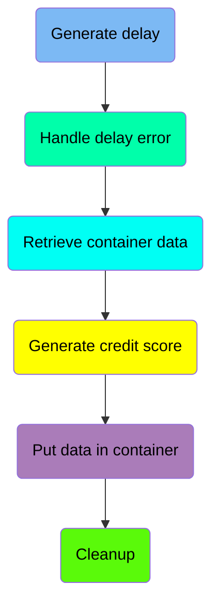
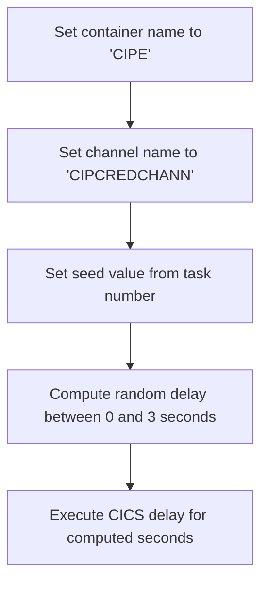
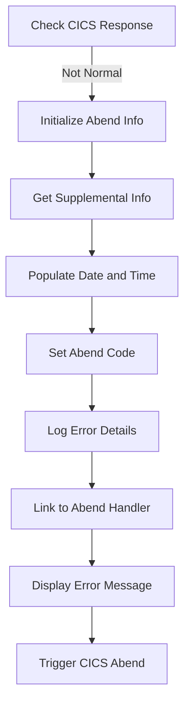
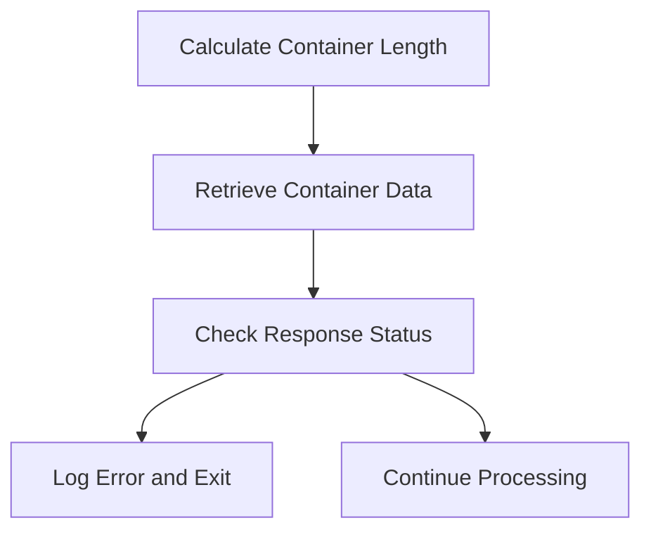
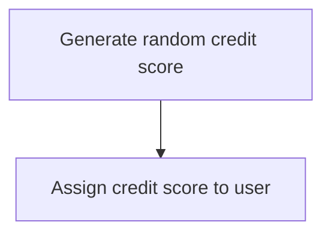
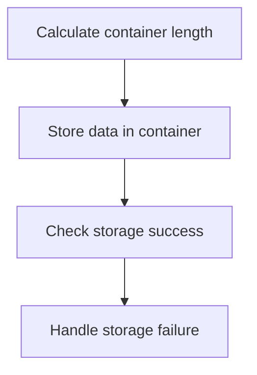
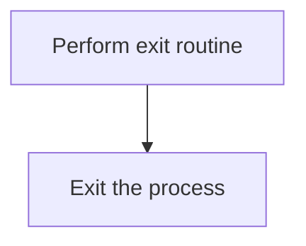
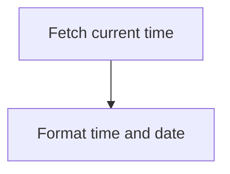
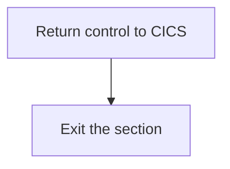

The <SwmToken path="src/base/cobol_src/CRDTAGY5.cbl" pos="236:4:4" line-data="              DISPLAY &#39;CRDTAGY5- UNABLE TO PUT CONTAINER. RESP=&#39;">`CRDTAGY5`</SwmToken> program is responsible for generating a delay, handling errors, retrieving container data, generating credit scores, and storing data in containers. This is achieved through a series of steps that include setting container and channel names, computing random delays, handling CICS responses, and logging error details.

The flow involves setting up the container and channel names, computing a random delay, handling any errors that occur, retrieving data from containers, generating a credit score, and storing data back into containers. Each step ensures that the data is processed correctly and any errors are logged and handled appropriately.

Here is a high level diagram of the program:



## Generate delay

First, we'll zoom into this section of the flow:



<SwmSnippet path="/src/base/cobol_src/CRDTAGY5.cbl" line="119">

---

First, the container name is set to 'CIPE' to specify the target container for the operation.

```cobol
           MOVE 'CIPE            ' TO WS-CONTAINER-NAME.
```

---

</SwmSnippet>

<SwmSnippet path="/src/base/cobol_src/CRDTAGY5.cbl" line="120">

---

Moving to the next step, the channel name is set to 'CIPCREDCHANN' to define the communication channel for the operation.

```cobol
           MOVE 'CIPCREDCHANN    ' TO WS-CHANNEL-NAME.
```

---

</SwmSnippet>

<SwmSnippet path="/src/base/cobol_src/CRDTAGY5.cbl" line="121">

---

Next, the seed value is set from the task number to ensure the randomness of the delay.

```cobol
           MOVE EIBTASKN           TO WS-SEED.
```

---

</SwmSnippet>

<SwmSnippet path="/src/base/cobol_src/CRDTAGY5.cbl" line="123">

---

Then, a random delay amount between 0 and 3 seconds is computed using the seed value.

```cobol
           COMPUTE WS-DELAY-AMT = ((3 - 1)
                            * FUNCTION RANDOM(WS-SEED)) + 1.
```

---

</SwmSnippet>

<SwmSnippet path="/src/base/cobol_src/CRDTAGY5.cbl" line="126">

---

Finally, the CICS delay command is executed for the computed number of seconds, introducing the random delay in processing.

```cobol
           EXEC CICS DELAY
                FOR SECONDS(WS-DELAY-AMT)
                RESP(WS-CICS-RESP)
                RESP2(WS-CICS-RESP2)
           END-EXEC.
```

---

</SwmSnippet>

## Handle delay error

Now, lets zoom into this section of the flow:



<SwmSnippet path="/src/base/cobol_src/CRDTAGY5.cbl" line="132">

---

First, the code checks if the CICS response is not normal to determine if an abnormal termination process should be initiated.

```cobol
           IF WS-CICS-RESP NOT = DFHRESP(NORMAL)
```

---

</SwmSnippet>

<SwmSnippet path="/src/base/cobol_src/CRDTAGY5.cbl" line="139">

---

If the response is not normal, it initializes the abend information record to prepare for capturing relevant details about the error.

```cobol
              INITIALIZE ABNDINFO-REC
```

---

</SwmSnippet>

<SwmSnippet path="/src/base/cobol_src/CRDTAGY5.cbl" line="140">

---

Next, it moves the CICS response codes into the abend information record to capture the specific error codes.

```cobol
              MOVE EIBRESP    TO ABND-RESPCODE
              MOVE EIBRESP2   TO ABND-RESP2CODE
```

---

</SwmSnippet>

<SwmSnippet path="/src/base/cobol_src/CRDTAGY5.cbl" line="145">

---

The program then retrieves supplemental information such as the application ID, task number, and transaction ID to provide context for the error.

```cobol
              EXEC CICS ASSIGN APPLID(ABND-APPLID)
              END-EXEC

              MOVE EIBTASKN   TO ABND-TASKNO-KEY
              MOVE EIBTRNID   TO ABND-TRANID
```

---

</SwmSnippet>

<SwmSnippet path="/src/base/cobol_src/CRDTAGY5.cbl" line="151">

---

Moving to the next step, it populates the current date and time to record when the error occurred.

```cobol
              PERFORM POPULATE-TIME-DATE

              MOVE WS-ORIG-DATE TO ABND-DATE
              STRING WS-TIME-NOW-GRP-HH DELIMITED BY SIZE,
                      ':' DELIMITED BY SIZE,
                       WS-TIME-NOW-GRP-MM DELIMITED BY SIZE,
                       ':' DELIMITED BY SIZE,
                       WS-TIME-NOW-GRP-MM DELIMITED BY SIZE
                       INTO ABND-TIME
```

---

</SwmSnippet>

<SwmSnippet path="/src/base/cobol_src/CRDTAGY5.cbl" line="163">

---

Then, it sets a specific abend code 'PLOP' to identify the type of error that occurred.

```cobol
              MOVE 'PLOP'      TO ABND-CODE

```

---

</SwmSnippet>

<SwmSnippet path="/src/base/cobol_src/CRDTAGY5.cbl" line="170">

---

The program logs detailed error information including a freeform message and the response codes to help diagnose the issue.

```cobol
              STRING 'A010  - *** The delay messed up! ***'
                      DELIMITED BY SIZE,
                      ' EIBRESP=' DELIMITED BY SIZE,
                      ABND-RESPCODE DELIMITED BY SIZE,
                      ' RESP2=' DELIMITED BY SIZE,
                      ABND-RESP2CODE DELIMITED BY SIZE
                      INTO ABND-FREEFORM
```

---

</SwmSnippet>

<SwmSnippet path="/src/base/cobol_src/CRDTAGY5.cbl" line="179">

---

Next, it links to the abend handler program to process the abend information and take appropriate actions.

```cobol
              EXEC CICS LINK PROGRAM(WS-ABEND-PGM)
                          COMMAREA(ABNDINFO-REC)
              END-EXEC
```

---

</SwmSnippet>

<SwmSnippet path="/src/base/cobol_src/CRDTAGY5.cbl" line="184">

---

Finally, it displays an error message and triggers a CICS abend to terminate the transaction.

More about ABNDPROC: <SwmLink doc-title="Writing Abend Records (ABNDPROC)">[Writing Abend Records (ABNDPROC)](/.swm/writing-abend-records-abndproc.svfj4jn5.sw.md)</SwmLink>

```cobol
              DISPLAY '*** The delay messed up ! ***'
              EXEC CICS ABEND
                 ABCODE('PLOP')
              END-EXEC
```

---

</SwmSnippet>

## Retrieve container data

Now, lets zoom into this section of the flow:



<SwmSnippet path="/src/base/cobol_src/CRDTAGY5.cbl" line="190">

---

### Calculate Container Length

First, the length of the container data is calculated and stored in <SwmToken path="src/base/cobol_src/CRDTAGY5.cbl" pos="190:3:7" line-data="           COMPUTE WS-CONTAINER-LEN = LENGTH OF WS-CONT-IN.">`WS-CONTAINER-LEN`</SwmToken>.

```cobol
           COMPUTE WS-CONTAINER-LEN = LENGTH OF WS-CONT-IN.
```

---

</SwmSnippet>

<SwmSnippet path="/src/base/cobol_src/CRDTAGY5.cbl" line="192">

---

### Retrieve Container Data

Next, the container data is retrieved from CICS using the <SwmToken path="src/base/cobol_src/CRDTAGY5.cbl" pos="192:5:7" line-data="           EXEC CICS GET CONTAINER(WS-CONTAINER-NAME)">`GET CONTAINER`</SwmToken> command, which stores the data into <SwmToken path="src/base/cobol_src/CRDTAGY5.cbl" pos="194:3:7" line-data="                     INTO(WS-CONT-IN)">`WS-CONT-IN`</SwmToken> and checks the response codes <SwmToken path="src/base/cobol_src/CRDTAGY5.cbl" pos="196:3:7" line-data="                     RESP(WS-CICS-RESP)">`WS-CICS-RESP`</SwmToken> and <SwmToken path="src/base/cobol_src/CRDTAGY5.cbl" pos="197:3:7" line-data="                     RESP2(WS-CICS-RESP2)">`WS-CICS-RESP2`</SwmToken>.

```cobol
           EXEC CICS GET CONTAINER(WS-CONTAINER-NAME)
                     CHANNEL(WS-CHANNEL-NAME)
                     INTO(WS-CONT-IN)
                     FLENGTH(WS-CONTAINER-LEN)
                     RESP(WS-CICS-RESP)
                     RESP2(WS-CICS-RESP2)
           END-EXEC.
```

---

</SwmSnippet>

## Generate credit score

This is the next section of the flow.



<SwmSnippet path="/src/base/cobol_src/CRDTAGY5.cbl" line="216">

---

First, we generate a new credit score for the user by computing a random number between 1 and 999. This is done using the <SwmToken path="src/base/cobol_src/CRDTAGY5.cbl" pos="217:5:5" line-data="                            * FUNCTION RANDOM) + 1.">`RANDOM`</SwmToken> function, which provides a random value that is scaled to the desired range.

```cobol
           COMPUTE WS-NEW-CREDSCORE = ((999 - 1)
                            * FUNCTION RANDOM) + 1.
```

---

</SwmSnippet>

<SwmSnippet path="/src/base/cobol_src/CRDTAGY5.cbl" line="219">

---

Next, we assign the newly generated credit score to the user's credit score field. This ensures that the user's credit score is updated with the new value.

```cobol
           MOVE WS-NEW-CREDSCORE TO WS-CONT-IN-CREDIT-SCORE.
```

---

</SwmSnippet>

## Interim Summary

So far, we saw how to generate a random delay and handle any errors that might occur during this process. We also covered how to retrieve container data and generate a credit score for the user. Now, we will focus on putting data into the container, ensuring that the data is stored correctly and handling any potential storage failures.

## Put data in container

Now, lets zoom into this section of the flow:



<SwmSnippet path="/src/base/cobol_src/CRDTAGY5.cbl" line="225">

---

### Calculating container length

First, the length of the data to be stored in the container is calculated and assigned to <SwmToken path="src/base/cobol_src/CRDTAGY5.cbl" pos="225:3:7" line-data="           COMPUTE WS-CONTAINER-LEN = LENGTH OF WS-CONT-IN.">`WS-CONTAINER-LEN`</SwmToken>.

```cobol
           COMPUTE WS-CONTAINER-LEN = LENGTH OF WS-CONT-IN.
```

---

</SwmSnippet>

<SwmSnippet path="/src/base/cobol_src/CRDTAGY5.cbl" line="227">

---

### Storing data in container

Next, the data is stored in the specified container using the <SwmToken path="src/base/cobol_src/CRDTAGY5.cbl" pos="227:1:7" line-data="           EXEC CICS PUT CONTAINER(WS-CONTAINER-NAME)">`EXEC CICS PUT CONTAINER`</SwmToken> command, which includes the container name, data source, data length, and channel name.

```cobol
           EXEC CICS PUT CONTAINER(WS-CONTAINER-NAME)
                         FROM(WS-CONT-IN)
                         FLENGTH(WS-CONTAINER-LEN)
                         CHANNEL(WS-CHANNEL-NAME)
                         RESP(WS-CICS-RESP)
                         RESP2(WS-CICS-RESP2)
           END-EXEC.
```

---

</SwmSnippet>

<SwmSnippet path="/src/base/cobol_src/CRDTAGY5.cbl" line="235">

---

### Handling storage failure

Then, the response is checked to ensure the data was stored successfully. If the response is not normal, an error message is displayed, and the <SwmToken path="src/base/cobol_src/CRDTAGY5.cbl" pos="241:3:11" line-data="              PERFORM GET-ME-OUT-OF-HERE">`GET-ME-OUT-OF-HERE`</SwmToken> routine is performed to handle the failure.

```cobol
           IF WS-CICS-RESP NOT = DFHRESP(NORMAL)
              DISPLAY 'CRDTAGY5- UNABLE TO PUT CONTAINER. RESP='
                 WS-CICS-RESP ', RESP2=' WS-CICS-RESP2
              DISPLAY  'CONTAINER='  WS-CONTAINER-NAME
              ' CHANNEL=' WS-CHANNEL-NAME ' FLENGTH='
                    WS-CONTAINER-LEN
              PERFORM GET-ME-OUT-OF-HERE
           END-IF.
```

---

</SwmSnippet>

## Cleanup

This is the next section of the flow.



<SwmSnippet path="/src/base/cobol_src/CRDTAGY5.cbl" line="244">

---

The <SwmToken path="src/base/cobol_src/CRDTAGY5.cbl" pos="244:1:11" line-data="           PERFORM GET-ME-OUT-OF-HERE.">`PERFORM GET-ME-OUT-OF-HERE`</SwmToken> statement is used to execute the exit routine, which likely includes any necessary cleanup or finalization steps before the process terminates.

```cobol
           PERFORM GET-ME-OUT-OF-HERE.
```

---

</SwmSnippet>

<SwmSnippet path="/src/base/cobol_src/CRDTAGY5.cbl" line="246">

---

The <SwmToken path="src/base/cobol_src/CRDTAGY5.cbl" pos="246:1:1" line-data="       A999.">`A999`</SwmToken> label is a common convention in COBOL programs to mark the end of a section or paragraph. It is followed by the <SwmToken path="src/base/cobol_src/CRDTAGY5.cbl" pos="247:1:1" line-data="           EXIT.">`EXIT`</SwmToken> statement, which terminates the current process and returns control to the calling program or operating system.

```cobol
       A999.
           EXIT.
```

---

</SwmSnippet>

## <SwmToken path="src/base/cobol_src/CRDTAGY5.cbl" pos="151:3:7" line-data="              PERFORM POPULATE-TIME-DATE">`POPULATE-TIME-DATE`</SwmToken>

Lets' zoom into this section of the flow:



<SwmSnippet path="/src/base/cobol_src/CRDTAGY5.cbl" line="263">

---

### Fetching current time

First, the <SwmToken path="src/base/cobol_src/CRDTAGY5.cbl" pos="151:3:7" line-data="              PERFORM POPULATE-TIME-DATE">`POPULATE-TIME-DATE`</SwmToken> function fetches the current time using the <SwmToken path="src/base/cobol_src/CRDTAGY5.cbl" pos="263:1:5" line-data="           EXEC CICS ASKTIME">`EXEC CICS ASKTIME`</SwmToken> command. This command retrieves the current time and stores it in the <SwmToken path="src/base/cobol_src/CRDTAGY5.cbl" pos="264:3:7" line-data="              ABSTIME(WS-U-TIME)">`WS-U-TIME`</SwmToken> variable.

```cobol
           EXEC CICS ASKTIME
              ABSTIME(WS-U-TIME)
           END-EXEC.
```

---

</SwmSnippet>

<SwmSnippet path="/src/base/cobol_src/CRDTAGY5.cbl" line="267">

---

### Formatting time and date

Next, the function formats the fetched time into a human-readable date and time format using the <SwmToken path="src/base/cobol_src/CRDTAGY5.cbl" pos="267:1:5" line-data="           EXEC CICS FORMATTIME">`EXEC CICS FORMATTIME`</SwmToken> command. The absolute time stored in <SwmToken path="src/base/cobol_src/CRDTAGY5.cbl" pos="268:3:7" line-data="                     ABSTIME(WS-U-TIME)">`WS-U-TIME`</SwmToken> is converted into a date format stored in <SwmToken path="src/base/cobol_src/CRDTAGY5.cbl" pos="269:3:7" line-data="                     DDMMYYYY(WS-ORIG-DATE)">`WS-ORIG-DATE`</SwmToken> and a time format stored in <SwmToken path="src/base/cobol_src/CRDTAGY5.cbl" pos="270:3:7" line-data="                     TIME(WS-TIME-NOW)">`WS-TIME-NOW`</SwmToken>.

```cobol
           EXEC CICS FORMATTIME
                     ABSTIME(WS-U-TIME)
                     DDMMYYYY(WS-ORIG-DATE)
                     TIME(WS-TIME-NOW)
                     DATESEP
           END-EXEC.
```

---

</SwmSnippet>

## <SwmToken path="src/base/cobol_src/CRDTAGY5.cbl" pos="241:3:11" line-data="              PERFORM GET-ME-OUT-OF-HERE">`GET-ME-OUT-OF-HERE`</SwmToken>

Lets' zoom into this section of the flow:



<SwmSnippet path="/src/base/cobol_src/CRDTAGY5.cbl" line="253">

---

First, the <SwmToken path="src/base/cobol_src/CRDTAGY5.cbl" pos="253:1:5" line-data="           EXEC CICS RETURN">`EXEC CICS RETURN`</SwmToken> command is executed to return control to the CICS region, effectively ending the current transaction.

```cobol
           EXEC CICS RETURN
           END-EXEC.
```

---

</SwmSnippet>

<SwmSnippet path="/src/base/cobol_src/CRDTAGY5.cbl" line="256">

---

Next, the <SwmToken path="src/base/cobol_src/CRDTAGY5.cbl" pos="257:1:1" line-data="           EXIT.">`EXIT`</SwmToken> statement is used to exit the <SwmToken path="src/base/cobol_src/CRDTAGY5.cbl" pos="241:3:11" line-data="              PERFORM GET-ME-OUT-OF-HERE">`GET-ME-OUT-OF-HERE`</SwmToken> section, ensuring that no further code in this section is executed.

```cobol
       GMOFH999.
           EXIT.
```

---

</SwmSnippet>

&nbsp;

*This is an auto-generated document by Swimm 🌊 and has not yet been verified by a human*

<SwmMeta version="3.0.0" repo-id="Z2l0aHViJTNBJTNBY2ljcy1iYW5raW5nLXNhbXBsZS1hcHBsaWNhdGlvbi1jYnNhLUlCTS1EZW1vJTNBJTNBU3dpbW0tRGVtbw==" repo-name="cics-banking-sample-application-cbsa-IBM-Demo"><sup>Powered by [Swimm](/)</sup></SwmMeta>
