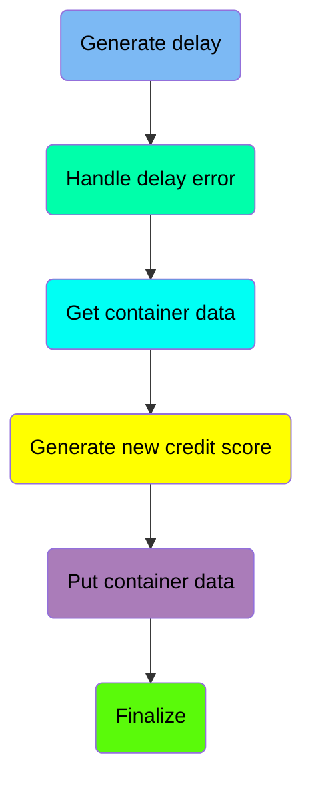
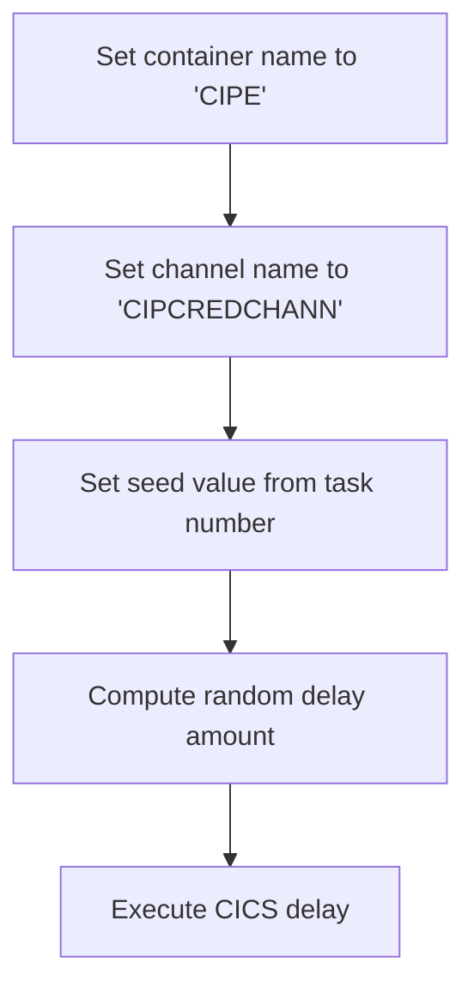
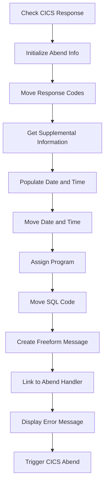
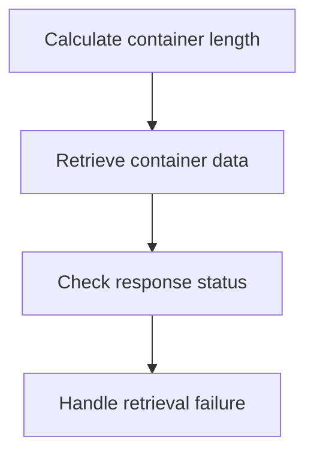
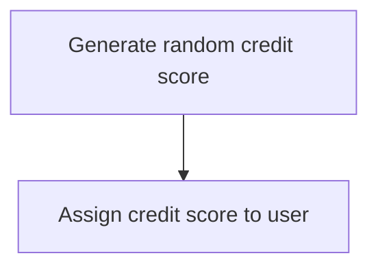
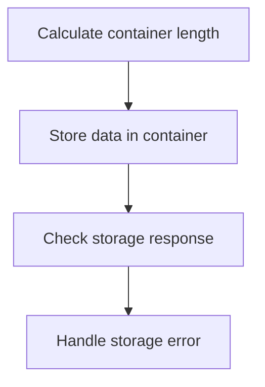
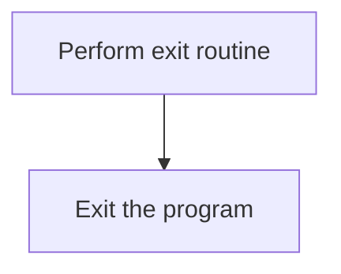

The <SwmToken path="src/base/cobol_src/CRDTAGY5.cbl" pos="236:4:4" line-data="              DISPLAY &#39;CRDTAGY5- UNABLE TO PUT CONTAINER. RESP=&#39;">`CRDTAGY5`</SwmToken> program is responsible for generating a new credit score for a user. This is achieved by computing a random number between 1 and 999, assigning it to the user's credit score field, and handling any potential errors during the process.

The flow involves generating a random credit score, assigning it to the user, and ensuring that any errors are properly handled to maintain data integrity.

Here is a high level diagram of the program:



## Generate delay

First, we'll zoom into this section of the flow:



First, the container name is set to 'CIPE' to specify the target container for the operation.

Moving to the next step, the channel name is set to 'CIPCREDCHANN', which defines the communication channel for the operation.

Next, the seed value is set from the task number (<SwmToken path="src/base/cobol_src/CRDTAGY5.cbl" pos="121:3:3" line-data="           MOVE EIBTASKN           TO WS-SEED.">`EIBTASKN`</SwmToken>), which will be used to generate a random delay.

Then, a random delay amount between 1 and 3 seconds is computed using the seed value. This delay is introduced to simulate processing time variability.

## Handle delay error

Now, lets zoom into this section of the flow:



First, we check if the CICS response code <SwmToken path="src/base/cobol_src/CRDTAGY5.cbl" pos="196:3:7" line-data="                     RESP(WS-CICS-RESP)">`WS-CICS-RESP`</SwmToken> is not equal to <SwmToken path="src/base/cobol_src/CRDTAGY5.cbl" pos="235:13:16" line-data="           IF WS-CICS-RESP NOT = DFHRESP(NORMAL)">`DFHRESP(NORMAL)`</SwmToken>, indicating an abnormal condition.

Next, we initialize the <SwmToken path="src/base/cobol_src/CRDTAGY5.cbl" pos="104:3:5" line-data="       01 ABNDINFO-REC.">`ABNDINFO-REC`</SwmToken> structure to prepare for storing abend-related information.

We then move the response codes <SwmToken path="src/base/cobol_src/CRDTAGY5.cbl" pos="140:3:3" line-data="              MOVE EIBRESP    TO ABND-RESPCODE">`EIBRESP`</SwmToken> and <SwmToken path="src/base/cobol_src/CRDTAGY5.cbl" pos="141:3:3" line-data="              MOVE EIBRESP2   TO ABND-RESP2CODE">`EIBRESP2`</SwmToken> into <SwmToken path="src/base/cobol_src/CRDTAGY5.cbl" pos="140:7:9" line-data="              MOVE EIBRESP    TO ABND-RESPCODE">`ABND-RESPCODE`</SwmToken> and <SwmToken path="src/base/cobol_src/CRDTAGY5.cbl" pos="141:7:9" line-data="              MOVE EIBRESP2   TO ABND-RESP2CODE">`ABND-RESP2CODE`</SwmToken> respectively to preserve the original response information.

Moving to the next step, we execute the CICS <SwmToken path="src/base/cobol_src/CRDTAGY5.cbl" pos="145:5:5" line-data="              EXEC CICS ASSIGN APPLID(ABND-APPLID)">`ASSIGN`</SwmToken> command to get the application ID and store it in <SwmToken path="src/base/cobol_src/CRDTAGY5.cbl" pos="145:9:11" line-data="              EXEC CICS ASSIGN APPLID(ABND-APPLID)">`ABND-APPLID`</SwmToken>.

We then move the task number and transaction ID into <SwmToken path="src/base/cobol_src/CRDTAGY5.cbl" pos="148:7:11" line-data="              MOVE EIBTASKN   TO ABND-TASKNO-KEY">`ABND-TASKNO-KEY`</SwmToken> and <SwmToken path="src/base/cobol_src/CRDTAGY5.cbl" pos="149:7:9" line-data="              MOVE EIBTRNID   TO ABND-TRANID">`ABND-TRANID`</SwmToken> respectively for further identification.

Next, we perform the <SwmToken path="src/base/cobol_src/CRDTAGY5.cbl" pos="151:3:7" line-data="              PERFORM POPULATE-TIME-DATE">`POPULATE-TIME-DATE`</SwmToken> routine to get the current date and time.

We then move the original date and the current time into <SwmToken path="src/base/cobol_src/CRDTAGY5.cbl" pos="153:11:13" line-data="              MOVE WS-ORIG-DATE TO ABND-DATE">`ABND-DATE`</SwmToken> and <SwmToken path="src/base/cobol_src/CRDTAGY5.cbl" pos="159:3:5" line-data="                       INTO ABND-TIME">`ABND-TIME`</SwmToken> respectively.

Following this, we assign the program name to <SwmToken path="src/base/cobol_src/CRDTAGY5.cbl" pos="165:9:11" line-data="              EXEC CICS ASSIGN PROGRAM(ABND-PROGRAM)">`ABND-PROGRAM`</SwmToken> and set the SQL code to zero in <SwmToken path="src/base/cobol_src/CRDTAGY5.cbl" pos="168:7:9" line-data="              MOVE ZEROS      TO ABND-SQLCODE">`ABND-SQLCODE`</SwmToken>.

## Get container data

Now, lets zoom into this section of the flow:



<SwmSnippet path="/src/base/cobol_src/CRDTAGY5.cbl" line="190">

---

First, the length of the container data is calculated and stored in <SwmToken path="src/base/cobol_src/CRDTAGY5.cbl" pos="190:3:7" line-data="           COMPUTE WS-CONTAINER-LEN = LENGTH OF WS-CONT-IN.">`WS-CONTAINER-LEN`</SwmToken> (which holds the length of the container data).

```cobol
           COMPUTE WS-CONTAINER-LEN = LENGTH OF WS-CONT-IN.
```

---

</SwmSnippet>

<SwmSnippet path="/src/base/cobol_src/CRDTAGY5.cbl" line="192">

---

Next, the code attempts to retrieve the container data using the <SwmToken path="src/base/cobol_src/CRDTAGY5.cbl" pos="192:1:7" line-data="           EXEC CICS GET CONTAINER(WS-CONTAINER-NAME)">`EXEC CICS GET CONTAINER`</SwmToken> command, specifying the container name, channel name, and other relevant parameters.

```cobol
           EXEC CICS GET CONTAINER(WS-CONTAINER-NAME)
                     CHANNEL(WS-CHANNEL-NAME)
                     INTO(WS-CONT-IN)
                     FLENGTH(WS-CONTAINER-LEN)
                     RESP(WS-CICS-RESP)
                     RESP2(WS-CICS-RESP2)
           END-EXEC.
```

---

</SwmSnippet>

## Interim Summary

So far, we saw how to generate a delay and handle any errors that might occur during this process. We also covered how to retrieve container data and handle any potential retrieval failures. Now, we will focus on generating a new credit score for the user and assigning it to their profile.

## Generate new credit score

This is the next section of the flow.



<SwmSnippet path="/src/base/cobol_src/CRDTAGY5.cbl" line="216">

---

First, we generate a new credit score for the user by computing a random number between 1 and 999. This is done using the <SwmToken path="src/base/cobol_src/CRDTAGY5.cbl" pos="217:5:5" line-data="                            * FUNCTION RANDOM) + 1.">`RANDOM`</SwmToken> function, which provides a random value that is scaled to the desired range.

```cobol
           COMPUTE WS-NEW-CREDSCORE = ((999 - 1)
                            * FUNCTION RANDOM) + 1.
```

---

</SwmSnippet>

<SwmSnippet path="/src/base/cobol_src/CRDTAGY5.cbl" line="219">

---

Next, the newly generated credit score is assigned to the user's credit score field. This ensures that the user's credit score is updated with the new value.

```cobol
           MOVE WS-NEW-CREDSCORE TO WS-CONT-IN-CREDIT-SCORE.
```

---

</SwmSnippet>

## Put container data

Now, lets zoom into this section of the flow:



<SwmSnippet path="/src/base/cobol_src/CRDTAGY5.cbl" line="225">

---

### Calculating container length

First, the length of the data to be stored in the container is calculated and stored in <SwmToken path="src/base/cobol_src/CRDTAGY5.cbl" pos="225:3:7" line-data="           COMPUTE WS-CONTAINER-LEN = LENGTH OF WS-CONT-IN.">`WS-CONTAINER-LEN`</SwmToken> (the length of the container data).

```cobol
           COMPUTE WS-CONTAINER-LEN = LENGTH OF WS-CONT-IN.
```

---

</SwmSnippet>

<SwmSnippet path="/src/base/cobol_src/CRDTAGY5.cbl" line="227">

---

### Storing data in container

Next, the data is stored in the container using the <SwmToken path="src/base/cobol_src/CRDTAGY5.cbl" pos="227:1:7" line-data="           EXEC CICS PUT CONTAINER(WS-CONTAINER-NAME)">`EXEC CICS PUT CONTAINER`</SwmToken> command. This command specifies the container name, the data to be stored, the length of the data, and the channel name.

```cobol
           EXEC CICS PUT CONTAINER(WS-CONTAINER-NAME)
                         FROM(WS-CONT-IN)
                         FLENGTH(WS-CONTAINER-LEN)
                         CHANNEL(WS-CHANNEL-NAME)
                         RESP(WS-CICS-RESP)
                         RESP2(WS-CICS-RESP2)
```

---

</SwmSnippet>

<SwmSnippet path="/src/base/cobol_src/CRDTAGY5.cbl" line="235">

---

### Checking storage response

Then, the response from the storage operation is checked. If the response is not normal, an error message is displayed, including the response codes and container details, and the <SwmToken path="src/base/cobol_src/CRDTAGY5.cbl" pos="241:3:11" line-data="              PERFORM GET-ME-OUT-OF-HERE">`GET-ME-OUT-OF-HERE`</SwmToken> routine is performed to handle the error.

```cobol
           IF WS-CICS-RESP NOT = DFHRESP(NORMAL)
              DISPLAY 'CRDTAGY5- UNABLE TO PUT CONTAINER. RESP='
                 WS-CICS-RESP ', RESP2=' WS-CICS-RESP2
              DISPLAY  'CONTAINER='  WS-CONTAINER-NAME
              ' CHANNEL=' WS-CHANNEL-NAME ' FLENGTH='
                    WS-CONTAINER-LEN
              PERFORM GET-ME-OUT-OF-HERE
           END-IF.
```

---

</SwmSnippet>

## Finalize

This is the next section of the flow.



<SwmSnippet path="/src/base/cobol_src/CRDTAGY5.cbl" line="244">

---

The <SwmToken path="src/base/cobol_src/CRDTAGY5.cbl" pos="244:1:11" line-data="           PERFORM GET-ME-OUT-OF-HERE.">`PERFORM GET-ME-OUT-OF-HERE`</SwmToken> statement is used to execute the exit routine, which likely includes any necessary cleanup or finalization steps before exiting. This ensures that the program terminates gracefully and any required actions are completed before the program ends.

```cobol
           PERFORM GET-ME-OUT-OF-HERE.

       A999.
           EXIT.
```

---

</SwmSnippet>

&nbsp;

*This is an auto-generated document by Swimm 🌊 and has not yet been verified by a human*

<SwmMeta version="3.0.0" repo-id="Z2l0aHViJTNBJTNBY2ljcy1iYW5raW5nLXNhbXBsZS1hcHBsaWNhdGlvbi1jYnNhLUlCTS1EZW1vJTNBJTNBU3dpbW0tRGVtbw==" repo-name="cics-banking-sample-application-cbsa-IBM-Demo"><sup>Powered by [Swimm](/)</sup></SwmMeta>
