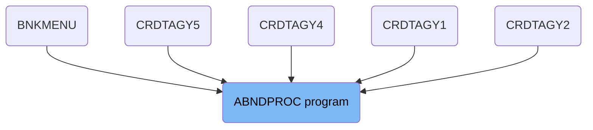
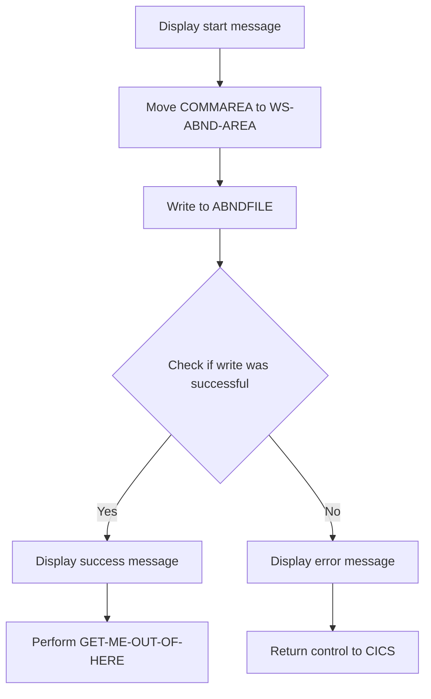
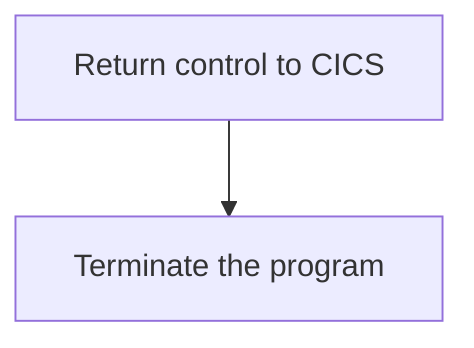

The ABNDPROC program is responsible for handling abnormal terminations within the system. It achieves this by capturing the state of the system at the time of the termination and writing it to a VSAM file for later analysis. This ensures that any issues can be diagnosed and resolved efficiently.

The ABNDPROC program starts by displaying a message indicating the beginning of the process. It then moves the data from the communication area to a working storage area and writes this data to a VSAM file. If the write operation is successful, a success message is displayed; otherwise, an error message is shown. Finally, the program returns control to CICS and terminates.

# Where is this program used?

This program is used multiple times in the codebase as represented in the following diagram:

(Note - these are only some of the usages of this program)



## PREMIERE

Lets' zoom into this section of the flow:



<SwmSnippet path="/src/base/cobol_src/ABNDPROC.cbl" line="135">

---

First, the function displays a message indicating the start of the ABNDPROC process and the value of the <SwmToken path="src/base/cobol_src/ABNDPROC.cbl" pos="136:12:12" line-data="      D    DISPLAY &#39;COMMAREA passed=&#39; DFHCOMMAREA.">`DFHCOMMAREA`</SwmToken>.

```cobol
      D    DISPLAY 'Started ABNDPROC:'.
      D    DISPLAY 'COMMAREA passed=' DFHCOMMAREA.
```

---

</SwmSnippet>

<SwmSnippet path="/src/base/cobol_src/ABNDPROC.cbl" line="139">

---

Next, the <SwmToken path="src/base/cobol_src/ABNDPROC.cbl" pos="139:3:3" line-data="           MOVE DFHCOMMAREA TO WS-ABND-AREA.">`DFHCOMMAREA`</SwmToken> is moved to <SwmToken path="src/base/cobol_src/ABNDPROC.cbl" pos="139:7:11" line-data="           MOVE DFHCOMMAREA TO WS-ABND-AREA.">`WS-ABND-AREA`</SwmToken> to prepare it for writing to the VSAM file.

```cobol
           MOVE DFHCOMMAREA TO WS-ABND-AREA.
```

---

</SwmSnippet>

<SwmSnippet path="/src/base/cobol_src/ABNDPROC.cbl" line="141">

---

Then, the function writes the contents of <SwmToken path="src/base/cobol_src/ABNDPROC.cbl" pos="143:3:7" line-data="              FROM(WS-ABND-AREA)">`WS-ABND-AREA`</SwmToken> to the VSAM file <SwmToken path="src/base/cobol_src/ABNDPROC.cbl" pos="142:4:4" line-data="              FILE(&#39;ABNDFILE&#39;)">`ABNDFILE`</SwmToken>.

```cobol
           EXEC CICS WRITE
              FILE('ABNDFILE')
              FROM(WS-ABND-AREA)
              RIDFLD(ABND-VSAM-KEY)
              RESP(WS-CICS-RESP)
              RESP2(WS-CICS-RESP2)
           END-EXEC.
```

---

</SwmSnippet>

<SwmSnippet path="/src/base/cobol_src/ABNDPROC.cbl" line="149">

---

The function checks if the write operation was successful by evaluating the response code <SwmToken path="src/base/cobol_src/ABNDPROC.cbl" pos="149:3:7" line-data="           IF WS-CICS-RESP NOT= DFHRESP(NORMAL)">`WS-CICS-RESP`</SwmToken>.

```cobol
           IF WS-CICS-RESP NOT= DFHRESP(NORMAL)
```

---

</SwmSnippet>

<SwmSnippet path="/src/base/cobol_src/ABNDPROC.cbl" line="150">

---

If the write operation was not successful, an error message is displayed with the response codes <SwmToken path="src/base/cobol_src/ABNDPROC.cbl" pos="152:8:12" line-data="              DISPLAY &#39;RESP=&#39; WS-CICS-RESP &#39; RESP2=&#39; WS-CICS-RESP2">`WS-CICS-RESP`</SwmToken> and <SwmToken path="src/base/cobol_src/ABNDPROC.cbl" pos="152:20:24" line-data="              DISPLAY &#39;RESP=&#39; WS-CICS-RESP &#39; RESP2=&#39; WS-CICS-RESP2">`WS-CICS-RESP2`</SwmToken>.

```cobol
              DISPLAY '*********************************************'
              DISPLAY '**** Unable to write to the file ABNDFILE !!!'
              DISPLAY 'RESP=' WS-CICS-RESP ' RESP2=' WS-CICS-RESP2
              DISPLAY '*********************************************'
```

---

</SwmSnippet>

<SwmSnippet path="/src/base/cobol_src/ABNDPROC.cbl" line="155">

---

In case of an error, the function returns control to CICS.

```cobol
              EXEC CICS RETURN
              END-EXEC
```

---

</SwmSnippet>

<SwmSnippet path="/src/base/cobol_src/ABNDPROC.cbl" line="160">

---

If the write operation was successful, a success message is displayed along with the contents of <SwmToken path="src/base/cobol_src/ABNDPROC.cbl" pos="161:5:9" line-data="      D    DISPLAY WS-ABND-AREA.">`WS-ABND-AREA`</SwmToken>.

```cobol
      D    DISPLAY 'ABEND record successfully written to ABNDFILE'.
      D    DISPLAY WS-ABND-AREA.
```

---

</SwmSnippet>

<SwmSnippet path="/src/base/cobol_src/ABNDPROC.cbl" line="163">

---

Finally, the function performs the <SwmToken path="src/base/cobol_src/ABNDPROC.cbl" pos="163:3:11" line-data="           PERFORM GET-ME-OUT-OF-HERE.">`GET-ME-OUT-OF-HERE`</SwmToken> routine.

```cobol
           PERFORM GET-ME-OUT-OF-HERE.
```

---

</SwmSnippet>

## Interim Summary

So far, we saw the detailed steps involved in the ABNDPROC process, including displaying start messages, moving data to <SwmToken path="src/base/cobol_src/ABNDPROC.cbl" pos="139:7:11" line-data="           MOVE DFHCOMMAREA TO WS-ABND-AREA.">`WS-ABND-AREA`</SwmToken>, writing to the VSAM file, and handling success or error scenarios. Now, we will focus on the <SwmToken path="src/base/cobol_src/ABNDPROC.cbl" pos="163:3:11" line-data="           PERFORM GET-ME-OUT-OF-HERE.">`GET-ME-OUT-OF-HERE`</SwmToken> routine, which involves returning control to CICS and terminating the program.

## <SwmToken path="src/base/cobol_src/ABNDPROC.cbl" pos="163:3:11" line-data="           PERFORM GET-ME-OUT-OF-HERE.">`GET-ME-OUT-OF-HERE`</SwmToken>

Lets' zoom into this section of the flow:



<SwmSnippet path="/src/base/cobol_src/ABNDPROC.cbl" line="171">

---

First, the <SwmToken path="src/base/cobol_src/ABNDPROC.cbl" pos="171:1:5" line-data="           EXEC CICS RETURN">`EXEC CICS RETURN`</SwmToken> command is executed, which returns control to the CICS region, effectively ending the current transaction.

```cobol
           EXEC CICS RETURN
           END-EXEC.
```

---

</SwmSnippet>

<SwmSnippet path="/src/base/cobol_src/ABNDPROC.cbl" line="173">

---

Next, the <SwmToken path="src/base/cobol_src/ABNDPROC.cbl" pos="173:1:1" line-data="           GOBACK.">`GOBACK`</SwmToken> statement is used to return control to the calling program, ensuring that the current process is terminated properly.

```cobol
           GOBACK.
```

---

</SwmSnippet>

&nbsp;

*This is an auto-generated document by Swimm 🌊 and has not yet been verified by a human*

<SwmMeta version="3.0.0" repo-id="Z2l0aHViJTNBJTNBY2ljcy1iYW5raW5nLXNhbXBsZS1hcHBsaWNhdGlvbi1jYnNhLUlCTS1EZW1vJTNBJTNBU3dpbW0tRGVtbw==" repo-name="cics-banking-sample-application-cbsa-IBM-Demo"><sup>Powered by [Swimm](/)</sup></SwmMeta>
