The XFRFUN program is used to handle account transfers within the banking system. It ensures that account details are correctly initialized, validates transfer amounts, updates account information in the <SwmToken path="src/base/cobol_src/XFRFUN.cbl" pos="279:7:7" line-data="           MOVE  0  TO DB2-DEADLOCK-RETRY.">`DB2`</SwmToken> database, and handles any errors that may occur during the process. The program achieves this by following a structured flow that includes initializing account details, setting sort codes, checking transfer amounts, updating the database, and completing the transaction.

The flow starts by initializing account details to ensure a clean state. It then sets the sort codes for the source and target accounts, checks if the transfer amount is valid, and updates the account details in the <SwmToken path="src/base/cobol_src/XFRFUN.cbl" pos="279:7:7" line-data="           MOVE  0  TO DB2-DEADLOCK-RETRY.">`DB2`</SwmToken> database. If any errors occur, the program handles them by rolling back the transaction and logging the error details. Finally, the transaction is completed by performing any necessary cleanup steps.

# Where is this program used?

This program is used once, in a flow starting from `BNK1TFN` as represented in the following diagram:

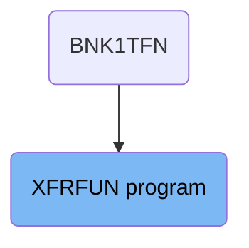

## PREMIERE

Lets' zoom into this section of the flow:

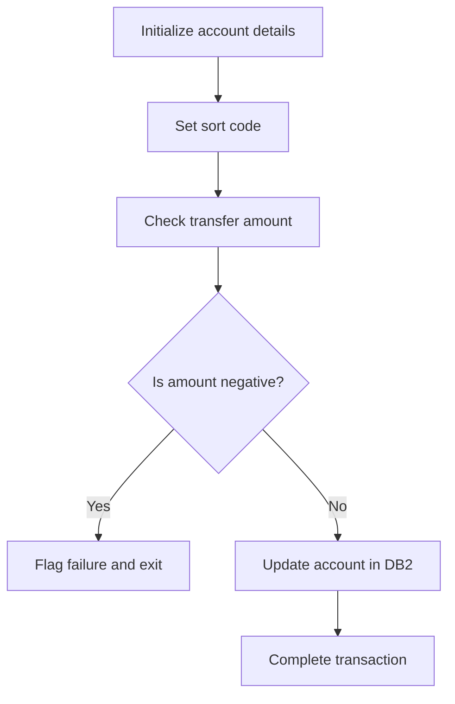

<SwmSnippet path="/src/base/cobol_src/XFRFUN.cbl" line="276">

---

### Initializing account details

First, the section initializes various account-related fields to default values to ensure a clean state for the transaction.

```cobol
           MOVE '0' TO HV-ACCOUNT-EYECATCHER.
           MOVE '0' TO HV-ACCOUNT-SORTCODE.
           MOVE '0' TO HV-ACCOUNT-ACC-NO.
           MOVE  0  TO DB2-DEADLOCK-RETRY.
```

---

</SwmSnippet>

<SwmSnippet path="/src/base/cobol_src/XFRFUN.cbl" line="281">

---

### Setting sort code

Moving to the next step, the sort code is set for both the source and target accounts, which is essential for identifying the accounts involved in the transaction.

```cobol
           MOVE SORTCODE TO COMM-FSCODE COMM-TSCODE.

           MOVE SORTCODE TO DESIRED-SORT-CODE.
```

---

</SwmSnippet>

<SwmSnippet path="/src/base/cobol_src/XFRFUN.cbl" line="289">

---

### Checking transfer amount

Next, the section checks if the amount being transferred is negative. This is a critical validation step to prevent invalid transactions.

```cobol
           IF COMM-AMT <= ZERO
             MOVE 'N' TO COMM-SUCCESS
             MOVE '4' TO COMM-FAIL-CODE
             PERFORM GET-ME-OUT-OF-HERE
           END-IF.
```

---

</SwmSnippet>

<SwmSnippet path="/src/base/cobol_src/XFRFUN.cbl" line="289">

---

### Flagging failure for negative amount

If the transfer amount is negative, the transaction is flagged as a failure, and the process is terminated early to prevent further processing.

```cobol
           IF COMM-AMT <= ZERO
             MOVE 'N' TO COMM-SUCCESS
             MOVE '4' TO COMM-FAIL-CODE
             PERFORM GET-ME-OUT-OF-HERE
           END-IF.
```

---

</SwmSnippet>

<SwmSnippet path="/src/base/cobol_src/XFRFUN.cbl" line="296">

---

### Updating account in <SwmToken path="src/base/cobol_src/XFRFUN.cbl" pos="296:7:7" line-data="           PERFORM UPDATE-ACCOUNT-DB2">`DB2`</SwmToken>

Then, if the amount is valid, the account details are updated in the <SwmToken path="src/base/cobol_src/XFRFUN.cbl" pos="296:7:7" line-data="           PERFORM UPDATE-ACCOUNT-DB2">`DB2`</SwmToken> database to reflect the transaction.

```cobol
           PERFORM UPDATE-ACCOUNT-DB2
```

---

</SwmSnippet>

<SwmSnippet path="/src/base/cobol_src/XFRFUN.cbl" line="302">

---

### Completing the transaction

Finally, the section completes the transaction by performing any necessary cleanup and finalization steps.

```cobol
           PERFORM GET-ME-OUT-OF-HERE.
```

---

</SwmSnippet>

## <SwmToken path="src/base/cobol_src/XFRFUN.cbl" pos="292:3:11" line-data="             PERFORM GET-ME-OUT-OF-HERE">`GET-ME-OUT-OF-HERE`</SwmToken>

Lets' zoom into this section of the flow:

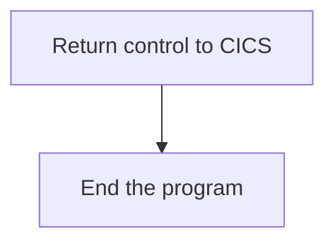

<SwmSnippet path="/src/base/cobol_src/XFRFUN.cbl" line="1728">

---

First, the <SwmToken path="src/base/cobol_src/XFRFUN.cbl" pos="292:3:11" line-data="             PERFORM GET-ME-OUT-OF-HERE">`GET-ME-OUT-OF-HERE`</SwmToken> function initiates the process of returning control to CICS. This is done using the <SwmToken path="src/base/cobol_src/XFRFUN.cbl" pos="1728:1:5" line-data="           EXEC CICS RETURN">`EXEC CICS RETURN`</SwmToken> command, which signals the end of the current task and returns control to the CICS region.

```cobol
           EXEC CICS RETURN
           END-EXEC.
```

---

</SwmSnippet>

<SwmSnippet path="/src/base/cobol_src/XFRFUN.cbl" line="1731">

---

Next, the function executes the <SwmToken path="src/base/cobol_src/XFRFUN.cbl" pos="1731:1:1" line-data="           GOBACK.">`GOBACK`</SwmToken> statement, which ensures that the program ends gracefully and returns control to the calling program or the operating system.

```cobol
           GOBACK.
```

---

</SwmSnippet>

# Update account (<SwmToken path="src/base/cobol_src/XFRFUN.cbl" pos="296:3:7" line-data="           PERFORM UPDATE-ACCOUNT-DB2">`UPDATE-ACCOUNT-DB2`</SwmToken>)

Let's split this section into smaller parts:

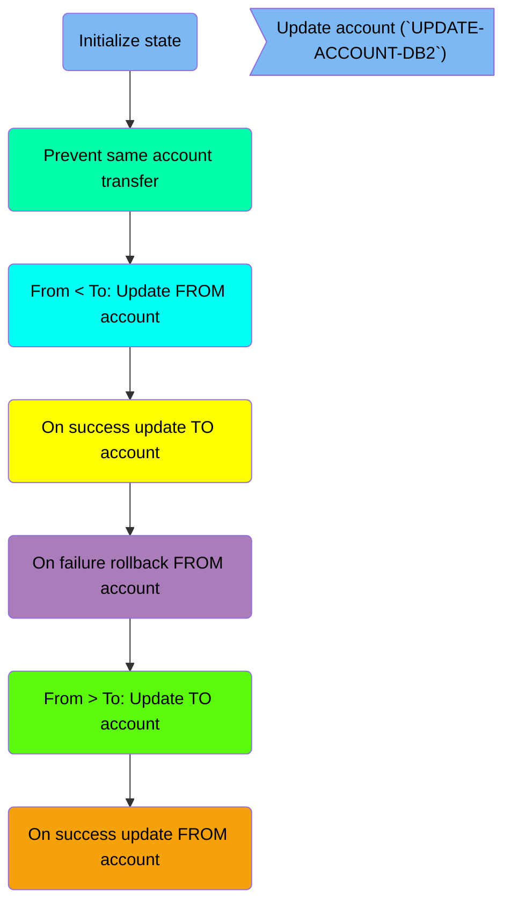

## Initialize state

First, we'll zoom into this section of the flow:

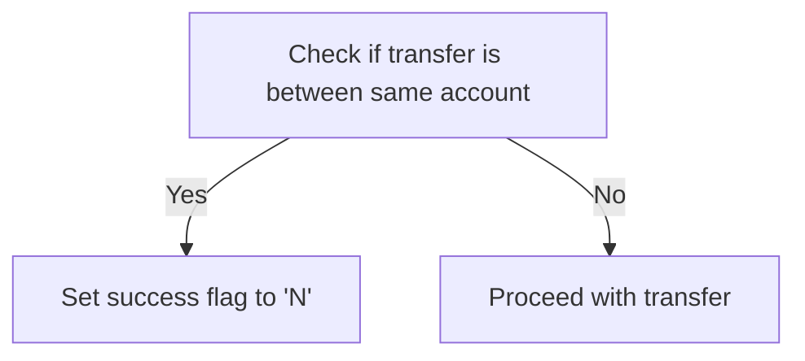

<SwmSnippet path="/src/base/cobol_src/XFRFUN.cbl" line="311">

---

First, the code sets the <SwmToken path="src/base/cobol_src/XFRFUN.cbl" pos="311:9:11" line-data="           MOVE &#39;N&#39; TO COMM-SUCCESS.">`COMM-SUCCESS`</SwmToken> flag to 'N' to indicate that the operation has not yet succeeded.

```cobol
           MOVE 'N' TO COMM-SUCCESS.
```

---

</SwmSnippet>

<SwmSnippet path="/src/base/cobol_src/XFRFUN.cbl" line="316">

---

Next, it checks if the transfer is being attempted between the same account by comparing <SwmToken path="src/base/cobol_src/XFRFUN.cbl" pos="316:3:5" line-data="           IF COMM-FACCNO = COMM-TACCNO">`COMM-FACCNO`</SwmToken> (from account number) and <SwmToken path="src/base/cobol_src/XFRFUN.cbl" pos="316:9:11" line-data="           IF COMM-FACCNO = COMM-TACCNO">`COMM-TACCNO`</SwmToken> (to account number). If they are the same, the transfer is not allowed.

```cobol
           IF COMM-FACCNO = COMM-TACCNO
```

---

</SwmSnippet>

## Prevent same account transfer

Now, lets zoom into this section of the flow:

```mermaid
graph TD
  A[Initialize ABNDINFO-REC] --> B[Move EIBRESP to ABND-RESPCODE]
  B --> C[Move EIBRESP2 to ABND-RESP2CODE]
  C --> D[Get supplemental information]
  D --> E[Move EIBTASKN to ABND-TASKNO-KEY]
  E --> F[Move EIBTRNID to ABND-TRANID]
  F --> G[Perform POPULATE-TIME-DATE]
  G --> H[Move WS-ORIG-DATE to ABND-DATE]
  H --> I[Format and move current time to ABND-TIME]
  I --> J[Move WS-U-TIME to ABND-UTIME-KEY]
  J --> K[Move 'SAME' to ABND-CODE]
  K --> L[Assign current program to ABND-PROGRAM]
  L --> M[Move ZEROS to ABND-SQLCODE]
  M --> N[Format error message into ABND-FREEFORM]
  N --> O[Link to ABNDPROC program]
  O --> P[Display error message]
  P --> Q[Trigger CICS ABEND]

%% Swimm:
%% graph TD
%%   A[Initialize <SwmToken path="src/base/cobol_src/XFRFUN.cbl" pos="324:3:5" line-data="              INITIALIZE ABNDINFO-REC">`ABNDINFO-REC`</SwmToken>] --> B[Move EIBRESP to <SwmToken path="src/base/cobol_src/XFRFUN.cbl" pos="325:7:9" line-data="              MOVE EIBRESP    TO ABND-RESPCODE">`ABND-RESPCODE`</SwmToken>]
%%   B --> C[Move <SwmToken path="src/base/cobol_src/XFRFUN.cbl" pos="326:3:3" line-data="              MOVE EIBRESP2   TO ABND-RESP2CODE">`EIBRESP2`</SwmToken> to <SwmToken path="src/base/cobol_src/XFRFUN.cbl" pos="326:7:9" line-data="              MOVE EIBRESP2   TO ABND-RESP2CODE">`ABND-RESP2CODE`</SwmToken>]
%%   C --> D[Get supplemental information]
%%   D --> E[Move EIBTASKN to <SwmToken path="src/base/cobol_src/XFRFUN.cbl" pos="333:7:11" line-data="              MOVE EIBTASKN   TO ABND-TASKNO-KEY">`ABND-TASKNO-KEY`</SwmToken>]
%%   E --> F[Move EIBTRNID to <SwmToken path="src/base/cobol_src/XFRFUN.cbl" pos="334:7:9" line-data="              MOVE EIBTRNID   TO ABND-TRANID">`ABND-TRANID`</SwmToken>]
%%   F --> G[Perform <SwmToken path="src/base/cobol_src/XFRFUN.cbl" pos="545:3:7" line-data="                    PERFORM POPULATE-TIME-DATE">`POPULATE-TIME-DATE`</SwmToken>]
%%   G --> H[Move <SwmToken path="src/base/cobol_src/XFRFUN.cbl" pos="338:3:7" line-data="              MOVE WS-ORIG-DATE TO ABND-DATE">`WS-ORIG-DATE`</SwmToken> to <SwmToken path="src/base/cobol_src/XFRFUN.cbl" pos="338:11:13" line-data="              MOVE WS-ORIG-DATE TO ABND-DATE">`ABND-DATE`</SwmToken>]
%%   H --> I[Format and move current time to <SwmToken path="src/base/cobol_src/XFRFUN.cbl" pos="344:3:5" line-data="                    INTO ABND-TIME">`ABND-TIME`</SwmToken>]
%%   I --> J[Move <SwmToken path="src/base/cobol_src/XFRFUN.cbl" pos="347:3:7" line-data="              MOVE WS-U-TIME   TO ABND-UTIME-KEY">`WS-U-TIME`</SwmToken> to <SwmToken path="src/base/cobol_src/XFRFUN.cbl" pos="347:11:15" line-data="              MOVE WS-U-TIME   TO ABND-UTIME-KEY">`ABND-UTIME-KEY`</SwmToken>]
%%   J --> K[Move 'SAME' to <SwmToken path="src/base/cobol_src/XFRFUN.cbl" pos="348:9:11" line-data="              MOVE &#39;SAME&#39;      TO ABND-CODE">`ABND-CODE`</SwmToken>]
%%   K --> L[Assign current program to <SwmToken path="src/base/cobol_src/XFRFUN.cbl" pos="350:9:11" line-data="              EXEC CICS ASSIGN PROGRAM(ABND-PROGRAM)">`ABND-PROGRAM`</SwmToken>]
%%   L --> M[Move ZEROS to <SwmToken path="src/base/cobol_src/XFRFUN.cbl" pos="353:7:9" line-data="              MOVE ZEROS      TO ABND-SQLCODE">`ABND-SQLCODE`</SwmToken>]
%%   M --> N[Format error message into <SwmToken path="src/base/cobol_src/XFRFUN.cbl" pos="361:3:5" line-data="                   INTO ABND-FREEFORM">`ABND-FREEFORM`</SwmToken>]
%%   N --> O[Link to ABNDPROC program]
%%   O --> P[Display error message]
%%   P --> Q[Trigger CICS ABEND]
```

<SwmSnippet path="/src/base/cobol_src/XFRFUN.cbl" line="324">

---

First, the <SwmToken path="src/base/cobol_src/XFRFUN.cbl" pos="324:3:5" line-data="              INITIALIZE ABNDINFO-REC">`ABNDINFO-REC`</SwmToken> structure is initialized to prepare for capturing error information.

```cobol
              INITIALIZE ABNDINFO-REC
```

---

</SwmSnippet>

<SwmSnippet path="/src/base/cobol_src/XFRFUN.cbl" line="325">

---

Moving to the next step, the response codes <SwmToken path="src/base/cobol_src/XFRFUN.cbl" pos="325:3:3" line-data="              MOVE EIBRESP    TO ABND-RESPCODE">`EIBRESP`</SwmToken> and <SwmToken path="src/base/cobol_src/XFRFUN.cbl" pos="326:3:3" line-data="              MOVE EIBRESP2   TO ABND-RESP2CODE">`EIBRESP2`</SwmToken> are stored in <SwmToken path="src/base/cobol_src/XFRFUN.cbl" pos="325:7:9" line-data="              MOVE EIBRESP    TO ABND-RESPCODE">`ABND-RESPCODE`</SwmToken> and <SwmToken path="src/base/cobol_src/XFRFUN.cbl" pos="326:7:9" line-data="              MOVE EIBRESP2   TO ABND-RESP2CODE">`ABND-RESP2CODE`</SwmToken> respectively to capture the error details.

```cobol
              MOVE EIBRESP    TO ABND-RESPCODE
              MOVE EIBRESP2   TO ABND-RESP2CODE
```

---

</SwmSnippet>

<SwmSnippet path="/src/base/cobol_src/XFRFUN.cbl" line="330">

---

Next, supplemental information such as the application ID, task number, and transaction ID are retrieved and stored in the corresponding fields of <SwmToken path="src/base/cobol_src/XFRFUN.cbl" pos="324:3:5" line-data="              INITIALIZE ABNDINFO-REC">`ABNDINFO-REC`</SwmToken>.

```cobol
              EXEC CICS ASSIGN APPLID(ABND-APPLID)
              END-EXEC

              MOVE EIBTASKN   TO ABND-TASKNO-KEY
              MOVE EIBTRNID   TO ABND-TRANID

```

---

</SwmSnippet>

<SwmSnippet path="/src/base/cobol_src/XFRFUN.cbl" line="338">

---

Then, the current date and time are formatted and stored in <SwmToken path="src/base/cobol_src/XFRFUN.cbl" pos="338:11:13" line-data="              MOVE WS-ORIG-DATE TO ABND-DATE">`ABND-DATE`</SwmToken> and <SwmToken path="src/base/cobol_src/XFRFUN.cbl" pos="344:3:5" line-data="                    INTO ABND-TIME">`ABND-TIME`</SwmToken> to record when the error occurred.

```cobol
              MOVE WS-ORIG-DATE TO ABND-DATE
              STRING WS-TIME-NOW-GRP-HH DELIMITED BY SIZE,
                    ':' DELIMITED BY SIZE,
                    WS-TIME-NOW-GRP-MM DELIMITED BY SIZE,
                    ':' DELIMITED BY SIZE,
                    WS-TIME-NOW-GRP-MM DELIMITED BY SIZE
                    INTO ABND-TIME
```

---

</SwmSnippet>

<SwmSnippet path="/src/base/cobol_src/XFRFUN.cbl" line="347">

---

Following this, the universal time is stored in <SwmToken path="src/base/cobol_src/XFRFUN.cbl" pos="347:11:15" line-data="              MOVE WS-U-TIME   TO ABND-UTIME-KEY">`ABND-UTIME-KEY`</SwmToken> and the error code 'SAME' is assigned to <SwmToken path="src/base/cobol_src/XFRFUN.cbl" pos="348:9:11" line-data="              MOVE &#39;SAME&#39;      TO ABND-CODE">`ABND-CODE`</SwmToken> to indicate the specific error condition.

```cobol
              MOVE WS-U-TIME   TO ABND-UTIME-KEY
              MOVE 'SAME'      TO ABND-CODE
```

---

</SwmSnippet>

<SwmSnippet path="/src/base/cobol_src/XFRFUN.cbl" line="350">

---

The current program name is assigned to <SwmToken path="src/base/cobol_src/XFRFUN.cbl" pos="350:9:11" line-data="              EXEC CICS ASSIGN PROGRAM(ABND-PROGRAM)">`ABND-PROGRAM`</SwmToken> to identify which program encountered the error.

```cobol
              EXEC CICS ASSIGN PROGRAM(ABND-PROGRAM)
              END-EXEC
```

---

</SwmSnippet>

<SwmSnippet path="/src/base/cobol_src/XFRFUN.cbl" line="353">

---

Additionally, the SQL code is set to zero in <SwmToken path="src/base/cobol_src/XFRFUN.cbl" pos="353:7:9" line-data="              MOVE ZEROS      TO ABND-SQLCODE">`ABND-SQLCODE`</SwmToken> to indicate no SQL error occurred.

```cobol
              MOVE ZEROS      TO ABND-SQLCODE
```

---

</SwmSnippet>

<SwmSnippet path="/src/base/cobol_src/XFRFUN.cbl" line="355">

---

An error message is then formatted and stored in <SwmToken path="src/base/cobol_src/XFRFUN.cbl" pos="361:3:5" line-data="                   INTO ABND-FREEFORM">`ABND-FREEFORM`</SwmToken> to provide a detailed description of the error.

```cobol
              STRING 'UAD010 - Cannot transfer to the same account '
                   DELIMITED BY SIZE,
                   ' EIBRESP=' DELIMITED BY SIZE,
                   ABND-RESPCODE DELIMITED BY SIZE,
                   ' RESP2=' DELIMITED BY SIZE,
                   ABND-RESP2CODE DELIMITED BY SIZE
                   INTO ABND-FREEFORM
```

---

</SwmSnippet>

<SwmSnippet path="/src/base/cobol_src/XFRFUN.cbl" line="364">

---

Finally, the <SwmToken path="src/base/cobol_src/XFRFUN.cbl" pos="365:3:5" line-data="                       COMMAREA(ABNDINFO-REC)">`ABNDINFO-REC`</SwmToken> is passed to the <SwmToken path="src/base/cobol_src/XFRFUN.cbl" pos="257:19:19" line-data="       01 WS-ABEND-PGM                  PIC X(8)      VALUE &#39;ABNDPROC&#39;.">`ABNDPROC`</SwmToken> program via a CICS LINK command to handle the abnormal termination, and an error message is displayed to the user.

```cobol
              EXEC CICS LINK PROGRAM(WS-ABEND-PGM)
                       COMMAREA(ABNDINFO-REC)
              END-EXEC

              DISPLAY 'Cannot transfer to the same account'
```

---

</SwmSnippet>

## From < To: Update FROM account

Now, lets zoom into this section of the flow:

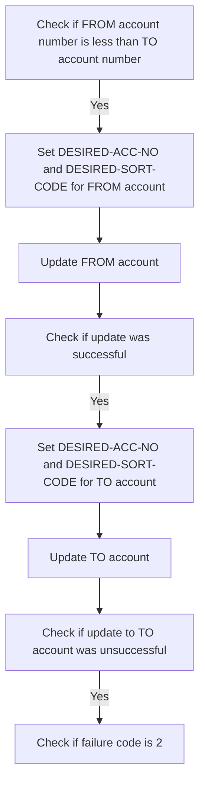

<SwmSnippet path="/src/base/cobol_src/XFRFUN.cbl" line="378">

---

First, the code checks if the <SwmToken path="src/base/cobol_src/XFRFUN.cbl" pos="378:3:5" line-data="           IF COMM-FACCNO &lt; COMM-TACCNO">`COMM-FACCNO`</SwmToken> (FROM account number) is less than the <SwmToken path="src/base/cobol_src/XFRFUN.cbl" pos="378:9:11" line-data="           IF COMM-FACCNO &lt; COMM-TACCNO">`COMM-TACCNO`</SwmToken> (TO account number). This ensures that the FROM account is processed before the TO account.

```cobol
           IF COMM-FACCNO < COMM-TACCNO
```

---

</SwmSnippet>

<SwmSnippet path="/src/base/cobol_src/XFRFUN.cbl" line="383">

---

If the FROM account number is less than the TO account number, the <SwmToken path="src/base/cobol_src/XFRFUN.cbl" pos="383:9:13" line-data="              MOVE COMM-FACCNO TO DESIRED-ACC-NO">`DESIRED-ACC-NO`</SwmToken> and <SwmToken path="src/base/cobol_src/XFRFUN.cbl" pos="384:9:13" line-data="              MOVE COMM-FSCODE TO DESIRED-SORT-CODE">`DESIRED-SORT-CODE`</SwmToken> are set for the FROM account. This prepares the necessary details for updating the FROM account.

```cobol
              MOVE COMM-FACCNO TO DESIRED-ACC-NO
              MOVE COMM-FSCODE TO DESIRED-SORT-CODE
```

---

</SwmSnippet>

<SwmSnippet path="/src/base/cobol_src/XFRFUN.cbl" line="389">

---

Next, the code performs the update operation for the FROM account by calling the <SwmToken path="src/base/cobol_src/XFRFUN.cbl" pos="389:3:9" line-data="              PERFORM UPDATE-ACCOUNT-DB2-FROM">`UPDATE-ACCOUNT-DB2-FROM`</SwmToken> routine. This updates the FROM account details in the database.

```cobol
              PERFORM UPDATE-ACCOUNT-DB2-FROM
```

---

</SwmSnippet>

<SwmSnippet path="/src/base/cobol_src/XFRFUN.cbl" line="394">

---

Then, the code checks if the update operation for the FROM account was successful by evaluating if <SwmToken path="src/base/cobol_src/XFRFUN.cbl" pos="394:3:5" line-data="              IF COMM-SUCCESS = &#39;Y&#39;">`COMM-SUCCESS`</SwmToken> is 'Y'. If the update was successful, it proceeds to update the TO account.

```cobol
              IF COMM-SUCCESS = 'Y'
```

---

</SwmSnippet>

<SwmSnippet path="/src/base/cobol_src/XFRFUN.cbl" line="395">

---

If the update was successful, the <SwmToken path="src/base/cobol_src/XFRFUN.cbl" pos="395:9:13" line-data="                 MOVE COMM-TACCNO TO DESIRED-ACC-NO">`DESIRED-ACC-NO`</SwmToken> and <SwmToken path="src/base/cobol_src/XFRFUN.cbl" pos="396:9:13" line-data="                 MOVE COMM-TSCODE TO DESIRED-SORT-CODE">`DESIRED-SORT-CODE`</SwmToken> are set for the TO account. This prepares the necessary details for updating the TO account.

```cobol
                 MOVE COMM-TACCNO TO DESIRED-ACC-NO
                 MOVE COMM-TSCODE TO DESIRED-SORT-CODE
```

---

</SwmSnippet>

<SwmSnippet path="/src/base/cobol_src/XFRFUN.cbl" line="398">

---

The code then performs the update operation for the TO account by calling the <SwmToken path="src/base/cobol_src/XFRFUN.cbl" pos="398:3:9" line-data="                 PERFORM UPDATE-ACCOUNT-DB2-TO">`UPDATE-ACCOUNT-DB2-TO`</SwmToken> routine. This updates the TO account details in the database.

```cobol
                 PERFORM UPDATE-ACCOUNT-DB2-TO
```

---

</SwmSnippet>

<SwmSnippet path="/src/base/cobol_src/XFRFUN.cbl" line="404">

---

Finally, the code checks if the update operation for the TO account was unsuccessful by evaluating if <SwmToken path="src/base/cobol_src/XFRFUN.cbl" pos="404:3:5" line-data="                 IF COMM-SUCCESS = &#39;N&#39;">`COMM-SUCCESS`</SwmToken> is 'N'. If the update was unsuccessful, it further checks if the failure code is '2' to determine the specific error handling required.

```cobol
                 IF COMM-SUCCESS = 'N'

                    IF COMM-FAIL-CODE = '2'
```

---

</SwmSnippet>

## On success update TO account

Now, lets zoom into this section of the flow:

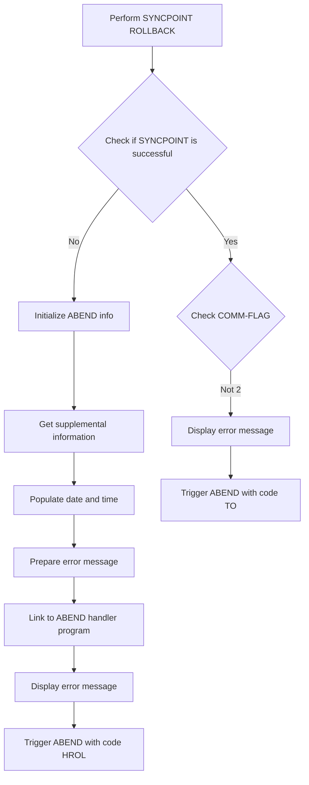

First, the function performs a SYNCPOINT ROLLBACK to ensure that any changes made during the transaction are not committed if an error occurs.

Moving to the next step, it checks if the SYNCPOINT operation was successful by evaluating the response code.

If the SYNCPOINT operation is not successful, it initializes the ABEND information to prepare for error handling.

Then, it gathers supplemental information such as the application ID, task number, and transaction ID to provide context for the error.

Next, it populates the date and time of the error occurrence to help with troubleshooting.

The function then prepares a detailed error message that includes the response codes and a description of the error.

After preparing the error message, it links to the ABEND handler program to log the error details.

Following this, it displays an error message to notify the user of the issue.

Finally, it triggers an ABEND with the code 'HROL' to terminate the transaction without a dump.

If the SYNCPOINT operation is successful, it checks the value of the <SwmToken path="src/base/cobol_src/XFRFUN.cbl" pos="483:7:9" line-data="      *                If the COMM-FLAG is anything else other than">`COMM-FLAG`</SwmToken>.

If the <SwmToken path="src/base/cobol_src/XFRFUN.cbl" pos="483:7:9" line-data="      *                If the COMM-FLAG is anything else other than">`COMM-FLAG`</SwmToken> is not equal to 2, it displays an error message indicating an issue with updating the account.

## On failure rollback FROM account

Now, lets zoom into this section of the flow:

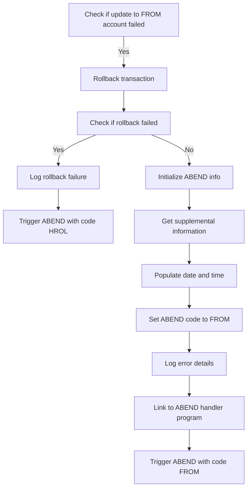

First, we check if the update to the FROM account was unsuccessful by evaluating the <SwmToken path="src/base/cobol_src/XFRFUN.cbl" pos="291:9:13" line-data="             MOVE &#39;4&#39; TO COMM-FAIL-CODE">`COMM-FAIL-CODE`</SwmToken>.

<SwmSnippet path="/src/base/cobol_src/XFRFUN.cbl" line="501">

---

If the update failed, we initiate a rollback of the transaction using the <SwmToken path="src/base/cobol_src/XFRFUN.cbl" pos="1111:5:7" line-data="                 EXEC CICS SYNCPOINT ROLLBACK">`SYNCPOINT ROLLBACK`</SwmToken> command.

```cobol
                 IF COMM-FAIL-CODE = '1'

                    EXEC CICS SYNCPOINT
                       ROLLBACK
                       RESP(WS-CICS-RESP)
                       RESP2(WS-CICS-RESP2)
                    END-EXEC
```

---

</SwmSnippet>

<SwmSnippet path="/src/base/cobol_src/XFRFUN.cbl" line="512">

---

Next, we check if the rollback operation itself failed by evaluating the response code <SwmToken path="src/base/cobol_src/XFRFUN.cbl" pos="512:3:7" line-data="                    IF WS-CICS-RESP IS NOT EQUAL TO DFHRESP(NORMAL)">`WS-CICS-RESP`</SwmToken>.

```cobol
                    IF WS-CICS-RESP IS NOT EQUAL TO DFHRESP(NORMAL)
                       DISPLAY 'XFRFUN error syncpoint '
                          ' rollback after '
                          'updating FROM account '
                          ',RESP=' WS-CICS-RESP
                          ',RESP2=' WS-CICS-RESP2

```

---

</SwmSnippet>

<SwmSnippet path="/src/base/cobol_src/XFRFUN.cbl" line="519">

---

If the rollback failed, we log the failure details and trigger an abnormal end (ABEND) with the code 'HROL'.

```cobol
                       EXEC CICS ABEND
                          ABCODE('HROL')
                          NODUMP
                       END-EXEC
```

---

</SwmSnippet>

<SwmSnippet path="/src/base/cobol_src/XFRFUN.cbl" line="528">

---

If the rollback was successful, we preserve the response codes and initialize the standard ABEND information.

```cobol
      *             Preserve the RESP and RESP2, then set up the
      *             standard ABEND info before getting the applid,
      *             date/time etc. and linking to the Abend Handler
      *             program.
      *
                    INITIALIZE ABNDINFO-REC
                    MOVE EIBRESP    TO ABND-RESPCODE
                    MOVE EIBRESP2   TO ABND-RESP2CODE
```

---

</SwmSnippet>

<SwmSnippet path="/src/base/cobol_src/XFRFUN.cbl" line="537">

---

We then gather supplemental information such as the application ID, task number, and transaction ID.

```cobol
      *             Get supplemental information
      *
                    EXEC CICS ASSIGN APPLID(ABND-APPLID)
                    END-EXEC

                    MOVE EIBTASKN   TO ABND-TASKNO-KEY
                    MOVE EIBTRNID   TO ABND-TRANID

```

---

</SwmSnippet>

<SwmSnippet path="/src/base/cobol_src/XFRFUN.cbl" line="545">

---

Next, we populate the current date and time into the ABEND information record.

```cobol
                    PERFORM POPULATE-TIME-DATE

                    MOVE WS-ORIG-DATE TO ABND-DATE
                    STRING WS-TIME-NOW-GRP-HH DELIMITED BY SIZE,
                        ':' DELIMITED BY SIZE,
                        WS-TIME-NOW-GRP-MM DELIMITED BY SIZE,
                        ':' DELIMITED BY SIZE,
                        WS-TIME-NOW-GRP-MM DELIMITED BY SIZE
                        INTO ABND-TIME
```

---

</SwmSnippet>

<SwmSnippet path="/src/base/cobol_src/XFRFUN.cbl" line="556">

---

We set the ABEND code to 'FROM' to indicate that the error occurred while updating the FROM account.

```cobol
                    MOVE WS-U-TIME   TO ABND-UTIME-KEY
                    MOVE 'FROM'      TO ABND-CODE

```

---

</SwmSnippet>

<SwmSnippet path="/src/base/cobol_src/XFRFUN.cbl" line="564">

---

We log detailed error information, including response codes and a freeform error message.

```cobol
                    STRING 'UAD010(3) - Error updating FROM account '
                       DELIMITED BY SIZE,
                       ' EIBRESP=' DELIMITED BY SIZE,
                       ABND-RESPCODE DELIMITED BY SIZE,
                       ' RESP2=' DELIMITED BY SIZE,
                       ABND-RESP2CODE DELIMITED BY SIZE
                       INTO ABND-FREEFORM
```

---

</SwmSnippet>

<SwmSnippet path="/src/base/cobol_src/XFRFUN.cbl" line="573">

---

Finally, we link to the ABEND handler program to process the abnormal termination and trigger an ABEND with the code 'FROM'.

```cobol
                    EXEC CICS LINK PROGRAM(WS-ABEND-PGM)
                           COMMAREA(ABNDINFO-REC)
                    END-EXEC

                    DISPLAY 'Error updating FROM account'

                    EXEC CICS ABEND
                       ABCODE('FROM')
                       NODUMP
                       CANCEL
                    END-EXEC
```

---

</SwmSnippet>

## From > To: Update TO account

Now, lets zoom into this section of the flow:

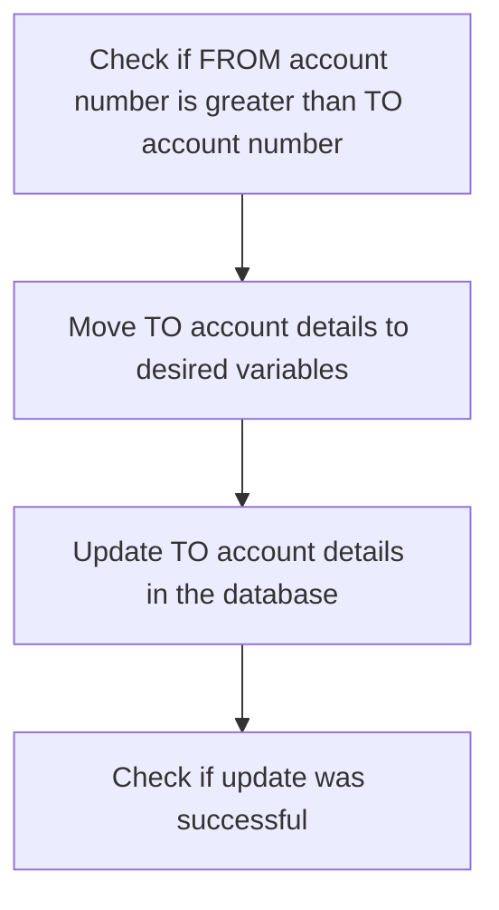

First, we check if the `FROM` account number is greater than the <SwmToken path="src/base/cobol_src/XFRFUN.cbl" pos="276:7:7" line-data="           MOVE &#39;0&#39; TO HV-ACCOUNT-EYECATCHER.">`TO`</SwmToken> account number. This ensures that the account details are processed in the correct order.

<SwmSnippet path="/src/base/cobol_src/XFRFUN.cbl" line="594">

---

Moving to the next step, we transfer the <SwmToken path="src/base/cobol_src/XFRFUN.cbl" pos="594:7:7" line-data="              MOVE COMM-TACCNO TO DESIRED-ACC-NO">`TO`</SwmToken> account number and sort code to the desired variables <SwmToken path="src/base/cobol_src/XFRFUN.cbl" pos="594:9:13" line-data="              MOVE COMM-TACCNO TO DESIRED-ACC-NO">`DESIRED-ACC-NO`</SwmToken> and <SwmToken path="src/base/cobol_src/XFRFUN.cbl" pos="595:9:13" line-data="              MOVE COMM-TSCODE TO DESIRED-SORT-CODE">`DESIRED-SORT-CODE`</SwmToken>. This prepares the necessary data for the update operation.

```cobol
              MOVE COMM-TACCNO TO DESIRED-ACC-NO
              MOVE COMM-TSCODE TO DESIRED-SORT-CODE
```

---

</SwmSnippet>

<SwmSnippet path="/src/base/cobol_src/XFRFUN.cbl" line="600">

---

Next, we perform the update operation on the <SwmToken path="src/base/cobol_src/XFRFUN.cbl" pos="600:9:9" line-data="              PERFORM UPDATE-ACCOUNT-DB2-TO">`TO`</SwmToken> account by calling the <SwmToken path="src/base/cobol_src/XFRFUN.cbl" pos="600:3:9" line-data="              PERFORM UPDATE-ACCOUNT-DB2-TO">`UPDATE-ACCOUNT-DB2-TO`</SwmToken> function. This updates the account details in the database.

```cobol
              PERFORM UPDATE-ACCOUNT-DB2-TO
```

---

</SwmSnippet>

<SwmSnippet path="/src/base/cobol_src/XFRFUN.cbl" line="606">

---

Then, we check if the update to the <SwmToken path="src/base/cobol_src/XFRFUN.cbl" pos="276:7:7" line-data="           MOVE &#39;0&#39; TO HV-ACCOUNT-EYECATCHER.">`TO`</SwmToken> account was successful by verifying if <SwmToken path="src/base/cobol_src/XFRFUN.cbl" pos="606:3:5" line-data="              IF COMM-SUCCESS = &#39;Y&#39;">`COMM-SUCCESS`</SwmToken> is equal to 'Y'. If the update was successful, we proceed to update the `FROM` account.

```cobol
              IF COMM-SUCCESS = 'Y'
```

---

</SwmSnippet>

## On success update FROM account

Now, lets zoom into this section of the flow:

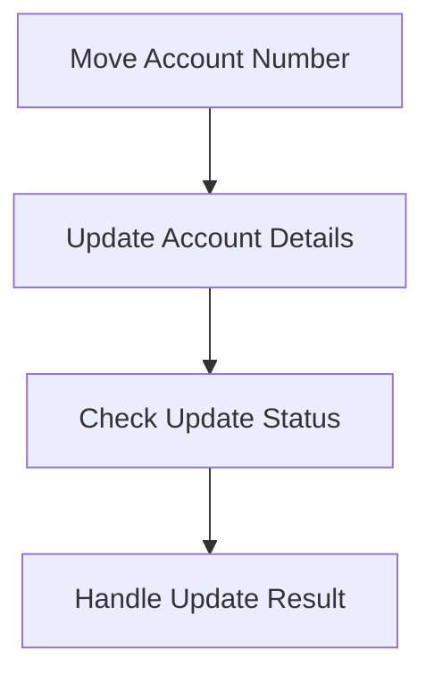

<SwmSnippet path="/src/base/cobol_src/XFRFUN.cbl" line="607">

---

### Moving Account Number

The first step in the <SwmToken path="src/base/cobol_src/XFRFUN.cbl" pos="296:3:7" line-data="           PERFORM UPDATE-ACCOUNT-DB2">`UPDATE-ACCOUNT-DB2`</SwmToken> function is to move the account number from <SwmToken path="src/base/cobol_src/XFRFUN.cbl" pos="607:3:5" line-data="                 MOVE COMM-FACCNO TO DESIRED-ACC-NO">`COMM-FACCNO`</SwmToken> to <SwmToken path="src/base/cobol_src/XFRFUN.cbl" pos="607:9:13" line-data="                 MOVE COMM-FACCNO TO DESIRED-ACC-NO">`DESIRED-ACC-NO`</SwmToken>. This prepares the account number for the subsequent database update operations.

```cobol
                 MOVE COMM-FACCNO TO DESIRED-ACC-NO
```

---

</SwmSnippet>

## <SwmToken path="src/base/cobol_src/XFRFUN.cbl" pos="545:3:7" line-data="                    PERFORM POPULATE-TIME-DATE">`POPULATE-TIME-DATE`</SwmToken>

Lets' zoom into this section of the flow:

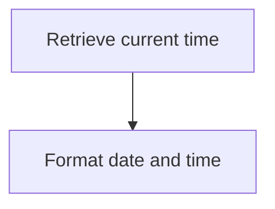

<SwmSnippet path="/src/base/cobol_src/XFRFUN.cbl" line="1912">

---

### Retrieving current time

First, the <SwmToken path="src/base/cobol_src/XFRFUN.cbl" pos="545:3:7" line-data="                    PERFORM POPULATE-TIME-DATE">`POPULATE-TIME-DATE`</SwmToken> function retrieves the current time using the <SwmToken path="src/base/cobol_src/XFRFUN.cbl" pos="1912:1:5" line-data="           EXEC CICS ASKTIME">`EXEC CICS ASKTIME`</SwmToken> command, which stores the time in <SwmToken path="src/base/cobol_src/XFRFUN.cbl" pos="1913:3:7" line-data="              ABSTIME(WS-U-TIME)">`WS-U-TIME`</SwmToken> (a variable for holding the current time).

```cobol
           EXEC CICS ASKTIME
              ABSTIME(WS-U-TIME)
           END-EXEC.
```

---

</SwmSnippet>

<SwmSnippet path="/src/base/cobol_src/XFRFUN.cbl" line="1916">

---

### Formatting date and time

Next, the function formats the retrieved time into a human-readable date and time using the <SwmToken path="src/base/cobol_src/XFRFUN.cbl" pos="1916:1:5" line-data="           EXEC CICS FORMATTIME">`EXEC CICS FORMATTIME`</SwmToken> command. This command converts <SwmToken path="src/base/cobol_src/XFRFUN.cbl" pos="1917:3:7" line-data="                     ABSTIME(WS-U-TIME)">`WS-U-TIME`</SwmToken> into <SwmToken path="src/base/cobol_src/XFRFUN.cbl" pos="1918:3:7" line-data="                     DDMMYYYY(WS-ORIG-DATE)">`WS-ORIG-DATE`</SwmToken> (a variable for holding the formatted date) and <SwmToken path="src/base/cobol_src/XFRFUN.cbl" pos="1919:3:7" line-data="                     TIME(WS-TIME-NOW)">`WS-TIME-NOW`</SwmToken> (a variable for holding the formatted time).

```cobol
           EXEC CICS FORMATTIME
                     ABSTIME(WS-U-TIME)
                     DDMMYYYY(WS-ORIG-DATE)
                     TIME(WS-TIME-NOW)
```

---

</SwmSnippet>

## <SwmToken path="src/base/cobol_src/XFRFUN.cbl" pos="389:3:9" line-data="              PERFORM UPDATE-ACCOUNT-DB2-FROM">`UPDATE-ACCOUNT-DB2-FROM`</SwmToken>

Lets' zoom into this section of the flow:

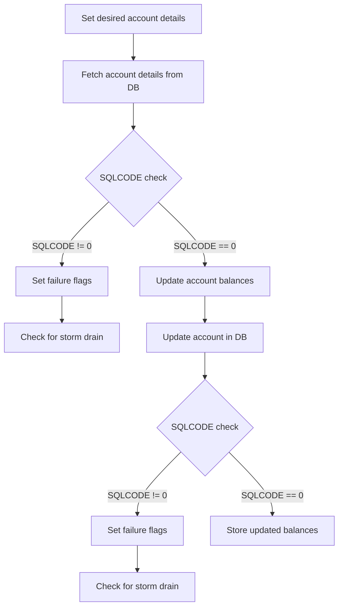

First, the desired account number and sort code are set using the values from <SwmToken path="src/base/cobol_src/XFRFUN.cbl" pos="316:3:5" line-data="           IF COMM-FACCNO = COMM-TACCNO">`COMM-FACCNO`</SwmToken> and <SwmToken path="src/base/cobol_src/XFRFUN.cbl" pos="281:7:9" line-data="           MOVE SORTCODE TO COMM-FSCODE COMM-TSCODE.">`COMM-FSCODE`</SwmToken>.

<SwmSnippet path="/src/base/cobol_src/XFRFUN.cbl" line="930">

---

Next, the program fetches the account details from the database using the provided sort code and account number.

```cobol
           EXEC SQL
              SELECT ACCOUNT_EYECATCHER,
                ACCOUNT_CUSTOMER_NUMBER,
                ACCOUNT_SORTCODE,
                ACCOUNT_NUMBER,
                ACCOUNT_TYPE,
                ACCOUNT_INTEREST_RATE,
                ACCOUNT_OPENED,
                ACCOUNT_OVERDRAFT_LIMIT,
                ACCOUNT_LAST_STATEMENT,
                ACCOUNT_NEXT_STATEMENT,
                ACCOUNT_AVAILABLE_BALANCE,
                ACCOUNT_ACTUAL_BALANCE
              INTO  :HV-ACCOUNT-EYECATCHER,
                :HV-ACCOUNT-CUST-NO,
                :HV-ACCOUNT-SORTCODE,
                :HV-ACCOUNT-ACC-NO,
                :HV-ACCOUNT-ACC-TYPE,
                :HV-ACCOUNT-INT-RATE,
                :HV-ACCOUNT-OPENED,
                :HV-ACCOUNT-OVERDRAFT-LIM,
```

---

</SwmSnippet>

<SwmSnippet path="/src/base/cobol_src/XFRFUN.cbl" line="964">

---

The program then checks the <SwmToken path="src/base/cobol_src/XFRFUN.cbl" pos="964:3:3" line-data="           IF SQLCODE NOT = 0">`SQLCODE`</SwmToken> to determine if the database query was successful.

```cobol
           IF SQLCODE NOT = 0
```

---

</SwmSnippet>

<SwmSnippet path="/src/base/cobol_src/XFRFUN.cbl" line="965">

---

If the <SwmToken path="src/base/cobol_src/XFRFUN.cbl" pos="967:3:3" line-data="              IF SQLCODE = +100">`SQLCODE`</SwmToken> is not zero, indicating an error, the program sets the <SwmToken path="src/base/cobol_src/XFRFUN.cbl" pos="965:9:11" line-data="              MOVE &#39;N&#39; TO COMM-SUCCESS">`COMM-SUCCESS`</SwmToken> flag to 'N' and assigns an appropriate failure code to <SwmToken path="src/base/cobol_src/XFRFUN.cbl" pos="968:9:13" line-data="                 MOVE &#39;1&#39; TO COMM-FAIL-CODE">`COMM-FAIL-CODE`</SwmToken>.

```cobol
              MOVE 'N' TO COMM-SUCCESS

              IF SQLCODE = +100
                 MOVE '1' TO COMM-FAIL-CODE
              ELSE
                 MOVE '3' TO COMM-FAIL-CODE
              END-IF
```

---

</SwmSnippet>

<SwmSnippet path="/src/base/cobol_src/XFRFUN.cbl" line="976">

---

The program then checks if storm drain processing is applicable by performing the <SwmToken path="src/base/cobol_src/XFRFUN.cbl" pos="976:3:11" line-data="              PERFORM CHECK-FOR-STORM-DRAIN-DB2">`CHECK-FOR-STORM-DRAIN-DB2`</SwmToken> routine.

```cobol
              PERFORM CHECK-FOR-STORM-DRAIN-DB2
```

---

</SwmSnippet>

<SwmSnippet path="/src/base/cobol_src/XFRFUN.cbl" line="986">

---

If the <SwmToken path="src/base/cobol_src/XFRFUN.cbl" pos="353:9:9" line-data="              MOVE ZEROS      TO ABND-SQLCODE">`SQLCODE`</SwmToken> is zero, indicating a successful query, the program proceeds to update the available and actual balances of the account by subtracting the transaction amount (<SwmToken path="src/base/cobol_src/XFRFUN.cbl" pos="987:11:13" line-data="           HV-ACCOUNT-AVAIL-BAL - COMM-AMT.">`COMM-AMT`</SwmToken>).

```cobol
           COMPUTE HV-ACCOUNT-AVAIL-BAL =
           HV-ACCOUNT-AVAIL-BAL - COMM-AMT.

           COMPUTE HV-ACCOUNT-ACTUAL-BAL =
           HV-ACCOUNT-ACTUAL-BAL - COMM-AMT.
```

---

</SwmSnippet>

<SwmSnippet path="/src/base/cobol_src/XFRFUN.cbl" line="992">

---

The program then updates the account details in the database with the new balances.

```cobol
           EXEC SQL
              UPDATE ACCOUNT
              SET ACCOUNT_EYECATCHER        = :HV-ACCOUNT-EYECATCHER,
              ACCOUNT_CUSTOMER_NUMBER   = :HV-ACCOUNT-CUST-NO,
              ACCOUNT_SORTCODE          = :HV-ACCOUNT-SORTCODE,
              ACCOUNT_NUMBER            = :HV-ACCOUNT-ACC-NO,
              ACCOUNT_TYPE              = :HV-ACCOUNT-ACC-TYPE,
              ACCOUNT_INTEREST_RATE     = :HV-ACCOUNT-INT-RATE,
              ACCOUNT_OPENED            = :HV-ACCOUNT-OPENED,
              ACCOUNT_OVERDRAFT_LIMIT   = :HV-ACCOUNT-OVERDRAFT-LIM,
              ACCOUNT_LAST_STATEMENT    = :HV-ACCOUNT-LAST-STMT,
              ACCOUNT_NEXT_STATEMENT    = :HV-ACCOUNT-NEXT-STMT,
              ACCOUNT_AVAILABLE_BALANCE = :HV-ACCOUNT-AVAIL-BAL,
              ACCOUNT_ACTUAL_BALANCE    = :HV-ACCOUNT-ACTUAL-BAL
              WHERE (ACCOUNT_SORTCODE       = :HV-ACCOUNT-SORTCODE AND
              ACCOUNT_NUMBER         = :HV-ACCOUNT-ACC-NO)
           END-EXEC.
```

---

</SwmSnippet>

<SwmSnippet path="/src/base/cobol_src/XFRFUN.cbl" line="1014">

---

After updating the database, the program checks the <SwmToken path="src/base/cobol_src/XFRFUN.cbl" pos="1014:3:3" line-data="           IF SQLCODE NOT = 0">`SQLCODE`</SwmToken> again to ensure the update was successful.

```cobol
           IF SQLCODE NOT = 0
```

---

</SwmSnippet>

<SwmSnippet path="/src/base/cobol_src/XFRFUN.cbl" line="1015">

---

If the <SwmToken path="src/base/cobol_src/XFRFUN.cbl" pos="1020:7:7" line-data="      *       Check if SQLCODE indicates that Storm Drain processing">`SQLCODE`</SwmToken> is not zero, the program sets the <SwmToken path="src/base/cobol_src/XFRFUN.cbl" pos="1016:9:11" line-data="              MOVE &#39;N&#39; TO COMM-SUCCESS">`COMM-SUCCESS`</SwmToken> flag to 'N' and assigns a failure code to <SwmToken path="src/base/cobol_src/XFRFUN.cbl" pos="1017:9:13" line-data="              MOVE &#39;3&#39; TO COMM-FAIL-CODE">`COMM-FAIL-CODE`</SwmToken>, then checks for storm drain processing again.

```cobol

              MOVE 'N' TO COMM-SUCCESS
              MOVE '3' TO COMM-FAIL-CODE

      *
      *       Check if SQLCODE indicates that Storm Drain processing
      *       is applicable in a workload if activated
      *
              PERFORM CHECK-FOR-STORM-DRAIN-DB2

              GO TO UADF999
```

---

</SwmSnippet>

<SwmSnippet path="/src/base/cobol_src/XFRFUN.cbl" line="1033">

---

If the update is successful, the program stores the updated balances in <SwmToken path="src/base/cobol_src/XFRFUN.cbl" pos="1033:13:15" line-data="           MOVE HV-ACCOUNT-AVAIL-BAL TO COMM-FAVBAL.">`COMM-FAVBAL`</SwmToken> and <SwmToken path="src/base/cobol_src/XFRFUN.cbl" pos="1034:13:15" line-data="           MOVE HV-ACCOUNT-ACTUAL-BAL TO COMM-FACTBAL.">`COMM-FACTBAL`</SwmToken>, and sets the <SwmToken path="src/base/cobol_src/XFRFUN.cbl" pos="1035:9:11" line-data="           MOVE &#39;Y&#39; TO COMM-SUCCESS.">`COMM-SUCCESS`</SwmToken> flag to 'Y'.

```cobol
           MOVE HV-ACCOUNT-AVAIL-BAL TO COMM-FAVBAL.
           MOVE HV-ACCOUNT-ACTUAL-BAL TO COMM-FACTBAL.
           MOVE 'Y' TO COMM-SUCCESS.
```

---

</SwmSnippet>

## <SwmToken path="src/base/cobol_src/XFRFUN.cbl" pos="976:3:11" line-data="              PERFORM CHECK-FOR-STORM-DRAIN-DB2">`CHECK-FOR-STORM-DRAIN-DB2`</SwmToken>

Lets' zoom into this section of the flow:

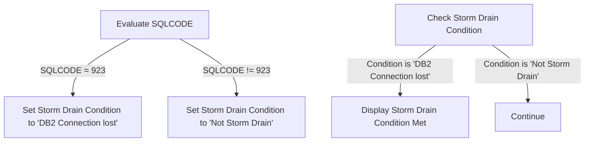

First, the function evaluates the <SwmToken path="src/base/cobol_src/XFRFUN.cbl" pos="353:9:9" line-data="              MOVE ZEROS      TO ABND-SQLCODE">`SQLCODE`</SwmToken> to determine the status of the <SwmToken path="src/base/cobol_src/XFRFUN.cbl" pos="279:7:7" line-data="           MOVE  0  TO DB2-DEADLOCK-RETRY.">`DB2`</SwmToken> connection.

<SwmSnippet path="/src/base/cobol_src/XFRFUN.cbl" line="1744">

---

If the <SwmToken path="src/base/cobol_src/XFRFUN.cbl" pos="1744:3:3" line-data="           EVALUATE SQLCODE">`SQLCODE`</SwmToken> is 923, it indicates that the <SwmToken path="src/base/cobol_src/XFRFUN.cbl" pos="1747:4:4" line-data="                 MOVE &#39;DB2 Connection lost &#39; TO STORM-DRAIN-CONDITION">`DB2`</SwmToken> connection is lost, and the <SwmToken path="src/base/cobol_src/XFRFUN.cbl" pos="1747:14:18" line-data="                 MOVE &#39;DB2 Connection lost &#39; TO STORM-DRAIN-CONDITION">`STORM-DRAIN-CONDITION`</SwmToken> is set to '<SwmToken path="src/base/cobol_src/XFRFUN.cbl" pos="1747:4:4" line-data="                 MOVE &#39;DB2 Connection lost &#39; TO STORM-DRAIN-CONDITION">`DB2`</SwmToken> Connection lost'.

```cobol
           EVALUATE SQLCODE

              WHEN 923
                 MOVE 'DB2 Connection lost ' TO STORM-DRAIN-CONDITION
```

---

</SwmSnippet>

<SwmSnippet path="/src/base/cobol_src/XFRFUN.cbl" line="1749">

---

If the <SwmToken path="src/base/cobol_src/XFRFUN.cbl" pos="353:9:9" line-data="              MOVE ZEROS      TO ABND-SQLCODE">`SQLCODE`</SwmToken> is anything other than 923, the <SwmToken path="src/base/cobol_src/XFRFUN.cbl" pos="1750:14:18" line-data="                 MOVE &#39;Not Storm Drain     &#39; TO STORM-DRAIN-CONDITION">`STORM-DRAIN-CONDITION`</SwmToken> is set to 'Not Storm Drain'.

```cobol
              WHEN OTHER
                 MOVE 'Not Storm Drain     ' TO STORM-DRAIN-CONDITION
```

---

</SwmSnippet>

<SwmSnippet path="/src/base/cobol_src/XFRFUN.cbl" line="1754">

---

Next, the function checks if the <SwmToken path="src/base/cobol_src/XFRFUN.cbl" pos="1754:3:7" line-data="           IF STORM-DRAIN-CONDITION NOT EQUAL &#39;Not Storm Drain     &#39;">`STORM-DRAIN-CONDITION`</SwmToken> is not equal to 'Not Storm Drain'.

```cobol
           IF STORM-DRAIN-CONDITION NOT EQUAL 'Not Storm Drain     '
```

---

</SwmSnippet>

<SwmSnippet path="/src/base/cobol_src/XFRFUN.cbl" line="1756">

---

If the condition is met, it displays a message indicating that the Storm Drain condition has been met, along with the <SwmToken path="src/base/cobol_src/XFRFUN.cbl" pos="1758:11:11" line-data="                      &#39;has been met (&#39; SQLCODE-DISPLAY &#39;).&#39;">`SQLCODE`</SwmToken>.

```cobol
              DISPLAY 'XFRFUN: Check-For-Storm-Drain-DB2: Storm '
                      'Drain condition (' STORM-DRAIN-CONDITION ') '
                      'has been met (' SQLCODE-DISPLAY ').'
```

---

</SwmSnippet>

<SwmSnippet path="/src/base/cobol_src/XFRFUN.cbl" line="1760">

---

If the condition is not met, the function simply continues without any further action.

```cobol

              CONTINUE
```

---

</SwmSnippet>

# Update for TO account (<SwmToken path="src/base/cobol_src/XFRFUN.cbl" pos="398:3:9" line-data="                 PERFORM UPDATE-ACCOUNT-DB2-TO">`UPDATE-ACCOUNT-DB2-TO`</SwmToken>)

Let's split this section into smaller parts:

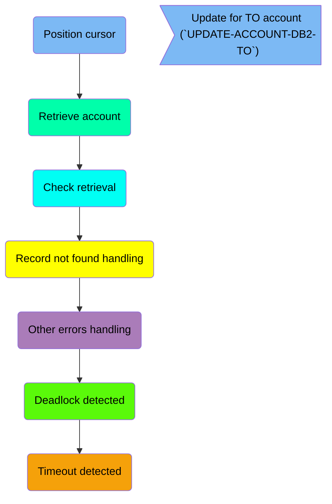

## Position cursor

First, we'll zoom into this section of the flow:

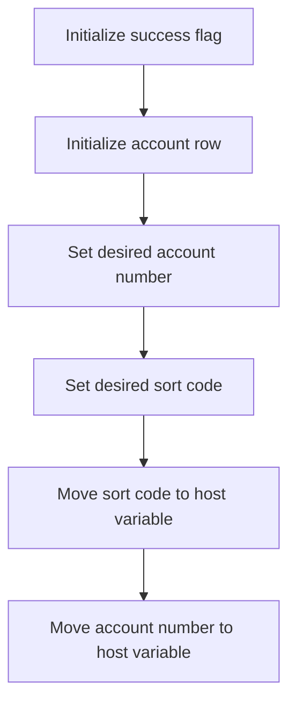

<SwmSnippet path="/src/base/cobol_src/XFRFUN.cbl" line="1044">

---

First, the success flag is initialized to 'N' to indicate that the operation has not yet succeeded.

```cobol
           MOVE 'N' TO COMM-SUCCESS.
```

---

</SwmSnippet>

<SwmSnippet path="/src/base/cobol_src/XFRFUN.cbl" line="1049">

---

Moving to the next step, the account row is initialized to prepare for the update operation.

```cobol
           INITIALIZE HOST-ACCOUNT-ROW.
```

---

</SwmSnippet>

<SwmSnippet path="/src/base/cobol_src/XFRFUN.cbl" line="1051">

---

Next, the desired account number and sort code for the 'TO' account are set, and these values are moved to the corresponding host variables for the database operation.

```cobol
           MOVE COMM-TACCNO TO DESIRED-ACC-NO.
           MOVE COMM-TSCODE TO DESIRED-SORT-CODE.

           MOVE DESIRED-SORT-CODE TO HV-ACCOUNT-SORTCODE.
           MOVE DESIRED-ACC-NO TO HV-ACCOUNT-ACC-NO.
```

---

</SwmSnippet>

## Retrieve account

This is the next section of the flow.

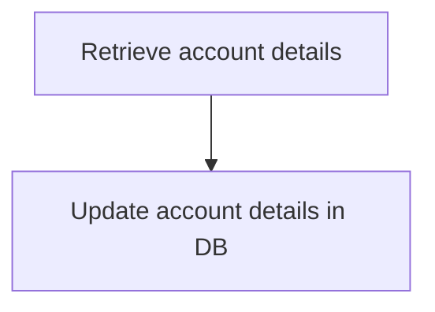

<SwmSnippet path="/src/base/cobol_src/XFRFUN.cbl" line="1057">

---

### Retrieving account details

The function retrieves the account details from the database by executing an SQL <SwmToken path="src/base/cobol_src/XFRFUN.cbl" pos="1058:1:1" line-data="                SELECT ACCOUNT_EYECATCHER,">`SELECT`</SwmToken> statement. This statement fetches various fields such as <SwmToken path="src/base/cobol_src/XFRFUN.cbl" pos="1058:3:3" line-data="                SELECT ACCOUNT_EYECATCHER,">`ACCOUNT_EYECATCHER`</SwmToken>, <SwmToken path="src/base/cobol_src/XFRFUN.cbl" pos="1059:1:1" line-data="                ACCOUNT_CUSTOMER_NUMBER,">`ACCOUNT_CUSTOMER_NUMBER`</SwmToken>, <SwmToken path="src/base/cobol_src/XFRFUN.cbl" pos="1060:1:1" line-data="                ACCOUNT_SORTCODE,">`ACCOUNT_SORTCODE`</SwmToken>, <SwmToken path="src/base/cobol_src/XFRFUN.cbl" pos="1061:1:1" line-data="                ACCOUNT_NUMBER,">`ACCOUNT_NUMBER`</SwmToken>, <SwmToken path="src/base/cobol_src/XFRFUN.cbl" pos="1062:1:1" line-data="                ACCOUNT_TYPE,">`ACCOUNT_TYPE`</SwmToken>, <SwmToken path="src/base/cobol_src/XFRFUN.cbl" pos="1063:1:1" line-data="                ACCOUNT_INTEREST_RATE,">`ACCOUNT_INTEREST_RATE`</SwmToken>, <SwmToken path="src/base/cobol_src/XFRFUN.cbl" pos="1064:1:1" line-data="                ACCOUNT_OPENED,">`ACCOUNT_OPENED`</SwmToken>, <SwmToken path="src/base/cobol_src/XFRFUN.cbl" pos="1065:1:1" line-data="                ACCOUNT_OVERDRAFT_LIMIT,">`ACCOUNT_OVERDRAFT_LIMIT`</SwmToken>, <SwmToken path="src/base/cobol_src/XFRFUN.cbl" pos="1066:1:1" line-data="                ACCOUNT_LAST_STATEMENT,">`ACCOUNT_LAST_STATEMENT`</SwmToken>, <SwmToken path="src/base/cobol_src/XFRFUN.cbl" pos="1067:1:1" line-data="                ACCOUNT_NEXT_STATEMENT,">`ACCOUNT_NEXT_STATEMENT`</SwmToken>, <SwmToken path="src/base/cobol_src/XFRFUN.cbl" pos="1068:1:1" line-data="                ACCOUNT_AVAILABLE_BALANCE,">`ACCOUNT_AVAILABLE_BALANCE`</SwmToken>, and <SwmToken path="src/base/cobol_src/XFRFUN.cbl" pos="1069:1:1" line-data="                ACCOUNT_ACTUAL_BALANCE">`ACCOUNT_ACTUAL_BALANCE`</SwmToken> from the <SwmToken path="src/base/cobol_src/XFRFUN.cbl" pos="1070:6:6" line-data="                INTO  :HV-ACCOUNT-EYECATCHER,">`ACCOUNT`</SwmToken> table. The retrieved values are stored into corresponding host variables prefixed with <SwmToken path="src/base/cobol_src/XFRFUN.cbl" pos="1070:4:5" line-data="                INTO  :HV-ACCOUNT-EYECATCHER,">`HV-`</SwmToken>.

```cobol
           EXEC SQL
                SELECT ACCOUNT_EYECATCHER,
                ACCOUNT_CUSTOMER_NUMBER,
                ACCOUNT_SORTCODE,
                ACCOUNT_NUMBER,
                ACCOUNT_TYPE,
                ACCOUNT_INTEREST_RATE,
                ACCOUNT_OPENED,
                ACCOUNT_OVERDRAFT_LIMIT,
                ACCOUNT_LAST_STATEMENT,
                ACCOUNT_NEXT_STATEMENT,
                ACCOUNT_AVAILABLE_BALANCE,
                ACCOUNT_ACTUAL_BALANCE
                INTO  :HV-ACCOUNT-EYECATCHER,
                :HV-ACCOUNT-CUST-NO,
                :HV-ACCOUNT-SORTCODE,
                :HV-ACCOUNT-ACC-NO,
                :HV-ACCOUNT-ACC-TYPE,
                :HV-ACCOUNT-INT-RATE,
                :HV-ACCOUNT-OPENED,
                :HV-ACCOUNT-OVERDRAFT-LIM,
```

---

</SwmSnippet>

## Check retrieval

This is the next section of the flow.

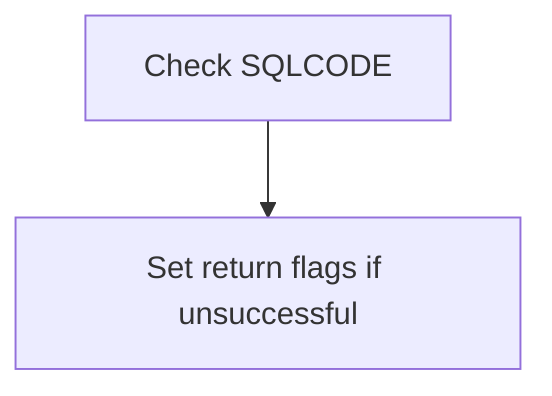

<SwmSnippet path="/src/base/cobol_src/XFRFUN.cbl" line="1087">

---

The function checks if the <SwmToken path="src/base/cobol_src/XFRFUN.cbl" pos="1091:3:3" line-data="           IF SQLCODE NOT = 0">`SQLCODE`</SwmToken> (the SQL return code) is not equal to 0, which indicates that the database selection operation was unsuccessful. If the <SwmToken path="src/base/cobol_src/XFRFUN.cbl" pos="1091:3:3" line-data="           IF SQLCODE NOT = 0">`SQLCODE`</SwmToken> is not 0, the function sets the return flags accordingly to signal the failure of the operation.

```cobol
      *
      *    Check that SELECT was successful. If it wasn't then set the
      *    return flags accordingly.
      *
           IF SQLCODE NOT = 0
```

---

</SwmSnippet>

## Record not found handling

Now, lets zoom into this section of the flow:

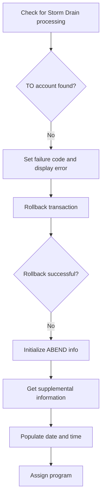

<SwmSnippet path="/src/base/cobol_src/XFRFUN.cbl" line="1092">

---

First, the code sets the <SwmToken path="src/base/cobol_src/XFRFUN.cbl" pos="1092:9:11" line-data="              MOVE &#39;N&#39; TO COMM-SUCCESS">`COMM-SUCCESS`</SwmToken> flag to 'N' to indicate that the operation has not yet succeeded.

```cobol
              MOVE 'N' TO COMM-SUCCESS
```

---

</SwmSnippet>

<SwmSnippet path="/src/base/cobol_src/XFRFUN.cbl" line="1097">

---

Next, it performs the <SwmToken path="src/base/cobol_src/XFRFUN.cbl" pos="1097:3:11" line-data="              PERFORM CHECK-FOR-STORM-DRAIN-DB2">`CHECK-FOR-STORM-DRAIN-DB2`</SwmToken> routine to determine if Storm Drain processing is applicable.

```cobol
              PERFORM CHECK-FOR-STORM-DRAIN-DB2
```

---

</SwmSnippet>

<SwmSnippet path="/src/base/cobol_src/XFRFUN.cbl" line="1102">

---

Moving to the next step, the code checks if the <SwmToken path="src/base/cobol_src/XFRFUN.cbl" pos="1102:3:3" line-data="              IF SQLCODE = +100">`SQLCODE`</SwmToken> is +100, which indicates that the TO account was not found.

```cobol
              IF SQLCODE = +100
```

---

</SwmSnippet>

<SwmSnippet path="/src/base/cobol_src/XFRFUN.cbl" line="1103">

---

If the TO account is not found, it sets the <SwmToken path="src/base/cobol_src/XFRFUN.cbl" pos="1103:9:13" line-data="                 MOVE &#39;2&#39; TO COMM-FAIL-CODE">`COMM-FAIL-CODE`</SwmToken> to '2' and moves the <SwmToken path="src/base/cobol_src/XFRFUN.cbl" pos="1104:3:3" line-data="                 MOVE SQLCODE TO SQLCODE-DISPLAY">`SQLCODE`</SwmToken> to <SwmToken path="src/base/cobol_src/XFRFUN.cbl" pos="1104:7:9" line-data="                 MOVE SQLCODE TO SQLCODE-DISPLAY">`SQLCODE-DISPLAY`</SwmToken> for logging purposes.

```cobol
                 MOVE '2' TO COMM-FAIL-CODE
                 MOVE SQLCODE TO SQLCODE-DISPLAY
```

---

</SwmSnippet>

<SwmSnippet path="/src/base/cobol_src/XFRFUN.cbl" line="1106">

---

Then, it displays an error message indicating that the update was unable to read the TO account and initiates a rollback to avoid data inconsistency.

```cobol
                 DISPLAY 'UPDATE UNABLE TO READ TO ACC'
                    HV-ACCOUNT-SORTCODE '/' HV-ACCOUNT-ACC-NO
                    ' ROLLBACK TO AVOID DATA INCONSISTENCY.'
                    'SQLCODE=' SQLCODE-DISPLAY
```

---

</SwmSnippet>

<SwmSnippet path="/src/base/cobol_src/XFRFUN.cbl" line="1111">

---

The code then executes a CICS SYNCPOINT ROLLBACK to revert any changes made during the transaction.

```cobol
                 EXEC CICS SYNCPOINT ROLLBACK
                   RESP(WS-CICS-RESP)
                   RESP2(WS-CICS-RESP2)
                 END-EXEC
```

---

</SwmSnippet>

<SwmSnippet path="/src/base/cobol_src/XFRFUN.cbl" line="1116">

---

If the rollback is not successful, it initializes the <SwmToken path="src/base/cobol_src/XFRFUN.cbl" pos="1123:3:5" line-data="                    INITIALIZE ABNDINFO-REC">`ABNDINFO-REC`</SwmToken> structure to prepare for abnormal end (abend) processing.

```cobol
                 IF WS-CICS-RESP IS NOT EQUAL TO DFHRESP(NORMAL)
      *
      *             Preserve the RESP and RESP2, then set up the
      *             standard ABEND info before getting the applid,
      *             date/time etc. and linking to the Abend Handler
      *             program.
      *
                    INITIALIZE ABNDINFO-REC
```

---

</SwmSnippet>

<SwmSnippet path="/src/base/cobol_src/XFRFUN.cbl" line="1124">

---

The code then moves the <SwmToken path="src/base/cobol_src/XFRFUN.cbl" pos="1124:3:3" line-data="                    MOVE EIBRESP    TO ABND-RESPCODE">`EIBRESP`</SwmToken> and <SwmToken path="src/base/cobol_src/XFRFUN.cbl" pos="1125:3:3" line-data="                    MOVE EIBRESP2   TO ABND-RESP2CODE">`EIBRESP2`</SwmToken> values to <SwmToken path="src/base/cobol_src/XFRFUN.cbl" pos="1124:7:9" line-data="                    MOVE EIBRESP    TO ABND-RESPCODE">`ABND-RESPCODE`</SwmToken> and <SwmToken path="src/base/cobol_src/XFRFUN.cbl" pos="1125:7:9" line-data="                    MOVE EIBRESP2   TO ABND-RESP2CODE">`ABND-RESP2CODE`</SwmToken> respectively for logging.

```cobol
                    MOVE EIBRESP    TO ABND-RESPCODE
                    MOVE EIBRESP2   TO ABND-RESP2CODE
```

---

</SwmSnippet>

<SwmSnippet path="/src/base/cobol_src/XFRFUN.cbl" line="1129">

---

Next, it executes a CICS ASSIGN command to get the application ID and assigns it to <SwmToken path="src/base/cobol_src/XFRFUN.cbl" pos="1129:9:11" line-data="                    EXEC CICS ASSIGN APPLID(ABND-APPLID)">`ABND-APPLID`</SwmToken>.

```cobol
                    EXEC CICS ASSIGN APPLID(ABND-APPLID)
                    END-EXEC
```

---

</SwmSnippet>

<SwmSnippet path="/src/base/cobol_src/XFRFUN.cbl" line="1135">

---

Finally, it populates the date and time information and assigns the program name to <SwmToken path="src/base/cobol_src/XFRFUN.cbl" pos="1149:9:11" line-data="                    EXEC CICS ASSIGN PROGRAM(ABND-PROGRAM)">`ABND-PROGRAM`</SwmToken> for the abend handler.

```cobol
                    PERFORM POPULATE-TIME-DATE

                    MOVE WS-ORIG-DATE TO ABND-DATE
                    STRING WS-TIME-NOW-GRP-HH DELIMITED BY SIZE,
                          ':' DELIMITED BY SIZE,
                          WS-TIME-NOW-GRP-MM DELIMITED BY SIZE,
                          ':' DELIMITED BY SIZE,
                          WS-TIME-NOW-GRP-MM DELIMITED BY SIZE
                          INTO ABND-TIME
                    END-STRING

                    MOVE WS-U-TIME   TO ABND-UTIME-KEY
                    MOVE 'HROL'      TO ABND-CODE

                    EXEC CICS ASSIGN PROGRAM(ABND-PROGRAM)
                    END-EXEC
```

---

</SwmSnippet>

## Other errors handling

Now, lets zoom into this section of the flow:

```mermaid
graph TD
  A[Initialize error handling variables] --> B[Create error message] --> C[Call ABNDPROC for error handling] --> D[Log error details] --> E[Trigger CICS ABEND] --> F[Go to UADT999] --> G[Set failure code] --> H[Log failure details] --> I[Check if SQLCODE is -911] --> J[Check specific SQLERRD(3) value]

%% Swimm:
%% graph TD
%%   A[Initialize error handling variables] --> B[Create error message] --> C[Call ABNDPROC for error handling] --> D[Log error details] --> E[Trigger CICS ABEND] --> F[Go to <SwmToken path="src/base/cobol_src/XFRFUN.cbl" pos="1181:5:5" line-data="                 GO TO UADT999">`UADT999`</SwmToken>] --> G[Set failure code] --> H[Log failure details] --> I[Check if SQLCODE is -911] --> J[Check specific SQLERRD(3) value]
```

<SwmSnippet path="/src/base/cobol_src/XFRFUN.cbl" line="1152">

---

First, the code initializes the error handling variable <SwmToken path="src/base/cobol_src/XFRFUN.cbl" pos="1152:7:9" line-data="                    MOVE ZEROS      TO ABND-SQLCODE">`ABND-SQLCODE`</SwmToken> to zero to prepare for any potential error handling.

```cobol
                    MOVE ZEROS      TO ABND-SQLCODE
```

---

</SwmSnippet>

<SwmSnippet path="/src/base/cobol_src/XFRFUN.cbl" line="1154">

---

Moving to the next step, the code constructs an error message string that includes details about the error, such as the response codes.

```cobol
                    STRING 'UAD010-TO - Error on SYNCPOINT ROLLBACK '
                         DELIMITED BY SIZE,
                         'after failing to read TO account'
                         DELIMITED BY SIZE,
                         ' EIBRESP=' DELIMITED BY SIZE,
                         ABND-RESPCODE DELIMITED BY SIZE,
                         ' RESP2=' DELIMITED BY SIZE,
                         ABND-RESP2CODE DELIMITED BY SIZE
                         INTO ABND-FREEFORM
```

---

</SwmSnippet>

<SwmSnippet path="/src/base/cobol_src/XFRFUN.cbl" line="1165">

---

Next, the program calls the <SwmToken path="src/base/cobol_src/XFRFUN.cbl" pos="257:19:19" line-data="       01 WS-ABEND-PGM                  PIC X(8)      VALUE &#39;ABNDPROC&#39;.">`ABNDPROC`</SwmToken> program to handle the abnormal termination by passing the error information.

More about ABNDPROC: <SwmLink doc-title="Writing Abend Records (ABNDPROC)">[Writing Abend Records (ABNDPROC)](/.swm/writing-abend-records-abndproc.svfj4jn5.sw.md)</SwmLink>

```cobol
                    EXEC CICS LINK PROGRAM(WS-ABEND-PGM)
                             COMMAREA(ABNDINFO-REC)
                    END-EXEC
```

---

</SwmSnippet>

<SwmSnippet path="/src/base/cobol_src/XFRFUN.cbl" line="1169">

---

Then, the code logs the error details to the console for debugging purposes.

```cobol
                    DISPLAY 'XFRFUN error syncpoint rollback after '
                           'failing to read TO account '
                           ',RESP=' WS-CICS-RESP
                           ',RESP2=' WS-CICS-RESP2
```

---

</SwmSnippet>

<SwmSnippet path="/src/base/cobol_src/XFRFUN.cbl" line="1174">

---

Following this, the program triggers a CICS abnormal end (ABEND) with a specific code to halt the transaction without generating a dump.

```cobol
                    EXEC CICS ABEND
                       ABCODE('HROL')
                       NODUMP
                       CANCEL
                    END-EXEC
```

---

</SwmSnippet>

<SwmSnippet path="/src/base/cobol_src/XFRFUN.cbl" line="1181">

---

After handling the error, the program directs the flow to the <SwmToken path="src/base/cobol_src/XFRFUN.cbl" pos="1181:5:5" line-data="                 GO TO UADT999">`UADT999`</SwmToken> section to continue with the next steps.

```cobol
                 GO TO UADT999
```

---

</SwmSnippet>

<SwmSnippet path="/src/base/cobol_src/XFRFUN.cbl" line="1188">

---

If the failure is not due to the row not being found, the code sets a failure code to indicate a different type of error.

```cobol
                 MOVE '3' TO COMM-FAIL-CODE
```

---

</SwmSnippet>

<SwmSnippet path="/src/base/cobol_src/XFRFUN.cbl" line="1191">

---

The program then logs the failure details, including the SQL code and specific error details, to help diagnose the issue.

```cobol
                 DISPLAY 'UPDATE UNABLE TO READ TO ACC'
                    HV-ACCOUNT-SORTCODE HV-ACCOUNT-ACC-NO
                    ' ABENDING TO AVOID DATA INCONSISTENCY. SQLCODE='
                    SQLCODE-DISPLAY
                    ' SQLERRD(3) IS ' SQLERRD(3)
```

---

</SwmSnippet>

<SwmSnippet path="/src/base/cobol_src/XFRFUN.cbl" line="1197">

---

Finally, the code checks if the SQL code is -911, indicating a deadlock or timeout, and then verifies a specific value in <SwmToken path="src/base/cobol_src/XFRFUN.cbl" pos="1199:3:6" line-data="                    IF SQLERRD(3) = 13172872">`SQLERRD(3)`</SwmToken> to determine the exact nature of the error.

```cobol
                 IF SQLCODE = -911

                    IF SQLERRD(3) = 13172872
```

---

</SwmSnippet>

## Deadlock detected

Now, lets zoom into this section of the flow:

```mermaid
graph TD
  A[Deadlock Detected] --> B[Increment Retry Counter]
  B --> C{Retry Counter < 6}
  C -->|Yes| D[Perform SYNCPOINT and ROLLBACK]
  D --> E{Response is Normal}
  E -->|No| F[Initialize Abend Info]
  F --> G[Get Supplemental Information]
  G --> H[Populate Date and Time]
  H --> I[Move Data to Abend Record]
  I --> J[Log Error Message]
  J --> K[Link to Abend Handler]
  K --> L[Display Error Message]
  L --> M[Perform ABEND]
  E -->|Yes| N[Delay for 1 Second]
  N --> O[Retry Update]
```

<SwmSnippet path="/src/base/cobol_src/XFRFUN.cbl" line="1200">

---

First, the code detects a deadlock situation and increments the <SwmToken path="src/base/cobol_src/XFRFUN.cbl" pos="1201:7:11" line-data="                       ADD 1 TO DB2-DEADLOCK-RETRY">`DB2-DEADLOCK-RETRY`</SwmToken> counter to keep track of the number of retry attempts.

```cobol
                       DISPLAY 'DEADLOCK DETECTED!'
                       ADD 1 TO DB2-DEADLOCK-RETRY
```

---

</SwmSnippet>

<SwmSnippet path="/src/base/cobol_src/XFRFUN.cbl" line="1203">

---

Next, it checks if the retry counter is less than 6, allowing up to 5 retry attempts before taking further action.

```cobol
                       IF DB2-DEADLOCK-RETRY < 6
```

---

</SwmSnippet>

<SwmSnippet path="/src/base/cobol_src/XFRFUN.cbl" line="1204">

---

If the retry counter is less than 6, it performs a <SwmToken path="src/base/cobol_src/XFRFUN.cbl" pos="1204:5:5" line-data="                          EXEC CICS SYNCPOINT">`SYNCPOINT`</SwmToken> and <SwmToken path="src/base/cobol_src/XFRFUN.cbl" pos="1205:1:1" line-data="                             ROLLBACK">`ROLLBACK`</SwmToken> to revert any changes made during the transaction, ensuring data consistency.

```cobol
                          EXEC CICS SYNCPOINT
                             ROLLBACK
                             RESP(WS-CICS-RESP)
                             RESP2(WS-CICS-RESP2)
                          END-EXEC
```

---

</SwmSnippet>

<SwmSnippet path="/src/base/cobol_src/XFRFUN.cbl" line="1210">

---

Then, it checks if the response from the <SwmToken path="src/base/cobol_src/XFRFUN.cbl" pos="503:5:5" line-data="                    EXEC CICS SYNCPOINT">`SYNCPOINT`</SwmToken> and <SwmToken path="src/base/cobol_src/XFRFUN.cbl" pos="504:1:1" line-data="                       ROLLBACK">`ROLLBACK`</SwmToken> is not normal. If the response is not normal, it proceeds to handle the abnormal termination.

```cobol
                          IF WS-CICS-RESP IS NOT EQUAL TO
                          DFHRESP(NORMAL)
```

---

</SwmSnippet>

<SwmSnippet path="/src/base/cobol_src/XFRFUN.cbl" line="1219">

---

In case of an abnormal response, the code initializes the <SwmToken path="src/base/cobol_src/XFRFUN.cbl" pos="1219:3:5" line-data="                             INITIALIZE ABNDINFO-REC">`ABNDINFO-REC`</SwmToken> record to store abend (abnormal end) information.

```cobol
                             INITIALIZE ABNDINFO-REC
```

---

</SwmSnippet>

<SwmSnippet path="/src/base/cobol_src/XFRFUN.cbl" line="1220">

---

It then moves the response codes <SwmToken path="src/base/cobol_src/XFRFUN.cbl" pos="1220:3:3" line-data="                             MOVE EIBRESP    TO ABND-RESPCODE">`EIBRESP`</SwmToken> and <SwmToken path="src/base/cobol_src/XFRFUN.cbl" pos="1221:3:3" line-data="                             MOVE EIBRESP2   TO ABND-RESP2CODE">`EIBRESP2`</SwmToken> to the <SwmToken path="src/base/cobol_src/XFRFUN.cbl" pos="1220:7:9" line-data="                             MOVE EIBRESP    TO ABND-RESPCODE">`ABND-RESPCODE`</SwmToken> and <SwmToken path="src/base/cobol_src/XFRFUN.cbl" pos="1221:7:9" line-data="                             MOVE EIBRESP2   TO ABND-RESP2CODE">`ABND-RESP2CODE`</SwmToken> fields respectively for logging purposes.

```cobol
                             MOVE EIBRESP    TO ABND-RESPCODE
                             MOVE EIBRESP2   TO ABND-RESP2CODE
```

---

</SwmSnippet>

<SwmSnippet path="/src/base/cobol_src/XFRFUN.cbl" line="1225">

---

The code retrieves supplemental information such as the application ID, task number, and transaction ID to provide more context for the abend.

```cobol
                             EXEC CICS ASSIGN APPLID(ABND-APPLID)
                             END-EXEC

                             MOVE EIBTASKN   TO ABND-TASKNO-KEY
                             MOVE EIBTRNID   TO ABND-TRANID

```

---

</SwmSnippet>

<SwmSnippet path="/src/base/cobol_src/XFRFUN.cbl" line="1231">

---

It performs the <SwmToken path="src/base/cobol_src/XFRFUN.cbl" pos="1231:3:7" line-data="                             PERFORM POPULATE-TIME-DATE">`POPULATE-TIME-DATE`</SwmToken> routine to get the current date and time, which is then moved to the <SwmToken path="src/base/cobol_src/XFRFUN.cbl" pos="1233:11:13" line-data="                             MOVE WS-ORIG-DATE TO ABND-DATE">`ABND-DATE`</SwmToken> and <SwmToken path="src/base/cobol_src/XFRFUN.cbl" pos="1240:3:5" line-data="                                INTO ABND-TIME">`ABND-TIME`</SwmToken> fields.

```cobol
                             PERFORM POPULATE-TIME-DATE

                             MOVE WS-ORIG-DATE TO ABND-DATE
                             STRING WS-TIME-NOW-GRP-HH
                                DELIMITED BY SIZE,
                                ':' DELIMITED BY SIZE,
                                WS-TIME-NOW-GRP-MM DELIMITED BY SIZE,
                                ':' DELIMITED BY SIZE,
                                WS-TIME-NOW-GRP-MM DELIMITED BY SIZE
                                INTO ABND-TIME
                             END-STRING
```

---

</SwmSnippet>

<SwmSnippet path="/src/base/cobol_src/XFRFUN.cbl" line="1243">

---

The code moves additional information such as <SwmToken path="src/base/cobol_src/XFRFUN.cbl" pos="1243:3:7" line-data="                             MOVE WS-U-TIME   TO ABND-UTIME-KEY">`WS-U-TIME`</SwmToken> and a specific abend code 'HROL' to the abend record.

```cobol
                             MOVE WS-U-TIME   TO ABND-UTIME-KEY
                             MOVE 'HROL'      TO ABND-CODE

```

---

</SwmSnippet>

<SwmSnippet path="/src/base/cobol_src/XFRFUN.cbl" line="1246">

---

It assigns the current program name to the <SwmToken path="src/base/cobol_src/XFRFUN.cbl" pos="1246:9:11" line-data="                             EXEC CICS ASSIGN PROGRAM(ABND-PROGRAM)">`ABND-PROGRAM`</SwmToken> field and initializes the <SwmToken path="src/base/cobol_src/XFRFUN.cbl" pos="1249:7:9" line-data="                             MOVE ZEROS      TO ABND-SQLCODE">`ABND-SQLCODE`</SwmToken> field to zero.

```cobol
                             EXEC CICS ASSIGN PROGRAM(ABND-PROGRAM)
                             END-EXEC

                             MOVE ZEROS      TO ABND-SQLCODE
```

---

</SwmSnippet>

<SwmSnippet path="/src/base/cobol_src/XFRFUN.cbl" line="1251">

---

The code constructs a detailed error message string and moves it to the <SwmToken path="src/base/cobol_src/XFRFUN.cbl" pos="1259:3:5" line-data="                                INTO ABND-FREEFORM">`ABND-FREEFORM`</SwmToken> field for logging.

```cobol
                             STRING 'UAD010-TO(2) - Error on SYNCPOINT'
                                DELIMITED BY SIZE,
                                ' ROLLBACK after updating TO account'
                                DELIMITED BY SIZE,
                                ' EIBRESP=' DELIMITED BY SIZE,
                                ABND-RESPCODE DELIMITED BY SIZE,
                                ' RESP2=' DELIMITED BY SIZE,
                                ABND-RESP2CODE DELIMITED BY SIZE
                                INTO ABND-FREEFORM
                             END-STRING
```

---

</SwmSnippet>

<SwmSnippet path="/src/base/cobol_src/XFRFUN.cbl" line="1262">

---

It then links to the abend handler program <SwmToken path="src/base/cobol_src/XFRFUN.cbl" pos="1262:9:13" line-data="                             EXEC CICS LINK PROGRAM(WS-ABEND-PGM)">`WS-ABEND-PGM`</SwmToken>, passing the abend information record to handle the abnormal termination.

```cobol
                             EXEC CICS LINK PROGRAM(WS-ABEND-PGM)
                                   COMMAREA(ABNDINFO-REC)
                             END-EXEC
```

---

</SwmSnippet>

<SwmSnippet path="/src/base/cobol_src/XFRFUN.cbl" line="1266">

---

Finally, the code displays an error message and performs an abend with the code 'HROL', without generating a dump, and cancels the transaction.

```cobol
                             DISPLAY 'XFRFUN error syncpoint rollback'
                                ' after updating TO account '
                                ',RESP=' WS-CICS-RESP
                                ',RESP2=' WS-CICS-RESP2

                             EXEC CICS ABEND
                                ABCODE('HROL')
                                NODUMP
                                CANCEL
                             END-EXEC
```

---

</SwmSnippet>

## Timeout detected

Now, lets zoom into this section of the flow:

```mermaid
graph TD
  A[Check for Timeout] --> B[Display Timeout Message]
  B --> C[Initialize Abend Info]
  C --> D[Move Response Codes]
  D --> E[Get Supplemental Info]
  E --> F[Populate Date and Time]
  F --> G[Move Date and Time to Abend Info]
  G --> H[Assign Program to Abend Info]
  H --> I[Move Zeros to SQL Code]
  I --> J[Check for Timeout Again]
  J --> K[Prepare Freeform Abend Message]
```

<SwmSnippet path="/src/base/cobol_src/XFRFUN.cbl" line="1288">

---

First, the code checks if there is a timeout by evaluating if <SwmToken path="src/base/cobol_src/XFRFUN.cbl" pos="1288:3:6" line-data="                    IF SQLERRD(3) = 13172894">`SQLERRD(3)`</SwmToken> equals <SwmToken path="src/base/cobol_src/XFRFUN.cbl" pos="1288:10:10" line-data="                    IF SQLERRD(3) = 13172894">`13172894`</SwmToken>. If a timeout is detected, it displays a 'TIMEOUT DETECTED!' message.

```cobol
                    IF SQLERRD(3) = 13172894
                       DISPLAY 'TIMEOUT DETECTED!'
                    END-IF
```

---

</SwmSnippet>

<SwmSnippet path="/src/base/cobol_src/XFRFUN.cbl" line="1298">

---

Moving to the next step, the code initializes the <SwmToken path="src/base/cobol_src/XFRFUN.cbl" pos="1298:3:5" line-data="                    INITIALIZE ABNDINFO-REC">`ABNDINFO-REC`</SwmToken> structure to prepare for capturing abend information.

```cobol
                    INITIALIZE ABNDINFO-REC
```

---

</SwmSnippet>

<SwmSnippet path="/src/base/cobol_src/XFRFUN.cbl" line="1299">

---

Next, the response codes <SwmToken path="src/base/cobol_src/XFRFUN.cbl" pos="1299:3:3" line-data="                    MOVE EIBRESP    TO ABND-RESPCODE">`EIBRESP`</SwmToken> and <SwmToken path="src/base/cobol_src/XFRFUN.cbl" pos="1300:3:3" line-data="                    MOVE EIBRESP2   TO ABND-RESP2CODE">`EIBRESP2`</SwmToken> are moved to <SwmToken path="src/base/cobol_src/XFRFUN.cbl" pos="1299:7:9" line-data="                    MOVE EIBRESP    TO ABND-RESPCODE">`ABND-RESPCODE`</SwmToken> and <SwmToken path="src/base/cobol_src/XFRFUN.cbl" pos="1300:7:9" line-data="                    MOVE EIBRESP2   TO ABND-RESP2CODE">`ABND-RESP2CODE`</SwmToken> respectively, to store the response information.

```cobol
                    MOVE EIBRESP    TO ABND-RESPCODE
                    MOVE EIBRESP2   TO ABND-RESP2CODE
```

---

</SwmSnippet>

<SwmSnippet path="/src/base/cobol_src/XFRFUN.cbl" line="1304">

---

Then, the code retrieves supplemental information such as the application ID, task number, and transaction ID, and stores them in the <SwmToken path="src/base/cobol_src/XFRFUN.cbl" pos="324:3:5" line-data="              INITIALIZE ABNDINFO-REC">`ABNDINFO-REC`</SwmToken> structure.

```cobol
                    EXEC CICS ASSIGN APPLID(ABND-APPLID)
                    END-EXEC

                    MOVE EIBTASKN   TO ABND-TASKNO-KEY
                    MOVE EIBTRNID   TO ABND-TRANID
```

---

</SwmSnippet>

<SwmSnippet path="/src/base/cobol_src/XFRFUN.cbl" line="1310">

---

Diving into the next step, the code performs the <SwmToken path="src/base/cobol_src/XFRFUN.cbl" pos="1310:3:7" line-data="                    PERFORM POPULATE-TIME-DATE">`POPULATE-TIME-DATE`</SwmToken> routine to get the current date and time, and then moves these values into the <SwmToken path="src/base/cobol_src/XFRFUN.cbl" pos="1312:11:13" line-data="                    MOVE WS-ORIG-DATE TO ABND-DATE">`ABND-DATE`</SwmToken> and <SwmToken path="src/base/cobol_src/XFRFUN.cbl" pos="1318:3:5" line-data="                        INTO ABND-TIME">`ABND-TIME`</SwmToken> fields.

```cobol
                    PERFORM POPULATE-TIME-DATE

                    MOVE WS-ORIG-DATE TO ABND-DATE
                    STRING WS-TIME-NOW-GRP-HH DELIMITED BY SIZE,
                        ':' DELIMITED BY SIZE,
                        WS-TIME-NOW-GRP-MM DELIMITED BY SIZE,
                        ':' DELIMITED BY SIZE,
                        WS-TIME-NOW-GRP-MM DELIMITED BY SIZE
                        INTO ABND-TIME
                    END-STRING
```

---

</SwmSnippet>

<SwmSnippet path="/src/base/cobol_src/XFRFUN.cbl" line="1324">

---

Going into the next step, the code assigns the current program name to <SwmToken path="src/base/cobol_src/XFRFUN.cbl" pos="1324:9:11" line-data="                    EXEC CICS ASSIGN PROGRAM(ABND-PROGRAM)">`ABND-PROGRAM`</SwmToken> and sets the SQL code to zeros.

```cobol
                    EXEC CICS ASSIGN PROGRAM(ABND-PROGRAM)
                    END-EXEC

                    MOVE ZEROS      TO ABND-SQLCODE
```

---

</SwmSnippet>

<SwmSnippet path="/src/base/cobol_src/XFRFUN.cbl" line="1329">

---

Finally, if a timeout is detected again, the code prepares a detailed freeform abend message by concatenating various pieces of information such as the timeout message, response codes, and other relevant details.

```cobol
                    IF SQLERRD(3) = 13172894
                       STRING 'UAD010-TO(3) - timeout detected '
                          DELIMITED BY SIZE,
                          ' EIBRESP=' DELIMITED BY SIZE,
                          ABND-RESPCODE DELIMITED BY SIZE,
                          'RESP2=' DELIMITED BY SIZE,
                          ABND-RESP2CODE DELIMITED BY SIZE
                          INTO ABND-FREEFORM
```

---

</SwmSnippet>

## <SwmToken path="src/base/cobol_src/XFRFUN.cbl" pos="1563:1:5" line-data="       WRITE-TO-PROCTRAN SECTION.">`WRITE-TO-PROCTRAN`</SwmToken>

Lets' zoom into this section of the flow:

```mermaid
graph TD
  A[Write transaction details to DB] --> B[Handle SQL insert errors]
```

<SwmSnippet path="/src/base/cobol_src/XFRFUN.cbl" line="1563">

---

### Writing transaction details to the database

The <SwmToken path="src/base/cobol_src/XFRFUN.cbl" pos="1563:1:5" line-data="       WRITE-TO-PROCTRAN SECTION.">`WRITE-TO-PROCTRAN`</SwmToken> section is responsible for writing the details of a successful transaction to the processed transaction datastore. It performs the <SwmToken path="src/base/cobol_src/XFRFUN.cbl" pos="1566:3:9" line-data="           PERFORM WRITE-TO-PROCTRAN-DB2.">`WRITE-TO-PROCTRAN-DB2`</SwmToken> operation, which initializes necessary data fields, sets the current time and date, transaction type, and description, and inserts this data into the <SwmToken path="src/base/cobol_src/XFRFUN.cbl" pos="1563:5:5" line-data="       WRITE-TO-PROCTRAN SECTION.">`PROCTRAN`</SwmToken> table in the database. This ensures that all transaction details are accurately recorded for future reference and auditing.

```cobol
       WRITE-TO-PROCTRAN SECTION.
       WTP010.

           PERFORM WRITE-TO-PROCTRAN-DB2.
       WTP999.
           EXIT.
```

---

</SwmSnippet>

## <SwmToken path="src/base/cobol_src/XFRFUN.cbl" pos="1566:3:9" line-data="           PERFORM WRITE-TO-PROCTRAN-DB2.">`WRITE-TO-PROCTRAN-DB2`</SwmToken>

Lets' zoom into this section of the flow:

```mermaid
graph TD
  A[Initialize transaction details] --> B[Populate time and date] --> C[Set transaction type and description] --> D[Insert transaction into PROCTRAN table] --> E[Check SQLCODE] --> F[Handle SQL error] --> G[Log error message] --> H[Check for storm drain processing] --> I[Abort transaction]
```

<SwmSnippet path="/src/base/cobol_src/XFRFUN.cbl" line="1577">

---

### Initializing transaction details

First, the function initializes the transaction details by setting up the necessary fields for the transaction record. This includes initializing <SwmToken path="src/base/cobol_src/XFRFUN.cbl" pos="1577:3:7" line-data="           INITIALIZE HOST-PROCTRAN-ROW.">`HOST-PROCTRAN-ROW`</SwmToken> and <SwmToken path="src/base/cobol_src/XFRFUN.cbl" pos="1578:3:5" line-data="           INITIALIZE WS-EIBTASKN12.">`WS-EIBTASKN12`</SwmToken>, and moving values into various fields such as <SwmToken path="src/base/cobol_src/XFRFUN.cbl" pos="1580:9:13" line-data="           MOVE &#39;PRTR&#39; TO HV-PROCTRAN-EYECATCHER.">`HV-PROCTRAN-EYECATCHER`</SwmToken>, <SwmToken path="src/base/cobol_src/XFRFUN.cbl" pos="1581:9:15" line-data="           MOVE COMM-FSCODE TO HV-PROCTRAN-SORT-CODE.">`HV-PROCTRAN-SORT-CODE`</SwmToken>, <SwmToken path="src/base/cobol_src/XFRFUN.cbl" pos="1582:9:15" line-data="           MOVE COMM-FACCNO TO HV-PROCTRAN-ACC-NUMBER.">`HV-PROCTRAN-ACC-NUMBER`</SwmToken>, and <SwmToken path="src/base/cobol_src/XFRFUN.cbl" pos="1584:9:13" line-data="           MOVE WS-EIBTASKN12 TO HV-PROCTRAN-REF.">`HV-PROCTRAN-REF`</SwmToken>.

```cobol
           INITIALIZE HOST-PROCTRAN-ROW.
           INITIALIZE WS-EIBTASKN12.

           MOVE 'PRTR' TO HV-PROCTRAN-EYECATCHER.
           MOVE COMM-FSCODE TO HV-PROCTRAN-SORT-CODE.
           MOVE COMM-FACCNO TO HV-PROCTRAN-ACC-NUMBER.
           MOVE EIBTASKN TO WS-EIBTASKN12.
           MOVE WS-EIBTASKN12 TO HV-PROCTRAN-REF.

```

---

</SwmSnippet>

<SwmSnippet path="/src/base/cobol_src/XFRFUN.cbl" line="1589">

---

### Populating time and date

Moving to the next step, the function populates the current time and date by executing CICS commands <SwmToken path="src/base/cobol_src/XFRFUN.cbl" pos="1589:5:5" line-data="           EXEC CICS ASKTIME">`ASKTIME`</SwmToken> and <SwmToken path="src/base/cobol_src/XFRFUN.cbl" pos="1593:5:5" line-data="           EXEC CICS FORMATTIME">`FORMATTIME`</SwmToken>. These commands retrieve the current time and date and format them appropriately for the transaction record.

```cobol
           EXEC CICS ASKTIME
                ABSTIME(WS-U-TIME)
           END-EXEC.

           EXEC CICS FORMATTIME
                ABSTIME(WS-U-TIME)
                DDMMYYYY(WS-ORIG-DATE)
                TIME(HV-PROCTRAN-TIME)
                DATESEP('.')
           END-EXEC.
```

---

</SwmSnippet>

<SwmSnippet path="/src/base/cobol_src/XFRFUN.cbl" line="1603">

---

### Setting transaction type and description

Next, the function sets the transaction type and description by updating the <SwmToken path="src/base/cobol_src/XFRFUN.cbl" pos="1603:11:13" line-data="           SET PROC-TY-TRANSFER IN PROCTRAN-AREA TO TRUE">`PROCTRAN-AREA`</SwmToken> with the relevant values. This includes setting flags and moving values such as <SwmToken path="src/base/cobol_src/XFRFUN.cbl" pos="1605:3:7" line-data="           MOVE PROC-TRAN-TYPE IN PROCTRAN-AREA TO HV-PROCTRAN-TYPE.">`PROC-TRAN-TYPE`</SwmToken>, <SwmToken path="src/base/cobol_src/XFRFUN.cbl" pos="1607:3:5" line-data="           MOVE COMM-AMT TO HV-PROCTRAN-AMOUNT.">`COMM-AMT`</SwmToken>, and <SwmToken path="src/base/cobol_src/XFRFUN.cbl" pos="1609:3:7" line-data="           SET PROC-TRAN-DESC-XFR-FLAG IN PROCTRAN-AREA TO TRUE.">`PROC-TRAN-DESC`</SwmToken>.

```cobol
           SET PROC-TY-TRANSFER IN PROCTRAN-AREA TO TRUE

           MOVE PROC-TRAN-TYPE IN PROCTRAN-AREA TO HV-PROCTRAN-TYPE.

           MOVE COMM-AMT TO HV-PROCTRAN-AMOUNT.

           SET PROC-TRAN-DESC-XFR-FLAG IN PROCTRAN-AREA TO TRUE.
           MOVE COMM-TSCODE
             TO PROC-TRAN-DESC-XFR-SORTCODE IN PROCTRAN-AREA.
           MOVE COMM-TACCNO
             TO PROC-TRAN-DESC-XFR-ACCOUNT IN PROCTRAN-AREA.
           MOVE PROC-TRAN-DESC IN PROCTRAN-AREA TO HV-PROCTRAN-DESC.
```

---

</SwmSnippet>

<SwmSnippet path="/src/base/cobol_src/XFRFUN.cbl" line="1616">

---

### Inserting transaction into PROCTRAN table

Then, the function inserts the transaction details into the <SwmToken path="src/base/cobol_src/XFRFUN.cbl" pos="1617:5:5" line-data="                INSERT INTO PROCTRAN">`PROCTRAN`</SwmToken> table in the database. This is done using an SQL <SwmToken path="src/base/cobol_src/XFRFUN.cbl" pos="1617:1:1" line-data="                INSERT INTO PROCTRAN">`INSERT`</SwmToken> statement that includes all the relevant fields such as <SwmToken path="src/base/cobol_src/XFRFUN.cbl" pos="1619:1:1" line-data="                PROCTRAN_EYECATCHER,">`PROCTRAN_EYECATCHER`</SwmToken>, <SwmToken path="src/base/cobol_src/XFRFUN.cbl" pos="1620:1:1" line-data="                PROCTRAN_SORTCODE,">`PROCTRAN_SORTCODE`</SwmToken>, <SwmToken path="src/base/cobol_src/XFRFUN.cbl" pos="1621:1:1" line-data="                PROCTRAN_NUMBER,">`PROCTRAN_NUMBER`</SwmToken>, <SwmToken path="src/base/cobol_src/XFRFUN.cbl" pos="1622:1:1" line-data="                PROCTRAN_DATE,">`PROCTRAN_DATE`</SwmToken>, <SwmToken path="src/base/cobol_src/XFRFUN.cbl" pos="1623:1:1" line-data="                PROCTRAN_TIME,">`PROCTRAN_TIME`</SwmToken>, <SwmToken path="src/base/cobol_src/XFRFUN.cbl" pos="1624:1:1" line-data="                PROCTRAN_REF,">`PROCTRAN_REF`</SwmToken>, <SwmToken path="src/base/cobol_src/XFRFUN.cbl" pos="1625:1:1" line-data="                PROCTRAN_TYPE,">`PROCTRAN_TYPE`</SwmToken>, <SwmToken path="src/base/cobol_src/XFRFUN.cbl" pos="1626:1:1" line-data="                PROCTRAN_DESC,">`PROCTRAN_DESC`</SwmToken>, and <SwmToken path="src/base/cobol_src/XFRFUN.cbl" pos="1627:1:1" line-data="                PROCTRAN_AMOUNT">`PROCTRAN_AMOUNT`</SwmToken>.

```cobol
           EXEC SQL
                INSERT INTO PROCTRAN
                (
                PROCTRAN_EYECATCHER,
                PROCTRAN_SORTCODE,
                PROCTRAN_NUMBER,
                PROCTRAN_DATE,
                PROCTRAN_TIME,
                PROCTRAN_REF,
                PROCTRAN_TYPE,
                PROCTRAN_DESC,
                PROCTRAN_AMOUNT
                )
                VALUES
                (
                :HV-PROCTRAN-EYECATCHER,
                :HV-PROCTRAN-SORT-CODE,
                :HV-PROCTRAN-ACC-NUMBER,
                :HV-PROCTRAN-DATE,
                :HV-PROCTRAN-TIME,
                :HV-PROCTRAN-REF,
```

---

</SwmSnippet>

<SwmSnippet path="/src/base/cobol_src/XFRFUN.cbl" line="1646">

---

### Checking SQLCODE

Going into the next step, the function checks the <SwmToken path="src/base/cobol_src/XFRFUN.cbl" pos="1646:3:3" line-data="           IF SQLCODE NOT = 0">`SQLCODE`</SwmToken> to determine if the SQL <SwmToken path="src/base/cobol_src/XFRFUN.cbl" pos="1617:1:1" line-data="                INSERT INTO PROCTRAN">`INSERT`</SwmToken> operation was successful. If the <SwmToken path="src/base/cobol_src/XFRFUN.cbl" pos="1646:3:3" line-data="           IF SQLCODE NOT = 0">`SQLCODE`</SwmToken> is not equal to 0, it indicates an error occurred during the insertion.

```cobol
           IF SQLCODE NOT = 0

```

---

</SwmSnippet>

<SwmSnippet path="/src/base/cobol_src/XFRFUN.cbl" line="1655">

---

### Handling SQL error

If an SQL error is detected, the function handles the error by preserving the response codes and setting up the standard ABEND (abnormal end) information. This includes initializing the <SwmToken path="src/base/cobol_src/XFRFUN.cbl" pos="1655:3:5" line-data="              INITIALIZE ABNDINFO-REC">`ABNDINFO-REC`</SwmToken> and moving various values such as <SwmToken path="src/base/cobol_src/XFRFUN.cbl" pos="1656:3:3" line-data="              MOVE EIBRESP    TO ABND-RESPCODE">`EIBRESP`</SwmToken>, <SwmToken path="src/base/cobol_src/XFRFUN.cbl" pos="1657:3:3" line-data="              MOVE EIBRESP2   TO ABND-RESP2CODE">`EIBRESP2`</SwmToken>, <SwmToken path="src/base/cobol_src/XFRFUN.cbl" pos="1664:3:3" line-data="              MOVE EIBTASKN   TO ABND-TASKNO-KEY">`EIBTASKN`</SwmToken>, and <SwmToken path="src/base/cobol_src/XFRFUN.cbl" pos="1665:3:3" line-data="              MOVE EIBTRNID   TO ABND-TRANID">`EIBTRNID`</SwmToken> to the appropriate fields.

```cobol
              INITIALIZE ABNDINFO-REC
              MOVE EIBRESP    TO ABND-RESPCODE
              MOVE EIBRESP2   TO ABND-RESP2CODE
      *
      *       Get supplemental information
      *
              EXEC CICS ASSIGN APPLID(ABND-APPLID)
              END-EXEC

              MOVE EIBTASKN   TO ABND-TASKNO-KEY
              MOVE EIBTRNID   TO ABND-TRANID

```

---

</SwmSnippet>

<SwmSnippet path="/src/base/cobol_src/XFRFUN.cbl" line="1686">

---

### Logging error message

Next, the function logs an error message that includes details about the transaction and the error. This is done using a <SwmToken path="src/base/cobol_src/XFRFUN.cbl" pos="1686:1:1" line-data="              STRING &#39;WTPD010 - Unable to WRITE to PROCTRAN DB2 &#39;">`STRING`</SwmToken> statement to concatenate various pieces of information into the <SwmToken path="src/base/cobol_src/XFRFUN.cbl" pos="1698:3:5" line-data="                    INTO ABND-FREEFORM">`ABND-FREEFORM`</SwmToken> field.

```cobol
              STRING 'WTPD010 - Unable to WRITE to PROCTRAN DB2 '
                    DELIMITED BY SIZE,
                    'datastore. Data='
                    DELIMITED BY SIZE,
                    HOST-PROCTRAN-ROW
                    DELIMITED BY SIZE,
                    '.Data inconsistency, data UPDATED on ACCOUNT file'
                    DELIMITED BY SIZE,
                    ' EIBRESP=' DELIMITED BY SIZE,
                    ABND-RESPCODE DELIMITED BY SIZE,
                    ' RESP2=' DELIMITED BY SIZE,
                    ABND-RESP2CODE DELIMITED BY SIZE
                    INTO ABND-FREEFORM
```

---

</SwmSnippet>

<SwmSnippet path="/src/base/cobol_src/XFRFUN.cbl" line="1711">

---

### Checking for storm drain processing

Then, the function checks if the <SwmToken path="src/base/cobol_src/XFRFUN.cbl" pos="1711:7:7" line-data="      *       Check if SQLCODE indicates that Storm Drain processing">`SQLCODE`</SwmToken> indicates that storm drain processing is applicable. If so, it performs the <SwmToken path="src/base/cobol_src/XFRFUN.cbl" pos="1714:3:11" line-data="              PERFORM CHECK-FOR-STORM-DRAIN-DB2">`CHECK-FOR-STORM-DRAIN-DB2`</SwmToken> routine.

```cobol
      *       Check if SQLCODE indicates that Storm Drain processing
      *       is applicable in a workload if activated
      *
              PERFORM CHECK-FOR-STORM-DRAIN-DB2
```

---

</SwmSnippet>

<SwmSnippet path="/src/base/cobol_src/XFRFUN.cbl" line="1716">

---

### Aborting transaction

Finally, if an error occurred, the function aborts the transaction by executing the <SwmToken path="src/base/cobol_src/XFRFUN.cbl" pos="1716:3:5" line-data="              EXEC CICS ABEND">`CICS ABEND`</SwmToken> command with the appropriate <SwmToken path="src/base/cobol_src/XFRFUN.cbl" pos="1717:1:1" line-data="                 ABCODE(&#39;WPCD&#39;)">`ABCODE`</SwmToken>.

```cobol
              EXEC CICS ABEND
                 ABCODE('WPCD')
              END-EXEC
```

---

</SwmSnippet>

&nbsp;

*This is an auto-generated document by Swimm 🌊 and has not yet been verified by a human*

<SwmMeta version="3.0.0" repo-id="Z2l0aHViJTNBJTNBY2ljcy1iYW5raW5nLXNhbXBsZS1hcHBsaWNhdGlvbi1jYnNhLUlCTS1EZW1vJTNBJTNBU3dpbW0tRGVtbw==" repo-name="cics-banking-sample-application-cbsa-IBM-Demo"><sup>Powered by [Swimm](/)</sup></SwmMeta>
