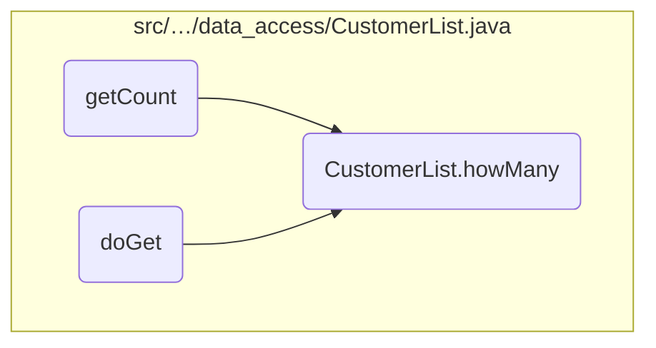
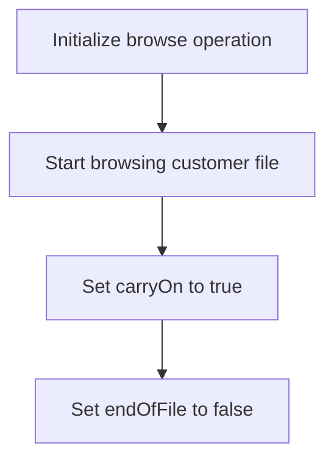
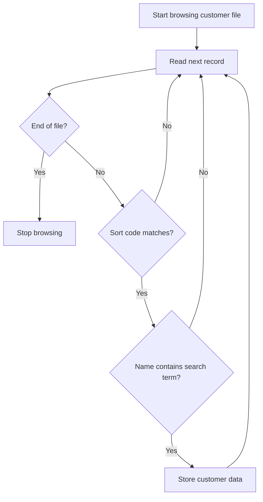
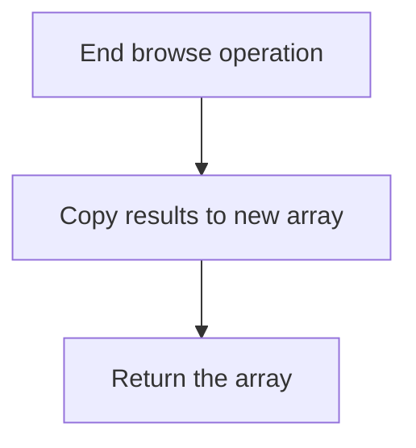
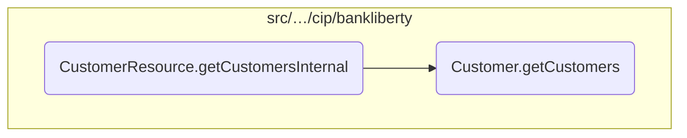

```mermaid
graph TD
  subgraph getCustomersByNameExternal
    getCustomersByNameExternal:A["Log entry with parameters"] --> getCustomersByNameExternal:B["Check and set countOnly flag"]
    getCustomersByNameExternal:B --> getCustomersByNameExternal:C["Check and set offset"]
    getCustomersByNameExternal:C --> getCustomersByNameExternal:D["Check and set limit"]
    getCustomersByNameExternal:D --> getCustomersByNameExternal:E["Check if limit is zero and set max limit"]
    getCustomersByNameExternal:E --> getCustomersByNameExternal:F["Call getCustomersByNameInternal"]
    getCustomersByNameExternal:F --> getCustomersByNameExternal:G["Create HBankDataAccess instance"]
    getCustomersByNameExternal:G --> getCustomersByNameExternal:H["Terminate HBankDataAccess"]
    getCustomersByNameExternal:H --> getCustomersByNameExternal:I["Log exit with response"]
    getCustomersByNameExternal:I --> getCustomersByNameExternal:J["Return response"]
  end

%% Swimm:
%% graph TD
%%   subgraph <SwmToken path="src/webui/src/main/java/com/ibm/cics/cip/bankliberty/webui/data_access/CustomerList.java" pos="85:2:2" line-data="						.getCustomersByNameExternal(customerNameFilter, 0, 0,">`getCustomersByNameExternal`</SwmToken>
%%     <SwmToken path="src/webui/src/main/java/com/ibm/cics/cip/bankliberty/webui/data_access/CustomerList.java" pos="85:2:2" line-data="						.getCustomersByNameExternal(customerNameFilter, 0, 0,">`getCustomersByNameExternal`</SwmToken>:A["Log entry with parameters"] --> <SwmToken path="src/webui/src/main/java/com/ibm/cics/cip/bankliberty/webui/data_access/CustomerList.java" pos="85:2:2" line-data="						.getCustomersByNameExternal(customerNameFilter, 0, 0,">`getCustomersByNameExternal`</SwmToken>:B["Check and set <SwmToken path="src/webui/src/main/java/com/ibm/cics/cip/bankliberty/api/json/CustomerResource.java" pos="947:16:16" line-data="				&quot;getCustomersExternal(Integer limit, Integer offset, Boolean countOnly) &quot;">`countOnly`</SwmToken> flag"]
%%     <SwmToken path="src/webui/src/main/java/com/ibm/cics/cip/bankliberty/webui/data_access/CustomerList.java" pos="85:2:2" line-data="						.getCustomersByNameExternal(customerNameFilter, 0, 0,">`getCustomersByNameExternal`</SwmToken>:B --> <SwmToken path="src/webui/src/main/java/com/ibm/cics/cip/bankliberty/webui/data_access/CustomerList.java" pos="85:2:2" line-data="						.getCustomersByNameExternal(customerNameFilter, 0, 0,">`getCustomersByNameExternal`</SwmToken>:C["Check and set offset"]
%%     <SwmToken path="src/webui/src/main/java/com/ibm/cics/cip/bankliberty/webui/data_access/CustomerList.java" pos="85:2:2" line-data="						.getCustomersByNameExternal(customerNameFilter, 0, 0,">`getCustomersByNameExternal`</SwmToken>:C --> <SwmToken path="src/webui/src/main/java/com/ibm/cics/cip/bankliberty/webui/data_access/CustomerList.java" pos="85:2:2" line-data="						.getCustomersByNameExternal(customerNameFilter, 0, 0,">`getCustomersByNameExternal`</SwmToken>:D["Check and set limit"]
%%     <SwmToken path="src/webui/src/main/java/com/ibm/cics/cip/bankliberty/webui/data_access/CustomerList.java" pos="85:2:2" line-data="						.getCustomersByNameExternal(customerNameFilter, 0, 0,">`getCustomersByNameExternal`</SwmToken>:D --> <SwmToken path="src/webui/src/main/java/com/ibm/cics/cip/bankliberty/webui/data_access/CustomerList.java" pos="85:2:2" line-data="						.getCustomersByNameExternal(customerNameFilter, 0, 0,">`getCustomersByNameExternal`</SwmToken>:E["Check if limit is zero and set max limit"]
%%     <SwmToken path="src/webui/src/main/java/com/ibm/cics/cip/bankliberty/webui/data_access/CustomerList.java" pos="85:2:2" line-data="						.getCustomersByNameExternal(customerNameFilter, 0, 0,">`getCustomersByNameExternal`</SwmToken>:E --> <SwmToken path="src/webui/src/main/java/com/ibm/cics/cip/bankliberty/webui/data_access/CustomerList.java" pos="85:2:2" line-data="						.getCustomersByNameExternal(customerNameFilter, 0, 0,">`getCustomersByNameExternal`</SwmToken>:F["Call <SwmToken path="src/webui/src/main/java/com/ibm/cics/cip/bankliberty/api/json/CustomerResource.java" pos="1088:7:7" line-data="		Response myResponse = getCustomersByNameInternal(name, limit, offset,">`getCustomersByNameInternal`</SwmToken>"]
%%     <SwmToken path="src/webui/src/main/java/com/ibm/cics/cip/bankliberty/webui/data_access/CustomerList.java" pos="85:2:2" line-data="						.getCustomersByNameExternal(customerNameFilter, 0, 0,">`getCustomersByNameExternal`</SwmToken>:F --> <SwmToken path="src/webui/src/main/java/com/ibm/cics/cip/bankliberty/webui/data_access/CustomerList.java" pos="85:2:2" line-data="						.getCustomersByNameExternal(customerNameFilter, 0, 0,">`getCustomersByNameExternal`</SwmToken>:G["Create <SwmToken path="src/webui/src/main/java/com/ibm/cics/cip/bankliberty/api/json/CustomerResource.java" pos="956:1:1" line-data="		HBankDataAccess myHBankDataAccess = new HBankDataAccess();">`HBankDataAccess`</SwmToken> instance"]
%%     <SwmToken path="src/webui/src/main/java/com/ibm/cics/cip/bankliberty/webui/data_access/CustomerList.java" pos="85:2:2" line-data="						.getCustomersByNameExternal(customerNameFilter, 0, 0,">`getCustomersByNameExternal`</SwmToken>:G --> <SwmToken path="src/webui/src/main/java/com/ibm/cics/cip/bankliberty/webui/data_access/CustomerList.java" pos="85:2:2" line-data="						.getCustomersByNameExternal(customerNameFilter, 0, 0,">`getCustomersByNameExternal`</SwmToken>:H["Terminate <SwmToken path="src/webui/src/main/java/com/ibm/cics/cip/bankliberty/api/json/CustomerResource.java" pos="956:1:1" line-data="		HBankDataAccess myHBankDataAccess = new HBankDataAccess();">`HBankDataAccess`</SwmToken>"]
%%     <SwmToken path="src/webui/src/main/java/com/ibm/cics/cip/bankliberty/webui/data_access/CustomerList.java" pos="85:2:2" line-data="						.getCustomersByNameExternal(customerNameFilter, 0, 0,">`getCustomersByNameExternal`</SwmToken>:H --> <SwmToken path="src/webui/src/main/java/com/ibm/cics/cip/bankliberty/webui/data_access/CustomerList.java" pos="85:2:2" line-data="						.getCustomersByNameExternal(customerNameFilter, 0, 0,">`getCustomersByNameExternal`</SwmToken>:I["Log exit with response"]
%%     <SwmToken path="src/webui/src/main/java/com/ibm/cics/cip/bankliberty/webui/data_access/CustomerList.java" pos="85:2:2" line-data="						.getCustomersByNameExternal(customerNameFilter, 0, 0,">`getCustomersByNameExternal`</SwmToken>:I --> <SwmToken path="src/webui/src/main/java/com/ibm/cics/cip/bankliberty/webui/data_access/CustomerList.java" pos="85:2:2" line-data="						.getCustomersByNameExternal(customerNameFilter, 0, 0,">`getCustomersByNameExternal`</SwmToken>:J["Return response"]
%%   end
```

```mermaid
graph TD
  subgraph getCustomersByNameInternal
    getCustomersByNameInternal:A["Retrieve sort code"] --> getCustomersByNameInternal:B["Check if countOnly is true"]
    getCustomersByNameInternal:B -->|Yes| getCustomersByNameInternal:C["Get customer count by name"]
    getCustomersByNameInternal:B -->|No| getCustomersByNameInternal:D["Retrieve customers by name, limit, and offset"]
    getCustomersByNameInternal:D --> getCustomersByNameInternal:E["Check if customers found"]
    getCustomersByNameInternal:E -->|Yes| getCustomersByNameInternal:F["Format customer data into JSON"]
    getCustomersByNameInternal:E -->|No| getCustomersByNameInternal:G["Log and set error message"]
  end

%% Swimm:
%% graph TD
%%   subgraph <SwmToken path="src/webui/src/main/java/com/ibm/cics/cip/bankliberty/api/json/CustomerResource.java" pos="1088:7:7" line-data="		Response myResponse = getCustomersByNameInternal(name, limit, offset,">`getCustomersByNameInternal`</SwmToken>
%%     <SwmToken path="src/webui/src/main/java/com/ibm/cics/cip/bankliberty/api/json/CustomerResource.java" pos="1088:7:7" line-data="		Response myResponse = getCustomersByNameInternal(name, limit, offset,">`getCustomersByNameInternal`</SwmToken>:A["Retrieve sort code"] --> <SwmToken path="src/webui/src/main/java/com/ibm/cics/cip/bankliberty/api/json/CustomerResource.java" pos="1088:7:7" line-data="		Response myResponse = getCustomersByNameInternal(name, limit, offset,">`getCustomersByNameInternal`</SwmToken>:B["Check if <SwmToken path="src/webui/src/main/java/com/ibm/cics/cip/bankliberty/api/json/CustomerResource.java" pos="947:16:16" line-data="				&quot;getCustomersExternal(Integer limit, Integer offset, Boolean countOnly) &quot;">`countOnly`</SwmToken> is true"]
%%     <SwmToken path="src/webui/src/main/java/com/ibm/cics/cip/bankliberty/api/json/CustomerResource.java" pos="1088:7:7" line-data="		Response myResponse = getCustomersByNameInternal(name, limit, offset,">`getCustomersByNameInternal`</SwmToken>:B -->|Yes| <SwmToken path="src/webui/src/main/java/com/ibm/cics/cip/bankliberty/api/json/CustomerResource.java" pos="1088:7:7" line-data="		Response myResponse = getCustomersByNameInternal(name, limit, offset,">`getCustomersByNameInternal`</SwmToken>:C["Get customer count by name"]
%%     <SwmToken path="src/webui/src/main/java/com/ibm/cics/cip/bankliberty/api/json/CustomerResource.java" pos="1088:7:7" line-data="		Response myResponse = getCustomersByNameInternal(name, limit, offset,">`getCustomersByNameInternal`</SwmToken>:B -->|No| <SwmToken path="src/webui/src/main/java/com/ibm/cics/cip/bankliberty/api/json/CustomerResource.java" pos="1088:7:7" line-data="		Response myResponse = getCustomersByNameInternal(name, limit, offset,">`getCustomersByNameInternal`</SwmToken>:D["Retrieve customers by name, limit, and offset"]
%%     <SwmToken path="src/webui/src/main/java/com/ibm/cics/cip/bankliberty/api/json/CustomerResource.java" pos="1088:7:7" line-data="		Response myResponse = getCustomersByNameInternal(name, limit, offset,">`getCustomersByNameInternal`</SwmToken>:D --> <SwmToken path="src/webui/src/main/java/com/ibm/cics/cip/bankliberty/api/json/CustomerResource.java" pos="1088:7:7" line-data="		Response myResponse = getCustomersByNameInternal(name, limit, offset,">`getCustomersByNameInternal`</SwmToken>:E["Check if customers found"]
%%     <SwmToken path="src/webui/src/main/java/com/ibm/cics/cip/bankliberty/api/json/CustomerResource.java" pos="1088:7:7" line-data="		Response myResponse = getCustomersByNameInternal(name, limit, offset,">`getCustomersByNameInternal`</SwmToken>:E -->|Yes| <SwmToken path="src/webui/src/main/java/com/ibm/cics/cip/bankliberty/api/json/CustomerResource.java" pos="1088:7:7" line-data="		Response myResponse = getCustomersByNameInternal(name, limit, offset,">`getCustomersByNameInternal`</SwmToken>:F["Format customer data into JSON"]
%%     <SwmToken path="src/webui/src/main/java/com/ibm/cics/cip/bankliberty/api/json/CustomerResource.java" pos="1088:7:7" line-data="		Response myResponse = getCustomersByNameInternal(name, limit, offset,">`getCustomersByNameInternal`</SwmToken>:E -->|No| <SwmToken path="src/webui/src/main/java/com/ibm/cics/cip/bankliberty/api/json/CustomerResource.java" pos="1088:7:7" line-data="		Response myResponse = getCustomersByNameInternal(name, limit, offset,">`getCustomersByNameInternal`</SwmToken>:G["Log and set error message"]
%%   end
```

```mermaid
graph TD
  subgraph getCustomersExternal
    getCustomersExternal:A["Log entry with limit, offset, and countOnly"] --> getCustomersExternal:B["Determine countOnlyReal"]
    getCustomersExternal:B --> getCustomersExternal:C["Call getCustomersInternal with limit, offset, and countOnlyReal"]
    getCustomersExternal:C --> getCustomersExternal:D["Terminate HBankDataAccess"]
    getCustomersExternal:D --> getCustomersExternal:E["Log exit with response"]
    getCustomersExternal:E --> getCustomersExternal:F["Return response"]
  end

%% Swimm:
%% graph TD
%%   subgraph <SwmToken path="src/webui/src/main/java/com/ibm/cics/cip/bankliberty/webui/data_access/CustomerList.java" pos="123:2:2" line-data="						.getCustomersExternal(250000, 0, true);">`getCustomersExternal`</SwmToken>
%%     <SwmToken path="src/webui/src/main/java/com/ibm/cics/cip/bankliberty/webui/data_access/CustomerList.java" pos="123:2:2" line-data="						.getCustomersExternal(250000, 0, true);">`getCustomersExternal`</SwmToken>:A["Log entry with limit, offset, and <SwmToken path="src/webui/src/main/java/com/ibm/cics/cip/bankliberty/api/json/CustomerResource.java" pos="947:16:16" line-data="				&quot;getCustomersExternal(Integer limit, Integer offset, Boolean countOnly) &quot;">`countOnly`</SwmToken>"] --> <SwmToken path="src/webui/src/main/java/com/ibm/cics/cip/bankliberty/webui/data_access/CustomerList.java" pos="123:2:2" line-data="						.getCustomersExternal(250000, 0, true);">`getCustomersExternal`</SwmToken>:B["Determine <SwmToken path="src/webui/src/main/java/com/ibm/cics/cip/bankliberty/api/json/CustomerResource.java" pos="949:3:3" line-data="		boolean countOnlyReal = false;">`countOnlyReal`</SwmToken>"]
%%     <SwmToken path="src/webui/src/main/java/com/ibm/cics/cip/bankliberty/webui/data_access/CustomerList.java" pos="123:2:2" line-data="						.getCustomersExternal(250000, 0, true);">`getCustomersExternal`</SwmToken>:B --> <SwmToken path="src/webui/src/main/java/com/ibm/cics/cip/bankliberty/webui/data_access/CustomerList.java" pos="123:2:2" line-data="						.getCustomersExternal(250000, 0, true);">`getCustomersExternal`</SwmToken>:C["Call <SwmToken path="src/webui/src/main/java/com/ibm/cics/cip/bankliberty/api/json/CustomerResource.java" pos="954:7:7" line-data="		Response myResponse = getCustomersInternal(limit, offset,">`getCustomersInternal`</SwmToken> with limit, offset, and <SwmToken path="src/webui/src/main/java/com/ibm/cics/cip/bankliberty/api/json/CustomerResource.java" pos="949:3:3" line-data="		boolean countOnlyReal = false;">`countOnlyReal`</SwmToken>"]
%%     <SwmToken path="src/webui/src/main/java/com/ibm/cics/cip/bankliberty/webui/data_access/CustomerList.java" pos="123:2:2" line-data="						.getCustomersExternal(250000, 0, true);">`getCustomersExternal`</SwmToken>:C --> <SwmToken path="src/webui/src/main/java/com/ibm/cics/cip/bankliberty/webui/data_access/CustomerList.java" pos="123:2:2" line-data="						.getCustomersExternal(250000, 0, true);">`getCustomersExternal`</SwmToken>:D["Terminate <SwmToken path="src/webui/src/main/java/com/ibm/cics/cip/bankliberty/api/json/CustomerResource.java" pos="956:1:1" line-data="		HBankDataAccess myHBankDataAccess = new HBankDataAccess();">`HBankDataAccess`</SwmToken>"]
%%     <SwmToken path="src/webui/src/main/java/com/ibm/cics/cip/bankliberty/webui/data_access/CustomerList.java" pos="123:2:2" line-data="						.getCustomersExternal(250000, 0, true);">`getCustomersExternal`</SwmToken>:D --> <SwmToken path="src/webui/src/main/java/com/ibm/cics/cip/bankliberty/webui/data_access/CustomerList.java" pos="123:2:2" line-data="						.getCustomersExternal(250000, 0, true);">`getCustomersExternal`</SwmToken>:E["Log exit with response"]
%%     <SwmToken path="src/webui/src/main/java/com/ibm/cics/cip/bankliberty/webui/data_access/CustomerList.java" pos="123:2:2" line-data="						.getCustomersExternal(250000, 0, true);">`getCustomersExternal`</SwmToken>:E --> <SwmToken path="src/webui/src/main/java/com/ibm/cics/cip/bankliberty/webui/data_access/CustomerList.java" pos="123:2:2" line-data="						.getCustomersExternal(250000, 0, true);">`getCustomersExternal`</SwmToken>:F["Return response"]
%%   end
```

In this document, we will explain the process of handling customer data retrieval using the <SwmToken path="src/webui/src/main/java/com/ibm/cics/cip/bankliberty/webui/data_access/CustomerList.java" pos="61:1:1" line-data="			howMany(filter);">`howMany`</SwmToken> method. This method is responsible for determining the number of customers that match specific criteria, such as customer name or customer number, or retrieving all customers if no filter is provided.

The flow begins by initializing a <SwmToken path="src/webui/src/main/java/com/ibm/cics/cip/bankliberty/webui/data_access/CustomerList.java" pos="70:1:1" line-data="		CustomerResource myCustomerResource = new CustomerResource();">`CustomerResource`</SwmToken> object to handle the customer data retrieval. It then checks the provided filter to determine the criteria for retrieving customers. If the filter specifies a customer name, it extracts the name and retrieves the matching customers, setting the count based on the response. If the filter specifies a customer number, it extracts the number and retrieves the customer, setting the count to 1 if the customer exists. If no filter is provided, it retrieves all customers and sets the count based on the total number of customers.

# Where is this flow used?

This flow is used multiple times in the codebase as represented in the following diagram:



Here is a high level diagram of the flow, showing only the most important functions:

```mermaid
graph TD;
      subgraph srcwebuisrcmainjavacomibmcicscipbankliberty[src/…/cip/bankliberty]
151b5ea7b70f5f1771bec5ee5ed94440299dd97524a0ea5ca59b955d2dbaad7c(CustomerList.howMany) --> 8b61c853b56042cfcf8e0c8f1b0d0a36dce04f792a96f5b915750b44916237a2(CustomerResource.getCustomersByNameExternal)
end

subgraph srcwebuisrcmainjavacomibmcicscipbankliberty[src/…/cip/bankliberty]
151b5ea7b70f5f1771bec5ee5ed94440299dd97524a0ea5ca59b955d2dbaad7c(CustomerList.howMany) --> e1e5c2fde4404b85e44cebb0510808668ecc05cf4487ccf2303e70c754ccd6dd(CustomerResource.getCustomersExternal)
end

subgraph srcwebuisrcmainjavacomibmcicscipbankliberty[src/…/cip/bankliberty]
8b61c853b56042cfcf8e0c8f1b0d0a36dce04f792a96f5b915750b44916237a2(CustomerResource.getCustomersByNameExternal) --> b607de5fe8043168b46d7578f9db7664637ee1934cb3ed1570a7b7ea461a27fa(CustomerResource.getCustomersByNameInternal)
end

subgraph srcwebuisrcmainjavacomibmcicscipbankliberty[src/…/cip/bankliberty]
b607de5fe8043168b46d7578f9db7664637ee1934cb3ed1570a7b7ea461a27fa(CustomerResource.getCustomersByNameInternal) --> 2a6869f2335362972447bed32c18f1e4188a80093cc8c6a7b12188d0feda7f6d(Customer.getCustomersByName)
end

subgraph srcwebuisrcmainjavacomibmcicscipbankliberty[src/…/cip/bankliberty]
e1e5c2fde4404b85e44cebb0510808668ecc05cf4487ccf2303e70c754ccd6dd(CustomerResource.getCustomersExternal) --> e857c0abf707e38d9e8306de699e8b49d899e6be563563ab551440e80f17c536(CustomerResource.getCustomersInternal)
end

subgraph srcwebuisrcmainjavacomibmcicscipbankliberty[src/…/cip/bankliberty]
e857c0abf707e38d9e8306de699e8b49d899e6be563563ab551440e80f17c536(CustomerResource.getCustomersInternal) --> b50f0af9f9217b56ad8324b0ef9ed2d678be9d60d17db277309cffb2aa1af9f4(Customer.getCustomers)
end


      classDef mainFlowStyle color:#000000,fill:#7CB9F4
classDef rootsStyle color:#000000,fill:#00FFF4
classDef Style1 color:#000000,fill:#00FFAA
classDef Style2 color:#000000,fill:#FFFF00
classDef Style3 color:#000000,fill:#AA7CB9

%% Swimm:
%% graph TD;
%%       subgraph srcwebuisrcmainjavacomibmcicscipbankliberty[<SwmPath>[src/…/cip/bankliberty/](src/webui/src/main/java/com/ibm/cics/cip/bankliberty/)</SwmPath>]
%% 151b5ea7b70f5f1771bec5ee5ed94440299dd97524a0ea5ca59b955d2dbaad7c(CustomerList.howMany) --> 8b61c853b56042cfcf8e0c8f1b0d0a36dce04f792a96f5b915750b44916237a2(CustomerResource.getCustomersByNameExternal)
%% end
%% 
%% subgraph srcwebuisrcmainjavacomibmcicscipbankliberty[<SwmPath>[src/…/cip/bankliberty/](src/webui/src/main/java/com/ibm/cics/cip/bankliberty/)</SwmPath>]
%% 151b5ea7b70f5f1771bec5ee5ed94440299dd97524a0ea5ca59b955d2dbaad7c(CustomerList.howMany) --> e1e5c2fde4404b85e44cebb0510808668ecc05cf4487ccf2303e70c754ccd6dd(CustomerResource.getCustomersExternal)
%% end
%% 
%% subgraph srcwebuisrcmainjavacomibmcicscipbankliberty[<SwmPath>[src/…/cip/bankliberty/](src/webui/src/main/java/com/ibm/cics/cip/bankliberty/)</SwmPath>]
%% 8b61c853b56042cfcf8e0c8f1b0d0a36dce04f792a96f5b915750b44916237a2(CustomerResource.getCustomersByNameExternal) --> b607de5fe8043168b46d7578f9db7664637ee1934cb3ed1570a7b7ea461a27fa(CustomerResource.getCustomersByNameInternal)
%% end
%% 
%% subgraph srcwebuisrcmainjavacomibmcicscipbankliberty[<SwmPath>[src/…/cip/bankliberty/](src/webui/src/main/java/com/ibm/cics/cip/bankliberty/)</SwmPath>]
%% b607de5fe8043168b46d7578f9db7664637ee1934cb3ed1570a7b7ea461a27fa(CustomerResource.getCustomersByNameInternal) --> 2a6869f2335362972447bed32c18f1e4188a80093cc8c6a7b12188d0feda7f6d(Customer.getCustomersByName)
%% end
%% 
%% subgraph srcwebuisrcmainjavacomibmcicscipbankliberty[<SwmPath>[src/…/cip/bankliberty/](src/webui/src/main/java/com/ibm/cics/cip/bankliberty/)</SwmPath>]
%% e1e5c2fde4404b85e44cebb0510808668ecc05cf4487ccf2303e70c754ccd6dd(CustomerResource.getCustomersExternal) --> e857c0abf707e38d9e8306de699e8b49d899e6be563563ab551440e80f17c536(CustomerResource.getCustomersInternal)
%% end
%% 
%% subgraph srcwebuisrcmainjavacomibmcicscipbankliberty[<SwmPath>[src/…/cip/bankliberty/](src/webui/src/main/java/com/ibm/cics/cip/bankliberty/)</SwmPath>]
%% e857c0abf707e38d9e8306de699e8b49d899e6be563563ab551440e80f17c536(CustomerResource.getCustomersInternal) --> b50f0af9f9217b56ad8324b0ef9ed2d678be9d60d17db277309cffb2aa1af9f4(Customer.getCustomers)
%% end
%% 
%% 
%%       classDef mainFlowStyle color:#000000,fill:#7CB9F4
%% classDef rootsStyle color:#000000,fill:#00FFF4
%% classDef Style1 color:#000000,fill:#00FFAA
%% classDef Style2 color:#000000,fill:#FFFF00
%% classDef Style3 color:#000000,fill:#AA7CB9
```



# Flow drill down

```mermaid
graph TD
  subgraph howMany
    howMany:A["Create CustomerResource instance"] --> howMany:B["Check filter CUSTOMER_NAME"]
    howMany:B -->|CUSTOMER_NAME| howMany:C["Extract and process customer name"]
    howMany:C --> howMany:D["getCustomersByNameExternal call"]
    howMany:D --> howMany:E["Parse response and set count"]
    howMany:B -->|CUSTOMER_NUMBER| howMany:F["Extract and process customer number"]
    howMany:F --> howMany:G["getCustomerExternal call"]
    howMany:G --> howMany:H["Parse response"]
    howMany:H --> howMany:I["Check if customer exists"]
    howMany:I -->|Exists| howMany:J["Set count to 1"]
    howMany:I -->|Not exists| howMany:K["Set count to 0"]
    howMany:B -->|No filter| howMany:L["getCustomersExternal call"]
    howMany:L --> howMany:M["Parse response and set count"]
  end

%% Swimm:
%% graph TD
%%   subgraph <SwmToken path="src/webui/src/main/java/com/ibm/cics/cip/bankliberty/webui/data_access/CustomerList.java" pos="61:1:1" line-data="			howMany(filter);">`howMany`</SwmToken>
%%     <SwmToken path="src/webui/src/main/java/com/ibm/cics/cip/bankliberty/webui/data_access/CustomerList.java" pos="61:1:1" line-data="			howMany(filter);">`howMany`</SwmToken>:A["Create <SwmToken path="src/webui/src/main/java/com/ibm/cics/cip/bankliberty/webui/data_access/CustomerList.java" pos="70:1:1" line-data="		CustomerResource myCustomerResource = new CustomerResource();">`CustomerResource`</SwmToken> instance"] --> <SwmToken path="src/webui/src/main/java/com/ibm/cics/cip/bankliberty/webui/data_access/CustomerList.java" pos="61:1:1" line-data="			howMany(filter);">`howMany`</SwmToken>:B["Check filter <SwmToken path="src/webui/src/main/java/com/ibm/cics/cip/bankliberty/webui/data_access/CustomerList.java" pos="77:12:12" line-data="			if (filter.startsWith(&quot; AND CUSTOMER_NAME like &#39;&quot;))">`CUSTOMER_NAME`</SwmToken>"]
%%     <SwmToken path="src/webui/src/main/java/com/ibm/cics/cip/bankliberty/webui/data_access/CustomerList.java" pos="61:1:1" line-data="			howMany(filter);">`howMany`</SwmToken>:B -->|<SwmToken path="src/webui/src/main/java/com/ibm/cics/cip/bankliberty/webui/data_access/CustomerList.java" pos="77:12:12" line-data="			if (filter.startsWith(&quot; AND CUSTOMER_NAME like &#39;&quot;))">`CUSTOMER_NAME`</SwmToken>| <SwmToken path="src/webui/src/main/java/com/ibm/cics/cip/bankliberty/webui/data_access/CustomerList.java" pos="61:1:1" line-data="			howMany(filter);">`howMany`</SwmToken>:C["Extract and process customer name"]
%%     <SwmToken path="src/webui/src/main/java/com/ibm/cics/cip/bankliberty/webui/data_access/CustomerList.java" pos="61:1:1" line-data="			howMany(filter);">`howMany`</SwmToken>:C --> <SwmToken path="src/webui/src/main/java/com/ibm/cics/cip/bankliberty/webui/data_access/CustomerList.java" pos="61:1:1" line-data="			howMany(filter);">`howMany`</SwmToken>:D["<SwmToken path="src/webui/src/main/java/com/ibm/cics/cip/bankliberty/webui/data_access/CustomerList.java" pos="85:2:2" line-data="						.getCustomersByNameExternal(customerNameFilter, 0, 0,">`getCustomersByNameExternal`</SwmToken> call"]
%%     <SwmToken path="src/webui/src/main/java/com/ibm/cics/cip/bankliberty/webui/data_access/CustomerList.java" pos="61:1:1" line-data="			howMany(filter);">`howMany`</SwmToken>:D --> <SwmToken path="src/webui/src/main/java/com/ibm/cics/cip/bankliberty/webui/data_access/CustomerList.java" pos="61:1:1" line-data="			howMany(filter);">`howMany`</SwmToken>:E["Parse response and set count"]
%%     <SwmToken path="src/webui/src/main/java/com/ibm/cics/cip/bankliberty/webui/data_access/CustomerList.java" pos="61:1:1" line-data="			howMany(filter);">`howMany`</SwmToken>:B -->|<SwmToken path="src/webui/src/main/java/com/ibm/cics/cip/bankliberty/webui/data_access/CustomerList.java" pos="97:12:12" line-data="			if (filter.startsWith(&quot; AND CUSTOMER_NUMBER = &quot;))">`CUSTOMER_NUMBER`</SwmToken>| <SwmToken path="src/webui/src/main/java/com/ibm/cics/cip/bankliberty/webui/data_access/CustomerList.java" pos="61:1:1" line-data="			howMany(filter);">`howMany`</SwmToken>:F["Extract and process customer number"]
%%     <SwmToken path="src/webui/src/main/java/com/ibm/cics/cip/bankliberty/webui/data_access/CustomerList.java" pos="61:1:1" line-data="			howMany(filter);">`howMany`</SwmToken>:F --> <SwmToken path="src/webui/src/main/java/com/ibm/cics/cip/bankliberty/webui/data_access/CustomerList.java" pos="61:1:1" line-data="			howMany(filter);">`howMany`</SwmToken>:G["<SwmToken path="src/webui/src/main/java/com/ibm/cics/cip/bankliberty/webui/data_access/CustomerList.java" pos="103:2:2" line-data="						.getCustomerExternal(customerNumber);">`getCustomerExternal`</SwmToken> call"]
%%     <SwmToken path="src/webui/src/main/java/com/ibm/cics/cip/bankliberty/webui/data_access/CustomerList.java" pos="61:1:1" line-data="			howMany(filter);">`howMany`</SwmToken>:G --> <SwmToken path="src/webui/src/main/java/com/ibm/cics/cip/bankliberty/webui/data_access/CustomerList.java" pos="61:1:1" line-data="			howMany(filter);">`howMany`</SwmToken>:H["Parse response"]
%%     <SwmToken path="src/webui/src/main/java/com/ibm/cics/cip/bankliberty/webui/data_access/CustomerList.java" pos="61:1:1" line-data="			howMany(filter);">`howMany`</SwmToken>:H --> <SwmToken path="src/webui/src/main/java/com/ibm/cics/cip/bankliberty/webui/data_access/CustomerList.java" pos="61:1:1" line-data="			howMany(filter);">`howMany`</SwmToken>:I["Check if customer exists"]
%%     <SwmToken path="src/webui/src/main/java/com/ibm/cics/cip/bankliberty/webui/data_access/CustomerList.java" pos="61:1:1" line-data="			howMany(filter);">`howMany`</SwmToken>:I -->|Exists| <SwmToken path="src/webui/src/main/java/com/ibm/cics/cip/bankliberty/webui/data_access/CustomerList.java" pos="61:1:1" line-data="			howMany(filter);">`howMany`</SwmToken>:J["Set count to 1"]
%%     <SwmToken path="src/webui/src/main/java/com/ibm/cics/cip/bankliberty/webui/data_access/CustomerList.java" pos="61:1:1" line-data="			howMany(filter);">`howMany`</SwmToken>:I -->|Not exists| <SwmToken path="src/webui/src/main/java/com/ibm/cics/cip/bankliberty/webui/data_access/CustomerList.java" pos="61:1:1" line-data="			howMany(filter);">`howMany`</SwmToken>:K["Set count to 0"]
%%     <SwmToken path="src/webui/src/main/java/com/ibm/cics/cip/bankliberty/webui/data_access/CustomerList.java" pos="61:1:1" line-data="			howMany(filter);">`howMany`</SwmToken>:B -->|No filter| <SwmToken path="src/webui/src/main/java/com/ibm/cics/cip/bankliberty/webui/data_access/CustomerList.java" pos="61:1:1" line-data="			howMany(filter);">`howMany`</SwmToken>:L["<SwmToken path="src/webui/src/main/java/com/ibm/cics/cip/bankliberty/webui/data_access/CustomerList.java" pos="123:2:2" line-data="						.getCustomersExternal(250000, 0, true);">`getCustomersExternal`</SwmToken> call"]
%%     <SwmToken path="src/webui/src/main/java/com/ibm/cics/cip/bankliberty/webui/data_access/CustomerList.java" pos="61:1:1" line-data="			howMany(filter);">`howMany`</SwmToken>:L --> <SwmToken path="src/webui/src/main/java/com/ibm/cics/cip/bankliberty/webui/data_access/CustomerList.java" pos="61:1:1" line-data="			howMany(filter);">`howMany`</SwmToken>:M["Parse response and set count"]
%%   end
```

## Breaking down <SwmToken path="src/webui/src/main/java/com/ibm/cics/cip/bankliberty/webui/data_access/CustomerList.java" pos="61:1:1" line-data="			howMany(filter);">`howMany`</SwmToken>



<SwmSnippet path="/src/webui/src/main/java/com/ibm/cics/cip/bankliberty/webui/data_access/CustomerList.java" line="70">

---

## Handling customer retrieval based on different filters

First, the method initializes a <SwmToken path="src/webui/src/main/java/com/ibm/cics/cip/bankliberty/webui/data_access/CustomerList.java" pos="70:1:1" line-data="		CustomerResource myCustomerResource = new CustomerResource();">`CustomerResource`</SwmToken> object and a <SwmToken path="src/webui/src/main/java/com/ibm/cics/cip/bankliberty/webui/data_access/CustomerList.java" pos="71:1:1" line-data="		Response myCustomerResponse = null;">`Response`</SwmToken> object to handle the customer data retrieval.

```java
		CustomerResource myCustomerResource = new CustomerResource();
		Response myCustomerResponse = null;
```

---

</SwmSnippet>

<SwmSnippet path="/src/webui/src/main/java/com/ibm/cics/cip/bankliberty/webui/data_access/CustomerList.java" line="77">

---

Next, it checks if the filter starts with <SwmToken path="src/webui/src/main/java/com/ibm/cics/cip/bankliberty/webui/data_access/CustomerList.java" pos="77:10:14" line-data="			if (filter.startsWith(&quot; AND CUSTOMER_NAME like &#39;&quot;))">`AND CUSTOMER_NAME like`</SwmToken>. If true, it extracts the customer name from the filter and retrieves the customers matching that name using the <SwmToken path="src/webui/src/main/java/com/ibm/cics/cip/bankliberty/webui/data_access/CustomerList.java" pos="85:2:2" line-data="						.getCustomersByNameExternal(customerNameFilter, 0, 0,">`getCustomersByNameExternal`</SwmToken> method. The response is then parsed to get the number of matching customers.

```java
			if (filter.startsWith(" AND CUSTOMER_NAME like '"))
			{

				String customerNameFilter = filter.substring(25);
				customerNameFilter = customerNameFilter.substring(0,
						customerNameFilter.length() - 1);

				myCustomerResponse = myCustomerResource
						.getCustomersByNameExternal(customerNameFilter, 0, 0,
								true);
				String myCustomersString = myCustomerResponse.getEntity()
						.toString();
				JSONObject myCustomersJSON;
				myCustomersJSON = JSONObject.parse(myCustomersString);
				long customerCount = (Long) myCustomersJSON
						.get(JSON_NUMBER_OF_CUSTOMERS);
				this.count = (int) customerCount;
```

---

</SwmSnippet>

<SwmSnippet path="/src/webui/src/main/java/com/ibm/cics/cip/bankliberty/webui/data_access/CustomerList.java" line="97">

---

Then, it checks if the filter starts with <SwmToken path="src/webui/src/main/java/com/ibm/cics/cip/bankliberty/webui/data_access/CustomerList.java" pos="97:10:14" line-data="			if (filter.startsWith(&quot; AND CUSTOMER_NUMBER = &quot;))">`AND CUSTOMER_NUMBER =`</SwmToken>. If true, it extracts the customer number from the filter and retrieves the customer with that number using the <SwmToken path="src/webui/src/main/java/com/ibm/cics/cip/bankliberty/webui/data_access/CustomerList.java" pos="103:2:2" line-data="						.getCustomerExternal(customerNumber);">`getCustomerExternal`</SwmToken> method. If the response status is 200, it sets the count to 1, indicating that the customer exists.

```java
			if (filter.startsWith(" AND CUSTOMER_NUMBER = "))
			{
				String customerNumberFilter = filter.substring(23);
				Long customerNumber = Long.parseLong(customerNumberFilter);

				myCustomerResponse = myCustomerResource
						.getCustomerExternal(customerNumber);
				String myCustomersString = myCustomerResponse.getEntity()
						.toString();
				JSONObject myCustomerJSON;
				this.count = 0;
				if (myCustomerResponse.getStatus() == 200)
				{
					myCustomerJSON = JSONObject.parse(myCustomersString);
					String id = (String) myCustomerJSON.get(JSON_ID);
					if (id != null)
					{
						this.count = 1;
					}
				}
```

---

</SwmSnippet>

<SwmSnippet path="/src/webui/src/main/java/com/ibm/cics/cip/bankliberty/webui/data_access/CustomerList.java" line="119">

---

Finally, if the filter is empty, it retrieves all customers using the <SwmToken path="src/webui/src/main/java/com/ibm/cics/cip/bankliberty/webui/data_access/CustomerList.java" pos="123:2:2" line-data="						.getCustomersExternal(250000, 0, true);">`getCustomersExternal`</SwmToken> method with a limit of 250,000. The response is then parsed to get the total number of customers.

```java
			if (filter.length() == 0)
			{

				myCustomerResponse = myCustomerResource
						.getCustomersExternal(250000, 0, true);
				String myCustomersString = myCustomerResponse.getEntity()
						.toString();
				if (myCustomerResponse.getStatus() == 200)
				{
					JSONObject myCustomersJSON;
					myCustomersJSON = JSONObject.parse(myCustomersString);
					long customerCount = (Long) myCustomersJSON
							.get(JSON_NUMBER_OF_CUSTOMERS);
					this.count = (int) customerCount;
```

---

</SwmSnippet>

## Diving into <SwmToken path="src/webui/src/main/java/com/ibm/cics/cip/bankliberty/webui/data_access/CustomerList.java" pos="85:2:2" line-data="						.getCustomersByNameExternal(customerNameFilter, 0, 0,">`getCustomersByNameExternal`</SwmToken>



<SwmSnippet path="/src/webui/src/main/java/com/ibm/cics/cip/bankliberty/api/json/CustomerResource.java" line="1069">

---

## Handling the parameters

First, the method <SwmToken path="src/webui/src/main/java/com/ibm/cics/cip/bankliberty/webui/data_access/CustomerList.java" pos="85:2:2" line-data="						.getCustomersByNameExternal(customerNameFilter, 0, 0,">`getCustomersByNameExternal`</SwmToken> handles the input parameters. It checks if the <SwmToken path="src/webui/src/main/java/com/ibm/cics/cip/bankliberty/api/json/CustomerResource.java" pos="1070:4:4" line-data="		if (countOnly != null)">`countOnly`</SwmToken> parameter is provided and sets a default value if it is not. This parameter determines whether the response should include only the count of matching customers or detailed customer records.

```java
		boolean countOnlyReal = false;
		if (countOnly != null)
		{
			countOnlyReal = countOnly.booleanValue();
		}
```

---

</SwmSnippet>

<SwmSnippet path="/src/webui/src/main/java/com/ibm/cics/cip/bankliberty/api/json/CustomerResource.java" line="1074">

---

## Setting default values

Next, the method sets default values for the <SwmToken path="src/webui/src/main/java/com/ibm/cics/cip/bankliberty/api/json/CustomerResource.java" pos="1074:4:4" line-data="		if (offset == null)">`offset`</SwmToken> and <SwmToken path="src/webui/src/main/java/com/ibm/cics/cip/bankliberty/api/json/CustomerResource.java" pos="1079:4:4" line-data="		if (limit == null)">`limit`</SwmToken> parameters if they are not provided. The <SwmToken path="src/webui/src/main/java/com/ibm/cics/cip/bankliberty/api/json/CustomerResource.java" pos="1074:4:4" line-data="		if (offset == null)">`offset`</SwmToken> parameter is used for pagination, indicating the starting point of the records to be retrieved. The <SwmToken path="src/webui/src/main/java/com/ibm/cics/cip/bankliberty/api/json/CustomerResource.java" pos="1079:4:4" line-data="		if (limit == null)">`limit`</SwmToken> parameter specifies the maximum number of records to be returned. If <SwmToken path="src/webui/src/main/java/com/ibm/cics/cip/bankliberty/api/json/CustomerResource.java" pos="1079:4:4" line-data="		if (limit == null)">`limit`</SwmToken> is set to zero, it is reset to a large default value to ensure a significant number of records can be retrieved.

```java
		if (offset == null)
		{
			offset = 0;
		}

		if (limit == null)
		{
			limit = 250000;
		}

		if (limit.intValue() == 0)
		{
			limit = 250000;
		}
```

---

</SwmSnippet>

<SwmSnippet path="/src/webui/src/main/java/com/ibm/cics/cip/bankliberty/api/json/CustomerResource.java" line="1088">

---

## Calling the internal method

Then, the method calls <SwmToken path="src/webui/src/main/java/com/ibm/cics/cip/bankliberty/api/json/CustomerResource.java" pos="1088:7:7" line-data="		Response myResponse = getCustomersByNameInternal(name, limit, offset,">`getCustomersByNameInternal`</SwmToken> with the processed parameters. This internal method performs the actual retrieval of customer data based on the provided name, limit, offset, and <SwmToken path="src/webui/src/main/java/com/ibm/cics/cip/bankliberty/api/json/CustomerResource.java" pos="947:16:16" line-data="				&quot;getCustomersExternal(Integer limit, Integer offset, Boolean countOnly) &quot;">`countOnly`</SwmToken> parameters. It ensures that the data is fetched according to the specified criteria and handles any errors that may occur during the process.

```java
		Response myResponse = getCustomersByNameInternal(name, limit, offset,
				countOnlyReal);
```

---

</SwmSnippet>

<SwmSnippet path="/src/webui/src/main/java/com/ibm/cics/cip/bankliberty/api/json/CustomerResource.java" line="1090">

---

## Terminating the data access

Finally, the method terminates the data access session by calling <SwmToken path="src/webui/src/main/java/com/ibm/cics/cip/bankliberty/api/json/CustomerResource.java" pos="1091:3:3" line-data="		myHBankDataAccess.terminate();">`terminate`</SwmToken> on the <SwmToken path="src/webui/src/main/java/com/ibm/cics/cip/bankliberty/api/json/CustomerResource.java" pos="1090:1:1" line-data="		HBankDataAccess myHBankDataAccess = new HBankDataAccess();">`HBankDataAccess`</SwmToken> object. This ensures that any resources used during the data retrieval process are properly released. The method then logs the exit and returns the response containing the customer data or count.

```java
		HBankDataAccess myHBankDataAccess = new HBankDataAccess();
		myHBankDataAccess.terminate();
		logger.exiting(this.getClass().getName(),
				"getCustomersByNameExternal(String name, Integer limit, Integer offset, Boolean countOnly)",
				myResponse);
		return myResponse;
```

---

</SwmSnippet>

## Diving into the <SwmToken path="src/webui/src/main/java/com/ibm/cics/cip/bankliberty/api/json/CustomerResource.java" pos="1125:7:7" line-data="			myCustomers = vsamCustomer.getCustomersByName(sortCode.intValue(),">`getCustomersByName`</SwmToken> function

```mermaid
graph TD
start-browsing("Start browsing"):::a3e69c751 --> filtering-customers("Filtering customers"):::a4c82bb46
filtering-customers("Filtering customers"):::a4c82bb46 --> |"If browsing ends"|end-browsing("End browsing"):::a78d13e76
classDef a3e69c751 color:#000000,fill:#7CB9F4
classDef a4c82bb46 color:#000000,fill:#00FFAA
classDef a78d13e76 color:#000000,fill:#00FFF4
```

## <SwmToken path="src/webui/src/main/java/com/ibm/cics/cip/bankliberty/api/json/CustomerResource.java" pos="1125:7:7" line-data="			myCustomers = vsamCustomer.getCustomersByName(sortCode.intValue(),">`getCustomersByName`</SwmToken> function - Start browsing

Here is a diagram of this part:



<SwmSnippet path="/src/webui/src/main/java/com/ibm/cics/cip/bankliberty/web/vsam/Customer.java" line="1149">

---

### Starting the browse operation

The function begins by initializing a <SwmToken path="src/webui/src/main/java/com/ibm/cics/cip/bankliberty/web/vsam/Customer.java" pos="1149:1:1" line-data="		KeyedFileBrowse customerFileBrowse = null;">`KeyedFileBrowse`</SwmToken> object named <SwmToken path="src/webui/src/main/java/com/ibm/cics/cip/bankliberty/web/vsam/Customer.java" pos="1149:3:3" line-data="		KeyedFileBrowse customerFileBrowse = null;">`customerFileBrowse`</SwmToken> to null. This object will be used to browse through the customer file.

```java
		KeyedFileBrowse customerFileBrowse = null;
		try
```

---

</SwmSnippet>

<SwmSnippet path="/src/webui/src/main/java/com/ibm/cics/cip/bankliberty/web/vsam/Customer.java" line="1150">

---

### Initializing the browse variables

Next, the function attempts to start the browse operation on the customer file using the <SwmToken path="src/webui/src/main/java/com/ibm/cics/cip/bankliberty/web/vsam/Customer.java" pos="1153:7:7" line-data="			customerFileBrowse = customerFile.startBrowse(key);">`startBrowse`</SwmToken> method with the previously built key. This initializes the <SwmToken path="src/webui/src/main/java/com/ibm/cics/cip/bankliberty/web/vsam/Customer.java" pos="1153:1:1" line-data="			customerFileBrowse = customerFile.startBrowse(key);">`customerFileBrowse`</SwmToken> object.

```java
		try
		{

			customerFileBrowse = customerFile.startBrowse(key);
```

---

</SwmSnippet>

<SwmSnippet path="/src/webui/src/main/java/com/ibm/cics/cip/bankliberty/web/vsam/Customer.java" line="1154">

---

### Setting control flags

The function then sets two control flags: <SwmToken path="src/webui/src/main/java/com/ibm/cics/cip/bankliberty/web/vsam/Customer.java" pos="1154:3:3" line-data="			boolean carryOn = true;">`carryOn`</SwmToken> is set to true to indicate that the browsing should continue, and <SwmToken path="src/webui/src/main/java/com/ibm/cics/cip/bankliberty/web/vsam/Customer.java" pos="1155:3:3" line-data="			boolean endOfFile = false;">`endOfFile`</SwmToken> is set to false to indicate that the end of the file has not been reached.

```java
			boolean carryOn = true;
			boolean endOfFile = false;
```

---

</SwmSnippet>

## <SwmToken path="src/webui/src/main/java/com/ibm/cics/cip/bankliberty/api/json/CustomerResource.java" pos="1125:7:7" line-data="			myCustomers = vsamCustomer.getCustomersByName(sortCode.intValue(),">`getCustomersByName`</SwmToken> function - Filtering customers

Here is a diagram of this part:



<SwmSnippet path="/src/webui/src/main/java/com/ibm/cics/cip/bankliberty/web/vsam/Customer.java" line="1156">

---

### Filtering customers by name and sort code

The function iterates through the customer records using a `while` loop, which continues until either the <SwmToken path="src/webui/src/main/java/com/ibm/cics/cip/bankliberty/web/vsam/Customer.java" pos="1156:4:4" line-data="			while (carryOn &amp;&amp; stored &lt; limit)">`carryOn`</SwmToken> flag is set to `false` or the <SwmToken path="src/webui/src/main/java/com/ibm/cics/cip/bankliberty/web/vsam/Customer.java" pos="1156:8:8" line-data="			while (carryOn &amp;&amp; stored &lt; limit)">`stored`</SwmToken> count reaches the <SwmToken path="src/webui/src/main/java/com/ibm/cics/cip/bankliberty/web/vsam/Customer.java" pos="1156:12:12" line-data="			while (carryOn &amp;&amp; stored &lt; limit)">`limit`</SwmToken>.

```java
			while (carryOn && stored < limit)
			{
```

---

</SwmSnippet>

<SwmSnippet path="/src/webui/src/main/java/com/ibm/cics/cip/bankliberty/web/vsam/Customer.java" line="1158">

---

Within the loop, the function attempts to read the next customer record using <SwmToken path="src/webui/src/main/java/com/ibm/cics/cip/bankliberty/web/vsam/Customer.java" pos="1160:1:9" line-data="					customerFileBrowse.next(holder, keyHolder);">`customerFileBrowse.next(holder, keyHolder)`</SwmToken>. If a <SwmToken path="src/webui/src/main/java/com/ibm/cics/cip/bankliberty/web/vsam/Customer.java" pos="1162:4:4" line-data="				catch (DuplicateKeyException e)">`DuplicateKeyException`</SwmToken> is caught, it is ignored, while an <SwmToken path="src/webui/src/main/java/com/ibm/cics/cip/bankliberty/web/vsam/Customer.java" pos="1166:4:4" line-data="				catch (EndOfFileException e)">`EndOfFileException`</SwmToken> sets the <SwmToken path="src/webui/src/main/java/com/ibm/cics/cip/bankliberty/web/vsam/Customer.java" pos="1169:1:1" line-data="					carryOn = false;">`carryOn`</SwmToken> flag to `false` and the <SwmToken path="src/webui/src/main/java/com/ibm/cics/cip/bankliberty/web/vsam/Customer.java" pos="1170:1:1" line-data="					endOfFile = true;">`endOfFile`</SwmToken> flag to `true`.

```java
				try
				{
					customerFileBrowse.next(holder, keyHolder);
				}
				catch (DuplicateKeyException e)
				{
					// we don't care about this one
				}
				catch (EndOfFileException e)
				{
					// This one we do care about but we expect it
					carryOn = false;
					endOfFile = true;
				}
```

---

</SwmSnippet>

<SwmSnippet path="/src/webui/src/main/java/com/ibm/cics/cip/bankliberty/web/vsam/Customer.java" line="1172">

---

After successfully reading a record, the function checks if the <SwmToken path="src/webui/src/main/java/com/ibm/cics/cip/bankliberty/web/vsam/Customer.java" pos="1176:18:18" line-data="				if (!endOfFile &amp;&amp; (myCustomer.getCustomerSortcode() == sortCode)">`sortCode`</SwmToken> matches and if the customer's name contains the search term. If both conditions are met, the customer data is stored in the <SwmToken path="src/webui/src/main/java/com/ibm/cics/cip/bankliberty/web/vsam/Customer.java" pos="1179:1:1" line-data="					temp[stored] = new Customer();">`temp`</SwmToken> array.

```java
				myCustomer = new CUSTOMER(holder.getValue());
				// We get here because we either successfully read a record, or
				// hit end of file. if we hit end of file then we might add the
				// last customer twice!
				if (!endOfFile && (myCustomer.getCustomerSortcode() == sortCode)
						&& myCustomer.getCustomerName().contains(name))
				{
```

---

</SwmSnippet>

<SwmSnippet path="/src/webui/src/main/java/com/ibm/cics/cip/bankliberty/web/vsam/Customer.java" line="1179">

---

The customer data stored includes the address, customer number, name, sort code, date of birth, credit score, and credit score review date. This data is extracted from the <SwmToken path="src/webui/src/main/java/com/ibm/cics/cip/bankliberty/web/vsam/Customer.java" pos="1180:8:8" line-data="					temp[stored].setAddress(myCustomer.getCustomerAddress());">`myCustomer`</SwmToken> object and set in the <SwmToken path="src/webui/src/main/java/com/ibm/cics/cip/bankliberty/web/vsam/Customer.java" pos="1179:1:1" line-data="					temp[stored] = new Customer();">`temp`</SwmToken> array.

```java
					temp[stored] = new Customer();
					temp[stored].setAddress(myCustomer.getCustomerAddress());
					temp[stored].setCustomerNumber(
							Long.toString(myCustomer.getCustomerNumber()));
					temp[stored].setName(myCustomer.getCustomerName());
					temp[stored].setSortcode(
							Integer.toString(myCustomer.getCustomerSortcode()));
					Calendar dobCalendar = Calendar.getInstance();
					dobCalendar.set(Calendar.YEAR,
							myCustomer.getCustomerBirthYear());
					dobCalendar.set(Calendar.MONTH,
							myCustomer.getCustomerBirthMonth());
					dobCalendar.set(Calendar.DAY_OF_MONTH,
							myCustomer.getCustomerBirthDay());
					dob = new Date(dobCalendar.getTimeInMillis());
					temp[stored].setDob(dob);
					temp[stored].setCreditScore(Integer
							.toString(myCustomer.getCustomerCreditScore()));
					Calendar csReviewCalendar = Calendar.getInstance();
					csReviewCalendar.set(Calendar.YEAR,
							myCustomer.getCustomerCsReviewYear());
```

---

</SwmSnippet>

## <SwmToken path="src/webui/src/main/java/com/ibm/cics/cip/bankliberty/api/json/CustomerResource.java" pos="1125:7:7" line-data="			myCustomers = vsamCustomer.getCustomersByName(sortCode.intValue(),">`getCustomersByName`</SwmToken> function - End browsing

Here is a diagram of this part:



<SwmSnippet path="/src/webui/src/main/java/com/ibm/cics/cip/bankliberty/web/vsam/Customer.java" line="1210">

---

### Ending the browse operation

The function ends the browse operation by calling <SwmToken path="src/webui/src/main/java/com/ibm/cics/cip/bankliberty/web/vsam/Customer.java" pos="1211:1:5" line-data="			customerFileBrowse.end();">`customerFileBrowse.end()`</SwmToken>, which ensures that the browsing session is properly closed.

```java

			customerFileBrowse.end();
```

---

</SwmSnippet>

<SwmSnippet path="/src/webui/src/main/java/com/ibm/cics/cip/bankliberty/web/vsam/Customer.java" line="1213">

---

### Copying the results to a new array

After ending the browse operation, the function creates a new array <SwmToken path="src/webui/src/main/java/com/ibm/cics/cip/bankliberty/web/vsam/Customer.java" pos="1213:5:5" line-data="			Customer[] real = new Customer[stored];">`real`</SwmToken> with the exact number of customers found (<SwmToken path="src/webui/src/main/java/com/ibm/cics/cip/bankliberty/web/vsam/Customer.java" pos="1213:13:13" line-data="			Customer[] real = new Customer[stored];">`stored`</SwmToken>). It then copies the relevant customer data from the temporary array <SwmToken path="src/webui/src/main/java/com/ibm/cics/cip/bankliberty/web/vsam/Customer.java" pos="1215:5:5" line-data="			System.arraycopy(temp, 0, real, 0, stored);">`temp`</SwmToken> to the new array <SwmToken path="src/webui/src/main/java/com/ibm/cics/cip/bankliberty/web/vsam/Customer.java" pos="1213:5:5" line-data="			Customer[] real = new Customer[stored];">`real`</SwmToken> using <SwmToken path="src/webui/src/main/java/com/ibm/cics/cip/bankliberty/web/vsam/Customer.java" pos="1215:1:18" line-data="			System.arraycopy(temp, 0, real, 0, stored);">`System.arraycopy(temp, 0, real, 0, stored)`</SwmToken>.

```java
			Customer[] real = new Customer[stored];

			System.arraycopy(temp, 0, real, 0, stored);
```

---

</SwmSnippet>

## Going into <SwmToken path="src/webui/src/main/java/com/ibm/cics/cip/bankliberty/api/json/CustomerResource.java" pos="1088:7:7" line-data="		Response myResponse = getCustomersByNameInternal(name, limit, offset,">`getCustomersByNameInternal`</SwmToken>



<SwmSnippet path="/src/webui/src/main/java/com/ibm/cics/cip/bankliberty/api/json/CustomerResource.java" line="1099">

---

## Retrieving and formatting customer data

First, the method <SwmToken path="src/webui/src/main/java/com/ibm/cics/cip/bankliberty/api/json/CustomerResource.java" pos="1099:5:5" line-data="	public Response getCustomersByNameInternal(@QueryParam(&quot;name&quot;) String name,">`getCustomersByNameInternal`</SwmToken> logs the entry into the function with the provided parameters, ensuring traceability and debugging capabilities.

```java
	public Response getCustomersByNameInternal(@QueryParam("name") String name,
			@QueryParam("limit") int limit, @QueryParam("offset") int offset,
			boolean countOnly)
	{
		logger.entering(this.getClass().getName(),
				"getCustomersByNameInternal(String name, Integer limit, Integer offset, Boolean countOnly) "
						+ name + " " + limit + " " + offset + " " + countOnly);
```

---

</SwmSnippet>

<SwmSnippet path="/src/webui/src/main/java/com/ibm/cics/cip/bankliberty/api/json/CustomerResource.java" line="1106">

---

Next, it retrieves the sort code, which is essential for identifying the correct customer records in the database.

```java
		Integer sortCode = this.getSortCode();
```

---

</SwmSnippet>

<SwmSnippet path="/src/webui/src/main/java/com/ibm/cics/cip/bankliberty/api/json/CustomerResource.java" line="1111">

---

If the <SwmToken path="src/webui/src/main/java/com/ibm/cics/cip/bankliberty/api/json/CustomerResource.java" pos="1111:4:4" line-data="		if (countOnly)">`countOnly`</SwmToken> flag is set to true, the method counts the number of customers matching the provided name and sort code, returning this count in the response.

```java
		if (countOnly)
		{
			com.ibm.cics.cip.bankliberty.web.vsam.Customer vsamCustomer = new com.ibm.cics.cip.bankliberty.web.vsam.Customer();
			long numberOfCustomers = 0;
			numberOfCustomers = vsamCustomer
					.getCustomersByNameCountOnly(sortCode.intValue(), name);
			response.put(JSON_NUMBER_OF_CUSTOMERS, numberOfCustomers);
```

---

</SwmSnippet>

<SwmSnippet path="/src/webui/src/main/java/com/ibm/cics/cip/bankliberty/api/json/CustomerResource.java" line="1120">

---

If the <SwmToken path="src/webui/src/main/java/com/ibm/cics/cip/bankliberty/api/json/CustomerResource.java" pos="947:16:16" line-data="				&quot;getCustomersExternal(Integer limit, Integer offset, Boolean countOnly) &quot;">`countOnly`</SwmToken> flag is not set, the method retrieves the customer records based on the provided name, sort code, limit, and offset. This supports pagination by limiting the number of records returned and offsetting the starting point.

```java
		{
			com.ibm.cics.cip.bankliberty.web.vsam.Customer[] myCustomers = null;
			com.ibm.cics.cip.bankliberty.web.vsam.Customer vsamCustomer = new com.ibm.cics.cip.bankliberty.web.vsam.Customer();
			vsamCustomer.setSortcode(sortCode.toString());

			myCustomers = vsamCustomer.getCustomersByName(sortCode.intValue(),
					limit, offset, name);
```

---

</SwmSnippet>

<SwmSnippet path="/src/webui/src/main/java/com/ibm/cics/cip/bankliberty/api/json/CustomerResource.java" line="1128">

---

The retrieved customer records are then formatted into a JSON array, with each customer's details being added to the array. This includes the sort code, name, customer number, address, date of birth, credit score, and review date.

```java
			if (myCustomers != null)
			{
				customers = new JSONArray(myCustomers.length);

				for (int i = 0; i < myCustomers.length; i++)
				{
					JSONObject customer = new JSONObject();
					customer.put(JSON_SORT_CODE,
							myCustomers[i].getSortcode().trim());
					customer.put(JSON_CUSTOMER_NAME,
							myCustomers[i].getName().trim());
					customer.put(JSON_ID,
							myCustomers[i].getCustomerNumber().trim());
					customer.put(JSON_CUSTOMER_ADDRESS,
							myCustomers[i].getAddress().trim());
					customer.put(JSON_DATE_OF_BIRTH,
							myCustomers[i].getDob().toString());
					customer.put(JSON_CUSTOMER_CREDIT_SCORE,
							myCustomers[i].getCreditScore().trim());
					customer.put(JSON_CUSTOMER_REVIEW_DATE,
							myCustomers[i].getReviewDate().toString());
```

---

</SwmSnippet>

<SwmSnippet path="/src/webui/src/main/java/com/ibm/cics/cip/bankliberty/api/json/CustomerResource.java" line="1156">

---

If no customers are found, an error message is added to the response, and a 404 status is returned, indicating that no matching customers were found.

```java
			else
			{
				response.put(JSON_ERROR_MSG,
						"Customers cannot be listed in com.ibm.cics.cip.bankliberty.web.vsam.Customer");
				logger.log(Level.WARNING, () -> this.getClass().getName()
						+ ".getCustomersByNameInternal() "
						+ " Customers cannot be listed in com.ibm.cics.cip.bankliberty.web.vsam.Customer");
				Response myResponse = Response.status(404)
						.entity(response.toString()).build();
				logger.exiting(this.getClass().getName(),
						"getCustomersByNameInternal()", myResponse);
				return myResponse;
```

---

</SwmSnippet>

<SwmSnippet path="/src/webui/src/main/java/com/ibm/cics/cip/bankliberty/api/json/CustomerResource.java" line="1170">

---

Finally, the method logs the exit from the function and returns the response with a 200 status, containing either the customer data or the count of customers.

```java
		logger.exiting(this.getClass().getName(),
				"getCustomersByNameInternal(String name, Integer limit, Integer offset, Boolean countOnly)",
				Response.status(200).entity(response.toString()).build());
		return Response.status(200).entity(response.toString()).build();
```

---

</SwmSnippet>

## A closer look at <SwmToken path="src/webui/src/main/java/com/ibm/cics/cip/bankliberty/webui/data_access/CustomerList.java" pos="123:2:2" line-data="						.getCustomersExternal(250000, 0, true);">`getCustomersExternal`</SwmToken>



<SwmSnippet path="/src/webui/src/main/java/com/ibm/cics/cip/bankliberty/api/json/CustomerResource.java" line="940">

---

## Handling customer data retrieval

First, the <SwmToken path="src/webui/src/main/java/com/ibm/cics/cip/bankliberty/api/json/CustomerResource.java" pos="942:5:5" line-data="	public Response getCustomersExternal(@QueryParam(&quot;limit&quot;) Integer limit,">`getCustomersExternal`</SwmToken> method is called to handle the retrieval of customer data. This method is designed to respond to HTTP GET requests and produce a JSON response.

```java
	@GET
	@Produces(MediaType.APPLICATION_JSON)
	public Response getCustomersExternal(@QueryParam("limit") Integer limit,
```

---

</SwmSnippet>

<SwmSnippet path="/src/webui/src/main/java/com/ibm/cics/cip/bankliberty/api/json/CustomerResource.java" line="946">

---

Next, the method logs the entry into the function along with the parameters received, which include <SwmToken path="src/webui/src/main/java/com/ibm/cics/cip/bankliberty/api/json/CustomerResource.java" pos="947:6:6" line-data="				&quot;getCustomersExternal(Integer limit, Integer offset, Boolean countOnly) &quot;">`limit`</SwmToken>, <SwmToken path="src/webui/src/main/java/com/ibm/cics/cip/bankliberty/api/json/CustomerResource.java" pos="947:11:11" line-data="				&quot;getCustomersExternal(Integer limit, Integer offset, Boolean countOnly) &quot;">`offset`</SwmToken>, and <SwmToken path="src/webui/src/main/java/com/ibm/cics/cip/bankliberty/api/json/CustomerResource.java" pos="947:16:16" line-data="				&quot;getCustomersExternal(Integer limit, Integer offset, Boolean countOnly) &quot;">`countOnly`</SwmToken>. These parameters help in managing the pagination and the type of data retrieval (whether to count only or fetch detailed data).

```java
		logger.entering(this.getClass().getName(),
				"getCustomersExternal(Integer limit, Integer offset, Boolean countOnly) "
						+ limit + " " + offset + " " + countOnly);
```

---

</SwmSnippet>

<SwmSnippet path="/src/webui/src/main/java/com/ibm/cics/cip/bankliberty/api/json/CustomerResource.java" line="949">

---

Then, the method checks if the <SwmToken path="src/webui/src/main/java/com/ibm/cics/cip/bankliberty/api/json/CustomerResource.java" pos="950:4:4" line-data="		if (countOnly != null)">`countOnly`</SwmToken> parameter is not null and sets the <SwmToken path="src/webui/src/main/java/com/ibm/cics/cip/bankliberty/api/json/CustomerResource.java" pos="949:3:3" line-data="		boolean countOnlyReal = false;">`countOnlyReal`</SwmToken> variable accordingly. This ensures that the method can handle both counting the customers and retrieving detailed customer data based on the request.

```java
		boolean countOnlyReal = false;
		if (countOnly != null)
		{
			countOnlyReal = countOnly.booleanValue();
		}
```

---

</SwmSnippet>

<SwmSnippet path="/src/webui/src/main/java/com/ibm/cics/cip/bankliberty/api/json/CustomerResource.java" line="954">

---

Moving to the next step, the method calls <SwmToken path="src/webui/src/main/java/com/ibm/cics/cip/bankliberty/api/json/CustomerResource.java" pos="954:7:7" line-data="		Response myResponse = getCustomersInternal(limit, offset,">`getCustomersInternal`</SwmToken> with the parameters <SwmToken path="src/webui/src/main/java/com/ibm/cics/cip/bankliberty/api/json/CustomerResource.java" pos="954:9:9" line-data="		Response myResponse = getCustomersInternal(limit, offset,">`limit`</SwmToken>, <SwmToken path="src/webui/src/main/java/com/ibm/cics/cip/bankliberty/api/json/CustomerResource.java" pos="954:12:12" line-data="		Response myResponse = getCustomersInternal(limit, offset,">`offset`</SwmToken>, and <SwmToken path="src/webui/src/main/java/com/ibm/cics/cip/bankliberty/api/json/CustomerResource.java" pos="955:1:1" line-data="				countOnlyReal);">`countOnlyReal`</SwmToken>. This internal method is responsible for the actual data retrieval logic.

```java
		Response myResponse = getCustomersInternal(limit, offset,
				countOnlyReal);
```

---

</SwmSnippet>

<SwmSnippet path="/src/webui/src/main/java/com/ibm/cics/cip/bankliberty/api/json/CustomerResource.java" line="956">

---

After retrieving the data, the method initializes an instance of <SwmToken path="src/webui/src/main/java/com/ibm/cics/cip/bankliberty/api/json/CustomerResource.java" pos="956:1:1" line-data="		HBankDataAccess myHBankDataAccess = new HBankDataAccess();">`HBankDataAccess`</SwmToken> and calls its <SwmToken path="src/webui/src/main/java/com/ibm/cics/cip/bankliberty/api/json/CustomerResource.java" pos="957:3:3" line-data="		myHBankDataAccess.terminate();">`terminate`</SwmToken> method. This step ensures that any resources used during the data access are properly released.

```java
		HBankDataAccess myHBankDataAccess = new HBankDataAccess();
		myHBankDataAccess.terminate();
```

---

</SwmSnippet>

<SwmSnippet path="/src/webui/src/main/java/com/ibm/cics/cip/bankliberty/api/json/CustomerResource.java" line="958">

---

Finally, the method logs the exit from the function along with the response generated and returns the response to the client. This completes the process of handling the customer data retrieval request.

```java
		logger.exiting(this.getClass().getName(),
				"getCustomersExternal(Integer limit, Integer offset, Boolean countOnly)",
				myResponse);
		return myResponse;
```

---

</SwmSnippet>

## Going into <SwmToken path="src/webui/src/main/java/com/ibm/cics/cip/bankliberty/api/json/CustomerResource.java" pos="954:7:7" line-data="		Response myResponse = getCustomersInternal(limit, offset,">`getCustomersInternal`</SwmToken> & <SwmToken path="src/webui/src/main/java/com/ibm/cics/cip/bankliberty/api/json/CustomerResource.java" pos="1002:7:7" line-data="			myCustomers = vsamCustomer.getCustomers(sortCode.intValue(), limit,">`getCustomers`</SwmToken>



<SwmSnippet path="/src/webui/src/main/java/com/ibm/cics/cip/bankliberty/api/json/CustomerResource.java" line="976">

---

## Retrieving and formatting customer data

First, the <SwmToken path="src/webui/src/main/java/com/ibm/cics/cip/bankliberty/api/json/CustomerResource.java" pos="954:7:7" line-data="		Response myResponse = getCustomersInternal(limit, offset,">`getCustomersInternal`</SwmToken> method initializes the parameters for the customer data retrieval process, such as <SwmToken path="src/webui/src/main/java/com/ibm/cics/cip/bankliberty/api/json/CustomerResource.java" pos="981:4:4" line-data="		if (limit == null)">`limit`</SwmToken> and <SwmToken path="src/webui/src/main/java/com/ibm/cics/cip/bankliberty/api/json/CustomerResource.java" pos="976:4:4" line-data="		if (offset == null)">`offset`</SwmToken>, ensuring they have default values if not provided.

```java
		if (offset == null)
		{
			offset = 0;
		}

		if (limit == null)
		{
			limit = 250000;
		}
```

---

</SwmSnippet>

<SwmSnippet path="/src/webui/src/main/java/com/ibm/cics/cip/bankliberty/api/json/CustomerResource.java" line="991">

---

Next, it checks if the request is for a count of customers only. If so, it retrieves the count using the <SwmToken path="src/webui/src/main/java/com/ibm/cics/cip/bankliberty/api/json/CustomerResource.java" pos="995:2:2" line-data="					.getCustomersCountOnly();">`getCustomersCountOnly`</SwmToken> method and adds it to the response.

```java
		if (countOnly)
		{
			com.ibm.cics.cip.bankliberty.web.vsam.Customer vsamCustomer = new com.ibm.cics.cip.bankliberty.web.vsam.Customer();
			long customerCount = vsamCustomer
					.getCustomersCountOnly();
			response.put(JSON_NUMBER_OF_CUSTOMERS, customerCount);
```

---

</SwmSnippet>

<SwmSnippet path="/src/webui/src/main/java/com/ibm/cics/cip/bankliberty/api/json/CustomerResource.java" line="1000">

---

If the request is not for a count only, it retrieves the customer data using the <SwmToken path="src/webui/src/main/java/com/ibm/cics/cip/bankliberty/api/json/CustomerResource.java" pos="1002:7:7" line-data="			myCustomers = vsamCustomer.getCustomers(sortCode.intValue(), limit,">`getCustomers`</SwmToken> method, which fetches the customer records based on the provided sort code, limit, and offset.

```java
			com.ibm.cics.cip.bankliberty.web.vsam.Customer[] myCustomers = null;
			com.ibm.cics.cip.bankliberty.web.vsam.Customer vsamCustomer = new com.ibm.cics.cip.bankliberty.web.vsam.Customer();
			myCustomers = vsamCustomer.getCustomers(sortCode.intValue(), limit,
					offset);
```

---

</SwmSnippet>

<SwmSnippet path="/src/webui/src/main/java/com/ibm/cics/cip/bankliberty/api/json/CustomerResource.java" line="1007">

---

The retrieved customer data is then formatted into a JSON array, where each customer's details such as sort code, name, ID, address, date of birth, credit score, and review date are added to the response.

```java
				customers = new JSONArray(myCustomers.length);

				for (int i = 0; i < myCustomers.length; i++)
				{
					JSONObject customer = new JSONObject();
					customer.put(JSON_SORT_CODE,
							myCustomers[i].getSortcode().trim());
					customer.put(JSON_CUSTOMER_NAME,
							myCustomers[i].getName().trim());
					customer.put(JSON_ID,
							myCustomers[i].getCustomerNumber().trim());
					customer.put(JSON_CUSTOMER_ADDRESS,
							myCustomers[i].getAddress().trim());
					customer.put(JSON_DATE_OF_BIRTH,
							myCustomers[i].getDob().toString());
					customer.put(JSON_CUSTOMER_CREDIT_SCORE,
							myCustomers[i].getCreditScore().trim());
					customer.put(JSON_CUSTOMER_REVIEW_DATE,
							myCustomers[i].getReviewDate().toString());
					customers.add(customer);
```

---

</SwmSnippet>

<SwmSnippet path="/src/webui/src/main/java/com/ibm/cics/cip/bankliberty/api/json/CustomerResource.java" line="1032">

---

Finally, the response is returned with the customer data or an error message if the customers cannot be listed.

```java
			}
			else
			{

				response.put(JSON_ERROR_MSG,
						"Customers cannot be listed in com.ibm.cics.cip.bankliberty.web.vsam.Customer");
				logger.log(Level.WARNING, () -> this.getClass().getName()
						+ ".getCustomersInternal() "
						+ " Customers cannot be listed in com.ibm.cics.cip.bankliberty.web.vsam.Customer");
				Response myResponse = Response.status(404)
						.entity(response.toString()).build();
				logger.exiting(this.getClass().getName(),
						"getCustomersInternal()", myResponse);
				return myResponse;
			}
		}

		logger.exiting(this.getClass().getName(),
				"getCustomersInternal(Integer limit, Integer offset, Boolean countOnly)",
				Response.status(200).entity(response.toString()).build());
		return Response.status(200).entity(response.toString()).build();
```

---

</SwmSnippet>

&nbsp;

*This is an auto-generated document by Swimm 🌊 and has not yet been verified by a human*

<SwmMeta version="3.0.0" repo-id="Z2l0aHViJTNBJTNBY2ljcy1iYW5raW5nLXNhbXBsZS1hcHBsaWNhdGlvbi1jYnNhLUlCTS1EZW1vJTNBJTNBU3dpbW0tRGVtbw==" repo-name="cics-banking-sample-application-cbsa-IBM-Demo"><sup>Powered by [Swimm](/)</sup></SwmMeta>
