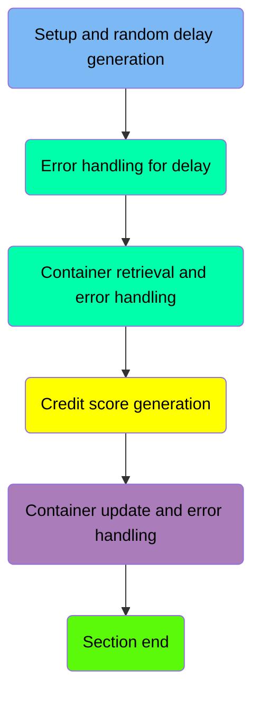
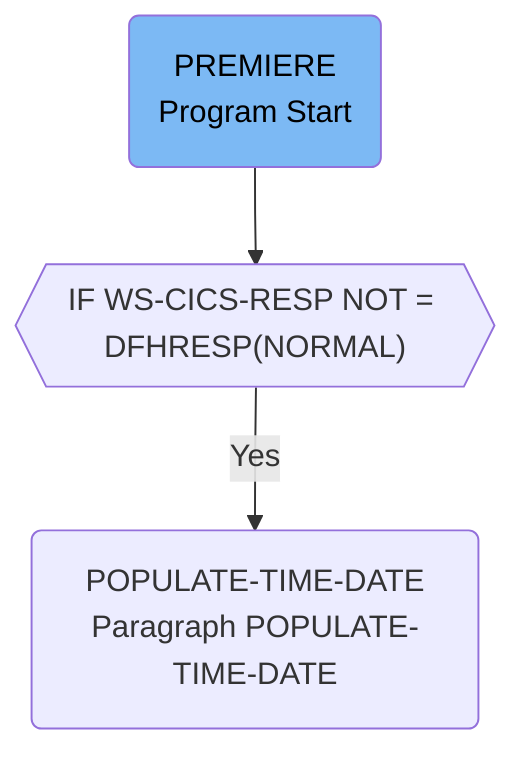
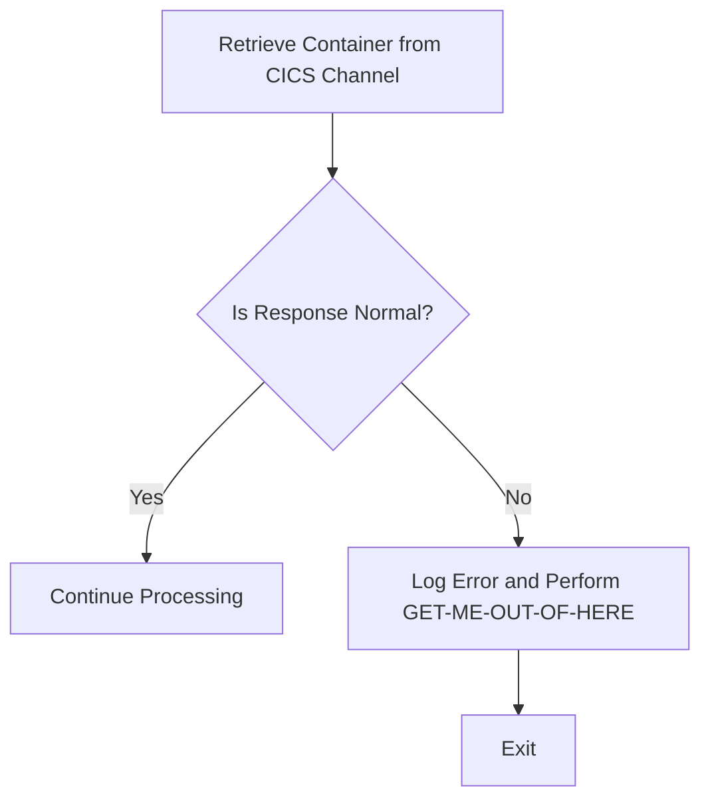
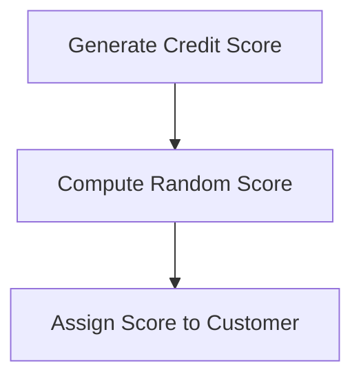
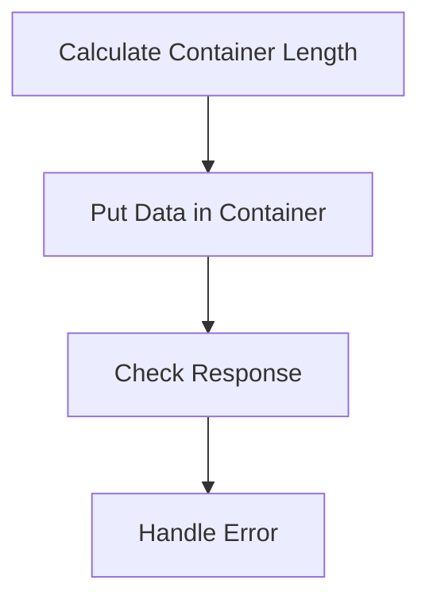
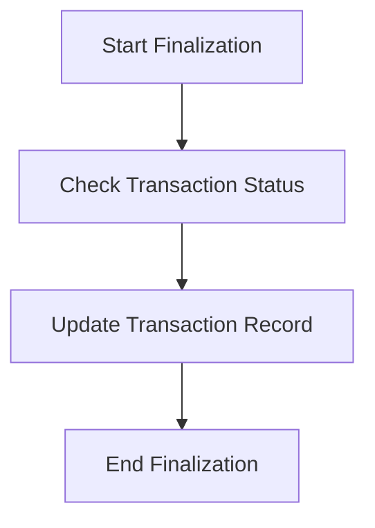

The <SwmToken path="src/base/cobol_src/CRDTAGY5.cbl" pos="201:4:4" line-data="              DISPLAY &#39;CRDTAGY5 - UNABLE TO GET CONTAINER. RESP=&#39;">`CRDTAGY5`</SwmToken> program is responsible for generating a random delay, handling errors, retrieving and updating containers, and generating credit scores. This is achieved through a series of steps including setting up container and channel names, initializing the seed for the random number generator, computing the delay amount, executing the delay, and handling errors if the response is not normal.

The flow starts with setting up the container and channel names, followed by initializing the seed for the random number generator. A random delay amount is then computed and executed. If an error occurs, it is handled appropriately. The program then retrieves a container from the CICS channel, generates a credit score, updates the container, and handles any errors that may occur during these processes.

Here is a high level diagram of the program:



# Setup and random delay generation



<SwmSnippet path="/src/base/cobol_src/CRDTAGY5.cbl" line="111">

---

## Handling Delay and Error Management

First, the <SwmToken path="src/base/cobol_src/CRDTAGY5.cbl" pos="111:1:1" line-data="       PREMIERE SECTION.">`PREMIERE`</SwmToken> section starts by setting up the container and channel names, and initializing the seed for the random number generator. This is used to compute a random delay amount between 1 and 3 seconds. The delay is then executed using the <SwmToken path="src/base/cobol_src/CRDTAGY5.cbl" pos="126:1:5" line-data="           EXEC CICS DELAY">`EXEC CICS DELAY`</SwmToken> command. If the response is not normal, it proceeds to handle the error by calling the <SwmToken path="src/base/cobol_src/CRDTAGY5.cbl" pos="151:3:7" line-data="              PERFORM POPULATE-TIME-DATE">`POPULATE-TIME-DATE`</SwmToken> paragraph.

```cobol
       PREMIERE SECTION.
       A010.
      *
      *    Generate a random  number of seconds between 0 & 3.
      *    This is the delay amount in seconds.
      *


           MOVE 'CIPE            ' TO WS-CONTAINER-NAME.
           MOVE 'CIPCREDCHANN    ' TO WS-CHANNEL-NAME.
           MOVE EIBTASKN           TO WS-SEED.

           COMPUTE WS-DELAY-AMT = ((3 - 1)
                            * FUNCTION RANDOM(WS-SEED)) + 1.

           EXEC CICS DELAY
                FOR SECONDS(WS-DELAY-AMT)
                RESP(WS-CICS-RESP)
                RESP2(WS-CICS-RESP2)
           END-EXEC.

```

---

</SwmSnippet>

<SwmSnippet path="/src/base/cobol_src/CRDTAGY5.cbl" line="119">

---

### Setting Up Container and Channel Names

Moving to setting up the container and channel names, <SwmToken path="src/base/cobol_src/CRDTAGY5.cbl" pos="119:10:14" line-data="           MOVE &#39;CIPE            &#39; TO WS-CONTAINER-NAME.">`WS-CONTAINER-NAME`</SwmToken> is set to 'CIPE ' and <SwmToken path="src/base/cobol_src/CRDTAGY5.cbl" pos="120:10:14" line-data="           MOVE &#39;CIPCREDCHANN    &#39; TO WS-CHANNEL-NAME.">`WS-CHANNEL-NAME`</SwmToken> is set to 'CIPCREDCHANN '. These names are used later to interact with the CICS containers.

```cobol
           MOVE 'CIPE            ' TO WS-CONTAINER-NAME.
           MOVE 'CIPCREDCHANN    ' TO WS-CHANNEL-NAME.
```

---

</SwmSnippet>

<SwmSnippet path="/src/base/cobol_src/CRDTAGY5.cbl" line="121">

---

### Initializing the Seed

Next, the seed for the random number generator is initialized by moving <SwmToken path="src/base/cobol_src/CRDTAGY5.cbl" pos="121:3:3" line-data="           MOVE EIBTASKN           TO WS-SEED.">`EIBTASKN`</SwmToken> to <SwmToken path="src/base/cobol_src/CRDTAGY5.cbl" pos="121:7:9" line-data="           MOVE EIBTASKN           TO WS-SEED.">`WS-SEED`</SwmToken>. This seed ensures that the random number generation is based on the current task number.

```cobol
           MOVE EIBTASKN           TO WS-SEED.
```

---

</SwmSnippet>

<SwmSnippet path="/src/base/cobol_src/CRDTAGY5.cbl" line="123">

---

### Computing the Delay Amount

Then, the delay amount is computed using the <SwmToken path="src/base/cobol_src/CRDTAGY5.cbl" pos="124:3:5" line-data="                            * FUNCTION RANDOM(WS-SEED)) + 1.">`FUNCTION RANDOM`</SwmToken> with the seed. The result is a random number between 1 and 3 seconds, which is stored in <SwmToken path="src/base/cobol_src/CRDTAGY5.cbl" pos="123:3:7" line-data="           COMPUTE WS-DELAY-AMT = ((3 - 1)">`WS-DELAY-AMT`</SwmToken>.

```cobol
           COMPUTE WS-DELAY-AMT = ((3 - 1)
                            * FUNCTION RANDOM(WS-SEED)) + 1.
```

---

</SwmSnippet>

<SwmSnippet path="/src/base/cobol_src/CRDTAGY5.cbl" line="126">

---

### Executing the Delay

The delay is executed using the <SwmToken path="src/base/cobol_src/CRDTAGY5.cbl" pos="126:1:5" line-data="           EXEC CICS DELAY">`EXEC CICS DELAY`</SwmToken> command for the computed number of seconds. The response codes are stored in <SwmToken path="src/base/cobol_src/CRDTAGY5.cbl" pos="128:3:7" line-data="                RESP(WS-CICS-RESP)">`WS-CICS-RESP`</SwmToken> and <SwmToken path="src/base/cobol_src/CRDTAGY5.cbl" pos="129:3:7" line-data="                RESP2(WS-CICS-RESP2)">`WS-CICS-RESP2`</SwmToken>.

```cobol
           EXEC CICS DELAY
                FOR SECONDS(WS-DELAY-AMT)
                RESP(WS-CICS-RESP)
                RESP2(WS-CICS-RESP2)
           END-EXEC.
```

---

</SwmSnippet>

<SwmSnippet path="/src/base/cobol_src/CRDTAGY5.cbl" line="132">

---

### Handling Errors

If the response code <SwmToken path="src/base/cobol_src/CRDTAGY5.cbl" pos="132:3:7" line-data="           IF WS-CICS-RESP NOT = DFHRESP(NORMAL)">`WS-CICS-RESP`</SwmToken> is not normal, the program proceeds to handle the error. It initializes the <SwmToken path="src/base/cobol_src/CRDTAGY5.cbl" pos="139:3:5" line-data="              INITIALIZE ABNDINFO-REC">`ABNDINFO-REC`</SwmToken> and moves the response codes to <SwmToken path="src/base/cobol_src/CRDTAGY5.cbl" pos="140:7:9" line-data="              MOVE EIBRESP    TO ABND-RESPCODE">`ABND-RESPCODE`</SwmToken> and <SwmToken path="src/base/cobol_src/CRDTAGY5.cbl" pos="141:7:9" line-data="              MOVE EIBRESP2   TO ABND-RESP2CODE">`ABND-RESP2CODE`</SwmToken>.

```cobol
           IF WS-CICS-RESP NOT = DFHRESP(NORMAL)
      *
      *       Preserve the RESP and RESP2, then set up the
      *       standard ABEND info before getting the applid,
      *       date/time etc. and linking to the Abend Handler
      *       program.
      *
```

---

</SwmSnippet>

<SwmSnippet path="/src/base/cobol_src/CRDTAGY5.cbl" line="151">

---

### Populating Time and Date

The <SwmToken path="src/base/cobol_src/CRDTAGY5.cbl" pos="151:3:7" line-data="              PERFORM POPULATE-TIME-DATE">`POPULATE-TIME-DATE`</SwmToken> paragraph is performed to get the current date and time. This information is then moved to the <SwmToken path="src/base/cobol_src/CRDTAGY5.cbl" pos="153:11:13" line-data="              MOVE WS-ORIG-DATE TO ABND-DATE">`ABND-DATE`</SwmToken> and <SwmToken path="src/base/cobol_src/CRDTAGY5.cbl" pos="159:3:5" line-data="                       INTO ABND-TIME">`ABND-TIME`</SwmToken> fields for error logging.

```cobol
              PERFORM POPULATE-TIME-DATE

              MOVE WS-ORIG-DATE TO ABND-DATE
              STRING WS-TIME-NOW-GRP-HH DELIMITED BY SIZE,
                      ':' DELIMITED BY SIZE,
                       WS-TIME-NOW-GRP-MM DELIMITED BY SIZE,
                       ':' DELIMITED BY SIZE,
                       WS-TIME-NOW-GRP-MM DELIMITED BY SIZE
                       INTO ABND-TIME
```

---

</SwmSnippet>

# Error handling for delay

```mermaid
graph TD
  A[Initialize ABNDINFO-REC] --> B[Move EIBRESP to ABND-RESPCODE]
  B --> C[Move EIBRESP2 to ABND-RESP2CODE]
  C --> D[Assign APPLID to ABND-APPLID]
  D --> E[Move EIBTASKN to ABND-TASKNO-KEY]
  E --> F[Move EIBTRNID to ABND-TRANID]
  F --> G[Perform POPULATE-TIME-DATE]
  G --> H[Move WS-ORIG-DATE to ABND-DATE]
  H --> I[Format and move time to ABND-TIME]
  I --> J[Move WS-U-TIME to ABND-UTIME-KEY]
  J --> K[Move 'PLOP' to ABND-CODE]
  K --> L[Assign PROGRAM to ABND-PROGRAM]
  L --> M[Move ZEROS to ABND-SQLCODE]
  M --> N[Format and move freeform message to ABND-FREEFORM]
  N --> O[Link to WS-ABEND-PGM with ABNDINFO-REC]
  O --> P[Display error message]
  P --> Q[Execute CICS ABEND with code 'PLOP']

%% Swimm:
%% graph TD
%%   A[Initialize ABNDINFO-REC] --> B[Move EIBRESP to ABND-RESPCODE]
%%   B --> C[Move <SwmToken path="src/base/cobol_src/CRDTAGY5.cbl" pos="141:3:3" line-data="              MOVE EIBRESP2   TO ABND-RESP2CODE">`EIBRESP2`</SwmToken> to ABND-RESP2CODE]
%%   C --> D[Assign APPLID to ABND-APPLID]
%%   D --> E[Move EIBTASKN to ABND-TASKNO-KEY]
%%   E --> F[Move EIBTRNID to ABND-TRANID]
%%   F --> G[Perform POPULATE-TIME-DATE]
%%   G --> H[Move <SwmToken path="src/base/cobol_src/CRDTAGY5.cbl" pos="153:3:7" line-data="              MOVE WS-ORIG-DATE TO ABND-DATE">`WS-ORIG-DATE`</SwmToken> to ABND-DATE]
%%   H --> I[Format and move time to ABND-TIME]
%%   I --> J[Move <SwmToken path="src/base/cobol_src/CRDTAGY5.cbl" pos="162:3:7" line-data="              MOVE WS-U-TIME   TO ABND-UTIME-KEY">`WS-U-TIME`</SwmToken> to ABND-UTIME-KEY]
%%   J --> K[Move 'PLOP' to ABND-CODE]
%%   K --> L[Assign PROGRAM to ABND-PROGRAM]
%%   L --> M[Move ZEROS to ABND-SQLCODE]
%%   M --> N[Format and move freeform message to ABND-FREEFORM]
%%   N --> O[Link to <SwmToken path="src/base/cobol_src/CRDTAGY5.cbl" pos="179:9:13" line-data="              EXEC CICS LINK PROGRAM(WS-ABEND-PGM)">`WS-ABEND-PGM`</SwmToken> with ABNDINFO-REC]
%%   O --> P[Display error message]
%%   P --> Q[Execute CICS ABEND with code 'PLOP']
```



<SwmSnippet path="/src/base/cobol_src/CRDTAGY5.cbl" line="139">

---

## Initialize <SwmToken path="src/base/cobol_src/CRDTAGY5.cbl" pos="139:3:5" line-data="              INITIALIZE ABNDINFO-REC">`ABNDINFO-REC`</SwmToken>

First, the <SwmToken path="src/base/cobol_src/CRDTAGY5.cbl" pos="139:3:5" line-data="              INITIALIZE ABNDINFO-REC">`ABNDINFO-REC`</SwmToken> structure is initialized to ensure it starts with a clean state for collecting abend information.

```cobol
              INITIALIZE ABNDINFO-REC
```

---

</SwmSnippet>

<SwmSnippet path="/src/base/cobol_src/CRDTAGY5.cbl" line="140">

---

## Move EIBRESP to <SwmToken path="src/base/cobol_src/CRDTAGY5.cbl" pos="140:7:9" line-data="              MOVE EIBRESP    TO ABND-RESPCODE">`ABND-RESPCODE`</SwmToken>

Next, the response code from the EXEC Interface Block (EIB) is moved to <SwmToken path="src/base/cobol_src/CRDTAGY5.cbl" pos="140:7:9" line-data="              MOVE EIBRESP    TO ABND-RESPCODE">`ABND-RESPCODE`</SwmToken> to capture the primary response code.

```cobol
              MOVE EIBRESP    TO ABND-RESPCODE
```

---

</SwmSnippet>

<SwmSnippet path="/src/base/cobol_src/CRDTAGY5.cbl" line="141">

---

## Move <SwmToken path="src/base/cobol_src/CRDTAGY5.cbl" pos="141:3:3" line-data="              MOVE EIBRESP2   TO ABND-RESP2CODE">`EIBRESP2`</SwmToken> to <SwmToken path="src/base/cobol_src/CRDTAGY5.cbl" pos="141:7:9" line-data="              MOVE EIBRESP2   TO ABND-RESP2CODE">`ABND-RESP2CODE`</SwmToken>

Then, the secondary response code from the EIB is moved to <SwmToken path="src/base/cobol_src/CRDTAGY5.cbl" pos="141:7:9" line-data="              MOVE EIBRESP2   TO ABND-RESP2CODE">`ABND-RESP2CODE`</SwmToken> to capture additional response information.

```cobol
              MOVE EIBRESP2   TO ABND-RESP2CODE
```

---

</SwmSnippet>

<SwmSnippet path="/src/base/cobol_src/CRDTAGY5.cbl" line="145">

---

## Assign APPLID to <SwmToken path="src/base/cobol_src/CRDTAGY5.cbl" pos="145:9:11" line-data="              EXEC CICS ASSIGN APPLID(ABND-APPLID)">`ABND-APPLID`</SwmToken>

The application ID is assigned to <SwmToken path="src/base/cobol_src/CRDTAGY5.cbl" pos="145:9:11" line-data="              EXEC CICS ASSIGN APPLID(ABND-APPLID)">`ABND-APPLID`</SwmToken> to identify the application where the abend occurred.

```cobol
              EXEC CICS ASSIGN APPLID(ABND-APPLID)
              END-EXEC
```

---

</SwmSnippet>

<SwmSnippet path="/src/base/cobol_src/CRDTAGY5.cbl" line="148">

---

## Move EIBTASKN to <SwmToken path="src/base/cobol_src/CRDTAGY5.cbl" pos="148:7:11" line-data="              MOVE EIBTASKN   TO ABND-TASKNO-KEY">`ABND-TASKNO-KEY`</SwmToken>

The task number is moved to <SwmToken path="src/base/cobol_src/CRDTAGY5.cbl" pos="148:7:11" line-data="              MOVE EIBTASKN   TO ABND-TASKNO-KEY">`ABND-TASKNO-KEY`</SwmToken> to record the specific task that encountered the abend.

```cobol
              MOVE EIBTASKN   TO ABND-TASKNO-KEY
```

---

</SwmSnippet>

<SwmSnippet path="/src/base/cobol_src/CRDTAGY5.cbl" line="149">

---

## Move EIBTRNID to <SwmToken path="src/base/cobol_src/CRDTAGY5.cbl" pos="149:7:9" line-data="              MOVE EIBTRNID   TO ABND-TRANID">`ABND-TRANID`</SwmToken>

The transaction ID is moved to <SwmToken path="src/base/cobol_src/CRDTAGY5.cbl" pos="149:7:9" line-data="              MOVE EIBTRNID   TO ABND-TRANID">`ABND-TRANID`</SwmToken> to capture the transaction that was running when the abend occurred.

```cobol
              MOVE EIBTRNID   TO ABND-TRANID
```

---

</SwmSnippet>

<SwmSnippet path="/src/base/cobol_src/CRDTAGY5.cbl" line="151">

---

## Perform <SwmToken path="src/base/cobol_src/CRDTAGY5.cbl" pos="151:3:7" line-data="              PERFORM POPULATE-TIME-DATE">`POPULATE-TIME-DATE`</SwmToken>

The <SwmToken path="src/base/cobol_src/CRDTAGY5.cbl" pos="151:3:7" line-data="              PERFORM POPULATE-TIME-DATE">`POPULATE-TIME-DATE`</SwmToken> paragraph is performed to get the current date and time.

```cobol
              PERFORM POPULATE-TIME-DATE
```

---

</SwmSnippet>

<SwmSnippet path="/src/base/cobol_src/CRDTAGY5.cbl" line="153">

---

## Move <SwmToken path="src/base/cobol_src/CRDTAGY5.cbl" pos="153:3:7" line-data="              MOVE WS-ORIG-DATE TO ABND-DATE">`WS-ORIG-DATE`</SwmToken> to <SwmToken path="src/base/cobol_src/CRDTAGY5.cbl" pos="153:11:13" line-data="              MOVE WS-ORIG-DATE TO ABND-DATE">`ABND-DATE`</SwmToken>

The original date is moved to <SwmToken path="src/base/cobol_src/CRDTAGY5.cbl" pos="153:11:13" line-data="              MOVE WS-ORIG-DATE TO ABND-DATE">`ABND-DATE`</SwmToken> to record when the abend occurred.

```cobol
              MOVE WS-ORIG-DATE TO ABND-DATE
```

---

</SwmSnippet>

<SwmSnippet path="/src/base/cobol_src/CRDTAGY5.cbl" line="154">

---

## Format and move time to <SwmToken path="src/base/cobol_src/CRDTAGY5.cbl" pos="159:3:5" line-data="                       INTO ABND-TIME">`ABND-TIME`</SwmToken>

The current time is formatted and moved to <SwmToken path="src/base/cobol_src/CRDTAGY5.cbl" pos="159:3:5" line-data="                       INTO ABND-TIME">`ABND-TIME`</SwmToken> to capture the exact time of the abend.

```cobol
              STRING WS-TIME-NOW-GRP-HH DELIMITED BY SIZE,
                      ':' DELIMITED BY SIZE,
                       WS-TIME-NOW-GRP-MM DELIMITED BY SIZE,
                       ':' DELIMITED BY SIZE,
                       WS-TIME-NOW-GRP-MM DELIMITED BY SIZE
                       INTO ABND-TIME
```

---

</SwmSnippet>

<SwmSnippet path="/src/base/cobol_src/CRDTAGY5.cbl" line="162">

---

## Move <SwmToken path="src/base/cobol_src/CRDTAGY5.cbl" pos="162:3:7" line-data="              MOVE WS-U-TIME   TO ABND-UTIME-KEY">`WS-U-TIME`</SwmToken> to <SwmToken path="src/base/cobol_src/CRDTAGY5.cbl" pos="162:11:15" line-data="              MOVE WS-U-TIME   TO ABND-UTIME-KEY">`ABND-UTIME-KEY`</SwmToken>

The universal time is moved to <SwmToken path="src/base/cobol_src/CRDTAGY5.cbl" pos="162:11:15" line-data="              MOVE WS-U-TIME   TO ABND-UTIME-KEY">`ABND-UTIME-KEY`</SwmToken> for additional time tracking.

```cobol
              MOVE WS-U-TIME   TO ABND-UTIME-KEY
```

---

</SwmSnippet>

<SwmSnippet path="/src/base/cobol_src/CRDTAGY5.cbl" line="163">

---

## Move 'PLOP' to <SwmToken path="src/base/cobol_src/CRDTAGY5.cbl" pos="163:9:11" line-data="              MOVE &#39;PLOP&#39;      TO ABND-CODE">`ABND-CODE`</SwmToken>

The abend code 'PLOP' is moved to <SwmToken path="src/base/cobol_src/CRDTAGY5.cbl" pos="163:9:11" line-data="              MOVE &#39;PLOP&#39;      TO ABND-CODE">`ABND-CODE`</SwmToken> to specify the type of abend.

```cobol
              MOVE 'PLOP'      TO ABND-CODE
```

---

</SwmSnippet>

<SwmSnippet path="/src/base/cobol_src/CRDTAGY5.cbl" line="165">

---

## Assign PROGRAM to <SwmToken path="src/base/cobol_src/CRDTAGY5.cbl" pos="165:9:11" line-data="              EXEC CICS ASSIGN PROGRAM(ABND-PROGRAM)">`ABND-PROGRAM`</SwmToken>

The current program name is assigned to <SwmToken path="src/base/cobol_src/CRDTAGY5.cbl" pos="165:9:11" line-data="              EXEC CICS ASSIGN PROGRAM(ABND-PROGRAM)">`ABND-PROGRAM`</SwmToken> to identify which program encountered the abend.

```cobol
              EXEC CICS ASSIGN PROGRAM(ABND-PROGRAM)
              END-EXEC
```

---

</SwmSnippet>

<SwmSnippet path="/src/base/cobol_src/CRDTAGY5.cbl" line="168">

---

## Move ZEROS to <SwmToken path="src/base/cobol_src/CRDTAGY5.cbl" pos="168:7:9" line-data="              MOVE ZEROS      TO ABND-SQLCODE">`ABND-SQLCODE`</SwmToken>

Zeros are moved to <SwmToken path="src/base/cobol_src/CRDTAGY5.cbl" pos="168:7:9" line-data="              MOVE ZEROS      TO ABND-SQLCODE">`ABND-SQLCODE`</SwmToken> to reset any previous SQL error codes.

```cobol
              MOVE ZEROS      TO ABND-SQLCODE
```

---

</SwmSnippet>

<SwmSnippet path="/src/base/cobol_src/CRDTAGY5.cbl" line="170">

---

## Format and move freeform message to <SwmToken path="src/base/cobol_src/CRDTAGY5.cbl" pos="176:3:5" line-data="                      INTO ABND-FREEFORM">`ABND-FREEFORM`</SwmToken>

A freeform error message is formatted and moved to <SwmToken path="src/base/cobol_src/CRDTAGY5.cbl" pos="176:3:5" line-data="                      INTO ABND-FREEFORM">`ABND-FREEFORM`</SwmToken> to provide additional context about the abend.

```cobol
              STRING 'A010  - *** The delay messed up! ***'
                      DELIMITED BY SIZE,
                      ' EIBRESP=' DELIMITED BY SIZE,
                      ABND-RESPCODE DELIMITED BY SIZE,
                      ' RESP2=' DELIMITED BY SIZE,
                      ABND-RESP2CODE DELIMITED BY SIZE
                      INTO ABND-FREEFORM
```

---

</SwmSnippet>

<SwmSnippet path="/src/base/cobol_src/CRDTAGY5.cbl" line="179">

---

## Link to <SwmToken path="src/base/cobol_src/CRDTAGY5.cbl" pos="179:9:13" line-data="              EXEC CICS LINK PROGRAM(WS-ABEND-PGM)">`WS-ABEND-PGM`</SwmToken> with <SwmToken path="src/base/cobol_src/CRDTAGY5.cbl" pos="180:3:5" line-data="                          COMMAREA(ABNDINFO-REC)">`ABNDINFO-REC`</SwmToken>

The <SwmToken path="src/base/cobol_src/CRDTAGY5.cbl" pos="179:9:13" line-data="              EXEC CICS LINK PROGRAM(WS-ABEND-PGM)">`WS-ABEND-PGM`</SwmToken> is linked with <SwmToken path="src/base/cobol_src/CRDTAGY5.cbl" pos="180:3:5" line-data="                          COMMAREA(ABNDINFO-REC)">`ABNDINFO-REC`</SwmToken> to handle the abend using the collected information.

```cobol
              EXEC CICS LINK PROGRAM(WS-ABEND-PGM)
                          COMMAREA(ABNDINFO-REC)
              END-EXEC
```

---

</SwmSnippet>

<SwmSnippet path="/src/base/cobol_src/CRDTAGY5.cbl" line="184">

---

## Display error message

An error message is displayed to notify the user about the abend.

```cobol
              DISPLAY '*** The delay messed up ! ***'
```

---

</SwmSnippet>

<SwmSnippet path="/src/base/cobol_src/CRDTAGY5.cbl" line="185">

---

## Execute CICS ABEND with code 'PLOP'

Finally, the CICS ABEND command is executed with the code 'PLOP' to terminate the task abnormally.

```cobol
              EXEC CICS ABEND
                 ABCODE('PLOP')
              END-EXEC
```

---

</SwmSnippet>

## Interim Summary

So far, we saw how the program handles delay and error management, including setting up container and channel names, initializing the seed for the random number generator, computing the delay amount, executing the delay, and handling errors if the response is not normal. Now, we will focus on retrieving the container from the CICS channel and handling any errors that may occur during this process.

# Container retrieval and error handling



<SwmSnippet path="/src/base/cobol_src/CRDTAGY5.cbl" line="192">

---

## Retrieving Container from CICS Channel

First, the code attempts to retrieve a container from a CICS channel using the <SwmToken path="src/base/cobol_src/CRDTAGY5.cbl" pos="192:1:7" line-data="           EXEC CICS GET CONTAINER(WS-CONTAINER-NAME)">`EXEC CICS GET CONTAINER`</SwmToken> command. This command specifies the container name, channel name, and the variables to store the container's content and length. The response codes are stored in <SwmToken path="src/base/cobol_src/CRDTAGY5.cbl" pos="196:3:7" line-data="                     RESP(WS-CICS-RESP)">`WS-CICS-RESP`</SwmToken> and <SwmToken path="src/base/cobol_src/CRDTAGY5.cbl" pos="197:3:7" line-data="                     RESP2(WS-CICS-RESP2)">`WS-CICS-RESP2`</SwmToken>.

```cobol
           EXEC CICS GET CONTAINER(WS-CONTAINER-NAME)
                     CHANNEL(WS-CHANNEL-NAME)
                     INTO(WS-CONT-IN)
                     FLENGTH(WS-CONTAINER-LEN)
                     RESP(WS-CICS-RESP)
                     RESP2(WS-CICS-RESP2)
           END-EXEC.
```

---

</SwmSnippet>

<SwmSnippet path="/src/base/cobol_src/CRDTAGY5.cbl" line="200">

---

## Checking Response Status

Next, the code checks if the response code <SwmToken path="src/base/cobol_src/CRDTAGY5.cbl" pos="200:3:7" line-data="           IF WS-CICS-RESP NOT = DFHRESP(NORMAL)">`WS-CICS-RESP`</SwmToken> is not equal to <SwmToken path="src/base/cobol_src/CRDTAGY5.cbl" pos="200:13:16" line-data="           IF WS-CICS-RESP NOT = DFHRESP(NORMAL)">`DFHRESP(NORMAL)`</SwmToken>. If the response is not normal, it logs an error message displaying the response codes, container name, channel name, and container length. It then performs the <SwmToken path="src/base/cobol_src/CRDTAGY5.cbl" pos="206:3:11" line-data="              PERFORM GET-ME-OUT-OF-HERE">`GET-ME-OUT-OF-HERE`</SwmToken> section to handle the error.

```cobol
           IF WS-CICS-RESP NOT = DFHRESP(NORMAL)
              DISPLAY 'CRDTAGY5 - UNABLE TO GET CONTAINER. RESP='
                 WS-CICS-RESP ', RESP2=' WS-CICS-RESP2
              DISPLAY 'CONTAINER=' WS-CONTAINER-NAME ' CHANNEL='
                       WS-CHANNEL-NAME ' FLENGTH='
                       WS-CONTAINER-LEN
              PERFORM GET-ME-OUT-OF-HERE
           END-IF.
```

---

</SwmSnippet>

<SwmSnippet path="/src/base/cobol_src/CRDTAGY5.cbl" line="250">

---

## Handling Error with <SwmToken path="src/base/cobol_src/CRDTAGY5.cbl" pos="250:1:9" line-data="       GET-ME-OUT-OF-HERE SECTION.">`GET-ME-OUT-OF-HERE`</SwmToken>

The <SwmToken path="src/base/cobol_src/CRDTAGY5.cbl" pos="250:1:9" line-data="       GET-ME-OUT-OF-HERE SECTION.">`GET-ME-OUT-OF-HERE`</SwmToken> section is executed when there is an error in retrieving the container. This section contains a <SwmToken path="src/base/cobol_src/CRDTAGY5.cbl" pos="253:1:5" line-data="           EXEC CICS RETURN">`EXEC CICS RETURN`</SwmToken> command, which returns control to CICS, effectively terminating the current transaction.

```cobol
       GET-ME-OUT-OF-HERE SECTION.
       GMOFH010.

           EXEC CICS RETURN
           END-EXEC.

       GMOFH999.
           EXIT.
```

---

</SwmSnippet>

# Credit score generation

This is the next section of the flow.



<SwmSnippet path="/src/base/cobol_src/CRDTAGY5.cbl" line="211">

---

## Generate Credit Score

First, we generate a new credit score for the customer. This score is a random number between 1 and 999. The <SwmToken path="src/base/cobol_src/CRDTAGY5.cbl" pos="216:1:1" line-data="           COMPUTE WS-NEW-CREDSCORE = ((999 - 1)">`COMPUTE`</SwmToken> statement calculates this score using the <SwmToken path="src/base/cobol_src/CRDTAGY5.cbl" pos="212:15:15" line-data="      *    used a SEED on the first RANDOM (above) we don&#39;t need to">`RANDOM`</SwmToken> function, which generates a random number. The formula ensures that the score falls within the desired range.

```cobol
      *    Now generate a credit score between 1 and 999. Because we
      *    used a SEED on the first RANDOM (above) we don't need to
      *    use a SEED again when using RANDOM for a subsequent time
      *

           COMPUTE WS-NEW-CREDSCORE = ((999 - 1)
                            * FUNCTION RANDOM) + 1.

           MOVE WS-NEW-CREDSCORE TO WS-CONT-IN-CREDIT-SCORE.


```

---

</SwmSnippet>

<SwmSnippet path="/src/base/cobol_src/CRDTAGY5.cbl" line="216">

---

### Compute Random Score

Next, the <SwmToken path="src/base/cobol_src/CRDTAGY5.cbl" pos="216:1:1" line-data="           COMPUTE WS-NEW-CREDSCORE = ((999 - 1)">`COMPUTE`</SwmToken> statement calculates the new credit score. The <SwmToken path="src/base/cobol_src/CRDTAGY5.cbl" pos="217:5:5" line-data="                            * FUNCTION RANDOM) + 1.">`RANDOM`</SwmToken> function generates a random number, which is then scaled to fit within the range of 1 to 999. This ensures that the credit score is a realistic value for the customer.

```cobol
           COMPUTE WS-NEW-CREDSCORE = ((999 - 1)
                            * FUNCTION RANDOM) + 1.
```

---

</SwmSnippet>

<SwmSnippet path="/src/base/cobol_src/CRDTAGY5.cbl" line="219">

---

### Assign Score to Customer

Finally, the newly computed credit score is moved to the customer's credit score field. This step updates the customer's record with the new score, which can then be used for further processing or decision-making.

```cobol
           MOVE WS-NEW-CREDSCORE TO WS-CONT-IN-CREDIT-SCORE.
```

---

</SwmSnippet>

# Container update and error handling



<SwmSnippet path="/src/base/cobol_src/CRDTAGY5.cbl" line="225">

---

## Calculate Container Length

First, the length of the container data is calculated and stored in <SwmToken path="src/base/cobol_src/CRDTAGY5.cbl" pos="225:3:7" line-data="           COMPUTE WS-CONTAINER-LEN = LENGTH OF WS-CONT-IN.">`WS-CONTAINER-LEN`</SwmToken>.

```cobol
           COMPUTE WS-CONTAINER-LEN = LENGTH OF WS-CONT-IN.
```

---

</SwmSnippet>

<SwmSnippet path="/src/base/cobol_src/CRDTAGY5.cbl" line="227">

---

## Put Data in Container

Next, the data is put into the container using the <SwmToken path="src/base/cobol_src/CRDTAGY5.cbl" pos="227:1:7" line-data="           EXEC CICS PUT CONTAINER(WS-CONTAINER-NAME)">`EXEC CICS PUT CONTAINER`</SwmToken> command. This command updates the container with the data from <SwmToken path="src/base/cobol_src/CRDTAGY5.cbl" pos="228:3:7" line-data="                         FROM(WS-CONT-IN)">`WS-CONT-IN`</SwmToken> and specifies the container name, channel name, and response variables.

```cobol
           EXEC CICS PUT CONTAINER(WS-CONTAINER-NAME)
                         FROM(WS-CONT-IN)
                         FLENGTH(WS-CONTAINER-LEN)
                         CHANNEL(WS-CHANNEL-NAME)
                         RESP(WS-CICS-RESP)
                         RESP2(WS-CICS-RESP2)
           END-EXEC.
```

---

</SwmSnippet>

<SwmSnippet path="/src/base/cobol_src/CRDTAGY5.cbl" line="235">

---

## Check Response

Then, the response from the <SwmToken path="src/base/cobol_src/CRDTAGY5.cbl" pos="227:5:7" line-data="           EXEC CICS PUT CONTAINER(WS-CONTAINER-NAME)">`PUT CONTAINER`</SwmToken> command is checked. If the response is not normal, it indicates an error.

```cobol
           IF WS-CICS-RESP NOT = DFHRESP(NORMAL)
```

---

</SwmSnippet>

<SwmSnippet path="/src/base/cobol_src/CRDTAGY5.cbl" line="236">

---

## Handle Error

If an error occurs, an error message is displayed with the response codes and container details. The <SwmToken path="src/base/cobol_src/CRDTAGY5.cbl" pos="241:3:11" line-data="              PERFORM GET-ME-OUT-OF-HERE">`GET-ME-OUT-OF-HERE`</SwmToken> routine is then performed to handle the error.

```cobol
              DISPLAY 'CRDTAGY5- UNABLE TO PUT CONTAINER. RESP='
                 WS-CICS-RESP ', RESP2=' WS-CICS-RESP2
              DISPLAY  'CONTAINER='  WS-CONTAINER-NAME
              ' CHANNEL=' WS-CHANNEL-NAME ' FLENGTH='
                    WS-CONTAINER-LEN
              PERFORM GET-ME-OUT-OF-HERE
           END-IF.
```

---

</SwmSnippet>

# Section end

This is the next section of the flow.



<SwmSnippet path="/src/base/cobol_src/CRDTAGY5.cbl" line="245">

---

## Start Finalization

The section starts with the label <SwmToken path="src/base/cobol_src/CRDTAGY5.cbl" pos="246:1:2" line-data="       A999.">`A999.`</SwmToken> which indicates the beginning of the finalization process. This step is crucial as it marks the point where the transaction processing is being concluded.

```cobol

       A999.
           EXIT.
```

---

</SwmSnippet>

&nbsp;

*This is an auto-generated document by Swimm 🌊 and has not yet been verified by a human*

<SwmMeta version="3.0.0" repo-id="Z2l0aHViJTNBJTNBY2ljcy1iYW5raW5nLXNhbXBsZS1hcHBsaWNhdGlvbi1jYnNhLUlCTS1EZW1vJTNBJTNBU3dpbW0tRGVtbw==" repo-name="cics-banking-sample-application-cbsa-IBM-Demo"><sup>Powered by [Swimm](/)</sup></SwmMeta>
