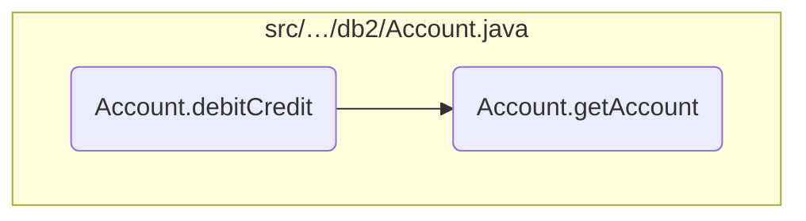

```mermaid
graph TD
  subgraph debitAccountInternal
    debitAccountInternal:A["Instantiate checkAccount from AccountsResource"] --> debitAccountInternal:B["getAccountInternal with accountNumber"]
    debitAccountInternal:B --> debitAccountInternal:C["Check if checkAccountResponse status is 200"]
    debitAccountInternal:C -->|status is 404| debitAccountInternal:D["Return 404 status with error message"]
    debitAccountInternal:C -->|status is not 200 and not 404| debitAccountInternal:E["Return checkAccountResponse status with error message"]
    debitAccountInternal:C -->|status is 200| debitAccountInternal:F["Debit account using debitCreditAccount and return response"]
  end

%% Swimm:
%% graph TD
%%   subgraph <SwmToken path="src/webui/src/main/java/com/ibm/cics/cip/bankliberty/api/json/AccountsResource.java" pos="799:7:7" line-data="		Response myResponse = debitAccountInternal(accountNumber, dbcr);">`debitAccountInternal`</SwmToken>
%%     <SwmToken path="src/webui/src/main/java/com/ibm/cics/cip/bankliberty/api/json/AccountsResource.java" pos="799:7:7" line-data="		Response myResponse = debitAccountInternal(accountNumber, dbcr);">`debitAccountInternal`</SwmToken>:A["Instantiate <SwmToken path="src/webui/src/main/java/com/ibm/cics/cip/bankliberty/api/json/AccountsResource.java" pos="816:3:3" line-data="		AccountsResource checkAccount = new AccountsResource();">`checkAccount`</SwmToken> from <SwmToken path="src/webui/src/main/java/com/ibm/cics/cip/bankliberty/api/json/AccountsResource.java" pos="816:1:1" line-data="		AccountsResource checkAccount = new AccountsResource();">`AccountsResource`</SwmToken>"] --> <SwmToken path="src/webui/src/main/java/com/ibm/cics/cip/bankliberty/api/json/AccountsResource.java" pos="799:7:7" line-data="		Response myResponse = debitAccountInternal(accountNumber, dbcr);">`debitAccountInternal`</SwmToken>:B["<SwmToken path="src/webui/src/main/java/com/ibm/cics/cip/bankliberty/api/json/AccountsResource.java" pos="818:2:2" line-data="				.getAccountInternal(Long.parseLong(accountNumber));">`getAccountInternal`</SwmToken> with <SwmToken path="src/webui/src/main/java/com/ibm/cics/cip/bankliberty/api/json/AccountsResource.java" pos="793:17:17" line-data="	public Response debitAccountExternal(@PathParam(&quot;id&quot;) String accountNumber,">`accountNumber`</SwmToken>"]
%%     <SwmToken path="src/webui/src/main/java/com/ibm/cics/cip/bankliberty/api/json/AccountsResource.java" pos="799:7:7" line-data="		Response myResponse = debitAccountInternal(accountNumber, dbcr);">`debitAccountInternal`</SwmToken>:B --> <SwmToken path="src/webui/src/main/java/com/ibm/cics/cip/bankliberty/api/json/AccountsResource.java" pos="799:7:7" line-data="		Response myResponse = debitAccountInternal(accountNumber, dbcr);">`debitAccountInternal`</SwmToken>:C["Check if <SwmToken path="src/webui/src/main/java/com/ibm/cics/cip/bankliberty/api/json/AccountsResource.java" pos="817:3:3" line-data="		Response checkAccountResponse = checkAccount">`checkAccountResponse`</SwmToken> status is 200"]
%%     <SwmToken path="src/webui/src/main/java/com/ibm/cics/cip/bankliberty/api/json/AccountsResource.java" pos="799:7:7" line-data="		Response myResponse = debitAccountInternal(accountNumber, dbcr);">`debitAccountInternal`</SwmToken>:C -->|status is 404| <SwmToken path="src/webui/src/main/java/com/ibm/cics/cip/bankliberty/api/json/AccountsResource.java" pos="799:7:7" line-data="		Response myResponse = debitAccountInternal(accountNumber, dbcr);">`debitAccountInternal`</SwmToken>:D["Return 404 status with error message"]
%%     <SwmToken path="src/webui/src/main/java/com/ibm/cics/cip/bankliberty/api/json/AccountsResource.java" pos="799:7:7" line-data="		Response myResponse = debitAccountInternal(accountNumber, dbcr);">`debitAccountInternal`</SwmToken>:C -->|status is not 200 and not 404| <SwmToken path="src/webui/src/main/java/com/ibm/cics/cip/bankliberty/api/json/AccountsResource.java" pos="799:7:7" line-data="		Response myResponse = debitAccountInternal(accountNumber, dbcr);">`debitAccountInternal`</SwmToken>:E["Return <SwmToken path="src/webui/src/main/java/com/ibm/cics/cip/bankliberty/api/json/AccountsResource.java" pos="817:3:3" line-data="		Response checkAccountResponse = checkAccount">`checkAccountResponse`</SwmToken> status with error message"]
%%     <SwmToken path="src/webui/src/main/java/com/ibm/cics/cip/bankliberty/api/json/AccountsResource.java" pos="799:7:7" line-data="		Response myResponse = debitAccountInternal(accountNumber, dbcr);">`debitAccountInternal`</SwmToken>:C -->|status is 200| <SwmToken path="src/webui/src/main/java/com/ibm/cics/cip/bankliberty/api/json/AccountsResource.java" pos="799:7:7" line-data="		Response myResponse = debitAccountInternal(accountNumber, dbcr);">`debitAccountInternal`</SwmToken>:F["Debit account using <SwmToken path="src/webui/src/main/java/com/ibm/cics/cip/bankliberty/api/json/AccountsResource.java" pos="847:5:5" line-data="		myResponse = debitCreditAccount(sortcode, accountNumber,">`debitCreditAccount`</SwmToken> and return response"]
%%   end
```

```mermaid
graph TD
subgraph debitCreditAccount
  debitCreditAccount:A["Check if debitAccount is true"] -->|True| debitCreditAccount:B["Multiply amount by -1"]
  debitCreditAccount:C["Create DB2 Account instance"] --> debitCreditAccount:D["Set account number"]
  debitCreditAccount:D --> debitCreditAccount:E["Set sort code"]
  debitCreditAccount:E --> debitCreditAccount:F["Call debitCredit on DB2 Account"]
  debitCreditAccount:F -->|False| debitCreditAccount:G["Prepare error for debit or credit failure"]
  debitCreditAccount:F -->|True| debitCreditAccount:H["Create ProcessedTransactionResource instance"]
  debitCreditAccount:H --> debitCreditAccount:I["Create ProcessedTransactionDebitCreditJSON instance"]
  debitCreditAccount:I --> debitCreditAccount:J["Set sort code on ProcessedTransaction"]
  debitCreditAccount:J --> debitCreditAccount:K["Set account number on ProcessedTransaction"]
  debitCreditAccount:K --> debitCreditAccount:L["Set amount on ProcessedTransaction"]
  debitCreditAccount:L --> debitCreditAccount:M["Call writeInternal on ProcessedTransactionResource"]
  debitCreditAccount:M -->|Write Failed| debitCreditAccount:N["Prepare error for transaction failure"]
  debitCreditAccount:M -->|Write Success| debitCreditAccount:O["Prepare success response with updated balances"]
end

%% Swimm:
%% graph TD
%% subgraph <SwmToken path="src/webui/src/main/java/com/ibm/cics/cip/bankliberty/api/json/AccountsResource.java" pos="847:5:5" line-data="		myResponse = debitCreditAccount(sortcode, accountNumber,">`debitCreditAccount`</SwmToken>
%%   <SwmToken path="src/webui/src/main/java/com/ibm/cics/cip/bankliberty/api/json/AccountsResource.java" pos="847:5:5" line-data="		myResponse = debitCreditAccount(sortcode, accountNumber,">`debitCreditAccount`</SwmToken>:A["Check if <SwmToken path="src/webui/src/main/java/com/ibm/cics/cip/bankliberty/api/json/AccountsResource.java" pos="1137:8:8" line-data="			BigDecimal apiAmount, boolean debitAccount)">`debitAccount`</SwmToken> is true"] -->|True| <SwmToken path="src/webui/src/main/java/com/ibm/cics/cip/bankliberty/api/json/AccountsResource.java" pos="847:5:5" line-data="		myResponse = debitCreditAccount(sortcode, accountNumber,">`debitCreditAccount`</SwmToken>:B["Multiply amount by -1"]
%%   <SwmToken path="src/webui/src/main/java/com/ibm/cics/cip/bankliberty/api/json/AccountsResource.java" pos="847:5:5" line-data="		myResponse = debitCreditAccount(sortcode, accountNumber,">`debitCreditAccount`</SwmToken>:C["Create <SwmToken path="src/webui/src/main/java/com/ibm/cics/cip/bankliberty/api/json/AccountsResource.java" pos="167:11:11" line-data="		 * to keep track of DB2 connections">`DB2`</SwmToken> Account instance"] --> <SwmToken path="src/webui/src/main/java/com/ibm/cics/cip/bankliberty/api/json/AccountsResource.java" pos="847:5:5" line-data="		myResponse = debitCreditAccount(sortcode, accountNumber,">`debitCreditAccount`</SwmToken>:D["Set account number"]
%%   <SwmToken path="src/webui/src/main/java/com/ibm/cics/cip/bankliberty/api/json/AccountsResource.java" pos="847:5:5" line-data="		myResponse = debitCreditAccount(sortcode, accountNumber,">`debitCreditAccount`</SwmToken>:D --> <SwmToken path="src/webui/src/main/java/com/ibm/cics/cip/bankliberty/api/json/AccountsResource.java" pos="847:5:5" line-data="		myResponse = debitCreditAccount(sortcode, accountNumber,">`debitCreditAccount`</SwmToken>:E["Set sort code"]
%%   <SwmToken path="src/webui/src/main/java/com/ibm/cics/cip/bankliberty/api/json/AccountsResource.java" pos="847:5:5" line-data="		myResponse = debitCreditAccount(sortcode, accountNumber,">`debitCreditAccount`</SwmToken>:E --> <SwmToken path="src/webui/src/main/java/com/ibm/cics/cip/bankliberty/api/json/AccountsResource.java" pos="847:5:5" line-data="		myResponse = debitCreditAccount(sortcode, accountNumber,">`debitCreditAccount`</SwmToken>:F["Call <SwmToken path="src/webui/src/main/java/com/ibm/cics/cip/bankliberty/api/json/AccountsResource.java" pos="1150:7:7" line-data="		if (!db2Account.debitCredit(apiAmount))">`debitCredit`</SwmToken> on <SwmToken path="src/webui/src/main/java/com/ibm/cics/cip/bankliberty/api/json/AccountsResource.java" pos="167:11:11" line-data="		 * to keep track of DB2 connections">`DB2`</SwmToken> Account"]
%%   <SwmToken path="src/webui/src/main/java/com/ibm/cics/cip/bankliberty/api/json/AccountsResource.java" pos="847:5:5" line-data="		myResponse = debitCreditAccount(sortcode, accountNumber,">`debitCreditAccount`</SwmToken>:F -->|False| <SwmToken path="src/webui/src/main/java/com/ibm/cics/cip/bankliberty/api/json/AccountsResource.java" pos="847:5:5" line-data="		myResponse = debitCreditAccount(sortcode, accountNumber,">`debitCreditAccount`</SwmToken>:G["Prepare error for debit or credit failure"]
%%   <SwmToken path="src/webui/src/main/java/com/ibm/cics/cip/bankliberty/api/json/AccountsResource.java" pos="847:5:5" line-data="		myResponse = debitCreditAccount(sortcode, accountNumber,">`debitCreditAccount`</SwmToken>:F -->|True| <SwmToken path="src/webui/src/main/java/com/ibm/cics/cip/bankliberty/api/json/AccountsResource.java" pos="847:5:5" line-data="		myResponse = debitCreditAccount(sortcode, accountNumber,">`debitCreditAccount`</SwmToken>:H["Create <SwmToken path="src/webui/src/main/java/com/ibm/cics/cip/bankliberty/api/json/AccountsResource.java" pos="1179:1:1" line-data="		ProcessedTransactionResource myProcessedTransactionResource = new ProcessedTransactionResource();">`ProcessedTransactionResource`</SwmToken> instance"]
%%   <SwmToken path="src/webui/src/main/java/com/ibm/cics/cip/bankliberty/api/json/AccountsResource.java" pos="847:5:5" line-data="		myResponse = debitCreditAccount(sortcode, accountNumber,">`debitCreditAccount`</SwmToken>:H --> <SwmToken path="src/webui/src/main/java/com/ibm/cics/cip/bankliberty/api/json/AccountsResource.java" pos="847:5:5" line-data="		myResponse = debitCreditAccount(sortcode, accountNumber,">`debitCreditAccount`</SwmToken>:I["Create <SwmToken path="src/webui/src/main/java/com/ibm/cics/cip/bankliberty/api/json/AccountsResource.java" pos="1180:1:1" line-data="		ProcessedTransactionDebitCreditJSON myProctranDbCr = new ProcessedTransactionDebitCreditJSON();">`ProcessedTransactionDebitCreditJSON`</SwmToken> instance"]
%%   <SwmToken path="src/webui/src/main/java/com/ibm/cics/cip/bankliberty/api/json/AccountsResource.java" pos="847:5:5" line-data="		myResponse = debitCreditAccount(sortcode, accountNumber,">`debitCreditAccount`</SwmToken>:I --> <SwmToken path="src/webui/src/main/java/com/ibm/cics/cip/bankliberty/api/json/AccountsResource.java" pos="847:5:5" line-data="		myResponse = debitCreditAccount(sortcode, accountNumber,">`debitCreditAccount`</SwmToken>:J["Set sort code on <SwmToken path="src/webui/src/main/java/com/ibm/cics/cip/bankliberty/api/json/ProcessedTransactionResource.java" pos="273:15:15" line-data="		com.ibm.cics.cip.bankliberty.web.db2.ProcessedTransaction myProcessedTransactionDB2 = new com.ibm.cics.cip.bankliberty.web.db2.ProcessedTransaction();">`ProcessedTransaction`</SwmToken>"]
%%   <SwmToken path="src/webui/src/main/java/com/ibm/cics/cip/bankliberty/api/json/AccountsResource.java" pos="847:5:5" line-data="		myResponse = debitCreditAccount(sortcode, accountNumber,">`debitCreditAccount`</SwmToken>:J --> <SwmToken path="src/webui/src/main/java/com/ibm/cics/cip/bankliberty/api/json/AccountsResource.java" pos="847:5:5" line-data="		myResponse = debitCreditAccount(sortcode, accountNumber,">`debitCreditAccount`</SwmToken>:K["Set account number on <SwmToken path="src/webui/src/main/java/com/ibm/cics/cip/bankliberty/api/json/ProcessedTransactionResource.java" pos="273:15:15" line-data="		com.ibm.cics.cip.bankliberty.web.db2.ProcessedTransaction myProcessedTransactionDB2 = new com.ibm.cics.cip.bankliberty.web.db2.ProcessedTransaction();">`ProcessedTransaction`</SwmToken>"]
%%   <SwmToken path="src/webui/src/main/java/com/ibm/cics/cip/bankliberty/api/json/AccountsResource.java" pos="847:5:5" line-data="		myResponse = debitCreditAccount(sortcode, accountNumber,">`debitCreditAccount`</SwmToken>:K --> <SwmToken path="src/webui/src/main/java/com/ibm/cics/cip/bankliberty/api/json/AccountsResource.java" pos="847:5:5" line-data="		myResponse = debitCreditAccount(sortcode, accountNumber,">`debitCreditAccount`</SwmToken>:L["Set amount on <SwmToken path="src/webui/src/main/java/com/ibm/cics/cip/bankliberty/api/json/ProcessedTransactionResource.java" pos="273:15:15" line-data="		com.ibm.cics.cip.bankliberty.web.db2.ProcessedTransaction myProcessedTransactionDB2 = new com.ibm.cics.cip.bankliberty.web.db2.ProcessedTransaction();">`ProcessedTransaction`</SwmToken>"]
%%   <SwmToken path="src/webui/src/main/java/com/ibm/cics/cip/bankliberty/api/json/AccountsResource.java" pos="847:5:5" line-data="		myResponse = debitCreditAccount(sortcode, accountNumber,">`debitCreditAccount`</SwmToken>:L --> <SwmToken path="src/webui/src/main/java/com/ibm/cics/cip/bankliberty/api/json/AccountsResource.java" pos="847:5:5" line-data="		myResponse = debitCreditAccount(sortcode, accountNumber,">`debitCreditAccount`</SwmToken>:M["Call <SwmToken path="src/webui/src/main/java/com/ibm/cics/cip/bankliberty/api/json/AccountsResource.java" pos="1186:2:2" line-data="				.writeInternal(myProctranDbCr);">`writeInternal`</SwmToken> on <SwmToken path="src/webui/src/main/java/com/ibm/cics/cip/bankliberty/api/json/AccountsResource.java" pos="1179:1:1" line-data="		ProcessedTransactionResource myProcessedTransactionResource = new ProcessedTransactionResource();">`ProcessedTransactionResource`</SwmToken>"]
%%   <SwmToken path="src/webui/src/main/java/com/ibm/cics/cip/bankliberty/api/json/AccountsResource.java" pos="847:5:5" line-data="		myResponse = debitCreditAccount(sortcode, accountNumber,">`debitCreditAccount`</SwmToken>:M -->|Write Failed| <SwmToken path="src/webui/src/main/java/com/ibm/cics/cip/bankliberty/api/json/AccountsResource.java" pos="847:5:5" line-data="		myResponse = debitCreditAccount(sortcode, accountNumber,">`debitCreditAccount`</SwmToken>:N["Prepare error for transaction failure"]
%%   <SwmToken path="src/webui/src/main/java/com/ibm/cics/cip/bankliberty/api/json/AccountsResource.java" pos="847:5:5" line-data="		myResponse = debitCreditAccount(sortcode, accountNumber,">`debitCreditAccount`</SwmToken>:M -->|Write Success| <SwmToken path="src/webui/src/main/java/com/ibm/cics/cip/bankliberty/api/json/AccountsResource.java" pos="847:5:5" line-data="		myResponse = debitCreditAccount(sortcode, accountNumber,">`debitCreditAccount`</SwmToken>:O["Prepare success response with updated balances"]
%% end
```

```mermaid
graph TD
  subgraph writeInternal
    writeInternal:A["Initialize ProcessedTransaction instance"] --> writeInternal:B["Check if amount is less than 0"]
    writeInternal:B -->|Yes| writeInternal:C["Call writeDebit"]
    writeInternal:B -->|No| writeInternal:D["Call writeCredit"]
    writeInternal:C --> writeInternal:E["Return success response"]
    writeInternal:D --> writeInternal:F["Return success response"]
  end
  subgraph writeDebit
    writeDebit:A["Prepare and set SQL statement parameters"] --> writeDebit:B["Execute the SQL statement"]
    writeDebit:B --> writeDebit:C["Return success status"]
  end
  subgraph writeCredit
    writeCredit:A["Prepare and set SQL statement parameters"] --> writeCredit:B["Execute the SQL statement"]
    writeCredit:B --> writeCredit:C["Return success status"]
  end
  writeInternal:C --> writeDebit
  writeInternal:D --> writeCredit

%% Swimm:
%% graph TD
%%   subgraph <SwmToken path="src/webui/src/main/java/com/ibm/cics/cip/bankliberty/api/json/AccountsResource.java" pos="1186:2:2" line-data="				.writeInternal(myProctranDbCr);">`writeInternal`</SwmToken>
%%     <SwmToken path="src/webui/src/main/java/com/ibm/cics/cip/bankliberty/api/json/AccountsResource.java" pos="1186:2:2" line-data="				.writeInternal(myProctranDbCr);">`writeInternal`</SwmToken>:A["Initialize <SwmToken path="src/webui/src/main/java/com/ibm/cics/cip/bankliberty/api/json/ProcessedTransactionResource.java" pos="273:15:15" line-data="		com.ibm.cics.cip.bankliberty.web.db2.ProcessedTransaction myProcessedTransactionDB2 = new com.ibm.cics.cip.bankliberty.web.db2.ProcessedTransaction();">`ProcessedTransaction`</SwmToken> instance"] --> <SwmToken path="src/webui/src/main/java/com/ibm/cics/cip/bankliberty/api/json/AccountsResource.java" pos="1186:2:2" line-data="				.writeInternal(myProctranDbCr);">`writeInternal`</SwmToken>:B["Check if amount is less than 0"]
%%     <SwmToken path="src/webui/src/main/java/com/ibm/cics/cip/bankliberty/api/json/AccountsResource.java" pos="1186:2:2" line-data="				.writeInternal(myProctranDbCr);">`writeInternal`</SwmToken>:B -->|Yes| <SwmToken path="src/webui/src/main/java/com/ibm/cics/cip/bankliberty/api/json/AccountsResource.java" pos="1186:2:2" line-data="				.writeInternal(myProctranDbCr);">`writeInternal`</SwmToken>:C["Call <SwmToken path="src/webui/src/main/java/com/ibm/cics/cip/bankliberty/api/json/ProcessedTransactionResource.java" pos="277:6:6" line-data="			if (myProcessedTransactionDB2.writeDebit(">`writeDebit`</SwmToken>"]
%%     <SwmToken path="src/webui/src/main/java/com/ibm/cics/cip/bankliberty/api/json/AccountsResource.java" pos="1186:2:2" line-data="				.writeInternal(myProctranDbCr);">`writeInternal`</SwmToken>:B -->|No| <SwmToken path="src/webui/src/main/java/com/ibm/cics/cip/bankliberty/api/json/AccountsResource.java" pos="1186:2:2" line-data="				.writeInternal(myProctranDbCr);">`writeInternal`</SwmToken>:D["Call <SwmToken path="src/webui/src/main/java/com/ibm/cics/cip/bankliberty/web/db2/ProcessedTransaction.java" pos="545:5:5" line-data="	public boolean writeCredit(String accountNumber, String sortcode,">`writeCredit`</SwmToken>"]
%%     <SwmToken path="src/webui/src/main/java/com/ibm/cics/cip/bankliberty/api/json/AccountsResource.java" pos="1186:2:2" line-data="				.writeInternal(myProctranDbCr);">`writeInternal`</SwmToken>:C --> <SwmToken path="src/webui/src/main/java/com/ibm/cics/cip/bankliberty/api/json/AccountsResource.java" pos="1186:2:2" line-data="				.writeInternal(myProctranDbCr);">`writeInternal`</SwmToken>:E["Return success response"]
%%     <SwmToken path="src/webui/src/main/java/com/ibm/cics/cip/bankliberty/api/json/AccountsResource.java" pos="1186:2:2" line-data="				.writeInternal(myProctranDbCr);">`writeInternal`</SwmToken>:D --> <SwmToken path="src/webui/src/main/java/com/ibm/cics/cip/bankliberty/api/json/AccountsResource.java" pos="1186:2:2" line-data="				.writeInternal(myProctranDbCr);">`writeInternal`</SwmToken>:F["Return success response"]
%%   end
%%   subgraph <SwmToken path="src/webui/src/main/java/com/ibm/cics/cip/bankliberty/api/json/ProcessedTransactionResource.java" pos="277:6:6" line-data="			if (myProcessedTransactionDB2.writeDebit(">`writeDebit`</SwmToken>
%%     <SwmToken path="src/webui/src/main/java/com/ibm/cics/cip/bankliberty/api/json/ProcessedTransactionResource.java" pos="277:6:6" line-data="			if (myProcessedTransactionDB2.writeDebit(">`writeDebit`</SwmToken>:A["Prepare and set SQL statement parameters"] --> <SwmToken path="src/webui/src/main/java/com/ibm/cics/cip/bankliberty/api/json/ProcessedTransactionResource.java" pos="277:6:6" line-data="			if (myProcessedTransactionDB2.writeDebit(">`writeDebit`</SwmToken>:B["Execute the SQL statement"]
%%     <SwmToken path="src/webui/src/main/java/com/ibm/cics/cip/bankliberty/api/json/ProcessedTransactionResource.java" pos="277:6:6" line-data="			if (myProcessedTransactionDB2.writeDebit(">`writeDebit`</SwmToken>:B --> <SwmToken path="src/webui/src/main/java/com/ibm/cics/cip/bankliberty/api/json/ProcessedTransactionResource.java" pos="277:6:6" line-data="			if (myProcessedTransactionDB2.writeDebit(">`writeDebit`</SwmToken>:C["Return success status"]
%%   end
%%   subgraph <SwmToken path="src/webui/src/main/java/com/ibm/cics/cip/bankliberty/web/db2/ProcessedTransaction.java" pos="545:5:5" line-data="	public boolean writeCredit(String accountNumber, String sortcode,">`writeCredit`</SwmToken>
%%     <SwmToken path="src/webui/src/main/java/com/ibm/cics/cip/bankliberty/web/db2/ProcessedTransaction.java" pos="545:5:5" line-data="	public boolean writeCredit(String accountNumber, String sortcode,">`writeCredit`</SwmToken>:A["Prepare and set SQL statement parameters"] --> <SwmToken path="src/webui/src/main/java/com/ibm/cics/cip/bankliberty/web/db2/ProcessedTransaction.java" pos="545:5:5" line-data="	public boolean writeCredit(String accountNumber, String sortcode,">`writeCredit`</SwmToken>:B["Execute the SQL statement"]
%%     <SwmToken path="src/webui/src/main/java/com/ibm/cics/cip/bankliberty/web/db2/ProcessedTransaction.java" pos="545:5:5" line-data="	public boolean writeCredit(String accountNumber, String sortcode,">`writeCredit`</SwmToken>:B --> <SwmToken path="src/webui/src/main/java/com/ibm/cics/cip/bankliberty/web/db2/ProcessedTransaction.java" pos="545:5:5" line-data="	public boolean writeCredit(String accountNumber, String sortcode,">`writeCredit`</SwmToken>:C["Return success status"]
%%   end
%%   <SwmToken path="src/webui/src/main/java/com/ibm/cics/cip/bankliberty/api/json/AccountsResource.java" pos="1186:2:2" line-data="				.writeInternal(myProctranDbCr);">`writeInternal`</SwmToken>:C --> <SwmToken path="src/webui/src/main/java/com/ibm/cics/cip/bankliberty/api/json/ProcessedTransactionResource.java" pos="277:6:6" line-data="			if (myProcessedTransactionDB2.writeDebit(">`writeDebit`</SwmToken>
%%   <SwmToken path="src/webui/src/main/java/com/ibm/cics/cip/bankliberty/api/json/AccountsResource.java" pos="1186:2:2" line-data="				.writeInternal(myProctranDbCr);">`writeInternal`</SwmToken>:D --> <SwmToken path="src/webui/src/main/java/com/ibm/cics/cip/bankliberty/web/db2/ProcessedTransaction.java" pos="545:5:5" line-data="	public boolean writeCredit(String accountNumber, String sortcode,">`writeCredit`</SwmToken>
```

In this document, we will explain the process of handling an external debit operation for a user's account. The process involves several steps, including logging the operation, calling internal functions, managing resources, and updating account balances.

The flow starts with the external debit operation being initiated, which logs the start of the operation. It then calls an internal function to handle the debit, creates and terminates a data access instance, and logs the exit of the operation. The internal function validates the account, handles errors, and debits the account. The debit operation updates the account balance and logs the transaction. If successful, the updated account details are returned.

Here is a high level diagram of the flow, showing only the most important functions:

```mermaid
graph TD;
      subgraph srcwebuisrcmainjavacomibmcicscipbanklibertyapijson[src/…/api/json]
435e7e0e8ad2ba7780e058ee520dcc42eab96343714a860929513947d9d08e71(AccountsResource.debitAccountExternal) --> 9dc826b7e069370144fb2f9d82b1e5076d8ad88c7888dcfef698e30937702016(AccountsResource.debitAccountInternal)
end

subgraph srcwebuisrcmainjavacomibmcicscipbanklibertyapijson[src/…/api/json]
9dc826b7e069370144fb2f9d82b1e5076d8ad88c7888dcfef698e30937702016(AccountsResource.debitAccountInternal) --> bcebcbcc63223e9ac08389922390ae42e04c2e79ce5dda9d037d7c4cb59d9b9c(AccountsResource.debitCreditAccount)
end

subgraph srcwebuisrcmainjavacomibmcicscipbanklibertyapijson[src/…/api/json]
bcebcbcc63223e9ac08389922390ae42e04c2e79ce5dda9d037d7c4cb59d9b9c(AccountsResource.debitCreditAccount) --> 25f2888d531dfddec6ad5e0bc2e89fea4d91a9f8d0507bbc9be1885452d8e64d(ProcessedTransactionResource.writeInternal)
end

subgraph srcwebuisrcmainjavacomibmcicscipbanklibertywebdb2[src/…/web/db2]
bcebcbcc63223e9ac08389922390ae42e04c2e79ce5dda9d037d7c4cb59d9b9c(AccountsResource.debitCreditAccount) --> 780638d70fb3f6987395cc4beebe659b258551949bf538a704570512ffd3e68c(Account.debitCredit)
end

subgraph srcwebuisrcmainjavacomibmcicscipbanklibertywebdb2[src/…/web/db2]
25f2888d531dfddec6ad5e0bc2e89fea4d91a9f8d0507bbc9be1885452d8e64d(ProcessedTransactionResource.writeInternal) --> 94c83c019d5d5e4175137d27fe205db0f10f4b2634ef7073ffb6e2d490b40f96(ProcessedTransaction.writeDebit)
end

subgraph srcwebuisrcmainjavacomibmcicscipbanklibertywebdb2[src/…/web/db2]
25f2888d531dfddec6ad5e0bc2e89fea4d91a9f8d0507bbc9be1885452d8e64d(ProcessedTransactionResource.writeInternal) --> b3e717082e40b734bf584ba2e6e97cecd10518541550a8bc818a607bc713d118(ProcessedTransaction.writeCredit)
end

subgraph srcwebuisrcmainjavacomibmcicscipbanklibertywebdb2[src/…/web/db2]
780638d70fb3f6987395cc4beebe659b258551949bf538a704570512ffd3e68c(Account.debitCredit) --> 1eab8b7c3852bcbc5a3632cd4490f056cd96c1dbf48f74d39c5e626e18f47fcc(Account.getAccount)
end


      classDef mainFlowStyle color:#000000,fill:#7CB9F4
classDef rootsStyle color:#000000,fill:#00FFF4
classDef Style1 color:#000000,fill:#00FFAA
classDef Style2 color:#000000,fill:#FFFF00
classDef Style3 color:#000000,fill:#AA7CB9

%% Swimm:
%% graph TD;
%%       subgraph srcwebuisrcmainjavacomibmcicscipbanklibertyapijson[<SwmPath>[src/…/api/json/](src/webui/src/main/java/com/ibm/cics/cip/bankliberty/api/json/)</SwmPath>]
%% 435e7e0e8ad2ba7780e058ee520dcc42eab96343714a860929513947d9d08e71(AccountsResource.debitAccountExternal) --> 9dc826b7e069370144fb2f9d82b1e5076d8ad88c7888dcfef698e30937702016(AccountsResource.debitAccountInternal)
%% end
%% 
%% subgraph srcwebuisrcmainjavacomibmcicscipbanklibertyapijson[<SwmPath>[src/…/api/json/](src/webui/src/main/java/com/ibm/cics/cip/bankliberty/api/json/)</SwmPath>]
%% 9dc826b7e069370144fb2f9d82b1e5076d8ad88c7888dcfef698e30937702016(AccountsResource.debitAccountInternal) --> bcebcbcc63223e9ac08389922390ae42e04c2e79ce5dda9d037d7c4cb59d9b9c(AccountsResource.debitCreditAccount)
%% end
%% 
%% subgraph srcwebuisrcmainjavacomibmcicscipbanklibertyapijson[<SwmPath>[src/…/api/json/](src/webui/src/main/java/com/ibm/cics/cip/bankliberty/api/json/)</SwmPath>]
%% bcebcbcc63223e9ac08389922390ae42e04c2e79ce5dda9d037d7c4cb59d9b9c(AccountsResource.debitCreditAccount) --> 25f2888d531dfddec6ad5e0bc2e89fea4d91a9f8d0507bbc9be1885452d8e64d(ProcessedTransactionResource.writeInternal)
%% end
%% 
%% subgraph srcwebuisrcmainjavacomibmcicscipbanklibertywebdb2[<SwmPath>[src/…/web/db2/](src/webui/src/main/java/com/ibm/cics/cip/bankliberty/web/db2/)</SwmPath>]
%% bcebcbcc63223e9ac08389922390ae42e04c2e79ce5dda9d037d7c4cb59d9b9c(AccountsResource.debitCreditAccount) --> 780638d70fb3f6987395cc4beebe659b258551949bf538a704570512ffd3e68c(Account.debitCredit)
%% end
%% 
%% subgraph srcwebuisrcmainjavacomibmcicscipbanklibertywebdb2[<SwmPath>[src/…/web/db2/](src/webui/src/main/java/com/ibm/cics/cip/bankliberty/web/db2/)</SwmPath>]
%% 25f2888d531dfddec6ad5e0bc2e89fea4d91a9f8d0507bbc9be1885452d8e64d(ProcessedTransactionResource.writeInternal) --> 94c83c019d5d5e4175137d27fe205db0f10f4b2634ef7073ffb6e2d490b40f96(ProcessedTransaction.writeDebit)
%% end
%% 
%% subgraph srcwebuisrcmainjavacomibmcicscipbanklibertywebdb2[<SwmPath>[src/…/web/db2/](src/webui/src/main/java/com/ibm/cics/cip/bankliberty/web/db2/)</SwmPath>]
%% 25f2888d531dfddec6ad5e0bc2e89fea4d91a9f8d0507bbc9be1885452d8e64d(ProcessedTransactionResource.writeInternal) --> b3e717082e40b734bf584ba2e6e97cecd10518541550a8bc818a607bc713d118(ProcessedTransaction.writeCredit)
%% end
%% 
%% subgraph srcwebuisrcmainjavacomibmcicscipbanklibertywebdb2[<SwmPath>[src/…/web/db2/](src/webui/src/main/java/com/ibm/cics/cip/bankliberty/web/db2/)</SwmPath>]
%% 780638d70fb3f6987395cc4beebe659b258551949bf538a704570512ffd3e68c(Account.debitCredit) --> 1eab8b7c3852bcbc5a3632cd4490f056cd96c1dbf48f74d39c5e626e18f47fcc(Account.getAccount)
%% end
%% 
%% 
%%       classDef mainFlowStyle color:#000000,fill:#7CB9F4
%% classDef rootsStyle color:#000000,fill:#00FFF4
%% classDef Style1 color:#000000,fill:#00FFAA
%% classDef Style2 color:#000000,fill:#FFFF00
%% classDef Style3 color:#000000,fill:#AA7CB9
```



# Flow drill down

```mermaid
graph TD
  subgraph debitAccountExternal
    debitAccountExternal:A["Subtract money from account"] --> debitAccountExternal:B["Log start of debitAccountExternal"]
    debitAccountExternal:B --> debitAccountExternal:C["Call debitAccountInternal function"]
    debitAccountExternal:C --> debitAccountExternal:D["Create HBankDataAccess instance"]
    debitAccountExternal:D --> debitAccountExternal:E["Terminate HBankDataAccess instance"]
    debitAccountExternal:E --> debitAccountExternal:F["Log exit of debitAccountExternal"]
  end

%% Swimm:
%% graph TD
%%   subgraph <SwmToken path="src/webui/src/main/java/com/ibm/cics/cip/bankliberty/api/json/AccountsResource.java" pos="793:5:5" line-data="	public Response debitAccountExternal(@PathParam(&quot;id&quot;) String accountNumber,">`debitAccountExternal`</SwmToken>
%%     <SwmToken path="src/webui/src/main/java/com/ibm/cics/cip/bankliberty/api/json/AccountsResource.java" pos="793:5:5" line-data="	public Response debitAccountExternal(@PathParam(&quot;id&quot;) String accountNumber,">`debitAccountExternal`</SwmToken>:A["Subtract money from account"] --> <SwmToken path="src/webui/src/main/java/com/ibm/cics/cip/bankliberty/api/json/AccountsResource.java" pos="793:5:5" line-data="	public Response debitAccountExternal(@PathParam(&quot;id&quot;) String accountNumber,">`debitAccountExternal`</SwmToken>:B["Log start of <SwmToken path="src/webui/src/main/java/com/ibm/cics/cip/bankliberty/api/json/AccountsResource.java" pos="793:5:5" line-data="	public Response debitAccountExternal(@PathParam(&quot;id&quot;) String accountNumber,">`debitAccountExternal`</SwmToken>"]
%%     <SwmToken path="src/webui/src/main/java/com/ibm/cics/cip/bankliberty/api/json/AccountsResource.java" pos="793:5:5" line-data="	public Response debitAccountExternal(@PathParam(&quot;id&quot;) String accountNumber,">`debitAccountExternal`</SwmToken>:B --> <SwmToken path="src/webui/src/main/java/com/ibm/cics/cip/bankliberty/api/json/AccountsResource.java" pos="793:5:5" line-data="	public Response debitAccountExternal(@PathParam(&quot;id&quot;) String accountNumber,">`debitAccountExternal`</SwmToken>:C["Call <SwmToken path="src/webui/src/main/java/com/ibm/cics/cip/bankliberty/api/json/AccountsResource.java" pos="799:7:7" line-data="		Response myResponse = debitAccountInternal(accountNumber, dbcr);">`debitAccountInternal`</SwmToken> function"]
%%     <SwmToken path="src/webui/src/main/java/com/ibm/cics/cip/bankliberty/api/json/AccountsResource.java" pos="793:5:5" line-data="	public Response debitAccountExternal(@PathParam(&quot;id&quot;) String accountNumber,">`debitAccountExternal`</SwmToken>:C --> <SwmToken path="src/webui/src/main/java/com/ibm/cics/cip/bankliberty/api/json/AccountsResource.java" pos="793:5:5" line-data="	public Response debitAccountExternal(@PathParam(&quot;id&quot;) String accountNumber,">`debitAccountExternal`</SwmToken>:D["Create <SwmToken path="src/webui/src/main/java/com/ibm/cics/cip/bankliberty/api/json/AccountsResource.java" pos="800:1:1" line-data="		HBankDataAccess myHBankDataAccess = new HBankDataAccess();">`HBankDataAccess`</SwmToken> instance"]
%%     <SwmToken path="src/webui/src/main/java/com/ibm/cics/cip/bankliberty/api/json/AccountsResource.java" pos="793:5:5" line-data="	public Response debitAccountExternal(@PathParam(&quot;id&quot;) String accountNumber,">`debitAccountExternal`</SwmToken>:D --> <SwmToken path="src/webui/src/main/java/com/ibm/cics/cip/bankliberty/api/json/AccountsResource.java" pos="793:5:5" line-data="	public Response debitAccountExternal(@PathParam(&quot;id&quot;) String accountNumber,">`debitAccountExternal`</SwmToken>:E["Terminate <SwmToken path="src/webui/src/main/java/com/ibm/cics/cip/bankliberty/api/json/AccountsResource.java" pos="800:1:1" line-data="		HBankDataAccess myHBankDataAccess = new HBankDataAccess();">`HBankDataAccess`</SwmToken> instance"]
%%     <SwmToken path="src/webui/src/main/java/com/ibm/cics/cip/bankliberty/api/json/AccountsResource.java" pos="793:5:5" line-data="	public Response debitAccountExternal(@PathParam(&quot;id&quot;) String accountNumber,">`debitAccountExternal`</SwmToken>:E --> <SwmToken path="src/webui/src/main/java/com/ibm/cics/cip/bankliberty/api/json/AccountsResource.java" pos="793:5:5" line-data="	public Response debitAccountExternal(@PathParam(&quot;id&quot;) String accountNumber,">`debitAccountExternal`</SwmToken>:F["Log exit of <SwmToken path="src/webui/src/main/java/com/ibm/cics/cip/bankliberty/api/json/AccountsResource.java" pos="793:5:5" line-data="	public Response debitAccountExternal(@PathParam(&quot;id&quot;) String accountNumber,">`debitAccountExternal`</SwmToken>"]
%%   end
```

## Looking at <SwmToken path="src/webui/src/main/java/com/ibm/cics/cip/bankliberty/api/json/AccountsResource.java" pos="793:5:5" line-data="	public Response debitAccountExternal(@PathParam(&quot;id&quot;) String accountNumber,">`debitAccountExternal`</SwmToken>



<SwmSnippet path="/src/webui/src/main/java/com/ibm/cics/cip/bankliberty/api/json/AccountsResource.java" line="789">

---

## Handling the external debit operation

First, the <SwmToken path="src/webui/src/main/java/com/ibm/cics/cip/bankliberty/api/json/AccountsResource.java" pos="793:5:5" line-data="	public Response debitAccountExternal(@PathParam(&quot;id&quot;) String accountNumber,">`debitAccountExternal`</SwmToken> method is invoked to handle the external debit operation for a user's account. This method is responsible for subtracting money from the specified account.

```java
	@PUT
	@Path("/debit/{id}")
	@Consumes(MediaType.APPLICATION_JSON)
	@Produces(MediaType.APPLICATION_JSON)
	public Response debitAccountExternal(@PathParam("id") String accountNumber,
			DebitCreditAccountJSON dbcr)
	{
		// we use this to subtract money from an account
```

---

</SwmSnippet>

<SwmSnippet path="/src/webui/src/main/java/com/ibm/cics/cip/bankliberty/api/json/AccountsResource.java" line="797">

---

Next, the method logs the entry into the <SwmToken path="src/webui/src/main/java/com/ibm/cics/cip/bankliberty/api/json/AccountsResource.java" pos="798:2:2" line-data="				&quot;debitAccountExternal(String accountNumber, DebitCreditAccountJSON dbcr)&quot;);">`debitAccountExternal`</SwmToken> function, which helps in tracking the flow of the operation.

```java
		logger.entering(this.getClass().getName(),
				"debitAccountExternal(String accountNumber, DebitCreditAccountJSON dbcr)");
```

---

</SwmSnippet>

<SwmSnippet path="/src/webui/src/main/java/com/ibm/cics/cip/bankliberty/api/json/AccountsResource.java" line="799">

---

Then, the method calls <SwmToken path="src/webui/src/main/java/com/ibm/cics/cip/bankliberty/api/json/AccountsResource.java" pos="799:7:7" line-data="		Response myResponse = debitAccountInternal(accountNumber, dbcr);">`debitAccountInternal`</SwmToken> to handle the internal debit operation. This involves retrieving account details, verifying the account, and debiting the specified amount.

```java
		Response myResponse = debitAccountInternal(accountNumber, dbcr);
```

---

</SwmSnippet>

<SwmSnippet path="/src/webui/src/main/java/com/ibm/cics/cip/bankliberty/api/json/AccountsResource.java" line="800">

---

After the internal debit operation, the method initializes an instance of <SwmToken path="src/webui/src/main/java/com/ibm/cics/cip/bankliberty/api/json/AccountsResource.java" pos="800:1:1" line-data="		HBankDataAccess myHBankDataAccess = new HBankDataAccess();">`HBankDataAccess`</SwmToken> and terminates it. This ensures that any resources used during the operation are properly released.

```java
		HBankDataAccess myHBankDataAccess = new HBankDataAccess();
		myHBankDataAccess.terminate();
```

---

</SwmSnippet>

<SwmSnippet path="/src/webui/src/main/java/com/ibm/cics/cip/bankliberty/api/json/AccountsResource.java" line="802">

---

Finally, the method logs the exit from the <SwmToken path="src/webui/src/main/java/com/ibm/cics/cip/bankliberty/api/json/AccountsResource.java" pos="803:2:2" line-data="				&quot;debitAccountExternal(String accountNumber, DebitCreditAccountJSON dbcr)&quot;,">`debitAccountExternal`</SwmToken> function and returns the response from the internal debit operation.

```java
		logger.exiting(this.getClass().getName(),
				"debitAccountExternal(String accountNumber, DebitCreditAccountJSON dbcr)",
				myResponse);
		return myResponse;
```

---

</SwmSnippet>

## Breaking down <SwmToken path="src/webui/src/main/java/com/ibm/cics/cip/bankliberty/api/json/AccountsResource.java" pos="799:7:7" line-data="		Response myResponse = debitAccountInternal(accountNumber, dbcr);">`debitAccountInternal`</SwmToken>



<SwmSnippet path="/src/webui/src/main/java/com/ibm/cics/cip/bankliberty/api/json/AccountsResource.java" line="816">

---

## Validating the account status

First, the method <SwmToken path="src/webui/src/main/java/com/ibm/cics/cip/bankliberty/api/json/AccountsResource.java" pos="799:7:7" line-data="		Response myResponse = debitAccountInternal(accountNumber, dbcr);">`debitAccountInternal`</SwmToken> validates the account status by calling <SwmToken path="src/webui/src/main/java/com/ibm/cics/cip/bankliberty/api/json/AccountsResource.java" pos="818:2:2" line-data="				.getAccountInternal(Long.parseLong(accountNumber));">`getAccountInternal`</SwmToken> with the provided account number. This step ensures that the account exists and is active before proceeding with the debit operation. If the account is not found, it logs an error and returns a 404 response.

```java
		AccountsResource checkAccount = new AccountsResource();
		Response checkAccountResponse = checkAccount
				.getAccountInternal(Long.parseLong(accountNumber));

		if (checkAccountResponse.getStatus() != 200)
		{
			if (checkAccountResponse.getStatus() == 404)
			{
				JSONObject error = new JSONObject();
				error.put(JSON_ERROR_MSG, FAILED_TO_READ + accountNumber
						+ IN_DEBIT_ACCOUNT + this.getClass().toString());
				logger.log(Level.WARNING, () -> (FAILED_TO_READ + accountNumber
						+ IN_DEBIT_ACCOUNT + this.getClass().toString()));
				myResponse = Response.status(404).entity(error.toString())
						.build();
				logger.exiting(this.getClass().getName(),
						DEBIT_ACCOUNT_INTERNAL, myResponse);
				return myResponse;
```

---

</SwmSnippet>

<SwmSnippet path="/src/webui/src/main/java/com/ibm/cics/cip/bankliberty/api/json/AccountsResource.java" line="835">

---

## Handling account retrieval errors

Next, if the account retrieval fails for reasons other than the account not being found, it logs a severe error and returns a response with the appropriate status code. This ensures that any issues with accessing the account are properly logged and communicated back to the client.

```java
			JSONObject error = new JSONObject();
			error.put(JSON_ERROR_MSG, FAILED_TO_READ + accountNumber
					+ IN_DEBIT_ACCOUNT + this.getClass().toString());
			logger.log(Level.SEVERE, () -> FAILED_TO_READ + accountNumber
					+ IN_DEBIT_ACCOUNT + this.getClass().toString());
			myResponse = Response.status(checkAccountResponse.getStatus())
					.entity(error.toString()).build();
			logger.exiting(this.getClass().getName(), DEBIT_ACCOUNT_INTERNAL,
					myResponse);
			return myResponse;
		}
```

---

</SwmSnippet>

<SwmSnippet path="/src/webui/src/main/java/com/ibm/cics/cip/bankliberty/api/json/AccountsResource.java" line="846">

---

## Debiting the account

Then, the method proceeds to debit the account by calling <SwmToken path="src/webui/src/main/java/com/ibm/cics/cip/bankliberty/api/json/AccountsResource.java" pos="847:5:5" line-data="		myResponse = debitCreditAccount(sortcode, accountNumber,">`debitCreditAccount`</SwmToken> with the sort code, account number, amount to be debited, and a boolean flag indicating a debit operation. This step updates the account balance in the database and logs any errors that occur during the process. If successful, it returns the updated account details.

```java
		Long sortcode = Long.parseLong(this.getSortCode().toString());
		myResponse = debitCreditAccount(sortcode, accountNumber,
				dbcr.getAmount(), true);
		logger.exiting(this.getClass().getName(), DEBIT_ACCOUNT_INTERNAL,
				myResponse);
		return myResponse;
```

---

</SwmSnippet>

## Diving into <SwmToken path="src/webui/src/main/java/com/ibm/cics/cip/bankliberty/api/json/AccountsResource.java" pos="847:5:5" line-data="		myResponse = debitCreditAccount(sortcode, accountNumber,">`debitCreditAccount`</SwmToken>



<SwmSnippet path="/src/webui/src/main/java/com/ibm/cics/cip/bankliberty/api/json/AccountsResource.java" line="1136">

---

## Handling debit and credit transactions

First, the <SwmToken path="src/webui/src/main/java/com/ibm/cics/cip/bankliberty/api/json/AccountsResource.java" pos="1136:5:5" line-data="	private Response debitCreditAccount(Long sortCode, String accountNumber,">`debitCreditAccount`</SwmToken> method is responsible for managing both debit and credit transactions for an account. This is controlled by the <SwmToken path="src/webui/src/main/java/com/ibm/cics/cip/bankliberty/api/json/AccountsResource.java" pos="1137:8:8" line-data="			BigDecimal apiAmount, boolean debitAccount)">`debitAccount`</SwmToken> boolean parameter.

```java
	private Response debitCreditAccount(Long sortCode, String accountNumber,
			BigDecimal apiAmount, boolean debitAccount)
	{
		// This method does both debit AND credit, controlled by the boolean
```

---

</SwmSnippet>

<SwmSnippet path="/src/webui/src/main/java/com/ibm/cics/cip/bankliberty/api/json/AccountsResource.java" line="1144">

---

Next, if the transaction is a debit, the amount is multiplied by -1 to reflect the deduction from the account balance.

```java
		if (debitAccount)
			apiAmount = apiAmount.multiply(BigDecimal.valueOf(-1));
```

---

</SwmSnippet>

<SwmSnippet path="/src/webui/src/main/java/com/ibm/cics/cip/bankliberty/api/json/AccountsResource.java" line="1147">

---

Then, the account details are set using the provided account number and sort code. The <SwmToken path="src/webui/src/main/java/com/ibm/cics/cip/bankliberty/api/json/AccountsResource.java" pos="1150:7:7" line-data="		if (!db2Account.debitCredit(apiAmount))">`debitCredit`</SwmToken> method of the <SwmToken path="src/webui/src/main/java/com/ibm/cics/cip/bankliberty/api/json/AccountsResource.java" pos="1147:15:15" line-data="		com.ibm.cics.cip.bankliberty.web.db2.Account db2Account = new com.ibm.cics.cip.bankliberty.web.db2.Account();">`Account`</SwmToken> class is called to update the account balances.

```java
		com.ibm.cics.cip.bankliberty.web.db2.Account db2Account = new com.ibm.cics.cip.bankliberty.web.db2.Account();
		db2Account.setAccountNumber(accountNumber);
		db2Account.setSortcode(sortCode.toString());
		if (!db2Account.debitCredit(apiAmount))
```

---

</SwmSnippet>

<SwmSnippet path="/src/webui/src/main/java/com/ibm/cics/cip/bankliberty/api/json/AccountsResource.java" line="1151">

---

If the <SwmToken path="src/webui/src/main/java/com/ibm/cics/cip/bankliberty/api/json/AccountsResource.java" pos="1150:7:7" line-data="		if (!db2Account.debitCredit(apiAmount))">`debitCredit`</SwmToken> operation fails, an error response is generated indicating whether the failure was in debiting or crediting the account.

```java
		{
			JSONObject error = new JSONObject();
			if (apiAmount.doubleValue() < 0)
			{
				error.put(JSON_ERROR_MSG, "Failed to debit account "
						+ accountNumber + CLASS_NAME_MSG);
				logger.log(Level.SEVERE, () -> "Failed to debit account "
						+ accountNumber + CLASS_NAME_MSG);
				myResponse = Response.status(500).entity(error.toString())
						.build();
				logger.exiting(this.getClass().getName(), DEBIT_CREDIT_ACCOUNT,
						myResponse);
				return myResponse;
			}
			else
			{
				error.put(JSON_ERROR_MSG, "Failed to credit account "
						+ accountNumber + CLASS_NAME_MSG);
				logger.log(Level.SEVERE, () -> "Failed to credit account "
						+ accountNumber + CLASS_NAME_MSG);
				myResponse = Response.status(500).entity(error.toString())
```

---

</SwmSnippet>

<SwmSnippet path="/src/webui/src/main/java/com/ibm/cics/cip/bankliberty/api/json/AccountsResource.java" line="1179">

---

Moving to the next step, a <SwmToken path="src/webui/src/main/java/com/ibm/cics/cip/bankliberty/api/json/AccountsResource.java" pos="1179:1:1" line-data="		ProcessedTransactionResource myProcessedTransactionResource = new ProcessedTransactionResource();">`ProcessedTransactionResource`</SwmToken> object is created to log the transaction. The transaction details are set, and the <SwmToken path="src/webui/src/main/java/com/ibm/cics/cip/bankliberty/api/json/AccountsResource.java" pos="1186:2:2" line-data="				.writeInternal(myProctranDbCr);">`writeInternal`</SwmToken> method is called to record the transaction.

```java
		ProcessedTransactionResource myProcessedTransactionResource = new ProcessedTransactionResource();
		ProcessedTransactionDebitCreditJSON myProctranDbCr = new ProcessedTransactionDebitCreditJSON();
		myProctranDbCr.setSortCode(db2Account.getSortcode());
		myProctranDbCr.setAccountNumber(db2Account.getAccountNumber());
		myProctranDbCr.setAmount(apiAmount);

		Response debitCreditResponse = myProcessedTransactionResource
				.writeInternal(myProctranDbCr);
```

---

</SwmSnippet>

<SwmSnippet path="/src/webui/src/main/java/com/ibm/cics/cip/bankliberty/api/json/AccountsResource.java" line="1188">

---

If the transaction logging fails, a rollback is attempted, and an error response is generated.

```java
		if (debitCreditResponse == null
				|| debitCreditResponse.getStatus() != 200)
		{

			JSONObject error = new JSONObject();
			error.put(JSON_ERROR_MSG, PROCTRAN_WRITE_FAILURE);
			logger.log(Level.SEVERE, () -> PROCTRAN_WRITE_FAILURE);
			try
			{
				Task.getTask().rollback();
			}
			catch (InvalidRequestException e)
			{
				logger.log(Level.SEVERE, () -> PROCTRAN_WRITE_FAILURE);
			}
			myResponse = Response.status(500).entity(error.toString()).build();
			logger.exiting(this.getClass().getName(), DEBIT_CREDIT_ACCOUNT,
					myResponse);
			return myResponse;
```

---

</SwmSnippet>

<SwmSnippet path="/src/webui/src/main/java/com/ibm/cics/cip/bankliberty/api/json/AccountsResource.java" line="1209">

---

Finally, if all operations are successful, the updated account details are returned in the response.

```java
		response.put(JSON_SORT_CODE, db2Account.getSortcode().trim());
		response.put("id", db2Account.getAccountNumber());
		response.put(JSON_AVAILABLE_BALANCE,
				BigDecimal.valueOf(db2Account.getAvailableBalance()));
		response.put(JSON_ACTUAL_BALANCE,
				BigDecimal.valueOf(db2Account.getActualBalance()));
		response.put(JSON_INTEREST_RATE,
				BigDecimal.valueOf(db2Account.getInterestRate()));
		myResponse = Response.status(200).entity(response.toString()).build();
		logger.exiting(this.getClass().getName(), DEBIT_CREDIT_ACCOUNT,
				myResponse);
		return myResponse;
```

---

</SwmSnippet>

## Diving into <SwmToken path="src/webui/src/main/java/com/ibm/cics/cip/bankliberty/api/json/AccountsResource.java" pos="1186:2:2" line-data="				.writeInternal(myProctranDbCr);">`writeInternal`</SwmToken> & <SwmToken path="src/webui/src/main/java/com/ibm/cics/cip/bankliberty/api/json/ProcessedTransactionResource.java" pos="277:6:6" line-data="			if (myProcessedTransactionDB2.writeDebit(">`writeDebit`</SwmToken> & <SwmToken path="src/webui/src/main/java/com/ibm/cics/cip/bankliberty/web/db2/ProcessedTransaction.java" pos="545:5:5" line-data="	public boolean writeCredit(String accountNumber, String sortcode,">`writeCredit`</SwmToken>



<SwmSnippet path="/src/webui/src/main/java/com/ibm/cics/cip/bankliberty/api/json/ProcessedTransactionResource.java" line="270">

---

## Processing debit and credit transactions

The <SwmToken path="src/webui/src/main/java/com/ibm/cics/cip/bankliberty/api/json/ProcessedTransactionResource.java" pos="270:5:5" line-data="	public Response writeInternal(">`writeInternal`</SwmToken> method is responsible for processing transactions by determining whether the transaction is a debit or a credit. It then delegates the actual database operations to the <SwmToken path="src/webui/src/main/java/com/ibm/cics/cip/bankliberty/api/json/ProcessedTransactionResource.java" pos="277:6:6" line-data="			if (myProcessedTransactionDB2.writeDebit(">`writeDebit`</SwmToken> or <SwmToken path="src/webui/src/main/java/com/ibm/cics/cip/bankliberty/web/db2/ProcessedTransaction.java" pos="545:5:5" line-data="	public boolean writeCredit(String accountNumber, String sortcode,">`writeCredit`</SwmToken> methods accordingly.

```java
	public Response writeInternal(
			ProcessedTransactionDebitCreditJSON proctranDbCr)
	{
		com.ibm.cics.cip.bankliberty.web.db2.ProcessedTransaction myProcessedTransactionDB2 = new com.ibm.cics.cip.bankliberty.web.db2.ProcessedTransaction();

		if (proctranDbCr.getAmount().compareTo(new BigDecimal(0)) < 0)
		{
			if (myProcessedTransactionDB2.writeDebit(
					proctranDbCr.getAccountNumber(), proctranDbCr.getSortCode(),
					proctranDbCr.getAmount()))
			{
				return Response.ok().build();
			}
			else
			{
				logger.severe("PROCTRAN Insert debit didn't work");
				return Response.serverError().build();
			}
		}
		else
		{
```

---

</SwmSnippet>

<SwmSnippet path="/src/webui/src/main/java/com/ibm/cics/cip/bankliberty/web/db2/ProcessedTransaction.java" line="510">

---

### Handling debit transactions

First, if the transaction amount is less than zero, the <SwmToken path="src/webui/src/main/java/com/ibm/cics/cip/bankliberty/api/json/AccountsResource.java" pos="1186:2:2" line-data="				.writeInternal(myProctranDbCr);">`writeInternal`</SwmToken> method calls the <SwmToken path="src/webui/src/main/java/com/ibm/cics/cip/bankliberty/web/db2/ProcessedTransaction.java" pos="510:5:5" line-data="	public boolean writeDebit(String accountNumber, String sortcode,">`writeDebit`</SwmToken> method to process the debit transaction. This method inserts a record into the database with the transaction details, including the account number, sort code, and amount.

```java
	public boolean writeDebit(String accountNumber, String sortcode,
			BigDecimal amount2)
	{
		logger.entering(this.getClass().getName(), WRITE_DEBIT);

		sortOutDateTimeTaskString();

		openConnection();

		logger.log(Level.FINE, () -> ABOUT_TO_INSERT + SQL_INSERT + ">");
		try (PreparedStatement stmt = conn.prepareStatement(SQL_INSERT);)
		{
			stmt.setString(1, PROCTRAN.PROC_TRAN_VALID);
			stmt.setString(2, sortcode);
			stmt.setString(3,
					String.format("%08d", Integer.parseInt(accountNumber)));
			stmt.setString(4, dateString);
			stmt.setString(5, timeString);
			stmt.setString(6, taskRef);
			stmt.setString(7, PROCTRAN.PROC_TY_DEBIT);
			stmt.setString(8, "INTERNET WTHDRW");
```

---

</SwmSnippet>

<SwmSnippet path="/src/webui/src/main/java/com/ibm/cics/cip/bankliberty/web/db2/ProcessedTransaction.java" line="545">

---

### Handling credit transactions

Next, if the transaction amount is zero or greater, the <SwmToken path="src/webui/src/main/java/com/ibm/cics/cip/bankliberty/api/json/AccountsResource.java" pos="1186:2:2" line-data="				.writeInternal(myProctranDbCr);">`writeInternal`</SwmToken> method calls the <SwmToken path="src/webui/src/main/java/com/ibm/cics/cip/bankliberty/web/db2/ProcessedTransaction.java" pos="545:5:5" line-data="	public boolean writeCredit(String accountNumber, String sortcode,">`writeCredit`</SwmToken> method to process the credit transaction. Similar to the debit process, this method inserts a record into the database with the transaction details.

```java
	public boolean writeCredit(String accountNumber, String sortcode,
			BigDecimal amount2)
	{
		logger.entering(this.getClass().getName(), WRITE_CREDIT, false);
		sortOutDateTimeTaskString();

		openConnection();

		logger.log(Level.FINE, () -> ABOUT_TO_INSERT + SQL_INSERT + ">");
		try (PreparedStatement stmt = conn.prepareStatement(SQL_INSERT);)
		{
			stmt.setString(1, PROCTRAN.PROC_TRAN_VALID);
			stmt.setString(2, sortcode);
			stmt.setString(3,
					String.format("%08d", Integer.parseInt(accountNumber)));
			stmt.setString(4, dateString);
			stmt.setString(5, timeString);
			stmt.setString(6, taskRef);
			stmt.setString(7, PROCTRAN.PROC_TY_CREDIT);
			stmt.setString(8, "INTERNET RECVED");
			stmt.setBigDecimal(9, amount2);
```

---

</SwmSnippet>

## Breaking down <SwmToken path="src/webui/src/main/java/com/ibm/cics/cip/bankliberty/api/json/AccountsResource.java" pos="1150:7:7" line-data="		if (!db2Account.debitCredit(apiAmount))">`debitCredit`</SwmToken> & <SwmToken path="src/webui/src/main/java/com/ibm/cics/cip/bankliberty/api/json/AccountsResource.java" pos="392:7:7" line-data="		db2Account = db2Account.getAccount(accountNumber.intValue(), sortCode);">`getAccount`</SwmToken>



## Retrieving Account Details

First, the <SwmToken path="src/webui/src/main/java/com/ibm/cics/cip/bankliberty/api/json/AccountsResource.java" pos="1150:7:7" line-data="		if (!db2Account.debitCredit(apiAmount))">`debitCredit`</SwmToken> method retrieves the account details using the <SwmToken path="src/webui/src/main/java/com/ibm/cics/cip/bankliberty/api/json/AccountsResource.java" pos="392:7:7" line-data="		db2Account = db2Account.getAccount(accountNumber.intValue(), sortCode);">`getAccount`</SwmToken> method. This is done by passing the account number and sort code to the <SwmToken path="src/webui/src/main/java/com/ibm/cics/cip/bankliberty/api/json/AccountsResource.java" pos="392:7:7" line-data="		db2Account = db2Account.getAccount(accountNumber.intValue(), sortCode);">`getAccount`</SwmToken> method, which queries the database to find the corresponding account.

<SwmSnippet path="/src/webui/src/main/java/com/ibm/cics/cip/bankliberty/web/db2/Account.java" line="1006">

---

If the account is not found, a warning is logged, and the method exits, returning `false` to indicate the failure.

```java
		if (temp == null)
		{
			logger.log(Level.WARNING,
					() -> "Unable to find account " + this.getAccountNumber());
			logger.exiting(this.getClass().getName(), DEBIT_CREDIT_ACCOUNT,
					false);
			return false;
		}
```

---

</SwmSnippet>

## Updating Account Balances

Next, the <SwmToken path="src/webui/src/main/java/com/ibm/cics/cip/bankliberty/api/json/AccountsResource.java" pos="1150:7:7" line-data="		if (!db2Account.debitCredit(apiAmount))">`debitCredit`</SwmToken> method proceeds to update the account balances. It calculates the new actual and available balances by adding the <SwmToken path="src/webui/src/main/java/com/ibm/cics/cip/bankliberty/api/json/AccountsResource.java" pos="1137:3:3" line-data="			BigDecimal apiAmount, boolean debitAccount)">`apiAmount`</SwmToken> to the current balances.

<SwmSnippet path="/src/webui/src/main/java/com/ibm/cics/cip/bankliberty/web/db2/Account.java" line="1052">

---

These new balances are then set in the account object and updated in the database using an SQL <SwmToken path="src/webui/src/main/java/com/ibm/cics/cip/bankliberty/web/db2/Account.java" pos="381:8:8" line-data="		String sql = &quot;UPDATE ACCOUNT SET ACCOUNT_TYPE = ? ,ACCOUNT_INTEREST_RATE = ? ,ACCOUNT_OVERDRAFT_LIMIT = ? ,ACCOUNT_LAST_STATEMENT = ? ,ACCOUNT_NEXT_STATEMENT = ? ,ACCOUNT_AVAILABLE_BALANCE = ? ,ACCOUNT_ACTUAL_BALANCE = ? WHERE ACCOUNT_NUMBER like ? AND ACCOUNT_SORTCODE like ?&quot;;">`UPDATE`</SwmToken> statement.

```java
			double newActualBalance = temp.getActualBalance();
			double newAvailableBalance = temp.getAvailableBalance();

			newActualBalance = newActualBalance + apiAmount.doubleValue();
			newAvailableBalance = newAvailableBalance + apiAmount.doubleValue();

			this.setActualBalance(newActualBalance);
			this.setAvailableBalance(newAvailableBalance);

			stmt2.setDouble(1, newActualBalance);
			stmt2.setDouble(2, newAvailableBalance);
			stmt2.setString(3, accountNumberString);
			stmt2.setString(4, sortCodeString);
			logger.log(Level.FINE,
					() -> "About to issue update SQL <" + sqlUpdate + ">");
			stmt2.execute();

```

---

</SwmSnippet>

<SwmSnippet path="/src/webui/src/main/java/com/ibm/cics/cip/bankliberty/web/db2/Account.java" line="1074">

---

## Handling SQL Exceptions

Finally, the method handles any SQL exceptions that may occur during the database operations. If an exception is caught, an error message is logged, and the method exits, returning `false` to indicate the failure.

```java
		catch (SQLException e)
		{
			logger.severe(e.getLocalizedMessage());
			logger.exiting(this.getClass().getName(), DEBIT_CREDIT_ACCOUNT,
					false);
			return false;
		}
```

---

</SwmSnippet>

&nbsp;

*This is an auto-generated document by Swimm 🌊 and has not yet been verified by a human*

<SwmMeta version="3.0.0" repo-id="Z2l0aHViJTNBJTNBY2ljcy1iYW5raW5nLXNhbXBsZS1hcHBsaWNhdGlvbi1jYnNhLUlCTS1EZW1vJTNBJTNBU3dpbW0tRGVtbw==" repo-name="cics-banking-sample-application-cbsa-IBM-Demo"><sup>Powered by [Swimm](/)</sup></SwmMeta>
