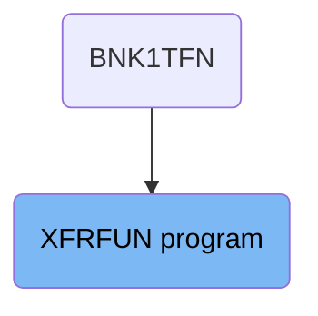
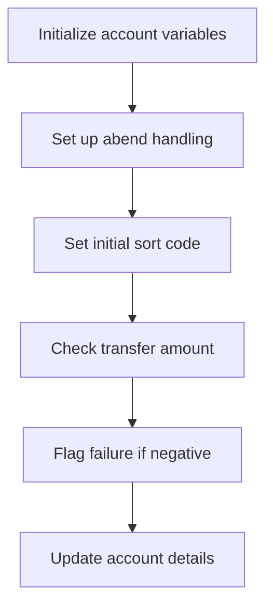
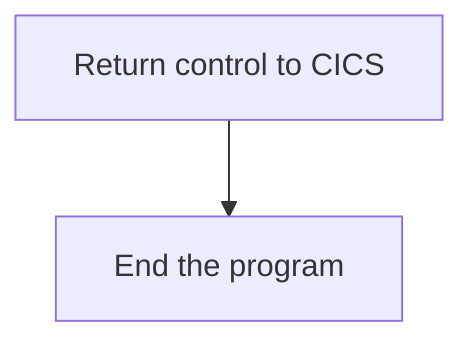
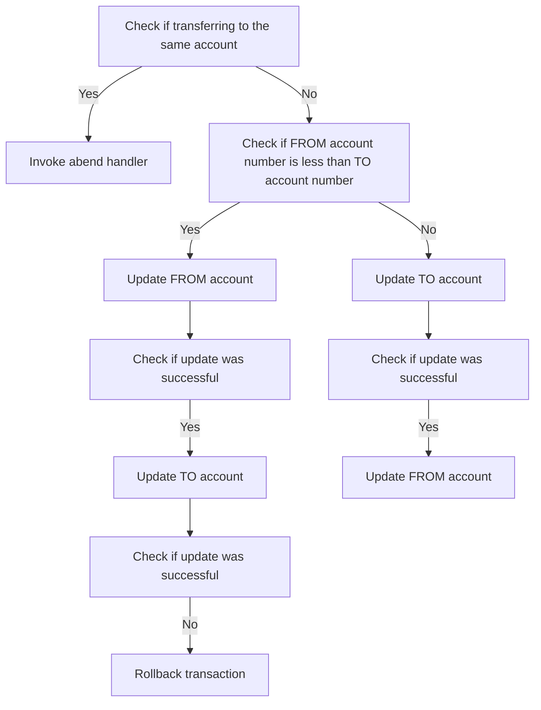
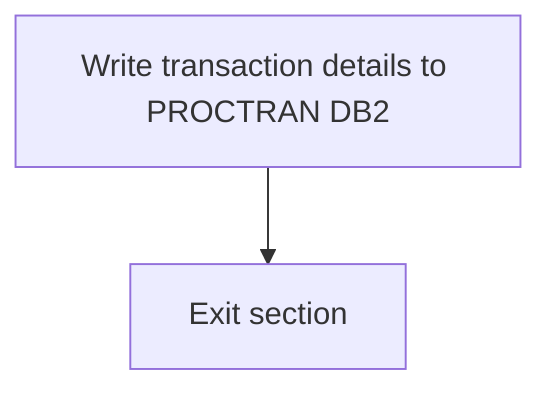
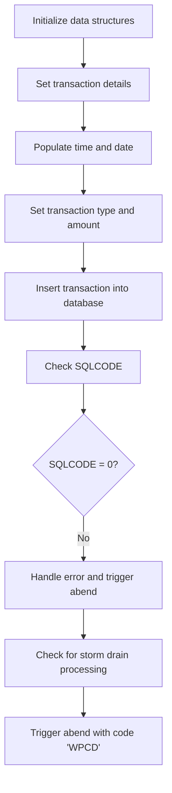

The XFRFUN program is responsible for handling fund transfers within the banking application. It ensures that all necessary validations are performed, such as checking for negative transfer amounts and updating account details accordingly. The program also handles error scenarios by setting up abend handling and performing rollbacks if necessary.

The XFRFUN program starts by initializing account variables and setting up abend handling. It then sets the initial sort code and checks the transfer amount. If the amount is negative, it flags the transaction as a failure. Otherwise, it updates the account details using a <SwmToken path="src/base/cobol_src/XFRFUN.cbl" pos="279:7:7" line-data="           MOVE  0  TO DB2-DEADLOCK-RETRY.">`DB2`</SwmToken> call. The program also includes steps for writing transaction details to the PROCTRAN database and handling any errors that occur during the process.

# Where is this program used?

This program is used once, in a flow starting from `BNK1TFN` as represented in the following diagram:



## PREMIERE

Lets' zoom into this section of the flow:



<SwmSnippet path="/src/base/cobol_src/XFRFUN.cbl" line="276">

---

### Initialize account variables

First, the section initializes several account-related variables to default values. This ensures that any previous data does not interfere with the current transaction.

```cobol
           MOVE '0' TO HV-ACCOUNT-EYECATCHER.
           MOVE '0' TO HV-ACCOUNT-SORTCODE.
           MOVE '0' TO HV-ACCOUNT-ACC-NO.
           MOVE  0  TO DB2-DEADLOCK-RETRY.
```

---

</SwmSnippet>

<SwmSnippet path="/src/base/cobol_src/XFRFUN.cbl" line="272">

---

### Set up abend handling

Moving to the next step, the section sets up abend (abnormal end) handling by specifying a label to jump to in case of an error. This is crucial for maintaining data integrity and ensuring proper error handling.

```cobol
           EXEC CICS HANDLE ABEND
              LABEL(ABEND-HANDLING)
           END-EXEC.
```

---

</SwmSnippet>

<SwmSnippet path="/src/base/cobol_src/XFRFUN.cbl" line="281">

---

### Set initial sort code

Next, the section sets the initial sort code for the transaction. This is important for identifying the specific branch or account involved in the transfer.

```cobol
           MOVE SORTCODE TO COMM-FSCODE COMM-TSCODE.

           MOVE SORTCODE TO DESIRED-SORT-CODE.
```

---

</SwmSnippet>

<SwmSnippet path="/src/base/cobol_src/XFRFUN.cbl" line="289">

---

### Check transfer amount

Then, the section checks if the amount being transferred is negative. This is a critical validation step to prevent invalid transactions.

```cobol
           IF COMM-AMT <= ZERO
```

---

</SwmSnippet>

<SwmSnippet path="/src/base/cobol_src/XFRFUN.cbl" line="290">

---

### Flag failure if negative

If the transfer amount is negative, the section flags the transaction as a failure and sets an appropriate failure code. This ensures that invalid transactions are not processed further.

```cobol
             MOVE 'N' TO COMM-SUCCESS
             MOVE '4' TO COMM-FAIL-CODE
             PERFORM GET-ME-OUT-OF-HERE
```

---

</SwmSnippet>

<SwmSnippet path="/src/base/cobol_src/XFRFUN.cbl" line="296">

---

### Update account details

Finally, the section proceeds to update the account details using a <SwmToken path="src/base/cobol_src/XFRFUN.cbl" pos="296:7:7" line-data="           PERFORM UPDATE-ACCOUNT-DB2">`DB2`</SwmToken> call. This step is essential for reflecting the transfer in the account records.

```cobol
           PERFORM UPDATE-ACCOUNT-DB2
```

---

</SwmSnippet>

## <SwmToken path="src/base/cobol_src/XFRFUN.cbl" pos="292:3:11" line-data="             PERFORM GET-ME-OUT-OF-HERE">`GET-ME-OUT-OF-HERE`</SwmToken>

Lets' zoom into this section of the flow:



<SwmSnippet path="/src/base/cobol_src/XFRFUN.cbl" line="1728">

---

First, the <SwmToken path="src/base/cobol_src/XFRFUN.cbl" pos="292:3:11" line-data="             PERFORM GET-ME-OUT-OF-HERE">`GET-ME-OUT-OF-HERE`</SwmToken> function executes the <SwmToken path="src/base/cobol_src/XFRFUN.cbl" pos="1728:1:5" line-data="           EXEC CICS RETURN">`EXEC CICS RETURN`</SwmToken> command. This command is used to return control back to the CICS region, indicating that the current task is complete and allowing CICS to manage the next steps in processing.

```cobol
           EXEC CICS RETURN
           END-EXEC.
```

---

</SwmSnippet>

<SwmSnippet path="/src/base/cobol_src/XFRFUN.cbl" line="1731">

---

Next, the <SwmToken path="src/base/cobol_src/XFRFUN.cbl" pos="1731:1:1" line-data="           GOBACK.">`GOBACK`</SwmToken> statement is used to return from the current program to the calling program or to the operating system if there is no calling program. This ensures that the program exits gracefully after returning control to CICS.

```cobol
           GOBACK.
```

---

</SwmSnippet>

## Account Update (<SwmToken path="src/base/cobol_src/XFRFUN.cbl" pos="296:3:7" line-data="           PERFORM UPDATE-ACCOUNT-DB2">`UPDATE-ACCOUNT-DB2`</SwmToken>)

Lets' zoom into this section of the flow:



<SwmSnippet path="/src/base/cobol_src/XFRFUN.cbl" line="316">

---

First, the function checks if the transfer is being made to the same account by comparing <SwmToken path="src/base/cobol_src/XFRFUN.cbl" pos="316:3:5" line-data="           IF COMM-FACCNO = COMM-TACCNO">`COMM-FACCNO`</SwmToken> (from account number) with <SwmToken path="src/base/cobol_src/XFRFUN.cbl" pos="316:9:11" line-data="           IF COMM-FACCNO = COMM-TACCNO">`COMM-TACCNO`</SwmToken> (to account number) and <SwmToken path="src/base/cobol_src/XFRFUN.cbl" pos="317:3:5" line-data="              AND COMM-FSCODE = COMM-TSCODE">`COMM-FSCODE`</SwmToken> (from sort code) with <SwmToken path="src/base/cobol_src/XFRFUN.cbl" pos="317:9:11" line-data="              AND COMM-FSCODE = COMM-TSCODE">`COMM-TSCODE`</SwmToken> (to sort code). If they are the same, it invokes the abend handler to prevent the transfer.

More about ABNDPROC: <SwmLink doc-title="Handling Abnormal Terminations (ABNDPROC)">[Handling Abnormal Terminations (ABNDPROC)](/.swm/handling-abnormal-terminations-abndproc.q6kxvboz.sw.md)</SwmLink>

```cobol
           IF COMM-FACCNO = COMM-TACCNO
              AND COMM-FSCODE = COMM-TSCODE
      *
      *       Preserve the RESP and RESP2, then set up the
      *       standard ABEND info before getting the applid,
      *       date/time etc. and linking to the Abend Handler
      *       program.
      *
              INITIALIZE ABNDINFO-REC
              MOVE EIBRESP    TO ABND-RESPCODE
              MOVE EIBRESP2   TO ABND-RESP2CODE
      *
      *       Get supplemental information
      *
              EXEC CICS ASSIGN APPLID(ABND-APPLID)
              END-EXEC

              MOVE EIBTASKN   TO ABND-TASKNO-KEY
              MOVE EIBTRNID   TO ABND-TRANID

              PERFORM POPULATE-TIME-DATE
```

---

</SwmSnippet>

<SwmSnippet path="/src/base/cobol_src/XFRFUN.cbl" line="378">

---

Next, if the transfer is not to the same account, it checks if the <SwmToken path="src/base/cobol_src/XFRFUN.cbl" pos="378:3:5" line-data="           IF COMM-FACCNO &lt; COMM-TACCNO">`COMM-FACCNO`</SwmToken> (from account number) is less than the <SwmToken path="src/base/cobol_src/XFRFUN.cbl" pos="378:9:11" line-data="           IF COMM-FACCNO &lt; COMM-TACCNO">`COMM-TACCNO`</SwmToken> (to account number). If true, it proceeds to update the FROM account.

```cobol
           IF COMM-FACCNO < COMM-TACCNO
      *
      *       If the FROM account number is less than the TO
      *       account number
      *
              MOVE COMM-FACCNO TO DESIRED-ACC-NO
              MOVE COMM-FSCODE TO DESIRED-SORT-CODE

      *
      *       Update the FROM account
      *
              PERFORM UPDATE-ACCOUNT-DB2-FROM
```

---

</SwmSnippet>

<SwmSnippet path="/src/base/cobol_src/XFRFUN.cbl" line="394">

---

Then, it checks if the update to the FROM account was successful by verifying if <SwmToken path="src/base/cobol_src/XFRFUN.cbl" pos="394:3:5" line-data="              IF COMM-SUCCESS = &#39;Y&#39;">`COMM-SUCCESS`</SwmToken> is 'Y'. If successful, it updates the TO account.

```cobol
              IF COMM-SUCCESS = 'Y'
                 MOVE COMM-TACCNO TO DESIRED-ACC-NO
                 MOVE COMM-TSCODE TO DESIRED-SORT-CODE

                 PERFORM UPDATE-ACCOUNT-DB2-TO
```

---

</SwmSnippet>

<SwmSnippet path="/src/base/cobol_src/XFRFUN.cbl" line="404">

---

If the update to the TO account was unsuccessful, it checks the <SwmToken path="src/base/cobol_src/XFRFUN.cbl" pos="406:3:7" line-data="                    IF COMM-FAIL-CODE = &#39;2&#39;">`COMM-FAIL-CODE`</SwmToken>. If the code is '2', it performs a rollback to maintain data consistency.

More about ABNDPROC: <SwmLink doc-title="Handling Abnormal Terminations (ABNDPROC)">[Handling Abnormal Terminations (ABNDPROC)](/.swm/handling-abnormal-terminations-abndproc.q6kxvboz.sw.md)</SwmLink>

```cobol
                 IF COMM-SUCCESS = 'N'

                    IF COMM-FAIL-CODE = '2'
                       EXEC CICS SYNCPOINT
                          ROLLBACK
                          RESP(WS-CICS-RESP)
                          RESP2(WS-CICS-RESP2)
                       END-EXEC

                       IF WS-CICS-RESP IS NOT EQUAL TO DFHRESP(NORMAL)
      *
      *                   Preserve the RESP and RESP2, then set up the
      *                   standard ABEND info before getting the applid,
      *                   date/time etc. and linking to the Abend
      *                   Handler program.
      *
                          INITIALIZE ABNDINFO-REC
                          MOVE EIBRESP    TO ABND-RESPCODE
                          MOVE EIBRESP2   TO ABND-RESP2CODE
      *
      *                   Get supplemental information
```

---

</SwmSnippet>

<SwmSnippet path="/src/base/cobol_src/XFRFUN.cbl" line="499">

---

If the update to the FROM account was not successful, it performs a rollback if the <SwmToken path="src/base/cobol_src/XFRFUN.cbl" pos="501:3:7" line-data="                 IF COMM-FAIL-CODE = &#39;1&#39;">`COMM-FAIL-CODE`</SwmToken> is '1'.

More about ABNDPROC: <SwmLink doc-title="Handling Abnormal Terminations (ABNDPROC)">[Handling Abnormal Terminations (ABNDPROC)](/.swm/handling-abnormal-terminations-abndproc.q6kxvboz.sw.md)</SwmLink>

```cobol
      *          rollback.
      *
                 IF COMM-FAIL-CODE = '1'

                    EXEC CICS SYNCPOINT
                       ROLLBACK
                       RESP(WS-CICS-RESP)
                       RESP2(WS-CICS-RESP2)
                    END-EXEC

      *
      *             If the ROLLback failed
      *
                    IF WS-CICS-RESP IS NOT EQUAL TO DFHRESP(NORMAL)
                       DISPLAY 'XFRFUN error syncpoint '
                          ' rollback after '
                          'updating FROM account '
                          ',RESP=' WS-CICS-RESP
                          ',RESP2=' WS-CICS-RESP2

                       EXEC CICS ABEND
```

---

</SwmSnippet>

<SwmSnippet path="/src/base/cobol_src/XFRFUN.cbl" line="589">

---

If the <SwmToken path="src/base/cobol_src/XFRFUN.cbl" pos="316:3:5" line-data="           IF COMM-FACCNO = COMM-TACCNO">`COMM-FACCNO`</SwmToken> is greater than the <SwmToken path="src/base/cobol_src/XFRFUN.cbl" pos="594:3:5" line-data="              MOVE COMM-TACCNO TO DESIRED-ACC-NO">`COMM-TACCNO`</SwmToken>, it updates the TO account first.

```cobol
           ELSE
      *
      *       The FROM account number is greater than the TO
      *       account number
      *
              MOVE COMM-TACCNO TO DESIRED-ACC-NO
              MOVE COMM-TSCODE TO DESIRED-SORT-CODE

      *
      *       Update the TO account number
      *
              PERFORM UPDATE-ACCOUNT-DB2-TO
```

---

</SwmSnippet>

<SwmSnippet path="/src/base/cobol_src/XFRFUN.cbl" line="606">

---

If the update to the TO account was successful, it then updates the FROM account.

```cobol
              IF COMM-SUCCESS = 'Y'
                 MOVE COMM-FACCNO TO DESIRED-ACC-NO
```

---

</SwmSnippet>

## <SwmToken path="src/base/cobol_src/XFRFUN.cbl" pos="1563:1:5" line-data="       WRITE-TO-PROCTRAN SECTION.">`WRITE-TO-PROCTRAN`</SwmToken>

Lets' zoom into this section of the flow:



<SwmSnippet path="/src/base/cobol_src/XFRFUN.cbl" line="1563">

---

### Writing transaction details to the database

The <SwmToken path="src/base/cobol_src/XFRFUN.cbl" pos="1563:1:5" line-data="       WRITE-TO-PROCTRAN SECTION.">`WRITE-TO-PROCTRAN`</SwmToken> section is responsible for writing transaction details to the PROCTRAN database. This is achieved by performing the <SwmToken path="src/base/cobol_src/XFRFUN.cbl" pos="1566:3:9" line-data="           PERFORM WRITE-TO-PROCTRAN-DB2.">`WRITE-TO-PROCTRAN-DB2`</SwmToken> operation, which handles the actual database write process. This ensures that all successful transactions are recorded in the PROCTRAN datastore, including details such as time and date. After the write operation is performed, the section exits, completing the process.

```cobol
       WRITE-TO-PROCTRAN SECTION.
       WTP010.

           PERFORM WRITE-TO-PROCTRAN-DB2.
       WTP999.
           EXIT.
```

---

</SwmSnippet>

## <SwmToken path="src/base/cobol_src/XFRFUN.cbl" pos="1566:3:9" line-data="           PERFORM WRITE-TO-PROCTRAN-DB2.">`WRITE-TO-PROCTRAN-DB2`</SwmToken>

Lets' zoom into this section of the flow:



<SwmSnippet path="/src/base/cobol_src/XFRFUN.cbl" line="1577">

---

### Initializing data structures

First, the function initializes the data structures <SwmToken path="src/base/cobol_src/XFRFUN.cbl" pos="1577:3:7" line-data="           INITIALIZE HOST-PROCTRAN-ROW.">`HOST-PROCTRAN-ROW`</SwmToken> and <SwmToken path="src/base/cobol_src/XFRFUN.cbl" pos="1578:3:5" line-data="           INITIALIZE WS-EIBTASKN12.">`WS-EIBTASKN12`</SwmToken> to prepare for recording the transaction details.

```cobol
           INITIALIZE HOST-PROCTRAN-ROW.
           INITIALIZE WS-EIBTASKN12.
```

---

</SwmSnippet>

<SwmSnippet path="/src/base/cobol_src/XFRFUN.cbl" line="1580">

---

### Setting transaction details

Next, it sets the transaction details such as the eyecatcher, sort code, account number, and reference number using the respective values from the communication area and task number.

```cobol
           MOVE 'PRTR' TO HV-PROCTRAN-EYECATCHER.
           MOVE COMM-FSCODE TO HV-PROCTRAN-SORT-CODE.
           MOVE COMM-FACCNO TO HV-PROCTRAN-ACC-NUMBER.
           MOVE EIBTASKN TO WS-EIBTASKN12.
           MOVE WS-EIBTASKN12 TO HV-PROCTRAN-REF.
```

---

</SwmSnippet>

<SwmSnippet path="/src/base/cobol_src/XFRFUN.cbl" line="1589">

---

### Populating time and date

Moving to the next step, the function populates the current time and date by executing CICS commands to get the absolute time and format it appropriately.

```cobol
           EXEC CICS ASKTIME
                ABSTIME(WS-U-TIME)
           END-EXEC.

           EXEC CICS FORMATTIME
                ABSTIME(WS-U-TIME)
                DDMMYYYY(WS-ORIG-DATE)
                TIME(HV-PROCTRAN-TIME)
                DATESEP('.')
           END-EXEC.
```

---

</SwmSnippet>

<SwmSnippet path="/src/base/cobol_src/XFRFUN.cbl" line="1605">

---

### Setting transaction type and amount

Then, it sets the transaction type and amount by moving the respective values from the communication area to the host variables.

```cobol
           MOVE PROC-TRAN-TYPE IN PROCTRAN-AREA TO HV-PROCTRAN-TYPE.

           MOVE COMM-AMT TO HV-PROCTRAN-AMOUNT.
```

---

</SwmSnippet>

<SwmSnippet path="/src/base/cobol_src/XFRFUN.cbl" line="1616">

---

### Inserting transaction into database

The function then inserts the transaction details into the <SwmToken path="src/base/cobol_src/XFRFUN.cbl" pos="1617:5:5" line-data="                INSERT INTO PROCTRAN">`PROCTRAN`</SwmToken> table in the database using an SQL <SwmToken path="src/base/cobol_src/XFRFUN.cbl" pos="1617:1:1" line-data="                INSERT INTO PROCTRAN">`INSERT`</SwmToken> statement.

```cobol
           EXEC SQL
                INSERT INTO PROCTRAN
                (
                PROCTRAN_EYECATCHER,
                PROCTRAN_SORTCODE,
                PROCTRAN_NUMBER,
                PROCTRAN_DATE,
                PROCTRAN_TIME,
                PROCTRAN_REF,
                PROCTRAN_TYPE,
                PROCTRAN_DESC,
                PROCTRAN_AMOUNT
                )
                VALUES
                (
                :HV-PROCTRAN-EYECATCHER,
                :HV-PROCTRAN-SORT-CODE,
                :HV-PROCTRAN-ACC-NUMBER,
                :HV-PROCTRAN-DATE,
                :HV-PROCTRAN-TIME,
                :HV-PROCTRAN-REF,
```

---

</SwmSnippet>

<SwmSnippet path="/src/base/cobol_src/XFRFUN.cbl" line="1646">

---

### Checking SQLCODE

After the insertion, it checks the <SwmToken path="src/base/cobol_src/XFRFUN.cbl" pos="1646:3:3" line-data="           IF SQLCODE NOT = 0">`SQLCODE`</SwmToken> to determine if the operation was successful. If the <SwmToken path="src/base/cobol_src/XFRFUN.cbl" pos="1646:3:3" line-data="           IF SQLCODE NOT = 0">`SQLCODE`</SwmToken> is not zero, it indicates an error.

```cobol
           IF SQLCODE NOT = 0

```

---

</SwmSnippet>

<SwmSnippet path="/src/base/cobol_src/XFRFUN.cbl" line="1650">

---

### Handling error and triggering abend

If an error is detected, the function preserves the response codes, gathers supplemental information, and prepares for an abnormal end (abend) by linking to the abend handler program.

```cobol
      *       Preserve the RESP and RESP2, then set up the
      *       standard ABEND info before getting the applid,
      *       date/time etc. and linking to the Abend Handler
      *       program.
      *
              INITIALIZE ABNDINFO-REC
              MOVE EIBRESP    TO ABND-RESPCODE
              MOVE EIBRESP2   TO ABND-RESP2CODE
      *
      *       Get supplemental information
      *
              EXEC CICS ASSIGN APPLID(ABND-APPLID)
              END-EXEC

              MOVE EIBTASKN   TO ABND-TASKNO-KEY
              MOVE EIBTRNID   TO ABND-TRANID

              PERFORM POPULATE-TIME-DATE

              MOVE WS-ORIG-DATE TO ABND-DATE
              STRING WS-TIME-NOW-GRP-HH DELIMITED BY SIZE,
```

---

</SwmSnippet>

<SwmSnippet path="/src/base/cobol_src/XFRFUN.cbl" line="1711">

---

### Checking for storm drain processing

The function then checks if the <SwmToken path="src/base/cobol_src/XFRFUN.cbl" pos="1711:7:7" line-data="      *       Check if SQLCODE indicates that Storm Drain processing">`SQLCODE`</SwmToken> indicates that storm drain processing is applicable, which is a workload management feature.

```cobol
      *       Check if SQLCODE indicates that Storm Drain processing
      *       is applicable in a workload if activated
      *
              PERFORM CHECK-FOR-STORM-DRAIN-DB2
```

---

</SwmSnippet>

<SwmSnippet path="/src/base/cobol_src/XFRFUN.cbl" line="1716">

---

### Triggering abend with code 'WPCD'

Finally, if an error occurred, the function triggers an abend with the code 'WPCD' to indicate the failure in writing to the <SwmToken path="src/base/cobol_src/XFRFUN.cbl" pos="1563:5:5" line-data="       WRITE-TO-PROCTRAN SECTION.">`PROCTRAN`</SwmToken> datastore.

```cobol
              EXEC CICS ABEND
                 ABCODE('WPCD')
              END-EXEC
```

---

</SwmSnippet>

&nbsp;

*This is an auto-generated document by Swimm 🌊 and has not yet been verified by a human*

<SwmMeta version="3.0.0" repo-id="Z2l0aHViJTNBJTNBY2ljcy1iYW5raW5nLXNhbXBsZS1hcHBsaWNhdGlvbi1jYnNhLUlCTS1EZW1vJTNBJTNBU3dpbW0tRGVtbw==" repo-name="cics-banking-sample-application-cbsa-IBM-Demo"><sup>Powered by [Swimm](/)</sup></SwmMeta>
