The <SwmToken path="src/base/cobol_src/BNK1DCS.cbl" pos="387:4:4" line-data="              MOVE &#39;BNK1DCS - A010 - RETURN TRANSID(ODCS) FAIL&#39; TO">`BNK1DCS`</SwmToken> program is designed to handle various key press events and manage communication area data within a CICS environment. It achieves this by setting up abend handling, processing different key presses, and managing communication area data flow.

The flow starts with setting up abend handling to manage abnormal ends. It then processes various key presses such as PA, PF3, <SwmToken path="src/base/cobol_src/BNK1DCS.cbl" pos="951:12:12" line-data="           STRING &#39;Customer lookup successful. &lt;PF5&gt; to Delete. &lt;PF10&#39;">`PF5`</SwmToken>, <SwmToken path="src/base/cobol_src/BNK1DCS.cbl" pos="951:21:21" line-data="           STRING &#39;Customer lookup successful. &lt;PF5&gt; to Delete. &lt;PF10&#39;">`PF10`</SwmToken>, PF12, CLEAR, and ENTER keys, each triggering specific actions. The program also handles invalid key presses by displaying error messages. Finally, it processes communication area data and returns control to the main transaction.

Here is a high level diagram of the program:

```mermaid
graph TD
xkb5m("Setup abend handling"):::af5bf6942  --> 
3lgjh("Initial setup"):::af99fbebc  --> 
ka6wf("Handle PA key press"):::a62d85edd  --> 
hawzp("Handle PF3 key press"):::a49266158  --> 
u9g80("Handle PF5 key press"):::a8fe93b2c  --> 
yupep("Handle PF10 key press"):::af2d8e945  --> 
rw8lb("Handle PF12 key press"):::a709984d1  --> 
3j37n("Handle CLEAR key press"):::a858bf53a  --> 
tdf5g("Handle ENTER key press"):::ac52fb7cf  --> 
mzc61("Handle invalid key press"):::aacf9316c  --> 
npoa7("Process communication area data"):::ab2dfa01d  --> 
rz2bl("Return to CICS"):::a7c71fc3f  --> 
q4h12("Handle RESP failures"):::aa9678e43  --> 
ni90m("Exit section"):::ab4ff6a14 
classDef af5bf6942 color:#000000,fill:#7CB9F4
classDef af99fbebc color:#000000,fill:#00FFAA
classDef a62d85edd color:#000000,fill:#00FFAA
classDef a49266158 color:#000000,fill:#FFFF00
classDef a8fe93b2c color:#000000,fill:#AA7CB9
classDef af2d8e945 color:#000000,fill:#5afa0a
classDef a709984d1 color:#000000,fill:#f5a10a
classDef a858bf53a color:#000000,fill:#AA7CB9
classDef ac52fb7cf color:#000000,fill:#9c5602
classDef aacf9316c color:#000000,fill:#f50af1
classDef ab2dfa01d color:#000000,fill:#C70039
classDef a7c71fc3f color:#000000,fill:#900C3F
classDef aa9678e43 color:#000000,fill:#581845
classDef ab4ff6a14 color:#000000,fill:#9c5602

%% Swimm:
%% graph TD
%% xkb5m("Setup abend handling"):::af5bf6942  --> 
%% 3lgjh("Initial setup"):::af99fbebc  --> 
%% ka6wf("Handle PA key press"):::a62d85edd  --> 
%% hawzp("Handle PF3 key press"):::a49266158  --> 
%% u9g80("Handle <SwmToken path="src/base/cobol_src/BNK1DCS.cbl" pos="951:12:12" line-data="           STRING &#39;Customer lookup successful. &lt;PF5&gt; to Delete. &lt;PF10&#39;">`PF5`</SwmToken> key press"):::a8fe93b2c  --> 
%% yupep("Handle <SwmToken path="src/base/cobol_src/BNK1DCS.cbl" pos="951:21:21" line-data="           STRING &#39;Customer lookup successful. &lt;PF5&gt; to Delete. &lt;PF10&#39;">`PF10`</SwmToken> key press"):::af2d8e945  --> 
%% rw8lb("Handle PF12 key press"):::a709984d1  --> 
%% 3j37n("Handle CLEAR key press"):::a858bf53a  --> 
%% tdf5g("Handle ENTER key press"):::ac52fb7cf  --> 
%% mzc61("Handle invalid key press"):::aacf9316c  --> 
%% npoa7("Process communication area data"):::ab2dfa01d  --> 
%% rz2bl("Return to CICS"):::a7c71fc3f  --> 
%% q4h12("Handle RESP failures"):::aa9678e43  --> 
%% ni90m("Exit section"):::ab4ff6a14 
%% classDef af5bf6942 color:#000000,fill:#7CB9F4
%% classDef af99fbebc color:#000000,fill:#00FFAA
%% classDef a62d85edd color:#000000,fill:#00FFAA
%% classDef a49266158 color:#000000,fill:#FFFF00
%% classDef a8fe93b2c color:#000000,fill:#AA7CB9
%% classDef af2d8e945 color:#000000,fill:#5afa0a
%% classDef a709984d1 color:#000000,fill:#f5a10a
%% classDef a858bf53a color:#000000,fill:#AA7CB9
%% classDef ac52fb7cf color:#000000,fill:#9c5602
%% classDef aacf9316c color:#000000,fill:#f50af1
%% classDef ab2dfa01d color:#000000,fill:#C70039
%% classDef a7c71fc3f color:#000000,fill:#900C3F
%% classDef aa9678e43 color:#000000,fill:#581845
%% classDef ab4ff6a14 color:#000000,fill:#9c5602
```

## Setup abend handling

First, we'll zoom into this section of the flow:

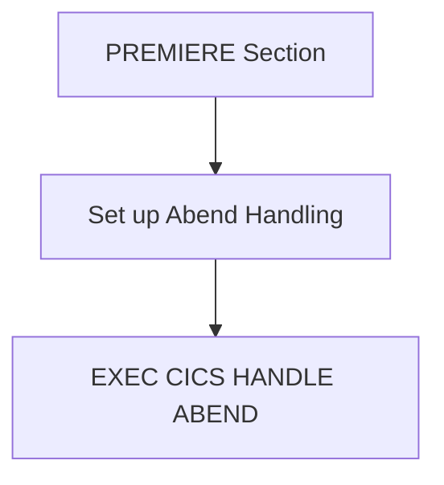

<SwmSnippet path="/src/base/cobol_src/BNK1DCS.cbl" line="189">

---

First, the PREMIERE section is initiated to handle specific operations within the application.

```cobol
       PREMIERE SECTION.
       A010.
```

---

</SwmSnippet>

<SwmSnippet path="/src/base/cobol_src/BNK1DCS.cbl" line="195">

---

Next, the abend handling is set up using the <SwmToken path="src/base/cobol_src/BNK1DCS.cbl" pos="195:1:7" line-data="           EXEC CICS HANDLE ABEND">`EXEC CICS HANDLE ABEND`</SwmToken> command, which directs the program to the <SwmToken path="src/base/cobol_src/BNK1DCS.cbl" pos="196:3:5" line-data="                LABEL(ABEND-HANDLING)">`ABEND-HANDLING`</SwmToken> label in case of an abnormal end.

```cobol
           EXEC CICS HANDLE ABEND
                LABEL(ABEND-HANDLING)
           END-EXEC.
```

---

</SwmSnippet>

## Initial setup

Now, lets zoom into this section of the flow:

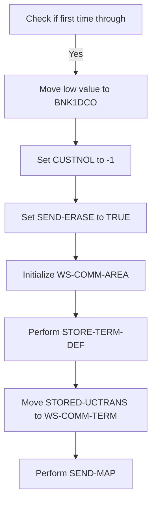

<SwmSnippet path="/src/base/cobol_src/BNK1DCS.cbl" line="205">

---

First, we check if <SwmToken path="src/base/cobol_src/BNK1DCS.cbl" pos="205:3:3" line-data="              WHEN EIBCALEN = ZERO">`EIBCALEN`</SwmToken> (which indicates the length of the communication area) is zero. If it is, this means it is the first time through the program.

```cobol
              WHEN EIBCALEN = ZERO
```

---

</SwmSnippet>

<SwmSnippet path="/src/base/cobol_src/BNK1DCS.cbl" line="206">

---

Moving to the next step, we set <SwmToken path="src/base/cobol_src/BNK1DCS.cbl" pos="206:9:9" line-data="                 MOVE LOW-VALUE TO BNK1DCO">`BNK1DCO`</SwmToken> to <SwmToken path="src/base/cobol_src/BNK1DCS.cbl" pos="206:3:5" line-data="                 MOVE LOW-VALUE TO BNK1DCO">`LOW-VALUE`</SwmToken> (which initializes the data fields to their lowest possible value) and set <SwmToken path="src/base/cobol_src/BNK1DCS.cbl" pos="207:8:8" line-data="                 MOVE -1 TO CUSTNOL">`CUSTNOL`</SwmToken> to -1, indicating no customer is currently selected.

```cobol
                 MOVE LOW-VALUE TO BNK1DCO
                 MOVE -1 TO CUSTNOL
```

---

</SwmSnippet>

<SwmSnippet path="/src/base/cobol_src/BNK1DCS.cbl" line="208">

---

Next, we set <SwmToken path="src/base/cobol_src/BNK1DCS.cbl" pos="208:3:5" line-data="                 SET SEND-ERASE TO TRUE">`SEND-ERASE`</SwmToken> to TRUE to ensure the screen is cleared, initialize <SwmToken path="src/base/cobol_src/BNK1DCS.cbl" pos="209:3:7" line-data="                 INITIALIZE WS-COMM-AREA">`WS-COMM-AREA`</SwmToken> to reset the working storage communication area, and perform <SwmToken path="src/base/cobol_src/BNK1DCS.cbl" pos="211:3:7" line-data="                 PERFORM STORE-TERM-DEF">`STORE-TERM-DEF`</SwmToken> to store terminal definitions. Finally, we move <SwmToken path="src/base/cobol_src/BNK1DCS.cbl" pos="213:3:5" line-data="                 MOVE STORED-UCTRANS TO WS-COMM-TERM">`STORED-UCTRANS`</SwmToken> to <SwmToken path="src/base/cobol_src/BNK1DCS.cbl" pos="213:9:13" line-data="                 MOVE STORED-UCTRANS TO WS-COMM-TERM">`WS-COMM-TERM`</SwmToken> and perform <SwmToken path="src/base/cobol_src/BNK1DCS.cbl" pos="215:3:5" line-data="                 PERFORM SEND-MAP">`SEND-MAP`</SwmToken> to send the map to the terminal.

```cobol
                 SET SEND-ERASE TO TRUE
                 INITIALIZE WS-COMM-AREA

                 PERFORM STORE-TERM-DEF

                 MOVE STORED-UCTRANS TO WS-COMM-TERM

                 PERFORM SEND-MAP
```

---

</SwmSnippet>

## Handle PA key press

Now, lets zoom into this section of the flow:

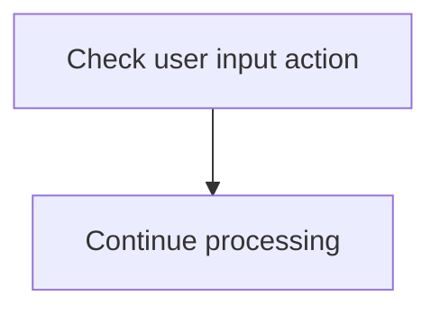

<SwmSnippet path="/src/base/cobol_src/BNK1DCS.cbl" line="220">

---

The code checks if the user input action matches any of the predefined actions (<SwmToken path="src/base/cobol_src/BNK1DCS.cbl" pos="220:7:7" line-data="              WHEN EIBAID = DFHPA1 OR DFHPA2 OR DFHPA3">`DFHPA1`</SwmToken>, <SwmToken path="src/base/cobol_src/BNK1DCS.cbl" pos="220:11:11" line-data="              WHEN EIBAID = DFHPA1 OR DFHPA2 OR DFHPA3">`DFHPA2`</SwmToken>, or <SwmToken path="src/base/cobol_src/BNK1DCS.cbl" pos="220:15:15" line-data="              WHEN EIBAID = DFHPA1 OR DFHPA2 OR DFHPA3">`DFHPA3`</SwmToken>). If there is a match, it proceeds to continue processing the input without any interruption.

```cobol
              WHEN EIBAID = DFHPA1 OR DFHPA2 OR DFHPA3
                 CONTINUE
```

---

</SwmSnippet>

## Handle PF3 key press

Now, lets zoom into this section of the flow:

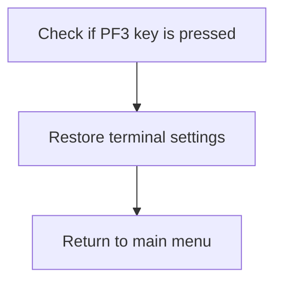

<SwmSnippet path="/src/base/cobol_src/BNK1DCS.cbl" line="226">

---

### Checking if PF3 key is pressed

First, we check if the PF3 key is pressed by evaluating the <SwmToken path="src/base/cobol_src/BNK1DCS.cbl" pos="226:3:3" line-data="              WHEN EIBAID = DFHPF3">`EIBAID`</SwmToken> variable. If the PF3 key is pressed, it indicates that the user wants to return to the main menu.

```cobol
              WHEN EIBAID = DFHPF3
```

---

</SwmSnippet>

<SwmSnippet path="/src/base/cobol_src/BNK1DCS.cbl" line="231">

---

### Restoring terminal settings

Moving to the next step, we perform the <SwmToken path="src/base/cobol_src/BNK1DCS.cbl" pos="231:3:7" line-data="                 PERFORM RESTORE-TERM-DEF">`RESTORE-TERM-DEF`</SwmToken> operation to reset the terminal settings back to their default state. This ensures that any changes made during the session are reverted.

```cobol
                 PERFORM RESTORE-TERM-DEF
```

---

</SwmSnippet>

<SwmSnippet path="/src/base/cobol_src/BNK1DCS.cbl" line="233">

---

### Returning to the main menu

Finally, we execute the `RETURN` command with the <SwmToken path="src/base/cobol_src/BNK1DCS.cbl" pos="234:1:1" line-data="                    TRANSID(&#39;OMEN&#39;)">`TRANSID`</SwmToken> set to 'OMEN'. This command returns control to the main menu, allowing the user to start a new operation or exit the application.

```cobol
                 EXEC CICS RETURN
                    TRANSID('OMEN')
                    IMMEDIATE
                    RESP(WS-CICS-RESP)
                    RESP2(WS-CICS-RESP2)
                 END-EXEC
```

---

</SwmSnippet>

## Handle <SwmToken path="src/base/cobol_src/BNK1DCS.cbl" pos="951:12:12" line-data="           STRING &#39;Customer lookup successful. &lt;PF5&gt; to Delete. &lt;PF10&#39;">`PF5`</SwmToken> key press

Now, lets zoom into this section of the flow:

```mermaid
graph TD
  A[Check if user pressed PF5 key] --> B[Process the map]

%% Swimm:
%% graph TD
%%   A[Check if user pressed <SwmToken path="src/base/cobol_src/BNK1DCS.cbl" pos="951:12:12" line-data="           STRING &#39;Customer lookup successful. &lt;PF5&gt; to Delete. &lt;PF10&#39;">`PF5`</SwmToken> key] --> B[Process the map]
```

<SwmSnippet path="/src/base/cobol_src/BNK1DCS.cbl" line="244">

---

When the user presses the <SwmToken path="src/base/cobol_src/BNK1DCS.cbl" pos="951:12:12" line-data="           STRING &#39;Customer lookup successful. &lt;PF5&gt; to Delete. &lt;PF10&#39;">`PF5`</SwmToken> key, the system recognizes this action by checking if <SwmToken path="src/base/cobol_src/BNK1DCS.cbl" pos="244:3:3" line-data="              WHEN EIBAID = DFHPF5">`EIBAID`</SwmToken> (which holds the attention identifier) is equal to <SwmToken path="src/base/cobol_src/BNK1DCS.cbl" pos="244:7:7" line-data="              WHEN EIBAID = DFHPF5">`DFHPF5`</SwmToken> (the identifier for the <SwmToken path="src/base/cobol_src/BNK1DCS.cbl" pos="951:12:12" line-data="           STRING &#39;Customer lookup successful. &lt;PF5&gt; to Delete. &lt;PF10&#39;">`PF5`</SwmToken> key). If this condition is met, the system proceeds to process the map by performing the <SwmToken path="src/base/cobol_src/BNK1DCS.cbl" pos="245:3:5" line-data="                 PERFORM PROCESS-MAP">`PROCESS-MAP`</SwmToken> routine. This routine is responsible for handling the specific actions required when the <SwmToken path="src/base/cobol_src/BNK1DCS.cbl" pos="951:12:12" line-data="           STRING &#39;Customer lookup successful. &lt;PF5&gt; to Delete. &lt;PF10&#39;">`PF5`</SwmToken> key is pressed, ensuring that the user's request is processed accordingly.

```cobol
              WHEN EIBAID = DFHPF5
                 PERFORM PROCESS-MAP

```

---

</SwmSnippet>

## Handle <SwmToken path="src/base/cobol_src/BNK1DCS.cbl" pos="951:21:21" line-data="           STRING &#39;Customer lookup successful. &lt;PF5&gt; to Delete. &lt;PF10&#39;">`PF10`</SwmToken> key press

Now, lets zoom into this section of the flow:

```mermaid
graph TD
  A[User presses PF10 key] --> B[Process the map]

%% Swimm:
%% graph TD
%%   A[User presses <SwmToken path="src/base/cobol_src/BNK1DCS.cbl" pos="951:21:21" line-data="           STRING &#39;Customer lookup successful. &lt;PF5&gt; to Delete. &lt;PF10&#39;">`PF10`</SwmToken> key] --> B[Process the map]
```

<SwmSnippet path="/src/base/cobol_src/BNK1DCS.cbl" line="251">

---

When the user presses the <SwmToken path="src/base/cobol_src/BNK1DCS.cbl" pos="951:21:21" line-data="           STRING &#39;Customer lookup successful. &lt;PF5&gt; to Delete. &lt;PF10&#39;">`PF10`</SwmToken> key, the system recognizes this action by checking if <SwmToken path="src/base/cobol_src/BNK1DCS.cbl" pos="251:3:3" line-data="              WHEN EIBAID = DFHPF10">`EIBAID`</SwmToken> (which holds the identifier of the key pressed) is equal to <SwmToken path="src/base/cobol_src/BNK1DCS.cbl" pos="251:7:7" line-data="              WHEN EIBAID = DFHPF10">`DFHPF10`</SwmToken> (the identifier for the <SwmToken path="src/base/cobol_src/BNK1DCS.cbl" pos="951:21:21" line-data="           STRING &#39;Customer lookup successful. &lt;PF5&gt; to Delete. &lt;PF10&#39;">`PF10`</SwmToken> key). If this condition is met, the <SwmToken path="src/base/cobol_src/BNK1DCS.cbl" pos="252:3:5" line-data="                 PERFORM PROCESS-MAP">`PROCESS-MAP`</SwmToken> routine is performed, which handles the specific business logic associated with this user action.

```cobol
              WHEN EIBAID = DFHPF10
                 PERFORM PROCESS-MAP

```

---

</SwmSnippet>

## Handle PF12 key press

Now, lets zoom into this section of the flow:

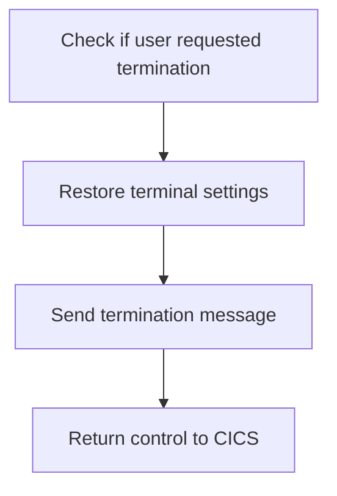

<SwmSnippet path="/src/base/cobol_src/BNK1DCS.cbl" line="258">

---

### Checking user termination request

First, we check if the user has requested termination by evaluating <SwmToken path="src/base/cobol_src/BNK1DCS.cbl" pos="258:3:3" line-data="              WHEN EIBAID = DFHAID OR DFHPF12">`EIBAID`</SwmToken> against <SwmToken path="src/base/cobol_src/BNK1DCS.cbl" pos="258:7:7" line-data="              WHEN EIBAID = DFHAID OR DFHPF12">`DFHAID`</SwmToken> or <SwmToken path="src/base/cobol_src/BNK1DCS.cbl" pos="258:11:11" line-data="              WHEN EIBAID = DFHAID OR DFHPF12">`DFHPF12`</SwmToken>.

```cobol
              WHEN EIBAID = DFHAID OR DFHPF12
```

---

</SwmSnippet>

<SwmSnippet path="/src/base/cobol_src/BNK1DCS.cbl" line="262">

---

### Restoring terminal settings

Moving to the next step, we restore the terminal settings to their default state by performing the <SwmToken path="src/base/cobol_src/BNK1DCS.cbl" pos="262:3:7" line-data="                 PERFORM RESTORE-TERM-DEF">`RESTORE-TERM-DEF`</SwmToken> operation.

```cobol
                 PERFORM RESTORE-TERM-DEF
```

---

</SwmSnippet>

<SwmSnippet path="/src/base/cobol_src/BNK1DCS.cbl" line="264">

---

### Sending termination message

Next, we send a termination message to the user by performing the <SwmToken path="src/base/cobol_src/BNK1DCS.cbl" pos="264:3:7" line-data="                 PERFORM SEND-TERMINATION-MSG">`SEND-TERMINATION-MSG`</SwmToken> operation. Finally, we return control to CICS with the <SwmToken path="src/base/cobol_src/BNK1DCS.cbl" pos="233:1:5" line-data="                 EXEC CICS RETURN">`EXEC CICS RETURN`</SwmToken> command.

```cobol
                 PERFORM SEND-TERMINATION-MSG

                 EXEC CICS
                    RETURN
                 END-EXEC
```

---

</SwmSnippet>

## Handle CLEAR key press

Now, lets zoom into this section of the flow:

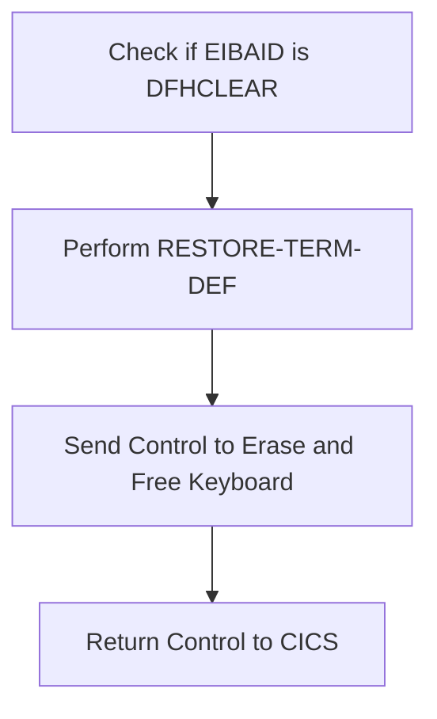

<SwmSnippet path="/src/base/cobol_src/BNK1DCS.cbl" line="273">

---

First, we check if <SwmToken path="src/base/cobol_src/BNK1DCS.cbl" pos="273:3:3" line-data="              WHEN EIBAID = DFHCLEAR">`EIBAID`</SwmToken> (which holds the attention identifier) is equal to <SwmToken path="src/base/cobol_src/BNK1DCS.cbl" pos="273:7:7" line-data="              WHEN EIBAID = DFHCLEAR">`DFHCLEAR`</SwmToken> (which indicates a clear screen request).

```cobol
              WHEN EIBAID = DFHCLEAR
```

---

</SwmSnippet>

<SwmSnippet path="/src/base/cobol_src/BNK1DCS.cbl" line="277">

---

Next, we perform the <SwmToken path="src/base/cobol_src/BNK1DCS.cbl" pos="277:3:7" line-data="                 PERFORM RESTORE-TERM-DEF">`RESTORE-TERM-DEF`</SwmToken> operation to reset the terminal settings back to their default state.

```cobol
                 PERFORM RESTORE-TERM-DEF
```

---

</SwmSnippet>

<SwmSnippet path="/src/base/cobol_src/BNK1DCS.cbl" line="279">

---

Then, we send a control command to erase the screen and free the keyboard, ensuring the terminal is ready for the next input. Finally, we return control to CICS.

```cobol
                 EXEC CICS SEND CONTROL
                          ERASE
                          FREEKB
                 END-EXEC

                 EXEC CICS RETURN
                 END-EXEC
```

---

</SwmSnippet>

## Handle ENTER key press

Now, lets zoom into this section of the flow:

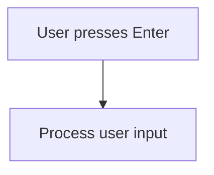

<SwmSnippet path="/src/base/cobol_src/BNK1DCS.cbl" line="290">

---

When the user presses the Enter key, the system triggers the <SwmToken path="src/base/cobol_src/BNK1DCS.cbl" pos="291:3:5" line-data="                 PERFORM PROCESS-MAP">`PROCESS-MAP`</SwmToken> routine to handle the user input. This ensures that any actions associated with the Enter key are executed, such as submitting a form or navigating to the next screen.

```cobol
              WHEN EIBAID = DFHENTER
                 PERFORM PROCESS-MAP

```

---

</SwmSnippet>

## Handle invalid key press

Now, lets zoom into this section of the flow:

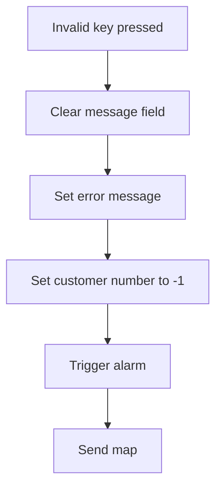

<SwmSnippet path="/src/base/cobol_src/BNK1DCS.cbl" line="297">

---

When an invalid key is pressed, the system first clears the <SwmToken path="src/base/cobol_src/BNK1DCS.cbl" pos="297:7:7" line-data="                 MOVE SPACES                 TO MESSAGEO">`MESSAGEO`</SwmToken> field (which holds the output message) by setting it to spaces. This ensures that any previous messages are removed before displaying the new error message.

```cobol
                 MOVE SPACES                 TO MESSAGEO
```

---

</SwmSnippet>

<SwmSnippet path="/src/base/cobol_src/BNK1DCS.cbl" line="298">

---

Next, the system sets the <SwmToken path="src/base/cobol_src/BNK1DCS.cbl" pos="298:14:14" line-data="                 MOVE &#39;Invalid key pressed.&#39; TO MESSAGEO">`MESSAGEO`</SwmToken> field to 'Invalid key pressed.' to inform the user that the key they pressed is not recognized.

```cobol
                 MOVE 'Invalid key pressed.' TO MESSAGEO
```

---

</SwmSnippet>

<SwmSnippet path="/src/base/cobol_src/BNK1DCS.cbl" line="299">

---

The customer number field <SwmToken path="src/base/cobol_src/BNK1DCS.cbl" pos="299:8:8" line-data="                 MOVE -1 TO CUSTNOL">`CUSTNOL`</SwmToken> is then set to -1 to indicate an error state, as valid customer numbers are positive.

```cobol
                 MOVE -1 TO CUSTNOL
```

---

</SwmSnippet>

<SwmSnippet path="/src/base/cobol_src/BNK1DCS.cbl" line="300">

---

An alarm is triggered by setting <SwmToken path="src/base/cobol_src/BNK1DCS.cbl" pos="300:3:7" line-data="                 SET SEND-DATAONLY-ALARM TO TRUE">`SEND-DATAONLY-ALARM`</SwmToken> to TRUE, which alerts the user to the error condition.

```cobol
                 SET SEND-DATAONLY-ALARM TO TRUE
```

---

</SwmSnippet>

<SwmSnippet path="/src/base/cobol_src/BNK1DCS.cbl" line="301">

---

Finally, the <SwmToken path="src/base/cobol_src/BNK1DCS.cbl" pos="301:3:5" line-data="                 PERFORM SEND-MAP">`SEND-MAP`</SwmToken> operation is performed to update the user interface with the new message and error state, ensuring the user is informed of the invalid key press.

```cobol
                 PERFORM SEND-MAP
```

---

</SwmSnippet>

## Process communication area data

This is the next section of the flow.

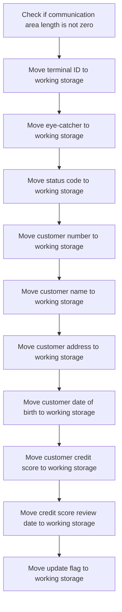

The <SwmToken path="src/base/cobol_src/BNK1DCS.cbl" pos="189:1:1" line-data="       PREMIERE SECTION.">`PREMIERE`</SwmToken> function begins by checking if the length of the communication area (<SwmToken path="src/base/cobol_src/BNK1DCS.cbl" pos="205:3:3" line-data="              WHEN EIBCALEN = ZERO">`EIBCALEN`</SwmToken>) is not zero. This ensures that there is data to process.

<SwmSnippet path="/src/base/cobol_src/BNK1DCS.cbl" line="311">

---

If the length is not zero, it moves various pieces of customer-related data from the communication area (<SwmToken path="src/base/cobol_src/BNK1DCS.cbl" pos="312:9:9" line-data="              MOVE COMM-TERM OF DFHCOMMAREA   TO WS-COMM-TERM">`DFHCOMMAREA`</SwmToken>) to working storage variables. This includes the terminal ID, eye-catcher, status code, customer number, customer name, customer address, date of birth, credit score, credit score review date, and an update flag.

```cobol
           IF EIBCALEN NOT = ZERO
              MOVE COMM-TERM OF DFHCOMMAREA   TO WS-COMM-TERM
              MOVE COMM-EYE OF DFHCOMMAREA    TO WS-COMM-EYE
              MOVE COMM-SCODE OF DFHCOMMAREA  TO WS-COMM-SCODE
              MOVE COMM-CUSTNO OF DFHCOMMAREA TO WS-COMM-CUSTNO
              MOVE COMM-NAME OF DFHCOMMAREA   TO WS-COMM-NAME
              MOVE COMM-ADDR OF DFHCOMMAREA   TO WS-COMM-ADDR
              MOVE COMM-DOB OF DFHCOMMAREA    TO WS-COMM-DOB
              MOVE COMM-CREDIT-SCORE OF DFHCOMMAREA
                 TO WS-COMM-CREDIT-SCORE
              MOVE COMM-CS-REVIEW-DATE OF DFHCOMMAREA
                 TO WS-COMM-CS-REVIEW-DATE
               MOVE COMM-UPD OF DFHCOMMAREA   TO WS-COMM-UPDATE
           END-IF.
```

---

</SwmSnippet>

## Return to CICS

This is the next section of the flow.

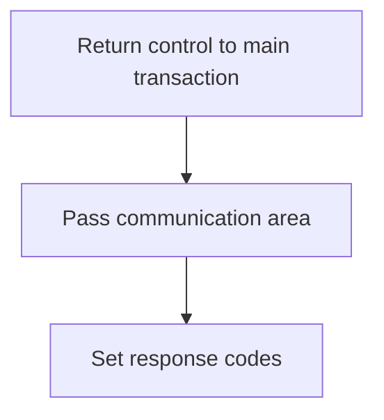

<SwmSnippet path="/src/base/cobol_src/BNK1DCS.cbl" line="326">

---

The <SwmToken path="src/base/cobol_src/BNK1DCS.cbl" pos="326:1:1" line-data="           EXEC CICS">`EXEC`</SwmToken>` `<SwmToken path="src/base/cobol_src/BNK1DCS.cbl" pos="326:3:3" line-data="           EXEC CICS">`CICS`</SwmToken>` RETURN `<SwmToken path="src/base/cobol_src/BNK1DCS.cbl" pos="234:1:1" line-data="                    TRANSID(&#39;OMEN&#39;)">`TRANSID`</SwmToken>`(`<SwmToken path="src/base/cobol_src/BNK1DCS.cbl" pos="327:6:6" line-data="              RETURN TRANSID(&#39;ODCS&#39;)">`ODCS`</SwmToken>`)` command is used to return control to the main transaction processing program identified by the transaction ID 'ODCS'. This ensures that the flow continues with the appropriate transaction.

```cobol
           EXEC CICS
              RETURN TRANSID('ODCS')
              COMMAREA(WS-COMM-AREA)
              LENGTH(266)
              RESP(WS-CICS-RESP)
              RESP2(WS-CICS-RESP2)
           END-EXEC.
```

---

</SwmSnippet>

<SwmSnippet path="/src/base/cobol_src/BNK1DCS.cbl" line="326">

---

The <SwmToken path="src/base/cobol_src/BNK1DCS.cbl" pos="328:1:8" line-data="              COMMAREA(WS-COMM-AREA)">`COMMAREA(WS-COMM-AREA)`</SwmToken> parameter specifies the communication area that is passed to the next transaction. This area contains data that needs to be shared between transactions.

```cobol
           EXEC CICS
              RETURN TRANSID('ODCS')
              COMMAREA(WS-COMM-AREA)
              LENGTH(266)
              RESP(WS-CICS-RESP)
              RESP2(WS-CICS-RESP2)
           END-EXEC.
```

---

</SwmSnippet>

<SwmSnippet path="/src/base/cobol_src/BNK1DCS.cbl" line="326">

---

The <SwmToken path="src/base/cobol_src/BNK1DCS.cbl" pos="329:1:4" line-data="              LENGTH(266)">`LENGTH(266)`</SwmToken> parameter indicates the length of the communication area being passed. This ensures that the correct amount of data is transferred.

```cobol
           EXEC CICS
              RETURN TRANSID('ODCS')
              COMMAREA(WS-COMM-AREA)
              LENGTH(266)
              RESP(WS-CICS-RESP)
              RESP2(WS-CICS-RESP2)
           END-EXEC.
```

---

</SwmSnippet>

<SwmSnippet path="/src/base/cobol_src/BNK1DCS.cbl" line="326">

---

The <SwmToken path="src/base/cobol_src/BNK1DCS.cbl" pos="330:1:8" line-data="              RESP(WS-CICS-RESP)">`RESP(WS-CICS-RESP)`</SwmToken> and <SwmToken path="src/base/cobol_src/BNK1DCS.cbl" pos="331:1:8" line-data="              RESP2(WS-CICS-RESP2)">`RESP2(WS-CICS-RESP2)`</SwmToken> parameters are used to capture the primary and secondary response codes from the CICS command. These codes are used to determine if the command was successful or if any errors occurred.

```cobol
           EXEC CICS
              RETURN TRANSID('ODCS')
              COMMAREA(WS-COMM-AREA)
              LENGTH(266)
              RESP(WS-CICS-RESP)
              RESP2(WS-CICS-RESP2)
           END-EXEC.
```

---

</SwmSnippet>

## Handle RESP failures

Now, lets zoom into this section of the flow:

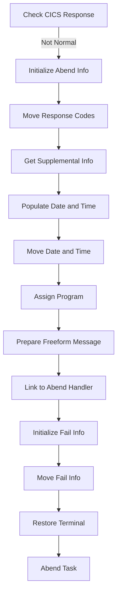

First, the code checks if the CICS response is not normal, indicating an abnormal end (abend) condition.

<SwmSnippet path="/src/base/cobol_src/BNK1DCS.cbl" line="341">

---

Next, it initializes the abend information record to prepare for capturing relevant details about the abend.

```cobol
              INITIALIZE ABNDINFO-REC
```

---

</SwmSnippet>

<SwmSnippet path="/src/base/cobol_src/BNK1DCS.cbl" line="342">

---

Then, the response codes from the CICS environment are moved into the abend information record for further analysis.

```cobol
              MOVE EIBRESP    TO ABND-RESPCODE
              MOVE EIBRESP2   TO ABND-RESP2CODE
```

---

</SwmSnippet>

<SwmSnippet path="/src/base/cobol_src/BNK1DCS.cbl" line="347">

---

Moving to the next step, supplemental information such as the application ID and task number is retrieved and stored.

```cobol
              EXEC CICS ASSIGN APPLID(ABND-APPLID)
              END-EXEC

              MOVE EIBTASKN   TO ABND-TASKNO-KEY
              MOVE EIBTRNID   TO ABND-TRANID
```

---

</SwmSnippet>

<SwmSnippet path="/src/base/cobol_src/BNK1DCS.cbl" line="353">

---

The code then performs a routine to populate the current date and time, which is crucial for logging the abend occurrence.

```cobol
              PERFORM POPULATE-TIME-DATE

              MOVE WS-ORIG-DATE TO ABND-DATE
              STRING WS-TIME-NOW-GRP-HH DELIMITED BY SIZE,
                    ':' DELIMITED BY SIZE,
                     WS-TIME-NOW-GRP-MM DELIMITED BY SIZE,
                     ':' DELIMITED BY SIZE,
                     WS-TIME-NOW-GRP-MM DELIMITED BY SIZE
                     INTO ABND-TIME
```

---

</SwmSnippet>

<SwmSnippet path="/src/base/cobol_src/BNK1DCS.cbl" line="367">

---

Following this, the program name is assigned to the abend information record to identify where the abend occurred.

```cobol
              EXEC CICS ASSIGN PROGRAM(ABND-PROGRAM)
              END-EXEC
```

---

</SwmSnippet>

<SwmSnippet path="/src/base/cobol_src/BNK1DCS.cbl" line="372">

---

Next, a freeform message is prepared, detailing the abend condition, including response codes and other relevant information.

```cobol
              STRING 'A010 - RETURN TRANSID(ODCS) FAIL'
                    DELIMITED BY SIZE,
                    'EIBRESP=' DELIMITED BY SIZE,
                    ABND-RESPCODE DELIMITED BY SIZE,
                    ' RESP2=' DELIMITED BY SIZE,
                    ABND-RESP2CODE DELIMITED BY SIZE
                    INTO ABND-FREEFORM
```

---

</SwmSnippet>

<SwmSnippet path="/src/base/cobol_src/BNK1DCS.cbl" line="381">

---

The program then links to the abend handler program, passing the abend information record for further processing.

```cobol
              EXEC CICS LINK PROGRAM(WS-ABEND-PGM)
                        COMMAREA(ABNDINFO-REC)
              END-EXEC
```

---

</SwmSnippet>

<SwmSnippet path="/src/base/cobol_src/BNK1DCS.cbl" line="386">

---

Finally, the code initializes the failure information and performs routines to restore the terminal definition and abend the task, ensuring the system is left in a stable state.

```cobol
              INITIALIZE WS-FAIL-INFO
              MOVE 'BNK1DCS - A010 - RETURN TRANSID(ODCS) FAIL' TO
                 WS-CICS-FAIL-MSG
              MOVE WS-CICS-RESP  TO WS-CICS-RESP-DISP
              MOVE WS-CICS-RESP2 TO WS-CICS-RESP2-DISP

              PERFORM RESTORE-TERM-DEF
              PERFORM ABEND-THIS-TASK
```

---

</SwmSnippet>

## Exit section

This is the next section of the flow.

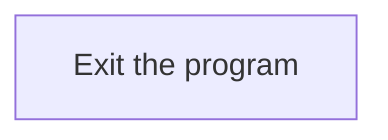

## <SwmToken path="src/base/cobol_src/BNK1DCS.cbl" pos="353:3:7" line-data="              PERFORM POPULATE-TIME-DATE">`POPULATE-TIME-DATE`</SwmToken>

Lets' zoom into this section of the flow:

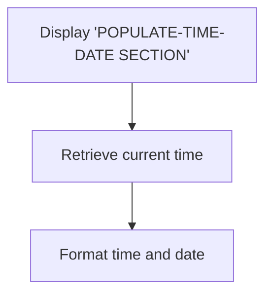

<SwmSnippet path="/src/base/cobol_src/BNK1DCS.cbl" line="1923">

---

First, the section begins by displaying the message '<SwmToken path="src/base/cobol_src/BNK1DCS.cbl" pos="1923:6:10" line-data="      D    DISPLAY &#39;POPULATE-TIME-DATE SECTION&#39;.">`POPULATE-TIME-DATE`</SwmToken> SECTION' to indicate the start of the process.

```cobol
      D    DISPLAY 'POPULATE-TIME-DATE SECTION'.
```

---

</SwmSnippet>

<SwmSnippet path="/src/base/cobol_src/BNK1DCS.cbl" line="1925">

---

Next, the current time is retrieved using the <SwmToken path="src/base/cobol_src/BNK1DCS.cbl" pos="1925:1:5" line-data="           EXEC CICS ASKTIME">`EXEC CICS ASKTIME`</SwmToken> command, which stores the time in <SwmToken path="src/base/cobol_src/BNK1DCS.cbl" pos="1926:3:7" line-data="              ABSTIME(WS-U-TIME)">`WS-U-TIME`</SwmToken>.

```cobol
           EXEC CICS ASKTIME
              ABSTIME(WS-U-TIME)
```

---

</SwmSnippet>

<SwmSnippet path="/src/base/cobol_src/BNK1DCS.cbl" line="1929">

---

Then, the retrieved time is formatted into a human-readable date and time using the <SwmToken path="src/base/cobol_src/BNK1DCS.cbl" pos="1929:1:5" line-data="           EXEC CICS FORMATTIME">`EXEC CICS FORMATTIME`</SwmToken> command. The date is stored in <SwmToken path="src/base/cobol_src/BNK1DCS.cbl" pos="1931:3:7" line-data="                     DDMMYYYY(WS-ORIG-DATE)">`WS-ORIG-DATE`</SwmToken> and the time in <SwmToken path="src/base/cobol_src/BNK1DCS.cbl" pos="1932:3:7" line-data="                     TIME(WS-TIME-NOW)">`WS-TIME-NOW`</SwmToken>.

```cobol
           EXEC CICS FORMATTIME
                     ABSTIME(WS-U-TIME)
                     DDMMYYYY(WS-ORIG-DATE)
                     TIME(WS-TIME-NOW)
```

---

</SwmSnippet>

<SwmSnippet path="/src/base/cobol_src/BNK1DCS.cbl" line="1936">

---

Finally, the section ends with an <SwmToken path="src/base/cobol_src/BNK1DCS.cbl" pos="1937:1:1" line-data="           EXIT.">`EXIT`</SwmToken> statement, indicating the completion of the date and time population process.

```cobol
       PTD999.
           EXIT.
```

---

</SwmSnippet>

&nbsp;

*This is an auto-generated document by Swimm 🌊 and has not yet been verified by a human*

<SwmMeta version="3.0.0" repo-id="Z2l0aHViJTNBJTNBY2ljcy1iYW5raW5nLXNhbXBsZS1hcHBsaWNhdGlvbi1jYnNhLUlCTS1EZW1vJTNBJTNBU3dpbW0tRGVtbw==" repo-name="cics-banking-sample-application-cbsa-IBM-Demo"><sup>Powered by [Swimm](/)</sup></SwmMeta>
