This document explains the process of handling local account transfers. The process involves creating a transaction object, calling a method to write the transfer details, checking the result, and returning an appropriate response.

The flow starts by creating a transaction object. Then, it calls a method to write the transfer details into the database. If the operation is successful, it returns a success response. Otherwise, it logs an error and returns a failure response.

# Where is this flow used?

This flow is used multiple times in the codebase as represented in the following diagram:

```mermaid
graph TD;
      subgraph srcwebuisrcmainjavacomibmcicscipbanklibertyapijson[src/…/api/json]
b728d767efae26c93806268868d5e75ddbe581c00b02b2c2575a75e337a5a245(writeTransferLocalExternal) --> 510008fc1f14af3a474a99831f50b40cf869b30db3796c65bc4c3d306ee3835d(ProcessedTransactionResource.writeTransferLocalInternal)
end

subgraph srcwebuisrcmainjavacomibmcicscipbanklibertyapijson[src/…/api/json]
c8947d548dc563c2be6a10fbca2da001399af0f479e9c3b8b9182232b73d921a(transferLocalInternal) --> 510008fc1f14af3a474a99831f50b40cf869b30db3796c65bc4c3d306ee3835d(ProcessedTransactionResource.writeTransferLocalInternal)
end

subgraph srcwebuisrcmainjavacomibmcicscipbanklibertyapijson[src/…/api/json]
658081b45ad438789a73433d6d4bf8b21fb94fd04e7068996af1ee88ecadcb07(transferLocalExternal) --> c8947d548dc563c2be6a10fbca2da001399af0f479e9c3b8b9182232b73d921a(transferLocalInternal)
end


      classDef mainFlowStyle color:#000000,fill:#7CB9F4
classDef rootsStyle color:#000000,fill:#00FFF4
classDef Style1 color:#000000,fill:#00FFAA
classDef Style2 color:#000000,fill:#FFFF00
classDef Style3 color:#000000,fill:#AA7CB9

%% Swimm:
%% graph TD;
%%       subgraph srcwebuisrcmainjavacomibmcicscipbanklibertyapijson[<SwmPath>[src/…/api/json/](src/webui/src/main/java/com/ibm/cics/cip/bankliberty/api/json/)</SwmPath>]
%% b728d767efae26c93806268868d5e75ddbe581c00b02b2c2575a75e337a5a245(<SwmToken path="src/webui/src/main/java/com/ibm/cics/cip/bankliberty/api/json/ProcessedTransactionResource.java" pos="310:5:5" line-data="	public Response writeTransferLocalExternal(">`writeTransferLocalExternal`</SwmToken>) --> 510008fc1f14af3a474a99831f50b40cf869b30db3796c65bc4c3d306ee3835d(ProcessedTransactionResource.writeTransferLocalInternal)
%% end
%% 
%% subgraph srcwebuisrcmainjavacomibmcicscipbanklibertyapijson[<SwmPath>[src/…/api/json/](src/webui/src/main/java/com/ibm/cics/cip/bankliberty/api/json/)</SwmPath>]
%% c8947d548dc563c2be6a10fbca2da001399af0f479e9c3b8b9182232b73d921a(transferLocalInternal) --> 510008fc1f14af3a474a99831f50b40cf869b30db3796c65bc4c3d306ee3835d(ProcessedTransactionResource.writeTransferLocalInternal)
%% end
%% 
%% subgraph srcwebuisrcmainjavacomibmcicscipbanklibertyapijson[<SwmPath>[src/…/api/json/](src/webui/src/main/java/com/ibm/cics/cip/bankliberty/api/json/)</SwmPath>]
%% 658081b45ad438789a73433d6d4bf8b21fb94fd04e7068996af1ee88ecadcb07(transferLocalExternal) --> c8947d548dc563c2be6a10fbca2da001399af0f479e9c3b8b9182232b73d921a(transferLocalInternal)
%% end
%% 
%% 
%%       classDef mainFlowStyle color:#000000,fill:#7CB9F4
%% classDef rootsStyle color:#000000,fill:#00FFF4
%% classDef Style1 color:#000000,fill:#00FFAA
%% classDef Style2 color:#000000,fill:#FFFF00
%% classDef Style3 color:#000000,fill:#AA7CB9
```



# Flow drill down

```mermaid
graph TD
  subgraph writeTransferLocalInternal
    writeTransferLocalInternal:A["Instantiate ProcessedTransaction object"] --> writeTransferLocalInternal:B["Call writeTransferLocal with parameters"]
    writeTransferLocalInternal:B --> writeTransferLocalInternal:C["Check return value"]
    writeTransferLocalInternal:C -->|True| writeTransferLocalInternal:D["Return HTTP 200 OK"]
    writeTransferLocalInternal:C -->|False| writeTransferLocalInternal:E["Return HTTP 500 Server Error"]
  end
  subgraph writeTransferLocal
    writeTransferLocal:A["Enter function"] --> writeTransferLocal:B["Sort out date and time task string"]
    writeTransferLocal:B --> writeTransferLocal:C["Construct transfer description"]
    writeTransferLocal:C --> writeTransferLocal:D["Open database connection"]
    writeTransferLocal:D --> writeTransferLocal:E["Insert transfer record into database"]
    writeTransferLocal:E --> writeTransferLocal:F["Check if insertion was successful"]
    writeTransferLocal:F -->|True| writeTransferLocal:G["Return true"]
    writeTransferLocal:F -->|False| writeTransferLocal:H["Log error"]
    writeTransferLocal:H --> writeTransferLocal:I["Return false"]
  end
  writeTransferLocalInternal:B --> writeTransferLocal

%% Swimm:
%% graph TD
%%   subgraph <SwmToken path="src/webui/src/main/java/com/ibm/cics/cip/bankliberty/api/json/ProcessedTransactionResource.java" pos="320:5:5" line-data="	public Response writeTransferLocalInternal(">`writeTransferLocalInternal`</SwmToken>
%%     <SwmToken path="src/webui/src/main/java/com/ibm/cics/cip/bankliberty/api/json/ProcessedTransactionResource.java" pos="320:5:5" line-data="	public Response writeTransferLocalInternal(">`writeTransferLocalInternal`</SwmToken>:A["Instantiate <SwmToken path="src/webui/src/main/java/com/ibm/cics/cip/bankliberty/api/json/ProcessedTransactionResource.java" pos="323:15:15" line-data="		com.ibm.cics.cip.bankliberty.web.db2.ProcessedTransaction myProcessedTransactionDB2 = new com.ibm.cics.cip.bankliberty.web.db2.ProcessedTransaction();">`ProcessedTransaction`</SwmToken> object"] --> <SwmToken path="src/webui/src/main/java/com/ibm/cics/cip/bankliberty/api/json/ProcessedTransactionResource.java" pos="320:5:5" line-data="	public Response writeTransferLocalInternal(">`writeTransferLocalInternal`</SwmToken>:B["Call <SwmToken path="src/webui/src/main/java/com/ibm/cics/cip/bankliberty/api/json/ProcessedTransactionResource.java" pos="325:6:6" line-data="		if (myProcessedTransactionDB2.writeTransferLocal(">`writeTransferLocal`</SwmToken> with parameters"]
%%     <SwmToken path="src/webui/src/main/java/com/ibm/cics/cip/bankliberty/api/json/ProcessedTransactionResource.java" pos="320:5:5" line-data="	public Response writeTransferLocalInternal(">`writeTransferLocalInternal`</SwmToken>:B --> <SwmToken path="src/webui/src/main/java/com/ibm/cics/cip/bankliberty/api/json/ProcessedTransactionResource.java" pos="320:5:5" line-data="	public Response writeTransferLocalInternal(">`writeTransferLocalInternal`</SwmToken>:C["Check return value"]
%%     <SwmToken path="src/webui/src/main/java/com/ibm/cics/cip/bankliberty/api/json/ProcessedTransactionResource.java" pos="320:5:5" line-data="	public Response writeTransferLocalInternal(">`writeTransferLocalInternal`</SwmToken>:C -->|True| <SwmToken path="src/webui/src/main/java/com/ibm/cics/cip/bankliberty/api/json/ProcessedTransactionResource.java" pos="320:5:5" line-data="	public Response writeTransferLocalInternal(">`writeTransferLocalInternal`</SwmToken>:D["Return HTTP 200 OK"]
%%     <SwmToken path="src/webui/src/main/java/com/ibm/cics/cip/bankliberty/api/json/ProcessedTransactionResource.java" pos="320:5:5" line-data="	public Response writeTransferLocalInternal(">`writeTransferLocalInternal`</SwmToken>:C -->|False| <SwmToken path="src/webui/src/main/java/com/ibm/cics/cip/bankliberty/api/json/ProcessedTransactionResource.java" pos="320:5:5" line-data="	public Response writeTransferLocalInternal(">`writeTransferLocalInternal`</SwmToken>:E["Return HTTP 500 Server Error"]
%%   end
%%   subgraph <SwmToken path="src/webui/src/main/java/com/ibm/cics/cip/bankliberty/api/json/ProcessedTransactionResource.java" pos="325:6:6" line-data="		if (myProcessedTransactionDB2.writeTransferLocal(">`writeTransferLocal`</SwmToken>
%%     <SwmToken path="src/webui/src/main/java/com/ibm/cics/cip/bankliberty/api/json/ProcessedTransactionResource.java" pos="325:6:6" line-data="		if (myProcessedTransactionDB2.writeTransferLocal(">`writeTransferLocal`</SwmToken>:A["Enter function"] --> <SwmToken path="src/webui/src/main/java/com/ibm/cics/cip/bankliberty/api/json/ProcessedTransactionResource.java" pos="325:6:6" line-data="		if (myProcessedTransactionDB2.writeTransferLocal(">`writeTransferLocal`</SwmToken>:B["Sort out date and time task string"]
%%     <SwmToken path="src/webui/src/main/java/com/ibm/cics/cip/bankliberty/api/json/ProcessedTransactionResource.java" pos="325:6:6" line-data="		if (myProcessedTransactionDB2.writeTransferLocal(">`writeTransferLocal`</SwmToken>:B --> <SwmToken path="src/webui/src/main/java/com/ibm/cics/cip/bankliberty/api/json/ProcessedTransactionResource.java" pos="325:6:6" line-data="		if (myProcessedTransactionDB2.writeTransferLocal(">`writeTransferLocal`</SwmToken>:C["Construct transfer description"]
%%     <SwmToken path="src/webui/src/main/java/com/ibm/cics/cip/bankliberty/api/json/ProcessedTransactionResource.java" pos="325:6:6" line-data="		if (myProcessedTransactionDB2.writeTransferLocal(">`writeTransferLocal`</SwmToken>:C --> <SwmToken path="src/webui/src/main/java/com/ibm/cics/cip/bankliberty/api/json/ProcessedTransactionResource.java" pos="325:6:6" line-data="		if (myProcessedTransactionDB2.writeTransferLocal(">`writeTransferLocal`</SwmToken>:D["Open database connection"]
%%     <SwmToken path="src/webui/src/main/java/com/ibm/cics/cip/bankliberty/api/json/ProcessedTransactionResource.java" pos="325:6:6" line-data="		if (myProcessedTransactionDB2.writeTransferLocal(">`writeTransferLocal`</SwmToken>:D --> <SwmToken path="src/webui/src/main/java/com/ibm/cics/cip/bankliberty/api/json/ProcessedTransactionResource.java" pos="325:6:6" line-data="		if (myProcessedTransactionDB2.writeTransferLocal(">`writeTransferLocal`</SwmToken>:E["Insert transfer record into database"]
%%     <SwmToken path="src/webui/src/main/java/com/ibm/cics/cip/bankliberty/api/json/ProcessedTransactionResource.java" pos="325:6:6" line-data="		if (myProcessedTransactionDB2.writeTransferLocal(">`writeTransferLocal`</SwmToken>:E --> <SwmToken path="src/webui/src/main/java/com/ibm/cics/cip/bankliberty/api/json/ProcessedTransactionResource.java" pos="325:6:6" line-data="		if (myProcessedTransactionDB2.writeTransferLocal(">`writeTransferLocal`</SwmToken>:F["Check if insertion was successful"]
%%     <SwmToken path="src/webui/src/main/java/com/ibm/cics/cip/bankliberty/api/json/ProcessedTransactionResource.java" pos="325:6:6" line-data="		if (myProcessedTransactionDB2.writeTransferLocal(">`writeTransferLocal`</SwmToken>:F -->|True| <SwmToken path="src/webui/src/main/java/com/ibm/cics/cip/bankliberty/api/json/ProcessedTransactionResource.java" pos="325:6:6" line-data="		if (myProcessedTransactionDB2.writeTransferLocal(">`writeTransferLocal`</SwmToken>:G["Return true"]
%%     <SwmToken path="src/webui/src/main/java/com/ibm/cics/cip/bankliberty/api/json/ProcessedTransactionResource.java" pos="325:6:6" line-data="		if (myProcessedTransactionDB2.writeTransferLocal(">`writeTransferLocal`</SwmToken>:F -->|False| <SwmToken path="src/webui/src/main/java/com/ibm/cics/cip/bankliberty/api/json/ProcessedTransactionResource.java" pos="325:6:6" line-data="		if (myProcessedTransactionDB2.writeTransferLocal(">`writeTransferLocal`</SwmToken>:H["Log error"]
%%     <SwmToken path="src/webui/src/main/java/com/ibm/cics/cip/bankliberty/api/json/ProcessedTransactionResource.java" pos="325:6:6" line-data="		if (myProcessedTransactionDB2.writeTransferLocal(">`writeTransferLocal`</SwmToken>:H --> <SwmToken path="src/webui/src/main/java/com/ibm/cics/cip/bankliberty/api/json/ProcessedTransactionResource.java" pos="325:6:6" line-data="		if (myProcessedTransactionDB2.writeTransferLocal(">`writeTransferLocal`</SwmToken>:I["Return false"]
%%   end
%%   <SwmToken path="src/webui/src/main/java/com/ibm/cics/cip/bankliberty/api/json/ProcessedTransactionResource.java" pos="320:5:5" line-data="	public Response writeTransferLocalInternal(">`writeTransferLocalInternal`</SwmToken>:B --> <SwmToken path="src/webui/src/main/java/com/ibm/cics/cip/bankliberty/api/json/ProcessedTransactionResource.java" pos="325:6:6" line-data="		if (myProcessedTransactionDB2.writeTransferLocal(">`writeTransferLocal`</SwmToken>
```



<SwmSnippet path="/src/webui/src/main/java/com/ibm/cics/cip/bankliberty/api/json/ProcessedTransactionResource.java" line="320">

---

## Handling the database interaction for processing local account transfers

First, the <SwmToken path="src/webui/src/main/java/com/ibm/cics/cip/bankliberty/api/json/ProcessedTransactionResource.java" pos="320:5:5" line-data="	public Response writeTransferLocalInternal(">`writeTransferLocalInternal`</SwmToken> method in <SwmToken path="src/webui/src/main/java/com/ibm/cics/cip/bankliberty/api/json/ProcessedTransactionResource.java" pos="39:4:4" line-data="public class ProcessedTransactionResource">`ProcessedTransactionResource`</SwmToken> is called to initiate the local transfer process. It creates an instance of <SwmToken path="src/webui/src/main/java/com/ibm/cics/cip/bankliberty/api/json/ProcessedTransactionResource.java" pos="323:15:15" line-data="		com.ibm.cics.cip.bankliberty.web.db2.ProcessedTransaction myProcessedTransactionDB2 = new com.ibm.cics.cip.bankliberty.web.db2.ProcessedTransaction();">`ProcessedTransaction`</SwmToken> and calls the <SwmToken path="src/webui/src/main/java/com/ibm/cics/cip/bankliberty/api/json/ProcessedTransactionResource.java" pos="325:6:6" line-data="		if (myProcessedTransactionDB2.writeTransferLocal(">`writeTransferLocal`</SwmToken> method with the necessary parameters.

```java
	public Response writeTransferLocalInternal(
			ProcessedTransactionTransferLocalJSON proctranLocal)
	{
		com.ibm.cics.cip.bankliberty.web.db2.ProcessedTransaction myProcessedTransactionDB2 = new com.ibm.cics.cip.bankliberty.web.db2.ProcessedTransaction();

		if (myProcessedTransactionDB2.writeTransferLocal(
				proctranLocal.getSortCode(), proctranLocal.getAccountNumber(),
				proctranLocal.getAmount(),
				proctranLocal.getTargetAccountNumber()))
		{
			return Response.ok().build();
		}
		else
		{
			return Response.serverError().build();
		}
	}
```

---

</SwmSnippet>

<SwmSnippet path="/src/webui/src/main/java/com/ibm/cics/cip/bankliberty/web/db2/ProcessedTransaction.java" line="586">

---

### Constructing the transfer description

Next, the <SwmToken path="src/webui/src/main/java/com/ibm/cics/cip/bankliberty/api/json/ProcessedTransactionResource.java" pos="325:6:6" line-data="		if (myProcessedTransactionDB2.writeTransferLocal(">`writeTransferLocal`</SwmToken> method in <SwmToken path="src/webui/src/main/java/com/ibm/cics/cip/bankliberty/api/json/ProcessedTransactionResource.java" pos="323:15:15" line-data="		com.ibm.cics.cip.bankliberty.web.db2.ProcessedTransaction myProcessedTransactionDB2 = new com.ibm.cics.cip.bankliberty.web.db2.ProcessedTransaction();">`ProcessedTransaction`</SwmToken> constructs a transfer description. This involves concatenating various pieces of information such as the transfer flag, sort code, and target account number to form a detailed description of the transfer.

```java
		String transferDescription = "";
		transferDescription = transferDescription
				+ PROCTRAN.PROC_TRAN_DESC_XFR_FLAG;
		transferDescription = transferDescription.concat("                  ");

		transferDescription = transferDescription
				.concat(padSortCode(Integer.parseInt(sortCode2)));

		transferDescription = transferDescription.concat(
				padAccountNumber(Integer.parseInt(targetAccountNumber2)));
```

---

</SwmSnippet>

<SwmSnippet path="/src/webui/src/main/java/com/ibm/cics/cip/bankliberty/web/db2/ProcessedTransaction.java" line="597">

---

### Inserting the transfer record into the database

Then, the method opens a database connection and prepares an SQL statement to insert the new transfer record. It sets various parameters such as the sort code, account number, date, time, task reference, transfer type, transfer description, and amount.

```java
		openConnection();

		logger.log(Level.FINE, () -> ABOUT_TO_INSERT + SQL_INSERT + ">");

		try (PreparedStatement stmt = conn.prepareStatement(SQL_INSERT);)
		{
			stmt.setString(1, PROCTRAN.PROC_TRAN_VALID);
			stmt.setString(2, sortCode2);
			stmt.setString(3,
					String.format("%08d", Integer.parseInt(accountNumber2)));
			stmt.setString(4, dateString);
			stmt.setString(5, timeString);
			stmt.setString(6, taskRef);
			stmt.setString(7, PROCTRAN.PROC_TY_TRANSFER);
			stmt.setString(8, transferDescription);
			stmt.setBigDecimal(9, amount2);

```

---

</SwmSnippet>

<SwmSnippet path="/src/webui/src/main/java/com/ibm/cics/cip/bankliberty/web/db2/ProcessedTransaction.java" line="614">

---

### Executing the SQL statement

Finally, the method executes the SQL statement. If the operation is successful, it returns true. Otherwise, it logs the error and returns false, indicating that the transfer was not processed successfully.

```java
			stmt.executeUpdate();
		}
		catch (SQLException e)
		{
			logger.severe(e.getLocalizedMessage());
			logger.exiting(this.getClass().getName(), WRITE_TRANSFER_LOCAL,
					false);
			return false;
		}
		logger.exiting(this.getClass().getName(), WRITE_TRANSFER_LOCAL, true);
		return true;
```

---

</SwmSnippet>

&nbsp;

*This is an auto-generated document by Swimm 🌊 and has not yet been verified by a human*

<SwmMeta version="3.0.0" repo-id="Z2l0aHViJTNBJTNBY2ljcy1iYW5raW5nLXNhbXBsZS1hcHBsaWNhdGlvbi1jYnNhLUlCTS1EZW1vJTNBJTNBU3dpbW0tRGVtbw==" repo-name="cics-banking-sample-application-cbsa-IBM-Demo"><sup>Powered by [Swimm](/)</sup></SwmMeta>
