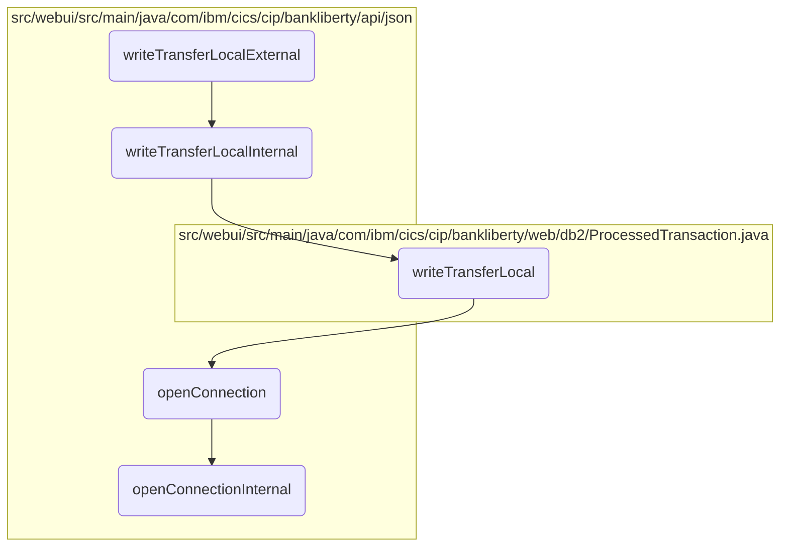

In this document, we will explain the process of handling a local transfer request. The process involves receiving the transfer request, processing the transaction data, writing the transfer to the database, and managing the database connection.

The flow starts with receiving a transfer request. The request is then processed internally, where the transaction data is checked and prepared for database insertion. The transfer details are written to the database, ensuring the data is correctly formatted. Finally, the database connection is managed, ensuring it is open and ready for use, and handling any exceptions that may occur during the connection process.

# Flow drill down



<SwmSnippet path="/src/webui/src/main/java/com/ibm/cics/cip/bankliberty/api/json/ProcessedTransactionResource.java" line="306">

---

## Handling the Transfer Request

First, the <SwmToken path="src/webui/src/main/java/com/ibm/cics/cip/bankliberty/api/json/ProcessedTransactionResource.java" pos="310:5:5" line-data="	public Response writeTransferLocalExternal(">`writeTransferLocalExternal`</SwmToken> method handles the incoming transfer request. It processes the transaction data and delegates the task to <SwmToken path="src/webui/src/main/java/com/ibm/cics/cip/bankliberty/api/json/ProcessedTransactionResource.java" pos="313:7:7" line-data="		Response myResponse = writeTransferLocalInternal(proctranLocal);">`writeTransferLocalInternal`</SwmToken> for further processing. After processing, it terminates the database access object.

```java
	@POST
	@Produces("application/json")
	@Consumes(MediaType.APPLICATION_JSON)
	@Path("/transferLocal")
	public Response writeTransferLocalExternal(
			ProcessedTransactionTransferLocalJSON proctranLocal)
	{
		Response myResponse = writeTransferLocalInternal(proctranLocal);
		HBankDataAccess myHBankDataAccess = new HBankDataAccess();
		myHBankDataAccess.terminate();
		return myResponse;
	}
```

---

</SwmSnippet>

<SwmSnippet path="/src/webui/src/main/java/com/ibm/cics/cip/bankliberty/api/json/ProcessedTransactionResource.java" line="320">

---

## Processing the Transfer Internally

Next, the <SwmToken path="src/webui/src/main/java/com/ibm/cics/cip/bankliberty/api/json/ProcessedTransactionResource.java" pos="320:5:5" line-data="	public Response writeTransferLocalInternal(">`writeTransferLocalInternal`</SwmToken> method processes the transaction data by interacting with the <SwmToken path="src/webui/src/main/java/com/ibm/cics/cip/bankliberty/api/json/ProcessedTransactionResource.java" pos="323:15:15" line-data="		com.ibm.cics.cip.bankliberty.web.db2.ProcessedTransaction myProcessedTransactionDB2 = new com.ibm.cics.cip.bankliberty.web.db2.ProcessedTransaction();">`ProcessedTransaction`</SwmToken> class. It checks if the transaction is successful and returns an appropriate response.

```java
	public Response writeTransferLocalInternal(
			ProcessedTransactionTransferLocalJSON proctranLocal)
	{
		com.ibm.cics.cip.bankliberty.web.db2.ProcessedTransaction myProcessedTransactionDB2 = new com.ibm.cics.cip.bankliberty.web.db2.ProcessedTransaction();

		if (myProcessedTransactionDB2.writeTransferLocal(
				proctranLocal.getSortCode(), proctranLocal.getAccountNumber(),
				proctranLocal.getAmount(),
				proctranLocal.getTargetAccountNumber()))
		{
			return Response.ok().build();
		}
		else
		{
			return Response.serverError().build();
		}
	}
```

---

</SwmSnippet>

<SwmSnippet path="/src/webui/src/main/java/com/ibm/cics/cip/bankliberty/web/db2/ProcessedTransaction.java" line="579">

---

## Writing the Transfer to the Database

Then, the <SwmToken path="src/webui/src/main/java/com/ibm/cics/cip/bankliberty/web/db2/ProcessedTransaction.java" pos="579:5:5" line-data="	public boolean writeTransferLocal(String sortCode2, String accountNumber2,">`writeTransferLocal`</SwmToken> method constructs the transfer description and prepares the SQL statement to insert the transaction data into the database. It ensures the data is correctly formatted and handles any SQL exceptions.

```java
	public boolean writeTransferLocal(String sortCode2, String accountNumber2,
			BigDecimal amount2, String targetAccountNumber2)
	{
		logger.entering(this.getClass().getName(), WRITE_TRANSFER_LOCAL);

		sortOutDateTimeTaskString();

		String transferDescription = "";
		transferDescription = transferDescription
				+ PROCTRAN.PROC_TRAN_DESC_XFR_FLAG;
		transferDescription = transferDescription.concat("                  ");

		transferDescription = transferDescription
				.concat(padSortCode(Integer.parseInt(sortCode2)));

		transferDescription = transferDescription.concat(
				padAccountNumber(Integer.parseInt(targetAccountNumber2)));

		openConnection();

		logger.log(Level.FINE, () -> ABOUT_TO_INSERT + SQL_INSERT + ">");
```

---

</SwmSnippet>

<SwmSnippet path="/src/webui/src/main/java/com/ibm/cics/cip/bankliberty/api/json/HBankDataAccess.java" line="69">

---

## Opening the Database Connection

Moving to the <SwmToken path="src/webui/src/main/java/com/ibm/cics/cip/bankliberty/api/json/HBankDataAccess.java" pos="69:5:5" line-data="	protected void openConnection()">`openConnection`</SwmToken> method, it manages the database connection. It checks if a connection already exists or needs to be created, ensuring the connection is open and ready for use.

```java
	protected void openConnection()
	{
		// Open a connection to the DB2 database
		logger.entering(this.getClass().getName(), "openConnection()");

		Integer taskNumberInteger = Task.getTask().getTaskNumber();
		String db2ConnString = DB2CONN.concat(taskNumberInteger.toString());
		logger.log(Level.FINE,
				() -> "Attempting to get DB2CONN for task number "
						+ taskNumberInteger.toString());
		this.conn = (Connection) cornedBeef.get(db2ConnString);
		if (this.conn == null)
		{
			HBankDataAccess.incrementConnCount();
			logger.log(Level.FINE,
					() -> "Attempting to create DB2CONN for task number "
							+ taskNumberInteger.toString());
			// Attempt to open a connection
			openConnectionInternal();
			logger.log(Level.FINE,
					() -> "Creation succcessful for DB2CONN for task number "
```

---

</SwmSnippet>

<SwmSnippet path="/src/webui/src/main/java/com/ibm/cics/cip/bankliberty/api/json/HBankDataAccess.java" line="162">

---

## Establishing the Internal Database Connection

Finally, the <SwmToken path="src/webui/src/main/java/com/ibm/cics/cip/bankliberty/api/json/HBankDataAccess.java" pos="163:3:3" line-data="	void openConnectionInternal()">`openConnectionInternal`</SwmToken> method establishes the actual connection to the database using JNDI lookup. It handles any exceptions that may occur during the connection process.

```java
	@SuppressWarnings("unchecked")
	void openConnectionInternal()
	{
		logger.entering(this.getClass().getName(), "openConnectionInternal");
		String jndiString = "jdbc/defaultCICSDataSource";
		Context ctx;

		try
		{
			ctx = new InitialContext();
			DataSource ds = (DataSource) ctx.lookup(jndiString);
			logger.log(Level.FINE, () -> "jndi string is " + jndiString);
			// If there is no current connection
			if (this.conn == null)
			{
				logger.log(Level.FINE,
						() -> "About to attempt to get DB2 connection");
				// Try and get a connection
				this.conn = ds.getConnection();
				this.conn.setTransactionIsolation(
						Connection.TRANSACTION_READ_UNCOMMITTED);
```

---

</SwmSnippet>

&nbsp;

*This is an auto-generated document by Swimm 🌊 and has not yet been verified by a human*

<SwmMeta version="3.0.0" repo-id="Z2l0aHViJTNBJTNBY2ljcy1iYW5raW5nLXNhbXBsZS1hcHBsaWNhdGlvbi1jYnNhLUlCTS1EZW1vJTNBJTNBU3dpbW0tRGVtbw==" repo-name="cics-banking-sample-application-cbsa-IBM-Demo"><sup>Powered by [Swimm](/)</sup></SwmMeta>
