The <SwmToken path="src/base/cobol_src/BNK1CAC.cbl" pos="258:4:4" line-data="              MOVE &#39;BNK1CAC - A010 - RETURN TRANSID(OCAC) FAIL&#39; TO">`BNK1CAC`</SwmToken> program is designed to handle various user interactions within a banking application. It manages tasks such as initializing forms, processing user inputs, navigating menus, and handling errors. The program ensures smooth operation by checking user actions, processing content, and providing appropriate feedback or error messages.

The <SwmToken path="src/base/cobol_src/BNK1CAC.cbl" pos="258:4:4" line-data="              MOVE &#39;BNK1CAC - A010 - RETURN TRANSID(OCAC) FAIL&#39; TO">`BNK1CAC`</SwmToken> program starts by checking if it's the user's first time accessing the form and initializes it accordingly. It then handles different user actions, such as pressing keys to navigate menus or clear the screen. The program processes user inputs, sends appropriate messages, and manages errors by linking to an abend processing program if necessary. Throughout the process, it ensures that all operations are correctly logged and tracked.

Here is a high level diagram of the program:

```mermaid
graph TD
7sl1p("First run setup"):::a22bc028f  --> 
sdphy("Handle PA keys"):::ac9638f54  --> 
q0zdz("Navigate main menu"):::a013a1640  --> 
2wr3x("Termination message"):::ad053ddbe  --> 
361ix("Clear input"):::a77c0bd8b  --> 
vzj1r("Process content"):::a01ddcf89  --> 
th4ir("Invalid key message"):::a05bf403e  --> 
rcgpf("Set return information"):::ac7d3c1ca  --> 
m0yla("Return from transaction"):::a12a30d58  --> 
ml7zb("Initialize fail info"):::a38abaa94  --> 
i2l6c("Set error code"):::ac3a6971b  --> 
sx5hs("Get application information"):::a5305c88b  --> 
01ix0("Set transaction details"):::aa038379c  --> 
w4sf4("Populate time"):::a6d4cc97d  --> 
698ie("Set unique time information"):::ab04499a9  --> 
y2rnf("Assign program"):::ac02471d5  --> 
h37yu("Build error string"):::ab5704c8a  --> 
99q8b("Link to abend"):::a8dc46229  --> 
thkrb("Perform abend task"):::a8a4a3037 
classDef a22bc028f color:#000000,fill:#7CB9F4
classDef ac9638f54 color:#000000,fill:#00FFAA
classDef a013a1640 color:#000000,fill:#00FFF4
classDef ad053ddbe color:#000000,fill:#FFFF00
classDef a77c0bd8b color:#000000,fill:#AA7CB9
classDef a01ddcf89 color:#000000,fill:#5afa0a
classDef a05bf403e color:#000000,fill:#f5a10a
classDef ac7d3c1ca color:#000000,fill:#9c5602
classDef a12a30d58 color:#000000,fill:#9c5602
classDef a38abaa94 color:#000000,fill:#FF5733
classDef ac3a6971b color:#000000,fill:#C70039
classDef a5305c88b color:#000000,fill:#900C3F
classDef aa038379c color:#000000,fill:#581845
classDef a6d4cc97d color:#000000,fill:#DAF7A6
classDef ab04499a9 color:#000000,fill:#FFC300
classDef ac02471d5 color:#000000,fill:#FF33CC
classDef ab5704c8a color:#000000,fill:#33FF57
classDef a8dc46229 color:#000000,fill:#3358FF
classDef a8a4a3037 color:#000000,fill:#FF5733
```

## First run setup

First, we'll zoom into this section of the flow:

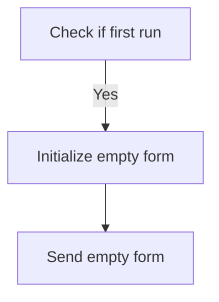

<SwmSnippet path="/src/base/cobol_src/BNK1CAC.cbl" line="163">

---

First, the code checks if it is the first time the user is accessing the form by evaluating if <SwmToken path="src/base/cobol_src/BNK1CAC.cbl" pos="169:3:3" line-data="              WHEN EIBCALEN = ZERO">`EIBCALEN`</SwmToken> (which indicates the length of the communication area) is zero.

```cobol
           EVALUATE TRUE

      *
      *       Is it the first time through? If so, send the map
      *       with erased (empty) data fields.
      *
              WHEN EIBCALEN = ZERO
```

---

</SwmSnippet>

<SwmSnippet path="/src/base/cobol_src/BNK1CAC.cbl" line="170">

---

Next, if it is the first time, the code initializes the form with empty data fields by setting <SwmToken path="src/base/cobol_src/BNK1CAC.cbl" pos="170:9:9" line-data="                 MOVE LOW-VALUE TO BNK1CAO">`BNK1CAO`</SwmToken> to <SwmToken path="src/base/cobol_src/BNK1CAC.cbl" pos="170:3:5" line-data="                 MOVE LOW-VALUE TO BNK1CAO">`LOW-VALUE`</SwmToken>, <SwmToken path="src/base/cobol_src/BNK1CAC.cbl" pos="171:8:8" line-data="                 MOVE -1 TO CUSTNOL">`CUSTNOL`</SwmToken> to -1, and <SwmToken path="src/base/cobol_src/BNK1CAC.cbl" pos="173:7:7" line-data="                 MOVE SPACES TO MESSAGEO">`MESSAGEO`</SwmToken> to spaces. It then sets the <SwmToken path="src/base/cobol_src/BNK1CAC.cbl" pos="172:3:5" line-data="                 SET SEND-ERASE TO TRUE">`SEND-ERASE`</SwmToken> flag to true and performs the <SwmToken path="src/base/cobol_src/BNK1CAC.cbl" pos="174:3:5" line-data="                 PERFORM SEND-MAP">`SEND-MAP`</SwmToken> operation to send the empty form to the user.

```cobol
                 MOVE LOW-VALUE TO BNK1CAO
                 MOVE -1 TO CUSTNOL
                 SET SEND-ERASE TO TRUE
                 MOVE SPACES TO MESSAGEO
                 PERFORM SEND-MAP
```

---

</SwmSnippet>

## Handle PA keys

Now, lets zoom into this section of the flow:

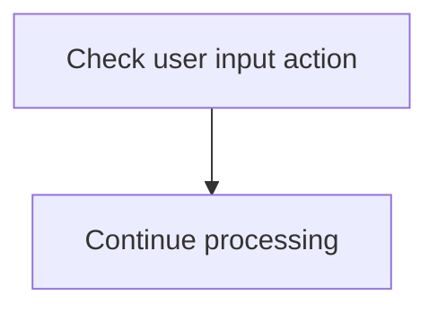

<SwmSnippet path="/src/base/cobol_src/BNK1CAC.cbl" line="179">

---

The PREMIERE function checks if the user input action matches any of the predefined actions (<SwmToken path="src/base/cobol_src/BNK1CAC.cbl" pos="179:7:7" line-data="              WHEN EIBAID = DFHPA1 OR DFHPA2 OR DFHPA3">`DFHPA1`</SwmToken>, <SwmToken path="src/base/cobol_src/BNK1CAC.cbl" pos="179:11:11" line-data="              WHEN EIBAID = DFHPA1 OR DFHPA2 OR DFHPA3">`DFHPA2`</SwmToken>, or <SwmToken path="src/base/cobol_src/BNK1CAC.cbl" pos="179:15:15" line-data="              WHEN EIBAID = DFHPA1 OR DFHPA2 OR DFHPA3">`DFHPA3`</SwmToken>). If the input action matches any of these, the program continues processing without interruption. This ensures that specific user actions are recognized and handled appropriately, allowing the application to proceed with the corresponding logic.

```cobol
              WHEN EIBAID = DFHPA1 OR DFHPA2 OR DFHPA3
                 CONTINUE
```

---

</SwmSnippet>

## Navigate main menu

Now, lets zoom into this section of the flow:

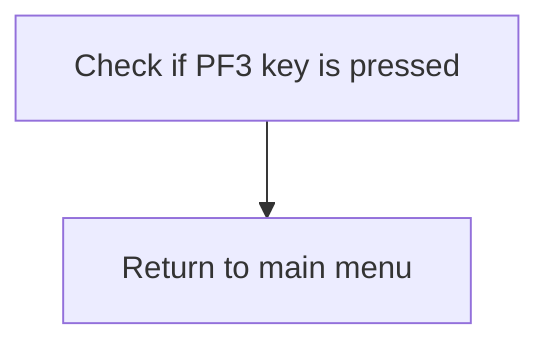

<SwmSnippet path="/src/base/cobol_src/BNK1CAC.cbl" line="185">

---

When the PF3 key is pressed, the application triggers a return to the main menu. This is achieved by executing a CICS RETURN command with the TRANSID 'OMEN', which directs the application to the main menu transaction. This ensures that the user is immediately taken back to the main menu interface, allowing them to initiate new actions or transactions from there.

```cobol
              WHEN EIBAID = DFHPF3
                 EXEC CICS RETURN
                    TRANSID('OMEN')
                    IMMEDIATE
                    RESP(WS-CICS-RESP)
                    RESP2(WS-CICS-RESP2)
                 END-EXEC
```

---

</SwmSnippet>

## Termination message

Now, lets zoom into this section of the flow:

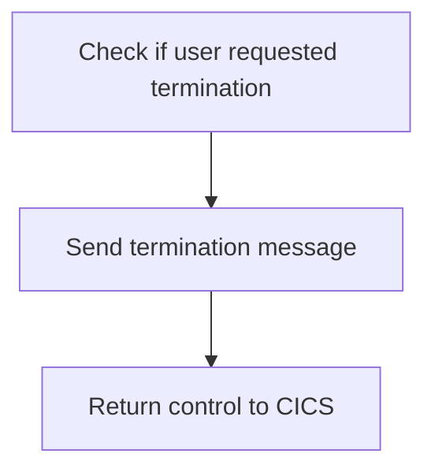

<SwmSnippet path="/src/base/cobol_src/BNK1CAC.cbl" line="197">

---

The code checks if <SwmToken path="src/base/cobol_src/BNK1CAC.cbl" pos="197:3:3" line-data="              WHEN EIBAID = DFHAID OR DFHPF12">`EIBAID`</SwmToken> (which holds the attention identifier) is equal to <SwmToken path="src/base/cobol_src/BNK1CAC.cbl" pos="197:7:7" line-data="              WHEN EIBAID = DFHAID OR DFHPF12">`DFHAID`</SwmToken> (the default attention identifier) or <SwmToken path="src/base/cobol_src/BNK1CAC.cbl" pos="197:11:11" line-data="              WHEN EIBAID = DFHAID OR DFHPF12">`DFHPF12`</SwmToken> (the identifier for the PF12 key). If this condition is met, it indicates that the user has requested termination. Consequently, the <SwmToken path="src/base/cobol_src/BNK1CAC.cbl" pos="198:3:7" line-data="                 PERFORM SEND-TERMINATION-MSG">`SEND-TERMINATION-MSG`</SwmToken> routine is performed to send a termination message to the user. Finally, control is returned to CICS using the `RETURN` command, effectively ending the current task.

```cobol
              WHEN EIBAID = DFHAID OR DFHPF12
                 PERFORM SEND-TERMINATION-MSG
                 EXEC CICS
                    RETURN
                 END-EXEC
```

---

</SwmSnippet>

## Clear input

Now, lets zoom into this section of the flow:

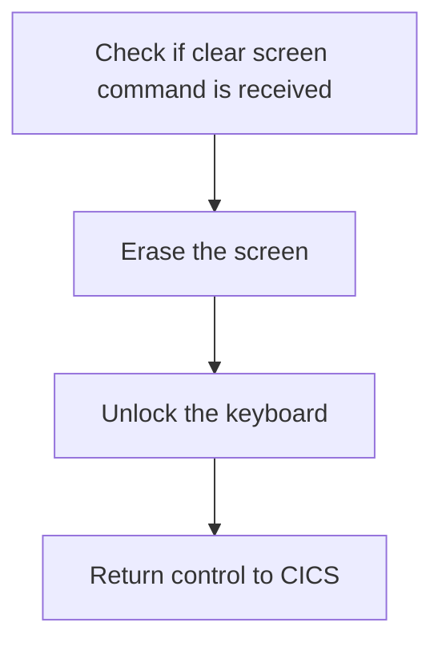

First, we check if the <SwmToken path="src/base/cobol_src/BNK1CAC.cbl" pos="179:3:3" line-data="              WHEN EIBAID = DFHPA1 OR DFHPA2 OR DFHPA3">`EIBAID`</SwmToken> (which holds the attention identifier) is equal to <SwmToken path="src/base/cobol_src/BNK1CAC.cbl" pos="206:7:7" line-data="              WHEN EIBAID = DFHCLEAR">`DFHCLEAR`</SwmToken> (the clear screen command). This ensures that the following actions are only performed when a clear screen command is received.

<SwmSnippet path="/src/base/cobol_src/BNK1CAC.cbl" line="206">

---

Next, we execute the <SwmToken path="src/base/cobol_src/BNK1CAC.cbl" pos="207:5:7" line-data="                 EXEC CICS SEND CONTROL">`SEND CONTROL`</SwmToken> command with <SwmToken path="src/base/cobol_src/BNK1CAC.cbl" pos="208:1:1" line-data="                          ERASE">`ERASE`</SwmToken> and <SwmToken path="src/base/cobol_src/BNK1CAC.cbl" pos="209:1:1" line-data="                          FREEKB">`FREEKB`</SwmToken> options. This erases the current screen and unlocks the keyboard, preparing the interface for the next user operation. Finally, we return control to CICS with the `RETURN` command, indicating that the current task is complete.

```cobol
              WHEN EIBAID = DFHCLEAR
                 EXEC CICS SEND CONTROL
                          ERASE
                          FREEKB
                 END-EXEC

                 EXEC CICS RETURN
                 END-EXEC
```

---

</SwmSnippet>

## Process content

Now, lets zoom into this section of the flow:

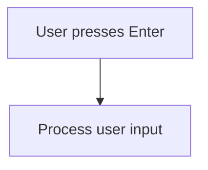

<SwmSnippet path="/src/base/cobol_src/BNK1CAC.cbl" line="218">

---

### Processing user input

When the user presses the Enter key, the system triggers the <SwmToken path="src/base/cobol_src/BNK1CAC.cbl" pos="219:3:5" line-data="                 PERFORM PROCESS-MAP">`PROCESS-MAP`</SwmToken> routine to handle the user input and perform the necessary actions.

```cobol
              WHEN EIBAID = DFHENTER
                 PERFORM PROCESS-MAP

```

---

</SwmSnippet>

## Invalid key message

Now, lets zoom into this section of the flow:

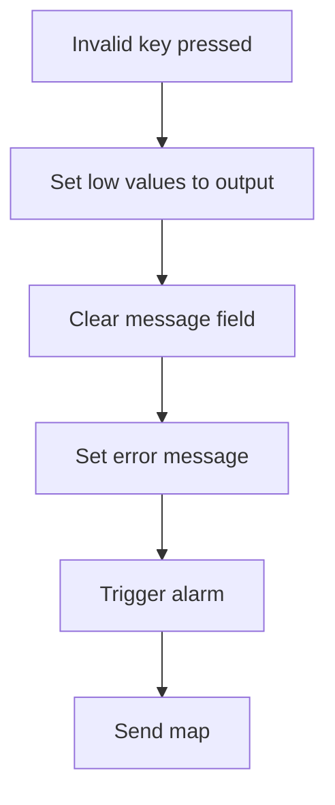

<SwmSnippet path="/src/base/cobol_src/BNK1CAC.cbl" line="224">

---

When an invalid key is pressed by the user, the system first sets <SwmToken path="src/base/cobol_src/BNK1CAC.cbl" pos="225:9:9" line-data="                 MOVE LOW-VALUES TO BNK1CAO">`BNK1CAO`</SwmToken> to low values, effectively clearing any previous output data. This ensures that no erroneous data is displayed to the user.

```cobol
              WHEN OTHER
                 MOVE LOW-VALUES TO BNK1CAO
```

---

</SwmSnippet>

<SwmSnippet path="/src/base/cobol_src/BNK1CAC.cbl" line="226">

---

Next, the <SwmToken path="src/base/cobol_src/BNK1CAC.cbl" pos="226:7:7" line-data="                 MOVE SPACES TO MESSAGEO">`MESSAGEO`</SwmToken> field is cleared by setting it to spaces. This step ensures that any previous messages are removed before displaying the new error message.

```cobol
                 MOVE SPACES TO MESSAGEO
```

---

</SwmSnippet>

<SwmSnippet path="/src/base/cobol_src/BNK1CAC.cbl" line="227">

---

The system then sets the <SwmToken path="src/base/cobol_src/BNK1CAC.cbl" pos="227:14:14" line-data="                 MOVE &#39;Invalid key pressed.&#39; TO MESSAGEO">`MESSAGEO`</SwmToken> field to 'Invalid key pressed.' to inform the user of the error. This provides clear feedback to the user about what went wrong.

```cobol
                 MOVE 'Invalid key pressed.' TO MESSAGEO
```

---

</SwmSnippet>

<SwmSnippet path="/src/base/cobol_src/BNK1CAC.cbl" line="228">

---

An alarm is triggered by setting <SwmToken path="src/base/cobol_src/BNK1CAC.cbl" pos="228:3:7" line-data="                 SET SEND-DATAONLY-ALARM TO TRUE">`SEND-DATAONLY-ALARM`</SwmToken> to true. This step ensures that the user is alerted to the error through an audible or visual signal.

```cobol
                 SET SEND-DATAONLY-ALARM TO TRUE
```

---

</SwmSnippet>

<SwmSnippet path="/src/base/cobol_src/BNK1CAC.cbl" line="229">

---

Finally, the <SwmToken path="src/base/cobol_src/BNK1CAC.cbl" pos="229:3:5" line-data="                 PERFORM SEND-MAP">`SEND-MAP`</SwmToken> operation is performed to update the user interface with the new message and any other changes. This ensures that the user sees the error message and can take corrective action.

```cobol
                 PERFORM SEND-MAP
```

---

</SwmSnippet>

## Set return information

This is the next section of the flow.

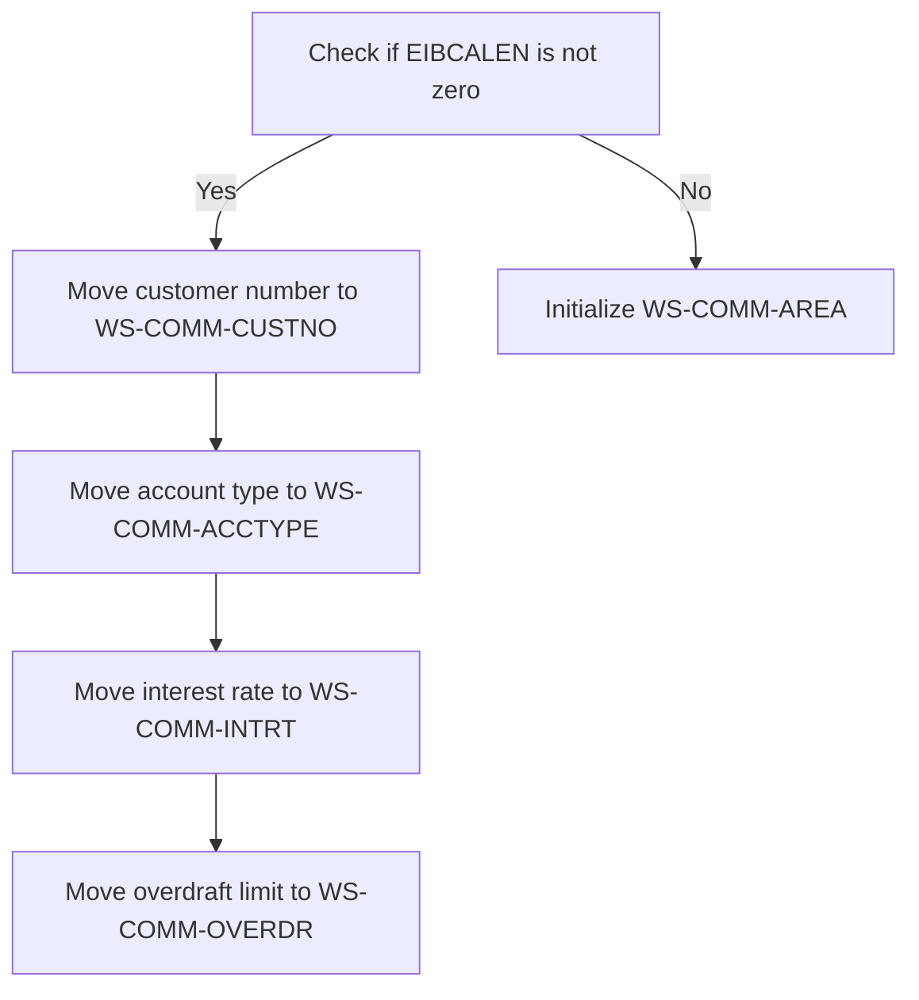

<SwmSnippet path="/src/base/cobol_src/BNK1CAC.cbl" line="239">

---

The <SwmToken path="src/base/cobol_src/BNK1CAC.cbl" pos="160:1:1" line-data="       PREMIERE SECTION.">`PREMIERE`</SwmToken> function begins by checking if <SwmToken path="src/base/cobol_src/BNK1CAC.cbl" pos="239:3:3" line-data="            IF EIBCALEN NOT = 0">`EIBCALEN`</SwmToken> (which indicates the length of the communication area) is not zero. If it is not zero, it means there is data to be processed. The function then moves the customer number from <SwmToken path="src/base/cobol_src/BNK1CAC.cbl" pos="240:3:5" line-data="               MOVE SUBPGM-CUSTNO     TO WS-COMM-CUSTNO">`SUBPGM-CUSTNO`</SwmToken> to <SwmToken path="src/base/cobol_src/BNK1CAC.cbl" pos="240:9:13" line-data="               MOVE SUBPGM-CUSTNO     TO WS-COMM-CUSTNO">`WS-COMM-CUSTNO`</SwmToken>, the account type from <SwmToken path="src/base/cobol_src/BNK1CAC.cbl" pos="241:3:7" line-data="               MOVE SUBPGM-ACC-TYPE   TO WS-COMM-ACCTYPE">`SUBPGM-ACC-TYPE`</SwmToken> to <SwmToken path="src/base/cobol_src/BNK1CAC.cbl" pos="241:11:15" line-data="               MOVE SUBPGM-ACC-TYPE   TO WS-COMM-ACCTYPE">`WS-COMM-ACCTYPE`</SwmToken>, the interest rate from <SwmToken path="src/base/cobol_src/BNK1CAC.cbl" pos="242:3:7" line-data="               MOVE SUBPGM-INT-RT     TO WS-COMM-INTRT">`SUBPGM-INT-RT`</SwmToken> to <SwmToken path="src/base/cobol_src/BNK1CAC.cbl" pos="242:11:15" line-data="               MOVE SUBPGM-INT-RT     TO WS-COMM-INTRT">`WS-COMM-INTRT`</SwmToken>, and the overdraft limit from <SwmToken path="src/base/cobol_src/BNK1CAC.cbl" pos="243:3:7" line-data="               MOVE SUBPGM-OVERDR-LIM TO WS-COMM-OVERDR">`SUBPGM-OVERDR-LIM`</SwmToken> to <SwmToken path="src/base/cobol_src/BNK1CAC.cbl" pos="243:11:15" line-data="               MOVE SUBPGM-OVERDR-LIM TO WS-COMM-OVERDR">`WS-COMM-OVERDR`</SwmToken>. If <SwmToken path="src/base/cobol_src/BNK1CAC.cbl" pos="239:3:3" line-data="            IF EIBCALEN NOT = 0">`EIBCALEN`</SwmToken> is zero, indicating no data, the function initializes the communication area <SwmToken path="src/base/cobol_src/BNK1CAC.cbl" pos="245:3:7" line-data="               INITIALIZE WS-COMM-AREA">`WS-COMM-AREA`</SwmToken> to ensure it is in a clean state.

```cobol
            IF EIBCALEN NOT = 0
               MOVE SUBPGM-CUSTNO     TO WS-COMM-CUSTNO
               MOVE SUBPGM-ACC-TYPE   TO WS-COMM-ACCTYPE
               MOVE SUBPGM-INT-RT     TO WS-COMM-INTRT
               MOVE SUBPGM-OVERDR-LIM TO WS-COMM-OVERDR
            ELSE
               INITIALIZE WS-COMM-AREA
            END-IF.
```

---

</SwmSnippet>

## Return from transaction

This is the next section of the flow.

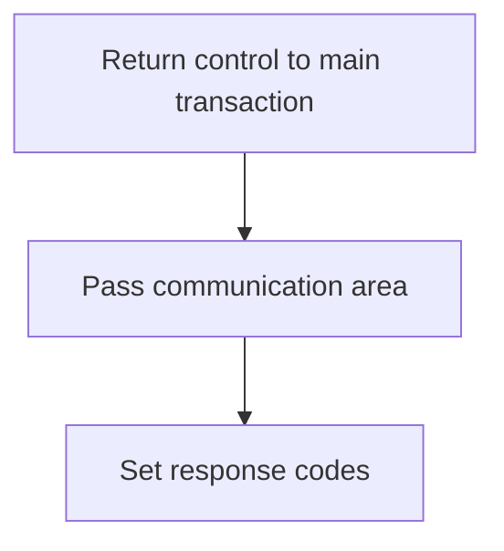

## Initialize fail info

Now, lets zoom into this section of the flow:

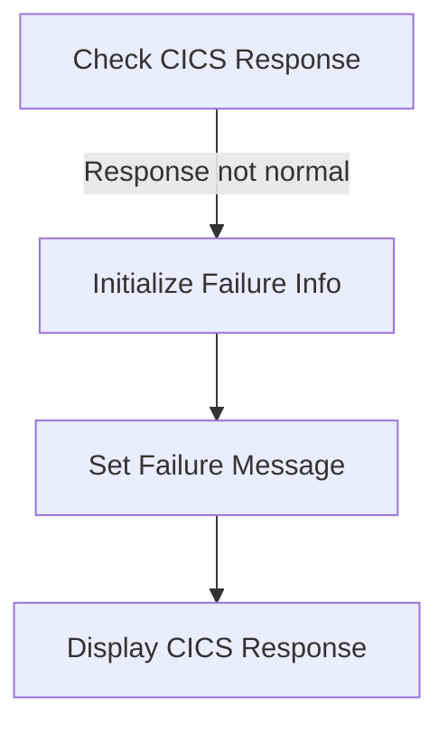

<SwmSnippet path="/src/base/cobol_src/BNK1CAC.cbl" line="256">

---

When the CICS response is not normal, we initialize the failure information to prepare for error handling. This ensures that any previous error data is cleared out and we start fresh.

```cobol
           IF WS-CICS-RESP NOT = DFHRESP(NORMAL)
              INITIALIZE WS-FAIL-INFO
```

---

</SwmSnippet>

<SwmSnippet path="/src/base/cobol_src/BNK1CAC.cbl" line="258">

---

Next, we set a specific failure message indicating that the transaction ID return failed. This message is crucial for debugging and understanding what went wrong during the transaction.

```cobol
              MOVE 'BNK1CAC - A010 - RETURN TRANSID(OCAC) FAIL' TO
                 WS-CICS-FAIL-MSG
```

---

</SwmSnippet>

<SwmSnippet path="/src/base/cobol_src/BNK1CAC.cbl" line="260">

---

Finally, we move the CICS response codes to display variables. This step ensures that the response codes are available for display or logging, providing further insight into the failure.

```cobol
              MOVE WS-CICS-RESP  TO WS-CICS-RESP-DISP
              MOVE WS-CICS-RESP2 TO WS-CICS-RESP2-DISP

```

---

</SwmSnippet>

## Set error code

This is the next section of the flow.

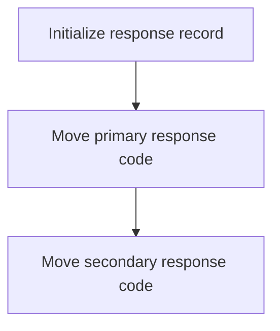

<SwmSnippet path="/src/base/cobol_src/BNK1CAC.cbl" line="269">

---

First, the <SwmToken path="src/base/cobol_src/BNK1CAC.cbl" pos="269:1:5" line-data="                INITIALIZE ABNDINFO-REC">`INITIALIZE ABNDINFO-REC`</SwmToken> statement is used to reset the <SwmToken path="src/base/cobol_src/BNK1CAC.cbl" pos="269:3:5" line-data="                INITIALIZE ABNDINFO-REC">`ABNDINFO-REC`</SwmToken> record, ensuring that all fields are set to their default values before processing the transaction response.

```cobol
                INITIALIZE ABNDINFO-REC
```

---

</SwmSnippet>

<SwmSnippet path="/src/base/cobol_src/BNK1CAC.cbl" line="270">

---

Next, the <SwmToken path="src/base/cobol_src/BNK1CAC.cbl" pos="270:1:1" line-data="                MOVE EIBRESP    TO ABND-RESPCODE">`MOVE`</SwmToken>` `<SwmToken path="src/base/cobol_src/BNK1CAC.cbl" pos="270:3:3" line-data="                MOVE EIBRESP    TO ABND-RESPCODE">`EIBRESP`</SwmToken>` `<SwmToken path="src/base/cobol_src/BNK1CAC.cbl" pos="270:5:5" line-data="                MOVE EIBRESP    TO ABND-RESPCODE">`TO`</SwmToken>` `<SwmToken path="src/base/cobol_src/BNK1CAC.cbl" pos="270:7:9" line-data="                MOVE EIBRESP    TO ABND-RESPCODE">`ABND-RESPCODE`</SwmToken> and <SwmToken path="src/base/cobol_src/BNK1CAC.cbl" pos="270:1:1" line-data="                MOVE EIBRESP    TO ABND-RESPCODE">`MOVE`</SwmToken>` `<SwmToken path="src/base/cobol_src/BNK1CAC.cbl" pos="271:3:3" line-data="                MOVE EIBRESP2   TO ABND-RESP2CODE">`EIBRESP2`</SwmToken>` `<SwmToken path="src/base/cobol_src/BNK1CAC.cbl" pos="270:5:5" line-data="                MOVE EIBRESP    TO ABND-RESPCODE">`TO`</SwmToken>` `<SwmToken path="src/base/cobol_src/BNK1CAC.cbl" pos="271:7:9" line-data="                MOVE EIBRESP2   TO ABND-RESP2CODE">`ABND-RESP2CODE`</SwmToken> statements transfer the primary and secondary response codes from the <SwmToken path="src/base/cobol_src/BNK1CAC.cbl" pos="270:3:3" line-data="                MOVE EIBRESP    TO ABND-RESPCODE">`EIBRESP`</SwmToken> and <SwmToken path="src/base/cobol_src/BNK1CAC.cbl" pos="271:3:3" line-data="                MOVE EIBRESP2   TO ABND-RESP2CODE">`EIBRESP2`</SwmToken> fields to the <SwmToken path="src/base/cobol_src/BNK1CAC.cbl" pos="270:7:9" line-data="                MOVE EIBRESP    TO ABND-RESPCODE">`ABND-RESPCODE`</SwmToken> and <SwmToken path="src/base/cobol_src/BNK1CAC.cbl" pos="271:7:9" line-data="                MOVE EIBRESP2   TO ABND-RESP2CODE">`ABND-RESP2CODE`</SwmToken> fields, respectively. This ensures that the response codes are captured and stored in the appropriate fields for further processing or logging.

```cobol
                MOVE EIBRESP    TO ABND-RESPCODE
                MOVE EIBRESP2   TO ABND-RESP2CODE
```

---

</SwmSnippet>

## Get application information

This is the next section of the flow.

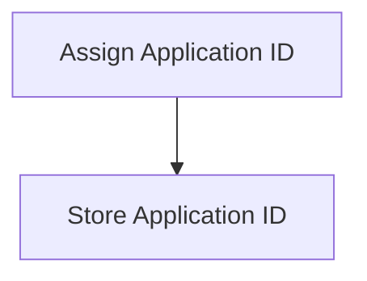

<SwmSnippet path="/src/base/cobol_src/BNK1CAC.cbl" line="275">

---

The <SwmToken path="src/base/cobol_src/BNK1CAC.cbl" pos="275:1:12" line-data="                EXEC CICS ASSIGN APPLID(ABND-APPLID)">`EXEC CICS ASSIGN APPLID(ABND-APPLID)`</SwmToken> command assigns the application identifier to the variable <SwmToken path="src/base/cobol_src/BNK1CAC.cbl" pos="275:9:11" line-data="                EXEC CICS ASSIGN APPLID(ABND-APPLID)">`ABND-APPLID`</SwmToken>. This identifier is crucial for tracking and managing the application within the CICS environment, ensuring that all subsequent operations are correctly associated with the current application instance.

```cobol
                EXEC CICS ASSIGN APPLID(ABND-APPLID)
                END-EXEC

```

---

</SwmSnippet>

## Set transaction details

This is the next section of the flow.

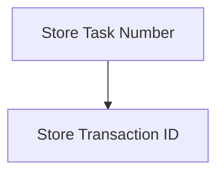

<SwmSnippet path="/src/base/cobol_src/BNK1CAC.cbl" line="278">

---

The <SwmToken path="src/base/cobol_src/BNK1CAC.cbl" pos="160:1:1" line-data="       PREMIERE SECTION.">`PREMIERE`</SwmToken> function is responsible for storing the task number and transaction ID for error handling purposes. The task number is moved to <SwmToken path="src/base/cobol_src/BNK1CAC.cbl" pos="278:7:11" line-data="                MOVE EIBTASKN   TO ABND-TASKNO-KEY">`ABND-TASKNO-KEY`</SwmToken>, which is used to uniquely identify the task that is being executed. This helps in tracking and managing errors specific to that task. Similarly, the transaction ID is moved to <SwmToken path="src/base/cobol_src/BNK1CAC.cbl" pos="279:7:9" line-data="                MOVE EIBTRNID   TO ABND-TRANID">`ABND-TRANID`</SwmToken>, which helps in identifying the transaction that is currently being processed. This ensures that any errors can be traced back to the specific transaction, facilitating easier debugging and error resolution.

```cobol
                MOVE EIBTASKN   TO ABND-TASKNO-KEY
                MOVE EIBTRNID   TO ABND-TRANID

```

---

</SwmSnippet>

## Populate time

Now, lets zoom into this section of the flow:

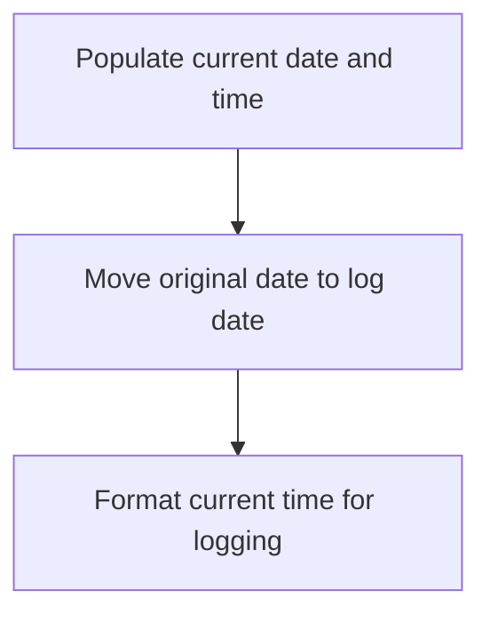

<SwmSnippet path="/src/base/cobol_src/BNK1CAC.cbl" line="281">

---

The PREMIERE function is responsible for formatting the current date and time for logging purposes. First, it performs the <SwmToken path="src/base/cobol_src/BNK1CAC.cbl" pos="281:3:7" line-data="                PERFORM POPULATE-TIME-DATE">`POPULATE-TIME-DATE`</SwmToken> operation to get the current date and time. Then, it moves the original date stored in <SwmToken path="src/base/cobol_src/BNK1CAC.cbl" pos="284:3:7" line-data="                MOVE WS-ORIG-DATE TO ABND-DATE">`WS-ORIG-DATE`</SwmToken> to <SwmToken path="src/base/cobol_src/BNK1CAC.cbl" pos="284:11:13" line-data="                MOVE WS-ORIG-DATE TO ABND-DATE">`ABND-DATE`</SwmToken>, which is used for logging the date of the event. Finally, it formats the current time by concatenating the hours (<SwmToken path="src/base/cobol_src/BNK1CAC.cbl" pos="285:3:11" line-data="                STRING WS-TIME-NOW-GRP-HH DELIMITED BY SIZE,">`WS-TIME-NOW-GRP-HH`</SwmToken>), minutes (<SwmToken path="src/base/cobol_src/BNK1CAC.cbl" pos="287:1:9" line-data="                       WS-TIME-NOW-GRP-MM DELIMITED BY SIZE,">`WS-TIME-NOW-GRP-MM`</SwmToken>), and seconds (<SwmToken path="src/base/cobol_src/BNK1CAC.cbl" pos="287:1:9" line-data="                       WS-TIME-NOW-GRP-MM DELIMITED BY SIZE,">`WS-TIME-NOW-GRP-MM`</SwmToken>) with colons in between, creating a timestamp for logging.

```cobol
                PERFORM POPULATE-TIME-DATE


                MOVE WS-ORIG-DATE TO ABND-DATE
                STRING WS-TIME-NOW-GRP-HH DELIMITED BY SIZE,
                       ':' DELIMITED BY SIZE,
                       WS-TIME-NOW-GRP-MM DELIMITED BY SIZE,
                       ':' DELIMITED BY SIZE,
                       WS-TIME-NOW-GRP-MM DELIMITED BY SIZE
```

---

</SwmSnippet>

## Set unique time information

This is the next section of the flow.

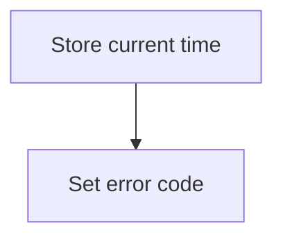

<SwmSnippet path="/src/base/cobol_src/BNK1CAC.cbl" line="293">

---

The <SwmToken path="src/base/cobol_src/BNK1CAC.cbl" pos="160:1:1" line-data="       PREMIERE SECTION.">`PREMIERE`</SwmToken> function stores the current time by moving the value of <SwmToken path="src/base/cobol_src/BNK1CAC.cbl" pos="293:3:7" line-data="                MOVE WS-U-TIME   TO ABND-UTIME-KEY">`WS-U-TIME`</SwmToken> (which holds the current time) to <SwmToken path="src/base/cobol_src/BNK1CAC.cbl" pos="293:11:15" line-data="                MOVE WS-U-TIME   TO ABND-UTIME-KEY">`ABND-UTIME-KEY`</SwmToken>. This step ensures that the current time is recorded for any subsequent operations or logging purposes.

```cobol
                MOVE WS-U-TIME   TO ABND-UTIME-KEY
```

---

</SwmSnippet>

<SwmSnippet path="/src/base/cobol_src/BNK1CAC.cbl" line="294">

---

Next, the function sets the error code by moving the value 'HBNK' to <SwmToken path="src/base/cobol_src/BNK1CAC.cbl" pos="294:9:11" line-data="                MOVE &#39;HBNK&#39;      TO ABND-CODE">`ABND-CODE`</SwmToken>. This step is crucial for identifying the specific error or status code that can be used for debugging or handling errors in the application.

```cobol
                MOVE 'HBNK'      TO ABND-CODE
```

---

</SwmSnippet>

## Assign program

This is the next section of the flow.

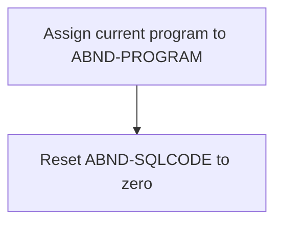

<SwmSnippet path="/src/base/cobol_src/BNK1CAC.cbl" line="296">

---

The <SwmToken path="src/base/cobol_src/BNK1CAC.cbl" pos="296:1:12" line-data="                EXEC CICS ASSIGN PROGRAM(ABND-PROGRAM)">`EXEC CICS ASSIGN PROGRAM(ABND-PROGRAM)`</SwmToken> statement assigns the current running program's name to the variable <SwmToken path="src/base/cobol_src/BNK1CAC.cbl" pos="296:9:11" line-data="                EXEC CICS ASSIGN PROGRAM(ABND-PROGRAM)">`ABND-PROGRAM`</SwmToken>. This is useful for tracking which program is currently executing, especially in error handling scenarios.

```cobol
                EXEC CICS ASSIGN PROGRAM(ABND-PROGRAM)
                END-EXEC
```

---

</SwmSnippet>

<SwmSnippet path="/src/base/cobol_src/BNK1CAC.cbl" line="299">

---

The <SwmToken path="src/base/cobol_src/BNK1CAC.cbl" pos="299:1:1" line-data="                MOVE ZEROS      TO ABND-SQLCODE">`MOVE`</SwmToken>` `<SwmToken path="src/base/cobol_src/BNK1CAC.cbl" pos="299:3:3" line-data="                MOVE ZEROS      TO ABND-SQLCODE">`ZEROS`</SwmToken>` `<SwmToken path="src/base/cobol_src/BNK1CAC.cbl" pos="299:5:5" line-data="                MOVE ZEROS      TO ABND-SQLCODE">`TO`</SwmToken>` `<SwmToken path="src/base/cobol_src/BNK1CAC.cbl" pos="299:7:9" line-data="                MOVE ZEROS      TO ABND-SQLCODE">`ABND-SQLCODE`</SwmToken> statement resets the <SwmToken path="src/base/cobol_src/BNK1CAC.cbl" pos="299:7:9" line-data="                MOVE ZEROS      TO ABND-SQLCODE">`ABND-SQLCODE`</SwmToken> variable to zero. This is typically done to clear any previous SQL error codes before executing new SQL statements, ensuring that any new errors can be accurately detected and handled.

```cobol
                MOVE ZEROS      TO ABND-SQLCODE
```

---

</SwmSnippet>

## Build error string

This is the next section of the flow.

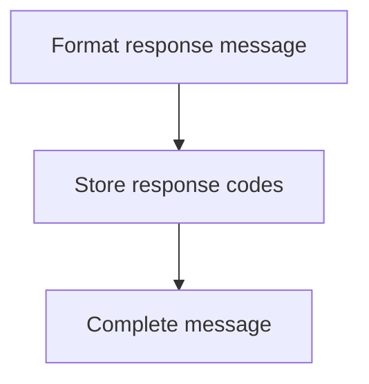

<SwmSnippet path="/src/base/cobol_src/BNK1CAC.cbl" line="301">

---

The <SwmToken path="src/base/cobol_src/BNK1CAC.cbl" pos="301:1:1" line-data="                STRING &#39;A010- RETURN TRANSID(OCAC) &#39; DELIMITED BY SIZE,">`STRING`</SwmToken> statement is used to concatenate various components into a single response message. The message starts with a fixed string '<SwmToken path="src/base/cobol_src/BNK1CAC.cbl" pos="301:4:4" line-data="                STRING &#39;A010- RETURN TRANSID(OCAC) &#39; DELIMITED BY SIZE,">`A010`</SwmToken>- RETURN TRANSID(OCAC) ', indicating the transaction ID. Next, the response code label 'EIBRESP=' is appended, followed by the actual response code stored in <SwmToken path="src/base/cobol_src/BNK1CAC.cbl" pos="303:1:3" line-data="                       ABND-RESPCODE DELIMITED BY SIZE,">`ABND-RESPCODE`</SwmToken>. Similarly, the label '<SwmToken path="src/base/cobol_src/BNK1CAC.cbl" pos="304:3:3" line-data="                       &#39; RESP2=&#39; DELIMITED BY SIZE,">`RESP2`</SwmToken>=' is added, followed by the secondary response code stored in <SwmToken path="src/base/cobol_src/BNK1CAC.cbl" pos="305:1:3" line-data="                       ABND-RESP2CODE DELIMITED BY SIZE">`ABND-RESP2CODE`</SwmToken>. Finally, the entire concatenated message is stored in <SwmToken path="src/base/cobol_src/BNK1CAC.cbl" pos="306:3:5" line-data="                       INTO ABND-FREEFORM">`ABND-FREEFORM`</SwmToken>, which will be used to communicate the transaction termination status.

```cobol
                STRING 'A010- RETURN TRANSID(OCAC) ' DELIMITED BY SIZE,
                       ' EIBRESP=' DELIMITED BY SIZE,
                       ABND-RESPCODE DELIMITED BY SIZE,
                       ' RESP2=' DELIMITED BY SIZE,
                       ABND-RESP2CODE DELIMITED BY SIZE
                       INTO ABND-FREEFORM
                END-STRING
```

---

</SwmSnippet>

## Link to abend

Now, lets zoom into this section of the flow:

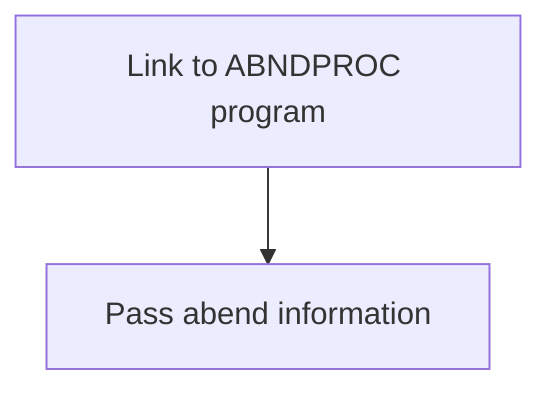

<SwmSnippet path="/src/base/cobol_src/BNK1CAC.cbl" line="309">

---

The <SwmToken path="src/base/cobol_src/BNK1CAC.cbl" pos="160:1:1" line-data="       PREMIERE SECTION.">`PREMIERE`</SwmToken> function handles abnormal end (abend) processing by linking to the <SwmToken path="src/base/cobol_src/BNK1CAC.cbl" pos="147:19:19" line-data="       01 WS-ABEND-PGM                 PIC X(8) VALUE &#39;ABNDPROC&#39;.">`ABNDPROC`</SwmToken> program. This is done using the <SwmToken path="src/base/cobol_src/BNK1CAC.cbl" pos="309:1:7" line-data="                EXEC CICS LINK PROGRAM(WS-ABEND-PGM)">`EXEC CICS LINK PROGRAM`</SwmToken> command, which specifies <SwmToken path="src/base/cobol_src/BNK1CAC.cbl" pos="309:9:13" line-data="                EXEC CICS LINK PROGRAM(WS-ABEND-PGM)">`WS-ABEND-PGM`</SwmToken> as the program to link to. The <SwmToken path="src/base/cobol_src/BNK1CAC.cbl" pos="310:1:1" line-data="                          COMMAREA(ABNDINFO-REC)">`COMMAREA`</SwmToken> parameter is used to pass the <SwmToken path="src/base/cobol_src/BNK1CAC.cbl" pos="310:3:5" line-data="                          COMMAREA(ABNDINFO-REC)">`ABNDINFO-REC`</SwmToken> (abend information record) to the <SwmToken path="src/base/cobol_src/BNK1CAC.cbl" pos="147:19:19" line-data="       01 WS-ABEND-PGM                 PIC X(8) VALUE &#39;ABNDPROC&#39;.">`ABNDPROC`</SwmToken> program. This ensures that all necessary abend information is transferred for proper handling and logging.

More about ABNDPROC: <SwmLink doc-title="Handling Abnormal Terminations (ABNDPROC)">[Handling Abnormal Terminations (ABNDPROC)](/.swm/handling-abnormal-terminations-abndproc.q6kxvboz.sw.md)</SwmLink>

```cobol
                EXEC CICS LINK PROGRAM(WS-ABEND-PGM)
                          COMMAREA(ABNDINFO-REC)
                END-EXEC
```

---

</SwmSnippet>

## Perform abend task

This is the next section of the flow.

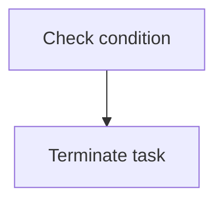

<SwmSnippet path="/src/base/cobol_src/BNK1CAC.cbl" line="313">

---

The <SwmToken path="src/base/cobol_src/BNK1CAC.cbl" pos="313:1:7" line-data="                PERFORM ABEND-THIS-TASK">`PERFORM ABEND-THIS-TASK`</SwmToken> statement is used to terminate the current task. This is typically done when an error or exceptional condition is encountered that prevents further processing. By terminating the task, the system can prevent any further erroneous operations and ensure that the issue is addressed before proceeding.

```cobol
                PERFORM ABEND-THIS-TASK
           END-IF.
```

---

</SwmSnippet>

&nbsp;

*This is an auto-generated document by Swimm 🌊 and has not yet been verified by a human*

<SwmMeta version="3.0.0" repo-id="Z2l0aHViJTNBJTNBY2ljcy1iYW5raW5nLXNhbXBsZS1hcHBsaWNhdGlvbi1jYnNhLUlCTS1EZW1vJTNBJTNBU3dpbW0tRGVtbw==" repo-name="cics-banking-sample-application-cbsa-IBM-Demo"><sup>Powered by [Swimm](/)</sup></SwmMeta>
