The <SwmToken path="src/base/cobol_src/BNK1CRA.cbl" pos="709:4:4" line-data="                 MOVE &#39;BNK1CRA - SM010 - SEND MAP ERASE FAIL &#39;">`BNK1CRA`</SwmToken> program is designed to handle various user interactions within the CICS banking application. It manages tasks such as checking for the first run, handling PA keys, returning to the main menu, sending termination messages, erasing the screen, processing content, and handling invalid keys. The program ensures smooth operation by validating user inputs, managing communication areas, and handling errors effectively.

The <SwmToken path="src/base/cobol_src/BNK1CRA.cbl" pos="709:4:4" line-data="                 MOVE &#39;BNK1CRA - SM010 - SEND MAP ERASE FAIL &#39;">`BNK1CRA`</SwmToken> program starts by checking if it is the first run and initializes necessary fields. It then handles different user inputs, such as PA keys and the PF3 key, to navigate through the application. The program also processes content when the user presses Enter and handles invalid keys by displaying error messages. Additionally, it manages the communication area to maintain data consistency and returns control to the CICS system when needed. Error handling is a crucial part of the program, ensuring that any issues are logged and managed appropriately.

Here is a high level diagram of the program:

```mermaid
graph TD
tzij2("Check first run"):::acc3ae078  --> 
m5gqa("Handle PA keys"):::ac9638f54  --> 
i7cnc("Return main menu"):::a2887ba7c  --> 
1236x("Send termination"):::a85d6959b  --> 
os3oe("Erase screen"):::aa72afb6d  --> 
9uksq("Process content"):::a01ddcf89  --> 
62uot("Invalid key"):::a34b2f59c  --> 
4aezi("Move COMM-AREA"):::a157dcd78  --> 
osm7c("Return to CICS"):::a7c71fc3f  --> 
s7i6c("Handle CICS error"):::a1d0ef9d1 
classDef acc3ae078 color:#000000,fill:#7CB9F4
classDef ac9638f54 color:#000000,fill:#00FFAA
classDef a2887ba7c color:#000000,fill:#00FFF4
classDef a85d6959b color:#000000,fill:#FFFF00
classDef aa72afb6d color:#000000,fill:#AA7CB9
classDef a01ddcf89 color:#000000,fill:#5afa0a
classDef a34b2f59c color:#000000,fill:#f5a10a
classDef a157dcd78 color:#000000,fill:#f50af1
classDef a7c71fc3f color:#000000,fill:#f5a10a
classDef a1d0ef9d1 color:#000000,fill:#FF5733

%% Swimm:
%% graph TD
%% tzij2("Check first run"):::acc3ae078  --> 
%% m5gqa("Handle PA keys"):::ac9638f54  --> 
%% i7cnc("Return main menu"):::a2887ba7c  --> 
%% 1236x("Send termination"):::a85d6959b  --> 
%% os3oe("Erase screen"):::aa72afb6d  --> 
%% 9uksq("Process content"):::a01ddcf89  --> 
%% 62uot("Invalid key"):::a34b2f59c  --> 
%% 4aezi("Move <SwmToken path="src/base/cobol_src/BNK1CRA.cbl" pos="265:5:7" line-data="              COMMAREA(WS-COMM-AREA)">`COMM-AREA`</SwmToken>"):::a157dcd78  --> 
%% osm7c("Return to CICS"):::a7c71fc3f  --> 
%% s7i6c("Handle CICS error"):::a1d0ef9d1 
%% classDef acc3ae078 color:#000000,fill:#7CB9F4
%% classDef ac9638f54 color:#000000,fill:#00FFAA
%% classDef a2887ba7c color:#000000,fill:#00FFF4
%% classDef a85d6959b color:#000000,fill:#FFFF00
%% classDef aa72afb6d color:#000000,fill:#AA7CB9
%% classDef a01ddcf89 color:#000000,fill:#5afa0a
%% classDef a34b2f59c color:#000000,fill:#f5a10a
%% classDef a157dcd78 color:#000000,fill:#f50af1
%% classDef a7c71fc3f color:#000000,fill:#f5a10a
%% classDef a1d0ef9d1 color:#000000,fill:#FF5733
```

## Check first run

First, we'll zoom into this section of the flow:

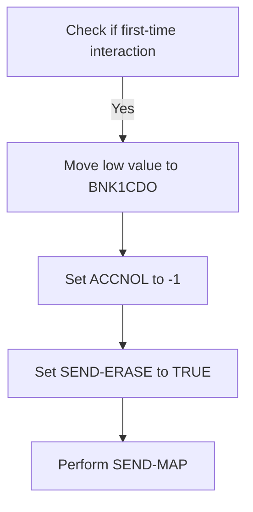

First, the code checks if <SwmToken path="src/base/cobol_src/BNK1CRA.cbl" pos="185:3:3" line-data="              WHEN EIBCALEN = ZERO">`EIBCALEN`</SwmToken> (which indicates the length of the communication area) is zero. This condition determines if it is the first time the user is interacting with the map.

<SwmSnippet path="/src/base/cobol_src/BNK1CRA.cbl" line="185">

---

Next, if it is the first interaction, the code moves a low value to <SwmToken path="src/base/cobol_src/BNK1CRA.cbl" pos="186:9:9" line-data="                 MOVE LOW-VALUE TO BNK1CDO">`BNK1CDO`</SwmToken> (which likely clears the data), sets <SwmToken path="src/base/cobol_src/BNK1CRA.cbl" pos="187:8:8" line-data="                 MOVE -1 TO ACCNOL">`ACCNOL`</SwmToken> to -1 (indicating no account number), and sets <SwmToken path="src/base/cobol_src/BNK1CRA.cbl" pos="188:3:5" line-data="                 SET SEND-ERASE TO TRUE">`SEND-ERASE`</SwmToken> to TRUE to ensure the map is sent with erased (empty) data fields. Finally, it performs the <SwmToken path="src/base/cobol_src/BNK1CRA.cbl" pos="189:3:5" line-data="                 PERFORM SEND-MAP">`SEND-MAP`</SwmToken> operation to display the empty map to the user.

```cobol
              WHEN EIBCALEN = ZERO
                 MOVE LOW-VALUE TO BNK1CDO
                 MOVE -1 TO ACCNOL
                 SET SEND-ERASE TO TRUE
                 PERFORM SEND-MAP
```

---

</SwmSnippet>

## Handle PA keys

Now, lets zoom into this section of the flow:

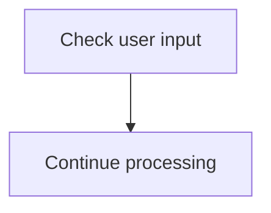

<SwmSnippet path="/src/base/cobol_src/BNK1CRA.cbl" line="194">

---

The <SwmToken path="src/base/cobol_src/BNK1CRA.cbl" pos="177:1:1" line-data="       PREMIERE SECTION.">`PREMIERE`</SwmToken> function checks if the user input matches any of the predefined action keys (<SwmToken path="src/base/cobol_src/BNK1CRA.cbl" pos="194:7:7" line-data="              WHEN EIBAID = DFHPA1 OR DFHPA2 OR DFHPA3">`DFHPA1`</SwmToken>, <SwmToken path="src/base/cobol_src/BNK1CRA.cbl" pos="194:11:11" line-data="              WHEN EIBAID = DFHPA1 OR DFHPA2 OR DFHPA3">`DFHPA2`</SwmToken>, or <SwmToken path="src/base/cobol_src/BNK1CRA.cbl" pos="194:15:15" line-data="              WHEN EIBAID = DFHPA1 OR DFHPA2 OR DFHPA3">`DFHPA3`</SwmToken>). If the input matches any of these keys, the program continues processing the corresponding action. This ensures that the application responds appropriately to specific user inputs, enabling the bank teller to perform the necessary operations efficiently.

```cobol
              WHEN EIBAID = DFHPA1 OR DFHPA2 OR DFHPA3
                 CONTINUE
```

---

</SwmSnippet>

## Return main menu

Now, lets zoom into this section of the flow:

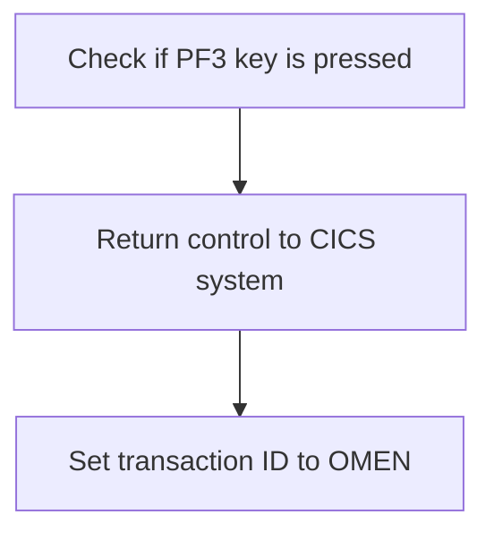

<SwmSnippet path="/src/base/cobol_src/BNK1CRA.cbl" line="200">

---

When the PF3 key is pressed, the system returns control to the CICS system. This is done by executing the `RETURN` command with the <SwmToken path="src/base/cobol_src/BNK1CRA.cbl" pos="202:1:1" line-data="                    TRANSID(&#39;OMEN&#39;)">`TRANSID`</SwmToken> set to 'OMEN'. This ensures that the next transaction to be processed is identified by the 'OMEN' transaction ID. The <SwmToken path="src/base/cobol_src/BNK1CRA.cbl" pos="203:1:1" line-data="                    IMMEDIATE">`IMMEDIATE`</SwmToken> keyword indicates that the return should be processed immediately. The <SwmToken path="src/base/cobol_src/BNK1CRA.cbl" pos="204:1:1" line-data="                    RESP(WS-CICS-RESP)">`RESP`</SwmToken> and <SwmToken path="src/base/cobol_src/BNK1CRA.cbl" pos="205:1:1" line-data="                    RESP2(WS-CICS-RESP2)">`RESP2`</SwmToken> fields are used to capture any response codes from the CICS system, which can be used for error handling or logging purposes.

```cobol
              WHEN EIBAID = DFHPF3
                 EXEC CICS RETURN
                    TRANSID('OMEN')
                    IMMEDIATE
                    RESP(WS-CICS-RESP)
                    RESP2(WS-CICS-RESP2)
                 END-EXEC
```

---

</SwmSnippet>

## Send termination

Now, lets zoom into this section of the flow:

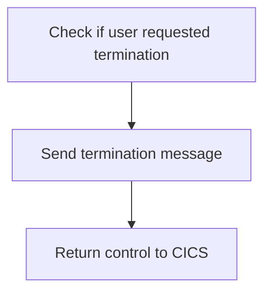

<SwmSnippet path="/src/base/cobol_src/BNK1CRA.cbl" line="212">

---

The PREMIERE function handles user termination requests by first checking if the <SwmToken path="src/base/cobol_src/BNK1CRA.cbl" pos="212:3:3" line-data="              WHEN EIBAID = DFHAID OR DFHPF12">`EIBAID`</SwmToken> (which holds the attention identifier) is equal to <SwmToken path="src/base/cobol_src/BNK1CRA.cbl" pos="212:7:7" line-data="              WHEN EIBAID = DFHAID OR DFHPF12">`DFHAID`</SwmToken> or <SwmToken path="src/base/cobol_src/BNK1CRA.cbl" pos="212:11:11" line-data="              WHEN EIBAID = DFHAID OR DFHPF12">`DFHPF12`</SwmToken> (which are specific attention identifiers for termination). If this condition is met, it performs the <SwmToken path="src/base/cobol_src/BNK1CRA.cbl" pos="213:3:7" line-data="                 PERFORM SEND-TERMINATION-MSG">`SEND-TERMINATION-MSG`</SwmToken> operation to notify the user about the termination. Finally, it executes the `RETURN` command to return control to CICS, effectively ending the current transaction.

```cobol
              WHEN EIBAID = DFHAID OR DFHPF12
                 PERFORM SEND-TERMINATION-MSG

                 EXEC CICS
                    RETURN
                 END-EXEC
```

---

</SwmSnippet>

## Erase screen

Now, lets zoom into this section of the flow:

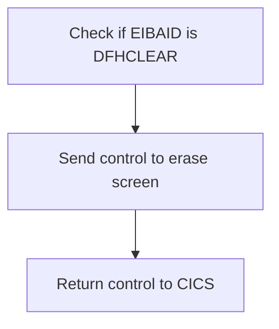

<SwmSnippet path="/src/base/cobol_src/BNK1CRA.cbl" line="222">

---

First, the code checks if <SwmToken path="src/base/cobol_src/BNK1CRA.cbl" pos="222:3:3" line-data="              WHEN EIBAID = DFHCLEAR">`EIBAID`</SwmToken> (the attention identifier) is equal to <SwmToken path="src/base/cobol_src/BNK1CRA.cbl" pos="222:7:7" line-data="              WHEN EIBAID = DFHCLEAR">`DFHCLEAR`</SwmToken> (a constant indicating a clear screen request). This condition ensures that the screen should be cleared before proceeding with the next operation.

```cobol
              WHEN EIBAID = DFHCLEAR
```

---

</SwmSnippet>

<SwmSnippet path="/src/base/cobol_src/BNK1CRA.cbl" line="223">

---

Next, the code sends a control command to CICS to erase the screen and free the keyboard. This action clears any previous data displayed on the screen, preparing it for new input or output.

```cobol
                EXEC CICS SEND CONTROL
                          ERASE
                          FREEKB
                END-EXEC
```

---

</SwmSnippet>

## Process content

Now, lets zoom into this section of the flow:

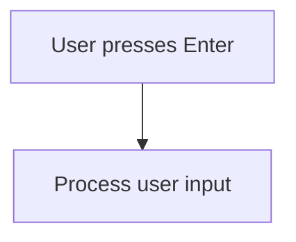

<SwmSnippet path="/src/base/cobol_src/BNK1CRA.cbl" line="234">

---

When the user presses the Enter key, the system triggers the <SwmToken path="src/base/cobol_src/BNK1CRA.cbl" pos="235:3:5" line-data="                 PERFORM PROCESS-MAP">`PROCESS-MAP`</SwmToken> routine to handle the user input. This ensures that any actions associated with the Enter key are executed, such as submitting a form or navigating to the next screen.

```cobol
              WHEN EIBAID = DFHENTER
                 PERFORM PROCESS-MAP

```

---

</SwmSnippet>

## Invalid key

Now, lets zoom into this section of the flow:

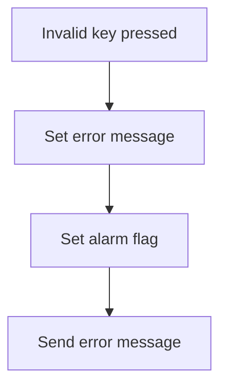

<SwmSnippet path="/src/base/cobol_src/BNK1CRA.cbl" line="240">

---

When an invalid key is pressed by the user, the system moves <SwmToken path="src/base/cobol_src/BNK1CRA.cbl" pos="241:3:5" line-data="                 MOVE LOW-VALUES TO BNK1CDO">`LOW-VALUES`</SwmToken> to <SwmToken path="src/base/cobol_src/BNK1CRA.cbl" pos="241:9:9" line-data="                 MOVE LOW-VALUES TO BNK1CDO">`BNK1CDO`</SwmToken> (which likely clears or resets a specific field). Then, it sets the <SwmToken path="src/base/cobol_src/BNK1CRA.cbl" pos="242:14:14" line-data="                 MOVE &#39;Invalid key pressed.&#39; TO MESSAGEO">`MESSAGEO`</SwmToken> to 'Invalid key pressed.' to inform the user of the error. The <SwmToken path="src/base/cobol_src/BNK1CRA.cbl" pos="243:7:7" line-data="                 MOVE 8 TO ACCNOL">`ACCNOL`</SwmToken> is set to 8, which might be used to indicate the type of error or the next action. The <SwmToken path="src/base/cobol_src/BNK1CRA.cbl" pos="244:3:7" line-data="                 SET SEND-DATAONLY-ALARM TO TRUE">`SEND-DATAONLY-ALARM`</SwmToken> flag is set to `TRUE`, triggering an alarm to notify the user of the invalid action. Finally, the <SwmToken path="src/base/cobol_src/BNK1CRA.cbl" pos="245:3:5" line-data="                 PERFORM SEND-MAP">`SEND-MAP`</SwmToken> operation is performed to send the error message and alarm to the user interface.

```cobol
              WHEN OTHER
                 MOVE LOW-VALUES TO BNK1CDO
                 MOVE 'Invalid key pressed.' TO MESSAGEO
                 MOVE 8 TO ACCNOL
                 SET SEND-DATAONLY-ALARM TO TRUE
                 PERFORM SEND-MAP

```

---

</SwmSnippet>

## Move <SwmToken path="src/base/cobol_src/BNK1CRA.cbl" pos="265:5:7" line-data="              COMMAREA(WS-COMM-AREA)">`COMM-AREA`</SwmToken>

This is the next section of the flow.

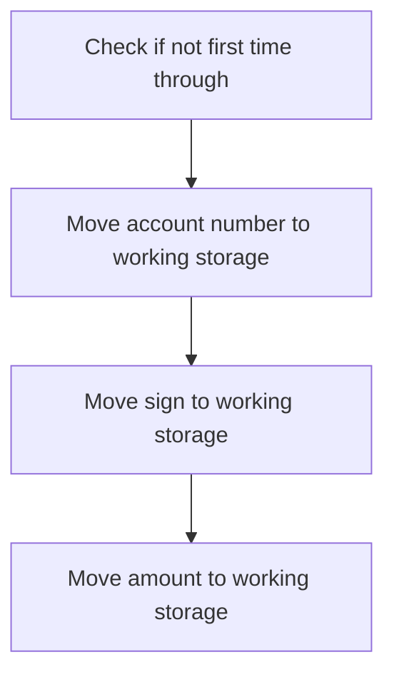

First, the code checks if <SwmToken path="src/base/cobol_src/BNK1CRA.cbl" pos="185:3:3" line-data="              WHEN EIBCALEN = ZERO">`EIBCALEN`</SwmToken> (which indicates the length of the communication area) is not zero. This condition ensures that the logic is executed only if it is not the first time through the program.

<SwmSnippet path="/src/base/cobol_src/BNK1CRA.cbl" line="257">

---

Next, the account number from <SwmToken path="src/base/cobol_src/BNK1CRA.cbl" pos="257:3:5" line-data="              MOVE COMM-ACCNO  TO WS-COMM-ACCNO">`COMM-ACCNO`</SwmToken> (the communication area) is moved to <SwmToken path="src/base/cobol_src/BNK1CRA.cbl" pos="257:9:13" line-data="              MOVE COMM-ACCNO  TO WS-COMM-ACCNO">`WS-COMM-ACCNO`</SwmToken> (working storage). This step is crucial for maintaining the account number information across different program executions.

```cobol
              MOVE COMM-ACCNO  TO WS-COMM-ACCNO
```

---

</SwmSnippet>

<SwmSnippet path="/src/base/cobol_src/BNK1CRA.cbl" line="258">

---

Then, the sign from <SwmToken path="src/base/cobol_src/BNK1CRA.cbl" pos="258:3:5" line-data="              MOVE COMM-SIGN   TO  WS-COMM-SIGN">`COMM-SIGN`</SwmToken> is moved to <SwmToken path="src/base/cobol_src/BNK1CRA.cbl" pos="258:9:13" line-data="              MOVE COMM-SIGN   TO  WS-COMM-SIGN">`WS-COMM-SIGN`</SwmToken>, and the amount from <SwmToken path="src/base/cobol_src/BNK1CRA.cbl" pos="259:3:5" line-data="              MOVE COMM-AMT    TO WS-COMM-AMT">`COMM-AMT`</SwmToken> is moved to <SwmToken path="src/base/cobol_src/BNK1CRA.cbl" pos="259:9:13" line-data="              MOVE COMM-AMT    TO WS-COMM-AMT">`WS-COMM-AMT`</SwmToken>. These steps ensure that the sign and amount data are preserved and can be used in subsequent program logic.

```cobol
              MOVE COMM-SIGN   TO  WS-COMM-SIGN
              MOVE COMM-AMT    TO WS-COMM-AMT
```

---

</SwmSnippet>

## Return to CICS

This is the next section of the flow.

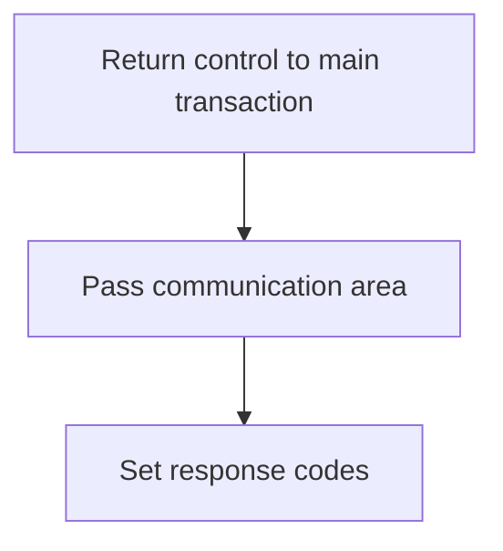

<SwmSnippet path="/src/base/cobol_src/BNK1CRA.cbl" line="263">

---

The <SwmToken path="src/base/cobol_src/BNK1CRA.cbl" pos="177:1:1" line-data="       PREMIERE SECTION.">`PREMIERE`</SwmToken> function is responsible for returning control to the main transaction identified by <SwmToken path="src/base/cobol_src/BNK1CRA.cbl" pos="264:6:6" line-data="              RETURN TRANSID(&#39;OCRA&#39;)">`OCRA`</SwmToken>. This is achieved by using the <SwmToken path="src/base/cobol_src/BNK1CRA.cbl" pos="263:1:1" line-data="           EXEC CICS">`EXEC`</SwmToken>` `<SwmToken path="src/base/cobol_src/BNK1CRA.cbl" pos="263:3:3" line-data="           EXEC CICS">`CICS`</SwmToken>` RETURN `<SwmToken path="src/base/cobol_src/BNK1CRA.cbl" pos="202:1:1" line-data="                    TRANSID(&#39;OMEN&#39;)">`TRANSID`</SwmToken>`(`<SwmToken path="src/base/cobol_src/BNK1CRA.cbl" pos="264:6:6" line-data="              RETURN TRANSID(&#39;OCRA&#39;)">`OCRA`</SwmToken>`)` command, which specifies the transaction ID to which control should be returned. The <SwmToken path="src/base/cobol_src/BNK1CRA.cbl" pos="265:1:1" line-data="              COMMAREA(WS-COMM-AREA)">`COMMAREA`</SwmToken> parameter is used to pass the communication area (<SwmToken path="src/base/cobol_src/BNK1CRA.cbl" pos="265:3:7" line-data="              COMMAREA(WS-COMM-AREA)">`WS-COMM-AREA`</SwmToken>), which contains data that needs to be shared between transactions. The <SwmToken path="src/base/cobol_src/BNK1CRA.cbl" pos="266:1:1" line-data="              LENGTH(21)">`LENGTH`</SwmToken> parameter specifies the length of the communication area, which is set to 21. Additionally, the <SwmToken path="src/base/cobol_src/BNK1CRA.cbl" pos="267:1:1" line-data="              RESP(WS-CICS-RESP)">`RESP`</SwmToken> and <SwmToken path="src/base/cobol_src/BNK1CRA.cbl" pos="268:1:1" line-data="              RESP2(WS-CICS-RESP2)">`RESP2`</SwmToken> parameters are used to capture the primary and secondary response codes (<SwmToken path="src/base/cobol_src/BNK1CRA.cbl" pos="267:3:7" line-data="              RESP(WS-CICS-RESP)">`WS-CICS-RESP`</SwmToken> and <SwmToken path="src/base/cobol_src/BNK1CRA.cbl" pos="268:3:7" line-data="              RESP2(WS-CICS-RESP2)">`WS-CICS-RESP2`</SwmToken>), which can be used for error handling and debugging purposes.

```cobol
           EXEC CICS
              RETURN TRANSID('OCRA')
              COMMAREA(WS-COMM-AREA)
              LENGTH(21)
              RESP(WS-CICS-RESP)
              RESP2(WS-CICS-RESP2)
           END-EXEC.
```

---

</SwmSnippet>

## Handle CICS error

Now, lets zoom into this section of the flow:

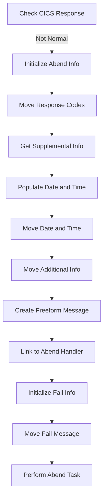

First, the function checks if the CICS response (<SwmToken path="src/base/cobol_src/BNK1CRA.cbl" pos="204:3:7" line-data="                    RESP(WS-CICS-RESP)">`WS-CICS-RESP`</SwmToken>) is not normal. This is crucial for identifying any abnormal conditions that need special handling.

<SwmSnippet path="/src/base/cobol_src/BNK1CRA.cbl" line="278">

---

Moving to the next step, the function initializes the <SwmToken path="src/base/cobol_src/BNK1CRA.cbl" pos="278:3:5" line-data="              INITIALIZE ABNDINFO-REC">`ABNDINFO-REC`</SwmToken> structure to store abend-related information. This ensures that all relevant data is captured for diagnostic purposes.

```cobol
              INITIALIZE ABNDINFO-REC
```

---

</SwmSnippet>

<SwmSnippet path="/src/base/cobol_src/BNK1CRA.cbl" line="279">

---

Next, the function moves the response codes (<SwmToken path="src/base/cobol_src/BNK1CRA.cbl" pos="279:3:3" line-data="              MOVE EIBRESP    TO ABND-RESPCODE">`EIBRESP`</SwmToken> and <SwmToken path="src/base/cobol_src/BNK1CRA.cbl" pos="280:3:3" line-data="              MOVE EIBRESP2   TO ABND-RESP2CODE">`EIBRESP2`</SwmToken>) into the <SwmToken path="src/base/cobol_src/BNK1CRA.cbl" pos="279:7:9" line-data="              MOVE EIBRESP    TO ABND-RESPCODE">`ABND-RESPCODE`</SwmToken> and <SwmToken path="src/base/cobol_src/BNK1CRA.cbl" pos="280:7:9" line-data="              MOVE EIBRESP2   TO ABND-RESP2CODE">`ABND-RESP2CODE`</SwmToken> fields. This captures the specific CICS response codes that triggered the abend.

```cobol
              MOVE EIBRESP    TO ABND-RESPCODE
              MOVE EIBRESP2   TO ABND-RESP2CODE
```

---

</SwmSnippet>

<SwmSnippet path="/src/base/cobol_src/BNK1CRA.cbl" line="284">

---

Then, the function retrieves supplemental information such as the application ID (<SwmToken path="src/base/cobol_src/BNK1CRA.cbl" pos="284:7:7" line-data="              EXEC CICS ASSIGN APPLID(ABND-APPLID)">`APPLID`</SwmToken>), task number (<SwmToken path="src/base/cobol_src/BNK1CRA.cbl" pos="287:3:3" line-data="              MOVE EIBTASKN   TO ABND-TASKNO-KEY">`EIBTASKN`</SwmToken>), and transaction ID (<SwmToken path="src/base/cobol_src/BNK1CRA.cbl" pos="288:3:3" line-data="              MOVE EIBTRNID   TO ABND-TRANID">`EIBTRNID`</SwmToken>). This information is essential for identifying the context in which the abend occurred.

```cobol
              EXEC CICS ASSIGN APPLID(ABND-APPLID)
              END-EXEC

              MOVE EIBTASKN   TO ABND-TASKNO-KEY
              MOVE EIBTRNID   TO ABND-TRANID

```

---

</SwmSnippet>

<SwmSnippet path="/src/base/cobol_src/BNK1CRA.cbl" line="290">

---

Going into the next step, the function performs the <SwmToken path="src/base/cobol_src/BNK1CRA.cbl" pos="290:3:7" line-data="              PERFORM POPULATE-TIME-DATE">`POPULATE-TIME-DATE`</SwmToken> routine to get the current date and time. This helps in timestamping the abend event for better traceability.

```cobol
              PERFORM POPULATE-TIME-DATE
```

---

</SwmSnippet>

<SwmSnippet path="/src/base/cobol_src/BNK1CRA.cbl" line="292">

---

The function then moves the original date (<SwmToken path="src/base/cobol_src/BNK1CRA.cbl" pos="292:3:7" line-data="              MOVE WS-ORIG-DATE TO ABND-DATE">`WS-ORIG-DATE`</SwmToken>) and the current time into the <SwmToken path="src/base/cobol_src/BNK1CRA.cbl" pos="292:11:13" line-data="              MOVE WS-ORIG-DATE TO ABND-DATE">`ABND-DATE`</SwmToken> and <SwmToken path="src/base/cobol_src/BNK1CRA.cbl" pos="298:3:5" line-data="                     INTO ABND-TIME">`ABND-TIME`</SwmToken> fields. This ensures that the abend record is accurately timestamped.

```cobol
              MOVE WS-ORIG-DATE TO ABND-DATE
              STRING WS-TIME-NOW-GRP-HH DELIMITED BY SIZE,
                    ':' DELIMITED BY SIZE,
                     WS-TIME-NOW-GRP-MM DELIMITED BY SIZE,
                     ':' DELIMITED BY SIZE,
                     WS-TIME-NOW-GRP-MM DELIMITED BY SIZE
                     INTO ABND-TIME
```

---

</SwmSnippet>

<SwmSnippet path="/src/base/cobol_src/BNK1CRA.cbl" line="301">

---

Next, additional information such as the universal time (<SwmToken path="src/base/cobol_src/BNK1CRA.cbl" pos="301:3:7" line-data="              MOVE WS-U-TIME   TO ABND-UTIME-KEY">`WS-U-TIME`</SwmToken>) and a specific code (<SwmToken path="src/base/cobol_src/BNK1CRA.cbl" pos="302:4:4" line-data="              MOVE &#39;HBNK&#39;      TO ABND-CODE">`HBNK`</SwmToken>) are moved into the <SwmToken path="src/base/cobol_src/BNK1CRA.cbl" pos="301:11:15" line-data="              MOVE WS-U-TIME   TO ABND-UTIME-KEY">`ABND-UTIME-KEY`</SwmToken> and <SwmToken path="src/base/cobol_src/BNK1CRA.cbl" pos="302:9:11" line-data="              MOVE &#39;HBNK&#39;      TO ABND-CODE">`ABND-CODE`</SwmToken> fields. This adds more context to the abend record.

```cobol
              MOVE WS-U-TIME   TO ABND-UTIME-KEY
              MOVE 'HBNK'      TO ABND-CODE

```

---

</SwmSnippet>

<SwmSnippet path="/src/base/cobol_src/BNK1CRA.cbl" line="309">

---

The function then creates a freeform message that includes the response codes and a specific error message. This message is stored in the <SwmToken path="src/base/cobol_src/BNK1CRA.cbl" pos="315:3:5" line-data="                    INTO ABND-FREEFORM">`ABND-FREEFORM`</SwmToken> field and provides a human-readable description of the abend.

```cobol
              STRING 'A010 - RETURN TRANSID(OCRA) FAIL.'
                    DELIMITED BY SIZE,
                    'EIBRESP=' DELIMITED BY SIZE,
                    ABND-RESPCODE DELIMITED BY SIZE,
                    ' RESP2=' DELIMITED BY SIZE,
                    ABND-RESP2CODE DELIMITED BY SIZE
                    INTO ABND-FREEFORM
```

---

</SwmSnippet>

<SwmSnippet path="/src/base/cobol_src/BNK1CRA.cbl" line="318">

---

Finally, the function links to the abend handler program (<SwmToken path="src/base/cobol_src/BNK1CRA.cbl" pos="318:9:13" line-data="              EXEC CICS LINK PROGRAM(WS-ABEND-PGM)">`WS-ABEND-PGM`</SwmToken>) and passes the <SwmToken path="src/base/cobol_src/BNK1CRA.cbl" pos="319:3:5" line-data="                        COMMAREA(ABNDINFO-REC)">`ABNDINFO-REC`</SwmToken> structure. This triggers the abend handling process, which logs the abend details and performs any necessary cleanup.

```cobol
              EXEC CICS LINK PROGRAM(WS-ABEND-PGM)
                        COMMAREA(ABNDINFO-REC)
              END-EXEC
```

---

</SwmSnippet>

# Send CICS Map (<SwmToken path="src/base/cobol_src/BNK1CRA.cbl" pos="189:3:5" line-data="                 PERFORM SEND-MAP">`SEND-MAP`</SwmToken>)

Let's split this section into smaller parts:

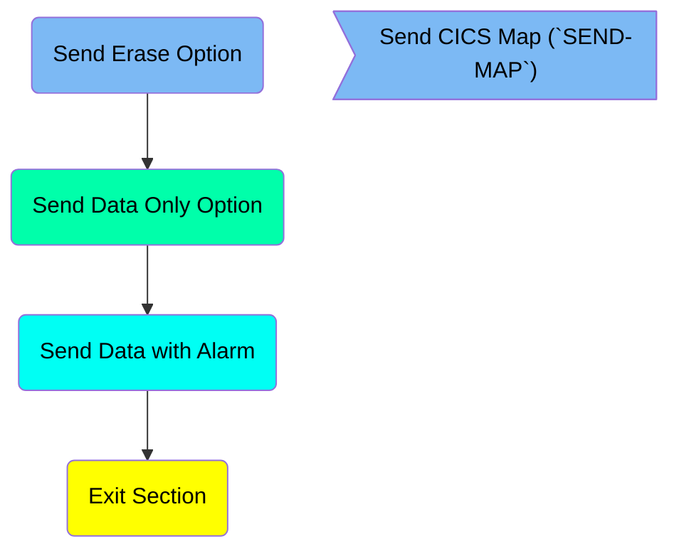

## Send Erase Option

First, we'll zoom into this section of the flow:

```mermaid
graph TD
  A[Check if SEND-ERASE is true] -->|Yes| B[Send map with ERASE option]
  B --> C[Check if response is not NORMAL]
  C -->|Yes| D[Initialize ABNDINFO-REC]
  D --> E[Move response codes to ABNDINFO-REC]
  E --> F[Get supplemental information]
  F --> G[Move task and transaction details to ABNDINFO-REC]
  G --> H[Perform POPULATE-TIME-DATE]
  H --> I[Move date and time to ABNDINFO-REC]
  I --> J[Move additional details to ABNDINFO-REC]
  J --> K[Link to ABEND handler program]
  K --> L[Initialize WS-FAIL-INFO]
  L --> M[Move failure message and response codes to WS-FAIL-INFO]
  M --> N[Perform ABEND-THIS-TASK]

%% Swimm:
%% graph TD
%%   A[Check if <SwmToken path="src/base/cobol_src/BNK1CRA.cbl" pos="188:3:5" line-data="                 SET SEND-ERASE TO TRUE">`SEND-ERASE`</SwmToken> is true] -->|Yes| B[Send map with ERASE option]
%%   B --> C[Check if response is not NORMAL]
%%   C -->|Yes| D[Initialize <SwmToken path="src/base/cobol_src/BNK1CRA.cbl" pos="278:3:5" line-data="              INITIALIZE ABNDINFO-REC">`ABNDINFO-REC`</SwmToken>]
%%   D --> E[Move response codes to <SwmToken path="src/base/cobol_src/BNK1CRA.cbl" pos="278:3:5" line-data="              INITIALIZE ABNDINFO-REC">`ABNDINFO-REC`</SwmToken>]
%%   E --> F[Get supplemental information]
%%   F --> G[Move task and transaction details to <SwmToken path="src/base/cobol_src/BNK1CRA.cbl" pos="278:3:5" line-data="              INITIALIZE ABNDINFO-REC">`ABNDINFO-REC`</SwmToken>]
%%   G --> H[Perform <SwmToken path="src/base/cobol_src/BNK1CRA.cbl" pos="290:3:7" line-data="              PERFORM POPULATE-TIME-DATE">`POPULATE-TIME-DATE`</SwmToken>]
%%   H --> I[Move date and time to <SwmToken path="src/base/cobol_src/BNK1CRA.cbl" pos="278:3:5" line-data="              INITIALIZE ABNDINFO-REC">`ABNDINFO-REC`</SwmToken>]
%%   I --> J[Move additional details to <SwmToken path="src/base/cobol_src/BNK1CRA.cbl" pos="278:3:5" line-data="              INITIALIZE ABNDINFO-REC">`ABNDINFO-REC`</SwmToken>]
%%   J --> K[Link to ABEND handler program]
%%   K --> L[Initialize <SwmToken path="src/base/cobol_src/BNK1CRA.cbl" pos="708:3:7" line-data="                 INITIALIZE WS-FAIL-INFO">`WS-FAIL-INFO`</SwmToken>]
%%   L --> M[Move failure message and response codes to <SwmToken path="src/base/cobol_src/BNK1CRA.cbl" pos="708:3:7" line-data="                 INITIALIZE WS-FAIL-INFO">`WS-FAIL-INFO`</SwmToken>]
%%   M --> N[Perform <SwmToken path="src/base/cobol_src/BNK1CRA.cbl" pos="713:3:7" line-data="                 PERFORM ABEND-THIS-TASK">`ABEND-THIS-TASK`</SwmToken>]
```

First, the code checks if <SwmToken path="src/base/cobol_src/BNK1CRA.cbl" pos="188:3:5" line-data="                 SET SEND-ERASE TO TRUE">`SEND-ERASE`</SwmToken> is true, which indicates that the map data needs to be erased before sending.

<SwmSnippet path="/src/base/cobol_src/BNK1CRA.cbl" line="648">

---

If <SwmToken path="src/base/cobol_src/BNK1CRA.cbl" pos="648:3:5" line-data="           IF SEND-ERASE">`SEND-ERASE`</SwmToken> is true, the map <SwmToken path="src/base/cobol_src/BNK1CRA.cbl" pos="649:10:10" line-data="              EXEC CICS SEND MAP(&#39;BNK1CD&#39;)">`BNK1CD`</SwmToken> from the mapset <SwmToken path="src/base/cobol_src/BNK1CRA.cbl" pos="650:4:4" line-data="                 MAPSET(&#39;BNK1CDM&#39;)">`BNK1CDM`</SwmToken> is sent with the ERASE option, which clears the data fields on the map.

```cobol
           IF SEND-ERASE
              EXEC CICS SEND MAP('BNK1CD')
                 MAPSET('BNK1CDM')
                 FROM(BNK1CDO)
                 ERASE
                 RESP(WS-CICS-RESP)
                 RESP2(WS-CICS-RESP2)
              END-EXEC
```

---

</SwmSnippet>

<SwmSnippet path="/src/base/cobol_src/BNK1CRA.cbl" line="657">

---

Next, the code checks if the response from the SEND MAP command is not normal, indicating an error occurred.

```cobol
              IF WS-CICS-RESP NOT = DFHRESP(NORMAL)
      *
```

---

</SwmSnippet>

<SwmSnippet path="/src/base/cobol_src/BNK1CRA.cbl" line="664">

---

If an error occurred, the <SwmToken path="src/base/cobol_src/BNK1CRA.cbl" pos="664:3:5" line-data="                 INITIALIZE ABNDINFO-REC">`ABNDINFO-REC`</SwmToken> structure is initialized to store abnormal termination information.

```cobol
                 INITIALIZE ABNDINFO-REC
```

---

</SwmSnippet>

<SwmSnippet path="/src/base/cobol_src/BNK1CRA.cbl" line="665">

---

The response codes <SwmToken path="src/base/cobol_src/BNK1CRA.cbl" pos="665:3:3" line-data="                 MOVE EIBRESP    TO ABND-RESPCODE">`EIBRESP`</SwmToken> and <SwmToken path="src/base/cobol_src/BNK1CRA.cbl" pos="666:3:3" line-data="                 MOVE EIBRESP2   TO ABND-RESP2CODE">`EIBRESP2`</SwmToken> are moved to the <SwmToken path="src/base/cobol_src/BNK1CRA.cbl" pos="665:7:9" line-data="                 MOVE EIBRESP    TO ABND-RESPCODE">`ABND-RESPCODE`</SwmToken> and <SwmToken path="src/base/cobol_src/BNK1CRA.cbl" pos="666:7:9" line-data="                 MOVE EIBRESP2   TO ABND-RESP2CODE">`ABND-RESP2CODE`</SwmToken> fields in <SwmToken path="src/base/cobol_src/BNK1CRA.cbl" pos="278:3:5" line-data="              INITIALIZE ABNDINFO-REC">`ABNDINFO-REC`</SwmToken>.

```cobol
                 MOVE EIBRESP    TO ABND-RESPCODE
                 MOVE EIBRESP2   TO ABND-RESP2CODE
```

---

</SwmSnippet>

<SwmSnippet path="/src/base/cobol_src/BNK1CRA.cbl" line="670">

---

Supplemental information such as the application ID, task number, and transaction ID are retrieved and stored in <SwmToken path="src/base/cobol_src/BNK1CRA.cbl" pos="278:3:5" line-data="              INITIALIZE ABNDINFO-REC">`ABNDINFO-REC`</SwmToken>.

```cobol
                 EXEC CICS ASSIGN APPLID(ABND-APPLID)
                 END-EXEC

                 MOVE EIBTASKN   TO ABND-TASKNO-KEY
                 MOVE EIBTRNID   TO ABND-TRANID

```

---

</SwmSnippet>

<SwmSnippet path="/src/base/cobol_src/BNK1CRA.cbl" line="676">

---

The <SwmToken path="src/base/cobol_src/BNK1CRA.cbl" pos="676:3:7" line-data="                 PERFORM POPULATE-TIME-DATE">`POPULATE-TIME-DATE`</SwmToken> routine is performed to get the current date and time.

```cobol
                 PERFORM POPULATE-TIME-DATE
```

---

</SwmSnippet>

<SwmSnippet path="/src/base/cobol_src/BNK1CRA.cbl" line="678">

---

The current date and time are moved to the <SwmToken path="src/base/cobol_src/BNK1CRA.cbl" pos="678:11:13" line-data="                 MOVE WS-ORIG-DATE TO ABND-DATE">`ABND-DATE`</SwmToken> and <SwmToken path="src/base/cobol_src/BNK1CRA.cbl" pos="684:3:5" line-data="                        INTO ABND-TIME">`ABND-TIME`</SwmToken> fields in <SwmToken path="src/base/cobol_src/BNK1CRA.cbl" pos="278:3:5" line-data="              INITIALIZE ABNDINFO-REC">`ABNDINFO-REC`</SwmToken>.

```cobol
                 MOVE WS-ORIG-DATE TO ABND-DATE
                 STRING WS-TIME-NOW-GRP-HH DELIMITED BY SIZE,
                       ':' DELIMITED BY SIZE,
                        WS-TIME-NOW-GRP-MM DELIMITED BY SIZE,
                        ':' DELIMITED BY SIZE,
                        WS-TIME-NOW-GRP-MM DELIMITED BY SIZE
                        INTO ABND-TIME
```

---

</SwmSnippet>

<SwmSnippet path="/src/base/cobol_src/BNK1CRA.cbl" line="687">

---

Additional details such as the universal time and a specific code are moved to <SwmToken path="src/base/cobol_src/BNK1CRA.cbl" pos="278:3:5" line-data="              INITIALIZE ABNDINFO-REC">`ABNDINFO-REC`</SwmToken>.

```cobol
                 MOVE WS-U-TIME   TO ABND-UTIME-KEY
                 MOVE 'HBNK'      TO ABND-CODE
```

---

</SwmSnippet>

<SwmSnippet path="/src/base/cobol_src/BNK1CRA.cbl" line="690">

---

The program name is assigned to <SwmToken path="src/base/cobol_src/BNK1CRA.cbl" pos="690:9:11" line-data="                 EXEC CICS ASSIGN PROGRAM(ABND-PROGRAM)">`ABND-PROGRAM`</SwmToken> in <SwmToken path="src/base/cobol_src/BNK1CRA.cbl" pos="278:3:5" line-data="              INITIALIZE ABNDINFO-REC">`ABNDINFO-REC`</SwmToken>.

```cobol
                 EXEC CICS ASSIGN PROGRAM(ABND-PROGRAM)
                 END-EXEC
```

---

</SwmSnippet>

<SwmSnippet path="/src/base/cobol_src/BNK1CRA.cbl" line="708">

---

The <SwmToken path="src/base/cobol_src/BNK1CRA.cbl" pos="708:3:7" line-data="                 INITIALIZE WS-FAIL-INFO">`WS-FAIL-INFO`</SwmToken> structure is initialized to store failure information.

```cobol
                 INITIALIZE WS-FAIL-INFO
```

---

</SwmSnippet>

<SwmSnippet path="/src/base/cobol_src/BNK1CRA.cbl" line="709">

---

Finally, the failure message and response codes are moved to <SwmToken path="src/base/cobol_src/BNK1CRA.cbl" pos="708:3:7" line-data="                 INITIALIZE WS-FAIL-INFO">`WS-FAIL-INFO`</SwmToken>, and the <SwmToken path="src/base/cobol_src/BNK1CRA.cbl" pos="713:3:7" line-data="                 PERFORM ABEND-THIS-TASK">`ABEND-THIS-TASK`</SwmToken> routine is performed to handle the abnormal termination.

```cobol
                 MOVE 'BNK1CRA - SM010 - SEND MAP ERASE FAIL '
                    TO WS-CICS-FAIL-MSG
                 MOVE WS-CICS-RESP  TO WS-CICS-RESP-DISP
                 MOVE WS-CICS-RESP2 TO WS-CICS-RESP2-DISP
                 PERFORM ABEND-THIS-TASK
```

---

</SwmSnippet>

## Send Data Only Option

Now, lets zoom into this section of the flow:

```mermaid
graph TD
  A[Check if SEND-DATAONLY is true] --> B[Send map data only]
  B --> C{Check if response is normal}
  C -->|Yes| D[Go to SM999]
  C -->|No| E[Initialize ABNDINFO-REC]
  E --> F[Move response codes to ABNDINFO-REC]
  F --> G[Get supplemental information]
  G --> H[Move task and transaction details to ABNDINFO-REC]
  H --> I[Perform POPULATE-TIME-DATE]
  I --> J[Move date and time to ABNDINFO-REC]
  J --> K[Move additional details to ABNDINFO-REC]
  K --> L[Assign program name to ABNDINFO-REC]
  L --> M[Move zeros to ABND-SQLCODE]
  M --> N[Create failure message]
  N --> O[Link to ABEND handler program]
  O --> P[Initialize WS-FAIL-INFO]
  P --> Q[Move failure message to WS-CICS-FAIL-MSG]
  Q --> R[Move response codes to display variables]
  R --> S[Perform ABEND-THIS-TASK]

%% Swimm:
%% graph TD
%%   A[Check if <SwmToken path="src/base/cobol_src/BNK1CRA.cbl" pos="244:3:5" line-data="                 SET SEND-DATAONLY-ALARM TO TRUE">`SEND-DATAONLY`</SwmToken> is true] --> B[Send map data only]
%%   B --> C{Check if response is normal}
%%   C -->|Yes| D[Go to <SwmToken path="src/base/cobol_src/BNK1CRA.cbl" pos="867:1:1" line-data="       SM999.">`SM999`</SwmToken>]
%%   C -->|No| E[Initialize <SwmToken path="src/base/cobol_src/BNK1CRA.cbl" pos="278:3:5" line-data="              INITIALIZE ABNDINFO-REC">`ABNDINFO-REC`</SwmToken>]
%%   E --> F[Move response codes to <SwmToken path="src/base/cobol_src/BNK1CRA.cbl" pos="278:3:5" line-data="              INITIALIZE ABNDINFO-REC">`ABNDINFO-REC`</SwmToken>]
%%   F --> G[Get supplemental information]
%%   G --> H[Move task and transaction details to <SwmToken path="src/base/cobol_src/BNK1CRA.cbl" pos="278:3:5" line-data="              INITIALIZE ABNDINFO-REC">`ABNDINFO-REC`</SwmToken>]
%%   H --> I[Perform <SwmToken path="src/base/cobol_src/BNK1CRA.cbl" pos="290:3:7" line-data="              PERFORM POPULATE-TIME-DATE">`POPULATE-TIME-DATE`</SwmToken>]
%%   I --> J[Move date and time to <SwmToken path="src/base/cobol_src/BNK1CRA.cbl" pos="278:3:5" line-data="              INITIALIZE ABNDINFO-REC">`ABNDINFO-REC`</SwmToken>]
%%   J --> K[Move additional details to <SwmToken path="src/base/cobol_src/BNK1CRA.cbl" pos="278:3:5" line-data="              INITIALIZE ABNDINFO-REC">`ABNDINFO-REC`</SwmToken>]
%%   K --> L[Assign program name to <SwmToken path="src/base/cobol_src/BNK1CRA.cbl" pos="278:3:5" line-data="              INITIALIZE ABNDINFO-REC">`ABNDINFO-REC`</SwmToken>]
%%   L --> M[Move zeros to <SwmToken path="src/base/cobol_src/BNK1CRA.cbl" pos="767:7:9" line-data="                 MOVE ZEROS      TO ABND-SQLCODE">`ABND-SQLCODE`</SwmToken>]
%%   M --> N[Create failure message]
%%   N --> O[Link to ABEND handler program]
%%   O --> P[Initialize <SwmToken path="src/base/cobol_src/BNK1CRA.cbl" pos="708:3:7" line-data="                 INITIALIZE WS-FAIL-INFO">`WS-FAIL-INFO`</SwmToken>]
%%   P --> Q[Move failure message to <SwmToken path="src/base/cobol_src/BNK1CRA.cbl" pos="710:3:9" line-data="                    TO WS-CICS-FAIL-MSG">`WS-CICS-FAIL-MSG`</SwmToken>]
%%   Q --> R[Move response codes to display variables]
%%   R --> S[Perform <SwmToken path="src/base/cobol_src/BNK1CRA.cbl" pos="713:3:7" line-data="                 PERFORM ABEND-THIS-TASK">`ABEND-THIS-TASK`</SwmToken>]
```

<SwmSnippet path="/src/base/cobol_src/BNK1CRA.cbl" line="722">

---

First, the code checks if <SwmToken path="src/base/cobol_src/BNK1CRA.cbl" pos="722:3:5" line-data="           IF SEND-DATAONLY">`SEND-DATAONLY`</SwmToken> is true, indicating that only the data needs to be resent.

```cobol
           IF SEND-DATAONLY
```

---

</SwmSnippet>

<SwmSnippet path="/src/base/cobol_src/BNK1CRA.cbl" line="723">

---

Next, it sends the map data using the <SwmToken path="src/base/cobol_src/BNK1CRA.cbl" pos="723:5:7" line-data="              EXEC CICS SEND MAP(&#39;BNK1CD&#39;)">`SEND MAP`</SwmToken> command with the <SwmToken path="src/base/cobol_src/BNK1CRA.cbl" pos="726:1:1" line-data="                 DATAONLY">`DATAONLY`</SwmToken> option.

```cobol
              EXEC CICS SEND MAP('BNK1CD')
                 MAPSET('BNK1CDM')
                 FROM(BNK1CDO)
                 DATAONLY
                 RESP(WS-CICS-RESP)
                 RESP2(WS-CICS-RESP2)
              END-EXEC
```

---

</SwmSnippet>

<SwmSnippet path="/src/base/cobol_src/BNK1CRA.cbl" line="731">

---

Then, it checks if the response (<SwmToken path="src/base/cobol_src/BNK1CRA.cbl" pos="731:3:7" line-data="              IF WS-CICS-RESP NOT = DFHRESP(NORMAL)">`WS-CICS-RESP`</SwmToken>) is not normal.

```cobol
              IF WS-CICS-RESP NOT = DFHRESP(NORMAL)
```

---

</SwmSnippet>

<SwmSnippet path="/src/base/cobol_src/BNK1CRA.cbl" line="738">

---

If the response is not normal, it initializes the <SwmToken path="src/base/cobol_src/BNK1CRA.cbl" pos="738:3:5" line-data="                 INITIALIZE ABNDINFO-REC">`ABNDINFO-REC`</SwmToken> structure to store abnormal end (abend) information.

```cobol
                 INITIALIZE ABNDINFO-REC
```

---

</SwmSnippet>

<SwmSnippet path="/src/base/cobol_src/BNK1CRA.cbl" line="739">

---

Moving to the next step, it moves the response codes (<SwmToken path="src/base/cobol_src/BNK1CRA.cbl" pos="739:3:3" line-data="                 MOVE EIBRESP    TO ABND-RESPCODE">`EIBRESP`</SwmToken> and <SwmToken path="src/base/cobol_src/BNK1CRA.cbl" pos="740:3:3" line-data="                 MOVE EIBRESP2   TO ABND-RESP2CODE">`EIBRESP2`</SwmToken>) to the <SwmToken path="src/base/cobol_src/BNK1CRA.cbl" pos="739:7:9" line-data="                 MOVE EIBRESP    TO ABND-RESPCODE">`ABND-RESPCODE`</SwmToken> and <SwmToken path="src/base/cobol_src/BNK1CRA.cbl" pos="740:7:9" line-data="                 MOVE EIBRESP2   TO ABND-RESP2CODE">`ABND-RESP2CODE`</SwmToken> fields in <SwmToken path="src/base/cobol_src/BNK1CRA.cbl" pos="278:3:5" line-data="              INITIALIZE ABNDINFO-REC">`ABNDINFO-REC`</SwmToken>.

```cobol
                 MOVE EIBRESP    TO ABND-RESPCODE
                 MOVE EIBRESP2   TO ABND-RESP2CODE
```

---

</SwmSnippet>

<SwmSnippet path="/src/base/cobol_src/BNK1CRA.cbl" line="744">

---

Then, it retrieves supplemental information such as the application ID and assigns it to <SwmToken path="src/base/cobol_src/BNK1CRA.cbl" pos="744:9:11" line-data="                 EXEC CICS ASSIGN APPLID(ABND-APPLID)">`ABND-APPLID`</SwmToken>.

```cobol
                 EXEC CICS ASSIGN APPLID(ABND-APPLID)
                 END-EXEC
```

---

</SwmSnippet>

<SwmSnippet path="/src/base/cobol_src/BNK1CRA.cbl" line="747">

---

It also moves the task number and transaction ID to the respective fields in <SwmToken path="src/base/cobol_src/BNK1CRA.cbl" pos="278:3:5" line-data="              INITIALIZE ABNDINFO-REC">`ABNDINFO-REC`</SwmToken>.

```cobol
                 MOVE EIBTASKN   TO ABND-TASKNO-KEY
                 MOVE EIBTRNID   TO ABND-TRANID
```

---

</SwmSnippet>

<SwmSnippet path="/src/base/cobol_src/BNK1CRA.cbl" line="750">

---

Next, it performs the <SwmToken path="src/base/cobol_src/BNK1CRA.cbl" pos="750:3:7" line-data="                 PERFORM POPULATE-TIME-DATE">`POPULATE-TIME-DATE`</SwmToken> routine to get the current date and time.

```cobol
                 PERFORM POPULATE-TIME-DATE
```

---

</SwmSnippet>

<SwmSnippet path="/src/base/cobol_src/BNK1CRA.cbl" line="752">

---

The current date and time are then moved to the <SwmToken path="src/base/cobol_src/BNK1CRA.cbl" pos="752:11:13" line-data="                 MOVE WS-ORIG-DATE TO ABND-DATE">`ABND-DATE`</SwmToken> and <SwmToken path="src/base/cobol_src/BNK1CRA.cbl" pos="758:3:5" line-data="                        INTO ABND-TIME">`ABND-TIME`</SwmToken> fields in <SwmToken path="src/base/cobol_src/BNK1CRA.cbl" pos="278:3:5" line-data="              INITIALIZE ABNDINFO-REC">`ABNDINFO-REC`</SwmToken>.

```cobol
                 MOVE WS-ORIG-DATE TO ABND-DATE
                 STRING WS-TIME-NOW-GRP-HH DELIMITED BY SIZE,
                       ':' DELIMITED BY SIZE,
                        WS-TIME-NOW-GRP-MM DELIMITED BY SIZE,
                        ':' DELIMITED BY SIZE,
                        WS-TIME-NOW-GRP-MM DELIMITED BY SIZE
                        INTO ABND-TIME
```

---

</SwmSnippet>

<SwmSnippet path="/src/base/cobol_src/BNK1CRA.cbl" line="761">

---

Additional details such as <SwmToken path="src/base/cobol_src/BNK1CRA.cbl" pos="761:3:7" line-data="                 MOVE WS-U-TIME   TO ABND-UTIME-KEY">`WS-U-TIME`</SwmToken> and a specific code are moved to <SwmToken path="src/base/cobol_src/BNK1CRA.cbl" pos="761:11:15" line-data="                 MOVE WS-U-TIME   TO ABND-UTIME-KEY">`ABND-UTIME-KEY`</SwmToken> and <SwmToken path="src/base/cobol_src/BNK1CRA.cbl" pos="762:9:11" line-data="                 MOVE &#39;HBNK&#39;      TO ABND-CODE">`ABND-CODE`</SwmToken> respectively.

```cobol
                 MOVE WS-U-TIME   TO ABND-UTIME-KEY
                 MOVE 'HBNK'      TO ABND-CODE
```

---

</SwmSnippet>

<SwmSnippet path="/src/base/cobol_src/BNK1CRA.cbl" line="764">

---

Finally, it assigns the program name to <SwmToken path="src/base/cobol_src/BNK1CRA.cbl" pos="764:9:11" line-data="                 EXEC CICS ASSIGN PROGRAM(ABND-PROGRAM)">`ABND-PROGRAM`</SwmToken>, moves zeros to <SwmToken path="src/base/cobol_src/BNK1CRA.cbl" pos="767:7:9" line-data="                 MOVE ZEROS      TO ABND-SQLCODE">`ABND-SQLCODE`</SwmToken>, creates a failure message, and links to the ABEND handler program to handle the abnormal termination.

```cobol
                 EXEC CICS ASSIGN PROGRAM(ABND-PROGRAM)
                 END-EXEC

                 MOVE ZEROS      TO ABND-SQLCODE

                 STRING 'SM010 - SEND MAP DATAONLY FAIL.'
                       DELIMITED BY SIZE,
                       'EIBRESP=' DELIMITED BY SIZE,
                       ABND-RESPCODE DELIMITED BY SIZE,
                       ' RESP2=' DELIMITED BY SIZE,
                       ABND-RESP2CODE DELIMITED BY SIZE
                       INTO ABND-FREEFORM
                 END-STRING

                 EXEC CICS LINK PROGRAM(WS-ABEND-PGM)
                           COMMAREA(ABNDINFO-REC)
                 END-EXEC
```

---

</SwmSnippet>

## Send Data with Alarm

Now, lets zoom into this section of the flow:

```mermaid
graph TD
  A[Check if SEND-DATAONLY-ALARM is true] -->|True| B[Send map with alarm]
  B --> C{Check if response is normal}
  C -->|Not Normal| D[Initialize ABNDINFO-REC]
  D --> E[Move response codes to ABNDINFO-REC]
  E --> F[Assign application ID]
  F --> G[Move task and transaction IDs]
  G --> H[Perform POPULATE-TIME-DATE]
  H --> I[Move date and time to ABNDINFO-REC]
  I --> J[Assign program name]
  J --> K[Move zeros to SQL code]
  K --> L[Create freeform error message]
  L --> M[Link to ABEND handler program]
  M --> N[Initialize WS-FAIL-INFO]
  N --> O[Move error message to WS-CICS-FAIL-MSG]
  O --> P[Move response codes to display variables]
  P --> Q[Perform ABEND-THIS-TASK]

%% Swimm:
%% graph TD
%%   A[Check if <SwmToken path="src/base/cobol_src/BNK1CRA.cbl" pos="244:3:7" line-data="                 SET SEND-DATAONLY-ALARM TO TRUE">`SEND-DATAONLY-ALARM`</SwmToken> is true] -->|True| B[Send map with alarm]
%%   B --> C{Check if response is normal}
%%   C -->|Not Normal| D[Initialize <SwmToken path="src/base/cobol_src/BNK1CRA.cbl" pos="278:3:5" line-data="              INITIALIZE ABNDINFO-REC">`ABNDINFO-REC`</SwmToken>]
%%   D --> E[Move response codes to <SwmToken path="src/base/cobol_src/BNK1CRA.cbl" pos="278:3:5" line-data="              INITIALIZE ABNDINFO-REC">`ABNDINFO-REC`</SwmToken>]
%%   E --> F[Assign application ID]
%%   F --> G[Move task and transaction IDs]
%%   G --> H[Perform <SwmToken path="src/base/cobol_src/BNK1CRA.cbl" pos="290:3:7" line-data="              PERFORM POPULATE-TIME-DATE">`POPULATE-TIME-DATE`</SwmToken>]
%%   H --> I[Move date and time to <SwmToken path="src/base/cobol_src/BNK1CRA.cbl" pos="278:3:5" line-data="              INITIALIZE ABNDINFO-REC">`ABNDINFO-REC`</SwmToken>]
%%   I --> J[Assign program name]
%%   J --> K[Move zeros to SQL code]
%%   K --> L[Create freeform error message]
%%   L --> M[Link to ABEND handler program]
%%   M --> N[Initialize <SwmToken path="src/base/cobol_src/BNK1CRA.cbl" pos="708:3:7" line-data="                 INITIALIZE WS-FAIL-INFO">`WS-FAIL-INFO`</SwmToken>]
%%   N --> O[Move error message to <SwmToken path="src/base/cobol_src/BNK1CRA.cbl" pos="710:3:9" line-data="                    TO WS-CICS-FAIL-MSG">`WS-CICS-FAIL-MSG`</SwmToken>]
%%   O --> P[Move response codes to display variables]
%%   P --> Q[Perform <SwmToken path="src/base/cobol_src/BNK1CRA.cbl" pos="713:3:7" line-data="                 PERFORM ABEND-THIS-TASK">`ABEND-THIS-TASK`</SwmToken>]
```

### Sending the map with alarm

### Checking <SwmToken path="src/base/cobol_src/BNK1CRA.cbl" pos="244:3:7" line-data="                 SET SEND-DATAONLY-ALARM TO TRUE">`SEND-DATAONLY-ALARM`</SwmToken>

First, the code checks if <SwmToken path="src/base/cobol_src/BNK1CRA.cbl" pos="244:3:7" line-data="                 SET SEND-DATAONLY-ALARM TO TRUE">`SEND-DATAONLY-ALARM`</SwmToken> is true, indicating that the map should be sent with an alarm.

<SwmSnippet path="/src/base/cobol_src/BNK1CRA.cbl" line="796">

---

Next, if <SwmToken path="src/base/cobol_src/BNK1CRA.cbl" pos="796:3:7" line-data="           IF SEND-DATAONLY-ALARM">`SEND-DATAONLY-ALARM`</SwmToken> is true, the map <SwmToken path="src/base/cobol_src/BNK1CRA.cbl" pos="797:10:10" line-data="              EXEC CICS SEND MAP(&#39;BNK1CD&#39;)">`BNK1CD`</SwmToken> is sent from <SwmToken path="src/base/cobol_src/BNK1CRA.cbl" pos="799:3:3" line-data="                 FROM(BNK1CDO)">`BNK1CDO`</SwmToken> with the <SwmToken path="src/base/cobol_src/BNK1CRA.cbl" pos="796:5:5" line-data="           IF SEND-DATAONLY-ALARM">`DATAONLY`</SwmToken> and <SwmToken path="src/base/cobol_src/BNK1CRA.cbl" pos="796:7:7" line-data="           IF SEND-DATAONLY-ALARM">`ALARM`</SwmToken> options.

```cobol
           IF SEND-DATAONLY-ALARM
              EXEC CICS SEND MAP('BNK1CD')
                 MAPSET('BNK1CDM')
                 FROM(BNK1CDO)
                 DATAONLY
                 ALARM
                 RESP(WS-CICS-RESP)
                 RESP2(WS-CICS-RESP2)
              END-EXEC
```

---

</SwmSnippet>

<SwmSnippet path="/src/base/cobol_src/BNK1CRA.cbl" line="806">

---

### Checking the response

Then, the code checks if the response (<SwmToken path="src/base/cobol_src/BNK1CRA.cbl" pos="806:3:7" line-data="              IF WS-CICS-RESP NOT = DFHRESP(NORMAL)">`WS-CICS-RESP`</SwmToken>) is not normal. If the response is not normal, error handling is initiated.

```cobol
              IF WS-CICS-RESP NOT = DFHRESP(NORMAL)
```

---

</SwmSnippet>

<SwmSnippet path="/src/base/cobol_src/BNK1CRA.cbl" line="813">

---

### Initializing <SwmToken path="src/base/cobol_src/BNK1CRA.cbl" pos="813:3:5" line-data="                 INITIALIZE ABNDINFO-REC">`ABNDINFO-REC`</SwmToken>

If the response is not normal, the <SwmToken path="src/base/cobol_src/BNK1CRA.cbl" pos="813:3:5" line-data="                 INITIALIZE ABNDINFO-REC">`ABNDINFO-REC`</SwmToken> structure is initialized to store error information.

```cobol
                 INITIALIZE ABNDINFO-REC
```

---

</SwmSnippet>

<SwmSnippet path="/src/base/cobol_src/BNK1CRA.cbl" line="814">

---

### Moving response codes

The response codes <SwmToken path="src/base/cobol_src/BNK1CRA.cbl" pos="814:3:3" line-data="                 MOVE EIBRESP    TO ABND-RESPCODE">`EIBRESP`</SwmToken> and <SwmToken path="src/base/cobol_src/BNK1CRA.cbl" pos="815:3:3" line-data="                 MOVE EIBRESP2   TO ABND-RESP2CODE">`EIBRESP2`</SwmToken> are moved to <SwmToken path="src/base/cobol_src/BNK1CRA.cbl" pos="814:7:9" line-data="                 MOVE EIBRESP    TO ABND-RESPCODE">`ABND-RESPCODE`</SwmToken> and <SwmToken path="src/base/cobol_src/BNK1CRA.cbl" pos="815:7:9" line-data="                 MOVE EIBRESP2   TO ABND-RESP2CODE">`ABND-RESP2CODE`</SwmToken> respectively for error tracking.

```cobol
                 MOVE EIBRESP    TO ABND-RESPCODE
                 MOVE EIBRESP2   TO ABND-RESP2CODE
```

---

</SwmSnippet>

<SwmSnippet path="/src/base/cobol_src/BNK1CRA.cbl" line="819">

---

### Assigning application ID

The application ID is assigned to <SwmToken path="src/base/cobol_src/BNK1CRA.cbl" pos="819:9:11" line-data="                 EXEC CICS ASSIGN APPLID(ABND-APPLID)">`ABND-APPLID`</SwmToken> to identify the application context of the error.

```cobol
                 EXEC CICS ASSIGN APPLID(ABND-APPLID)
                 END-EXEC
```

---

</SwmSnippet>

<SwmSnippet path="/src/base/cobol_src/BNK1CRA.cbl" line="822">

---

### Moving task and transaction IDs

The task number and transaction ID are moved to <SwmToken path="src/base/cobol_src/BNK1CRA.cbl" pos="822:7:11" line-data="                 MOVE EIBTASKN   TO ABND-TASKNO-KEY">`ABND-TASKNO-KEY`</SwmToken> and <SwmToken path="src/base/cobol_src/BNK1CRA.cbl" pos="823:7:9" line-data="                 MOVE EIBTRNID   TO ABND-TRANID">`ABND-TRANID`</SwmToken> respectively for error tracking.

```cobol
                 MOVE EIBTASKN   TO ABND-TASKNO-KEY
                 MOVE EIBTRNID   TO ABND-TRANID
```

---

</SwmSnippet>

<SwmSnippet path="/src/base/cobol_src/BNK1CRA.cbl" line="825">

---

### Performing <SwmToken path="src/base/cobol_src/BNK1CRA.cbl" pos="825:3:7" line-data="                 PERFORM POPULATE-TIME-DATE">`POPULATE-TIME-DATE`</SwmToken>

The <SwmToken path="src/base/cobol_src/BNK1CRA.cbl" pos="825:3:7" line-data="                 PERFORM POPULATE-TIME-DATE">`POPULATE-TIME-DATE`</SwmToken> routine is performed to get the current date and time for error logging.

```cobol
                 PERFORM POPULATE-TIME-DATE
```

---

</SwmSnippet>

<SwmSnippet path="/src/base/cobol_src/BNK1CRA.cbl" line="827">

---

### Moving date and time

The current date and time are moved to <SwmToken path="src/base/cobol_src/BNK1CRA.cbl" pos="827:11:13" line-data="                 MOVE WS-ORIG-DATE TO ABND-DATE">`ABND-DATE`</SwmToken> and <SwmToken path="src/base/cobol_src/BNK1CRA.cbl" pos="833:3:5" line-data="                        INTO ABND-TIME">`ABND-TIME`</SwmToken> respectively for error logging.

```cobol
                 MOVE WS-ORIG-DATE TO ABND-DATE
                 STRING WS-TIME-NOW-GRP-HH DELIMITED BY SIZE,
                       ':' DELIMITED BY SIZE,
                        WS-TIME-NOW-GRP-MM DELIMITED BY SIZE,
                        ':' DELIMITED BY SIZE,
                        WS-TIME-NOW-GRP-MM DELIMITED BY SIZE
                        INTO ABND-TIME
```

---

</SwmSnippet>

<SwmSnippet path="/src/base/cobol_src/BNK1CRA.cbl" line="839">

---

### Assigning program name

The program name is assigned to <SwmToken path="src/base/cobol_src/BNK1CRA.cbl" pos="839:9:11" line-data="                 EXEC CICS ASSIGN PROGRAM(ABND-PROGRAM)">`ABND-PROGRAM`</SwmToken> to identify the program context of the error.

```cobol
                 EXEC CICS ASSIGN PROGRAM(ABND-PROGRAM)
                 END-EXEC
```

---

</SwmSnippet>

## Exit Section

This is the next section of the flow.

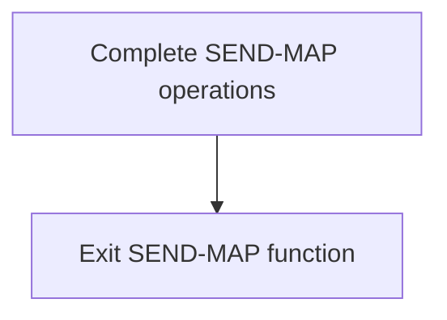

<SwmSnippet path="/src/base/cobol_src/BNK1CRA.cbl" line="867">

---

The <SwmToken path="src/base/cobol_src/BNK1CRA.cbl" pos="868:1:1" line-data="           EXIT.">`EXIT`</SwmToken> statement in the <SwmToken path="src/base/cobol_src/BNK1CRA.cbl" pos="189:3:5" line-data="                 PERFORM SEND-MAP">`SEND-MAP`</SwmToken> function signifies the end of the function's operations. This ensures that once all the necessary actions within the <SwmToken path="src/base/cobol_src/BNK1CRA.cbl" pos="189:3:5" line-data="                 PERFORM SEND-MAP">`SEND-MAP`</SwmToken> function are completed, the control is returned to the calling program or the next logical step in the flow.

```cobol
       SM999.
           EXIT.
```

---

</SwmSnippet>

## <SwmToken path="src/base/cobol_src/BNK1CRA.cbl" pos="290:3:7" line-data="              PERFORM POPULATE-TIME-DATE">`POPULATE-TIME-DATE`</SwmToken>

Lets' zoom into this section of the flow:

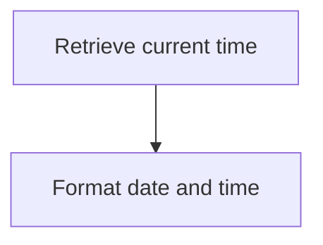

<SwmSnippet path="/src/base/cobol_src/BNK1CRA.cbl" line="1154">

---

First, the <SwmToken path="src/base/cobol_src/BNK1CRA.cbl" pos="290:3:7" line-data="              PERFORM POPULATE-TIME-DATE">`POPULATE-TIME-DATE`</SwmToken> function retrieves the current time using the <SwmToken path="src/base/cobol_src/BNK1CRA.cbl" pos="1154:1:5" line-data="           EXEC CICS ASKTIME">`EXEC CICS ASKTIME`</SwmToken> command. This command stores the current time in the <SwmToken path="src/base/cobol_src/BNK1CRA.cbl" pos="1155:3:7" line-data="              ABSTIME(WS-U-TIME)">`WS-U-TIME`</SwmToken> variable.

```cobol
           EXEC CICS ASKTIME
              ABSTIME(WS-U-TIME)
           END-EXEC.
```

---

</SwmSnippet>

<SwmSnippet path="/src/base/cobol_src/BNK1CRA.cbl" line="1158">

---

Next, the function formats the retrieved time into a human-readable date and time using the <SwmToken path="src/base/cobol_src/BNK1CRA.cbl" pos="1158:1:5" line-data="           EXEC CICS FORMATTIME">`EXEC CICS FORMATTIME`</SwmToken> command. This command takes the <SwmToken path="src/base/cobol_src/BNK1CRA.cbl" pos="1159:3:7" line-data="                     ABSTIME(WS-U-TIME)">`WS-U-TIME`</SwmToken> variable and converts it into <SwmToken path="src/base/cobol_src/BNK1CRA.cbl" pos="1160:3:7" line-data="                     DDMMYYYY(WS-ORIG-DATE)">`WS-ORIG-DATE`</SwmToken> (formatted as DDMMYYYY) and <SwmToken path="src/base/cobol_src/BNK1CRA.cbl" pos="1161:3:7" line-data="                     TIME(WS-TIME-NOW)">`WS-TIME-NOW`</SwmToken> (formatted as time).

```cobol
           EXEC CICS FORMATTIME
                     ABSTIME(WS-U-TIME)
                     DDMMYYYY(WS-ORIG-DATE)
                     TIME(WS-TIME-NOW)
                     DATESEP
           END-EXEC.
```

---

</SwmSnippet>

<SwmSnippet path="/src/base/cobol_src/BNK1CRA.cbl" line="1165">

---

Finally, the function exits, completing the process of populating the current date and time.

```cobol
       PTD999.
           EXIT.
```

---

</SwmSnippet>

## <SwmToken path="src/base/cobol_src/BNK1CRA.cbl" pos="713:3:7" line-data="                 PERFORM ABEND-THIS-TASK">`ABEND-THIS-TASK`</SwmToken>

Lets' zoom into this section of the flow:

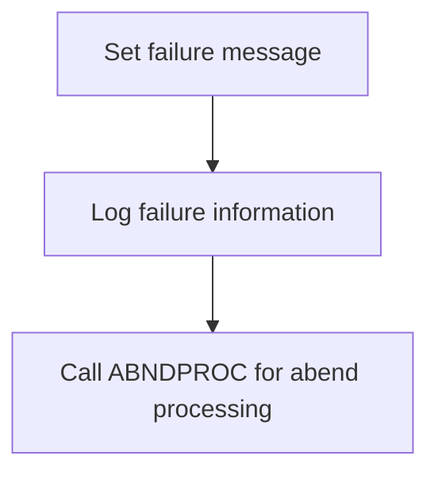

<SwmSnippet path="/src/base/cobol_src/BNK1CRA.cbl" line="969">

---

### Handling abnormal task termination

The <SwmToken path="src/base/cobol_src/BNK1CRA.cbl" pos="713:3:7" line-data="                 PERFORM ABEND-THIS-TASK">`ABEND-THIS-TASK`</SwmToken> function is responsible for handling abnormal task termination. It sets a failure message in <SwmToken path="src/base/cobol_src/BNK1CRA.cbl" pos="708:3:7" line-data="                 INITIALIZE WS-FAIL-INFO">`WS-FAIL-INFO`</SwmToken> to indicate that the task is abending. This message includes the program name, response codes, and a note that the task is abending. The function then logs this failure information for diagnostic purposes. Finally, it calls the <SwmToken path="src/base/cobol_src/BNK1CRA.cbl" pos="164:19:19" line-data="       01 WS-ABEND-PGM                 PIC X(8)      VALUE &#39;ABNDPROC&#39;.">`ABNDPROC`</SwmToken> program to handle the abend processing, which involves capturing and logging various transaction details to help diagnose and resolve the issue.

```cobol
              GO TO VA999
           END-IF.


           IF AMTI(1:AMTL) IS NUMERIC
              COMPUTE WS-AMOUNT-AS-FLOAT =
                 FUNCTION NUMVAL(AMTI(1:AMTL))

              MOVE 'Y' TO VALID-DATA-SW
              GO TO VA999
```

---

</SwmSnippet>

## <SwmToken path="src/base/cobol_src/BNK1CRA.cbl" pos="213:3:7" line-data="                 PERFORM SEND-TERMINATION-MSG">`SEND-TERMINATION-MSG`</SwmToken>

Lets' zoom into this section of the flow:

```mermaid
graph TD
  A[Move EIBRESP2 to ABND-RESP2CODE] --> B[Assign APPLID to ABND-APPLID] --> C[Move EIBTASKN to ABND-TASKNO-KEY] --> D[Move EIBTRNID to ABND-TRANID] --> E[Perform POPULATE-TIME-DATE] --> F[Move WS-ORIG-DATE to ABND-DATE] --> G[Format and move current time to ABND-TIME] --> H[Move WS-U-TIME to ABND-UTIME-KEY] --> I[Move 'HBNK' to ABND-CODE] --> J[Assign PROGRAM to ABND-PROGRAM] --> K[Move ZEROS to ABND-SQLCODE] --> L[Format and move failure message to ABND-FREEFORM] --> M[Link to ABNDPROC program with ABNDINFO-REC] --> N[Initialize WS-FAIL-INFO] --> O[Move failure message to WS-CICS-FAIL-MSG] --> P[Move WS-CICS-RESP to WS-CICS-RESP-DISP] --> Q[Move WS-CICS-RESP2 to WS-CICS-RESP2-DISP] --> R[Perform ABEND-THIS-TASK]

%% Swimm:
%% graph TD
%%   A[Move <SwmToken path="src/base/cobol_src/BNK1CRA.cbl" pos="280:3:3" line-data="              MOVE EIBRESP2   TO ABND-RESP2CODE">`EIBRESP2`</SwmToken> to <SwmToken path="src/base/cobol_src/BNK1CRA.cbl" pos="280:7:9" line-data="              MOVE EIBRESP2   TO ABND-RESP2CODE">`ABND-RESP2CODE`</SwmToken>] --> B[Assign APPLID to <SwmToken path="src/base/cobol_src/BNK1CRA.cbl" pos="284:9:11" line-data="              EXEC CICS ASSIGN APPLID(ABND-APPLID)">`ABND-APPLID`</SwmToken>] --> C[Move EIBTASKN to <SwmToken path="src/base/cobol_src/BNK1CRA.cbl" pos="287:7:11" line-data="              MOVE EIBTASKN   TO ABND-TASKNO-KEY">`ABND-TASKNO-KEY`</SwmToken>] --> D[Move EIBTRNID to <SwmToken path="src/base/cobol_src/BNK1CRA.cbl" pos="288:7:9" line-data="              MOVE EIBTRNID   TO ABND-TRANID">`ABND-TRANID`</SwmToken>] --> E[Perform <SwmToken path="src/base/cobol_src/BNK1CRA.cbl" pos="290:3:7" line-data="              PERFORM POPULATE-TIME-DATE">`POPULATE-TIME-DATE`</SwmToken>] --> F[Move <SwmToken path="src/base/cobol_src/BNK1CRA.cbl" pos="292:3:7" line-data="              MOVE WS-ORIG-DATE TO ABND-DATE">`WS-ORIG-DATE`</SwmToken> to <SwmToken path="src/base/cobol_src/BNK1CRA.cbl" pos="292:11:13" line-data="              MOVE WS-ORIG-DATE TO ABND-DATE">`ABND-DATE`</SwmToken>] --> G[Format and move current time to <SwmToken path="src/base/cobol_src/BNK1CRA.cbl" pos="298:3:5" line-data="                     INTO ABND-TIME">`ABND-TIME`</SwmToken>] --> H[Move <SwmToken path="src/base/cobol_src/BNK1CRA.cbl" pos="301:3:7" line-data="              MOVE WS-U-TIME   TO ABND-UTIME-KEY">`WS-U-TIME`</SwmToken> to <SwmToken path="src/base/cobol_src/BNK1CRA.cbl" pos="301:11:15" line-data="              MOVE WS-U-TIME   TO ABND-UTIME-KEY">`ABND-UTIME-KEY`</SwmToken>] --> I[Move 'HBNK' to <SwmToken path="src/base/cobol_src/BNK1CRA.cbl" pos="302:9:11" line-data="              MOVE &#39;HBNK&#39;      TO ABND-CODE">`ABND-CODE`</SwmToken>] --> J[Assign PROGRAM to <SwmToken path="src/base/cobol_src/BNK1CRA.cbl" pos="690:9:11" line-data="                 EXEC CICS ASSIGN PROGRAM(ABND-PROGRAM)">`ABND-PROGRAM`</SwmToken>] --> K[Move ZEROS to <SwmToken path="src/base/cobol_src/BNK1CRA.cbl" pos="767:7:9" line-data="                 MOVE ZEROS      TO ABND-SQLCODE">`ABND-SQLCODE`</SwmToken>] --> L[Format and move failure message to <SwmToken path="src/base/cobol_src/BNK1CRA.cbl" pos="315:3:5" line-data="                    INTO ABND-FREEFORM">`ABND-FREEFORM`</SwmToken>] --> M[Link to ABNDPROC program with <SwmToken path="src/base/cobol_src/BNK1CRA.cbl" pos="278:3:5" line-data="              INITIALIZE ABNDINFO-REC">`ABNDINFO-REC`</SwmToken>] --> N[Initialize <SwmToken path="src/base/cobol_src/BNK1CRA.cbl" pos="708:3:7" line-data="                 INITIALIZE WS-FAIL-INFO">`WS-FAIL-INFO`</SwmToken>] --> O[Move failure message to <SwmToken path="src/base/cobol_src/BNK1CRA.cbl" pos="710:3:9" line-data="                    TO WS-CICS-FAIL-MSG">`WS-CICS-FAIL-MSG`</SwmToken>] --> P[Move <SwmToken path="src/base/cobol_src/BNK1CRA.cbl" pos="204:3:7" line-data="                    RESP(WS-CICS-RESP)">`WS-CICS-RESP`</SwmToken> to <SwmToken path="src/base/cobol_src/BNK1CRA.cbl" pos="711:11:17" line-data="                 MOVE WS-CICS-RESP  TO WS-CICS-RESP-DISP">`WS-CICS-RESP-DISP`</SwmToken>] --> Q[Move <SwmToken path="src/base/cobol_src/BNK1CRA.cbl" pos="205:3:7" line-data="                    RESP2(WS-CICS-RESP2)">`WS-CICS-RESP2`</SwmToken> to <SwmToken path="src/base/cobol_src/BNK1CRA.cbl" pos="712:11:17" line-data="                 MOVE WS-CICS-RESP2 TO WS-CICS-RESP2-DISP">`WS-CICS-RESP2-DISP`</SwmToken>] --> R[Perform <SwmToken path="src/base/cobol_src/BNK1CRA.cbl" pos="713:3:7" line-data="                 PERFORM ABEND-THIS-TASK">`ABEND-THIS-TASK`</SwmToken>]
```

<SwmSnippet path="/src/base/cobol_src/BNK1CRA.cbl" line="893">

---

First, the function moves the value of <SwmToken path="src/base/cobol_src/BNK1CRA.cbl" pos="893:3:3" line-data="              MOVE EIBRESP2   TO ABND-RESP2CODE">`EIBRESP2`</SwmToken> (which holds the response code from the last CICS command) to <SwmToken path="src/base/cobol_src/BNK1CRA.cbl" pos="893:7:9" line-data="              MOVE EIBRESP2   TO ABND-RESP2CODE">`ABND-RESP2CODE`</SwmToken>.

```cobol
              MOVE EIBRESP2   TO ABND-RESP2CODE
```

---

</SwmSnippet>

<SwmSnippet path="/src/base/cobol_src/BNK1CRA.cbl" line="897">

---

Next, it assigns the application ID to <SwmToken path="src/base/cobol_src/BNK1CRA.cbl" pos="897:9:11" line-data="              EXEC CICS ASSIGN APPLID(ABND-APPLID)">`ABND-APPLID`</SwmToken> to capture the current application context.

```cobol
              EXEC CICS ASSIGN APPLID(ABND-APPLID)
              END-EXEC
```

---

</SwmSnippet>

<SwmSnippet path="/src/base/cobol_src/BNK1CRA.cbl" line="900">

---

Moving to the next step, the function captures the task number and transaction ID by moving <SwmToken path="src/base/cobol_src/BNK1CRA.cbl" pos="900:3:3" line-data="              MOVE EIBTASKN   TO ABND-TASKNO-KEY">`EIBTASKN`</SwmToken> and <SwmToken path="src/base/cobol_src/BNK1CRA.cbl" pos="901:3:3" line-data="              MOVE EIBTRNID   TO ABND-TRANID">`EIBTRNID`</SwmToken> to <SwmToken path="src/base/cobol_src/BNK1CRA.cbl" pos="900:7:11" line-data="              MOVE EIBTASKN   TO ABND-TASKNO-KEY">`ABND-TASKNO-KEY`</SwmToken> and <SwmToken path="src/base/cobol_src/BNK1CRA.cbl" pos="901:7:9" line-data="              MOVE EIBTRNID   TO ABND-TRANID">`ABND-TRANID`</SwmToken> respectively.

```cobol
              MOVE EIBTASKN   TO ABND-TASKNO-KEY
              MOVE EIBTRNID   TO ABND-TRANID

```

---

</SwmSnippet>

<SwmSnippet path="/src/base/cobol_src/BNK1CRA.cbl" line="903">

---

Then, it performs the <SwmToken path="src/base/cobol_src/BNK1CRA.cbl" pos="903:3:7" line-data="              PERFORM POPULATE-TIME-DATE">`POPULATE-TIME-DATE`</SwmToken> routine to get the current date and time.

```cobol
              PERFORM POPULATE-TIME-DATE
```

---

</SwmSnippet>

<SwmSnippet path="/src/base/cobol_src/BNK1CRA.cbl" line="905">

---

After that, the function moves the original date to <SwmToken path="src/base/cobol_src/BNK1CRA.cbl" pos="905:11:13" line-data="              MOVE WS-ORIG-DATE TO ABND-DATE">`ABND-DATE`</SwmToken> and formats the current time into <SwmToken path="src/base/cobol_src/BNK1CRA.cbl" pos="911:3:5" line-data="                     INTO ABND-TIME">`ABND-TIME`</SwmToken>.

```cobol
              MOVE WS-ORIG-DATE TO ABND-DATE
              STRING WS-TIME-NOW-GRP-HH DELIMITED BY SIZE,
                    ':' DELIMITED BY SIZE,
                     WS-TIME-NOW-GRP-MM DELIMITED BY SIZE,
                     ':' DELIMITED BY SIZE,
                     WS-TIME-NOW-GRP-MM DELIMITED BY SIZE
                     INTO ABND-TIME
```

---

</SwmSnippet>

<SwmSnippet path="/src/base/cobol_src/BNK1CRA.cbl" line="914">

---

Next, it moves the user time to <SwmToken path="src/base/cobol_src/BNK1CRA.cbl" pos="914:11:15" line-data="              MOVE WS-U-TIME   TO ABND-UTIME-KEY">`ABND-UTIME-KEY`</SwmToken> and sets the code 'HBNK' to <SwmToken path="src/base/cobol_src/BNK1CRA.cbl" pos="915:9:11" line-data="              MOVE &#39;HBNK&#39;      TO ABND-CODE">`ABND-CODE`</SwmToken>.

```cobol
              MOVE WS-U-TIME   TO ABND-UTIME-KEY
              MOVE 'HBNK'      TO ABND-CODE
```

---

</SwmSnippet>

<SwmSnippet path="/src/base/cobol_src/BNK1CRA.cbl" line="917">

---

The function then assigns the current program name to <SwmToken path="src/base/cobol_src/BNK1CRA.cbl" pos="917:9:11" line-data="              EXEC CICS ASSIGN PROGRAM(ABND-PROGRAM)">`ABND-PROGRAM`</SwmToken> and initializes <SwmToken path="src/base/cobol_src/BNK1CRA.cbl" pos="920:7:9" line-data="              MOVE ZEROS      TO ABND-SQLCODE">`ABND-SQLCODE`</SwmToken> to zero.

```cobol
              EXEC CICS ASSIGN PROGRAM(ABND-PROGRAM)
              END-EXEC

              MOVE ZEROS      TO ABND-SQLCODE
```

---

</SwmSnippet>

<SwmSnippet path="/src/base/cobol_src/BNK1CRA.cbl" line="922">

---

Following this, it formats a failure message and moves it to <SwmToken path="src/base/cobol_src/BNK1CRA.cbl" pos="928:3:5" line-data="                    INTO ABND-FREEFORM">`ABND-FREEFORM`</SwmToken>.

```cobol
              STRING 'STM010 - SEND TEXT FAIL.'
                    DELIMITED BY SIZE,
                    'EIBRESP=' DELIMITED BY SIZE,
                    ABND-RESPCODE DELIMITED BY SIZE,
                    ' RESP2=' DELIMITED BY SIZE,
                    ABND-RESP2CODE DELIMITED BY SIZE
                    INTO ABND-FREEFORM
```

---

</SwmSnippet>

<SwmSnippet path="/src/base/cobol_src/BNK1CRA.cbl" line="931">

---

Finally, the function links to the <SwmToken path="src/base/cobol_src/BNK1CRA.cbl" pos="164:19:19" line-data="       01 WS-ABEND-PGM                 PIC X(8)      VALUE &#39;ABNDPROC&#39;.">`ABNDPROC`</SwmToken> program with <SwmToken path="src/base/cobol_src/BNK1CRA.cbl" pos="932:3:5" line-data="                        COMMAREA(ABNDINFO-REC)">`ABNDINFO-REC`</SwmToken>, initializes <SwmToken path="src/base/cobol_src/BNK1CRA.cbl" pos="935:3:7" line-data="              INITIALIZE WS-FAIL-INFO">`WS-FAIL-INFO`</SwmToken>, sets the failure message, and performs the <SwmToken path="src/base/cobol_src/BNK1CRA.cbl" pos="940:3:7" line-data="              PERFORM ABEND-THIS-TASK">`ABEND-THIS-TASK`</SwmToken> routine.

More about ABNDPROC: <SwmLink doc-title="Writing Abend Records (ABNDPROC)">[Writing Abend Records (ABNDPROC)](/.swm/writing-abend-records-abndproc.svfj4jn5.sw.md)</SwmLink>

```cobol
              EXEC CICS LINK PROGRAM(WS-ABEND-PGM)
                        COMMAREA(ABNDINFO-REC)
              END-EXEC

              INITIALIZE WS-FAIL-INFO
              MOVE 'BNK1CRA - STM010 - SEND TEXT FAIL'
                 TO WS-CICS-FAIL-MSG
              MOVE WS-CICS-RESP  TO WS-CICS-RESP-DISP
              MOVE WS-CICS-RESP2 TO WS-CICS-RESP2-DISP
              PERFORM ABEND-THIS-TASK
```

---

</SwmSnippet>

## <SwmToken path="src/base/cobol_src/BNK1CRA.cbl" pos="235:3:5" line-data="                 PERFORM PROCESS-MAP">`PROCESS-MAP`</SwmToken>

Lets' zoom into this section of the flow:

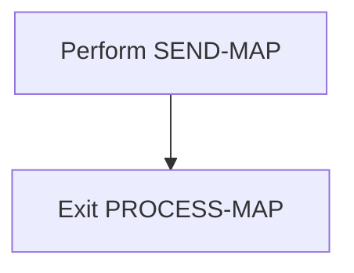

<SwmSnippet path="/src/base/cobol_src/BNK1CRA.cbl" line="359">

---

First, the <SwmToken path="src/base/cobol_src/BNK1CRA.cbl" pos="235:3:5" line-data="                 PERFORM PROCESS-MAP">`PROCESS-MAP`</SwmToken> function performs the <SwmToken path="src/base/cobol_src/BNK1CRA.cbl" pos="359:3:5" line-data="           PERFORM SEND-MAP.">`SEND-MAP`</SwmToken> operation. This operation is responsible for sending the processed data to be displayed on the screen, ensuring that the user can view the updated information.

```cobol
           PERFORM SEND-MAP.
```

---

</SwmSnippet>

<SwmSnippet path="/src/base/cobol_src/BNK1CRA.cbl" line="361">

---

Next, the function reaches the <SwmToken path="src/base/cobol_src/BNK1CRA.cbl" pos="361:1:1" line-data="       PM999.">`PM999`</SwmToken> label and exits the <SwmToken path="src/base/cobol_src/BNK1CRA.cbl" pos="235:3:5" line-data="                 PERFORM PROCESS-MAP">`PROCESS-MAP`</SwmToken> function. This marks the end of the data display process, allowing the program to continue with other operations.

```cobol
       PM999.
           EXIT.
```

---

</SwmSnippet>

## <SwmToken path="src/base/cobol_src/BNK1CRA.cbl" pos="365:1:3" line-data="       RECEIVE-MAP SECTION.">`RECEIVE-MAP`</SwmToken>

Lets' zoom into this section of the flow:

```mermaid
graph TD
  A[Receive user input] --> B{Check response}
  B -- Normal response --> C[Continue processing]
  B -- Error response --> D[Initialize error handling]
  D --> E[Capture error details]
  E --> F[Log error information]
  F --> G[Link to error handler program]
```

<SwmSnippet path="/src/base/cobol_src/BNK1CRA.cbl" line="365">

---

### Receiving user input

First, the <SwmToken path="src/base/cobol_src/BNK1CRA.cbl" pos="365:1:3" line-data="       RECEIVE-MAP SECTION.">`RECEIVE-MAP`</SwmToken> section retrieves the data from the user interface using the <SwmToken path="src/base/cobol_src/BNK1CRA.cbl" pos="371:1:3" line-data="              RECEIVE MAP(&#39;BNK1CD&#39;)">`RECEIVE MAP`</SwmToken> command.

```cobol
       RECEIVE-MAP SECTION.
       RM010.
      *
      *    Retrieve the data
      *
           EXEC CICS
              RECEIVE MAP('BNK1CD')
              MAPSET('BNK1CDM')
              INTO(BNK1CDI)
              RESP(WS-CICS-RESP)
              RESP2(WS-CICS-RESP2)
           END-EXEC.
```

---

</SwmSnippet>

<SwmSnippet path="/src/base/cobol_src/BNK1CRA.cbl" line="378">

---

### Checking response

Next, it checks if the response (<SwmToken path="src/base/cobol_src/BNK1CRA.cbl" pos="378:3:7" line-data="           IF WS-CICS-RESP NOT = DFHRESP(NORMAL)">`WS-CICS-RESP`</SwmToken>) is normal. If the response is not normal, it proceeds to handle the error.

```cobol
           IF WS-CICS-RESP NOT = DFHRESP(NORMAL)
```

---

</SwmSnippet>

<SwmSnippet path="/src/base/cobol_src/BNK1CRA.cbl" line="385">

---

### Initializing error handling

If an error is detected, the program initializes the <SwmToken path="src/base/cobol_src/BNK1CRA.cbl" pos="385:3:5" line-data="              INITIALIZE ABNDINFO-REC">`ABNDINFO-REC`</SwmToken> structure to store error details.

```cobol
              INITIALIZE ABNDINFO-REC
```

---

</SwmSnippet>

<SwmSnippet path="/src/base/cobol_src/BNK1CRA.cbl" line="386">

---

### Capturing error details

The program captures various error details such as response codes, application ID, task number, and transaction ID.

```cobol
              MOVE EIBRESP    TO ABND-RESPCODE
              MOVE EIBRESP2   TO ABND-RESP2CODE
      *
      *       Get supplemental information
      *
              EXEC CICS ASSIGN APPLID(ABND-APPLID)
              END-EXEC

              MOVE EIBTASKN   TO ABND-TASKNO-KEY
              MOVE EIBTRNID   TO ABND-TRANID
```

---

</SwmSnippet>

<SwmSnippet path="/src/base/cobol_src/BNK1CRA.cbl" line="416">

---

### Logging error information

It then logs the error information by populating the <SwmToken path="src/base/cobol_src/BNK1CRA.cbl" pos="422:3:5" line-data="                    INTO ABND-FREEFORM">`ABND-FREEFORM`</SwmToken> field with a descriptive error message.

```cobol
              STRING 'RM010 - RECEIVE MAP FAIL.'
                    DELIMITED BY SIZE,
                    'EIBRESP=' DELIMITED BY SIZE,
                    ABND-RESPCODE DELIMITED BY SIZE,
                    ' RESP2=' DELIMITED BY SIZE,
                    ABND-RESP2CODE DELIMITED BY SIZE
                    INTO ABND-FREEFORM
```

---

</SwmSnippet>

<SwmSnippet path="/src/base/cobol_src/BNK1CRA.cbl" line="425">

---

### Linking to error handler program

Finally, the program links to the error handler program (<SwmToken path="src/base/cobol_src/BNK1CRA.cbl" pos="425:9:13" line-data="              EXEC CICS LINK PROGRAM(WS-ABEND-PGM)">`WS-ABEND-PGM`</SwmToken>) to handle the abnormal termination.

```cobol
              EXEC CICS LINK PROGRAM(WS-ABEND-PGM)
                        COMMAREA(ABNDINFO-REC)
              END-EXEC
```

---

</SwmSnippet>

## <SwmToken path="src/base/cobol_src/BNK1CRA.cbl" pos="344:3:5" line-data="           PERFORM EDIT-DATA.">`EDIT-DATA`</SwmToken>

Lets' zoom into this section of the flow:

```mermaid
graph TD
  A[Validate Account Number Format] --> B{Is Account Number Numeric?}
  B -- No --> C[Set Error Message for Account Number]
  B -- Yes --> D{Is Account Number Non-Zero?}
  D -- No --> E[Set Error Message for Non-Zero Account Number]
  D -- Yes --> F{Is Sign Indicator Valid?}
  F -- No --> G[Set Error Message for Sign Indicator]
  F -- Yes --> H[Validate Amount Entered]
```

First, the function performs validation on the incoming fields to ensure the data integrity.

<SwmSnippet path="/src/base/cobol_src/BNK1CRA.cbl" line="446">

---

Moving to the account number validation, it checks if the account number is numeric using the <SwmToken path="src/base/cobol_src/BNK1CRA.cbl" pos="446:1:1" line-data="           EXEC CICS BIF">`EXEC`</SwmToken>` `<SwmToken path="src/base/cobol_src/BNK1CRA.cbl" pos="446:3:3" line-data="           EXEC CICS BIF">`CICS`</SwmToken>` `<SwmToken path="src/base/cobol_src/BNK1CRA.cbl" pos="446:5:5" line-data="           EXEC CICS BIF">`BIF`</SwmToken>` `<SwmToken path="src/base/cobol_src/BNK1CRA.cbl" pos="447:1:1" line-data="              DEEDIT FIELD(ACCNOI)">`DEEDIT`</SwmToken> command.

```cobol
           EXEC CICS BIF
              DEEDIT FIELD(ACCNOI)
           END-EXEC.
```

---

</SwmSnippet>

<SwmSnippet path="/src/base/cobol_src/BNK1CRA.cbl" line="450">

---

Next, if the account number is not numeric, an error message 'Please enter an account number.' is set, and the data validity switch is updated to 'N'.

```cobol
           IF ACCNOI NOT NUMERIC
              MOVE 'Please enter an account number.  ' TO
                 MESSAGEO
              MOVE 'N' TO VALID-DATA-SW
              GO TO ED999
           END-IF.
```

---

</SwmSnippet>

<SwmSnippet path="/src/base/cobol_src/BNK1CRA.cbl" line="457">

---

Then, it checks if the account number is zero. If it is, an error message 'Please enter a non zero account number.' is set, and the data validity switch is updated to 'N'.

```cobol
           IF ACCNOI = ZERO
              MOVE 'Please enter a non zero account number.   ' TO
                 MESSAGEO
              MOVE 'N' TO VALID-DATA-SW
              GO TO ED999
           END-IF.
```

---

</SwmSnippet>

<SwmSnippet path="/src/base/cobol_src/BNK1CRA.cbl" line="464">

---

Going into the sign indicator validation, it ensures that the sign indicator is either '+' or '-' and that the sign length is 1. If not, an error message 'Please enter + or - preceding the amount' is set, and the data validity switch is updated to 'N'.

```cobol
           IF SIGNI NOT = '+' AND SIGNI NOT = '-' AND SIGNL = 1
              MOVE 'Please enter + or - preceding the amount ' TO
                 MESSAGEO
              MOVE 'N' TO VALID-DATA-SW
              GO TO ED999
           END-IF.
```

---

</SwmSnippet>

<SwmSnippet path="/src/base/cobol_src/BNK1CRA.cbl" line="474">

---

Finally, the function calls the <SwmToken path="src/base/cobol_src/BNK1CRA.cbl" pos="474:3:5" line-data="           PERFORM VALIDATE-AMOUNT.">`VALIDATE-AMOUNT`</SwmToken> section to validate the amount entered by the user.

```cobol
           PERFORM VALIDATE-AMOUNT.
```

---

</SwmSnippet>

## <SwmToken path="src/base/cobol_src/BNK1CRA.cbl" pos="474:3:5" line-data="           PERFORM VALIDATE-AMOUNT.">`VALIDATE-AMOUNT`</SwmToken>

Lets' zoom into this section of the flow:

```mermaid
graph TD
  A[Check if amount is zero] -->|Yes| B[Set error message and invalid flag]
  A -->|No| C[Check if amount is numeric]
  C -->|Yes| D[Convert amount to float and set valid flag]
  C -->|No| E[Check for leading spaces]
  E -->|All spaces| F[Set error message and invalid flag]
  E -->|Not all spaces| G[Remove leading spaces and reverse amount]
  G --> H[Check for embedded spaces]
  H -->|Yes| I[Set error message and invalid flag]
  H -->|No| J[Check for valid characters]
  J -->|Invalid characters| K[Set error message and invalid flag]
  J -->|Valid characters| L[Check for decimal points]
  L -->|More than one| M[Set error message and invalid flag]
  L -->|One or none| N[Check for too many decimals]
  N -->|More than two| O[Set error message and invalid flag]
  N -->|Two or less| P[Convert amount to float]
  P --> Q[Check if amount is zero]
  Q -->|Yes| R[Set error message and invalid flag]
  Q -->|No| S[Set valid flag]
```

<SwmSnippet path="/src/base/cobol_src/BNK1CRA.cbl" line="964">

---

First, the function checks if the amount entered is zero. If it is, an error message is set, the data validity switch is marked as invalid, and the amount is set to -1.

```cobol
           IF AMTL = ZERO
              MOVE 'The Amount entered must be numeric.' TO
                 MESSAGEO
              MOVE 'N' TO VALID-DATA-SW
              MOVE -1 TO AMTL
              GO TO VA999
           END-IF.
```

---

</SwmSnippet>

<SwmSnippet path="/src/base/cobol_src/BNK1CRA.cbl" line="973">

---

Next, the function checks if the amount entered is numeric. If it is, the amount is converted to a float, and the data validity switch is marked as valid.

```cobol
           IF AMTI(1:AMTL) IS NUMERIC
              COMPUTE WS-AMOUNT-AS-FLOAT =
                 FUNCTION NUMVAL(AMTI(1:AMTL))

              MOVE 'Y' TO VALID-DATA-SW
              GO TO VA999
           END-IF.
```

---

</SwmSnippet>

<SwmSnippet path="/src/base/cobol_src/BNK1CRA.cbl" line="981">

---

If the amount is not numeric, the function checks for leading spaces. If the entire amount is spaces, an error message is set, the data validity switch is marked as invalid, and the amount is set to -1.

```cobol
           MOVE ZERO TO WS-NUM-COUNT-TOTAL.
           INSPECT AMTI(1:AMTL) TALLYING WS-NUM-COUNT-TOTAL
              FOR LEADING SPACES.

      *
      *    It is entirely spaces
      *
           IF WS-NUM-COUNT-TOTAL = AMTL
              MOVE 'The Amount entered must be numeric.' TO
                 MESSAGEO
              MOVE 'N' TO VALID-DATA-SW
              MOVE -1 TO AMTL
              GO TO VA999
           END-IF.
```

---

</SwmSnippet>

<SwmSnippet path="/src/base/cobol_src/BNK1CRA.cbl" line="996">

---

If the amount is not entirely spaces, the function removes leading spaces and reverses the amount string.

```cobol
           COMPUTE WS-AMOUNT-UNSTR-L = AMTL - WS-NUM-COUNT-TOTAL.

           IF WS-NUM-COUNT-TOTAL = ZERO
              MOVE SPACES TO WS-AMOUNT-UNSTR
              UNSTRING AMTI(1:AMTL)
                 INTO WS-AMOUNT-UNSTR
           ELSE
              MOVE SPACES TO WS-AMOUNT-UNSTR
              ADD 1 TO WS-NUM-COUNT-TOTAL GIVING WS-NUM-COUNT-TOTAL
              UNSTRING AMTI(WS-NUM-COUNT-TOTAL:AMTL)
                 INTO WS-AMOUNT-UNSTR
           END-IF.

           MOVE ZERO TO WS-NUM-COUNT-TOTAL.

           MOVE FUNCTION REVERSE(WS-AMOUNT-UNSTR(1:WS-AMOUNT-UNSTR-L))
              TO WS-AMOUNT-UNSTR-REVERSE
```

---

</SwmSnippet>

<SwmSnippet path="/src/base/cobol_src/BNK1CRA.cbl" line="1044">

---

The function then checks for embedded spaces. If there are any, an error message is set, the data validity switch is marked as invalid, and the amount is set to -1.

```cobol
           IF WS-NUM-COUNT-SPACE > 0
              MOVE SPACES TO MESSAGEO
              STRING
                 'Please supply a numeric amount without embedded'
                  DELIMITED BY SIZE,
                  ' spaces.' DELIMITED BY SPACES
              INTO MESSAGEO
              MOVE 'N' TO VALID-DATA-SW
              MOVE -1 TO AMTL
              GO TO VA999
```

---

</SwmSnippet>

<SwmSnippet path="/src/base/cobol_src/BNK1CRA.cbl" line="1056">

---

If there are no embedded spaces, the function checks for valid characters. If there are any invalid characters, an error message is set, the data validity switch is marked as invalid, and the amount is set to -1.

```cobol
           IF WS-NUM-COUNT-TOTAL < WS-AMOUNT-UNSTR-L
              MOVE SPACES TO MESSAGEO
              STRING 'Please supply a numeric amount.'
                 DELIMITED BY SIZE,
                 INTO MESSAGEO
              MOVE 'N' TO VALID-DATA-SW
              MOVE -1 TO AMTL
              GO TO VA999
           END-IF.
```

---

</SwmSnippet>

<SwmSnippet path="/src/base/cobol_src/BNK1CRA.cbl" line="1069">

---

The function then checks for the presence of decimal points. If there is more than one decimal point, an error message is set, the data validity switch is marked as invalid, and the amount is set to -1.

```cobol
           MOVE ZERO TO WS-NUM-COUNT-POINT
           INSPECT WS-AMOUNT-UNSTR(1:WS-AMOUNT-UNSTR-L)
             TALLYING
             WS-NUM-COUNT-POINT FOR ALL '.'.

           IF WS-NUM-COUNT-POINT > 1
              MOVE SPACES TO MESSAGEO
              STRING 'Use one decimal point for amount only.'
                 DELIMITED BY SIZE,
              INTO MESSAGEO

              MOVE 'N' TO VALID-DATA-SW
              MOVE -1 TO AMTL
              GO TO VA999
           END-IF.
```

---

</SwmSnippet>

<SwmSnippet path="/src/base/cobol_src/BNK1CRA.cbl" line="1088">

---

If there is one decimal point, the function checks for too many decimals. If there are more than two decimals, an error message is set, the data validity switch is marked as invalid, and the amount is set to -1.

```cobol
           IF WS-NUM-COUNT-POINT = 1
              MOVE ZERO TO WS-NUM-COUNT-TOTAL
              INSPECT WS-AMOUNT-UNSTR(1:WS-AMOUNT-UNSTR-L)
                 TALLYING WS-NUM-COUNT-TOTAL FOR CHARACTERS AFTER '.'

              IF WS-NUM-COUNT-TOTAL > 2
                 MOVE ZERO TO WS-NUM-COUNT-TOTAL WS-NUM-COUNT-POINT
                 INSPECT WS-AMOUNT-UNSTR(1:WS-AMOUNT-UNSTR-L)
                 TALLYING
                    WS-NUM-COUNT-POINT FOR CHARACTERS BEFORE '.'
                 ADD 2 TO WS-NUM-COUNT-POINT GIVING WS-NUM-COUNT-POINT

                 INSPECT
                 WS-AMOUNT-UNSTR(WS-NUM-COUNT-POINT:WS-AMOUNT-UNSTR-L)
                    TALLYING WS-NUM-COUNT-TOTAL FOR ALL '0'
                    WS-NUM-COUNT-TOTAL FOR ALL '1'
                    WS-NUM-COUNT-TOTAL FOR ALL '2'
                    WS-NUM-COUNT-TOTAL FOR ALL '3'
                    WS-NUM-COUNT-TOTAL FOR ALL '4'
                    WS-NUM-COUNT-TOTAL FOR ALL '5'
                    WS-NUM-COUNT-TOTAL FOR ALL '6'
```

---

</SwmSnippet>

<SwmSnippet path="/src/base/cobol_src/BNK1CRA.cbl" line="1130">

---

Finally, the function converts the amount to a float and checks if the amount is zero. If it is, an error message is set, the data validity switch is marked as invalid, and the amount is set to -1.

```cobol
           COMPUTE WS-AMOUNT-AS-FLOAT =
              FUNCTION NUMVAL(WS-AMOUNT-UNSTR(1:WS-AMOUNT-UNSTR-L)).

           IF WS-AMOUNT-AS-FLOAT = ZERO
              MOVE SPACES TO MESSAGEO
              STRING
                 'Please supply a non-zero amount.'
                 DELIMITED BY SIZE,
              INTO MESSAGEO
              MOVE 'N' TO VALID-DATA-SW
              MOVE -1 TO AMTL
              GO TO VA999
           END-IF.
```

---

</SwmSnippet>

<SwmSnippet path="/src/base/cobol_src/BNK1CRA.cbl" line="1144">

---

If all validations pass, the data validity switch is marked as valid.

```cobol
           MOVE SPACES TO MESSAGEO.
           MOVE 'Y' TO VALID-DATA-SW.
```

---

</SwmSnippet>

## <SwmToken path="src/base/cobol_src/BNK1CRA.cbl" pos="351:3:7" line-data="              PERFORM UPD-CRED-DATA">`UPD-CRED-DATA`</SwmToken>

Lets' zoom into this section of the flow:

```mermaid
graph TD
  A[Inquire Association] --> B[Link to DBCRFUN]
  B --> C{Check Response}
  C -->|Normal| D[Check Transaction Success]
  C -->|Not Normal| E[Handle ABEND]
  D -->|Success| F[Set Success Message]
  D -->|Failure| G[Set Failure Message]
  F --> H[Update Display]
  G --> H
  E --> I[Link to ABEND Handler]
```

<SwmSnippet path="/src/base/cobol_src/BNK1CRA.cbl" line="503">

---

First, the function inquires the association details such as application ID, user ID, facility name, network ID, and facility type.

```cobol
           EXEC CICS INQUIRE ASSOCIATION(EIBTASKN)
               ODAPPLID(SUBPGM-APPLID)
               ODUSERID(SUBPGM-USERID)
               ODFACILNAME(SUBPGM-FACILITY-NAME)
               ODNETWORKID(SUBPGM-NETWRK-ID)
               ODFACILTYPE(SUBPGM-FACILTYPE)
           END-EXEC.
```

---

</SwmSnippet>

<SwmSnippet path="/src/base/cobol_src/BNK1CRA.cbl" line="511">

---

Next, it links to the <SwmToken path="src/base/cobol_src/BNK1CRA.cbl" pos="512:4:4" line-data="              PROGRAM(&#39;DBCRFUN&#39;)">`DBCRFUN`</SwmToken> program to process the debit or credit transaction.

```cobol
           EXEC CICS LINK
              PROGRAM('DBCRFUN')
              COMMAREA(SUBPGM-PARMS)
              RESP(WS-CICS-RESP)
              RESP2(WS-CICS-RESP2)
              SYNCONRETURN
           END-EXEC.
```

---

</SwmSnippet>

<SwmSnippet path="/src/base/cobol_src/BNK1CRA.cbl" line="519">

---

Moving to the response check, if the response is not normal, it initializes the ABEND information record and gathers supplemental information such as application ID, task number, transaction ID, date, and time.

More about DBCRFUN: <SwmLink doc-title="Updating Account Records (DBCRFUN)">[Updating Account Records (DBCRFUN)](/.swm/updating-account-records-dbcrfun.epfk3drn.sw.md)</SwmLink>

```cobol
           IF WS-CICS-RESP NOT = DFHRESP(NORMAL)
      *
      *       Preserve the RESP and RESP2, then set up the
      *       standard ABEND info before getting the applid,
      *       date/time etc. and linking to the Abend Handler
      *       program.
      *
              INITIALIZE ABNDINFO-REC
              MOVE EIBRESP    TO ABND-RESPCODE
              MOVE EIBRESP2   TO ABND-RESP2CODE
      *
      *       Get supplemental information
      *
              EXEC CICS ASSIGN APPLID(ABND-APPLID)
              END-EXEC

              MOVE EIBTASKN   TO ABND-TASKNO-KEY
              MOVE EIBTRNID   TO ABND-TRANID

              PERFORM POPULATE-TIME-DATE

```

---

</SwmSnippet>

<SwmSnippet path="/src/base/cobol_src/BNK1CRA.cbl" line="566">

---

Then, it links to the ABEND handler program to handle the abnormal termination.

```cobol
              EXEC CICS LINK PROGRAM(WS-ABEND-PGM)
                        COMMAREA(ABNDINFO-REC)
              END-EXEC
```

---

</SwmSnippet>

<SwmSnippet path="/src/base/cobol_src/BNK1CRA.cbl" line="623">

---

If the transaction was successful, it sets the success message indicating that the amount was successfully applied to the account.

More about ABNDPROC: <SwmLink doc-title="Writing Abend Records (ABNDPROC)">[Writing Abend Records (ABNDPROC)](/.swm/writing-abend-records-abndproc.svfj4jn5.sw.md)</SwmLink>

```cobol
              MOVE SPACES TO MESSAGEO
              MOVE 'Amount successfully applied to the account.' TO
                 MESSAGEO
           END-IF.
```

---

</SwmSnippet>

<SwmSnippet path="/src/base/cobol_src/BNK1CRA.cbl" line="585">

---

If the transaction failed, it evaluates the failure code and sets the appropriate failure message based on the reason for the failure.

```cobol
              EVALUATE SUBPGM-FAIL-CODE
                 WHEN '1'
                    MOVE SPACES TO MESSAGEO
                    STRING 'Sorry but the ACCOUNT no was not found'
                           ' for SORTCODE '
                           SUBPGM-SORTC
                           ' . Amount not applied. '
                           DELIMITED BY SIZE
                           INTO MESSAGEO
                    GO TO UCD999

                 WHEN '2'
                    MOVE SPACES TO MESSAGEO
                    STRING 'Sorry but the AMOUNT could not be applied'
                           ' due to an unexpected error.'
                           DELIMITED BY SIZE
                           INTO MESSAGEO
                    GO TO UCD999

                 WHEN '3'
                    MOVE SPACES TO MESSAGEO
```

---

</SwmSnippet>

<SwmSnippet path="/src/base/cobol_src/BNK1CRA.cbl" line="631">

---

Finally, it updates the display with the account number, sort code, actual balance, and available balance.

```cobol
           MOVE SUBPGM-ACCNO       TO ACCNOO.
           MOVE SUBPGM-SORTC       TO SORTCO.

           MOVE SUBPGM-ACT-BAL    TO ACTUAL-BALANCE-DISPLAY.
           MOVE SUBPGM-AV-BAL     TO AVAILABLE-BALANCE-DISPLAY.
           MOVE ACTUAL-BALANCE-DISPLAY      TO ACTBALO.
           MOVE AVAILABLE-BALANCE-DISPLAY   TO AVBALO.
```

---

</SwmSnippet>

&nbsp;

*This is an auto-generated document by Swimm 🌊 and has not yet been verified by a human*

<SwmMeta version="3.0.0" repo-id="Z2l0aHViJTNBJTNBY2ljcy1iYW5raW5nLXNhbXBsZS1hcHBsaWNhdGlvbi1jYnNhLUlCTS1EZW1vJTNBJTNBU3dpbW0tRGVtbw==" repo-name="cics-banking-sample-application-cbsa-IBM-Demo"><sup>Powered by [Swimm](/)</sup></SwmMeta>
