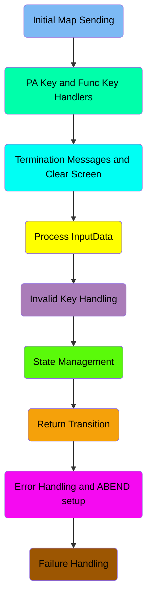
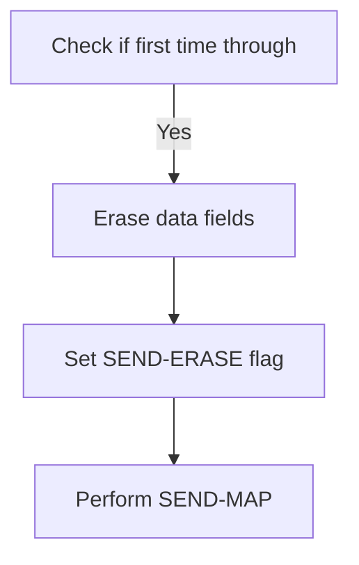
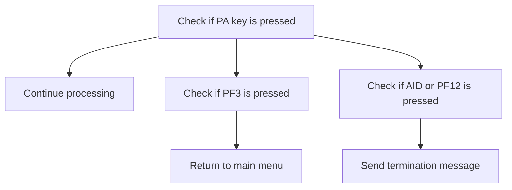
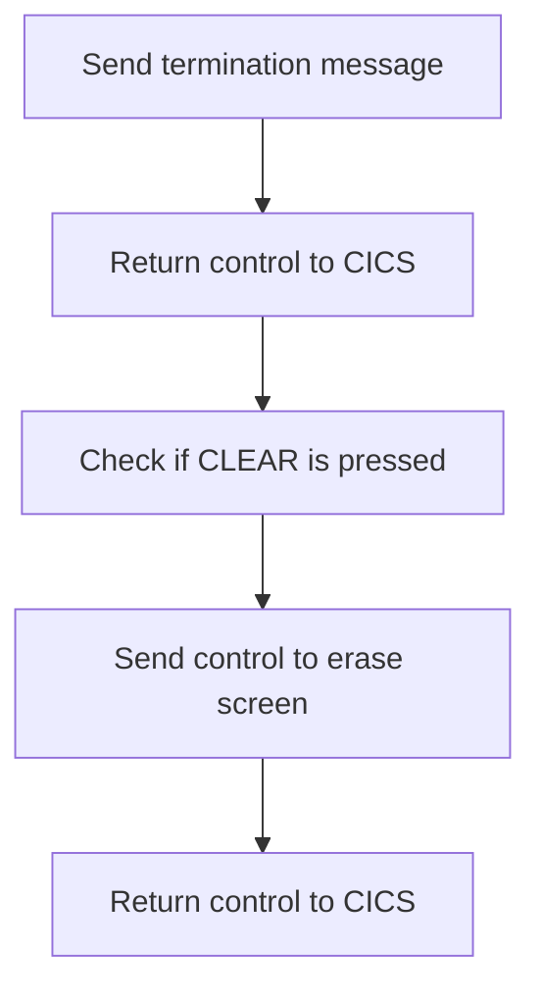
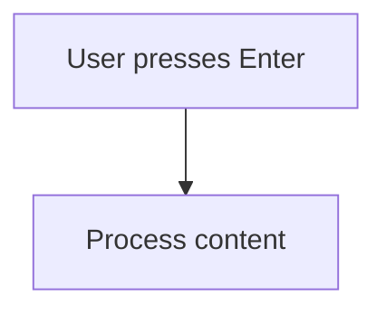
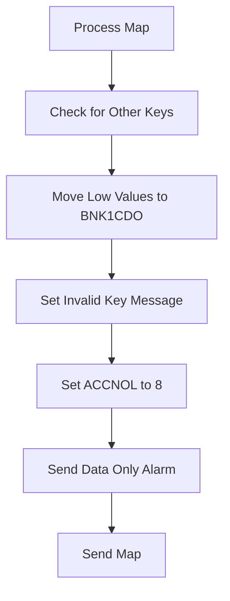
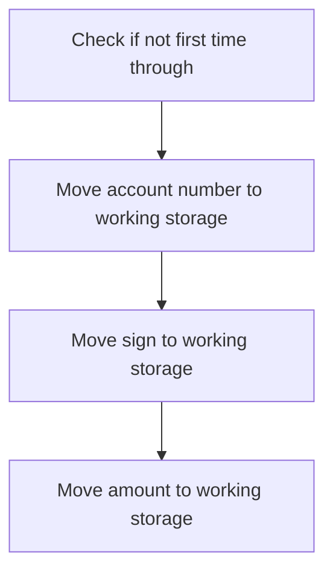
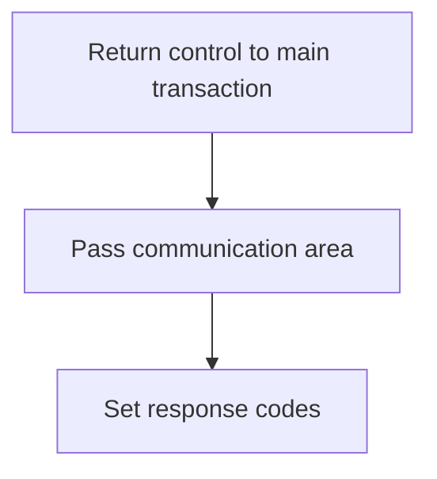
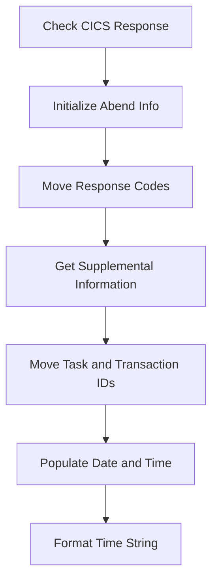
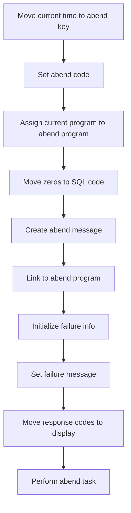

The <SwmToken path="src/base/cobol_src/BNK1CRA.cbl" pos="16:6:6" line-data="       PROGRAM-ID. BNK1CRA.">`BNK1CRA`</SwmToken> program is responsible for handling various user interactions and managing the state of the application. It achieves this by processing input data, handling key presses, managing state transitions, and dealing with errors and failures.

The flow involves several steps: sending the initial map, handling PA and function keys, processing input data, managing state, handling errors, and dealing with failures. Each step ensures that the application responds correctly to user actions and maintains its state accurately.

Here is a high level diagram of the program:



## Initial Map Sending

First, we'll zoom into this section of the flow:



<SwmSnippet path="/src/base/cobol_src/BNK1CRA.cbl" line="180">

---

First, the program checks if it is the first time through by evaluating if <SwmToken path="src/base/cobol_src/BNK1CRA.cbl" pos="185:3:3" line-data="              WHEN EIBCALEN = ZERO">`EIBCALEN`</SwmToken> (which indicates the length of the communication area) is zero. If it is, this means that the screen should be initialized with empty data fields.

```cobol
           EVALUATE TRUE
      *
      *       Is it the first time through? If so, send the map
      *       with erased (empty) data fields.
      *
              WHEN EIBCALEN = ZERO
```

---

</SwmSnippet>

<SwmSnippet path="/src/base/cobol_src/BNK1CRA.cbl" line="186">

---

Next, the program moves a low value to <SwmToken path="src/base/cobol_src/BNK1CRA.cbl" pos="186:9:9" line-data="                 MOVE LOW-VALUE TO BNK1CDO">`BNK1CDO`</SwmToken> (which likely represents a data field), sets <SwmToken path="src/base/cobol_src/BNK1CRA.cbl" pos="187:8:8" line-data="                 MOVE -1 TO ACCNOL">`ACCNOL`</SwmToken> to -1 (indicating no account number is selected), and sets the <SwmToken path="src/base/cobol_src/BNK1CRA.cbl" pos="188:3:5" line-data="                 SET SEND-ERASE TO TRUE">`SEND-ERASE`</SwmToken> flag to true. This prepares the screen to be sent with erased data fields by performing the <SwmToken path="src/base/cobol_src/BNK1CRA.cbl" pos="189:3:5" line-data="                 PERFORM SEND-MAP">`SEND-MAP`</SwmToken> operation.

```cobol
                 MOVE LOW-VALUE TO BNK1CDO
                 MOVE -1 TO ACCNOL
                 SET SEND-ERASE TO TRUE
                 PERFORM SEND-MAP
```

---

</SwmSnippet>

## PA Key and Func Key Handlers

Now, lets zoom into this section of the flow:



<SwmSnippet path="/src/base/cobol_src/BNK1CRA.cbl" line="194">

---

### Handling PA Key Press

First, we check if a PA key (Program Attention key) is pressed by evaluating <SwmToken path="src/base/cobol_src/BNK1CRA.cbl" pos="194:3:3" line-data="              WHEN EIBAID = DFHPA1 OR DFHPA2 OR DFHPA3">`EIBAID`</SwmToken> (which holds the attention identifier) against <SwmToken path="src/base/cobol_src/BNK1CRA.cbl" pos="194:7:7" line-data="              WHEN EIBAID = DFHPA1 OR DFHPA2 OR DFHPA3">`DFHPA1`</SwmToken>, <SwmToken path="src/base/cobol_src/BNK1CRA.cbl" pos="194:11:11" line-data="              WHEN EIBAID = DFHPA1 OR DFHPA2 OR DFHPA3">`DFHPA2`</SwmToken>, or <SwmToken path="src/base/cobol_src/BNK1CRA.cbl" pos="194:15:15" line-data="              WHEN EIBAID = DFHPA1 OR DFHPA2 OR DFHPA3">`DFHPA3`</SwmToken>. If any of these keys are pressed, the program simply continues processing without any interruption.

```cobol
              WHEN EIBAID = DFHPA1 OR DFHPA2 OR DFHPA3
                 CONTINUE
```

---

</SwmSnippet>

<SwmSnippet path="/src/base/cobol_src/BNK1CRA.cbl" line="200">

---

### Handling PF3 Key Press

Moving to the next condition, we check if the `PF3` key is pressed by evaluating <SwmToken path="src/base/cobol_src/BNK1CRA.cbl" pos="200:3:3" line-data="              WHEN EIBAID = DFHPF3">`EIBAID`</SwmToken> against <SwmToken path="src/base/cobol_src/BNK1CRA.cbl" pos="200:7:7" line-data="              WHEN EIBAID = DFHPF3">`DFHPF3`</SwmToken>. If `PF3` is pressed, the program returns to the main menu by executing a CICS RETURN command with the transaction ID 'OMEN'. This ensures that the user is redirected to the main menu immediately.

```cobol
              WHEN EIBAID = DFHPF3
                 EXEC CICS RETURN
                    TRANSID('OMEN')
                    IMMEDIATE
                    RESP(WS-CICS-RESP)
                    RESP2(WS-CICS-RESP2)
                 END-EXEC
```

---

</SwmSnippet>

<SwmSnippet path="/src/base/cobol_src/BNK1CRA.cbl" line="212">

---

### Handling AID or PF12 Key Press

Next, we check if either the `AID` key or the `PF12` key is pressed by evaluating <SwmToken path="src/base/cobol_src/BNK1CRA.cbl" pos="212:3:3" line-data="              WHEN EIBAID = DFHAID OR DFHPF12">`EIBAID`</SwmToken> against <SwmToken path="src/base/cobol_src/BNK1CRA.cbl" pos="212:7:7" line-data="              WHEN EIBAID = DFHAID OR DFHPF12">`DFHAID`</SwmToken> or <SwmToken path="src/base/cobol_src/BNK1CRA.cbl" pos="212:11:11" line-data="              WHEN EIBAID = DFHAID OR DFHPF12">`DFHPF12`</SwmToken>. If either of these keys is pressed, the program is designed to send a termination message, indicating the end of the current process.

```cobol
              WHEN EIBAID = DFHAID OR DFHPF12
```

---

</SwmSnippet>

## Termination Messages and Clear Screen

Now, lets zoom into this section of the flow:



<SwmSnippet path="/src/base/cobol_src/BNK1CRA.cbl" line="213">

---

First, the function sends a termination message to the user interface to indicate the end of the current operation.

```cobol
                 PERFORM SEND-TERMINATION-MSG
```

---

</SwmSnippet>

<SwmSnippet path="/src/base/cobol_src/BNK1CRA.cbl" line="215">

---

Next, it returns control to the CICS system, allowing it to process any other pending tasks or operations.

```cobol
                 EXEC CICS
                    RETURN
                 END-EXEC
```

---

</SwmSnippet>

<SwmSnippet path="/src/base/cobol_src/BNK1CRA.cbl" line="222">

---

Then, if the CLEAR key is pressed, the function sends a control command to erase the screen and free the keyboard for further input.

```cobol
              WHEN EIBAID = DFHCLEAR
                EXEC CICS SEND CONTROL
                          ERASE
                          FREEKB
                END-EXEC
```

---

</SwmSnippet>

## Process InputData

Now, lets zoom into this section of the flow:



<SwmSnippet path="/src/base/cobol_src/BNK1CRA.cbl" line="234">

---

First, the code checks if the Enter key has been pressed by evaluating the condition <SwmToken path="src/base/cobol_src/BNK1CRA.cbl" pos="234:3:7" line-data="              WHEN EIBAID = DFHENTER">`EIBAID = DFHENTER`</SwmToken>.

```cobol
              WHEN EIBAID = DFHENTER
```

---

</SwmSnippet>

## Invalid Key Handling

Now, lets zoom into this section of the flow:



<SwmSnippet path="/src/base/cobol_src/BNK1CRA.cbl" line="235">

---

First, the <SwmToken path="src/base/cobol_src/BNK1CRA.cbl" pos="235:3:5" line-data="                 PERFORM PROCESS-MAP">`PROCESS-MAP`</SwmToken> is performed to handle the initial processing of the map.

```cobol
                 PERFORM PROCESS-MAP
```

---

</SwmSnippet>

<SwmSnippet path="/src/base/cobol_src/BNK1CRA.cbl" line="240">

---

Next, when any other key is pressed, the code moves low values to <SwmToken path="src/base/cobol_src/BNK1CRA.cbl" pos="241:9:9" line-data="                 MOVE LOW-VALUES TO BNK1CDO">`BNK1CDO`</SwmToken> (which likely clears the field), sets the message to 'Invalid key pressed.', and sets <SwmToken path="src/base/cobol_src/BNK1CRA.cbl" pos="243:7:7" line-data="                 MOVE 8 TO ACCNOL">`ACCNOL`</SwmToken> to 8. It then sets the <SwmToken path="src/base/cobol_src/BNK1CRA.cbl" pos="244:3:7" line-data="                 SET SEND-DATAONLY-ALARM TO TRUE">`SEND-DATAONLY-ALARM`</SwmToken> to true and performs the <SwmToken path="src/base/cobol_src/BNK1CRA.cbl" pos="245:3:5" line-data="                 PERFORM SEND-MAP">`SEND-MAP`</SwmToken> to update the user interface with the invalid key message.

```cobol
              WHEN OTHER
                 MOVE LOW-VALUES TO BNK1CDO
                 MOVE 'Invalid key pressed.' TO MESSAGEO
                 MOVE 8 TO ACCNOL
                 SET SEND-DATAONLY-ALARM TO TRUE
                 PERFORM SEND-MAP
```

---

</SwmSnippet>

## State Management

This is the next section of the flow.



<SwmSnippet path="/src/base/cobol_src/BNK1CRA.cbl" line="255">

---

First, we check if <SwmToken path="src/base/cobol_src/BNK1CRA.cbl" pos="255:3:3" line-data="           IF EIBCALEN NOT = ZERO">`EIBCALEN`</SwmToken> (which indicates the length of the communication area) is not zero. This condition ensures that the code block is executed only if it is not the first time through the program.

```cobol
           IF EIBCALEN NOT = ZERO
```

---

</SwmSnippet>

<SwmSnippet path="/src/base/cobol_src/BNK1CRA.cbl" line="257">

---

Moving to the next step, we transfer the account number from <SwmToken path="src/base/cobol_src/BNK1CRA.cbl" pos="257:3:5" line-data="              MOVE COMM-ACCNO  TO WS-COMM-ACCNO">`COMM-ACCNO`</SwmToken> to <SwmToken path="src/base/cobol_src/BNK1CRA.cbl" pos="257:9:13" line-data="              MOVE COMM-ACCNO  TO WS-COMM-ACCNO">`WS-COMM-ACCNO`</SwmToken> (working storage for the account number). This step is crucial for maintaining the account number for further processing.

```cobol
              MOVE COMM-ACCNO  TO WS-COMM-ACCNO
```

---

</SwmSnippet>

<SwmSnippet path="/src/base/cobol_src/BNK1CRA.cbl" line="258">

---

Next, we move the sign from <SwmToken path="src/base/cobol_src/BNK1CRA.cbl" pos="258:3:5" line-data="              MOVE COMM-SIGN   TO  WS-COMM-SIGN">`COMM-SIGN`</SwmToken> to <SwmToken path="src/base/cobol_src/BNK1CRA.cbl" pos="258:9:13" line-data="              MOVE COMM-SIGN   TO  WS-COMM-SIGN">`WS-COMM-SIGN`</SwmToken> (working storage for the sign) and the amount from <SwmToken path="src/base/cobol_src/BNK1CRA.cbl" pos="259:3:5" line-data="              MOVE COMM-AMT    TO WS-COMM-AMT">`COMM-AMT`</SwmToken> to <SwmToken path="src/base/cobol_src/BNK1CRA.cbl" pos="259:9:13" line-data="              MOVE COMM-AMT    TO WS-COMM-AMT">`WS-COMM-AMT`</SwmToken> (working storage for the amount). These steps ensure that the sign and amount are preserved for subsequent operations.

```cobol
              MOVE COMM-SIGN   TO  WS-COMM-SIGN
              MOVE COMM-AMT    TO WS-COMM-AMT
```

---

</SwmSnippet>

## Return Transition

This is the next section of the flow.



<SwmSnippet path="/src/base/cobol_src/BNK1CRA.cbl" line="263">

---

The <SwmToken path="src/base/cobol_src/BNK1CRA.cbl" pos="263:1:1" line-data="           EXEC CICS">`EXEC`</SwmToken>` `<SwmToken path="src/base/cobol_src/BNK1CRA.cbl" pos="263:3:3" line-data="           EXEC CICS">`CICS`</SwmToken>` RETURN `<SwmToken path="src/base/cobol_src/BNK1CRA.cbl" pos="264:3:3" line-data="              RETURN TRANSID(&#39;OCRA&#39;)">`TRANSID`</SwmToken>`(`<SwmToken path="src/base/cobol_src/BNK1CRA.cbl" pos="264:6:6" line-data="              RETURN TRANSID(&#39;OCRA&#39;)">`OCRA`</SwmToken>`)` statement returns control to the main transaction identified by 'OCRA'. This ensures that the application continues its flow by passing control back to the main transaction. The <SwmToken path="src/base/cobol_src/BNK1CRA.cbl" pos="265:1:8" line-data="              COMMAREA(WS-COMM-AREA)">`COMMAREA(WS-COMM-AREA)`</SwmToken> clause specifies the communication area to be passed, which contains necessary data for the main transaction. The <SwmToken path="src/base/cobol_src/BNK1CRA.cbl" pos="266:1:4" line-data="              LENGTH(21)">`LENGTH(21)`</SwmToken> clause indicates the length of the communication area, ensuring that the correct amount of data is passed. Finally, the <SwmToken path="src/base/cobol_src/BNK1CRA.cbl" pos="267:1:8" line-data="              RESP(WS-CICS-RESP)">`RESP(WS-CICS-RESP)`</SwmToken> and <SwmToken path="src/base/cobol_src/BNK1CRA.cbl" pos="268:1:8" line-data="              RESP2(WS-CICS-RESP2)">`RESP2(WS-CICS-RESP2)`</SwmToken> clauses set the response codes, which are used to handle any errors or specific conditions that may arise during the return process.

```cobol
           EXEC CICS
              RETURN TRANSID('OCRA')
              COMMAREA(WS-COMM-AREA)
              LENGTH(21)
              RESP(WS-CICS-RESP)
              RESP2(WS-CICS-RESP2)
           END-EXEC.
```

---

</SwmSnippet>

## Error Handling and ABEND setup

Now, lets zoom into this section of the flow:



<SwmSnippet path="/src/base/cobol_src/BNK1CRA.cbl" line="271">

---

### Check CICS Response

First, we check if the CICS response code is not normal. This is crucial for identifying any abnormal end (abend) conditions that need to be handled.

```cobol
           IF WS-CICS-RESP NOT = DFHRESP(NORMAL)
```

---

</SwmSnippet>

<SwmSnippet path="/src/base/cobol_src/BNK1CRA.cbl" line="278">

---

### Initialize Abend Info

Moving to the next step, we initialize the abend information record to prepare for capturing relevant details about the abnormal end condition.

```cobol
              INITIALIZE ABNDINFO-REC
```

---

</SwmSnippet>

<SwmSnippet path="/src/base/cobol_src/BNK1CRA.cbl" line="279">

---

### Move Response Codes

Next, we move the response codes <SwmToken path="src/base/cobol_src/BNK1CRA.cbl" pos="279:3:3" line-data="              MOVE EIBRESP    TO ABND-RESPCODE">`EIBRESP`</SwmToken> and <SwmToken path="src/base/cobol_src/BNK1CRA.cbl" pos="280:3:3" line-data="              MOVE EIBRESP2   TO ABND-RESP2CODE">`EIBRESP2`</SwmToken> into the abend information record. These codes provide specific details about the error that occurred.

```cobol
              MOVE EIBRESP    TO ABND-RESPCODE
              MOVE EIBRESP2   TO ABND-RESP2CODE
```

---

</SwmSnippet>

<SwmSnippet path="/src/base/cobol_src/BNK1CRA.cbl" line="284">

---

### Get Supplemental Information

Then, we gather supplemental information such as the application ID, task number, and transaction ID. This information is essential for diagnosing the issue and understanding the context in which the error occurred.

```cobol
              EXEC CICS ASSIGN APPLID(ABND-APPLID)
              END-EXEC

              MOVE EIBTASKN   TO ABND-TASKNO-KEY
              MOVE EIBTRNID   TO ABND-TRANID

```

---

</SwmSnippet>

## Failure Handling

Now, lets zoom into this section of the flow:



<SwmSnippet path="/src/base/cobol_src/BNK1CRA.cbl" line="301">

---

First, the current time is moved to the abend key to record the exact time of the failure.

```cobol
              MOVE WS-U-TIME   TO ABND-UTIME-KEY
```

---

</SwmSnippet>

<SwmSnippet path="/src/base/cobol_src/BNK1CRA.cbl" line="302">

---

Moving to the next step, the abend code is set to 'HBNK' to identify the source of the abend.

```cobol
              MOVE 'HBNK'      TO ABND-CODE
```

---

</SwmSnippet>

<SwmSnippet path="/src/base/cobol_src/BNK1CRA.cbl" line="304">

---

Next, the current program is assigned to the abend program to ensure the correct program context is captured.

```cobol
              EXEC CICS ASSIGN PROGRAM(ABND-PROGRAM)
              END-EXEC
```

---

</SwmSnippet>

<SwmSnippet path="/src/base/cobol_src/BNK1CRA.cbl" line="307">

---

Then, zeros are moved to the SQL code to reset any previous SQL error codes.

```cobol
              MOVE ZEROS      TO ABND-SQLCODE
```

---

</SwmSnippet>

<SwmSnippet path="/src/base/cobol_src/BNK1CRA.cbl" line="309">

---

Diving into the next part, an abend message is created by concatenating various response codes and messages to provide detailed information about the failure.

```cobol
              STRING 'A010 - RETURN TRANSID(OCRA) FAIL.'
                    DELIMITED BY SIZE,
                    'EIBRESP=' DELIMITED BY SIZE,
                    ABND-RESPCODE DELIMITED BY SIZE,
                    ' RESP2=' DELIMITED BY SIZE,
                    ABND-RESP2CODE DELIMITED BY SIZE
                    INTO ABND-FREEFORM
              END-STRING
```

---

</SwmSnippet>

&nbsp;

*This is an auto-generated document by Swimm 🌊 and has not yet been verified by a human*

<SwmMeta version="3.0.0" repo-id="Z2l0aHViJTNBJTNBY2ljcy1iYW5raW5nLXNhbXBsZS1hcHBsaWNhdGlvbi1jYnNhLUlCTS1EZW1vJTNBJTNBU3dpbW0tRGVtbw==" repo-name="cics-banking-sample-application-cbsa-IBM-Demo"><sup>Powered by [Swimm](/)</sup></SwmMeta>
