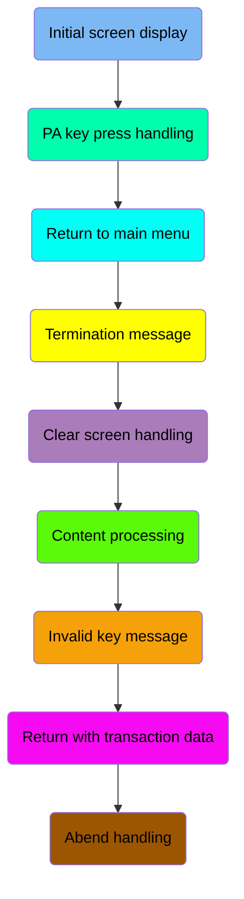
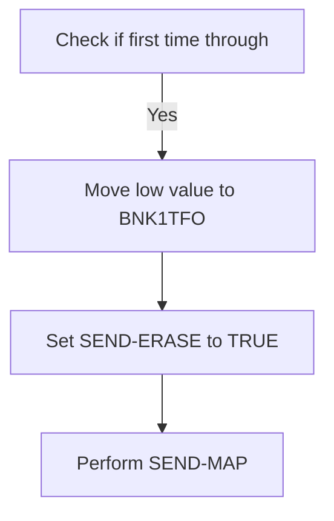
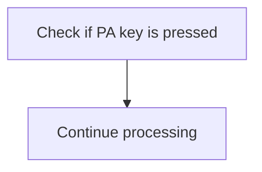
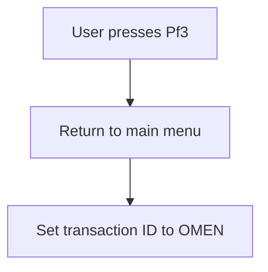
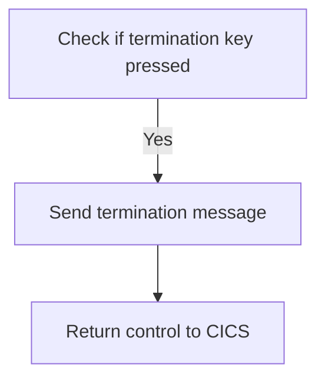
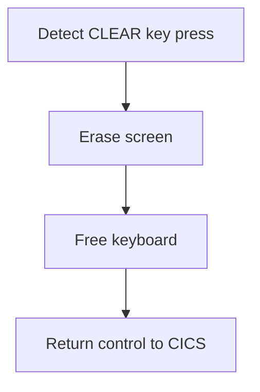
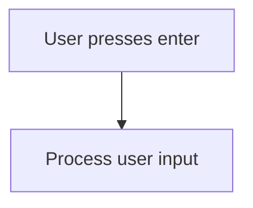
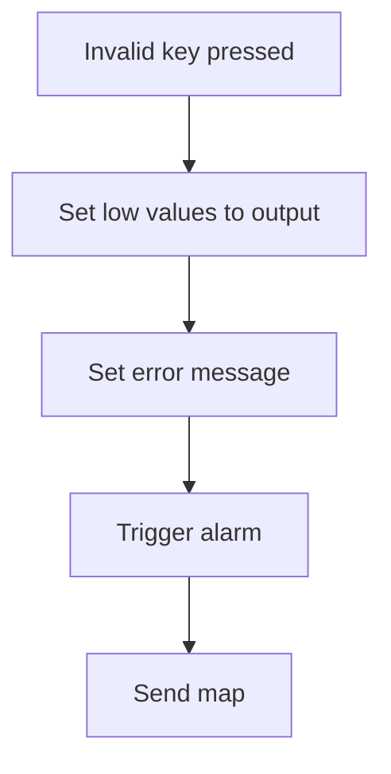
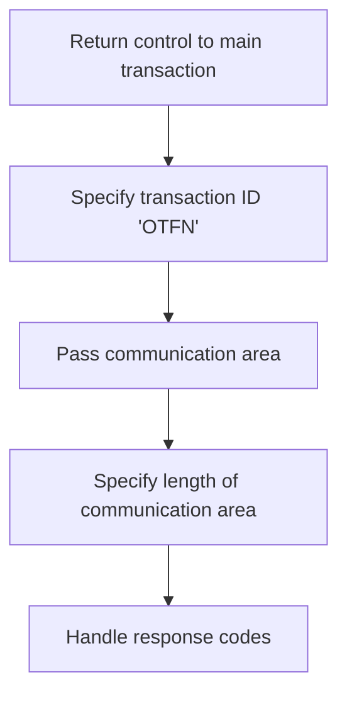
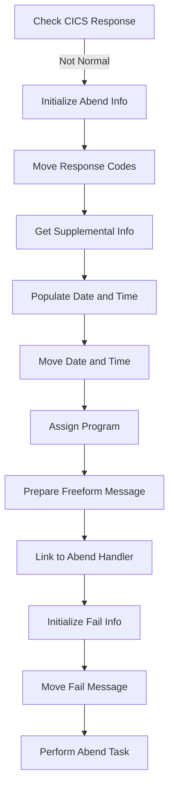

The <SwmToken path="src/base/cobol_src/BNK1TFN.cbl" pos="308:4:4" line-data="              MOVE &#39;BNK1TFN - A010 - RETURN TRANSID(OCCS) FAIL&#39; TO">`BNK1TFN`</SwmToken> program is designed to handle various user interactions within a banking application. It manages the initial screen display, processes user inputs, handles key press events, and manages termination and error scenarios. The program ensures smooth user experience by effectively managing screen updates, user inputs, and system responses.

The <SwmToken path="src/base/cobol_src/BNK1TFN.cbl" pos="308:4:4" line-data="              MOVE &#39;BNK1TFN - A010 - RETURN TRANSID(OCCS) FAIL&#39; TO">`BNK1TFN`</SwmToken> program starts by displaying the initial screen to the user. It then waits for user inputs, such as key presses, and processes them accordingly. For example, if a user presses a PA key, the program continues processing without additional actions. If the user presses the <SwmToken path="src/base/cobol_src/BNK1TFN.cbl" pos="195:5:5" line-data="      *       When Pf3 is pressed, return to the main menu">`Pf3`</SwmToken> key, the program returns to the main menu. The program also handles termination requests by sending a termination message and returning control to CICS. Additionally, it manages screen clearing events and processes user inputs when the enter key is pressed. In case of invalid key presses, the program alerts the user with an error message and updates the screen. Finally, the program handles abnormal end situations by capturing response codes, preparing abend information, and linking to the abend handler.

Here is a high level diagram of the program:



## Initial screen display

First, we'll zoom into this section of the flow:



<SwmSnippet path="/src/base/cobol_src/BNK1TFN.cbl" line="183">

---

First, the code checks if it is the first time through by evaluating if <SwmToken path="src/base/cobol_src/BNK1TFN.cbl" pos="183:3:3" line-data="              WHEN EIBCALEN = ZERO">`EIBCALEN`</SwmToken> (the length of the communication area) is zero. This condition helps determine if the map should be sent with erased (empty) data fields.

```cobol
              WHEN EIBCALEN = ZERO
```

---

</SwmSnippet>

<SwmSnippet path="/src/base/cobol_src/BNK1TFN.cbl" line="184">

---

Next, if it is the first time through, the code moves a low value to <SwmToken path="src/base/cobol_src/BNK1TFN.cbl" pos="184:9:9" line-data="                 MOVE LOW-VALUE TO BNK1TFO">`BNK1TFO`</SwmToken> (which likely represents the output data structure), sets the <SwmToken path="src/base/cobol_src/BNK1TFN.cbl" pos="185:3:5" line-data="                 SET SEND-ERASE TO TRUE">`SEND-ERASE`</SwmToken> flag to true, and performs the <SwmToken path="src/base/cobol_src/BNK1TFN.cbl" pos="186:3:5" line-data="                 PERFORM SEND-MAP">`SEND-MAP`</SwmToken> operation. This ensures that the map is displayed with empty data fields to the user.

```cobol
                 MOVE LOW-VALUE TO BNK1TFO
                 SET SEND-ERASE TO TRUE
                 PERFORM SEND-MAP
```

---

</SwmSnippet>

## PA key press handling

Now, lets zoom into this section of the flow:



<SwmSnippet path="/src/base/cobol_src/BNK1TFN.cbl" line="189">

---

The code snippet handles the scenario where a PA (Program Attention) key is pressed. Specifically, it checks if the <SwmToken path="src/base/cobol_src/BNK1TFN.cbl" pos="191:3:3" line-data="              WHEN EIBAID = DFHPA1 OR DFHPA2 OR DFHPA3">`EIBAID`</SwmToken> (which holds the attention identifier) is equal to <SwmToken path="src/base/cobol_src/BNK1TFN.cbl" pos="191:7:7" line-data="              WHEN EIBAID = DFHPA1 OR DFHPA2 OR DFHPA3">`DFHPA1`</SwmToken>, <SwmToken path="src/base/cobol_src/BNK1TFN.cbl" pos="191:11:11" line-data="              WHEN EIBAID = DFHPA1 OR DFHPA2 OR DFHPA3">`DFHPA2`</SwmToken>, or <SwmToken path="src/base/cobol_src/BNK1TFN.cbl" pos="191:15:15" line-data="              WHEN EIBAID = DFHPA1 OR DFHPA2 OR DFHPA3">`DFHPA3`</SwmToken> (which represent different PA keys). If any of these keys are pressed, the program simply continues processing without taking any additional action.

```cobol
      *       If a PA key is pressed, just carry on
      *
              WHEN EIBAID = DFHPA1 OR DFHPA2 OR DFHPA3
                 CONTINUE
```

---

</SwmSnippet>

## Return to main menu

Now, lets zoom into this section of the flow:



<SwmSnippet path="/src/base/cobol_src/BNK1TFN.cbl" line="197">

---

When the user presses the <SwmToken path="src/base/cobol_src/BNK1TFN.cbl" pos="195:5:5" line-data="      *       When Pf3 is pressed, return to the main menu">`Pf3`</SwmToken> key, the system initiates a return to the main menu. This is achieved by executing the <SwmToken path="src/base/cobol_src/BNK1TFN.cbl" pos="198:1:5" line-data="                 EXEC CICS RETURN">`EXEC CICS RETURN`</SwmToken> command, which sets the transaction ID to 'OMEN' and ensures an immediate return. The response codes <SwmToken path="src/base/cobol_src/BNK1TFN.cbl" pos="201:3:7" line-data="                    RESP(WS-CICS-RESP)">`WS-CICS-RESP`</SwmToken> and <SwmToken path="src/base/cobol_src/BNK1TFN.cbl" pos="202:3:7" line-data="                    RESP2(WS-CICS-RESP2)">`WS-CICS-RESP2`</SwmToken> are used to handle any potential responses from the CICS system.

```cobol
              WHEN EIBAID = DFHPF3
                 EXEC CICS RETURN
                    TRANSID('OMEN')
                    IMMEDIATE
                    RESP(WS-CICS-RESP)
                    RESP2(WS-CICS-RESP2)
                 END-EXEC
```

---

</SwmSnippet>

## Termination message

Now, lets zoom into this section of the flow:



<SwmSnippet path="/src/base/cobol_src/BNK1TFN.cbl" line="209">

---

The <SwmToken path="src/base/cobol_src/BNK1TFN.cbl" pos="174:1:1" line-data="       PREMIERE SECTION.">`PREMIERE`</SwmToken> function handles user termination requests by checking if the termination key (PF12) or the aid key is pressed. If either of these keys is pressed, it triggers the <SwmToken path="src/base/cobol_src/BNK1TFN.cbl" pos="210:3:7" line-data="                 PERFORM SEND-TERMINATION-MSG">`SEND-TERMINATION-MSG`</SwmToken> routine to send a termination message to the user. This ensures that the user is informed about the termination of the session. Finally, control is returned to CICS to complete the termination process.

```cobol
              WHEN EIBAID = DFHAID OR DFHPF12
                 PERFORM SEND-TERMINATION-MSG
                 EXEC CICS
                    RETURN
                 END-EXEC
```

---

</SwmSnippet>

## Clear screen handling

Now, lets zoom into this section of the flow:



<SwmSnippet path="/src/base/cobol_src/BNK1TFN.cbl" line="218">

---

When the CLEAR key is pressed, the system first detects this event by checking if <SwmToken path="src/base/cobol_src/BNK1TFN.cbl" pos="218:3:3" line-data="              WHEN EIBAID = DFHCLEAR">`EIBAID`</SwmToken> (which holds the attention identifier) is equal to <SwmToken path="src/base/cobol_src/BNK1TFN.cbl" pos="218:7:7" line-data="              WHEN EIBAID = DFHCLEAR">`DFHCLEAR`</SwmToken> (the identifier for the CLEAR key).

```cobol
              WHEN EIBAID = DFHCLEAR
```

---

</SwmSnippet>

<SwmSnippet path="/src/base/cobol_src/BNK1TFN.cbl" line="219">

---

Upon detecting the CLEAR key press, the system sends a control command to erase the screen. This is done using the <SwmToken path="src/base/cobol_src/BNK1TFN.cbl" pos="219:1:1" line-data="                EXEC CICS SEND CONTROL">`EXEC`</SwmToken>` `<SwmToken path="src/base/cobol_src/BNK1TFN.cbl" pos="219:3:3" line-data="                EXEC CICS SEND CONTROL">`CICS`</SwmToken>` `<SwmToken path="src/base/cobol_src/BNK1TFN.cbl" pos="219:5:5" line-data="                EXEC CICS SEND CONTROL">`SEND`</SwmToken>` `<SwmToken path="src/base/cobol_src/BNK1TFN.cbl" pos="219:7:7" line-data="                EXEC CICS SEND CONTROL">`CONTROL`</SwmToken>` `<SwmToken path="src/base/cobol_src/BNK1TFN.cbl" pos="220:1:1" line-data="                          ERASE">`ERASE`</SwmToken> command, which clears the current display.

```cobol
                EXEC CICS SEND CONTROL
                          ERASE
```

---

</SwmSnippet>

<SwmSnippet path="/src/base/cobol_src/BNK1TFN.cbl" line="221">

---

Next, the system frees the keyboard using the <SwmToken path="src/base/cobol_src/BNK1TFN.cbl" pos="221:1:1" line-data="                          FREEKB">`FREEKB`</SwmToken> command, allowing the user to input new data without any restrictions from the previous state.

```cobol
                          FREEKB
```

---

</SwmSnippet>

<SwmSnippet path="/src/base/cobol_src/BNK1TFN.cbl" line="223">

---

Finally, the system returns control to CICS using the <SwmToken path="src/base/cobol_src/BNK1TFN.cbl" pos="223:1:5" line-data="                EXEC CICS RETURN">`EXEC CICS RETURN`</SwmToken> command, indicating that the current task is complete and the system is ready for the next user action.

```cobol
                EXEC CICS RETURN
                END-EXEC
```

---

</SwmSnippet>

## Content processing

Now, lets zoom into this section of the flow:



<SwmSnippet path="/src/base/cobol_src/BNK1TFN.cbl" line="229">

---

When the user presses the enter key, the system triggers the processing of the user input. This is indicated by the condition <SwmToken path="src/base/cobol_src/BNK1TFN.cbl" pos="229:1:7" line-data="              WHEN EIBAID = DFHENTER">`WHEN EIBAID = DFHENTER`</SwmToken>, which checks if the enter key has been pressed. If this condition is met, the <SwmToken path="src/base/cobol_src/BNK1TFN.cbl" pos="230:3:5" line-data="                 PERFORM PROCESS-MAP">`PROCESS-MAP`</SwmToken> routine is executed to handle the input data accordingly.

```cobol
              WHEN EIBAID = DFHENTER
                 PERFORM PROCESS-MAP
```

---

</SwmSnippet>

## Invalid key message

Now, lets zoom into this section of the flow:



<SwmSnippet path="/src/base/cobol_src/BNK1TFN.cbl" line="234">

---

When an invalid key is pressed by the user, the system first sets the output field <SwmToken path="src/base/cobol_src/BNK1TFN.cbl" pos="236:9:9" line-data="                 MOVE LOW-VALUES TO BNK1TFO">`BNK1TFO`</SwmToken> to low values, effectively clearing any previous data. Next, it sets the <SwmToken path="src/base/cobol_src/BNK1TFN.cbl" pos="237:14:14" line-data="                 MOVE &#39;Invalid key pressed.&#39; TO MESSAGEO">`MESSAGEO`</SwmToken> field to 'Invalid key pressed.' to inform the user of the error. The system then triggers an alarm by setting <SwmToken path="src/base/cobol_src/BNK1TFN.cbl" pos="239:3:7" line-data="                 SET SEND-DATAONLY-ALARM TO TRUE">`SEND-DATAONLY-ALARM`</SwmToken> to true, ensuring the user is alerted to the invalid action. Finally, the <SwmToken path="src/base/cobol_src/BNK1TFN.cbl" pos="240:3:5" line-data="                 PERFORM SEND-MAP">`SEND-MAP`</SwmToken> operation is performed to update the user interface with the error message and alarm.

```cobol
      *
              WHEN OTHER
                 MOVE LOW-VALUES TO BNK1TFO
                 MOVE 'Invalid key pressed.' TO MESSAGEO
      *           MOVE 10 TO CUSTNOL
                 SET SEND-DATAONLY-ALARM TO TRUE
                 PERFORM SEND-MAP

```

---

</SwmSnippet>

## Return with transaction data

This is the next section of the flow.



<SwmSnippet path="/src/base/cobol_src/BNK1TFN.cbl" line="245">

---

The <SwmToken path="src/base/cobol_src/BNK1TFN.cbl" pos="174:1:1" line-data="       PREMIERE SECTION.">`PREMIERE`</SwmToken> function is responsible for returning control to the main transaction identified by the transaction ID 'OTFN'. This is achieved by executing a CICS RETURN command, which specifies the transaction ID 'OTFN'. The communication area (<SwmToken path="src/base/cobol_src/BNK1TFN.cbl" pos="249:3:5" line-data="               COMMAREA(WS-COMMAREA)">`WS-COMMAREA`</SwmToken>) is passed along with the return command to ensure that any necessary data is transferred back to the main transaction. The length of the communication area is specified as 29 bytes. Additionally, the response codes (<SwmToken path="src/base/cobol_src/BNK1TFN.cbl" pos="251:3:7" line-data="               RESP(WS-CICS-RESP)">`WS-CICS-RESP`</SwmToken> and <SwmToken path="src/base/cobol_src/BNK1TFN.cbl" pos="252:3:7" line-data="               RESP2(WS-CICS-RESP2)">`WS-CICS-RESP2`</SwmToken>) are handled to capture any potential issues that may arise during the return process.

```cobol
      *     Now RETURN
      *
            EXEC CICS
               RETURN TRANSID('OTFN')
               COMMAREA(WS-COMMAREA)
               LENGTH(29)
               RESP(WS-CICS-RESP)
               RESP2(WS-CICS-RESP2)
            END-EXEC.
```

---

</SwmSnippet>

## Abend handling

Now, lets zoom into this section of the flow:



First, the program checks if the CICS response code (<SwmToken path="src/base/cobol_src/BNK1TFN.cbl" pos="201:3:7" line-data="                    RESP(WS-CICS-RESP)">`WS-CICS-RESP`</SwmToken>) is not equal to <SwmToken path="src/base/cobol_src/BNK1TFN.cbl" pos="255:13:16" line-data="           IF WS-CICS-RESP NOT = DFHRESP(NORMAL)">`DFHRESP(NORMAL)`</SwmToken>, indicating an abnormal end situation.

<SwmSnippet path="/src/base/cobol_src/BNK1TFN.cbl" line="262">

---

Next, it initializes the <SwmToken path="src/base/cobol_src/BNK1TFN.cbl" pos="262:3:5" line-data="              INITIALIZE ABNDINFO-REC">`ABNDINFO-REC`</SwmToken> structure to store abend information.

```cobol
              INITIALIZE ABNDINFO-REC
```

---

</SwmSnippet>

<SwmSnippet path="/src/base/cobol_src/BNK1TFN.cbl" line="263">

---

Then, the program moves the response codes <SwmToken path="src/base/cobol_src/BNK1TFN.cbl" pos="263:3:3" line-data="              MOVE EIBRESP    TO ABND-RESPCODE">`EIBRESP`</SwmToken> and <SwmToken path="src/base/cobol_src/BNK1TFN.cbl" pos="264:3:3" line-data="              MOVE EIBRESP2   TO ABND-RESP2CODE">`EIBRESP2`</SwmToken> to <SwmToken path="src/base/cobol_src/BNK1TFN.cbl" pos="263:7:9" line-data="              MOVE EIBRESP    TO ABND-RESPCODE">`ABND-RESPCODE`</SwmToken> and <SwmToken path="src/base/cobol_src/BNK1TFN.cbl" pos="264:7:9" line-data="              MOVE EIBRESP2   TO ABND-RESP2CODE">`ABND-RESP2CODE`</SwmToken> respectively, preserving the abend response information.

```cobol
              MOVE EIBRESP    TO ABND-RESPCODE
              MOVE EIBRESP2   TO ABND-RESP2CODE
```

---

</SwmSnippet>

<SwmSnippet path="/src/base/cobol_src/BNK1TFN.cbl" line="268">

---

Moving to the next step, it retrieves supplemental information such as the application ID (<SwmToken path="src/base/cobol_src/BNK1TFN.cbl" pos="268:7:7" line-data="              EXEC CICS ASSIGN APPLID(ABND-APPLID)">`APPLID`</SwmToken>), task number (<SwmToken path="src/base/cobol_src/BNK1TFN.cbl" pos="271:3:3" line-data="              MOVE EIBTASKN   TO ABND-TASKNO-KEY">`EIBTASKN`</SwmToken>), and transaction ID (<SwmToken path="src/base/cobol_src/BNK1TFN.cbl" pos="272:3:3" line-data="              MOVE EIBTRNID   TO ABND-TRANID">`EIBTRNID`</SwmToken>).

```cobol
              EXEC CICS ASSIGN APPLID(ABND-APPLID)
              END-EXEC

              MOVE EIBTASKN   TO ABND-TASKNO-KEY
              MOVE EIBTRNID   TO ABND-TRANID

```

---

</SwmSnippet>

<SwmSnippet path="/src/base/cobol_src/BNK1TFN.cbl" line="274">

---

The program then performs the <SwmToken path="src/base/cobol_src/BNK1TFN.cbl" pos="274:3:7" line-data="              PERFORM POPULATE-TIME-DATE">`POPULATE-TIME-DATE`</SwmToken> routine to get the current date and time, and moves this information to <SwmToken path="src/base/cobol_src/BNK1TFN.cbl" pos="276:11:13" line-data="              MOVE WS-ORIG-DATE TO ABND-DATE">`ABND-DATE`</SwmToken> and <SwmToken path="src/base/cobol_src/BNK1TFN.cbl" pos="282:3:5" line-data="                     INTO ABND-TIME">`ABND-TIME`</SwmToken>.

```cobol
              PERFORM POPULATE-TIME-DATE

              MOVE WS-ORIG-DATE TO ABND-DATE
              STRING WS-TIME-NOW-GRP-HH DELIMITED BY SIZE,
                    ':' DELIMITED BY SIZE,
                     WS-TIME-NOW-GRP-MM DELIMITED BY SIZE,
                     ':' DELIMITED BY SIZE,
                     WS-TIME-NOW-GRP-MM DELIMITED BY SIZE
                     INTO ABND-TIME
```

---

</SwmSnippet>

<SwmSnippet path="/src/base/cobol_src/BNK1TFN.cbl" line="286">

---

Additionally, it assigns the current program name to <SwmToken path="src/base/cobol_src/BNK1TFN.cbl" pos="288:9:11" line-data="              EXEC CICS ASSIGN PROGRAM(ABND-PROGRAM)">`ABND-PROGRAM`</SwmToken> and sets the <SwmToken path="src/base/cobol_src/BNK1TFN.cbl" pos="286:9:11" line-data="              MOVE &#39;HBNK&#39;      TO ABND-CODE">`ABND-CODE`</SwmToken> to 'HBNK'.

```cobol
              MOVE 'HBNK'      TO ABND-CODE

              EXEC CICS ASSIGN PROGRAM(ABND-PROGRAM)
```

---

</SwmSnippet>

<SwmSnippet path="/src/base/cobol_src/BNK1TFN.cbl" line="293">

---

The program prepares a freeform message detailing the abend situation, including the response codes, and stores it in <SwmToken path="src/base/cobol_src/BNK1TFN.cbl" pos="299:3:5" line-data="                    INTO ABND-FREEFORM">`ABND-FREEFORM`</SwmToken>.

```cobol
              STRING 'A010 - RETURN TRANSID(OCCS) FAIL.'
                    DELIMITED BY SIZE,
                    ' EIBRESP=' DELIMITED BY SIZE,
                    ABND-RESPCODE DELIMITED BY SIZE,
                    ' RESP2=' DELIMITED BY SIZE,
                    ABND-RESP2CODE DELIMITED BY SIZE
                    INTO ABND-FREEFORM
```

---

</SwmSnippet>

<SwmSnippet path="/src/base/cobol_src/BNK1TFN.cbl" line="302">

---

Next, it links to the abend handler program (<SwmToken path="src/base/cobol_src/BNK1TFN.cbl" pos="302:9:13" line-data="              EXEC CICS LINK PROGRAM(WS-ABEND-PGM)">`WS-ABEND-PGM`</SwmToken>) and passes the <SwmToken path="src/base/cobol_src/BNK1TFN.cbl" pos="303:3:5" line-data="                        COMMAREA(ABNDINFO-REC)">`ABNDINFO-REC`</SwmToken> structure.

```cobol
              EXEC CICS LINK PROGRAM(WS-ABEND-PGM)
                        COMMAREA(ABNDINFO-REC)
              END-EXEC
```

---

</SwmSnippet>

<SwmSnippet path="/src/base/cobol_src/BNK1TFN.cbl" line="307">

---

Finally, the program initializes the <SwmToken path="src/base/cobol_src/BNK1TFN.cbl" pos="307:3:7" line-data="              INITIALIZE WS-FAIL-INFO">`WS-FAIL-INFO`</SwmToken> structure, sets the failure message, and performs the <SwmToken path="src/base/cobol_src/BNK1TFN.cbl" pos="312:3:7" line-data="              PERFORM ABEND-THIS-TASK">`ABEND-THIS-TASK`</SwmToken> routine to handle the abend situation.

```cobol
              INITIALIZE WS-FAIL-INFO
              MOVE 'BNK1TFN - A010 - RETURN TRANSID(OCCS) FAIL' TO
                 WS-CICS-FAIL-MSG
              MOVE WS-CICS-RESP  TO WS-CICS-RESP-DISP
              MOVE WS-CICS-RESP2 TO WS-CICS-RESP2-DISP
              PERFORM ABEND-THIS-TASK
           END-IF.
```

---

</SwmSnippet>

&nbsp;

*This is an auto-generated document by Swimm 🌊 and has not yet been verified by a human*

<SwmMeta version="3.0.0" repo-id="Z2l0aHViJTNBJTNBY2ljcy1iYW5raW5nLXNhbXBsZS1hcHBsaWNhdGlvbi1jYnNhLUlCTS1EZW1vJTNBJTNBU3dpbW0tRGVtbw==" repo-name="cics-banking-sample-application-cbsa-IBM-Demo"><sup>Powered by [Swimm](/)</sup></SwmMeta>
