The <SwmToken path="src/base/cobol_src/BNK1UAC.cbl" pos="355:4:4" line-data="              MOVE &#39;BNK1UAC - A010 - RETURN TRANSID(OUAC) FAIL&#39; TO">`BNK1UAC`</SwmToken> program is responsible for handling various user interactions within the banking application. It manages key presses, screen initialization, and transitions between different states. The program achieves this by evaluating user inputs and executing corresponding actions to ensure smooth operation and user experience.

The <SwmToken path="src/base/cobol_src/BNK1UAC.cbl" pos="355:4:4" line-data="              MOVE &#39;BNK1UAC - A010 - RETURN TRANSID(OUAC) FAIL&#39; TO">`BNK1UAC`</SwmToken> program starts by initializing the map on first use, handling key presses like PA, CLEAR, ENTER, and <SwmToken path="src/base/cobol_src/BNK1UAC.cbl" pos="520:8:8" line-data="                 &#39;. Then press PF5.&#39; DELIMITED BY SIZE">`PF5`</SwmToken>, and managing transitions such as returning to the main menu or sending termination messages. It also processes invalid key presses and sets return information before executing CICS return commands. Additionally, it handles CICS return errors by capturing response codes and linking to the abend handler program.

Here is a high level diagram of the program:

```mermaid
graph TD
b7h8l("Initialize map on first use"):::a976cd3ab  --> 
e2ypq("Handle PA key press"):::a62d85edd  --> 
f3vgt("Return to main menu"):::a6a8a8e15  --> 
cnzlh("Send termination message"):::a82db48d6  --> 
yapay("Handle CLEAR key press"):::a858bf53a  --> 
vnnoc("Process on ENTER key press"):::a67636f78  --> 
ciezk("Process on PF5 key press"):::ad0877f10  --> 
4d2na("Handle invalid key press"):::aacf9316c  --> 
gsz8d("Set return information"):::ac7d3c1ca  --> 
amypn("Execute CICS return"):::a8fe665f2  --> 
nsms8("Handle CICS return errors"):::a92303b36 
classDef a976cd3ab color:#000000,fill:#7CB9F4
classDef a62d85edd color:#000000,fill:#00FFAA
classDef a6a8a8e15 color:#000000,fill:#00FFF4
classDef a82db48d6 color:#000000,fill:#FFFF00
classDef a858bf53a color:#000000,fill:#AA7CB9
classDef a67636f78 color:#000000,fill:#5afa0a
classDef ad0877f10 color:#000000,fill:#f5a10a
classDef aacf9316c color:#000000,fill:#f50af1
classDef ac7d3c1ca color:#000000,fill:#9c5602
classDef a8fe665f2 color:#000000,fill:#FF5733
classDef a92303b36 color:#000000,fill:#C70039

%% Swimm:
%% graph TD
%% b7h8l("Initialize map on first use"):::a976cd3ab  --> 
%% e2ypq("Handle PA key press"):::a62d85edd  --> 
%% f3vgt("Return to main menu"):::a6a8a8e15  --> 
%% cnzlh("Send termination message"):::a82db48d6  --> 
%% yapay("Handle CLEAR key press"):::a858bf53a  --> 
%% vnnoc("Process on ENTER key press"):::a67636f78  --> 
%% ciezk("Process on <SwmToken path="src/base/cobol_src/BNK1UAC.cbl" pos="520:8:8" line-data="                 &#39;. Then press PF5.&#39; DELIMITED BY SIZE">`PF5`</SwmToken> key press"):::ad0877f10  --> 
%% 4d2na("Handle invalid key press"):::aacf9316c  --> 
%% gsz8d("Set return information"):::ac7d3c1ca  --> 
%% amypn("Execute CICS return"):::a8fe665f2  --> 
%% nsms8("Handle CICS return errors"):::a92303b36 
%% classDef a976cd3ab color:#000000,fill:#7CB9F4
%% classDef a62d85edd color:#000000,fill:#00FFAA
%% classDef a6a8a8e15 color:#000000,fill:#00FFF4
%% classDef a82db48d6 color:#000000,fill:#FFFF00
%% classDef a858bf53a color:#000000,fill:#AA7CB9
%% classDef a67636f78 color:#000000,fill:#5afa0a
%% classDef ad0877f10 color:#000000,fill:#f5a10a
%% classDef aacf9316c color:#000000,fill:#f50af1
%% classDef ac7d3c1ca color:#000000,fill:#9c5602
%% classDef a8fe665f2 color:#000000,fill:#FF5733
%% classDef a92303b36 color:#000000,fill:#C70039
```

## Initialize map on first use

First, we'll zoom into this section of the flow:

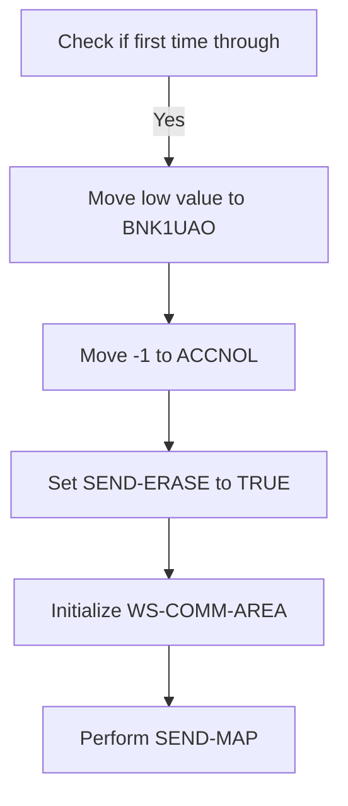

First, the code checks if it is the first time through by evaluating if <SwmToken path="src/base/cobol_src/BNK1UAC.cbl" pos="205:3:3" line-data="              WHEN EIBCALEN = ZERO">`EIBCALEN`</SwmToken> (the length of the communication area) is zero. This indicates that the session is new and requires the initial screen setup with empty data fields.

<SwmSnippet path="/src/base/cobol_src/BNK1UAC.cbl" line="205">

---

Next, the code moves a low value to <SwmToken path="src/base/cobol_src/BNK1UAC.cbl" pos="206:9:9" line-data="                 MOVE LOW-VALUE TO BNK1UAO">`BNK1UAO`</SwmToken> (a field likely used for initialization), sets <SwmToken path="src/base/cobol_src/BNK1UAC.cbl" pos="207:8:8" line-data="                 MOVE -1 TO ACCNOL">`ACCNOL`</SwmToken> to -1 (indicating no account number is selected), sets the <SwmToken path="src/base/cobol_src/BNK1UAC.cbl" pos="208:3:5" line-data="                 SET SEND-ERASE TO TRUE">`SEND-ERASE`</SwmToken> flag to TRUE (to clear the screen), initializes the <SwmToken path="src/base/cobol_src/BNK1UAC.cbl" pos="209:3:7" line-data="                 INITIALIZE WS-COMM-AREA">`WS-COMM-AREA`</SwmToken> (working storage communication area), and performs the <SwmToken path="src/base/cobol_src/BNK1UAC.cbl" pos="210:3:5" line-data="                 PERFORM SEND-MAP">`SEND-MAP`</SwmToken> operation to display the initial screen to the user.

```cobol
              WHEN EIBCALEN = ZERO
                 MOVE LOW-VALUE TO BNK1UAO
                 MOVE -1 TO ACCNOL
                 SET SEND-ERASE TO TRUE
                 INITIALIZE WS-COMM-AREA
                 PERFORM SEND-MAP
```

---

</SwmSnippet>

## Handle PA key press

Now, lets zoom into this section of the flow:

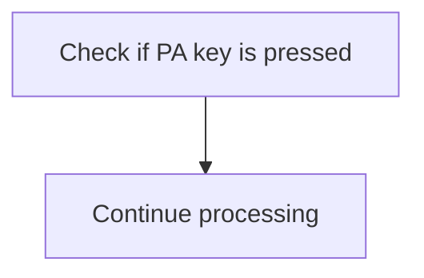

<SwmSnippet path="/src/base/cobol_src/BNK1UAC.cbl" line="213">

---

The code checks if a PA key (Program Attention key) is pressed by evaluating the <SwmToken path="src/base/cobol_src/BNK1UAC.cbl" pos="215:3:3" line-data="              WHEN EIBAID = DFHPA1 OR DFHPA2 OR DFHPA3">`EIBAID`</SwmToken> variable against <SwmToken path="src/base/cobol_src/BNK1UAC.cbl" pos="215:7:7" line-data="              WHEN EIBAID = DFHPA1 OR DFHPA2 OR DFHPA3">`DFHPA1`</SwmToken>, <SwmToken path="src/base/cobol_src/BNK1UAC.cbl" pos="215:11:11" line-data="              WHEN EIBAID = DFHPA1 OR DFHPA2 OR DFHPA3">`DFHPA2`</SwmToken>, or <SwmToken path="src/base/cobol_src/BNK1UAC.cbl" pos="215:15:15" line-data="              WHEN EIBAID = DFHPA1 OR DFHPA2 OR DFHPA3">`DFHPA3`</SwmToken>. If any of these keys are pressed, the program will simply continue processing without taking any additional action. This ensures that the program does not interrupt its flow due to PA key presses, allowing for smoother user interactions.

```cobol
      *       If a PA key is pressed, just carry on
      *
              WHEN EIBAID = DFHPA1 OR DFHPA2 OR DFHPA3
                 CONTINUE
```

---

</SwmSnippet>

## Return to main menu

Now, lets zoom into this section of the flow:

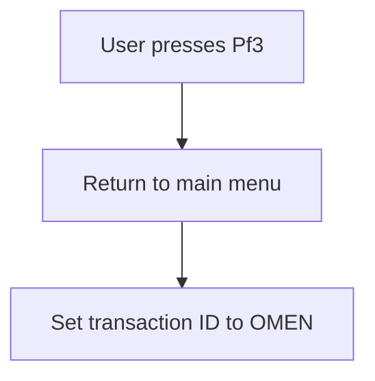

<SwmSnippet path="/src/base/cobol_src/BNK1UAC.cbl" line="221">

---

When the user presses the <SwmToken path="src/base/cobol_src/BNK1UAC.cbl" pos="219:5:5" line-data="      *       When Pf3 is pressed, return to the main menu">`Pf3`</SwmToken> key, the system initiates a return to the main menu. This is achieved by checking if <SwmToken path="src/base/cobol_src/BNK1UAC.cbl" pos="221:3:3" line-data="              WHEN EIBAID = DFHPF3">`EIBAID`</SwmToken> (which holds the key pressed by the user) is equal to <SwmToken path="src/base/cobol_src/BNK1UAC.cbl" pos="221:7:7" line-data="              WHEN EIBAID = DFHPF3">`DFHPF3`</SwmToken> (the identifier for the <SwmToken path="src/base/cobol_src/BNK1UAC.cbl" pos="219:5:5" line-data="      *       When Pf3 is pressed, return to the main menu">`Pf3`</SwmToken> key).

```cobol
              WHEN EIBAID = DFHPF3
```

---

</SwmSnippet>

<SwmSnippet path="/src/base/cobol_src/BNK1UAC.cbl" line="222">

---

If the condition is met, the system executes a CICS RETURN command to transition back to the main menu. This command sets the transaction ID to 'OMEN', ensuring that the user is directed to the correct menu.

```cobol
                 EXEC CICS RETURN
                    TRANSID('OMEN')
```

---

</SwmSnippet>

<SwmSnippet path="/src/base/cobol_src/BNK1UAC.cbl" line="224">

---

The <SwmToken path="src/base/cobol_src/BNK1UAC.cbl" pos="224:1:1" line-data="                    IMMEDIATE">`IMMEDIATE`</SwmToken> option is used to ensure that the transition happens without delay, providing a seamless user experience.

```cobol
                    IMMEDIATE
```

---

</SwmSnippet>

<SwmSnippet path="/src/base/cobol_src/BNK1UAC.cbl" line="225">

---

Additionally, the response codes <SwmToken path="src/base/cobol_src/BNK1UAC.cbl" pos="225:3:7" line-data="                    RESP(WS-CICS-RESP)">`WS-CICS-RESP`</SwmToken> and <SwmToken path="src/base/cobol_src/BNK1UAC.cbl" pos="226:3:7" line-data="                    RESP2(WS-CICS-RESP2)">`WS-CICS-RESP2`</SwmToken> are set to capture any response or error codes from the CICS command, which can be used for debugging or logging purposes.

```cobol
                    RESP(WS-CICS-RESP)
                    RESP2(WS-CICS-RESP2)
```

---

</SwmSnippet>

## Send termination message

Now, lets zoom into this section of the flow:

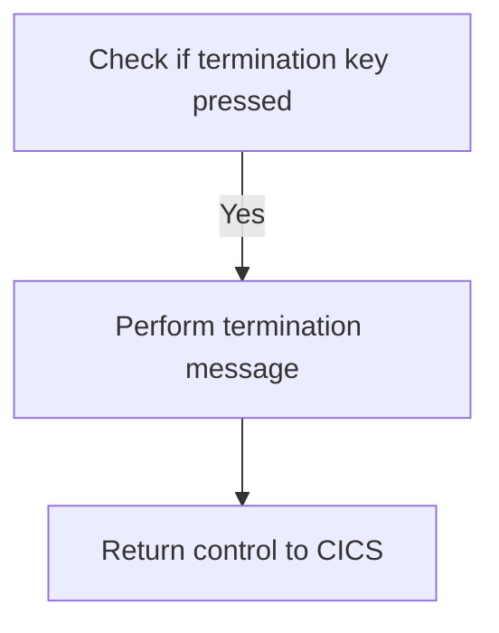

<SwmSnippet path="/src/base/cobol_src/BNK1UAC.cbl" line="233">

---

### Handling user termination requests

When the user presses the termination key (either <SwmToken path="src/base/cobol_src/BNK1UAC.cbl" pos="233:7:7" line-data="              WHEN EIBAID = DFHAID OR DFHPF12">`DFHAID`</SwmToken> or <SwmToken path="src/base/cobol_src/BNK1UAC.cbl" pos="233:11:11" line-data="              WHEN EIBAID = DFHAID OR DFHPF12">`DFHPF12`</SwmToken>), the system initiates the termination process. This involves performing the <SwmToken path="src/base/cobol_src/BNK1UAC.cbl" pos="234:3:7" line-data="                 PERFORM SEND-TERMINATION-MSG">`SEND-TERMINATION-MSG`</SwmToken> operation, which sends a termination message to the user. After sending the termination message, control is returned to CICS to complete the termination process.

```cobol
              WHEN EIBAID = DFHAID OR DFHPF12
                 PERFORM SEND-TERMINATION-MSG
                 EXEC CICS
                    RETURN
                 END-EXEC
```

---

</SwmSnippet>

## Handle CLEAR key press

Now, lets zoom into this section of the flow:

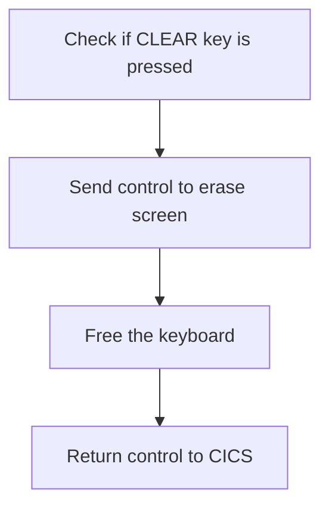

<SwmSnippet path="/src/base/cobol_src/BNK1UAC.cbl" line="242">

---

First, we check if the <SwmToken path="src/base/cobol_src/BNK1UAC.cbl" pos="240:5:5" line-data="      *       When CLEAR is pressed">`CLEAR`</SwmToken> key is pressed by evaluating if <SwmToken path="src/base/cobol_src/BNK1UAC.cbl" pos="242:3:3" line-data="              WHEN EIBAID = DFHCLEAR">`EIBAID`</SwmToken> (which holds the attention identifier) is equal to <SwmToken path="src/base/cobol_src/BNK1UAC.cbl" pos="242:7:7" line-data="              WHEN EIBAID = DFHCLEAR">`DFHCLEAR`</SwmToken> (the identifier for the CLEAR key).

```cobol
              WHEN EIBAID = DFHCLEAR
```

---

</SwmSnippet>

<SwmSnippet path="/src/base/cobol_src/BNK1UAC.cbl" line="243">

---

Next, if the <SwmToken path="src/base/cobol_src/BNK1UAC.cbl" pos="240:5:5" line-data="      *       When CLEAR is pressed">`CLEAR`</SwmToken> key is pressed, we send a control command to erase the screen and free the keyboard, ensuring that the screen is reset and ready for new input. Finally, we return control to CICS to complete the operation.

```cobol
                EXEC CICS SEND CONTROL
                   ERASE
                   FREEKB
                END-EXEC

                EXEC CICS RETURN
                END-EXEC
```

---

</SwmSnippet>

## Process on ENTER key press

Now, lets zoom into this section of the flow:

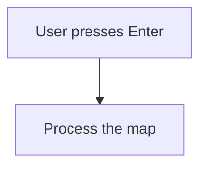

<SwmSnippet path="/src/base/cobol_src/BNK1UAC.cbl" line="254">

---

When the user presses the Enter key, the system triggers the <SwmToken path="src/base/cobol_src/BNK1UAC.cbl" pos="255:3:5" line-data="                 PERFORM PROCESS-MAP">`PROCESS-MAP`</SwmToken> routine. This routine is responsible for handling the user input and updating the system state accordingly.

```cobol
              WHEN EIBAID = DFHENTER
                 PERFORM PROCESS-MAP
```

---

</SwmSnippet>

## Process on <SwmToken path="src/base/cobol_src/BNK1UAC.cbl" pos="520:8:8" line-data="                 &#39;. Then press PF5.&#39; DELIMITED BY SIZE">`PF5`</SwmToken> key press

Now, lets zoom into this section of the flow:

```mermaid
graph TD
  A[Check if PF5 key is pressed] --> B[Process the content]

%% Swimm:
%% graph TD
%%   A[Check if <SwmToken path="src/base/cobol_src/BNK1UAC.cbl" pos="520:8:8" line-data="                 &#39;. Then press PF5.&#39; DELIMITED BY SIZE">`PF5`</SwmToken> key is pressed] --> B[Process the content]
```

<SwmSnippet path="/src/base/cobol_src/BNK1UAC.cbl" line="260">

---

When the <SwmToken path="src/base/cobol_src/BNK1UAC.cbl" pos="520:8:8" line-data="                 &#39;. Then press PF5.&#39; DELIMITED BY SIZE">`PF5`</SwmToken> key is pressed, the system triggers the processing of the content. This is determined by checking if <SwmToken path="src/base/cobol_src/BNK1UAC.cbl" pos="260:3:3" line-data="              WHEN EIBAID = DFHPF5">`EIBAID`</SwmToken> (which holds the identifier of the key pressed) equals <SwmToken path="src/base/cobol_src/BNK1UAC.cbl" pos="260:7:7" line-data="              WHEN EIBAID = DFHPF5">`DFHPF5`</SwmToken> (the identifier for the <SwmToken path="src/base/cobol_src/BNK1UAC.cbl" pos="520:8:8" line-data="                 &#39;. Then press PF5.&#39; DELIMITED BY SIZE">`PF5`</SwmToken> key). If this condition is met, the <SwmToken path="src/base/cobol_src/BNK1UAC.cbl" pos="261:3:5" line-data="                 PERFORM PROCESS-MAP">`PROCESS-MAP`</SwmToken> routine is performed, which handles the specific logic for processing the content.

```cobol
              WHEN EIBAID = DFHPF5
                 PERFORM PROCESS-MAP
```

---

</SwmSnippet>

## Handle invalid key press

Now, lets zoom into this section of the flow:

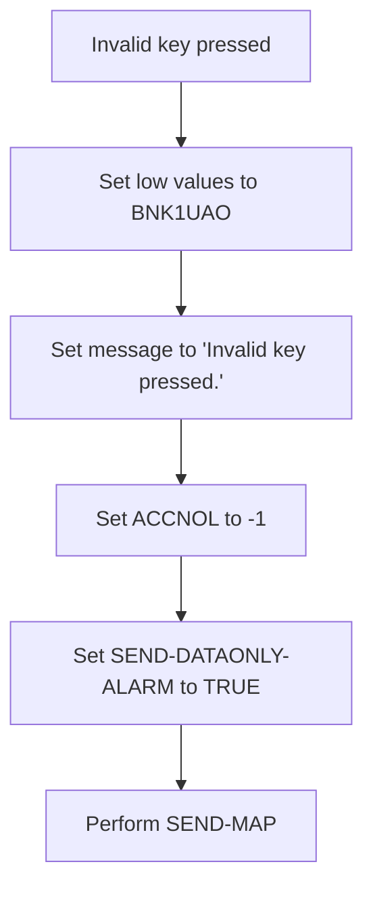

<SwmSnippet path="/src/base/cobol_src/BNK1UAC.cbl" line="264">

---

When an invalid key is pressed by the user, the system first sets <SwmToken path="src/base/cobol_src/BNK1UAC.cbl" pos="267:9:9" line-data="                 MOVE LOW-VALUES TO BNK1UAO">`BNK1UAO`</SwmToken> to low values, which likely resets or clears the output area. Then, it sets the <SwmToken path="src/base/cobol_src/BNK1UAC.cbl" pos="268:14:14" line-data="                 MOVE &#39;Invalid key pressed.&#39; TO MESSAGEO">`MESSAGEO`</SwmToken> to 'Invalid key pressed.' to inform the user of the error. Following this, <SwmToken path="src/base/cobol_src/BNK1UAC.cbl" pos="269:8:8" line-data="                 MOVE -1 TO ACCNOL">`ACCNOL`</SwmToken> is set to -1, which might indicate an error state or invalid account number. The <SwmToken path="src/base/cobol_src/BNK1UAC.cbl" pos="270:3:7" line-data="                 SET SEND-DATAONLY-ALARM TO TRUE">`SEND-DATAONLY-ALARM`</SwmToken> is then set to TRUE, which could trigger an alarm or notification. Finally, the <SwmToken path="src/base/cobol_src/BNK1UAC.cbl" pos="271:3:5" line-data="                 PERFORM SEND-MAP">`SEND-MAP`</SwmToken> operation is performed to send the updated map back to the user interface, ensuring the user is informed of the invalid key press.

```cobol
      *       When anything else happens, send the invalid key message
      *
              WHEN OTHER
                 MOVE LOW-VALUES TO BNK1UAO
                 MOVE 'Invalid key pressed.' TO MESSAGEO
                 MOVE -1 TO ACCNOL
                 SET SEND-DATAONLY-ALARM TO TRUE
                 PERFORM SEND-MAP

```

---

</SwmSnippet>

## Set return information

This is the next section of the flow.

```mermaid
graph TD
  A[Check if it is the first execution] -->|No| B[Set return information]
  B --> C[Move COMM-EYE to WS-COMM-EYE]
  B --> D[Move COMM-CUSTNO to WS-COMM-CUSTNO]
  B --> E[Move COMM-SCODE to WS-COMM-SCODE]
  B --> F[Move COMM-ACCNO to WS-COMM-ACCNO]
  B --> G[Move COMM-ACC-TYPE to WS-COMM-ACC-TYPE]
  B --> H[Move COMM-INT-RATE to WS-COMM-INT-RATE]
  B --> I[Move COMM-OPENED to WS-COMM-OPENED]
  B --> J[Move COMM-OVERDRAFT to WS-COMM-OVERDRAFT]
  B --> K[Move COMM-LAST-STMT-DT to WS-COMM-LAST-STMT-DT]
  B --> L[Move COMM-NEXT-STMT-DT to WS-COMM-NEXT-STMT-DT]
  B --> M[Move COMM-AVAIL-BAL to WS-COMM-AVAIL-BAL]
  B --> N[Move COMM-ACTUAL-BAL to WS-COMM-ACTUAL-BAL]

%% Swimm:
%% graph TD
%%   A[Check if it is the first execution] -->|No| B[Set return information]
%%   B --> C[Move <SwmToken path="src/base/cobol_src/BNK1UAC.cbl" pos="281:3:5" line-data="              MOVE COMM-EYE            TO WS-COMM-EYE">`COMM-EYE`</SwmToken> to <SwmToken path="src/base/cobol_src/BNK1UAC.cbl" pos="281:9:13" line-data="              MOVE COMM-EYE            TO WS-COMM-EYE">`WS-COMM-EYE`</SwmToken>]
%%   B --> D[Move <SwmToken path="src/base/cobol_src/BNK1UAC.cbl" pos="282:3:5" line-data="              MOVE COMM-CUSTNO         TO WS-COMM-CUSTNO">`COMM-CUSTNO`</SwmToken> to <SwmToken path="src/base/cobol_src/BNK1UAC.cbl" pos="282:9:13" line-data="              MOVE COMM-CUSTNO         TO WS-COMM-CUSTNO">`WS-COMM-CUSTNO`</SwmToken>]
%%   B --> E[Move <SwmToken path="src/base/cobol_src/BNK1UAC.cbl" pos="283:3:5" line-data="              MOVE COMM-SCODE          TO WS-COMM-SCODE">`COMM-SCODE`</SwmToken> to <SwmToken path="src/base/cobol_src/BNK1UAC.cbl" pos="283:9:13" line-data="              MOVE COMM-SCODE          TO WS-COMM-SCODE">`WS-COMM-SCODE`</SwmToken>]
%%   B --> F[Move <SwmToken path="src/base/cobol_src/BNK1UAC.cbl" pos="284:3:5" line-data="              MOVE COMM-ACCNO          TO WS-COMM-ACCNO">`COMM-ACCNO`</SwmToken> to <SwmToken path="src/base/cobol_src/BNK1UAC.cbl" pos="284:9:13" line-data="              MOVE COMM-ACCNO          TO WS-COMM-ACCNO">`WS-COMM-ACCNO`</SwmToken>]
%%   B --> G[Move <SwmToken path="src/base/cobol_src/BNK1UAC.cbl" pos="285:3:7" line-data="              MOVE COMM-ACC-TYPE       TO WS-COMM-ACC-TYPE">`COMM-ACC-TYPE`</SwmToken> to <SwmToken path="src/base/cobol_src/BNK1UAC.cbl" pos="285:11:17" line-data="              MOVE COMM-ACC-TYPE       TO WS-COMM-ACC-TYPE">`WS-COMM-ACC-TYPE`</SwmToken>]
%%   B --> H[Move <SwmToken path="src/base/cobol_src/BNK1UAC.cbl" pos="286:3:7" line-data="              MOVE COMM-INT-RATE       TO WS-COMM-INT-RATE">`COMM-INT-RATE`</SwmToken> to <SwmToken path="src/base/cobol_src/BNK1UAC.cbl" pos="286:11:17" line-data="              MOVE COMM-INT-RATE       TO WS-COMM-INT-RATE">`WS-COMM-INT-RATE`</SwmToken>]
%%   B --> I[Move <SwmToken path="src/base/cobol_src/BNK1UAC.cbl" pos="287:3:5" line-data="              MOVE COMM-OPENED         TO WS-COMM-OPENED">`COMM-OPENED`</SwmToken> to <SwmToken path="src/base/cobol_src/BNK1UAC.cbl" pos="287:9:13" line-data="              MOVE COMM-OPENED         TO WS-COMM-OPENED">`WS-COMM-OPENED`</SwmToken>]
%%   B --> J[Move <SwmToken path="src/base/cobol_src/BNK1UAC.cbl" pos="288:3:5" line-data="              MOVE COMM-OVERDRAFT      TO WS-COMM-OVERDRAFT">`COMM-OVERDRAFT`</SwmToken> to <SwmToken path="src/base/cobol_src/BNK1UAC.cbl" pos="288:9:13" line-data="              MOVE COMM-OVERDRAFT      TO WS-COMM-OVERDRAFT">`WS-COMM-OVERDRAFT`</SwmToken>]
%%   B --> K[Move <SwmToken path="src/base/cobol_src/BNK1UAC.cbl" pos="289:3:9" line-data="              MOVE COMM-LAST-STMT-DT   TO WS-COMM-LAST-STMT-DT">`COMM-LAST-STMT-DT`</SwmToken> to <SwmToken path="src/base/cobol_src/BNK1UAC.cbl" pos="289:13:21" line-data="              MOVE COMM-LAST-STMT-DT   TO WS-COMM-LAST-STMT-DT">`WS-COMM-LAST-STMT-DT`</SwmToken>]
%%   B --> L[Move <SwmToken path="src/base/cobol_src/BNK1UAC.cbl" pos="290:3:9" line-data="              MOVE COMM-NEXT-STMT-DT   TO WS-COMM-NEXT-STMT-DT">`COMM-NEXT-STMT-DT`</SwmToken> to <SwmToken path="src/base/cobol_src/BNK1UAC.cbl" pos="290:13:21" line-data="              MOVE COMM-NEXT-STMT-DT   TO WS-COMM-NEXT-STMT-DT">`WS-COMM-NEXT-STMT-DT`</SwmToken>]
%%   B --> M[Move <SwmToken path="src/base/cobol_src/BNK1UAC.cbl" pos="291:3:7" line-data="              MOVE COMM-AVAIL-BAL      TO WS-COMM-AVAIL-BAL">`COMM-AVAIL-BAL`</SwmToken> to <SwmToken path="src/base/cobol_src/BNK1UAC.cbl" pos="291:11:17" line-data="              MOVE COMM-AVAIL-BAL      TO WS-COMM-AVAIL-BAL">`WS-COMM-AVAIL-BAL`</SwmToken>]
%%   B --> N[Move <SwmToken path="src/base/cobol_src/BNK1UAC.cbl" pos="292:3:7" line-data="              MOVE COMM-ACTUAL-BAL     TO WS-COMM-ACTUAL-BAL">`COMM-ACTUAL-BAL`</SwmToken> to <SwmToken path="src/base/cobol_src/BNK1UAC.cbl" pos="292:11:17" line-data="              MOVE COMM-ACTUAL-BAL     TO WS-COMM-ACTUAL-BAL">`WS-COMM-ACTUAL-BAL`</SwmToken>]
```

<SwmSnippet path="/src/base/cobol_src/BNK1UAC.cbl" line="280">

---

If it is not the first time through, we set the return information accordingly by checking if <SwmToken path="src/base/cobol_src/BNK1UAC.cbl" pos="280:3:3" line-data="           IF EIBCALEN NOT = ZERO">`EIBCALEN`</SwmToken> (which indicates the length of the communication area) is not zero. If this condition is met, we proceed to move various fields from the communication area to working storage fields. Specifically, we move <SwmToken path="src/base/cobol_src/BNK1UAC.cbl" pos="281:3:5" line-data="              MOVE COMM-EYE            TO WS-COMM-EYE">`COMM-EYE`</SwmToken> to <SwmToken path="src/base/cobol_src/BNK1UAC.cbl" pos="281:9:13" line-data="              MOVE COMM-EYE            TO WS-COMM-EYE">`WS-COMM-EYE`</SwmToken>, <SwmToken path="src/base/cobol_src/BNK1UAC.cbl" pos="282:3:5" line-data="              MOVE COMM-CUSTNO         TO WS-COMM-CUSTNO">`COMM-CUSTNO`</SwmToken> to <SwmToken path="src/base/cobol_src/BNK1UAC.cbl" pos="282:9:13" line-data="              MOVE COMM-CUSTNO         TO WS-COMM-CUSTNO">`WS-COMM-CUSTNO`</SwmToken>, <SwmToken path="src/base/cobol_src/BNK1UAC.cbl" pos="283:3:5" line-data="              MOVE COMM-SCODE          TO WS-COMM-SCODE">`COMM-SCODE`</SwmToken> to <SwmToken path="src/base/cobol_src/BNK1UAC.cbl" pos="283:9:13" line-data="              MOVE COMM-SCODE          TO WS-COMM-SCODE">`WS-COMM-SCODE`</SwmToken>, <SwmToken path="src/base/cobol_src/BNK1UAC.cbl" pos="284:3:5" line-data="              MOVE COMM-ACCNO          TO WS-COMM-ACCNO">`COMM-ACCNO`</SwmToken> to <SwmToken path="src/base/cobol_src/BNK1UAC.cbl" pos="284:9:13" line-data="              MOVE COMM-ACCNO          TO WS-COMM-ACCNO">`WS-COMM-ACCNO`</SwmToken>, <SwmToken path="src/base/cobol_src/BNK1UAC.cbl" pos="285:3:7" line-data="              MOVE COMM-ACC-TYPE       TO WS-COMM-ACC-TYPE">`COMM-ACC-TYPE`</SwmToken> to <SwmToken path="src/base/cobol_src/BNK1UAC.cbl" pos="285:11:17" line-data="              MOVE COMM-ACC-TYPE       TO WS-COMM-ACC-TYPE">`WS-COMM-ACC-TYPE`</SwmToken>, <SwmToken path="src/base/cobol_src/BNK1UAC.cbl" pos="286:3:7" line-data="              MOVE COMM-INT-RATE       TO WS-COMM-INT-RATE">`COMM-INT-RATE`</SwmToken> to <SwmToken path="src/base/cobol_src/BNK1UAC.cbl" pos="286:11:17" line-data="              MOVE COMM-INT-RATE       TO WS-COMM-INT-RATE">`WS-COMM-INT-RATE`</SwmToken>, <SwmToken path="src/base/cobol_src/BNK1UAC.cbl" pos="287:3:5" line-data="              MOVE COMM-OPENED         TO WS-COMM-OPENED">`COMM-OPENED`</SwmToken> to <SwmToken path="src/base/cobol_src/BNK1UAC.cbl" pos="287:9:13" line-data="              MOVE COMM-OPENED         TO WS-COMM-OPENED">`WS-COMM-OPENED`</SwmToken>, <SwmToken path="src/base/cobol_src/BNK1UAC.cbl" pos="288:3:5" line-data="              MOVE COMM-OVERDRAFT      TO WS-COMM-OVERDRAFT">`COMM-OVERDRAFT`</SwmToken> to <SwmToken path="src/base/cobol_src/BNK1UAC.cbl" pos="288:9:13" line-data="              MOVE COMM-OVERDRAFT      TO WS-COMM-OVERDRAFT">`WS-COMM-OVERDRAFT`</SwmToken>, <SwmToken path="src/base/cobol_src/BNK1UAC.cbl" pos="289:3:9" line-data="              MOVE COMM-LAST-STMT-DT   TO WS-COMM-LAST-STMT-DT">`COMM-LAST-STMT-DT`</SwmToken> to <SwmToken path="src/base/cobol_src/BNK1UAC.cbl" pos="289:13:21" line-data="              MOVE COMM-LAST-STMT-DT   TO WS-COMM-LAST-STMT-DT">`WS-COMM-LAST-STMT-DT`</SwmToken>, <SwmToken path="src/base/cobol_src/BNK1UAC.cbl" pos="290:3:9" line-data="              MOVE COMM-NEXT-STMT-DT   TO WS-COMM-NEXT-STMT-DT">`COMM-NEXT-STMT-DT`</SwmToken> to <SwmToken path="src/base/cobol_src/BNK1UAC.cbl" pos="290:13:21" line-data="              MOVE COMM-NEXT-STMT-DT   TO WS-COMM-NEXT-STMT-DT">`WS-COMM-NEXT-STMT-DT`</SwmToken>, <SwmToken path="src/base/cobol_src/BNK1UAC.cbl" pos="291:3:7" line-data="              MOVE COMM-AVAIL-BAL      TO WS-COMM-AVAIL-BAL">`COMM-AVAIL-BAL`</SwmToken> to <SwmToken path="src/base/cobol_src/BNK1UAC.cbl" pos="291:11:17" line-data="              MOVE COMM-AVAIL-BAL      TO WS-COMM-AVAIL-BAL">`WS-COMM-AVAIL-BAL`</SwmToken>, and <SwmToken path="src/base/cobol_src/BNK1UAC.cbl" pos="292:3:7" line-data="              MOVE COMM-ACTUAL-BAL     TO WS-COMM-ACTUAL-BAL">`COMM-ACTUAL-BAL`</SwmToken> to <SwmToken path="src/base/cobol_src/BNK1UAC.cbl" pos="292:11:17" line-data="              MOVE COMM-ACTUAL-BAL     TO WS-COMM-ACTUAL-BAL">`WS-COMM-ACTUAL-BAL`</SwmToken>. This ensures that the necessary data is available for subsequent processing steps.

```cobol
           IF EIBCALEN NOT = ZERO
              MOVE COMM-EYE            TO WS-COMM-EYE
              MOVE COMM-CUSTNO         TO WS-COMM-CUSTNO
              MOVE COMM-SCODE          TO WS-COMM-SCODE
              MOVE COMM-ACCNO          TO WS-COMM-ACCNO
              MOVE COMM-ACC-TYPE       TO WS-COMM-ACC-TYPE
              MOVE COMM-INT-RATE       TO WS-COMM-INT-RATE
              MOVE COMM-OPENED         TO WS-COMM-OPENED
              MOVE COMM-OVERDRAFT      TO WS-COMM-OVERDRAFT
              MOVE COMM-LAST-STMT-DT   TO WS-COMM-LAST-STMT-DT
              MOVE COMM-NEXT-STMT-DT   TO WS-COMM-NEXT-STMT-DT
              MOVE COMM-AVAIL-BAL      TO WS-COMM-AVAIL-BAL
              MOVE COMM-ACTUAL-BAL     TO WS-COMM-ACTUAL-BAL
           END-IF.
```

---

</SwmSnippet>

## Execute CICS return

This is the next section of the flow.

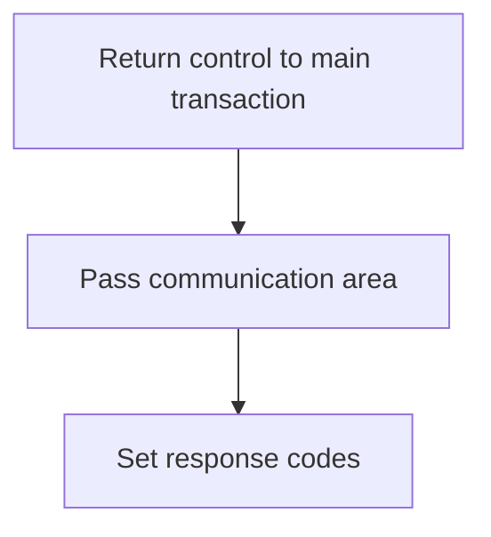

<SwmSnippet path="/src/base/cobol_src/BNK1UAC.cbl" line="295">

---

The <SwmToken path="src/base/cobol_src/BNK1UAC.cbl" pos="197:1:1" line-data="       PREMIERE SECTION.">`PREMIERE`</SwmToken> function returns control to the main transaction identified by <SwmToken path="src/base/cobol_src/BNK1UAC.cbl" pos="296:6:6" line-data="              RETURN TRANSID(&#39;OUAC&#39;)">`OUAC`</SwmToken>. This is done by specifying the <SwmToken path="src/base/cobol_src/BNK1UAC.cbl" pos="296:3:8" line-data="              RETURN TRANSID(&#39;OUAC&#39;)">`TRANSID('OUAC')`</SwmToken> parameter, which indicates the transaction to which control should be returned.

```cobol
           EXEC CICS
              RETURN TRANSID('OUAC')
              COMMAREA(WS-COMM-AREA)
              LENGTH(99)
              RESP(WS-CICS-RESP)
              RESP2(WS-CICS-RESP2)
           END-EXEC.
```

---

</SwmSnippet>

## Handle CICS return errors

Now, lets zoom into this section of the flow:

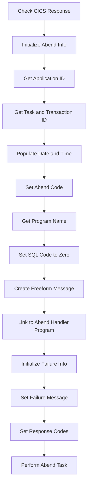

First, the code checks if the CICS response is not normal by evaluating <SwmToken path="src/base/cobol_src/BNK1UAC.cbl" pos="225:3:7" line-data="                    RESP(WS-CICS-RESP)">`WS-CICS-RESP`</SwmToken> against <SwmToken path="src/base/cobol_src/BNK1UAC.cbl" pos="303:13:16" line-data="           IF WS-CICS-RESP NOT = DFHRESP(NORMAL)">`DFHRESP(NORMAL)`</SwmToken>.

<SwmSnippet path="/src/base/cobol_src/BNK1UAC.cbl" line="310">

---

If the response is not normal, it initializes the abend information record using <SwmToken path="src/base/cobol_src/BNK1UAC.cbl" pos="310:1:5" line-data="              INITIALIZE ABNDINFO-REC">`INITIALIZE ABNDINFO-REC`</SwmToken>.

```cobol
              INITIALIZE ABNDINFO-REC
```

---

</SwmSnippet>

<SwmSnippet path="/src/base/cobol_src/BNK1UAC.cbl" line="311">

---

Next, it moves the response codes <SwmToken path="src/base/cobol_src/BNK1UAC.cbl" pos="311:3:3" line-data="              MOVE EIBRESP    TO ABND-RESPCODE">`EIBRESP`</SwmToken> and <SwmToken path="src/base/cobol_src/BNK1UAC.cbl" pos="312:3:3" line-data="              MOVE EIBRESP2   TO ABND-RESP2CODE">`EIBRESP2`</SwmToken> to <SwmToken path="src/base/cobol_src/BNK1UAC.cbl" pos="311:7:9" line-data="              MOVE EIBRESP    TO ABND-RESPCODE">`ABND-RESPCODE`</SwmToken> and <SwmToken path="src/base/cobol_src/BNK1UAC.cbl" pos="312:7:9" line-data="              MOVE EIBRESP2   TO ABND-RESP2CODE">`ABND-RESP2CODE`</SwmToken> respectively.

```cobol
              MOVE EIBRESP    TO ABND-RESPCODE
              MOVE EIBRESP2   TO ABND-RESP2CODE
```

---

</SwmSnippet>

<SwmSnippet path="/src/base/cobol_src/BNK1UAC.cbl" line="316">

---

The application ID is then retrieved and assigned to <SwmToken path="src/base/cobol_src/BNK1UAC.cbl" pos="316:9:11" line-data="              EXEC CICS ASSIGN APPLID(ABND-APPLID)">`ABND-APPLID`</SwmToken> using the <SwmToken path="src/base/cobol_src/BNK1UAC.cbl" pos="316:1:7" line-data="              EXEC CICS ASSIGN APPLID(ABND-APPLID)">`EXEC CICS ASSIGN APPLID`</SwmToken> command.

```cobol
              EXEC CICS ASSIGN APPLID(ABND-APPLID)
              END-EXEC
```

---

</SwmSnippet>

<SwmSnippet path="/src/base/cobol_src/BNK1UAC.cbl" line="319">

---

Moving to the next step, the task number and transaction ID are assigned to <SwmToken path="src/base/cobol_src/BNK1UAC.cbl" pos="319:7:11" line-data="              MOVE EIBTASKN   TO ABND-TASKNO-KEY">`ABND-TASKNO-KEY`</SwmToken> and <SwmToken path="src/base/cobol_src/BNK1UAC.cbl" pos="320:7:9" line-data="              MOVE EIBTRNID   TO ABND-TRANID">`ABND-TRANID`</SwmToken> respectively.

```cobol
              MOVE EIBTASKN   TO ABND-TASKNO-KEY
              MOVE EIBTRNID   TO ABND-TRANID
```

---

</SwmSnippet>

<SwmSnippet path="/src/base/cobol_src/BNK1UAC.cbl" line="322">

---

The code then performs the <SwmToken path="src/base/cobol_src/BNK1UAC.cbl" pos="322:3:7" line-data="              PERFORM POPULATE-TIME-DATE">`POPULATE-TIME-DATE`</SwmToken> routine to get the current date and time, which are then formatted and moved to <SwmToken path="src/base/cobol_src/BNK1UAC.cbl" pos="324:11:13" line-data="              MOVE WS-ORIG-DATE TO ABND-DATE">`ABND-DATE`</SwmToken> and <SwmToken path="src/base/cobol_src/BNK1UAC.cbl" pos="330:3:5" line-data="                     INTO ABND-TIME">`ABND-TIME`</SwmToken>.

```cobol
              PERFORM POPULATE-TIME-DATE

              MOVE WS-ORIG-DATE TO ABND-DATE
              STRING WS-TIME-NOW-GRP-HH DELIMITED BY SIZE,
                    ':' DELIMITED BY SIZE,
                     WS-TIME-NOW-GRP-MM DELIMITED BY SIZE,
                     ':' DELIMITED BY SIZE,
                     WS-TIME-NOW-GRP-MM DELIMITED BY SIZE
                     INTO ABND-TIME
```

---

</SwmSnippet>

<SwmSnippet path="/src/base/cobol_src/BNK1UAC.cbl" line="333">

---

The universal time is moved to <SwmToken path="src/base/cobol_src/BNK1UAC.cbl" pos="333:11:15" line-data="              MOVE WS-U-TIME   TO ABND-UTIME-KEY">`ABND-UTIME-KEY`</SwmToken>, and the abend code 'HBNK' is set in <SwmToken path="src/base/cobol_src/BNK1UAC.cbl" pos="334:9:11" line-data="              MOVE &#39;HBNK&#39;      TO ABND-CODE">`ABND-CODE`</SwmToken>.

```cobol
              MOVE WS-U-TIME   TO ABND-UTIME-KEY
              MOVE 'HBNK'      TO ABND-CODE
```

---

</SwmSnippet>

<SwmSnippet path="/src/base/cobol_src/BNK1UAC.cbl" line="336">

---

The program name is assigned to <SwmToken path="src/base/cobol_src/BNK1UAC.cbl" pos="336:9:11" line-data="              EXEC CICS ASSIGN PROGRAM(ABND-PROGRAM)">`ABND-PROGRAM`</SwmToken> using the <SwmToken path="src/base/cobol_src/BNK1UAC.cbl" pos="336:1:7" line-data="              EXEC CICS ASSIGN PROGRAM(ABND-PROGRAM)">`EXEC CICS ASSIGN PROGRAM`</SwmToken> command.

```cobol
              EXEC CICS ASSIGN PROGRAM(ABND-PROGRAM)
              END-EXEC
```

---

</SwmSnippet>

<SwmSnippet path="/src/base/cobol_src/BNK1UAC.cbl" line="339">

---

The SQL code is set to zero in <SwmToken path="src/base/cobol_src/BNK1UAC.cbl" pos="339:7:9" line-data="              MOVE ZEROS      TO ABND-SQLCODE">`ABND-SQLCODE`</SwmToken>, and a freeform message is created and moved to <SwmToken path="src/base/cobol_src/BNK1UAC.cbl" pos="347:3:5" line-data="                    INTO ABND-FREEFORM">`ABND-FREEFORM`</SwmToken>.

```cobol
              MOVE ZEROS      TO ABND-SQLCODE

              STRING 'A010 - RETURN TRANSID(OUAC) FAIL.'
                    DELIMITED BY SIZE,
                    ' EIBRESP=' DELIMITED BY SIZE,
                    ABND-RESPCODE DELIMITED BY SIZE,
                    ' RESP2=' DELIMITED BY SIZE,
                    ABND-RESP2CODE DELIMITED BY SIZE
                    INTO ABND-FREEFORM
```

---

</SwmSnippet>

<SwmSnippet path="/src/base/cobol_src/BNK1UAC.cbl" line="350">

---

The code then links to the abend handler program specified in <SwmToken path="src/base/cobol_src/BNK1UAC.cbl" pos="350:9:13" line-data="              EXEC CICS LINK PROGRAM(WS-ABEND-PGM)">`WS-ABEND-PGM`</SwmToken>, passing the <SwmToken path="src/base/cobol_src/BNK1UAC.cbl" pos="351:3:5" line-data="                        COMMAREA(ABNDINFO-REC)">`ABNDINFO-REC`</SwmToken> as the communication area.

```cobol
              EXEC CICS LINK PROGRAM(WS-ABEND-PGM)
                        COMMAREA(ABNDINFO-REC)
              END-EXEC
```

---

</SwmSnippet>

<SwmSnippet path="/src/base/cobol_src/BNK1UAC.cbl" line="354">

---

Finally, it initializes the failure information and sets the failure message, response codes, and performs the abend task.

```cobol
              INITIALIZE WS-FAIL-INFO
              MOVE 'BNK1UAC - A010 - RETURN TRANSID(OUAC) FAIL' TO
                 WS-CICS-FAIL-MSG
              MOVE WS-CICS-RESP  TO WS-CICS-RESP-DISP
              MOVE WS-CICS-RESP2 TO WS-CICS-RESP2-DISP
              PERFORM ABEND-THIS-TASK
```

---

</SwmSnippet>

&nbsp;

*This is an auto-generated document by Swimm 🌊 and has not yet been verified by a human*

<SwmMeta version="3.0.0" repo-id="Z2l0aHViJTNBJTNBY2ljcy1iYW5raW5nLXNhbXBsZS1hcHBsaWNhdGlvbi1jYnNhLUlCTS1EZW1vJTNBJTNBU3dpbW0tRGVtbw==" repo-name="cics-banking-sample-application-cbsa-IBM-Demo"><sup>Powered by [Swimm](/)</sup></SwmMeta>
