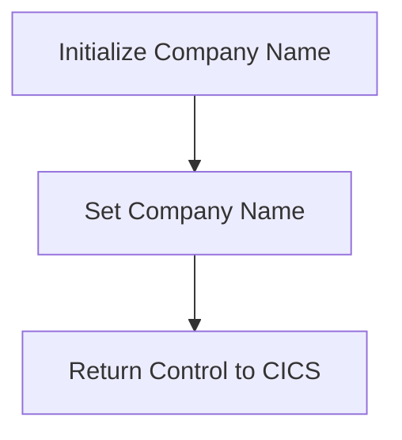

The GETCOMPY program is responsible for initializing and setting the company name for the CICS Bank Sample Application. This is achieved by defining the PREMIERE section to initialize the company name, setting the company name to 'CICS Bank Sample Application', and then returning control to CICS.

The flow starts with initializing the company name in the PREMIERE section. Then, the company name 'CICS Bank Sample Application' is set to the <SwmToken path="src/base/cobol_src/GETCOMPY.cbl" pos="38:15:17" line-data="           move &#39;CICS Bank Sample Application&#39; to COMPANY-NAME.">`COMPANY-NAME`</SwmToken> variable. Finally, control is returned to CICS, indicating that the initialization process is complete.

Lets' zoom into the flow:



<SwmSnippet path="/src/base/cobol_src/GETCOMPY.cbl" line="36">

---

## Initialize Company Name

First, the <SwmToken path="src/base/cobol_src/GETCOMPY.cbl" pos="36:1:1" line-data="       PREMIERE SECTION.">`PREMIERE`</SwmToken> section is defined, which is responsible for initializing the company name for the application.

```cobol
       PREMIERE SECTION.
       A010.
```

---

</SwmSnippet>

<SwmSnippet path="/src/base/cobol_src/GETCOMPY.cbl" line="38">

---

## Set Company Name

Next, the company name 'CICS Bank Sample Application' is moved to the <SwmToken path="src/base/cobol_src/GETCOMPY.cbl" pos="38:15:17" line-data="           move &#39;CICS Bank Sample Application&#39; to COMPANY-NAME.">`COMPANY-NAME`</SwmToken> variable. This sets the company name that will be used throughout the application.

```cobol
           move 'CICS Bank Sample Application' to COMPANY-NAME.
```

---

</SwmSnippet>

<SwmSnippet path="/src/base/cobol_src/GETCOMPY.cbl" line="40">

---

## Return Control to CICS

Then, the <SwmToken path="src/base/cobol_src/GETCOMPY.cbl" pos="40:1:5" line-data="           EXEC CICS RETURN">`EXEC CICS RETURN`</SwmToken> command is executed to return control back to CICS, indicating that the initialization is complete.

```cobol
           EXEC CICS RETURN
           END-EXEC.
```

---

</SwmSnippet>

&nbsp;

*This is an auto-generated document by Swimm 🌊 and has not yet been verified by a human*

<SwmMeta version="3.0.0" repo-id="Z2l0aHViJTNBJTNBY2ljcy1iYW5raW5nLXNhbXBsZS1hcHBsaWNhdGlvbi1jYnNhLUlCTS1EZW1vJTNBJTNBU3dpbW0tRGVtbw==" repo-name="cics-banking-sample-application-cbsa-IBM-Demo"><sup>Powered by [Swimm](/)</sup></SwmMeta>
