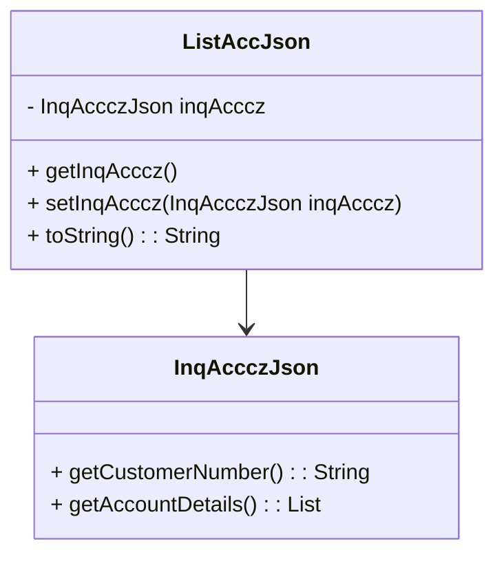

# Introduction to <SwmToken path="src/Z-OS-Connect-Customer-Services-Interface/src/main/java/com/ibm/cics/cip/bank/springboot/customerservices/controllers/WebController.java" pos="43:20:20" line-data="import com.ibm.cics.cip.bank.springboot.customerservices.jsonclasses.listaccounts.ListAccJson;">`ListAccJson`</SwmToken>

The <SwmToken path="src/Z-OS-Connect-Customer-Services-Interface/src/main/java/com/ibm/cics/cip/bank/springboot/customerservices/controllers/WebController.java" pos="43:20:20" line-data="import com.ibm.cics.cip.bank.springboot.customerservices.jsonclasses.listaccounts.ListAccJson;">`ListAccJson`</SwmToken> class is part of the package <SwmToken path="src/Z-OS-Connect-Customer-Services-Interface/src/main/java/com/ibm/cics/cip/bank/springboot/customerservices/controllers/WebController.java" pos="43:2:18" line-data="import com.ibm.cics.cip.bank.springboot.customerservices.jsonclasses.listaccounts.ListAccJson;">`com.ibm.cics.cip.bank.springboot.customerservices.jsonclasses.listaccounts`</SwmToken>. This class is designed to represent the JSON structure for listing accounts.

# Fields and Annotations

The <SwmToken path="src/Z-OS-Connect-Customer-Services-Interface/src/main/java/com/ibm/cics/cip/bank/springboot/customerservices/controllers/WebController.java" pos="43:20:20" line-data="import com.ibm.cics.cip.bank.springboot.customerservices.jsonclasses.listaccounts.ListAccJson;">`ListAccJson`</SwmToken> class contains a field named `inqAcccz` of type `InqAccczJson`. This field is annotated with `@JsonProperty("INQACCCZ")` to map the JSON property `INQACCCZ` to the `inqAcccz` field.

# Methods

The class provides getter and setter methods for the `inqAcccz` field. Additionally, the <SwmToken path="src/Z-OS-Connect-Customer-Services-Interface/src/main/java/com/ibm/cics/cip/bank/springboot/customerservices/controllers/WebController.java" pos="192:7:7" line-data="				log.info(e.toString());">`toString`</SwmToken> method is overridden to provide a string representation of the <SwmToken path="src/Z-OS-Connect-Customer-Services-Interface/src/main/java/com/ibm/cics/cip/bank/springboot/customerservices/controllers/WebController.java" pos="43:20:20" line-data="import com.ibm.cics.cip.bank.springboot.customerservices.jsonclasses.listaccounts.ListAccJson;">`ListAccJson`</SwmToken> object.

# Usage in Listing Accounts

To display the accounts for a particular customer, the user can click on "List accounts belonging to customer". The Liberty UI offers an option to list or search for accounts.

# Integration with <SwmToken path="src/Z-OS-Connect-Customer-Services-Interface/src/main/java/com/ibm/cics/cip/bank/springboot/customerservices/controllers/WebController.java" pos="54:4:4" line-data="public class WebController implements WebMvcConfigurer">`WebController`</SwmToken>

The <SwmToken path="src/Z-OS-Connect-Customer-Services-Interface/src/main/java/com/ibm/cics/cip/bank/springboot/customerservices/controllers/WebController.java" pos="332:5:5" line-data="						+ responseObj.getInqacccz().getCustomerNumber() + &quot;:&quot;);">`getInqacccz`</SwmToken> method is used within the <SwmToken path="src/Z-OS-Connect-Customer-Services-Interface/src/main/java/com/ibm/cics/cip/bank/springboot/customerservices/controllers/WebController.java" pos="311:5:5" line-data="	public String returnListAcc(@Valid CustomerEnquiryForm customerEnquiryForm,">`returnListAcc`</SwmToken> method to add attributes to the model. This is demonstrated in the <SwmToken path="src/Z-OS-Connect-Customer-Services-Interface/src/main/java/com/ibm/cics/cip/bank/springboot/customerservices/controllers/WebController.java" pos="54:4:4" line-data="public class WebController implements WebMvcConfigurer">`WebController`</SwmToken> class.

<SwmSnippet path="/src/Z-OS-Connect-Customer-Services-Interface/src/main/java/com/ibm/cics/cip/bank/springboot/customerservices/controllers/WebController.java" line="331">

---

In the <SwmToken path="src/Z-OS-Connect-Customer-Services-Interface/src/main/java/com/ibm/cics/cip/bank/springboot/customerservices/controllers/WebController.java" pos="54:4:4" line-data="public class WebController implements WebMvcConfigurer">`WebController`</SwmToken> class, the <SwmToken path="src/Z-OS-Connect-Customer-Services-Interface/src/main/java/com/ibm/cics/cip/bank/springboot/customerservices/controllers/WebController.java" pos="332:5:5" line-data="						+ responseObj.getInqacccz().getCustomerNumber() + &quot;:&quot;);">`getInqacccz`</SwmToken> method is used to add customer account details to the model. This allows the UI to display the accounts belonging to a customer.

```java
				model.addAttribute(LARGE_TEXT, "Accounts belonging to customer "
						+ responseObj.getInqacccz().getCustomerNumber() + ":");
				model.addAttribute("accounts",
						responseObj.getInqacccz().getAccountDetails());
			}
```

---

</SwmSnippet>



&nbsp;

*This is an auto-generated document by Swimm 🌊 and has not yet been verified by a human*

<SwmMeta version="3.0.0" repo-id="Z2l0aHViJTNBJTNBY2ljcy1iYW5raW5nLXNhbXBsZS1hcHBsaWNhdGlvbi1jYnNhLUlCTS1EZW1vJTNBJTNBU3dpbW0tRGVtbw==" repo-name="cics-banking-sample-application-cbsa-IBM-Demo"><sup>Powered by [Swimm](/)</sup></SwmMeta>
