The <SwmToken path="src/base/cobol_src/BNK1CCA.cbl" pos="285:4:4" line-data="              MOVE &#39;BNK1CCA - A010 - RETURN TRANSID(OCCA) FAIL&#39; TO">`BNK1CCA`</SwmToken> program handles various user interactions within the banking application. It manages the initial setup, processes different key inputs, and ensures smooth navigation and error handling. The program achieves this by evaluating user inputs and executing corresponding actions to maintain a seamless user experience.

The <SwmToken path="src/base/cobol_src/BNK1CCA.cbl" pos="285:4:4" line-data="              MOVE &#39;BNK1CCA - A010 - RETURN TRANSID(OCCA) FAIL&#39; TO">`BNK1CCA`</SwmToken> program starts by checking if it is the first time through and initializes account data if necessary. It then processes various key inputs such as PA keys, the <SwmToken path="src/base/cobol_src/BNK1CCA.cbl" pos="175:5:5" line-data="      *       When Pf3 is pressed, return to the main menu">`Pf3`</SwmToken> key for returning to the main menu, and the CLEAR key for clearing the screen. The program also handles termination requests and processes data when the enter key is pressed. Additionally, it manages invalid key presses by displaying appropriate messages and ensures proper error handling by logging abend information and linking to the abend handler program.

Here is a high level diagram of the program:

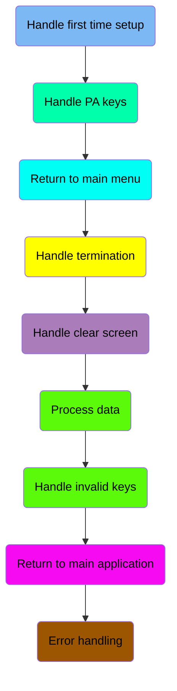

## Handle first time setup

First, we'll zoom into this section of the flow:

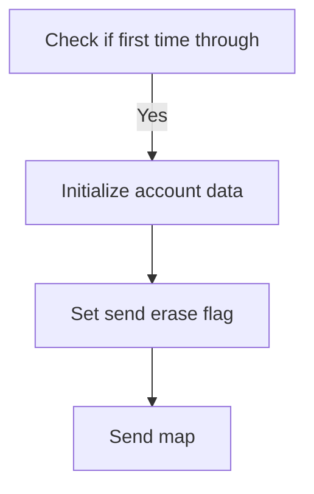

<SwmSnippet path="/src/base/cobol_src/BNK1CCA.cbl" line="162">

---

First, the code checks if it is the first time through by evaluating if <SwmToken path="src/base/cobol_src/BNK1CCA.cbl" pos="162:3:3" line-data="              WHEN EIBCALEN = ZERO">`EIBCALEN`</SwmToken> (which indicates the length of the communication area) is zero.

```cobol
              WHEN EIBCALEN = ZERO
```

---

</SwmSnippet>

<SwmSnippet path="/src/base/cobol_src/BNK1CCA.cbl" line="163">

---

Next, if it is the first time, the code initializes the customer account data by moving <SwmToken path="src/base/cobol_src/BNK1CCA.cbl" pos="163:3:5" line-data="                 MOVE LOW-VALUE TO BNK1ACCO">`LOW-VALUE`</SwmToken> to <SwmToken path="src/base/cobol_src/BNK1CCA.cbl" pos="163:9:9" line-data="                 MOVE LOW-VALUE TO BNK1ACCO">`BNK1ACCO`</SwmToken> (which likely represents an empty or default account value) and setting <SwmToken path="src/base/cobol_src/BNK1CCA.cbl" pos="164:8:8" line-data="                 MOVE -1 TO CUSTNOL">`CUSTNOL`</SwmToken> to -1. It then sets the <SwmToken path="src/base/cobol_src/BNK1CCA.cbl" pos="165:3:5" line-data="                 SET SEND-ERASE TO TRUE">`SEND-ERASE`</SwmToken> flag to true and performs the <SwmToken path="src/base/cobol_src/BNK1CCA.cbl" pos="166:3:5" line-data="                 PERFORM SEND-MAP">`SEND-MAP`</SwmToken> operation to send the map with erased (empty) data fields.

```cobol
                 MOVE LOW-VALUE TO BNK1ACCO
                 MOVE -1 TO CUSTNOL
                 SET SEND-ERASE TO TRUE
                 PERFORM SEND-MAP
```

---

</SwmSnippet>

## Handle PA keys

Now, lets zoom into this section of the flow:

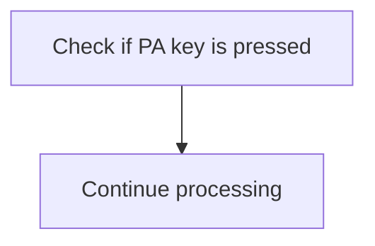

<SwmSnippet path="/src/base/cobol_src/BNK1CCA.cbl" line="168">

---

The <SwmToken path="src/base/cobol_src/BNK1CCA.cbl" pos="153:1:1" line-data="       PREMIERE SECTION.">`PREMIERE`</SwmToken> function checks if any of the PA keys (Program Attention keys) are pressed by evaluating the <SwmToken path="src/base/cobol_src/BNK1CCA.cbl" pos="171:3:3" line-data="              WHEN EIBAID = DFHPA1 OR DFHPA2 OR DFHPA3">`EIBAID`</SwmToken> variable. If <SwmToken path="src/base/cobol_src/BNK1CCA.cbl" pos="171:3:3" line-data="              WHEN EIBAID = DFHPA1 OR DFHPA2 OR DFHPA3">`EIBAID`</SwmToken> matches any of the PA keys (<SwmToken path="src/base/cobol_src/BNK1CCA.cbl" pos="171:7:7" line-data="              WHEN EIBAID = DFHPA1 OR DFHPA2 OR DFHPA3">`DFHPA1`</SwmToken>, <SwmToken path="src/base/cobol_src/BNK1CCA.cbl" pos="171:11:11" line-data="              WHEN EIBAID = DFHPA1 OR DFHPA2 OR DFHPA3">`DFHPA2`</SwmToken>, or <SwmToken path="src/base/cobol_src/BNK1CCA.cbl" pos="171:15:15" line-data="              WHEN EIBAID = DFHPA1 OR DFHPA2 OR DFHPA3">`DFHPA3`</SwmToken>), the function simply continues processing without taking any additional action. This ensures that the application does not interrupt its flow when a PA key is pressed, allowing the user to continue their current task seamlessly.

```cobol
      *
      *       If a PA key is pressed, just carry on
      *
              WHEN EIBAID = DFHPA1 OR DFHPA2 OR DFHPA3
                 CONTINUE
```

---

</SwmSnippet>

## Return to main menu

Now, lets zoom into this section of the flow:

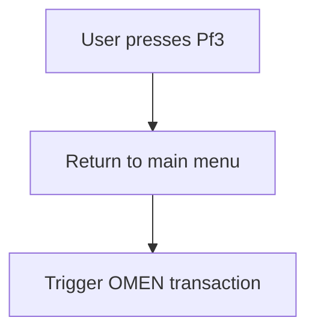

<SwmSnippet path="/src/base/cobol_src/BNK1CCA.cbl" line="177">

---

When the user presses the <SwmToken path="src/base/cobol_src/BNK1CCA.cbl" pos="175:5:5" line-data="      *       When Pf3 is pressed, return to the main menu">`Pf3`</SwmToken> key, the system interprets this action as a request to return to the main menu. This is indicated by checking if <SwmToken path="src/base/cobol_src/BNK1CCA.cbl" pos="177:3:3" line-data="              WHEN EIBAID = DFHPF3">`EIBAID`</SwmToken> (which holds the attention identifier) is equal to <SwmToken path="src/base/cobol_src/BNK1CCA.cbl" pos="177:7:7" line-data="              WHEN EIBAID = DFHPF3">`DFHPF3`</SwmToken> (the identifier for the <SwmToken path="src/base/cobol_src/BNK1CCA.cbl" pos="175:5:5" line-data="      *       When Pf3 is pressed, return to the main menu">`Pf3`</SwmToken> key). If this condition is met, the system executes a CICS RETURN command. This command initiates the <SwmToken path="src/base/cobol_src/BNK1CCA.cbl" pos="179:4:4" line-data="                    TRANSID(&#39;OMEN&#39;)">`OMEN`</SwmToken> transaction immediately, ensuring a quick response. The response codes are stored in <SwmToken path="src/base/cobol_src/BNK1CCA.cbl" pos="181:3:7" line-data="                    RESP(WS-CICS-RESP)">`WS-CICS-RESP`</SwmToken> and <SwmToken path="src/base/cobol_src/BNK1CCA.cbl" pos="182:3:7" line-data="                    RESP2(WS-CICS-RESP2)">`WS-CICS-RESP2`</SwmToken> for further processing or error handling if needed.

```cobol
              WHEN EIBAID = DFHPF3
                 EXEC CICS RETURN
                    TRANSID('OMEN')
                    IMMEDIATE
                    RESP(WS-CICS-RESP)
                    RESP2(WS-CICS-RESP2)
```

---

</SwmSnippet>

## Handle termination

Now, lets zoom into this section of the flow:

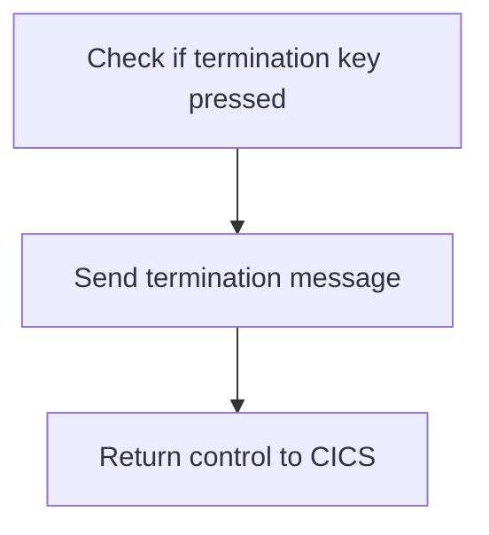

<SwmSnippet path="/src/base/cobol_src/BNK1CCA.cbl" line="189">

---

The function checks if the termination key or PF12 key is pressed by evaluating the <SwmToken path="src/base/cobol_src/BNK1CCA.cbl" pos="189:3:3" line-data="              WHEN EIBAID = DFHAID OR DFHPF12">`EIBAID`</SwmToken> variable. If either key is pressed, it triggers the <SwmToken path="src/base/cobol_src/BNK1CCA.cbl" pos="190:3:7" line-data="                 PERFORM SEND-TERMINATION-MSG">`SEND-TERMINATION-MSG`</SwmToken> routine to send a termination message to the user. Finally, it returns control to the CICS environment, ensuring that the application handles the termination request appropriately.

```cobol
              WHEN EIBAID = DFHAID OR DFHPF12
                 PERFORM SEND-TERMINATION-MSG
                 EXEC CICS
                    RETURN
                 END-EXEC
```

---

</SwmSnippet>

## Handle clear screen

Now, lets zoom into this section of the flow:

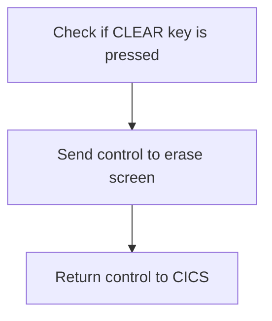

<SwmSnippet path="/src/base/cobol_src/BNK1CCA.cbl" line="198">

---

First, the code checks if the <SwmToken path="src/base/cobol_src/BNK1CCA.cbl" pos="196:5:5" line-data="      *       When CLEAR is pressed">`CLEAR`</SwmToken> key is pressed by evaluating if <SwmToken path="src/base/cobol_src/BNK1CCA.cbl" pos="198:3:3" line-data="              WHEN EIBAID = DFHCLEAR">`EIBAID`</SwmToken> (which holds the attention identifier) is equal to <SwmToken path="src/base/cobol_src/BNK1CCA.cbl" pos="198:7:7" line-data="              WHEN EIBAID = DFHCLEAR">`DFHCLEAR`</SwmToken> (the identifier for the CLEAR key).

```cobol
              WHEN EIBAID = DFHCLEAR
```

---

</SwmSnippet>

<SwmSnippet path="/src/base/cobol_src/BNK1CCA.cbl" line="199">

---

Next, if the <SwmToken path="src/base/cobol_src/BNK1CCA.cbl" pos="196:5:5" line-data="      *       When CLEAR is pressed">`CLEAR`</SwmToken> key is pressed, the code sends a control command to erase the screen and free the keyboard using the <SwmToken path="src/base/cobol_src/BNK1CCA.cbl" pos="199:1:1" line-data="                 EXEC CICS SEND CONTROL">`EXEC`</SwmToken>` `<SwmToken path="src/base/cobol_src/BNK1CCA.cbl" pos="199:3:3" line-data="                 EXEC CICS SEND CONTROL">`CICS`</SwmToken>` `<SwmToken path="src/base/cobol_src/BNK1CCA.cbl" pos="199:5:5" line-data="                 EXEC CICS SEND CONTROL">`SEND`</SwmToken>` `<SwmToken path="src/base/cobol_src/BNK1CCA.cbl" pos="199:7:7" line-data="                 EXEC CICS SEND CONTROL">`CONTROL`</SwmToken>` `<SwmToken path="src/base/cobol_src/BNK1CCA.cbl" pos="200:1:1" line-data="                          ERASE">`ERASE`</SwmToken>` `<SwmToken path="src/base/cobol_src/BNK1CCA.cbl" pos="201:1:1" line-data="                          FREEKB">`FREEKB`</SwmToken> command. Finally, it returns control to CICS with the <SwmToken path="src/base/cobol_src/BNK1CCA.cbl" pos="204:1:5" line-data="                 EXEC CICS RETURN">`EXEC CICS RETURN`</SwmToken> command.

```cobol
                 EXEC CICS SEND CONTROL
                          ERASE
                          FREEKB
                 END-EXEC

                 EXEC CICS RETURN
                 END-EXEC
```

---

</SwmSnippet>

## Interim Summary

So far, we saw how the application handles the first-time setup, processes PA keys, returns to the main menu, handles termination, and clears the screen. Each of these sections ensures that the application responds appropriately to user inputs and maintains a smooth workflow. Now, we will focus on how the application processes data when the enter key is pressed.

## Process data

Now, lets zoom into this section of the flow:

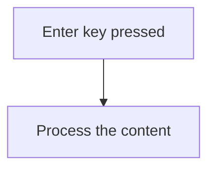

<SwmSnippet path="/src/base/cobol_src/BNK1CCA.cbl" line="208">

---

When the enter key is pressed, the system triggers the processing of the content. This is determined by checking if <SwmToken path="src/base/cobol_src/BNK1CCA.cbl" pos="210:3:3" line-data="              WHEN EIBAID = DFHENTER">`EIBAID`</SwmToken> (which holds the attention identifier) is equal to <SwmToken path="src/base/cobol_src/BNK1CCA.cbl" pos="210:7:7" line-data="              WHEN EIBAID = DFHENTER">`DFHENTER`</SwmToken> (the constant for the enter key). If this condition is met, the <SwmToken path="src/base/cobol_src/BNK1CCA.cbl" pos="211:3:5" line-data="                  PERFORM PROCESS-MAP">`PROCESS-MAP`</SwmToken> routine is performed, which handles the necessary actions to process the content entered by the user.

```cobol
      *       When enter is presseed then process the content
      *
              WHEN EIBAID = DFHENTER
                  PERFORM PROCESS-MAP
```

---

</SwmSnippet>

## Handle invalid keys

Now, lets zoom into this section of the flow:

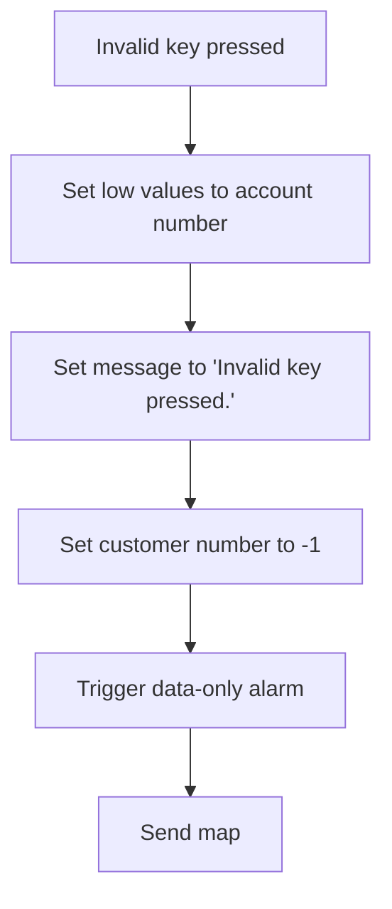

<SwmSnippet path="/src/base/cobol_src/BNK1CCA.cbl" line="214">

---

When an invalid key is pressed by the user, the system first sets <SwmToken path="src/base/cobol_src/BNK1CCA.cbl" pos="217:9:9" line-data="                 MOVE LOW-VALUES TO BNK1ACCO">`BNK1ACCO`</SwmToken> (the account number) to low values, indicating an invalid or empty account number. Next, it sets the <SwmToken path="src/base/cobol_src/BNK1CCA.cbl" pos="218:14:14" line-data="                 MOVE &#39;Invalid key pressed.&#39; TO MESSAGEO">`MESSAGEO`</SwmToken> variable to 'Invalid key pressed.' to inform the user of the error. The <SwmToken path="src/base/cobol_src/BNK1CCA.cbl" pos="219:8:8" line-data="                  MOVE -1 TO CUSTNOL">`CUSTNOL`</SwmToken> variable is then set to -1, which likely indicates an invalid customer number. The system then triggers the <SwmToken path="src/base/cobol_src/BNK1CCA.cbl" pos="220:3:7" line-data="                 SET SEND-DATAONLY-ALARM TO TRUE">`SEND-DATAONLY-ALARM`</SwmToken> to notify that an invalid key was pressed. Finally, the <SwmToken path="src/base/cobol_src/BNK1CCA.cbl" pos="221:3:5" line-data="                 PERFORM SEND-MAP">`SEND-MAP`</SwmToken> operation is performed to update the user interface with the error message.

```cobol
      *       When anything else happens, send the invalid key message
      *
              WHEN OTHER
                 MOVE LOW-VALUES TO BNK1ACCO
                 MOVE 'Invalid key pressed.' TO MESSAGEO
                  MOVE -1 TO CUSTNOL
                 SET SEND-DATAONLY-ALARM TO TRUE
                 PERFORM SEND-MAP

```

---

</SwmSnippet>

## Return to main application

This is the next section of the flow.

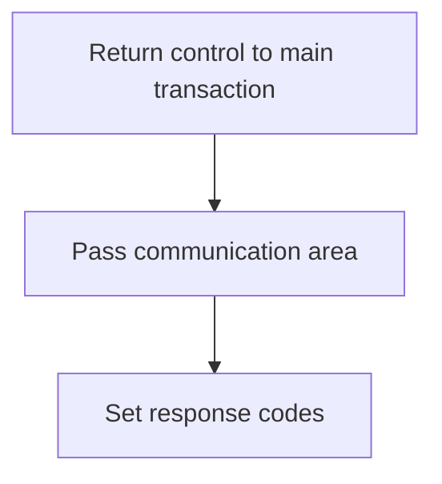

<SwmSnippet path="/src/base/cobol_src/BNK1CCA.cbl" line="225">

---

The <SwmToken path="src/base/cobol_src/BNK1CCA.cbl" pos="153:1:1" line-data="       PREMIERE SECTION.">`PREMIERE`</SwmToken> function returns control to the main transaction identified by the transaction ID 'OCCA'. This is done by using the <SwmToken path="src/base/cobol_src/BNK1CCA.cbl" pos="178:1:5" line-data="                 EXEC CICS RETURN">`EXEC CICS RETURN`</SwmToken> command, which ensures that the control is handed back to the specified transaction.

```cobol
           EXEC CICS
               RETURN TRANSID('OCCA')
               COMMAREA(WS-COMM-AREA)
               LENGTH(248)
               RESP(WS-CICS-RESP)
               RESP2(WS-CICS-RESP2)
           END-EXEC.
```

---

</SwmSnippet>

## Error handling

Now, lets zoom into this section of the flow:

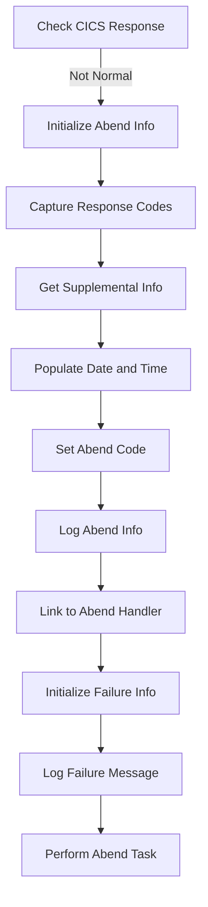

<SwmSnippet path="/src/base/cobol_src/BNK1CCA.cbl" line="233">

---

First, the function checks if the CICS response is not normal. This is crucial to determine if an abnormal end (abend) situation has occurred.

```cobol
           IF WS-CICS-RESP NOT = DFHRESP(NORMAL)
```

---

</SwmSnippet>

<SwmSnippet path="/src/base/cobol_src/BNK1CCA.cbl" line="240">

---

Next, it initializes the abend information record to prepare for capturing relevant details about the abend situation.

```cobol
              INITIALIZE ABNDINFO-REC
```

---

</SwmSnippet>

<SwmSnippet path="/src/base/cobol_src/BNK1CCA.cbl" line="241">

---

Then, it captures the response codes from the CICS environment to include in the abend information.

```cobol
              MOVE EIBRESP    TO ABND-RESPCODE
              MOVE EIBRESP2   TO ABND-RESP2CODE
```

---

</SwmSnippet>

<SwmSnippet path="/src/base/cobol_src/BNK1CCA.cbl" line="246">

---

Moving to the next step, it retrieves supplemental information such as the application ID, task number, and transaction ID.

```cobol
              EXEC CICS ASSIGN APPLID(ABND-APPLID)
              END-EXEC

              MOVE EIBTASKN   TO ABND-TASKNO-KEY
              MOVE EIBTRNID   TO ABND-TRANID

```

---

</SwmSnippet>

<SwmSnippet path="/src/base/cobol_src/BNK1CCA.cbl" line="252">

---

It then populates the current date and time to include in the abend information, ensuring accurate logging of when the abend occurred.

```cobol
              PERFORM POPULATE-TIME-DATE

              MOVE WS-ORIG-DATE TO ABND-DATE
              STRING WS-TIME-NOW-GRP-HH DELIMITED BY SIZE,
                    ':' DELIMITED BY SIZE,
                     WS-TIME-NOW-GRP-MM DELIMITED BY SIZE,
                     ':' DELIMITED BY SIZE,
                     WS-TIME-NOW-GRP-MM DELIMITED BY SIZE
                     INTO ABND-TIME
```

---

</SwmSnippet>

<SwmSnippet path="/src/base/cobol_src/BNK1CCA.cbl" line="264">

---

The function sets a specific abend code to categorize the type of abend that occurred.

```cobol
              MOVE 'HBNK'      TO ABND-CODE

```

---

</SwmSnippet>

<SwmSnippet path="/src/base/cobol_src/BNK1CCA.cbl" line="271">

---

It logs detailed abend information, including a freeform message that describes the failure and the response codes.

```cobol
              STRING 'A010 - RETURN TRANSID(OCCA) FAIL'
                    DELIMITED BY SIZE,
                    'EIBRESP=' DELIMITED BY SIZE,
                    ABND-RESPCODE DELIMITED BY SIZE,
                    ' RESP2=' DELIMITED BY SIZE,
                    ABND-RESP2CODE DELIMITED BY SIZE
                    INTO ABND-FREEFORM
```

---

</SwmSnippet>

<SwmSnippet path="/src/base/cobol_src/BNK1CCA.cbl" line="280">

---

Finally, the function links to the abend handler program to process the abend and then initializes failure information for further handling.

```cobol
              EXEC CICS LINK PROGRAM(WS-ABEND-PGM)
                        COMMAREA(ABNDINFO-REC)
              END-EXEC

              INITIALIZE WS-FAIL-INFO
              MOVE 'BNK1CCA - A010 - RETURN TRANSID(OCCA) FAIL' TO
                 WS-CICS-FAIL-MSG
              MOVE WS-CICS-RESP  TO WS-CICS-RESP-DISP
              MOVE WS-CICS-RESP2 TO WS-CICS-RESP2-DISP
              PERFORM ABEND-THIS-TASK
```

---

</SwmSnippet>

## <SwmToken path="src/base/cobol_src/BNK1CCA.cbl" pos="252:3:7" line-data="              PERFORM POPULATE-TIME-DATE">`POPULATE-TIME-DATE`</SwmToken>

Lets' zoom into this section of the flow:

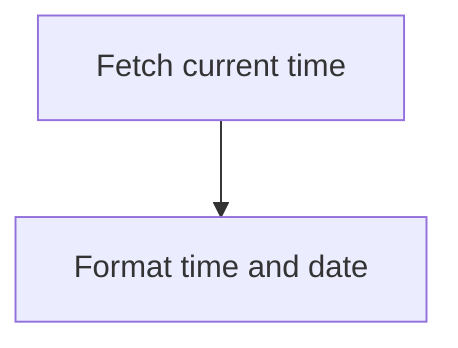

<SwmSnippet path="/src/base/cobol_src/BNK1CCA.cbl" line="940">

---

### Fetching current time

First, the function fetches the current time using the <SwmToken path="src/base/cobol_src/BNK1CCA.cbl" pos="940:1:5" line-data="           EXEC CICS ASKTIME">`EXEC CICS ASKTIME`</SwmToken> command, which stores the absolute time in <SwmToken path="src/base/cobol_src/BNK1CCA.cbl" pos="941:3:7" line-data="              ABSTIME(WS-U-TIME)">`WS-U-TIME`</SwmToken>.

```cobol
           EXEC CICS ASKTIME
              ABSTIME(WS-U-TIME)
           END-EXEC.
```

---

</SwmSnippet>

<SwmSnippet path="/src/base/cobol_src/BNK1CCA.cbl" line="944">

---

### Formatting time and date

Next, the function formats the fetched time and date using the <SwmToken path="src/base/cobol_src/BNK1CCA.cbl" pos="944:1:5" line-data="           EXEC CICS FORMATTIME">`EXEC CICS FORMATTIME`</SwmToken> command. It converts the absolute time in <SwmToken path="src/base/cobol_src/BNK1CCA.cbl" pos="945:3:7" line-data="                     ABSTIME(WS-U-TIME)">`WS-U-TIME`</SwmToken> to a human-readable date in <SwmToken path="src/base/cobol_src/BNK1CCA.cbl" pos="946:3:7" line-data="                     DDMMYYYY(WS-ORIG-DATE)">`WS-ORIG-DATE`</SwmToken> and the current time in <SwmToken path="src/base/cobol_src/BNK1CCA.cbl" pos="947:3:7" line-data="                     TIME(WS-TIME-NOW)">`WS-TIME-NOW`</SwmToken>.

```cobol
           EXEC CICS FORMATTIME
                     ABSTIME(WS-U-TIME)
                     DDMMYYYY(WS-ORIG-DATE)
                     TIME(WS-TIME-NOW)
                     DATESEP
           END-EXEC.
```

---

</SwmSnippet>

&nbsp;

*This is an auto-generated document by Swimm 🌊 and has not yet been verified by a human*

<SwmMeta version="3.0.0" repo-id="Z2l0aHViJTNBJTNBY2ljcy1iYW5raW5nLXNhbXBsZS1hcHBsaWNhdGlvbi1jYnNhLUlCTS1EZW1vJTNBJTNBU3dpbW0tRGVtbw==" repo-name="cics-banking-sample-application-cbsa-IBM-Demo"><sup>Powered by [Swimm](/)</sup></SwmMeta>
