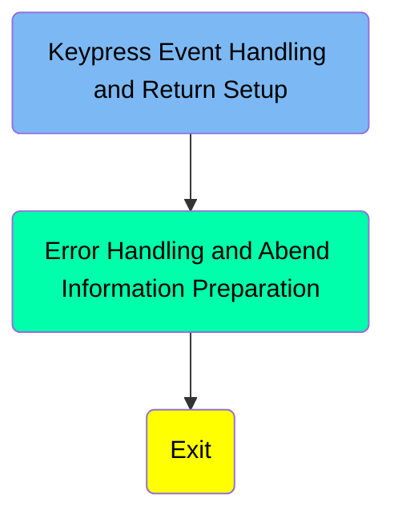
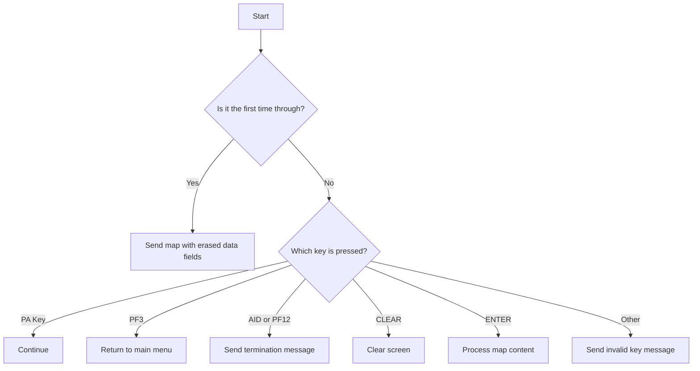

The <SwmToken path="src/base/cobol_src/BNK1CCA.cbl" pos="285:4:4" line-data="              MOVE &#39;BNK1CCA - A010 - RETURN TRANSID(OCCA) FAIL&#39; TO">`BNK1CCA`</SwmToken> program handles keypress events and prepares return setups in a banking application. It checks the type of key pressed and performs corresponding actions such as sending maps, returning to the main menu, or processing map content. The program also includes error handling and abend information preparation to manage and log errors effectively.

The <SwmToken path="src/base/cobol_src/BNK1CCA.cbl" pos="285:4:4" line-data="              MOVE &#39;BNK1CCA - A010 - RETURN TRANSID(OCCA) FAIL&#39; TO">`BNK1CCA`</SwmToken> program starts by checking if it's the first time through and sends a map with erased data fields if true. It then handles different keypress events: PA keys continue without action, PF3 returns to the main menu, AID or PF12 sends a termination message, CLEAR erases the screen, ENTER processes the map content, and other keys send an invalid key message. The program also includes error handling to log and manage errors by checking CICS responses, initializing error records, and linking to an abend handler.

Here is a high level diagram of the program:



# Keypress Event Handling and Return Setup



<SwmSnippet path="/src/base/cobol_src/BNK1CCA.cbl" line="156">

---

## Initial Check

First, the code checks if it is the first time through by evaluating if <SwmToken path="src/base/cobol_src/BNK1CCA.cbl" pos="162:3:3" line-data="              WHEN EIBCALEN = ZERO">`EIBCALEN`</SwmToken> is zero. If true, it moves <SwmToken path="src/base/cobol_src/BNK1CCA.cbl" pos="163:3:5" line-data="                 MOVE LOW-VALUE TO BNK1ACCO">`LOW-VALUE`</SwmToken> to <SwmToken path="src/base/cobol_src/BNK1CCA.cbl" pos="163:9:9" line-data="                 MOVE LOW-VALUE TO BNK1ACCO">`BNK1ACCO`</SwmToken>, sets <SwmToken path="src/base/cobol_src/BNK1CCA.cbl" pos="164:8:8" line-data="                 MOVE -1 TO CUSTNOL">`CUSTNOL`</SwmToken> to -1, and sets <SwmToken path="src/base/cobol_src/BNK1CCA.cbl" pos="165:3:5" line-data="                 SET SEND-ERASE TO TRUE">`SEND-ERASE`</SwmToken> to true. Then, it performs the <SwmToken path="src/base/cobol_src/BNK1CCA.cbl" pos="166:3:5" line-data="                 PERFORM SEND-MAP">`SEND-MAP`</SwmToken> operation to send the map with erased data fields.

```cobol
           EVALUATE TRUE

      *
      *       Is it the first time through? If so, send the map
      *       with erased (empty) data fields.
      *
              WHEN EIBCALEN = ZERO
                 MOVE LOW-VALUE TO BNK1ACCO
                 MOVE -1 TO CUSTNOL
                 SET SEND-ERASE TO TRUE
                 PERFORM SEND-MAP
```

---

</SwmSnippet>

<SwmSnippet path="/src/base/cobol_src/BNK1CCA.cbl" line="168">

---

## Handling PA Key Presses

Moving to the next condition, if a PA key (<SwmToken path="src/base/cobol_src/BNK1CCA.cbl" pos="171:7:7" line-data="              WHEN EIBAID = DFHPA1 OR DFHPA2 OR DFHPA3">`DFHPA1`</SwmToken>, <SwmToken path="src/base/cobol_src/BNK1CCA.cbl" pos="171:11:11" line-data="              WHEN EIBAID = DFHPA1 OR DFHPA2 OR DFHPA3">`DFHPA2`</SwmToken>, or <SwmToken path="src/base/cobol_src/BNK1CCA.cbl" pos="171:15:15" line-data="              WHEN EIBAID = DFHPA1 OR DFHPA2 OR DFHPA3">`DFHPA3`</SwmToken>) is pressed, the code simply continues without any additional actions.

```cobol
      *
      *       If a PA key is pressed, just carry on
      *
              WHEN EIBAID = DFHPA1 OR DFHPA2 OR DFHPA3
                 CONTINUE
```

---

</SwmSnippet>

<SwmSnippet path="/src/base/cobol_src/BNK1CCA.cbl" line="174">

---

## Handling PF3 Key Press

Next, if the PF3 key (<SwmToken path="src/base/cobol_src/BNK1CCA.cbl" pos="177:7:7" line-data="              WHEN EIBAID = DFHPF3">`DFHPF3`</SwmToken>) is pressed, the code returns to the main menu by executing a CICS RETURN command with the transaction ID 'OMEN'.

```cobol
      *
      *       When Pf3 is pressed, return to the main menu
      *
              WHEN EIBAID = DFHPF3
                 EXEC CICS RETURN
                    TRANSID('OMEN')
                    IMMEDIATE
                    RESP(WS-CICS-RESP)
                    RESP2(WS-CICS-RESP2)
                 END-EXEC
```

---

</SwmSnippet>

<SwmSnippet path="/src/base/cobol_src/BNK1CCA.cbl" line="185">

---

## Handling AID or PF12 Key Press

Then, if the AID key (<SwmToken path="src/base/cobol_src/BNK1CCA.cbl" pos="189:7:7" line-data="              WHEN EIBAID = DFHAID OR DFHPF12">`DFHAID`</SwmToken>) or PF12 key (<SwmToken path="src/base/cobol_src/BNK1CCA.cbl" pos="189:11:11" line-data="              WHEN EIBAID = DFHAID OR DFHPF12">`DFHPF12`</SwmToken>) is pressed, the code performs the <SwmToken path="src/base/cobol_src/BNK1CCA.cbl" pos="190:3:7" line-data="                 PERFORM SEND-TERMINATION-MSG">`SEND-TERMINATION-MSG`</SwmToken> operation and then executes a CICS RETURN command.

```cobol
      *
      *       If the aid or Pf12 is pressed, then send a termination
      *       message.
      *
              WHEN EIBAID = DFHAID OR DFHPF12
                 PERFORM SEND-TERMINATION-MSG
                 EXEC CICS
                    RETURN
                 END-EXEC
```

---

</SwmSnippet>

<SwmSnippet path="/src/base/cobol_src/BNK1CCA.cbl" line="196">

---

## Handling CLEAR Key Press

When the CLEAR key (<SwmToken path="src/base/cobol_src/BNK1CCA.cbl" pos="198:7:7" line-data="              WHEN EIBAID = DFHCLEAR">`DFHCLEAR`</SwmToken>) is pressed, the code sends a control command to erase the screen and free the keyboard, followed by a CICS RETURN command.

```cobol
      *       When CLEAR is pressed
      *
              WHEN EIBAID = DFHCLEAR
                 EXEC CICS SEND CONTROL
                          ERASE
                          FREEKB
                 END-EXEC

                 EXEC CICS RETURN
                 END-EXEC
```

---

</SwmSnippet>

<SwmSnippet path="/src/base/cobol_src/BNK1CCA.cbl" line="208">

---

## Handling ENTER Key Press

When the ENTER key (<SwmToken path="src/base/cobol_src/BNK1CCA.cbl" pos="210:7:7" line-data="              WHEN EIBAID = DFHENTER">`DFHENTER`</SwmToken>) is pressed, the code performs the <SwmToken path="src/base/cobol_src/BNK1CCA.cbl" pos="211:3:5" line-data="                  PERFORM PROCESS-MAP">`PROCESS-MAP`</SwmToken> operation to process the content entered by the user.

```cobol
      *       When enter is presseed then process the content
      *
              WHEN EIBAID = DFHENTER
                  PERFORM PROCESS-MAP
```

---

</SwmSnippet>

<SwmSnippet path="/src/base/cobol_src/BNK1CCA.cbl" line="214">

---

## Handling Other Key Presses

For any other key presses, the code moves <SwmToken path="src/base/cobol_src/BNK1CCA.cbl" pos="217:3:5" line-data="                 MOVE LOW-VALUES TO BNK1ACCO">`LOW-VALUES`</SwmToken> to <SwmToken path="src/base/cobol_src/BNK1CCA.cbl" pos="217:9:9" line-data="                 MOVE LOW-VALUES TO BNK1ACCO">`BNK1ACCO`</SwmToken>, sets the message to 'Invalid key pressed.', sets <SwmToken path="src/base/cobol_src/BNK1CCA.cbl" pos="219:8:8" line-data="                  MOVE -1 TO CUSTNOL">`CUSTNOL`</SwmToken> to -1, and sets <SwmToken path="src/base/cobol_src/BNK1CCA.cbl" pos="220:3:7" line-data="                 SET SEND-DATAONLY-ALARM TO TRUE">`SEND-DATAONLY-ALARM`</SwmToken> to true. Then, it performs the <SwmToken path="src/base/cobol_src/BNK1CCA.cbl" pos="221:3:5" line-data="                 PERFORM SEND-MAP">`SEND-MAP`</SwmToken> operation to send the invalid key message.

```cobol
      *       When anything else happens, send the invalid key message
      *
              WHEN OTHER
                 MOVE LOW-VALUES TO BNK1ACCO
                 MOVE 'Invalid key pressed.' TO MESSAGEO
                  MOVE -1 TO CUSTNOL
                 SET SEND-DATAONLY-ALARM TO TRUE
                 PERFORM SEND-MAP
```

---

</SwmSnippet>

<SwmSnippet path="/src/base/cobol_src/BNK1CCA.cbl" line="225">

---

## Final Return

Finally, the code executes a CICS RETURN command with the transaction ID 'OCCA', passing the communication area <SwmToken path="src/base/cobol_src/BNK1CCA.cbl" pos="227:3:7" line-data="               COMMAREA(WS-COMM-AREA)">`WS-COMM-AREA`</SwmToken> with a length of 248.

```cobol
           EXEC CICS
               RETURN TRANSID('OCCA')
               COMMAREA(WS-COMM-AREA)
               LENGTH(248)
               RESP(WS-CICS-RESP)
               RESP2(WS-CICS-RESP2)
           END-EXEC.
```

---

</SwmSnippet>

# Error Handling and Abend Information Preparation

```mermaid
graph TD
  A[Check CICS Response] -->|Not Normal| B[Initialize ABNDINFO-REC]
  B --> C[Move EIBRESP to ABND-RESPCODE]
  C --> D[Move EIBRESP2 to ABND-RESP2CODE]
  D --> E[Assign APPLID to ABND-APPLID]
  E --> F[Move EIBTASKN to ABND-TASKNO-KEY]
  F --> G[Move EIBTRNID to ABND-TRANID]
  G --> H[Perform POPULATE-TIME-DATE]
  H --> I[Move WS-ORIG-DATE to ABND-DATE]
  I --> J[Format and Move Time to ABND-TIME]
  J --> K[Move WS-U-TIME to ABND-UTIME-KEY]
  K --> L[Move 'HBNK' to ABND-CODE]
  L --> M[Assign PROGRAM to ABND-PROGRAM]
  M --> N[Move ZEROS to ABND-SQLCODE]
  N --> O[Format and Move Error Message to ABND-FREEFORM]
  O --> P[Link to WS-ABEND-PGM]
  P --> Q[Initialize WS-FAIL-INFO]
  Q --> R[Move Error Message to WS-CICS-FAIL-MSG]
  R --> S[Move Response Codes to WS-CICS-RESP-DISP and WS-CICS-RESP2-DISP]
  S --> T[Perform ABEND-THIS-TASK]

%% Swimm:
%% graph TD
%%   A[Check CICS Response] -->|Not Normal| B[Initialize ABNDINFO-REC]
%%   B --> C[Move EIBRESP to ABND-RESPCODE]
%%   C --> D[Move <SwmToken path="src/base/cobol_src/BNK1CCA.cbl" pos="242:3:3" line-data="              MOVE EIBRESP2   TO ABND-RESP2CODE">`EIBRESP2`</SwmToken> to ABND-RESP2CODE]
%%   D --> E[Assign APPLID to ABND-APPLID]
%%   E --> F[Move EIBTASKN to ABND-TASKNO-KEY]
%%   F --> G[Move EIBTRNID to ABND-TRANID]
%%   G --> H[Perform POPULATE-TIME-DATE]
%%   H --> I[Move <SwmToken path="src/base/cobol_src/BNK1CCA.cbl" pos="254:3:7" line-data="              MOVE WS-ORIG-DATE TO ABND-DATE">`WS-ORIG-DATE`</SwmToken> to ABND-DATE]
%%   I --> J[Format and Move Time to ABND-TIME]
%%   J --> K[Move <SwmToken path="src/base/cobol_src/BNK1CCA.cbl" pos="263:3:7" line-data="              MOVE WS-U-TIME   TO ABND-UTIME-KEY">`WS-U-TIME`</SwmToken> to ABND-UTIME-KEY]
%%   K --> L[Move 'HBNK' to ABND-CODE]
%%   L --> M[Assign PROGRAM to ABND-PROGRAM]
%%   M --> N[Move ZEROS to ABND-SQLCODE]
%%   N --> O[Format and Move Error Message to ABND-FREEFORM]
%%   O --> P[Link to WS-ABEND-PGM]
%%   P --> Q[Initialize WS-FAIL-INFO]
%%   Q --> R[Move Error Message to WS-CICS-FAIL-MSG]
%%   R --> S[Move Response Codes to <SwmToken path="src/base/cobol_src/BNK1CCA.cbl" pos="37:3:9" line-data="          03 WS-CICS-RESP-DISP        PIC 9(10) VALUE 0.">`WS-CICS-RESP-DISP`</SwmToken> and WS-CICS-RESP2-DISP]
%%   S --> T[Perform ABEND-THIS-TASK]
```



<SwmSnippet path="/src/base/cobol_src/BNK1CCA.cbl" line="233">

---

## Checking CICS Response

First, the code checks if the CICS response (<SwmToken path="src/base/cobol_src/BNK1CCA.cbl" pos="233:3:7" line-data="           IF WS-CICS-RESP NOT = DFHRESP(NORMAL)">`WS-CICS-RESP`</SwmToken>) is not normal. This is crucial to determine if there was an error in the previous CICS command execution.

```cobol
           IF WS-CICS-RESP NOT = DFHRESP(NORMAL)
```

---

</SwmSnippet>

<SwmSnippet path="/src/base/cobol_src/BNK1CCA.cbl" line="240">

---

## Initializing <SwmToken path="src/base/cobol_src/BNK1CCA.cbl" pos="240:3:5" line-data="              INITIALIZE ABNDINFO-REC">`ABNDINFO-REC`</SwmToken>

Next, the <SwmToken path="src/base/cobol_src/BNK1CCA.cbl" pos="240:3:5" line-data="              INITIALIZE ABNDINFO-REC">`ABNDINFO-REC`</SwmToken> structure is initialized to store abend information. This structure will hold various details about the error for logging and debugging purposes.

```cobol
              INITIALIZE ABNDINFO-REC
```

---

</SwmSnippet>

<SwmSnippet path="/src/base/cobol_src/BNK1CCA.cbl" line="241">

---

## Moving Response Codes

Then, the response codes <SwmToken path="src/base/cobol_src/BNK1CCA.cbl" pos="241:3:3" line-data="              MOVE EIBRESP    TO ABND-RESPCODE">`EIBRESP`</SwmToken> and <SwmToken path="src/base/cobol_src/BNK1CCA.cbl" pos="242:3:3" line-data="              MOVE EIBRESP2   TO ABND-RESP2CODE">`EIBRESP2`</SwmToken> are moved to <SwmToken path="src/base/cobol_src/BNK1CCA.cbl" pos="241:7:9" line-data="              MOVE EIBRESP    TO ABND-RESPCODE">`ABND-RESPCODE`</SwmToken> and <SwmToken path="src/base/cobol_src/BNK1CCA.cbl" pos="242:7:9" line-data="              MOVE EIBRESP2   TO ABND-RESP2CODE">`ABND-RESP2CODE`</SwmToken> respectively. These codes provide specific details about the error encountered.

```cobol
              MOVE EIBRESP    TO ABND-RESPCODE
              MOVE EIBRESP2   TO ABND-RESP2CODE
```

---

</SwmSnippet>

<SwmSnippet path="/src/base/cobol_src/BNK1CCA.cbl" line="246">

---

## Assigning APPLID

The application ID (<SwmToken path="src/base/cobol_src/BNK1CCA.cbl" pos="246:7:7" line-data="              EXEC CICS ASSIGN APPLID(ABND-APPLID)">`APPLID`</SwmToken>) is assigned to <SwmToken path="src/base/cobol_src/BNK1CCA.cbl" pos="246:9:11" line-data="              EXEC CICS ASSIGN APPLID(ABND-APPLID)">`ABND-APPLID`</SwmToken>. This helps in identifying the application where the error occurred.

```cobol
              EXEC CICS ASSIGN APPLID(ABND-APPLID)
              END-EXEC
```

---

</SwmSnippet>

<SwmSnippet path="/src/base/cobol_src/BNK1CCA.cbl" line="249">

---

## Moving Task and Transaction IDs

The task number (<SwmToken path="src/base/cobol_src/BNK1CCA.cbl" pos="249:3:3" line-data="              MOVE EIBTASKN   TO ABND-TASKNO-KEY">`EIBTASKN`</SwmToken>) and transaction ID (<SwmToken path="src/base/cobol_src/BNK1CCA.cbl" pos="250:3:3" line-data="              MOVE EIBTRNID   TO ABND-TRANID">`EIBTRNID`</SwmToken>) are moved to <SwmToken path="src/base/cobol_src/BNK1CCA.cbl" pos="249:7:11" line-data="              MOVE EIBTASKN   TO ABND-TASKNO-KEY">`ABND-TASKNO-KEY`</SwmToken> and <SwmToken path="src/base/cobol_src/BNK1CCA.cbl" pos="250:7:9" line-data="              MOVE EIBTRNID   TO ABND-TRANID">`ABND-TRANID`</SwmToken> respectively. These identifiers are useful for tracking the specific task and transaction that encountered the error.

```cobol
              MOVE EIBTASKN   TO ABND-TASKNO-KEY
              MOVE EIBTRNID   TO ABND-TRANID
```

---

</SwmSnippet>

<SwmSnippet path="/src/base/cobol_src/BNK1CCA.cbl" line="252">

---

## Populating Time and Date

The <SwmToken path="src/base/cobol_src/BNK1CCA.cbl" pos="252:3:7" line-data="              PERFORM POPULATE-TIME-DATE">`POPULATE-TIME-DATE`</SwmToken> function is performed to get the current date and time. This information is crucial for logging the exact time of the error.

```cobol
              PERFORM POPULATE-TIME-DATE
```

---

</SwmSnippet>

<SwmSnippet path="/src/base/cobol_src/BNK1CCA.cbl" line="937">

---

### <SwmToken path="src/base/cobol_src/BNK1CCA.cbl" pos="937:1:5" line-data="       POPULATE-TIME-DATE SECTION.">`POPULATE-TIME-DATE`</SwmToken> Function

The <SwmToken path="src/base/cobol_src/BNK1CCA.cbl" pos="937:1:5" line-data="       POPULATE-TIME-DATE SECTION.">`POPULATE-TIME-DATE`</SwmToken> function uses CICS commands to get the current time (<SwmToken path="src/base/cobol_src/BNK1CCA.cbl" pos="940:5:5" line-data="           EXEC CICS ASKTIME">`ASKTIME`</SwmToken>) and format it (<SwmToken path="src/base/cobol_src/BNK1CCA.cbl" pos="944:5:5" line-data="           EXEC CICS FORMATTIME">`FORMATTIME`</SwmToken>). The formatted date and time are stored in <SwmToken path="src/base/cobol_src/BNK1CCA.cbl" pos="946:3:7" line-data="                     DDMMYYYY(WS-ORIG-DATE)">`WS-ORIG-DATE`</SwmToken> and <SwmToken path="src/base/cobol_src/BNK1CCA.cbl" pos="947:3:7" line-data="                     TIME(WS-TIME-NOW)">`WS-TIME-NOW`</SwmToken> respectively.

```cobol
       POPULATE-TIME-DATE SECTION.
       PTD010.

           EXEC CICS ASKTIME
              ABSTIME(WS-U-TIME)
           END-EXEC.

           EXEC CICS FORMATTIME
                     ABSTIME(WS-U-TIME)
                     DDMMYYYY(WS-ORIG-DATE)
                     TIME(WS-TIME-NOW)
                     DATESEP
           END-EXEC.

       PTD999.
           EXIT.
```

---

</SwmSnippet>

<SwmSnippet path="/src/base/cobol_src/BNK1CCA.cbl" line="254">

---

## Moving Date and Time

The original date (<SwmToken path="src/base/cobol_src/BNK1CCA.cbl" pos="254:3:7" line-data="              MOVE WS-ORIG-DATE TO ABND-DATE">`WS-ORIG-DATE`</SwmToken>) and the current time (<SwmToken path="src/base/cobol_src/BNK1CCA.cbl" pos="255:3:11" line-data="              STRING WS-TIME-NOW-GRP-HH DELIMITED BY SIZE,">`WS-TIME-NOW-GRP-HH`</SwmToken>, <SwmToken path="src/base/cobol_src/BNK1CCA.cbl" pos="257:1:9" line-data="                     WS-TIME-NOW-GRP-MM DELIMITED BY SIZE,">`WS-TIME-NOW-GRP-MM`</SwmToken>) are moved to <SwmToken path="src/base/cobol_src/BNK1CCA.cbl" pos="254:11:13" line-data="              MOVE WS-ORIG-DATE TO ABND-DATE">`ABND-DATE`</SwmToken> and <SwmToken path="src/base/cobol_src/BNK1CCA.cbl" pos="260:3:5" line-data="                     INTO ABND-TIME">`ABND-TIME`</SwmToken>. This ensures that the error log contains accurate date and time information.

```cobol
              MOVE WS-ORIG-DATE TO ABND-DATE
              STRING WS-TIME-NOW-GRP-HH DELIMITED BY SIZE,
                    ':' DELIMITED BY SIZE,
                     WS-TIME-NOW-GRP-MM DELIMITED BY SIZE,
                     ':' DELIMITED BY SIZE,
                     WS-TIME-NOW-GRP-MM DELIMITED BY SIZE
                     INTO ABND-TIME
```

---

</SwmSnippet>

<SwmSnippet path="/src/base/cobol_src/BNK1CCA.cbl" line="263">

---

## Moving Unique Time and Code

The unique time (<SwmToken path="src/base/cobol_src/BNK1CCA.cbl" pos="263:3:7" line-data="              MOVE WS-U-TIME   TO ABND-UTIME-KEY">`WS-U-TIME`</SwmToken>) and a specific code ('HBNK') are moved to <SwmToken path="src/base/cobol_src/BNK1CCA.cbl" pos="263:11:15" line-data="              MOVE WS-U-TIME   TO ABND-UTIME-KEY">`ABND-UTIME-KEY`</SwmToken> and <SwmToken path="src/base/cobol_src/BNK1CCA.cbl" pos="264:9:11" line-data="              MOVE &#39;HBNK&#39;      TO ABND-CODE">`ABND-CODE`</SwmToken>. These values help in uniquely identifying the error instance.

```cobol
              MOVE WS-U-TIME   TO ABND-UTIME-KEY
              MOVE 'HBNK'      TO ABND-CODE
```

---

</SwmSnippet>

<SwmSnippet path="/src/base/cobol_src/BNK1CCA.cbl" line="266">

---

## Assigning Program

The program name is assigned to <SwmToken path="src/base/cobol_src/BNK1CCA.cbl" pos="266:9:11" line-data="              EXEC CICS ASSIGN PROGRAM(ABND-PROGRAM)">`ABND-PROGRAM`</SwmToken>. This indicates which program was executing when the error occurred.

```cobol
              EXEC CICS ASSIGN PROGRAM(ABND-PROGRAM)
              END-EXEC
```

---

</SwmSnippet>

<SwmSnippet path="/src/base/cobol_src/BNK1CCA.cbl" line="269">

---

## Moving SQL Code

The SQL code is set to zero (<SwmToken path="src/base/cobol_src/BNK1CCA.cbl" pos="269:3:3" line-data="              MOVE ZEROS      TO ABND-SQLCODE">`ZEROS`</SwmToken>). This is a placeholder indicating that no SQL error occurred.

```cobol
              MOVE ZEROS      TO ABND-SQLCODE
```

---

</SwmSnippet>

<SwmSnippet path="/src/base/cobol_src/BNK1CCA.cbl" line="271">

---

## Formatting Error Message

An error message is formatted and moved to <SwmToken path="src/base/cobol_src/BNK1CCA.cbl" pos="277:3:5" line-data="                    INTO ABND-FREEFORM">`ABND-FREEFORM`</SwmToken>. This message includes details about the error, such as the response codes and a specific error description.

```cobol
              STRING 'A010 - RETURN TRANSID(OCCA) FAIL'
                    DELIMITED BY SIZE,
                    'EIBRESP=' DELIMITED BY SIZE,
                    ABND-RESPCODE DELIMITED BY SIZE,
                    ' RESP2=' DELIMITED BY SIZE,
                    ABND-RESP2CODE DELIMITED BY SIZE
                    INTO ABND-FREEFORM
```

---

</SwmSnippet>

<SwmSnippet path="/src/base/cobol_src/BNK1CCA.cbl" line="280">

---

## Linking to Abend Handler

The <SwmToken path="src/base/cobol_src/BNK1CCA.cbl" pos="280:9:13" line-data="              EXEC CICS LINK PROGRAM(WS-ABEND-PGM)">`WS-ABEND-PGM`</SwmToken> is linked with the <SwmToken path="src/base/cobol_src/BNK1CCA.cbl" pos="281:3:5" line-data="                        COMMAREA(ABNDINFO-REC)">`ABNDINFO-REC`</SwmToken> as the communication area. This step transfers control to the abend handler program to process the error.

```cobol
              EXEC CICS LINK PROGRAM(WS-ABEND-PGM)
                        COMMAREA(ABNDINFO-REC)
              END-EXEC
```

---

</SwmSnippet>

<SwmSnippet path="/src/base/cobol_src/BNK1CCA.cbl" line="284">

---

## Initializing Fail Info

The <SwmToken path="src/base/cobol_src/BNK1CCA.cbl" pos="284:3:7" line-data="              INITIALIZE WS-FAIL-INFO">`WS-FAIL-INFO`</SwmToken> structure is initialized to store failure information. This structure will hold details about the failure for further processing.

```cobol
              INITIALIZE WS-FAIL-INFO
```

---

</SwmSnippet>

<SwmSnippet path="/src/base/cobol_src/BNK1CCA.cbl" line="285">

---

## Moving Failure Message

A failure message is moved to <SwmToken path="src/base/cobol_src/BNK1CCA.cbl" pos="286:1:7" line-data="                 WS-CICS-FAIL-MSG">`WS-CICS-FAIL-MSG`</SwmToken>. This message provides a description of the failure for logging purposes.

```cobol
              MOVE 'BNK1CCA - A010 - RETURN TRANSID(OCCA) FAIL' TO
                 WS-CICS-FAIL-MSG
```

---

</SwmSnippet>

*This is an auto-generated document by Swimm 🌊 and has not yet been verified by a human*

<SwmMeta version="3.0.0" repo-id="Z2l0aHViJTNBJTNBY2ljcy1iYW5raW5nLXNhbXBsZS1hcHBsaWNhdGlvbi1jYnNhLUlCTS1EZW1vJTNBJTNBU3dpbW0tRGVtbw==" repo-name="cics-banking-sample-application-cbsa-IBM-Demo"><sup>Powered by [Swimm](https://staging.swimm.cloud/)</sup></SwmMeta>
