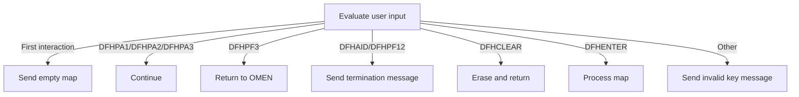
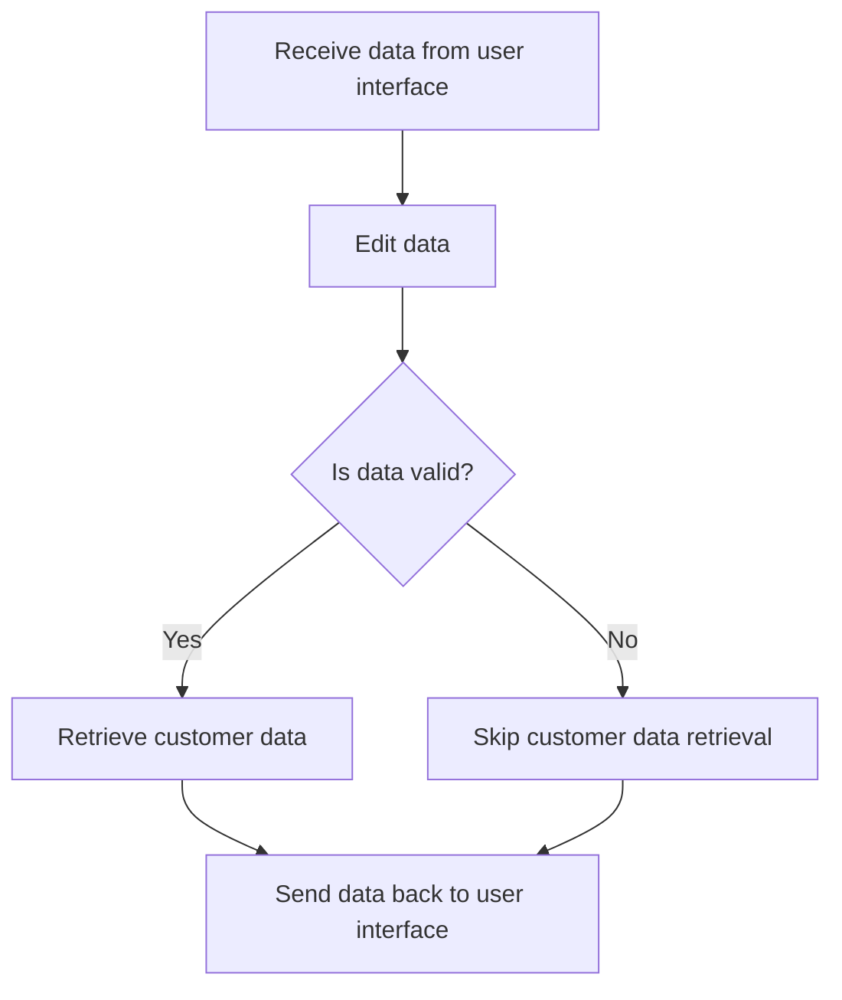
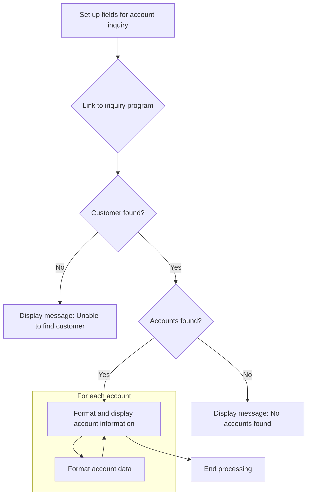

Handling Initial User Input (<SwmToken path="src/base/cobol_src/BNK1CCA.cbl" pos="15:6:6" line-data="       PROGRAM-ID. BNK1CCA.">`BNK1CCA`</SwmToken>) describes the process of managing user interactions when they first engage with the system. This flow is crucial for ensuring that user inputs are correctly interpreted and processed, allowing for smooth operation of the application. The flow begins by evaluating the user input to determine the type of interaction, such as whether it's the first interaction or a specific key press. Depending on the input, the system either sends an empty map to prompt for input, continues processing, returns to a different transaction, sends a termination message, erases the screen, processes the map, or sends an invalid key message.

For instance, if a user presses the enter key, the system processes the map to respond appropriately to the user's actions.

# Handling Initial User Input



<SwmSnippet path="/src/base/cobol_src/BNK1CCA.cbl" line="154">

---

Here, we check if it's the first interaction and prepare to send a blank map to the user interface to prompt for input. We call <SwmToken path="src/base/cobol_src/BNK1CCA.cbl" pos="166:3:5" line-data="                 PERFORM SEND-MAP">`SEND-MAP`</SwmToken> to display the initial blank screen to the user, allowing them to start their interaction with the system.

```cobol
       A010.

           EVALUATE TRUE

      *
      *       Is it the first time through? If so, send the map
      *       with erased (empty) data fields.
      *
              WHEN EIBCALEN = ZERO
                 MOVE LOW-VALUE TO BNK1ACCO
                 MOVE -1 TO CUSTNOL
                 SET SEND-ERASE TO TRUE
                 PERFORM SEND-MAP
```

---

</SwmSnippet>

<SwmSnippet path="/src/base/cobol_src/BNK1CCA.cbl" line="171">

---

Next, handle specific user actions with CONTINUE to proceed without changes, as these actions don't require additional processing at this point.

```cobol
              WHEN EIBAID = DFHPA1 OR DFHPA2 OR DFHPA3
                 CONTINUE
```

---

</SwmSnippet>

<SwmSnippet path="/src/base/cobol_src/BNK1CCA.cbl" line="177">

---

Next, handle exit key press with EXEC CICS RETURN to switch transactions, as the user wants to exit the current transaction and return to a different one.

```cobol
              WHEN EIBAID = DFHPF3
                 EXEC CICS RETURN
                    TRANSID('OMEN')
                    IMMEDIATE
                    RESP(WS-CICS-RESP)
                    RESP2(WS-CICS-RESP2)
                 END-EXEC
```

---

</SwmSnippet>

<SwmSnippet path="/src/base/cobol_src/BNK1CCA.cbl" line="189">

---

Next, handle termination actions by sending a termination message and ending the transaction, ensuring the user is informed of the session termination.

```cobol
              WHEN EIBAID = DFHAID OR DFHPF12
                 PERFORM SEND-TERMINATION-MSG
                 EXEC CICS
                    RETURN
                 END-EXEC
```

---

</SwmSnippet>

<SwmSnippet path="/src/base/cobol_src/BNK1CCA.cbl" line="198">

---

Next, handle clear key press by clearing the screen and freeing the keyboard, preparing the system for the next user input.

```cobol
              WHEN EIBAID = DFHCLEAR
                 EXEC CICS SEND CONTROL
                          ERASE
                          FREEKB
                 END-EXEC

                 EXEC CICS RETURN
                 END-EXEC
```

---

</SwmSnippet>

<SwmSnippet path="/src/base/cobol_src/BNK1CCA.cbl" line="210">

---

Next, handle enter key press by processing user input, allowing the system to respond appropriately to the user's actions.

```cobol
              WHEN EIBAID = DFHENTER
                  PERFORM PROCESS-MAP
```

---

</SwmSnippet>

<SwmSnippet path="/src/base/cobol_src/BNK1CCA.cbl" line="216">

---

Next, handle invalid key presses by setting an error message and notifying the user with an alarm, providing feedback for invalid inputs.

```cobol
              WHEN OTHER
                 MOVE LOW-VALUES TO BNK1ACCO
                 MOVE 'Invalid key pressed.' TO MESSAGEO
                  MOVE -1 TO CUSTNOL
                 SET SEND-DATAONLY-ALARM TO TRUE
                 PERFORM SEND-MAP

           END-EVALUATE.
```

---

</SwmSnippet>

<SwmSnippet path="/src/base/cobol_src/BNK1CCA.cbl" line="225">

---

Finally, return control to the CICS system and end the current transaction, completing the operation and preparing for the next one.

```cobol
           EXEC CICS
               RETURN TRANSID('OCCA')
               COMMAREA(WS-COMM-AREA)
               LENGTH(248)
               RESP(WS-CICS-RESP)
               RESP2(WS-CICS-RESP2)
           END-EXEC.
```

---

</SwmSnippet>

# Processing User Data



<SwmSnippet path="/src/base/cobol_src/BNK1CCA.cbl" line="297">

---

Here, retrieve data from the user interface by capturing user input for processing, which is essential for performing subsequent operations.

```cobol
        PM010.
      *
      *    Retrieve the data from the map
      *
           PERFORM RECEIVE-MAP.
```

---

</SwmSnippet>

<SwmSnippet path="/src/base/cobol_src/BNK1CCA.cbl" line="306">

---

Next, edit and validate user input to ensure data is in the correct format, which is crucial before further processing.

```cobol
           PERFORM EDIT-DATA.
```

---

</SwmSnippet>

<SwmSnippet path="/src/base/cobol_src/BNK1CCA.cbl" line="312">

---

Finally, check data validity, retrieve customer data, and update the user interface, confirming data validity and providing user feedback.

```cobol
           IF VALID-DATA
              PERFORM GET-CUST-DATA
           END-IF.

           SET SEND-DATAONLY-ALARM TO TRUE.

      *
      *    Output the data to the screen
      *
           PERFORM SEND-MAP.
```

---

</SwmSnippet>

# Linking Customer Data



<SwmSnippet path="/src/base/cobol_src/BNK1CCA.cbl" line="422">

---

Here, set up fields for linking and populate time and date fields, which is essential for accurate transaction records.

```cobol
        GCD010.
      *
      *    Set up the fields required by INQACCCU then link to it
      *
           MOVE 20 TO NUMBER-OF-ACCOUNTS.
           MOVE 'N' TO COMM-SUCCESS OF INQACCCU-COMMAREA.

           MOVE CUSTNOI TO CUSTOMER-NUMBER OF INQACCCU-COMMAREA.
           SET COMM-PCB-POINTER TO NULL.
```

---

</SwmSnippet>

<SwmSnippet path="/src/base/cobol_src/BNK1CCA.cbl" line="435">

---

Next, link to INQACCCU program to retrieve customer account data, which is necessary for further processing and display.

```cobol
           EXEC CICS LINK
               PROGRAM(INQACCCU-PROGRAM)
               COMMAREA(INQACCCU-COMMAREA)
               RESP(WS-CICS-RESP)
               RESP2(WS-CICS-RESP2)
               SYNCONRETURN
           END-EXEC.
```

---

</SwmSnippet>

<SwmSnippet path="/src/base/cobol_src/BNK1CCA.cbl" line="505">

---

Next, check if customer is found, prepare error message, and clear account numbers, handling cases where customer data is not available.

```cobol
           IF CUSTOMER-FOUND = 'N'
              MOVE SPACES TO MESSAGEO
              STRING 'Unable to find customer '
                 CUSTOMER-NUMBER DELIMITED BY SIZE
              INTO MESSAGEO

      *
      *       Empty the account numbers in the on screen array
      *
              PERFORM VARYING WS-INDEX FROM 1 BY 1 UNTIL
              WS-INDEX > 10
                 MOVE SPACES TO ACCOUNTO(WS-INDEX)
              END-PERFORM

              GO TO GCD999
           END-IF.
```

---

</SwmSnippet>

<SwmSnippet path="/src/base/cobol_src/BNK1CCA.cbl" line="526">

---

Next, clear account numbers to ensure a clean slate for new data, removing previous data for updated information.

```cobol
           PERFORM VARYING WS-INDEX FROM 1 BY 1 UNTIL
           WS-INDEX > 10
              MOVE SPACES to ACCOUNTO(ws-index)
           END-PERFORM.
```

---

</SwmSnippet>

<SwmSnippet path="/src/base/cobol_src/BNK1CCA.cbl" line="531">

---

Next, check for no accounts and set message for user, informing them about the absence of accounts.

```cobol
           IF NUMBER-OF-ACCOUNTS = ZERO
              MOVE 'No accounts found for customer' to MESSAGEO
```

---

</SwmSnippet>

<SwmSnippet path="/src/base/cobol_src/BNK1CCA.cbl" line="539">

---

Next, handle accounts found and update display with account number, providing accurate information for user decision-making.

```cobol
              ELSE
                 MOVE NUMBER-OF-ACCOUNTS TO NUMBER-OF-ACCOUNTS-DISPLAY
                 MOVE SPACES TO MESSAGEO
                 STRING NUMBER-OF-ACCOUNTS-DISPLAY
                    DELIMITED BY SIZE,
                    ' accounts found' DELIMITED BY SIZE
                 INTO MESSAGEO
              END-IF
```

---

</SwmSnippet>

<SwmSnippet path="/src/base/cobol_src/BNK1CCA.cbl" line="552">

---

Next, iterate over accounts and prepare data for display, formatting information for user presentation.

```cobol
              PERFORM VARYING WS-INDEX FROM 1 BY 1 UNTIL
              WS-INDEX > NUMBER-OF-ACCOUNTS
              OR WS-INDEX > 10
                 MOVE COMM-SCODE OF INQACCCU-COMMAREA(WS-INDEX)
                    TO SCODE-CHAR
                 MOVE COMM-ACCNO(WS-INDEX) TO ACCNO-CHAR
                 MOVE SPACES TO ACCOUNTO(WS-INDEX)
                 MOVE ' ' TO WS-AVAIL-BAL-SIGN
                 MOVE ' ' TO WS-ACT-BAL-SIGN
```

---

</SwmSnippet>

<SwmSnippet path="/src/base/cobol_src/BNK1CCA.cbl" line="562">

---

Next, check available balance sign and set for accurate representation, ensuring user understanding of financial status.

```cobol
                 IF COMM-AVAIL-BAL(WS-INDEX) < 0
                    MOVE '-' TO WS-AVAIL-BAL-SIGN
                 ELSE
                    MOVE '+' TO WS-AVAIL-BAL-SIGN
                 END-IF
```

---

</SwmSnippet>

<SwmSnippet path="/src/base/cobol_src/BNK1CCA.cbl" line="568">

---

Next, check actual balance sign and set for complete financial picture, aiding user financial management.

```cobol
                 IF COMM-ACTUAL-BAL(WS-INDEX) < 0
                    MOVE '-' TO WS-ACT-BAL-SIGN
                 ELSE
                    MOVE '+' TO WS-ACT-BAL-SIGN
                 END-IF
```

---

</SwmSnippet>

<SwmSnippet path="/src/base/cobol_src/BNK1CCA.cbl" line="574">

---

Finally, move balance data into formatted string for clear account view, ensuring effective financial oversight.

```cobol
                 MOVE COMM-AVAIL-BAL(WS-INDEX) TO
                    WS-AVAIL-BAL-9
                 MOVE COMM-ACTUAL-BAL(WS-INDEX) TO
                    WS-ACT-BAL-9

                 STRING
                    SCODE-CHAR  DELIMITED BY SIZE
                    '      '    DELIMITED BY SIZE
                    ACCNO-CHAR  DELIMITED BY SIZE
                    '         ' DELIMITED BY SIZE
                    COMM-ACC-TYPE(WS-INDEX)
                                DELIMITED BY SIZE
                    '       '
                                DELIMITED BY SIZE
                    WS-AVAIL-BAL-SIGN
                                DELIMITED BY SIZE
                    WS-AVAIL-BAL-X-PND
                                DELIMITED BY SIZE
                    '.'
                                DELIMITED BY SIZE
                    WS-AVAIL-BAL-X-PNCE
                                DELIMITED BY SIZE
                    '  '
                                DELIMITED BY SIZE
                    WS-ACT-BAL-SIGN
                                DELIMITED BY SIZE
                    WS-ACT-BAL-X-PND
                               DELIMITED BY SIZE
                    '.'
                               DELIMITED BY SIZE
                    WS-ACT-BAL-X-PNCE
                               DELIMITED BY SIZE
                 INTO ACCOUNTO(WS-INDEX)
              END-PERFORM

           END-IF.
```

---

</SwmSnippet>

&nbsp;

*This is an auto-generated document by Swimm 🌊 and has not yet been verified by a human*

<SwmMeta version="3.0.0" repo-id="Z2l0aHViJTNBJTNBY2ljcy1iYW5raW5nLXNhbXBsZS1hcHBsaWNhdGlvbi1jYnNhLUlCTS1EZW1vJTNBJTNBU3dpbW0tRGVtbw==" repo-name="cics-banking-sample-application-cbsa-IBM-Demo"><sup>Powered by [Swimm](/)</sup></SwmMeta>
