The BNKMENU program is designed to handle various user interactions within the banking application. It manages the initialization of the user interface, processes different key presses, and handles abnormal terminations. The program achieves this by evaluating user inputs, sending appropriate responses, and logging error details when necessary.

The BNKMENU program starts by initializing the user interface if it's the first time the user accesses it. It then processes different key presses such as PA keys, termination keys, the CLEAR key, and user inputs. If an invalid key is pressed, it sends an error message. The program also handles abnormal terminations by logging error details and linking to an abend handler program. Finally, it returns control to the main transaction in CICS.

Here is a high level diagram of the program:

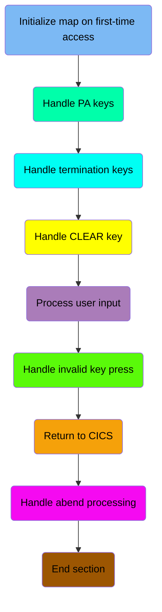

## Initialize map on first-time access

First, we'll zoom into this section of the flow:

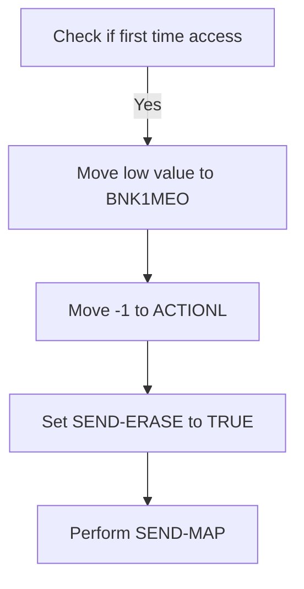

First, the code checks if it is the first time the user is accessing the interface by evaluating if <SwmToken path="src/base/cobol_src/BNKMENU.cbl" pos="116:3:3" line-data="              WHEN EIBCALEN = ZERO">`EIBCALEN`</SwmToken> (the length of the communication area) is zero. This indicates that no data has been passed to the program yet.

<SwmSnippet path="/src/base/cobol_src/BNKMENU.cbl" line="108">

---

Next, if it is the first time, the code moves a low value to <SwmToken path="src/base/cobol_src/BNKMENU.cbl" pos="117:9:9" line-data="                 MOVE LOW-VALUE TO BNK1MEO">`BNK1MEO`</SwmToken> (which likely represents an empty or initial state for the map), sets <SwmToken path="src/base/cobol_src/BNKMENU.cbl" pos="118:8:8" line-data="                 MOVE -1 TO ACTIONL">`ACTIONL`</SwmToken> to -1 (indicating an initial action), and sets the <SwmToken path="src/base/cobol_src/BNKMENU.cbl" pos="119:3:5" line-data="                 SET SEND-ERASE TO TRUE">`SEND-ERASE`</SwmToken> flag to true. This prepares the map to be sent with erased (empty) data fields. Finally, it performs the <SwmToken path="src/base/cobol_src/BNKMENU.cbl" pos="120:3:5" line-data="                 PERFORM SEND-MAP">`SEND-MAP`</SwmToken> operation to display the initial empty interface to the user.

```cobol
       PREMIERE SECTION.
       A010.

           EVALUATE TRUE
      *
      *       Is it the first time through? If so, send the map
      *       with erased (empty) data fields.
      *
              WHEN EIBCALEN = ZERO
                 MOVE LOW-VALUE TO BNK1MEO
                 MOVE -1 TO ACTIONL
                 SET SEND-ERASE TO TRUE
                 PERFORM SEND-MAP
```

---

</SwmSnippet>

## Handle PA keys

Now, lets zoom into this section of the flow:

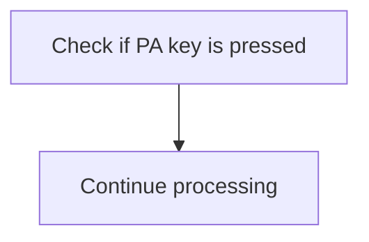

<SwmSnippet path="/src/base/cobol_src/BNKMENU.cbl" line="122">

---

The code checks if any of the PA keys (Program Attention keys) are pressed by evaluating the <SwmToken path="src/base/cobol_src/BNKMENU.cbl" pos="125:3:3" line-data="              WHEN EIBAID = DFHPA1 OR DFHPA2 OR DFHPA3">`EIBAID`</SwmToken> variable. If <SwmToken path="src/base/cobol_src/BNKMENU.cbl" pos="125:3:3" line-data="              WHEN EIBAID = DFHPA1 OR DFHPA2 OR DFHPA3">`EIBAID`</SwmToken> equals <SwmToken path="src/base/cobol_src/BNKMENU.cbl" pos="125:7:7" line-data="              WHEN EIBAID = DFHPA1 OR DFHPA2 OR DFHPA3">`DFHPA1`</SwmToken>, <SwmToken path="src/base/cobol_src/BNKMENU.cbl" pos="125:11:11" line-data="              WHEN EIBAID = DFHPA1 OR DFHPA2 OR DFHPA3">`DFHPA2`</SwmToken>, or <SwmToken path="src/base/cobol_src/BNKMENU.cbl" pos="125:15:15" line-data="              WHEN EIBAID = DFHPA1 OR DFHPA2 OR DFHPA3">`DFHPA3`</SwmToken>, it indicates that one of the PA keys has been pressed. In such a case, the program simply continues processing without taking any specific action related to the PA key press.

```cobol
      *
      *       If a PA key is pressed, just carry on
      *
              WHEN EIBAID = DFHPA1 OR DFHPA2 OR DFHPA3
                 CONTINUE
```

---

</SwmSnippet>

## Handle termination keys

Now, lets zoom into this section of the flow:

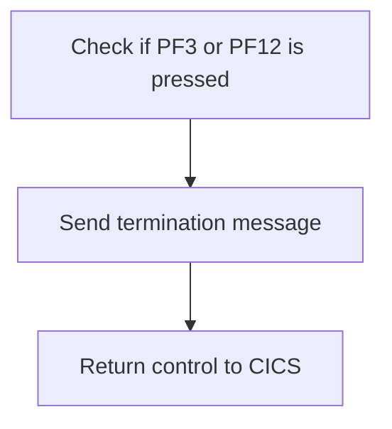

<SwmSnippet path="/src/base/cobol_src/BNKMENU.cbl" line="131">

---

First, the function checks if either `PF3` or `PF12` key is pressed by evaluating the <SwmToken path="src/base/cobol_src/BNKMENU.cbl" pos="131:3:3" line-data="              WHEN EIBAID = DFHPF3 OR DFHPF12">`EIBAID`</SwmToken> variable. These keys are typically used to signal the end of a session or to exit a menu.

```cobol
              WHEN EIBAID = DFHPF3 OR DFHPF12
```

---

</SwmSnippet>

<SwmSnippet path="/src/base/cobol_src/BNKMENU.cbl" line="132">

---

Next, if either of these keys is pressed, the function performs the <SwmToken path="src/base/cobol_src/BNKMENU.cbl" pos="132:3:7" line-data="                 PERFORM SEND-TERMINATION-MSG">`SEND-TERMINATION-MSG`</SwmToken> operation to notify the user that the session is being terminated. Finally, it returns control to CICS, effectively ending the current operation.

```cobol
                 PERFORM SEND-TERMINATION-MSG

                 EXEC CICS
                    RETURN
                 END-EXEC
```

---

</SwmSnippet>

## Handle CLEAR key

Now, lets zoom into this section of the flow:

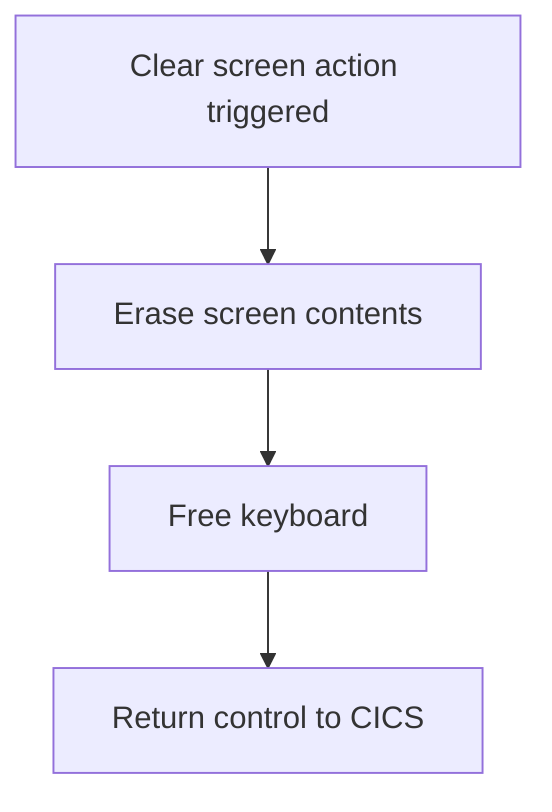

<SwmSnippet path="/src/base/cobol_src/BNKMENU.cbl" line="139">

---

When the clear screen action is triggered by the bank teller, the system first checks if the <SwmToken path="src/base/cobol_src/BNKMENU.cbl" pos="141:3:3" line-data="              WHEN EIBAID = DFHCLEAR">`EIBAID`</SwmToken> (which holds the attention identifier) is equal to <SwmToken path="src/base/cobol_src/BNKMENU.cbl" pos="141:7:7" line-data="              WHEN EIBAID = DFHCLEAR">`DFHCLEAR`</SwmToken> (the identifier for the clear screen action). If this condition is met, the system proceeds to erase the current screen contents using the <SwmToken path="src/base/cobol_src/BNKMENU.cbl" pos="142:1:1" line-data="                EXEC CICS SEND CONTROL">`EXEC`</SwmToken>` `<SwmToken path="src/base/cobol_src/BNKMENU.cbl" pos="142:3:3" line-data="                EXEC CICS SEND CONTROL">`CICS`</SwmToken>` `<SwmToken path="src/base/cobol_src/BNKMENU.cbl" pos="142:5:5" line-data="                EXEC CICS SEND CONTROL">`SEND`</SwmToken>` `<SwmToken path="src/base/cobol_src/BNKMENU.cbl" pos="142:7:7" line-data="                EXEC CICS SEND CONTROL">`CONTROL`</SwmToken>` `<SwmToken path="src/base/cobol_src/BNKMENU.cbl" pos="143:1:1" line-data="                          ERASE">`ERASE`</SwmToken> command. This ensures that the screen is cleared of any previous data, providing a clean slate for the teller. Following this, the <SwmToken path="src/base/cobol_src/BNKMENU.cbl" pos="144:1:1" line-data="                          FREEKB">`FREEKB`</SwmToken> command is executed to free the keyboard, allowing the teller to input new data without any restrictions. Finally, the <SwmToken path="src/base/cobol_src/BNKMENU.cbl" pos="146:1:5" line-data="                EXEC CICS RETURN">`EXEC CICS RETURN`</SwmToken> command is called to return control to the CICS system, completing the clear screen action and allowing the teller to continue with their tasks.

```cobol
      *       When CLEAR is pressed
      *
              WHEN EIBAID = DFHCLEAR
                EXEC CICS SEND CONTROL
                          ERASE
                          FREEKB
                END-EXEC
                EXEC CICS RETURN
                END-EXEC
```

---

</SwmSnippet>

## Process user input

Now, lets zoom into this section of the flow:

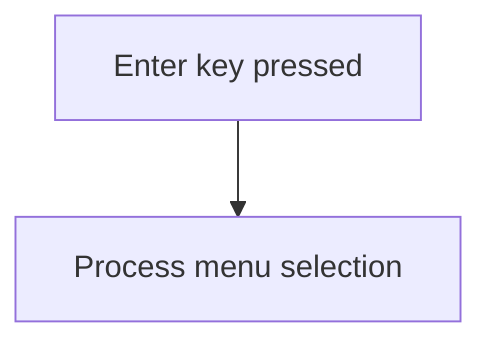

<SwmSnippet path="/src/base/cobol_src/BNKMENU.cbl" line="150">

---

When the enter key is pressed, the system processes the menu selection by performing the <SwmToken path="src/base/cobol_src/BNKMENU.cbl" pos="153:3:7" line-data="                 PERFORM PROCESS-MENU-MAP">`PROCESS-MENU-MAP`</SwmToken> operation. This ensures that the user's menu choice is handled appropriately, allowing the application to respond to the user's input and navigate to the corresponding functionality.

```cobol
      *       When enter is pressed then process the content
      *
              WHEN EIBAID = DFHENTER
                 PERFORM PROCESS-MENU-MAP

```

---

</SwmSnippet>

## Handle invalid key press

Now, lets zoom into this section of the flow:

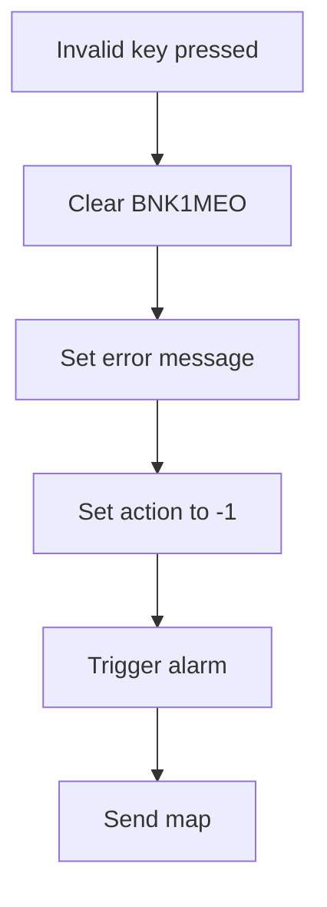

<SwmSnippet path="/src/base/cobol_src/BNKMENU.cbl" line="156">

---

When an invalid key is pressed, the system first clears the <SwmToken path="src/base/cobol_src/BNKMENU.cbl" pos="159:9:9" line-data="                 MOVE LOW-VALUES TO BNK1MEO">`BNK1MEO`</SwmToken> field (which likely holds some previous state or message). Then, it sets the <SwmToken path="src/base/cobol_src/BNKMENU.cbl" pos="160:14:14" line-data="                 MOVE &#39;Invalid key pressed.&#39; TO MESSAGEO">`MESSAGEO`</SwmToken> field to 'Invalid key pressed.' to inform the user of the error. The <SwmToken path="src/base/cobol_src/BNKMENU.cbl" pos="161:8:8" line-data="                 MOVE -1 TO ACTIONL">`ACTIONL`</SwmToken> field is set to -1, indicating an error state. The system then triggers an alarm to alert the user. Finally, the <SwmToken path="src/base/cobol_src/BNKMENU.cbl" pos="163:3:5" line-data="                 PERFORM SEND-MAP">`SEND-MAP`</SwmToken> operation is performed to update the user interface with the error message.

```cobol
      *       When anything else happens, send the invalid key message
      *
              WHEN OTHER
                 MOVE LOW-VALUES TO BNK1MEO
                 MOVE 'Invalid key pressed.' TO MESSAGEO
                 MOVE -1 TO ACTIONL
                 SET SEND-DATAONLY-ALARM TO TRUE
                 PERFORM SEND-MAP

```

---

</SwmSnippet>

## Interim Summary

So far, we saw how the system handles various key presses, including initialization, PA keys, termination keys, the CLEAR key, user input, and invalid key presses. Each of these sections ensures that the user interface responds appropriately to the bank teller's actions. Now, we will focus on the process of returning control to the main transaction in CICS.

## Return to CICS

This is the next section of the flow.

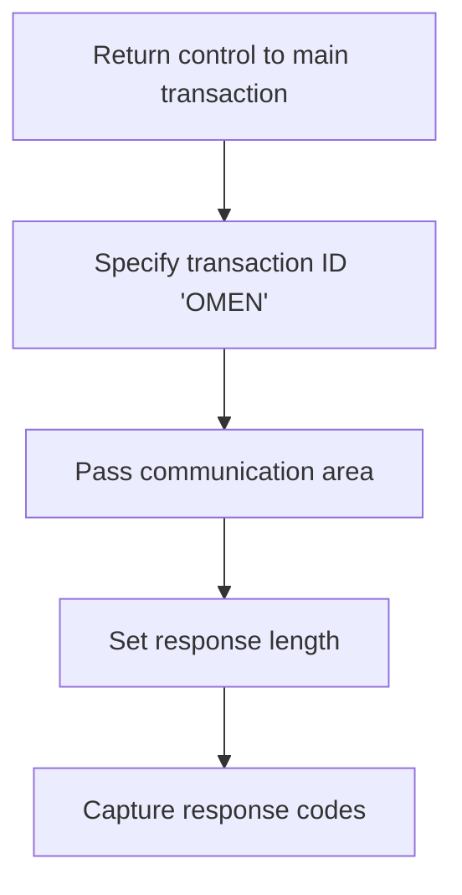

<SwmSnippet path="/src/base/cobol_src/BNKMENU.cbl" line="168">

---

The <SwmToken path="src/base/cobol_src/BNKMENU.cbl" pos="108:1:1" line-data="       PREMIERE SECTION.">`PREMIERE`</SwmToken> function is responsible for returning control to the main transaction identified by the transaction ID 'OMEN'. This is achieved by specifying the transaction ID 'OMEN' in the <SwmToken path="src/base/cobol_src/BNKMENU.cbl" pos="171:3:3" line-data="              RETURN TRANSID(&#39;OMEN&#39;)">`TRANSID`</SwmToken> parameter. The communication area, which contains data to be passed between programs, is specified in the <SwmToken path="src/base/cobol_src/BNKMENU.cbl" pos="172:1:1" line-data="              COMMAREA(COMMUNICATION-AREA)">`COMMAREA`</SwmToken> parameter. The length of the communication area is set to 1, indicating the size of the data being passed. Finally, the response codes <SwmToken path="src/base/cobol_src/BNKMENU.cbl" pos="174:3:7" line-data="              RESP(WS-CICS-RESP)">`WS-CICS-RESP`</SwmToken> and <SwmToken path="src/base/cobol_src/BNKMENU.cbl" pos="175:3:7" line-data="              RESP2(WS-CICS-RESP2)">`WS-CICS-RESP2`</SwmToken> are captured to handle any potential errors or responses from the CICS system.

```cobol
      *    Now RETURN
      *
           EXEC CICS
              RETURN TRANSID('OMEN')
              COMMAREA(COMMUNICATION-AREA)
              LENGTH(1)
              RESP(WS-CICS-RESP)
              RESP2(WS-CICS-RESP2)
           END-EXEC.
```

---

</SwmSnippet>

## Handle abend processing

Now, lets zoom into this section of the flow:

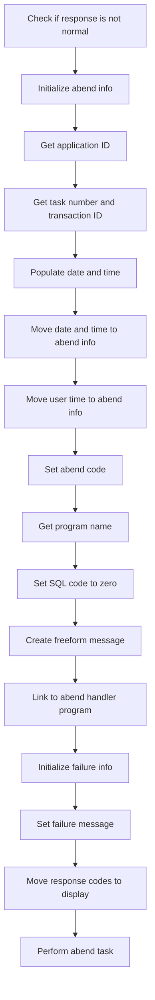

<SwmSnippet path="/src/base/cobol_src/BNKMENU.cbl" line="178">

---

First, the code checks if the response code <SwmToken path="src/base/cobol_src/BNKMENU.cbl" pos="178:3:7" line-data="           IF WS-CICS-RESP NOT = DFHRESP(NORMAL)">`WS-CICS-RESP`</SwmToken> is not equal to <SwmToken path="src/base/cobol_src/BNKMENU.cbl" pos="178:13:16" line-data="           IF WS-CICS-RESP NOT = DFHRESP(NORMAL)">`DFHRESP(NORMAL)`</SwmToken> (indicating an abnormal condition).

```cobol
           IF WS-CICS-RESP NOT = DFHRESP(NORMAL)
```

---

</SwmSnippet>

<SwmSnippet path="/src/base/cobol_src/BNKMENU.cbl" line="185">

---

Moving to the next step, the code initializes the <SwmToken path="src/base/cobol_src/BNKMENU.cbl" pos="185:3:5" line-data="              INITIALIZE ABNDINFO-REC">`ABNDINFO-REC`</SwmToken> structure to prepare for capturing abend information.

```cobol
              INITIALIZE ABNDINFO-REC
```

---

</SwmSnippet>

<SwmSnippet path="/src/base/cobol_src/BNKMENU.cbl" line="191">

---

Next, it retrieves the application ID using the <SwmToken path="src/base/cobol_src/BNKMENU.cbl" pos="191:1:7" line-data="              EXEC CICS ASSIGN APPLID(ABND-APPLID)">`EXEC CICS ASSIGN APPLID`</SwmToken> command and stores it in <SwmToken path="src/base/cobol_src/BNKMENU.cbl" pos="191:9:11" line-data="              EXEC CICS ASSIGN APPLID(ABND-APPLID)">`ABND-APPLID`</SwmToken>.

```cobol
              EXEC CICS ASSIGN APPLID(ABND-APPLID)
              END-EXEC
```

---

</SwmSnippet>

<SwmSnippet path="/src/base/cobol_src/BNKMENU.cbl" line="194">

---

Then, the task number and transaction ID are moved to <SwmToken path="src/base/cobol_src/BNKMENU.cbl" pos="194:7:11" line-data="              MOVE EIBTASKN   TO ABND-TASKNO-KEY">`ABND-TASKNO-KEY`</SwmToken> and <SwmToken path="src/base/cobol_src/BNKMENU.cbl" pos="195:7:9" line-data="              MOVE EIBTRNID   TO ABND-TRANID">`ABND-TRANID`</SwmToken> respectively.

```cobol
              MOVE EIBTASKN   TO ABND-TASKNO-KEY
              MOVE EIBTRNID   TO ABND-TRANID

```

---

</SwmSnippet>

<SwmSnippet path="/src/base/cobol_src/BNKMENU.cbl" line="197">

---

The code performs the <SwmToken path="src/base/cobol_src/BNKMENU.cbl" pos="197:3:7" line-data="              PERFORM POPULATE-TIME-DATE">`POPULATE-TIME-DATE`</SwmToken> routine to get the current date and time.

```cobol
              PERFORM POPULATE-TIME-DATE
```

---

</SwmSnippet>

<SwmSnippet path="/src/base/cobol_src/BNKMENU.cbl" line="199">

---

Moving forward, the current date and time are formatted and moved to <SwmToken path="src/base/cobol_src/BNKMENU.cbl" pos="199:11:13" line-data="              MOVE WS-ORIG-DATE TO ABND-DATE">`ABND-DATE`</SwmToken> and <SwmToken path="src/base/cobol_src/BNKMENU.cbl" pos="205:3:5" line-data="                     INTO ABND-TIME">`ABND-TIME`</SwmToken> respectively.

```cobol
              MOVE WS-ORIG-DATE TO ABND-DATE
              STRING WS-TIME-NOW-GRP-HH DELIMITED BY SIZE,
                    ':' DELIMITED BY SIZE,
                     WS-TIME-NOW-GRP-MM DELIMITED BY SIZE,
                     ':' DELIMITED BY SIZE,
                     WS-TIME-NOW-GRP-MM DELIMITED BY SIZE
                     INTO ABND-TIME
```

---

</SwmSnippet>

<SwmSnippet path="/src/base/cobol_src/BNKMENU.cbl" line="208">

---

The user time is then moved to <SwmToken path="src/base/cobol_src/BNKMENU.cbl" pos="208:11:15" line-data="              MOVE WS-U-TIME   TO ABND-UTIME-KEY">`ABND-UTIME-KEY`</SwmToken> and the abend code 'HBNK' is set in <SwmToken path="src/base/cobol_src/BNKMENU.cbl" pos="209:9:11" line-data="              MOVE &#39;HBNK&#39;      TO ABND-CODE">`ABND-CODE`</SwmToken>.

```cobol
              MOVE WS-U-TIME   TO ABND-UTIME-KEY
              MOVE 'HBNK'      TO ABND-CODE

```

---

</SwmSnippet>

<SwmSnippet path="/src/base/cobol_src/BNKMENU.cbl" line="211">

---

The program name is retrieved using <SwmToken path="src/base/cobol_src/BNKMENU.cbl" pos="211:1:7" line-data="              EXEC CICS ASSIGN PROGRAM(ABND-PROGRAM)">`EXEC CICS ASSIGN PROGRAM`</SwmToken> and stored in <SwmToken path="src/base/cobol_src/BNKMENU.cbl" pos="211:9:11" line-data="              EXEC CICS ASSIGN PROGRAM(ABND-PROGRAM)">`ABND-PROGRAM`</SwmToken>.

```cobol
              EXEC CICS ASSIGN PROGRAM(ABND-PROGRAM)
              END-EXEC
```

---

</SwmSnippet>

<SwmSnippet path="/src/base/cobol_src/BNKMENU.cbl" line="225">

---

Finally, the code links to the abend handler program <SwmToken path="src/base/cobol_src/BNKMENU.cbl" pos="225:9:13" line-data="              EXEC CICS LINK PROGRAM(WS-ABEND-PGM)">`WS-ABEND-PGM`</SwmToken> with the <SwmToken path="src/base/cobol_src/BNKMENU.cbl" pos="226:3:5" line-data="                        COMMAREA(ABNDINFO-REC)">`ABNDINFO-REC`</SwmToken> structure to handle the abnormal termination.

```cobol
              EXEC CICS LINK PROGRAM(WS-ABEND-PGM)
                        COMMAREA(ABNDINFO-REC)
              END-EXEC
```

---

</SwmSnippet>

## End section

This is the next section of the flow.

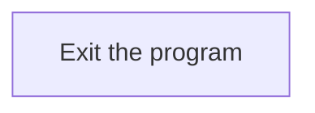

# Send Map (<SwmToken path="src/base/cobol_src/BNKMENU.cbl" pos="120:3:5" line-data="                 PERFORM SEND-MAP">`SEND-MAP`</SwmToken>)

Let's split this section into smaller parts:

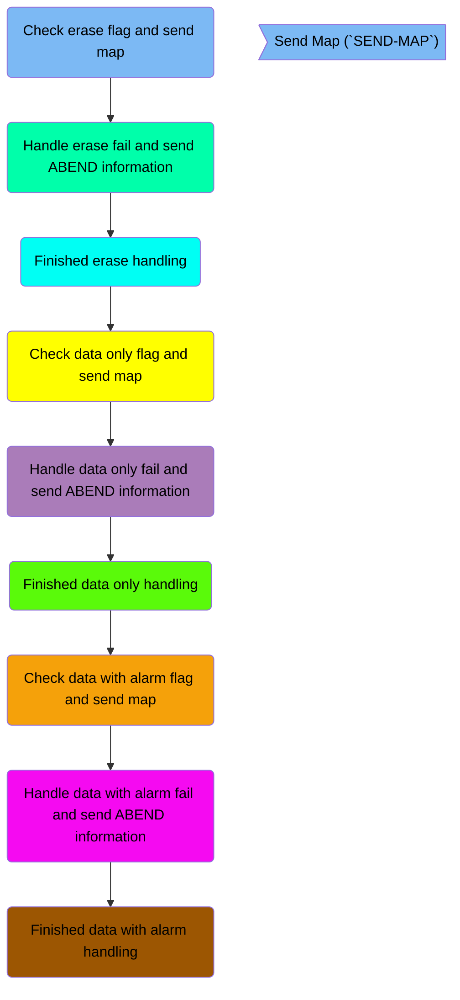

## Check erase flag and send map

First, we'll zoom into this section of the flow:

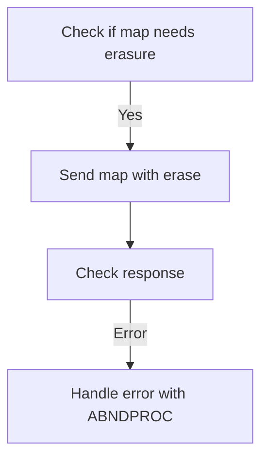

<SwmSnippet path="/src/base/cobol_src/BNKMENU.cbl" line="978">

---

### Checking if map needs erasure

First, the code checks if the map needs to have its data erased by evaluating the <SwmToken path="src/base/cobol_src/BNKMENU.cbl" pos="978:3:5" line-data="           IF SEND-ERASE">`SEND-ERASE`</SwmToken> flag.

```cobol
           IF SEND-ERASE
```

---

</SwmSnippet>

<SwmSnippet path="/src/base/cobol_src/BNKMENU.cbl" line="979">

---

### Sending map with erase

If the <SwmToken path="src/base/cobol_src/BNKMENU.cbl" pos="119:3:5" line-data="                 SET SEND-ERASE TO TRUE">`SEND-ERASE`</SwmToken> flag is set, the map <SwmToken path="src/base/cobol_src/BNKMENU.cbl" pos="979:10:10" line-data="              EXEC CICS SEND MAP(&#39;BNK1ME&#39;)">`BNK1ME`</SwmToken> from the mapset <SwmToken path="src/base/cobol_src/BNKMENU.cbl" pos="980:4:4" line-data="                 MAPSET(&#39;BNK1MAI&#39;)">`BNK1MAI`</SwmToken> is sent with the ERASE option, which clears the data fields on the map.

```cobol
              EXEC CICS SEND MAP('BNK1ME')
                 MAPSET('BNK1MAI')
                 FROM(BNK1MEO)
                 ERASE
                 RESP(WS-CICS-RESP)
                 RESP2(WS-CICS-RESP2)
              END-EXEC
```

---

</SwmSnippet>

<SwmSnippet path="/src/base/cobol_src/BNKMENU.cbl" line="987">

---

### Checking response

Next, the response from the SEND MAP command is checked. If the response is not normal, it indicates an error has occurred.

```cobol
              IF WS-CICS-RESP NOT = DFHRESP(NORMAL)
```

---

</SwmSnippet>

<SwmSnippet path="/src/base/cobol_src/BNKMENU.cbl" line="988">

---

### Handling errors

If an error is detected, the response codes are preserved, and the standard ABEND information is set up before linking to the ABNDPROC program to handle the abnormal termination.

More about ABNDPROC: <SwmLink doc-title="Writing Abend Records (ABNDPROC)">[Writing Abend Records (ABNDPROC)](/.swm/writing-abend-records-abndproc.svfj4jn5.sw.md)</SwmLink>

```cobol
      *
      *          Preserve the RESP and RESP2, then set up the
      *          standard ABEND info before getting the applid,
      *          date/time etc. and linking to the Abend Handler
      *          program.
      *
```

---

</SwmSnippet>

## Handle erase fail and send ABEND information

Now, lets zoom into this section of the flow:

```mermaid
graph TD
  A[Initialize ABNDINFO-REC] --> B[Move EIBRESP to ABND-RESPCODE] --> C[Move EIBRESP2 to ABND-RESP2CODE] --> D[Assign APPLID to ABND-APPLID] --> E[Move EIBTASKN to ABND-TASKNO-KEY] --> F[Move EIBTRNID to ABND-TRANID] --> G[Perform POPULATE-TIME-DATE] --> H[Move WS-ORIG-DATE to ABND-DATE] --> I[Create ABND-TIME string] --> J[Move WS-U-TIME to ABND-UTIME-KEY] --> K[Move 'HBNK' to ABND-CODE] --> L[Assign PROGRAM to ABND-PROGRAM] --> M[Move ZEROS to ABND-SQLCODE] --> N[Create ABND-FREEFORM string] --> O[Link to ABNDPROC program] --> P[Initialize WS-FAIL-INFO] --> Q[Move failure message to WS-CICS-FAIL-MSG] --> R[Move WS-CICS-RESP to WS-CICS-RESP-DISP] --> S[Move WS-CICS-RESP2 to WS-CICS-RESP2-DISP] --> T[Perform ABEND-THIS-TASK]

%% Swimm:
%% graph TD
%%   A[Initialize <SwmToken path="src/base/cobol_src/BNKMENU.cbl" pos="185:3:5" line-data="              INITIALIZE ABNDINFO-REC">`ABNDINFO-REC`</SwmToken>] --> B[Move EIBRESP to <SwmToken path="src/base/cobol_src/BNKMENU.cbl" pos="298:7:9" line-data="                 MOVE EIBRESP    TO ABND-RESPCODE">`ABND-RESPCODE`</SwmToken>] --> C[Move <SwmToken path="src/base/cobol_src/BNKMENU.cbl" pos="299:3:3" line-data="                 MOVE EIBRESP2   TO ABND-RESP2CODE">`EIBRESP2`</SwmToken> to <SwmToken path="src/base/cobol_src/BNKMENU.cbl" pos="299:7:9" line-data="                 MOVE EIBRESP2   TO ABND-RESP2CODE">`ABND-RESP2CODE`</SwmToken>] --> D[Assign APPLID to <SwmToken path="src/base/cobol_src/BNKMENU.cbl" pos="191:9:11" line-data="              EXEC CICS ASSIGN APPLID(ABND-APPLID)">`ABND-APPLID`</SwmToken>] --> E[Move EIBTASKN to <SwmToken path="src/base/cobol_src/BNKMENU.cbl" pos="194:7:11" line-data="              MOVE EIBTASKN   TO ABND-TASKNO-KEY">`ABND-TASKNO-KEY`</SwmToken>] --> F[Move EIBTRNID to <SwmToken path="src/base/cobol_src/BNKMENU.cbl" pos="195:7:9" line-data="              MOVE EIBTRNID   TO ABND-TRANID">`ABND-TRANID`</SwmToken>] --> G[Perform <SwmToken path="src/base/cobol_src/BNKMENU.cbl" pos="197:3:7" line-data="              PERFORM POPULATE-TIME-DATE">`POPULATE-TIME-DATE`</SwmToken>] --> H[Move <SwmToken path="src/base/cobol_src/BNKMENU.cbl" pos="199:3:7" line-data="              MOVE WS-ORIG-DATE TO ABND-DATE">`WS-ORIG-DATE`</SwmToken> to <SwmToken path="src/base/cobol_src/BNKMENU.cbl" pos="199:11:13" line-data="              MOVE WS-ORIG-DATE TO ABND-DATE">`ABND-DATE`</SwmToken>] --> I[Create <SwmToken path="src/base/cobol_src/BNKMENU.cbl" pos="205:3:5" line-data="                     INTO ABND-TIME">`ABND-TIME`</SwmToken> string] --> J[Move <SwmToken path="src/base/cobol_src/BNKMENU.cbl" pos="208:3:7" line-data="              MOVE WS-U-TIME   TO ABND-UTIME-KEY">`WS-U-TIME`</SwmToken> to <SwmToken path="src/base/cobol_src/BNKMENU.cbl" pos="208:11:15" line-data="              MOVE WS-U-TIME   TO ABND-UTIME-KEY">`ABND-UTIME-KEY`</SwmToken>] --> K[Move 'HBNK' to <SwmToken path="src/base/cobol_src/BNKMENU.cbl" pos="209:9:11" line-data="              MOVE &#39;HBNK&#39;      TO ABND-CODE">`ABND-CODE`</SwmToken>] --> L[Assign PROGRAM to <SwmToken path="src/base/cobol_src/BNKMENU.cbl" pos="211:9:11" line-data="              EXEC CICS ASSIGN PROGRAM(ABND-PROGRAM)">`ABND-PROGRAM`</SwmToken>] --> M[Move ZEROS to <SwmToken path="src/base/cobol_src/BNKMENU.cbl" pos="214:7:9" line-data="              MOVE ZEROS      TO ABND-SQLCODE">`ABND-SQLCODE`</SwmToken>] --> N[Create <SwmToken path="src/base/cobol_src/BNKMENU.cbl" pos="583:3:5" line-data="                       INTO ABND-FREEFORM">`ABND-FREEFORM`</SwmToken> string] --> O[Link to ABNDPROC program] --> P[Initialize <SwmToken path="src/base/cobol_src/BNKMENU.cbl" pos="591:3:7" line-data="                 INITIALIZE WS-FAIL-INFO">`WS-FAIL-INFO`</SwmToken>] --> Q[Move failure message to <SwmToken path="src/base/cobol_src/BNKMENU.cbl" pos="593:3:9" line-data="                    TO WS-CICS-FAIL-MSG">`WS-CICS-FAIL-MSG`</SwmToken>] --> R[Move <SwmToken path="src/base/cobol_src/BNKMENU.cbl" pos="174:3:7" line-data="              RESP(WS-CICS-RESP)">`WS-CICS-RESP`</SwmToken> to <SwmToken path="src/base/cobol_src/BNKMENU.cbl" pos="594:11:17" line-data="                 MOVE WS-CICS-RESP  TO WS-CICS-RESP-DISP">`WS-CICS-RESP-DISP`</SwmToken>] --> S[Move <SwmToken path="src/base/cobol_src/BNKMENU.cbl" pos="175:3:7" line-data="              RESP2(WS-CICS-RESP2)">`WS-CICS-RESP2`</SwmToken> to <SwmToken path="src/base/cobol_src/BNKMENU.cbl" pos="595:11:17" line-data="                 MOVE WS-CICS-RESP2 TO WS-CICS-RESP2-DISP">`WS-CICS-RESP2-DISP`</SwmToken>] --> T[Perform <SwmToken path="src/base/cobol_src/BNKMENU.cbl" pos="596:3:7" line-data="                 PERFORM ABEND-THIS-TASK">`ABEND-THIS-TASK`</SwmToken>]
```

First, the <SwmToken path="src/base/cobol_src/BNKMENU.cbl" pos="185:3:5" line-data="              INITIALIZE ABNDINFO-REC">`ABNDINFO-REC`</SwmToken> structure is initialized to prepare for capturing failure information.

Next, the response codes <SwmToken path="src/base/cobol_src/BNKMENU.cbl" pos="298:3:3" line-data="                 MOVE EIBRESP    TO ABND-RESPCODE">`EIBRESP`</SwmToken> and <SwmToken path="src/base/cobol_src/BNKMENU.cbl" pos="299:3:3" line-data="                 MOVE EIBRESP2   TO ABND-RESP2CODE">`EIBRESP2`</SwmToken> are moved to <SwmToken path="src/base/cobol_src/BNKMENU.cbl" pos="298:7:9" line-data="                 MOVE EIBRESP    TO ABND-RESPCODE">`ABND-RESPCODE`</SwmToken> and <SwmToken path="src/base/cobol_src/BNKMENU.cbl" pos="299:7:9" line-data="                 MOVE EIBRESP2   TO ABND-RESP2CODE">`ABND-RESP2CODE`</SwmToken> respectively to record the error details.

The application ID is assigned to <SwmToken path="src/base/cobol_src/BNKMENU.cbl" pos="191:9:11" line-data="              EXEC CICS ASSIGN APPLID(ABND-APPLID)">`ABND-APPLID`</SwmToken> to identify the application context of the failure.

The task number and transaction ID are moved to <SwmToken path="src/base/cobol_src/BNKMENU.cbl" pos="194:7:11" line-data="              MOVE EIBTASKN   TO ABND-TASKNO-KEY">`ABND-TASKNO-KEY`</SwmToken> and <SwmToken path="src/base/cobol_src/BNKMENU.cbl" pos="195:7:9" line-data="              MOVE EIBTRNID   TO ABND-TRANID">`ABND-TRANID`</SwmToken> respectively to log the specific task and transaction that encountered the error.

The <SwmToken path="src/base/cobol_src/BNKMENU.cbl" pos="197:3:7" line-data="              PERFORM POPULATE-TIME-DATE">`POPULATE-TIME-DATE`</SwmToken> routine is performed to get the current date and time.

The original date is moved to <SwmToken path="src/base/cobol_src/BNKMENU.cbl" pos="199:11:13" line-data="              MOVE WS-ORIG-DATE TO ABND-DATE">`ABND-DATE`</SwmToken>, and the current time is formatted and moved to <SwmToken path="src/base/cobol_src/BNKMENU.cbl" pos="205:3:5" line-data="                     INTO ABND-TIME">`ABND-TIME`</SwmToken> to log when the error occurred.

The universal time is moved to <SwmToken path="src/base/cobol_src/BNKMENU.cbl" pos="208:11:15" line-data="              MOVE WS-U-TIME   TO ABND-UTIME-KEY">`ABND-UTIME-KEY`</SwmToken>, and a code 'HBNK' is assigned to <SwmToken path="src/base/cobol_src/BNKMENU.cbl" pos="209:9:11" line-data="              MOVE &#39;HBNK&#39;      TO ABND-CODE">`ABND-CODE`</SwmToken> for additional identification.

The program name is assigned to <SwmToken path="src/base/cobol_src/BNKMENU.cbl" pos="211:9:11" line-data="              EXEC CICS ASSIGN PROGRAM(ABND-PROGRAM)">`ABND-PROGRAM`</SwmToken> to log which program encountered the error.

A freeform error message is created and moved to <SwmToken path="src/base/cobol_src/BNKMENU.cbl" pos="583:3:5" line-data="                       INTO ABND-FREEFORM">`ABND-FREEFORM`</SwmToken> to provide a human-readable description of the error.

The <SwmToken path="src/base/cobol_src/BNKMENU.cbl" pos="96:19:19" line-data="       01 WS-ABEND-PGM                 PIC X(8) VALUE &#39;ABNDPROC&#39;.">`ABNDPROC`</SwmToken> program is linked to handle the abnormal termination by writing the error details to a VSAM file.

## Finished erase handling

This is the next section of the flow.

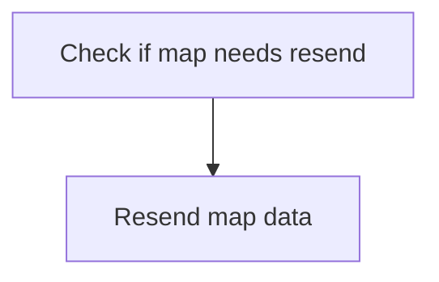

<SwmSnippet path="/src/base/cobol_src/BNKMENU.cbl" line="1046">

---

First, the code checks if the map needs to be resent. This is determined by evaluating specific conditions that indicate whether the map data should be resent to the user interface.

```cobol
              GO TO SMM999
           END-IF.
```

---

</SwmSnippet>

<SwmSnippet path="/src/base/cobol_src/BNKMENU.cbl" line="1049">

---

Next, if the conditions are met, the map data is resent. This ensures that the user interface is updated with the latest information, providing a consistent and accurate display to the user.

```cobol
      *
      *    If the map just needs a resend of only the data
      *
```

---

</SwmSnippet>

## Check data only flag and send map

Now, lets zoom into this section of the flow:

```mermaid
graph TD
  A[Check if SEND-DATAONLY is true] --> B[Send MAP BNK1ME from BNK1MEO] --> C[Check if response is not NORMAL] --> D[Preserve RESP and RESP2] --> E[Set up standard ABEND info]

%% Swimm:
%% graph TD
%%   A[Check if <SwmToken path="src/base/cobol_src/BNKMENU.cbl" pos="162:3:5" line-data="                 SET SEND-DATAONLY-ALARM TO TRUE">`SEND-DATAONLY`</SwmToken> is true] --> B[Send MAP <SwmToken path="src/base/cobol_src/BNKMENU.cbl" pos="275:6:6" line-data="              RECEIVE MAP(&#39;BNK1ME&#39;)">`BNK1ME`</SwmToken> from <SwmToken path="src/base/cobol_src/BNKMENU.cbl" pos="117:9:9" line-data="                 MOVE LOW-VALUE TO BNK1MEO">`BNK1MEO`</SwmToken>] --> C[Check if response is not NORMAL] --> D[Preserve RESP and <SwmToken path="src/base/cobol_src/BNKMENU.cbl" pos="175:1:1" line-data="              RESP2(WS-CICS-RESP2)">`RESP2`</SwmToken>] --> E[Set up standard ABEND info]
```

First, the code checks if <SwmToken path="src/base/cobol_src/BNKMENU.cbl" pos="162:3:5" line-data="                 SET SEND-DATAONLY-ALARM TO TRUE">`SEND-DATAONLY`</SwmToken> is true, which determines if only data should be sent without any control information.

<SwmSnippet path="/src/base/cobol_src/BNKMENU.cbl" line="1052">

---

Next, if <SwmToken path="src/base/cobol_src/BNKMENU.cbl" pos="1052:3:5" line-data="           IF SEND-DATAONLY">`SEND-DATAONLY`</SwmToken> is true, the <SwmToken path="src/base/cobol_src/BNKMENU.cbl" pos="1053:5:7" line-data="              EXEC CICS SEND MAP(&#39;BNK1ME&#39;)">`SEND MAP`</SwmToken> command is executed to send the map <SwmToken path="src/base/cobol_src/BNKMENU.cbl" pos="1053:10:10" line-data="              EXEC CICS SEND MAP(&#39;BNK1ME&#39;)">`BNK1ME`</SwmToken> from the mapset <SwmToken path="src/base/cobol_src/BNKMENU.cbl" pos="1054:4:4" line-data="                 MAPSET(&#39;BNK1MAI&#39;)">`BNK1MAI`</SwmToken> using the data from <SwmToken path="src/base/cobol_src/BNKMENU.cbl" pos="1055:3:3" line-data="                 FROM(BNK1MEO)">`BNK1MEO`</SwmToken>. This command is responsible for displaying the main menu to the user.

```cobol
           IF SEND-DATAONLY
              EXEC CICS SEND MAP('BNK1ME')
                 MAPSET('BNK1MAI')
                 FROM(BNK1MEO)
                 DATAONLY
                 RESP(WS-CICS-RESP)
                 RESP2(WS-CICS-RESP2)
              END-EXEC
```

---

</SwmSnippet>

<SwmSnippet path="/src/base/cobol_src/BNKMENU.cbl" line="1061">

---

Then, the code checks if the response <SwmToken path="src/base/cobol_src/BNKMENU.cbl" pos="1061:3:7" line-data="              IF WS-CICS-RESP NOT = DFHRESP(NORMAL)">`WS-CICS-RESP`</SwmToken> is not equal to <SwmToken path="src/base/cobol_src/BNKMENU.cbl" pos="1061:13:16" line-data="              IF WS-CICS-RESP NOT = DFHRESP(NORMAL)">`DFHRESP(NORMAL)`</SwmToken>. If the response indicates an abnormal condition, the code preserves the response codes <SwmToken path="src/base/cobol_src/BNKMENU.cbl" pos="1061:7:7" line-data="              IF WS-CICS-RESP NOT = DFHRESP(NORMAL)">`RESP`</SwmToken> and <SwmToken path="src/base/cobol_src/BNKMENU.cbl" pos="1064:11:11" line-data="      *          Preserve the RESP and RESP2, then set up the">`RESP2`</SwmToken>, sets up the standard ABEND (abnormal end) information, and prepares to link to the Abend Handler program.

```cobol
              IF WS-CICS-RESP NOT = DFHRESP(NORMAL)

      *
      *          Preserve the RESP and RESP2, then set up the
      *          standard ABEND info before getting the applid,
      *          date/time etc. and linking to the Abend Handler
      *          program.
```

---

</SwmSnippet>

## Handle data only fail and send ABEND information

Now, lets zoom into this section of the flow:

```mermaid
graph TD
  A[Initialize ABNDINFO-REC] --> B[Move EIBRESP to ABND-RESPCODE]
  B --> C[Move EIBRESP2 to ABND-RESP2CODE]
  C --> D[Assign APPLID to ABND-APPLID]
  D --> E[Move EIBTASKN to ABND-TASKNO-KEY]
  E --> F[Move EIBTRNID to ABND-TRANID]
  F --> G[Perform POPULATE-TIME-DATE]
  G --> H[Move WS-ORIG-DATE to ABND-DATE]
  H --> I[Format and move current time to ABND-TIME]
  I --> J[Move WS-U-TIME to ABND-UTIME-KEY]
  J --> K[Move 'HBNK' to ABND-CODE]
  K --> L[Assign PROGRAM to ABND-PROGRAM]
  L --> M[Move ZEROS to ABND-SQLCODE]
  M --> N[Format and move error message to ABND-FREEFORM]
  N --> O[Link to ABNDPROC program]
  O --> P[Initialize WS-FAIL-INFO]
  P --> Q[Move error message to WS-CICS-FAIL-MSG]
  Q --> R[Move WS-CICS-RESP to WS-CICS-RESP-DISP]
  R --> S[Move WS-CICS-RESP2 to WS-CICS-RESP2-DISP]
  S --> T[Perform ABEND-THIS-TASK]

%% Swimm:
%% graph TD
%%   A[Initialize <SwmToken path="src/base/cobol_src/BNKMENU.cbl" pos="185:3:5" line-data="              INITIALIZE ABNDINFO-REC">`ABNDINFO-REC`</SwmToken>] --> B[Move EIBRESP to <SwmToken path="src/base/cobol_src/BNKMENU.cbl" pos="298:7:9" line-data="                 MOVE EIBRESP    TO ABND-RESPCODE">`ABND-RESPCODE`</SwmToken>]
%%   B --> C[Move <SwmToken path="src/base/cobol_src/BNKMENU.cbl" pos="299:3:3" line-data="                 MOVE EIBRESP2   TO ABND-RESP2CODE">`EIBRESP2`</SwmToken> to <SwmToken path="src/base/cobol_src/BNKMENU.cbl" pos="299:7:9" line-data="                 MOVE EIBRESP2   TO ABND-RESP2CODE">`ABND-RESP2CODE`</SwmToken>]
%%   C --> D[Assign APPLID to <SwmToken path="src/base/cobol_src/BNKMENU.cbl" pos="191:9:11" line-data="              EXEC CICS ASSIGN APPLID(ABND-APPLID)">`ABND-APPLID`</SwmToken>]
%%   D --> E[Move EIBTASKN to <SwmToken path="src/base/cobol_src/BNKMENU.cbl" pos="194:7:11" line-data="              MOVE EIBTASKN   TO ABND-TASKNO-KEY">`ABND-TASKNO-KEY`</SwmToken>]
%%   E --> F[Move EIBTRNID to <SwmToken path="src/base/cobol_src/BNKMENU.cbl" pos="195:7:9" line-data="              MOVE EIBTRNID   TO ABND-TRANID">`ABND-TRANID`</SwmToken>]
%%   F --> G[Perform <SwmToken path="src/base/cobol_src/BNKMENU.cbl" pos="197:3:7" line-data="              PERFORM POPULATE-TIME-DATE">`POPULATE-TIME-DATE`</SwmToken>]
%%   G --> H[Move <SwmToken path="src/base/cobol_src/BNKMENU.cbl" pos="199:3:7" line-data="              MOVE WS-ORIG-DATE TO ABND-DATE">`WS-ORIG-DATE`</SwmToken> to <SwmToken path="src/base/cobol_src/BNKMENU.cbl" pos="199:11:13" line-data="              MOVE WS-ORIG-DATE TO ABND-DATE">`ABND-DATE`</SwmToken>]
%%   H --> I[Format and move current time to <SwmToken path="src/base/cobol_src/BNKMENU.cbl" pos="205:3:5" line-data="                     INTO ABND-TIME">`ABND-TIME`</SwmToken>]
%%   I --> J[Move <SwmToken path="src/base/cobol_src/BNKMENU.cbl" pos="208:3:7" line-data="              MOVE WS-U-TIME   TO ABND-UTIME-KEY">`WS-U-TIME`</SwmToken> to <SwmToken path="src/base/cobol_src/BNKMENU.cbl" pos="208:11:15" line-data="              MOVE WS-U-TIME   TO ABND-UTIME-KEY">`ABND-UTIME-KEY`</SwmToken>]
%%   J --> K[Move 'HBNK' to <SwmToken path="src/base/cobol_src/BNKMENU.cbl" pos="209:9:11" line-data="              MOVE &#39;HBNK&#39;      TO ABND-CODE">`ABND-CODE`</SwmToken>]
%%   K --> L[Assign PROGRAM to <SwmToken path="src/base/cobol_src/BNKMENU.cbl" pos="211:9:11" line-data="              EXEC CICS ASSIGN PROGRAM(ABND-PROGRAM)">`ABND-PROGRAM`</SwmToken>]
%%   L --> M[Move ZEROS to <SwmToken path="src/base/cobol_src/BNKMENU.cbl" pos="214:7:9" line-data="              MOVE ZEROS      TO ABND-SQLCODE">`ABND-SQLCODE`</SwmToken>]
%%   M --> N[Format and move error message to <SwmToken path="src/base/cobol_src/BNKMENU.cbl" pos="583:3:5" line-data="                       INTO ABND-FREEFORM">`ABND-FREEFORM`</SwmToken>]
%%   N --> O[Link to ABNDPROC program]
%%   O --> P[Initialize <SwmToken path="src/base/cobol_src/BNKMENU.cbl" pos="591:3:7" line-data="                 INITIALIZE WS-FAIL-INFO">`WS-FAIL-INFO`</SwmToken>]
%%   P --> Q[Move error message to <SwmToken path="src/base/cobol_src/BNKMENU.cbl" pos="593:3:9" line-data="                    TO WS-CICS-FAIL-MSG">`WS-CICS-FAIL-MSG`</SwmToken>]
%%   Q --> R[Move <SwmToken path="src/base/cobol_src/BNKMENU.cbl" pos="174:3:7" line-data="              RESP(WS-CICS-RESP)">`WS-CICS-RESP`</SwmToken> to <SwmToken path="src/base/cobol_src/BNKMENU.cbl" pos="594:11:17" line-data="                 MOVE WS-CICS-RESP  TO WS-CICS-RESP-DISP">`WS-CICS-RESP-DISP`</SwmToken>]
%%   R --> S[Move <SwmToken path="src/base/cobol_src/BNKMENU.cbl" pos="175:3:7" line-data="              RESP2(WS-CICS-RESP2)">`WS-CICS-RESP2`</SwmToken> to <SwmToken path="src/base/cobol_src/BNKMENU.cbl" pos="595:11:17" line-data="                 MOVE WS-CICS-RESP2 TO WS-CICS-RESP2-DISP">`WS-CICS-RESP2-DISP`</SwmToken>]
%%   S --> T[Perform <SwmToken path="src/base/cobol_src/BNKMENU.cbl" pos="596:3:7" line-data="                 PERFORM ABEND-THIS-TASK">`ABEND-THIS-TASK`</SwmToken>]
```

First, the <SwmToken path="src/base/cobol_src/BNKMENU.cbl" pos="185:3:5" line-data="              INITIALIZE ABNDINFO-REC">`ABNDINFO-REC`</SwmToken> structure is initialized to prepare for capturing failure information.

Moving to the next step, the response codes <SwmToken path="src/base/cobol_src/BNKMENU.cbl" pos="298:3:3" line-data="                 MOVE EIBRESP    TO ABND-RESPCODE">`EIBRESP`</SwmToken> and <SwmToken path="src/base/cobol_src/BNKMENU.cbl" pos="299:3:3" line-data="                 MOVE EIBRESP2   TO ABND-RESP2CODE">`EIBRESP2`</SwmToken> are stored in <SwmToken path="src/base/cobol_src/BNKMENU.cbl" pos="298:7:9" line-data="                 MOVE EIBRESP    TO ABND-RESPCODE">`ABND-RESPCODE`</SwmToken> and <SwmToken path="src/base/cobol_src/BNKMENU.cbl" pos="299:7:9" line-data="                 MOVE EIBRESP2   TO ABND-RESP2CODE">`ABND-RESP2CODE`</SwmToken> respectively to capture the error details.

Next, the application ID is assigned to <SwmToken path="src/base/cobol_src/BNKMENU.cbl" pos="191:9:11" line-data="              EXEC CICS ASSIGN APPLID(ABND-APPLID)">`ABND-APPLID`</SwmToken> to identify the application context of the failure.

The task number and transaction ID are then moved to <SwmToken path="src/base/cobol_src/BNKMENU.cbl" pos="194:7:11" line-data="              MOVE EIBTASKN   TO ABND-TASKNO-KEY">`ABND-TASKNO-KEY`</SwmToken> and <SwmToken path="src/base/cobol_src/BNKMENU.cbl" pos="195:7:9" line-data="              MOVE EIBTRNID   TO ABND-TRANID">`ABND-TRANID`</SwmToken> respectively, providing additional context for the failure.

The <SwmToken path="src/base/cobol_src/BNKMENU.cbl" pos="197:3:7" line-data="              PERFORM POPULATE-TIME-DATE">`POPULATE-TIME-DATE`</SwmToken> routine is performed to get the current date and time, which are then formatted and stored in <SwmToken path="src/base/cobol_src/BNKMENU.cbl" pos="199:11:13" line-data="              MOVE WS-ORIG-DATE TO ABND-DATE">`ABND-DATE`</SwmToken> and <SwmToken path="src/base/cobol_src/BNKMENU.cbl" pos="205:3:5" line-data="                     INTO ABND-TIME">`ABND-TIME`</SwmToken>.

The unique time key and a specific code 'HBNK' are moved to <SwmToken path="src/base/cobol_src/BNKMENU.cbl" pos="208:11:15" line-data="              MOVE WS-U-TIME   TO ABND-UTIME-KEY">`ABND-UTIME-KEY`</SwmToken> and <SwmToken path="src/base/cobol_src/BNKMENU.cbl" pos="209:9:11" line-data="              MOVE &#39;HBNK&#39;      TO ABND-CODE">`ABND-CODE`</SwmToken> respectively, further detailing the failure context.

The program name is assigned to <SwmToken path="src/base/cobol_src/BNKMENU.cbl" pos="211:9:11" line-data="              EXEC CICS ASSIGN PROGRAM(ABND-PROGRAM)">`ABND-PROGRAM`</SwmToken>, and <SwmToken path="src/base/cobol_src/BNKMENU.cbl" pos="214:3:3" line-data="              MOVE ZEROS      TO ABND-SQLCODE">`ZEROS`</SwmToken> are moved to <SwmToken path="src/base/cobol_src/BNKMENU.cbl" pos="214:7:9" line-data="              MOVE ZEROS      TO ABND-SQLCODE">`ABND-SQLCODE`</SwmToken> to initialize the SQL code field.

An error message is formatted and moved into <SwmToken path="src/base/cobol_src/BNKMENU.cbl" pos="583:3:5" line-data="                       INTO ABND-FREEFORM">`ABND-FREEFORM`</SwmToken>, and the <SwmToken path="src/base/cobol_src/BNKMENU.cbl" pos="96:19:19" line-data="       01 WS-ABEND-PGM                 PIC X(8) VALUE &#39;ABNDPROC&#39;.">`ABNDPROC`</SwmToken> program is linked to handle the abnormal termination by logging the failure details.

## Finished data only handling

This is the next section of the flow.

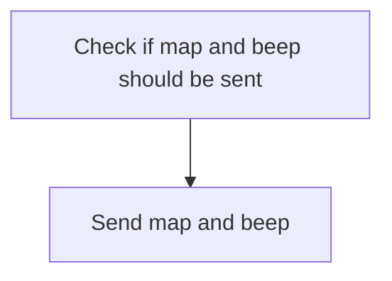

<SwmSnippet path="/src/base/cobol_src/BNKMENU.cbl" line="1122">

---

First, the code checks if the conditions to send the map and a beep signal are met. This ensures that the user interface is updated appropriately based on the current state of the application.

```cobol
              GO TO SMM999
           END-IF.
```

---

</SwmSnippet>

<SwmSnippet path="/src/base/cobol_src/BNKMENU.cbl" line="1126">

---

Next, if the conditions are satisfied, the map and beep signal are sent to the user interface. This action provides immediate feedback to the user, enhancing the user experience by confirming that their input has been processed.

```cobol
      *    If we have elected to send the map and a beep
      *
```

---

</SwmSnippet>

## Check data with alarm flag and send map

Now, lets zoom into this section of the flow:

```mermaid
graph TD
  A[Check if SEND-DATAONLY-ALARM is true] --> B[SEND MAP BNK1ME with DATAONLY and ALARM] --> C[Check if WS-CICS-RESP is not NORMAL] --> D[Preserve RESP and RESP2] --> E[Set up standard ABEND info]

%% Swimm:
%% graph TD
%%   A[Check if <SwmToken path="src/base/cobol_src/BNKMENU.cbl" pos="162:3:7" line-data="                 SET SEND-DATAONLY-ALARM TO TRUE">`SEND-DATAONLY-ALARM`</SwmToken> is true] --> B[SEND MAP <SwmToken path="src/base/cobol_src/BNKMENU.cbl" pos="275:6:6" line-data="              RECEIVE MAP(&#39;BNK1ME&#39;)">`BNK1ME`</SwmToken> with DATAONLY and ALARM] --> C[Check if <SwmToken path="src/base/cobol_src/BNKMENU.cbl" pos="174:3:7" line-data="              RESP(WS-CICS-RESP)">`WS-CICS-RESP`</SwmToken> is not NORMAL] --> D[Preserve RESP and <SwmToken path="src/base/cobol_src/BNKMENU.cbl" pos="175:1:1" line-data="              RESP2(WS-CICS-RESP2)">`RESP2`</SwmToken>] --> E[Set up standard ABEND info]
```

<SwmSnippet path="/src/base/cobol_src/BNKMENU.cbl" line="1128">

---

First, the code checks if <SwmToken path="src/base/cobol_src/BNKMENU.cbl" pos="1128:3:7" line-data="           IF SEND-DATAONLY-ALARM">`SEND-DATAONLY-ALARM`</SwmToken> is true. This condition determines whether the map should be sent with the DATAONLY and ALARM options.

```cobol
           IF SEND-DATAONLY-ALARM
```

---

</SwmSnippet>

<SwmSnippet path="/src/base/cobol_src/BNKMENU.cbl" line="1129">

---

Next, if the condition is met, the <SwmToken path="src/base/cobol_src/BNKMENU.cbl" pos="1129:5:7" line-data="              EXEC CICS SEND MAP(&#39;BNK1ME&#39;)">`SEND MAP`</SwmToken> command is executed to send the map <SwmToken path="src/base/cobol_src/BNKMENU.cbl" pos="1129:10:10" line-data="              EXEC CICS SEND MAP(&#39;BNK1ME&#39;)">`BNK1ME`</SwmToken> from the mapset <SwmToken path="src/base/cobol_src/BNKMENU.cbl" pos="1130:4:4" line-data="                 MAPSET(&#39;BNK1MAI&#39;)">`BNK1MAI`</SwmToken> with the DATAONLY and ALARM options. This sends the map to the user interface, triggering an alarm to alert the user.

```cobol
              EXEC CICS SEND MAP('BNK1ME')
                 MAPSET('BNK1MAI')
                 FROM(BNK1MEO)
                 DATAONLY
                 ALARM
                 RESP(WS-CICS-RESP)
                 RESP2(WS-CICS-RESP2)
              END-EXEC
```

---

</SwmSnippet>

<SwmSnippet path="/src/base/cobol_src/BNKMENU.cbl" line="1138">

---

Then, the code checks if <SwmToken path="src/base/cobol_src/BNKMENU.cbl" pos="1138:3:7" line-data="              IF WS-CICS-RESP NOT = DFHRESP(NORMAL)">`WS-CICS-RESP`</SwmToken> is not equal to <SwmToken path="src/base/cobol_src/BNKMENU.cbl" pos="1138:13:16" line-data="              IF WS-CICS-RESP NOT = DFHRESP(NORMAL)">`DFHRESP(NORMAL)`</SwmToken>. If the response is not normal, it preserves the <SwmToken path="src/base/cobol_src/BNKMENU.cbl" pos="1138:7:7" line-data="              IF WS-CICS-RESP NOT = DFHRESP(NORMAL)">`RESP`</SwmToken> and <SwmToken path="src/base/cobol_src/BNKMENU.cbl" pos="1141:11:11" line-data="      *          Preserve the RESP and RESP2, then set up the">`RESP2`</SwmToken> values and sets up the standard ABEND (abnormal end) information before proceeding to handle the error.

```cobol
              IF WS-CICS-RESP NOT = DFHRESP(NORMAL)

      *
      *          Preserve the RESP and RESP2, then set up the
      *          standard ABEND info before getting the applid,
      *          date/time etc. and linking to the Abend Handler
      *          program.
```

---

</SwmSnippet>

## Handle data with alarm fail and send ABEND information

Now, lets zoom into this section of the flow:

```mermaid
graph TD
  A[Initialize ABNDINFO-REC] --> B[Move EIBRESP to ABND-RESPCODE]
  B --> C[Move EIBRESP2 to ABND-RESP2CODE]
  C --> D[Get supplemental information]
  D --> E[Move EIBTASKN to ABND-TASKNO-KEY]
  E --> F[Move EIBTRNID to ABND-TRANID]
  F --> G[Perform POPULATE-TIME-DATE]
  G --> H[Move WS-ORIG-DATE to ABND-DATE]
  H --> I[Format and move current time to ABND-TIME]
  I --> J[Move WS-U-TIME to ABND-UTIME-KEY]
  J --> K[Move 'HBNK' to ABND-CODE]
  K --> L[Assign current program to ABND-PROGRAM]
  L --> M[Move ZEROS to ABND-SQLCODE]
  M --> N[Format and move error message to ABND-FREEFORM]
  N --> O[Link to ABNDPROC program]
  O --> P[Initialize WS-FAIL-INFO]
  P --> Q[Move error message to WS-CICS-FAIL-MSG]
  Q --> R[Move response codes to WS-CICS-RESP-DISP and WS-CICS-RESP2-DISP]
  R --> S[Perform ABEND-THIS-TASK]

%% Swimm:
%% graph TD
%%   A[Initialize <SwmToken path="src/base/cobol_src/BNKMENU.cbl" pos="185:3:5" line-data="              INITIALIZE ABNDINFO-REC">`ABNDINFO-REC`</SwmToken>] --> B[Move EIBRESP to <SwmToken path="src/base/cobol_src/BNKMENU.cbl" pos="298:7:9" line-data="                 MOVE EIBRESP    TO ABND-RESPCODE">`ABND-RESPCODE`</SwmToken>]
%%   B --> C[Move <SwmToken path="src/base/cobol_src/BNKMENU.cbl" pos="299:3:3" line-data="                 MOVE EIBRESP2   TO ABND-RESP2CODE">`EIBRESP2`</SwmToken> to <SwmToken path="src/base/cobol_src/BNKMENU.cbl" pos="299:7:9" line-data="                 MOVE EIBRESP2   TO ABND-RESP2CODE">`ABND-RESP2CODE`</SwmToken>]
%%   C --> D[Get supplemental information]
%%   D --> E[Move EIBTASKN to <SwmToken path="src/base/cobol_src/BNKMENU.cbl" pos="194:7:11" line-data="              MOVE EIBTASKN   TO ABND-TASKNO-KEY">`ABND-TASKNO-KEY`</SwmToken>]
%%   E --> F[Move EIBTRNID to <SwmToken path="src/base/cobol_src/BNKMENU.cbl" pos="195:7:9" line-data="              MOVE EIBTRNID   TO ABND-TRANID">`ABND-TRANID`</SwmToken>]
%%   F --> G[Perform <SwmToken path="src/base/cobol_src/BNKMENU.cbl" pos="197:3:7" line-data="              PERFORM POPULATE-TIME-DATE">`POPULATE-TIME-DATE`</SwmToken>]
%%   G --> H[Move <SwmToken path="src/base/cobol_src/BNKMENU.cbl" pos="199:3:7" line-data="              MOVE WS-ORIG-DATE TO ABND-DATE">`WS-ORIG-DATE`</SwmToken> to <SwmToken path="src/base/cobol_src/BNKMENU.cbl" pos="199:11:13" line-data="              MOVE WS-ORIG-DATE TO ABND-DATE">`ABND-DATE`</SwmToken>]
%%   H --> I[Format and move current time to <SwmToken path="src/base/cobol_src/BNKMENU.cbl" pos="205:3:5" line-data="                     INTO ABND-TIME">`ABND-TIME`</SwmToken>]
%%   I --> J[Move <SwmToken path="src/base/cobol_src/BNKMENU.cbl" pos="208:3:7" line-data="              MOVE WS-U-TIME   TO ABND-UTIME-KEY">`WS-U-TIME`</SwmToken> to <SwmToken path="src/base/cobol_src/BNKMENU.cbl" pos="208:11:15" line-data="              MOVE WS-U-TIME   TO ABND-UTIME-KEY">`ABND-UTIME-KEY`</SwmToken>]
%%   J --> K[Move 'HBNK' to <SwmToken path="src/base/cobol_src/BNKMENU.cbl" pos="209:9:11" line-data="              MOVE &#39;HBNK&#39;      TO ABND-CODE">`ABND-CODE`</SwmToken>]
%%   K --> L[Assign current program to <SwmToken path="src/base/cobol_src/BNKMENU.cbl" pos="211:9:11" line-data="              EXEC CICS ASSIGN PROGRAM(ABND-PROGRAM)">`ABND-PROGRAM`</SwmToken>]
%%   L --> M[Move ZEROS to <SwmToken path="src/base/cobol_src/BNKMENU.cbl" pos="214:7:9" line-data="              MOVE ZEROS      TO ABND-SQLCODE">`ABND-SQLCODE`</SwmToken>]
%%   M --> N[Format and move error message to <SwmToken path="src/base/cobol_src/BNKMENU.cbl" pos="583:3:5" line-data="                       INTO ABND-FREEFORM">`ABND-FREEFORM`</SwmToken>]
%%   N --> O[Link to ABNDPROC program]
%%   O --> P[Initialize <SwmToken path="src/base/cobol_src/BNKMENU.cbl" pos="591:3:7" line-data="                 INITIALIZE WS-FAIL-INFO">`WS-FAIL-INFO`</SwmToken>]
%%   P --> Q[Move error message to <SwmToken path="src/base/cobol_src/BNKMENU.cbl" pos="593:3:9" line-data="                    TO WS-CICS-FAIL-MSG">`WS-CICS-FAIL-MSG`</SwmToken>]
%%   Q --> R[Move response codes to <SwmToken path="src/base/cobol_src/BNKMENU.cbl" pos="594:11:17" line-data="                 MOVE WS-CICS-RESP  TO WS-CICS-RESP-DISP">`WS-CICS-RESP-DISP`</SwmToken> and <SwmToken path="src/base/cobol_src/BNKMENU.cbl" pos="595:11:17" line-data="                 MOVE WS-CICS-RESP2 TO WS-CICS-RESP2-DISP">`WS-CICS-RESP2-DISP`</SwmToken>]
%%   R --> S[Perform <SwmToken path="src/base/cobol_src/BNKMENU.cbl" pos="596:3:7" line-data="                 PERFORM ABEND-THIS-TASK">`ABEND-THIS-TASK`</SwmToken>]
```

First, the <SwmToken path="src/base/cobol_src/BNKMENU.cbl" pos="185:3:5" line-data="              INITIALIZE ABNDINFO-REC">`ABNDINFO-REC`</SwmToken> structure is initialized to prepare for capturing abnormal termination details.

Next, the response codes <SwmToken path="src/base/cobol_src/BNKMENU.cbl" pos="298:3:3" line-data="                 MOVE EIBRESP    TO ABND-RESPCODE">`EIBRESP`</SwmToken> and <SwmToken path="src/base/cobol_src/BNKMENU.cbl" pos="299:3:3" line-data="                 MOVE EIBRESP2   TO ABND-RESP2CODE">`EIBRESP2`</SwmToken> are moved to <SwmToken path="src/base/cobol_src/BNKMENU.cbl" pos="298:7:9" line-data="                 MOVE EIBRESP    TO ABND-RESPCODE">`ABND-RESPCODE`</SwmToken> and <SwmToken path="src/base/cobol_src/BNKMENU.cbl" pos="299:7:9" line-data="                 MOVE EIBRESP2   TO ABND-RESP2CODE">`ABND-RESP2CODE`</SwmToken> respectively, to record the response status of the operation.

Moving to gathering supplemental information, the application ID is assigned to <SwmToken path="src/base/cobol_src/BNKMENU.cbl" pos="191:9:11" line-data="              EXEC CICS ASSIGN APPLID(ABND-APPLID)">`ABND-APPLID`</SwmToken>.

Then, the task number and transaction ID are moved to <SwmToken path="src/base/cobol_src/BNKMENU.cbl" pos="194:7:11" line-data="              MOVE EIBTASKN   TO ABND-TASKNO-KEY">`ABND-TASKNO-KEY`</SwmToken> and <SwmToken path="src/base/cobol_src/BNKMENU.cbl" pos="195:7:9" line-data="              MOVE EIBTRNID   TO ABND-TRANID">`ABND-TRANID`</SwmToken> respectively, to identify the specific task and transaction.

The current date and time are formatted and moved to <SwmToken path="src/base/cobol_src/BNKMENU.cbl" pos="199:11:13" line-data="              MOVE WS-ORIG-DATE TO ABND-DATE">`ABND-DATE`</SwmToken> and <SwmToken path="src/base/cobol_src/BNKMENU.cbl" pos="205:3:5" line-data="                     INTO ABND-TIME">`ABND-TIME`</SwmToken> to log when the abnormal termination occurred.

Additionally, the unique time key and a specific code 'HBNK' are moved to <SwmToken path="src/base/cobol_src/BNKMENU.cbl" pos="208:11:15" line-data="              MOVE WS-U-TIME   TO ABND-UTIME-KEY">`ABND-UTIME-KEY`</SwmToken> and <SwmToken path="src/base/cobol_src/BNKMENU.cbl" pos="209:9:11" line-data="              MOVE &#39;HBNK&#39;      TO ABND-CODE">`ABND-CODE`</SwmToken> respectively, for further identification.

The current program name is assigned to <SwmToken path="src/base/cobol_src/BNKMENU.cbl" pos="211:9:11" line-data="              EXEC CICS ASSIGN PROGRAM(ABND-PROGRAM)">`ABND-PROGRAM`</SwmToken>, and <SwmToken path="src/base/cobol_src/BNKMENU.cbl" pos="214:7:9" line-data="              MOVE ZEROS      TO ABND-SQLCODE">`ABND-SQLCODE`</SwmToken> is set to zero, indicating no SQL error.

## Finished data with alarm handling

This is the next section of the flow.

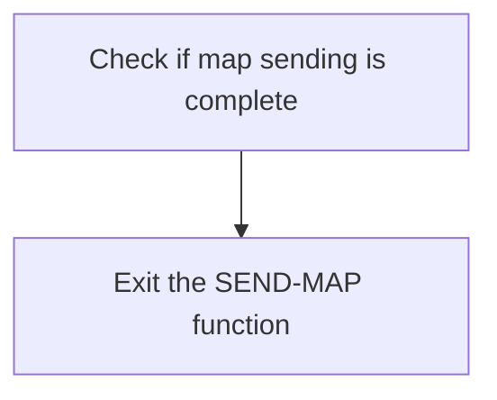

<SwmSnippet path="/src/base/cobol_src/BNKMENU.cbl" line="1201">

---

The <SwmToken path="src/base/cobol_src/BNKMENU.cbl" pos="1202:1:1" line-data="           EXIT.">`EXIT`</SwmToken> statement in the <SwmToken path="src/base/cobol_src/BNKMENU.cbl" pos="120:3:5" line-data="                 PERFORM SEND-MAP">`SEND-MAP`</SwmToken> function signifies the end of the map sending process. Once the map has been successfully sent, the function reaches the <SwmToken path="src/base/cobol_src/BNKMENU.cbl" pos="1201:1:1" line-data="       SMM999.">`SMM999`</SwmToken> label and executes the <SwmToken path="src/base/cobol_src/BNKMENU.cbl" pos="1202:1:1" line-data="           EXIT.">`EXIT`</SwmToken> statement to terminate the function and return control to the calling program.

```cobol
       SMM999.
           EXIT.
```

---

</SwmSnippet>

## <SwmToken path="src/base/cobol_src/BNKMENU.cbl" pos="197:3:7" line-data="              PERFORM POPULATE-TIME-DATE">`POPULATE-TIME-DATE`</SwmToken>

Lets' zoom into this section of the flow:

```mermaid
graph TD
  A[Display 'POPULATE-TIME-DATE SECTION'] --> B[Retrieve current time from CICS] --> C[Format the retrieved time and date]

%% Swimm:
%% graph TD
%%   A[Display '<SwmToken path="src/base/cobol_src/BNKMENU.cbl" pos="197:3:7" line-data="              PERFORM POPULATE-TIME-DATE">`POPULATE-TIME-DATE`</SwmToken> SECTION'] --> B[Retrieve current time from CICS] --> C[Format the retrieved time and date]
```

<SwmSnippet path="/src/base/cobol_src/BNKMENU.cbl" line="1297">

---

### Displaying the section name

First, the section displays the message '<SwmToken path="src/base/cobol_src/BNKMENU.cbl" pos="1297:6:10" line-data="      D    DISPLAY &#39;POPULATE-TIME-DATE SECTION&#39;.">`POPULATE-TIME-DATE`</SwmToken> SECTION' to indicate that this part of the code is being executed.

```cobol
      D    DISPLAY 'POPULATE-TIME-DATE SECTION'.
```

---

</SwmSnippet>

<SwmSnippet path="/src/base/cobol_src/BNKMENU.cbl" line="1299">

---

### Retrieving the current time

Moving to the next step, the code retrieves the current time from CICS and stores it in the <SwmToken path="src/base/cobol_src/BNKMENU.cbl" pos="1300:3:7" line-data="              ABSTIME(WS-U-TIME)">`WS-U-TIME`</SwmToken> variable.

```cobol
           EXEC CICS ASKTIME
              ABSTIME(WS-U-TIME)
           END-EXEC.
```

---

</SwmSnippet>

<SwmSnippet path="/src/base/cobol_src/BNKMENU.cbl" line="1303">

---

### Formatting the time and date

Next, the retrieved time is formatted into a more readable date and time format. The formatted date is stored in <SwmToken path="src/base/cobol_src/BNKMENU.cbl" pos="1305:3:7" line-data="                     DDMMYYYY(WS-ORIG-DATE)">`WS-ORIG-DATE`</SwmToken> and the time in <SwmToken path="src/base/cobol_src/BNKMENU.cbl" pos="1306:3:7" line-data="                     TIME(WS-TIME-NOW)">`WS-TIME-NOW`</SwmToken>.

```cobol
           EXEC CICS FORMATTIME
                     ABSTIME(WS-U-TIME)
                     DDMMYYYY(WS-ORIG-DATE)
                     TIME(WS-TIME-NOW)
                     DATESEP
           END-EXEC.
```

---

</SwmSnippet>

<SwmSnippet path="/src/base/cobol_src/BNKMENU.cbl" line="1310">

---

### Exiting the section

Finally, the section exits, completing the process of updating the current date and time.

```cobol
       PTD999.
           EXIT.
```

---

</SwmSnippet>

## <SwmToken path="src/base/cobol_src/BNKMENU.cbl" pos="596:3:7" line-data="                 PERFORM ABEND-THIS-TASK">`ABEND-THIS-TASK`</SwmToken>

Lets' zoom into this section of the flow:

```mermaid
graph TD
  A[Display failure information] --> B[Trigger abnormal termination]
```

<SwmSnippet path="/src/base/cobol_src/BNKMENU.cbl" line="1282">

---

### Displaying Failure Information

First, the <SwmToken path="src/base/cobol_src/BNKMENU.cbl" pos="1282:1:5" line-data="       ABEND-THIS-TASK SECTION.">`ABEND-THIS-TASK`</SwmToken> section begins by displaying the failure information stored in <SwmToken path="src/base/cobol_src/BNKMENU.cbl" pos="1284:3:7" line-data="           DISPLAY WS-FAIL-INFO.">`WS-FAIL-INFO`</SwmToken>. This information includes details about the failure, such as the application ID, response codes, and a message indicating that the task is abending.

```cobol
       ABEND-THIS-TASK SECTION.
       ATT010.
           DISPLAY WS-FAIL-INFO.
```

---

</SwmSnippet>

<SwmSnippet path="/src/base/cobol_src/BNKMENU.cbl" line="1286">

---

### Triggering Abnormal Termination

Moving to the next step, the code executes a CICS <SwmToken path="src/base/cobol_src/BNKMENU.cbl" pos="1286:5:5" line-data="           EXEC CICS ABEND">`ABEND`</SwmToken> command with the abend code 'HBNK' and the <SwmToken path="src/base/cobol_src/BNKMENU.cbl" pos="1288:1:1" line-data="              NODUMP">`NODUMP`</SwmToken> option. This command forces the task to terminate abnormally without generating a dump, which helps in managing system resources while still indicating a failure.

```cobol
           EXEC CICS ABEND
              ABCODE('HBNK')
              NODUMP
           END-EXEC.
```

---

</SwmSnippet>

<SwmSnippet path="/src/base/cobol_src/BNKMENU.cbl" line="1291">

---

### Exiting the Section

Finally, the section concludes with an <SwmToken path="src/base/cobol_src/BNKMENU.cbl" pos="1292:1:1" line-data="           EXIT.">`EXIT`</SwmToken> statement, which signifies the end of the <SwmToken path="src/base/cobol_src/BNKMENU.cbl" pos="596:3:7" line-data="                 PERFORM ABEND-THIS-TASK">`ABEND-THIS-TASK`</SwmToken> section and ensures that control is returned to the calling program or the next logical section of code.

```cobol
       ATT999.
           EXIT.
```

---

</SwmSnippet>

## <SwmToken path="src/base/cobol_src/BNKMENU.cbl" pos="132:3:7" line-data="                 PERFORM SEND-TERMINATION-MSG">`SEND-TERMINATION-MSG`</SwmToken>

Lets' zoom into this section of the flow:

```mermaid
graph TD
  A[Send termination message] --> B{Check response}
  B -- Normal response --> C[Exit]
  B -- Error response --> D[Initialize ABEND info]
  D --> E[Get supplemental information]
  E --> F[Populate date and time]
  F --> G[Prepare ABEND message]
  G --> H[Link to ABEND handler]
  H --> I[Log failure information]
  I --> J[Perform ABEND task]
```

First, the <SwmToken path="src/base/cobol_src/BNKMENU.cbl" pos="132:3:7" line-data="                 PERFORM SEND-TERMINATION-MSG">`SEND-TERMINATION-MSG`</SwmToken> section sends a termination message to the user interface using the <SwmToken path="src/base/cobol_src/BNKMENU.cbl" pos="1210:1:7" line-data="           EXEC CICS SEND TEXT">`EXEC CICS SEND TEXT`</SwmToken> command.

Moving to the next step, the response from the <SwmToken path="src/base/cobol_src/BNKMENU.cbl" pos="1210:5:7" line-data="           EXEC CICS SEND TEXT">`SEND TEXT`</SwmToken> command is checked. If the response is not normal, the program proceeds to handle the error.

Then, the program initializes the ABEND information record to prepare for capturing error details.

Next, it retrieves supplemental information such as the application ID and task number using the <SwmToken path="src/base/cobol_src/BNKMENU.cbl" pos="191:1:5" line-data="              EXEC CICS ASSIGN APPLID(ABND-APPLID)">`EXEC CICS ASSIGN`</SwmToken> command.

Diving into the next step, the program populates the date and time fields with the current date and time.

Moving forward, the program prepares the ABEND message by concatenating various pieces of information, including response codes and a failure message.

Then, the program links to the ABEND handler program to process the abnormal termination.

## <SwmToken path="src/base/cobol_src/BNKMENU.cbl" pos="153:3:7" line-data="                 PERFORM PROCESS-MENU-MAP">`PROCESS-MENU-MAP`</SwmToken>

Lets' zoom into this section of the flow:

```mermaid
graph TD
  A[Retrieve and validate user input] --> B{Is data valid?}
  B -- Yes --> C[Invoke corresponding transactions]
  B -- No --> D[Set alarm for data only]
  C --> E[Output data to screen]
  D --> E
```

<SwmSnippet path="/src/base/cobol_src/BNKMENU.cbl" line="246">

---

### Retrieving and validating user input

First, the function retrieves the data from the user input map and validates it to ensure it meets the required criteria.

```cobol
           PERFORM RECEIVE-MENU-MAP.

           PERFORM EDIT-MENU-DATA.
```

---

</SwmSnippet>

<SwmSnippet path="/src/base/cobol_src/BNKMENU.cbl" line="254">

---

### Checking data validity

Next, the function checks if the data is valid. If the data passes validation, it proceeds to invoke other transactions based on the user's menu selection.

```cobol
           IF VALID-DATA
              PERFORM INVOKE-OTHER-TXNS
           END-IF.
```

---

</SwmSnippet>

<SwmSnippet path="/src/base/cobol_src/BNKMENU.cbl" line="258">

---

### Setting alarm for data only

If the data is not valid, the function sets an alarm to indicate that only data should be sent without any further processing.

```cobol
           SET SEND-DATAONLY-ALARM TO TRUE.
```

---

</SwmSnippet>

<SwmSnippet path="/src/base/cobol_src/BNKMENU.cbl" line="263">

---

### Outputting data to the screen

Finally, the function outputs the data to the screen, providing feedback to the user based on their input and the subsequent processing steps.

```cobol
           PERFORM SEND-MAP.
```

---

</SwmSnippet>

## <SwmToken path="src/base/cobol_src/BNKMENU.cbl" pos="246:3:7" line-data="           PERFORM RECEIVE-MENU-MAP.">`RECEIVE-MENU-MAP`</SwmToken>

Lets' zoom into this section of the flow:

```mermaid
graph TD
  A[Receive Menu Map Data] --> B{Check Response}
  B -->|Normal| C[Continue Processing]
  B -->|Map Fail| D[Erase Map and Send Again]
  B -->|Other Error| E[Collect ABEND Info and Link to Handler]
```

<SwmSnippet path="/src/base/cobol_src/BNKMENU.cbl" line="269">

---

### Receiving Menu Map Data

First, the <SwmToken path="src/base/cobol_src/BNKMENU.cbl" pos="269:1:5" line-data="       RECEIVE-MENU-MAP SECTION.">`RECEIVE-MENU-MAP`</SwmToken> section begins by retrieving the data from the CICS map using the <SwmToken path="src/base/cobol_src/BNKMENU.cbl" pos="275:1:3" line-data="              RECEIVE MAP(&#39;BNK1ME&#39;)">`RECEIVE MAP`</SwmToken> command.

```cobol
       RECEIVE-MENU-MAP SECTION.
       RMM010.
      *
      *    Retrieve the data
      *
           EXEC CICS
              RECEIVE MAP('BNK1ME')
              MAPSET('BNK1MAI')
              INTO(BNK1MEI)
              RESP(WS-CICS-RESP)
              RESP2(WS-CICS-RESP2)
           END-EXEC.
```

---

</SwmSnippet>

<SwmSnippet path="/src/base/cobol_src/BNKMENU.cbl" line="282">

---

### Checking Response

Next, the response from the <SwmToken path="src/base/cobol_src/BNKMENU.cbl" pos="275:1:3" line-data="              RECEIVE MAP(&#39;BNK1ME&#39;)">`RECEIVE MAP`</SwmToken> command is checked to determine if it was successful. If the response is not normal, further actions are taken based on the type of error.

```cobol
           IF WS-CICS-RESP NOT = DFHRESP(NORMAL)

```

---

</SwmSnippet>

<SwmSnippet path="/src/base/cobol_src/BNKMENU.cbl" line="284">

---

### Handling Map Fail

If the response indicates a map failure (<SwmToken path="src/base/cobol_src/BNKMENU.cbl" pos="284:13:13" line-data="              IF WS-CICS-RESP = DFHRESP(MAPFAIL)">`MAPFAIL`</SwmToken>), the map is erased and sent again. This ensures that the user receives a fresh map to interact with.

```cobol
              IF WS-CICS-RESP = DFHRESP(MAPFAIL)
                 MOVE LOW-VALUES TO BNK1MEO
                 MOVE -1 TO ACTIONL
                 SET SEND-ERASE TO TRUE
                 PERFORM SEND-MAP
```

---

</SwmSnippet>

<SwmSnippet path="/src/base/cobol_src/BNKMENU.cbl" line="289">

---

### Handling Other Errors

For other types of errors, the response codes are preserved, and standard ABEND information is set up. This includes collecting application ID, date, time, and other relevant details.

```cobol
              ELSE

      *
      *          Preserve the RESP and RESP2, then set up the
      *          standard ABEND info before getting the applid,
      *          date/time etc. and linking to the Abend Handler
      *          program.
      *
                 INITIALIZE ABNDINFO-REC
                 MOVE EIBRESP    TO ABND-RESPCODE
                 MOVE EIBRESP2   TO ABND-RESP2CODE
      *
      *          Get supplemental information
      *
                 EXEC CICS ASSIGN APPLID(ABND-APPLID)
                 END-EXEC

                 MOVE EIBTASKN   TO ABND-TASKNO-KEY
                 MOVE EIBTRNID   TO ABND-TRANID

```

---

</SwmSnippet>

<SwmSnippet path="/src/base/cobol_src/BNKMENU.cbl" line="309">

---

### Populating Time and Date

The current date and time are populated to provide a timestamp for the error occurrence. This information is crucial for diagnosing and resolving issues.

```cobol
                 PERFORM POPULATE-TIME-DATE

                 MOVE WS-ORIG-DATE TO ABND-DATE
                 STRING WS-TIME-NOW-GRP-HH DELIMITED BY SIZE,
                       ':' DELIMITED BY SIZE,
                        WS-TIME-NOW-GRP-MM DELIMITED BY SIZE,
                        ':' DELIMITED BY SIZE,
                        WS-TIME-NOW-GRP-MM DELIMITED BY SIZE
                        INTO ABND-TIME
```

---

</SwmSnippet>

<SwmSnippet path="/src/base/cobol_src/BNKMENU.cbl" line="320">

---

### Collecting Additional Information

Additional information such as the unique time key and a specific code ('HBNK') is collected to further identify the context of the error.

```cobol
                 MOVE WS-U-TIME   TO ABND-UTIME-KEY
                 MOVE 'HBNK'      TO ABND-CODE

```

---

</SwmSnippet>

<SwmSnippet path="/src/base/cobol_src/BNKMENU.cbl" line="337">

---

### Linking to ABEND Handler

Finally, the ABEND handler program is linked to, passing all the collected information. This program handles the abnormal termination by logging the details for further investigation.

```cobol
                 EXEC CICS LINK PROGRAM(WS-ABEND-PGM)
                           COMMAREA(ABNDINFO-REC)
                 END-EXEC
```

---

</SwmSnippet>

## <SwmToken path="src/base/cobol_src/BNKMENU.cbl" pos="248:3:7" line-data="           PERFORM EDIT-MENU-DATA.">`EDIT-MENU-DATA`</SwmToken>

Lets' zoom into this section of the flow:

```mermaid
graph TD
  A[Check if ACTIONI is valid] --> |Invalid| B[Set error message]
  A --> |Valid| C[Move ACTIONI to ACTION-ALPHA]

%% Swimm:
%% graph TD
%%   A[Check if ACTIONI is valid] --> |Invalid| B[Set error message]
%%   A --> |Valid| C[Move ACTIONI to <SwmToken path="src/base/cobol_src/BNKMENU.cbl" pos="370:7:9" line-data="              MOVE ACTIONI TO ACTION-ALPHA">`ACTION-ALPHA`</SwmToken>]
```

<SwmSnippet path="/src/base/cobol_src/BNKMENU.cbl" line="360">

---

### Validating user input

First, the function checks if the <SwmToken path="src/base/cobol_src/BNKMENU.cbl" pos="360:3:3" line-data="           IF ACTIONI NOT = &#39;1&#39; AND ACTIONI NOT = &#39;2&#39; AND">`ACTIONI`</SwmToken> (the incoming action input) is one of the valid values ('1' to '7' or 'A').

```cobol
           IF ACTIONI NOT = '1' AND ACTIONI NOT = '2' AND
           ACTIONI NOT = '3' AND ACTIONI NOT = '4' AND
           ACTIONI NOT = '5' AND ACTIONI NOT = '6' AND
           ACTIONI NOT = '7' AND ACTIONI NOT = 'A'
```

---

</SwmSnippet>

<SwmSnippet path="/src/base/cobol_src/BNKMENU.cbl" line="365">

---

### Handling invalid input

If the input is invalid, it clears the <SwmToken path="src/base/cobol_src/BNKMENU.cbl" pos="365:7:7" line-data="              MOVE SPACES TO MESSAGEO">`MESSAGEO`</SwmToken> field (which holds the output message) and sets an error message indicating that a valid value must be entered.

```cobol
              MOVE SPACES TO MESSAGEO
              MOVE 'You must enter a valid value (1-7 or A).' TO
                 MESSAGEO
```

---

</SwmSnippet>

<SwmSnippet path="/src/base/cobol_src/BNKMENU.cbl" line="368">

---

### Setting validation flag

Next, it sets the <SwmToken path="src/base/cobol_src/BNKMENU.cbl" pos="368:9:13" line-data="              MOVE &#39;N&#39; TO VALID-DATA-SW">`VALID-DATA-SW`</SwmToken> (a switch indicating whether the data is valid) to 'N' (No) to indicate that the input is invalid.

```cobol
              MOVE 'N' TO VALID-DATA-SW
```

---

</SwmSnippet>

<SwmSnippet path="/src/base/cobol_src/BNKMENU.cbl" line="370">

---

### Handling valid input

Then, if the input is valid, it moves the <SwmToken path="src/base/cobol_src/BNKMENU.cbl" pos="370:3:3" line-data="              MOVE ACTIONI TO ACTION-ALPHA">`ACTIONI`</SwmToken> value to <SwmToken path="src/base/cobol_src/BNKMENU.cbl" pos="370:7:9" line-data="              MOVE ACTIONI TO ACTION-ALPHA">`ACTION-ALPHA`</SwmToken> (a field that holds the action in alphanumeric form).

```cobol
              MOVE ACTIONI TO ACTION-ALPHA
           END-IF.
```

---

</SwmSnippet>

# Handle transactions (<SwmToken path="src/base/cobol_src/BNKMENU.cbl" pos="255:3:7" line-data="              PERFORM INVOKE-OTHER-TXNS">`INVOKE-OTHER-TXNS`</SwmToken>)

Let's split this section into smaller parts:

```mermaid
graph TD
jh0ms("Display Customer"):::a6dd71ec8  --> 
clhgo("Log Error Display Customer"):::a2c76eaa1  --> 
xjvff("Display Account"):::a4cb23391  --> 
nyfta("Log Error Display Account"):::ad9eeec50  --> 
pv969("Create Customer"):::a6318c85e  --> 
2t3uh("Log Error Create Customer"):::a62744c9e  --> 
twhfo("Create Account"):::a94cbc7d8  --> 
oolbe("Log Error Create Account"):::a990437b8 
id1>"Handle transactions (`INVOKE-OTHER-TXNS`)"]:::a7cea4d7f
classDef a7cea4d7f color:#000000,fill:#7CB9F4
classDef a6dd71ec8 color:#000000,fill:#7CB9F4
classDef a2c76eaa1 color:#000000,fill:#00FFAA
classDef a4cb23391 color:#000000,fill:#00FFF4
classDef ad9eeec50 color:#000000,fill:#FFFF00
classDef a6318c85e color:#000000,fill:#AA7CB9
classDef a62744c9e color:#000000,fill:#5afa0a
classDef a94cbc7d8 color:#000000,fill:#f5a10a
classDef a990437b8 color:#000000,fill:#f50af1

%% Swimm:
%% graph TD
%% jh0ms("Display Customer"):::a6dd71ec8  --> 
%% clhgo("Log Error Display Customer"):::a2c76eaa1  --> 
%% xjvff("Display Account"):::a4cb23391  --> 
%% nyfta("Log Error Display Account"):::ad9eeec50  --> 
%% pv969("Create Customer"):::a6318c85e  --> 
%% 2t3uh("Log Error Create Customer"):::a62744c9e  --> 
%% twhfo("Create Account"):::a94cbc7d8  --> 
%% oolbe("Log Error Create Account"):::a990437b8 
%% id1>"Handle transactions (`<SwmToken path="src/base/cobol_src/BNKMENU.cbl" pos="255:3:7" line-data="              PERFORM INVOKE-OTHER-TXNS">`INVOKE-OTHER-TXNS`</SwmToken>`)"]:::a7cea4d7f
%% classDef a7cea4d7f color:#000000,fill:#7CB9F4
%% classDef a6dd71ec8 color:#000000,fill:#7CB9F4
%% classDef a2c76eaa1 color:#000000,fill:#00FFAA
%% classDef a4cb23391 color:#000000,fill:#00FFF4
%% classDef ad9eeec50 color:#000000,fill:#FFFF00
%% classDef a6318c85e color:#000000,fill:#AA7CB9
%% classDef a62744c9e color:#000000,fill:#5afa0a
%% classDef a94cbc7d8 color:#000000,fill:#f5a10a
%% classDef a990437b8 color:#000000,fill:#f50af1
```

## Display Customer

First, we'll zoom into this section of the flow:

```mermaid
graph TD
  A[Check if user action is '1'] --> |Yes| B[Invoke transaction 'ODCS']
```

<SwmSnippet path="/src/base/cobol_src/BNKMENU.cbl" line="386">

---

The code checks if the user action (<SwmToken path="src/base/cobol_src/BNKMENU.cbl" pos="386:3:3" line-data="           IF ACTIONI = &#39;1&#39;">`ACTIONI`</SwmToken>) is '1'. If it is, the program invokes the CICS transaction 'ODCS' immediately. This transaction is likely responsible for handling a specific operation within the banking application, such as displaying customer details or processing a particular type of transaction. The <SwmToken path="src/base/cobol_src/BNKMENU.cbl" pos="390:1:1" line-data="                 RESP(WS-CICS-RESP)">`RESP`</SwmToken> and <SwmToken path="src/base/cobol_src/BNKMENU.cbl" pos="391:1:1" line-data="                 RESP2(WS-CICS-RESP2)">`RESP2`</SwmToken> fields are used to capture the response codes from the CICS command, which can be used for error handling or logging purposes.

```cobol
           IF ACTIONI = '1'
              EXEC CICS RETURN
                 TRANSID('ODCS')
                 IMMEDIATE
                 RESP(WS-CICS-RESP)
                 RESP2(WS-CICS-RESP2)
              END-EXEC
```

---

</SwmSnippet>

## Log Error Display Customer

Now, lets zoom into this section of the flow:

```mermaid
graph TD
  A[Check if response is not normal] --> B[Initialize abend info]
  B --> C[Move response codes to abend info]
  C --> D[Get supplemental information]
  D --> E[Move task and transaction IDs to abend info]
  E --> F[Perform populate time and date]
  F --> G[Move date and time to abend info]
  G --> H[Move additional info to abend info]
  H --> I[Assign program to abend info]
  I --> J[Move zeros to SQL code]
  J --> K[Create freeform error message]
  K --> L[Link to abend handler program]
  L --> M[Initialize failure info]
  M --> N[Move failure message and response codes]
  N --> O[Perform abend task]
```

First, the code checks if the response code <SwmToken path="src/base/cobol_src/BNKMENU.cbl" pos="174:3:7" line-data="              RESP(WS-CICS-RESP)">`WS-CICS-RESP`</SwmToken> is not equal to <SwmToken path="src/base/cobol_src/BNKMENU.cbl" pos="178:13:16" line-data="           IF WS-CICS-RESP NOT = DFHRESP(NORMAL)">`DFHRESP(NORMAL)`</SwmToken>, indicating an abnormal condition.

Moving to the next step, the abend information record <SwmToken path="src/base/cobol_src/BNKMENU.cbl" pos="185:3:5" line-data="              INITIALIZE ABNDINFO-REC">`ABNDINFO-REC`</SwmToken> is initialized to prepare for capturing failure details.

Next, the response codes <SwmToken path="src/base/cobol_src/BNKMENU.cbl" pos="298:3:3" line-data="                 MOVE EIBRESP    TO ABND-RESPCODE">`EIBRESP`</SwmToken> and <SwmToken path="src/base/cobol_src/BNKMENU.cbl" pos="299:3:3" line-data="                 MOVE EIBRESP2   TO ABND-RESP2CODE">`EIBRESP2`</SwmToken> are moved to <SwmToken path="src/base/cobol_src/BNKMENU.cbl" pos="298:7:9" line-data="                 MOVE EIBRESP    TO ABND-RESPCODE">`ABND-RESPCODE`</SwmToken> and <SwmToken path="src/base/cobol_src/BNKMENU.cbl" pos="299:7:9" line-data="                 MOVE EIBRESP2   TO ABND-RESP2CODE">`ABND-RESP2CODE`</SwmToken> respectively, to log the specific error codes.

Then, supplemental information such as the application ID is retrieved using the <SwmToken path="src/base/cobol_src/BNKMENU.cbl" pos="191:1:7" line-data="              EXEC CICS ASSIGN APPLID(ABND-APPLID)">`EXEC CICS ASSIGN APPLID`</SwmToken> command and stored in <SwmToken path="src/base/cobol_src/BNKMENU.cbl" pos="191:9:11" line-data="              EXEC CICS ASSIGN APPLID(ABND-APPLID)">`ABND-APPLID`</SwmToken>.

Following this, the task number and transaction ID are moved to <SwmToken path="src/base/cobol_src/BNKMENU.cbl" pos="194:7:11" line-data="              MOVE EIBTASKN   TO ABND-TASKNO-KEY">`ABND-TASKNO-KEY`</SwmToken> and <SwmToken path="src/base/cobol_src/BNKMENU.cbl" pos="195:7:9" line-data="              MOVE EIBTRNID   TO ABND-TRANID">`ABND-TRANID`</SwmToken> respectively, to identify the specific transaction.

Diving into the next step, the <SwmToken path="src/base/cobol_src/BNKMENU.cbl" pos="197:3:7" line-data="              PERFORM POPULATE-TIME-DATE">`POPULATE-TIME-DATE`</SwmToken> routine is performed to get the current date and time.

The current date and time are then moved to <SwmToken path="src/base/cobol_src/BNKMENU.cbl" pos="199:11:13" line-data="              MOVE WS-ORIG-DATE TO ABND-DATE">`ABND-DATE`</SwmToken> and <SwmToken path="src/base/cobol_src/BNKMENU.cbl" pos="205:3:5" line-data="                     INTO ABND-TIME">`ABND-TIME`</SwmToken> respectively, to log when the failure occurred.

Additional information such as <SwmToken path="src/base/cobol_src/BNKMENU.cbl" pos="208:3:7" line-data="              MOVE WS-U-TIME   TO ABND-UTIME-KEY">`WS-U-TIME`</SwmToken> and a specific code 'HBNK' are moved to <SwmToken path="src/base/cobol_src/BNKMENU.cbl" pos="208:11:15" line-data="              MOVE WS-U-TIME   TO ABND-UTIME-KEY">`ABND-UTIME-KEY`</SwmToken> and <SwmToken path="src/base/cobol_src/BNKMENU.cbl" pos="209:9:11" line-data="              MOVE &#39;HBNK&#39;      TO ABND-CODE">`ABND-CODE`</SwmToken> respectively.

The program name is assigned to <SwmToken path="src/base/cobol_src/BNKMENU.cbl" pos="211:9:11" line-data="              EXEC CICS ASSIGN PROGRAM(ABND-PROGRAM)">`ABND-PROGRAM`</SwmToken> using the <SwmToken path="src/base/cobol_src/BNKMENU.cbl" pos="211:1:7" line-data="              EXEC CICS ASSIGN PROGRAM(ABND-PROGRAM)">`EXEC CICS ASSIGN PROGRAM`</SwmToken> command.

Moving forward, zeros are moved to <SwmToken path="src/base/cobol_src/BNKMENU.cbl" pos="214:7:9" line-data="              MOVE ZEROS      TO ABND-SQLCODE">`ABND-SQLCODE`</SwmToken> to initialize the SQL code field.

A freeform error message is created by concatenating various strings and response codes into <SwmToken path="src/base/cobol_src/BNKMENU.cbl" pos="583:3:5" line-data="                       INTO ABND-FREEFORM">`ABND-FREEFORM`</SwmToken>.

The abend handler program <SwmToken path="src/base/cobol_src/BNKMENU.cbl" pos="225:9:13" line-data="              EXEC CICS LINK PROGRAM(WS-ABEND-PGM)">`WS-ABEND-PGM`</SwmToken> is then linked using the <SwmToken path="src/base/cobol_src/BNKMENU.cbl" pos="225:1:7" line-data="              EXEC CICS LINK PROGRAM(WS-ABEND-PGM)">`EXEC CICS LINK PROGRAM`</SwmToken> command, passing the abend information record.

Next, the failure information is initialized, and a failure message is moved to <SwmToken path="src/base/cobol_src/BNKMENU.cbl" pos="593:3:9" line-data="                    TO WS-CICS-FAIL-MSG">`WS-CICS-FAIL-MSG`</SwmToken>.

## Display Account

This is the next section of the flow.

```mermaid
graph TD
  A[Invoke Other Transactions] --> B[Return to CICS] --> C[Specify Transaction ID 'ODAC'] --> D[Immediate Execution] --> E[Handle Response]
```

<SwmSnippet path="/src/base/cobol_src/BNKMENU.cbl" line="459">

---

The <SwmToken path="src/base/cobol_src/BNKMENU.cbl" pos="255:3:7" line-data="              PERFORM INVOKE-OTHER-TXNS">`INVOKE-OTHER-TXNS`</SwmToken> function is responsible for invoking other transactions within the CICS environment. It begins by returning control to CICS using the <SwmToken path="src/base/cobol_src/BNKMENU.cbl" pos="459:1:5" line-data="              EXEC CICS RETURN">`EXEC CICS RETURN`</SwmToken> command. This is followed by specifying the transaction ID 'ODAC' which indicates the specific transaction to be executed. The <SwmToken path="src/base/cobol_src/BNKMENU.cbl" pos="461:1:1" line-data="                 IMMEDIATE">`IMMEDIATE`</SwmToken> keyword ensures that the transaction is executed without delay. The responses from the transaction execution are captured in <SwmToken path="src/base/cobol_src/BNKMENU.cbl" pos="462:3:7" line-data="                 RESP(WS-CICS-RESP)">`WS-CICS-RESP`</SwmToken> and <SwmToken path="src/base/cobol_src/BNKMENU.cbl" pos="463:3:7" line-data="                 RESP2(WS-CICS-RESP2)">`WS-CICS-RESP2`</SwmToken> for further handling or error checking.

```cobol
              EXEC CICS RETURN
                 TRANSID('ODAC')
                 IMMEDIATE
                 RESP(WS-CICS-RESP)
                 RESP2(WS-CICS-RESP2)
              END-EXEC
```

---

</SwmSnippet>

## Log Error Display Account

Now, lets zoom into this section of the flow:

```mermaid
graph TD
  A[Check if response is normal] -->|No| B[Initialize ABEND info]
  B --> C[Move response codes to ABEND info]
  C --> D[Get supplemental information]
  D --> E[Move task and transaction IDs to ABEND info]
  E --> F[Populate date and time]
  F --> G[Move date and time to ABEND info]
  G --> H[Move user time and code to ABEND info]
  H --> I[Assign program to ABEND info]
  I --> J[Move SQL code to ABEND info]
  J --> K[Create freeform error message]
  K --> L[Link to ABEND handler program]
  L --> M[Initialize failure info]
  M --> N[Move failure message and response codes to failure info]
  N --> O[Perform ABEND task]
```

First, the code checks if the response is not normal by evaluating <SwmToken path="src/base/cobol_src/BNKMENU.cbl" pos="174:3:7" line-data="              RESP(WS-CICS-RESP)">`WS-CICS-RESP`</SwmToken>.

If the response is not normal, it initializes the ABEND information record to prepare for logging the error details.

Next, it moves the response codes <SwmToken path="src/base/cobol_src/BNKMENU.cbl" pos="298:3:3" line-data="                 MOVE EIBRESP    TO ABND-RESPCODE">`EIBRESP`</SwmToken> and <SwmToken path="src/base/cobol_src/BNKMENU.cbl" pos="299:3:3" line-data="                 MOVE EIBRESP2   TO ABND-RESP2CODE">`EIBRESP2`</SwmToken> to the ABEND information record to capture the error codes.

Then, it retrieves supplemental information such as the application ID and assigns it to the ABEND information record.

Moving to the next step, it captures the task number and transaction ID and assigns them to the ABEND information record.

The code then performs the <SwmToken path="src/base/cobol_src/BNKMENU.cbl" pos="197:3:7" line-data="              PERFORM POPULATE-TIME-DATE">`POPULATE-TIME-DATE`</SwmToken> routine to get the current date and time.

It moves the date and time information to the ABEND information record for logging purposes.

## Create Customer

This is the next section of the flow.

```mermaid
graph TD
  A[Invoke other transactions] --> B[Return to CICS] --> C[Transaction OCCS]
```

<SwmSnippet path="/src/base/cobol_src/BNKMENU.cbl" line="532">

---

The <SwmToken path="src/base/cobol_src/BNKMENU.cbl" pos="255:3:7" line-data="              PERFORM INVOKE-OTHER-TXNS">`INVOKE-OTHER-TXNS`</SwmToken> function is responsible for invoking other transactions within the CICS environment. It does this by returning control to CICS and specifying the transaction identifier 'OCCS'. This ensures that the OCCS transaction is immediately executed, allowing for seamless integration and continuation of operations within the banking application.

```cobol
              EXEC CICS RETURN
                 TRANSID('OCCS')
                 IMMEDIATE
                 RESP(WS-CICS-RESP)
                 RESP2(WS-CICS-RESP2)
              END-EXEC
```

---

</SwmSnippet>

## Log Error Create Customer

Now, lets zoom into this section of the flow:

```mermaid
graph TD
  A[Check if response is normal] -->|No| B[Initialize abend info]
  B --> C[Move response codes to abend info]
  C --> D[Get supplemental information]
  D --> E[Move task and transaction IDs to abend info]
  E --> F[Perform populate time and date]
  F --> G[Move date and time to abend info]
  G --> H[Assign program to abend info]
  H --> I[Move abend code and SQL code to abend info]
  I --> J[Create abend freeform message]
  J --> K[Link to abend handler program]
  K --> L[Initialize failure info]
  L --> M[Move failure message and response codes to failure info]
  M --> N[Perform abend task]
```

<SwmSnippet path="/src/base/cobol_src/BNKMENU.cbl" line="539">

---

First, the code checks if the response code <SwmToken path="src/base/cobol_src/BNKMENU.cbl" pos="539:3:7" line-data="              IF WS-CICS-RESP NOT = DFHRESP(NORMAL)">`WS-CICS-RESP`</SwmToken> is not equal to <SwmToken path="src/base/cobol_src/BNKMENU.cbl" pos="539:13:16" line-data="              IF WS-CICS-RESP NOT = DFHRESP(NORMAL)">`DFHRESP(NORMAL)`</SwmToken> (indicating an abnormal response).

```cobol
              IF WS-CICS-RESP NOT = DFHRESP(NORMAL)
```

---

</SwmSnippet>

<SwmSnippet path="/src/base/cobol_src/BNKMENU.cbl" line="546">

---

If the response is abnormal, it initializes the abend information record <SwmToken path="src/base/cobol_src/BNKMENU.cbl" pos="546:3:5" line-data="                 INITIALIZE ABNDINFO-REC">`ABNDINFO-REC`</SwmToken> to prepare for capturing abend details.

```cobol
                 INITIALIZE ABNDINFO-REC
```

---

</SwmSnippet>

<SwmSnippet path="/src/base/cobol_src/BNKMENU.cbl" line="547">

---

Next, it moves the response codes <SwmToken path="src/base/cobol_src/BNKMENU.cbl" pos="547:3:3" line-data="                 MOVE EIBRESP    TO ABND-RESPCODE">`EIBRESP`</SwmToken> and <SwmToken path="src/base/cobol_src/BNKMENU.cbl" pos="548:3:3" line-data="                 MOVE EIBRESP2   TO ABND-RESP2CODE">`EIBRESP2`</SwmToken> to the abend information record to capture the specific error details.

```cobol
                 MOVE EIBRESP    TO ABND-RESPCODE
                 MOVE EIBRESP2   TO ABND-RESP2CODE
```

---

</SwmSnippet>

<SwmSnippet path="/src/base/cobol_src/BNKMENU.cbl" line="552">

---

The code then retrieves supplemental information such as the application ID and task number, and moves them to the abend information record.

```cobol
                  EXEC CICS ASSIGN APPLID(ABND-APPLID)
                  END-EXEC

                 MOVE EIBTASKN   TO ABND-TASKNO-KEY
                 MOVE EIBTRNID   TO ABND-TRANID
```

---

</SwmSnippet>

<SwmSnippet path="/src/base/cobol_src/BNKMENU.cbl" line="558">

---

It performs the <SwmToken path="src/base/cobol_src/BNKMENU.cbl" pos="558:3:7" line-data="                 PERFORM POPULATE-TIME-DATE">`POPULATE-TIME-DATE`</SwmToken> routine to get the current date and time, and then moves these values to the abend information record.

```cobol
                 PERFORM POPULATE-TIME-DATE

                 MOVE WS-ORIG-DATE TO ABND-DATE
                 STRING WS-TIME-NOW-GRP-HH DELIMITED BY SIZE,
                       ':' DELIMITED BY SIZE,
                        WS-TIME-NOW-GRP-MM DELIMITED BY SIZE,
                        ':' DELIMITED BY SIZE,
                        WS-TIME-NOW-GRP-MM DELIMITED BY SIZE
                        INTO ABND-TIME
```

---

</SwmSnippet>

<SwmSnippet path="/src/base/cobol_src/BNKMENU.cbl" line="570">

---

The program assigns the current program name to the abend information record and sets the abend code to 'HBNK'.

```cobol
                 MOVE 'HBNK'      TO ABND-CODE

                 EXEC CICS ASSIGN PROGRAM(ABND-PROGRAM)
                 END-EXEC
```

---

</SwmSnippet>

<SwmSnippet path="/src/base/cobol_src/BNKMENU.cbl" line="577">

---

It constructs a freeform message detailing the failure, including the response codes, and moves it to the abend information record.

```cobol
                 STRING 'IOT010 - RETURN TRANSID(OCCS) FAIL.'
                       DELIMITED BY SIZE,
                       ' EIBRESP=' DELIMITED BY SIZE,
                       ABND-RESPCODE DELIMITED BY SIZE,
                       ' RESP2=' DELIMITED BY SIZE,
                       ABND-RESP2CODE DELIMITED BY SIZE
                       INTO ABND-FREEFORM
```

---

</SwmSnippet>

<SwmSnippet path="/src/base/cobol_src/BNKMENU.cbl" line="586">

---

Finally, the program links to the abend handler program <SwmToken path="src/base/cobol_src/BNKMENU.cbl" pos="586:9:13" line-data="                 EXEC CICS LINK PROGRAM(WS-ABEND-PGM)">`WS-ABEND-PGM`</SwmToken> with the abend information record, initializes failure information, and performs the abend task.

```cobol
                 EXEC CICS LINK PROGRAM(WS-ABEND-PGM)
                           COMMAREA(ABNDINFO-REC)
                 END-EXEC


                 INITIALIZE WS-FAIL-INFO
                 MOVE 'BNKMENU - IOT010 - RETURN TRANSID(OCCS) FAIL'
                    TO WS-CICS-FAIL-MSG
                 MOVE WS-CICS-RESP  TO WS-CICS-RESP-DISP
                 MOVE WS-CICS-RESP2 TO WS-CICS-RESP2-DISP
                 PERFORM ABEND-THIS-TASK
```

---

</SwmSnippet>

## Create Account

This is the next section of the flow.

```mermaid
graph TD
  A[Invoke other transactions] --> B[Return control to CICS] --> C[Specify transaction ID 'OCAC'] --> D[Immediate execution] --> E[Capture response in WS-CICS-RESP] --> F[Capture additional response in WS-CICS-RESP2]

%% Swimm:
%% graph TD
%%   A[Invoke other transactions] --> B[Return control to CICS] --> C[Specify transaction ID 'OCAC'] --> D[Immediate execution] --> E[Capture response in <SwmToken path="src/base/cobol_src/BNKMENU.cbl" pos="174:3:7" line-data="              RESP(WS-CICS-RESP)">`WS-CICS-RESP`</SwmToken>] --> F[Capture additional response in <SwmToken path="src/base/cobol_src/BNKMENU.cbl" pos="175:3:7" line-data="              RESP2(WS-CICS-RESP2)">`WS-CICS-RESP2`</SwmToken>]
```

<SwmSnippet path="/src/base/cobol_src/BNKMENU.cbl" line="605">

---

The <SwmToken path="src/base/cobol_src/BNKMENU.cbl" pos="255:3:7" line-data="              PERFORM INVOKE-OTHER-TXNS">`INVOKE-OTHER-TXNS`</SwmToken> function is responsible for invoking other transactions within the CICS environment. It begins by returning control to CICS using the <SwmToken path="src/base/cobol_src/BNKMENU.cbl" pos="605:1:5" line-data="              EXEC CICS RETURN">`EXEC CICS RETURN`</SwmToken> command. This command specifies the transaction ID 'OCAC', which indicates the specific transaction to be executed. The <SwmToken path="src/base/cobol_src/BNKMENU.cbl" pos="607:1:1" line-data="                 IMMEDIATE">`IMMEDIATE`</SwmToken> keyword ensures that the transaction is executed without delay. The responses from the transaction execution are captured in the variables <SwmToken path="src/base/cobol_src/BNKMENU.cbl" pos="608:3:7" line-data="                 RESP(WS-CICS-RESP)">`WS-CICS-RESP`</SwmToken> and <SwmToken path="src/base/cobol_src/BNKMENU.cbl" pos="609:3:7" line-data="                 RESP2(WS-CICS-RESP2)">`WS-CICS-RESP2`</SwmToken>, which can be used for further processing or error handling.

```cobol
              EXEC CICS RETURN
                 TRANSID('OCAC')
                 IMMEDIATE
                 RESP(WS-CICS-RESP)
                 RESP2(WS-CICS-RESP2)
              END-EXEC
```

---

</SwmSnippet>

## Log Error Create Account

Now, lets zoom into this section of the flow:

```mermaid
graph TD
  A[Check CICS Response] -->|Not Normal| B[Initialize ABEND Info]
  B --> C[Get Application ID]
  C --> D[Get Task Number and Transaction ID]
  D --> E[Populate Date and Time]
  E --> F[Set ABEND Code]
  F --> G[Get Program Name]
  G --> H[Log Failure Details]
  H --> I[Link to ABEND Handler]
  I --> J[Initialize Failure Info]
  J --> K[Set Failure Message]
  K --> L[Perform ABEND Task]
```

### Initializing ABEND Information

### Checking CICS Response

First, the code checks if the CICS response is not normal (<SwmToken path="src/base/cobol_src/BNKMENU.cbl" pos="178:3:16" line-data="           IF WS-CICS-RESP NOT = DFHRESP(NORMAL)">`WS-CICS-RESP NOT = DFHRESP(NORMAL)`</SwmToken>). This condition determines if there was an issue with the transaction that needs to be handled.

<SwmSnippet path="/src/base/cobol_src/BNKMENU.cbl" line="619">

---

If the response is not normal, the code initializes the ABEND information record (<SwmToken path="src/base/cobol_src/BNKMENU.cbl" pos="619:3:5" line-data="                 INITIALIZE ABNDINFO-REC">`ABNDINFO-REC`</SwmToken>) and moves the response codes (<SwmToken path="src/base/cobol_src/BNKMENU.cbl" pos="620:3:3" line-data="                 MOVE EIBRESP    TO ABND-RESPCODE">`EIBRESP`</SwmToken> and <SwmToken path="src/base/cobol_src/BNKMENU.cbl" pos="621:3:3" line-data="                 MOVE EIBRESP2   TO ABND-RESP2CODE">`EIBRESP2`</SwmToken>) to the respective fields in the ABEND record.

```cobol
                 INITIALIZE ABNDINFO-REC
                 MOVE EIBRESP    TO ABND-RESPCODE
                 MOVE EIBRESP2   TO ABND-RESP2CODE
```

---

</SwmSnippet>

<SwmSnippet path="/src/base/cobol_src/BNKMENU.cbl" line="625">

---

### Getting Application ID

Next, the application ID is retrieved using the <SwmToken path="src/base/cobol_src/BNKMENU.cbl" pos="625:1:7" line-data="                  EXEC CICS ASSIGN APPLID(ABND-APPLID)">`EXEC CICS ASSIGN APPLID`</SwmToken> command and stored in the ABEND record (<SwmToken path="src/base/cobol_src/BNKMENU.cbl" pos="625:9:11" line-data="                  EXEC CICS ASSIGN APPLID(ABND-APPLID)">`ABND-APPLID`</SwmToken>).

```cobol
                  EXEC CICS ASSIGN APPLID(ABND-APPLID)
                  END-EXEC
```

---

</SwmSnippet>

<SwmSnippet path="/src/base/cobol_src/BNKMENU.cbl" line="628">

---

### Getting Task Number and Transaction ID

The task number and transaction ID are then moved to the ABEND record (<SwmToken path="src/base/cobol_src/BNKMENU.cbl" pos="628:7:11" line-data="                 MOVE EIBTASKN   TO ABND-TASKNO-KEY">`ABND-TASKNO-KEY`</SwmToken> and <SwmToken path="src/base/cobol_src/BNKMENU.cbl" pos="629:7:9" line-data="                 MOVE EIBTRNID   TO ABND-TRANID">`ABND-TRANID`</SwmToken>).

```cobol
                 MOVE EIBTASKN   TO ABND-TASKNO-KEY
                 MOVE EIBTRNID   TO ABND-TRANID
```

---

</SwmSnippet>

<SwmSnippet path="/src/base/cobol_src/BNKMENU.cbl" line="631">

---

### Populating Date and Time

The code performs a routine to populate the current date and time (<SwmToken path="src/base/cobol_src/BNKMENU.cbl" pos="631:1:7" line-data="                 PERFORM POPULATE-TIME-DATE">`PERFORM POPULATE-TIME-DATE`</SwmToken>) and moves these values to the ABEND record.

```cobol
                 PERFORM POPULATE-TIME-DATE

                 MOVE WS-ORIG-DATE TO ABND-DATE
                 STRING WS-TIME-NOW-GRP-HH DELIMITED BY SIZE,
                       ':' DELIMITED BY SIZE,
                        WS-TIME-NOW-GRP-MM DELIMITED BY SIZE,
                        ':' DELIMITED BY SIZE,
                        WS-TIME-NOW-GRP-MM DELIMITED BY SIZE
                        INTO ABND-TIME
```

---

</SwmSnippet>

<SwmSnippet path="/src/base/cobol_src/BNKMENU.cbl" line="643">

---

### Setting ABEND Code

The ABEND code is set to 'HBNK' to indicate the source of the failure.

```cobol
                 MOVE 'HBNK'      TO ABND-CODE

```

---

</SwmSnippet>

<SwmSnippet path="/src/base/cobol_src/BNKMENU.cbl" line="645">

---

### Getting Program Name

The program name is retrieved using the <SwmToken path="src/base/cobol_src/BNKMENU.cbl" pos="645:1:7" line-data="                 EXEC CICS ASSIGN PROGRAM(ABND-PROGRAM)">`EXEC CICS ASSIGN PROGRAM`</SwmToken> command and stored in the ABEND record (<SwmToken path="src/base/cobol_src/BNKMENU.cbl" pos="645:9:11" line-data="                 EXEC CICS ASSIGN PROGRAM(ABND-PROGRAM)">`ABND-PROGRAM`</SwmToken>).

```cobol
                 EXEC CICS ASSIGN PROGRAM(ABND-PROGRAM)
                 END-EXEC
```

---

</SwmSnippet>

<SwmSnippet path="/src/base/cobol_src/BNKMENU.cbl" line="650">

---

### Logging Failure Details

The failure details are logged by constructing a message string that includes the response codes and other relevant information. This string is then moved to the ABEND record (<SwmToken path="src/base/cobol_src/BNKMENU.cbl" pos="656:3:5" line-data="                       INTO ABND-FREEFORM">`ABND-FREEFORM`</SwmToken>).

```cobol
                 STRING 'IOT010 - RETURN TRANSID(OCAC) FAIL.'
                       DELIMITED BY SIZE,
                       ' EIBRESP=' DELIMITED BY SIZE,
                       ABND-RESPCODE DELIMITED BY SIZE,
                       ' RESP2=' DELIMITED BY SIZE,
                       ABND-RESP2CODE DELIMITED BY SIZE
                       INTO ABND-FREEFORM
```

---

</SwmSnippet>

<SwmSnippet path="/src/base/cobol_src/BNKMENU.cbl" line="659">

---

### Linking to ABEND Handler

Finally, the code links to the ABEND handler program (<SwmToken path="src/base/cobol_src/BNKMENU.cbl" pos="659:9:13" line-data="                 EXEC CICS LINK PROGRAM(WS-ABEND-PGM)">`WS-ABEND-PGM`</SwmToken>) and passes the ABEND information record (<SwmToken path="src/base/cobol_src/BNKMENU.cbl" pos="660:3:5" line-data="                           COMMAREA(ABNDINFO-REC)">`ABNDINFO-REC`</SwmToken>) to it. This ensures that the failure details are processed and logged appropriately.

```cobol
                 EXEC CICS LINK PROGRAM(WS-ABEND-PGM)
                           COMMAREA(ABNDINFO-REC)
                 END-EXEC
```

---

</SwmSnippet>

&nbsp;

*This is an auto-generated document by Swimm 🌊 and has not yet been verified by a human*

<SwmMeta version="3.0.0" repo-id="Z2l0aHViJTNBJTNBY2ljcy1iYW5raW5nLXNhbXBsZS1hcHBsaWNhdGlvbi1jYnNhLUlCTS1EZW1vJTNBJTNBU3dpbW0tRGVtbw==" repo-name="cics-banking-sample-application-cbsa-IBM-Demo"><sup>Powered by [Swimm](/)</sup></SwmMeta>
