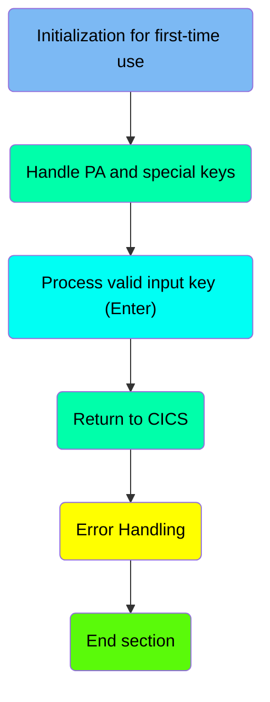
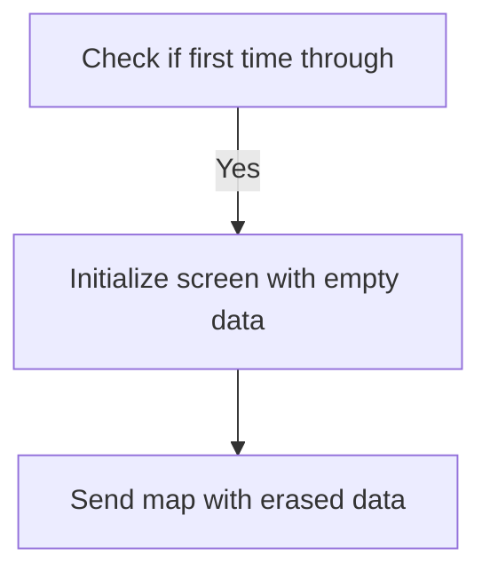
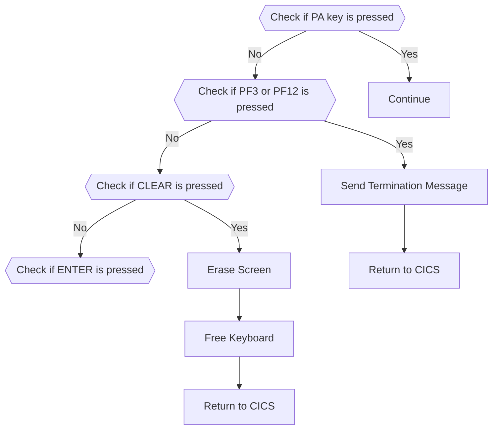
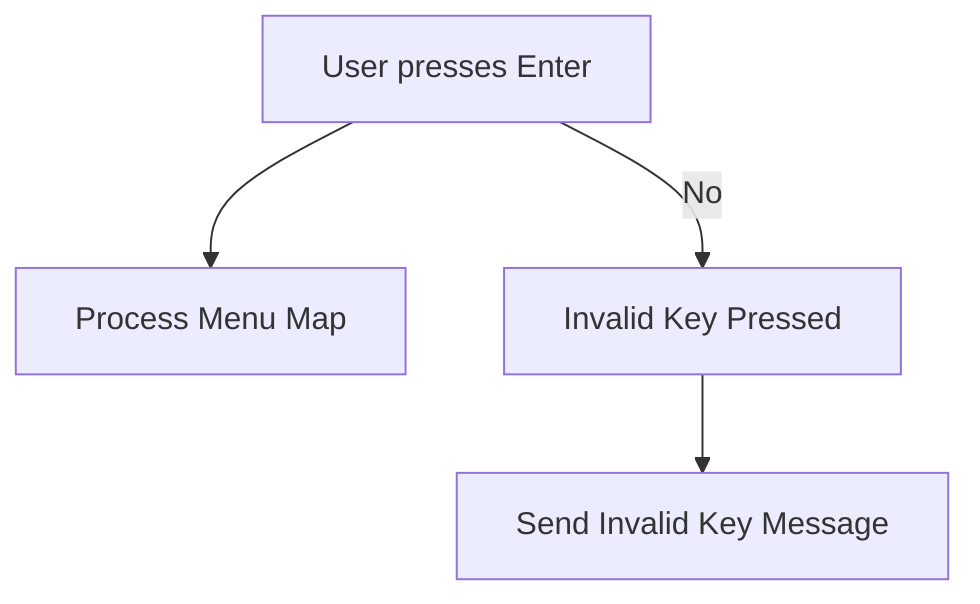
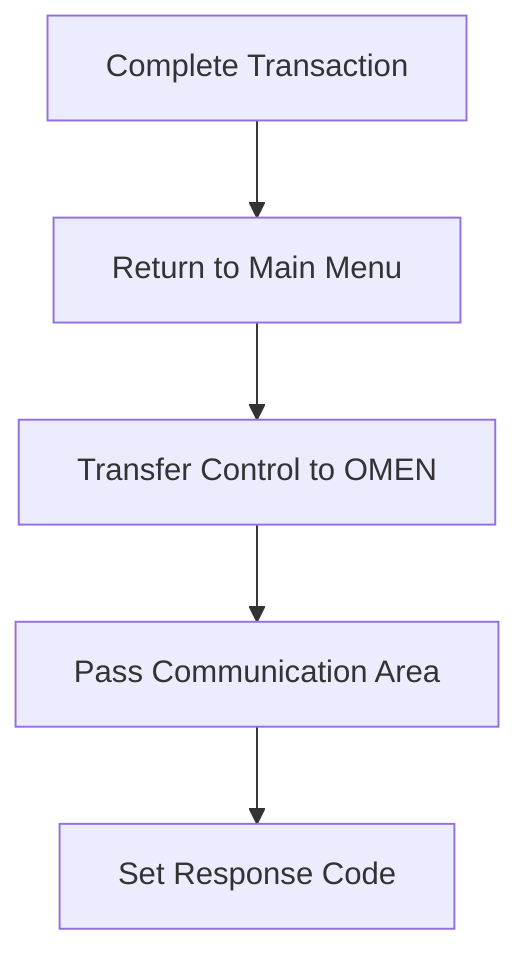
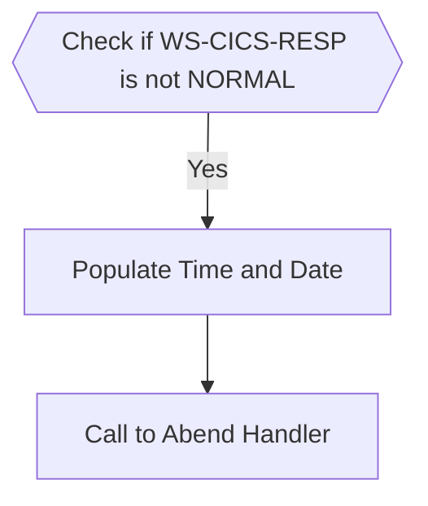

The BNKMENU program is responsible for managing the main menu interactions in the CICS Bank Sample Application. It initializes the screen for first-time use, handles various key presses, processes valid input, and returns control to the main menu. The program ensures smooth navigation and error handling within the application.

The BNKMENU program starts by checking if it's the first time the screen is being used and initializes it with empty data if so. It then handles different key presses, such as PA keys, PF3, PF12, CLEAR, and ENTER, performing specific actions for each. If the ENTER key is pressed, it processes the menu map based on user input. Finally, it returns control to the main menu and handles any errors that occur during the process.

Here is a high level diagram of the program:



# Initialization for first-time use



<SwmSnippet path="/src/base/cobol_src/BNKMENU.cbl" line="111">

---

## Check if first time through

First, the code checks if it is the first time through by evaluating if <SwmToken path="src/base/cobol_src/BNKMENU.cbl" pos="116:3:3" line-data="              WHEN EIBCALEN = ZERO">`EIBCALEN`</SwmToken> is zero. This indicates that the transaction is being executed for the first time.

```cobol
           EVALUATE TRUE
      *
      *       Is it the first time through? If so, send the map
      *       with erased (empty) data fields.
      *
              WHEN EIBCALEN = ZERO
```

---

</SwmSnippet>

<SwmSnippet path="/src/base/cobol_src/BNKMENU.cbl" line="117">

---

## Initialize screen with empty data

Next, the code initializes the screen with empty data by moving <SwmToken path="src/base/cobol_src/BNKMENU.cbl" pos="117:3:5" line-data="                 MOVE LOW-VALUE TO BNK1MEO">`LOW-VALUE`</SwmToken> to <SwmToken path="src/base/cobol_src/BNKMENU.cbl" pos="117:9:9" line-data="                 MOVE LOW-VALUE TO BNK1MEO">`BNK1MEO`</SwmToken> and setting <SwmToken path="src/base/cobol_src/BNKMENU.cbl" pos="118:8:8" line-data="                 MOVE -1 TO ACTIONL">`ACTIONL`</SwmToken> to -1. This prepares the screen to be displayed with no pre-filled data.

```cobol
                 MOVE LOW-VALUE TO BNK1MEO
                 MOVE -1 TO ACTIONL
                 SET SEND-ERASE TO TRUE
```

---

</SwmSnippet>

<SwmSnippet path="/src/base/cobol_src/BNKMENU.cbl" line="120">

---

## Send map with erased data

Then, the code sets the <SwmToken path="src/base/cobol_src/BNKMENU.cbl" pos="119:3:5" line-data="                 SET SEND-ERASE TO TRUE">`SEND-ERASE`</SwmToken> flag to true, indicating that the map should be sent with erased (empty) data fields. It then performs the <SwmToken path="src/base/cobol_src/BNKMENU.cbl" pos="120:3:5" line-data="                 PERFORM SEND-MAP">`SEND-MAP`</SwmToken> operation to display the initialized screen to the user.

```cobol
                 PERFORM SEND-MAP
```

---

</SwmSnippet>

# Handle PA and special keys



<SwmSnippet path="/src/base/cobol_src/BNKMENU.cbl" line="123">

---

## Handling PA Key Presses

First, the code checks if a PA key (Program Attention key) is pressed. If any of the PA keys (<SwmToken path="src/base/cobol_src/BNKMENU.cbl" pos="125:7:7" line-data="              WHEN EIBAID = DFHPA1 OR DFHPA2 OR DFHPA3">`DFHPA1`</SwmToken>, <SwmToken path="src/base/cobol_src/BNKMENU.cbl" pos="125:11:11" line-data="              WHEN EIBAID = DFHPA1 OR DFHPA2 OR DFHPA3">`DFHPA2`</SwmToken>, or <SwmToken path="src/base/cobol_src/BNKMENU.cbl" pos="125:15:15" line-data="              WHEN EIBAID = DFHPA1 OR DFHPA2 OR DFHPA3">`DFHPA3`</SwmToken>) are pressed, the program continues without any specific action.

```cobol
      *       If a PA key is pressed, just carry on
      *
              WHEN EIBAID = DFHPA1 OR DFHPA2 OR DFHPA3
                 CONTINUE
```

---

</SwmSnippet>

<SwmSnippet path="/src/base/cobol_src/BNKMENU.cbl" line="129">

---

## Handling PF3 or PF12 Key Presses

Next, the code checks if either PF3 or PF12 key is pressed. If either of these keys is pressed, the program performs the <SwmToken path="src/base/cobol_src/BNKMENU.cbl" pos="132:3:7" line-data="                 PERFORM SEND-TERMINATION-MSG">`SEND-TERMINATION-MSG`</SwmToken> function to send a termination message and then returns control to CICS.

```cobol
      *       When Pf3 or Pf12 is pressed, terminate
      *
              WHEN EIBAID = DFHPF3 OR DFHPF12
                 PERFORM SEND-TERMINATION-MSG

                 EXEC CICS
                    RETURN
                 END-EXEC
```

---

</SwmSnippet>

<SwmSnippet path="/src/base/cobol_src/BNKMENU.cbl" line="139">

---

## Handling CLEAR Key Press

Then, the code checks if the CLEAR key is pressed. If the CLEAR key is pressed, the program sends a control command to erase the screen and free the keyboard, and then returns control to CICS.

```cobol
      *       When CLEAR is pressed
      *
              WHEN EIBAID = DFHCLEAR
                EXEC CICS SEND CONTROL
                          ERASE
                          FREEKB
                END-EXEC
                EXEC CICS RETURN
                END-EXEC
```

---

</SwmSnippet>

# Process valid input key (Enter)



<SwmSnippet path="/src/base/cobol_src/BNKMENU.cbl" line="152">

---

## User presses Enter

First, we check if the user has pressed the Enter key (<SwmToken path="src/base/cobol_src/BNKMENU.cbl" pos="152:3:7" line-data="              WHEN EIBAID = DFHENTER">`EIBAID = DFHENTER`</SwmToken>). If the Enter key is pressed, we proceed to process the menu map.

```cobol
              WHEN EIBAID = DFHENTER
```

---

</SwmSnippet>

<SwmSnippet path="/src/base/cobol_src/BNKMENU.cbl" line="153">

---

## Process Menu Map

Next, we perform the <SwmToken path="src/base/cobol_src/BNKMENU.cbl" pos="153:3:7" line-data="                 PERFORM PROCESS-MENU-MAP">`PROCESS-MENU-MAP`</SwmToken> operation, which handles the processing of the menu map based on the user's input.

```cobol
                 PERFORM PROCESS-MENU-MAP
```

---

</SwmSnippet>

<SwmSnippet path="/src/base/cobol_src/BNKMENU.cbl" line="158">

---

## Invalid Key Pressed

If any key other than Enter is pressed, we move to the <SwmToken path="src/base/cobol_src/BNKMENU.cbl" pos="158:1:3" line-data="              WHEN OTHER">`WHEN OTHER`</SwmToken> condition to handle invalid key presses.

```cobol
              WHEN OTHER
```

---

</SwmSnippet>

<SwmSnippet path="/src/base/cobol_src/BNKMENU.cbl" line="159">

---

## Send Invalid Key Message

Then, we move low-values to <SwmToken path="src/base/cobol_src/BNKMENU.cbl" pos="159:9:9" line-data="                 MOVE LOW-VALUES TO BNK1MEO">`BNK1MEO`</SwmToken>, set the message to 'Invalid key pressed.', set the action level to -1, and set the <SwmToken path="src/base/cobol_src/BNKMENU.cbl" pos="162:3:7" line-data="                 SET SEND-DATAONLY-ALARM TO TRUE">`SEND-DATAONLY-ALARM`</SwmToken> to true. Finally, we perform the <SwmToken path="src/base/cobol_src/BNKMENU.cbl" pos="163:3:5" line-data="                 PERFORM SEND-MAP">`SEND-MAP`</SwmToken> operation to send the invalid key message to the user.

```cobol
                 MOVE LOW-VALUES TO BNK1MEO
                 MOVE 'Invalid key pressed.' TO MESSAGEO
                 MOVE -1 TO ACTIONL
                 SET SEND-DATAONLY-ALARM TO TRUE
                 PERFORM SEND-MAP
```

---

</SwmSnippet>

# Return to CICS

This is the next section of the flow.



<SwmSnippet path="/src/base/cobol_src/BNKMENU.cbl" line="170">

---

## Returning Control to Main Menu

First, the <SwmToken path="src/base/cobol_src/BNKMENU.cbl" pos="146:1:5" line-data="                EXEC CICS RETURN">`EXEC CICS RETURN`</SwmToken> command is used to return control to the main menu transaction identified by 'OMEN'. This ensures that after completing a transaction, the user is redirected back to the main menu for further actions.

```cobol
           EXEC CICS
              RETURN TRANSID('OMEN')
              COMMAREA(COMMUNICATION-AREA)
              LENGTH(1)
              RESP(WS-CICS-RESP)
```

---

</SwmSnippet>

<SwmSnippet path="/src/base/cobol_src/BNKMENU.cbl" line="172">

---

## Passing Communication Area

Next, the <SwmToken path="src/base/cobol_src/BNKMENU.cbl" pos="172:1:6" line-data="              COMMAREA(COMMUNICATION-AREA)">`COMMAREA(COMMUNICATION-AREA)`</SwmToken> parameter is used to pass the communication area to the main menu transaction. This allows the main menu to have access to any relevant data from the completed transaction.

```cobol
              COMMAREA(COMMUNICATION-AREA)
```

---

</SwmSnippet>

<SwmSnippet path="/src/base/cobol_src/BNKMENU.cbl" line="174">

---

## Setting Response Code

Finally, the <SwmToken path="src/base/cobol_src/BNKMENU.cbl" pos="174:1:8" line-data="              RESP(WS-CICS-RESP)">`RESP(WS-CICS-RESP)`</SwmToken> parameter is used to set the response code. This helps in determining the success or failure of the return operation and can be used for error handling or logging purposes.

```cobol
              RESP(WS-CICS-RESP)
```

---

</SwmSnippet>

## Interim Summary

So far, we saw how the program handles the initialization for first-time use, processes various key presses, and returns control to the main menu. Now, we will focus on error handling, which includes checking the CICS response and managing abend situations.

# Error Handling



<SwmSnippet path="/src/base/cobol_src/BNKMENU.cbl" line="178">

---

## Checking CICS Response

First, we check if <SwmToken path="src/base/cobol_src/BNKMENU.cbl" pos="178:3:7" line-data="           IF WS-CICS-RESP NOT = DFHRESP(NORMAL)">`WS-CICS-RESP`</SwmToken> is not equal to <SwmToken path="src/base/cobol_src/BNKMENU.cbl" pos="178:13:16" line-data="           IF WS-CICS-RESP NOT = DFHRESP(NORMAL)">`DFHRESP(NORMAL)`</SwmToken>. This condition determines if there was an abnormal response from the CICS transaction.

```cobol
           IF WS-CICS-RESP NOT = DFHRESP(NORMAL)
```

---

</SwmSnippet>

<SwmSnippet path="/src/base/cobol_src/BNKMENU.cbl" line="185">

---

## Initializing Abend Information

Next, we initialize the <SwmToken path="src/base/cobol_src/BNKMENU.cbl" pos="185:3:5" line-data="              INITIALIZE ABNDINFO-REC">`ABNDINFO-REC`</SwmToken> record and move the response codes <SwmToken path="src/base/cobol_src/BNKMENU.cbl" pos="186:3:3" line-data="              MOVE EIBRESP    TO ABND-RESPCODE">`EIBRESP`</SwmToken> and <SwmToken path="src/base/cobol_src/BNKMENU.cbl" pos="187:3:3" line-data="              MOVE EIBRESP2   TO ABND-RESP2CODE">`EIBRESP2`</SwmToken> to <SwmToken path="src/base/cobol_src/BNKMENU.cbl" pos="186:7:9" line-data="              MOVE EIBRESP    TO ABND-RESPCODE">`ABND-RESPCODE`</SwmToken> and <SwmToken path="src/base/cobol_src/BNKMENU.cbl" pos="187:7:9" line-data="              MOVE EIBRESP2   TO ABND-RESP2CODE">`ABND-RESP2CODE`</SwmToken> respectively. This step preserves the response codes for further processing.

```cobol
              INITIALIZE ABNDINFO-REC
              MOVE EIBRESP    TO ABND-RESPCODE
              MOVE EIBRESP2   TO ABND-RESP2CODE
```

---

</SwmSnippet>

<SwmSnippet path="/src/base/cobol_src/BNKMENU.cbl" line="191">

---

## Assigning Application ID

Then, we execute the CICS ASSIGN command to get the application ID and store it in <SwmToken path="src/base/cobol_src/BNKMENU.cbl" pos="191:9:11" line-data="              EXEC CICS ASSIGN APPLID(ABND-APPLID)">`ABND-APPLID`</SwmToken>. This helps in identifying the application context during the abend.

```cobol
              EXEC CICS ASSIGN APPLID(ABND-APPLID)
              END-EXEC
```

---

</SwmSnippet>

<SwmSnippet path="/src/base/cobol_src/BNKMENU.cbl" line="194">

---

## Moving Task and Transaction IDs

We move the task number <SwmToken path="src/base/cobol_src/BNKMENU.cbl" pos="194:3:3" line-data="              MOVE EIBTASKN   TO ABND-TASKNO-KEY">`EIBTASKN`</SwmToken> to <SwmToken path="src/base/cobol_src/BNKMENU.cbl" pos="194:7:11" line-data="              MOVE EIBTASKN   TO ABND-TASKNO-KEY">`ABND-TASKNO-KEY`</SwmToken> and the transaction ID <SwmToken path="src/base/cobol_src/BNKMENU.cbl" pos="195:3:3" line-data="              MOVE EIBTRNID   TO ABND-TRANID">`EIBTRNID`</SwmToken> to <SwmToken path="src/base/cobol_src/BNKMENU.cbl" pos="195:7:9" line-data="              MOVE EIBTRNID   TO ABND-TRANID">`ABND-TRANID`</SwmToken>. These IDs are crucial for tracking the specific task and transaction that encountered the error.

```cobol
              MOVE EIBTASKN   TO ABND-TASKNO-KEY
              MOVE EIBTRNID   TO ABND-TRANID

```

---

</SwmSnippet>

<SwmSnippet path="/src/base/cobol_src/BNKMENU.cbl" line="197">

---

## Populating Time and Date

We perform the <SwmToken path="src/base/cobol_src/BNKMENU.cbl" pos="197:3:7" line-data="              PERFORM POPULATE-TIME-DATE">`POPULATE-TIME-DATE`</SwmToken> section to get the current date and time. This information is essential for logging the exact time of the error occurrence.

```cobol
              PERFORM POPULATE-TIME-DATE
```

---

</SwmSnippet>

<SwmSnippet path="/src/base/cobol_src/BNKMENU.cbl" line="1295">

---

### Populating Time and Date Details

The <SwmToken path="src/base/cobol_src/BNKMENU.cbl" pos="1295:1:5" line-data="       POPULATE-TIME-DATE SECTION.">`POPULATE-TIME-DATE`</SwmToken> section uses CICS commands to get the current time (<SwmToken path="src/base/cobol_src/BNKMENU.cbl" pos="1299:5:5" line-data="           EXEC CICS ASKTIME">`ASKTIME`</SwmToken>) and format it (<SwmToken path="src/base/cobol_src/BNKMENU.cbl" pos="1303:5:5" line-data="           EXEC CICS FORMATTIME">`FORMATTIME`</SwmToken>). The formatted date and time are stored in <SwmToken path="src/base/cobol_src/BNKMENU.cbl" pos="1305:3:7" line-data="                     DDMMYYYY(WS-ORIG-DATE)">`WS-ORIG-DATE`</SwmToken> and <SwmToken path="src/base/cobol_src/BNKMENU.cbl" pos="1306:3:7" line-data="                     TIME(WS-TIME-NOW)">`WS-TIME-NOW`</SwmToken> respectively.

```cobol
       POPULATE-TIME-DATE SECTION.
       PTD010.
      D    DISPLAY 'POPULATE-TIME-DATE SECTION'.

           EXEC CICS ASKTIME
              ABSTIME(WS-U-TIME)
           END-EXEC.

           EXEC CICS FORMATTIME
                     ABSTIME(WS-U-TIME)
                     DDMMYYYY(WS-ORIG-DATE)
                     TIME(WS-TIME-NOW)
                     DATESEP
           END-EXEC.

       PTD999.
           EXIT.
```

---

</SwmSnippet>

<SwmSnippet path="/src/base/cobol_src/BNKMENU.cbl" line="199">

---

## Moving Date and Time

We move the original date <SwmToken path="src/base/cobol_src/BNKMENU.cbl" pos="199:3:7" line-data="              MOVE WS-ORIG-DATE TO ABND-DATE">`WS-ORIG-DATE`</SwmToken> to <SwmToken path="src/base/cobol_src/BNKMENU.cbl" pos="199:11:13" line-data="              MOVE WS-ORIG-DATE TO ABND-DATE">`ABND-DATE`</SwmToken> and construct the time string from <SwmToken path="src/base/cobol_src/BNKMENU.cbl" pos="200:3:11" line-data="              STRING WS-TIME-NOW-GRP-HH DELIMITED BY SIZE,">`WS-TIME-NOW-GRP-HH`</SwmToken>, <SwmToken path="src/base/cobol_src/BNKMENU.cbl" pos="202:1:9" line-data="                     WS-TIME-NOW-GRP-MM DELIMITED BY SIZE,">`WS-TIME-NOW-GRP-MM`</SwmToken>, and <SwmToken path="src/base/cobol_src/BNKMENU.cbl" pos="94:3:11" line-data="              05 WS-TIME-NOW-GRP-SS       PIC 99.">`WS-TIME-NOW-GRP-SS`</SwmToken> to store in <SwmToken path="src/base/cobol_src/BNKMENU.cbl" pos="205:3:5" line-data="                     INTO ABND-TIME">`ABND-TIME`</SwmToken>. This step ensures that the abend record has accurate date and time information.

```cobol
              MOVE WS-ORIG-DATE TO ABND-DATE
              STRING WS-TIME-NOW-GRP-HH DELIMITED BY SIZE,
                    ':' DELIMITED BY SIZE,
                     WS-TIME-NOW-GRP-MM DELIMITED BY SIZE,
                     ':' DELIMITED BY SIZE,
                     WS-TIME-NOW-GRP-MM DELIMITED BY SIZE
                     INTO ABND-TIME
```

---

</SwmSnippet>

<SwmSnippet path="/src/base/cobol_src/BNKMENU.cbl" line="211">

---

## Assigning Program Name

We execute another CICS ASSIGN command to get the program name and store it in <SwmToken path="src/base/cobol_src/BNKMENU.cbl" pos="211:9:11" line-data="              EXEC CICS ASSIGN PROGRAM(ABND-PROGRAM)">`ABND-PROGRAM`</SwmToken>. This helps in identifying the program where the error occurred.

```cobol
              EXEC CICS ASSIGN PROGRAM(ABND-PROGRAM)
              END-EXEC
```

---

</SwmSnippet>

<SwmSnippet path="/src/base/cobol_src/BNKMENU.cbl" line="216">

---

## Constructing Freeform Message

We construct a freeform message that includes the error details such as response codes. This message is stored in <SwmToken path="src/base/cobol_src/BNKMENU.cbl" pos="222:3:5" line-data="                    INTO ABND-FREEFORM">`ABND-FREEFORM`</SwmToken> and is useful for debugging and logging purposes.

```cobol
              STRING 'A010 - RETURN TRANSID(MENU) FAIL.'
                    DELIMITED BY SIZE,
                    ' EIBRESP=' DELIMITED BY SIZE,
                    ABND-RESPCODE DELIMITED BY SIZE,
                    ' RESP2=' DELIMITED BY SIZE,
                    ABND-RESP2CODE DELIMITED BY SIZE
                    INTO ABND-FREEFORM
```

---

</SwmSnippet>

<SwmSnippet path="/src/base/cobol_src/BNKMENU.cbl" line="225">

---

## Linking to Abend Handler

We execute the CICS LINK command to call the abend handler program <SwmToken path="src/base/cobol_src/BNKMENU.cbl" pos="225:9:13" line-data="              EXEC CICS LINK PROGRAM(WS-ABEND-PGM)">`WS-ABEND-PGM`</SwmToken> with the communication area <SwmToken path="src/base/cobol_src/BNKMENU.cbl" pos="226:3:5" line-data="                        COMMAREA(ABNDINFO-REC)">`ABNDINFO-REC`</SwmToken>. This step triggers the abend handling process.

```cobol
              EXEC CICS LINK PROGRAM(WS-ABEND-PGM)
                        COMMAREA(ABNDINFO-REC)
              END-EXEC
```

---

</SwmSnippet>

<SwmSnippet path="/src/base/cobol_src/BNKMENU.cbl" line="229">

---

## Finalizing Abend Information

Finally, we initialize the <SwmToken path="src/base/cobol_src/BNKMENU.cbl" pos="229:3:7" line-data="              INITIALIZE WS-FAIL-INFO">`WS-FAIL-INFO`</SwmToken> record and move the failure message and response codes to their respective fields. We then perform the <SwmToken path="src/base/cobol_src/BNKMENU.cbl" pos="234:3:7" line-data="              PERFORM ABEND-THIS-TASK">`ABEND-THIS-TASK`</SwmToken> section to complete the abend process.

```cobol
              INITIALIZE WS-FAIL-INFO
              MOVE 'BNKMENU - A010 - RETURN TRANSID(MENU) FAIL' TO
                 WS-CICS-FAIL-MSG
              MOVE WS-CICS-RESP  TO WS-CICS-RESP-DISP
              MOVE WS-CICS-RESP2 TO WS-CICS-RESP2-DISP
              PERFORM ABEND-THIS-TASK
           END-IF.
```

---

</SwmSnippet>

&nbsp;

*This is an auto-generated document by Swimm 🌊 and has not yet been verified by a human*

<SwmMeta version="3.0.0" repo-id="Z2l0aHViJTNBJTNBY2ljcy1iYW5raW5nLXNhbXBsZS1hcHBsaWNhdGlvbi1jYnNhLUlCTS1EZW1vJTNBJTNBU3dpbW0tRGVtbw==" repo-name="cics-banking-sample-application-cbsa-IBM-Demo"><sup>Powered by [Swimm](https://app.swimm.io/)</sup></SwmMeta>
