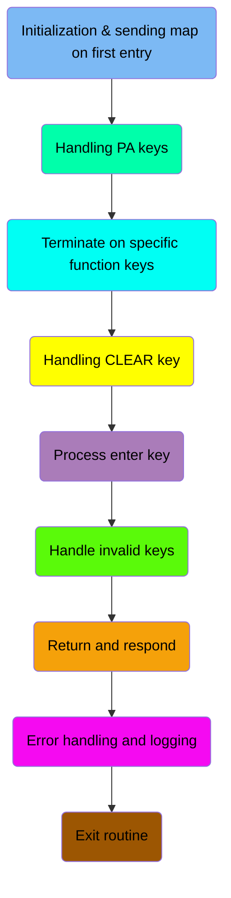
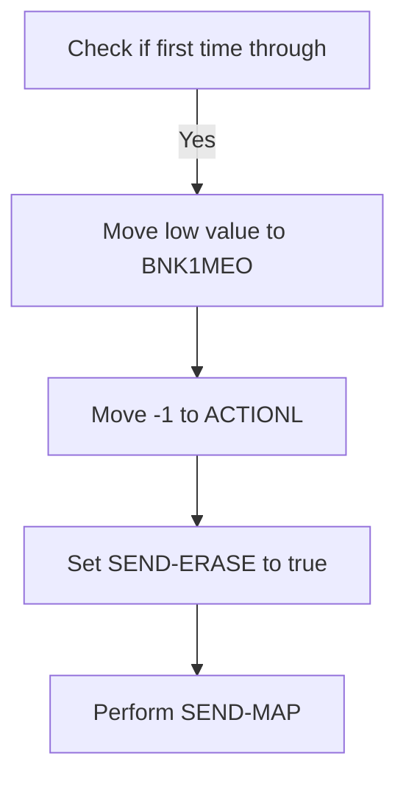
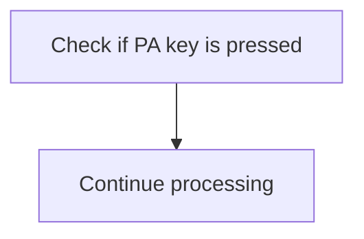
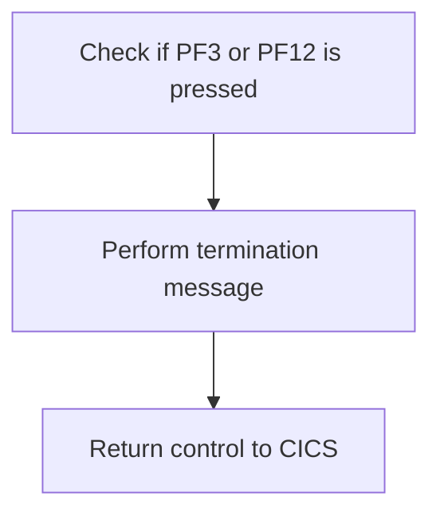
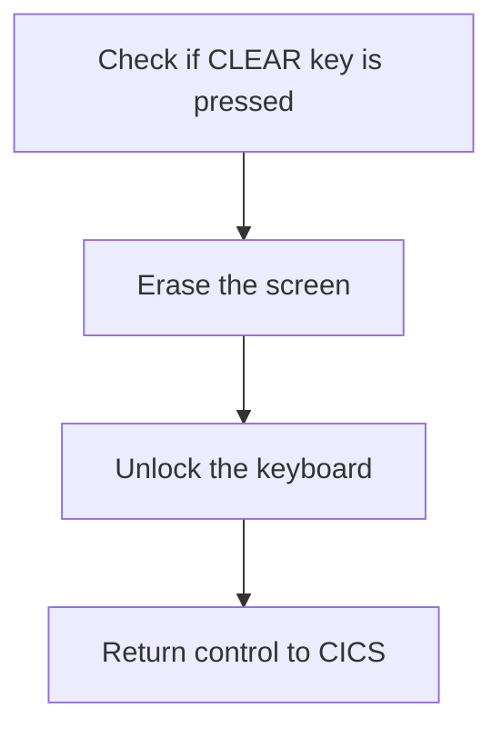
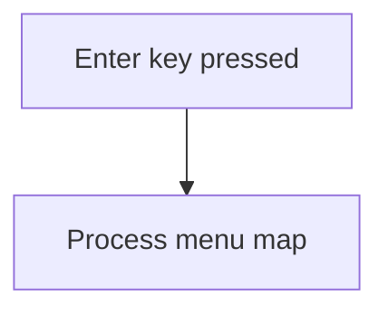
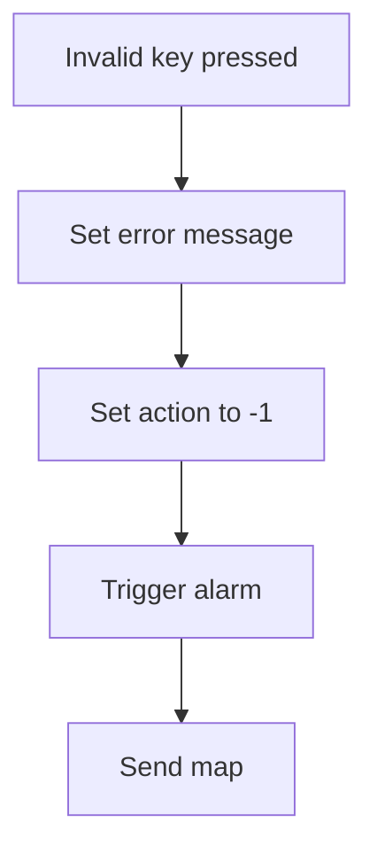
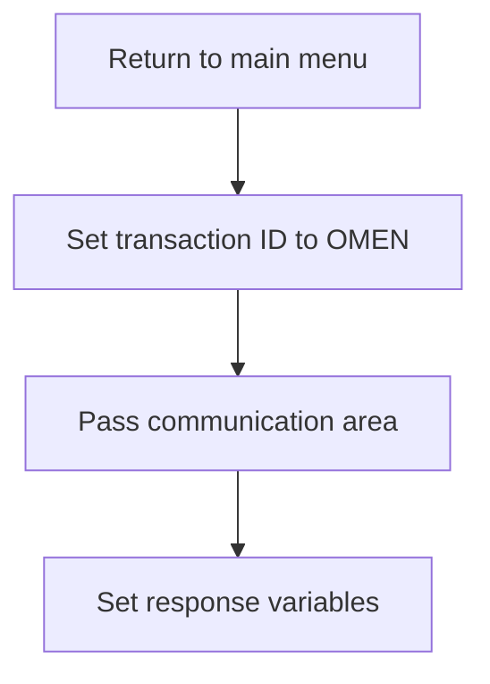
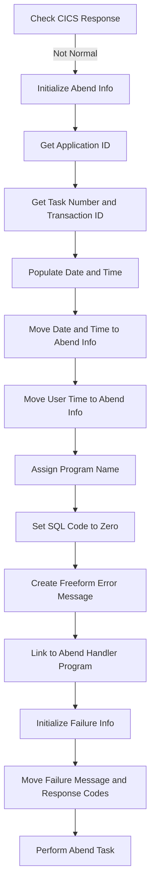
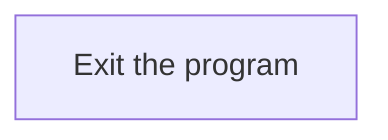

The BNKMENU program serves as the main menu handler for the banking application. It manages user interactions through various function keys, ensuring appropriate responses and actions are taken based on user input. The program achieves this by evaluating key presses, processing menu maps, handling errors, and logging necessary information.

The flow involves initializing the program, handling different key presses (such as PA keys, function keys, and the CLEAR key), processing the enter key, managing invalid key presses, returning to the main menu, handling errors, and finally exiting the program.

Here is a high level diagram of the program:



## Initialization & sending map on first entry

First, we'll zoom into this section of the flow:



<SwmSnippet path="/src/base/cobol_src/BNKMENU.cbl" line="111">

---

First, the code checks if it is the first time through by evaluating if <SwmToken path="src/base/cobol_src/BNKMENU.cbl" pos="116:3:3" line-data="              WHEN EIBCALEN = ZERO">`EIBCALEN`</SwmToken> (the length of the communication area) is zero. This indicates that the transaction is being executed for the first time.

```cobol
           EVALUATE TRUE
      *
      *       Is it the first time through? If so, send the map
      *       with erased (empty) data fields.
      *
              WHEN EIBCALEN = ZERO
```

---

</SwmSnippet>

<SwmSnippet path="/src/base/cobol_src/BNKMENU.cbl" line="117">

---

Next, if it is the first time through, the code moves a low value to <SwmToken path="src/base/cobol_src/BNKMENU.cbl" pos="117:9:9" line-data="                 MOVE LOW-VALUE TO BNK1MEO">`BNK1MEO`</SwmToken> (which likely represents an empty or initial state for the map data), sets <SwmToken path="src/base/cobol_src/BNKMENU.cbl" pos="118:8:8" line-data="                 MOVE -1 TO ACTIONL">`ACTIONL`</SwmToken> to -1 (indicating an initial action), and sets the <SwmToken path="src/base/cobol_src/BNKMENU.cbl" pos="119:3:5" line-data="                 SET SEND-ERASE TO TRUE">`SEND-ERASE`</SwmToken> flag to true. This prepares the map to be sent with erased (empty) data fields. Finally, the <SwmToken path="src/base/cobol_src/BNKMENU.cbl" pos="120:3:5" line-data="                 PERFORM SEND-MAP">`SEND-MAP`</SwmToken> section is performed to send the map to the user interface.

```cobol
                 MOVE LOW-VALUE TO BNK1MEO
                 MOVE -1 TO ACTIONL
                 SET SEND-ERASE TO TRUE
                 PERFORM SEND-MAP
```

---

</SwmSnippet>

## Handling PA keys

Now, lets zoom into this section of the flow:



<SwmSnippet path="/src/base/cobol_src/BNKMENU.cbl" line="125">

---

The <SwmToken path="src/base/cobol_src/BNKMENU.cbl" pos="108:1:1" line-data="       PREMIERE SECTION.">`PREMIERE`</SwmToken> function handles the scenario where a PA (Program Attention) key is pressed. Specifically, it checks if the <SwmToken path="src/base/cobol_src/BNKMENU.cbl" pos="125:3:3" line-data="              WHEN EIBAID = DFHPA1 OR DFHPA2 OR DFHPA3">`EIBAID`</SwmToken> (Extended Interface Block Attention Identifier) is equal to <SwmToken path="src/base/cobol_src/BNKMENU.cbl" pos="125:7:7" line-data="              WHEN EIBAID = DFHPA1 OR DFHPA2 OR DFHPA3">`DFHPA1`</SwmToken>, <SwmToken path="src/base/cobol_src/BNKMENU.cbl" pos="125:11:11" line-data="              WHEN EIBAID = DFHPA1 OR DFHPA2 OR DFHPA3">`DFHPA2`</SwmToken>, or <SwmToken path="src/base/cobol_src/BNKMENU.cbl" pos="125:15:15" line-data="              WHEN EIBAID = DFHPA1 OR DFHPA2 OR DFHPA3">`DFHPA3`</SwmToken>, which correspond to different PA keys. If any of these PA keys are pressed, the function executes the `CONTINUE` statement, allowing the program to proceed without interruption.

```cobol
              WHEN EIBAID = DFHPA1 OR DFHPA2 OR DFHPA3
                 CONTINUE
```

---

</SwmSnippet>

## Terminate on specific function keys

Now, lets zoom into this section of the flow:



<SwmSnippet path="/src/base/cobol_src/BNKMENU.cbl" line="131">

---

### Checking for termination keys

First, we check if the user has pressed either the PF3 or PF12 key, which are designated for termination requests. This ensures that the termination process is only initiated when the user explicitly requests it by pressing one of these keys.

```cobol
              WHEN EIBAID = DFHPF3 OR DFHPF12
```

---

</SwmSnippet>

<SwmSnippet path="/src/base/cobol_src/BNKMENU.cbl" line="132">

---

### Performing termination actions

Next, if the termination keys are pressed, we perform the termination message action to inform the user that the session is ending. Finally, control is returned to CICS to complete the termination process.

```cobol
                 PERFORM SEND-TERMINATION-MSG

                 EXEC CICS
                    RETURN
                 END-EXEC
```

---

</SwmSnippet>

## Handling CLEAR key

Now, lets zoom into this section of the flow:



<SwmSnippet path="/src/base/cobol_src/BNKMENU.cbl" line="141">

---

When the CLEAR key is pressed, the system first checks if <SwmToken path="src/base/cobol_src/BNKMENU.cbl" pos="141:3:3" line-data="              WHEN EIBAID = DFHCLEAR">`EIBAID`</SwmToken> (which holds the attention identifier) is equal to <SwmToken path="src/base/cobol_src/BNKMENU.cbl" pos="141:7:7" line-data="              WHEN EIBAID = DFHCLEAR">`DFHCLEAR`</SwmToken> (the identifier for the CLEAR key). If this condition is met, the system proceeds to erase the screen by sending a control command to CICS with the <SwmToken path="src/base/cobol_src/BNKMENU.cbl" pos="143:1:1" line-data="                          ERASE">`ERASE`</SwmToken> option. This ensures that the screen is cleared of any previous data. Following this, the keyboard is unlocked using the <SwmToken path="src/base/cobol_src/BNKMENU.cbl" pos="144:1:1" line-data="                          FREEKB">`FREEKB`</SwmToken> option, allowing the user to input new data. Finally, control is returned to CICS, indicating that the CLEAR key event has been fully processed.

```cobol
              WHEN EIBAID = DFHCLEAR
                EXEC CICS SEND CONTROL
                          ERASE
                          FREEKB
                END-EXEC
                EXEC CICS RETURN
                END-EXEC
```

---

</SwmSnippet>

## Process enter key

Now, lets zoom into this section of the flow:



<SwmSnippet path="/src/base/cobol_src/BNKMENU.cbl" line="152">

---

### Processing the menu map

When the enter key is pressed, the application triggers the processing of the menu map. This is indicated by the condition <SwmToken path="src/base/cobol_src/BNKMENU.cbl" pos="152:1:7" line-data="              WHEN EIBAID = DFHENTER">`WHEN EIBAID = DFHENTER`</SwmToken>, which checks if the enter key has been pressed. If this condition is met, the <SwmToken path="src/base/cobol_src/BNKMENU.cbl" pos="153:3:7" line-data="                 PERFORM PROCESS-MENU-MAP">`PROCESS-MENU-MAP`</SwmToken> routine is performed, which handles the necessary actions related to the menu map.

```cobol
              WHEN EIBAID = DFHENTER
                 PERFORM PROCESS-MENU-MAP
```

---

</SwmSnippet>

## Handle invalid keys

Now, lets zoom into this section of the flow:



<SwmSnippet path="/src/base/cobol_src/BNKMENU.cbl" line="159">

---

First, when an invalid key is pressed, the system moves <SwmToken path="src/base/cobol_src/BNKMENU.cbl" pos="159:3:5" line-data="                 MOVE LOW-VALUES TO BNK1MEO">`LOW-VALUES`</SwmToken> to <SwmToken path="src/base/cobol_src/BNKMENU.cbl" pos="159:9:9" line-data="                 MOVE LOW-VALUES TO BNK1MEO">`BNK1MEO`</SwmToken> (which is likely a field used to clear or reset certain values).

```cobol
                 MOVE LOW-VALUES TO BNK1MEO
```

---

</SwmSnippet>

<SwmSnippet path="/src/base/cobol_src/BNKMENU.cbl" line="160">

---

Next, the message 'Invalid key pressed.' is moved to <SwmToken path="src/base/cobol_src/BNKMENU.cbl" pos="160:14:14" line-data="                 MOVE &#39;Invalid key pressed.&#39; TO MESSAGEO">`MESSAGEO`</SwmToken> to inform the user of the error. The action code is then set to -1 by moving -1 to <SwmToken path="src/base/cobol_src/BNKMENU.cbl" pos="161:8:8" line-data="                 MOVE -1 TO ACTIONL">`ACTIONL`</SwmToken>, indicating an error state. The <SwmToken path="src/base/cobol_src/BNKMENU.cbl" pos="162:3:7" line-data="                 SET SEND-DATAONLY-ALARM TO TRUE">`SEND-DATAONLY-ALARM`</SwmToken> is set to true to trigger an alarm, and finally, the <SwmToken path="src/base/cobol_src/BNKMENU.cbl" pos="163:3:5" line-data="                 PERFORM SEND-MAP">`SEND-MAP`</SwmToken> routine is performed to update the user interface with the error message.

```cobol
                 MOVE 'Invalid key pressed.' TO MESSAGEO
                 MOVE -1 TO ACTIONL
                 SET SEND-DATAONLY-ALARM TO TRUE
                 PERFORM SEND-MAP
```

---

</SwmSnippet>

## Return and respond

This is the next section of the flow.



<SwmSnippet path="/src/base/cobol_src/BNKMENU.cbl" line="170">

---

The <SwmToken path="src/base/cobol_src/BNKMENU.cbl" pos="108:1:1" line-data="       PREMIERE SECTION.">`PREMIERE`</SwmToken> function is responsible for returning the user to the main menu of the application. It sets the transaction ID to 'OMEN', which indicates the main menu transaction. The communication area is passed to ensure that any necessary data is retained and accessible when the user returns to the main menu. Additionally, response variables are set to capture any response codes from the CICS transaction, ensuring that any issues or statuses are properly recorded and can be handled appropriately.

```cobol
           EXEC CICS
              RETURN TRANSID('OMEN')
              COMMAREA(COMMUNICATION-AREA)
              LENGTH(1)
              RESP(WS-CICS-RESP)
              RESP2(WS-CICS-RESP2)
           END-EXEC.
```

---

</SwmSnippet>

## Error handling and logging

Now, lets zoom into this section of the flow:



<SwmSnippet path="/src/base/cobol_src/BNKMENU.cbl" line="178">

---

First, the code checks if the CICS response is not normal. This is crucial to determine if there was an abnormal termination of the transaction.

```cobol
           IF WS-CICS-RESP NOT = DFHRESP(NORMAL)
```

---

</SwmSnippet>

<SwmSnippet path="/src/base/cobol_src/BNKMENU.cbl" line="185">

---

If the response is not normal, the code initializes the abend information record to prepare for capturing detailed error information.

```cobol
              INITIALIZE ABNDINFO-REC
```

---

</SwmSnippet>

<SwmSnippet path="/src/base/cobol_src/BNKMENU.cbl" line="191">

---

Next, the application ID is retrieved and stored in the abend information record. This helps in identifying the application where the error occurred.

```cobol
              EXEC CICS ASSIGN APPLID(ABND-APPLID)
              END-EXEC
```

---

</SwmSnippet>

<SwmSnippet path="/src/base/cobol_src/BNKMENU.cbl" line="194">

---

The task number and transaction ID are then moved to the abend information record. These details are essential for tracking the specific transaction that failed.

```cobol
              MOVE EIBTASKN   TO ABND-TASKNO-KEY
              MOVE EIBTRNID   TO ABND-TRANID

```

---

</SwmSnippet>

<SwmSnippet path="/src/base/cobol_src/BNKMENU.cbl" line="197">

---

The code performs a routine to populate the current date and time, which is then moved to the abend information record. This timestamp is important for logging when the error occurred.

```cobol
              PERFORM POPULATE-TIME-DATE

              MOVE WS-ORIG-DATE TO ABND-DATE
              STRING WS-TIME-NOW-GRP-HH DELIMITED BY SIZE,
                    ':' DELIMITED BY SIZE,
                     WS-TIME-NOW-GRP-MM DELIMITED BY SIZE,
                     ':' DELIMITED BY SIZE,
                     WS-TIME-NOW-GRP-MM DELIMITED BY SIZE
                     INTO ABND-TIME
```

---

</SwmSnippet>

<SwmSnippet path="/src/base/cobol_src/BNKMENU.cbl" line="208">

---

The user time is also moved to the abend information record, providing additional context about the timing of the error.

```cobol
              MOVE WS-U-TIME   TO ABND-UTIME-KEY
```

---

</SwmSnippet>

<SwmSnippet path="/src/base/cobol_src/BNKMENU.cbl" line="211">

---

The program name is assigned to the abend information record, which helps in identifying the specific program where the error occurred.

```cobol
              EXEC CICS ASSIGN PROGRAM(ABND-PROGRAM)
              END-EXEC
```

---

</SwmSnippet>

<SwmSnippet path="/src/base/cobol_src/BNKMENU.cbl" line="214">

---

The SQL code is set to zero in the abend information record, indicating that there was no SQL error involved in this particular failure.

```cobol
              MOVE ZEROS      TO ABND-SQLCODE
```

---

</SwmSnippet>

<SwmSnippet path="/src/base/cobol_src/BNKMENU.cbl" line="216">

---

A freeform error message is created and stored in the abend information record. This message includes the response codes and a description of the failure, which is useful for debugging.

```cobol
              STRING 'A010 - RETURN TRANSID(MENU) FAIL.'
                    DELIMITED BY SIZE,
                    ' EIBRESP=' DELIMITED BY SIZE,
                    ABND-RESPCODE DELIMITED BY SIZE,
                    ' RESP2=' DELIMITED BY SIZE,
                    ABND-RESP2CODE DELIMITED BY SIZE
                    INTO ABND-FREEFORM
```

---

</SwmSnippet>

<SwmSnippet path="/src/base/cobol_src/BNKMENU.cbl" line="225">

---

The code then links to the abend handler program, passing the abend information record. This step ensures that the error details are processed and logged appropriately.

More about ABNDPROC: <SwmLink doc-title="Handling Abnormal Terminations (ABNDPROC)">[Handling Abnormal Terminations (ABNDPROC)](/.swm/handling-abnormal-terminations-abndproc.q6kxvboz.sw.md)</SwmLink>

```cobol
              EXEC CICS LINK PROGRAM(WS-ABEND-PGM)
                        COMMAREA(ABNDINFO-REC)
              END-EXEC
```

---

</SwmSnippet>

<SwmSnippet path="/src/base/cobol_src/BNKMENU.cbl" line="229">

---

Finally, the failure information is initialized, and a failure message along with the response codes are moved to the respective fields. The task is then abended, completing the error handling process.

```cobol
              INITIALIZE WS-FAIL-INFO
              MOVE 'BNKMENU - A010 - RETURN TRANSID(MENU) FAIL' TO
                 WS-CICS-FAIL-MSG
              MOVE WS-CICS-RESP  TO WS-CICS-RESP-DISP
              MOVE WS-CICS-RESP2 TO WS-CICS-RESP2-DISP
              PERFORM ABEND-THIS-TASK
           END-IF.
```

---

</SwmSnippet>

## Exit routine

This is the next section of the flow.



<SwmSnippet path="/src/base/cobol_src/BNKMENU.cbl" line="237">

---

The <SwmToken path="src/base/cobol_src/BNKMENU.cbl" pos="238:1:1" line-data="           EXIT.">`EXIT`</SwmToken> statement in the <SwmToken path="src/base/cobol_src/BNKMENU.cbl" pos="108:1:1" line-data="       PREMIERE SECTION.">`PREMIERE`</SwmToken> function is used to terminate the program. This ensures that once the program has completed its operations, it exits gracefully, releasing any resources it may have been using and signaling the end of its execution.

```cobol
       A999.
           EXIT.
```

---

</SwmSnippet>

&nbsp;

*This is an auto-generated document by Swimm 🌊 and has not yet been verified by a human*

<SwmMeta version="3.0.0" repo-id="Z2l0aHViJTNBJTNBY2ljcy1iYW5raW5nLXNhbXBsZS1hcHBsaWNhdGlvbi1jYnNhLUlCTS1EZW1vJTNBJTNBU3dpbW0tRGVtbw==" repo-name="cics-banking-sample-application-cbsa-IBM-Demo"><sup>Powered by [Swimm](/)</sup></SwmMeta>
