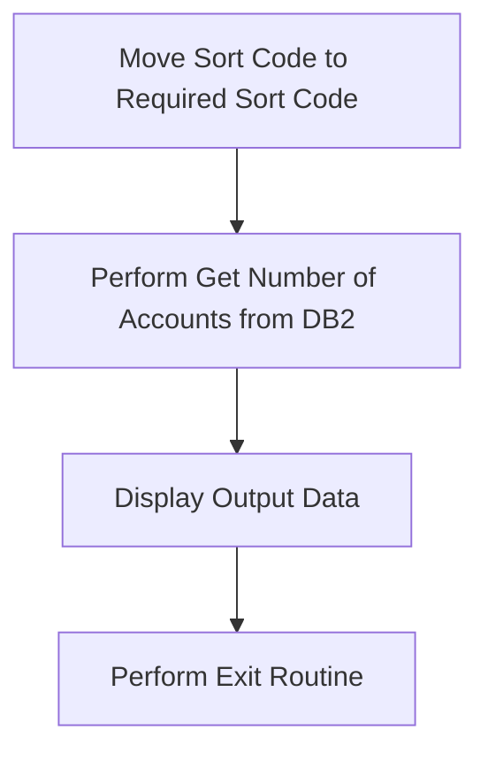
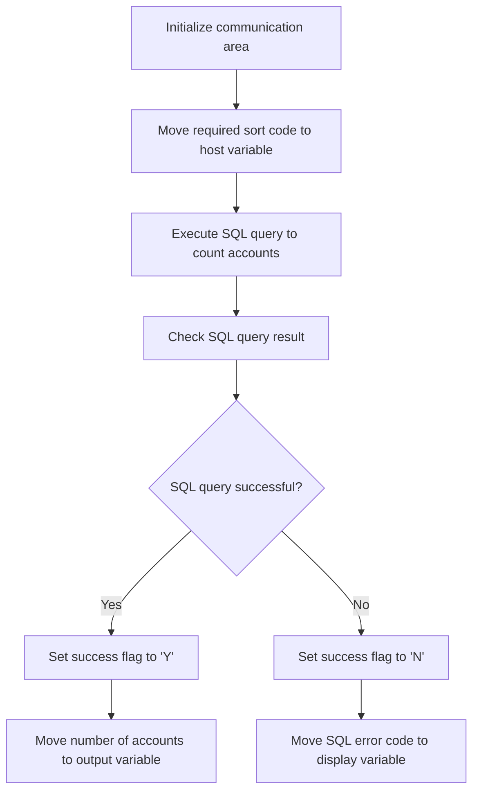
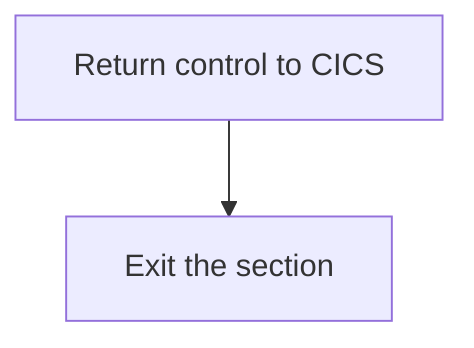

The ACCTCTRL program is responsible for managing account control operations within the system. It achieves this by performing a series of steps including moving the sort code to the required field, querying the database for the number of accounts, displaying the output data, and executing an exit routine.

The flow starts by moving the sort code to the required field, ensuring it is set up correctly for the database query. Next, the program queries the database to retrieve the number of accounts associated with the sort code. The output data is then displayed for debugging and verification purposes. Finally, the program performs an exit routine to handle termination or cleanup processes.

## PREMIERE

Lets' zoom into this section of the flow:



<SwmSnippet path="/src/base/cobol_src/ACCTCTRL.cbl" line="138">

---

First, the sort code is moved to the <SwmToken path="src/base/cobol_src/ACCTCTRL.cbl" pos="139:1:5" line-data="              REQUIRED-SORT-CODE.">`REQUIRED-SORT-CODE`</SwmToken> field. This step ensures that the sort code is correctly set up for the subsequent database query.

```cobol
           MOVE SORTCODE TO
              REQUIRED-SORT-CODE.
```

---

</SwmSnippet>

<SwmSnippet path="/src/base/cobol_src/ACCTCTRL.cbl" line="141">

---

Next, the <SwmToken path="src/base/cobol_src/ACCTCTRL.cbl" pos="141:3:11" line-data="           PERFORM GET-NUMBER-OF-ACCOUNTS-DB2">`GET-NUMBER-OF-ACCOUNTS-DB2`</SwmToken> section is performed. This section queries the database to retrieve the number of accounts associated with the provided sort code.

```cobol
           PERFORM GET-NUMBER-OF-ACCOUNTS-DB2
```

---

</SwmSnippet>

<SwmSnippet path="/src/base/cobol_src/ACCTCTRL.cbl" line="144">

---

Then, the output data is displayed using the <SwmToken path="src/base/cobol_src/ACCTCTRL.cbl" pos="145:3:3" line-data="      D       DFHCOMMAREA.">`DFHCOMMAREA`</SwmToken>. This step provides visibility into the data retrieved from the database, which is useful for debugging and verification purposes.

```cobol
      D    DISPLAY 'OUTPUT DATA IS='
      D       DFHCOMMAREA.
```

---

</SwmSnippet>

<SwmSnippet path="/src/base/cobol_src/ACCTCTRL.cbl" line="148">

---

Finally, the <SwmToken path="src/base/cobol_src/ACCTCTRL.cbl" pos="148:3:11" line-data="           PERFORM GET-ME-OUT-OF-HERE.">`GET-ME-OUT-OF-HERE`</SwmToken> section is performed. This section likely handles the termination or cleanup process after the main logic has been executed.

```cobol
           PERFORM GET-ME-OUT-OF-HERE.
```

---

</SwmSnippet>

## <SwmToken path="src/base/cobol_src/ACCTCTRL.cbl" pos="141:3:11" line-data="           PERFORM GET-NUMBER-OF-ACCOUNTS-DB2">`GET-NUMBER-OF-ACCOUNTS-DB2`</SwmToken>

Lets' zoom into this section of the flow:



<SwmSnippet path="/src/base/cobol_src/ACCTCTRL.cbl" line="211">

---

The <SwmToken path="src/base/cobol_src/ACCTCTRL.cbl" pos="141:3:11" line-data="           PERFORM GET-NUMBER-OF-ACCOUNTS-DB2">`GET-NUMBER-OF-ACCOUNTS-DB2`</SwmToken> function is responsible for retrieving the number of accounts associated with a specific sort code. It begins by initializing the communication area to ensure a clean state for the operation.

```cobol
       GMOFH999.
           EXIT.

```

---

</SwmSnippet>

<SwmSnippet path="/src/base/cobol_src/ACCTCTRL.cbl" line="214">

---

Next, the required sort code is moved to the host variable <SwmToken path="src/base/cobol_src/ACCTCTRL.cbl" pos="90:3:7" line-data="       01 HV-ACCOUNT-SORTCODE PIC X(6).">`HV-ACCOUNT-SORTCODE`</SwmToken>, which will be used in the SQL query.

```cobol

```

---

</SwmSnippet>

<SwmSnippet path="/src/base/cobol_src/ACCTCTRL.cbl" line="216">

---

An SQL query is then executed to count the number of accounts that have the specified sort code. The result of this query is stored in the host variable <SwmToken path="src/base/cobol_src/ACCTCTRL.cbl" pos="89:3:9" line-data="       01 HV-NUMBER-OF-ACCOUNTS PIC S9(8) BINARY.">`HV-NUMBER-OF-ACCOUNTS`</SwmToken>.

```cobol

```

---

</SwmSnippet>

<SwmSnippet path="/src/base/cobol_src/ACCTCTRL.cbl" line="221">

---

The function then checks the result of the SQL query. If the query is successful (i.e., <SwmToken path="src/base/cobol_src/ACCTCTRL.cbl" pos="48:3:3" line-data="       01 SQLCODE-DISPLAY                 PIC S9(8) DISPLAY">`SQLCODE`</SwmToken> is zero), it sets the success flag to 'Y' and moves the number of accounts to the output variable <SwmToken path="src/base/cobol_src/ACCTCTRL.cbl" pos="141:5:9" line-data="           PERFORM GET-NUMBER-OF-ACCOUNTS-DB2">`NUMBER-OF-ACCOUNTS`</SwmToken>.

```cobol

```

---

</SwmSnippet>

<SwmSnippet path="/src/base/cobol_src/ACCTCTRL.cbl" line="225">

---

If the SQL query is not successful, the function sets the success flag to 'N' and moves the SQL error code to the display variable <SwmToken path="src/base/cobol_src/ACCTCTRL.cbl" pos="48:3:5" line-data="       01 SQLCODE-DISPLAY                 PIC S9(8) DISPLAY">`SQLCODE-DISPLAY`</SwmToken> for debugging purposes.

```cobol

```

---

</SwmSnippet>

## <SwmToken path="src/base/cobol_src/ACCTCTRL.cbl" pos="148:3:11" line-data="           PERFORM GET-ME-OUT-OF-HERE.">`GET-ME-OUT-OF-HERE`</SwmToken>

Lets' zoom into this section of the flow:



<SwmSnippet path="/src/base/cobol_src/ACCTCTRL.cbl" line="208">

---

### Returning control to CICS

First, the <SwmToken path="src/base/cobol_src/ACCTCTRL.cbl" pos="148:3:11" line-data="           PERFORM GET-ME-OUT-OF-HERE.">`GET-ME-OUT-OF-HERE`</SwmToken> function executes the <SwmToken path="src/base/cobol_src/ACCTCTRL.cbl" pos="208:1:5" line-data="           EXEC CICS RETURN">`EXEC CICS RETURN`</SwmToken> command, which returns control to the CICS (Customer Information Control System) environment. This step is crucial as it ensures that the program hands back control to CICS, allowing it to manage the next steps in the transaction processing.

```cobol
           EXEC CICS RETURN
           END-EXEC.
```

---

</SwmSnippet>

<SwmSnippet path="/src/base/cobol_src/ACCTCTRL.cbl" line="211">

---

### Exiting the section

Next, the function reaches the <SwmToken path="src/base/cobol_src/ACCTCTRL.cbl" pos="212:1:1" line-data="           EXIT.">`EXIT`</SwmToken> statement, which signifies the end of the <SwmToken path="src/base/cobol_src/ACCTCTRL.cbl" pos="148:3:11" line-data="           PERFORM GET-ME-OUT-OF-HERE.">`GET-ME-OUT-OF-HERE`</SwmToken> section. This ensures that the program exits the current section cleanly, completing the process of returning control to the calling program.

```cobol
       GMOFH999.
           EXIT.
```

---

</SwmSnippet>

&nbsp;

*This is an auto-generated document by Swimm 🌊 and has not yet been verified by a human*

<SwmMeta version="3.0.0" repo-id="Z2l0aHViJTNBJTNBY2ljcy1iYW5raW5nLXNhbXBsZS1hcHBsaWNhdGlvbi1jYnNhLUlCTS1EZW1vJTNBJTNBU3dpbW0tRGVtbw==" repo-name="cics-banking-sample-application-cbsa-IBM-Demo"><sup>Powered by [Swimm](/)</sup></SwmMeta>
