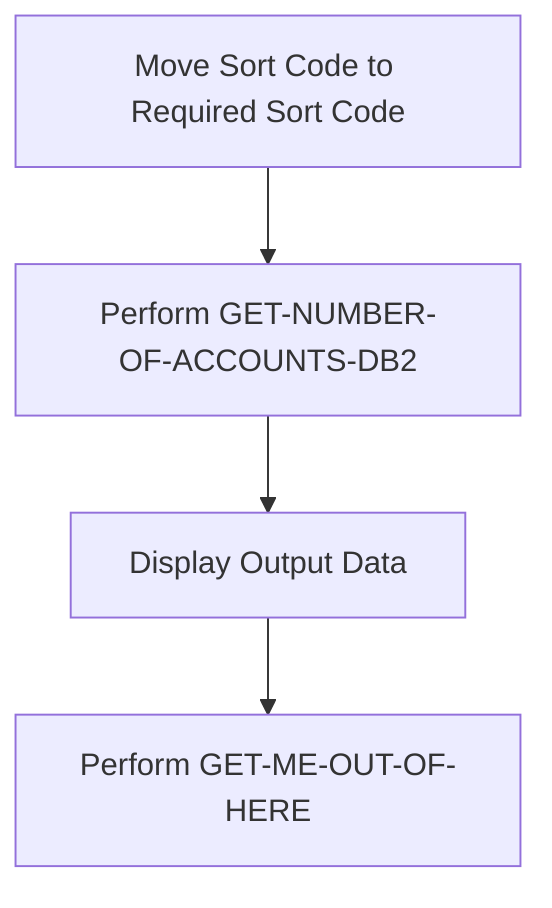
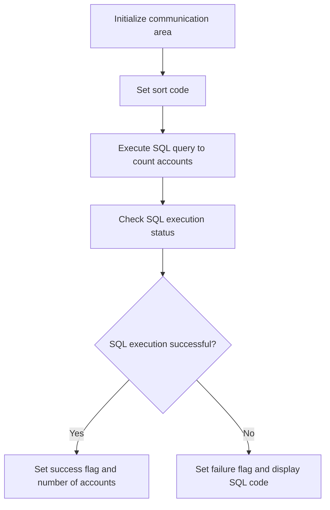
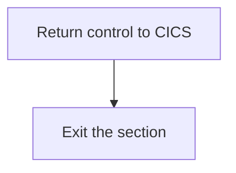

The ACCTCTRL program is responsible for managing account control operations within the banking application. It achieves this by performing a series of steps including moving the sort code to the required sort code, retrieving the number of accounts associated with the sort code, displaying the output data, and concluding the process.

The flow begins by moving the sort code to the required sort code. Next, it retrieves the number of accounts associated with the given sort code by performing a database query. The output data is then displayed, and finally, the process is concluded by performing the necessary cleanup operations.

## PREMIERE

Lets' zoom into this section of the flow:



<SwmSnippet path="/src/base/cobol_src/ACCTCTRL.cbl" line="138">

---

### Moving Sort Code to Required Sort Code

First, the sort code is moved to <SwmToken path="src/base/cobol_src/ACCTCTRL.cbl" pos="139:1:5" line-data="              REQUIRED-SORT-CODE.">`REQUIRED-SORT-CODE`</SwmToken> (the required sort code for the account).

```cobol
           MOVE SORTCODE TO
              REQUIRED-SORT-CODE.
```

---

</SwmSnippet>

<SwmSnippet path="/src/base/cobol_src/ACCTCTRL.cbl" line="141">

---

### Performing <SwmToken path="src/base/cobol_src/ACCTCTRL.cbl" pos="141:3:11" line-data="           PERFORM GET-NUMBER-OF-ACCOUNTS-DB2">`GET-NUMBER-OF-ACCOUNTS-DB2`</SwmToken>

Next, the <SwmToken path="src/base/cobol_src/ACCTCTRL.cbl" pos="141:3:11" line-data="           PERFORM GET-NUMBER-OF-ACCOUNTS-DB2">`GET-NUMBER-OF-ACCOUNTS-DB2`</SwmToken> section is performed to retrieve the number of accounts associated with the given sort code.

```cobol
           PERFORM GET-NUMBER-OF-ACCOUNTS-DB2
```

---

</SwmSnippet>

<SwmSnippet path="/src/base/cobol_src/ACCTCTRL.cbl" line="144">

---

### Displaying Output Data

Then, the output data is displayed using <SwmToken path="src/base/cobol_src/ACCTCTRL.cbl" pos="145:3:3" line-data="      D       DFHCOMMAREA.">`DFHCOMMAREA`</SwmToken>.

```cobol
      D    DISPLAY 'OUTPUT DATA IS='
      D       DFHCOMMAREA.
```

---

</SwmSnippet>

<SwmSnippet path="/src/base/cobol_src/ACCTCTRL.cbl" line="148">

---

### Performing <SwmToken path="src/base/cobol_src/ACCTCTRL.cbl" pos="148:3:11" line-data="           PERFORM GET-ME-OUT-OF-HERE.">`GET-ME-OUT-OF-HERE`</SwmToken>

Finally, the <SwmToken path="src/base/cobol_src/ACCTCTRL.cbl" pos="148:3:11" line-data="           PERFORM GET-ME-OUT-OF-HERE.">`GET-ME-OUT-OF-HERE`</SwmToken> section is performed to conclude the process.

```cobol
           PERFORM GET-ME-OUT-OF-HERE.
```

---

</SwmSnippet>

## <SwmToken path="src/base/cobol_src/ACCTCTRL.cbl" pos="141:3:11" line-data="           PERFORM GET-NUMBER-OF-ACCOUNTS-DB2">`GET-NUMBER-OF-ACCOUNTS-DB2`</SwmToken>

Lets' zoom into this section of the flow:



<SwmSnippet path="/src/base/cobol_src/ACCTCTRL.cbl" line="160">

---

First, the communication area is initialized to ensure that all necessary fields are set to their default values.

```cobol
           INITIALIZE DFHCOMMAREA.
```

---

</SwmSnippet>

<SwmSnippet path="/src/base/cobol_src/ACCTCTRL.cbl" line="163">

---

Next, the required sort code is moved to the host variable <SwmToken path="src/base/cobol_src/ACCTCTRL.cbl" pos="163:11:15" line-data="           MOVE REQUIRED-SORT-CODE TO HV-ACCOUNT-SORTCODE">`HV-ACCOUNT-SORTCODE`</SwmToken> to prepare for the SQL query.

```cobol
           MOVE REQUIRED-SORT-CODE TO HV-ACCOUNT-SORTCODE
```

---

</SwmSnippet>

<SwmSnippet path="/src/base/cobol_src/ACCTCTRL.cbl" line="165">

---

Then, an SQL query is executed to count the number of accounts that match the specified sort code, and the result is stored in <SwmToken path="src/base/cobol_src/ACCTCTRL.cbl" pos="167:4:10" line-data="              INTO  :HV-NUMBER-OF-ACCOUNTS">`HV-NUMBER-OF-ACCOUNTS`</SwmToken>.

```cobol
           EXEC SQL
              SELECT COUNT(*)
              INTO  :HV-NUMBER-OF-ACCOUNTS
              FROM ACCOUNT
              WHERE ACCOUNT_SORTCODE = :HV-ACCOUNT-SORTCODE
           END-EXEC.
```

---

</SwmSnippet>

<SwmSnippet path="/src/base/cobol_src/ACCTCTRL.cbl" line="172">

---

Finally, the SQL execution status is checked. If successful, the success flag is set and the number of accounts is moved to <SwmToken path="src/base/cobol_src/ACCTCTRL.cbl" pos="174:5:9" line-data="             MOVE HV-NUMBER-OF-ACCOUNTS TO NUMBER-OF-ACCOUNTS">`NUMBER-OF-ACCOUNTS`</SwmToken>. If not, the failure flag is set and the SQL code is displayed.

```cobol
           IF SQLCODE = ZERO
             MOVE 'Y' TO ACCOUNT-CONTROL-SUCCESS-FLAG
             MOVE HV-NUMBER-OF-ACCOUNTS TO NUMBER-OF-ACCOUNTS
           ELSE
             MOVE 'N' TO ACCOUNT-CONTROL-SUCCESS-FLAG
             MOVE SQLCODE TO SQLCODE-DISPLAY
           END-IF.
```

---

</SwmSnippet>

## <SwmToken path="src/base/cobol_src/ACCTCTRL.cbl" pos="148:3:11" line-data="           PERFORM GET-ME-OUT-OF-HERE.">`GET-ME-OUT-OF-HERE`</SwmToken>

Lets' zoom into this section of the flow:



<SwmSnippet path="/src/base/cobol_src/ACCTCTRL.cbl" line="208">

---

First, the <SwmToken path="src/base/cobol_src/ACCTCTRL.cbl" pos="208:1:5" line-data="           EXEC CICS RETURN">`EXEC CICS RETURN`</SwmToken> command is executed to return control to the CICS region, indicating that the current task is complete.

```cobol
           EXEC CICS RETURN
           END-EXEC.
```

---

</SwmSnippet>

<SwmSnippet path="/src/base/cobol_src/ACCTCTRL.cbl" line="211">

---

Next, the <SwmToken path="src/base/cobol_src/ACCTCTRL.cbl" pos="212:1:1" line-data="           EXIT.">`EXIT`</SwmToken> statement is used to exit the <SwmToken path="src/base/cobol_src/ACCTCTRL.cbl" pos="148:3:11" line-data="           PERFORM GET-ME-OUT-OF-HERE.">`GET-ME-OUT-OF-HERE`</SwmToken> section, ensuring that no further code in this section is executed.

```cobol
       GMOFH999.
           EXIT.
```

---

</SwmSnippet>

&nbsp;

*This is an auto-generated document by Swimm 🌊 and has not yet been verified by a human*

<SwmMeta version="3.0.0" repo-id="Z2l0aHViJTNBJTNBY2ljcy1iYW5raW5nLXNhbXBsZS1hcHBsaWNhdGlvbi1jYnNhLUlCTS1EZW1vJTNBJTNBU3dpbW0tRGVtbw==" repo-name="cics-banking-sample-application-cbsa-IBM-Demo"><sup>Powered by [Swimm](/)</sup></SwmMeta>
