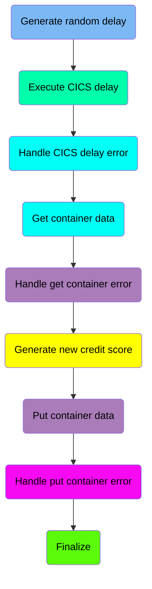
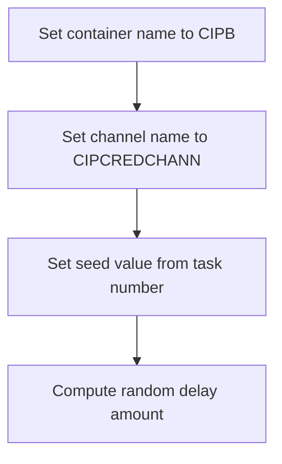
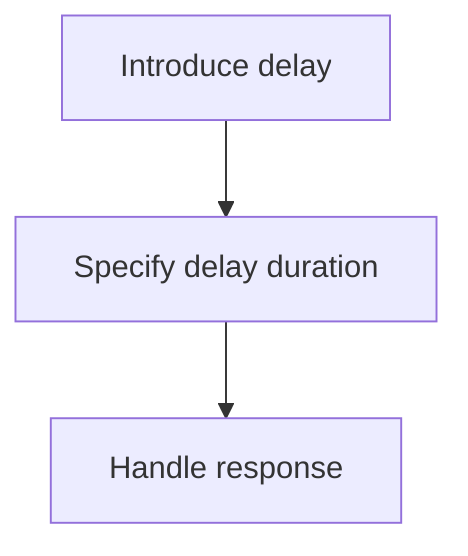
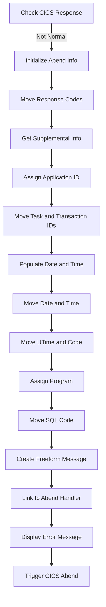
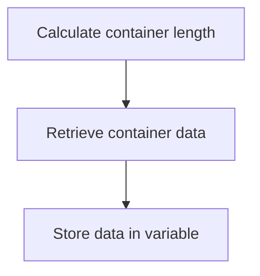
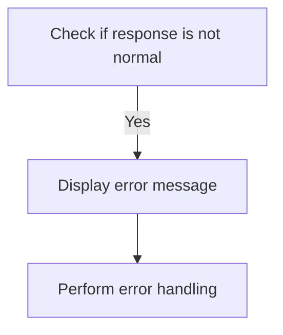
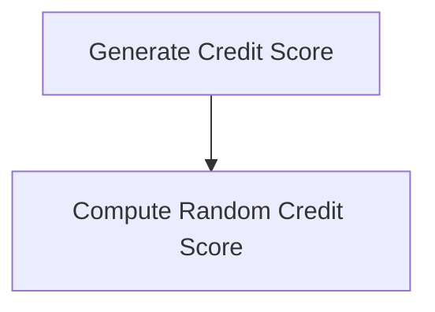
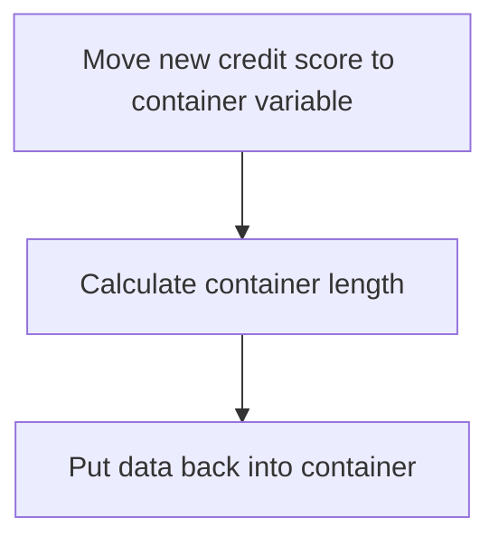
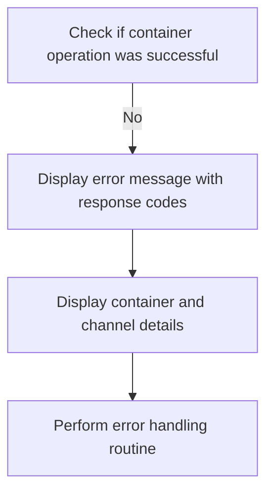
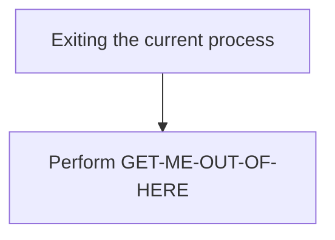

The <SwmToken path="src/base/cobol_src/CRDTAGY2.cbl" pos="202:4:4" line-data="              DISPLAY &#39;CRDTAGY2 - UNABLE TO GET CONTAINER. RESP=&#39;">`CRDTAGY2`</SwmToken> program is designed to manage credit score generation and handling within a banking application. This program achieves its role by generating a random delay, executing CICS delay commands, handling potential errors, retrieving and updating container data, and finalizing the process.

The flow begins with generating a random delay and executing the CICS delay command. If any errors occur during this process, they are handled appropriately. The program then retrieves data from a CICS container, generates a new credit score, and updates the container with this new data. Finally, the process is finalized, ensuring any necessary cleanup or finalization tasks are performed.

Here is a high level diagram of the program:



## Generate random delay

First, we'll zoom into this section of the flow:



<SwmSnippet path="/src/base/cobol_src/CRDTAGY2.cbl" line="119">

---

First, the container name is set to <SwmToken path="src/base/cobol_src/CRDTAGY2.cbl" pos="119:4:4" line-data="           MOVE &#39;CIPB            &#39; TO WS-CONTAINER-NAME.">`CIPB`</SwmToken> (a predefined container name for processing).

```cobol
           MOVE 'CIPB            ' TO WS-CONTAINER-NAME.
```

---

</SwmSnippet>

<SwmSnippet path="/src/base/cobol_src/CRDTAGY2.cbl" line="120">

---

Moving to the next step, the channel name is set to <SwmToken path="src/base/cobol_src/CRDTAGY2.cbl" pos="120:4:4" line-data="           MOVE &#39;CIPCREDCHANN    &#39; TO WS-CHANNEL-NAME.">`CIPCREDCHANN`</SwmToken> (a predefined channel name for processing).

```cobol
           MOVE 'CIPCREDCHANN    ' TO WS-CHANNEL-NAME.
```

---

</SwmSnippet>

<SwmSnippet path="/src/base/cobol_src/CRDTAGY2.cbl" line="121">

---

Next, the seed value is set from the task number (<SwmToken path="src/base/cobol_src/CRDTAGY2.cbl" pos="121:3:3" line-data="           MOVE EIBTASKN           TO WS-SEED.">`EIBTASKN`</SwmToken>), which will be used to generate a random number.

```cobol
           MOVE EIBTASKN           TO WS-SEED.
```

---

</SwmSnippet>

<SwmSnippet path="/src/base/cobol_src/CRDTAGY2.cbl" line="123">

---

Then, the random delay amount is computed using the seed value, resulting in a delay between 1 and 3 seconds.

```cobol
           COMPUTE WS-DELAY-AMT = ((3 - 1)
                            * FUNCTION RANDOM(WS-SEED)) + 1.
```

---

</SwmSnippet>

## Execute CICS delay

This is the next section of the flow.



<SwmSnippet path="/src/base/cobol_src/CRDTAGY2.cbl" line="126">

---

The <SwmToken path="src/base/cobol_src/CRDTAGY2.cbl" pos="112:1:1" line-data="       PREMIERE SECTION.">`PREMIERE`</SwmToken> function introduces a delay in the transaction processing. This is achieved by using the <SwmToken path="src/base/cobol_src/CRDTAGY2.cbl" pos="126:1:5" line-data="           EXEC CICS DELAY">`EXEC CICS DELAY`</SwmToken> command, which pauses the execution for a specified duration. The duration of the delay is determined by the value in <SwmToken path="src/base/cobol_src/CRDTAGY2.cbl" pos="127:5:9" line-data="                FOR SECONDS(WS-DELAY-AMT)">`WS-DELAY-AMT`</SwmToken>. This delay can be used to simulate real-world processing times or to manage transaction pacing. After the delay, the response is captured in <SwmToken path="src/base/cobol_src/CRDTAGY2.cbl" pos="128:3:7" line-data="                RESP(WS-CICS-RESP)">`WS-CICS-RESP`</SwmToken> and <SwmToken path="src/base/cobol_src/CRDTAGY2.cbl" pos="129:3:7" line-data="                RESP2(WS-CICS-RESP2)">`WS-CICS-RESP2`</SwmToken>, which can be used for further processing or error handling.

```cobol
           EXEC CICS DELAY
                FOR SECONDS(WS-DELAY-AMT)
                RESP(WS-CICS-RESP)
                RESP2(WS-CICS-RESP2)
           END-EXEC.
```

---

</SwmSnippet>

## Handle CICS delay error

Now, lets zoom into this section of the flow:



First, the code checks if the CICS response is not normal by evaluating <SwmToken path="src/base/cobol_src/CRDTAGY2.cbl" pos="128:3:7" line-data="                RESP(WS-CICS-RESP)">`WS-CICS-RESP`</SwmToken> against <SwmToken path="src/base/cobol_src/CRDTAGY2.cbl" pos="201:13:16" line-data="           IF WS-CICS-RESP NOT = DFHRESP(NORMAL)">`DFHRESP(NORMAL)`</SwmToken>.

<SwmSnippet path="/src/base/cobol_src/CRDTAGY2.cbl" line="139">

---

If the response is not normal, it initializes the <SwmToken path="src/base/cobol_src/CRDTAGY2.cbl" pos="139:3:5" line-data="              INITIALIZE ABNDINFO-REC">`ABNDINFO-REC`</SwmToken> to prepare for capturing abend information.

```cobol
              INITIALIZE ABNDINFO-REC
```

---

</SwmSnippet>

<SwmSnippet path="/src/base/cobol_src/CRDTAGY2.cbl" line="140">

---

Next, it moves the response codes <SwmToken path="src/base/cobol_src/CRDTAGY2.cbl" pos="140:3:3" line-data="              MOVE EIBRESP    TO ABND-RESPCODE">`EIBRESP`</SwmToken> and <SwmToken path="src/base/cobol_src/CRDTAGY2.cbl" pos="141:3:3" line-data="              MOVE EIBRESP2   TO ABND-RESP2CODE">`EIBRESP2`</SwmToken> to <SwmToken path="src/base/cobol_src/CRDTAGY2.cbl" pos="140:7:9" line-data="              MOVE EIBRESP    TO ABND-RESPCODE">`ABND-RESPCODE`</SwmToken> and <SwmToken path="src/base/cobol_src/CRDTAGY2.cbl" pos="141:7:9" line-data="              MOVE EIBRESP2   TO ABND-RESP2CODE">`ABND-RESP2CODE`</SwmToken> respectively.

```cobol
              MOVE EIBRESP    TO ABND-RESPCODE
              MOVE EIBRESP2   TO ABND-RESP2CODE
```

---

</SwmSnippet>

<SwmSnippet path="/src/base/cobol_src/CRDTAGY2.cbl" line="145">

---

Then, it assigns the application ID to <SwmToken path="src/base/cobol_src/CRDTAGY2.cbl" pos="145:9:11" line-data="              EXEC CICS ASSIGN APPLID(ABND-APPLID)">`ABND-APPLID`</SwmToken> using the <SwmToken path="src/base/cobol_src/CRDTAGY2.cbl" pos="145:1:5" line-data="              EXEC CICS ASSIGN APPLID(ABND-APPLID)">`EXEC CICS ASSIGN`</SwmToken> command.

```cobol
              EXEC CICS ASSIGN APPLID(ABND-APPLID)
              END-EXEC
```

---

</SwmSnippet>

<SwmSnippet path="/src/base/cobol_src/CRDTAGY2.cbl" line="148">

---

Moving to the next step, it captures the task number and transaction ID by moving <SwmToken path="src/base/cobol_src/CRDTAGY2.cbl" pos="148:3:3" line-data="              MOVE EIBTASKN   TO ABND-TASKNO-KEY">`EIBTASKN`</SwmToken> and <SwmToken path="src/base/cobol_src/CRDTAGY2.cbl" pos="149:3:3" line-data="              MOVE EIBTRNID   TO ABND-TRANID">`EIBTRNID`</SwmToken> to <SwmToken path="src/base/cobol_src/CRDTAGY2.cbl" pos="148:7:11" line-data="              MOVE EIBTASKN   TO ABND-TASKNO-KEY">`ABND-TASKNO-KEY`</SwmToken> and <SwmToken path="src/base/cobol_src/CRDTAGY2.cbl" pos="149:7:9" line-data="              MOVE EIBTRNID   TO ABND-TRANID">`ABND-TRANID`</SwmToken> respectively.

```cobol
              MOVE EIBTASKN   TO ABND-TASKNO-KEY
              MOVE EIBTRNID   TO ABND-TRANID
```

---

</SwmSnippet>

<SwmSnippet path="/src/base/cobol_src/CRDTAGY2.cbl" line="151">

---

It then performs the <SwmToken path="src/base/cobol_src/CRDTAGY2.cbl" pos="151:3:7" line-data="              PERFORM POPULATE-TIME-DATE">`POPULATE-TIME-DATE`</SwmToken> routine to get the current date and time.

```cobol
              PERFORM POPULATE-TIME-DATE
```

---

</SwmSnippet>

<SwmSnippet path="/src/base/cobol_src/CRDTAGY2.cbl" line="153">

---

After that, it moves the original date and current time to <SwmToken path="src/base/cobol_src/CRDTAGY2.cbl" pos="153:11:13" line-data="              MOVE WS-ORIG-DATE TO ABND-DATE">`ABND-DATE`</SwmToken> and <SwmToken path="src/base/cobol_src/CRDTAGY2.cbl" pos="159:3:5" line-data="                       INTO ABND-TIME">`ABND-TIME`</SwmToken> respectively.

```cobol
              MOVE WS-ORIG-DATE TO ABND-DATE
              STRING WS-TIME-NOW-GRP-HH DELIMITED BY SIZE,
                      ':' DELIMITED BY SIZE,
                       WS-TIME-NOW-GRP-MM DELIMITED BY SIZE,
                       ':' DELIMITED BY SIZE,
                       WS-TIME-NOW-GRP-MM DELIMITED BY SIZE
                       INTO ABND-TIME
```

---

</SwmSnippet>

<SwmSnippet path="/src/base/cobol_src/CRDTAGY2.cbl" line="162">

---

It also moves the user time and a specific code 'PLOP' to <SwmToken path="src/base/cobol_src/CRDTAGY2.cbl" pos="162:11:15" line-data="              MOVE WS-U-TIME   TO ABND-UTIME-KEY">`ABND-UTIME-KEY`</SwmToken> and <SwmToken path="src/base/cobol_src/CRDTAGY2.cbl" pos="163:9:11" line-data="              MOVE &#39;PLOP&#39;      TO ABND-CODE">`ABND-CODE`</SwmToken> respectively.

```cobol
              MOVE WS-U-TIME   TO ABND-UTIME-KEY
              MOVE 'PLOP'      TO ABND-CODE
```

---

</SwmSnippet>

<SwmSnippet path="/src/base/cobol_src/CRDTAGY2.cbl" line="170">

---

Finally, it creates a freeform message with the response codes and links to the abend handler program <SwmToken path="src/base/cobol_src/CRDTAGY2.cbl" pos="179:9:13" line-data="              EXEC CICS LINK PROGRAM(WS-ABEND-PGM)">`WS-ABEND-PGM`</SwmToken> with the <SwmToken path="src/base/cobol_src/CRDTAGY2.cbl" pos="180:3:5" line-data="                          COMMAREA(ABNDINFO-REC)">`ABNDINFO-REC`</SwmToken>.

```cobol
              STRING 'A010  - *** The delay messed up! ***'
                      DELIMITED BY SIZE,
                      ' EIBRESP=' DELIMITED BY SIZE,
                      ABND-RESPCODE DELIMITED BY SIZE,
                      ' RESP2=' DELIMITED BY SIZE,
                      ABND-RESP2CODE DELIMITED BY SIZE
                      INTO ABND-FREEFORM
              END-STRING

              EXEC CICS LINK PROGRAM(WS-ABEND-PGM)
                          COMMAREA(ABNDINFO-REC)
              END-EXEC
```

---

</SwmSnippet>

## Get container data

This is the next section of the flow.



<SwmSnippet path="/src/base/cobol_src/CRDTAGY2.cbl" line="191">

---

### Retrieving data from a CICS container

The function begins by calculating the length of the container data and storing it in <SwmToken path="src/base/cobol_src/CRDTAGY2.cbl" pos="191:3:7" line-data="           COMPUTE WS-CONTAINER-LEN = LENGTH OF WS-CONT-IN.">`WS-CONTAINER-LEN`</SwmToken> (the variable holding the container length). Next, it retrieves the data from the specified CICS container using the <SwmToken path="src/base/cobol_src/CRDTAGY2.cbl" pos="193:5:7" line-data="           EXEC CICS GET CONTAINER(WS-CONTAINER-NAME)">`GET CONTAINER`</SwmToken> command. The container name is specified by <SwmToken path="src/base/cobol_src/CRDTAGY2.cbl" pos="193:9:13" line-data="           EXEC CICS GET CONTAINER(WS-CONTAINER-NAME)">`WS-CONTAINER-NAME`</SwmToken>, and the data is retrieved into <SwmToken path="src/base/cobol_src/CRDTAGY2.cbl" pos="191:15:19" line-data="           COMPUTE WS-CONTAINER-LEN = LENGTH OF WS-CONT-IN.">`WS-CONT-IN`</SwmToken> (the variable holding the container data). The length of the data to be retrieved is specified by <SwmToken path="src/base/cobol_src/CRDTAGY2.cbl" pos="191:3:7" line-data="           COMPUTE WS-CONTAINER-LEN = LENGTH OF WS-CONT-IN.">`WS-CONTAINER-LEN`</SwmToken>. The response codes from the CICS command are stored in <SwmToken path="src/base/cobol_src/CRDTAGY2.cbl" pos="197:3:7" line-data="                     RESP(WS-CICS-RESP)">`WS-CICS-RESP`</SwmToken> and <SwmToken path="src/base/cobol_src/CRDTAGY2.cbl" pos="198:3:7" line-data="                     RESP2(WS-CICS-RESP2)">`WS-CICS-RESP2`</SwmToken> to handle any potential errors or conditions.

```cobol
           COMPUTE WS-CONTAINER-LEN = LENGTH OF WS-CONT-IN.

           EXEC CICS GET CONTAINER(WS-CONTAINER-NAME)
                     CHANNEL(WS-CHANNEL-NAME)
                     INTO(WS-CONT-IN)
                     FLENGTH(WS-CONTAINER-LEN)
                     RESP(WS-CICS-RESP)
                     RESP2(WS-CICS-RESP2)
           END-EXEC.
```

---

</SwmSnippet>

## Handle get container error

Now, lets zoom into this section of the flow:



<SwmSnippet path="/src/base/cobol_src/CRDTAGY2.cbl" line="201">

---

The code checks if the response code <SwmToken path="src/base/cobol_src/CRDTAGY2.cbl" pos="201:3:7" line-data="           IF WS-CICS-RESP NOT = DFHRESP(NORMAL)">`WS-CICS-RESP`</SwmToken> is not equal to <SwmToken path="src/base/cobol_src/CRDTAGY2.cbl" pos="201:13:16" line-data="           IF WS-CICS-RESP NOT = DFHRESP(NORMAL)">`DFHRESP(NORMAL)`</SwmToken>, indicating an error occurred while trying to get the container. If an error is detected, it displays an error message with details including the response codes <SwmToken path="src/base/cobol_src/CRDTAGY2.cbl" pos="201:3:7" line-data="           IF WS-CICS-RESP NOT = DFHRESP(NORMAL)">`WS-CICS-RESP`</SwmToken> and <SwmToken path="src/base/cobol_src/CRDTAGY2.cbl" pos="203:14:18" line-data="                 WS-CICS-RESP &#39;, RESP2=&#39; WS-CICS-RESP2">`WS-CICS-RESP2`</SwmToken>, the container name <SwmToken path="src/base/cobol_src/CRDTAGY2.cbl" pos="204:8:12" line-data="              DISPLAY &#39;CONTAINER=&#39; WS-CONTAINER-NAME &#39; CHANNEL=&#39;">`WS-CONTAINER-NAME`</SwmToken>, the channel name <SwmToken path="src/base/cobol_src/CRDTAGY2.cbl" pos="205:1:5" line-data="                       WS-CHANNEL-NAME &#39; FLENGTH=&#39;">`WS-CHANNEL-NAME`</SwmToken>, and the container length <SwmToken path="src/base/cobol_src/CRDTAGY2.cbl" pos="206:1:5" line-data="                       WS-CONTAINER-LEN">`WS-CONTAINER-LEN`</SwmToken>. Finally, it performs the <SwmToken path="src/base/cobol_src/CRDTAGY2.cbl" pos="207:3:11" line-data="              PERFORM GET-ME-OUT-OF-HERE">`GET-ME-OUT-OF-HERE`</SwmToken> routine to handle the error appropriately.

```cobol
           IF WS-CICS-RESP NOT = DFHRESP(NORMAL)
              DISPLAY 'CRDTAGY2 - UNABLE TO GET CONTAINER. RESP='
                 WS-CICS-RESP ', RESP2=' WS-CICS-RESP2
              DISPLAY 'CONTAINER=' WS-CONTAINER-NAME ' CHANNEL='
                       WS-CHANNEL-NAME ' FLENGTH='
                       WS-CONTAINER-LEN
              PERFORM GET-ME-OUT-OF-HERE
           END-IF.
```

---

</SwmSnippet>

## Generate new credit score

This is the next section of the flow.



<SwmSnippet path="/src/base/cobol_src/CRDTAGY2.cbl" line="209">

---

First, the function generates a new credit score for the user. This score is a random number between 1 and 999.

```cobol
      *
      *    Now generate a credit score between 1 and 999. Because we
      *    used a SEED on the first RANDOM (above) we don't need to
      *    use a SEED again when using RANDOM for a subsequent time
```

---

</SwmSnippet>

<SwmSnippet path="/src/base/cobol_src/CRDTAGY2.cbl" line="215">

---

Next, the function computes the new credit score using the <SwmToken path="src/base/cobol_src/CRDTAGY2.cbl" pos="216:5:5" line-data="                            * FUNCTION RANDOM) + 1.">`RANDOM`</SwmToken> function, which generates a random number. The score is then adjusted to ensure it falls within the desired range of 1 to 999.

```cobol
           COMPUTE WS-NEW-CREDSCORE = ((999 - 1)
                            * FUNCTION RANDOM) + 1.
```

---

</SwmSnippet>

## Put container data

This is the next section of the flow.



<SwmSnippet path="/src/base/cobol_src/CRDTAGY2.cbl" line="218">

---

First, the new credit score is moved to the container variable <SwmToken path="src/base/cobol_src/CRDTAGY2.cbl" pos="218:11:19" line-data="           MOVE WS-NEW-CREDSCORE TO WS-CONT-IN-CREDIT-SCORE.">`WS-CONT-IN-CREDIT-SCORE`</SwmToken>.

```cobol
           MOVE WS-NEW-CREDSCORE TO WS-CONT-IN-CREDIT-SCORE.
```

---

</SwmSnippet>

<SwmSnippet path="/src/base/cobol_src/CRDTAGY2.cbl" line="223">

---

Next, the length of the container data is calculated and stored in <SwmToken path="src/base/cobol_src/CRDTAGY2.cbl" pos="223:3:7" line-data="           COMPUTE WS-CONTAINER-LEN = LENGTH OF WS-CONT-IN.">`WS-CONTAINER-LEN`</SwmToken>.

```cobol
           COMPUTE WS-CONTAINER-LEN = LENGTH OF WS-CONT-IN.
```

---

</SwmSnippet>

<SwmSnippet path="/src/base/cobol_src/CRDTAGY2.cbl" line="225">

---

Then, the data is put back into the container using the <SwmToken path="src/base/cobol_src/CRDTAGY2.cbl" pos="225:1:7" line-data="           EXEC CICS PUT CONTAINER(WS-CONTAINER-NAME)">`EXEC CICS PUT CONTAINER`</SwmToken> command, which updates the container with the new credit score.

```cobol
           EXEC CICS PUT CONTAINER(WS-CONTAINER-NAME)
                         FROM(WS-CONT-IN)
                         FLENGTH(WS-CONTAINER-LEN)
                         CHANNEL(WS-CHANNEL-NAME)
                         RESP(WS-CICS-RESP)
                         RESP2(WS-CICS-RESP2)
           END-EXEC.
```

---

</SwmSnippet>

## Handle put container error

Now, lets zoom into this section of the flow:



<SwmSnippet path="/src/base/cobol_src/CRDTAGY2.cbl" line="233">

---

If the container operation is not successful, indicated by <SwmToken path="src/base/cobol_src/CRDTAGY2.cbl" pos="233:3:7" line-data="           IF WS-CICS-RESP NOT = DFHRESP(NORMAL)">`WS-CICS-RESP`</SwmToken> not being equal to <SwmToken path="src/base/cobol_src/CRDTAGY2.cbl" pos="233:13:16" line-data="           IF WS-CICS-RESP NOT = DFHRESP(NORMAL)">`DFHRESP(NORMAL)`</SwmToken>, the system will display an error message. This message includes the response codes <SwmToken path="src/base/cobol_src/CRDTAGY2.cbl" pos="233:3:7" line-data="           IF WS-CICS-RESP NOT = DFHRESP(NORMAL)">`WS-CICS-RESP`</SwmToken> and <SwmToken path="src/base/cobol_src/CRDTAGY2.cbl" pos="235:14:18" line-data="                 WS-CICS-RESP &#39;, RESP2=&#39; WS-CICS-RESP2">`WS-CICS-RESP2`</SwmToken>, which help in diagnosing the issue. Additionally, it displays the container name <SwmToken path="src/base/cobol_src/CRDTAGY2.cbl" pos="236:8:12" line-data="              DISPLAY  &#39;CONTAINER=&#39;  WS-CONTAINER-NAME">`WS-CONTAINER-NAME`</SwmToken>, the channel name <SwmToken path="src/base/cobol_src/CRDTAGY2.cbl" pos="237:7:11" line-data="              &#39; CHANNEL=&#39; WS-CHANNEL-NAME &#39; FLENGTH=&#39;">`WS-CHANNEL-NAME`</SwmToken>, and the container length <SwmToken path="src/base/cobol_src/CRDTAGY2.cbl" pos="238:1:5" line-data="                    WS-CONTAINER-LEN">`WS-CONTAINER-LEN`</SwmToken> to provide more context about the operation that failed. Finally, the system performs the <SwmToken path="src/base/cobol_src/CRDTAGY2.cbl" pos="239:3:11" line-data="              PERFORM GET-ME-OUT-OF-HERE">`GET-ME-OUT-OF-HERE`</SwmToken> routine to handle the error appropriately.

```cobol
           IF WS-CICS-RESP NOT = DFHRESP(NORMAL)
              DISPLAY 'CRDTAGY2 - UNABLE TO PUT CONTAINER. RESP='
                 WS-CICS-RESP ', RESP2=' WS-CICS-RESP2
              DISPLAY  'CONTAINER='  WS-CONTAINER-NAME
              ' CHANNEL=' WS-CHANNEL-NAME ' FLENGTH='
                    WS-CONTAINER-LEN
              PERFORM GET-ME-OUT-OF-HERE
           END-IF.
```

---

</SwmSnippet>

## Finalize

This is the next section of the flow.



<SwmSnippet path="/src/base/cobol_src/CRDTAGY2.cbl" line="242">

---

The <SwmToken path="src/base/cobol_src/CRDTAGY2.cbl" pos="242:1:11" line-data="           PERFORM GET-ME-OUT-OF-HERE.">`PERFORM GET-ME-OUT-OF-HERE`</SwmToken> statement is used to exit the current process. This step is crucial as it ensures that the program terminates the current operation and performs any necessary cleanup or finalization tasks before completely exiting. This is particularly important in scenarios where the program needs to halt its execution due to an error or a specific condition being met, ensuring that resources are properly released and the system remains stable.

```cobol
           PERFORM GET-ME-OUT-OF-HERE.

```

---

</SwmSnippet>

&nbsp;

*This is an auto-generated document by Swimm 🌊 and has not yet been verified by a human*

<SwmMeta version="3.0.0" repo-id="Z2l0aHViJTNBJTNBY2ljcy1iYW5raW5nLXNhbXBsZS1hcHBsaWNhdGlvbi1jYnNhLUlCTS1EZW1vJTNBJTNBU3dpbW0tRGVtbw==" repo-name="cics-banking-sample-application-cbsa-IBM-Demo"><sup>Powered by [Swimm](/)</sup></SwmMeta>
