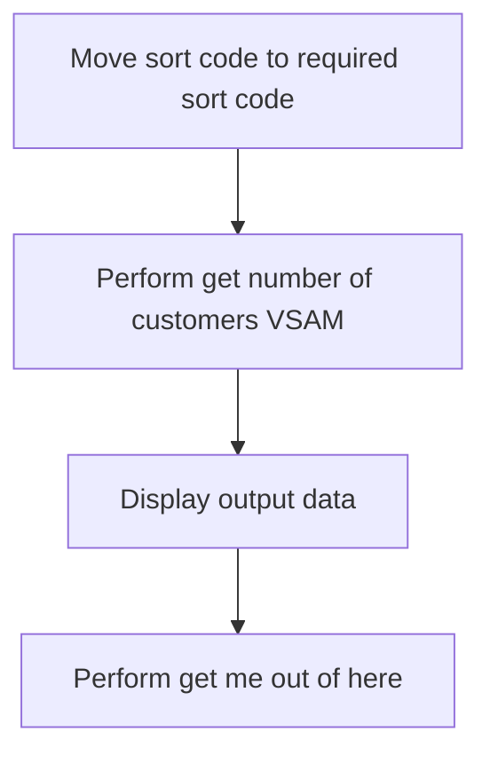
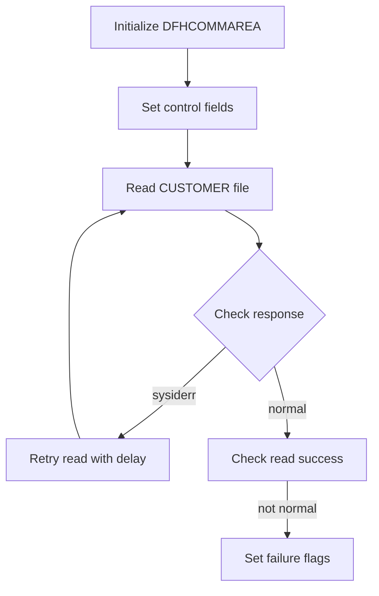
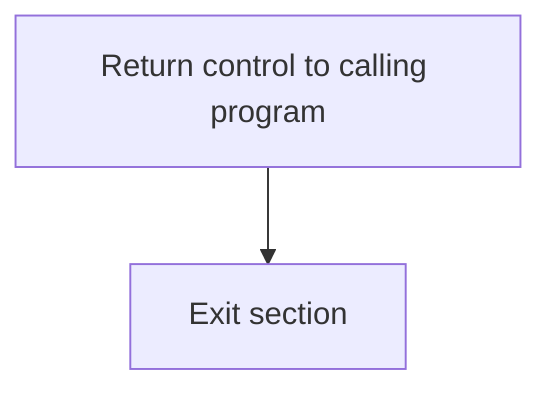

The CUSTCTRL program is responsible for managing customer control operations within the system. This program achieves its role by performing a series of steps including moving sort codes, retrieving customer data from VSAM files, displaying output data, and executing cleanup routines.

The flow involves moving the sort code to the required field, performing a VSAM operation to get the number of customers, displaying the output data, and finally executing a cleanup or exit routine to ensure proper termination of the program.

## PREMIERE

Lets' zoom into this section of the flow:



<SwmSnippet path="/src/base/cobol_src/CUSTCTRL.cbl" line="134">

---

### Moving sort code to required sort code

First, the sort code is moved to the required sort code field. This step ensures that the correct sort code is set up for subsequent operations.

```cobol
           MOVE SORTCODE TO
              REQUIRED-SORT-CODE.
```

---

</SwmSnippet>

<SwmSnippet path="/src/base/cobol_src/CUSTCTRL.cbl" line="137">

---

### Performing get number of customers VSAM

Next, the program performs the operation to get the number of customers from the VSAM file. This step is crucial for retrieving customer data based on the sort code.

```cobol
           PERFORM GET-NUMBER-OF-CUSTOMERS-VSAM
```

---

</SwmSnippet>

<SwmSnippet path="/src/base/cobol_src/CUSTCTRL.cbl" line="140">

---

### Displaying output data

Moving to the next step, the program displays the output data. This is important for verifying that the correct data has been retrieved and is ready for further processing.

```cobol
      D    DISPLAY 'OUTPUT DATA IS='
      D       DFHCOMMAREA.
```

---

</SwmSnippet>

<SwmSnippet path="/src/base/cobol_src/CUSTCTRL.cbl" line="144">

---

### Performing get me out of here

Finally, the program performs the 'get me out of here' operation. This step is likely a cleanup or exit routine to ensure that the program terminates correctly.

```cobol
           PERFORM GET-ME-OUT-OF-HERE.
```

---

</SwmSnippet>

## <SwmToken path="src/base/cobol_src/CUSTCTRL.cbl" pos="137:3:11" line-data="           PERFORM GET-NUMBER-OF-CUSTOMERS-VSAM">`GET-NUMBER-OF-CUSTOMERS-VSAM`</SwmToken>

Lets' zoom into this section of the flow:



<SwmSnippet path="/src/base/cobol_src/CUSTCTRL.cbl" line="155">

---

### Initializing DFHCOMMAREA

First, the <SwmToken path="src/base/cobol_src/CUSTCTRL.cbl" pos="155:3:3" line-data="           INITIALIZE DFHCOMMAREA.">`DFHCOMMAREA`</SwmToken> is initialized to ensure that it is in a known state before any operations are performed.

```cobol
           INITIALIZE DFHCOMMAREA.
```

---

</SwmSnippet>

<SwmSnippet path="/src/base/cobol_src/CUSTCTRL.cbl" line="158">

---

### Setting control fields

Next, the control fields <SwmToken path="src/base/cobol_src/CUSTCTRL.cbl" pos="158:7:11" line-data="           MOVE ZERO TO CUSTOMER-CONTROL-SORTCODE">`CUSTOMER-CONTROL-SORTCODE`</SwmToken> and <SwmToken path="src/base/cobol_src/CUSTCTRL.cbl" pos="159:11:15" line-data="           MOVE ALL &#39;9&#39; TO CUSTOMER-CONTROL-NUMBER">`CUSTOMER-CONTROL-NUMBER`</SwmToken> are set to zero and all nines, respectively. This prepares the key for reading the VSAM file.

```cobol
           MOVE ZERO TO CUSTOMER-CONTROL-SORTCODE
           MOVE ALL '9' TO CUSTOMER-CONTROL-NUMBER
```

---

</SwmSnippet>

<SwmSnippet path="/src/base/cobol_src/CUSTCTRL.cbl" line="162">

---

### Reading the CUSTOMER file

The code then attempts to read the <SwmToken path="src/base/cobol_src/CUSTCTRL.cbl" pos="163:4:4" line-data="                FILE(&#39;CUSTOMER&#39;)">`CUSTOMER`</SwmToken> file into <SwmToken path="src/base/cobol_src/CUSTCTRL.cbl" pos="164:3:3" line-data="                INTO(DFHCOMMAREA)">`DFHCOMMAREA`</SwmToken> using the key defined by <SwmToken path="src/base/cobol_src/CUSTCTRL.cbl" pos="165:3:7" line-data="                RIDFLD(CUSTOMER-CONTROL-KEY)">`CUSTOMER-CONTROL-KEY`</SwmToken>. The response codes are stored in <SwmToken path="src/base/cobol_src/CUSTCTRL.cbl" pos="167:3:7" line-data="                RESP(WS-CICS-RESP)">`WS-CICS-RESP`</SwmToken> and <SwmToken path="src/base/cobol_src/CUSTCTRL.cbl" pos="168:3:7" line-data="                RESP2(WS-CICS-RESP2)">`WS-CICS-RESP2`</SwmToken>.

```cobol
           EXEC CICS READ
                FILE('CUSTOMER')
                INTO(DFHCOMMAREA)
                RIDFLD(CUSTOMER-CONTROL-KEY)
                KEYLENGTH(16)
                RESP(WS-CICS-RESP)
                RESP2(WS-CICS-RESP2)
           END-EXEC.
```

---

</SwmSnippet>

<SwmSnippet path="/src/base/cobol_src/CUSTCTRL.cbl" line="171">

---

### Handling SYSIDERR response

If the response indicates a <SwmToken path="src/base/cobol_src/CUSTCTRL.cbl" pos="172:5:5" line-data="             perform varying SYSIDERR-RETRY from 1 by 1">`SYSIDERR`</SwmToken>, the code enters a loop to retry the read operation up to 100 times, with a 3-second delay between attempts. This ensures that transient system errors do not prevent the read operation from succeeding.

```cobol
           if ws-cics-resp = dfhresp(sysiderr)
             perform varying SYSIDERR-RETRY from 1 by 1
             until SYSIDERR-RETRY > 100
             or ws-cics-resp = dfhresp(normal)
             or ws-cics-resp is not equal to dfhresp(sysiderr)
               exec cics delay for seconds(3)
               end-exec
                EXEC CICS READ
                  FILE('CUSTOMER')
                  INTO(DFHCOMMAREA)
                  RIDFLD(CUSTOMER-CONTROL-KEY)
                  KEYLENGTH(16)
                  RESP(WS-CICS-RESP)
                  RESP2(WS-CICS-RESP2)
               END-EXEC
             end-perform
```

---

</SwmSnippet>

<SwmSnippet path="/src/base/cobol_src/CUSTCTRL.cbl" line="192">

---

### Checking read success

After the read operation, the code checks if the response was not <SwmToken path="src/base/cobol_src/CUSTCTRL.cbl" pos="192:15:15" line-data="           IF WS-CICS-RESP NOT = DFHRESP(NORMAL)">`NORMAL`</SwmToken>. If the read was unsuccessful, it sets the <SwmToken path="src/base/cobol_src/CUSTCTRL.cbl" pos="193:9:15" line-data="              MOVE &#39;N&#39; TO CUSTOMER-CONTROL-SUCCESS-FLAG">`CUSTOMER-CONTROL-SUCCESS-FLAG`</SwmToken> to 'N' and the <SwmToken path="src/base/cobol_src/CUSTCTRL.cbl" pos="194:9:15" line-data="              MOVE &#39;1&#39; TO CUSTOMER-CONTROL-FAIL-CODE">`CUSTOMER-CONTROL-FAIL-CODE`</SwmToken> to '1', indicating a failure.

```cobol
           IF WS-CICS-RESP NOT = DFHRESP(NORMAL)
              MOVE 'N' TO CUSTOMER-CONTROL-SUCCESS-FLAG
              MOVE '1' TO CUSTOMER-CONTROL-FAIL-CODE
           END-IF.
```

---

</SwmSnippet>

## <SwmToken path="src/base/cobol_src/CUSTCTRL.cbl" pos="144:3:11" line-data="           PERFORM GET-ME-OUT-OF-HERE.">`GET-ME-OUT-OF-HERE`</SwmToken>

Lets' zoom into this section of the flow:



<SwmSnippet path="/src/base/cobol_src/CUSTCTRL.cbl" line="209">

---

First, the <SwmToken path="src/base/cobol_src/CUSTCTRL.cbl" pos="209:1:5" line-data="           EXEC CICS RETURN">`EXEC CICS RETURN`</SwmToken> statement is executed to return control to the calling program. This is a standard CICS command used to indicate that the current task is complete and control should be passed back to the program that invoked it.

```cobol
           EXEC CICS RETURN
           END-EXEC.
```

---

</SwmSnippet>

<SwmSnippet path="/src/base/cobol_src/CUSTCTRL.cbl" line="213">

---

Next, the <SwmToken path="src/base/cobol_src/CUSTCTRL.cbl" pos="213:1:1" line-data="           EXIT.">`EXIT`</SwmToken> statement is executed to exit the current section. This ensures that the program flow is properly terminated and control is returned to the appropriate point in the calling program.

```cobol
           EXIT.
```

---

</SwmSnippet>

&nbsp;

*This is an auto-generated document by Swimm 🌊 and has not yet been verified by a human*

<SwmMeta version="3.0.0" repo-id="Z2l0aHViJTNBJTNBY2ljcy1iYW5raW5nLXNhbXBsZS1hcHBsaWNhdGlvbi1jYnNhLUlCTS1EZW1vJTNBJTNBU3dpbW0tRGVtbw==" repo-name="cics-banking-sample-application-cbsa-IBM-Demo"><sup>Powered by [Swimm](/)</sup></SwmMeta>
