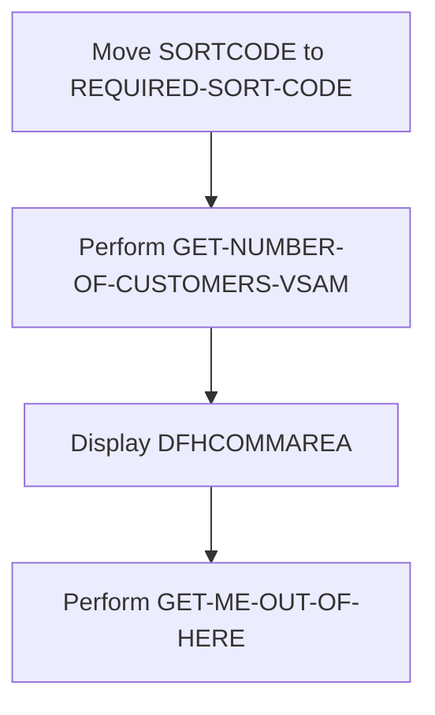
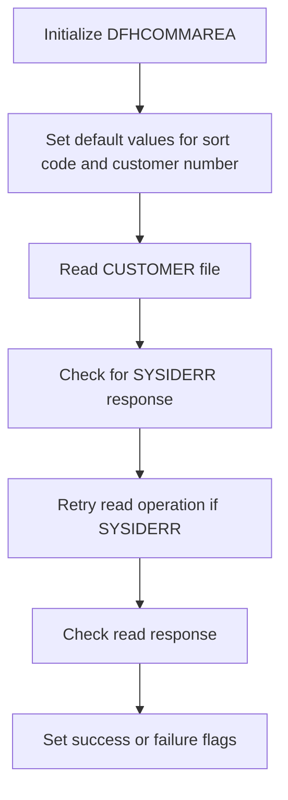
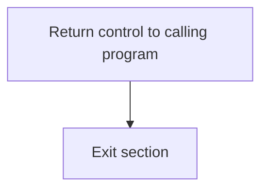

The CUSTCTRL program is responsible for managing customer control operations within the system. This program achieves its role by performing various tasks such as retrieving the number of customers from a VSAM file, displaying output data, and handling system errors. The program ID for this document is CUSTCTRL.

The flow involves moving the sort code to a required field, performing a VSAM operation to get the number of customers, displaying the output data, and finally exiting the section.

## PREMIERE

Lets' zoom into this section of the flow:



<SwmSnippet path="/src/base/cobol_src/CUSTCTRL.cbl" line="134">

---

First, the <SwmToken path="src/base/cobol_src/CUSTCTRL.cbl" pos="134:3:3" line-data="           MOVE SORTCODE TO">`SORTCODE`</SwmToken> is moved to <SwmToken path="src/base/cobol_src/CUSTCTRL.cbl" pos="135:1:5" line-data="              REQUIRED-SORT-CODE.">`REQUIRED-SORT-CODE`</SwmToken> (which is used to store the required sort code for customer data retrieval).

```cobol
           MOVE SORTCODE TO
              REQUIRED-SORT-CODE.
```

---

</SwmSnippet>

<SwmSnippet path="/src/base/cobol_src/CUSTCTRL.cbl" line="137">

---

Next, the program performs the <SwmToken path="src/base/cobol_src/CUSTCTRL.cbl" pos="137:3:11" line-data="           PERFORM GET-NUMBER-OF-CUSTOMERS-VSAM">`GET-NUMBER-OF-CUSTOMERS-VSAM`</SwmToken> operation to retrieve the number of customers from the VSAM file.

```cobol
           PERFORM GET-NUMBER-OF-CUSTOMERS-VSAM
```

---

</SwmSnippet>

<SwmSnippet path="/src/base/cobol_src/CUSTCTRL.cbl" line="140">

---

Then, the program displays the <SwmToken path="src/base/cobol_src/CUSTCTRL.cbl" pos="141:3:3" line-data="      D       DFHCOMMAREA.">`DFHCOMMAREA`</SwmToken> (which contains the output data) to provide feedback on the retrieved customer data.

```cobol
      D    DISPLAY 'OUTPUT DATA IS='
      D       DFHCOMMAREA.
```

---

</SwmSnippet>

<SwmSnippet path="/src/base/cobol_src/CUSTCTRL.cbl" line="144">

---

Finally, the program performs the <SwmToken path="src/base/cobol_src/CUSTCTRL.cbl" pos="144:3:11" line-data="           PERFORM GET-ME-OUT-OF-HERE.">`GET-ME-OUT-OF-HERE`</SwmToken> operation to conclude the section and exit.

```cobol
           PERFORM GET-ME-OUT-OF-HERE.
```

---

</SwmSnippet>

## <SwmToken path="src/base/cobol_src/CUSTCTRL.cbl" pos="137:3:11" line-data="           PERFORM GET-NUMBER-OF-CUSTOMERS-VSAM">`GET-NUMBER-OF-CUSTOMERS-VSAM`</SwmToken>

Lets' zoom into this section of the flow:



<SwmSnippet path="/src/base/cobol_src/CUSTCTRL.cbl" line="155">

---

First, the <SwmToken path="src/base/cobol_src/CUSTCTRL.cbl" pos="137:3:11" line-data="           PERFORM GET-NUMBER-OF-CUSTOMERS-VSAM">`GET-NUMBER-OF-CUSTOMERS-VSAM`</SwmToken> section initializes the <SwmToken path="src/base/cobol_src/CUSTCTRL.cbl" pos="155:3:3" line-data="           INITIALIZE DFHCOMMAREA.">`DFHCOMMAREA`</SwmToken>, which is a common area used for communication between different parts of the program.

```cobol
           INITIALIZE DFHCOMMAREA.
```

---

</SwmSnippet>

<SwmSnippet path="/src/base/cobol_src/CUSTCTRL.cbl" line="158">

---

Moving to the next step, it sets default values for <SwmToken path="src/base/cobol_src/CUSTCTRL.cbl" pos="158:7:11" line-data="           MOVE ZERO TO CUSTOMER-CONTROL-SORTCODE">`CUSTOMER-CONTROL-SORTCODE`</SwmToken> (sort code) to zero and <SwmToken path="src/base/cobol_src/CUSTCTRL.cbl" pos="159:11:15" line-data="           MOVE ALL &#39;9&#39; TO CUSTOMER-CONTROL-NUMBER">`CUSTOMER-CONTROL-NUMBER`</SwmToken> (customer number) to all nines. This prepares the key for reading the VSAM file.

```cobol
           MOVE ZERO TO CUSTOMER-CONTROL-SORTCODE
           MOVE ALL '9' TO CUSTOMER-CONTROL-NUMBER
```

---

</SwmSnippet>

<SwmSnippet path="/src/base/cobol_src/CUSTCTRL.cbl" line="162">

---

Next, the program attempts to read the <SwmToken path="src/base/cobol_src/CUSTCTRL.cbl" pos="163:4:4" line-data="                FILE(&#39;CUSTOMER&#39;)">`CUSTOMER`</SwmToken> file into <SwmToken path="src/base/cobol_src/CUSTCTRL.cbl" pos="164:3:3" line-data="                INTO(DFHCOMMAREA)">`DFHCOMMAREA`</SwmToken> using the <SwmToken path="src/base/cobol_src/CUSTCTRL.cbl" pos="165:3:7" line-data="                RIDFLD(CUSTOMER-CONTROL-KEY)">`CUSTOMER-CONTROL-KEY`</SwmToken> as the key field. The response codes <SwmToken path="src/base/cobol_src/CUSTCTRL.cbl" pos="167:3:7" line-data="                RESP(WS-CICS-RESP)">`WS-CICS-RESP`</SwmToken> and <SwmToken path="src/base/cobol_src/CUSTCTRL.cbl" pos="168:3:7" line-data="                RESP2(WS-CICS-RESP2)">`WS-CICS-RESP2`</SwmToken> are used to capture the status of the read operation.

```cobol
           EXEC CICS READ
                FILE('CUSTOMER')
                INTO(DFHCOMMAREA)
                RIDFLD(CUSTOMER-CONTROL-KEY)
                KEYLENGTH(16)
                RESP(WS-CICS-RESP)
                RESP2(WS-CICS-RESP2)
           END-EXEC.
```

---

</SwmSnippet>

<SwmSnippet path="/src/base/cobol_src/CUSTCTRL.cbl" line="171">

---

Then, the program checks if the response code <SwmToken path="src/base/cobol_src/CUSTCTRL.cbl" pos="183:3:7" line-data="                  RESP(WS-CICS-RESP)">`WS-CICS-RESP`</SwmToken> indicates a <SwmToken path="src/base/cobol_src/CUSTCTRL.cbl" pos="172:5:5" line-data="             perform varying SYSIDERR-RETRY from 1 by 1">`SYSIDERR`</SwmToken> (system ID error). If so, it performs a retry loop up to 100 times, with a 3-second delay between each retry, until a normal response is received or the error is resolved.

```cobol
           if ws-cics-resp = dfhresp(sysiderr)
             perform varying SYSIDERR-RETRY from 1 by 1
             until SYSIDERR-RETRY > 100
             or ws-cics-resp = dfhresp(normal)
             or ws-cics-resp is not equal to dfhresp(sysiderr)
               exec cics delay for seconds(3)
               end-exec
                EXEC CICS READ
                  FILE('CUSTOMER')
                  INTO(DFHCOMMAREA)
                  RIDFLD(CUSTOMER-CONTROL-KEY)
                  KEYLENGTH(16)
                  RESP(WS-CICS-RESP)
                  RESP2(WS-CICS-RESP2)
               END-EXEC
             end-perform
```

---

</SwmSnippet>

<SwmSnippet path="/src/base/cobol_src/CUSTCTRL.cbl" line="192">

---

After the retry loop, the program checks if the read operation was successful by verifying if <SwmToken path="src/base/cobol_src/CUSTCTRL.cbl" pos="192:3:7" line-data="           IF WS-CICS-RESP NOT = DFHRESP(NORMAL)">`WS-CICS-RESP`</SwmToken> equals <SwmToken path="src/base/cobol_src/CUSTCTRL.cbl" pos="192:13:16" line-data="           IF WS-CICS-RESP NOT = DFHRESP(NORMAL)">`DFHRESP(NORMAL)`</SwmToken>. If the read was unsuccessful, it sets the <SwmToken path="src/base/cobol_src/CUSTCTRL.cbl" pos="193:9:15" line-data="              MOVE &#39;N&#39; TO CUSTOMER-CONTROL-SUCCESS-FLAG">`CUSTOMER-CONTROL-SUCCESS-FLAG`</SwmToken> to 'N' and the <SwmToken path="src/base/cobol_src/CUSTCTRL.cbl" pos="194:9:15" line-data="              MOVE &#39;1&#39; TO CUSTOMER-CONTROL-FAIL-CODE">`CUSTOMER-CONTROL-FAIL-CODE`</SwmToken> to '1', indicating a failure.

```cobol
           IF WS-CICS-RESP NOT = DFHRESP(NORMAL)
              MOVE 'N' TO CUSTOMER-CONTROL-SUCCESS-FLAG
              MOVE '1' TO CUSTOMER-CONTROL-FAIL-CODE
           END-IF.
```

---

</SwmSnippet>

## <SwmToken path="src/base/cobol_src/CUSTCTRL.cbl" pos="144:3:11" line-data="           PERFORM GET-ME-OUT-OF-HERE.">`GET-ME-OUT-OF-HERE`</SwmToken>

Lets' zoom into this section of the flow:



<SwmSnippet path="/src/base/cobol_src/CUSTCTRL.cbl" line="209">

---

First, the <SwmToken path="src/base/cobol_src/CUSTCTRL.cbl" pos="209:1:5" line-data="           EXEC CICS RETURN">`EXEC CICS RETURN`</SwmToken> command is executed to return control to the calling program. This step ensures that the current program's execution is paused and control is handed back to the program that invoked it.

```cobol
           EXEC CICS RETURN
           END-EXEC.
```

---

</SwmSnippet>

<SwmSnippet path="/src/base/cobol_src/CUSTCTRL.cbl" line="213">

---

Next, the <SwmToken path="src/base/cobol_src/CUSTCTRL.cbl" pos="213:1:1" line-data="           EXIT.">`EXIT`</SwmToken> statement is executed to exit the current section. This marks the end of the <SwmToken path="src/base/cobol_src/CUSTCTRL.cbl" pos="144:3:11" line-data="           PERFORM GET-ME-OUT-OF-HERE.">`GET-ME-OUT-OF-HERE`</SwmToken> section and ensures that no further code in this section is executed.

```cobol
           EXIT.
```

---

</SwmSnippet>

&nbsp;

*This is an auto-generated document by Swimm 🌊 and has not yet been verified by a human*

<SwmMeta version="3.0.0" repo-id="Z2l0aHViJTNBJTNBY2ljcy1iYW5raW5nLXNhbXBsZS1hcHBsaWNhdGlvbi1jYnNhLUlCTS1EZW1vJTNBJTNBU3dpbW0tRGVtbw==" repo-name="cics-banking-sample-application-cbsa-IBM-Demo"><sup>Powered by [Swimm](/)</sup></SwmMeta>
