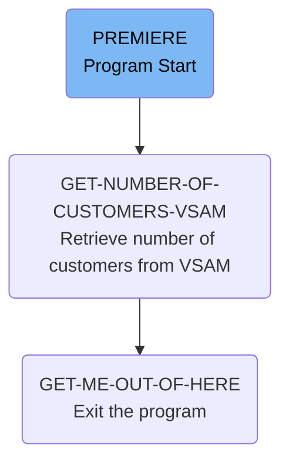

The CUSTCTRL program is responsible for managing customer data within the banking application. It retrieves the number of customers from a VSAM file, displays the retrieved data, and exits the program gracefully. This is achieved through a series of operations including initializing required codes, performing CICS READ operations, and handling system ID errors.

The flow starts with initializing the required sort code, then retrieves the number of customers from the VSAM file, displays the output data, and finally exits the program. The program handles system ID errors by retrying the read operation up to 100 times with a delay.

Lets' zoom into the flow:



<SwmSnippet path="/src/base/cobol_src/CUSTCTRL.cbl" line="132">

---

## Initializing the Required Sort Code

First, the <SwmToken path="src/base/cobol_src/CUSTCTRL.cbl" pos="132:1:1" line-data="       PREMIERE SECTION.">`PREMIERE`</SwmToken> section initializes the <SwmToken path="src/base/cobol_src/CUSTCTRL.cbl" pos="135:1:5" line-data="              REQUIRED-SORT-CODE.">`REQUIRED-SORT-CODE`</SwmToken> by moving the value from <SwmToken path="src/base/cobol_src/CUSTCTRL.cbl" pos="134:3:3" line-data="           MOVE SORTCODE TO">`SORTCODE`</SwmToken>. This sets up the necessary sort code for subsequent operations.

```cobol
       PREMIERE SECTION.
       P010.
           MOVE SORTCODE TO
              REQUIRED-SORT-CODE.
```

---

</SwmSnippet>

<SwmSnippet path="/src/base/cobol_src/CUSTCTRL.cbl" line="137">

---

## Retrieving Number of Customers from VSAM

Next, the program performs the <SwmToken path="src/base/cobol_src/CUSTCTRL.cbl" pos="137:3:11" line-data="           PERFORM GET-NUMBER-OF-CUSTOMERS-VSAM">`GET-NUMBER-OF-CUSTOMERS-VSAM`</SwmToken> section to retrieve the number of customers from the VSAM file. This involves reading the customer data into <SwmToken path="src/base/cobol_src/CUSTCTRL.cbl" pos="141:3:3" line-data="      D       DFHCOMMAREA.">`DFHCOMMAREA`</SwmToken>.

```cobol
           PERFORM GET-NUMBER-OF-CUSTOMERS-VSAM
```

---

</SwmSnippet>

<SwmSnippet path="/src/base/cobol_src/CUSTCTRL.cbl" line="152">

---

### <SwmToken path="src/base/cobol_src/CUSTCTRL.cbl" pos="152:1:9" line-data="       GET-NUMBER-OF-CUSTOMERS-VSAM SECTION.">`GET-NUMBER-OF-CUSTOMERS-VSAM`</SwmToken>

The <SwmToken path="src/base/cobol_src/CUSTCTRL.cbl" pos="152:1:9" line-data="       GET-NUMBER-OF-CUSTOMERS-VSAM SECTION.">`GET-NUMBER-OF-CUSTOMERS-VSAM`</SwmToken> section initializes <SwmToken path="src/base/cobol_src/CUSTCTRL.cbl" pos="155:3:3" line-data="           INITIALIZE DFHCOMMAREA.">`DFHCOMMAREA`</SwmToken>, sets up the control sort code and number, and performs a CICS READ operation to fetch customer data. If a system ID error occurs, it retries the read operation up to 100 times with a delay. If the read is unsuccessful, it sets a failure flag and code.

```cobol
       GET-NUMBER-OF-CUSTOMERS-VSAM SECTION.
       WCV010.

           INITIALIZE DFHCOMMAREA.


           MOVE ZERO TO CUSTOMER-CONTROL-SORTCODE
           MOVE ALL '9' TO CUSTOMER-CONTROL-NUMBER


           EXEC CICS READ
                FILE('CUSTOMER')
                INTO(DFHCOMMAREA)
                RIDFLD(CUSTOMER-CONTROL-KEY)
                KEYLENGTH(16)
                RESP(WS-CICS-RESP)
                RESP2(WS-CICS-RESP2)
           END-EXEC.

           if ws-cics-resp = dfhresp(sysiderr)
             perform varying SYSIDERR-RETRY from 1 by 1
```

---

</SwmSnippet>

<SwmSnippet path="/src/base/cobol_src/CUSTCTRL.cbl" line="140">

---

## Displaying Output Data

Then, the program displays the output data stored in <SwmToken path="src/base/cobol_src/CUSTCTRL.cbl" pos="141:3:3" line-data="      D       DFHCOMMAREA.">`DFHCOMMAREA`</SwmToken>. This provides a way to verify the retrieved customer data.

```cobol
      D    DISPLAY 'OUTPUT DATA IS='
      D       DFHCOMMAREA.
```

---

</SwmSnippet>

<SwmSnippet path="/src/base/cobol_src/CUSTCTRL.cbl" line="144">

---

## Exiting the Program

Finally, the program performs the <SwmToken path="src/base/cobol_src/CUSTCTRL.cbl" pos="144:3:11" line-data="           PERFORM GET-ME-OUT-OF-HERE.">`GET-ME-OUT-OF-HERE`</SwmToken> section to exit the program gracefully.

```cobol
           PERFORM GET-ME-OUT-OF-HERE.
```

---

</SwmSnippet>

<SwmSnippet path="/src/base/cobol_src/CUSTCTRL.cbl" line="206">

---

### <SwmToken path="src/base/cobol_src/CUSTCTRL.cbl" pos="206:1:9" line-data="       GET-ME-OUT-OF-HERE SECTION.">`GET-ME-OUT-OF-HERE`</SwmToken>

The <SwmToken path="src/base/cobol_src/CUSTCTRL.cbl" pos="206:1:9" line-data="       GET-ME-OUT-OF-HERE SECTION.">`GET-ME-OUT-OF-HERE`</SwmToken> section executes a CICS RETURN command to exit the program.

```cobol
       GET-ME-OUT-OF-HERE SECTION.
       GMOFH010.

           EXEC CICS RETURN
           END-EXEC.
```

---

</SwmSnippet>

&nbsp;

*This is an auto-generated document by Swimm 🌊 and has not yet been verified by a human*

<SwmMeta version="3.0.0" repo-id="Z2l0aHViJTNBJTNBY2ljcy1iYW5raW5nLXNhbXBsZS1hcHBsaWNhdGlvbi1jYnNhLUlCTS1EZW1vJTNBJTNBU3dpbW0tRGVtbw==" repo-name="cics-banking-sample-application-cbsa-IBM-Demo"><sup>Powered by [Swimm](/)</sup></SwmMeta>
