The <SwmToken path="src/base/cobol_src/BNK1CCS.cbl" pos="16:6:6" line-data="       PROGRAM-ID. BNK1CCS.">`BNK1CCS`</SwmToken> program handles various user interactions and system processes within the banking application. It ensures smooth operation by managing abnormal terminations, initializing fields, processing user inputs, and handling errors. The program achieves this through a series of checks, operations, and commands that maintain the application's stability and user experience.

The <SwmToken path="src/base/cobol_src/BNK1CCS.cbl" pos="16:6:6" line-data="       PROGRAM-ID. BNK1CCS.">`BNK1CCS`</SwmToken> program is responsible for managing user interactions and system processes in the banking application. It starts by handling any abnormal terminations to ensure the system can recover from unexpected issues. The program then initializes fields with empty values if it's the first time through, ensuring a clean state. It processes user inputs, such as PA key actions and PF3 key presses, to navigate through the application. The program also handles errors by capturing response codes and linking to an abend handler program. Throughout these processes, the <SwmToken path="src/base/cobol_src/BNK1CCS.cbl" pos="16:6:6" line-data="       PROGRAM-ID. BNK1CCS.">`BNK1CCS`</SwmToken> program maintains the application's stability and provides a seamless user experience.

Here is a high level diagram of the program:

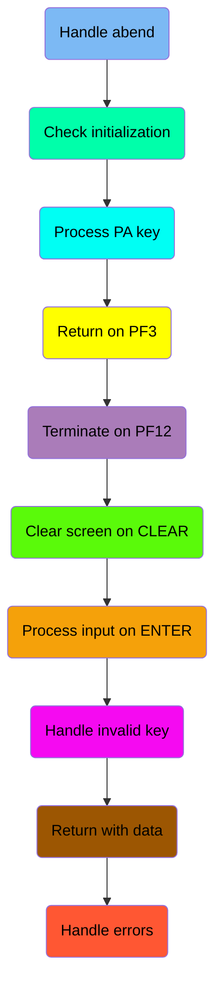

## Handle abend

First, we'll zoom into this section of the flow:

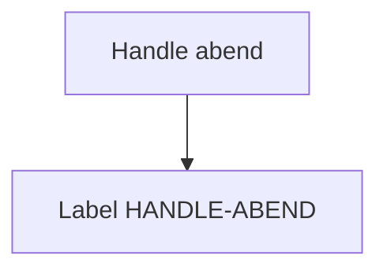

<SwmSnippet path="/src/base/cobol_src/BNK1CCS.cbl" line="158">

---

The <SwmToken path="src/base/cobol_src/BNK1CCS.cbl" pos="158:1:1" line-data="       PREMIERE SECTION.">`PREMIERE`</SwmToken> section is responsible for handling abnormal end (abend) conditions in CICS transactions. It begins by executing the <SwmToken path="src/base/cobol_src/BNK1CCS.cbl" pos="161:5:7" line-data="           EXEC CICS HANDLE ABEND">`HANDLE ABEND`</SwmToken> command, which specifies that control should be transferred to the <SwmToken path="src/base/cobol_src/BNK1CCS.cbl" pos="162:3:5" line-data="              LABEL(HANDLE-ABEND)">`HANDLE-ABEND`</SwmToken> label in the event of an abend. This ensures that any unexpected termination of the transaction is properly managed, allowing for appropriate error handling and recovery procedures to be executed.

```cobol
       PREMIERE SECTION.
       A010.

           EXEC CICS HANDLE ABEND
              LABEL(HANDLE-ABEND)
           END-EXEC.
```

---

</SwmSnippet>

## Check initialization

Now, lets zoom into this section of the flow:

```mermaid
graph TD
  A[Check if first time through] -->|Yes| B[Initialize fields with empty values]
  B --> C[Set SEND-ERASE to TRUE]
  C --> D[Perform STORE-TERM-DEF]
  D --> E[Perform SEND-MAP]
  E --> F[Clear WS-COMM-AREA]
  F --> G[Move STORED-UCTRANS to WS-COMM-TERM]

%% Swimm:
%% graph TD
%%   A[Check if first time through] -->|Yes| B[Initialize fields with empty values]
%%   B --> C[Set <SwmToken path="src/base/cobol_src/BNK1CCS.cbl" pos="181:3:5" line-data="                 SET SEND-ERASE TO TRUE">`SEND-ERASE`</SwmToken> to TRUE]
%%   C --> D[Perform <SwmToken path="src/base/cobol_src/BNK1CCS.cbl" pos="184:3:7" line-data="                 PERFORM STORE-TERM-DEF">`STORE-TERM-DEF`</SwmToken>]
%%   D --> E[Perform <SwmToken path="src/base/cobol_src/BNK1CCS.cbl" pos="186:3:5" line-data="                 PERFORM SEND-MAP">`SEND-MAP`</SwmToken>]
%%   E --> F[Clear <SwmToken path="src/base/cobol_src/BNK1CCS.cbl" pos="188:9:13" line-data="                 MOVE &#39; &#39;            TO WS-COMM-AREA">`WS-COMM-AREA`</SwmToken>]
%%   F --> G[Move <SwmToken path="src/base/cobol_src/BNK1CCS.cbl" pos="189:3:5" line-data="                 MOVE STORED-UCTRANS TO WS-COMM-TERM">`STORED-UCTRANS`</SwmToken> to <SwmToken path="src/base/cobol_src/BNK1CCS.cbl" pos="189:9:13" line-data="                 MOVE STORED-UCTRANS TO WS-COMM-TERM">`WS-COMM-TERM`</SwmToken>]
```

### Initialize fields with empty values

### Check if first time through

First, the code checks if it is the first time through by evaluating if <SwmToken path="src/base/cobol_src/BNK1CCS.cbl" pos="170:3:3" line-data="              WHEN EIBCALEN = ZERO">`EIBCALEN`</SwmToken> (the length of the communication area) is zero.

<SwmSnippet path="/src/base/cobol_src/BNK1CCS.cbl" line="170">

---

If it is the first time through, the code initializes various fields with empty values. This includes setting <SwmToken path="src/base/cobol_src/BNK1CCS.cbl" pos="171:9:9" line-data="                 MOVE LOW-VALUE TO BNK1CCO">`BNK1CCO`</SwmToken> to <SwmToken path="src/base/cobol_src/BNK1CCS.cbl" pos="171:3:5" line-data="                 MOVE LOW-VALUE TO BNK1CCO">`LOW-VALUE`</SwmToken> and clearing fields like <SwmToken path="src/base/cobol_src/BNK1CCS.cbl" pos="172:7:7" line-data="                 MOVE SPACES TO CUSTTITO">`CUSTTITO`</SwmToken>, <SwmToken path="src/base/cobol_src/BNK1CCS.cbl" pos="173:7:7" line-data="                 MOVE SPACES TO CHRISTNO">`CHRISTNO`</SwmToken>, <SwmToken path="src/base/cobol_src/BNK1CCS.cbl" pos="174:7:7" line-data="                 MOVE SPACES TO CUSTINSO">`CUSTINSO`</SwmToken>, <SwmToken path="src/base/cobol_src/BNK1CCS.cbl" pos="175:7:7" line-data="                 MOVE SPACES TO CUSTSNO">`CUSTSNO`</SwmToken>, <SwmToken path="src/base/cobol_src/BNK1CCS.cbl" pos="176:7:7" line-data="                 MOVE SPACES TO CUSTAD1O">`CUSTAD1O`</SwmToken>, <SwmToken path="src/base/cobol_src/BNK1CCS.cbl" pos="177:7:7" line-data="                 MOVE SPACES TO CUSTAD2O">`CUSTAD2O`</SwmToken>, and <SwmToken path="src/base/cobol_src/BNK1CCS.cbl" pos="178:7:7" line-data="                 MOVE SPACES TO CUSTAD3O">`CUSTAD3O`</SwmToken>.

```cobol
              WHEN EIBCALEN = ZERO
                 MOVE LOW-VALUE TO BNK1CCO
                 MOVE SPACES TO CUSTTITO
                 MOVE SPACES TO CHRISTNO
                 MOVE SPACES TO CUSTINSO
                 MOVE SPACES TO CUSTSNO
                 MOVE SPACES TO CUSTAD1O
                 MOVE SPACES TO CUSTAD2O
                 MOVE SPACES TO CUSTAD3O
```

---

</SwmSnippet>

<SwmSnippet path="/src/base/cobol_src/BNK1CCS.cbl" line="181">

---

### Set <SwmToken path="src/base/cobol_src/BNK1CCS.cbl" pos="181:3:5" line-data="                 SET SEND-ERASE TO TRUE">`SEND-ERASE`</SwmToken> to TRUE

Next, the code sets <SwmToken path="src/base/cobol_src/BNK1CCS.cbl" pos="181:3:5" line-data="                 SET SEND-ERASE TO TRUE">`SEND-ERASE`</SwmToken> to `TRUE`, indicating that the map should be sent with erased (empty) data fields.

```cobol
                 SET SEND-ERASE TO TRUE
```

---

</SwmSnippet>

<SwmSnippet path="/src/base/cobol_src/BNK1CCS.cbl" line="184">

---

### Perform <SwmToken path="src/base/cobol_src/BNK1CCS.cbl" pos="184:3:7" line-data="                 PERFORM STORE-TERM-DEF">`STORE-TERM-DEF`</SwmToken>

Then, the code performs the <SwmToken path="src/base/cobol_src/BNK1CCS.cbl" pos="184:3:7" line-data="                 PERFORM STORE-TERM-DEF">`STORE-TERM-DEF`</SwmToken> operation, which stores terminal definitions.

```cobol
                 PERFORM STORE-TERM-DEF
```

---

</SwmSnippet>

<SwmSnippet path="/src/base/cobol_src/BNK1CCS.cbl" line="186">

---

### Perform <SwmToken path="src/base/cobol_src/BNK1CCS.cbl" pos="186:3:5" line-data="                 PERFORM SEND-MAP">`SEND-MAP`</SwmToken>

Following that, the code performs the <SwmToken path="src/base/cobol_src/BNK1CCS.cbl" pos="186:3:5" line-data="                 PERFORM SEND-MAP">`SEND-MAP`</SwmToken> operation to send the map to the terminal.

```cobol
                 PERFORM SEND-MAP
```

---

</SwmSnippet>

<SwmSnippet path="/src/base/cobol_src/BNK1CCS.cbl" line="188">

---

### Clear <SwmToken path="src/base/cobol_src/BNK1CCS.cbl" pos="188:9:13" line-data="                 MOVE &#39; &#39;            TO WS-COMM-AREA">`WS-COMM-AREA`</SwmToken> and Move <SwmToken path="src/base/cobol_src/BNK1CCS.cbl" pos="189:3:5" line-data="                 MOVE STORED-UCTRANS TO WS-COMM-TERM">`STORED-UCTRANS`</SwmToken>

Finally, the code clears <SwmToken path="src/base/cobol_src/BNK1CCS.cbl" pos="188:9:13" line-data="                 MOVE &#39; &#39;            TO WS-COMM-AREA">`WS-COMM-AREA`</SwmToken> and moves <SwmToken path="src/base/cobol_src/BNK1CCS.cbl" pos="189:3:5" line-data="                 MOVE STORED-UCTRANS TO WS-COMM-TERM">`STORED-UCTRANS`</SwmToken> to <SwmToken path="src/base/cobol_src/BNK1CCS.cbl" pos="189:9:13" line-data="                 MOVE STORED-UCTRANS TO WS-COMM-TERM">`WS-COMM-TERM`</SwmToken> to complete the initialization process.

```cobol
                 MOVE ' '            TO WS-COMM-AREA
                 MOVE STORED-UCTRANS TO WS-COMM-TERM

```

---

</SwmSnippet>

## Process PA key

Now, lets zoom into this section of the flow:

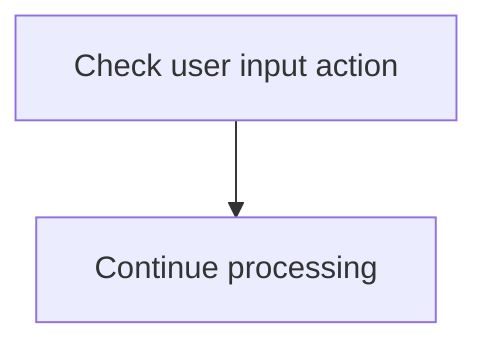

<SwmSnippet path="/src/base/cobol_src/BNK1CCS.cbl" line="194">

---

The code checks if the user input action matches any of the predefined actions <SwmToken path="src/base/cobol_src/BNK1CCS.cbl" pos="194:7:7" line-data="              WHEN EIBAID = DFHPA1 OR DFHPA2 OR DFHPA3">`DFHPA1`</SwmToken>, <SwmToken path="src/base/cobol_src/BNK1CCS.cbl" pos="194:11:11" line-data="              WHEN EIBAID = DFHPA1 OR DFHPA2 OR DFHPA3">`DFHPA2`</SwmToken>, or <SwmToken path="src/base/cobol_src/BNK1CCS.cbl" pos="194:15:15" line-data="              WHEN EIBAID = DFHPA1 OR DFHPA2 OR DFHPA3">`DFHPA3`</SwmToken>. These actions correspond to specific user interactions within the application. If the user input matches any of these actions, the program continues processing without interruption.

```cobol
              WHEN EIBAID = DFHPA1 OR DFHPA2 OR DFHPA3
                 CONTINUE
```

---

</SwmSnippet>

## Return on PF3

Now, lets zoom into this section of the flow:

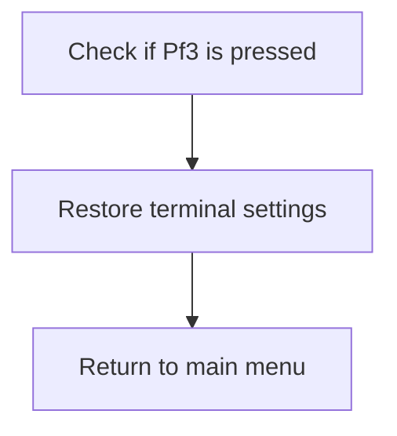

<SwmSnippet path="/src/base/cobol_src/BNK1CCS.cbl" line="200">

---

### Checking if <SwmToken path="src/base/cobol_src/BNK1CCS.cbl" pos="198:5:5" line-data="      *       When Pf3 is pressed, return to the main menu">`Pf3`</SwmToken> is pressed

First, the code checks if the <SwmToken path="src/base/cobol_src/BNK1CCS.cbl" pos="200:3:3" line-data="              WHEN EIBAID = DFHPF3">`EIBAID`</SwmToken> (which holds the attention identifier) is equal to <SwmToken path="src/base/cobol_src/BNK1CCS.cbl" pos="200:7:7" line-data="              WHEN EIBAID = DFHPF3">`DFHPF3`</SwmToken> (the identifier for the <SwmToken path="src/base/cobol_src/BNK1CCS.cbl" pos="198:5:5" line-data="      *       When Pf3 is pressed, return to the main menu">`Pf3`</SwmToken> key). This ensures that the following actions are only taken when the <SwmToken path="src/base/cobol_src/BNK1CCS.cbl" pos="198:5:5" line-data="      *       When Pf3 is pressed, return to the main menu">`Pf3`</SwmToken> key is pressed.

```cobol
              WHEN EIBAID = DFHPF3
```

---

</SwmSnippet>

<SwmSnippet path="/src/base/cobol_src/BNK1CCS.cbl" line="206">

---

### Restoring terminal settings

Moving to the next step, the code performs the <SwmToken path="src/base/cobol_src/BNK1CCS.cbl" pos="206:3:7" line-data="                 PERFORM RESTORE-TERM-DEF">`RESTORE-TERM-DEF`</SwmToken> operation. This step resets the terminal's <SwmToken path="src/base/cobol_src/BNK1CCS.cbl" pos="223:9:9" line-data="      *          Set the terminal UCTRAN back to">`UCTRAN`</SwmToken> (uppercase translation) setting back to its initial state, ensuring that the terminal is in the correct configuration for the main menu.

```cobol
                 PERFORM RESTORE-TERM-DEF
```

---

</SwmSnippet>

<SwmSnippet path="/src/base/cobol_src/BNK1CCS.cbl" line="208">

---

### Returning to the main menu

Finally, the code executes the <SwmToken path="src/base/cobol_src/BNK1CCS.cbl" pos="208:3:5" line-data="                 EXEC CICS RETURN">`CICS RETURN`</SwmToken> command with the <SwmToken path="src/base/cobol_src/BNK1CCS.cbl" pos="209:1:1" line-data="                    TRANSID(&#39;OMEN&#39;)">`TRANSID`</SwmToken> set to 'OMEN'. This command immediately returns control to the main menu transaction, allowing the user to interact with the main menu options.

```cobol
                 EXEC CICS RETURN
                    TRANSID('OMEN')
                    IMMEDIATE
                    RESP(WS-CICS-RESP)
                    RESP2(WS-CICS-RESP2)
                 END-EXEC
```

---

</SwmSnippet>

## Terminate on PF12

Now, lets zoom into this section of the flow:

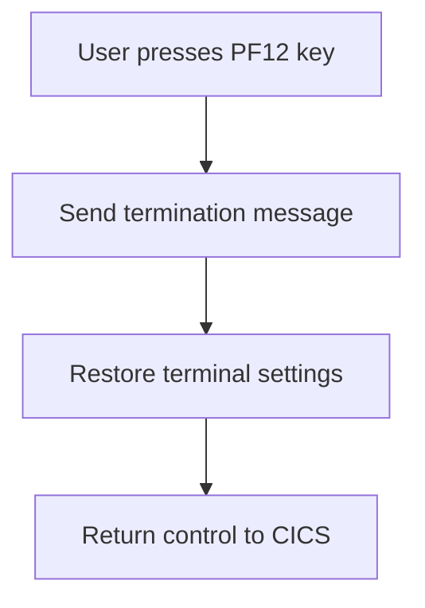

### Sending termination message

### User presses PF12 key

First, the system detects when the user presses the PF12 key, which is typically used to signal a termination request.

<SwmSnippet path="/src/base/cobol_src/BNK1CCS.cbl" line="219">

---

Next, the system performs the action to send a termination message to the user, informing them that their session is ending.

```cobol
              WHEN EIBAID = DFHPF12
                 PERFORM SEND-TERMINATION-MSG
```

---

</SwmSnippet>

<SwmSnippet path="/src/base/cobol_src/BNK1CCS.cbl" line="223">

---

### Restoring terminal settings

Then, the system restores the terminal settings to their default state, ensuring that the terminal is ready for the next user.

```cobol
      *          Set the terminal UCTRAN back to
      *          its starting position
      *
                 PERFORM RESTORE-TERM-DEF
```

---

</SwmSnippet>

<SwmSnippet path="/src/base/cobol_src/BNK1CCS.cbl" line="228">

---

### Returning control to CICS

Finally, control is returned to CICS, completing the termination process and allowing the system to handle other tasks.

```cobol
                 EXEC CICS
                    RETURN
                 END-EXEC
```

---

</SwmSnippet>

## Interim Summary

So far, we saw how the system handles abnormal end (abend) conditions, initializes fields with empty values, processes PA key actions, and returns to the main menu when the PF3 key is pressed. We also covered how the system terminates the session when the PF12 key is pressed. Now, we will focus on how the system clears the screen when a clear screen request is detected.

## Clear screen on CLEAR

Now, lets zoom into this section of the flow:

```mermaid
graph TD
  A[Check if EIBAID equals DFHCLEAR] --> B[Send initial map BNK1CCM to terminal] --> C[Restore terminal settings] --> D[Return to transaction OCCS with communication area]

%% Swimm:
%% graph TD
%%   A[Check if EIBAID equals DFHCLEAR] --> B[Send initial map <SwmToken path="src/base/cobol_src/BNK1CCS.cbl" pos="236:10:10" line-data="                 EXEC CICS SEND MAP(&#39;BNK1CCM&#39;)">`BNK1CCM`</SwmToken> to terminal] --> C[Restore terminal settings] --> D[Return to transaction OCCS with communication area]
```

First, we check if <SwmToken path="src/base/cobol_src/BNK1CCS.cbl" pos="194:3:3" line-data="              WHEN EIBAID = DFHPA1 OR DFHPA2 OR DFHPA3">`EIBAID`</SwmToken> (which holds the attention identifier) equals <SwmToken path="src/base/cobol_src/BNK1CCS.cbl" pos="235:7:7" line-data="              WHEN EIBAID = DFHCLEAR">`DFHCLEAR`</SwmToken> (which indicates a clear screen request).

<SwmSnippet path="/src/base/cobol_src/BNK1CCS.cbl" line="235">

---

Next, if the condition is met, we send the initial map <SwmToken path="src/base/cobol_src/BNK1CCS.cbl" pos="236:10:10" line-data="                 EXEC CICS SEND MAP(&#39;BNK1CCM&#39;)">`BNK1CCM`</SwmToken> to the terminal. This map is sent with the <SwmToken path="src/base/cobol_src/BNK1CCS.cbl" pos="237:1:1" line-data="                           MAPONLY">`MAPONLY`</SwmToken> option to display the map without any data, <SwmToken path="src/base/cobol_src/BNK1CCS.cbl" pos="238:1:1" line-data="                           ERASE">`ERASE`</SwmToken> to clear the screen, and <SwmToken path="src/base/cobol_src/BNK1CCS.cbl" pos="239:1:1" line-data="                           FREEKB">`FREEKB`</SwmToken> to unlock the keyboard.

```cobol
              WHEN EIBAID = DFHCLEAR
                 EXEC CICS SEND MAP('BNK1CCM')
                           MAPONLY
                           ERASE
                           FREEKB
                 END-EXEC
```

---

</SwmSnippet>

<SwmSnippet path="/src/base/cobol_src/BNK1CCS.cbl" line="246">

---

Then, we restore the terminal settings to their default state by performing the <SwmToken path="src/base/cobol_src/BNK1CCS.cbl" pos="246:3:7" line-data="                 PERFORM RESTORE-TERM-DEF">`RESTORE-TERM-DEF`</SwmToken> routine. Finally, we return to the transaction <SwmToken path="src/base/cobol_src/BNK1CCS.cbl" pos="249:10:10" line-data="                 EXEC CICS RETURN TRANSID(&#39;OCCS&#39;)">`OCCS`</SwmToken> with the communication area <SwmToken path="src/base/cobol_src/BNK1CCS.cbl" pos="250:3:7" line-data="                           COMMAREA(WS-COMM-AREA)">`WS-COMM-AREA`</SwmToken>.

```cobol
                 PERFORM RESTORE-TERM-DEF


                 EXEC CICS RETURN TRANSID('OCCS')
                           COMMAREA(WS-COMM-AREA)
                 END-EXEC
```

---

</SwmSnippet>

## Process input on ENTER

Now, lets zoom into this section of the flow:

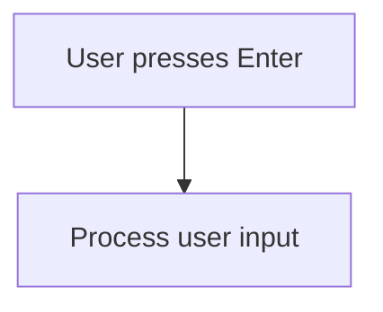

<SwmSnippet path="/src/base/cobol_src/BNK1CCS.cbl" line="256">

---

When the user presses the Enter key, the system triggers the <SwmToken path="src/base/cobol_src/BNK1CCS.cbl" pos="257:3:5" line-data="                 PERFORM PROCESS-MAP">`PROCESS-MAP`</SwmToken> routine to handle the user input. This ensures that any actions associated with the Enter key are executed, such as submitting a form or navigating to the next screen.

```cobol
              WHEN EIBAID = DFHENTER
                 PERFORM PROCESS-MAP

```

---

</SwmSnippet>

## Handle invalid key

Now, lets zoom into this section of the flow:

```mermaid
graph TD
  A[Move DFHCOMMAREA to WS-COMM-AREA] --> B[Move LOW-VALUES to BNK1CCO] --> C[Move SPACES to MESSAGEO] --> D[Move 'Invalid key pressed.' to MESSAGEO] --> E[Set SEND-DATAONLY-ALARM to TRUE] --> F[Perform SEND-MAP]

%% Swimm:
%% graph TD
%%   A[Move DFHCOMMAREA to <SwmToken path="src/base/cobol_src/BNK1CCS.cbl" pos="188:9:13" line-data="                 MOVE &#39; &#39;            TO WS-COMM-AREA">`WS-COMM-AREA`</SwmToken>] --> B[Move <SwmToken path="src/base/cobol_src/BNK1CCS.cbl" pos="264:3:5" line-data="                 MOVE LOW-VALUES TO BNK1CCO">`LOW-VALUES`</SwmToken> to <SwmToken path="src/base/cobol_src/BNK1CCS.cbl" pos="171:9:9" line-data="                 MOVE LOW-VALUE TO BNK1CCO">`BNK1CCO`</SwmToken>] --> C[Move SPACES to MESSAGEO] --> D[Move 'Invalid key pressed.' to MESSAGEO] --> E[Set <SwmToken path="src/base/cobol_src/BNK1CCS.cbl" pos="267:3:7" line-data="                 SET SEND-DATAONLY-ALARM TO TRUE">`SEND-DATAONLY-ALARM`</SwmToken> to TRUE] --> F[Perform <SwmToken path="src/base/cobol_src/BNK1CCS.cbl" pos="186:3:5" line-data="                 PERFORM SEND-MAP">`SEND-MAP`</SwmToken>]
```

<SwmSnippet path="/src/base/cobol_src/BNK1CCS.cbl" line="262">

---

When an invalid key is pressed by the user, the system first moves <SwmToken path="src/base/cobol_src/BNK1CCS.cbl" pos="263:3:3" line-data="                 MOVE DFHCOMMAREA TO WS-COMM-AREA">`DFHCOMMAREA`</SwmToken> to <SwmToken path="src/base/cobol_src/BNK1CCS.cbl" pos="263:7:11" line-data="                 MOVE DFHCOMMAREA TO WS-COMM-AREA">`WS-COMM-AREA`</SwmToken> to ensure that the working storage communication area is updated with the current state. Next, it moves <SwmToken path="src/base/cobol_src/BNK1CCS.cbl" pos="264:3:5" line-data="                 MOVE LOW-VALUES TO BNK1CCO">`LOW-VALUES`</SwmToken> to <SwmToken path="src/base/cobol_src/BNK1CCS.cbl" pos="264:9:9" line-data="                 MOVE LOW-VALUES TO BNK1CCO">`BNK1CCO`</SwmToken>, which likely resets or clears the <SwmToken path="src/base/cobol_src/BNK1CCS.cbl" pos="264:9:9" line-data="                 MOVE LOW-VALUES TO BNK1CCO">`BNK1CCO`</SwmToken> field. Following this, it moves <SwmToken path="src/base/cobol_src/BNK1CCS.cbl" pos="265:3:3" line-data="                 MOVE SPACES TO MESSAGEO">`SPACES`</SwmToken> to <SwmToken path="src/base/cobol_src/BNK1CCS.cbl" pos="265:7:7" line-data="                 MOVE SPACES TO MESSAGEO">`MESSAGEO`</SwmToken>, effectively clearing any previous messages. Then, it sets the message <SwmToken path="src/base/cobol_src/BNK1CCS.cbl" pos="266:4:9" line-data="                 MOVE &#39;Invalid key pressed.&#39; TO MESSAGEO">`Invalid key pressed.`</SwmToken> to <SwmToken path="src/base/cobol_src/BNK1CCS.cbl" pos="265:7:7" line-data="                 MOVE SPACES TO MESSAGEO">`MESSAGEO`</SwmToken> to inform the user of the invalid action. The <SwmToken path="src/base/cobol_src/BNK1CCS.cbl" pos="267:3:7" line-data="                 SET SEND-DATAONLY-ALARM TO TRUE">`SEND-DATAONLY-ALARM`</SwmToken> is set to `TRUE` to trigger an alarm, alerting the user to the error. Finally, the <SwmToken path="src/base/cobol_src/BNK1CCS.cbl" pos="268:3:5" line-data="                 PERFORM SEND-MAP">`SEND-MAP`</SwmToken> operation is performed to update the user interface with the new message and state.

```cobol
              WHEN OTHER
                 MOVE DFHCOMMAREA TO WS-COMM-AREA
                 MOVE LOW-VALUES TO BNK1CCO
                 MOVE SPACES TO MESSAGEO
                 MOVE 'Invalid key pressed.' TO MESSAGEO
                 SET SEND-DATAONLY-ALARM TO TRUE
                 PERFORM SEND-MAP

```

---

</SwmSnippet>

## Return with data

This is the next section of the flow.

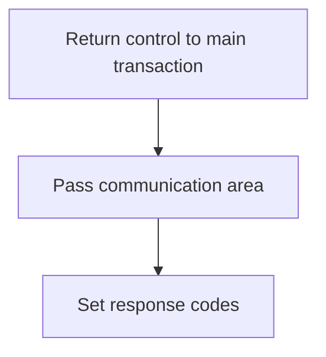

<SwmSnippet path="/src/base/cobol_src/BNK1CCS.cbl" line="276">

---

### Returning control to the main transaction

The <SwmToken path="src/base/cobol_src/BNK1CCS.cbl" pos="158:1:1" line-data="       PREMIERE SECTION.">`PREMIERE`</SwmToken> function is responsible for returning control to the main transaction identified by the transaction ID 'OCCS'. This is achieved by using the <SwmToken path="src/base/cobol_src/BNK1CCS.cbl" pos="208:1:5" line-data="                 EXEC CICS RETURN">`EXEC CICS RETURN`</SwmToken> command, which ensures that the control is passed back to the main transaction. The communication area <SwmToken path="src/base/cobol_src/BNK1CCS.cbl" pos="278:3:7" line-data="              COMMAREA(WS-COMM-AREA)">`WS-COMM-AREA`</SwmToken> is passed along with a specified length of 248 bytes. Additionally, response codes <SwmToken path="src/base/cobol_src/BNK1CCS.cbl" pos="280:3:7" line-data="              RESP(WS-CICS-RESP)">`WS-CICS-RESP`</SwmToken> and <SwmToken path="src/base/cobol_src/BNK1CCS.cbl" pos="281:3:7" line-data="              RESP2(WS-CICS-RESP2)">`WS-CICS-RESP2`</SwmToken> are set to capture any response information from the CICS command.

```cobol
           EXEC CICS
              RETURN TRANSID('OCCS')
              COMMAREA(WS-COMM-AREA)
              LENGTH(248)
              RESP(WS-CICS-RESP)
              RESP2(WS-CICS-RESP2)
           END-EXEC.
```

---

</SwmSnippet>

## Handle errors

Now, lets zoom into this section of the flow:

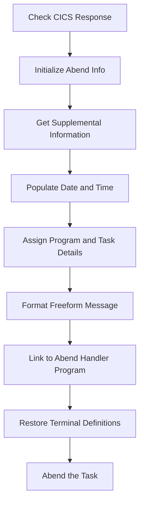

First, the function checks if the CICS response is not normal by evaluating <SwmToken path="src/base/cobol_src/BNK1CCS.cbl" pos="211:3:7" line-data="                    RESP(WS-CICS-RESP)">`WS-CICS-RESP`</SwmToken>.

<SwmSnippet path="/src/base/cobol_src/BNK1CCS.cbl" line="291">

---

If the response is not normal, it initializes the abend information record to prepare for capturing relevant details.

```cobol
              INITIALIZE ABNDINFO-REC
```

---

</SwmSnippet>

<SwmSnippet path="/src/base/cobol_src/BNK1CCS.cbl" line="292">

---

Next, it captures the response codes <SwmToken path="src/base/cobol_src/BNK1CCS.cbl" pos="292:3:3" line-data="              MOVE EIBRESP    TO ABND-RESPCODE">`EIBRESP`</SwmToken> and <SwmToken path="src/base/cobol_src/BNK1CCS.cbl" pos="293:3:3" line-data="              MOVE EIBRESP2   TO ABND-RESP2CODE">`EIBRESP2`</SwmToken> to store in the abend information record.

```cobol
              MOVE EIBRESP    TO ABND-RESPCODE
              MOVE EIBRESP2   TO ABND-RESP2CODE
```

---

</SwmSnippet>

<SwmSnippet path="/src/base/cobol_src/BNK1CCS.cbl" line="297">

---

Moving to gathering supplemental information, it assigns the application ID and task number to the abend record.

```cobol
              EXEC CICS ASSIGN APPLID(ABND-APPLID)
              END-EXEC

              MOVE EIBTASKN   TO ABND-TASKNO-KEY
              MOVE EIBTRNID   TO ABND-TRANID
```

---

</SwmSnippet>

<SwmSnippet path="/src/base/cobol_src/BNK1CCS.cbl" line="303">

---

Then, it performs a routine to populate the current date and time, which are also stored in the abend record.

```cobol
              PERFORM POPULATE-TIME-DATE

              MOVE WS-ORIG-DATE TO ABND-DATE
              STRING WS-TIME-NOW-GRP-HH DELIMITED BY SIZE,
                    ':' DELIMITED BY SIZE,
                     WS-TIME-NOW-GRP-MM DELIMITED BY SIZE,
                     ':' DELIMITED BY SIZE,
                     WS-TIME-NOW-GRP-MM DELIMITED BY SIZE
                     INTO ABND-TIME
```

---

</SwmSnippet>

<SwmSnippet path="/src/base/cobol_src/BNK1CCS.cbl" line="317">

---

The program and task details are further assigned to the abend record for comprehensive tracking.

```cobol
              EXEC CICS ASSIGN PROGRAM(ABND-PROGRAM)
              END-EXEC
```

---

</SwmSnippet>

<SwmSnippet path="/src/base/cobol_src/BNK1CCS.cbl" line="322">

---

Next, it formats a freeform message that includes the response codes and a descriptive error message.

```cobol
              STRING 'A010 -RETURN TRANSID(OCCS) FAIL'
                    DELIMITED BY SIZE,
                    'EIBRESP=' DELIMITED BY SIZE,
                    ABND-RESPCODE DELIMITED BY SIZE,
                    ' RESP2=' DELIMITED BY SIZE,
                    ABND-RESP2CODE DELIMITED BY SIZE
                    INTO ABND-FREEFORM
```

---

</SwmSnippet>

<SwmSnippet path="/src/base/cobol_src/BNK1CCS.cbl" line="331">

---

The function then links to the abend handler program, passing the abend information record for processing.

More about ABNDPROC: <SwmLink doc-title="Handling Abnormal Terminations (ABNDPROC)">[Handling Abnormal Terminations (ABNDPROC)](/.swm/handling-abnormal-terminations-abndproc.q6kxvboz.sw.md)</SwmLink>

```cobol
              EXEC CICS LINK PROGRAM(WS-ABEND-PGM)
                        COMMAREA(ABNDINFO-REC)
              END-EXEC
```

---

</SwmSnippet>

<SwmSnippet path="/src/base/cobol_src/BNK1CCS.cbl" line="341">

---

Finally, it restores terminal definitions and performs the abend task to handle the abnormal end scenario.

```cobol
              PERFORM RESTORE-TERM-DEF
              PERFORM ABEND-THIS-TASK
```

---

</SwmSnippet>

&nbsp;

*This is an auto-generated document by Swimm 🌊 and has not yet been verified by a human*

<SwmMeta version="3.0.0" repo-id="Z2l0aHViJTNBJTNBY2ljcy1iYW5raW5nLXNhbXBsZS1hcHBsaWNhdGlvbi1jYnNhLUlCTS1EZW1vJTNBJTNBU3dpbW0tRGVtbw==" repo-name="cics-banking-sample-application-cbsa-IBM-Demo"><sup>Powered by [Swimm](/)</sup></SwmMeta>
