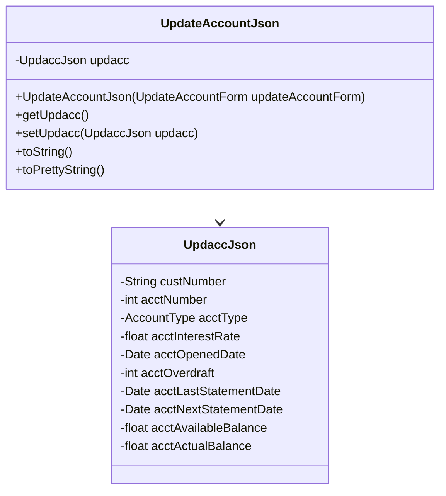

# Overview of <SwmToken path="src/Z-OS-Connect-Customer-Services-Interface/src/main/java/com/ibm/cics/cip/bank/springboot/customerservices/jsonclasses/updateaccount/UpdateAccountJson.java" pos="23:3:3" line-data="	public UpdateAccountJson(UpdateAccountForm updateAccountForm)">`UpdateAccountJson`</SwmToken>

The <SwmToken path="src/Z-OS-Connect-Customer-Services-Interface/src/main/java/com/ibm/cics/cip/bank/springboot/customerservices/jsonclasses/updateaccount/UpdateAccountJson.java" pos="23:3:3" line-data="	public UpdateAccountJson(UpdateAccountForm updateAccountForm)">`UpdateAccountJson`</SwmToken> class represents the JSON structure for updating account information. It contains a field <SwmToken path="src/Z-OS-Connect-Customer-Services-Interface/src/main/java/com/ibm/cics/cip/bank/springboot/customerservices/jsonclasses/updateaccount/UpdateAccountJson.java" pos="25:1:1" line-data="		updacc = new UpdaccJson(updateAccountForm.getCustNumber(),">`updacc`</SwmToken>, which is an instance of <SwmToken path="src/Z-OS-Connect-Customer-Services-Interface/src/main/java/com/ibm/cics/cip/bank/springboot/customerservices/jsonclasses/updateaccount/UpdateAccountJson.java" pos="25:7:7" line-data="		updacc = new UpdaccJson(updateAccountForm.getCustNumber(),">`UpdaccJson`</SwmToken>, representing the account details to be updated. This class includes a constructor that initializes the <SwmToken path="src/Z-OS-Connect-Customer-Services-Interface/src/main/java/com/ibm/cics/cip/bank/springboot/customerservices/jsonclasses/updateaccount/UpdateAccountJson.java" pos="25:1:1" line-data="		updacc = new UpdaccJson(updateAccountForm.getCustNumber(),">`updacc`</SwmToken> field using data from an <SwmToken path="src/Z-OS-Connect-Customer-Services-Interface/src/main/java/com/ibm/cics/cip/bank/springboot/customerservices/jsonclasses/updateaccount/UpdateAccountJson.java" pos="23:5:5" line-data="	public UpdateAccountJson(UpdateAccountForm updateAccountForm)">`UpdateAccountForm`</SwmToken> object. Additionally, it provides getter and setter methods for the <SwmToken path="src/Z-OS-Connect-Customer-Services-Interface/src/main/java/com/ibm/cics/cip/bank/springboot/customerservices/jsonclasses/updateaccount/UpdateAccountJson.java" pos="25:1:1" line-data="		updacc = new UpdaccJson(updateAccountForm.getCustNumber(),">`updacc`</SwmToken> field, and methods to return string representations of the object.

<SwmSnippet path="/src/Z-OS-Connect-Customer-Services-Interface/src/main/java/com/ibm/cics/cip/bank/springboot/customerservices/jsonclasses/updateaccount/UpdateAccountJson.java" line="23">

---

## Constructor

The <SwmToken path="src/Z-OS-Connect-Customer-Services-Interface/src/main/java/com/ibm/cics/cip/bank/springboot/customerservices/jsonclasses/updateaccount/UpdateAccountJson.java" pos="23:3:3" line-data="	public UpdateAccountJson(UpdateAccountForm updateAccountForm)">`UpdateAccountJson`</SwmToken> constructor initializes the <SwmToken path="src/Z-OS-Connect-Customer-Services-Interface/src/main/java/com/ibm/cics/cip/bank/springboot/customerservices/jsonclasses/updateaccount/UpdateAccountJson.java" pos="25:1:1" line-data="		updacc = new UpdaccJson(updateAccountForm.getCustNumber(),">`updacc`</SwmToken> field using data from an <SwmToken path="src/Z-OS-Connect-Customer-Services-Interface/src/main/java/com/ibm/cics/cip/bank/springboot/customerservices/jsonclasses/updateaccount/UpdateAccountJson.java" pos="23:5:5" line-data="	public UpdateAccountJson(UpdateAccountForm updateAccountForm)">`UpdateAccountForm`</SwmToken> object. This ensures that the account details are correctly populated when an instance of <SwmToken path="src/Z-OS-Connect-Customer-Services-Interface/src/main/java/com/ibm/cics/cip/bank/springboot/customerservices/jsonclasses/updateaccount/UpdateAccountJson.java" pos="23:3:3" line-data="	public UpdateAccountJson(UpdateAccountForm updateAccountForm)">`UpdateAccountJson`</SwmToken> is created.

```java
	public UpdateAccountJson(UpdateAccountForm updateAccountForm)
	{
		updacc = new UpdaccJson(updateAccountForm.getCustNumber(),
				updateAccountForm.getAcctNumber(),
				updateAccountForm.getAcctType(),
				updateAccountForm.getAcctInterestRateFloat(),
				updateAccountForm.getAcctOpenedDate(),
				updateAccountForm.getAcctOverdraftInt(),
				updateAccountForm.getAcctLastStatementDate(),
				updateAccountForm.getAcctNextStatementDate(),
				updateAccountForm.getAcctAvailableBalance(),
				updateAccountForm.getAcctActualBalance());
	}
```

---

</SwmSnippet>

## Main Functions

The <SwmToken path="src/Z-OS-Connect-Customer-Services-Interface/src/main/java/com/ibm/cics/cip/bank/springboot/customerservices/jsonclasses/updateaccount/UpdateAccountJson.java" pos="23:3:3" line-data="	public UpdateAccountJson(UpdateAccountForm updateAccountForm)">`UpdateAccountJson`</SwmToken> class includes several main functions that retrieve various account details. These functions are essential for accessing the specific attributes of the account that need to be updated.

<SwmSnippet path="/src/Z-OS-Connect-Customer-Services-Interface/src/main/java/com/ibm/cics/cip/bank/springboot/customerservices/jsonclasses/updateaccount/UpdateAccountForm.java" line="44">

---

### <SwmToken path="src/Z-OS-Connect-Customer-Services-Interface/src/main/java/com/ibm/cics/cip/bank/springboot/customerservices/jsonclasses/updateaccount/UpdateAccountForm.java" pos="44:5:5" line-data="	public String getCustNumber()">`getCustNumber`</SwmToken>

The <SwmToken path="src/Z-OS-Connect-Customer-Services-Interface/src/main/java/com/ibm/cics/cip/bank/springboot/customerservices/jsonclasses/updateaccount/UpdateAccountForm.java" pos="44:5:5" line-data="	public String getCustNumber()">`getCustNumber`</SwmToken> function retrieves the customer number associated with the account.

```java
	public String getCustNumber()
	{
		return custNumber;
	}
```

---

</SwmSnippet>

<SwmSnippet path="/src/Z-OS-Connect-Customer-Services-Interface/src/main/java/com/ibm/cics/cip/bank/springboot/customerservices/jsonclasses/updateaccount/UpdateAccountForm.java" line="56">

---

### <SwmToken path="src/Z-OS-Connect-Customer-Services-Interface/src/main/java/com/ibm/cics/cip/bank/springboot/customerservices/jsonclasses/updateaccount/UpdateAccountForm.java" pos="56:5:5" line-data="	public int getAcctNumber()">`getAcctNumber`</SwmToken>

The <SwmToken path="src/Z-OS-Connect-Customer-Services-Interface/src/main/java/com/ibm/cics/cip/bank/springboot/customerservices/jsonclasses/updateaccount/UpdateAccountForm.java" pos="56:5:5" line-data="	public int getAcctNumber()">`getAcctNumber`</SwmToken> function retrieves the account number.

```java
	public int getAcctNumber()
	{
		return acctNumber;
	}
```

---

</SwmSnippet>

<SwmSnippet path="/src/Z-OS-Connect-Customer-Services-Interface/src/main/java/com/ibm/cics/cip/bank/springboot/customerservices/jsonclasses/updateaccount/UpdateAccountForm.java" line="68">

---

### <SwmToken path="src/Z-OS-Connect-Customer-Services-Interface/src/main/java/com/ibm/cics/cip/bank/springboot/customerservices/jsonclasses/updateaccount/UpdateAccountForm.java" pos="68:5:5" line-data="	public AccountType getAcctType()">`getAcctType`</SwmToken>

The <SwmToken path="src/Z-OS-Connect-Customer-Services-Interface/src/main/java/com/ibm/cics/cip/bank/springboot/customerservices/jsonclasses/updateaccount/UpdateAccountForm.java" pos="68:5:5" line-data="	public AccountType getAcctType()">`getAcctType`</SwmToken> function retrieves the type of the account.

```java
	public AccountType getAcctType()
	{
		return acctType;
	}
```

---

</SwmSnippet>

<SwmSnippet path="/src/Z-OS-Connect-Customer-Services-Interface/src/main/java/com/ibm/cics/cip/bank/springboot/customerservices/jsonclasses/updateaccount/UpdateAccountForm.java" line="108">

---

### <SwmToken path="src/Z-OS-Connect-Customer-Services-Interface/src/main/java/com/ibm/cics/cip/bank/springboot/customerservices/jsonclasses/updateaccount/UpdateAccountForm.java" pos="108:5:5" line-data="	public int getAcctOverdraftInt()">`getAcctOverdraftInt`</SwmToken>

The <SwmToken path="src/Z-OS-Connect-Customer-Services-Interface/src/main/java/com/ibm/cics/cip/bank/springboot/customerservices/jsonclasses/updateaccount/UpdateAccountForm.java" pos="108:5:5" line-data="	public int getAcctOverdraftInt()">`getAcctOverdraftInt`</SwmToken> function retrieves the overdraft limit of the account as an integer.

```java
	public int getAcctOverdraftInt()
	{
		return Integer.parseInt(acctOverdraft);
	}
```

---

</SwmSnippet>

<SwmSnippet path="/src/Z-OS-Connect-Customer-Services-Interface/src/main/java/com/ibm/cics/cip/bank/springboot/customerservices/jsonclasses/updateaccount/UpdateAccountForm.java" line="179">

---

### <SwmToken path="src/Z-OS-Connect-Customer-Services-Interface/src/main/java/com/ibm/cics/cip/bank/springboot/customerservices/jsonclasses/updateaccount/UpdateAccountForm.java" pos="179:5:5" line-data="	public float getAcctAvailableBalance()">`getAcctAvailableBalance`</SwmToken>

The <SwmToken path="src/Z-OS-Connect-Customer-Services-Interface/src/main/java/com/ibm/cics/cip/bank/springboot/customerservices/jsonclasses/updateaccount/UpdateAccountForm.java" pos="179:5:5" line-data="	public float getAcctAvailableBalance()">`getAcctAvailableBalance`</SwmToken> function retrieves the available balance of the account.

```java
	public float getAcctAvailableBalance()
	{
		return acctAvailableBalance;
	}
```

---

</SwmSnippet>

<SwmSnippet path="/src/Z-OS-Connect-Customer-Services-Interface/src/main/java/com/ibm/cics/cip/bank/springboot/customerservices/jsonclasses/updateaccount/UpdateAccountForm.java" line="191">

---

### <SwmToken path="src/Z-OS-Connect-Customer-Services-Interface/src/main/java/com/ibm/cics/cip/bank/springboot/customerservices/jsonclasses/updateaccount/UpdateAccountForm.java" pos="191:5:5" line-data="	public float getAcctActualBalance()">`getAcctActualBalance`</SwmToken>

The <SwmToken path="src/Z-OS-Connect-Customer-Services-Interface/src/main/java/com/ibm/cics/cip/bank/springboot/customerservices/jsonclasses/updateaccount/UpdateAccountForm.java" pos="191:5:5" line-data="	public float getAcctActualBalance()">`getAcctActualBalance`</SwmToken> function retrieves the actual balance of the account.

```java
	public float getAcctActualBalance()
	{
		return acctActualBalance;
	}
```

---

</SwmSnippet>

<SwmSnippet path="/src/Z-OS-Connect-Customer-Services-Interface/src/main/java/com/ibm/cics/cip/bank/springboot/customerservices/jsonclasses/updateaccount/UpdateAccountForm.java" line="203">

---

### <SwmToken path="src/Z-OS-Connect-Customer-Services-Interface/src/main/java/com/ibm/cics/cip/bank/springboot/customerservices/jsonclasses/updateaccount/UpdateAccountForm.java" pos="204:5:5" line-data="	public String toString()">`toString`</SwmToken>

The <SwmToken path="src/Z-OS-Connect-Customer-Services-Interface/src/main/java/com/ibm/cics/cip/bank/springboot/customerservices/jsonclasses/updateaccount/UpdateAccountForm.java" pos="204:5:5" line-data="	public String toString()">`toString`</SwmToken> function returns a string representation of the <SwmToken path="src/Z-OS-Connect-Customer-Services-Interface/src/main/java/com/ibm/cics/cip/bank/springboot/customerservices/jsonclasses/updateaccount/UpdateAccountForm.java" pos="206:4:4" line-data="		return &quot;UpdateAccountForm [acctActualBalance=&quot; + acctActualBalance">`UpdateAccountForm`</SwmToken> object.

```java
	@Override
	public String toString()
	{
		return "UpdateAccountForm [acctActualBalance=" + acctActualBalance
				+ ", acctAvailableBalance=" + acctAvailableBalance
				+ ", acctInterestRate=" + acctInterestRate
				+ ", acctLastStatementDate=" + acctLastStatementDate
				+ ", acctNextStatementDate=" + acctNextStatementDate
				+ ", acctNumber=" + acctNumber + ", acctOpenedDate="
				+ acctOpenedDate + ", acctOverdraft=" + acctOverdraft
				+ ", acctType=" + acctType + ", custNumber=" + custNumber + "]";
	}
```

---

</SwmSnippet>

<SwmSnippet path="/src/Z-OS-Connect-Customer-Services-Interface/src/main/java/com/ibm/cics/cip/bank/springboot/customerservices/jsonclasses/updateaccount/UpdateAccountJson.java" line="63">

---

### <SwmToken path="src/Z-OS-Connect-Customer-Services-Interface/src/main/java/com/ibm/cics/cip/bank/springboot/customerservices/jsonclasses/updateaccount/UpdateAccountJson.java" pos="63:5:5" line-data="	public String toPrettyString()">`toPrettyString`</SwmToken>

The <SwmToken path="src/Z-OS-Connect-Customer-Services-Interface/src/main/java/com/ibm/cics/cip/bank/springboot/customerservices/jsonclasses/updateaccount/UpdateAccountJson.java" pos="63:5:5" line-data="	public String toPrettyString()">`toPrettyString`</SwmToken> function formats the account information into a human-readable string. This method is useful for displaying account details in a more readable format.

```java
	public String toPrettyString()
	{
		UpdaccJson accInfo = updacc;
		String output = "";
		output += "Account Number: "
				+ OutputFormatUtils.leadingZeroes(8, accInfo.getCommAccno())
				+ "\n" + "Sort Code: " + accInfo.getCommSortcode() + "\n"
				+ "Account Type: " + accInfo.getCommAccountType() + "\n"
				+ "Customer Number: "
				+ OutputFormatUtils.leadingZeroes(10, accInfo.getCommCustNo())
				+ "\n" + "Interest Rate: "
				+ String.format(FLOAT_FORMAT, accInfo.getCommInterestRate())
				+ "\n" + "Overdraft Limit: " + accInfo.getCommOverdraft() + "\n"
				+ "Available Balance: "
				+ String.format(FLOAT_FORMAT, accInfo.getCommAvailableBalance())
				+ "\n" + "Actual Balance: "
				+ String.format(FLOAT_FORMAT, accInfo.getCommActualBalance())
				+ "\n" + "Account Opened: "
				+ OutputFormatUtils.date(accInfo.getCommOpened()) + "\n"
				+ "Last Statement Date: "
				+ OutputFormatUtils.date(accInfo.getCommLastStatementDate())
```

---

</SwmSnippet>

## How to Use <SwmToken path="src/Z-OS-Connect-Customer-Services-Interface/src/main/java/com/ibm/cics/cip/bank/springboot/customerservices/jsonclasses/updateaccount/UpdateAccountJson.java" pos="23:3:3" line-data="	public UpdateAccountJson(UpdateAccountForm updateAccountForm)">`UpdateAccountJson`</SwmToken>

To amend account information, click on 'Update account details' from the landing page. The account can then be updated using the 'Update' button on the account. After clicking submit, the page will reload, and you will need to enter the account number again to view the amended record.



&nbsp;

*This is an auto-generated document by Swimm 🌊 and has not yet been verified by a human*

<SwmMeta version="3.0.0" repo-id="Z2l0aHViJTNBJTNBY2ljcy1iYW5raW5nLXNhbXBsZS1hcHBsaWNhdGlvbi1jYnNhLUlCTS1EZW1vJTNBJTNBU3dpbW0tRGVtbw==" repo-name="cics-banking-sample-application-cbsa-IBM-Demo"><sup>Powered by [Swimm](/)</sup></SwmMeta>
