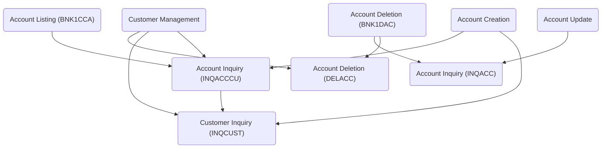

The repo cics-banking-sample-application-cbsa-IBM-Demo simulates a bank's operations from the perspective of a Bank Teller. It serves as a teaching aid, a conversation piece for application development lifecycle discussions, a testing tool for CICS interactions, and a foundation for application modernization conversations.

&nbsp;

# Bank Backend

## Top Level Components

### Account Update

Account Update (BNK1UAC) is a program that manages the process of updating account information, including user interactions, data validation, and coordination with other programs to update the database.

- <SwmLink doc-title="Account Update - Handling User Account Operations (BNK1UAC)">[Account Update - Handling User Account Operations (BNK1UAC)](/.swm/account-update-handling-user-account-operations-bnk1uac.7mg2gu0j.sw.md)</SwmLink>
- <SwmLink doc-title="Updating Account Information (UPDACC)">[Updating Account Information (UPDACC)](/.swm/updating-account-information-updacc.doj7id5a.sw.md)</SwmLink>

### Customer Management

Customer Management refers to the processes and functionalities involved in handling customer data and interactions. This includes creating, updating, and deleting customer records, as well as managing customer-related information such as account details and transaction history. The application uses COBOL programs like DELCUS to manage these operations, ensuring data integrity and efficient processing within the banking system.

- <SwmLink doc-title="Customer Management - Handling User Interactions (BNK1DCS)">[Customer Management - Handling User Interactions (BNK1DCS)](/.swm/customer-management-handling-user-interactions-bnk1dcs.fadaayi2.sw.md)</SwmLink>
- <SwmLink doc-title="Updating Customer Records (UPDCUST)">[Updating Customer Records (UPDCUST)](/.swm/updating-customer-records-updcust.hj5zy3az.sw.md)</SwmLink>
- <SwmLink doc-title="Deleting Customer (DELCUS)">[Deleting Customer (DELCUS)](/.swm/deleting-customer-delcus.h9yj11pz.sw.md)</SwmLink>

### Account Creation

Account Creation (BNK1CAC) is a program responsible for creating new bank accounts. It verifies the input data and, upon successful validation, links to the CREACC program to add the new account to the Account datastore. The process involves validating customer information, generating a new account number, updating the ACCOUNT datastore on DB2, and writing a record to the PROCTRAN datastore. If any step fails, the process ensures that the Named Counter is decremented and dequeued to maintain data integrity.

- <SwmLink doc-title="Creating New Customer Accounts (CREACC)">[Creating New Customer Accounts (CREACC)](/.swm/creating-new-customer-accounts-creacc.x2tjck6k.sw.md)</SwmLink>
- <SwmLink doc-title="Account Creation - Handling Key Events and User Inputs (BNK1CAC)">[Account Creation - Handling Key Events and User Inputs (BNK1CAC)](/.swm/account-creation-handling-key-events-and-user-inputs-bnk1cac.zgcp63dg.sw.md)</SwmLink>

### Account Listing (BNK1CCA)

Account Listing (BNK1CCA) is a COBOL program that lists accounts belonging to a specified customer number. It retrieves and validates customer data, processes the content, and outputs the account information to the screen. The program handles various user interactions, such as sending maps with data, processing input, and managing errors through CICS commands.

- <SwmLink doc-title="Account Listing (BNK1CCA)">[Account Listing (BNK1CCA)](/.swm/account-listing-bnk1cca.rhkxwxig.sw.md)</SwmLink>

### Account Deletion (BNK1DAC)

Account Deletion (BNK1DAC) is a program that manages the deletion of bank accounts, ensuring proper validation and processing within the CICS Bank Sample Application.

- <SwmLink doc-title="Account Deletion (BNK1DAC)">[Account Deletion (BNK1DAC)](/.swm/account-deletion-bnk1dac.wdwlimpa.sw.md)</SwmLink>

## Other Components

### Customer Creation

Customer Creation refers to the process of creating a new customer in the banking application. This involves taking customer information from the BMS application, performing a credit check using multiple credit agencies asynchronously, and updating the customer datastore if the credit check is successful. The process includes handling various scenarios such as no data returned from credit checks, unsuccessful datastore updates, and ensuring data integrity by managing counters and transaction records.

- <SwmLink doc-title="Creating Customer Records (CRECUST)">[Creating Customer Records (CRECUST)](/.swm/creating-customer-records-crecust.iz66o386.sw.md)</SwmLink>
- <SwmLink doc-title="Customer Creation - Handling User Interactions and Transactions (BNK1CCS)">[Customer Creation - Handling User Interactions and Transactions (BNK1CCS)](/.swm/customer-creation-handling-user-interactions-and-transactions-bnk1ccs.9sbo1nt8.sw.md)</SwmLink>

### Funds Transfer

Funds Transfer is a process that handles the movement of money between accounts, updates account balances, and records the transaction, ensuring data integrity through rollback mechanisms in case of failures.

- <SwmLink doc-title="Handling Account Transfers (XFRFUN)">[Handling Account Transfers (XFRFUN)](/.swm/handling-account-transfers-xfrfun.avmhjtgw.sw.md)</SwmLink>
- <SwmLink doc-title="Funds Transfer - Handling Key Press Events (BNK1TFN)">[Funds Transfer - Handling Key Press Events (BNK1TFN)](/.swm/funds-transfer-handling-key-press-events-bnk1tfn.zabzpuir.sw.md)</SwmLink>

### Customer Inquiry (INQCUST)

Customer Inquiry (INQCUST) is a COBOL program that takes a customer number as input and returns all the customer information for that record to the calling program. If the customer is found, the data is returned; if not, a record with low values is returned. In case of any issues, an appropriate abend is issued.

- <SwmLink doc-title="Customer Inquiry (INQCUST)">[Customer Inquiry (INQCUST)](/.swm/customer-inquiry-inqcust.kzcrsldz.sw.md)</SwmLink>

### Account Inquiry (INQACCCU)

Account Inquiry (INQACCCU) is a program that takes an incoming customer number and determines which accounts it is associated with by accessing the datastore and retrieving the associated account records matching the customer number.

- <SwmLink doc-title="Account Inquiry (INQACCCU)">[Account Inquiry (INQACCCU)](/.swm/account-inquiry-inqacccu.wgrcjjcu.sw.md)</SwmLink>

### Data Initialization (BANKDATA)

Data Initialization (BANKDATA) refers to the batch program responsible for initializing the data used in the bank application. This program populates the CUSTOMER (VSAM) and ACCOUNT (DB2) datastores. It takes input parameters to generate data within specified key ranges and uses these parameters to populate the necessary data structures. The output of this process is the populated VSAM file for CUSTOMER and the DB2 table for ACCOUNT, ensuring that the application has the necessary data to simulate bank operations.

- <SwmLink doc-title="Data Initialization (BANKDATA)">[Data Initialization (BANKDATA)](/.swm/data-initialization-bankdata.fe56cjw8.sw.md)</SwmLink>

### Main Menu (BNKMENU)

The Main Menu (BNKMENU) is the initial program in the CICS Bank Sample Application that displays the main menu to the user. It allows the user to select an option, validates the selected option, and initiates the appropriate transaction based on the user's choice.

- <SwmLink doc-title="Main Menu (BNKMENU)">[Main Menu (BNKMENU)](/.swm/main-menu-bnkmenu.pc3s59wg.sw.md)</SwmLink>

### Account Deletion (DELACC)

Account Deletion (DELACC) refers to the process of removing an account from the datastore. The program takes an incoming account number, accesses the account datastore, retrieves the associated account record matching on the customer number and account type, and then deletes it. If no matching customer number and account type combination is found, it returns an error flag for the visualization layer to process accordingly. Any issues during the process will cause the program to abend, and it is assumed that the incoming customer number is valid.

- <SwmLink doc-title="Account Deletion (DELACC)">[Account Deletion (DELACC)](/.swm/account-deletion-delacc.tbnnomf7.sw.md)</SwmLink>

### Account Inquiry (INQACC)

Account Inquiry (INQACC) refers to a program that takes an incoming account number, accesses the DB2 datastore, and retrieves the associated account record or row matching the account number and account type. If any issues arise during this process, the program will abend.

- <SwmLink doc-title="Account Inquiry (INQACC)">[Account Inquiry (INQACC)](/.swm/account-inquiry-inqacc.455lrigy.sw.md)</SwmLink>

### Programs

Programs are COBOL-based applications designed to handle specific tasks within the banking system, interacting with CICS for efficient transaction processing and data management.

- <SwmLink doc-title="Updating Account Records (DBCRFUN)">[Updating Account Records (DBCRFUN)](/.swm/updating-account-records-dbcrfun.epfk3drn.sw.md)</SwmLink>
- <SwmLink doc-title="Managing Account Control Operations (ACCTCTRL)">[Managing Account Control Operations (ACCTCTRL)](/.swm/managing-account-control-operations-acctctrl.1bunqcme.sw.md)</SwmLink>
- <SwmLink doc-title="Generating Delay and Handling Errors (CRDTAGY5)">[Generating Delay and Handling Errors (CRDTAGY5)](/.swm/generating-delay-and-handling-errors-crdtagy5.l70nfm5e.sw.md)</SwmLink>
- <SwmLink doc-title="Credit Score Processing (CRDTAGY4)">[Credit Score Processing (CRDTAGY4)](/.swm/credit-score-processing-crdtagy4.uae9lzw1.sw.md)</SwmLink>
- <SwmLink doc-title="Calculating Credit Scores (CRDTAGY1)">[Calculating Credit Scores (CRDTAGY1)](/.swm/calculating-credit-scores-crdtagy1.17hckhbh.sw.md)</SwmLink>
- <SwmLink doc-title="Generating and Handling Delays (CRDTAGY3)">[Generating and Handling Delays (CRDTAGY3)](/.swm/generating-and-handling-delays-crdtagy3.nkjurfvd.sw.md)</SwmLink>
- <SwmLink doc-title="Setting and Returning Sort Code (GETSCODE)">[Setting and Returning Sort Code (GETSCODE)](/.swm/setting-and-returning-sort-code-getscode.nn0ra98m.sw.md)</SwmLink>
- <SwmLink doc-title="Setting Company Name (GETCOMPY)">[Setting Company Name (GETCOMPY)](/.swm/setting-company-name-getcompy.5y2fywia.sw.md)</SwmLink>
- <SwmLink doc-title="Credit Score Management (CRDTAGY2)">[Credit Score Management (CRDTAGY2)](/.swm/credit-score-management-crdtagy2.6ahd59zc.sw.md)</SwmLink>
- <SwmLink doc-title="Managing Customer Control Operations (CUSTCTRL)">[Managing Customer Control Operations (CUSTCTRL)](/.swm/managing-customer-control-operations-custctrl.9w1rn3fd.sw.md)</SwmLink>
- <SwmLink doc-title="Writing Abend Records (ABNDPROC)">[Writing Abend Records (ABNDPROC)](/.swm/writing-abend-records-abndproc.svfj4jn5.sw.md)</SwmLink>

&nbsp;

# Web UI

The Web UI refers to the web-based user interface of the application, which includes various static assets, HTML files, and configuration files. It is designed to provide an interactive and user-friendly experience for users interacting with the banking application through a web browser.

- <SwmLink doc-title="Web UI Overview">[Web UI Overview](/.swm/web-ui-overview.enwzc5h5.sw.md)</SwmLink>
- **Datainterfaces**
  - **Proctran**
    - <SwmLink doc-title="PROCTRAN Java Class Definition">[PROCTRAN Java Class Definition](/.swm/proctran-java-class-definition.72rm3wqk.sw.md)</SwmLink>
  - **Customer control**
    - <SwmLink doc-title="CustomerControl Class Definition">[CustomerControl Class Definition](/.swm/customercontrol-class-definition.xhfr2qfw.sw.md)</SwmLink>
  - **Customer**
    - **Classes**
      - <SwmLink doc-title="The CUSTOMER class">[The CUSTOMER class](/.swm/the-customer-class.ievwe.sw.md)</SwmLink>
  - **Crecust**
    - <SwmLink doc-title="CRECUST Class Definition">[CRECUST Class Definition](/.swm/crecust-class-definition.zid0mrkh.sw.md)</SwmLink>
- **Webui**
  - **Account list**
    - <SwmLink doc-title="AccountList Java Class Definition">[AccountList Java Class Definition](/.swm/accountlist-java-class-definition.k9yhrsid.sw.md)</SwmLink>
  - **Account**
    - <SwmLink doc-title="Account Class Definition">[Account Class Definition](/.swm/account-class-definition.4tvvhkp7.sw.md)</SwmLink>
  - **Customer**
    - <SwmLink doc-title="Customer Class Definition">[Customer Class Definition](/.swm/customer-class-definition.si62ex6y.sw.md)</SwmLink>
  - **Customer list**
    - <SwmLink doc-title="CustomerList Class Definition">[CustomerList Class Definition](/.swm/customerlist-class-definition.02yv3woq.sw.md)</SwmLink>
- **Api**
  - **Counter resource**
    - <SwmLink doc-title="CounterResource API Endpoints">[CounterResource API Endpoints](/.swm/counterresource-api-endpoints.bccwzzk1.sw.md)</SwmLink>
  - **Accountjson**
    - <SwmLink doc-title="Account JSON Class Definition">[Account JSON Class Definition](/.swm/account-json-class-definition.jlvnx4mz.sw.md)</SwmLink>
  - **Customer resource**
    - **Flows**
      - <SwmLink doc-title="Retrieving Customer Account Details">[Retrieving Customer Account Details](/.swm/retrieving-customer-account-details.853nqys3.sw.md)</SwmLink>
      - <SwmLink doc-title="Handling Customer Data Retrieval">[Handling Customer Data Retrieval](/.swm/handling-customer-data-retrieval.o3qtk4g1.sw.md)</SwmLink>
      - <SwmLink doc-title="Fetching Customer Data Flow">[Fetching Customer Data Flow](/.swm/fetching-customer-data-flow.wh6bygol.sw.md)</SwmLink>
      - <SwmLink doc-title="Updating Customer Information Flow">[Updating Customer Information Flow](/.swm/updating-customer-information-flow.8azak5p5.sw.md)</SwmLink>
    - **Classes**
      - <SwmLink doc-title="The CustomerResource class">[The CustomerResource class](/.swm/the-customerresource-class.47hzh.sw.md)</SwmLink>
  - **Processed transaction resource**
    - **Flows**
      - <SwmLink doc-title="Transaction Retrieval and Processing Flow">[Transaction Retrieval and Processing Flow](/.swm/transaction-retrieval-and-processing-flow.n2j9qpya.sw.md)</SwmLink>
  - **H bank data access**
    - <SwmLink doc-title="HBankDataAccess Class Definition">[HBankDataAccess Class Definition](/.swm/hbankdataaccess-class-definition.t455jq30.sw.md)</SwmLink>
  - **Accounts resource**
    - **Flows**
      - <SwmLink doc-title="Creating a New Bank Account">[Creating a New Bank Account](/.swm/creating-a-new-bank-account.9s3tq4uu.sw.md)</SwmLink>
      - <SwmLink doc-title="Counting and Filtering Accounts">[Counting and Filtering Accounts](/.swm/counting-and-filtering-accounts.5s8bt3sj.sw.md)</SwmLink>
    - **Classes**
      - <SwmLink doc-title="The AccountsResource class">[The AccountsResource class](/.swm/the-accountsresource-class.qp3r7.sw.md)</SwmLink>
  - **Flows**
    - <SwmLink doc-title="Customer Creation Process">[Customer Creation Process](/.swm/customer-creation-process.kv0gxzck.sw.md)</SwmLink>
    - <SwmLink doc-title="Customer Deletion Flow">[Customer Deletion Flow](/.swm/customer-deletion-flow.uylpjquo.sw.md)</SwmLink>
- **Web**
  - <SwmLink doc-title="Introduction to Web Components">[Introduction to Web Components](/.swm/introduction-to-web-components.w16rfqwx.sw.md)</SwmLink>
  - **Account**
    - **Flows**
      - <SwmLink doc-title="Updating Account Details Flow">[Updating Account Details Flow](/.swm/updating-account-details-flow.z7xq19pr.sw.md)</SwmLink>
      - <SwmLink doc-title="Debit and Credit Account Flow">[Debit and Credit Account Flow](/.swm/debit-and-credit-account-flow.6rh664qe.sw.md)</SwmLink>
  - **Processed transaction**
    - **Flows**
      - <SwmLink doc-title="Account Deletion Flow">[Account Deletion Flow](/.swm/account-deletion-flow.d4i4tu0k.sw.md)</SwmLink>
      - <SwmLink doc-title="Processing Debit and Credit Transactions">[Processing Debit and Credit Transactions](/.swm/processing-debit-and-credit-transactions.s8jhey1n.sw.md)</SwmLink>
      - <SwmLink doc-title="Handling Local Account Transfers">[Handling Local Account Transfers](/.swm/handling-local-account-transfers.snzai12i.sw.md)</SwmLink>
  - **Flows**
    - <SwmLink doc-title="Retrieving and Processing Customer Data by Age">[Retrieving and Processing Customer Data by Age](/.swm/retrieving-and-processing-customer-data-by-age.hlfdny85.sw.md)</SwmLink>
    - <SwmLink doc-title="Retrieving Customer Information by Surname">[Retrieving Customer Information by Surname](/.swm/retrieving-customer-information-by-surname.q2a1eh07.sw.md)</SwmLink>
    - <SwmLink doc-title="Retrieving Customer Data by Town">[Retrieving Customer Data by Town](/.swm/retrieving-customer-data-by-town.mmrj8yip.sw.md)</SwmLink>
- **Build tools**
  - <SwmLink doc-title="Maven Configuration in src/webui">[Maven Configuration in src/webui](/.swm/maven-configuration-in-srcwebui.unngkpj2.sw.md)</SwmLink>
- **Flows**
  - <SwmLink doc-title="Account Deletion Process">[Account Deletion Process](/.swm/account-deletion-process.51bjvnt1.sw.md)</SwmLink>
  - <SwmLink doc-title="Fund Transfer Process">[Fund Transfer Process](/.swm/fund-transfer-process.4bsegpl8.sw.md)</SwmLink>
  - <SwmLink doc-title="Handling External Debit Operation">[Handling External Debit Operation](/.swm/handling-external-debit-operation.wirki0g2.sw.md)</SwmLink>
  - <SwmLink doc-title="Crediting an Account Externally">[Crediting an Account Externally](/.swm/crediting-an-account-externally.6cria37n.sw.md)</SwmLink>
  - <SwmLink doc-title="Creating a New Bank Account Flow">[Creating a New Bank Account Flow](/.swm/creating-a-new-bank-account-flow.wlekr8ht.sw.md)</SwmLink>
  - <SwmLink doc-title="Creating a New Customer Record">[Creating a New Customer Record](/.swm/creating-a-new-customer-record.6or53cuz.sw.md)</SwmLink>
  - <SwmLink doc-title="Deleting a Customer Record Flow">[Deleting a Customer Record Flow](/.swm/deleting-a-customer-record-flow.d4vqg69g.sw.md)</SwmLink>

&nbsp;

# Bank Frontend

The Bank Frontend is a user interface built using Carbon React UI that allows users to interact with the banking application. It includes various pages such as Home, Customer Details, Account Creation, and Admin, providing functionalities like making payments, creating new customers and accounts, viewing and updating customer and account details, and deleting customers and accounts. The frontend is designed to simulate the operations of a bank from the perspective of a Bank Teller, offering a comprehensive and interactive experience.

- <SwmLink doc-title="Bank Frontend Overview">[Bank Frontend Overview](/.swm/bank-frontend-overview.pqizkbxh.sw.md)</SwmLink>
- **Service worker**
  - <SwmLink doc-title="Service Worker Setup Script">[Service Worker Setup Script](/.swm/service-worker-setup-script.hxuk84xm.sw.md)</SwmLink>
- **Content**
  - **Customer details page**
    - **Customer details page**
      - <SwmLink doc-title="Customer Details Page Component">[Customer Details Page Component](/.swm/customer-details-page-component.vujbwvdn.sw.md)</SwmLink>
  - **Account creation page**
    - <SwmLink doc-title="Basic Concepts of Account Creation Page">[Basic Concepts of Account Creation Page](/.swm/basic-concepts-of-account-creation-page.tp8rqbh0.sw.md)</SwmLink>
    - **Account creation page**
      - <SwmLink doc-title="Account Creation Page UI Component">[Account Creation Page UI Component](/.swm/account-creation-page-ui-component.yeg9kpld.sw.md)</SwmLink>
  - **Admin page**
    - <SwmLink doc-title="Exploring the Admin Page">[Exploring the Admin Page](/.swm/exploring-the-admin-page.daao3jmi.sw.md)</SwmLink>
  - **Customer delete page**
    - **Customer delete page**
      - <SwmLink doc-title="Customer Deletion Page Component">[Customer Deletion Page Component](/.swm/customer-deletion-page-component.2el92ljs.sw.md)</SwmLink>
    - **Customer delete tables**
      - <SwmLink doc-title="Customer Delete Tables Component">[Customer Delete Tables Component](/.swm/customer-delete-tables-component.ua24z840.sw.md)</SwmLink>
  - **Account delete page**
    - <SwmLink doc-title="Basic Concepts of the Account Deletion Page">[Basic Concepts of the Account Deletion Page](/.swm/basic-concepts-of-the-account-deletion-page.vw5ptc1d.sw.md)</SwmLink>
    - **Account delete tables**
      - <SwmLink doc-title="Account Deletion Tables UI Component">[Account Deletion Tables UI Component](/.swm/account-deletion-tables-ui-component.xfsw4x1o.sw.md)</SwmLink>
  - **Customer creation page**
    - <SwmLink doc-title="Getting Started with Customer Creation Interface">[Getting Started with Customer Creation Interface](/.swm/getting-started-with-customer-creation-interface.go5ai4yp.sw.md)</SwmLink>
    - **Customer creation page**
      - <SwmLink doc-title="Customer Creation Page UI Component">[Customer Creation Page UI Component](/.swm/customer-creation-page-ui-component.psj2kw3v.sw.md)</SwmLink>
  - **Account details page**
    - **Account details table**
      - <SwmLink doc-title="Account Details Table Component">[Account Details Table Component](/.swm/account-details-table-component.ndqkqdvc.sw.md)</SwmLink>

&nbsp;

# Payment Interface

The Payment Interface is a component that processes payment transactions, handles validations, integrates with controllers, and provides a user interface for transaction input and feedback.

- <SwmLink doc-title="Payment Interface Overview">[Payment Interface Overview](/.swm/payment-interface-overview.2f75fqqx.sw.md)</SwmLink>
- **Payment interface**
  - <SwmLink doc-title="Payment Interface Spring Boot Application Class">[Payment Interface Spring Boot Application Class](/.swm/payment-interface-spring-boot-application-class.v8i8tx6q.sw.md)</SwmLink>
- **Controllers**
  - **Params controller**
    - <SwmLink doc-title="ParamsController Class Definition">[ParamsController Class Definition](/.swm/paramscontroller-class-definition.i8253wmk.sw.md)</SwmLink>
  - **Web controller**
    - <SwmLink doc-title="WebController and Exception Classes">[WebController and Exception Classes](/.swm/webcontroller-and-exception-classes.5m7bxwwj.sw.md)</SwmLink>
- **Json property naming strategy**
  - <SwmLink doc-title="JsonPropertyNamingStrategy Class Definition">[JsonPropertyNamingStrategy Class Definition](/.swm/jsonpropertynamingstrategy-class-definition.fjz8rb7d.sw.md)</SwmLink>
- **Output format utils**
  - <SwmLink doc-title="OutputFormatUtils Class Definition">[OutputFormatUtils Class Definition](/.swm/outputformatutils-class-definition.48d5zq5c.sw.md)</SwmLink>
- **Jsonclasses**
  - **Origin json**
    - <SwmLink doc-title="OriginJson Class Definition">[OriginJson Class Definition](/.swm/originjson-class-definition.svtgd56x.sw.md)</SwmLink>
  - **Transfer form**
    - <SwmLink doc-title="TransferForm Class Definition">[TransferForm Class Definition](/.swm/transferform-class-definition.s975cjgp.sw.md)</SwmLink>
  - **Payment interface json**
    - <SwmLink doc-title="Payment Interface JSON Class Definition">[Payment Interface JSON Class Definition](/.swm/payment-interface-json-class-definition.58ctpmlp.sw.md)</SwmLink>
  - **Dbcr json**
    - <SwmLink doc-title="DbcrJson Class Definition">[DbcrJson Class Definition](/.swm/dbcrjson-class-definition.dzxsiz6s.sw.md)</SwmLink>
- **Connection info**
  - <SwmLink doc-title="Connection Information Class Definition">[Connection Information Class Definition](/.swm/connection-information-class-definition.w64r5wrj.sw.md)</SwmLink>
- **Build tools**
  - <SwmLink doc-title="Building the Z-OS Connect Payment Interface with Maven">[Building the Z-OS Connect Payment Interface with Maven](/.swm/building-the-z-os-connect-payment-interface-with-maven.ou9lud82.sw.md)</SwmLink>

&nbsp;

# Customer Services Interface

The Customer Services Interface allows users to perform operations such as creating, viewing, updating, and deleting customer and account details through a web-based interface.

- <SwmLink doc-title="Customer Services Interface Overview">[Customer Services Interface Overview](/.swm/customer-services-interface-overview.kme852o6.sw.md)</SwmLink>
- **Connection info**
  - <SwmLink doc-title="ConnectionInfo Class Definition">[ConnectionInfo Class Definition](/.swm/connectioninfo-class-definition.j7nhje01.sw.md)</SwmLink>
- **Controllers**
  - <SwmLink doc-title="Basic Concepts of Controllers in Customer Services Interface">[Basic Concepts of Controllers in Customer Services Interface](/.swm/basic-concepts-of-controllers-in-customer-services-interface.pi683166.sw.md)</SwmLink>
  - **Web controller**
    - <SwmLink doc-title="WebController and Exception Classes for Customer Services Interface">[WebController and Exception Classes for Customer Services Interface](/.swm/webcontroller-and-exception-classes-for-customer-services-interface.hymcrcd8.sw.md)</SwmLink>
- **Jsonclasses**
  - **Updatecustomer**
    - **Update customer form**
      - <SwmLink doc-title="UpdateCustomerForm Java Class Definition">[UpdateCustomerForm Java Class Definition](/.swm/updatecustomerform-java-class-definition.9h6puh3g.sw.md)</SwmLink>
    - **Updcust json**
      - <SwmLink doc-title="UpdcustJson Class Definition">[UpdcustJson Class Definition](/.swm/updcustjson-class-definition.hgy9bd3s.sw.md)</SwmLink>
  - **Deletecustomer**
    - <SwmLink doc-title="Understanding DeleteCustomerJson">[Understanding DeleteCustomerJson](/.swm/understanding-deletecustomerjson.77dlltmd.sw.md)</SwmLink>
  - **Listaccounts**
    - **Account details**
      - <SwmLink doc-title="AccountDetails Java Class Definition">[AccountDetails Java Class Definition](/.swm/accountdetails-java-class-definition.yyfoqm6o.sw.md)</SwmLink>
    - **Inq acccz json**
      - <SwmLink doc-title="InqAccczJson Class Definition">[InqAccczJson Class Definition](/.swm/inqaccczjson-class-definition.rqqamjtu.sw.md)</SwmLink>
  - **Customerenquiry**
    - **Inq cust review date**
      - <SwmLink doc-title="InqCustReviewDate Class Definition">[InqCustReviewDate Class Definition](/.swm/inqcustreviewdate-class-definition.dvz7atox.sw.md)</SwmLink>
  - **Createaccount**
    - **Creacc json**
      - <SwmLink doc-title="CreaccJson Class Definition">[CreaccJson Class Definition](/.swm/creaccjson-class-definition.watygtei.sw.md)</SwmLink>
    - **Create account form**
      - <SwmLink doc-title="CreateAccountForm Java Class Definition">[CreateAccountForm Java Class Definition](/.swm/createaccountform-java-class-definition.lsgur1tb.sw.md)</SwmLink>
  - **Createcustomer**
    - **Crecust json**
      - <SwmLink doc-title="CrecustJson Class Definition">[CrecustJson Class Definition](/.swm/crecustjson-class-definition.iv57mcm0.sw.md)</SwmLink>
    - **Create customer form**
      - <SwmLink doc-title="CreateCustomerForm Java Class Definition">[CreateCustomerForm Java Class Definition](/.swm/createcustomerform-java-class-definition.gjdn428q.sw.md)</SwmLink>
  - **Deleteaccount**
    - <SwmLink doc-title="Getting Started with DeleteAccountJson">[Getting Started with DeleteAccountJson](/.swm/getting-started-with-deleteaccountjson.rahvore2.sw.md)</SwmLink>
    - **Delacc json**
      - <SwmLink doc-title="DelaccJson Class Definition">[DelaccJson Class Definition](/.swm/delaccjson-class-definition.w17b3bry.sw.md)</SwmLink>
  - **Accountenquiry**
    - <SwmLink doc-title="Introduction to AccountEnquiryJson">[Introduction to AccountEnquiryJson](/.swm/introduction-to-accountenquiryjson.p02x7655.sw.md)</SwmLink>
    - **Inqacc json**
      - <SwmLink doc-title="InqaccJson Java Class Definition">[InqaccJson Java Class Definition](/.swm/inqaccjson-java-class-definition.z9wds0hn.sw.md)</SwmLink>
  - **Updateaccount**
    - **Update account form**
      - <SwmLink doc-title="UpdateAccountForm Java Class Definition">[UpdateAccountForm Java Class Definition](/.swm/updateaccountform-java-class-definition.emfbl1hq.sw.md)</SwmLink>
    - **Updacc json**
      - <SwmLink doc-title="UpdaccJson Class Definition">[UpdaccJson Class Definition](/.swm/updaccjson-class-definition.ooqgmn94.sw.md)</SwmLink>
- **Build tools**
  - <SwmLink doc-title="Building the Z-OS Connect Customer Services Interface with Maven">[Building the Z-OS Connect Customer Services Interface with Maven](/.swm/building-the-z-os-connect-customer-services-interface-with-maven.5yc93p5j.sw.md)</SwmLink>

&nbsp;

*This is an auto-generated document by Swimm 🌊 and has not yet been verified by a human*

<SwmMeta version="3.0.0" repo-id="Z2l0aHViJTNBJTNBY2ljcy1iYW5raW5nLXNhbXBsZS1hcHBsaWNhdGlvbi1jYnNhLUlCTS1EZW1vJTNBJTNBU3dpbW0tRGVtbw==" repo-name="cics-banking-sample-application-cbsa-IBM-Demo">Powered by [Swimm](https://app.swimm.io/)</SwmMeta>
