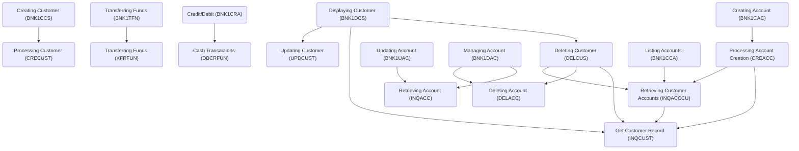

The CICS Bank Sample Application (CBSA) simulates the operation of a bank from the perspective of a Bank Teller. It serves multiple purposes including being a teaching aid, a conversation piece for application development lifecycle discussions, a testing tool for CICS interactions, and a foundation for application modernization conversations.

# Main Components

## Backend

### Deleting Customer (DELCUS)

Deleting Customer (DELCUS) is a COBOL program designed to handle the deletion of a customer and their associated accounts. The process involves retrieving all accounts linked to the customer, deleting each account individually, and recording these deletions. Once all accounts are deleted, the customer record itself is deleted, and this deletion is also recorded. The program ensures data consistency by aborting the operation if any failure occurs during the deletion process, except when an account has already been deleted.

- <SwmLink doc-title="Deleting Customer (DELCUS)">[Deleting Customer (DELCUS)](/.swm/deleting-customer-delcus.z18y5zjh.sw.md)</SwmLink>

### Creating Account (BNK1CAC)

Creating Account (BNK1CAC) involves verifying input data and linking to the `CREACC` program to add the new account to the account datastore.

- <SwmLink doc-title="Creating Account (BNK1CAC)">[Creating Account (BNK1CAC)](/.swm/creating-account-bnk1cac.q5leii0p.sw.md)</SwmLink>

### Managing Account (BNK1DAC)

Managing Account (BNK1DAC) is a COBOL program that handles displaying account information and processing account deletion requests. It interacts with CICS for transaction processing and uses BMS for screen handling. The program validates input data, retrieves account details, and performs account deletion by linking to the DELACC subprogram. It also manages user interactions through various function keys and ensures proper error handling and messaging throughout the process.

- <SwmLink doc-title="Managing Account (BNK1DAC)">[Managing Account (BNK1DAC)](/.swm/managing-account-bnk1dac.81sdaw5l.sw.md)</SwmLink>

### Transferring Funds (BNK1TFN)

Transferring Funds (BNK1TFN) refers to the functionality that allows the transfer of funds between accounts within the same bank. This process involves validating the input data, such as account numbers and transfer amounts, ensuring that the accounts are different and valid, and then performing the transfer operation. The program handles various user interactions, including sending maps, processing data, and handling errors or invalid inputs. It ensures that the transfer is executed correctly and updates the account balances accordingly.

- <SwmLink doc-title="Transferring Funds (BNK1TFN)">[Transferring Funds (BNK1TFN)](/.swm/transferring-funds-bnk1tfn.fdygz3vt.sw.md)</SwmLink>

### Get Customer Record (INQCUST)

INQCUST is a COBOL program that takes a customer number as input and returns a communication area containing all the customer information for that record. If the customer is found, the data is returned; otherwise, a record with low values is returned. In case of any issues, an appropriate abend is issued.

- <SwmLink doc-title="Get Customer Record (INQCUST)">[Get Customer Record (INQCUST)](/.swm/get-customer-record-inqcust.p714ejgj.sw.md)</SwmLink>

### Credit/Debit (BNK1CRA)

Credit/Debit (BNK1CRA) refers to a COBOL program within the CICS Bank Sample Application that handles credit and debit transactions. It processes user inputs, validates transaction amounts, and updates account balances accordingly. The program interacts with CICS for transaction management and uses BMS for screen handling. It includes various sections for data validation, error handling, and communication with other programs to ensure accurate and secure transaction processing.

- <SwmLink doc-title="Credit/Debit (BNK1CRA)">[Credit/Debit (BNK1CRA)](/.swm/creditdebit-bnk1cra.02ryv57h.sw.md)</SwmLink>

### Cash Transactions (DBCRFUN)

Cash Transactions (DBCRFUN) handle the process of depositing or withdrawing cash over the counter. The program takes an account number and amount, accesses the DB2 datastore to retrieve the associated account record, applies the transaction, and returns the updated balance. If the update is successful, a record is written to the PROCTRAN datastore. If the transaction fails, a failure code is returned for the calling routine to handle.

- <SwmLink doc-title="Cash Transactions (DBCRFUN)">[Cash Transactions (DBCRFUN)](/.swm/cash-transactions-dbcrfun.6j6bo0wa.sw.md)</SwmLink>

### Processing Account Creation (CREACC)

Processing Account Creation (CREACC) involves taking account information from the Bank Management System (BMS) application, such as customer number, name, address, and date of birth. The process includes enqueuing a named counter for the account, incrementing the counter to generate a new account number, and updating the account datastore on Db2. If the update is successful, a record is written to the PROCTRAN datastore. If any part of the process fails, the named counter is decremented to its original position, and the counter is dequeued. The final step is to return the new account number if all operations are successful.

- <SwmLink doc-title="Processing Account Creation (CREACC)">[Processing Account Creation (CREACC)](/.swm/processing-account-creation-creacc.84smd8ed.sw.md)</SwmLink>

### Retrieving Account (INQACC)

Retrieving Account (INQACC) involves accessing the DB2 datastore to fetch account details using an account number and account type. The program handles errors by abending if issues occur during the retrieval process.

- <SwmLink doc-title="Retrieving Account (INQACC)">[Retrieving Account (INQACC)](/.swm/retrieving-account-inqacc.290txh2l.sw.md)</SwmLink>

### Transferring Funds (XFRFUN)

Transferring Funds (XFRFUN) refers to the process of moving money from one account to another. This involves taking the sort code and account number of both the source and destination accounts, along with the transfer amount. The program updates the account balances and records the transaction in the PROCTRAN datastore. If any part of the process fails, the transaction is rolled back to maintain data integrity.

- <SwmLink doc-title="Transferring Funds (XFRFUN)">[Transferring Funds (XFRFUN)](/.swm/transferring-funds-xfrfun.rgxgp6un.sw.md)</SwmLink>

### Listing Accounts (BNK1CCA)

Listing Accounts (BNK1CCA) refers to the functionality that lists all accounts associated with a specified customer number. This COBOL program, identified as BNK1CCA, retrieves and displays account information for a customer by interacting with the CICS system. It validates the customer number, retrieves the relevant account data, and handles various user inputs to display the account details or appropriate messages.

- <SwmLink doc-title="Listing Accounts (BNK1CCA)">[Listing Accounts (BNK1CCA)](/.swm/listing-accounts-bnk1cca.ljppt4yp.sw.md)</SwmLink>

### Updating Customer (UPDCUST)

Updating Customer (UPDCUST) refers to the process of modifying customer details in the system. The program receives customer information as input, validates the fields, and updates the relevant records in the VSAM datastore. Only specific fields are allowed to be changed, and the presentation layer ensures data validation. If the update fails, a failure flag is returned to the calling program.

- <SwmLink doc-title="Updating Customer (UPDCUST)">[Updating Customer (UPDCUST)](/.swm/updating-customer-updcust.nhkbxj5y.sw.md)</SwmLink>

### Deleting Account (DELACC)

Deleting Account (DELACC) refers to the process of removing an account from the datastore. The program takes an incoming account number, retrieves the associated account record by matching the customer number and account type, and then deletes it. If no matching record is found, it returns an error flag for the visualization layer to process. Any issues during the process will cause the program to abend. It is assumed that the incoming customer number is valid.

- <SwmLink doc-title="Deleting Account (DELACC)">[Deleting Account (DELACC)](/.swm/deleting-account-delacc.3q2xvv4c.sw.md)</SwmLink>

### Creating Customer (BNK1CCS)

Creating Customer (BNK1CCS) refers to the process of adding a new customer to the banking application. This involves capturing customer details through a user interface, validating the input data, and then storing the customer information in the database. The program handles various user interactions, such as pressing function keys or entering data, and ensures that the data is correctly formatted and validated before creating the customer record. It also manages terminal settings and error handling to ensure a smooth user experience.

- <SwmLink doc-title="Creating Customer (BNK1CCS)">[Creating Customer (BNK1CCS)](/.swm/creating-customer-bnk1ccs.03t5xen0.sw.md)</SwmLink>

### Main Menu (BNKMENU)

The Main Menu (BNKMENU) is the initial program that displays the main menu to the user, validates input, and initiates corresponding transactions based on user selections.

- <SwmLink doc-title="Main Menu (BNKMENU)">[Main Menu (BNKMENU)](/.swm/main-menu-bnkmenu.pyhzmvdi.sw.md)</SwmLink>

### Displaying Customer (BNK1DCS)

Displaying Customer (BNK1DCS) is a COBOL program within the banking application that handles the display, update, and deletion of customer records. It interacts with the user through a BMS map, allowing the user to view customer details, delete a customer record by pressing PF5, or update a customer record by pressing PF10. The program includes various validation checks and processes to ensure data integrity and proper handling of user inputs.

- <SwmLink doc-title="Displaying Customer (BNK1DCS)">[Displaying Customer (BNK1DCS)](/.swm/displaying-customer-bnk1dcs.bz2bwmrm.sw.md)</SwmLink>

### Initializing Data (BANKDATA)

Initializing Data (BANKDATA) involves running a batch program that generates and populates the necessary data for the banking application. This includes creating customer records in a VSAM file and account records in a DB2 table, using specified parameters to control the range and randomness of the generated data.

- <SwmLink doc-title="Initializing Data (BANKDATA)">[Initializing Data (BANKDATA)](/.swm/initializing-data-bankdata.i28ayjso.sw.md)</SwmLink>

### Updating Account (BNK1UAC)

Updating Account (BNK1UAC) refers to the COBOL program responsible for handling account updates within the CICS Bank Sample Application. This program validates incoming data, processes updates to account information, and interacts with other components to ensure data integrity and proper transaction handling. It includes sections for receiving and validating data, updating account details, and handling errors or abnormal terminations. The program ensures that account information is accurately updated and that any issues are properly logged and managed.

- <SwmLink doc-title="Updating Account (BNK1UAC)">[Updating Account (BNK1UAC)](/.swm/updating-account-bnk1uac.12dm8yqr.sw.md)</SwmLink>

### Processing Customer (CRECUST)

Processing Customer (CRECUST) involves taking customer information from a BMS application, determining the appropriate datastore (VSAM or DB2), performing asynchronous credit checks with multiple agencies, and updating the customer and transaction records. If any step fails, the process ensures data integrity by rolling back changes.

- <SwmLink doc-title="Processing Customer (CRECUST)">[Processing Customer (CRECUST)](/.swm/processing-customer-crecust.3kux7zt1.sw.md)</SwmLink>

### Retrieving Customer Accounts (INQACCCU)

Retrieving Customer Accounts (INQACCCU) involves taking an incoming customer number, accessing the datastore, and retrieving the associated account records that match the customer number.

- <SwmLink doc-title="Retrieving Customer Accounts (INQACCCU)">[Retrieving Customer Accounts (INQACCCU)](/.swm/retrieving-customer-accounts-inqacccu.p3rivzh3.sw.md)</SwmLink>

### Programs

- <SwmLink doc-title="Handling Abnormal Terminations (ABNDPROC)">[Handling Abnormal Terminations (ABNDPROC)](/.swm/handling-abnormal-terminations-abndproc.0sgnj7u6.sw.md)</SwmLink>
- <SwmLink doc-title="Updating Account Information (UPDACC)">[Updating Account Information (UPDACC)](/.swm/updating-account-information-updacc.8btkxby7.sw.md)</SwmLink>
- <SwmLink doc-title="Managing Account Control Operations (ACCTCTRL)">[Managing Account Control Operations (ACCTCTRL)](/.swm/managing-account-control-operations-acctctrl.w9vz67hz.sw.md)</SwmLink>
- <SwmLink doc-title="Managing Customer Data (CUSTCTRL)">[Managing Customer Data (CUSTCTRL)](/.swm/managing-customer-data-custctrl.zgtswi6m.sw.md)</SwmLink>
- <SwmLink doc-title="Generating and Storing Credit Scores (CRDTAGY2)">[Generating and Storing Credit Scores (CRDTAGY2)](/.swm/generating-and-storing-credit-scores-crdtagy2.8pyeejmj.sw.md)</SwmLink>
- <SwmLink doc-title="Generating Credit Score (CRDTAGY3)">[Generating Credit Score (CRDTAGY3)](/.swm/generating-credit-score-crdtagy3.9s5jh4fq.sw.md)</SwmLink>
- <SwmLink doc-title="Setting Sort Code (GETSCODE)">[Setting Sort Code (GETSCODE)](/.swm/setting-sort-code-getscode.u5vqsm4h.sw.md)</SwmLink>
- <SwmLink doc-title="Credit Score Generation and Update (CRDTAGY4)">[Credit Score Generation and Update (CRDTAGY4)](/.swm/credit-score-generation-and-update-crdtagy4.15mtclb5.sw.md)</SwmLink>
- <SwmLink doc-title="Handling Delay and Error Management (CRDTAGY5)">[Handling Delay and Error Management (CRDTAGY5)](/.swm/handling-delay-and-error-management-crdtagy5.avr1fcs9.sw.md)</SwmLink>
- <SwmLink doc-title="Initializing Company Name (GETCOMPY)">[Initializing Company Name (GETCOMPY)](/.swm/initializing-company-name-getcompy.nxozfgsh.sw.md)</SwmLink>
- <SwmLink doc-title="Generating and Storing Credit Scores (CRDTAGY1)">[Generating and Storing Credit Scores (CRDTAGY1)](/.swm/generating-and-storing-credit-scores-crdtagy1.77kospei.sw.md)</SwmLink>

## Bank Frontend

- **Customer details page**
  - <SwmLink doc-title="Customer Details Page in Bank Frontend">[Customer Details Page in Bank Frontend](/.swm/customer-details-page-in-bank-frontend.09e5e7u1.sw.md)</SwmLink>
  - **Customer details page**
    - <SwmLink doc-title="Getting Started with Customer Details Page">[Getting Started with Customer Details Page](/.swm/getting-started-with-customer-details-page.t4tb2xrr.sw.md)</SwmLink>
- **Customer delete page**
  - <SwmLink doc-title="Exploring Customer Deletion Page">[Exploring Customer Deletion Page](/.swm/exploring-customer-deletion-page.sjmxg7c6.sw.md)</SwmLink>
- **Account delete page**
  - <SwmLink doc-title="Exploring the Account Deletion Page">[Exploring the Account Deletion Page](/.swm/exploring-the-account-deletion-page.5wzhhxjy.sw.md)</SwmLink>
- **Account details page**
  - <SwmLink doc-title="Getting Started with Account Details Page">[Getting Started with Account Details Page](/.swm/getting-started-with-account-details-page.9yrt26xi.sw.md)</SwmLink>

## Payment Interface

The Payment Interface is a Spring Boot application that allows trusted companies to process payments and issue refunds directly from customer accounts at CBSA Bank via RESTful API calls to a zOS Connect server, which routes the requests to a CICS region.

- <SwmLink doc-title="Payment Interface Overview">[Payment Interface Overview](/.swm/payment-interface-overview.kiupbvyq.sw.md)</SwmLink>
- **Jsonclasses**
  - <SwmLink doc-title="Overview of Jsonclasses in Payment Interface">[Overview of Jsonclasses in Payment Interface](/.swm/overview-of-jsonclasses-in-payment-interface.4ctk97hz.sw.md)</SwmLink>
- **Build tools**
  - <SwmLink doc-title="Building the Payment Interface with Maven">[Building the Payment Interface with Maven](/.swm/building-the-payment-interface-with-maven.qxj892cy.sw.md)</SwmLink>

## Web UI

Web UI refers to the web interface component of the CBSA, built using WebSphere Liberty Profile, and includes all necessary web content and assets.

- <SwmLink doc-title="Web UI Overview">[Web UI Overview](/.swm/web-ui-overview.q72j19wy.sw.md)</SwmLink>
- **Datainterfaces**
  - **Proctran**
    - <SwmLink doc-title="Getting Started with Processed Transaction Data Interface">[Getting Started with Processed Transaction Data Interface](/.swm/getting-started-with-processed-transaction-data-interface.scv6qnbl.sw.md)</SwmLink>
  - **Customer control**
    - <SwmLink doc-title="Exploring Customer Management">[Exploring Customer Management](/.swm/exploring-customer-management.xb7lmzrr.sw.md)</SwmLink>
  - **Customer**
    - <SwmLink doc-title="Customer Data Management Overview">[Customer Data Management Overview](/.swm/customer-data-management-overview.5mayej1r.sw.md)</SwmLink>
  - **Crecust**
    - <SwmLink doc-title="Overview of Customer Data Interface">[Overview of Customer Data Interface](/.swm/overview-of-customer-data-interface.eah11ku8.sw.md)</SwmLink>
- **Webui**
  - **Account list**
    - <SwmLink doc-title="Getting Started with Account List in WebUI">[Getting Started with Account List in WebUI](/.swm/getting-started-with-account-list-in-webui.p2un3mt8.sw.md)</SwmLink>
  - **Account**
    - <SwmLink doc-title="Overview of Account Class">[Overview of Account Class](/.swm/overview-of-account-class.tmgxkfq4.sw.md)</SwmLink>
  - **Customer**
    - <SwmLink doc-title="Customer Management in Webui">[Customer Management in Webui](/.swm/customer-management-in-webui.z4p7t4sl.sw.md)</SwmLink>
  - **Customer list**
    - <SwmLink doc-title="Customer List Feature Overview">[Customer List Feature Overview](/.swm/customer-list-feature-overview.eyaiassh.sw.md)</SwmLink>
- **Api**
  - **Customer resource**
    - <SwmLink doc-title="Customer Resource in API">[Customer Resource in API](/.swm/customer-resource-in-api.z1ntvza6.sw.md)</SwmLink>
    - **Flows**
      - <SwmLink doc-title="Filtering and Counting Customers">[Filtering and Counting Customers](/.swm/filtering-and-counting-customers.hxaqf680.sw.md)</SwmLink>
      - <SwmLink doc-title="Customer Deletion Process">[Customer Deletion Process](/.swm/customer-deletion-process.zx456qkk.sw.md)</SwmLink>
      - <SwmLink doc-title="Updating Customer Information Flow">[Updating Customer Information Flow](/.swm/updating-customer-information-flow.tgonzh0a.sw.md)</SwmLink>
  - **Processed transaction resource**
    - <SwmLink doc-title="Basic Concepts of Processed Transaction Resource">[Basic Concepts of Processed Transaction Resource](/.swm/basic-concepts-of-processed-transaction-resource.tenmei5j.sw.md)</SwmLink>
  - **Accounts resource**
    - <SwmLink doc-title="Exploring Accounts Resource in API">[Exploring Accounts Resource in API](/.swm/exploring-accounts-resource-in-api.1hpr3z8o.sw.md)</SwmLink>
    - **Classes**
      - <SwmLink doc-title="The AccountsResource class">[The AccountsResource class](/.swm/the-accountsresource-class.lbujy.sw.md)</SwmLink>
  - **Flows**
    - <SwmLink doc-title="Account Deletion Process">[Account Deletion Process](/.swm/account-deletion-process.xorhuk18.sw.md)</SwmLink>
    - <SwmLink doc-title="Handling Debit and Credit Transactions">[Handling Debit and Credit Transactions](/.swm/handling-debit-and-credit-transactions.tq95dfd9.sw.md)</SwmLink>
    - <SwmLink doc-title="Retrieving Customer Account Information">[Retrieving Customer Account Information](/.swm/retrieving-customer-account-information.qiofkr7q.sw.md)</SwmLink>
    - <SwmLink doc-title="Creating a New Bank Account">[Creating a New Bank Account](/.swm/creating-a-new-bank-account.bretzan7.sw.md)</SwmLink>
    - <SwmLink doc-title="Updating Account Details Flow">[Updating Account Details Flow](/.swm/updating-account-details-flow.bkbtl1i9.sw.md)</SwmLink>
    - <SwmLink doc-title="Determining the Number of Accounts">[Determining the Number of Accounts](/.swm/determining-the-number-of-accounts.jcr7jvuv.sw.md)</SwmLink>
    - <SwmLink doc-title="Adding a Customer to the Database">[Adding a Customer to the Database](/.swm/adding-a-customer-to-the-database.1yeacvge.sw.md)</SwmLink>
    - <SwmLink doc-title="Transferring Funds Between Accounts">[Transferring Funds Between Accounts](/.swm/transferring-funds-between-accounts.rcr2hhiv.sw.md)</SwmLink>
    - <SwmLink doc-title="Transaction Data Retrieval and Processing Flow">[Transaction Data Retrieval and Processing Flow](/.swm/transaction-data-retrieval-and-processing-flow.87rgi3zl.sw.md)</SwmLink>
    - <SwmLink doc-title="Deleting a Bank Account Flow">[Deleting a Bank Account Flow](/.swm/deleting-a-bank-account-flow.loluuumi.sw.md)</SwmLink>
    - <SwmLink doc-title="Creating a New Account Flow">[Creating a New Account Flow](/.swm/creating-a-new-account-flow.0gs9m5v8.sw.md)</SwmLink>
    - <SwmLink doc-title="Creating a New Customer Flow">[Creating a New Customer Flow](/.swm/creating-a-new-customer-flow.1a5eyt7l.sw.md)</SwmLink>
    - <SwmLink doc-title="Deleting a Customer Record Flow">[Deleting a Customer Record Flow](/.swm/deleting-a-customer-record-flow.6330y9zf.sw.md)</SwmLink>
    - <SwmLink doc-title="Handling Local Transfer Requests">[Handling Local Transfer Requests](/.swm/handling-local-transfer-requests.ie2kvytq.sw.md)</SwmLink>
- **Web**
  - **Account**
    - <SwmLink doc-title="Exploring the Account Class">[Exploring the Account Class](/.swm/exploring-the-account-class.3qw8i6yg.sw.md)</SwmLink>
  - **Processed transaction**
    - <SwmLink doc-title="Introduction to Processed Transactions">[Introduction to Processed Transactions](/.swm/introduction-to-processed-transactions.y7c7g81x.sw.md)</SwmLink>
- **Build tools**
  - <SwmLink doc-title="Building the WebUI with Maven">[Building the WebUI with Maven](/.swm/building-the-webui-with-maven.03z8ldh7.sw.md)</SwmLink>
- **Flows**
  - <SwmLink doc-title="Handling Debit and Credit Operations">[Handling Debit and Credit Operations](/.swm/handling-debit-and-credit-operations.dpydqi4a.sw.md)</SwmLink>
  - <SwmLink doc-title="Retrieving Account Information Flow">[Retrieving Account Information Flow](/.swm/retrieving-account-information-flow.yiwe7x69.sw.md)</SwmLink>
  - <SwmLink doc-title="Customer Data Retrieval Flow">[Customer Data Retrieval Flow](/.swm/customer-data-retrieval-flow.64geijzg.sw.md)</SwmLink>

## Customer Services Interface

- **Controllers**
  - <SwmLink doc-title="Exploring Customer Services Controllers">[Exploring Customer Services Controllers](/.swm/exploring-customer-services-controllers.fgvjk81r.sw.md)</SwmLink>
- **Jsonclasses**
  - **Updatecustomer**
    - <SwmLink doc-title="Basic Concepts of UpdateCustomerJson">[Basic Concepts of UpdateCustomerJson](/.swm/basic-concepts-of-updatecustomerjson.31a0j2mx.sw.md)</SwmLink>
  - **Listaccounts**
    - <SwmLink doc-title="Introduction to ListAccJson">[Introduction to ListAccJson](/.swm/introduction-to-listaccjson.4yxvmtzb.sw.md)</SwmLink>
  - **Createaccount**
    - <SwmLink doc-title="Introduction to CreateAccountJson">[Introduction to CreateAccountJson](/.swm/introduction-to-createaccountjson.tgdjcpm2.sw.md)</SwmLink>
  - **Customerenquiry**
    - <SwmLink doc-title="CustomerEnquiryJson Overview">[CustomerEnquiryJson Overview](/.swm/customerenquiryjson-overview.fs19wny0.sw.md)</SwmLink>
  - **Deleteaccount**
    - <SwmLink doc-title="Exploring DeleteAccountJson">[Exploring DeleteAccountJson](/.swm/exploring-deleteaccountjson.oljcgd01.sw.md)</SwmLink>
  - **Createcustomer**
    - <SwmLink doc-title="Introduction to CreateCustomerJson">[Introduction to CreateCustomerJson](/.swm/introduction-to-createcustomerjson.bwgb2gy8.sw.md)</SwmLink>
  - **Updateaccount**
    - <SwmLink doc-title="Overview of UpdateAccountJson">[Overview of UpdateAccountJson](/.swm/overview-of-updateaccountjson.oog2lib2.sw.md)</SwmLink>
  - **Accountenquiry**
    - <SwmLink doc-title="Introduction to Account Enquiry">[Introduction to Account Enquiry](/.swm/introduction-to-account-enquiry.uvh47flv.sw.md)</SwmLink>
- **Build tools**
  - <SwmLink doc-title="Building the Z-OS Connect Customer Services Interface with Maven">[Building the Z-OS Connect Customer Services Interface with Maven](/.swm/building-the-z-os-connect-customer-services-interface-with-maven.q1hyuumr.sw.md)</SwmLink>

&nbsp;

## Cross-component Flows

- <SwmLink doc-title="Creating a customer">[Creating a customer](/.swm/creating-a-customer.b1dp5j7a.sw.md)</SwmLink>
- <SwmLink doc-title="Updating account flow">[Updating account flow](/.swm/updating-account-flow.6bbe0w0g.sw.md)</SwmLink>

*This is an auto-generated document by Swimm 🌊 and has not yet been verified by a human*

<SwmMeta version="3.0.0" repo-id="Z2l0aHViJTNBJTNBY2ljcy1iYW5raW5nLXNhbXBsZS1hcHBsaWNhdGlvbi1jYnNhLUlCTS1EZW1vJTNBJTNBU3dpbW0tRGVtbw==" repo-name="cics-banking-sample-application-cbsa-IBM-Demo">Powered by [Swimm](https://staging.swimm.cloud/)</SwmMeta>
