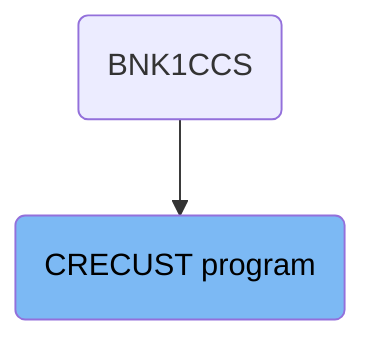
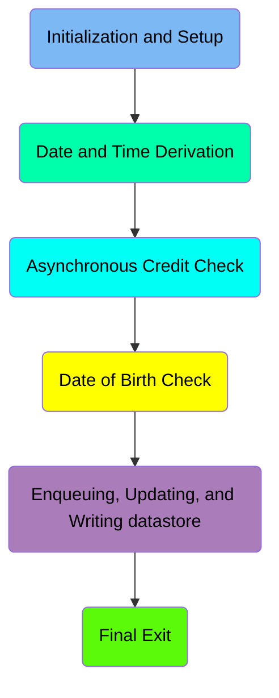
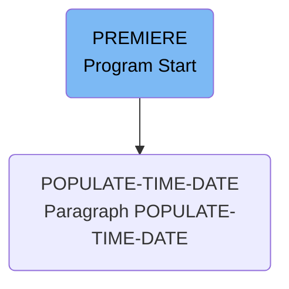
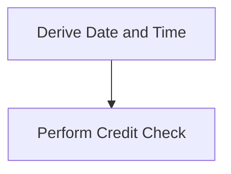
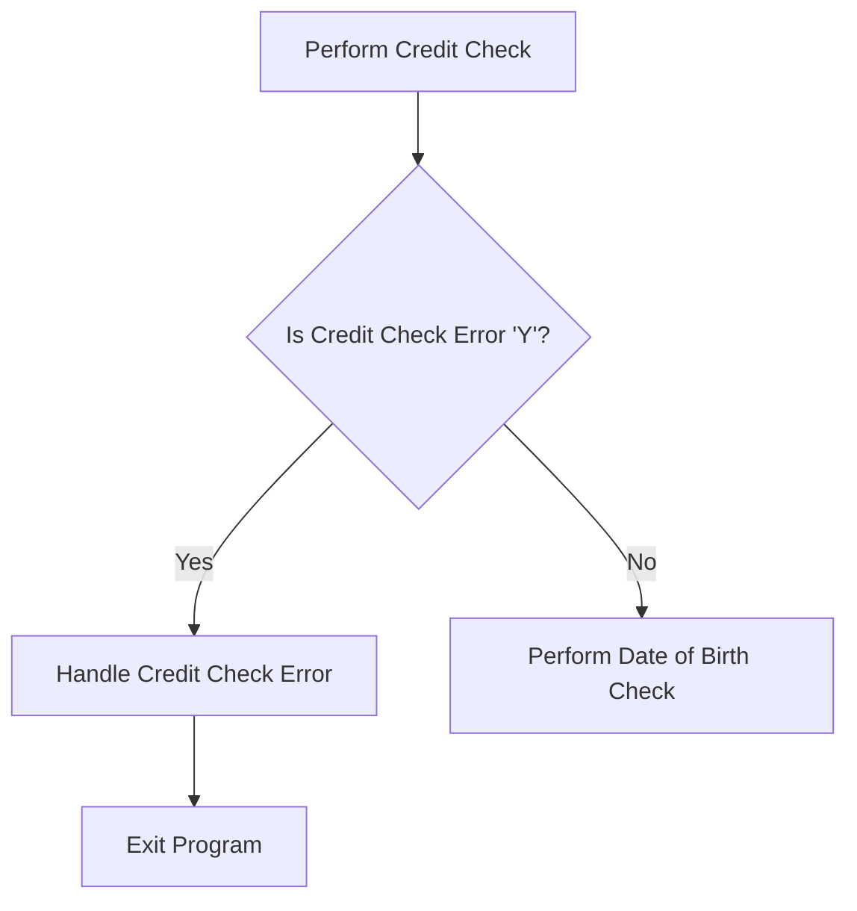
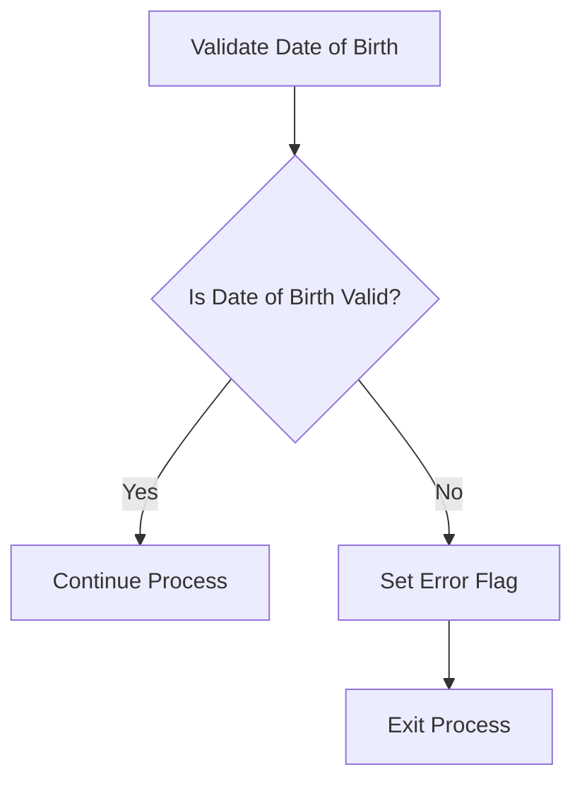
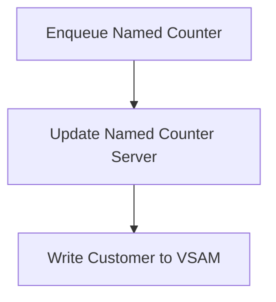
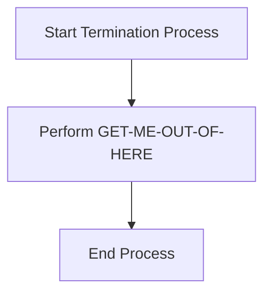

The CRECUST program is responsible for creating a new customer record in the banking system. This process involves several steps including initializing customer creation, deriving the current date and time, performing an asynchronous credit check, validating the date of birth, and finally writing the customer data to the VSAM file. The program ensures data integrity and accurate processing by performing these steps sequentially and handling any potential errors that may arise.

The flow starts with initializing the customer creation process, followed by deriving the current date and time to timestamp the transaction. Next, an asynchronous credit check is performed to ensure the customer's creditworthiness. If there are no errors, the program proceeds to validate the customer's date of birth. Finally, the customer data is written to the VSAM file, and the process is terminated safely.

# Where is this program used?

This program is used once, in a flow starting from `BNK1CCS` as represented in the following diagram:



Here is a high level diagram of the program:



# Initialization and Setup



<SwmSnippet path="/src/base/cobol_src/CRECUST.cbl" line="354">

---

## Initializing Customer Creation

First, the <SwmToken path="src/base/cobol_src/CRECUST.cbl" pos="354:1:1" line-data="       PREMIERE SECTION.">`PREMIERE`</SwmToken> section starts the customer creation process by moving the <SwmToken path="src/base/cobol_src/CRECUST.cbl" pos="357:3:3" line-data="           MOVE SORTCODE TO REQUIRED-SORT-CODE.">`SORTCODE`</SwmToken> to <SwmToken path="src/base/cobol_src/CRECUST.cbl" pos="357:7:11" line-data="           MOVE SORTCODE TO REQUIRED-SORT-CODE.">`REQUIRED-SORT-CODE`</SwmToken>. This sets up the necessary sort code for the customer being created.

```cobol
       PREMIERE SECTION.
       P010.

           MOVE SORTCODE TO REQUIRED-SORT-CODE.
```

---

</SwmSnippet>

<SwmSnippet path="/src/base/cobol_src/CRECUST.cbl" line="364">

---

## Populating Date and Time

Next, the <SwmToken path="src/base/cobol_src/CRECUST.cbl" pos="364:3:7" line-data="           PERFORM POPULATE-TIME-DATE.">`POPULATE-TIME-DATE`</SwmToken> section is performed to derive the current date and time. This ensures that the customer creation process has the correct timestamp.

```cobol
           PERFORM POPULATE-TIME-DATE.

```

---

</SwmSnippet>

<SwmSnippet path="/src/base/cobol_src/CRECUST.cbl" line="423">

---

### Executing <SwmToken path="src/base/cobol_src/CRECUST.cbl" pos="423:1:5" line-data="       POPULATE-TIME-DATE SECTION.">`POPULATE-TIME-DATE`</SwmToken>

The <SwmToken path="src/base/cobol_src/CRECUST.cbl" pos="423:1:5" line-data="       POPULATE-TIME-DATE SECTION.">`POPULATE-TIME-DATE`</SwmToken> section uses CICS commands to get the current time and format it. The <SwmToken path="src/base/cobol_src/CRECUST.cbl" pos="426:5:5" line-data="           EXEC CICS ASKTIME">`ASKTIME`</SwmToken> command retrieves the current time and stores it in <SwmToken path="src/base/cobol_src/CRECUST.cbl" pos="427:3:7" line-data="              ABSTIME(WS-U-TIME)">`WS-U-TIME`</SwmToken>. The <SwmToken path="src/base/cobol_src/CRECUST.cbl" pos="430:5:5" line-data="           EXEC CICS FORMATTIME">`FORMATTIME`</SwmToken> command then formats this time into a readable date and time format, storing the date in <SwmToken path="src/base/cobol_src/CRECUST.cbl" pos="432:3:7" line-data="                     DDMMYYYY(WS-ORIG-DATE)">`WS-ORIG-DATE`</SwmToken> and the time in <SwmToken path="src/base/cobol_src/CRECUST.cbl" pos="433:3:7" line-data="                     TIME(PROC-TRAN-TIME OF PROCTRAN-AREA )">`PROC-TRAN-TIME`</SwmToken>.

```cobol
       POPULATE-TIME-DATE SECTION.
       PTD010.

           EXEC CICS ASKTIME
              ABSTIME(WS-U-TIME)
           END-EXEC.

           EXEC CICS FORMATTIME
                     ABSTIME(WS-U-TIME)
                     DDMMYYYY(WS-ORIG-DATE)
                     TIME(PROC-TRAN-TIME OF PROCTRAN-AREA )
                     DATESEP
           END-EXEC.
```

---

</SwmSnippet>

# Date and Time Derivation



<SwmSnippet path="/src/base/cobol_src/CRECUST.cbl" line="361">

---

## Derive Date and Time

First, the flow derives the current date and time by performing the <SwmToken path="src/base/cobol_src/CRECUST.cbl" pos="364:3:7" line-data="           PERFORM POPULATE-TIME-DATE.">`POPULATE-TIME-DATE`</SwmToken> paragraph. This step is crucial for timestamping transactions and ensuring accurate logging and processing times.

```cobol
      *    Derive the date and time
      *

           PERFORM POPULATE-TIME-DATE.
```

---

</SwmSnippet>

<SwmSnippet path="/src/base/cobol_src/CRECUST.cbl" line="505">

---

## Perform Credit Check

Next, the flow moves to the <SwmToken path="src/base/cobol_src/CRECUST.cbl" pos="505:1:3" line-data="       CREDIT-CHECK SECTION.">`CREDIT-CHECK`</SwmToken> paragraph. This section handles the asynchronous credit check process. It retrieves transaction <SwmToken path="src/base/cobol_src/CRECUST.cbl" pos="513:13:13" line-data="      *    Retrieve the table of transaction IDs to use &amp;">`IDs`</SwmToken>, initiates asynchronous transactions, and stores the results for later use. This ensures that the customer's credit information is accurately and efficiently processed.

```cobol
       CREDIT-CHECK SECTION.
       CC010.
      *
      *    Carry out the Credit Check Asynchronously
      *


      *
      *    Retrieve the table of transaction IDs to use &
      *    initiate each Asynchronous transaction
      *
           MOVE 'CIPCREDCHANN    ' TO WS-CHANNEL-NAME.
           MOVE 0 TO WS-CHILD-ISSUED-CNT.

           COMPUTE WS-PUT-CONT-LEN = LENGTH OF DFHCOMMAREA.

           PERFORM VARYING WS-CC-CNT FROM 1 BY 1
           UNTIL WS-CC-CNT > 5

      *
      *       Use transactions OCR1 - OCR5
```

---

</SwmSnippet>

## Interim Summary

So far, we saw the initialization and setup process, including the derivation of the current date and time and the execution of the credit check. Now, we will focus on the asynchronous credit check process and how the program handles potential errors during this step.

# Asynchronous Credit Check



<SwmSnippet path="/src/base/cobol_src/CRECUST.cbl" line="369">

---

## Performing Credit Check

First, the program performs the credit check by calling the <SwmToken path="src/base/cobol_src/CRECUST.cbl" pos="369:3:5" line-data="           PERFORM CREDIT-CHECK.">`CREDIT-CHECK`</SwmToken> paragraph.

```cobol
           PERFORM CREDIT-CHECK.
```

---

</SwmSnippet>

<SwmSnippet path="/src/base/cobol_src/CRECUST.cbl" line="371">

---

## Checking for Credit Check Error

Next, the program checks if there was an error during the credit check by evaluating if <SwmToken path="src/base/cobol_src/CRECUST.cbl" pos="371:3:9" line-data="           IF WS-CREDIT-CHECK-ERROR = &#39;Y&#39;">`WS-CREDIT-CHECK-ERROR`</SwmToken> is 'Y'.

```cobol
           IF WS-CREDIT-CHECK-ERROR = 'Y'
```

---

</SwmSnippet>

<SwmSnippet path="/src/base/cobol_src/CRECUST.cbl" line="372">

---

## Handling Credit Check Error

If there is an error, the program sets the credit score to 0, formats the review date, sets the success flag to 'N', and assigns a failure code. It then displays error messages and exits the program by calling <SwmToken path="src/base/cobol_src/CRECUST.cbl" pos="397:3:11" line-data="              PERFORM GET-ME-OUT-OF-HERE">`GET-ME-OUT-OF-HERE`</SwmToken>.

```cobol
              MOVE 0 TO COMM-CREDIT-SCORE

              STRING WS-ORIG-DATE-DD DELIMITED BY SIZE,
                     WS-ORIG-DATE-MM DELIMITED BY SIZE,
                     WS-ORIG-DATE-YYYY DELIMITED BY SIZE
                     INTO COMM-CS-REVIEW-DATE
              END-STRING

              MOVE 'N' TO COMM-SUCCESS
              MOVE 'G' TO COMM-FAIL-CODE

              DISPLAY 'WS-CREDIT-CHECK-ERROR = Y, '
                       ' RESP='
                       WS-CICS-RESP ' RESP2=' WS-CICS-RESP2
              DISPLAY '   Exiting CRECUST. COMMAREA='
                       DFHCOMMAREA
```

---

</SwmSnippet>

<SwmSnippet path="/src/base/cobol_src/CRECUST.cbl" line="1271">

---

### Exiting the Program

The <SwmToken path="src/base/cobol_src/CRECUST.cbl" pos="1271:1:9" line-data="       GET-ME-OUT-OF-HERE SECTION.">`GET-ME-OUT-OF-HERE`</SwmToken> section handles the program exit by executing a CICS RETURN command.

```cobol
       GET-ME-OUT-OF-HERE SECTION.
       GMOFH010.
      *
      *    Finish
      *
           EXEC CICS RETURN
           END-EXEC.

       GMOFH999.
           EXIT.
```

---

</SwmSnippet>

<SwmSnippet path="/src/base/cobol_src/CRECUST.cbl" line="1364">

---

## Performing Date of Birth Check

If there is no credit check error, the program proceeds to perform a date of birth check by calling the <SwmToken path="src/base/cobol_src/CRECUST.cbl" pos="1364:1:7" line-data="       DATE-OF-BIRTH-CHECK SECTION.">`DATE-OF-BIRTH-CHECK`</SwmToken> paragraph. This ensures the date of birth is valid and calculates the customer's age.

```cobol
       DATE-OF-BIRTH-CHECK SECTION.
       DOBC010.
      *
      *    Ensure that the Date Of Birth is valid
      *
           IF COMM-BIRTH-YEAR < 1601
              MOVE 'Y' TO WS-DATE-OF-BIRTH-ERROR
              MOVE 'O' TO COMM-FAIL-CODE
              GO TO DOBC999
           END-IF.

           MOVE COMM-BIRTH-YEAR TO CEEDAYS-YEAR.
           MOVE COMM-BIRTH-MONTH TO CEEDAYS-MONTH.
           MOVE COMM-BIRTH-DAY TO CEEDAYS-DAY.

           CALL "CEEDAYS" USING DATE-OF-BIRTH-FOR-CEEDAYS
                                DATE-OF-BIRTH-FORMAT,
                                WS-DATE-OF-BIRTH-LILLIAN,
                                FC.

           IF NOT CEE000 OF FC THEN
```

---

</SwmSnippet>

# Date of Birth Check



<SwmSnippet path="/src/base/cobol_src/CRECUST.cbl" line="392">

---

## Validate Date of Birth

First, the <SwmToken path="src/base/cobol_src/CRECUST.cbl" pos="392:3:9" line-data="           PERFORM DATE-OF-BIRTH-CHECK.">`DATE-OF-BIRTH-CHECK`</SwmToken> paragraph is performed to validate the customer's date of birth.

```cobol
           PERFORM DATE-OF-BIRTH-CHECK.
```

---

</SwmSnippet>

<SwmSnippet path="/src/base/cobol_src/CRECUST.cbl" line="394">

---

## Check Date of Birth Error

Next, we check if <SwmToken path="src/base/cobol_src/CRECUST.cbl" pos="394:3:11" line-data="           IF WS-DATE-OF-BIRTH-ERROR = &#39;Y&#39;">`WS-DATE-OF-BIRTH-ERROR`</SwmToken> is set to 'Y'. If it is, it indicates that there is an error with the date of birth. In this case, we set <SwmToken path="src/base/cobol_src/CRECUST.cbl" pos="396:9:11" line-data="              MOVE &#39;N&#39; TO COMM-SUCCESS">`COMM-SUCCESS`</SwmToken> to 'N' and perform the <SwmToken path="src/base/cobol_src/CRECUST.cbl" pos="397:3:11" line-data="              PERFORM GET-ME-OUT-OF-HERE">`GET-ME-OUT-OF-HERE`</SwmToken> paragraph to exit the process.

```cobol
           IF WS-DATE-OF-BIRTH-ERROR = 'Y'

              MOVE 'N' TO COMM-SUCCESS
              PERFORM GET-ME-OUT-OF-HERE

           END-IF.
```

---

</SwmSnippet>

# Enqueuing, Updating, and Writing datastore



<SwmSnippet path="/src/base/cobol_src/CRECUST.cbl" line="404">

---

## Enqueue Named Counter

First, we perform the <SwmToken path="src/base/cobol_src/CRECUST.cbl" pos="404:3:7" line-data="           PERFORM ENQ-NAMED-COUNTER.">`ENQ-NAMED-COUNTER`</SwmToken> operation to lock the named counter for the customer. This ensures that no other process can update the counter simultaneously, maintaining data integrity.

```cobol
           PERFORM ENQ-NAMED-COUNTER.
```

---

</SwmSnippet>

<SwmSnippet path="/src/base/cobol_src/CRECUST.cbl" line="409">

---

## Update Named Counter Server

Next, we perform the <SwmToken path="src/base/cobol_src/CRECUST.cbl" pos="409:3:5" line-data="           PERFORM UPD-NCS.">`UPD-NCS`</SwmToken> operation to get the next customer number from the named counter. This involves incrementing the counter and marking it as updated.

```cobol
           PERFORM UPD-NCS.
```

---

</SwmSnippet>

<SwmSnippet path="/src/base/cobol_src/CRECUST.cbl" line="488">

---

### Incrementing the Counter

Diving into the <SwmToken path="src/base/cobol_src/CRECUST.cbl" pos="488:1:3" line-data="       UPD-NCS SECTION.">`UPD-NCS`</SwmToken> function, we first increment the customer number counter by 1. Then, we perform the <SwmToken path="src/base/cobol_src/CRECUST.cbl" pos="495:3:9" line-data="           PERFORM GET-LAST-CUSTOMER-VSAM">`GET-LAST-CUSTOMER-VSAM`</SwmToken> operation to retrieve the last customer number and mark the counter as updated.

```cobol
       UPD-NCS SECTION.
       UN010.
      *
      *    Update the Named Counter Server
      *
           MOVE 1 TO NCS-CUST-NO-INC.

           PERFORM GET-LAST-CUSTOMER-VSAM

           MOVE 'Y' TO NCS-UPDATED.

       UN999.
           EXIT.
```

---

</SwmSnippet>

<SwmSnippet path="/src/base/cobol_src/CRECUST.cbl" line="414">

---

## Write Customer to VSAM

Then, we perform the <SwmToken path="src/base/cobol_src/CRECUST.cbl" pos="414:3:7" line-data="           PERFORM WRITE-CUSTOMER-VSAM.">`WRITE-CUSTOMER-VSAM`</SwmToken> operation to write the new customer record to the VSAM file. This involves initializing the output data and populating it with the customer's details.

```cobol
           PERFORM WRITE-CUSTOMER-VSAM.
```

---

</SwmSnippet>

<SwmSnippet path="/src/base/cobol_src/CRECUST.cbl" line="1011">

---

### Writing to VSAM

Going into the <SwmToken path="src/base/cobol_src/CRECUST.cbl" pos="1011:1:5" line-data="       WRITE-CUSTOMER-VSAM SECTION.">`WRITE-CUSTOMER-VSAM`</SwmToken> function, we initialize the output data and populate it with the customer's details such as sort code, customer number, name, address, date of birth, credit score, and review date. We then write this data to the VSAM file and handle any potential errors.

```cobol
       WRITE-CUSTOMER-VSAM SECTION.
       WCV010.
      *
      *    Write a record to the CUSTOMER VSAM file
      *
           INITIALIZE OUTPUT-DATA.

           MOVE 'CUST'              TO CUSTOMER-EYECATCHER.
           MOVE SORTCODE            TO CUSTOMER-SORTCODE.
           MOVE NCS-CUST-NO-VALUE   TO CUSTOMER-NUMBER.
           MOVE COMM-NAME           TO CUSTOMER-NAME.
           MOVE COMM-ADDRESS        TO CUSTOMER-ADDRESS.
           MOVE COMM-DATE-OF-BIRTH  TO CUSTOMER-DATE-OF-BIRTH.
           MOVE COMM-CREDIT-SCORE   TO CUSTOMER-CREDIT-SCORE.
           MOVE COMM-CS-REVIEW-DATE TO CUSTOMER-CS-REVIEW-DATE.

           COMPUTE WS-CUST-REC-LEN = LENGTH OF OUTPUT-DATA.

           EXEC CICS WRITE
                FILE('CUSTOMER')
                FROM(OUTPUT-DATA)
```

---

</SwmSnippet>

# Final Exit

This is the next section of the flow.



<SwmSnippet path="/src/base/cobol_src/CRECUST.cbl" line="417">

---

## Start Termination Process

First, the termination process begins by performing the <SwmToken path="src/base/cobol_src/CRECUST.cbl" pos="417:3:11" line-data="           PERFORM GET-ME-OUT-OF-HERE.">`GET-ME-OUT-OF-HERE`</SwmToken> routine. This routine is responsible for cleaning up and safely exiting the customer record creation process.

```cobol
           PERFORM GET-ME-OUT-OF-HERE.

       P999.
           EXIT.
```

---

</SwmSnippet>

<SwmSnippet path="/src/base/cobol_src/CRECUST.cbl" line="417">

---

## Perform <SwmToken path="src/base/cobol_src/CRECUST.cbl" pos="417:3:11" line-data="           PERFORM GET-ME-OUT-OF-HERE.">`GET-ME-OUT-OF-HERE`</SwmToken>

Next, the <SwmToken path="src/base/cobol_src/CRECUST.cbl" pos="417:3:11" line-data="           PERFORM GET-ME-OUT-OF-HERE.">`GET-ME-OUT-OF-HERE`</SwmToken> routine is executed. This routine ensures that any necessary cleanup operations are performed, such as releasing resources or rolling back transactions, to maintain data integrity and system stability.

```cobol
           PERFORM GET-ME-OUT-OF-HERE.

       P999.
           EXIT.
```

---

</SwmSnippet>

<SwmSnippet path="/src/base/cobol_src/CRECUST.cbl" line="419">

---

## End Process

Finally, the process reaches the <SwmToken path="src/base/cobol_src/CRECUST.cbl" pos="419:1:1" line-data="       P999.">`P999`</SwmToken> label, which signifies the end of the termination process. At this point, the customer record creation process is fully terminated, and control is returned to the calling program or the next logical step in the application.

```cobol
       P999.
           EXIT.
```

---

</SwmSnippet>

&nbsp;

*This is an auto-generated document by Swimm 🌊 and has not yet been verified by a human*

<SwmMeta version="3.0.0" repo-id="Z2l0aHViJTNBJTNBY2ljcy1iYW5raW5nLXNhbXBsZS1hcHBsaWNhdGlvbi1jYnNhLUlCTS1EZW1vJTNBJTNBU3dpbW0tRGVtbw==" repo-name="cics-banking-sample-application-cbsa-IBM-Demo"><sup>Powered by [Swimm](/)</sup></SwmMeta>
