In this document, we will explain the process of handling debit and credit transactions. The process involves determining the type of transaction and then processing it accordingly.

The flow starts by initializing the transaction processing. It then checks if the transaction amount is less than zero. If it is, the transaction is identified as a debit, and the system processes it by calling the debit processing method. If the amount is not less than zero, the transaction is identified as a credit, and the system processes it by calling the credit processing method. Both methods involve sorting out the date and time, opening a database connection, preparing an SQL statement, setting the parameters, and executing the statement.

# Where is this flow used?

This flow is used multiple times in the codebase as represented in the following diagram:

```mermaid
graph TD;
      subgraph srcwebuisrcmainjavacomibmcicscipbanklibertyapijson[src/…/api/json]
3385324c3ca5a170049ee3e70406a7adebf8b4c79f3cd8d6f1431ab6bd7596ac(writeExternal) --> 25f2888d531dfddec6ad5e0bc2e89fea4d91a9f8d0507bbc9be1885452d8e64d(ProcessedTransactionResource.writeInternal)
end

subgraph srcwebuisrcmainjavacomibmcicscipbanklibertyapijson[src/…/api/json]
9496de396fe4bf02ff0ca3312205b53e9fba8611ab39247caff1cbf012a96f7b(debitCreditAccount) --> 25f2888d531dfddec6ad5e0bc2e89fea4d91a9f8d0507bbc9be1885452d8e64d(ProcessedTransactionResource.writeInternal)
end

subgraph srcwebuisrcmainjavacomibmcicscipbanklibertyapijson[src/…/api/json]
99805d9ac870ca29bf2059841ae731f58bf8d9e06f5eabf2633080095a3cd86d(debitAccountInternal) --> 9496de396fe4bf02ff0ca3312205b53e9fba8611ab39247caff1cbf012a96f7b(debitCreditAccount)
end

subgraph srcwebuisrcmainjavacomibmcicscipbanklibertyapijson[src/…/api/json]
8186a1821b6f99efb12133f01dd2ba00d5cf8682fc3b16d1afa195c5a7e24eb9(debitAccountExternal) --> 99805d9ac870ca29bf2059841ae731f58bf8d9e06f5eabf2633080095a3cd86d(debitAccountInternal)
end

subgraph srcwebuisrcmainjavacomibmcicscipbanklibertyapijson[src/…/api/json]
d0a8cc508be9084712089483281287c672b742c434495db73753c60d1c5fc1a0(creditAccountInternal) --> 9496de396fe4bf02ff0ca3312205b53e9fba8611ab39247caff1cbf012a96f7b(debitCreditAccount)
end

subgraph srcwebuisrcmainjavacomibmcicscipbanklibertyapijson[src/…/api/json]
2a070bc0faf6c2d9cbfa20772c3de34afe2560ea96146e5b5bc7cacaddffac73(creditAccountExternal) --> d0a8cc508be9084712089483281287c672b742c434495db73753c60d1c5fc1a0(creditAccountInternal)
end


      classDef mainFlowStyle color:#000000,fill:#7CB9F4
classDef rootsStyle color:#000000,fill:#00FFF4
classDef Style1 color:#000000,fill:#00FFAA
classDef Style2 color:#000000,fill:#FFFF00
classDef Style3 color:#000000,fill:#AA7CB9

%% Swimm:
%% graph TD;
%%       subgraph srcwebuisrcmainjavacomibmcicscipbanklibertyapijson[<SwmPath>[src/…/api/json/](src/webui/src/main/java/com/ibm/cics/cip/bankliberty/api/json/)</SwmPath>]
%% 3385324c3ca5a170049ee3e70406a7adebf8b4c79f3cd8d6f1431ab6bd7596ac(<SwmToken path="src/webui/src/main/java/com/ibm/cics/cip/bankliberty/api/json/ProcessedTransactionResource.java" pos="260:5:5" line-data="	public Response writeExternal(">`writeExternal`</SwmToken>) --> 25f2888d531dfddec6ad5e0bc2e89fea4d91a9f8d0507bbc9be1885452d8e64d(ProcessedTransactionResource.writeInternal)
%% end
%% 
%% subgraph srcwebuisrcmainjavacomibmcicscipbanklibertyapijson[<SwmPath>[src/…/api/json/](src/webui/src/main/java/com/ibm/cics/cip/bankliberty/api/json/)</SwmPath>]
%% 9496de396fe4bf02ff0ca3312205b53e9fba8611ab39247caff1cbf012a96f7b(<SwmToken path="src/webui/src/main/java/com/ibm/cics/cip/bankliberty/api/json/ProcessedTransactionResource.java" pos="259:6:6" line-data="	@Path(&quot;/debitCreditAccount&quot;)">`debitCreditAccount`</SwmToken>) --> 25f2888d531dfddec6ad5e0bc2e89fea4d91a9f8d0507bbc9be1885452d8e64d(ProcessedTransactionResource.writeInternal)
%% end
%% 
%% subgraph srcwebuisrcmainjavacomibmcicscipbanklibertyapijson[<SwmPath>[src/…/api/json/](src/webui/src/main/java/com/ibm/cics/cip/bankliberty/api/json/)</SwmPath>]
%% 99805d9ac870ca29bf2059841ae731f58bf8d9e06f5eabf2633080095a3cd86d(debitAccountInternal) --> 9496de396fe4bf02ff0ca3312205b53e9fba8611ab39247caff1cbf012a96f7b(<SwmToken path="src/webui/src/main/java/com/ibm/cics/cip/bankliberty/api/json/ProcessedTransactionResource.java" pos="259:6:6" line-data="	@Path(&quot;/debitCreditAccount&quot;)">`debitCreditAccount`</SwmToken>)
%% end
%% 
%% subgraph srcwebuisrcmainjavacomibmcicscipbanklibertyapijson[<SwmPath>[src/…/api/json/](src/webui/src/main/java/com/ibm/cics/cip/bankliberty/api/json/)</SwmPath>]
%% 8186a1821b6f99efb12133f01dd2ba00d5cf8682fc3b16d1afa195c5a7e24eb9(debitAccountExternal) --> 99805d9ac870ca29bf2059841ae731f58bf8d9e06f5eabf2633080095a3cd86d(debitAccountInternal)
%% end
%% 
%% subgraph srcwebuisrcmainjavacomibmcicscipbanklibertyapijson[<SwmPath>[src/…/api/json/](src/webui/src/main/java/com/ibm/cics/cip/bankliberty/api/json/)</SwmPath>]
%% d0a8cc508be9084712089483281287c672b742c434495db73753c60d1c5fc1a0(creditAccountInternal) --> 9496de396fe4bf02ff0ca3312205b53e9fba8611ab39247caff1cbf012a96f7b(<SwmToken path="src/webui/src/main/java/com/ibm/cics/cip/bankliberty/api/json/ProcessedTransactionResource.java" pos="259:6:6" line-data="	@Path(&quot;/debitCreditAccount&quot;)">`debitCreditAccount`</SwmToken>)
%% end
%% 
%% subgraph srcwebuisrcmainjavacomibmcicscipbanklibertyapijson[<SwmPath>[src/…/api/json/](src/webui/src/main/java/com/ibm/cics/cip/bankliberty/api/json/)</SwmPath>]
%% 2a070bc0faf6c2d9cbfa20772c3de34afe2560ea96146e5b5bc7cacaddffac73(creditAccountExternal) --> d0a8cc508be9084712089483281287c672b742c434495db73753c60d1c5fc1a0(creditAccountInternal)
%% end
%% 
%% 
%%       classDef mainFlowStyle color:#000000,fill:#7CB9F4
%% classDef rootsStyle color:#000000,fill:#00FFF4
%% classDef Style1 color:#000000,fill:#00FFAA
%% classDef Style2 color:#000000,fill:#FFFF00
%% classDef Style3 color:#000000,fill:#AA7CB9
```



# Flow drill down

```mermaid
graph TD
  subgraph writeInternal
    writeInternal:A["Initialize ProcessedTransactionDB2"] --> writeInternal:B["Check if amount is less than 0"]
    writeInternal:B -->|Yes| writeInternal:C["Call writeDebit"]
    writeInternal:C --> writeInternal:D["Return OK response"]
    writeInternal:B -->|No| writeInternal:E["Call writeCredit"]
    writeInternal:E --> writeInternal:F["Return OK response"]
  end
  subgraph writeDebit
    writeDebit:A["Sort out Date Time Task String"] --> writeDebit:B["Open connection"]
    writeDebit:B --> writeDebit:C["Prepare SQL INSERT statement"] --> writeDebit:D["Set statement parameters for debit transaction"]
    writeDebit:D --> writeDebit:E["Execute statement"]
  end
  subgraph writeCredit
    writeCredit:A["Sort out Date Time Task String"] --> writeCredit:B["Open connection"]
    writeCredit:B --> writeCredit:C["Prepare SQL INSERT statement"] --> writeCredit:D["Set statement parameters for credit transaction"]
    writeCredit:D --> writeCredit:E["Execute statement"]
  end
  
  writeInternal:C --> writeDebit
  writeInternal:E --> writeCredit

%% Swimm:
%% graph TD
%%   subgraph <SwmToken path="src/webui/src/main/java/com/ibm/cics/cip/bankliberty/api/json/ProcessedTransactionResource.java" pos="270:5:5" line-data="	public Response writeInternal(">`writeInternal`</SwmToken>
%%     <SwmToken path="src/webui/src/main/java/com/ibm/cics/cip/bankliberty/api/json/ProcessedTransactionResource.java" pos="270:5:5" line-data="	public Response writeInternal(">`writeInternal`</SwmToken>:A["Initialize ProcessedTransactionDB2"] --> <SwmToken path="src/webui/src/main/java/com/ibm/cics/cip/bankliberty/api/json/ProcessedTransactionResource.java" pos="270:5:5" line-data="	public Response writeInternal(">`writeInternal`</SwmToken>:B["Check if amount is less than 0"]
%%     <SwmToken path="src/webui/src/main/java/com/ibm/cics/cip/bankliberty/api/json/ProcessedTransactionResource.java" pos="270:5:5" line-data="	public Response writeInternal(">`writeInternal`</SwmToken>:B -->|Yes| <SwmToken path="src/webui/src/main/java/com/ibm/cics/cip/bankliberty/api/json/ProcessedTransactionResource.java" pos="270:5:5" line-data="	public Response writeInternal(">`writeInternal`</SwmToken>:C["Call <SwmToken path="src/webui/src/main/java/com/ibm/cics/cip/bankliberty/api/json/ProcessedTransactionResource.java" pos="277:6:6" line-data="			if (myProcessedTransactionDB2.writeDebit(">`writeDebit`</SwmToken>"]
%%     <SwmToken path="src/webui/src/main/java/com/ibm/cics/cip/bankliberty/api/json/ProcessedTransactionResource.java" pos="270:5:5" line-data="	public Response writeInternal(">`writeInternal`</SwmToken>:C --> <SwmToken path="src/webui/src/main/java/com/ibm/cics/cip/bankliberty/api/json/ProcessedTransactionResource.java" pos="270:5:5" line-data="	public Response writeInternal(">`writeInternal`</SwmToken>:D["Return OK response"]
%%     <SwmToken path="src/webui/src/main/java/com/ibm/cics/cip/bankliberty/api/json/ProcessedTransactionResource.java" pos="270:5:5" line-data="	public Response writeInternal(">`writeInternal`</SwmToken>:B -->|No| <SwmToken path="src/webui/src/main/java/com/ibm/cics/cip/bankliberty/api/json/ProcessedTransactionResource.java" pos="270:5:5" line-data="	public Response writeInternal(">`writeInternal`</SwmToken>:E["Call <SwmToken path="src/webui/src/main/java/com/ibm/cics/cip/bankliberty/api/json/ProcessedTransactionResource.java" pos="291:6:6" line-data="			if (myProcessedTransactionDB2.writeCredit(">`writeCredit`</SwmToken>"]
%%     <SwmToken path="src/webui/src/main/java/com/ibm/cics/cip/bankliberty/api/json/ProcessedTransactionResource.java" pos="270:5:5" line-data="	public Response writeInternal(">`writeInternal`</SwmToken>:E --> <SwmToken path="src/webui/src/main/java/com/ibm/cics/cip/bankliberty/api/json/ProcessedTransactionResource.java" pos="270:5:5" line-data="	public Response writeInternal(">`writeInternal`</SwmToken>:F["Return OK response"]
%%   end
%%   subgraph <SwmToken path="src/webui/src/main/java/com/ibm/cics/cip/bankliberty/api/json/ProcessedTransactionResource.java" pos="277:6:6" line-data="			if (myProcessedTransactionDB2.writeDebit(">`writeDebit`</SwmToken>
%%     <SwmToken path="src/webui/src/main/java/com/ibm/cics/cip/bankliberty/api/json/ProcessedTransactionResource.java" pos="277:6:6" line-data="			if (myProcessedTransactionDB2.writeDebit(">`writeDebit`</SwmToken>:A["Sort out Date Time Task String"] --> <SwmToken path="src/webui/src/main/java/com/ibm/cics/cip/bankliberty/api/json/ProcessedTransactionResource.java" pos="277:6:6" line-data="			if (myProcessedTransactionDB2.writeDebit(">`writeDebit`</SwmToken>:B["Open connection"]
%%     <SwmToken path="src/webui/src/main/java/com/ibm/cics/cip/bankliberty/api/json/ProcessedTransactionResource.java" pos="277:6:6" line-data="			if (myProcessedTransactionDB2.writeDebit(">`writeDebit`</SwmToken>:B --> <SwmToken path="src/webui/src/main/java/com/ibm/cics/cip/bankliberty/api/json/ProcessedTransactionResource.java" pos="277:6:6" line-data="			if (myProcessedTransactionDB2.writeDebit(">`writeDebit`</SwmToken>:C["Prepare SQL INSERT statement"] --> <SwmToken path="src/webui/src/main/java/com/ibm/cics/cip/bankliberty/api/json/ProcessedTransactionResource.java" pos="277:6:6" line-data="			if (myProcessedTransactionDB2.writeDebit(">`writeDebit`</SwmToken>:D["Set statement parameters for debit transaction"]
%%     <SwmToken path="src/webui/src/main/java/com/ibm/cics/cip/bankliberty/api/json/ProcessedTransactionResource.java" pos="277:6:6" line-data="			if (myProcessedTransactionDB2.writeDebit(">`writeDebit`</SwmToken>:D --> <SwmToken path="src/webui/src/main/java/com/ibm/cics/cip/bankliberty/api/json/ProcessedTransactionResource.java" pos="277:6:6" line-data="			if (myProcessedTransactionDB2.writeDebit(">`writeDebit`</SwmToken>:E["Execute statement"]
%%   end
%%   subgraph <SwmToken path="src/webui/src/main/java/com/ibm/cics/cip/bankliberty/api/json/ProcessedTransactionResource.java" pos="291:6:6" line-data="			if (myProcessedTransactionDB2.writeCredit(">`writeCredit`</SwmToken>
%%     <SwmToken path="src/webui/src/main/java/com/ibm/cics/cip/bankliberty/api/json/ProcessedTransactionResource.java" pos="291:6:6" line-data="			if (myProcessedTransactionDB2.writeCredit(">`writeCredit`</SwmToken>:A["Sort out Date Time Task String"] --> <SwmToken path="src/webui/src/main/java/com/ibm/cics/cip/bankliberty/api/json/ProcessedTransactionResource.java" pos="291:6:6" line-data="			if (myProcessedTransactionDB2.writeCredit(">`writeCredit`</SwmToken>:B["Open connection"]
%%     <SwmToken path="src/webui/src/main/java/com/ibm/cics/cip/bankliberty/api/json/ProcessedTransactionResource.java" pos="291:6:6" line-data="			if (myProcessedTransactionDB2.writeCredit(">`writeCredit`</SwmToken>:B --> <SwmToken path="src/webui/src/main/java/com/ibm/cics/cip/bankliberty/api/json/ProcessedTransactionResource.java" pos="291:6:6" line-data="			if (myProcessedTransactionDB2.writeCredit(">`writeCredit`</SwmToken>:C["Prepare SQL INSERT statement"] --> <SwmToken path="src/webui/src/main/java/com/ibm/cics/cip/bankliberty/api/json/ProcessedTransactionResource.java" pos="291:6:6" line-data="			if (myProcessedTransactionDB2.writeCredit(">`writeCredit`</SwmToken>:D["Set statement parameters for credit transaction"]
%%     <SwmToken path="src/webui/src/main/java/com/ibm/cics/cip/bankliberty/api/json/ProcessedTransactionResource.java" pos="291:6:6" line-data="			if (myProcessedTransactionDB2.writeCredit(">`writeCredit`</SwmToken>:D --> <SwmToken path="src/webui/src/main/java/com/ibm/cics/cip/bankliberty/api/json/ProcessedTransactionResource.java" pos="291:6:6" line-data="			if (myProcessedTransactionDB2.writeCredit(">`writeCredit`</SwmToken>:E["Execute statement"]
%%   end
%%   
%%   <SwmToken path="src/webui/src/main/java/com/ibm/cics/cip/bankliberty/api/json/ProcessedTransactionResource.java" pos="270:5:5" line-data="	public Response writeInternal(">`writeInternal`</SwmToken>:C --> <SwmToken path="src/webui/src/main/java/com/ibm/cics/cip/bankliberty/api/json/ProcessedTransactionResource.java" pos="277:6:6" line-data="			if (myProcessedTransactionDB2.writeDebit(">`writeDebit`</SwmToken>
%%   <SwmToken path="src/webui/src/main/java/com/ibm/cics/cip/bankliberty/api/json/ProcessedTransactionResource.java" pos="270:5:5" line-data="	public Response writeInternal(">`writeInternal`</SwmToken>:E --> <SwmToken path="src/webui/src/main/java/com/ibm/cics/cip/bankliberty/api/json/ProcessedTransactionResource.java" pos="291:6:6" line-data="			if (myProcessedTransactionDB2.writeCredit(">`writeCredit`</SwmToken>
```



<SwmSnippet path="/src/webui/src/main/java/com/ibm/cics/cip/bankliberty/api/json/ProcessedTransactionResource.java" line="270">

---

## Processing Debit and Credit Transactions

The <SwmToken path="src/webui/src/main/java/com/ibm/cics/cip/bankliberty/api/json/ProcessedTransactionResource.java" pos="270:5:5" line-data="	public Response writeInternal(">`writeInternal`</SwmToken> method is responsible for processing transactions by determining whether the transaction is a debit or a credit and then delegating the task to the appropriate method.

```java
	public Response writeInternal(
			ProcessedTransactionDebitCreditJSON proctranDbCr)
	{
		com.ibm.cics.cip.bankliberty.web.db2.ProcessedTransaction myProcessedTransactionDB2 = new com.ibm.cics.cip.bankliberty.web.db2.ProcessedTransaction();

		if (proctranDbCr.getAmount().compareTo(new BigDecimal(0)) < 0)
		{
			if (myProcessedTransactionDB2.writeDebit(
					proctranDbCr.getAccountNumber(), proctranDbCr.getSortCode(),
					proctranDbCr.getAmount()))
			{
				return Response.ok().build();
			}
			else
			{
				logger.severe("PROCTRAN Insert debit didn't work");
				return Response.serverError().build();
			}
		}
		else
		{
```

---

</SwmSnippet>

<SwmSnippet path="/src/webui/src/main/java/com/ibm/cics/cip/bankliberty/api/json/ProcessedTransactionResource.java" line="275">

---

### Handling Debit Transactions

First, the <SwmToken path="src/webui/src/main/java/com/ibm/cics/cip/bankliberty/api/json/ProcessedTransactionResource.java" pos="270:5:5" line-data="	public Response writeInternal(">`writeInternal`</SwmToken> method checks if the transaction amount is less than zero, indicating a debit transaction. If it is, it calls the <SwmToken path="src/webui/src/main/java/com/ibm/cics/cip/bankliberty/api/json/ProcessedTransactionResource.java" pos="277:6:6" line-data="			if (myProcessedTransactionDB2.writeDebit(">`writeDebit`</SwmToken> method to process the debit transaction.

```java
		if (proctranDbCr.getAmount().compareTo(new BigDecimal(0)) < 0)
		{
			if (myProcessedTransactionDB2.writeDebit(
					proctranDbCr.getAccountNumber(), proctranDbCr.getSortCode(),
					proctranDbCr.getAmount()))
			{
```

---

</SwmSnippet>

<SwmSnippet path="/src/webui/src/main/java/com/ibm/cics/cip/bankliberty/web/db2/ProcessedTransaction.java" line="510">

---

The <SwmToken path="src/webui/src/main/java/com/ibm/cics/cip/bankliberty/web/db2/ProcessedTransaction.java" pos="510:5:5" line-data="	public boolean writeDebit(String accountNumber, String sortcode,">`writeDebit`</SwmToken> method processes a debit transaction by inserting a record into the database. It takes the account number, sort code, and debit amount as inputs and returns a boolean indicating success or failure.

```java
	public boolean writeDebit(String accountNumber, String sortcode,
			BigDecimal amount2)
	{
		logger.entering(this.getClass().getName(), WRITE_DEBIT);

		sortOutDateTimeTaskString();

		openConnection();

		logger.log(Level.FINE, () -> ABOUT_TO_INSERT + SQL_INSERT + ">");
		try (PreparedStatement stmt = conn.prepareStatement(SQL_INSERT);)
		{
			stmt.setString(1, PROCTRAN.PROC_TRAN_VALID);
			stmt.setString(2, sortcode);
			stmt.setString(3,
					String.format("%08d", Integer.parseInt(accountNumber)));
			stmt.setString(4, dateString);
			stmt.setString(5, timeString);
			stmt.setString(6, taskRef);
			stmt.setString(7, PROCTRAN.PROC_TY_DEBIT);
			stmt.setString(8, "INTERNET WTHDRW");
```

---

</SwmSnippet>

<SwmSnippet path="/src/webui/src/main/java/com/ibm/cics/cip/bankliberty/api/json/ProcessedTransactionResource.java" line="291">

---

### Handling Credit Transactions

Next, if the transaction amount is not less than zero, the <SwmToken path="src/webui/src/main/java/com/ibm/cics/cip/bankliberty/api/json/ProcessedTransactionResource.java" pos="270:5:5" line-data="	public Response writeInternal(">`writeInternal`</SwmToken> method assumes it is a credit transaction and calls the <SwmToken path="src/webui/src/main/java/com/ibm/cics/cip/bankliberty/api/json/ProcessedTransactionResource.java" pos="291:6:6" line-data="			if (myProcessedTransactionDB2.writeCredit(">`writeCredit`</SwmToken> method to process the credit transaction.

```java
			if (myProcessedTransactionDB2.writeCredit(
					proctranDbCr.getAccountNumber(), proctranDbCr.getSortCode(),
					proctranDbCr.getAmount()))
			{
				return Response.ok().build();
			}
```

---

</SwmSnippet>

<SwmSnippet path="/src/webui/src/main/java/com/ibm/cics/cip/bankliberty/web/db2/ProcessedTransaction.java" line="545">

---

The <SwmToken path="src/webui/src/main/java/com/ibm/cics/cip/bankliberty/web/db2/ProcessedTransaction.java" pos="545:5:5" line-data="	public boolean writeCredit(String accountNumber, String sortcode,">`writeCredit`</SwmToken> method processes a credit transaction by inserting a record into the database. It takes the account number, sort code, and credit amount as inputs and returns a boolean indicating success or failure.

```java
	public boolean writeCredit(String accountNumber, String sortcode,
			BigDecimal amount2)
	{
		logger.entering(this.getClass().getName(), WRITE_CREDIT, false);
		sortOutDateTimeTaskString();

		openConnection();

		logger.log(Level.FINE, () -> ABOUT_TO_INSERT + SQL_INSERT + ">");
		try (PreparedStatement stmt = conn.prepareStatement(SQL_INSERT);)
		{
			stmt.setString(1, PROCTRAN.PROC_TRAN_VALID);
			stmt.setString(2, sortcode);
			stmt.setString(3,
					String.format("%08d", Integer.parseInt(accountNumber)));
			stmt.setString(4, dateString);
			stmt.setString(5, timeString);
			stmt.setString(6, taskRef);
			stmt.setString(7, PROCTRAN.PROC_TY_CREDIT);
			stmt.setString(8, "INTERNET RECVED");
			stmt.setBigDecimal(9, amount2);
```

---

</SwmSnippet>

&nbsp;

*This is an auto-generated document by Swimm 🌊 and has not yet been verified by a human*

<SwmMeta version="3.0.0" repo-id="Z2l0aHViJTNBJTNBY2ljcy1iYW5raW5nLXNhbXBsZS1hcHBsaWNhdGlvbi1jYnNhLUlCTS1EZW1vJTNBJTNBU3dpbW0tRGVtbw==" repo-name="cics-banking-sample-application-cbsa-IBM-Demo"><sup>Powered by [Swimm](/)</sup></SwmMeta>
