In this document, we will explain the process of retrieving account information based on various filters such as balance, account number, and customer number. The process involves initializing the <SwmToken path="src/webui/src/main/java/com/ibm/cics/cip/bankliberty/webui/data_access/AccountList.java" pos="81:1:1" line-data="		AccountsResource myAccountsResource = new AccountsResource();">`AccountsResource`</SwmToken>, processing the filter to determine the appropriate retrieval method, and fetching the account data.

The flow starts by initializing the <SwmToken path="src/webui/src/main/java/com/ibm/cics/cip/bankliberty/webui/data_access/AccountList.java" pos="81:1:1" line-data="		AccountsResource myAccountsResource = new AccountsResource();">`AccountsResource`</SwmToken>. Then, it processes the filter to determine which method to call for retrieving account information. Depending on the filter, it clears the current list of accounts and calls the appropriate method from <SwmToken path="src/webui/src/main/java/com/ibm/cics/cip/bankliberty/webui/data_access/AccountList.java" pos="81:1:1" line-data="		AccountsResource myAccountsResource = new AccountsResource();">`AccountsResource`</SwmToken> to fetch the account data. The methods handle different types of filters, such as balance, account number, and customer number, and support pagination for efficient data retrieval.

# Flow drill down

```mermaid
graph TD;
      subgraph srcwebuisrcmainjavacomibmcicscipbankliberty["src/webui/src/main/java/com/ibm/cics/cip/bankliberty"]
ac821f430a9f96b4dd5d98762ec5cd0458db600734c152093f997c625a6c232a(doGet) --> 794e13c52f4e067a87b3998ca069abfaaab55aaf982fa884b761de1fd2bed917(howMany)
end

subgraph srcwebuisrcmainjavacomibmcicscipbankliberty["src/webui/src/main/java/com/ibm/cics/cip/bankliberty"]
ac821f430a9f96b4dd5d98762ec5cd0458db600734c152093f997c625a6c232a(doGet) --> 54c76050bc31bae722ccb4eba88977a371def7041a6eaef2a7b9a65d25d3b5e2(getAccountsByCustomerExternal)
end

subgraph srcwebuisrcmainjavacomibmcicscipbankliberty["src/webui/src/main/java/com/ibm/cics/cip/bankliberty"]
ac821f430a9f96b4dd5d98762ec5cd0458db600734c152093f997c625a6c232a(doGet) --> 4f2f0bafd943f550283f3afd1a1767bc07cf86c38a74a3579f8789f97cd47fbb(getAccountsExternal)
end

subgraph srcwebuisrcmainjavacomibmcicscipbankliberty["src/webui/src/main/java/com/ibm/cics/cip/bankliberty"]
ac821f430a9f96b4dd5d98762ec5cd0458db600734c152093f997c625a6c232a(doGet) --> e43313d53c6cce88a6bb3670816a64c497a6fee87272cb391fdc984910ee32a1(getAccountsByBalanceWithOffsetAndLimitExternal)
end

subgraph srcwebuisrcmainjavacomibmcicscipbankliberty["src/webui/src/main/java/com/ibm/cics/cip/bankliberty"]
e43313d53c6cce88a6bb3670816a64c497a6fee87272cb391fdc984910ee32a1(getAccountsByBalanceWithOffsetAndLimitExternal) --> 0a5d1f571b1877e6a39e7db30f58096b297abe3220c2e11f6f5fb4ea449a9b39(getAccountsByBalanceWithOffsetAndLimitInternal)
end

subgraph srcwebuisrcmainjavacomibmcicscipbankliberty["src/webui/src/main/java/com/ibm/cics/cip/bankliberty"]
4f2f0bafd943f550283f3afd1a1767bc07cf86c38a74a3579f8789f97cd47fbb(getAccountsExternal) --> 8c29c8c7270508b4037a5859e90f131ddfde51a2fc89f18d806b01ddcea980f8(getAccountsInternal)
end

subgraph srcwebuisrcmainjavacomibmcicscipbankliberty["src/webui/src/main/java/com/ibm/cics/cip/bankliberty"]
54c76050bc31bae722ccb4eba88977a371def7041a6eaef2a7b9a65d25d3b5e2(getAccountsByCustomerExternal) --> 9f1d4b63259741678a7c0c7ed2019d4a91de568c643875c72c5810e44e5ba0fc(getAccountsByCustomerInternal)
end

subgraph srcwebuisrcmainjavacomibmcicscipbankliberty["src/webui/src/main/java/com/ibm/cics/cip/bankliberty"]
794e13c52f4e067a87b3998ca069abfaaab55aaf982fa884b761de1fd2bed917(howMany) --> 54c76050bc31bae722ccb4eba88977a371def7041a6eaef2a7b9a65d25d3b5e2(getAccountsByCustomerExternal)
end

subgraph srcwebuisrcmainjavacomibmcicscipbankliberty["src/webui/src/main/java/com/ibm/cics/cip/bankliberty"]
794e13c52f4e067a87b3998ca069abfaaab55aaf982fa884b761de1fd2bed917(howMany) --> 4f2f0bafd943f550283f3afd1a1767bc07cf86c38a74a3579f8789f97cd47fbb(getAccountsExternal)
end


      classDef mainFlowStyle color:#000000,fill:#7CB9F4
classDef rootsStyle color:#000000,fill:#00FFF4
classDef Style1 color:#000000,fill:#00FFAA
classDef Style2 color:#000000,fill:#FFFF00
classDef Style3 color:#000000,fill:#AA7CB9
```



<SwmSnippet path="/src/webui/src/main/java/com/ibm/cics/cip/bankliberty/webui/data_access/AccountList.java" line="167">

---

## Handling account retrieval based on different filters

The <SwmToken path="src/webui/src/main/java/com/ibm/cics/cip/bankliberty/webui/data_access/AccountList.java" pos="167:5:5" line-data="	public void doGet(int limit, int offset, String filter) throws IOException">`doGet`</SwmToken> method is responsible for retrieving account information based on different filters such as balance, account number, and customer number. It initializes the <SwmToken path="src/webui/src/main/java/com/ibm/cics/cip/bankliberty/webui/data_access/AccountList.java" pos="170:1:1" line-data="		AccountsResource myAccountsResource = new AccountsResource();">`AccountsResource`</SwmToken> and processes the filter to determine which retrieval method to call. Depending on the filter, it clears the current list of accounts and calls the appropriate method from <SwmToken path="src/webui/src/main/java/com/ibm/cics/cip/bankliberty/webui/data_access/AccountList.java" pos="170:1:1" line-data="		AccountsResource myAccountsResource = new AccountsResource();">`AccountsResource`</SwmToken> to fetch the account data.

```java
	public void doGet(int limit, int offset, String filter) throws IOException
	{

		AccountsResource myAccountsResource = new AccountsResource();

		Response myAccountsResponse = null;
		String myAccountsString = null;
		JSONObject myAccountsJSON = null;

		try
		{

			if (filter.contains(" AND ACCOUNT_AVAILABLE_BALANCE"))
			{
				this.listOfAccounts.clear();
				String operator = filter.substring(31, 32);
				BigDecimal balance = BigDecimal
						.valueOf(Double.parseDouble(filter.substring(34)));

				myAccountsResponse = myAccountsResource
						.getAccountsByBalanceWithOffsetAndLimitExternal(balance,
```

---

</SwmSnippet>

<SwmSnippet path="/src/webui/src/main/java/com/ibm/cics/cip/bankliberty/webui/data_access/AccountList.java" line="75">

---

### Counting accounts based on filters

The <SwmToken path="src/webui/src/main/java/com/ibm/cics/cip/bankliberty/webui/data_access/AccountList.java" pos="75:5:5" line-data="	public int howMany(String filter)">`howMany`</SwmToken> method counts the number of accounts that match the given filter. It uses the <SwmToken path="src/webui/src/main/java/com/ibm/cics/cip/bankliberty/webui/data_access/AccountList.java" pos="81:1:1" line-data="		AccountsResource myAccountsResource = new AccountsResource();">`AccountsResource`</SwmToken> to fetch the account data and updates the count based on the response. This method is called within <SwmToken path="src/webui/src/main/java/com/ibm/cics/cip/bankliberty/webui/data_access/AccountList.java" pos="167:5:5" line-data="	public void doGet(int limit, int offset, String filter) throws IOException">`doGet`</SwmToken> when the offset is zero to provide the total count of accounts matching the filter.

```java
	public int howMany(String filter)
	{

		// AND ACCOUNT_NUMBER = 0000000024
		// AND ACCOUNT_CUSTOMER_NUMBER

		AccountsResource myAccountsResource = new AccountsResource();
		Response myAccountsResponse = null;
		this.count = 0;

		try
		{
			if (filter.contains("AND ACCOUNT_AVAILABLE_BALANCE"))
			{
				// 01234567890123456789012345678901234567890
				// AND ACCOUNT_AVAILABLE_BALANCE <= 33558.0

				String operator = filter.substring(31, 32);
				BigDecimal balance = BigDecimal
						.valueOf(Double.parseDouble(filter.substring(34)));

```

---

</SwmSnippet>

<SwmSnippet path="/src/webui/src/main/java/com/ibm/cics/cip/bankliberty/api/json/AccountsResource.java" line="471">

---

### Retrieving accounts by customer number

The <SwmToken path="src/webui/src/main/java/com/ibm/cics/cip/bankliberty/api/json/AccountsResource.java" pos="474:5:5" line-data="	public Response getAccountsByCustomerExternal(">`getAccountsByCustomerExternal`</SwmToken> method retrieves accounts owned by a specified customer. It calls the internal method <SwmToken path="src/webui/src/main/java/com/ibm/cics/cip/bankliberty/api/json/AccountsResource.java" pos="482:7:7" line-data="		Response myResponse = getAccountsByCustomerInternal(customerNumber);">`getAccountsByCustomerInternal`</SwmToken> to fetch the account data and returns the response.

```java
	@GET
	@Path("/retrieveByCustomerNumber/{customerNumber}")
	@Produces("application/json")
	public Response getAccountsByCustomerExternal(
			@PathParam(JSON_CUSTOMER_NUMBER) Long customerNumber,
			@QueryParam("countOnly") Boolean countOnly)
	{
		/** This will list accounts owned by a specified customer */
		logger.entering(this.getClass().getName(),
				"getAccountsByCustomerExternal(Long customerNumber, Boolean countOnly)");

		Response myResponse = getAccountsByCustomerInternal(customerNumber);
		HBankDataAccess myHBankDataAccess = new HBankDataAccess();
		myHBankDataAccess.terminate();
		logger.exiting(this.getClass().getName(),
				"getAccountsByCustomerExternal(Long customerNumber, Boolean countOnly)",
				myResponse);
		return myResponse;
	}
```

---

</SwmSnippet>

<SwmSnippet path="/src/webui/src/main/java/com/ibm/cics/cip/bankliberty/api/json/AccountsResource.java" line="1342">

---

### Retrieving accounts with pagination

The <SwmToken path="src/webui/src/main/java/com/ibm/cics/cip/bankliberty/api/json/AccountsResource.java" pos="1344:5:5" line-data="	public Response getAccountsExternal(@QueryParam(&quot;limit&quot;) Integer limit,">`getAccountsExternal`</SwmToken> method retrieves a fixed number of accounts starting at a specified offset. It calls the internal method <SwmToken path="src/webui/src/main/java/com/ibm/cics/cip/bankliberty/api/json/AccountsResource.java" pos="1357:7:7" line-data="		Response myResponse = getAccountsInternal(limit, offset, countOnlyReal);">`getAccountsInternal`</SwmToken> to fetch the account data and returns the response.

```java
	@GET
	@Produces("application/json")
	public Response getAccountsExternal(@QueryParam("limit") Integer limit,
			@QueryParam("offset") Integer offset,
			@QueryParam("countOnly") Boolean countOnly)
	{
		// This method returns a fixed number of accounts, up to limit "limit",
		// starting at offset "offset"
		logger.entering(this.getClass().getName(),
				"getAccountsExternal(Integer limit, Integer offset,Boolean countOnly)");
		boolean countOnlyReal = false;
		if (countOnly != null)
		{
			countOnlyReal = countOnly.booleanValue();
		}
		Response myResponse = getAccountsInternal(limit, offset, countOnlyReal);
		HBankDataAccess myHBankDataAccess = new HBankDataAccess();
		myHBankDataAccess.terminate();
		logger.exiting(this.getClass().getName(),
				"getAccountsExternal(Integer limit, Integer offset,Boolean countOnly)",
				myResponse);
```

---

</SwmSnippet>

<SwmSnippet path="/src/webui/src/main/java/com/ibm/cics/cip/bankliberty/api/json/AccountsResource.java" line="1462">

---

### Retrieving accounts by balance with pagination

The <SwmToken path="src/webui/src/main/java/com/ibm/cics/cip/bankliberty/api/json/AccountsResource.java" pos="1465:5:5" line-data="	public Response getAccountsByBalanceWithOffsetAndLimitExternal(">`getAccountsByBalanceWithOffsetAndLimitExternal`</SwmToken> method retrieves accounts with a certain balance, supporting pagination. It calls the internal method <SwmToken path="src/webui/src/main/java/com/ibm/cics/cip/bankliberty/api/json/AccountsResource.java" pos="1481:7:7" line-data="		Response myResponse = getAccountsByBalanceWithOffsetAndLimitInternal(">`getAccountsByBalanceWithOffsetAndLimitInternal`</SwmToken> to fetch the account data and returns the response.

```java
	@GET
	@Path("/balance")
	@Produces("application/json")
	public Response getAccountsByBalanceWithOffsetAndLimitExternal(
			@QueryParam("balance") BigDecimal balance,
			@QueryParam("operator") String operator,
			@QueryParam("offset") Integer offset,
			@QueryParam("limit") Integer limit,
			@QueryParam("countOnly") Boolean countOnly)
	{
		// return only accounts with a certain balance
		logger.entering(this.getClass().getName(),
				"getAccountsByBalanceWithOffsetAndLimitExternal(BigDecimal balance, String operator, Integer offset, Integer limit, Boolean countOnly");
		boolean countOnlyReal = false;
		if (countOnly != null)
		{
			countOnlyReal = countOnly.booleanValue();
		}

		Response myResponse = getAccountsByBalanceWithOffsetAndLimitInternal(
				balance, operator, offset, limit, countOnlyReal);
```

---

</SwmSnippet>

<SwmSnippet path="/src/webui/src/main/java/com/ibm/cics/cip/bankliberty/api/json/AccountsResource.java" line="1492">

---

### Internal method for retrieving accounts by balance

The <SwmToken path="src/webui/src/main/java/com/ibm/cics/cip/bankliberty/api/json/AccountsResource.java" pos="1492:5:5" line-data="	public Response getAccountsByBalanceWithOffsetAndLimitInternal(">`getAccountsByBalanceWithOffsetAndLimitInternal`</SwmToken> method is the internal implementation for retrieving accounts with a certain balance. It handles the logic for filtering accounts based on the balance and pagination parameters, and constructs the response.

```java
	public Response getAccountsByBalanceWithOffsetAndLimitInternal(
			@QueryParam("balance") BigDecimal balance,
			@QueryParam("operator") String operator,
			@QueryParam("offset") Integer offset,
			@QueryParam("limit") Integer limit, boolean countOnly)
	{
		// return only accounts with a certain balance
		logger.entering(this.getClass().getName(),
				GET_ACCOUNTS_BY_BALANCE_WITH_OFFSET_AND_LIMIT_INTERNAL);
		Response myResponse = null;
		boolean lessThan;
		if (!operator.startsWith("<") && !(operator.startsWith(">")))
		{
			JSONObject error = new JSONObject();
			error.put(JSON_ERROR_MSG, "Invalid operator, '" + operator
					+ "' only <= or >= allowed");
			logger.log(Level.WARNING, () -> "Invalid operator, '" + operator
					+ "' only <= or >= allowed");
			logger.exiting(this.getClass().getName(),
					GET_ACCOUNTS_BY_BALANCE_WITH_OFFSET_AND_LIMIT_INTERNAL,
					myResponse);
```

---

</SwmSnippet>

<SwmSnippet path="/src/webui/src/main/java/com/ibm/cics/cip/bankliberty/api/json/AccountsResource.java" line="1367">

---

### Internal method for retrieving accounts

The <SwmToken path="src/webui/src/main/java/com/ibm/cics/cip/bankliberty/api/json/AccountsResource.java" pos="1367:5:5" line-data="	public Response getAccountsInternal(Integer limit, Integer offset,">`getAccountsInternal`</SwmToken> method is the internal implementation for retrieving accounts with pagination. It handles the logic for fetching accounts from the database and constructing the response.

```java
	public Response getAccountsInternal(Integer limit, Integer offset,
			boolean countOnly)
	{
		logger.entering(this.getClass().getName(),
				"getAccountsInternal(Integer limit, Integer offset,boolean countOnly)");
		Response myResponse = null;

		com.ibm.cics.cip.bankliberty.web.db2.Account db2Account = null;
		JSONObject response = new JSONObject();
		JSONArray accounts = null;
		int numberOfAccounts = 0;
		Integer sortCode = this.getSortCode();
		// We want to set a limit to try to avoid OutOfMemory Exceptions.
		// 250,000 seems a bit large
		if (limit == null)
		{
			limit = 250000;
		}
		if (limit == 0)
		{
			limit = 250000;
```

---

</SwmSnippet>

<SwmSnippet path="/src/webui/src/main/java/com/ibm/cics/cip/bankliberty/api/json/AccountsResource.java" line="492">

---

### Internal method for retrieving accounts by customer number

The <SwmToken path="src/webui/src/main/java/com/ibm/cics/cip/bankliberty/api/json/AccountsResource.java" pos="492:5:5" line-data="	public Response getAccountsByCustomerInternal(">`getAccountsByCustomerInternal`</SwmToken> method is the internal implementation for retrieving accounts owned by a specified customer. It handles the logic for fetching accounts from the database and constructing the response.

```java
	public Response getAccountsByCustomerInternal(
			@PathParam(JSON_CUSTOMER_NUMBER) Long customerNumber)
	{
		logger.entering(this.getClass().getName(),
				GET_ACCOUNTS_BY_CUSTOMER_INTERNAL);

		JSONArray accounts = null;
		Response myResponse = null;

		JSONObject response = new JSONObject();
		Integer sortCode = this.getSortCode();
		int numberOfAccounts = 0;

		CustomerResource myCustomer = new CustomerResource();
		Response customerResponse = myCustomer
				.getCustomerInternal(customerNumber);

		if (customerResponse.getStatus() != 200)
		{
			if (customerResponse.getStatus() == 404)
			{
```

---

</SwmSnippet>

&nbsp;

*This is an auto-generated document by Swimm 🌊 and has not yet been verified by a human*

<SwmMeta version="3.0.0" repo-id="Z2l0aHViJTNBJTNBY2ljcy1iYW5raW5nLXNhbXBsZS1hcHBsaWNhdGlvbi1jYnNhLUlCTS1EZW1vJTNBJTNBU3dpbW0tRGVtbw==" repo-name="cics-banking-sample-application-cbsa-IBM-Demo"><sup>Powered by [Swimm](/)</sup></SwmMeta>
