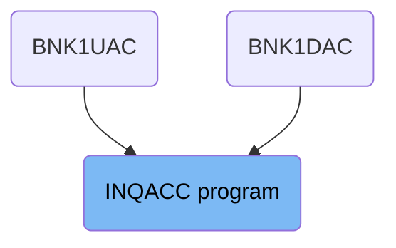
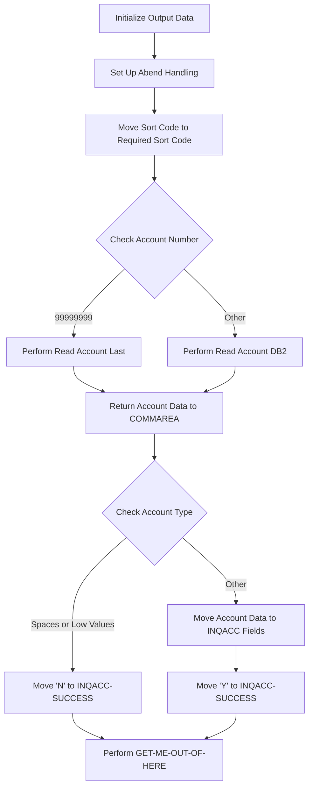

The INQACC program is responsible for inquiring account details in the banking system. It initializes output data, sets up abend handling, processes the account number, retrieves account information from the database, and returns the account data to the COMMAREA. The program ensures that all fields are set to their default values before processing begins and handles any abnormal terminations properly.

The INQACC program starts by initializing the output data and setting up abend handling to manage any errors. It then checks the account number and retrieves the account information from the database. The retrieved data is returned to the COMMAREA, and the program sets a success flag based on the account type. Finally, the program performs the <SwmToken path="src/base/cobol_src/INQACC.cbl" pos="247:3:11" line-data="           PERFORM GET-ME-OUT-OF-HERE.">`GET-ME-OUT-OF-HERE`</SwmToken> operation to return control back to CICS.

# Where is this program used?

This program is used multiple times in the codebase as represented in the following diagram:



Lets' zoom into the flow:



<SwmSnippet path="/src/base/cobol_src/INQACC.cbl" line="206">

---

## Initialize Output Data

First, the program initializes the output data to ensure that all fields are set to their default values before processing begins.

```cobol
           INITIALIZE OUTPUT-DATA.
```

---

</SwmSnippet>

<SwmSnippet path="/src/base/cobol_src/INQACC.cbl" line="210">

---

## Set Up Abend Handling

Next, the program sets up abend handling using the CICS HANDLE ABEND command to ensure that any abnormal terminations are properly managed.

```cobol
           EXEC CICS HANDLE
              ABEND LABEL(ABEND-HANDLING)
           END-EXEC.
```

---

</SwmSnippet>

<SwmSnippet path="/src/base/cobol_src/INQACC.cbl" line="214">

---

## Move Sort Code to Required Sort Code

Then, the program moves the sort code to the required sort code field in the account key structure, preparing it for the database query.

```cobol
           MOVE SORTCODE TO REQUIRED-SORT-CODE OF ACCOUNT-KY.
```

---

</SwmSnippet>

<SwmSnippet path="/src/base/cobol_src/INQACC.cbl" line="218">

---

## Check Account Number

The program checks if the account number is 99999999. If it is, it performs the <SwmToken path="src/base/cobol_src/INQACC.cbl" pos="219:3:7" line-data="             PERFORM READ-ACCOUNT-LAST">`READ-ACCOUNT-LAST`</SwmToken> operation; otherwise, it performs the <SwmToken path="src/base/cobol_src/INQACC.cbl" pos="221:3:7" line-data="             PERFORM READ-ACCOUNT-DB2">`READ-ACCOUNT-DB2`</SwmToken> operation to retrieve the account information from the database.

```cobol
           IF INQACC-ACCNO = 99999999
             PERFORM READ-ACCOUNT-LAST
           ELSE
             PERFORM READ-ACCOUNT-DB2
           END-IF
```

---

</SwmSnippet>

<SwmSnippet path="/src/base/cobol_src/INQACC.cbl" line="229">

---

## Return Account Data to COMMAREA

The program then returns the account data to the COMMAREA. If the account type is spaces or low values, it sets the success flag to 'N'. Otherwise, it moves the account data to the corresponding fields in the COMMAREA and sets the success flag to 'Y'.

```cobol
           IF ACCOUNT-TYPE = SPACES OR LOW-VALUES
              MOVE 'N' TO INQACC-SUCCESS
           ELSE
              MOVE ACCOUNT-EYE-CATCHER       TO INQACC-EYE
              MOVE ACCOUNT-CUST-NO           TO INQACC-CUSTNO
              MOVE ACCOUNT-SORT-CODE         TO INQACC-SCODE
              MOVE ACCOUNT-NUMBER            TO INQACC-ACCNO
              MOVE ACCOUNT-TYPE              TO INQACC-ACC-TYPE
              MOVE ACCOUNT-INTEREST-RATE     TO INQACC-INT-RATE
              MOVE ACCOUNT-OPENED            TO INQACC-OPENED
              MOVE ACCOUNT-OVERDRAFT-LIMIT   TO INQACC-OVERDRAFT
              MOVE ACCOUNT-LAST-STMT-DATE    TO INQACC-LAST-STMT-DT
              MOVE ACCOUNT-NEXT-STMT-DATE    TO INQACC-NEXT-STMT-DT
              MOVE ACCOUNT-AVAILABLE-BALANCE TO INQACC-AVAIL-BAL
              MOVE ACCOUNT-ACTUAL-BALANCE    TO INQACC-ACTUAL-BAL
              MOVE 'Y'                       TO INQACC-SUCCESS
           END-IF.
```

---

</SwmSnippet>

<SwmSnippet path="/src/base/cobol_src/INQACC.cbl" line="247">

---

## Perform <SwmToken path="src/base/cobol_src/INQACC.cbl" pos="247:3:11" line-data="           PERFORM GET-ME-OUT-OF-HERE.">`GET-ME-OUT-OF-HERE`</SwmToken>

Finally, the program performs the <SwmToken path="src/base/cobol_src/INQACC.cbl" pos="247:3:11" line-data="           PERFORM GET-ME-OUT-OF-HERE.">`GET-ME-OUT-OF-HERE`</SwmToken> operation to return control back to CICS.

```cobol
           PERFORM GET-ME-OUT-OF-HERE.
```

---

</SwmSnippet>

&nbsp;

*This is an auto-generated document by Swimm 🌊 and has not yet been verified by a human*

<SwmMeta version="3.0.0" repo-id="Z2l0aHViJTNBJTNBY2ljcy1iYW5raW5nLXNhbXBsZS1hcHBsaWNhdGlvbi1jYnNhLUlCTS1EZW1vJTNBJTNBU3dpbW0tRGVtbw==" repo-name="cics-banking-sample-application-cbsa-IBM-Demo"><sup>Powered by [Swimm](/)</sup></SwmMeta>
